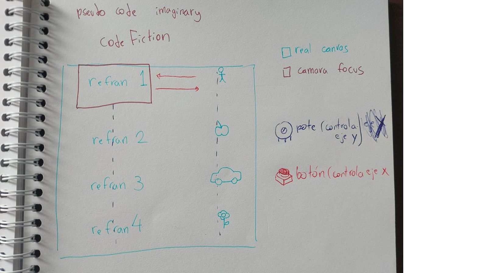

# proyecto-01

## Acerca del proyecto

- Grupo: 01
- Nombre de grupo: maincraf
- Integrantes:
  - Camila Delgado
  - Braulio Figueroa
  - Santiago Gaete
  - Camila Parada

## Presentación textual

* BORRAR AL ÚLTIMO LA INDICACIÓN * Plantea aquí el problema de diseño que abordaste. Menciona el texto de referencia.

Para este proyecto trabajaremos con dispositivos como Arduino Uno R4 Minima, Mini Protoboard de 170 puntos, Display OLED de 128 x 64 pixeles controlable por I2C, potenciómetro y pulsador para progrmar un "navegador de poemas". Empleando el lenguaje C++ y los contenidos vistos en clases crearemos un código que nos permita navegar a través de una selección de refranes, los cuales podrán ser visualizados por el usuario en el Display OLED. Asimismo, el usuario podrá interactuar con el navegador a través de un potenciómetro y un pulsador. Por otra parte, para cada refrán haremos una pequeña animación de 2 frames, la cual será representativa del contenido del refrán correspondiente.

El usuario podrá navegar entre cada refrán y su respectiva animación en un orden lógico que estableceremos posteriormente. El desafío de este proyecto consiste en lograr escribir el código que permita al usuario realizar las acciones que como grupo hemos establecidas como apropiadas para satisfacer la pedida de este primer proyecto del taller. 

## Inputs y outputs

* BORRAR AL ÚLTIMO LA INDICACIÓN * ¿Cuál es la interacción? ¿Qué ofrece la máquina de vuelta?

## Bocetos de planificación

* BORRAR AL ÚLTIMO LA INDICACIÓN * Fotografías y dibujos de maquetas y pruebas


 


## Etapas del código

Segmenta las secciones de tu código y explícalas

- variables extraídas de la librería
```cpp
#include <Adafruit_GFX.h>
#include <Adafruit_SSD1306.h>
#include <Wire.h>
#define screenW 128
#define screenH 64
#define oledReset -1
#define screenAdress 0x3C
Adafruit_SSD1306 display(screenW, screenH, &Wire, oledReset);
```

- variables específicas del código
```cpp
//variable que lleva la cuenta de cuántas veces se ha presionado el botón
int botonComputo = 0;
//pin del botón
int botonPin = 2;
//pin del potenciómtro
int potePin = A0;
```

- listado de refranes

```cpp
char* refranes[] = { "perro ke ladra no muerde",
                     "se le escapan lo' enanito' del bosqe",
                     "kear como xaleca 'e mono",
                     "pasar gato x liebre",
                     "cria cuervo' y te sacaran lo' ojo'"};
```
- bitmaps

```cpp
const unsigned char bitmapPerro[] PROGMEM = {
  	0x00, 0x00, 0x00, 0x00, 0x00, 0x00, 0x00, 0x00, 0x00, 0x00, 0x00, 0x00, 0x00, 0x00, 0x00, 0x00, 
	0x00, 0x00, 0x00, 0x00, 0x00, 0x00, 0x00, 0x00, 0x00, 0x00, 0x00, 0x00, 0x00, 0x00, 0x00, 0x00, 
	0x00, 0x00, 0x00, 0x00, 0x00, 0x00, 0x00, 0x00, 0x00, 0x00, 0x00, 0x00, 0x00, 0x00, 0x00, 0x00, 
	0x00, 0x00, 0x00, 0x00, 0x00, 0x00, 0x00, 0x00, 0x00, 0x00, 0x00, 0x00, 0x00, 0x00, 0x00, 0x00, 
	0x00, 0x00, 0x00, 0x00, 0x00, 0x00, 0x00, 0x00, 0x00, 0x00, 0x00, 0x00, 0x00, 0x00, 0x00, 0x00, 
	0x00, 0x00, 0x00, 0x00, 0x00, 0x00, 0x00, 0x00, 0x00, 0x00, 0x3f, 0x80, 0x00, 0x00, 0x00, 0x00, 
	0x00, 0x00, 0x00, 0x00, 0x00, 0x00, 0x00, 0x00, 0x00, 0x07, 0xff, 0xf8, 0x00, 0x00, 0x00, 0x00, 
	0x00, 0x00, 0x00, 0x00, 0x00, 0x00, 0x00, 0x00, 0x00, 0x1c, 0x00, 0x0e, 0x00, 0x00, 0x00, 0x00, 
	0x00, 0x00, 0x00, 0x00, 0x00, 0x00, 0x00, 0x00, 0x00, 0x70, 0x00, 0x03, 0x80, 0x00, 0x00, 0x00, 
	0x00, 0x00, 0x00, 0x00, 0x00, 0x00, 0x00, 0x00, 0x00, 0xc0, 0x00, 0x00, 0xc0, 0x00, 0x00, 0x00, 
	0x00, 0x00, 0x00, 0x00, 0x00, 0x00, 0x00, 0x00, 0x01, 0x80, 0x00, 0x00, 0x60, 0x00, 0x00, 0x00, 
	0x00, 0x00, 0x00, 0x00, 0x00, 0x00, 0x00, 0x00, 0x01, 0x00, 0x00, 0x00, 0x30, 0x00, 0x00, 0x00, 
	0x00, 0x00, 0x00, 0x00, 0x00, 0x00, 0x00, 0x00, 0x03, 0x08, 0x00, 0x00, 0x10, 0x00, 0x00, 0x00, 
	0x00, 0x00, 0x00, 0x00, 0x00, 0x00, 0x00, 0x00, 0x02, 0x3c, 0xc8, 0x80, 0x18, 0x00, 0x00, 0x00, 
	0x00, 0x00, 0x00, 0x00, 0x00, 0x00, 0x00, 0x00, 0x06, 0x20, 0xc9, 0xc9, 0x88, 0x00, 0x00, 0x00, 
	0x00, 0x00, 0x00, 0x00, 0x00, 0x00, 0x00, 0x00, 0x04, 0x60, 0xc9, 0xc9, 0x88, 0x00, 0x00, 0x00, 
	0x00, 0x00, 0x00, 0x00, 0x00, 0x00, 0x00, 0x00, 0x04, 0x4e, 0xc9, 0x49, 0x88, 0x00, 0x00, 0x00, 
	0x00, 0x00, 0x00, 0x00, 0x00, 0x00, 0x00, 0x00, 0x04, 0x4e, 0x8b, 0x69, 0x88, 0x00, 0x00, 0x00, 
	0x00, 0x00, 0x00, 0x00, 0x00, 0x00, 0x00, 0x00, 0x04, 0x62, 0xdb, 0xe9, 0x08, 0x00, 0x00, 0x00, 
	0x00, 0x00, 0x00, 0x00, 0x00, 0x00, 0x00, 0x00, 0x04, 0x3e, 0xf2, 0x2f, 0x08, 0x00, 0x00, 0x00, 
	0x00, 0x00, 0x00, 0x00, 0x00, 0x00, 0xf8, 0x00, 0x06, 0x3c, 0x62, 0x26, 0x18, 0x00, 0x00, 0x00, 
	0x00, 0x00, 0x00, 0x00, 0x00, 0x01, 0x8c, 0x07, 0xc2, 0x00, 0x00, 0x00, 0x10, 0x00, 0x00, 0x00, 
	0x00, 0x00, 0x00, 0x00, 0x00, 0x06, 0x03, 0x1c, 0x43, 0x00, 0x00, 0x00, 0x30, 0x00, 0x00, 0x00, 
	0x00, 0x00, 0x00, 0x00, 0x00, 0x3c, 0x01, 0xfc, 0x21, 0x80, 0x00, 0x00, 0x60, 0x00, 0x00, 0x00, 
	0x00, 0x00, 0x00, 0x00, 0x00, 0xf8, 0x0c, 0x84, 0x60, 0x60, 0x00, 0x00, 0xc0, 0x00, 0x00, 0x00, 
	0x00, 0x00, 0x00, 0x00, 0x01, 0x80, 0x04, 0x06, 0x60, 0x30, 0x00, 0x03, 0x80, 0x00, 0x00, 0x00, 
	0x00, 0x00, 0x00, 0x00, 0x02, 0x00, 0x40, 0x03, 0xa0, 0x21, 0xe0, 0x3e, 0x00, 0x00, 0x00, 0x00, 
	0x00, 0x00, 0x00, 0x00, 0x06, 0x10, 0x60, 0x00, 0x20, 0x63, 0x7f, 0xf0, 0x00, 0x00, 0x00, 0x00, 
	0x00, 0x00, 0x00, 0x00, 0x04, 0x18, 0x20, 0x00, 0x20, 0xce, 0x00, 0x00, 0x00, 0x00, 0x00, 0x00, 
	0x00, 0x00, 0x00, 0x00, 0x0c, 0x18, 0x00, 0x00, 0x20, 0xf8, 0x00, 0x00, 0x00, 0x00, 0x00, 0x00, 
	0x00, 0x00, 0x00, 0x00, 0x08, 0x10, 0x00, 0x00, 0x40, 0xe0, 0x00, 0x00, 0x00, 0x00, 0x00, 0x00, 
	0x00, 0x00, 0x00, 0x00, 0x08, 0x10, 0x00, 0x3f, 0x80, 0x00, 0x00, 0x00, 0x00, 0x00, 0x00, 0x00, 
	0x00, 0x00, 0x00, 0x00, 0x08, 0x10, 0x00, 0xc0, 0x00, 0x00, 0x00, 0x00, 0x00, 0x00, 0x00, 0x00, 
	0x00, 0x00, 0x00, 0x08, 0x08, 0x30, 0x01, 0x00, 0x00, 0x00, 0x00, 0x00, 0x00, 0x00, 0x00, 0x00, 
	0x00, 0x00, 0x00, 0x1c, 0x04, 0x60, 0x03, 0x00, 0x03, 0x00, 0x00, 0x00, 0x00, 0x00, 0x00, 0x00, 
	0x00, 0x00, 0x00, 0x24, 0x07, 0xc0, 0x02, 0x00, 0x0f, 0x00, 0x00, 0x00, 0x00, 0x00, 0x00, 0x00, 
	0x00, 0x00, 0x00, 0x24, 0x01, 0xc0, 0x02, 0x08, 0x00, 0x00, 0x00, 0x00, 0x00, 0x00, 0x00, 0x00, 
	0x00, 0x00, 0x00, 0x24, 0x00, 0x40, 0x01, 0xfe, 0x00, 0x00, 0x00, 0x00, 0x00, 0x00, 0x00, 0x00, 
	0x00, 0x00, 0x00, 0x24, 0x00, 0x40, 0x00, 0x02, 0x18, 0x00, 0x00, 0x00, 0x00, 0x00, 0x00, 0x00, 
	0x00, 0x00, 0x00, 0x26, 0x00, 0xc0, 0x00, 0x02, 0x07, 0x00, 0x00, 0x00, 0x00, 0x00, 0x00, 0x00, 
	0x00, 0x00, 0x00, 0x22, 0x1f, 0x80, 0x00, 0x06, 0x00, 0x00, 0x00, 0x00, 0x00, 0x00, 0x00, 0x00, 
	0x00, 0x00, 0x00, 0x23, 0x70, 0x00, 0x07, 0xf8, 0x20, 0x00, 0x00, 0x00, 0x00, 0x00, 0x00, 0x00, 
	0x00, 0x00, 0x00, 0x11, 0x80, 0x00, 0x06, 0x00, 0x18, 0x00, 0x00, 0x00, 0x00, 0x00, 0x00, 0x00, 
	0x00, 0x00, 0x00, 0x19, 0x00, 0x00, 0x04, 0x00, 0x0c, 0x00, 0x00, 0x00, 0x00, 0x00, 0x00, 0x00, 
	0x00, 0x00, 0x00, 0x06, 0x00, 0x00, 0x04, 0x00, 0x04, 0x00, 0x00, 0x00, 0x00, 0x00, 0x00, 0x00, 
	0x00, 0x00, 0x00, 0x02, 0x00, 0x00, 0x04, 0x00, 0x00, 0x00, 0x00, 0x00, 0x00, 0x00, 0x00, 0x00, 
	0x00, 0x00, 0x00, 0x02, 0x00, 0x00, 0x04, 0x00, 0x00, 0x00, 0x00, 0x00, 0x00, 0x00, 0x00, 0x00, 
	0x00, 0x00, 0x00, 0x04, 0x00, 0x00, 0x04, 0x00, 0x00, 0x00, 0x00, 0x00, 0x00, 0x00, 0x00, 0x00, 
	0x00, 0x00, 0x00, 0x04, 0x00, 0x00, 0x0c, 0x00, 0x00, 0x00, 0x00, 0x00, 0x00, 0x00, 0x00, 0x00, 
	0x00, 0x00, 0x00, 0x04, 0x00, 0x00, 0x1c, 0x00, 0x00, 0x00, 0x00, 0x00, 0x00, 0x00, 0x00, 0x00, 
	0x00, 0x00, 0x00, 0x04, 0x08, 0x20, 0x1c, 0x00, 0x00, 0x00, 0x00, 0x00, 0x00, 0x00, 0x00, 0x00, 
	0x00, 0x00, 0x00, 0x04, 0x18, 0x23, 0xe4, 0x00, 0x00, 0x00, 0x00, 0x00, 0x00, 0x00, 0x00, 0x00, 
	0x00, 0x00, 0x00, 0x04, 0x3f, 0xe3, 0xc4, 0x00, 0x00, 0x00, 0x00, 0x00, 0x00, 0x00, 0x00, 0x00, 
	0x00, 0x00, 0x00, 0x04, 0x69, 0xa3, 0x44, 0x00, 0x00, 0x00, 0x00, 0x00, 0x00, 0x00, 0x00, 0x00, 
	0x00, 0x00, 0x00, 0x04, 0x48, 0xa1, 0x46, 0x00, 0x00, 0x00, 0x00, 0x00, 0x00, 0x00, 0x00, 0x00, 
	0x00, 0x00, 0x00, 0x04, 0x48, 0xb1, 0x23, 0x00, 0x00, 0x00, 0x00, 0x00, 0x00, 0x00, 0x00, 0x00, 
	0x00, 0x00, 0x00, 0x04, 0x2c, 0xd1, 0xa1, 0x00, 0x00, 0x00, 0x00, 0x00, 0x00, 0x00, 0x00, 0x00, 
	0x00, 0x00, 0x00, 0x07, 0xe7, 0x9a, 0x9e, 0x00, 0x00, 0x00, 0x00, 0x00, 0x00, 0x00, 0x00, 0x00, 
	0x00, 0x00, 0x00, 0x01, 0xc0, 0x0f, 0x00, 0x00, 0x00, 0x00, 0x00, 0x00, 0x00, 0x00, 0x00, 0x00, 
	0x00, 0x00, 0x00, 0x00, 0x00, 0x00, 0x00, 0x00, 0x00, 0x00, 0x00, 0x00, 0x00, 0x00, 0x00, 0x00, 
	0x00, 0x00, 0x00, 0x00, 0x00, 0x00, 0x00, 0x00, 0x00, 0x00, 0x00, 0x00, 0x00, 0x00, 0x00, 0x00, 
	0x00, 0x00, 0x00, 0x00, 0x00, 0x00, 0x00, 0x00, 0x00, 0x00, 0x00, 0x00, 0x00, 0x00, 0x00, 0x00, 
	0x00, 0x00, 0x00, 0x00, 0x00, 0x00, 0x00, 0x00, 0x00, 0x00, 0x00, 0x00, 0x00, 0x00, 0x00, 0x00, 
	0x00, 0x00, 0x00, 0x00, 0x00, 0x00, 0x00, 0x00, 0x00, 0x00, 0x00, 0x00, 0x00, 0x00, 0x00, 0x00
};
const unsigned char bitmapEnano[] PROGMEM = {
  	0x00, 0x00, 0x00, 0x00, 0x00, 0x00, 0x00, 0x00, 0x00, 0x00, 0x00, 0x00, 0x00, 0x00, 0x00, 0x00, 
	0x00, 0x00, 0x00, 0x00, 0x00, 0x00, 0x00, 0x00, 0x00, 0x00, 0x00, 0x00, 0x00, 0x00, 0x00, 0x00, 
	0x00, 0x00, 0x00, 0x00, 0x00, 0x00, 0x00, 0x00, 0x00, 0x00, 0x00, 0x00, 0x00, 0x00, 0x00, 0x00, 
	0x00, 0x00, 0x00, 0x00, 0x00, 0x00, 0x00, 0x00, 0x00, 0x00, 0x00, 0x00, 0x00, 0x00, 0x00, 0x00, 
	0x00, 0x00, 0x00, 0x00, 0x00, 0x00, 0x00, 0x00, 0x00, 0x00, 0x00, 0x00, 0x00, 0x00, 0x00, 0x00, 
	0x00, 0x00, 0x00, 0x00, 0x00, 0x00, 0x00, 0x00, 0x00, 0x00, 0x00, 0xe0, 0x00, 0x00, 0x00, 0x00, 
	0x00, 0x00, 0x00, 0x00, 0x00, 0x00, 0x00, 0x00, 0x00, 0x00, 0x01, 0xe0, 0x1e, 0x00, 0x00, 0x00, 
	0x00, 0x00, 0x00, 0x00, 0x00, 0x00, 0x1e, 0x00, 0x00, 0x00, 0x03, 0x30, 0x3f, 0x00, 0x00, 0x00, 
	0x00, 0x00, 0x00, 0x00, 0x00, 0x00, 0x37, 0x00, 0x00, 0x00, 0x06, 0x18, 0x21, 0x80, 0x00, 0x00, 
	0x00, 0x00, 0x00, 0x00, 0x00, 0x00, 0x11, 0xc0, 0x00, 0x00, 0x0c, 0x08, 0x61, 0x80, 0x00, 0x00, 
	0x00, 0x00, 0x1e, 0x00, 0x00, 0x00, 0x10, 0x60, 0x00, 0x00, 0x0c, 0x0c, 0x40, 0xc3, 0x80, 0x00, 
	0x00, 0x00, 0x1b, 0xc0, 0x00, 0x00, 0x18, 0x38, 0x00, 0x00, 0x18, 0x0c, 0xc0, 0xc7, 0xc0, 0x00, 
	0x00, 0x00, 0x18, 0xf0, 0x00, 0x00, 0x18, 0x1c, 0x00, 0x00, 0x18, 0x04, 0x80, 0x4c, 0x60, 0x00, 
	0x00, 0x00, 0x08, 0x38, 0x00, 0x00, 0x08, 0x06, 0x00, 0x00, 0x10, 0x05, 0x80, 0x68, 0x60, 0x00, 
	0x00, 0x00, 0x0c, 0x0e, 0x00, 0x00, 0x0c, 0x03, 0x80, 0x00, 0x30, 0x01, 0x00, 0x78, 0x30, 0x00, 
	0x00, 0x00, 0x04, 0x03, 0x80, 0x00, 0x0c, 0x01, 0xc0, 0x00, 0x70, 0x03, 0x00, 0x70, 0x30, 0x00, 
	0x00, 0x00, 0x06, 0x01, 0xc0, 0x00, 0x04, 0x00, 0x60, 0x00, 0xc0, 0x03, 0x00, 0x30, 0x10, 0x00, 
	0x00, 0x00, 0x02, 0x00, 0x60, 0x00, 0x06, 0x00, 0x30, 0x00, 0x80, 0x02, 0x00, 0x20, 0x18, 0x00, 
	0x00, 0x00, 0x03, 0x00, 0x38, 0x00, 0x06, 0x00, 0x18, 0x01, 0x80, 0x06, 0x00, 0x30, 0x18, 0x00, 
	0x00, 0x00, 0x03, 0x00, 0x1c, 0x00, 0x02, 0x00, 0x0c, 0x01, 0x00, 0x0c, 0x00, 0x30, 0x18, 0x00, 
	0x00, 0x00, 0x01, 0x00, 0x06, 0x00, 0x03, 0x00, 0x0f, 0x01, 0x00, 0x18, 0x00, 0x08, 0x08, 0x00, 
	0x00, 0x00, 0x01, 0x80, 0x03, 0x00, 0x03, 0x00, 0x7f, 0x01, 0x80, 0x10, 0x00, 0x0c, 0x0e, 0x00, 
	0x00, 0x00, 0x01, 0x80, 0x01, 0x80, 0x03, 0x03, 0xc1, 0x80, 0x80, 0x10, 0x00, 0x04, 0x02, 0x00, 
	0x00, 0x00, 0x01, 0x80, 0x03, 0xc0, 0x01, 0x0f, 0x00, 0x80, 0xc0, 0x30, 0x00, 0x04, 0x03, 0x00, 
	0x00, 0x00, 0x00, 0x80, 0x1f, 0xc0, 0x01, 0x3c, 0x00, 0xc1, 0x80, 0x10, 0x00, 0x04, 0x03, 0x00, 
	0x00, 0x00, 0x00, 0xc0, 0x78, 0x40, 0x01, 0xf0, 0x04, 0xe1, 0x80, 0x18, 0x00, 0x0c, 0x03, 0x00, 
	0x00, 0x00, 0x00, 0xc1, 0xc0, 0x60, 0x01, 0xc0, 0x04, 0x39, 0x80, 0x08, 0x00, 0x08, 0x02, 0x00, 
	0x00, 0x00, 0x00, 0xc7, 0x02, 0x3c, 0x01, 0x80, 0x00, 0x19, 0x80, 0x08, 0x00, 0x0c, 0x06, 0x00, 
	0x00, 0x00, 0x00, 0x5c, 0x03, 0x06, 0x00, 0x80, 0x00, 0x08, 0x80, 0x18, 0x00, 0x0c, 0x04, 0x00, 
	0x00, 0x00, 0x00, 0x70, 0x03, 0x06, 0x00, 0x80, 0x00, 0x18, 0xe0, 0x18, 0x00, 0x0c, 0x04, 0x00, 
	0x00, 0x00, 0x00, 0x60, 0x00, 0x06, 0x00, 0xc0, 0x00, 0xf0, 0x3c, 0x18, 0x00, 0x0c, 0x06, 0x00, 
	0x00, 0x00, 0x00, 0x60, 0x00, 0x1c, 0x00, 0xc0, 0x18, 0xc0, 0x0e, 0x7c, 0x00, 0x18, 0x04, 0x00, 
	0x00, 0x00, 0x00, 0x20, 0x00, 0x38, 0x00, 0x60, 0x0f, 0x80, 0x06, 0x67, 0xe3, 0xf8, 0x0c, 0x00, 
	0x00, 0x00, 0x00, 0x30, 0x04, 0x20, 0x00, 0x70, 0x03, 0x00, 0x06, 0x40, 0x63, 0xfc, 0x38, 0x00, 
	0x00, 0x00, 0x00, 0x30, 0x07, 0xe0, 0x00, 0x78, 0x07, 0x00, 0x06, 0x40, 0x22, 0x0c, 0xf0, 0x00, 
	0x00, 0x00, 0x00, 0x18, 0x01, 0xc0, 0x01, 0xcf, 0xfe, 0x00, 0x06, 0x40, 0x22, 0x04, 0xc0, 0x00, 
	0x00, 0x00, 0x00, 0x7c, 0x01, 0xc0, 0x03, 0x01, 0xfe, 0x00, 0x06, 0x40, 0x22, 0x04, 0x80, 0x00, 
	0x00, 0x00, 0x01, 0xc7, 0x87, 0x00, 0x06, 0x00, 0x06, 0x00, 0x06, 0x40, 0x22, 0x04, 0xc0, 0x00, 
	0x00, 0x00, 0x07, 0x01, 0xff, 0x00, 0x0c, 0x00, 0x03, 0x00, 0x06, 0x40, 0x22, 0x04, 0xc0, 0x00, 
	0x00, 0x00, 0x0c, 0x00, 0x03, 0x00, 0x18, 0x00, 0x03, 0xf8, 0x06, 0x40, 0x22, 0x04, 0xc0, 0x00, 
	0x00, 0x00, 0x18, 0x00, 0x01, 0x80, 0x18, 0x30, 0x02, 0x6c, 0x06, 0x60, 0x22, 0x0c, 0xc0, 0x00, 
	0x00, 0x00, 0x30, 0x00, 0x01, 0xe0, 0x3c, 0x60, 0x02, 0x44, 0x04, 0x60, 0x22, 0x0c, 0xc0, 0x00, 
	0x00, 0x00, 0x38, 0x70, 0x01, 0x3c, 0x27, 0xc0, 0x03, 0x44, 0x00, 0x40, 0x22, 0x04, 0x80, 0x00, 
	0x00, 0x00, 0x6c, 0xe0, 0x01, 0x36, 0x21, 0x80, 0x03, 0xcc, 0x00, 0x00, 0x22, 0x00, 0x00, 0x00, 
	0x00, 0x00, 0x47, 0x60, 0x01, 0x26, 0x21, 0x00, 0x03, 0xf8, 0x00, 0x00, 0x00, 0x00, 0x00, 0x00, 
	0x00, 0x00, 0x42, 0x60, 0x01, 0xa6, 0x33, 0x00, 0x03, 0x00, 0x00, 0x00, 0x00, 0x00, 0x00, 0x00, 
	0x00, 0x00, 0x6e, 0x40, 0x01, 0xec, 0x1f, 0x80, 0x03, 0x00, 0x00, 0x00, 0x00, 0x00, 0x00, 0x00, 
	0x00, 0x00, 0x3c, 0x40, 0x01, 0xf8, 0x00, 0xf8, 0x1f, 0x00, 0x00, 0x00, 0x00, 0x00, 0x00, 0x00, 
	0x00, 0x00, 0x00, 0x60, 0x01, 0x80, 0x01, 0x9f, 0xff, 0x00, 0x00, 0x00, 0x00, 0x00, 0x00, 0x00, 
	0x00, 0x00, 0x00, 0x7f, 0xff, 0x80, 0x03, 0x03, 0x81, 0x80, 0x00, 0x00, 0x00, 0x00, 0x00, 0x00, 
	0x00, 0x00, 0x00, 0xc3, 0xfd, 0x80, 0x06, 0x07, 0xc0, 0xde, 0x00, 0x00, 0x00, 0x00, 0x00, 0x00, 
	0x00, 0x00, 0x03, 0x81, 0xc0, 0x80, 0x0c, 0x04, 0x60, 0x76, 0x00, 0x00, 0x00, 0x00, 0x00, 0x00, 
	0x00, 0x00, 0x06, 0x01, 0xe0, 0x5e, 0x08, 0x0c, 0x30, 0x06, 0x00, 0x00, 0x00, 0x00, 0x00, 0x00, 
	0x00, 0x00, 0x0c, 0x07, 0x30, 0x76, 0x08, 0x30, 0x38, 0x04, 0x00, 0x00, 0x00, 0x00, 0x00, 0x00, 
	0x00, 0x00, 0x0c, 0x0c, 0x18, 0x26, 0x0c, 0x30, 0x18, 0x0c, 0x00, 0x00, 0x00, 0x00, 0x00, 0x00, 
	0x00, 0x00, 0x04, 0x18, 0x0c, 0x0c, 0x06, 0x10, 0x0e, 0x38, 0x00, 0x00, 0x00, 0x00, 0x00, 0x00, 
	0x00, 0x00, 0x06, 0x18, 0x06, 0x18, 0x03, 0x90, 0x03, 0xf0, 0x00, 0x00, 0x00, 0x00, 0x00, 0x00, 
	0x00, 0x00, 0x03, 0x18, 0x03, 0x70, 0x01, 0xf0, 0x01, 0xc0, 0x00, 0x00, 0x00, 0x00, 0x00, 0x00, 
	0x00, 0x00, 0x01, 0xf8, 0x01, 0xe0, 0x00, 0x00, 0x00, 0x00, 0x00, 0x00, 0x00, 0x00, 0x00, 0x00, 
	0x00, 0x00, 0x00, 0x20, 0x00, 0x00, 0x00, 0x00, 0x00, 0x00, 0x00, 0x00, 0x00, 0x00, 0x00, 0x00, 
	0x00, 0x00, 0x00, 0x00, 0x00, 0x00, 0x00, 0x00, 0x00, 0x00, 0x00, 0x00, 0x00, 0x00, 0x00, 0x00, 
	0x00, 0x00, 0x00, 0x00, 0x00, 0x00, 0x00, 0x00, 0x00, 0x00, 0x00, 0x00, 0x00, 0x00, 0x00, 0x00, 
	0x00, 0x00, 0x00, 0x00, 0x00, 0x00, 0x00, 0x00, 0x00, 0x00, 0x00, 0x00, 0x00, 0x00, 0x00, 0x00, 
	0x00, 0x00, 0x00, 0x00, 0x00, 0x00, 0x00, 0x00, 0x00, 0x00, 0x00, 0x00, 0x00, 0x00, 0x00, 0x00
};
const unsigned char bitmapMono[] PROGMEM = {
  0x00, 0x00, 0x00, 0x00, 0x00, 0x00, 0x00, 0x00, 0x00, 0x00, 0x00, 0x00, 0x00, 0x00, 0x00, 0x00, 
	0x00, 0x00, 0x00, 0x00, 0x00, 0x00, 0x00, 0x00, 0x00, 0x00, 0x00, 0x00, 0x00, 0x00, 0x00, 0x00, 
	0x00, 0x00, 0x00, 0x00, 0x00, 0x00, 0x00, 0x00, 0x00, 0x00, 0x00, 0x00, 0x00, 0x00, 0x00, 0x00, 
	0x00, 0x00, 0x00, 0x00, 0x00, 0x00, 0x00, 0x00, 0x00, 0x00, 0x00, 0x00, 0x00, 0x00, 0x00, 0x00, 
	0x00, 0x00, 0x00, 0x00, 0x00, 0x00, 0x00, 0x00, 0x00, 0x00, 0x00, 0x00, 0x00, 0x00, 0x00, 0x00, 
	0x00, 0x00, 0x00, 0x00, 0x00, 0x00, 0x00, 0x00, 0x00, 0x00, 0x00, 0x00, 0x00, 0x00, 0x00, 0x00, 
	0x00, 0x00, 0x00, 0x00, 0x00, 0x7c, 0x00, 0x00, 0x00, 0x01, 0xf0, 0x00, 0x00, 0x00, 0x00, 0x00, 
	0x00, 0x00, 0x00, 0x00, 0x01, 0x54, 0x00, 0x00, 0x00, 0x02, 0x68, 0x00, 0x00, 0x00, 0x00, 0x00, 
	0x00, 0x00, 0x00, 0x00, 0x02, 0xd6, 0x00, 0x00, 0x00, 0x02, 0x4c, 0x00, 0x00, 0x00, 0x00, 0x00, 
	0x00, 0x00, 0x00, 0x00, 0x02, 0x56, 0x00, 0x00, 0x00, 0x0e, 0x12, 0x00, 0x00, 0x00, 0x00, 0x00, 
	0x00, 0x00, 0x00, 0x00, 0x02, 0x47, 0x80, 0x00, 0x00, 0x16, 0x16, 0x00, 0x00, 0x00, 0x00, 0x00, 
	0x00, 0x00, 0x00, 0x00, 0x01, 0x00, 0x80, 0x3f, 0xc0, 0x18, 0x04, 0x00, 0x00, 0x00, 0x00, 0x00, 
	0x00, 0x00, 0x00, 0x00, 0x01, 0x01, 0x00, 0xc0, 0x30, 0x0c, 0x08, 0x00, 0x00, 0x00, 0x00, 0x00, 
	0x00, 0x00, 0x00, 0x00, 0x00, 0x82, 0x03, 0x00, 0x08, 0x04, 0x18, 0x00, 0x00, 0x00, 0x00, 0x00, 
	0x00, 0x00, 0x00, 0x00, 0x00, 0x5e, 0x06, 0x00, 0x06, 0x06, 0x10, 0x00, 0x00, 0x00, 0x00, 0x00, 
	0x00, 0x00, 0x00, 0x00, 0x00, 0xc2, 0x04, 0x60, 0x02, 0x05, 0xf0, 0x00, 0x00, 0x00, 0x00, 0x00, 
	0x00, 0x00, 0x00, 0x00, 0x00, 0x83, 0x09, 0x1b, 0xe1, 0x08, 0x20, 0x00, 0x00, 0x00, 0x00, 0x00, 
	0x00, 0x00, 0x00, 0x00, 0x00, 0x81, 0xfa, 0x04, 0x11, 0x08, 0x20, 0x00, 0x00, 0x00, 0x00, 0x00, 
	0x00, 0x00, 0x00, 0x00, 0x00, 0x01, 0x14, 0x00, 0x09, 0xf8, 0x20, 0x00, 0x00, 0x00, 0x00, 0x00, 
	0x00, 0x00, 0x00, 0x00, 0x00, 0x42, 0x14, 0x00, 0x08, 0x0c, 0x20, 0x00, 0x00, 0x00, 0x00, 0x00, 
	0x00, 0x00, 0x00, 0x00, 0x00, 0x40, 0xf4, 0x40, 0x88, 0x64, 0x20, 0x00, 0x00, 0x00, 0x00, 0x00, 
	0x00, 0x00, 0x00, 0x00, 0x00, 0x44, 0x94, 0x01, 0x88, 0x96, 0x40, 0x00, 0x00, 0x00, 0x00, 0x00, 
	0x00, 0x00, 0x00, 0x00, 0x00, 0x44, 0x94, 0x18, 0x08, 0x10, 0x40, 0x00, 0x00, 0x00, 0x00, 0x00, 
	0x00, 0x00, 0x00, 0x00, 0x00, 0x02, 0x98, 0x24, 0x10, 0x14, 0x40, 0x00, 0x00, 0x00, 0x00, 0x00, 
	0x00, 0x00, 0x00, 0x00, 0x00, 0x22, 0x18, 0x0c, 0x08, 0x24, 0x80, 0x00, 0x00, 0x00, 0x00, 0x00, 
	0x00, 0x00, 0x00, 0x00, 0x00, 0x21, 0x10, 0x00, 0x08, 0x08, 0x80, 0x00, 0x00, 0x00, 0x00, 0x00, 
	0x00, 0x00, 0x00, 0x00, 0x00, 0x10, 0xf1, 0x00, 0x89, 0x19, 0x00, 0x00, 0x00, 0x00, 0x00, 0x00, 
	0x00, 0x00, 0x00, 0x00, 0x00, 0x10, 0x10, 0x81, 0x08, 0xe1, 0x00, 0x00, 0x00, 0x00, 0x00, 0x00, 
	0x00, 0x00, 0x00, 0x00, 0x00, 0x08, 0x10, 0x7e, 0x0a, 0x02, 0x00, 0x00, 0x00, 0x00, 0x00, 0x00, 
	0x00, 0x00, 0x00, 0x00, 0x00, 0x08, 0x08, 0x00, 0x0e, 0x02, 0x00, 0x00, 0x00, 0x00, 0x00, 0x00, 
	0x00, 0x00, 0x00, 0x00, 0x00, 0x04, 0x0c, 0x00, 0x1a, 0x04, 0x00, 0x00, 0x00, 0x00, 0x00, 0x00, 
	0x00, 0x00, 0x00, 0x00, 0x00, 0x02, 0x0b, 0x00, 0xfa, 0x08, 0x08, 0x00, 0x00, 0x00, 0x00, 0x00, 
	0x00, 0x00, 0x00, 0x00, 0x00, 0x03, 0x09, 0xff, 0xca, 0x10, 0x73, 0x00, 0x00, 0x00, 0x00, 0x00, 
	0x00, 0x00, 0x00, 0x00, 0x00, 0x01, 0x0d, 0x22, 0x4c, 0x30, 0xc0, 0x80, 0x00, 0x00, 0x00, 0x00, 
	0x00, 0x00, 0x00, 0x00, 0x00, 0x00, 0x83, 0x22, 0x70, 0x20, 0x8c, 0x40, 0x00, 0x00, 0x00, 0x00, 
	0x00, 0x00, 0x00, 0x00, 0x00, 0x00, 0x60, 0xff, 0xc0, 0x41, 0x36, 0x40, 0x00, 0x00, 0x00, 0x00, 
	0x00, 0x00, 0x00, 0x00, 0x00, 0x00, 0x20, 0x00, 0x00, 0x81, 0x22, 0x40, 0x00, 0x00, 0x00, 0x00, 
	0x00, 0x00, 0x00, 0x00, 0x00, 0x00, 0x20, 0x00, 0x00, 0x81, 0x21, 0x00, 0x00, 0x00, 0x00, 0x00, 
	0x00, 0x00, 0x00, 0x00, 0x00, 0x00, 0x20, 0x00, 0x00, 0x81, 0x21, 0x00, 0x00, 0x00, 0x00, 0x00, 
	0x00, 0x00, 0x00, 0x00, 0x00, 0x00, 0x20, 0x00, 0x00, 0x81, 0x21, 0x40, 0x00, 0x00, 0x00, 0x00, 
	0x00, 0x00, 0x00, 0x00, 0x00, 0x00, 0x20, 0x00, 0x00, 0x40, 0xe0, 0x40, 0x00, 0x00, 0x00, 0x00, 
	0x00, 0x00, 0x00, 0x00, 0x00, 0x00, 0x20, 0x00, 0x00, 0x40, 0x02, 0x40, 0x00, 0x00, 0x00, 0x00, 
	0x00, 0x00, 0x00, 0x00, 0x00, 0x00, 0x60, 0x00, 0x00, 0xc0, 0x02, 0x40, 0x00, 0x00, 0x00, 0x00, 
	0x00, 0x00, 0x00, 0x00, 0x00, 0x00, 0x5c, 0x00, 0x03, 0x40, 0x04, 0x80, 0x00, 0x00, 0x00, 0x00, 
	0x00, 0x00, 0x00, 0x00, 0x00, 0x00, 0x4b, 0xff, 0xfe, 0x40, 0x08, 0x80, 0x00, 0x00, 0x00, 0x00, 
	0x00, 0x00, 0x00, 0x00, 0x00, 0x00, 0x29, 0x11, 0x02, 0x40, 0x11, 0x00, 0x00, 0x00, 0x00, 0x00, 
	0x00, 0x00, 0x00, 0x00, 0x00, 0x00, 0x39, 0x11, 0x13, 0xc0, 0xc2, 0x00, 0x00, 0x00, 0x00, 0x00, 
	0x00, 0x00, 0x00, 0x00, 0x00, 0x00, 0x27, 0xd1, 0x3d, 0x1f, 0x04, 0x00, 0x00, 0x00, 0x00, 0x00, 
	0x00, 0x00, 0x00, 0x00, 0x00, 0x00, 0x20, 0x1f, 0x01, 0x00, 0x18, 0x00, 0x00, 0x00, 0x00, 0x00, 
	0x00, 0x00, 0x00, 0x00, 0x00, 0x00, 0x20, 0xc0, 0x81, 0xe0, 0xe0, 0x00, 0x00, 0x00, 0x00, 0x00, 
	0x00, 0x00, 0x00, 0x00, 0x00, 0x00, 0x20, 0xbe, 0x41, 0x1e, 0x00, 0x00, 0x00, 0x00, 0x00, 0x00, 
	0x00, 0x00, 0x00, 0x00, 0x00, 0x00, 0x21, 0x00, 0x41, 0x00, 0x00, 0x00, 0x00, 0x00, 0x00, 0x00, 
	0x00, 0x00, 0x00, 0x00, 0x00, 0x00, 0x20, 0x00, 0x41, 0x00, 0x00, 0x00, 0x00, 0x00, 0x00, 0x00, 
	0x00, 0x00, 0x00, 0x00, 0x00, 0x00, 0x60, 0x80, 0x83, 0x00, 0x00, 0x00, 0x00, 0x00, 0x00, 0x00, 
	0x00, 0x00, 0x00, 0x00, 0x00, 0x01, 0x80, 0x80, 0x80, 0x80, 0x00, 0x00, 0x00, 0x00, 0x00, 0x00, 
	0x00, 0x00, 0x00, 0x00, 0x00, 0x01, 0x41, 0x80, 0x80, 0x40, 0x00, 0x00, 0x00, 0x00, 0x00, 0x00, 
	0x00, 0x00, 0x00, 0x00, 0x00, 0x01, 0x8e, 0x00, 0x71, 0xc0, 0x00, 0x00, 0x00, 0x00, 0x00, 0x00, 
	0x00, 0x00, 0x00, 0x00, 0x00, 0x00, 0x70, 0x00, 0x0f, 0x80, 0x00, 0x00, 0x00, 0x00, 0x00, 0x00, 
	0x00, 0x00, 0x00, 0x00, 0x00, 0x00, 0x00, 0x00, 0x00, 0x00, 0x00, 0x00, 0x00, 0x00, 0x00, 0x00, 
	0x00, 0x00, 0x00, 0x00, 0x00, 0x00, 0x00, 0x00, 0x00, 0x00, 0x00, 0x00, 0x00, 0x00, 0x00, 0x00, 
	0x00, 0x00, 0x00, 0x00, 0x00, 0x00, 0x00, 0x00, 0x00, 0x00, 0x00, 0x00, 0x00, 0x00, 0x00, 0x00, 
	0x00, 0x00, 0x00, 0x00, 0x00, 0x00, 0x00, 0x00, 0x00, 0x00, 0x00, 0x00, 0x00, 0x00, 0x00, 0x00, 
	0x00, 0x00, 0x00, 0x00, 0x00, 0x00, 0x00, 0x00, 0x00, 0x00, 0x00, 0x00, 0x00, 0x00, 0x00, 0x00, 
	0x00, 0x00, 0x00, 0x00, 0x00, 0x00, 0x00, 0x00, 0x00, 0x00, 0x00, 0x00, 0x00, 0x00, 0x00, 0x00
};
const unsigned char bitmapGato[] PROGMEM = {
  	0x00, 0x00, 0x00, 0x00, 0x00, 0x00, 0x00, 0x00, 0x00, 0x00, 0x00, 0x00, 0x00, 0x00, 0x00, 0x00, 
	0x00, 0x00, 0x00, 0x00, 0x00, 0x00, 0x00, 0x00, 0x00, 0x00, 0x00, 0x00, 0x00, 0x00, 0x00, 0x00, 
	0x00, 0x00, 0x00, 0x00, 0x00, 0x00, 0x00, 0x00, 0x00, 0x00, 0x00, 0x00, 0x00, 0x00, 0x00, 0x00, 
	0x00, 0x00, 0x00, 0x00, 0x00, 0x00, 0x00, 0x00, 0x00, 0x00, 0x00, 0x00, 0x00, 0x00, 0x00, 0x00, 
	0x00, 0x00, 0x00, 0x00, 0x00, 0x00, 0x00, 0x00, 0x00, 0x00, 0x00, 0x00, 0x00, 0x00, 0x00, 0x00, 
	0x00, 0x00, 0x00, 0x00, 0x00, 0x00, 0x00, 0x00, 0x00, 0x00, 0x00, 0x00, 0x00, 0x00, 0x00, 0x00, 
	0x00, 0x00, 0x00, 0x00, 0x00, 0x00, 0x00, 0x00, 0x00, 0x00, 0x00, 0x00, 0x00, 0x00, 0x00, 0x00, 
	0x00, 0x00, 0x00, 0x00, 0x00, 0x70, 0x00, 0xc0, 0x00, 0x00, 0x00, 0x00, 0x00, 0x00, 0x00, 0x00, 
	0x00, 0x00, 0x00, 0x00, 0x00, 0x88, 0x01, 0x20, 0x00, 0x00, 0x00, 0x00, 0x00, 0x00, 0x00, 0x00, 
	0x00, 0x00, 0x00, 0x00, 0x00, 0x84, 0x02, 0x10, 0x00, 0x00, 0x00, 0x00, 0x00, 0x00, 0x00, 0x00, 
	0x00, 0x00, 0x00, 0x00, 0x00, 0x04, 0x02, 0x10, 0x0c, 0x00, 0x00, 0x00, 0x00, 0x00, 0x00, 0x00, 
	0x00, 0x00, 0x00, 0x00, 0x00, 0x02, 0x00, 0x10, 0x0e, 0x00, 0x06, 0x00, 0x00, 0x00, 0x00, 0x00, 
	0x00, 0x00, 0x00, 0x00, 0x00, 0x82, 0x04, 0x10, 0x13, 0x00, 0x09, 0x00, 0x00, 0x00, 0x00, 0x00, 
	0x00, 0x00, 0x00, 0x00, 0x00, 0x80, 0x04, 0x10, 0x11, 0x00, 0x11, 0x00, 0x00, 0x00, 0x00, 0x00, 
	0x00, 0x00, 0x00, 0x00, 0x00, 0x01, 0x04, 0x10, 0x10, 0x9e, 0x20, 0x00, 0x00, 0x00, 0x00, 0x00, 
	0x00, 0x00, 0x00, 0x00, 0x00, 0x41, 0x04, 0x00, 0x10, 0xf1, 0xe0, 0x00, 0x00, 0x00, 0x00, 0x00, 
	0x00, 0x00, 0x00, 0x00, 0x00, 0x41, 0x04, 0x20, 0x10, 0x00, 0x00, 0x80, 0x00, 0x00, 0x00, 0x00, 
	0x00, 0x00, 0x00, 0x00, 0x00, 0x21, 0x04, 0x20, 0x10, 0x00, 0x00, 0x80, 0x00, 0x00, 0x00, 0x00, 
	0x00, 0x00, 0x00, 0x00, 0x00, 0x20, 0x00, 0x00, 0x20, 0x00, 0x00, 0x80, 0x00, 0x00, 0x00, 0x00, 
	0x00, 0x00, 0x00, 0x00, 0x00, 0x10, 0x00, 0x40, 0x40, 0x00, 0x00, 0x40, 0x00, 0x00, 0x00, 0x00, 
	0x00, 0x00, 0x00, 0x00, 0x00, 0x10, 0x80, 0x40, 0x40, 0x00, 0x00, 0x40, 0x00, 0x00, 0x00, 0x00, 
	0x00, 0x00, 0x00, 0x00, 0x00, 0x08, 0xf8, 0x80, 0x00, 0x00, 0x00, 0x20, 0x00, 0x00, 0x00, 0x00, 
	0x00, 0x00, 0x00, 0x00, 0x00, 0x08, 0x00, 0x80, 0x80, 0x00, 0x00, 0x20, 0x00, 0x00, 0x00, 0x00, 
	0x00, 0x00, 0x00, 0x00, 0x00, 0x10, 0x00, 0x41, 0x80, 0x00, 0x00, 0x00, 0x00, 0x00, 0x00, 0x00, 
	0x00, 0x00, 0x00, 0x00, 0x00, 0x20, 0x00, 0x21, 0xc3, 0x00, 0xc0, 0x00, 0x00, 0x00, 0x00, 0x00, 
	0x00, 0x00, 0x00, 0x00, 0x00, 0x40, 0x00, 0x10, 0x80, 0x00, 0xc0, 0x78, 0x00, 0x00, 0x00, 0x00, 
	0x00, 0x00, 0x00, 0x00, 0x00, 0x40, 0x00, 0x10, 0x80, 0x38, 0x00, 0x20, 0x00, 0x00, 0x00, 0x00, 
	0x00, 0x00, 0x00, 0x00, 0x00, 0x00, 0x00, 0x0b, 0xc0, 0x10, 0x00, 0x00, 0x00, 0x00, 0x00, 0x00, 
	0x00, 0x00, 0x00, 0x00, 0x00, 0x80, 0x00, 0x08, 0x80, 0x10, 0x01, 0xe0, 0x00, 0x00, 0x00, 0x00, 
	0x00, 0x00, 0x00, 0x00, 0x00, 0x82, 0x01, 0x08, 0x40, 0x91, 0x00, 0x78, 0x00, 0x00, 0x00, 0x00, 
	0x00, 0x00, 0x00, 0x00, 0x00, 0x82, 0x00, 0x00, 0x40, 0x7e, 0x00, 0x40, 0x00, 0x00, 0x00, 0x00, 
	0x00, 0x00, 0x00, 0x00, 0x00, 0x80, 0x30, 0x08, 0x20, 0x00, 0x00, 0x80, 0x00, 0x00, 0x00, 0x00, 
	0x00, 0x00, 0x00, 0x00, 0x00, 0x80, 0x30, 0x08, 0x10, 0x00, 0x01, 0x00, 0x00, 0x00, 0x00, 0x00, 
	0x00, 0x00, 0x00, 0x00, 0x00, 0x80, 0x10, 0x08, 0x0c, 0x00, 0x06, 0x00, 0x00, 0x00, 0x00, 0x00, 
	0x00, 0x00, 0x00, 0x00, 0x00, 0x40, 0x78, 0x10, 0x07, 0x00, 0x3e, 0x00, 0x00, 0x00, 0x00, 0x00, 
	0x00, 0x00, 0x00, 0x00, 0x00, 0x60, 0x00, 0x30, 0x04, 0x00, 0x02, 0x00, 0x00, 0x00, 0x00, 0x00, 
	0x00, 0x00, 0x00, 0x00, 0x00, 0x30, 0x00, 0x60, 0x04, 0x00, 0x01, 0x00, 0x00, 0x00, 0x00, 0x00, 
	0x00, 0x00, 0x00, 0x00, 0x00, 0x10, 0x00, 0x80, 0x00, 0x00, 0x00, 0x80, 0x00, 0x00, 0x00, 0x00, 
	0x00, 0x00, 0x00, 0x00, 0x00, 0x20, 0x00, 0x80, 0x08, 0x00, 0x00, 0x40, 0x00, 0x00, 0x00, 0x00, 
	0x00, 0x00, 0x00, 0x00, 0x00, 0x20, 0x00, 0x00, 0x08, 0x00, 0x00, 0x40, 0x00, 0x00, 0x00, 0x00, 
	0x00, 0x00, 0x00, 0x00, 0x00, 0x40, 0x00, 0x40, 0x08, 0x00, 0x00, 0x20, 0x00, 0x00, 0x00, 0x00, 
	0x00, 0x00, 0x00, 0x00, 0x00, 0x80, 0x00, 0x40, 0x08, 0x00, 0x00, 0x20, 0x00, 0x00, 0x00, 0x00, 
	0x00, 0x00, 0x00, 0x00, 0x00, 0x80, 0x00, 0x00, 0x08, 0x00, 0x08, 0x20, 0x00, 0x00, 0x00, 0x00, 
	0x00, 0x00, 0x00, 0x00, 0x00, 0x00, 0x00, 0x20, 0x08, 0x00, 0x20, 0x00, 0x00, 0x00, 0x00, 0x00, 
	0x00, 0x00, 0x00, 0x00, 0x01, 0x00, 0x00, 0x20, 0x08, 0x00, 0x40, 0x10, 0x00, 0x00, 0x00, 0x00, 
	0x00, 0x00, 0x00, 0x00, 0x01, 0x06, 0x00, 0x20, 0x00, 0x88, 0x00, 0x10, 0x00, 0x00, 0x00, 0x00, 
	0x00, 0x00, 0x00, 0x00, 0x0e, 0x02, 0x00, 0x20, 0x00, 0x80, 0x00, 0x10, 0x00, 0x00, 0x00, 0x00, 
	0x00, 0x00, 0x00, 0x00, 0x00, 0x01, 0x00, 0x20, 0x00, 0x80, 0x00, 0x10, 0x00, 0x00, 0x00, 0x00, 
	0x00, 0x00, 0x00, 0x00, 0x00, 0x00, 0x00, 0x20, 0x00, 0x80, 0x00, 0x10, 0x00, 0x00, 0x00, 0x00, 
	0x00, 0x00, 0x00, 0x00, 0x10, 0x00, 0x02, 0x20, 0x10, 0x80, 0x00, 0x38, 0x00, 0x00, 0x00, 0x00, 
	0x00, 0x00, 0x00, 0x00, 0x09, 0x01, 0x02, 0x20, 0x20, 0x10, 0x40, 0x28, 0x00, 0x00, 0x00, 0x00, 
	0x00, 0x00, 0x00, 0x00, 0x0f, 0x03, 0x02, 0x30, 0x20, 0x21, 0x80, 0x44, 0x00, 0x00, 0x00, 0x00, 
	0x00, 0x00, 0x00, 0x00, 0x01, 0x00, 0x82, 0x08, 0x21, 0x00, 0x00, 0xc0, 0x00, 0x00, 0x00, 0x00, 
	0x00, 0x00, 0x00, 0x00, 0x00, 0xc0, 0x4b, 0x38, 0x3e, 0x62, 0x07, 0x00, 0x00, 0x00, 0x00, 0x00, 
	0x00, 0x00, 0x00, 0x00, 0x00, 0x3f, 0xfe, 0xe0, 0x00, 0x3f, 0xf8, 0x44, 0x00, 0x00, 0x00, 0x00, 
	0x00, 0x00, 0x00, 0x00, 0x00, 0x00, 0x00, 0x00, 0x00, 0x00, 0x03, 0x00, 0x00, 0x00, 0x00, 0x00, 
	0x00, 0x00, 0x00, 0x00, 0x00, 0x00, 0x00, 0x00, 0x00, 0x00, 0x08, 0x08, 0x00, 0x00, 0x00, 0x00, 
	0x00, 0x00, 0x00, 0x00, 0x00, 0x00, 0x00, 0x00, 0x00, 0x00, 0x10, 0x30, 0x00, 0x00, 0x00, 0x00, 
	0x00, 0x00, 0x00, 0x00, 0x00, 0x00, 0x00, 0x00, 0x00, 0x00, 0x0f, 0xc0, 0x00, 0x00, 0x00, 0x00, 
	0x00, 0x00, 0x00, 0x00, 0x00, 0x00, 0x00, 0x00, 0x00, 0x00, 0x00, 0x00, 0x00, 0x00, 0x00, 0x00, 
	0x00, 0x00, 0x00, 0x00, 0x00, 0x00, 0x00, 0x00, 0x00, 0x00, 0x00, 0x00, 0x00, 0x00, 0x00, 0x00, 
	0x00, 0x00, 0x00, 0x00, 0x00, 0x00, 0x00, 0x00, 0x00, 0x00, 0x00, 0x00, 0x00, 0x00, 0x00, 0x00, 
	0x00, 0x00, 0x00, 0x00, 0x00, 0x00, 0x00, 0x00, 0x00, 0x00, 0x00, 0x00, 0x00, 0x00, 0x00, 0x00, 
	0x00, 0x00, 0x00, 0x00, 0x00, 0x00, 0x00, 0x00, 0x00, 0x00, 0x00, 0x00, 0x00, 0x00, 0x00, 0x00
};
const unsigned char bitmapCuervo[] PROGMEM = {
  0x00, 0x00, 0x00, 0x00, 0x00, 0x00, 0x00, 0x00, 0x00, 0x00, 0x00, 0x00, 0x00, 0x00, 0x00, 0x00, 
	0x00, 0x00, 0x00, 0x00, 0x00, 0x00, 0x00, 0x00, 0x00, 0x00, 0x00, 0x00, 0x00, 0x00, 0x00, 0x00, 
	0x00, 0x00, 0x00, 0x00, 0x00, 0x00, 0x00, 0x00, 0x00, 0x00, 0x00, 0x00, 0x00, 0x00, 0x00, 0x00, 
	0x00, 0x00, 0x00, 0x00, 0x00, 0x00, 0x00, 0x00, 0x00, 0x00, 0x00, 0x00, 0x00, 0x00, 0x00, 0x00, 
	0x00, 0x00, 0x00, 0x00, 0x00, 0x00, 0x00, 0x00, 0x00, 0x00, 0x00, 0x00, 0x00, 0x00, 0x00, 0x00, 
	0x00, 0x00, 0x00, 0x00, 0x00, 0x00, 0x00, 0x00, 0x00, 0x00, 0x00, 0x00, 0x00, 0x00, 0x00, 0x00, 
	0x00, 0x00, 0x00, 0x01, 0x80, 0x00, 0x00, 0x00, 0x00, 0x00, 0x00, 0x07, 0xc0, 0x00, 0x00, 0x00, 
	0x00, 0x00, 0x00, 0x03, 0xe0, 0x00, 0x00, 0x00, 0x00, 0x00, 0x00, 0x1e, 0xc0, 0x00, 0x00, 0x00, 
	0x00, 0x00, 0x00, 0x03, 0x38, 0x00, 0x00, 0x00, 0x00, 0x00, 0x00, 0x70, 0xc0, 0x00, 0x00, 0x00, 
	0x00, 0x00, 0x00, 0x03, 0x1c, 0x00, 0x00, 0x00, 0x00, 0x00, 0x01, 0xc0, 0x80, 0x00, 0x00, 0x00, 
	0x00, 0x00, 0x00, 0x01, 0x87, 0x00, 0x00, 0x05, 0x80, 0x00, 0x07, 0x01, 0x80, 0x00, 0x00, 0x00, 
	0x00, 0x00, 0x00, 0x01, 0x81, 0x80, 0x00, 0x1e, 0xfc, 0x00, 0x0e, 0x01, 0x00, 0x00, 0x00, 0x00, 
	0x00, 0x00, 0x00, 0x00, 0xc0, 0xc0, 0x00, 0x30, 0x0e, 0x00, 0x18, 0x02, 0x00, 0x00, 0x00, 0x00, 
	0x00, 0x00, 0x00, 0x00, 0x60, 0x70, 0x00, 0xe0, 0x03, 0x00, 0x70, 0x06, 0xc0, 0x00, 0x00, 0x00, 
	0x00, 0x00, 0x00, 0x07, 0x30, 0x18, 0x00, 0xc0, 0x00, 0x80, 0xc0, 0x0f, 0xe0, 0x00, 0x00, 0x00, 
	0x00, 0x00, 0x00, 0x0e, 0xf8, 0x0c, 0x01, 0x80, 0x00, 0xc1, 0x80, 0x3c, 0x60, 0x00, 0x00, 0x00, 
	0x00, 0x00, 0x00, 0x0c, 0x7c, 0x06, 0x03, 0x00, 0x00, 0x43, 0x00, 0x60, 0x40, 0x00, 0x00, 0x00, 
	0x00, 0x00, 0x00, 0x04, 0x0e, 0x03, 0x82, 0x00, 0xc0, 0xfe, 0x00, 0x40, 0xc0, 0x00, 0x00, 0x00, 
	0x00, 0x00, 0x00, 0x06, 0x02, 0x00, 0xc6, 0x01, 0xe1, 0x9c, 0x00, 0x01, 0x80, 0x00, 0x00, 0x00, 
	0x00, 0x00, 0x00, 0x03, 0x00, 0x00, 0xe6, 0x00, 0xc6, 0x03, 0x80, 0x03, 0x00, 0x00, 0x00, 0x00, 
	0x00, 0x00, 0x00, 0x01, 0x80, 0x00, 0x74, 0x00, 0x06, 0x00, 0xc0, 0x06, 0x00, 0x00, 0x00, 0x00, 
	0x00, 0x00, 0x00, 0x00, 0xc0, 0x00, 0x1c, 0x00, 0x0c, 0x00, 0x70, 0x18, 0x00, 0x00, 0x00, 0x00, 
	0x00, 0x00, 0x00, 0x00, 0x70, 0x00, 0x18, 0x00, 0x0c, 0x00, 0x18, 0x3c, 0x00, 0x00, 0x00, 0x00, 
	0x00, 0x00, 0x00, 0x01, 0xf8, 0x00, 0x0c, 0x00, 0x0f, 0xbc, 0x0c, 0x7e, 0x00, 0x00, 0x00, 0x00, 
	0x00, 0x00, 0x00, 0x03, 0x1c, 0x00, 0x06, 0x00, 0x0c, 0xff, 0xfc, 0x02, 0x00, 0x00, 0x00, 0x00, 
	0x00, 0x00, 0x00, 0x03, 0x00, 0x00, 0x02, 0x00, 0x0c, 0x03, 0x9f, 0x06, 0x00, 0x00, 0x00, 0x00, 
	0x00, 0x00, 0x00, 0x01, 0x80, 0x00, 0x00, 0x00, 0x04, 0x06, 0x01, 0x8c, 0x00, 0x00, 0x00, 0x00, 
	0x00, 0x00, 0x00, 0x00, 0xc0, 0x00, 0x00, 0x00, 0x02, 0x0c, 0x00, 0xd8, 0x00, 0x00, 0x00, 0x00, 
	0x00, 0x00, 0x00, 0x00, 0x60, 0x00, 0x00, 0x00, 0x01, 0x98, 0x00, 0x70, 0x00, 0x00, 0x00, 0x00, 
	0x00, 0x00, 0x00, 0x00, 0x38, 0x00, 0x00, 0x00, 0x00, 0xf0, 0x3c, 0x20, 0x00, 0x00, 0x00, 0x00, 
	0x00, 0x00, 0x00, 0x00, 0x0c, 0x00, 0x00, 0x00, 0x00, 0xf0, 0x7e, 0x30, 0x00, 0x00, 0x00, 0x00, 
	0x00, 0x00, 0x00, 0x00, 0x07, 0x00, 0x00, 0x01, 0x00, 0xb0, 0x73, 0x30, 0x00, 0x00, 0x00, 0x00, 
	0x00, 0x00, 0x00, 0x00, 0x01, 0xc0, 0x00, 0x03, 0x30, 0xa0, 0xe1, 0x30, 0x00, 0x00, 0x00, 0x00, 
	0x00, 0x00, 0x00, 0x00, 0x00, 0x70, 0x00, 0x02, 0x30, 0xb0, 0xe3, 0x30, 0x00, 0x00, 0x00, 0x00, 
	0x00, 0x00, 0x00, 0x00, 0x00, 0x16, 0x00, 0x06, 0x21, 0xb0, 0x77, 0x30, 0x00, 0x00, 0x00, 0x00, 
	0x00, 0x00, 0x00, 0x00, 0x00, 0x07, 0xc0, 0x04, 0x61, 0xb0, 0x3e, 0x20, 0x00, 0x00, 0x00, 0x00, 
	0x00, 0x00, 0x00, 0x00, 0x00, 0x02, 0xf0, 0x00, 0x01, 0x10, 0x08, 0x60, 0x00, 0x00, 0x00, 0x00, 
	0x00, 0x00, 0x00, 0x00, 0x00, 0x06, 0x00, 0x00, 0x01, 0x08, 0x00, 0x60, 0x00, 0x00, 0x00, 0x00, 
	0x00, 0x00, 0x00, 0x00, 0x00, 0x0c, 0x00, 0x00, 0x03, 0x0c, 0x00, 0xc0, 0x00, 0x00, 0x00, 0x00, 
	0x00, 0x00, 0x00, 0x00, 0x00, 0x18, 0x00, 0x00, 0x02, 0x07, 0x03, 0x80, 0x00, 0x00, 0x00, 0x00, 
	0x00, 0x00, 0x00, 0x00, 0x00, 0xf0, 0x00, 0x00, 0x06, 0x01, 0xfe, 0x00, 0x00, 0x00, 0x00, 0x00, 
	0x00, 0x00, 0x00, 0x00, 0x03, 0xc0, 0x00, 0x00, 0x0c, 0x00, 0x38, 0x00, 0x00, 0x00, 0x00, 0x00, 
	0x00, 0x00, 0x00, 0x00, 0x1e, 0x00, 0x00, 0x00, 0x18, 0x00, 0x00, 0x00, 0x00, 0x00, 0x00, 0x00, 
	0x00, 0x00, 0x00, 0x00, 0x78, 0x00, 0x00, 0x00, 0x30, 0x00, 0x00, 0x00, 0x00, 0x00, 0x00, 0x00, 
	0x00, 0x00, 0x00, 0x01, 0xc0, 0x00, 0x00, 0x00, 0x60, 0x00, 0x00, 0x00, 0x00, 0x00, 0x00, 0x00, 
	0x00, 0x00, 0x00, 0x03, 0x03, 0x00, 0x04, 0x01, 0xc0, 0x00, 0x00, 0x00, 0x00, 0x00, 0x00, 0x00, 
	0x00, 0x00, 0x00, 0x02, 0x0e, 0x07, 0xc4, 0x0f, 0x00, 0x00, 0x00, 0x00, 0x00, 0x00, 0x00, 0x00, 
	0x00, 0x00, 0x00, 0x01, 0xf8, 0x0c, 0x67, 0xfe, 0x00, 0x00, 0x00, 0x00, 0x00, 0x00, 0x00, 0x00, 
	0x00, 0x00, 0x00, 0x00, 0x30, 0x38, 0x2f, 0xf6, 0x00, 0x00, 0x00, 0x00, 0x00, 0x00, 0x00, 0x00, 
	0x00, 0x00, 0x00, 0x00, 0x20, 0xe0, 0x38, 0x1e, 0x00, 0x00, 0x00, 0x00, 0x00, 0x00, 0x00, 0x00, 
	0x00, 0x00, 0x00, 0x00, 0x63, 0x80, 0x08, 0x0e, 0x00, 0x00, 0x00, 0x00, 0x00, 0x00, 0x00, 0x00, 
	0x00, 0x00, 0x00, 0x00, 0x3e, 0x00, 0x0c, 0x02, 0x00, 0x00, 0x00, 0x00, 0x00, 0x00, 0x00, 0x00, 
	0x00, 0x00, 0x00, 0x00, 0x00, 0x00, 0x0c, 0x03, 0x00, 0x00, 0x00, 0x00, 0x00, 0x00, 0x00, 0x00, 
	0x00, 0x00, 0x00, 0x00, 0x00, 0x00, 0x04, 0x03, 0xf8, 0x00, 0x00, 0x00, 0x00, 0x00, 0x00, 0x00, 
	0x00, 0x00, 0x00, 0x00, 0x00, 0x00, 0x3f, 0xc7, 0xc6, 0x00, 0x00, 0x00, 0x00, 0x00, 0x00, 0x00, 
	0x00, 0x00, 0x00, 0x00, 0x00, 0x00, 0x36, 0xf0, 0x70, 0x00, 0x00, 0x00, 0x00, 0x00, 0x00, 0x00, 
	0x00, 0x00, 0x00, 0x00, 0x00, 0x00, 0x03, 0x10, 0x38, 0x00, 0x00, 0x00, 0x00, 0x00, 0x00, 0x00, 
	0x00, 0x00, 0x00, 0x00, 0x00, 0x00, 0x01, 0x80, 0x00, 0x00, 0x00, 0x00, 0x00, 0x00, 0x00, 0x00, 
	0x00, 0x00, 0x00, 0x00, 0x00, 0x00, 0x00, 0x80, 0x00, 0x00, 0x00, 0x00, 0x00, 0x00, 0x00, 0x00, 
	0x00, 0x00, 0x00, 0x00, 0x00, 0x00, 0x00, 0x00, 0x00, 0x00, 0x00, 0x00, 0x00, 0x00, 0x00, 0x00, 
	0x00, 0x00, 0x00, 0x00, 0x00, 0x00, 0x00, 0x00, 0x00, 0x00, 0x00, 0x00, 0x00, 0x00, 0x00, 0x00, 
	0x00, 0x00, 0x00, 0x00, 0x00, 0x00, 0x00, 0x00, 0x00, 0x00, 0x00, 0x00, 0x00, 0x00, 0x00, 0x00, 
	0x00, 0x00, 0x00, 0x00, 0x00, 0x00, 0x00, 0x00, 0x00, 0x00, 0x00, 0x00, 0x00, 0x00, 0x00, 0x00, 
	0x00, 0x00, 0x00, 0x00, 0x00, 0x00, 0x00, 0x00, 0x00, 0x00, 0x00, 0x00, 0x00, 0x00, 0x00, 0x00
};
```
- listado de bitmaps
```cpp
const int bitmapArrayLength = 5;
const unsigned char* bitmapArray[5] = {
  bitmapPerro, bitmapEnano, bitmapMono, bitmapGato, bitmapCuervo
};
```
- setup 

```cpp
void setup() {
  //<https://docs-arduino-cc.translate.goog/language-reference/en/functions/communication/serial/begin/>
  Serial.begin(9600);
  //extraído de la librería de adafruit. En caso de que falle la conexión, imprime un mensaje.
  if (!display.begin(SSD1306_SWITCHCAPVCC, screenAdress)) {
    Serial.println(F("SSD1306 allocation failed"));
    for (;;)
      ;
  }
  // configurar el pin para recibir datos.
  pinMode(botonPin, INPUT_PULLUP);

  //setear el display
  display.clearDisplay();
  display.setTextSize(1);
  display.setTextColor(SSD1306_WHITE);
  display.display();
}
```
- loop: la variable votoComputo lleva la cuenta de cuántas veces fue presionado el botón. En los números pares está en modoPoeta(), en los números impares en modoHd().

```cpp
void loop() {
  //contar las veces que se ha presionado el botón <https://forum.arduino.cc/t/counting-button-presses/119881/4>
  if (digitalRead(botonPin) == LOW) {
    botonComputo++;
    delay(200);
  }
  //<https://docs.arduino.cc/language-reference/en/structure/arithmetic-operators/remainder>
  //<https://github.com/clifford1one/voluntadGuiada/blob/main/code/interact.js>
  if (botonComputo % 2 == 0) {
    //números pares
    modoPoeta();
  } else {
    //números impares
    modoHd();
  }
}
```
- void modoPoeta: creé esta función, que contiene los refranes textuales. 
```cpp
//el modo donde se leen los refranes
void modoPoeta() {
  display.stopscroll();
  display.clearDisplay();
  int poteValue = analogRead(potePin);
  //<https://www.w3schools.com/cpp/cpp_arrays_loop.asp>
  //<https://www.youtube.com/watch?v=RXWO3mFuW-I&t=303s>
  //poteValue lo divido en 205, porque quiero que el pote se deivida en 5 "secciones".
  //1023/5 = 204,6
  int fraccionPote = poteValue / 205;
  //<https://docs.arduino.cc/language-reference/en/functions/math/constrain>
  fraccionPote = constrain(fraccionPote, 0, 4);
  display.setCursor(0, 20);
  display.println(refranes[fraccionPote]);
  display.display();
}
```
- void modoHd(): creé este void que contiene las imágenes basadas en los refranes.
```cpp

void modoHd() {
  display.stopscroll();
  display.clearDisplay();
  int poteValue = analogRead(potePin);
  int fraccionPote = poteValue / 205;
  fraccionPote = constrain(fraccionPote, 0, 4);
  display.drawBitmap(0, 0, bitmapArray[fraccionPote], screenW, screenH, SSD1306_WHITE);
  display.display();
}
```


## Roles del equipo

Menciona y desarrolla los roles que ejerció cada integrante

## Fotografías y videos del proyecto funcionado

Subir fotos y videos

El video debe estar subido a youtube y mencionado en un enlace para ahorrar espacio en el repositorio

## Bibliografía

Citas en APA de repositorios y enlaces de los cuales se inspiraron. Bibliotecas, tutoriales, etc.
