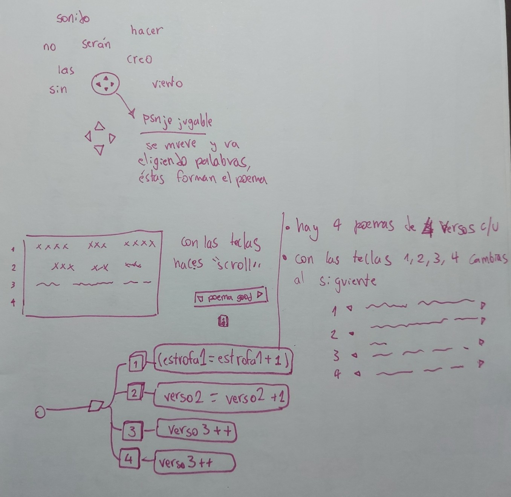
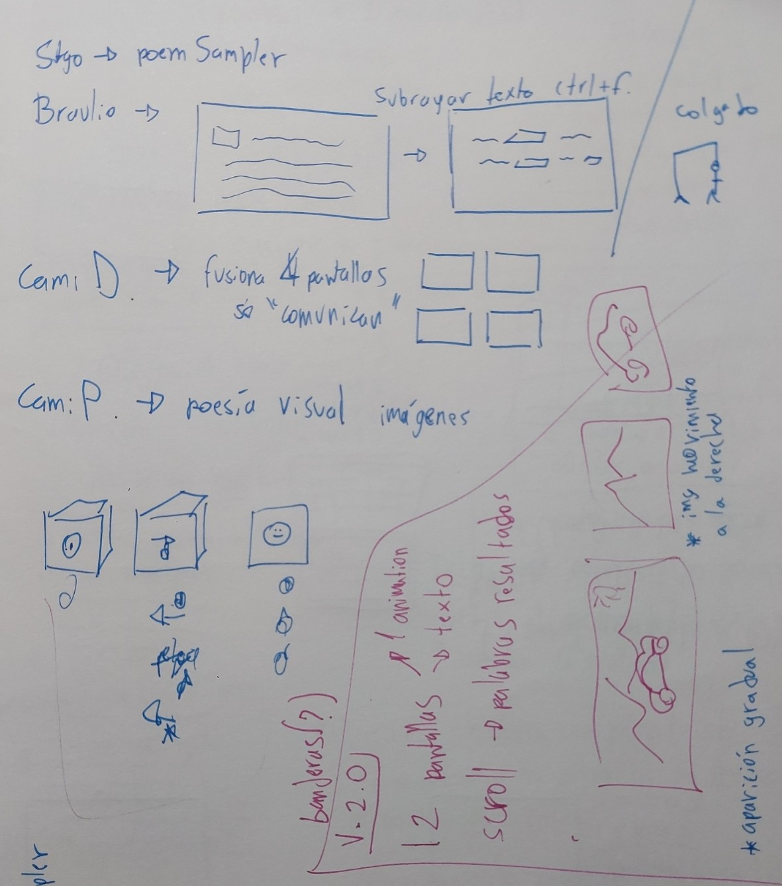
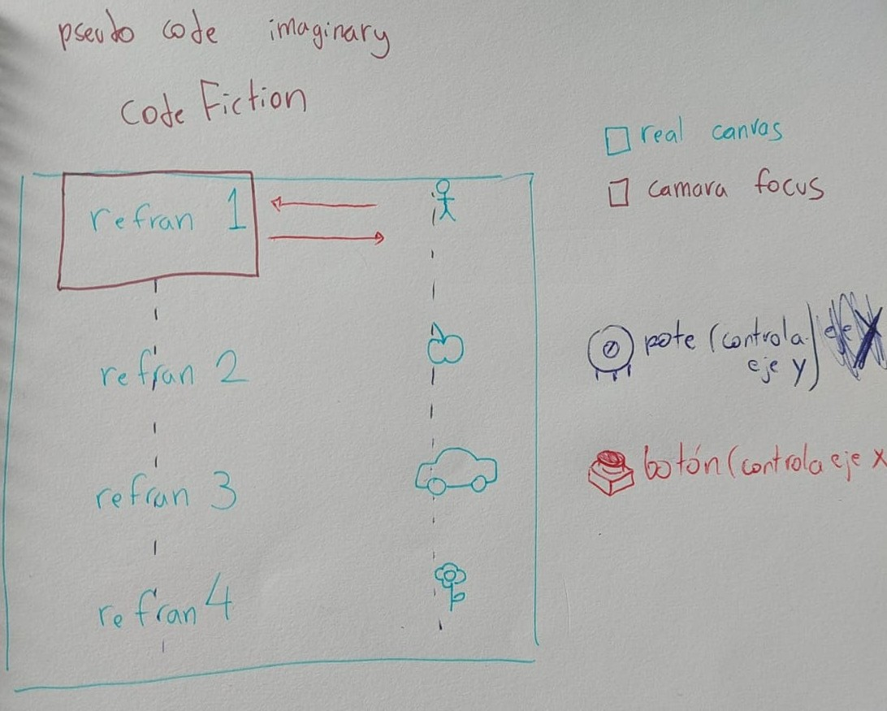
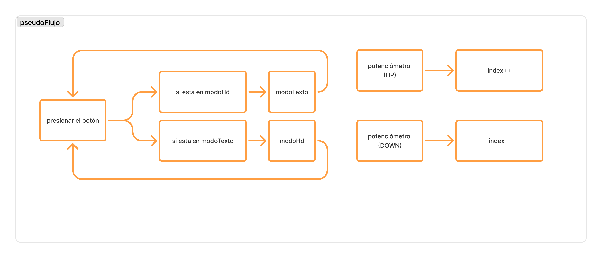
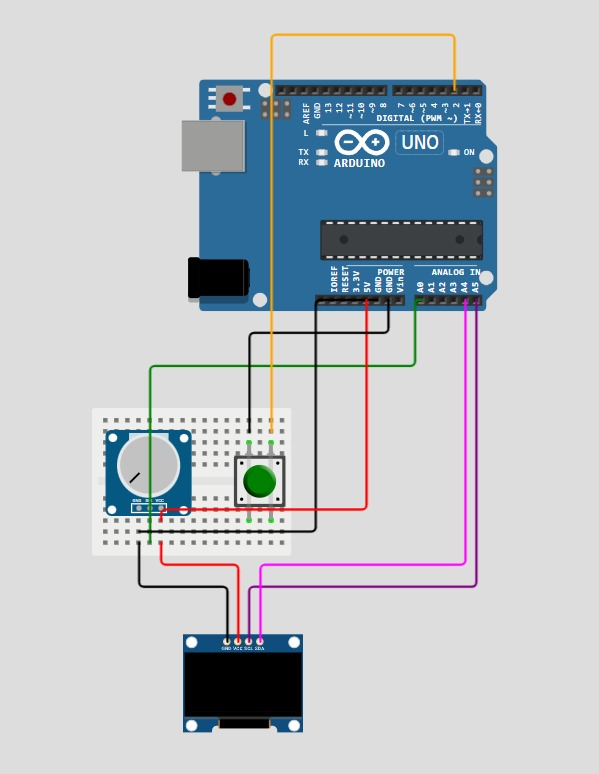

# poemSampler

## Acerca del proyecto

- Grupo: 01
- Nombre de grupo: maincraf
- Integrantes:
  - [Camila Delgado Sánchez](https://github.com/notcaamila)
  - [Braulio Figueroa](https://github.com/brauliofigueroa2001)
  - [Santiago Gaete Fernández](https://github.com/santiagoClifford)
  - [Camila Parada Vásquez](https://github.com/Camila-Parada)

## Presentación textual

poemSampler comienza como una interfaz que permite fusionar extractos de distintos poemas, para crear tus propios "remixes". Debido a limitaciones técnicas, el proyecto fue iterando a medida que avanzábamos en el código:

- Versión 1: poema scrollea automáticamente. Algunas palabras se ven destacadas. Al escribir una de esas palabras, aparece una imagen en una segunda pantalla.

- Versión 2: el scroll se controla con el potenciómetro. Al presionar un botón, en una segunda pantalla se ve la imagen asociada al refrán.

- Versión 3: con el potenciómetro controlas el scroll de los refranes. Al presionar el botón, aparece una imagen respecto al refrán y el texto se va. Al usar el potenciómetro, vuelve a verse el texto y la imagen desaparece. La imagenes son combinables entre sí.

- Versión 4: el potenciómetro permite scrollear entre los elementos de la lista. Con el botón vas turnando entre la lista de texto(modoTexto) y la lista de imagenes (modoHd).

El usuario puede navegar entre los refranes usando el potenciómetro, ya sea de manera textual, o de manera visual. Para ir cambiando entre ambas maneras, se usa el botón.

## Inputs y outputs

La interacción que diseñamos para nuestro proyecto permite al usuario navegar a través de una selección de 5 refranes chilenos y 5 dibujos representativos para cada uno de ellos.

El usuario podrá leer los refranes en la pantalla OLED de 128x64 pixeles que se conecta al Arduino Uno R4 Minima. Para pasar de un refrán a otro, el usuario debe manipular un potenciómetro que también se encuentra conectado al circuito. Asimismo, quien interactúe con el proyecto podrá alternar entre el apartado con imágenes y el de texto, pulsando el botón que forma parte del circuito.

Entonces, la interacción ocurre de manera óptima cuando el usuario pasa de un refrán a otro manipulando el potenciómetro y cuando, al pausar en cada refrán, presiona el botón para visualizar el dibujo correspondiente a cada uno de ellos.

Y así sucesivamente hasta leer todos los refranes.

El usuario puede experimentar otros caminos posibles de interacción, por ejemplo, al navegar únicamente a través de los refranes textuales al manipular solo el potenciómetro. O utilizar el "modo fiesta", manteniendo el botón presionado mientras se usa el potenciómetro.

## Bocetos de planificación



- Primer boceto para organizar las ideas. Se observa una idea de navegación de un compositor(mezclador) de texto. Obtenido de: creación personal.



- Segundo boceto. Se mezclan las ideas propuestas sobre el proyecto. Obtenido de: creación personal.


Tercer boceto. Esquema conceptual sobre el funcionamiento y la interface. Obtenido de: creación personal.


Diagrama de flujo del funcionamiento. Obtenido de: creación personal.

## Etapas del código

### 1. Inclusión de librerías y creación de variables con los parámetros visuales

```cpp
#include <Adafruit_GFX.h>
#include <Adafruit_SSD1306.h>
#include <Wire.h>
#define screenW 128
#define screenH 64
#define oledReset -1
#define screenAdress 0x3C
Adafruit_SSD1306 display(screenW, screenH, &Wire, oledReset);
```

### 2. Variables específicas del código: botón y potenciometro

```cpp
//variable que lleva la cuenta de cuántas veces se ha presionado el botón
int botonComputo = 0;
//pin del botón
int botonPin = 2;
//pin del potenciómtro
int potePin = A0;
```

### 3. Listado del contenido textual: refranes chilenos

```cpp
char* refranes[] = { "perro ke ladra no muerde",
                     "se le escapan lo' enanito' del bosqe",
                     "kear como xaleca 'e mono",
                     "pasar gato x liebre",
                     "cria cuervo' y te sacaran lo' ojo'"};
```

### 4. bitmaps: códigos hexadecimales de las imágenes a usar(contenido interno borrado para hacer este documento más legible)

```cpp
const unsigned char bitmapPerro[] PROGMEM = {
};
const unsigned char bitmapEnano[] PROGMEM = {
};
const unsigned char bitmapMono[] PROGMEM = {
};
const unsigned char bitmapGato[] PROGMEM = {
};
const unsigned char bitmapCuervo[] PROGMEM = {
};
```

### 5. listado que contiene los bitmaps

```cpp
const int bitmapArrayLength = 5;
const unsigned char* bitmapArray[5] = {
  bitmapPerro, bitmapEnano, bitmapMono, bitmapGato, bitmapCuervo
};
```

### 6. "void setup": seteo del programa

```cpp
void setup() {
  //<https://docs-arduino-cc.translate.goog/language-reference/en/functions/communication/serial/begin/>
  Serial.begin(9600);
  //extraído de la librería de adafruit. En caso de que falle la conexión, imprime un mensaje.
  if (!display.begin(SSD1306_SWITCHCAPVCC, screenAdress)) {
    Serial.println(F("SSD1306 allocation failed"));
    for (;;)
      ;
  }
  // configurar el pin para recibir datos.
  pinMode(botonPin, INPUT_PULLUP);

  //setear el display
  display.clearDisplay();
  display.setTextSize(1);
  display.setTextColor(SSD1306_WHITE);
  display.display();
}
```

### 7. void loop: bucle. La variable votoComputo lleva la cuenta de cuántas veces fue presionado el botón. En los números pares está en modoPoeta(), en los números impares en modoHd()

```cpp
void loop() {
  //contar las veces que se ha presionado el botón <https://forum.arduino.cc/t/counting-button-presses/119881/4>
  if (digitalRead(botonPin) == LOW) {
    botonComputo++;
    delay(200);
  }
  //<https://docs.arduino.cc/language-reference/en/structure/arithmetic-operators/remainder>
  //<https://github.com/clifford1one/voluntadGuiada/blob/main/code/interact.js>
  if (botonComputo % 2 == 0) {
    //números pares
    modoPoeta();
  } else {
    //números impares
    modoHd();
  }
}
```

### 8. void modoPoeta: función que contiene los refranes textuales

```cpp
//el modo donde se leen los refranes
void modoPoeta() {
  display.stopscroll();
  display.clearDisplay();
  int poteValue = analogRead(potePin);
  //<https://www.w3schools.com/cpp/cpp_arrays_loop.asp>
  //<https://www.youtube.com/watch?v=RXWO3mFuW-I&t=303s>
  //poteValue lo divido en 205, porque quiero que el pote se deivida en 5 "secciones".
  //1023/5 = 204,6
  int fraccionPote = poteValue / 205;
  //<https://docs.arduino.cc/language-reference/en/functions/math/constrain>
  fraccionPote = constrain(fraccionPote, 0, 4);
  display.setCursor(0, 20);
  display.println(refranes[fraccionPote]);
  display.display();
}
```

- void modoHd(): función que contiene las imágenes basadas en los refranes

```cpp

void modoHd() {
  display.stopscroll();
  display.clearDisplay();
  int poteValue = analogRead(potePin);
  int fraccionPote = poteValue / 205;
  fraccionPote = constrain(fraccionPote, 0, 4);
  display.drawBitmap(0, 0, bitmapArray[fraccionPote], screenW, screenH, SSD1306_WHITE);
  display.display();
}
```

## Roles del equipo

1- Santiago Gaete Fernández(Silverfish): Desarrollador principal del proyecto. Unificador de ideas. Lo que imagina se lleva a cabo. Sueña en lenguajes de programación.

2- Camila "Mille" Parada(Alley): Investigadora de códigos. Analista de viabilidad y riesgos de circuito. Coleccionista de micro controladores.

3- Camila Delgado Sánchez(Ender Dragon): generación de ilustraciones representativas para cada refrán seleccionado y traducción de estas a lenguaje c++ para posterior visualización en pantalla OLED.

## Fotografías y videos del proyecto funcionado

[](https://www.youtube.com/watch?v=u8g13fmkUos)



[](https://www.youtube.com/watch?v=1rk3vENQUHw)

## Bibliografía

1- Consulta de información

Arduino cc (2012, September 12). counting button presses. Arduino Forum. <https://forum.arduino.cc/t/counting-button-presses/119881/4>

Arduino cc (2024, January 4). Arduino uno with multiple oled displays. Arduino Forum. <https://forum.arduino.cc/t/arduino-uno-with-multiple-oled-displays/1207184>

Arduino Docs (n.d.). How to Wire and Program a Button. Docs.arduino.cc. <https://docs.arduino.cc/built-in-examples/digital/Button/‌>

Arduino docs (2024). #define .Arduino.cc. <https://docs.arduino.cc/language-reference/en/structure/further-syntax/define/>

Arduino docs (2024). string, Arduino.cc. <https://docs.arduino.cc/language-reference/en/variables/data-types/string/>

Arduino docs (2024). Serial.begin(). Arduino.cc. <https://docs.arduino.cc/language-reference/en/functions/communication/Serial/begin/>

Arduino docs (2025). % (remainder). Arduino.cc. <https://docs.arduino.cc/language-reference/en/structure/arithmetic-operators/remainder>

Arduino docs (2025). constrain(). Arduino.cc. <https://docs.arduino.cc/language-reference/en/functions/math/constrain>

Arduino docs (2024). Digital Input Pull-Up Resistor. Arduino.cc. <https://docs.arduino.cc/tutorials/generic/digital-input-pullup/>

Carter, C. (2025, January 27). Cómo usar el multiplexor TCA9548A I2C con Arduino. 38-3D. <https://38-3d.co.uk/es/blogs/blog-38-3d/como-usar-el-multiplexor-tca9548a-i2c-con-arduino>

Guerra, J. (n.d.). Comunicación I2C con Arduino lo mejor de 2 mundos. Programarfacil.com. <https://programarfacil.com/blog/arduino-blog/comunicacion-i2c-con-arduino/>

MusicalCreeper01. (2016). GitHub - MusicalCreeper01/OLED-Icons-: A library of icons for Sparkfun’s OLED displays. GitHub. <https://github.com/MusicalCreeper01/OLED-Icons->

W3schools (n.d.). C++ Loop Through an Array. <Www.w3schools.com>. <https://www.w3schools.com/cpp/cpp_arrays_loop.asp> ‌ 2- Videos

Robotics Back-End. (2021, March 21). Arduino - How to Split a Program Into Different Files. YouTube. <https://www.youtube.com/watch?v=BdstuZP6l5E>

TechWithRita (2022, June 18). Connect Multiple OLED Displays With Arduino Nano (or any other board). YouTube. <https://www.youtube.com/watch?v=MO6hbQcX8fE>

TheGeekPub Extras. (2021, October 26). Arduino: Use a Button to Toggle an LED. YouTube. <https://www.youtube.com/watch?v=VdB4GWeVkvY>

upir (2024, February 6). Arduino OLED Animations -- tutorial for beginners, Arduino UNO, u8g2, Adafruit GFX, SSD1306, SSD1309. <Www.youtube.com>. <https://www.youtube.com/watch?v=o3PhC_VJdXo>

3- Inspiración

Adafruit. (2025). Adafruit_SSD1306/examples/ssd1306_128x64_i2c/ssd1306_128x64_i2c.ino. GitHub. <https://github.com/adafruit/Adafruit_SSD1306/blob/master/examples/ssd1306_128x64_i2c/ssd1306_128x64_i2c.ino>
The Coding Train (2025). 7.2: Arrays and Loops - p5.js Tutorial. Youtu.be. <https://youtu.be/RXWO3mFuW-I?si=1Iiri9lDNYRLTjQS>
Wokwi (2019). arduino_oled_animation__upir. Wokwi.com. <https://wokwi.com/projects/374294166215201793>
4- Recursos

Adafruit (2020, January 11). adafruit/Adafruit_SSD1306. GitHub. <https://github.com/adafruit/Adafruit_SSD1306>
Adafruit (2021, October 14). Adafruit GFX Library. GitHub. <https://github.com/adafruit/Adafruit-GFX-Library>
Arduino docs (2024). Wire. Arduino.cc. <https://docs.arduino.cc/language-reference/en/functions/communication/wire/>
Clifford1one (2025). voluntadGuiada/code/interact.js. GitHub. <https://github.com/clifford1one/voluntadGuiada/blob/main/code/interact.js>
image2cpp (n.d.). Javl.github.io. <https://javl.github.io/image2cpp/>
