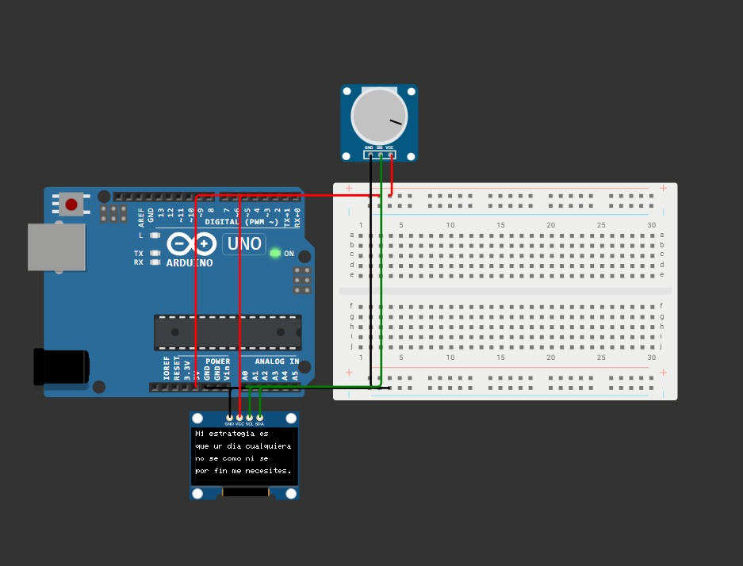
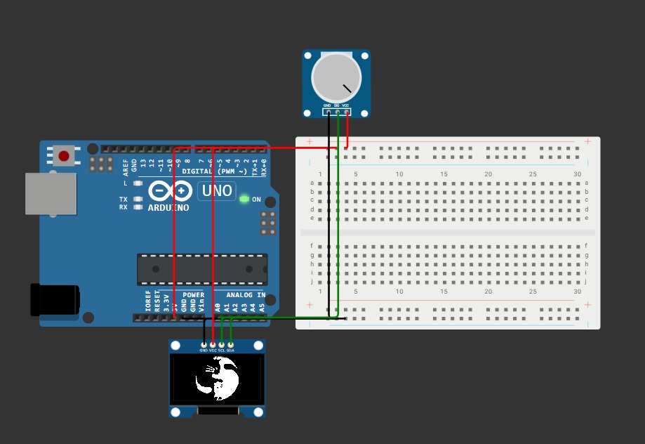
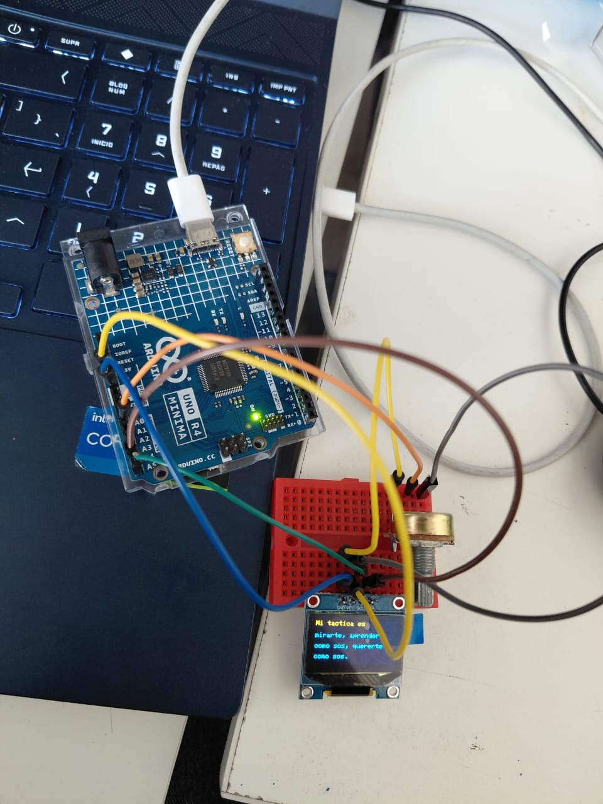
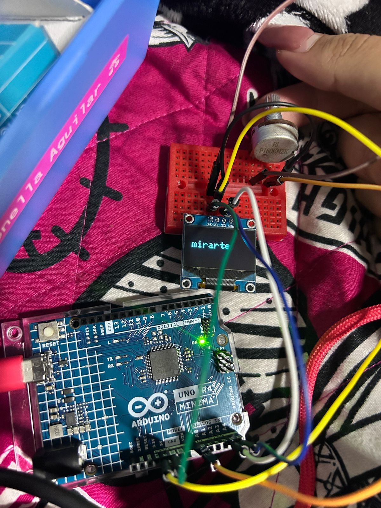
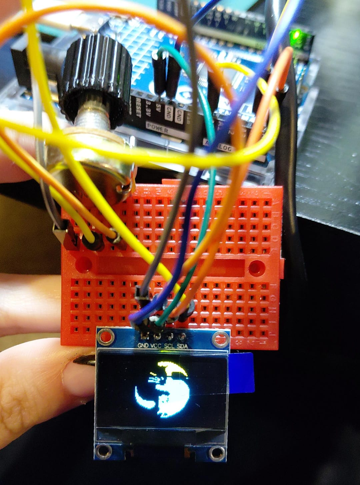
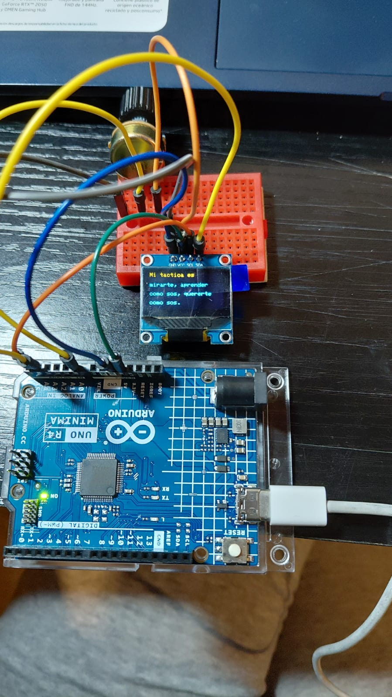

# proyecto-01

## Acerca del proyecto

- Grupo: 02
- Nombre de grupo: Gatolate
- Integrantes:
  - Antonella Aguilar
  - Javiera Moraga
  - Pía Orellana

## Presentación textual

El proyecto nació como un primer acercamiento a Arduino, con la idea de aprender a usar la placa y sus componentes básicos. Para esto usamos una pantalla OLED y un potenciómetro. La propuesta fue mostrar un poema navegable, en este caso un fragmento de "Táctica y estrategia" de Mario Benedetti, donde el usuario pudiera recorrer los versos moviendo el potenciómetro, generando así una pequeña interacción con el texto y una imagen final.

## Inputs y outputs

Input → El usuario gira el potenciómetro, lo que envía un valor analógico al Arduino.

Output → La pantalla OLED muestra diferentes partes del poema según el valor leído; al llegar al final, se despliega la imagen de un gato como cierre de la interacción.

## Bocetos de planificación






## Etapas del código

### 1. Librerías incluidas

- Wire.h: permite la comunicación I2C (es como el “idioma” para hablar con la pantalla OLED).
- Adafruit_GFX.h: librería gráfica básica (texto, formas, imágenes).
- Adafruit_SSD1306.h: librería específica para manejar la pantalla OLED SSD1306.

```cpp
#include <Wire.h>
#include <Adafruit_GFX.h>
#include <Adafruit_SSD1306.h>
```

### 2. Configuración de la pantalla: Se define el tamaño de la pantalla OLED (128x64 píxeles)

Se crea el objeto display que es la “pantalla” que vamos a usar en el programa.

```cpp
#define SCREEN_WIDTH 128
#define SCREEN_HEIGHT 64
Adafruit_SSD1306 display(SCREEN_WIDTH, SCREEN_HEIGHT, &Wire, -1);
```

### 3. Pin del potenciómetro: El potenciómetro está conectado al pin analógico A0

Sirve como control para moverse entre las líneas del poema.

```cpp
#define POT_PIN A0
```

### 4. Texto del poema: Se guarda el poema como un arreglo de cadenas de texto (const char*)

Cada línea está separada en un elemento distinto del arreglo.

```cpp
// Poema de Mario Benedetti – Fragmento de “Táctica y estrategia”
const char* poema[] = {
  "Mi tactica es",
  "mirarte, aprender",
  "como sos, quererte",
  "como sos.",
  "",
  "Mi estrategia es",
  "que un dia cualquiera",
  "no se como ni se",
  "por fin me necesites.",
  ""
};
```

### 5. Número de líneas: Calcula cuántas líneas tiene el poema automáticamente

```cpp
const int numLineas = sizeof(poema) / sizeof(poema[0]);
```

### 6. Variable para el desplazamiento: Controla qué parte del poema se está mostrando en pantalla

Cambia según el potenciómetro.

```cpp
int offset = 0;
```

### 7. Bitmap del gato: Es un dibujo guardado en binario

Cada número representa puntos blancos o negros en la pantalla.
Se mostrará al final del poema.

```cpp
// Dibujo gatitos en código
const unsigned char PROGMEM gato [] = {
 0x00, 0x00, 0x00, 0x07, 0x7e, 0x80, 0x00, 0x00, 0x00, 0x00, 0x00, 0x3f, 0xff, 0xf0, 0x00, 0x00, 
 0x00, 0x00, 0x00, 0x3e, 0xff, 0xfe, 0x00, 0x00, 0x00, 0x00, 0x00, 0x3f, 0xff, 0xff, 0x80, 0x00, 
 0x00, 0x00, 0x00, 0x0c, 0xf3, 0xff, 0xc0, 0x00, 0x00, 0x00, 0x00, 0x00, 0x07, 0xff, 0xf0, 0x00, 
 0x00, 0x00, 0x00, 0x00, 0x0f, 0xff, 0xf8, 0x00, 0x00, 0x00, 0x00, 0x00, 0x1f, 0xff, 0xfe, 0x00, 
 0x00, 0x00, 0x00, 0x00, 0x1f, 0xff, 0xff, 0x00, 0x00, 0x00, 0x00, 0x00, 0x1f, 0xff, 0xff, 0x80, 
 0x00, 0x00, 0x00, 0x00, 0x1f, 0xff, 0xff, 0xc0, 0x00, 0x00, 0x00, 0x00, 0x0f, 0xe0, 0x03, 0xc0, 
 0x00, 0x00, 0x00, 0x00, 0x0f, 0xc0, 0x00, 0xe0, 0x00, 0x00, 0x60, 0x00, 0x07, 0xc0, 0x00, 0x70, 
 0x00, 0x00, 0x18, 0x00, 0x07, 0xc0, 0x00, 0x30, 0x00, 0x00, 0x07, 0x00, 0x07, 0xc0, 0x00, 0x08, 
 0x00, 0x00, 0x01, 0x83, 0x07, 0xc0, 0x00, 0x0c, 0x00, 0x00, 0xf8, 0x61, 0x87, 0xe0, 0x00, 0x00, 
 0x00, 0x00, 0x0f, 0x39, 0x87, 0xf0, 0x00, 0x00, 0x00, 0x00, 0x01, 0xf8, 0x0f, 0xff, 0xfe, 0x00, 
 0x00, 0x01, 0xf8, 0x30, 0x0f, 0xff, 0xff, 0x80, 0x00, 0x01, 0xff, 0xe0, 0x0f, 0xff, 0xff, 0xc0, 
 0x00, 0x00, 0x00, 0xf0, 0x0f, 0xff, 0xff, 0xe0, 0x00, 0x00, 0x00, 0x00, 0x0f, 0xff, 0xff, 0xf0, 
 0x00, 0x00, 0x00, 0x00, 0x3f, 0xff, 0xff, 0xf8, 0x00, 0x00, 0x00, 0x78, 0x3f, 0xff, 0xff, 0xfc, 
 0x00, 0x00, 0x00, 0xff, 0xff, 0xff, 0xff, 0xfc, 0x00, 0x00, 0x00, 0xff, 0xff, 0xff, 0xff, 0xfe, 
 0x80, 0x00, 0x00, 0xff, 0xff, 0xff, 0xff, 0xfe, 0x80, 0x00, 0x00, 0xff, 0xff, 0xff, 0xff, 0xff, 
 0x80, 0x00, 0x00, 0x3f, 0xff, 0xff, 0xff, 0xff, 0x80, 0x00, 0x00, 0x07, 0xff, 0xff, 0xff, 0xff, 
 0xc0, 0x00, 0x00, 0x00, 0x37, 0xff, 0xff, 0xff, 0x80, 0x00, 0x00, 0x00, 0x01, 0xff, 0xff, 0xff, 
 0xc0, 0x00, 0x00, 0x00, 0x00, 0xff, 0xff, 0xff, 0xc0, 0x00, 0x00, 0x00, 0x00, 0x7f, 0xff, 0xff, 
 0xe0, 0x00, 0x00, 0x00, 0x00, 0x7f, 0xff, 0xff, 0xe0, 0x00, 0x00, 0x00, 0xe0, 0xff, 0xff, 0xff, 
 0xf0, 0x00, 0x00, 0x01, 0xfd, 0xff, 0xff, 0xff, 0xf0, 0x00, 0x00, 0x0f, 0xff, 0xff, 0xff, 0xff, 
 0x7c, 0x00, 0x00, 0x0f, 0xff, 0xff, 0xff, 0xff, 0x7e, 0x00, 0x00, 0x0f, 0xfc, 0xff, 0xff, 0xfe, 
 0x7f, 0x00, 0x00, 0x07, 0xff, 0xff, 0xff, 0xfe, 0x3f, 0x80, 0x00, 0x0f, 0xfc, 0xff, 0xff, 0xfc, 
 0x3f, 0xf8, 0x00, 0x0f, 0xfb, 0xff, 0xff, 0xfc, 0x3f, 0xff, 0xfc, 0x0f, 0x3d, 0xff, 0xff, 0xf8, 
 0x1f, 0xff, 0xfe, 0x0f, 0xbf, 0xff, 0xff, 0xf8, 0x0f, 0xff, 0xff, 0x0f, 0xff, 0xff, 0xff, 0xf0, 
 0x07, 0xff, 0xff, 0x0f, 0xff, 0xff, 0xff, 0xf0, 0x03, 0xff, 0xff, 0x0f, 0xff, 0xff, 0xff, 0xe0, 
 0x00, 0xff, 0xfe, 0x0f, 0xff, 0xff, 0xff, 0xe0, 0x00, 0x3f, 0xfe, 0x0f, 0xff, 0xff, 0xff, 0xc0, 
 0x00, 0x0f, 0xf8, 0x07, 0xff, 0xff, 0xff, 0x80, 0x00, 0x01, 0xe0, 0x07, 0xff, 0xff, 0xff, 0x00, 
 0x00, 0x00, 0x00, 0x03, 0xff, 0xff, 0xfe, 0x00, 0x00, 0x00, 0x00, 0x07, 0xff, 0xff, 0xfc, 0x00, 
 0x00, 0x00, 0x00, 0x07, 0xff, 0xff, 0xf8, 0x00, 0x00, 0x00, 0x00, 0x0f, 0xff, 0xff, 0xe0, 0x00, 
 0x00, 0x00, 0x00, 0x1f, 0xff, 0xff, 0x80, 0x00, 0x00, 0x00, 0x00, 0x18, 0x63, 0xff, 0x00, 0x00, 
 0x00, 0x00, 0x00, 0x00, 0x61, 0xfc, 0x00, 0x00, 0x00, 0x00, 0x00, 0x00, 0xc1, 0xf0, 0x00, 0x00, 
 0x00, 0x00, 0x00, 0x00, 0xd7, 0x80, 0x00, 0x00, 0x00, 0x00, 0x00, 0x01, 0xfe, 0x00, 0x00, 0x00
};
```

### 8. Función setup(): Inicializa la pantalla (dirección I2C 0x3C)

Si falla, queda en un bucle infinito.
Configura el tamaño y color del texto.

```cpp
void setup() {
  if (!display.begin(SSD1306_SWITCHCAPVCC, 0x3C)) {
    for (;;);
  }
  display.clearDisplay();
  display.setTextSize(1);
  display.setTextColor(SSD1306_WHITE);
}
```

### 9. Función loop(): Lee el valor del potenciómetro (0–1023)

Lo convierte (map) a un número entre 0 y el total de líneas posibles.
Limpia la pantalla.

```cpp
void loop() {
  int valorPot = analogRead(POT_PIN);
  offset = map(valorPot, 0, 1023, 0, numLineas - 4); 
  display.clearDisplay();
```

### 10. Mostrar el poema: Se muestran 4 líneas del poema en pantalla al mismo tiempo

Se ajusta la posición de cada línea con setCursor().

```cpp
if (offset < numLineas - 4) {
  for (int i = 0; i < 4; i++) {
    int linea = offset + i;
    if (linea < numLineas) {
      display.setCursor(0, i * 16);
      display.println(poema[linea]);
    }
  }
}
```

### 11. Mostrar el gato: Cuando ya no hay más líneas del poema, aparece el dibujo del gato en el centro

```cpp
else {
  display.drawBitmap(
    (SCREEN_WIDTH - 64) / 2, 
    (SCREEN_HEIGHT - 64) / 2, 
    gato, 64, 64, 1
  );
}
```

### 12. Refrescar pantalla: display.display() actualiza la pantalla con lo que se dibujó

delay(100) da una pausa pequeña para evitar parpadeos.

```cpp
display.display();
delay(100);
```
### Código final

```cpp
#include <Wire.h>
#include <Adafruit_GFX.h>
#include <Adafruit_SSD1306.h>

// Configuración de la pantalla
#define SCREEN_WIDTH 128
#define SCREEN_HEIGHT 64
Adafruit_SSD1306 display(SCREEN_WIDTH, SCREEN_HEIGHT, &Wire, -1);

// Pin del potenciómetro
#define POT_PIN A0  

// Poema de Mario Benedetti – Fragmento de “Táctica y estrategia”
const char* poema[] = {
  "Mi tactica es",
  "mirarte, aprender",
  "como sos, quererte",
  "como sos.",
  "",
  "Mi estrategia es",
  "que un dia cualquiera",
  "no se como ni se",
  "con que pretexto",
  "por fin me necesites.",
  ""
};

const int numLineas = sizeof(poema) / sizeof(poema[0]);

//  Aquí las variables de scroll
int offset = 0;  

// Dibujo gatitos en código
const unsigned char PROGMEM gato [] = {
	0x00, 0x00, 0x00, 0x07, 0x7e, 0x80, 0x00, 0x00, 0x00, 0x00, 0x00, 0x3f, 0xff, 0xf0, 0x00, 0x00, 
	0x00, 0x00, 0x00, 0x3e, 0xff, 0xfe, 0x00, 0x00, 0x00, 0x00, 0x00, 0x3f, 0xff, 0xff, 0x80, 0x00, 
	0x00, 0x00, 0x00, 0x0c, 0xf3, 0xff, 0xc0, 0x00, 0x00, 0x00, 0x00, 0x00, 0x07, 0xff, 0xf0, 0x00, 
	0x00, 0x00, 0x00, 0x00, 0x0f, 0xff, 0xf8, 0x00, 0x00, 0x00, 0x00, 0x00, 0x1f, 0xff, 0xfe, 0x00, 
	0x00, 0x00, 0x00, 0x00, 0x1f, 0xff, 0xff, 0x00, 0x00, 0x00, 0x00, 0x00, 0x1f, 0xff, 0xff, 0x80, 
	0x00, 0x00, 0x00, 0x00, 0x1f, 0xff, 0xff, 0xc0, 0x00, 0x00, 0x00, 0x00, 0x0f, 0xe0, 0x03, 0xc0, 
	0x00, 0x00, 0x00, 0x00, 0x0f, 0xc0, 0x00, 0xe0, 0x00, 0x00, 0x60, 0x00, 0x07, 0xc0, 0x00, 0x70, 
	0x00, 0x00, 0x18, 0x00, 0x07, 0xc0, 0x00, 0x30, 0x00, 0x00, 0x07, 0x00, 0x07, 0xc0, 0x00, 0x08, 
	0x00, 0x00, 0x01, 0x83, 0x07, 0xc0, 0x00, 0x0c, 0x00, 0x00, 0xf8, 0x61, 0x87, 0xe0, 0x00, 0x00, 
	0x00, 0x00, 0x0f, 0x39, 0x87, 0xf0, 0x00, 0x00, 0x00, 0x00, 0x01, 0xf8, 0x0f, 0xff, 0xfe, 0x00, 
	0x00, 0x01, 0xf8, 0x30, 0x0f, 0xff, 0xff, 0x80, 0x00, 0x01, 0xff, 0xe0, 0x0f, 0xff, 0xff, 0xc0, 
	0x00, 0x00, 0x00, 0xf0, 0x0f, 0xff, 0xff, 0xe0, 0x00, 0x00, 0x00, 0x00, 0x0f, 0xff, 0xff, 0xf0, 
	0x00, 0x00, 0x00, 0x00, 0x3f, 0xff, 0xff, 0xf8, 0x00, 0x00, 0x00, 0x78, 0x3f, 0xff, 0xff, 0xfc, 
	0x00, 0x00, 0x00, 0xff, 0xff, 0xff, 0xff, 0xfc, 0x00, 0x00, 0x00, 0xff, 0xff, 0xff, 0xff, 0xfe, 
	0x80, 0x00, 0x00, 0xff, 0xff, 0xff, 0xff, 0xfe, 0x80, 0x00, 0x00, 0xff, 0xff, 0xff, 0xff, 0xff, 
	0x80, 0x00, 0x00, 0x3f, 0xff, 0xff, 0xff, 0xff, 0x80, 0x00, 0x00, 0x07, 0xff, 0xff, 0xff, 0xff, 
	0xc0, 0x00, 0x00, 0x00, 0x37, 0xff, 0xff, 0xff, 0x80, 0x00, 0x00, 0x00, 0x01, 0xff, 0xff, 0xff, 
	0xc0, 0x00, 0x00, 0x00, 0x00, 0xff, 0xff, 0xff, 0xc0, 0x00, 0x00, 0x00, 0x00, 0x7f, 0xff, 0xff, 
	0xe0, 0x00, 0x00, 0x00, 0x00, 0x7f, 0xff, 0xff, 0xe0, 0x00, 0x00, 0x00, 0xe0, 0xff, 0xff, 0xff, 
	0xf0, 0x00, 0x00, 0x01, 0xfd, 0xff, 0xff, 0xff, 0xf0, 0x00, 0x00, 0x0f, 0xff, 0xff, 0xff, 0xff, 
	0x7c, 0x00, 0x00, 0x0f, 0xff, 0xff, 0xff, 0xff, 0x7e, 0x00, 0x00, 0x0f, 0xfc, 0xff, 0xff, 0xfe, 
	0x7f, 0x00, 0x00, 0x07, 0xff, 0xff, 0xff, 0xfe, 0x3f, 0x80, 0x00, 0x0f, 0xfc, 0xff, 0xff, 0xfc, 
	0x3f, 0xf8, 0x00, 0x0f, 0xfb, 0xff, 0xff, 0xfc, 0x3f, 0xff, 0xfc, 0x0f, 0x3d, 0xff, 0xff, 0xf8, 
	0x1f, 0xff, 0xfe, 0x0f, 0xbf, 0xff, 0xff, 0xf8, 0x0f, 0xff, 0xff, 0x0f, 0xff, 0xff, 0xff, 0xf0, 
	0x07, 0xff, 0xff, 0x0f, 0xff, 0xff, 0xff, 0xf0, 0x03, 0xff, 0xff, 0x0f, 0xff, 0xff, 0xff, 0xe0, 
	0x00, 0xff, 0xfe, 0x0f, 0xff, 0xff, 0xff, 0xe0, 0x00, 0x3f, 0xfe, 0x0f, 0xff, 0xff, 0xff, 0xc0, 
	0x00, 0x0f, 0xf8, 0x07, 0xff, 0xff, 0xff, 0x80, 0x00, 0x01, 0xe0, 0x07, 0xff, 0xff, 0xff, 0x00, 
	0x00, 0x00, 0x00, 0x03, 0xff, 0xff, 0xfe, 0x00, 0x00, 0x00, 0x00, 0x07, 0xff, 0xff, 0xfc, 0x00, 
	0x00, 0x00, 0x00, 0x07, 0xff, 0xff, 0xf8, 0x00, 0x00, 0x00, 0x00, 0x0f, 0xff, 0xff, 0xe0, 0x00, 
	0x00, 0x00, 0x00, 0x1f, 0xff, 0xff, 0x80, 0x00, 0x00, 0x00, 0x00, 0x18, 0x63, 0xff, 0x00, 0x00, 
	0x00, 0x00, 0x00, 0x00, 0x61, 0xfc, 0x00, 0x00, 0x00, 0x00, 0x00, 0x00, 0xc1, 0xf0, 0x00, 0x00, 
	0x00, 0x00, 0x00, 0x00, 0xd7, 0x80, 0x00, 0x00, 0x00, 0x00, 0x00, 0x01, 0xfe, 0x00, 0x00, 0x00
};


// Este es el Loop
void setup() {
  if (!display.begin(SSD1306_SWITCHCAPVCC, 0x3C)) {
    for (;;); // Si falla, queda en loop
  }
  display.clearDisplay();
  display.setTextSize(1);
  display.setTextColor(SSD1306_WHITE);
}

void loop() {
  int valorPot = analogRead(POT_PIN);

// Mapear valor del potenciometro a rango de líneas
  offset = map(valorPot, 0, 1023, 0, numLineas - 4); 

  display.clearDisplay();

  if (offset < numLineas - 4) {
    // Mostrar 4 líneas del poema
    for (int i = 0; i < 4; i++) {
      int linea = offset + i;
      if (linea < numLineas) {
        display.setCursor(0, i * 16);
        display.println(poema[linea]);
      }
    }
  } else {
    // Para mostrar gato al centro al final
    display.drawBitmap(
      (SCREEN_WIDTH - 64) / 2, 
      (SCREEN_HEIGHT - 64) / 2, 
      gato, 64, 64, 1
    );
  }

  display.display();
  delay(500);
}
```

## Roles del equipo

- **Antonella Aguilar:** se encargó de realizar distintas pruebas de códigos tanto en Wokwi como en Arduino, viendo qué funcionaba y que no para implementar en el prototipo físico (la pantalla OLED), además, se encargó también de tomar apuntes de las conexiones, de cómo iban ordenados los cables y las referencias de los componentes, llevando este orden en Github.
- **Javiera Moraga:** se encargó de realizar el código que utilizamos para la primera prueba en la pantalla (de solo texto), y posteriormente de la modificación del mismo para incluirle una imagen. Para esto, también realizó simulaciones en Wokwi viendo si habia algún error.
- **Pía Orellana:** se encargó de realizar el montaje en físico, procurando la correcta conexión de los cables y el funcionamiento de la pantalla y el potenciómetro, además de verificar que el proyecto funcionara, existiera la visualización del poema y recorrido con el potenciómetro.

> ☆ La recopilación final de apuntes fue un trabajo de todas.

## Fotografías y videos del proyecto funcionando

[Video del proyecto en Youtube](https://youtube.com/shorts/5r9miV74v34)




## Bibliografía

- Arduino. (2025). *Arduino language reference*. Arduino Documentation.
Recuperado en Agosto del 2025 en <https://docs.arduino.cc/language-reference/>

- Adafruit. (2025). *Adafruit SSD1306 library*. GitHub.
Recuperado en Agosto del 2025 en <https://github.com/adafruit/Adafruit_SSD1306>

- Adafruit. (2024). *Adafruit GFX graphics library*. Adafruit Learning System.
Recuperado en Agosto del 2025 en <https://learn.adafruit.com/adafruit-gfx-graphics-library>

- Benedetti, M. (2009). *Táctica y estrategia.*
Recuperado en agosto de 2025, de <https://www.poemas-del-alma.com/tactica-y-estrategia.htm>

- Javl. (2025). *Image2cpp.*
Recuperado en agosto de 2025, de <https://javl.github.io/image2cpp/>

- Santos, R. (2018). *Guide for OLED display with Arduino*. Random Nerd Tutorials.
Recuperado en Agosto del 2025 en <https://randomnerdtutorials.com/guide-for-oled-display-with-arduino>
