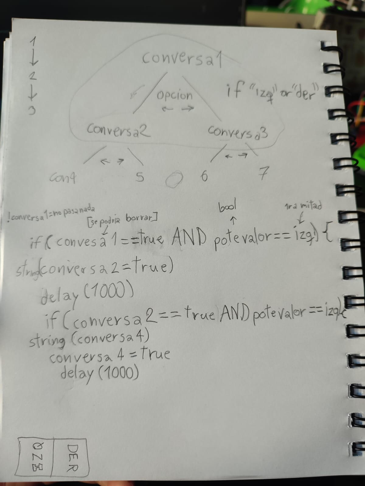
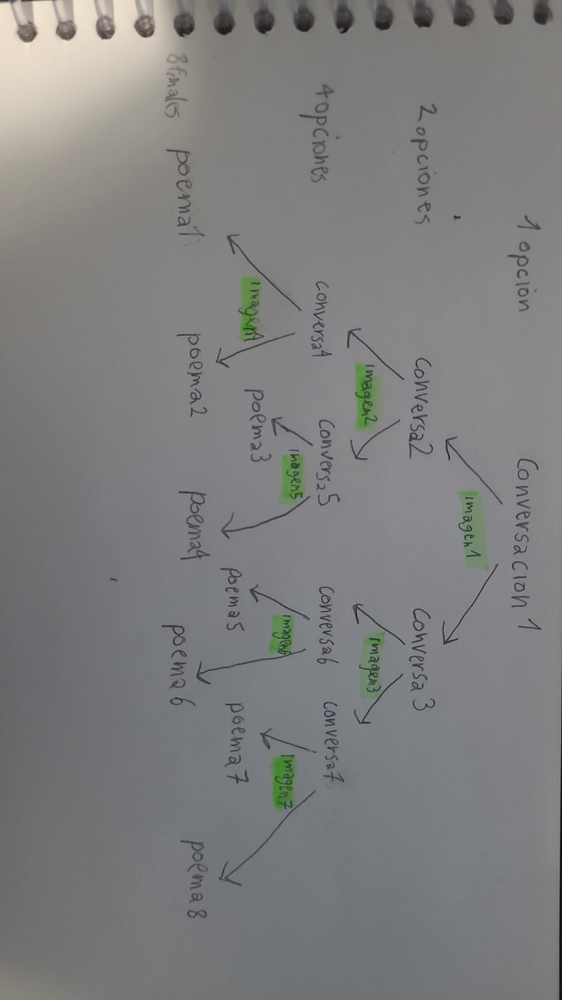

# proyecto-01

## Acerca del proyecto

- Grupo: 03
- Nombre de grupo: WAOS
- Integrantes:
  - Morgan Aravena
  - Angela O'Ryan
  - Sebastian Saez
  - Miguel Vera

## Presentación textual

La existencia de la inteligencia artificial hoy en día ha creado en algunas personas la dependencia de estos algoritmos, que realmente solo son unas fórmulas matemáticas estratégicamente diseñadas para dar la respuesta que sea la más probablemente correcta. En un mundo en el que se crean diálogos con estas "inteligencias" no sólo para solucionar problemas, sino que también para poder ocuparlas para llenar un vacío y sentir que están siendo escuchados por otra persona. (Tal vez mencionar un texto de estudio de la dependencia emocional con la inteligencia artificial hoy en día).

Pero este no es el único lado de la inteligencia artificial, ya que existen múltiples problemas éticos, como la gran cantidad de energía y agua que son necesarias para el funcionamiento constante de los servidores, la gran cantidad de desinformación que distribuye de manera masiva, entre múltiples otras cosas.

Queremos ofrecer una interacción ética, genuina y que entregue respuestas personalizadas e introspectivas al usuario, dándole así un toque humano que la IA no tiene.

## Inputs y outputs

El input para entre proyecto es realizada a partir de un potenciómetro montado sobre una protoboard, donde el ángulo en el que se encuentre el potenciómetro, se le permitirá al usuario elegir entre 2 opciones que se le entregarán, una siendo hacia la izquierda y la otra hacia la derecha.

El output es observado en la pantalla OLED, donde el usuario leerá la conversación que se está llevando a cabo con el arduino, las opciones que se le serán presentadas, como también los poemas finales, una vez lleguen al final de la conversación.

## Bocetos de planificación





## Etapas del código

Pruebas de código de [@SebastianSaez1003](https://github.com/SebastianSaez1003/dis8645-2025-02-procesos/tree/main/27-SebastianSaez1003) [@Hiinalia](https://github.com/Hiinalia/dis8645-2025-02-procesos/tree/main/19-Hiinalia)

Está considerado como un árbol de respuestas.

Dejamos listas las variables booleanas que vamos a usar

teníamos una buena idea de cómo debíamos llevarlo a cabo, la mayoría de las cosas las escribimos por pensamiento lógico de cómo me hacía sentido el posible funcionamiento de las cosas, pero al probar la compilación nos mandaron unos cuantos problemas, el código que escribimos es el siguiente:

```cpp


// potenciometro a la derecha es true
// potenciometro a la izquierda es false
// a la derecha, mayor el número
// a la izquierda, menor el número

bool conversa1 = true

bool potevalor = true


// hasta que no se cumpla la primera
// y el valor que queremos que se cumpla
// no se activarían sus valores inscritos

bool conversa2 = false

bool conversa3 = false

bool conversa4 = false

bool conversa5 = false


void setup() {
  // put your setup code here, to run once:
 
}


void loop() {
  // put your main code here, to run repeatedly:


}


```

```cpp


// potenciometro a la derecha es true
// potenciometro a la izquierda es false
// a la derecha, mayor el número
//a la izquierda, menor el número

bool conversa1 = true;

// se le aplica al angulo del potenciometro
// donde false es 512 o menos y true es 513 o más

bool potevalor = true;

// hasta que no se cumpla la primera
// y el valor que queremos que se cumpla
// no se activarían sus valores inscritos

bool conversa2 = false;

//para que las respuestas sean almacenadas y no causen problemas retroactivamente en conversas despues

bool respCon2Izq = false;

bool respCon2Der = false;

bool conversa3 = false;

bool respCon3Izq = false;

bool respCon3Der = false;

bool conversa4 = false;

bool respCon4Izq = false;

bool respCon4Der = false;

bool conversa5 = false;

bool respCon5Izq = false;

bool respCon5Der = false;

void setup() {
  // para que sea posible la comunicación
  // entre arduino y potenciometro
 Serial.begin(9600);

 String conversa2 = "waos";
}


void loop() {
  // put your main code here, to run repeatedly:
  // cuando la conversa1 es verdadera
  // y el potenciometro está apuntando a la izq
  // y ninguna de las dos respuestas de la conversa2 es verdadera
  // se podrá llevar a cabo este if statement

 if(conversa1 == true AND potevalor == true AND !respCon2Der == true AND !respCon2Izq == true){

    // se despliega el texto de la conversa2
    String(conversa2);

    // esperamos 5 segundos para la siguiente conversa
    delay(5000);

    // La respuesta sera almacenada para que no se puedan causar problemas
    respCon2Der = true;
  }

 if(respCon2Der == true AND potevalor == true AND !respCon3Der == true AND !respCon3Izq == true){
      String(conversa4);
      conversa4 = true;
      delay(5000);
      }
    }
  }
}

```

Nos dimos cuenta de cuál era el error al leer la pestaña de output de los errores, el uso de AND al parecer no era el correcto, así que los cambiamos por los ampersands (&&). Una vez lo cambiamos, empezó a funcionar.

```cpp
if(conversa1 == true && potevalor == true && !respCon2Der == true && !respCon2Izq == true){


```

También eliminamos varios caracteres que estaban extra y no eran necesarios

Este código no presenta ningún error al momento de verificarlo. La lógica es correcta, y tenemos el esqueleto de nuestro proyecto.

```cpp
// potenciometro a la derecha es true
// potenciometro a la izquierda es false
// a la derecha, mayor el número
//a la izquierda, menor el número

bool conversa1 = true;

// se le aplica al angulo del potenciometro
// donde false es 512 o menos y true es 513 o más

bool potevalor = true;


// hasta que no se cumpla la primera
// y el valor que queremos que se cumpla
// no se activarían sus valores inscritos

bool conversa2 = false;

//para que las respuestas sean almacenadas y no causen problemas retroactivamente en conversas despues

bool respCon2Izq = false;

bool respCon2Der = false;

bool conversa3 = false;

bool respCon3Izq = false;

bool respCon3Der = false;

bool conversa4 = false;

bool respCon4Izq = false;

bool respCon4Der = false;

bool conversa5 = false;

bool respCon5Izq = false;

bool respCon5Der = false;


void setup() {
  // para que sea posible la comunicación
  // entre arduino y potenciometro
 Serial.begin(9600);

 String conversa2 = "waos";
}


void loop() {
  // put your main code here, to run repeatedly:
  // cuando la conversa1 es verdadera
  // y el potenciometro está apuntando a la izq
  // y ninguna de las dos respuestas de la conversa2 es verdadera
  // se podrá llevar a cabo este if statement

 if(conversa1 == true && potevalor == true && !respCon2Der == true && !respCon2Izq == true){

    // se despliega el texto de la conversa2
    String(conversa2);

    // esperamos 5 segundos para la siguiente conversa
    delay(5000);

    // ra respuesta sera almacenada para que no se puedan causar problemas
    respCon2Der = true;
  }
    if(respCon2Der == true && potevalor == true && !respCon3Der == true && !respCon3Izq == true){
      String(conversa4);
     
      respCon4Izq = false;


      delay(5000);
      }
    }


```

Ahora solo nos faltaría solo probar que funcione con el potenciómetro y con la pantalla integrada, así que vamos a integrar las librerías de adafruit y otras variables. Nos basamos a partir de el ejemplo de
[sesion-03b/ejemploPantallita01](https://github.com/disenoUDP/dis8645-2025-02-procesos/tree/main/00-docentes/sesion-03b/ejemploPantallita01)


Avances y pruebas de código de [@SebastianSaez1003](https://github.com/SebastianSaez1003/dis8645-2025-02-procesos/tree/main/27-SebastianSaez1003) 


Las siguientes variables booleanas que fueron declaradas fueron respuestas específicas para cada una de las conversaciones, donde cada conversación tendrá 2 distintas respuestas, que seria la izquierda o la derecha, estas variables existen con la intención de hacer que nuestros “if” statements no puedan causar problemas con el código en su funcionamiento.

Con lo que nos referimos con esto es el hecho de que si no tuviéramos estas respuestas guardadas, digamos que estamos en la conversación 3, que se llegaba al elegir la respuesta derecha en la conversación número 1, ¿que es lo que previene el hecho de cambiar el estado del potenciómetro a la izquierda, mientras que se está realizando la 3ra conversación, y de esta manera cambiase el estado y se fuese a la conversación 2? de la manera hipotética siguiente:

```cpp
void loop() {
  // que se cargue la conversacion 1
  string (conversa1)

  // cuando el pote este hacia la derecha
  if (valorpote == true){

  // cargaremos la conversacion 2
  string (conversa2)

	// cuando este el potenciometro a la derecha
  if (valorpote == true){

  // la conversacion 4 sera cargada
  string (conversa4)
}

// la conversacion 5 sera cargada
if (valorpote == false){
	 string (conversa5)
}

}

// cuando este el potenciometro a la izquierda
else if (valorpote == false){
   string (conversa3)
}

}
```

La respuesta sería nada, o alumnos que se nos ocurra que impida este problema por sí mismo, sería un mundo de cambios constantes que el arduino procesaría de una manera que no comprendemos, el cual igual dejamos como ejemplo de prueba, pero con el monitor serial, para verlo de una manera más precisa con tiempo específico de cada acción:

```cpp
// carga del codigo sin almacenamiento de respuestas
// y su problema de funcionamiento

```

con las variables booleanas de cada respuesta para cada conversación, podemos hacer que cada pregunta sólo se pueda reproducir si es que ciertas condiciones son cumplidas, entre estas, que una respuesta de de misma pregunta NO ha sido recibida, osea que una vez se dé la respuesta de digamos la conversa3, la conversa 3 no se podrá a volver a repetir ya que es un requisito el no tener una respuesta activa, solo puede seguir adelante con el código y el siguiente “if” statement, como se puede ver en el código de “base” que escribimos para nuestro proyecto:

```cpp
if(conversa1 == true && potevalor == true && !respCon2Der == true && !respCon2Izq == true){
    // se despliega el texto de la conversa2
    String(conversa2);
    // esperamos 5 segundos para la siguiente conversa
    delay(5000);
    // ra respuesta sera almacenada para que no se puedan causar problemas
    respCon2Der = true;
  }
if(respCon2Der == true && potevalor == true && !respCon4Der == true && !respCon4Izq == true){
    String(conversa4);
    respCon4Izq = false;
    delay(5000);
    respCon4Der = true;
    }
    }

```
lo que está queriendo decir este encadenamiento de los if statements es, una vez la conversa1 sea haya sido cargada, el valor del potenciómetro está en la dirección derecha, osea en su estado true, **y no ha recibido ni la respuesta izquierda del pote, ni la respuesta derecha del pote** podrá continuar a la conversa4, que tambien solo avanzara cuando reciba la siguiente respuesta correspondiente

Ahora, con un entendimiento de cómo confiamos en el encadenamiento de las acciones, pasaremos a incluir nuestra pantalla OLED y el potenciómetro para poder confirmar que el funcionamiento sea el correcto, así que incluimos las librerías de Adafruit, con una base de el ejemplo de la [sesion-03b](https://github.com/disenoUDP/dis8645-2025-02-procesos/tree/main/00-docentes/sesion-03b/ejemploPantallita01) donde tomaremos los datos de el setup de la pantalla, para no complicarnos haciendolo desde 0, la posicion de donde aparecera el texto y el tamaño del texto, donde quedaria de la manera siguiente con 7 distintas opciones de conversaciones, al identificar lo confuso que era el hecho de hacer que cada conversación tuviese una opcion izquierda o derecha, creamos una variable que fuese la respuesta de esa opcion, donde quedo el codigo de la siguiente forma:

```cpp
// librerias para funcionamiento de pantallita
#include <Wire.h>
#include <Adafruit_GFX.h>
#include <Adafruit_SSD1306.h>

// denifir el ancho de la pantalla
#define SCREEN_WIDTH 128

// definir el alto d ela pantalla
#define SCREEN_HEIGHT 64

// que se resetee REVISAR REVISAR REVISAR REVISAR REVISAR
#define OLED_RESET -1
Adafruit_SSD1306 pantallita(SCREEN_WIDTH, SCREEN_HEIGHT, &Wire, OLED_RESET);

// potenciometro a la derecha es true
// potenciometro a la izquierda es false
// a la derecha, mayor el número
// a la izquierda, menor el número
// donde false es 512 o menos y true es 513 o más
bool potevalor = true;

// hasta que no se cumpla la primera
// y el valor que queremos que se cumpla
// no se activarían sus valores inscritos
//para que las respuestas sean almacenadas y no causen problemas retroactivamente en conversas despues
bool respCon2 = false;

bool respCon3 = false;

bool respCon4 = false;

bool respCon5 = false;

bool respCon6 = false;

bool respCon7 = false;

void setup() {
  // para que sea posible la comunicación
  // entre arduino y potenciometro
  Serial.begin(9600);

  if(!pantallita.begin(SSD1306_SWITCHCAPVCC, 0x3C)) {
    Serial.println(F("No se encontró la pantalla SSD1306"));
    for(;;);
  }

  pantallita.clearDisplay();
  pantallita.setTextColor(SSD1306_WHITE);
}

void loop() {

// conversacion que envia el arduino al usuario
String conversa1 = "waos1";

String conversa2 = "waos2";

String conversa3 = "waos3";

String conversa4 = "waos4";

String conversa5 = "waos5";

String conversa6 = "waos6";

String conversa7 = "waos7";

  // Limpiamos toda la pantalla
  pantallita.clearDisplay(); 

  //tamaño del texto
  pantallita.setTextSize(1); 
  
  // punto de donde aparece el texto
  int16_t x1, y1;

  // REVISAR REVISAR REVISAR
  uint16_t w, h;


pantallita.display();

  pantallita.println(conversa1);

  delay(3000);


 // cuando la conversa1 es verdadera
  // y el potenciometro está apuntando a la izq
  // y ninguna de las dos respuestas de la conversa2 es verdadera
  // se podrá llevar a cabo este if statement
  if(potevalor == false && !respCon2 == true && !respCon3 == true){

  // se despliega el texto de la conversa2
    pantallita.println(conversa2);

    // esperamos 5 segundos para la siguiente conversa
    delay(5000);

    // ra respuesta sera almacenada para que no se puedan causar problemas
    respCon2 = true;

    // revisar si es necesario REVISAR REVISAR REVISAR REVISAR
    //pantallita.display();

          if(respCon2 == true && potevalor == false && !respCon4 == true && !respCon5 == true){
              pantallita.println(conversa3);
              respCon4 = true;
              delay(5000);
             }

          if(respCon2 == true && potevalor == true && !respCon4== true && !respCon5 == true){
              pantallita.println(conversa4);
              respCon5 = true;
              delay(5000);
             }
      }

    else if(potevalor == true && !respCon2 == true && !respCon3 == true){
      // se despliega el texto de la conversa2
      pantallita.println(conversa3);

      // esperamos 5 segundos para la siguiente conversa
      delay(5000);

      // ra respuesta sera almacenada para que no se puedan causar problemas
      respCon3 = true;

          if(respCon3 == true && potevalor == true && !respCon6 == true && !respCon7 == true){
                  pantallita.println(conversa6);
                  respCon6 = true;
                  delay(5000);
                }

          if(respCon3 == true && potevalor == true && !respCon6 == true && !respCon7 == true){
              pantallita.println(conversa7);
              respCon7 = true;
              delay(5000);
             }
         }

}

```

Tambien añadiremos el Analog Read del potenciometro, como nos enseñaron en la sesion-04a a través de la coneccion a partir de una protoboard:

```cpp
// librerias para funcionamiento de pantallita
#include <Wire.h>
#include <Adafruit_GFX.h>
#include <Adafruit_SSD1306.h>


// denifir el ancho de la pantalla
#define SCREEN_WIDTH 128

// definir el alto d ela pantalla
#define SCREEN_HEIGHT 64

// que se resetee REVISAR REVISAR REVISAR REVISAR REVISAR
#define OLED_RESET -1
Adafruit_SSD1306 pantallita(SCREEN_WIDTH, SCREEN_HEIGHT, &Wire, OLED_RESET);


// potenciometro a la derecha es true
// potenciometro a la izquierda es false
// a la derecha, mayor el número
// a la izquierda, menor el número
// donde false es 512 o menos y true es 513 o más
bool poteValor = true;

// hasta que no se cumpla la primera
// y el valor que queremos que se cumpla
// no se activarían sus valores inscritos
//para que las respuestas sean almacenadas y no causen problemas retroactivamente en conversas despues
bool respCon2 = false;

bool respCon3 = false;

bool respCon4 = false;

bool respCon5 = false;

bool respCon6 = false;

bool respCon7 = false;


void setup() {
  // para que sea posible la comunicación
  // entre arduino y potenciometro
  Serial.begin(9600);


 if(!pantallita.begin(SSD1306_SWITCHCAPVCC, 0x3C)) {
    Serial.println(F("No se encontró la pantalla SSD1306"));
    for(;;);
  }
  pantallita.clearDisplay();
  pantallita.setTextColor(SSD1306_WHITE);
}


void loop() {
pantallita.clearDisplay();

//tamaño del texto
  pantallita.setTextSize(3);

// el angulo del potenciometro sera leido
//en el pin A0 del Analog In
int anguloDelPote = analogRead(A0);
delay(1);

// cuando
if (anguloDelPote < 512){
  poteValor = true;
}

else if (anguloDelPote > 512){
  poteValor = false;
}

// conversacion que envia el arduino al usuario
String conversa1 = "waos1";

String conversa2 = "waos2";

String conversa3 = "waos3";

String conversa4 = "waos4";

String conversa5 = "waos5";

String conversa6 = "waos6";

String conversa7 = "waos7";
 
  // punto de donde aparece el texto
  int16_t x1, y1;
  // REVISAR REVISAR REVISAR
  uint16_t w, h;

    pantallita.println(conversa1);

  delay(3000);


 // cuando la conversa1 es verdadera
  // y el potenciometro está apuntando a la izq
  // y ninguna de las dos respuestas de la conversa2 es verdadera
  // se podrá llevar a cabo este if statement
  if(poteValor == false && !respCon2 == true && !respCon3 == true){
    // se despliega el texto de la conversa2
    pantallita.println(conversa2);

    // esperamos 5 segundos para la siguiente conversa
    delay(5000);

    // ra respuesta sera almacenada para que no se puedan causar problemas
    respCon2 = true;

    // revisar si es necesario REVISAR REVISAR REVISAR REVISAR
    //pantallita.display();

          if(respCon2 == true && poteValor == false && !respCon4 == true && !respCon5 == true){
              pantallita.println(conversa3);
              respCon4 = true;
              delay(5000);
             }

          if(respCon2 == true && poteValor == true && !respCon4== true && !respCon5 == true){
              pantallita.println(conversa4);
              respCon5 = true;
              delay(5000);
             }
      }

    else if(poteValor == true && !respCon2 == true && !respCon3 == true){
      // se despliega el texto de la conversa2
      pantallita.println(conversa3);

      // esperamos 5 segundos para la siguiente conversa
      delay(5000);

      // ra respuesta sera almacenada para que no se puedan causar problemas
      respCon3 = true;

          if(respCon3 == true && poteValor == true && !respCon6 == true && !respCon7 == true){
                  pantallita.println(conversa6);
                  respCon6 = true;
                  delay(5000);
                }

          if(respCon3 == true && poteValor == true && !respCon6 == true && !respCon7 == true){
              pantallita.println(conversa7);
              respCon7 = true;
              delay(5000);
             }
         }
  pantallita.display();
}

```
Como se tuvieron que corregir MUCHAs otras cosas, estas se pueden encontrar en el repositorio de SebastianSaez1003

para llegar al codigo final que seria el siguiente:


```cpp
// librerias para funcionamiento de pantallita
#include <Wire.h>
#include <Adafruit_GFX.h>
#include <Adafruit_SSD1306.h>

// denifir el ancho de la pantalla
#define SCREEN_WIDTH 128
// definir el alto d ela pantalla
#define SCREEN_HEIGHT 64
// que se resetee REVISAR REVISAR REVISAR REVISAR REVISAR
#define OLED_RESET -1
Adafruit_SSD1306 pantallita(SCREEN_WIDTH, SCREEN_HEIGHT, &Wire, OLED_RESET);

// tangananica y tanganana
const unsigned char respuestasImg1 [] PROGMEM = {
	0x00, 0x00, 0x00, 0x00, 0x00, 0x00, 0x00, 0x00, 0xff, 0xff, 0xff, 0xff, 0xff, 0xff, 0xff, 0xff, 
	0x00, 0x00, 0x00, 0x00, 0x00, 0x00, 0x00, 0x00, 0xff, 0xff, 0xff, 0xff, 0xff, 0xff, 0xff, 0xff, 
	0x00, 0x00, 0x00, 0x00, 0x00, 0x00, 0x00, 0x00, 0xff, 0xff, 0xff, 0xff, 0xff, 0xff, 0xff, 0xff, 
	0x00, 0x00, 0x00, 0x00, 0x00, 0x00, 0x00, 0x00, 0xff, 0xff, 0xff, 0xff, 0xff, 0xff, 0xff, 0xff, 
	0x00, 0x00, 0x00, 0x00, 0x00, 0x00, 0x00, 0x00, 0xff, 0xff, 0xff, 0xff, 0xff, 0xff, 0xff, 0xff, 
	0x00, 0x00, 0x00, 0x00, 0x00, 0x00, 0x00, 0x00, 0xff, 0xff, 0xff, 0xff, 0xff, 0xff, 0xff, 0xff, 
	0x00, 0x00, 0x00, 0x00, 0x00, 0x00, 0x00, 0x00, 0xff, 0xff, 0xff, 0xff, 0xff, 0xff, 0xff, 0xff, 
	0x00, 0x00, 0x00, 0x00, 0x00, 0x00, 0x00, 0x00, 0xff, 0xff, 0xff, 0xff, 0xff, 0xff, 0xff, 0xff, 
	0x00, 0x00, 0x00, 0x00, 0x00, 0x00, 0x00, 0x00, 0xff, 0xff, 0xff, 0xff, 0xff, 0xff, 0xff, 0xff, 
	0x00, 0x00, 0x00, 0x00, 0x00, 0x00, 0x00, 0x00, 0xff, 0xff, 0xff, 0xff, 0xff, 0xff, 0xff, 0xff, 
	0x00, 0x00, 0x00, 0x00, 0x00, 0x00, 0x00, 0x00, 0xff, 0xff, 0xff, 0xff, 0xff, 0xff, 0xff, 0xff, 
	0x00, 0x00, 0x00, 0x00, 0x00, 0x00, 0x00, 0x00, 0xff, 0xff, 0xff, 0xff, 0xff, 0xff, 0xff, 0xff, 
	0x00, 0x00, 0x00, 0x00, 0x00, 0x00, 0x00, 0x00, 0xff, 0xff, 0xff, 0xff, 0xff, 0xff, 0xff, 0xff, 
	0x00, 0x00, 0x00, 0x00, 0x00, 0x00, 0x00, 0x00, 0xff, 0xff, 0xff, 0xff, 0xff, 0xff, 0xff, 0xff, 
	0x00, 0x00, 0x00, 0x00, 0x00, 0x00, 0x00, 0x00, 0xff, 0xff, 0xff, 0xff, 0xff, 0xff, 0xff, 0xff, 
	0x00, 0x00, 0x00, 0x00, 0x00, 0x00, 0x00, 0x00, 0xff, 0xff, 0xff, 0xff, 0xff, 0xff, 0xff, 0xff, 
	0x00, 0x00, 0x00, 0x00, 0x00, 0x00, 0x00, 0x00, 0xff, 0xff, 0xff, 0xff, 0xff, 0xff, 0xff, 0xff, 
	0x00, 0x00, 0x00, 0x00, 0x00, 0x00, 0x00, 0x00, 0xff, 0xff, 0xff, 0xff, 0xff, 0xff, 0xff, 0xff, 
	0x00, 0x00, 0x00, 0x00, 0x00, 0x00, 0x00, 0x00, 0xff, 0xff, 0xff, 0xff, 0xff, 0xff, 0xff, 0xff, 
	0x00, 0x00, 0x00, 0x00, 0x00, 0x00, 0x00, 0x00, 0xff, 0xff, 0xff, 0xff, 0xff, 0xff, 0xff, 0xff, 
	0x00, 0x00, 0x00, 0x00, 0x00, 0x00, 0x00, 0x00, 0xff, 0xff, 0xff, 0xff, 0xff, 0xff, 0xff, 0xff, 
	0x00, 0x00, 0x00, 0x00, 0x00, 0x00, 0x00, 0x00, 0xff, 0xff, 0xff, 0xff, 0xff, 0xff, 0xff, 0xff, 
	0x00, 0x00, 0x00, 0x00, 0x00, 0x00, 0x00, 0x00, 0xff, 0xff, 0xff, 0xff, 0xff, 0xff, 0xff, 0xff, 
	0x00, 0x00, 0x00, 0x00, 0x00, 0x00, 0x00, 0x00, 0xff, 0xff, 0xff, 0xff, 0xff, 0xff, 0xff, 0xff, 
	0x00, 0x00, 0x00, 0x00, 0x00, 0x00, 0x00, 0x00, 0xff, 0xff, 0xff, 0xff, 0xff, 0xff, 0xff, 0xff, 
	0x00, 0x00, 0x00, 0x00, 0x00, 0x00, 0x00, 0x00, 0xff, 0xff, 0xff, 0xff, 0xff, 0xff, 0xff, 0xff, 
	0x00, 0x00, 0x00, 0x00, 0x00, 0x00, 0x00, 0x00, 0xff, 0xff, 0xff, 0xff, 0xff, 0xff, 0xff, 0xff, 
	0x00, 0x00, 0x00, 0x00, 0x00, 0x00, 0x00, 0x00, 0xff, 0xff, 0xff, 0xff, 0xff, 0xff, 0xff, 0xff, 
	0x00, 0x00, 0x00, 0x00, 0x00, 0x00, 0x00, 0x00, 0xff, 0xff, 0xff, 0xff, 0xff, 0xff, 0xff, 0xff, 
	0x03, 0xe9, 0x97, 0x99, 0x26, 0x4a, 0x73, 0x00, 0xff, 0xc3, 0x65, 0x86, 0x6d, 0x93, 0x6f, 0xff, 
	0x00, 0x95, 0xd4, 0x19, 0xa6, 0x6a, 0x83, 0x00, 0xff, 0xf6, 0xa5, 0x3e, 0x65, 0x51, 0x57, 0xff, 
	0x00, 0x95, 0xd5, 0xbd, 0x6a, 0x6a, 0x85, 0x00, 0xff, 0xf6, 0xa9, 0x65, 0x65, 0x51, 0x57, 0xff, 
	0x00, 0x9f, 0xb4, 0xbd, 0x6f, 0x5a, 0xd7, 0x80, 0xff, 0xf4, 0x2d, 0x34, 0x29, 0x02, 0x47, 0xff, 
	0x00, 0xa2, 0x33, 0x25, 0x29, 0x4a, 0x74, 0x80, 0xff, 0xf5, 0xcd, 0x85, 0xac, 0xea, 0x3b, 0xff, 
	0x00, 0x00, 0x00, 0x00, 0x00, 0x00, 0x00, 0x00, 0xff, 0xff, 0xff, 0xff, 0xff, 0xff, 0xff, 0xff, 
	0x00, 0x00, 0x00, 0x00, 0x00, 0x00, 0x00, 0x00, 0xff, 0xff, 0xff, 0xff, 0xff, 0xff, 0xff, 0xff, 
	0x00, 0x00, 0x00, 0x00, 0x00, 0x00, 0x00, 0x00, 0xff, 0xff, 0xff, 0xff, 0xff, 0xff, 0xff, 0xff, 
	0x00, 0x00, 0x00, 0x00, 0x00, 0x00, 0x00, 0x00, 0xff, 0xff, 0xff, 0xff, 0xff, 0xff, 0xff, 0xff, 
	0x00, 0x00, 0x00, 0x00, 0x00, 0x00, 0x00, 0x00, 0xff, 0xff, 0xff, 0xff, 0xff, 0xff, 0xff, 0xff, 
	0x00, 0x00, 0x00, 0x00, 0x00, 0x00, 0x00, 0x00, 0xff, 0xff, 0xff, 0xff, 0xff, 0xff, 0xff, 0xff, 
	0x00, 0x00, 0x00, 0x00, 0x00, 0x00, 0x00, 0x00, 0xff, 0xff, 0xff, 0xff, 0xff, 0xff, 0xff, 0xff, 
	0x00, 0x00, 0x00, 0x00, 0x00, 0x00, 0x00, 0x00, 0xff, 0xff, 0xff, 0xff, 0xff, 0xff, 0xff, 0xff, 
	0x00, 0x00, 0x00, 0x00, 0x00, 0x00, 0x00, 0x00, 0xff, 0xff, 0xff, 0xff, 0xff, 0xff, 0xff, 0xff, 
	0x00, 0x00, 0x00, 0x00, 0x00, 0x00, 0x00, 0x00, 0xff, 0xff, 0xff, 0xff, 0xff, 0xff, 0xff, 0xff, 
	0x00, 0x00, 0x00, 0x00, 0x00, 0x00, 0x00, 0x00, 0xff, 0xff, 0xff, 0xff, 0xff, 0xff, 0xff, 0xff, 
	0x00, 0x00, 0x00, 0x00, 0x00, 0x00, 0x00, 0x00, 0xff, 0xff, 0xff, 0xff, 0xff, 0xff, 0xff, 0xff, 
	0x00, 0x00, 0x00, 0x00, 0x00, 0x00, 0x00, 0x00, 0xff, 0xff, 0xff, 0xff, 0xff, 0xff, 0xff, 0xff, 
	0x00, 0x00, 0x00, 0x00, 0x00, 0x00, 0x00, 0x00, 0xff, 0xff, 0xff, 0xff, 0xff, 0xff, 0xff, 0xff, 
	0x00, 0x00, 0x00, 0x00, 0x00, 0x00, 0x00, 0x00, 0xff, 0xff, 0xff, 0xff, 0xff, 0xff, 0xff, 0xff, 
	0x00, 0x00, 0x00, 0x00, 0x00, 0x00, 0x00, 0x00, 0xff, 0xff, 0xff, 0xff, 0xff, 0xff, 0xff, 0xff, 
	0x00, 0x00, 0x00, 0x00, 0x00, 0x00, 0x00, 0x00, 0xff, 0xff, 0xff, 0xff, 0xff, 0xff, 0xff, 0xff, 
	0x00, 0x00, 0x00, 0x00, 0x00, 0x00, 0x00, 0x00, 0xff, 0xff, 0xff, 0xff, 0xff, 0xff, 0xff, 0xff, 
	0x00, 0x00, 0x00, 0x00, 0x00, 0x00, 0x00, 0x00, 0xff, 0xff, 0xff, 0xff, 0xff, 0xff, 0xff, 0xff, 
	0x00, 0x00, 0x00, 0x00, 0x00, 0x00, 0x00, 0x00, 0xff, 0xff, 0xff, 0xff, 0xff, 0xff, 0xff, 0xff, 
	0x00, 0x00, 0x00, 0x00, 0x00, 0x00, 0x00, 0x00, 0xff, 0xff, 0xff, 0xff, 0xff, 0xff, 0xff, 0xff, 
	0x00, 0x00, 0x00, 0x00, 0x00, 0x00, 0x00, 0x00, 0xff, 0xff, 0xff, 0xff, 0xff, 0xff, 0xff, 0xff, 
	0x00, 0x00, 0x00, 0x00, 0x00, 0x00, 0x00, 0x00, 0xff, 0xff, 0xff, 0xff, 0xff, 0xff, 0xff, 0xff, 
	0x00, 0x00, 0x00, 0x00, 0x00, 0x00, 0x00, 0x00, 0xff, 0xff, 0xff, 0xff, 0xff, 0xff, 0xff, 0xff, 
	0x00, 0x00, 0x00, 0x00, 0x00, 0x00, 0x00, 0x00, 0xff, 0xff, 0xff, 0xff, 0xff, 0xff, 0xff, 0xff, 
	0x00, 0x00, 0x00, 0x00, 0x00, 0x00, 0x00, 0x00, 0xff, 0xff, 0xff, 0xff, 0xff, 0xff, 0xff, 0xff, 
	0x00, 0x00, 0x00, 0x00, 0x00, 0x00, 0x00, 0x00, 0xff, 0xff, 0xff, 0xff, 0xff, 0xff, 0xff, 0xff, 
	0x00, 0x00, 0x00, 0x00, 0x00, 0x00, 0x00, 0x00, 0xff, 0xff, 0xff, 0xff, 0xff, 0xff, 0xff, 0xff, 
	0x00, 0x00, 0x00, 0x00, 0x00, 0x00, 0x00, 0x00, 0xff, 0xff, 0xff, 0xff, 0xff, 0xff, 0xff, 0xff, 
	0x00, 0x00, 0x00, 0x00, 0x00, 0x00, 0x00, 0x00, 0xff, 0xff, 0xff, 0xff, 0xff, 0xff, 0xff, 0xff
};

// imagen de proposito y amor
const unsigned char respuestasImg2 [] PROGMEM = {
	0x00, 0x00, 0x00, 0x00, 0x00, 0x00, 0x00, 0x00, 0xff, 0xff, 0xff, 0xff, 0xff, 0xff, 0xff, 0xff, 
	0x00, 0x00, 0x00, 0x00, 0x00, 0x00, 0x00, 0x00, 0xff, 0xff, 0xff, 0xff, 0xff, 0xff, 0xff, 0xff, 
	0x00, 0x00, 0x00, 0x00, 0x00, 0x00, 0x00, 0x00, 0xff, 0xff, 0xff, 0xff, 0xff, 0xff, 0xff, 0xff, 
	0x00, 0x00, 0x00, 0x00, 0x00, 0x00, 0x00, 0x00, 0xff, 0xff, 0xff, 0xff, 0xff, 0xff, 0xff, 0xff, 
	0x00, 0x00, 0x00, 0x00, 0x00, 0x00, 0x00, 0x00, 0xff, 0xff, 0xff, 0xff, 0xff, 0xff, 0xff, 0xff, 
	0x00, 0x00, 0x00, 0x00, 0x00, 0x00, 0x00, 0x00, 0xff, 0xff, 0xff, 0xff, 0xff, 0xff, 0xff, 0xff, 
	0x00, 0x00, 0x00, 0x00, 0x00, 0x00, 0x00, 0x00, 0xff, 0xff, 0xff, 0xff, 0xff, 0xff, 0xff, 0xff, 
	0x00, 0x00, 0x00, 0x00, 0x00, 0x00, 0x00, 0x00, 0xff, 0xff, 0xff, 0xff, 0xff, 0xff, 0xff, 0xff, 
	0x00, 0x00, 0x00, 0x00, 0x00, 0x00, 0x00, 0x00, 0xff, 0xff, 0xff, 0xff, 0xff, 0xff, 0xff, 0xff, 
	0x00, 0x00, 0x00, 0x00, 0x00, 0x00, 0x00, 0x00, 0xff, 0xff, 0xff, 0xff, 0xff, 0xff, 0xff, 0xff, 
	0x00, 0x00, 0x00, 0x00, 0x00, 0x00, 0x00, 0x00, 0xff, 0xff, 0xff, 0xff, 0xff, 0xff, 0xff, 0xff, 
	0x00, 0x00, 0x00, 0x00, 0x00, 0x00, 0x00, 0x00, 0xff, 0xff, 0xff, 0xff, 0xff, 0xff, 0xff, 0xff, 
	0x00, 0x00, 0x00, 0x00, 0x00, 0x00, 0x00, 0x00, 0xff, 0xff, 0xff, 0xff, 0xff, 0xff, 0xff, 0xff, 
	0x00, 0x00, 0x00, 0x00, 0x00, 0x00, 0x00, 0x00, 0xff, 0xff, 0xff, 0xff, 0xff, 0xff, 0xff, 0xff, 
	0x00, 0x00, 0x00, 0x00, 0x00, 0x00, 0x00, 0x00, 0xff, 0xff, 0xff, 0xff, 0xff, 0xff, 0xff, 0xff, 
	0x00, 0x00, 0x00, 0x00, 0x00, 0x00, 0x00, 0x00, 0xff, 0xff, 0xff, 0xff, 0xff, 0xff, 0xff, 0xff, 
	0x00, 0x00, 0x00, 0x00, 0x00, 0x00, 0x00, 0x00, 0xff, 0xff, 0xff, 0xff, 0xff, 0xff, 0xff, 0xff, 
	0x00, 0x00, 0x00, 0x00, 0x00, 0x00, 0x00, 0x00, 0xff, 0xff, 0xff, 0xff, 0xff, 0xff, 0xff, 0xff, 
	0x00, 0x00, 0x00, 0x00, 0x00, 0x00, 0x00, 0x00, 0xff, 0xff, 0xff, 0xff, 0xff, 0xff, 0xff, 0xff, 
	0x00, 0x00, 0x00, 0x00, 0x00, 0x00, 0x00, 0x00, 0xff, 0xff, 0xff, 0xff, 0xff, 0xff, 0xff, 0xff, 
	0x00, 0x00, 0x00, 0x00, 0x00, 0x00, 0x00, 0x00, 0xff, 0xff, 0xff, 0xff, 0xff, 0xff, 0xff, 0xff, 
	0x00, 0x00, 0x00, 0x00, 0x00, 0x00, 0x00, 0x00, 0xff, 0xff, 0xff, 0xff, 0xff, 0xff, 0xff, 0xff, 
	0x00, 0x00, 0x00, 0x00, 0x00, 0x00, 0x00, 0x00, 0xff, 0xff, 0xff, 0xff, 0xff, 0xff, 0xff, 0xff, 
	0x00, 0x00, 0x00, 0x00, 0x00, 0x00, 0x00, 0x00, 0xff, 0xff, 0xff, 0xff, 0xff, 0xff, 0xff, 0xff, 
	0x00, 0x00, 0x00, 0x00, 0x00, 0x00, 0x00, 0x00, 0xff, 0xff, 0xff, 0xff, 0xff, 0xff, 0xff, 0xff, 
	0x00, 0x00, 0x00, 0x00, 0x00, 0x00, 0x00, 0x00, 0xff, 0xff, 0xff, 0xff, 0xff, 0xff, 0xff, 0xff, 
	0x00, 0x00, 0x00, 0x00, 0x00, 0x00, 0x00, 0x00, 0xff, 0xff, 0xff, 0xff, 0xff, 0xff, 0xff, 0xff, 
	0x00, 0x00, 0x00, 0x00, 0x00, 0x00, 0x00, 0x00, 0xff, 0xff, 0xff, 0xff, 0xff, 0xff, 0xff, 0xff, 
	0x00, 0x00, 0x00, 0x00, 0x00, 0x00, 0x00, 0x00, 0xff, 0xff, 0xff, 0xff, 0xff, 0xff, 0xff, 0xff, 
	0x03, 0xe9, 0x97, 0x99, 0x26, 0x4a, 0x73, 0x00, 0xff, 0xc3, 0x65, 0x86, 0x6d, 0x93, 0x6f, 0xff, 
	0x00, 0x95, 0xd4, 0x19, 0xa6, 0x6a, 0x83, 0x00, 0xff, 0xf6, 0xa5, 0x3e, 0x65, 0x51, 0x57, 0xff, 
	0x00, 0x95, 0xd5, 0xbd, 0x6a, 0x6a, 0x85, 0x00, 0xff, 0xf6, 0xa9, 0x65, 0x65, 0x51, 0x57, 0xff, 
	0x00, 0x9f, 0xb4, 0xbd, 0x6f, 0x5a, 0xd7, 0x80, 0xff, 0xf4, 0x2d, 0x34, 0x29, 0x02, 0x47, 0xff, 
	0x00, 0xa2, 0x33, 0x25, 0x29, 0x4a, 0x74, 0x80, 0xff, 0xf5, 0xcd, 0x85, 0xac, 0xea, 0x3b, 0xff, 
	0x00, 0x00, 0x00, 0x00, 0x00, 0x00, 0x00, 0x00, 0xff, 0xff, 0xff, 0xff, 0xff, 0xff, 0xff, 0xff, 
	0x00, 0x00, 0x00, 0x00, 0x00, 0x00, 0x00, 0x00, 0xff, 0xff, 0xff, 0xff, 0xff, 0xff, 0xff, 0xff, 
	0x00, 0x00, 0x00, 0x00, 0x00, 0x00, 0x00, 0x00, 0xff, 0xff, 0xff, 0xff, 0xff, 0xff, 0xff, 0xff, 
	0x00, 0x00, 0x00, 0x00, 0x00, 0x00, 0x00, 0x00, 0xff, 0xff, 0xff, 0xff, 0xff, 0xff, 0xff, 0xff, 
	0x00, 0x00, 0x00, 0x00, 0x00, 0x00, 0x00, 0x00, 0xff, 0xff, 0xff, 0xff, 0xff, 0xff, 0xff, 0xff, 
	0x00, 0x00, 0x00, 0x00, 0x00, 0x00, 0x00, 0x00, 0xff, 0xff, 0xff, 0xff, 0xff, 0xff, 0xff, 0xff, 
	0x00, 0x00, 0x00, 0x00, 0x00, 0x00, 0x00, 0x00, 0xff, 0xff, 0xff, 0xff, 0xff, 0xff, 0xff, 0xff, 
	0x00, 0x00, 0x00, 0x00, 0x00, 0x00, 0x00, 0x00, 0xff, 0xff, 0xff, 0xff, 0xff, 0xff, 0xff, 0xff, 
	0x00, 0x00, 0x00, 0x00, 0x00, 0x00, 0x00, 0x00, 0xff, 0xff, 0xff, 0xff, 0xff, 0xff, 0xff, 0xff, 
	0x00, 0x00, 0x00, 0x00, 0x00, 0x00, 0x00, 0x00, 0xff, 0xff, 0xff, 0xff, 0xff, 0xff, 0xff, 0xff, 
	0x00, 0x00, 0x00, 0x00, 0x00, 0x00, 0x00, 0x00, 0xff, 0xff, 0xff, 0xff, 0xff, 0xff, 0xff, 0xff, 
	0x00, 0x00, 0x00, 0x00, 0x00, 0x00, 0x00, 0x00, 0xff, 0xff, 0xff, 0xff, 0xff, 0xff, 0xff, 0xff, 
	0x00, 0x00, 0x00, 0x00, 0x00, 0x00, 0x00, 0x00, 0xff, 0xff, 0xff, 0xff, 0xff, 0xff, 0xff, 0xff, 
	0x00, 0x00, 0x00, 0x00, 0x00, 0x00, 0x00, 0x00, 0xff, 0xff, 0xff, 0xff, 0xff, 0xff, 0xff, 0xff, 
	0x00, 0x00, 0x00, 0x00, 0x00, 0x00, 0x00, 0x00, 0xff, 0xff, 0xff, 0xff, 0xff, 0xff, 0xff, 0xff, 
	0x00, 0x00, 0x00, 0x00, 0x00, 0x00, 0x00, 0x00, 0xff, 0xff, 0xff, 0xff, 0xff, 0xff, 0xff, 0xff, 
	0x00, 0x00, 0x00, 0x00, 0x00, 0x00, 0x00, 0x00, 0xff, 0xff, 0xff, 0xff, 0xff, 0xff, 0xff, 0xff, 
	0x00, 0x00, 0x00, 0x00, 0x00, 0x00, 0x00, 0x00, 0xff, 0xff, 0xff, 0xff, 0xff, 0xff, 0xff, 0xff, 
	0x00, 0x00, 0x00, 0x00, 0x00, 0x00, 0x00, 0x00, 0xff, 0xff, 0xff, 0xff, 0xff, 0xff, 0xff, 0xff, 
	0x00, 0x00, 0x00, 0x00, 0x00, 0x00, 0x00, 0x00, 0xff, 0xff, 0xff, 0xff, 0xff, 0xff, 0xff, 0xff, 
	0x00, 0x00, 0x00, 0x00, 0x00, 0x00, 0x00, 0x00, 0xff, 0xff, 0xff, 0xff, 0xff, 0xff, 0xff, 0xff, 
	0x00, 0x00, 0x00, 0x00, 0x00, 0x00, 0x00, 0x00, 0xff, 0xff, 0xff, 0xff, 0xff, 0xff, 0xff, 0xff, 
	0x00, 0x00, 0x00, 0x00, 0x00, 0x00, 0x00, 0x00, 0xff, 0xff, 0xff, 0xff, 0xff, 0xff, 0xff, 0xff, 
	0x00, 0x00, 0x00, 0x00, 0x00, 0x00, 0x00, 0x00, 0xff, 0xff, 0xff, 0xff, 0xff, 0xff, 0xff, 0xff, 
	0x00, 0x00, 0x00, 0x00, 0x00, 0x00, 0x00, 0x00, 0xff, 0xff, 0xff, 0xff, 0xff, 0xff, 0xff, 0xff, 
	0x00, 0x00, 0x00, 0x00, 0x00, 0x00, 0x00, 0x00, 0xff, 0xff, 0xff, 0xff, 0xff, 0xff, 0xff, 0xff, 
	0x00, 0x00, 0x00, 0x00, 0x00, 0x00, 0x00, 0x00, 0xff, 0xff, 0xff, 0xff, 0xff, 0xff, 0xff, 0xff, 
	0x00, 0x00, 0x00, 0x00, 0x00, 0x00, 0x00, 0x00, 0xff, 0xff, 0xff, 0xff, 0xff, 0xff, 0xff, 0xff, 
	0x00, 0x00, 0x00, 0x00, 0x00, 0x00, 0x00, 0x00, 0xff, 0xff, 0xff, 0xff, 0xff, 0xff, 0xff, 0xff, 
	0x00, 0x00, 0x00, 0x00, 0x00, 0x00, 0x00, 0x00, 0xff, 0xff, 0xff, 0xff, 0xff, 0xff, 0xff, 0xff
};

// imagen de SI o NO
const unsigned char respuestasImg3 [] PROGMEM = {
	0x00, 0x00, 0x00, 0x00, 0x00, 0x00, 0x00, 0x00, 0xff, 0xff, 0xff, 0xff, 0xff, 0xff, 0xff, 0xff, 
	0x00, 0x00, 0x00, 0x00, 0x00, 0x00, 0x00, 0x00, 0xff, 0xff, 0xff, 0xff, 0xff, 0xff, 0xff, 0xff, 
	0x00, 0x00, 0x00, 0x00, 0x00, 0x00, 0x00, 0x00, 0xff, 0xff, 0xff, 0xff, 0xff, 0xff, 0xff, 0xff, 
	0x00, 0x00, 0x00, 0x00, 0x00, 0x00, 0x00, 0x00, 0xff, 0xff, 0xff, 0xff, 0xff, 0xff, 0xff, 0xff, 
	0x00, 0x00, 0x00, 0x00, 0x00, 0x00, 0x00, 0x00, 0xff, 0xff, 0xff, 0xff, 0xff, 0xff, 0xff, 0xff, 
	0x00, 0x00, 0x00, 0x00, 0x00, 0x00, 0x00, 0x00, 0xff, 0xff, 0xff, 0xff, 0xff, 0xff, 0xff, 0xff, 
	0x00, 0x00, 0x00, 0x00, 0x00, 0x00, 0x00, 0x00, 0xff, 0xff, 0xff, 0xff, 0xff, 0xff, 0xff, 0xff, 
	0x00, 0x00, 0x00, 0x00, 0x00, 0x00, 0x00, 0x00, 0xff, 0xff, 0xff, 0xff, 0xff, 0xff, 0xff, 0xff, 
	0x00, 0x00, 0x00, 0x00, 0x00, 0x00, 0x00, 0x00, 0xff, 0xff, 0xff, 0xff, 0xff, 0xff, 0xff, 0xff, 
	0x00, 0x00, 0x00, 0x00, 0x00, 0x00, 0x00, 0x00, 0xff, 0xff, 0xff, 0xff, 0xff, 0xff, 0xff, 0xff, 
	0x00, 0x00, 0x00, 0x00, 0x00, 0x00, 0x00, 0x00, 0xff, 0xff, 0xff, 0xff, 0xff, 0xff, 0xff, 0xff, 
	0x00, 0x00, 0x00, 0x00, 0x00, 0x00, 0x00, 0x00, 0xff, 0xff, 0xff, 0xff, 0xff, 0xff, 0xff, 0xff, 
	0x00, 0x00, 0x00, 0x00, 0x00, 0x00, 0x00, 0x00, 0xff, 0xff, 0xff, 0xff, 0xff, 0xff, 0xff, 0xff, 
	0x00, 0x00, 0x00, 0x00, 0x00, 0x00, 0x00, 0x00, 0xff, 0xff, 0xff, 0xff, 0xff, 0xff, 0xff, 0xff, 
	0x00, 0x00, 0x00, 0x00, 0x00, 0x00, 0x00, 0x00, 0xff, 0xff, 0xff, 0xff, 0xff, 0xff, 0xff, 0xff, 
	0x00, 0x00, 0x00, 0x00, 0x00, 0x00, 0x00, 0x00, 0xff, 0xff, 0xff, 0xff, 0xff, 0xff, 0xff, 0xff, 
	0x00, 0x00, 0x00, 0x00, 0x00, 0x00, 0x00, 0x00, 0xff, 0xff, 0xff, 0xff, 0xff, 0xff, 0xff, 0xff, 
	0x00, 0x00, 0x00, 0x00, 0x00, 0x00, 0x00, 0x00, 0xff, 0xff, 0xff, 0xff, 0xff, 0xff, 0xff, 0xff, 
	0x00, 0x00, 0x00, 0x00, 0x00, 0x00, 0x00, 0x00, 0xff, 0xff, 0xff, 0xff, 0xff, 0xff, 0xff, 0xff, 
	0x00, 0x00, 0x00, 0x00, 0x00, 0x00, 0x00, 0x00, 0xff, 0xff, 0xff, 0xff, 0xff, 0xff, 0xff, 0xff, 
	0x00, 0x00, 0x00, 0x00, 0x00, 0x00, 0x00, 0x00, 0xff, 0xff, 0xff, 0xff, 0xff, 0xff, 0xff, 0xff, 
	0x00, 0x00, 0x00, 0x7c, 0x00, 0x80, 0x00, 0x00, 0xff, 0xfe, 0x7f, 0xcf, 0xfe, 0x0f, 0xff, 0xff, 
	0x00, 0x00, 0x01, 0xff, 0x81, 0xe0, 0x00, 0x00, 0xff, 0xf8, 0x3f, 0x87, 0xf0, 0x01, 0xff, 0xff, 
	0x00, 0x00, 0x03, 0xff, 0xc3, 0xe0, 0x00, 0x00, 0xff, 0xf8, 0x1f, 0x87, 0xe0, 0x00, 0xff, 0xff, 
	0x00, 0x00, 0x07, 0xef, 0xe3, 0xe0, 0x00, 0x00, 0xff, 0xf8, 0x1f, 0x87, 0xc0, 0x00, 0x7f, 0xff, 
	0x00, 0x00, 0x07, 0x83, 0xe3, 0xe0, 0x00, 0x00, 0xff, 0xf8, 0x0f, 0x87, 0x83, 0xf0, 0x7f, 0xff, 
	0x00, 0x00, 0x0f, 0x01, 0xc3, 0xe0, 0x00, 0x00, 0xff, 0xf8, 0x0f, 0x87, 0x83, 0xf8, 0x3f, 0xff, 
	0x00, 0x00, 0x0f, 0x80, 0x03, 0xe0, 0x00, 0x00, 0xff, 0xf8, 0x07, 0x87, 0x87, 0xfc, 0x3f, 0xff, 
	0x00, 0x00, 0x07, 0xe0, 0x03, 0xe0, 0x00, 0x00, 0xff, 0xf8, 0x43, 0x87, 0x07, 0xfc, 0x1f, 0xff, 
	0x00, 0x00, 0x07, 0xfe, 0x03, 0xe0, 0x00, 0x00, 0xff, 0xf8, 0x43, 0x87, 0x0f, 0xfc, 0x1f, 0xff, 
	0x00, 0x00, 0x03, 0xff, 0xc3, 0xe0, 0x00, 0x00, 0xff, 0xf8, 0x61, 0x87, 0x0f, 0xfc, 0x1f, 0xff, 
	0x00, 0x00, 0x00, 0xff, 0xe3, 0xe0, 0x00, 0x00, 0xff, 0xf8, 0x70, 0x87, 0x0f, 0xfc, 0x1f, 0xff, 
	0x00, 0x00, 0x00, 0x1f, 0xe3, 0xe0, 0x00, 0x00, 0xff, 0xf8, 0x70, 0x87, 0x07, 0xfc, 0x1f, 0xff, 
	0x00, 0x00, 0x00, 0x01, 0xe3, 0xe0, 0x00, 0x00, 0xff, 0xf8, 0x78, 0x07, 0x07, 0xfc, 0x3f, 0xff, 
	0x00, 0x00, 0x06, 0x01, 0xe3, 0xe0, 0x00, 0x00, 0xff, 0xf8, 0x78, 0x07, 0x87, 0xfc, 0x3f, 0xff, 
	0x00, 0x00, 0x0f, 0x01, 0xe3, 0xe0, 0x00, 0x00, 0xff, 0xf8, 0x7c, 0x07, 0x83, 0xf8, 0x3f, 0xff, 
	0x00, 0x00, 0x0f, 0x83, 0xe3, 0xe0, 0x00, 0x00, 0xff, 0xf8, 0x7e, 0x07, 0xc1, 0xf0, 0x7f, 0xff, 
	0x00, 0x00, 0x07, 0xff, 0xe3, 0xe0, 0x00, 0x00, 0xff, 0xf8, 0x7e, 0x07, 0xc0, 0x00, 0xff, 0xff, 
	0x00, 0x00, 0x03, 0xff, 0xc1, 0xe0, 0x00, 0x00, 0xff, 0xf8, 0x7f, 0x07, 0xe0, 0x01, 0xff, 0xff, 
	0x00, 0x00, 0x01, 0xff, 0x81, 0xc0, 0x00, 0x00, 0xff, 0xf8, 0x7f, 0x87, 0xf8, 0x03, 0xff, 0xff, 
	0x00, 0x00, 0x00, 0x00, 0x00, 0x00, 0x00, 0x00, 0xff, 0xff, 0xff, 0xff, 0xff, 0xff, 0xff, 0xff, 
	0x00, 0x00, 0x00, 0x00, 0x00, 0x00, 0x00, 0x00, 0xff, 0xff, 0xff, 0xff, 0xff, 0xff, 0xff, 0xff, 
	0x00, 0x00, 0x00, 0x00, 0x00, 0x00, 0x00, 0x00, 0xff, 0xff, 0xff, 0xff, 0xff, 0xff, 0xff, 0xff, 
	0x00, 0x00, 0x00, 0x00, 0x00, 0x00, 0x00, 0x00, 0xff, 0xff, 0xff, 0xff, 0xff, 0xff, 0xff, 0xff, 
	0x00, 0x00, 0x00, 0x00, 0x00, 0x00, 0x00, 0x00, 0xff, 0xff, 0xff, 0xff, 0xff, 0xff, 0xff, 0xff, 
	0x00, 0x00, 0x00, 0x00, 0x00, 0x00, 0x00, 0x00, 0xff, 0xff, 0xff, 0xff, 0xff, 0xff, 0xff, 0xff, 
	0x00, 0x00, 0x00, 0x00, 0x00, 0x00, 0x00, 0x00, 0xff, 0xff, 0xff, 0xff, 0xff, 0xff, 0xff, 0xff, 
	0x00, 0x00, 0x00, 0x00, 0x00, 0x00, 0x00, 0x00, 0xff, 0xff, 0xff, 0xff, 0xff, 0xff, 0xff, 0xff, 
	0x00, 0x00, 0x00, 0x00, 0x00, 0x00, 0x00, 0x00, 0xff, 0xff, 0xff, 0xff, 0xff, 0xff, 0xff, 0xff, 
	0x00, 0x00, 0x00, 0x00, 0x00, 0x00, 0x00, 0x00, 0xff, 0xff, 0xff, 0xff, 0xff, 0xff, 0xff, 0xff, 
	0x00, 0x00, 0x00, 0x00, 0x00, 0x00, 0x00, 0x00, 0xff, 0xff, 0xff, 0xff, 0xff, 0xff, 0xff, 0xff, 
	0x00, 0x00, 0x00, 0x00, 0x00, 0x00, 0x00, 0x00, 0xff, 0xff, 0xff, 0xff, 0xff, 0xff, 0xff, 0xff, 
	0x00, 0x00, 0x00, 0x00, 0x00, 0x00, 0x00, 0x00, 0xff, 0xff, 0xff, 0xff, 0xff, 0xff, 0xff, 0xff, 
	0x00, 0x00, 0x00, 0x00, 0x00, 0x00, 0x00, 0x00, 0xff, 0xff, 0xff, 0xff, 0xff, 0xff, 0xff, 0xff, 
	0x00, 0x00, 0x00, 0x00, 0x00, 0x00, 0x00, 0x00, 0xff, 0xff, 0xff, 0xff, 0xff, 0xff, 0xff, 0xff, 
	0x00, 0x00, 0x00, 0x00, 0x00, 0x00, 0x00, 0x00, 0xff, 0xff, 0xff, 0xff, 0xff, 0xff, 0xff, 0xff, 
	0x00, 0x00, 0x00, 0x00, 0x00, 0x00, 0x00, 0x00, 0xff, 0xff, 0xff, 0xff, 0xff, 0xff, 0xff, 0xff, 
	0x00, 0x00, 0x00, 0x00, 0x00, 0x00, 0x00, 0x00, 0xff, 0xff, 0xff, 0xff, 0xff, 0xff, 0xff, 0xff, 
	0x00, 0x00, 0x00, 0x00, 0x00, 0x00, 0x00, 0x00, 0xff, 0xff, 0xff, 0xff, 0xff, 0xff, 0xff, 0xff, 
	0x00, 0x00, 0x00, 0x00, 0x00, 0x00, 0x00, 0x00, 0xff, 0xff, 0xff, 0xff, 0xff, 0xff, 0xff, 0xff, 
	0x00, 0x00, 0x00, 0x00, 0x00, 0x00, 0x00, 0x00, 0xff, 0xff, 0xff, 0xff, 0xff, 0xff, 0xff, 0xff, 
	0x00, 0x00, 0x00, 0x00, 0x00, 0x00, 0x00, 0x00, 0xff, 0xff, 0xff, 0xff, 0xff, 0xff, 0xff, 0xff, 
	0x00, 0x00, 0x00, 0x00, 0x00, 0x00, 0x00, 0x00, 0xff, 0xff, 0xff, 0xff, 0xff, 0xff, 0xff, 0xff, 
	0x00, 0x00, 0x00, 0x00, 0x00, 0x00, 0x00, 0x00, 0xff, 0xff, 0xff, 0xff, 0xff, 0xff, 0xff, 0xff
};

// 'COMPANIA', 128x64px
const unsigned char respuestasImg4 [] PROGMEM = {
	0x00, 0x00, 0x00, 0x00, 0x00, 0x00, 0x00, 0x00, 0xff, 0xff, 0xff, 0xff, 0xff, 0xff, 0xff, 0xff, 
	0x00, 0x00, 0x00, 0x00, 0x00, 0x00, 0x00, 0x00, 0xff, 0xff, 0xff, 0xff, 0xff, 0xff, 0xff, 0xff, 
	0x00, 0x00, 0x00, 0x00, 0x00, 0x00, 0x00, 0x00, 0xff, 0xff, 0xff, 0xff, 0xff, 0xff, 0xff, 0xff, 
	0x00, 0x00, 0x00, 0x00, 0x00, 0x00, 0x00, 0x00, 0xff, 0xff, 0xff, 0xff, 0xff, 0xff, 0xff, 0xff, 
	0x00, 0x00, 0x00, 0x00, 0x00, 0x00, 0x00, 0x00, 0xff, 0xff, 0xff, 0xff, 0xff, 0xff, 0xff, 0xff, 
	0x00, 0x00, 0x00, 0x00, 0x00, 0x00, 0x00, 0x00, 0xff, 0xff, 0xff, 0xff, 0xff, 0xff, 0xff, 0xff, 
	0x00, 0x00, 0x00, 0x00, 0x00, 0x00, 0x00, 0x00, 0xff, 0xff, 0xff, 0xff, 0xff, 0xff, 0xff, 0xff, 
	0x00, 0x00, 0x00, 0x00, 0x00, 0x00, 0x00, 0x00, 0xff, 0xff, 0xff, 0xff, 0xff, 0xff, 0xff, 0xff, 
	0x00, 0x00, 0x00, 0x00, 0x00, 0x00, 0x00, 0x00, 0xff, 0xff, 0xff, 0xff, 0xff, 0xff, 0xff, 0xff, 
	0x00, 0x00, 0x00, 0x00, 0x00, 0x00, 0x00, 0x00, 0xff, 0xff, 0xff, 0xff, 0xff, 0xff, 0xff, 0xff, 
	0x00, 0x00, 0x00, 0x00, 0x00, 0x00, 0x00, 0x00, 0xff, 0xff, 0xff, 0xff, 0xff, 0xff, 0xff, 0xff, 
	0x00, 0x00, 0x00, 0x00, 0x00, 0x00, 0x00, 0x00, 0xff, 0xff, 0xff, 0xff, 0xff, 0xff, 0xff, 0xff, 
	0x00, 0x00, 0x00, 0x00, 0x00, 0x00, 0x00, 0x00, 0xff, 0xff, 0xff, 0xff, 0xff, 0xff, 0xff, 0xff, 
	0x00, 0x00, 0x00, 0x00, 0x00, 0x00, 0x00, 0x00, 0xff, 0xff, 0xff, 0xff, 0xff, 0xff, 0xff, 0xff, 
	0x00, 0x00, 0x00, 0x00, 0x00, 0x00, 0x00, 0x00, 0xff, 0xff, 0xff, 0xff, 0xff, 0xff, 0xff, 0xff, 
	0x00, 0x00, 0x00, 0x00, 0x00, 0x00, 0x00, 0x00, 0xff, 0xff, 0xff, 0xff, 0xff, 0xff, 0xff, 0xff, 
	0x00, 0x00, 0x00, 0x00, 0x00, 0x00, 0x00, 0x00, 0xff, 0xff, 0xff, 0xff, 0xff, 0xff, 0xff, 0xff, 
	0x00, 0x00, 0x00, 0x00, 0x00, 0x00, 0x00, 0x00, 0xff, 0xff, 0xff, 0xff, 0xff, 0xff, 0xff, 0xff, 
	0x00, 0x00, 0x00, 0x00, 0x00, 0x00, 0x00, 0x00, 0xff, 0xff, 0xff, 0xff, 0xff, 0xff, 0xff, 0xff, 
	0x00, 0x00, 0x00, 0x00, 0x00, 0x00, 0x00, 0x00, 0xff, 0xff, 0xff, 0xff, 0xff, 0xff, 0xff, 0xff, 
	0x00, 0x00, 0x00, 0x00, 0x00, 0x00, 0x00, 0x00, 0xff, 0xff, 0xff, 0xff, 0xff, 0xff, 0xff, 0xff, 
	0x00, 0x00, 0x00, 0x00, 0x00, 0x00, 0x00, 0x00, 0xff, 0xff, 0xff, 0xff, 0xff, 0xff, 0xff, 0xff, 
	0x00, 0x00, 0x00, 0x00, 0x00, 0x00, 0x00, 0x00, 0xff, 0xff, 0xff, 0xff, 0xff, 0xff, 0xff, 0xff, 
	0x00, 0x00, 0x00, 0x00, 0x00, 0x00, 0x00, 0x00, 0xff, 0xff, 0xff, 0xff, 0xff, 0xff, 0xff, 0xff, 
	0x00, 0x00, 0x00, 0x00, 0x00, 0x00, 0x00, 0x00, 0xff, 0xff, 0xff, 0xff, 0xff, 0xff, 0xff, 0xff, 
	0x00, 0x00, 0x00, 0x00, 0x00, 0x00, 0x00, 0x00, 0xff, 0xff, 0xff, 0xff, 0xff, 0xff, 0xff, 0xff, 
	0x00, 0x00, 0x00, 0x00, 0x00, 0x00, 0x00, 0x00, 0xff, 0xff, 0xff, 0xff, 0xff, 0xff, 0xff, 0xff, 
	0x00, 0x00, 0x00, 0x00, 0x00, 0x04, 0x00, 0x00, 0xff, 0xff, 0xff, 0xff, 0xff, 0xff, 0xff, 0xff, 
	0x00, 0x00, 0x00, 0x00, 0x00, 0x00, 0x00, 0x00, 0xff, 0xff, 0xff, 0xff, 0xff, 0xff, 0xff, 0xff, 
	0x00, 0x03, 0xde, 0xcb, 0xc9, 0xac, 0x80, 0x00, 0xff, 0xf1, 0x08, 0x4d, 0x0a, 0x1b, 0x0f, 0xff, 
	0x00, 0x02, 0x12, 0xda, 0x55, 0xad, 0x40, 0x00, 0xff, 0xe7, 0x7b, 0xcd, 0x6a, 0xd5, 0x37, 0xff, 
	0x00, 0x06, 0x32, 0x9b, 0xd5, 0x6d, 0x40, 0x00, 0xff, 0xf1, 0x0a, 0x4d, 0x1a, 0xd5, 0x37, 0xff, 
	0x00, 0x02, 0x52, 0xba, 0x3d, 0x2f, 0xc0, 0x00, 0xff, 0xed, 0x7b, 0x49, 0x6a, 0xd0, 0x27, 0xff, 
	0x00, 0x01, 0x8c, 0xaa, 0x23, 0x2a, 0x20, 0x00, 0xff, 0xf1, 0x0c, 0xe3, 0x6a, 0x2e, 0x8f, 0xff, 
	0x00, 0x00, 0x00, 0x00, 0x00, 0x00, 0x00, 0x00, 0xff, 0xff, 0xff, 0xff, 0xff, 0xff, 0xff, 0xff, 
	0x00, 0x00, 0x00, 0x00, 0x00, 0x00, 0x00, 0x00, 0xff, 0xff, 0xff, 0xff, 0xff, 0xff, 0xff, 0xff, 
	0x00, 0x00, 0x00, 0x00, 0x00, 0x00, 0x00, 0x00, 0xff, 0xff, 0xff, 0xff, 0xff, 0xff, 0xff, 0xff, 
	0x00, 0x00, 0x00, 0x00, 0x00, 0x00, 0x00, 0x00, 0xff, 0xff, 0xff, 0xff, 0xff, 0xff, 0xff, 0xff, 
	0x00, 0x00, 0x00, 0x00, 0x00, 0x00, 0x00, 0x00, 0xff, 0xff, 0xff, 0xff, 0xff, 0xff, 0xff, 0xff, 
	0x00, 0x00, 0x00, 0x00, 0x00, 0x00, 0x00, 0x00, 0xff, 0xff, 0xff, 0xff, 0xff, 0xff, 0xff, 0xff, 
	0x00, 0x00, 0x00, 0x00, 0x00, 0x00, 0x00, 0x00, 0xff, 0xff, 0xff, 0xff, 0xff, 0xff, 0xff, 0xff, 
	0x00, 0x00, 0x00, 0x00, 0x00, 0x00, 0x00, 0x00, 0xff, 0xff, 0xff, 0xff, 0xff, 0xff, 0xff, 0xff, 
	0x00, 0x00, 0x00, 0x00, 0x00, 0x00, 0x00, 0x00, 0xff, 0xff, 0xff, 0xff, 0xff, 0xff, 0xff, 0xff, 
	0x00, 0x00, 0x00, 0x00, 0x00, 0x00, 0x00, 0x00, 0xff, 0xff, 0xff, 0xff, 0xff, 0xff, 0xff, 0xff, 
	0x00, 0x00, 0x00, 0x00, 0x00, 0x00, 0x00, 0x00, 0xff, 0xff, 0xff, 0xff, 0xff, 0xff, 0xff, 0xff, 
	0x00, 0x00, 0x00, 0x00, 0x00, 0x00, 0x00, 0x00, 0xff, 0xff, 0xff, 0xff, 0xff, 0xff, 0xff, 0xff, 
	0x00, 0x00, 0x00, 0x00, 0x00, 0x00, 0x00, 0x00, 0xff, 0xff, 0xff, 0xff, 0xff, 0xff, 0xff, 0xff, 
	0x00, 0x00, 0x00, 0x00, 0x00, 0x00, 0x00, 0x00, 0xff, 0xff, 0xff, 0xff, 0xff, 0xff, 0xff, 0xff, 
	0x00, 0x00, 0x00, 0x00, 0x00, 0x00, 0x00, 0x00, 0xff, 0xff, 0xff, 0xff, 0xff, 0xff, 0xff, 0xff, 
	0x00, 0x00, 0x00, 0x00, 0x00, 0x00, 0x00, 0x00, 0xff, 0xff, 0xff, 0xff, 0xff, 0xff, 0xff, 0xff, 
	0x00, 0x00, 0x00, 0x00, 0x00, 0x00, 0x00, 0x00, 0xff, 0xff, 0xff, 0xff, 0xff, 0xff, 0xff, 0xff, 
	0x00, 0x00, 0x00, 0x00, 0x00, 0x00, 0x00, 0x00, 0xff, 0xff, 0xff, 0xff, 0xff, 0xff, 0xff, 0xff, 
	0x00, 0x00, 0x00, 0x00, 0x00, 0x00, 0x00, 0x00, 0xff, 0xff, 0xff, 0xff, 0xff, 0xff, 0xff, 0xff, 
	0x00, 0x00, 0x00, 0x00, 0x00, 0x00, 0x00, 0x00, 0xff, 0xff, 0xff, 0xff, 0xff, 0xff, 0xff, 0xff, 
	0x00, 0x00, 0x00, 0x00, 0x00, 0x00, 0x00, 0x00, 0xff, 0xff, 0xff, 0xff, 0xff, 0xff, 0xff, 0xff, 
	0x00, 0x00, 0x00, 0x00, 0x00, 0x00, 0x00, 0x00, 0xff, 0xff, 0xff, 0xff, 0xff, 0xff, 0xff, 0xff, 
	0x00, 0x00, 0x00, 0x00, 0x00, 0x00, 0x00, 0x00, 0xff, 0xff, 0xff, 0xff, 0xff, 0xff, 0xff, 0xff, 
	0x00, 0x00, 0x00, 0x00, 0x00, 0x00, 0x00, 0x00, 0xff, 0xff, 0xff, 0xff, 0xff, 0xff, 0xff, 0xff, 
	0x00, 0x00, 0x00, 0x00, 0x00, 0x00, 0x00, 0x00, 0xff, 0xff, 0xff, 0xff, 0xff, 0xff, 0xff, 0xff, 
	0x00, 0x00, 0x00, 0x00, 0x00, 0x00, 0x00, 0x00, 0xff, 0xff, 0xff, 0xff, 0xff, 0xff, 0xff, 0xff, 
	0x00, 0x00, 0x00, 0x00, 0x00, 0x00, 0x00, 0x00, 0xff, 0xff, 0xff, 0xff, 0xff, 0xff, 0xff, 0xff, 
	0x00, 0x00, 0x00, 0x00, 0x00, 0x00, 0x00, 0x00, 0xff, 0xff, 0xff, 0xff, 0xff, 0xff, 0xff, 0xff, 
	0x00, 0x00, 0x00, 0x00, 0x00, 0x00, 0x00, 0x00, 0xff, 0xff, 0xff, 0xff, 0xff, 0xff, 0xff, 0xff, 
	0x00, 0x00, 0x00, 0x00, 0x00, 0x00, 0x00, 0x00, 0xff, 0xff, 0xff, 0xff, 0xff, 0xff, 0xff, 0xff
};

// paz o razon
const unsigned char respuestasImg5 [] PROGMEM = {
	0x00, 0x00, 0x00, 0x00, 0x00, 0x00, 0x00, 0x00, 0xff, 0xff, 0xff, 0xff, 0xff, 0xff, 0xff, 0xff, 
	0x00, 0x00, 0x00, 0x00, 0x00, 0x00, 0x00, 0x00, 0xff, 0xff, 0xff, 0xff, 0xff, 0xff, 0xff, 0xff, 
	0x00, 0x00, 0x00, 0x00, 0x00, 0x00, 0x00, 0x00, 0xff, 0xff, 0xff, 0xff, 0xff, 0xff, 0xff, 0xff, 
	0x00, 0x00, 0x00, 0x00, 0x00, 0x00, 0x00, 0x00, 0xff, 0xff, 0xff, 0xff, 0xff, 0xff, 0xff, 0xff, 
	0x00, 0x00, 0x00, 0x00, 0x00, 0x00, 0x00, 0x00, 0xff, 0xff, 0xff, 0xff, 0xff, 0xff, 0xff, 0xff, 
	0x00, 0x00, 0x00, 0x00, 0x00, 0x00, 0x00, 0x00, 0xff, 0xff, 0xff, 0xff, 0xff, 0xff, 0xff, 0xff, 
	0x00, 0x00, 0x00, 0x00, 0x00, 0x00, 0x00, 0x00, 0xff, 0xff, 0xff, 0xff, 0xff, 0xff, 0xff, 0xff, 
	0x00, 0x00, 0x00, 0x00, 0x00, 0x00, 0x00, 0x00, 0xff, 0xff, 0xff, 0xff, 0xff, 0xff, 0xff, 0xff, 
	0x00, 0x00, 0x00, 0x00, 0x00, 0x00, 0x00, 0x00, 0xff, 0xff, 0xff, 0xff, 0xff, 0xff, 0xff, 0xff, 
	0x00, 0x00, 0x00, 0x00, 0x00, 0x00, 0x00, 0x00, 0xff, 0xff, 0xff, 0xff, 0xff, 0xff, 0xff, 0xff, 
	0x00, 0x00, 0x00, 0x00, 0x00, 0x00, 0x00, 0x00, 0xff, 0xff, 0xff, 0xff, 0xff, 0xff, 0xff, 0xff, 
	0x00, 0x00, 0x00, 0x00, 0x00, 0x00, 0x00, 0x00, 0xff, 0xff, 0xff, 0xff, 0xff, 0xff, 0xff, 0xff, 
	0x00, 0x00, 0x00, 0x00, 0x00, 0x00, 0x00, 0x00, 0xff, 0xff, 0xff, 0xff, 0xff, 0xff, 0xff, 0xff, 
	0x00, 0x00, 0x00, 0x00, 0x00, 0x00, 0x00, 0x00, 0xff, 0xff, 0xff, 0xff, 0xff, 0xff, 0xff, 0xff, 
	0x00, 0x00, 0x00, 0x00, 0x00, 0x00, 0x00, 0x00, 0xff, 0xff, 0xff, 0xff, 0xff, 0xff, 0xff, 0xff, 
	0x00, 0x00, 0x00, 0x00, 0x00, 0x00, 0x00, 0x00, 0xff, 0xff, 0xff, 0xff, 0xff, 0xff, 0xff, 0xff, 
	0x00, 0x00, 0x00, 0x00, 0x00, 0x00, 0x00, 0x00, 0xff, 0xff, 0xff, 0xff, 0xff, 0xff, 0xff, 0xff, 
	0x00, 0x00, 0x00, 0x00, 0x00, 0x00, 0x00, 0x00, 0xff, 0xff, 0xff, 0xff, 0xff, 0xff, 0xff, 0xff, 
	0x00, 0x00, 0x00, 0x00, 0x00, 0x00, 0x00, 0x00, 0xff, 0xff, 0xff, 0xff, 0xff, 0xff, 0xff, 0xff, 
	0x00, 0x00, 0x00, 0x00, 0x00, 0x00, 0x00, 0x00, 0xff, 0xff, 0xff, 0xff, 0xff, 0xff, 0xff, 0xff, 
	0x00, 0x00, 0x00, 0x00, 0x00, 0x00, 0x00, 0x00, 0xff, 0xff, 0xff, 0xff, 0xff, 0xff, 0xff, 0xff, 
	0x00, 0x00, 0x00, 0x00, 0x00, 0x00, 0x00, 0x00, 0xff, 0xff, 0xff, 0xff, 0xff, 0xff, 0xff, 0xff, 
	0x00, 0x00, 0x00, 0x00, 0x00, 0x00, 0x00, 0x00, 0xff, 0xff, 0xff, 0xff, 0xff, 0xff, 0xff, 0xff, 
	0x00, 0x00, 0x00, 0x00, 0x00, 0x00, 0x00, 0x00, 0xff, 0xff, 0xff, 0xff, 0xff, 0xff, 0xff, 0xff, 
	0x00, 0x00, 0x00, 0x00, 0x00, 0x00, 0x00, 0x00, 0xff, 0xff, 0xff, 0xff, 0xff, 0xff, 0xff, 0xff, 
	0x00, 0x00, 0x00, 0x00, 0x00, 0x00, 0x00, 0x00, 0xff, 0xff, 0xff, 0xff, 0xff, 0xff, 0xff, 0xff, 
	0x00, 0x00, 0x00, 0x00, 0x00, 0x00, 0x00, 0x00, 0xff, 0xff, 0xff, 0xff, 0xff, 0xff, 0xff, 0xff, 
	0x00, 0x00, 0x00, 0x00, 0x00, 0x00, 0x00, 0x00, 0xff, 0xff, 0xff, 0xff, 0xff, 0xff, 0xff, 0xff, 
	0x00, 0x00, 0x00, 0x00, 0x00, 0x00, 0x00, 0x00, 0xff, 0xff, 0xff, 0xff, 0xff, 0xff, 0xff, 0xff, 
	0x03, 0xe9, 0x97, 0x99, 0x26, 0x4a, 0x73, 0x00, 0xff, 0xc3, 0x65, 0x86, 0x6d, 0x93, 0x6f, 0xff, 
	0x00, 0x95, 0xd4, 0x19, 0xa6, 0x6a, 0x83, 0x00, 0xff, 0xf6, 0xa5, 0x3e, 0x65, 0x51, 0x57, 0xff, 
	0x00, 0x95, 0xd5, 0xbd, 0x6a, 0x6a, 0x85, 0x00, 0xff, 0xf6, 0xa9, 0x65, 0x65, 0x51, 0x57, 0xff, 
	0x00, 0x9f, 0xb4, 0xbd, 0x6f, 0x5a, 0xd7, 0x80, 0xff, 0xf4, 0x2d, 0x34, 0x29, 0x02, 0x47, 0xff, 
	0x00, 0xa2, 0x33, 0x25, 0x29, 0x4a, 0x74, 0x80, 0xff, 0xf5, 0xcd, 0x85, 0xac, 0xea, 0x3b, 0xff, 
	0x00, 0x00, 0x00, 0x00, 0x00, 0x00, 0x00, 0x00, 0xff, 0xff, 0xff, 0xff, 0xff, 0xff, 0xff, 0xff, 
	0x00, 0x00, 0x00, 0x00, 0x00, 0x00, 0x00, 0x00, 0xff, 0xff, 0xff, 0xff, 0xff, 0xff, 0xff, 0xff, 
	0x00, 0x00, 0x00, 0x00, 0x00, 0x00, 0x00, 0x00, 0xff, 0xff, 0xff, 0xff, 0xff, 0xff, 0xff, 0xff, 
	0x00, 0x00, 0x00, 0x00, 0x00, 0x00, 0x00, 0x00, 0xff, 0xff, 0xff, 0xff, 0xff, 0xff, 0xff, 0xff, 
	0x00, 0x00, 0x00, 0x00, 0x00, 0x00, 0x00, 0x00, 0xff, 0xff, 0xff, 0xff, 0xff, 0xff, 0xff, 0xff, 
	0x00, 0x00, 0x00, 0x00, 0x00, 0x00, 0x00, 0x00, 0xff, 0xff, 0xff, 0xff, 0xff, 0xff, 0xff, 0xff, 
	0x00, 0x00, 0x00, 0x00, 0x00, 0x00, 0x00, 0x00, 0xff, 0xff, 0xff, 0xff, 0xff, 0xff, 0xff, 0xff, 
	0x00, 0x00, 0x00, 0x00, 0x00, 0x00, 0x00, 0x00, 0xff, 0xff, 0xff, 0xff, 0xff, 0xff, 0xff, 0xff, 
	0x00, 0x00, 0x00, 0x00, 0x00, 0x00, 0x00, 0x00, 0xff, 0xff, 0xff, 0xff, 0xff, 0xff, 0xff, 0xff, 
	0x00, 0x00, 0x00, 0x00, 0x00, 0x00, 0x00, 0x00, 0xff, 0xff, 0xff, 0xff, 0xff, 0xff, 0xff, 0xff, 
	0x00, 0x00, 0x00, 0x00, 0x00, 0x00, 0x00, 0x00, 0xff, 0xff, 0xff, 0xff, 0xff, 0xff, 0xff, 0xff, 
	0x00, 0x00, 0x00, 0x00, 0x00, 0x00, 0x00, 0x00, 0xff, 0xff, 0xff, 0xff, 0xff, 0xff, 0xff, 0xff, 
	0x00, 0x00, 0x00, 0x00, 0x00, 0x00, 0x00, 0x00, 0xff, 0xff, 0xff, 0xff, 0xff, 0xff, 0xff, 0xff, 
	0x00, 0x00, 0x00, 0x00, 0x00, 0x00, 0x00, 0x00, 0xff, 0xff, 0xff, 0xff, 0xff, 0xff, 0xff, 0xff, 
	0x00, 0x00, 0x00, 0x00, 0x00, 0x00, 0x00, 0x00, 0xff, 0xff, 0xff, 0xff, 0xff, 0xff, 0xff, 0xff, 
	0x00, 0x00, 0x00, 0x00, 0x00, 0x00, 0x00, 0x00, 0xff, 0xff, 0xff, 0xff, 0xff, 0xff, 0xff, 0xff, 
	0x00, 0x00, 0x00, 0x00, 0x00, 0x00, 0x00, 0x00, 0xff, 0xff, 0xff, 0xff, 0xff, 0xff, 0xff, 0xff, 
	0x00, 0x00, 0x00, 0x00, 0x00, 0x00, 0x00, 0x00, 0xff, 0xff, 0xff, 0xff, 0xff, 0xff, 0xff, 0xff, 
	0x00, 0x00, 0x00, 0x00, 0x00, 0x00, 0x00, 0x00, 0xff, 0xff, 0xff, 0xff, 0xff, 0xff, 0xff, 0xff, 
	0x00, 0x00, 0x00, 0x00, 0x00, 0x00, 0x00, 0x00, 0xff, 0xff, 0xff, 0xff, 0xff, 0xff, 0xff, 0xff, 
	0x00, 0x00, 0x00, 0x00, 0x00, 0x00, 0x00, 0x00, 0xff, 0xff, 0xff, 0xff, 0xff, 0xff, 0xff, 0xff, 
	0x00, 0x00, 0x00, 0x00, 0x00, 0x00, 0x00, 0x00, 0xff, 0xff, 0xff, 0xff, 0xff, 0xff, 0xff, 0xff, 
	0x00, 0x00, 0x00, 0x00, 0x00, 0x00, 0x00, 0x00, 0xff, 0xff, 0xff, 0xff, 0xff, 0xff, 0xff, 0xff, 
	0x00, 0x00, 0x00, 0x00, 0x00, 0x00, 0x00, 0x00, 0xff, 0xff, 0xff, 0xff, 0xff, 0xff, 0xff, 0xff, 
	0x00, 0x00, 0x00, 0x00, 0x00, 0x00, 0x00, 0x00, 0xff, 0xff, 0xff, 0xff, 0xff, 0xff, 0xff, 0xff, 
	0x00, 0x00, 0x00, 0x00, 0x00, 0x00, 0x00, 0x00, 0xff, 0xff, 0xff, 0xff, 0xff, 0xff, 0xff, 0xff, 
	0x00, 0x00, 0x00, 0x00, 0x00, 0x00, 0x00, 0x00, 0xff, 0xff, 0xff, 0xff, 0xff, 0xff, 0xff, 0xff, 
	0x00, 0x00, 0x00, 0x00, 0x00, 0x00, 0x00, 0x00, 0xff, 0xff, 0xff, 0xff, 0xff, 0xff, 0xff, 0xff, 
	0x00, 0x00, 0x00, 0x00, 0x00, 0x00, 0x00, 0x00, 0xff, 0xff, 0xff, 0xff, 0xff, 0xff, 0xff, 0xff, 
	0x00, 0x00, 0x00, 0x00, 0x00, 0x00, 0x00, 0x00, 0xff, 0xff, 0xff, 0xff, 0xff, 0xff, 0xff, 0xff
};

// 'PERDON', 128x64px
const unsigned char respuestasImg6 [] PROGMEM = {
	0x00, 0x00, 0x00, 0x00, 0x00, 0x00, 0x00, 0x00, 0xff, 0xff, 0xff, 0xff, 0xff, 0xff, 0xff, 0xff, 
	0x00, 0x00, 0x00, 0x00, 0x00, 0x00, 0x00, 0x00, 0xff, 0xff, 0xff, 0xff, 0xff, 0xff, 0xff, 0xff, 
	0x00, 0x00, 0x00, 0x00, 0x00, 0x00, 0x00, 0x00, 0xff, 0xff, 0xff, 0xff, 0xff, 0xff, 0xff, 0xff, 
	0x00, 0x00, 0x00, 0x00, 0x00, 0x00, 0x00, 0x00, 0xff, 0xff, 0xff, 0xff, 0xff, 0xff, 0xff, 0xff, 
	0x00, 0x00, 0x00, 0x00, 0x00, 0x00, 0x00, 0x00, 0xff, 0xff, 0xff, 0xff, 0xff, 0xff, 0xff, 0xff, 
	0x00, 0x00, 0x00, 0x00, 0x00, 0x00, 0x00, 0x00, 0xff, 0xff, 0xff, 0xff, 0xff, 0xff, 0xff, 0xff, 
	0x00, 0x00, 0x00, 0x00, 0x00, 0x00, 0x00, 0x00, 0xff, 0xff, 0xff, 0xff, 0xff, 0xff, 0xff, 0xff, 
	0x00, 0x00, 0x00, 0x00, 0x00, 0x00, 0x00, 0x00, 0xff, 0xff, 0xff, 0xff, 0xff, 0xff, 0xff, 0xff, 
	0x00, 0x00, 0x00, 0x00, 0x00, 0x00, 0x00, 0x00, 0xff, 0xff, 0xff, 0xff, 0xff, 0xff, 0xff, 0xff, 
	0x00, 0x00, 0x00, 0x00, 0x00, 0x00, 0x00, 0x00, 0xff, 0xff, 0xff, 0xff, 0xff, 0xff, 0xff, 0xff, 
	0x00, 0x00, 0x00, 0x00, 0x00, 0x00, 0x00, 0x00, 0xff, 0xff, 0xff, 0xff, 0xff, 0xff, 0xff, 0xff, 
	0x00, 0x00, 0x00, 0x00, 0x00, 0x00, 0x00, 0x00, 0xff, 0xff, 0xff, 0xff, 0xff, 0xff, 0xff, 0xff, 
	0x00, 0x00, 0x00, 0x00, 0x00, 0x00, 0x00, 0x00, 0xff, 0xff, 0xff, 0xff, 0xff, 0xff, 0xff, 0xff, 
	0x00, 0x00, 0x00, 0x00, 0x00, 0x00, 0x00, 0x00, 0xff, 0xff, 0xff, 0xff, 0xff, 0xff, 0xff, 0xff, 
	0x00, 0x00, 0x00, 0x00, 0x00, 0x00, 0x00, 0x00, 0xff, 0xff, 0xff, 0xff, 0xff, 0xff, 0xff, 0xff, 
	0x00, 0x00, 0x00, 0x00, 0x00, 0x00, 0x00, 0x00, 0xff, 0xff, 0xff, 0xff, 0xff, 0xff, 0xff, 0xff, 
	0x00, 0x00, 0x00, 0x00, 0x00, 0x00, 0x00, 0x00, 0xff, 0xff, 0xff, 0xff, 0xff, 0xff, 0xff, 0xff, 
	0x00, 0x00, 0x00, 0x00, 0x00, 0x00, 0x00, 0x00, 0xff, 0xff, 0xff, 0xff, 0xff, 0xff, 0xff, 0xff, 
	0x00, 0x00, 0x00, 0x00, 0x00, 0x00, 0x00, 0x00, 0xff, 0xff, 0xff, 0xff, 0xff, 0xff, 0xff, 0xff, 
	0x00, 0x00, 0x00, 0x00, 0x00, 0x00, 0x00, 0x00, 0xff, 0xff, 0xff, 0xff, 0xff, 0xff, 0xff, 0xff, 
	0x00, 0x00, 0x00, 0x00, 0x00, 0x00, 0x00, 0x00, 0xff, 0xff, 0xff, 0xff, 0xff, 0xff, 0xff, 0xff, 
	0x00, 0x00, 0x00, 0x00, 0x00, 0x00, 0x00, 0x00, 0xff, 0xff, 0xff, 0xff, 0xff, 0xff, 0xff, 0xff, 
	0x00, 0x00, 0x00, 0x00, 0x00, 0x00, 0x00, 0x00, 0xff, 0xff, 0xff, 0xff, 0xff, 0xff, 0xff, 0xff, 
	0x00, 0x00, 0x00, 0x00, 0x00, 0x00, 0x00, 0x00, 0xff, 0xff, 0xff, 0xff, 0xff, 0xff, 0xff, 0xff, 
	0x00, 0x00, 0x00, 0x00, 0x00, 0x00, 0x00, 0x00, 0xff, 0xff, 0xff, 0xff, 0xff, 0xff, 0xff, 0xff, 
	0x00, 0x00, 0x00, 0x00, 0x00, 0x00, 0x00, 0x00, 0xff, 0xff, 0xff, 0xff, 0xff, 0xff, 0xff, 0xff, 
	0x00, 0x00, 0x00, 0x00, 0x00, 0x00, 0x00, 0x00, 0xff, 0xff, 0xff, 0xff, 0xff, 0xff, 0xff, 0xff, 
	0x00, 0x00, 0x00, 0x00, 0x00, 0x00, 0x00, 0x00, 0xff, 0xff, 0xff, 0xff, 0xff, 0xff, 0xff, 0xff, 
	0x00, 0x00, 0x00, 0x00, 0x02, 0x00, 0x00, 0x00, 0xff, 0xff, 0xff, 0xff, 0xff, 0xff, 0xff, 0xff, 
	0x00, 0x00, 0x73, 0xbd, 0xe7, 0x24, 0x00, 0x00, 0xff, 0xfe, 0x18, 0x84, 0x96, 0x31, 0xff, 0xff, 
	0x00, 0x00, 0xda, 0x27, 0x28, 0xb4, 0x00, 0x00, 0xff, 0xfe, 0x4b, 0xb4, 0x94, 0xae, 0xff, 0xff, 
	0x00, 0x00, 0xd2, 0x3d, 0x28, 0xac, 0x00, 0x00, 0xff, 0xfe, 0x5b, 0x84, 0x56, 0x2e, 0xff, 0xff, 
	0x00, 0x00, 0xc2, 0x25, 0xad, 0xac, 0x00, 0x00, 0xff, 0xfe, 0x7b, 0xb4, 0x57, 0xa5, 0xff, 0xff, 
	0x00, 0x00, 0x02, 0x00, 0x00, 0x00, 0x00, 0x00, 0xff, 0xff, 0xfb, 0xff, 0xff, 0xff, 0xff, 0xff, 
	0x00, 0x00, 0x00, 0x00, 0x00, 0x00, 0x00, 0x00, 0xff, 0xff, 0xff, 0xff, 0xff, 0xff, 0xff, 0xff, 
	0x00, 0x00, 0x00, 0x00, 0x00, 0x00, 0x00, 0x00, 0xff, 0xff, 0xff, 0xff, 0xff, 0xff, 0xff, 0xff, 
	0x00, 0x00, 0x00, 0x00, 0x00, 0x00, 0x00, 0x00, 0xff, 0xff, 0xff, 0xff, 0xff, 0xff, 0xff, 0xff, 
	0x00, 0x00, 0x00, 0x00, 0x00, 0x00, 0x00, 0x00, 0xff, 0xff, 0xff, 0xff, 0xff, 0xff, 0xff, 0xff, 
	0x00, 0x00, 0x00, 0x00, 0x00, 0x00, 0x00, 0x00, 0xff, 0xff, 0xff, 0xff, 0xff, 0xff, 0xff, 0xff, 
	0x00, 0x00, 0x00, 0x00, 0x00, 0x00, 0x00, 0x00, 0xff, 0xff, 0xff, 0xff, 0xff, 0xff, 0xff, 0xff, 
	0x00, 0x00, 0x00, 0x00, 0x00, 0x00, 0x00, 0x00, 0xff, 0xff, 0xff, 0xff, 0xff, 0xff, 0xff, 0xff, 
	0x00, 0x00, 0x00, 0x00, 0x00, 0x00, 0x00, 0x00, 0xff, 0xff, 0xff, 0xff, 0xff, 0xff, 0xff, 0xff, 
	0x00, 0x00, 0x00, 0x00, 0x00, 0x00, 0x00, 0x00, 0xff, 0xff, 0xff, 0xff, 0xff, 0xff, 0xff, 0xff, 
	0x00, 0x00, 0x00, 0x00, 0x00, 0x00, 0x00, 0x00, 0xff, 0xff, 0xff, 0xff, 0xff, 0xff, 0xff, 0xff, 
	0x00, 0x00, 0x00, 0x00, 0x00, 0x00, 0x00, 0x00, 0xff, 0xff, 0xff, 0xff, 0xff, 0xff, 0xff, 0xff, 
	0x00, 0x00, 0x00, 0x00, 0x00, 0x00, 0x00, 0x00, 0xff, 0xff, 0xff, 0xff, 0xff, 0xff, 0xff, 0xff, 
	0x00, 0x00, 0x00, 0x00, 0x00, 0x00, 0x00, 0x00, 0xff, 0xff, 0xff, 0xff, 0xff, 0xff, 0xff, 0xff, 
	0x00, 0x00, 0x00, 0x00, 0x00, 0x00, 0x00, 0x00, 0xff, 0xff, 0xff, 0xff, 0xff, 0xff, 0xff, 0xff, 
	0x00, 0x00, 0x00, 0x00, 0x00, 0x00, 0x00, 0x00, 0xff, 0xff, 0xff, 0xff, 0xff, 0xff, 0xff, 0xff, 
	0x00, 0x00, 0x00, 0x00, 0x00, 0x00, 0x00, 0x00, 0xff, 0xff, 0xff, 0xff, 0xff, 0xff, 0xff, 0xff, 
	0x00, 0x00, 0x00, 0x00, 0x00, 0x00, 0x00, 0x00, 0xff, 0xff, 0xff, 0xff, 0xff, 0xff, 0xff, 0xff, 
	0x00, 0x00, 0x00, 0x00, 0x00, 0x00, 0x00, 0x00, 0xff, 0xff, 0xff, 0xff, 0xff, 0xff, 0xff, 0xff, 
	0x00, 0x00, 0x00, 0x00, 0x00, 0x00, 0x00, 0x00, 0xff, 0xff, 0xff, 0xff, 0xff, 0xff, 0xff, 0xff, 
	0x00, 0x00, 0x00, 0x00, 0x00, 0x00, 0x00, 0x00, 0xff, 0xff, 0xff, 0xff, 0xff, 0xff, 0xff, 0xff, 
	0x00, 0x00, 0x00, 0x00, 0x00, 0x00, 0x00, 0x00, 0xff, 0xff, 0xff, 0xff, 0xff, 0xff, 0xff, 0xff, 
	0x00, 0x00, 0x00, 0x00, 0x00, 0x00, 0x00, 0x00, 0xff, 0xff, 0xff, 0xff, 0xff, 0xff, 0xff, 0xff, 
	0x00, 0x00, 0x00, 0x00, 0x00, 0x00, 0x00, 0x00, 0xff, 0xff, 0xff, 0xff, 0xff, 0xff, 0xff, 0xff, 
	0x00, 0x00, 0x00, 0x00, 0x00, 0x00, 0x00, 0x00, 0xff, 0xff, 0xff, 0xff, 0xff, 0xff, 0xff, 0xff, 
	0x00, 0x00, 0x00, 0x00, 0x00, 0x00, 0x00, 0x00, 0xff, 0xff, 0xff, 0xff, 0xff, 0xff, 0xff, 0xff, 
	0x00, 0x00, 0x00, 0x00, 0x00, 0x00, 0x00, 0x00, 0xff, 0xff, 0xff, 0xff, 0xff, 0xff, 0xff, 0xff, 
	0x00, 0x00, 0x00, 0x00, 0x00, 0x00, 0x00, 0x00, 0xff, 0xff, 0xff, 0xff, 0xff, 0xff, 0xff, 0xff, 
	0x00, 0x00, 0x00, 0x00, 0x00, 0x00, 0x00, 0x00, 0xff, 0xff, 0xff, 0xff, 0xff, 0xff, 0xff, 0xff, 
	0x00, 0x00, 0x00, 0x00, 0x00, 0x00, 0x00, 0x00, 0xff, 0xff, 0xff, 0xff, 0xff, 0xff, 0xff, 0xff, 
	0x00, 0x00, 0x00, 0x00, 0x00, 0x00, 0x00, 0x00, 0xff, 0xff, 0xff, 0xff, 0xff, 0xff, 0xff, 0xff
};

// 'SOBREPIENSO', 128x64px
const unsigned char respuestasImg7 [] PROGMEM = {
	0x00, 0x00, 0x00, 0x00, 0x00, 0x00, 0x00, 0x00, 0xff, 0xff, 0xff, 0xff, 0xff, 0xff, 0xff, 0xff, 
	0x00, 0x00, 0x00, 0x00, 0x00, 0x00, 0x00, 0x00, 0xff, 0xff, 0xff, 0xff, 0xff, 0xff, 0xff, 0xff, 
	0x00, 0x00, 0x00, 0x00, 0x00, 0x00, 0x00, 0x00, 0xff, 0xff, 0xff, 0xff, 0xff, 0xff, 0xff, 0xff, 
	0x00, 0x00, 0x00, 0x00, 0x00, 0x00, 0x00, 0x00, 0xff, 0xff, 0xff, 0xff, 0xff, 0xff, 0xff, 0xff, 
	0x00, 0x00, 0x00, 0x00, 0x00, 0x00, 0x00, 0x00, 0xff, 0xff, 0xff, 0xff, 0xff, 0xff, 0xff, 0xff, 
	0x00, 0x00, 0x00, 0x00, 0x00, 0x00, 0x00, 0x00, 0xff, 0xff, 0xff, 0xff, 0xff, 0xff, 0xff, 0xff, 
	0x00, 0x00, 0x00, 0x00, 0x00, 0x00, 0x00, 0x00, 0xff, 0xff, 0xff, 0xff, 0xff, 0xff, 0xff, 0xff, 
	0x00, 0x00, 0x00, 0x00, 0x00, 0x00, 0x00, 0x00, 0xff, 0xff, 0xff, 0xff, 0xff, 0xff, 0xff, 0xff, 
	0x00, 0x00, 0x00, 0x00, 0x00, 0x00, 0x00, 0x00, 0xff, 0xff, 0xff, 0xff, 0xff, 0xff, 0xff, 0xff, 
	0x00, 0x00, 0x00, 0x00, 0x00, 0x00, 0x00, 0x00, 0xff, 0xff, 0xff, 0xff, 0xff, 0xff, 0xff, 0xff, 
	0x00, 0x00, 0x00, 0x00, 0x00, 0x00, 0x00, 0x00, 0xff, 0xff, 0xff, 0xff, 0xff, 0xff, 0xff, 0xff, 
	0x00, 0x00, 0x00, 0x00, 0x00, 0x00, 0x00, 0x00, 0xff, 0xff, 0xff, 0xff, 0xff, 0xff, 0xff, 0xff, 
	0x00, 0x00, 0x00, 0x00, 0x00, 0x00, 0x00, 0x00, 0xff, 0xff, 0xff, 0xff, 0xff, 0xff, 0xff, 0xff, 
	0x00, 0x00, 0x00, 0x00, 0x00, 0x00, 0x00, 0x00, 0xff, 0xff, 0xff, 0xff, 0xff, 0xff, 0xff, 0xff, 
	0x00, 0x00, 0x00, 0x00, 0x00, 0x00, 0x00, 0x00, 0xff, 0xff, 0xff, 0xff, 0xff, 0xff, 0xff, 0xff, 
	0x00, 0x00, 0x00, 0x00, 0x00, 0x00, 0x00, 0x00, 0xff, 0xff, 0xff, 0xff, 0xff, 0xff, 0xff, 0xff, 
	0x00, 0x00, 0x00, 0x00, 0x00, 0x00, 0x00, 0x00, 0xff, 0xff, 0xff, 0xff, 0xff, 0xff, 0xff, 0xff, 
	0x00, 0x00, 0x00, 0x00, 0x00, 0x00, 0x00, 0x00, 0xff, 0xff, 0xff, 0xff, 0xff, 0xff, 0xff, 0xff, 
	0x00, 0x00, 0x00, 0x00, 0x00, 0x00, 0x00, 0x00, 0xff, 0xff, 0xff, 0xff, 0xff, 0xff, 0xff, 0xff, 
	0x00, 0x00, 0x00, 0x00, 0x00, 0x00, 0x00, 0x00, 0xff, 0xff, 0xff, 0xff, 0xff, 0xff, 0xff, 0xff, 
	0x00, 0x00, 0x00, 0x00, 0x00, 0x00, 0x00, 0x00, 0xff, 0xff, 0xff, 0xff, 0xff, 0xff, 0xff, 0xff, 
	0x00, 0x00, 0x00, 0x00, 0x00, 0x00, 0x00, 0x00, 0xff, 0xff, 0xff, 0xff, 0xff, 0xff, 0xff, 0xff, 
	0x00, 0x00, 0x00, 0x00, 0x00, 0x00, 0x00, 0x00, 0xff, 0xff, 0xff, 0xff, 0xff, 0xff, 0xff, 0xff, 
	0x00, 0x00, 0x00, 0x00, 0x00, 0x00, 0x00, 0x00, 0xff, 0xff, 0xff, 0xff, 0xff, 0xff, 0xff, 0xff, 
	0x00, 0x00, 0x00, 0x00, 0x00, 0x00, 0x00, 0x00, 0xff, 0xff, 0xff, 0xff, 0xff, 0xff, 0xff, 0xff, 
	0x00, 0x00, 0x00, 0x00, 0x00, 0x00, 0x00, 0x00, 0xff, 0xff, 0xff, 0xff, 0xff, 0xff, 0xff, 0xff, 
	0x00, 0x00, 0x00, 0x00, 0x00, 0x00, 0x00, 0x00, 0xff, 0xff, 0xc0, 0x16, 0xc6, 0x1f, 0xff, 0xff, 
	0x00, 0x00, 0x00, 0x00, 0x00, 0x00, 0x00, 0x00, 0xff, 0xff, 0xf6, 0xf2, 0xbe, 0xdf, 0xff, 0xff, 
	0x00, 0x00, 0x00, 0x00, 0x00, 0x00, 0x00, 0x00, 0xff, 0xff, 0xf6, 0x10, 0xa2, 0xcf, 0xff, 0xff, 
	0x01, 0xcf, 0x7b, 0xdf, 0xe9, 0xda, 0x73, 0x80, 0xff, 0xff, 0xf6, 0xf4, 0xba, 0xdf, 0xff, 0xff, 
	0x01, 0x11, 0x4a, 0x51, 0x99, 0x1a, 0xc4, 0x40, 0xff, 0xff, 0xf6, 0x16, 0xc3, 0x3f, 0xff, 0xff, 
	0x00, 0xd1, 0x7b, 0x9d, 0xe9, 0xd6, 0x74, 0x40, 0xff, 0xff, 0xff, 0xff, 0xff, 0xff, 0xff, 0xff, 
	0x01, 0x69, 0x4a, 0x51, 0x89, 0x12, 0x96, 0x40, 0xff, 0xff, 0xff, 0xff, 0xff, 0xff, 0xff, 0xff, 
	0x01, 0xce, 0x72, 0x5e, 0x89, 0xd2, 0x73, 0x80, 0xff, 0xff, 0xff, 0xff, 0xff, 0xff, 0xff, 0xff, 
	0x00, 0x00, 0x00, 0x00, 0x00, 0x00, 0x00, 0x00, 0xff, 0xff, 0xfb, 0x28, 0x47, 0x1f, 0xff, 0xff, 
	0x00, 0x00, 0x00, 0x00, 0x00, 0x00, 0x00, 0x00, 0xff, 0xff, 0xf9, 0x2b, 0xda, 0xdf, 0xff, 0xff, 
	0x00, 0x00, 0x00, 0x00, 0x00, 0x00, 0x00, 0x00, 0xff, 0xff, 0xf9, 0xa8, 0x5a, 0xcf, 0xff, 0xff, 
	0x00, 0x00, 0x00, 0x00, 0x00, 0x00, 0x00, 0x00, 0xff, 0xff, 0xf8, 0xab, 0xda, 0xdf, 0xff, 0xff, 
	0x00, 0x00, 0x00, 0x00, 0x00, 0x00, 0x00, 0x00, 0xff, 0xff, 0xfa, 0xa8, 0x46, 0x1f, 0xff, 0xff, 
	0x00, 0x00, 0x00, 0x00, 0x00, 0x00, 0x00, 0x00, 0xff, 0xff, 0xff, 0xff, 0xff, 0xff, 0xff, 0xff, 
	0x00, 0x00, 0x00, 0x00, 0x00, 0x00, 0x00, 0x00, 0xff, 0xff, 0xff, 0xff, 0xff, 0xff, 0xff, 0xff, 
	0x00, 0x00, 0x00, 0x00, 0x00, 0x00, 0x00, 0x00, 0xff, 0xff, 0xff, 0xff, 0xff, 0xff, 0xff, 0xff, 
	0x00, 0x00, 0x00, 0x00, 0x00, 0x00, 0x00, 0x00, 0xff, 0xff, 0xff, 0xff, 0xff, 0xff, 0xff, 0xff, 
	0x00, 0x00, 0x00, 0x00, 0x00, 0x00, 0x00, 0x00, 0xff, 0xff, 0xff, 0xff, 0xff, 0xff, 0xff, 0xff, 
	0x00, 0x00, 0x00, 0x00, 0x00, 0x00, 0x00, 0x00, 0xff, 0xff, 0xff, 0xff, 0xff, 0xff, 0xff, 0xff, 
	0x00, 0x00, 0x00, 0x00, 0x00, 0x00, 0x00, 0x00, 0xff, 0xff, 0xff, 0xff, 0xff, 0xff, 0xff, 0xff, 
	0x00, 0x00, 0x00, 0x00, 0x00, 0x00, 0x00, 0x00, 0xff, 0xff, 0xff, 0xff, 0xff, 0xff, 0xff, 0xff, 
	0x00, 0x00, 0x00, 0x00, 0x00, 0x00, 0x00, 0x00, 0xff, 0xff, 0xff, 0xff, 0xff, 0xff, 0xff, 0xff, 
	0x00, 0x00, 0x00, 0x00, 0x00, 0x00, 0x00, 0x00, 0xff, 0xff, 0xff, 0xff, 0xff, 0xff, 0xff, 0xff, 
	0x00, 0x00, 0x00, 0x00, 0x00, 0x00, 0x00, 0x00, 0xff, 0xff, 0xff, 0xff, 0xff, 0xff, 0xff, 0xff, 
	0x00, 0x00, 0x00, 0x00, 0x00, 0x00, 0x00, 0x00, 0xff, 0xff, 0xff, 0xff, 0xff, 0xff, 0xff, 0xff, 
	0x00, 0x00, 0x00, 0x00, 0x00, 0x00, 0x00, 0x00, 0xff, 0xff, 0xff, 0xff, 0xff, 0xff, 0xff, 0xff, 
	0x00, 0x00, 0x00, 0x00, 0x00, 0x00, 0x00, 0x00, 0xff, 0xff, 0xff, 0xff, 0xff, 0xff, 0xff, 0xff, 
	0x00, 0x00, 0x00, 0x00, 0x00, 0x00, 0x00, 0x00, 0xff, 0xff, 0xff, 0xff, 0xff, 0xff, 0xff, 0xff, 
	0x00, 0x00, 0x00, 0x00, 0x00, 0x00, 0x00, 0x00, 0xff, 0xff, 0xff, 0xff, 0xff, 0xff, 0xff, 0xff, 
	0x00, 0x00, 0x00, 0x00, 0x00, 0x00, 0x00, 0x00, 0xff, 0xff, 0xff, 0xff, 0xff, 0xff, 0xff, 0xff, 
	0x00, 0x00, 0x00, 0x00, 0x00, 0x00, 0x00, 0x00, 0xff, 0xff, 0xff, 0xff, 0xff, 0xff, 0xff, 0xff, 
	0x00, 0x00, 0x00, 0x00, 0x00, 0x00, 0x00, 0x00, 0xff, 0xff, 0xff, 0xff, 0xff, 0xff, 0xff, 0xff, 
	0x00, 0x00, 0x00, 0x00, 0x00, 0x00, 0x00, 0x00, 0xff, 0xff, 0xff, 0xff, 0xff, 0xff, 0xff, 0xff, 
	0x00, 0x00, 0x00, 0x00, 0x00, 0x00, 0x00, 0x00, 0xff, 0xff, 0xff, 0xff, 0xff, 0xff, 0xff, 0xff, 
	0x00, 0x00, 0x00, 0x00, 0x00, 0x00, 0x00, 0x00, 0xff, 0xff, 0xff, 0xff, 0xff, 0xff, 0xff, 0xff, 
	0x00, 0x00, 0x00, 0x00, 0x00, 0x00, 0x00, 0x00, 0xff, 0xff, 0xff, 0xff, 0xff, 0xff, 0xff, 0xff, 
	0x00, 0x00, 0x00, 0x00, 0x00, 0x00, 0x00, 0x00, 0xff, 0xff, 0xff, 0xff, 0xff, 0xff, 0xff, 0xff, 
	0x00, 0x00, 0x00, 0x00, 0x00, 0x00, 0x00, 0x00, 0xff, 0xff, 0xff, 0xff, 0xff, 0xff, 0xff, 0xff
};

// potenciometro a la derecha es true
// potenciometro a la izquierda es false
// a la derecha, mayor el número
// a la izquierda, menor el número
// donde false es 512 o menos y true es 513 o más
bool poteValor = true;

	// hasta que no se cumpla la primera
	// y el valor que queremos que se cumpla
	// no se activarían sus valores inscritos
	//para que las respuestas sean almacenadas y no causen problemas retroactivamente en conversas despues
	bool respCon1 = false;

	bool respCon2 = false;

	bool respCon3 = false;

	bool respCon4 = false;

	bool respCon5 = false;

	bool respCon6 = false;

	bool respCon7 = false;

	bool comenzarConversa = false;


		// booleanas para saber que llegue a un final especifico, donde se mostrara un poema distinto por cada final
		bool final1 = false;

		bool final2 = false;

		bool final3 = false;

		bool final4 = false;

		bool final5 = false;

		bool final6 = false;

		bool final7 = false;

		bool final8 = false;


 void setup() {
			// para que sea posible la comunicación
			// entre arduino y potenciometro
			Serial.begin(9600);

		// mensaje de error en caso de que la pantalla no estuviese conectada correctamente
		if(!pantallita.begin(SSD1306_SWITCHCAPVCC, 0x3C)) {
				Serial.println(F("No se encontró la pantalla SSD1306"));
				// que se repitiera indefinidamente
				for(;;);
		  	}
		}

void loop() {
      // que se borre cualquier cosa que quede en el display
      pantallita.clearDisplay();
      // que las letras esten en el color "blaco" del OLEd, que en nuestro caso seria azul/amarillo
      pantallita.setTextColor(SSD1306_WHITE);
      // para poder setear las coordenadas de donde sale el texto
      pantallita.setCursor(0, 0);
      //tamano del texto
      pantallita.setTextSize(1); 

    // el angulo del potenciometro sera leido
    //en el pin A0 del Analog In
    int anguloDelPote = analogRead(A0);

    // cuando el valor del potenciometro esta a la izquierda, poteValor sera true
    if (anguloDelPote < 512){
      poteValor = true;
    }
    // cuando el valor del potenciometro esta a la derecha, poteValor sera false
      else {
      poteValor = false;
    }

// conversacion que envia el arduino al usuario
// aqui estaran todas los poemas y conversaciones que el arduino tendra
// con el usuario, debido  que son mas largas que 1 caracter
// estas deben estar delcaradas como String
// conde el texto entre comillas "" es lo que sera mostrado en el display

String conversa1 = "Hola, buen dia \n Yo soy un Arduino \n Si es que \n no te molesta \n puedo hacerte \n algunas preguntas?";                                    
//Pasión- ocurre con respuesta der-izq-izq
String conversa2 = "Interesante respuesta \n vamos por la \n siguiente pregunta";   
//Tranquilidad solitaria- ocurre con respuesta der-izq-der
String conversa3 = "Enserio? \n Bueno saberlo \n ahora otra pregunta";                         
//Añoranza y búsqueda de amor- ocurre con respuesta der-der-izq
String conversa4 = "No me lo hubiese \n imaginado de ti \n dejame preguntarte \n algo mas";    
//Certeza- ocurre con respuesta izq-der-izq
String conversa5 = "Aja, lo tendre en cuenta \n Como responderas la siguiente pregunta? ";                                            
//Desamor- ocurre con respuesta izq-der-der
String conversa6 = "Comprendo, tan solo \n tengo una ultima pregunta \n para ti";                                  
//Entrega al amor- ocurre con respuesta izq-izq-izq
String conversa7 = "De verdad? \n me causa curiosidad \n como respondes \n ahora para terminar ";                             
//Conversa final, que todos los finales recibiran
String conversa8parte1 = "Ahora que te conozco \n me gustaria \n dedicarte un poema ";
String conversa8parte2 = "Espero te haya \n  gustado hablar \n conmigo \n vuelve cuando \n quieras te esperare \n para conversar \n una vez mas";


// enamorado
String pregunta1 = "Una pregunta \n muy filosofica \n tangananica \n o \n tanganana";                                    
// completo
String pregunta2 = "El dinero \n es la fuente \n de la felicidad?";   
//almas gemelas
String pregunta3 = "Crees en las \n almas gemelas?";                         
//Compania
String pregunta4 = "Que te llama \n mas la atencion \n de estar \n en pareja?";    
//Paz
String pregunta5 = "Prefieres tener paz o tener la razon?";                                            
//Perdon
String pregunta6 = "Prefieres pedir perdon o permiso?";                                  
//Sobrepienso
String pregunta7 = "Que te quita el sueno?";                             
//Vacío- ocurre con respuesta izq-izq-der

String poema1 = "Si los leones fueran rojos \n si en mitad del pecho se les viera latiendo un corazon de agata \n seria un poco lo que entre mis brazos \n nace de tu violenta pesadilla.";                                    
//Pasión- ocurre con respuesta der-izq-izq
String poema2 = "Veo el mundo como un caos y en el centro una rosa \n veo la rosa como el ojo feliz de la hermosura y en su centro \n el gusano como un fragmento de la inmensa \n vida y en su centro la muerte";   
//Tranquilidad solitaria- ocurre con respuesta der-izq-der
String poema3 = "Mira, no pido mucho, solamente tu mano, \n tenerla como un sapito que duerme asi contento. \n Necesito esa puerta que me dabas para entrar a tu mundo, \n e se trocito de azucar verde, de redondo alegre.";                         
//Añoranza y búsqueda de amor- ocurre con respuesta der-der-izq
String poema4 = "eras la que no se iba porque una misma almohada \n y una misma tibieza iba a llamarnos otra vez a despertar \n al nuevo dia juntos, riendo, despeinados.";    
//Certeza- ocurre con respuesta izq-der-izq
String poema5 = "de pie ante el espejo interrogandose cada uno a si mismo, \n ya no mirandose entre ellos, ya no desnudos \n para el otro, ya no te amo, mi amor ";                                            
//Desamor- ocurre con respuesta izq-der-der
String poema6 = "Creo que nada vale contra esta caricia abrasadora que sube por la piel \n Ni el silencio, ese desatador de suenos \n Vivir oh imagen para un ojo cortado boca arriba perpetuo";                                  
//Entrega al amor- ocurre con respuesta izq-izq-izq
String poema7 = "Solo en mi casa abierta sobre el puerto otra \n vez empezar a quererte, otra vez encontrarte en el cafe \n de la manana sin que tanta cosa \n irrenunciable hubiera sucedido.";                             
//sobrepienso
String poema8 = "Mira de que sustancias vivo, pero no \n me tengas lastima, yendote asi todavia mas.";

delay (5000);
		// cambio la variable comenzarConversa apenas el arduino tiene el codigo
		// para realizar el encadenamiento de statements despues
		comenzarConversa = true;
    // cuando comenzarConversa es verdadero
    if (comenzarConversa){
        // se obtendra el dato la string de nombre conversa1
        pantallita.print(conversa1);
        // esto permite que aparezca la conversa1 en el display OLED
        pantallita.display();
						// esperamos un acantidad de tiempo para que se pueda leer el mensaje de conversa1
						delay(5000);
								//se borra la conversa
								pantallita.clearDisplay();
								// esto se tendra que repetir en cada una de las strings
								pantallita.setCursor(0, 0);
								//cargar la pregunta
								pantallita.print(pregunta1);
								// esto permite que aparezca la conversa1 en el display OLED
       				  pantallita.display();
								// cargar la 1ra imagen
								delay(8000);
								//se borra la pregunta
								pantallita.clearDisplay();
								//se carga la imagen con las opciones
								pantallita.drawBitmap(0, 0, respuestasImg1, 128, 64, WHITE);  
								// esto permite que aparezca la conversa1 en el display OLED
       				  pantallita.display();
								//espera 5 segundos y desaparece
								delay(5000); 
								// pasara a la respCon1 donde el valor del potenciometro sera relevante
								respCon1 = true;
								// para que no siga el display constantemente apareciendo, la variable sera falsa
								comenzarConversa = false;
								// el setear las respuestas a falso, permitira que una vez terminen todos los if statements
								// este pueda hacer otro ciclo
							respCon2 = false;
							respCon3 = false;
							respCon4 = false;
							respCon5 = false;
							respCon6 = false;
							respCon7 = false;
						// esto borrara el display de conversa1, para que no aparezca en siguientes conversaciones
						pantallita.clearDisplay();
   			 }


			// cuando la respCon1 es verdadera
			// y el potenciometro está apuntando a la izq
			// y ninguna de las dos respuestas de la eleccion es verdadera
			// esto se hace para que una vez se obtenga una respuesta, esa misma 
			// respuesta bloquee el que se vuelva a cumplir este if statement
			if(respCon1 && !poteValor && !respCon2 && !respCon3){
								// para que no quede en el aire el texto
								// con la posicion proporcional al texto de la conversa1
								// esto se tendra que repetir en cada una de las strings
								pantallita.setCursor(0, 0);
								 // se obtendra el dato la string de nombre conversa1
										pantallita.print(conversa2);
										// esto permite que aparezca la conversa1 en el display OLED
										pantallita.display();
												// esperamos un acantidad de tiempo para que se pueda leer el mensaje de conversa1
												delay(5000);
														//se borra la conversa
														pantallita.clearDisplay();
														// esto se tendra que repetir en cada una de las strings
														pantallita.setCursor(0, 0);
														//cargar la pregunta
														pantallita.print(pregunta2);
														// esto permite que aparezca la conversa1 en el display OLED
														pantallita.display();
														// cargar la 1ra imagen
														delay(8000);
														//se borra la pregunta
														pantallita.clearDisplay();
														//se carga la imagen con las opciones
														pantallita.drawBitmap(0, 0, respuestasImg3, 128, 64, WHITE);  
														// esto permite que aparezca la conversa1 en el display OLED
														pantallita.display();
														//espera 5 segundos y desaparece
														delay(6000); 
														// la respuesta sera almacenada, donde esta repsuesta
														// elige el camino que se tomara a continuacion
														respCon2 = true;
												pantallita.clearDisplay();
			}

						if(respCon1 && poteValor && !respCon2 && !respCon3){
								// para que no quede en el aire el texto
								// con la posicion proporcional al texto de la conversa1
								// esto se tendra que repetir en cada una de las strings
								pantallita.setCursor(0, 0);
								// se despliega el texto de la conversa2
								 // se obtendra el dato la string de nombre conversa1
        pantallita.print(conversa3);
        // esto permite que aparezca la conversa1 en el display OLED
        pantallita.display();
						// esperamos un acantidad de tiempo para que se pueda leer el mensaje de conversa1
						delay(5000);
								//se borra la conversa
								pantallita.clearDisplay();
								// esto se tendra que repetir en cada una de las strings
								pantallita.setCursor(0, 0);
								//cargar la pregunta
								pantallita.print(pregunta3);
								// esto permite que aparezca la conversa1 en el display OLED
       				  pantallita.display();
								// cargar la 1ra imagen
								delay(8000);
								//se borra la pregunta
								pantallita.clearDisplay();
								//se carga la imagen con las opciones
								pantallita.drawBitmap(0, 0, respuestasImg3, 128, 64, WHITE);  
								// esto permite que aparezca la conversa1 en el display OLED
       				  pantallita.display();
								//espera 5 segundos y desaparece
								delay(5000); 
								// la respuesta sera almacenada, donde esta repsuesta
								// elige el camino que se tomara a continuacion
								respCon3 = true;
						pantallita.clearDisplay();
			}

						// lo mismo que la anterior pero con el potenciometro
						// en la otra direcion
						if(respCon2 && !poteValor && !respCon4 && !respCon5){
								// para que no quede en el aire el texto
								// con la posicion proporcional al texto de la conversa1
								// esto se tendra que repetir en cada una de las strings
								pantallita.setCursor(0, 0);
								 // se obtendra el dato la string de nombre conversa1
        pantallita.print(conversa4);
        // esto permite que aparezca la conversa1 en el display OLED
        pantallita.display();
						// esperamos un acantidad de tiempo para que se pueda leer el mensaje de conversa1
						delay(5000);
								//se borra la conversa
								pantallita.clearDisplay();
								// esto se tendra que repetir en cada una de las strings
								pantallita.setCursor(0, 0);
								//cargar la pregunta
								pantallita.print(pregunta4);
								// esto permite que aparezca la conversa1 en el display OLED
       				  pantallita.display();
								// cargar la 1ra imagen
								delay(8000);
								//se borra la pregunta
								pantallita.clearDisplay();
								//se carga la imagen con las opciones
								pantallita.drawBitmap(0, 0, respuestasImg4, 128, 64, WHITE);  
								// esto permite que aparezca la conversa1 en el display OLED
       				  pantallita.display();
								//espera 5 segundos y desaparece
								delay(5000); 
								// la respuesta sera almacenada, donde esta repsuesta
								// elige el camino que se tomara a continuacion
								respCon4 = true;
						pantallita.clearDisplay();
			}

						if(respCon2 && poteValor && !respCon4 && !respCon5){
								// para que no quede en el aire el texto
								// con la posicion proporcional al texto de la conversa1
								// esto se tendra que repetir en cada una de las strings
								pantallita.setCursor(0, 0);
								 // se obtendra el dato la string de nombre conversa1
        pantallita.print(conversa5);
        // esto permite que aparezca la conversa1 en el display OLED
        pantallita.display();
						// esperamos un acantidad de tiempo para que se pueda leer el mensaje de conversa1
						delay(5000);
								//se borra la conversa
								pantallita.clearDisplay();
								// esto se tendra que repetir en cada una de las strings
								pantallita.setCursor(0, 0);
								//cargar la pregunta
								pantallita.print(pregunta5);
								// esto permite que aparezca la conversa1 en el display OLED
       				  pantallita.display();
								// cargar la 1ra imagen
								delay(8000);
								//se borra la pregunta
								pantallita.clearDisplay();
								//se carga la imagen con las opciones
								pantallita.drawBitmap(0, 0, respuestasImg5, 128, 64, WHITE);  
								// esto permite que aparezca la conversa1 en el display OLED
       				  pantallita.display();
								//espera 5 segundos y desaparece
								delay(5000); 
								// la respuesta sera almacenada, donde esta repsuesta
								// elige el camino que se tomara a continuacion
								respCon5 = true;
						pantallita.clearDisplay();
			}


						if(respCon3 && !poteValor && !respCon6 && !respCon7){
								// para que no quede en el aire el texto
								// con la posicion proporcional al texto de la conversa1
								// esto se tendra que repetir en cada una de las strings
								pantallita.setCursor(0, 0);
								 // se obtendra el dato la string de nombre conversa1
        pantallita.print(conversa6);
        // esto permite que aparezca la conversa1 en el display OLED
        pantallita.display();
						// esperamos un acantidad de tiempo para que se pueda leer el mensaje de conversa1
						delay(5000);
								//se borra la conversa
								pantallita.clearDisplay();
								// esto se tendra que repetir en cada una de las strings
								pantallita.setCursor(0, 0);
								//cargar la pregunta
								pantallita.print(pregunta6);
								// esto permite que aparezca la conversa1 en el display OLED
       				  pantallita.display();
								// cargar la 1ra imagen
								delay(8000);
								//se borra la pregunta
								pantallita.clearDisplay();
								//se carga la imagen con las opciones
								pantallita.drawBitmap(0, 0, respuestasImg6, 128, 64, WHITE);  
								// esto permite que aparezca la conversa1 en el display OLED
       				  pantallita.display();
								//espera 5 segundos y desaparece
								delay(5000); 
								// la respuesta sera almacenada, donde esta repsuesta
								// elige el camino que se tomara a continuacion
								respCon6 = true;
						pantallita.clearDisplay();
			}

						if(respCon3 && poteValor && !respCon6 && !respCon7){
								// para que no quede en el aire el texto
								// con la posicion proporcional al texto de la conversa1
								// esto se tendra que repetir en cada una de las strings
								pantallita.setCursor(0, 0);
								 // se obtendra el dato la string de nombre conversa1
        pantallita.print(conversa7);
        // esto permite que aparezca la conversa1 en el display OLED
        pantallita.display();
						// esperamos un acantidad de tiempo para que se pueda leer el mensaje de conversa1
						delay(5000);
								//se borra la conversa
								pantallita.clearDisplay();
								// esto se tendra que repetir en cada una de las strings
								pantallita.setCursor(0, 0);
								//cargar la pregunta
								pantallita.print(pregunta7);
								// esto permite que aparezca la conversa1 en el display OLED
       				  pantallita.display();
								// cargar la 1ra imagen
								delay(8000);
								//se borra la pregunta
								pantallita.clearDisplay();
								//se carga la imagen con las opciones
								pantallita.drawBitmap(0, 0, respuestasImg7, 128, 64, WHITE);  
								// esto permite que aparezca la conversa1 en el display OLED
       				  pantallita.display();
								//espera 5 segundos y desaparece
								delay(5000); 
								// la respuesta sera almacenada, donde esta repsuesta
								// elige el camino que se tomara a continuacion
								respCon7 = true;
						pantallita.clearDisplay();
			}

						if(respCon4 && !poteValor){
								// para que no quede en el aire el texto
								// con la posicion proporcional al texto de la conversa1
								// esto se tendra que repetir en cada una de las strings
								pantallita.setCursor(0, 0);
								// se despliega la parte 1 el texto de la conversa final
								pantallita.print(conversa8parte1);
								// esto tambien hay que volver a hacerlo, ya que borramos
								// el display de la conversa anterior
								pantallita.display();
										 //espera 5 segundos y desaparece
										delay(5000);
								// la respuesta sera almacenada, donde esta repsuesta
								// elige el camino que se tomara a continuacion
								final1 = true;
						pantallita.clearDisplay();
			}


						if(respCon4 && poteValor){
								// para que no quede en el aire el texto
								// con la posicion proporcional al texto de la conversa1
								// esto se tendra que repetir en cada una de las strings
								pantallita.setCursor(0, 0);
								// se despliega la parte 1 el texto de la conversa final
								pantallita.print(conversa8parte1);
								// esto tambien hay que volver a hacerlo, ya que borramos
								// el display de la conversa anterior
								pantallita.display();
										// el display de la conversa anterior
										pantallita.display();
										// esperamos 3 segundos para la siguiente conversa
										delay(3000);
										//se borra la pregunta
										pantallita.clearDisplay();
								// la respuesta sera almacenada, donde esta repsuesta
								// elige el camino que se tomara a continuacion
								final2 = true;
						pantallita.clearDisplay();
			}

						if(respCon5 && poteValor){
								// para que no quede en el aire el texto
								// con la posicion proporcional al texto de la conversa1
								// esto se tendra que repetir en cada una de las strings
								pantallita.setCursor(0, 0);
								// se despliega la parte 1 el texto de la conversa final
								pantallita.print(conversa8parte1);
								// esto tambien hay que volver a hacerlo, ya que borramos
								// el display de la conversa anterior
								pantallita.display();
										 //espera 5 segundos y desaparece
										delay(5000);
								// la respuesta sera almacenada, donde esta repsuesta
								// elige el camino que se tomara a continuacion
								final3 = true;
						pantallita.clearDisplay();
			}


						if(respCon5 && !poteValor){
								// para que no quede en el aire el texto
								// con la posicion proporcional al texto de la conversa1
								// esto se tendra que repetir en cada una de las strings
								pantallita.setCursor(0, 0);
								// se despliega la parte 1 el texto de la conversa final
								pantallita.print(conversa8parte1);
								// esto tambien hay que volver a hacerlo, ya que borramos
								// el display de la conversa anterior
								pantallita.display();
										// esperamos 3 segundos para la siguiente conversa
										delay(3000);
								// la respuesta sera almacenada, donde esta repsuesta
								// elige el camino que se tomara a continuacion
								final4 = true;
						pantallita.clearDisplay();
			}

						if(respCon6 && poteValor){
								// para que no quede en el aire el texto
								// con la posicion proporcional al texto de la conversa1
								// esto se tendra que repetir en cada una de las strings
								pantallita.setCursor(0, 0);
								// se despliega la parte 1 el texto de la conversa final
								pantallita.print(conversa8parte1);
								// esto tambien hay que volver a hacerlo, ya que borramos
								// el display de la conversa anterior
								pantallita.display();
										 //espera 5 segundos y desaparece
										delay(5000);
								// la respuesta sera almacenada, donde esta repsuesta
								// elige el camino que se tomara a continuacion
								final5 = true;
						pantallita.clearDisplay();
			}

						if(respCon6 && !poteValor){
								// para que no quede en el aire el texto
								// con la posicion proporcional al texto de la conversa1
								// esto se tendra que repetir en cada una de las strings
								pantallita.setCursor(0, 0);
								// se despliega la parte 1 el texto de la conversa final
								pantallita.print(conversa8parte1);
								// esto tambien hay que volver a hacerlo, ya que borramos
								// el display de la conversa anterior
								pantallita.display();
										//espera 5 segundos y desaparece
										delay(5000);
								// la respuesta sera almacenada, donde esta repsuesta
								// elige el camino que se tomara a continuacion
								final6 = true;
						pantallita.clearDisplay();
			}


						if(respCon7 && poteValor){
								// para que no quede en el aire el texto
								// con la posicion proporcional al texto de la conversa1
								// esto se tendra que repetir en cada una de las strings
								pantallita.setCursor(0, 0);
								// se despliega la parte 1 el texto de la conversa final
								pantallita.print(conversa8parte1);
								// esto tambien hay que volver a hacerlo, ya que borramos
								// el display de la conversa anterior
								pantallita.display();
										//espera 5 segundos y desaparece
										delay(5000);
								// la respuesta sera almacenada, donde esta repsuesta
								// elige el camino que se tomara a continuacion
								final7 = true;
						pantallita.clearDisplay();
			}

						if(respCon7 && !poteValor){
								// para que no quede en el aire el texto
								// con la posicion proporcional al texto de la conversa1
								// esto se tendra que repetir en cada una de las strings
								pantallita.setCursor(0, 0);
								// se despliega la parte 1 el texto de la conversa final
								pantallita.print(conversa8parte1);
								// esto tambien hay que volver a hacerlo, ya que borramos
								// el display de la conversa anterior
								pantallita.display();
										 //espera 5 segundos y desaparece
										delay(5000);
								// la respuesta sera almacenada, donde esta repsuesta
								// elige el camino que se tomara a continuacion
								final8 = true;
						pantallita.clearDisplay();
			}


// cuando se llegue a este final en especifico
if (final1){
// se reproduce el poema equivalente
pantallita.setCursor(0, 0);
 pantallita.print(poema1);
 pantallita.display();
delay (10000);
//se borra la pregunta
pantallita.clearDisplay();
pantallita.setCursor(0, 0);
pantallita.print(conversa8parte2);
pantallita.display();
delay (10000);
final1 = false;
}

// cuando se llegue a este final en especifico
if (final2){
	pantallita.setCursor(0, 0);
// se reproduce el poema equivalente
 pantallita.print(poema2);
 pantallita.display();
delay (10000);
//se borra la pregunta
pantallita.clearDisplay();
pantallita.setCursor(0, 0);
pantallita.print(conversa8parte2);
pantallita.display();
delay (10000);
final2 = false;
}

// cuando se llegue a este final en especifico
if (final3){
	pantallita.setCursor(0, 0);
// se reproduce el poema equivalente
 pantallita.print(poema3);
 pantallita.display();
delay (10000);
//se borra la pregunta
pantallita.clearDisplay();
pantallita.setCursor(0, 0);
pantallita.print(conversa8parte2);
pantallita.display();
delay (10000);
final3 = false;
}

// cuando se llegue a este final en especifico
if (final4){
	pantallita.setCursor(0, 0);
// se reproduce el poema equivalente
 pantallita.print(poema4);
 pantallita.display();
delay (10000);
//se borra la pregunta
pantallita.clearDisplay();
pantallita.setCursor(0, 0);
pantallita.print(conversa8parte2);
pantallita.display();
delay (10000);
final4 = false;
}

// cuando se llegue a este final en especifico
if (final5){
	pantallita.setCursor(0, 0);
// se reproduce el poema equivalente
 pantallita.print(poema5);
 pantallita.display();
delay (10000);
//se borra la pregunta
pantallita.clearDisplay();
pantallita.setCursor(0, 0);
pantallita.print(conversa8parte2);
pantallita.display();
delay (10000);
final5 = false;
}

// cuando se llegue a este final en especifico
if (final6){
	pantallita.setCursor(0, 0);
// se reproduce el poema equivalente
 pantallita.print(poema6);
 pantallita.display();
delay (10000);
//se borra la pregunta
pantallita.clearDisplay();
pantallita.setCursor(0, 0);
pantallita.print(conversa8parte2);
pantallita.display();
delay (10000);
final6 = false;
}

// cuando se llegue a este final en especifico
if (final7){
	pantallita.setCursor(0, 0);
// se reproduce el poema equivalente
 pantallita.print(poema7);
 pantallita.display();
delay (10000);
//se borra la pregunta
pantallita.clearDisplay();
pantallita.setCursor(0, 0);
pantallita.print(conversa8parte2);
pantallita.display();
delay (10000);
final7 = false;
}

// cuando se llegue a este final en especifico
if (final8){
	pantallita.setCursor(0, 0);
// se reproduce el poema equivalente
 pantallita.print(poema8);
 pantallita.display();
delay (10000);
//se borra la pregunta
pantallita.clearDisplay();
pantallita.setCursor(0, 0);
pantallita.print(conversa8parte2);
pantallita.display();
delay (10000);
final8 = false;
}


}
```


## Roles del equipo

- Documentación = [@Mosswhosmoss](https://github.com/Mosswhosmoss/dis8645-2025-02-procesos/tree/main/03-Mosswhosmoss)

- Conceptualización = [@MiguelVera23](https://github.com/MiguelVera23/dis8645-2025-02-procesos)

- Investigación = [@Mosswhosmoss](https://github.com/Mosswhosmoss/dis8645-2025-02-procesos/tree/main/03-Mosswhosmoss) [@MiguelVera23](https://github.com/MiguelVera23/dis8645-2025-02-procesos) [@SebastianSaez1003](https://github.com/SebastianSaez1003/dis8645-2025-02-procesos/tree/main/27-SebastianSaez1003) [@Hiinalia](https://github.com/Hiinalia/dis8645-2025-02-procesos/tree/main/19-Hiinalia)

- Programación = [@SebastianSaez1003](https://github.com/SebastianSaez1003/dis8645-2025-02-procesos/tree/main/27-SebastianSaez1003) [@Hiinalia](https://github.com/Hiinalia/dis8645-2025-02-procesos/tree/main/19-Hiinalia) [@MiguelVera23](https://github.com/MiguelVera23/dis8645-2025-02-procesos)

## Fotografías y videos del proyecto funcionado

[pruebaConversacionConArduino-00](https://youtube.com/shorts/KdK3RFVv7po?si=xzqtc6b-C9rdamtQ)

[pruebaConversacionConArduino-01](https://youtube.com/shorts/JfK6-7urSqY?si=Lp1Ad8GMK_MX7eY9)

[pruebaConversacionConArduino-02](https://youtube.com/shorts/g-0_mOg6dUA?si=sFpwlo84kwIh85vB)

[pruebaConversacionConArduino-03](https://youtube.com/shorts/efIljK3--vE?si=xo1tBEY-9E5ByfOI)

## Bibliografía

(S/f). Adafruit.com. Recuperado el 29 de agosto de 2025, de https://forums.adafruit.com/viewtopic.php?t=107808#top

(S/f-b). Reddit.com. Recuperado el 28 de agosto de 2025, de https://www.reddit.com/r/javascript/comments/2ec0bz/should_i_say_boolean_truefalse_in_an_if_statement

colaboradores de Wikipedia. (2025, 3 julio). Poema. Wikipedia, la Enciclopedia Libre. https://es.wikipedia.org/wiki/Poema#:~:text=Un%20poema%20(del%20lat%C3%ADn%20poema,extensi%C3%B3n%20bastante%20grande%27%27). 

disenoUDP. (s. f.). dis8645-2025-02-procesos/00-docentes/sesion-03b/ejemploPantallita01 at main · disenoUDP/dis8645-2025-02-procesos. GitHub. https://github.com/disenoUDP/dis8645-2025-02-procesos/tree/main/00-docentes/sesion-03b/ejemploPantallita01

Handling Bool Value With an If Statement. (s. f.). Stack Overflow. https://stackoverflow.com/a/8844632 Santos, S., & Santos, S. (2023, 23 abril). 

Guide for I2C OLED Display with Arduino | Random Nerd Tutorials. Random Nerd Tutorials. https://randomnerdtutorials.com/guide-for-oled-display-with-arduino 

Wikipedia contributors. (2025, 21 agosto). Visual novel. Wikipedia. https://en.m.wikipedia.org/wiki/Visual_novel
