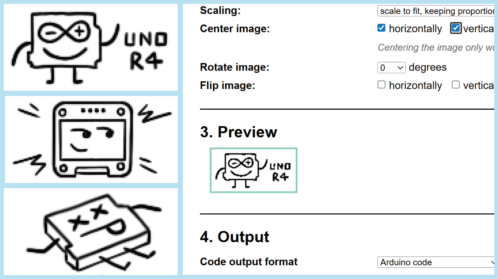
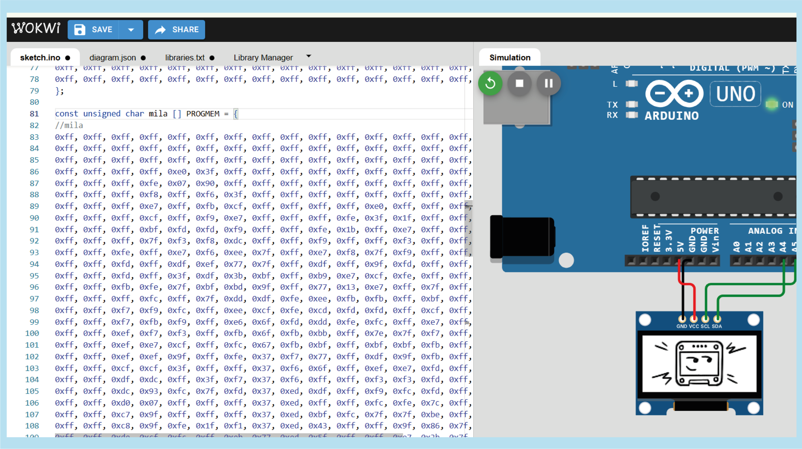
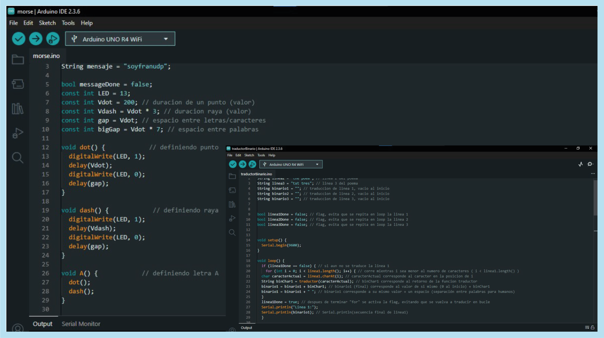

# proyecto-01

## Acerca del proyecto

- Grupo: 04 Los Vengadores mish

- Integrantes:
  - Josefa Quape
  - Milla Millar / [mmillar95](https://github.com/mmillar95)
  - José Morales / [jotamorales-romulus](https://github.com/jotamorales-romulus)
  - Francisco Stephens

## Presentación textual

El proyecto arduinoMishBinarioV2 busca explorar la relación entre texto (binario). imagen y control interactivo (potenciómetro) mediante el uso de una placa de Arduino Uno R4 y una pantalla OLED.

El problema de diseño es la traducción de un poema tipo haiku a código binario y la representación del mensaje en una pantalla OLED, con la condición de que se pueda deslizar verticalmente la información por medio del potenciómetro.

- El poema que hicimos es el siguiente:

Código Arduino 

OLED ya encendido

Cerebro fundido

## Inputs y outputs

Input: Usuario manipulando la perilla del potenciómetro (conectado al pin analogo A0)

Output: Haiku en pantalla OLED (refleja la información texto, dibujo, traductor)

## Bocetos de planificación

Fotografías y dibujos de maquetas y pruebas

- Trabajo en la aplicación Procreate para realizar los 3 dibujos que se utilizarán
- Luego, con las imágenes generadas se pasaron a image2cpp
  


- Al no tener la pantalla OLED físicamente, se trabajó con Wokwi
  


- Se realizó un código simple con el potenciómetro para conocer cómo funciona
- Al mismo tiempo, se trabaja con la pantalla OLED
  


- Al mismo tiempo se estaba desarrollando el código traductor binario
  



## Etapas del código

### ArduinoMishBinario

Establecemos la pantalla OLED de 128 x 64 que vamos a utilizar para mostrar la información en pantalla.

```cpp
#define SCREEN_WIDTH 128
#define SCREEN_HEIGHT 64
#define OLED_RESET -1
```

Creamos “pantallita” la cual contiene los parámetros necesarios para controlar la pantalla. Es darle un apodo a nuestra pantalla. Cada vez que la controlemos, se deberá usar este apodo.

```cpp
Adafruit_SSD1306 pantallita(SCREEN_WIDTH, SCREEN_HEIGHT, &Wire, OLED_RESET);
```

```cpp
//  pin para el potenciómetro
int potPin = A0;
```

potPin indica que el potenciómetro está en A0, para que el Arduino  lea sus valores, paddingX es un valor fijo para ajustar la posición en la pantalla, aquí 0 significa sin desplazamiento. haiku0, haiku1,haiku2 guardan los textos de binario0, binario1 y binario2 respectivamente, para poder mostrarlos fácilmente en pantalla.

```cpp
//  pin para el potenciometro
int potPin = A0;
const int paddingX = 0;
// parrafo 1
String haiku0 = binario0; // traduccion de linea 1, vacio al inicio
// parrafo 2
String haiku1 = binario1;
// parrafo 3
String haiku2 = binario2;
```


Esta es una parte esencial del código, ya que se definen tanto tamaños y espacios para mostrar contenido en la pantalla, esta parte fue un desafío total ya que tuvimos que hacer muchos ajustes para que quedara bien ajustada la info en pantalla. 

```cpp
// Constantes para calcular el tamaño del lienzo
// Espacio vertical entre cada objeto en pantalla
// modificar esto para epaciado texto e imagen
const int PADDING = 40;
// Altura estimada para el texto
const int TEXT_HEIGHT = 5;
const int TEXT_BINARY_HEIGHT = 5 * TEXT_HEIGHT;
// Altura de la imagen
const int IMAGE_HEIGHT = 125;
// altura total = 3 * texto + 3 imágenes + 4 separaciones
const int TOTAL_CONTENT_HEIGHT = (3 * TEXT_HEIGHT) + (3 * IMAGE_HEIGHT) + (5 * PADDING);
const int MAX_SCROLL = TOTAL_CONTENT_HEIGHT > SCREEN_HEIGHT ? TOTAL_CONTENT_HEIGHT - SCREEN_HEIGHT : 0;
// variable global que almacena la posición Y actual del scroll
int yScroll = 0;
```

La función setup() se ejecuta solo al inicio para preparar todo. Activa la comunicación con la compu para poder ver mensajes de prueba. Después intenta iniciar la pantalla OLED; si no lo logra, da un mensaje de error y para el programa. Si se inicia correctamente, limpia la pantalla y pone los datos en pantalla.

```cpp
void setup() {
  Serial.begin(9600);

  if (!pantallita.begin(SSD1306_SWITCHCAPVCC, 0x3C)) {
    Serial.println(F("Fallo al iniciar SSD1306"));
    while (1)
      ;
  }

  // borrar contenidos pantalla
  pantallita.clearDisplay();

  // definir tamano texto y color
  pantallita.setTextColor(SSD1306_WHITE);
  pantallita.setTextSize(1);
}
```

En Loop(), se actualizan los textos binarios y se guardan en haiku0, haiku1 y haiku2. Luego se crean variables x e y en 0, se lee el potenciometro y se usa su valor para mover el scroll en la pantalla. 

````cpp
void loop() {

	loopBinario();

	haiku0 = binario0;
	haiku1 = binario1;
	haiku2 = binario2;

	// crear variables locales
	// inicializar en 0
	// para que TODO
	int x = 0;
	int y = 0;

	// leer potenciometro
	int valorPot = analogRead(potPin);

	// mapear valor
	yScroll = map(valorPot, 0, 1023, 0, MAX_SCROLL);
````

Esta parte del código se encarga de mostrar la info en el OLED, tanto como texto e imagen y permite moverlos verticalmente usando un potenciómetro. Lo primero que ocurre es que en el monitor serial, se lee el valor del potenciómetro, lo que sirve para saber qué está ocurriendo. 

Los haikus e imágenes se van mostrando uno debajo del otro. Para eso, se usó la variable y, que controla la posición vertical, y le resta yScroll para ajustar el contenido según la posición del potenciómetro, dando como resultado el scroll, como navegar una página web.
Para que no se vean pegados los ítems en pantalla se utiliza el Padding, para dar espacio entre ellos.

Finalmente, con pantallita.display() actualiza la pantalla para que se vea todo lo que se ha dibujado y se da un tiempo de espera con delay(10) antes de repetir el proceso. Así, cada vez que se gira el potenciómetro, los ítem en pantalla suben y bajan de forma fluida en la pantalla.

````cpp
// imprime el valor del potenciómetro en el monitor serie
	Serial.print("Valor del potenciómetro: ");
	Serial.println(valorPot);

	pantallita.clearDisplay();

	pantallita.setCursor(paddingX, y - yScroll);
	pantallita.print(haiku0);
	y += TEXT_BINARY_HEIGHT + PADDING;

	pantallita.setCursor(paddingX, y - yScroll);
	pantallita.drawBitmap(paddingX, y - yScroll, imagen0, 128, 64, SSD1306_WHITE);
	y += IMAGE_HEIGHT + PADDING;

	pantallita.setCursor(paddingX, y - yScroll);
	pantallita.print(haiku1);
	y += TEXT_BINARY_HEIGHT + PADDING;

	pantallita.setCursor(paddingX, y - yScroll);
	pantallita.drawBitmap(paddingX, y - yScroll, imagen1, 128, 64, SSD1306_WHITE);
	y += IMAGE_HEIGHT + PADDING;

	pantallita.setCursor(paddingX, y - yScroll);
	pantallita.print(haiku2);
	y += TEXT_BINARY_HEIGHT + PADDING;

	pantallita.setCursor(paddingX, y - yScroll);
	pantallita.drawBitmap(paddingX, y - yScroll, imagen2, 128, 64, SSD1306_WHITE);
	y += IMAGE_HEIGHT + PADDING;

	// pantallita.drawBitmap(paddingX, y - yScroll, imagen1, 128, 64, SSD1306_WHITE);

	// y += IMAGE_HEIGHT + PADDING;
	// pantallita.drawBitmap(paddingX, y - yScroll, imagen2, 128, 64, SSD1306_WHITE);

	pantallita.display();

	delay(10);
}
````

### imágenes2cpp
Se incluye el código imagenes en el archivo principal.

```cpp
#include "imagenes.h"
```
Imagenes convertidas a codigo [image2cpp](https://javl.github.io/image2cpp/)

```cpp
const unsigned char imagen0[] PROGMEM = {
0x00, 0x00, 0x00, 0x00, 0x00, 0x00, 0x00, 0x00, 0x00, 0x00, 0x00, 0x00, 0x00, 0x00, 0x00, 0x00,0x00, 0x00, 0x00, 0x00, 0x00, 0x00, 0x00, 0x00, 0x00, 0x00, 0x00, 0x00, 0x00, 0x00, ....
	};
```

### Binario

Se incluye el código traductor en el archivo principal.
```cpp
#include "traductorBinario.h"
```

Cada línea del haiku cuenta con 3 variables, la primera, un String que contiene cada verso en lenguaje humano, la segunda, otro String, donde el programa va dejando el código binario mientras lo procesa y al terminar. Y una flag, que se encarga de que el programa convierta el verso solo una vez.
```cpp
// linea 0 del poema
String linea0 = "inserte texto aquí"; 
// traduccion de linea 0, vacío al inicio
String binario0 = "";
// flag, evita que se repita en loop la linea 1
bool linea0Done = false;
```

La función String traductor( ) recibe un caracter a la vez y los pasa a través de una declaración switch, que toma el caracter, lo compara con cada letra del abecedario hasta que encuentra con cual coincide y retorna el código binario correspondiente al carácter
```cpp
// toma el caracter actual, ve con cual caso corresponde y envia el valor de retorno
String traductor(char sorter) {   switch (sorter) {
    case 'a':
      return "01100001";
    case 'b':
      return "01100010";
….
```

Pero antes de darle los caracteres a String traductor( ), hay que tomar el verso, descomponerlo en sus caracteres y dárselos uno a uno a la función.

Este bloque consiste de una declaración if, que revisa si el verso ha sido traducido, en caso que aún no haya sido traducido, correrá una declaración for hasta que el verso haya sido traducido
```cpp
// si aun no se traduce la linea 0
if (linea0Done == false) { 

// corre mientras i sea menor al número de caracteres del verso
    for (int i = 0; i < linea0.length(); i++) {
```

Toma el caracter en la posición de izquierda a derecha equivalente al valor de i, luego le envía este caracter a la función traductor( ) y obtiene la respuesta, la cual es asignada a una variable
```cpp
// caracterActual corresponde al caracter en la posicion de i
  char caracterActual = linea0.charAt(i); 

// binChar0 corresponde al retorno de la funcion traductor
  String binChar0 = traductor(caracterActual);
```

Luego almacena cada retorno dentro de la variable binario y añade una separación para hacerlo legible. Finalmente cambia el estado de la flag para que no se repita el código y hace Serial.print

```cpp
// binario0 (final) corresponde al valor de si mismo (0 al inicio) + binChar0
  binario0 = binario0 + binChar0; 

// binario0 corresponde a su mismo valor + un espacio (separación entre letras, para humanos)
  binario0 = binario0 + " ";
  }

// despues de terminar "for" se activa la flag, evitando que se vuelva a traducir en bucle
  linea0Done = true;

// Serial.println(secuencia final de linea0)
  Serial.println("Linea 0:");
  Serial.println(binario0);
  }
```

## Roles del equipo
- Josefa Quape: Investigación buzzer y pruebas en Arduino. Conceptualización del proyecto.

- Millaray Millar: Dibujo haiku. Función potenciómetro. Conceptualización del proyecto.

- José Morales: Imágenes a código C++. Scroll imágenes a código. Conceptualización del proyecto.

- Francisco Stephens: Función traducción binario. Conceptualización del proyecto.

## Fotografías y videos del proyecto funcionado

Subir fotos y videos

El video debe estar subido a youtube y mencionado en un enlace para ahorrar espacio en el repositorio

## Bibliografía
- Citas en APA de repositorios y enlaces de los cuales se inspiraron. Bibliotecas, tutoriales, etc.
Johann Perez E. (2021, 4 marzo). 💡 Cómo conectar un Zumbador Pasivo a Arduino (Passive Buzzer)  【 2021】 - Capítulo #24🔋 [Vídeo]. https://www.youtube.com/watch?v=PfXZ3ptiGVA

- Correct syntax for draw.Bitmap. (2021, 28 mayo). Arduino Forum.Correct syntax for draw.Bitmap - Other Hardware / Displays - Arduino Forum 

- Del Valle Hernández, L. (2022, 13 enero). Sentencia if con Arduino, controla la ejecución de tu código. Programarfacil Arduino y Home Assistant.Sentencia if con Arduino, controla la ejecución de tu código 

- Instructables. (2020, 19 diciembre). How to Display Images on OLED Using Arduino. Instructables.How to Display Images on OLED Using Arduino : 6 Steps (with Pictures) - Instructables 

- Mission Critical. (2020, 19 diciembre). how to display images on 0.96" oled using arduino [Vídeo]. YouTube.how to display images on 0.96" oled using arduino - YouTube 

- Código scrollVertical basado en ejemplo de @matbutom [matbutom ](https://github.com/matbutom)

