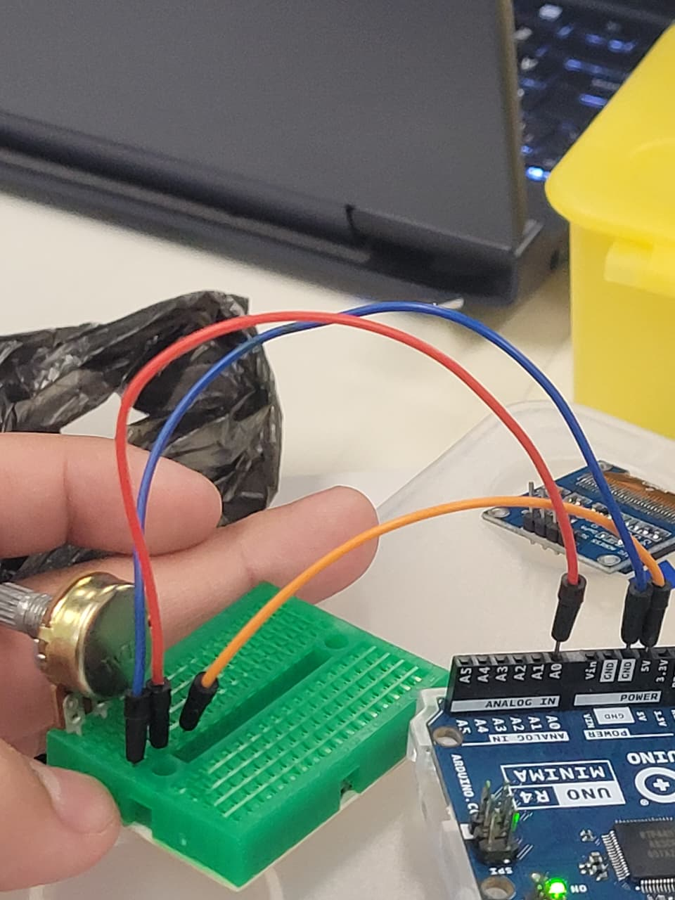
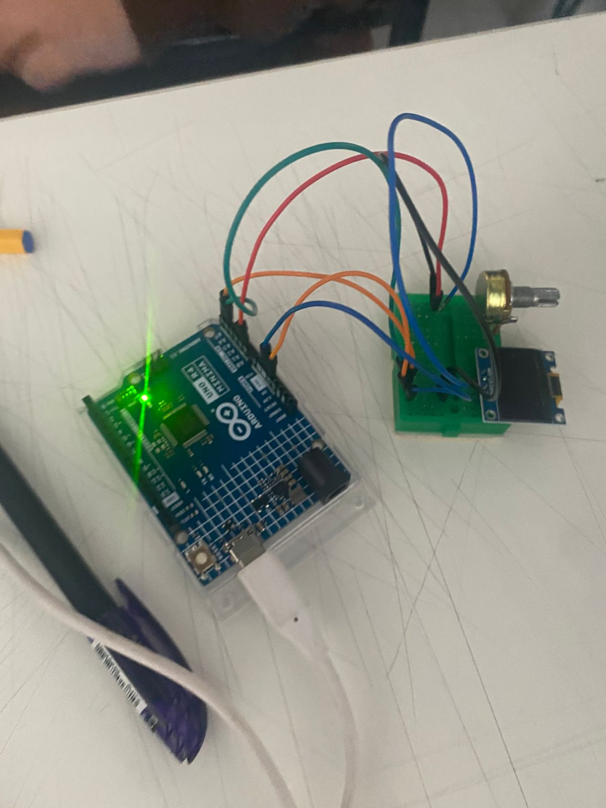
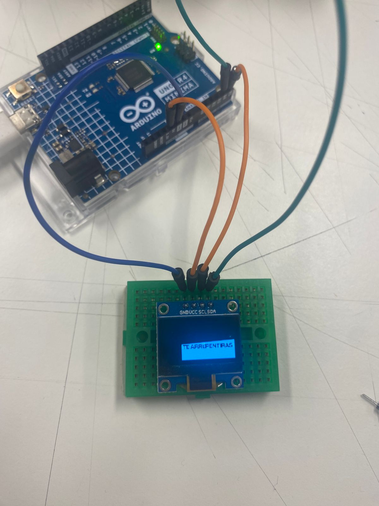
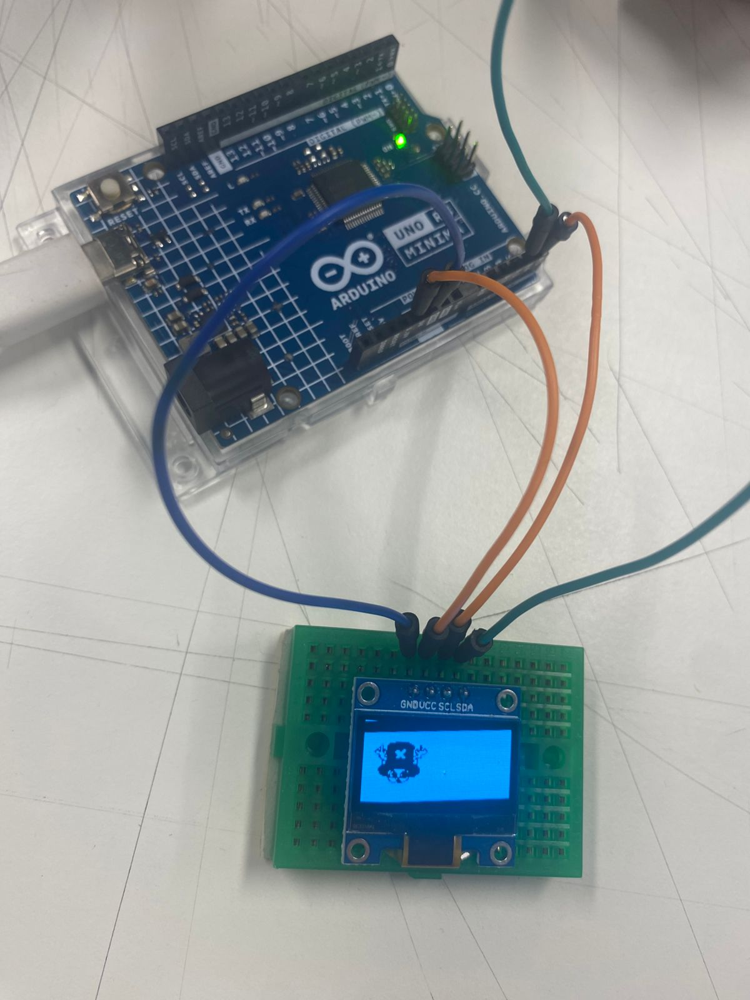
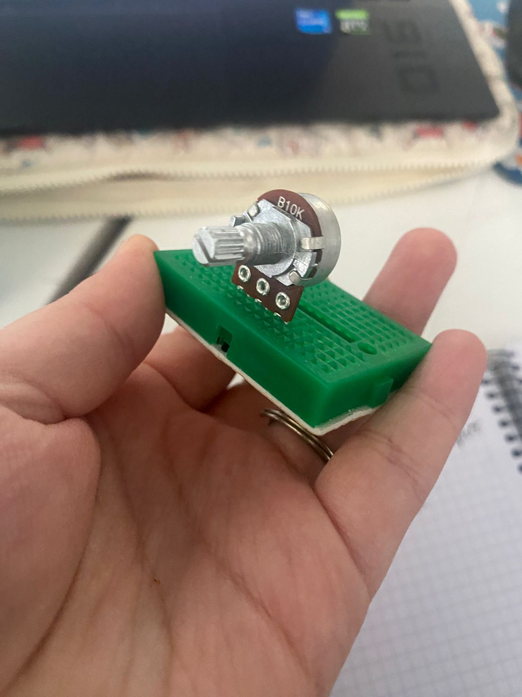

# proyecto-01

## Acerca del proyecto

- Grupo: 07
- Nombre de grupo: SOUNDI
- Integrantes:
  - Yamna Carrión.
  - Catalina Catalán.
  - Nicolás Miranda.

## Presentación textual

El problema de diseño que se abordó fue cómo crear una experiencia visual capaz de transmitir un mensaje a través del diseño y las máquinas computacionales. La intención no es solo mostrar un texto, sino también explorar de que manera la tecnología podría acompañar y transformar la forma en que interactuamos con la poesía.

La propuesta busca poder expresar y transmitir un poema, tomando como referencia "Sueños" de Langston Hughes. La elección de este poema se basó en el contenido y la reflexión que nos entrega, ya que habla de la importancia de aferrase a los sueños, incluso cuando las cosas no van bien.

### Poema: "Sueños" de langston hughes

Aférrate a tus sueños

porque si los sueños mueren,

la vida es como un pájaro de alas rotas

incapaz de volar.

Aférrate a tus sueños

porque si los sueños se marchan,

la vida es como un campo yermo

cubierto de escarcha.

## Inputs y outputs

El proyecto consiste en utilizar una pantalla OLED que actúa como un transmisor de fotogramas. En la cual aparecen versos del poema en movimiento. Esto genera una visualización dinámica similar a un video, que guía la forma de la lectura.

Lo que ofrece la máquina de vuelta es una experiencia visual distinta: mediante la manipulación de la perilla del potenciómetro, el movimiento ascendente y continuo de los fotogramas va cambiando uno a otro, generando la ilusión de movimiento continuo y proyectando nuestra propuesta.

## Bocetos de planificación

- [proceso-1](/00-proyecto-01/grupo07/imagenes/proceso-1/proceso-1.ino)
  
Al inicio tuvimos algunos errores que nos impedían avanzar, por lo que no podíamos ver los resultados en la pantalla correctamente.

- [proceso-2](/00-proyecto-01/grupo07/poema-proceso/proceso-2/proceso-2.ino)

Queríamos que los fotogramas se mostraran en la pantalla, pero inicialmente no funcionaba. Con el código del profesor Aarón, reemplazamos `Serial.println()` por `pantallita.drawBitmap()`, logrando que los valores se mostraran directamente en la pantalla:

```cpp
//Antes, usábamos `Serial.println()` para mostrar los valores en el monitor serie
if (valorPot < 300) {
 Serial.println();
 }
// Para que se pudiera ver en la pantalla, reemplazamos "Serial.println()" por:
 if (valorPot < 300) {
 pantallita.drawBitmap();
 }
```

- [proceso-3](/00-proyecto-01/grupo07/poema-proceso/proceso-3/proceso-3.ino)

Aquí incorporamos todos los fotogramas que teníamos para poder visualizarlos directamente en la pantalla y evaluar cómo se mostraban.

- [proceso-4](/00-proyecto-01/grupo07/poema-proceso/proceso-4/proceso-4.ino)
  
Agregamos más fotogramas hasta alcanzar un total de 16, que es la cantidad que utilizaremos. Dado que el potenciómetro entrega valores entre 0 y 1023, cada fotograma corresponde a un segmento igual del potenciómetro. Al dividir 1024 valores entre 16 fotogramas, obtenemos 64 valores por fotograma. Así, cada fotograma aparece durante exactamente el mismo “tiempo” al girar el potenciómetro, cubriendo un rango igual de 64 valores.

- [proceso-5](/00-proyecto-01/grupo07/poema-proceso/proceso-5/proceso-5.ino)

Luego probamos un código que nos proporcionó nuestra compañera Catalina, el cual funcionó correctamente y permitió que el proyecto avanzara.

- proceso-6

Creación de fotogramas: primero los pasamos por Illustrator, tanto los escritos como las imágenes.
  
- proceso-7

Finalmente, unimos todos los códigos, dando como resultado nuestra visualización final.

## Etapas del código

```cpp
//Librerías
#include <Wire.h>
#include <Adafruit_GFX.h>
#include <Adafruit_SSD1306.h>

//Parámetros de la pantalla
#define SCREEN_WIDTH 128
#define SCREEN_HEIGHT 64
#define OLED_RESET -1

//Objeto de la pantalla (I2C)
Adafruit_SSD1306 pantallita(SCREEN_WIDTH, SCREEN_HEIGHT, &Wire, OLED_RESET);

<details>
//datos  de cada fotograma (128x64 px)
const unsigned char fotograma1 [] PROGMEM = {
  //'fotograma1', 128x64px
 0xff, 0xff, 0xff, 0xff, 0xff, 0xff, 0xff, 0xff, 0xff, 0xff, 0xff, 0xff, 0xff, 0xff, 0xff, 0xf0, 
 0xff, 0xff, 0xff, 0xff, 0xff, 0xff, 0xff, 0xff, 0xff, 0xff, 0xff, 0xff, 0xff, 0xff, 0xff, 0xf0, 
 0xff, 0xff, 0xff, 0xff, 0xff, 0xff, 0xff, 0xff, 0xff, 0xff, 0xff, 0xff, 0xff, 0xff, 0xff, 0xf0, 
 0xff, 0xff, 0xff, 0xff, 0xff, 0xff, 0xff, 0xff, 0xff, 0xff, 0xff, 0xff, 0xff, 0xff, 0xff, 0xf0, 
 0xff, 0xff, 0xff, 0xff, 0xff, 0xff, 0xff, 0xff, 0xff, 0xff, 0xff, 0xff, 0xff, 0xff, 0xff, 0xf0, 
 0xff, 0xff, 0xff, 0xff, 0xff, 0xff, 0xff, 0xff, 0xff, 0xff, 0xff, 0xff, 0xff, 0xff, 0xff, 0xf0, 
 0xff, 0xff, 0xff, 0xff, 0xff, 0xff, 0xff, 0xff, 0xff, 0xff, 0xff, 0xff, 0xff, 0xff, 0xff, 0xf0, 
 0xff, 0xff, 0xff, 0xff, 0xff, 0xff, 0xff, 0xff, 0xff, 0xff, 0xff, 0xff, 0xff, 0xff, 0xff, 0xf0, 
 0xff, 0xff, 0xff, 0xff, 0xff, 0xff, 0xff, 0xff, 0xff, 0xff, 0xff, 0xff, 0xff, 0xff, 0xff, 0xf0, 
 0xff, 0xff, 0xff, 0xfc, 0xff, 0xff, 0xff, 0xff, 0xff, 0xff, 0xff, 0xff, 0xff, 0xff, 0xff, 0xf0, 
 0xff, 0xff, 0xff, 0xfc, 0x7f, 0xff, 0xff, 0xff, 0xff, 0xff, 0xff, 0xff, 0xff, 0xff, 0xff, 0xf0, 
 0xff, 0xff, 0xff, 0xfc, 0x3f, 0xff, 0xff, 0xff, 0xff, 0xff, 0xff, 0xff, 0xff, 0xff, 0xff, 0xf0, 
 0xff, 0xff, 0xff, 0xfc, 0x1b, 0xff, 0xff, 0xff, 0xff, 0xff, 0xff, 0xff, 0xff, 0xff, 0xff, 0xf0, 
 0xff, 0xf7, 0xff, 0xfe, 0x09, 0xff, 0xff, 0xff, 0xff, 0xff, 0xff, 0xff, 0xff, 0xff, 0xff, 0xf0, 
 0xff, 0xf1, 0xff, 0xfe, 0x04, 0xff, 0xff, 0xff, 0xff, 0xff, 0xff, 0xff, 0xff, 0xff, 0xff, 0xf0, 
 0xff, 0xf8, 0x7b, 0xff, 0x00, 0x7f, 0xff, 0xff, 0xff, 0xff, 0xff, 0xff, 0xff, 0xff, 0xff, 0xf0, 
 0xff, 0xf8, 0x38, 0xff, 0x80, 0x3f, 0xff, 0xff, 0xff, 0xff, 0xff, 0xff, 0xff, 0xff, 0xff, 0xf0, 
 0xff, 0xfc, 0x0c, 0x78, 0xc0, 0x1f, 0xff, 0xff, 0xff, 0xff, 0xff, 0xff, 0xff, 0xff, 0xff, 0xf0, 
 0xff, 0xfe, 0x02, 0x18, 0x60, 0x0f, 0xff, 0xff, 0xff, 0xff, 0xff, 0xff, 0xff, 0xff, 0xff, 0xf0, 
 0xff, 0xff, 0x00, 0x08, 0x00, 0x07, 0xff, 0xff, 0xff, 0xff, 0xff, 0xff, 0xff, 0xff, 0xff, 0xf0, 
 0xff, 0xff, 0xc0, 0x00, 0x00, 0x03, 0xff, 0xff, 0xff, 0xff, 0xff, 0xff, 0xff, 0xff, 0xff, 0xf0, 
 0xff, 0xfc, 0x60, 0x00, 0x00, 0x01, 0xff, 0xff, 0xff, 0xff, 0xff, 0xff, 0xff, 0xff, 0xff, 0xf0, 
 0xff, 0xfc, 0x00, 0x00, 0x00, 0x00, 0xff, 0xff, 0xff, 0xff, 0xff, 0xff, 0xff, 0xff, 0xff, 0xf0, 
 0xff, 0xfe, 0x00, 0x00, 0x00, 0x00, 0x7f, 0xff, 0xff, 0xff, 0xff, 0xff, 0xff, 0xff, 0xff, 0xf0, 
 0xff, 0xff, 0x00, 0x00, 0x00, 0x00, 0x7f, 0xff, 0xff, 0xff, 0xff, 0xff, 0xff, 0xff, 0xff, 0xf0, 
 0xff, 0xff, 0x80, 0x00, 0x00, 0x00, 0x7f, 0xff, 0xff, 0xff, 0xff, 0xff, 0xff, 0xff, 0xff, 0xf0, 
 0xff, 0xff, 0xf0, 0x00, 0x00, 0x00, 0x3f, 0xff, 0xff, 0xff, 0xff, 0xff, 0xff, 0xff, 0xff, 0xf0, 
 0xff, 0xff, 0xf8, 0x00, 0x00, 0x00, 0x3f, 0xff, 0xff, 0xff, 0xff, 0xff, 0xff, 0xff, 0xff, 0xf0, 
 0xff, 0xff, 0xc0, 0x00, 0x00, 0x00, 0x3f, 0xff, 0xff, 0xff, 0xff, 0xff, 0xff, 0xff, 0xff, 0xf0, 
 0xff, 0xff, 0xe0, 0x00, 0x00, 0x00, 0x1f, 0xff, 0xff, 0xff, 0xff, 0xff, 0xff, 0xff, 0xff, 0xf0, 
 0xff, 0xff, 0xf8, 0x00, 0x00, 0x00, 0x1f, 0xff, 0xff, 0xff, 0xff, 0xff, 0xff, 0xff, 0xff, 0xf0, 
 0xff, 0xff, 0xf0, 0x00, 0x00, 0x00, 0x0f, 0xff, 0xff, 0xff, 0xff, 0xff, 0xff, 0xff, 0xff, 0xf0, 
 0xff, 0xff, 0xf0, 0x00, 0x00, 0x00, 0x0f, 0xff, 0xff, 0xff, 0xff, 0xff, 0xff, 0xff, 0xff, 0xf0, 
 0xff, 0xff, 0xfc, 0x00, 0x00, 0x00, 0x07, 0xff, 0xff, 0xff, 0xff, 0xff, 0xff, 0xff, 0xff, 0xf0, 
 0xff, 0xff, 0xfe, 0x00, 0x00, 0x00, 0x00, 0x00, 0x1f, 0xff, 0xff, 0xff, 0xff, 0xff, 0xff, 0xf0, 
 0xff, 0xff, 0xfc, 0x00, 0x00, 0x00, 0x00, 0x00, 0x1f, 0xff, 0xff, 0xff, 0xff, 0xff, 0xff, 0xf0, 
 0xff, 0xff, 0xfc, 0x00, 0x00, 0x00, 0x00, 0x00, 0x7f, 0xff, 0xff, 0xff, 0xff, 0xff, 0xff, 0xf0, 
 0xff, 0xff, 0xff, 0x00, 0x00, 0x00, 0x00, 0x00, 0xff, 0xff, 0xff, 0xff, 0xff, 0xff, 0xff, 0xf0, 
 0xff, 0xff, 0xff, 0x80, 0x00, 0x00, 0x00, 0x01, 0xff, 0xff, 0xff, 0xff, 0xff, 0xff, 0xff, 0xf0, 
 0xff, 0xff, 0xff, 0xc0, 0x00, 0x00, 0x00, 0x07, 0xff, 0xff, 0xff, 0xff, 0xff, 0xff, 0xff, 0xf0, 
 0xff, 0xff, 0xff, 0xe0, 0x00, 0x00, 0x00, 0x0f, 0xff, 0xff, 0xff, 0xff, 0xff, 0xff, 0xff, 0xf0, 
 0xff, 0xff, 0xff, 0xf8, 0x00, 0x00, 0x00, 0x1f, 0xff, 0xff, 0xff, 0xff, 0xff, 0xff, 0xff, 0xf0, 
 0xff, 0xff, 0xff, 0xfe, 0x00, 0x00, 0x00, 0x1f, 0xff, 0xff, 0xff, 0xff, 0xff, 0xff, 0xff, 0xf0, 
 0xff, 0xff, 0xff, 0xff, 0x00, 0x00, 0x00, 0x3f, 0xff, 0xcf, 0xff, 0xff, 0xff, 0xff, 0xff, 0xf0, 
 0xff, 0xff, 0xff, 0xff, 0xc0, 0x00, 0x00, 0x7f, 0xff, 0xdf, 0xff, 0xff, 0xff, 0xff, 0xff, 0xf0, 
 0xff, 0xff, 0xff, 0xff, 0xe0, 0x00, 0x00, 0xf7, 0x81, 0x04, 0x1c, 0x1f, 0xdc, 0x08, 0x3f, 0xf0, 
 0xff, 0xff, 0xff, 0xff, 0xf8, 0x00, 0x01, 0xe7, 0x81, 0x04, 0x0c, 0x0f, 0x98, 0x08, 0x3f, 0xf0, 
 0xff, 0xff, 0xff, 0xff, 0xf0, 0x00, 0x07, 0xe7, 0x9e, 0x3c, 0xcc, 0xcf, 0x9e, 0x71, 0xff, 0xf0, 
 0xff, 0xff, 0xff, 0xff, 0xc0, 0x00, 0x7f, 0xc7, 0x9e, 0x7c, 0xcc, 0xcf, 0x1e, 0x73, 0xff, 0xf0, 
 0xff, 0xff, 0xff, 0xff, 0x00, 0x07, 0xff, 0x83, 0x02, 0x08, 0x18, 0x1e, 0x0e, 0x70, 0x7f, 0xf0, 
 0xff, 0xff, 0xff, 0xfc, 0x00, 0xff, 0xff, 0x93, 0x06, 0x08, 0x18, 0x1e, 0x4e, 0x70, 0x7f, 0xf0, 
 0xff, 0xff, 0xff, 0xf0, 0x0f, 0xff, 0xff, 0x13, 0x3e, 0x79, 0x39, 0x3c, 0x4e, 0x73, 0xff, 0xf0, 
 0xff, 0xff, 0xff, 0xc0, 0x7f, 0xff, 0xff, 0x03, 0x3e, 0x79, 0x39, 0x3c, 0x0c, 0xf3, 0xff, 0xf0, 
 0xff, 0xff, 0xff, 0x03, 0xff, 0xff, 0xfe, 0x01, 0x3c, 0x09, 0x99, 0x98, 0x04, 0xe0, 0x7f, 0xf0, 
 0xff, 0xff, 0xfe, 0x1f, 0xff, 0xff, 0xfc, 0x79, 0x3c, 0x09, 0x99, 0x91, 0xe4, 0xe0, 0x7f, 0xf0, 
 0xff, 0xff, 0xfe, 0xff, 0xff, 0xff, 0xff, 0xff, 0xff, 0xff, 0xff, 0xff, 0xff, 0xff, 0xff, 0xf0, 
 0xff, 0xff, 0xff, 0xff, 0xff, 0xff, 0xff, 0xff, 0xff, 0xff, 0xff, 0xff, 0xff, 0xff, 0xff, 0xf0, 
 0xff, 0xff, 0xff, 0xff, 0xff, 0xff, 0xff, 0xff, 0xff, 0xff, 0xff, 0xff, 0xff, 0xff, 0xff, 0xf0, 
 0xff, 0xff, 0xff, 0xff, 0xff, 0xff, 0xff, 0xff, 0xff, 0xff, 0xff, 0xff, 0xff, 0xff, 0xff, 0xf0, 
 0xff, 0xff, 0xff, 0xff, 0xff, 0xff, 0xff, 0xff, 0xff, 0xff, 0xff, 0xff, 0xff, 0xff, 0xff, 0xf0, 
 0xff, 0xff, 0xff, 0xff, 0xff, 0xff, 0xff, 0xff, 0xff, 0xff, 0xff, 0xff, 0xff, 0xff, 0xff, 0xf0, 
 0xff, 0xff, 0xff, 0xff, 0xff, 0xff, 0xff, 0xff, 0xff, 0xff, 0xff, 0xff, 0xff, 0xff, 0xff, 0xf0, 
 0xff, 0xff, 0xff, 0xff, 0xff, 0xff, 0xff, 0xff, 0xff, 0xff, 0xff, 0xff, 0xff, 0xff, 0xff, 0xf0, 
 0xff, 0xff, 0xff, 0xff, 0xff, 0xff, 0xff, 0xff, 0xff, 0xff, 0xff, 0xff, 0xff, 0xff, 0xff, 0xf0
};

const unsigned char fotograma2 [] PROGMEM = {
  //'fotograma2', 128x64px
 0xff, 0xff, 0xff, 0xff, 0xff, 0xff, 0xff, 0xff, 0xff, 0xff, 0xff, 0xff, 0xff, 0xff, 0xff, 0xf0, 
 0xff, 0xff, 0xff, 0xff, 0xff, 0xff, 0xff, 0xff, 0xff, 0xff, 0xff, 0xff, 0xff, 0xff, 0xff, 0xf0, 
 0xff, 0xff, 0xff, 0xff, 0xff, 0xff, 0xff, 0xff, 0xff, 0xff, 0xff, 0xff, 0xff, 0xff, 0xff, 0xf0, 
 0xff, 0xff, 0xff, 0xff, 0xff, 0xff, 0xff, 0xff, 0xff, 0xff, 0xff, 0xff, 0xff, 0xff, 0xff, 0xf0, 
 0xff, 0xff, 0xff, 0xff, 0xff, 0xff, 0xff, 0xff, 0xff, 0xff, 0xff, 0xff, 0xff, 0xff, 0xff, 0xf0, 
 0xff, 0xff, 0xff, 0xff, 0xff, 0xff, 0xff, 0xff, 0xff, 0xff, 0xff, 0xff, 0xff, 0xff, 0xff, 0xf0, 
 0xff, 0xff, 0xff, 0xff, 0xff, 0xff, 0xff, 0xff, 0xff, 0xff, 0xff, 0xff, 0xff, 0xff, 0xff, 0xf0, 
 0xff, 0xff, 0xff, 0xff, 0xff, 0xff, 0xff, 0xff, 0xff, 0xff, 0xff, 0xff, 0xff, 0xff, 0xff, 0xf0, 
 0xff, 0xff, 0xff, 0xff, 0xff, 0xff, 0xff, 0xff, 0xff, 0xff, 0xff, 0xff, 0xff, 0xff, 0xff, 0xf0, 
 0xff, 0xff, 0xff, 0xff, 0xff, 0xff, 0xff, 0xff, 0xff, 0xff, 0xff, 0xff, 0xff, 0xff, 0xff, 0xf0, 
 0xff, 0xff, 0xff, 0xff, 0xff, 0xff, 0xff, 0xff, 0xff, 0xff, 0xff, 0xff, 0xff, 0xff, 0xff, 0xf0, 
 0xff, 0xff, 0xff, 0xff, 0xff, 0xff, 0xff, 0xff, 0xff, 0xff, 0xff, 0xff, 0xff, 0xff, 0xff, 0xf0, 
 0xff, 0xff, 0xff, 0xff, 0xff, 0xff, 0xff, 0xff, 0xff, 0xff, 0xff, 0xff, 0xff, 0xff, 0xff, 0xf0, 
 0xff, 0xff, 0xff, 0xff, 0xff, 0xff, 0xff, 0xff, 0xff, 0xff, 0xff, 0xff, 0xff, 0xff, 0xff, 0xf0, 
 0xff, 0xff, 0xff, 0xff, 0xff, 0xff, 0xff, 0xff, 0xff, 0xff, 0xff, 0xff, 0xff, 0xff, 0xff, 0xf0, 
 0xff, 0xff, 0xff, 0xff, 0xff, 0x7f, 0xff, 0xff, 0xff, 0xff, 0xff, 0xff, 0xff, 0xff, 0xff, 0xf0, 
 0xff, 0xff, 0xff, 0xff, 0xff, 0x1f, 0xff, 0xff, 0xff, 0xff, 0xff, 0xff, 0xff, 0xff, 0xff, 0xf0, 
 0xff, 0xff, 0xff, 0xff, 0xff, 0x8f, 0xff, 0xff, 0xff, 0xff, 0xff, 0xff, 0xff, 0xff, 0xff, 0xf0, 
 0xff, 0xff, 0xff, 0xff, 0xff, 0x87, 0xff, 0xff, 0xff, 0xff, 0xff, 0xff, 0xff, 0xff, 0xff, 0xf0, 
 0xff, 0xff, 0xff, 0xff, 0xff, 0x83, 0x3f, 0xff, 0xff, 0xff, 0xff, 0xff, 0xff, 0xff, 0xff, 0xf0, 
 0xff, 0xff, 0xff, 0xff, 0xff, 0xc1, 0x9f, 0xff, 0xff, 0xff, 0xff, 0xff, 0xff, 0xff, 0xff, 0xf0, 
 0xff, 0xff, 0xff, 0xff, 0xff, 0xc0, 0x8f, 0xff, 0xff, 0xff, 0xff, 0xff, 0xff, 0xff, 0xff, 0xf0, 
 0xff, 0xff, 0xff, 0xff, 0xfe, 0x60, 0x07, 0xff, 0xff, 0xff, 0xff, 0xff, 0xff, 0xff, 0xff, 0xf0, 
 0xff, 0xff, 0xff, 0xff, 0xfe, 0x10, 0x03, 0xff, 0xff, 0xff, 0xff, 0xff, 0xff, 0xff, 0xff, 0xf0, 
 0xff, 0xff, 0xff, 0xff, 0xff, 0x00, 0x01, 0xff, 0xff, 0xff, 0xff, 0xff, 0xff, 0xff, 0xff, 0xf0, 
 0xff, 0xff, 0xff, 0xff, 0xff, 0x00, 0x00, 0xff, 0xff, 0xff, 0xff, 0xff, 0xff, 0xff, 0xff, 0xf0, 
 0xff, 0xff, 0xff, 0xff, 0xff, 0xc0, 0x00, 0xff, 0xff, 0xff, 0xff, 0xff, 0xff, 0xff, 0xff, 0xf0, 
 0xff, 0xff, 0xf1, 0xf1, 0xfc, 0x60, 0x00, 0x7f, 0xff, 0xff, 0xff, 0xff, 0xff, 0xff, 0xff, 0xf0, 
 0xff, 0xff, 0xf0, 0x18, 0x1e, 0x00, 0x00, 0x7f, 0xff, 0xff, 0xff, 0xff, 0xff, 0xff, 0xff, 0xf0, 
 0xff, 0xff, 0xf8, 0x00, 0x02, 0x00, 0x00, 0x7f, 0xff, 0xff, 0xff, 0xff, 0xff, 0xff, 0xff, 0xf0, 
 0xff, 0xff, 0xfe, 0x00, 0x00, 0x00, 0x00, 0x3f, 0xff, 0xff, 0xff, 0xff, 0xff, 0xff, 0xff, 0xf0, 
 0xff, 0xff, 0xff, 0xc0, 0x00, 0x00, 0x00, 0x3f, 0xff, 0xff, 0xf7, 0xf0, 0x07, 0x38, 0xff, 0xf0, 
 0xff, 0xff, 0xf8, 0x00, 0x00, 0x00, 0x00, 0x3f, 0xff, 0xff, 0xe7, 0xf0, 0x07, 0x30, 0x7f, 0xf0, 
 0xff, 0xff, 0xfc, 0x00, 0x00, 0x00, 0x00, 0x3f, 0xff, 0xff, 0xe7, 0xfc, 0xe7, 0x33, 0x7f, 0xf0, 
 0xff, 0xff, 0xff, 0x00, 0x00, 0x00, 0x00, 0x00, 0x00, 0xff, 0xc7, 0xfc, 0xe7, 0x33, 0xff, 0xf0, 
 0xff, 0xff, 0xff, 0xe0, 0x00, 0x00, 0x00, 0x00, 0x01, 0xff, 0x83, 0xfc, 0xce, 0x71, 0xff, 0xf0, 
 0xff, 0xff, 0xff, 0x80, 0x00, 0x00, 0x00, 0x00, 0x07, 0xff, 0x93, 0xfc, 0xce, 0x78, 0xff, 0xf0, 
 0xff, 0xff, 0xff, 0xe0, 0x00, 0x00, 0x00, 0x00, 0x0f, 0xff, 0x13, 0xf9, 0xce, 0x7c, 0x7f, 0xf0, 
 0xff, 0xff, 0xff, 0xc0, 0x00, 0x00, 0x00, 0x00, 0x3f, 0xff, 0x03, 0xf9, 0xcc, 0x6e, 0x7f, 0xf0, 
 0xff, 0xff, 0xff, 0xf0, 0x00, 0x00, 0x00, 0x00, 0x7f, 0xfe, 0x01, 0xf9, 0xc0, 0xc0, 0xff, 0xf0, 
 0xff, 0xff, 0xff, 0xf0, 0x00, 0x00, 0x00, 0x00, 0xff, 0xfc, 0x79, 0xf9, 0xe1, 0xe1, 0xff, 0xf0, 
 0xff, 0xff, 0xff, 0xf0, 0x00, 0x00, 0x00, 0x01, 0xff, 0xff, 0xff, 0xff, 0xff, 0xff, 0xff, 0xf0, 
 0xff, 0xff, 0xff, 0xfe, 0x00, 0x00, 0x00, 0x01, 0xff, 0xff, 0xff, 0xff, 0xff, 0xff, 0xff, 0xf0, 
 0xff, 0xff, 0xff, 0xff, 0x80, 0x00, 0x00, 0x03, 0xff, 0xff, 0xff, 0xfe, 0x5f, 0xff, 0xff, 0xf0, 
 0xff, 0xff, 0xff, 0xff, 0xf0, 0x00, 0x00, 0x07, 0xff, 0xff, 0xff, 0xff, 0x9f, 0xff, 0xff, 0xf0, 
 0xff, 0xff, 0xff, 0xff, 0xfe, 0x00, 0x00, 0x0f, 0xff, 0x19, 0xcc, 0x1b, 0xcf, 0x0f, 0x8f, 0xf0, 
 0xff, 0xff, 0xff, 0xff, 0xff, 0x80, 0x00, 0x1f, 0xfe, 0x09, 0xcc, 0x1b, 0xce, 0x07, 0x07, 0xf0, 
 0xff, 0xff, 0xff, 0xff, 0xfe, 0x00, 0x00, 0xff, 0xfc, 0xd9, 0xc8, 0xf1, 0xcc, 0x62, 0x6f, 0xf0, 
 0xff, 0xff, 0xff, 0xff, 0xf8, 0x00, 0x0f, 0xff, 0xfc, 0xf9, 0xc9, 0xf0, 0xc8, 0xf2, 0x7f, 0xf0, 
 0xff, 0xff, 0xff, 0xff, 0xe0, 0x01, 0xff, 0xff, 0xfc, 0x33, 0x98, 0x30, 0x19, 0xf2, 0x1f, 0xf0, 
 0xff, 0xff, 0xff, 0xff, 0x80, 0x1f, 0xff, 0xff, 0xff, 0x13, 0x98, 0x32, 0x19, 0xf3, 0x8f, 0xf0, 
 0xff, 0xff, 0xff, 0xff, 0x01, 0xff, 0xff, 0xff, 0xff, 0x93, 0x99, 0xf3, 0x19, 0xe3, 0xcf, 0xf0, 
 0xff, 0xff, 0xff, 0xfc, 0x0f, 0xff, 0xff, 0xff, 0xf9, 0x93, 0x19, 0xf3, 0x18, 0xc4, 0xcf, 0xf0, 
 0xff, 0xff, 0xff, 0xf0, 0x3f, 0xff, 0xff, 0xff, 0xf8, 0x10, 0x30, 0x27, 0x9c, 0x0c, 0x0f, 0xf0, 
 0xff, 0xff, 0xff, 0xe1, 0xff, 0xff, 0xff, 0xff, 0xfc, 0x38, 0x70, 0x27, 0xfe, 0x1e, 0x1f, 0xf0, 
 0xff, 0xff, 0xff, 0xff, 0xff, 0xff, 0xff, 0xff, 0xff, 0xff, 0xff, 0xff, 0xff, 0xff, 0xff, 0xf0, 
 0xff, 0xff, 0xff, 0xff, 0xff, 0xff, 0xff, 0xff, 0xff, 0xff, 0xff, 0xff, 0xff, 0xff, 0xff, 0xf0, 
 0xff, 0xff, 0xff, 0xff, 0xff, 0xff, 0xff, 0xff, 0xff, 0xff, 0xff, 0xff, 0xff, 0xff, 0xff, 0xf0, 
 0xff, 0xff, 0xff, 0xff, 0xff, 0xff, 0xff, 0xff, 0xff, 0xff, 0xff, 0xff, 0xff, 0xff, 0xff, 0xf0, 
 0xff, 0xff, 0xff, 0xff, 0xff, 0xff, 0xff, 0xff, 0xff, 0xff, 0xff, 0xff, 0xff, 0xff, 0xff, 0xf0, 
 0xff, 0xff, 0xff, 0xff, 0xff, 0xff, 0xff, 0xff, 0xff, 0xff, 0xff, 0xff, 0xff, 0xff, 0xff, 0xf0, 
 0xff, 0xff, 0xff, 0xff, 0xff, 0xff, 0xff, 0xff, 0xff, 0xff, 0xff, 0xff, 0xff, 0xff, 0xff, 0xf0, 
 0xff, 0xff, 0xff, 0xff, 0xff, 0xff, 0xff, 0xff, 0xff, 0xff, 0xff, 0xff, 0xff, 0xff, 0xff, 0xf0, 
 0xff, 0xff, 0xff, 0xff, 0xff, 0xff, 0xff, 0xff, 0xff, 0xff, 0xff, 0xff, 0xff, 0xff, 0xff, 0xf0
};

const unsigned char fotograma3 [] PROGMEM = {
  //'fotograma3', 128x64px
  0xff, 0xff, 0xff, 0xff, 0xff, 0xff, 0xff, 0xff, 0xff, 0xff, 0xff, 0xff, 0xff, 0xff, 0xff, 0xf0, 
 0xff, 0xff, 0xff, 0xff, 0xff, 0xff, 0xff, 0xff, 0xff, 0xff, 0xff, 0xff, 0xff, 0xff, 0xff, 0xf0, 
 0xff, 0xff, 0xff, 0xff, 0xff, 0xff, 0xff, 0xff, 0xff, 0xff, 0xff, 0xff, 0xff, 0xff, 0xff, 0xf0, 
 0xff, 0xff, 0xff, 0xff, 0xff, 0xff, 0xff, 0xff, 0xff, 0xff, 0xff, 0xff, 0xff, 0xff, 0xff, 0xf0, 
 0xff, 0xff, 0xff, 0xff, 0xff, 0xff, 0xff, 0xff, 0xff, 0xff, 0xff, 0xff, 0xff, 0xff, 0xff, 0xf0, 
 0xff, 0xff, 0xff, 0xff, 0xff, 0xff, 0xff, 0xff, 0xff, 0xff, 0xff, 0xff, 0xff, 0xff, 0xff, 0xf0, 
 0xff, 0xff, 0xff, 0xff, 0xff, 0xff, 0xff, 0xff, 0xff, 0xff, 0xff, 0xff, 0xff, 0xff, 0xff, 0xf0, 
 0xff, 0xff, 0xff, 0xff, 0xff, 0xff, 0xff, 0xff, 0xff, 0xff, 0xff, 0xff, 0xff, 0xff, 0xff, 0xf0, 
 0xff, 0xff, 0xff, 0xff, 0xff, 0xff, 0xff, 0xff, 0xff, 0xff, 0xff, 0xff, 0xff, 0xff, 0xff, 0xf0, 
 0xff, 0xff, 0xff, 0xff, 0xff, 0xff, 0xff, 0xff, 0xff, 0xff, 0xff, 0xff, 0xff, 0xff, 0xff, 0xf0, 
 0xff, 0xff, 0xff, 0xff, 0xff, 0xff, 0xff, 0xff, 0xff, 0xff, 0xff, 0xff, 0xff, 0xff, 0xff, 0xf0, 
 0xff, 0xff, 0xff, 0xff, 0xff, 0xff, 0xff, 0xff, 0xff, 0xff, 0xff, 0xff, 0xff, 0xff, 0xff, 0xf0, 
 0xff, 0xff, 0xff, 0xff, 0xff, 0xff, 0xff, 0xff, 0xff, 0xff, 0xff, 0xff, 0xff, 0xff, 0xff, 0xf0, 
 0xff, 0xff, 0xff, 0xff, 0xff, 0xff, 0xff, 0xff, 0xc3, 0xe1, 0xe0, 0xf8, 0x73, 0x98, 0x3f, 0xf0, 
 0xff, 0xff, 0xff, 0xff, 0xff, 0xff, 0xff, 0xff, 0xc1, 0xc0, 0xe0, 0x60, 0x33, 0x98, 0x3f, 0xf0, 
 0xff, 0xff, 0xff, 0xff, 0xff, 0xff, 0xff, 0xff, 0x88, 0x8c, 0x66, 0x47, 0x13, 0x91, 0xff, 0xf0, 
 0xff, 0xff, 0xff, 0xff, 0xff, 0xff, 0xff, 0xff, 0x9c, 0x9e, 0x66, 0x4f, 0x93, 0x93, 0xff, 0xf0, 
 0xff, 0xff, 0xff, 0xff, 0xff, 0xff, 0xff, 0xff, 0x98, 0x3e, 0x40, 0x9f, 0x87, 0x30, 0x7f, 0xf0, 
 0xff, 0xff, 0xff, 0xff, 0xff, 0xff, 0xff, 0xff, 0x81, 0x3e, 0x40, 0x99, 0x87, 0x30, 0x7f, 0xf0, 
 0xff, 0xff, 0xff, 0xff, 0xff, 0xff, 0xff, 0xff, 0x83, 0x3c, 0x49, 0x98, 0x07, 0x33, 0xff, 0xf0, 
 0xff, 0xff, 0xff, 0xff, 0xff, 0xff, 0xff, 0xff, 0x9f, 0x1c, 0xc9, 0x8c, 0x26, 0x33, 0xff, 0xf0, 
 0xff, 0xff, 0xff, 0xff, 0xff, 0xff, 0xff, 0xff, 0x3f, 0x81, 0xcc, 0xc0, 0x20, 0x60, 0x7f, 0xf0, 
 0xff, 0xff, 0xff, 0xff, 0xff, 0xff, 0xff, 0xff, 0x3f, 0xc3, 0xcc, 0xe0, 0x30, 0xe0, 0x7f, 0xf0, 
 0xff, 0xff, 0xff, 0xff, 0xff, 0xff, 0xff, 0xff, 0xff, 0xff, 0xff, 0xff, 0xff, 0xff, 0xff, 0xf0, 
 0xff, 0xff, 0xff, 0xff, 0xff, 0xff, 0xff, 0xff, 0xff, 0xff, 0xff, 0xff, 0xff, 0xff, 0xff, 0xf0, 
 0xff, 0xff, 0xff, 0xff, 0xff, 0xff, 0xff, 0xff, 0xff, 0xff, 0xff, 0xff, 0xff, 0xff, 0xff, 0xf0, 
 0xff, 0xff, 0xff, 0xff, 0xff, 0xff, 0xff, 0xff, 0xff, 0xff, 0xff, 0xff, 0xff, 0xff, 0xff, 0xf0, 
 0xff, 0xff, 0xff, 0xff, 0xff, 0xff, 0xff, 0xff, 0xff, 0xff, 0xff, 0xff, 0xff, 0xff, 0xff, 0xf0, 
 0xff, 0xff, 0xff, 0xff, 0xff, 0xff, 0xfe, 0x07, 0xff, 0xff, 0xff, 0xff, 0xff, 0xff, 0xff, 0xf0, 
 0xff, 0xff, 0xff, 0xff, 0xff, 0xff, 0xf0, 0x03, 0xff, 0xff, 0xff, 0xff, 0xff, 0xff, 0xff, 0xf0, 
 0xff, 0xff, 0xff, 0xff, 0xff, 0xff, 0xe0, 0x03, 0xff, 0xff, 0xff, 0xff, 0xff, 0xff, 0xff, 0xf0, 
 0xff, 0xff, 0xff, 0xff, 0xff, 0xff, 0xc0, 0x03, 0xff, 0xff, 0xff, 0xff, 0xff, 0xff, 0xff, 0xf0, 
 0xff, 0xff, 0xff, 0xff, 0xff, 0xff, 0x00, 0x03, 0xff, 0xff, 0xff, 0xff, 0xff, 0xff, 0xff, 0xf0, 
 0xff, 0xff, 0xff, 0xff, 0xff, 0xfc, 0x00, 0x00, 0x07, 0xff, 0xff, 0xff, 0xff, 0xff, 0xff, 0xf0, 
 0xff, 0xff, 0xff, 0xff, 0xff, 0xf0, 0x00, 0x00, 0x00, 0x7f, 0xff, 0xff, 0xff, 0xff, 0xff, 0xf0, 
 0xff, 0xff, 0xff, 0xff, 0xff, 0x80, 0x00, 0x00, 0x00, 0xff, 0xff, 0xff, 0xff, 0xff, 0xff, 0xf0, 
 0xff, 0xff, 0xff, 0xff, 0xf0, 0x00, 0x00, 0x00, 0x01, 0xff, 0xff, 0xff, 0xff, 0xff, 0xff, 0xf0, 
 0xff, 0xff, 0xff, 0xff, 0xc0, 0x00, 0x00, 0x00, 0x07, 0xff, 0xff, 0xff, 0xff, 0xff, 0xff, 0xf0, 
 0xff, 0xff, 0xff, 0xff, 0x80, 0x00, 0x00, 0x00, 0x0f, 0xff, 0xff, 0xff, 0xff, 0xff, 0xff, 0xf0, 
 0xff, 0xff, 0xff, 0xff, 0x80, 0x00, 0x00, 0x00, 0x1f, 0xff, 0xff, 0xff, 0xff, 0xff, 0xff, 0xf0, 
 0xff, 0xff, 0xff, 0xff, 0x00, 0x00, 0x00, 0x00, 0x3f, 0xff, 0xff, 0xff, 0xff, 0xff, 0xff, 0xf0, 
 0xff, 0xff, 0xff, 0xfe, 0x00, 0x00, 0x00, 0x00, 0x7f, 0xff, 0xff, 0xff, 0xff, 0xff, 0xff, 0xf0, 
 0xff, 0xff, 0xff, 0xfe, 0x00, 0x00, 0x00, 0x00, 0xff, 0xff, 0xff, 0xff, 0xff, 0xff, 0xff, 0xf0, 
 0xff, 0xff, 0xff, 0xfe, 0x00, 0x00, 0x00, 0x01, 0xff, 0xff, 0xff, 0xff, 0xff, 0xff, 0xff, 0xf0, 
 0xff, 0xff, 0xff, 0xfe, 0x00, 0x00, 0x00, 0x01, 0xff, 0xff, 0xff, 0xff, 0xff, 0xff, 0xff, 0xf0, 
 0xff, 0xff, 0xff, 0xfe, 0x00, 0x00, 0x00, 0x03, 0xff, 0xff, 0xff, 0xff, 0xff, 0xff, 0xff, 0xf0, 
 0xff, 0xff, 0xff, 0xfe, 0x07, 0xc0, 0x00, 0x0f, 0xff, 0xff, 0xff, 0xff, 0xff, 0xff, 0xff, 0xf0, 
 0xff, 0xff, 0xff, 0xfe, 0x8f, 0x80, 0x00, 0x7f, 0xff, 0xff, 0xff, 0xff, 0xff, 0xff, 0xff, 0xf0, 
 0xff, 0xff, 0xff, 0xff, 0x9e, 0x00, 0x07, 0xff, 0xff, 0xff, 0xff, 0xff, 0xff, 0xff, 0xff, 0xf0, 
 0xff, 0xff, 0xff, 0xff, 0xf8, 0x00, 0x7f, 0xff, 0xff, 0xff, 0xff, 0xff, 0xff, 0xff, 0xff, 0xf0, 
 0xff, 0xff, 0xff, 0xff, 0xf0, 0x07, 0xff, 0xff, 0xff, 0xff, 0xff, 0xff, 0xff, 0xff, 0xff, 0xf0, 
 0xff, 0xff, 0xff, 0xff, 0xc0, 0x7f, 0xff, 0xff, 0xff, 0xff, 0xff, 0xff, 0xff, 0xff, 0xff, 0xf0, 
 0xff, 0xff, 0xff, 0xff, 0x03, 0xff, 0xff, 0xff, 0xff, 0xff, 0xff, 0xff, 0xff, 0xff, 0xff, 0xf0, 
 0xff, 0xff, 0xff, 0xfc, 0x1f, 0xff, 0xff, 0xff, 0xff, 0xff, 0xff, 0xff, 0xff, 0xff, 0xff, 0xf0, 
 0xff, 0xff, 0xff, 0xf8, 0xff, 0xff, 0xff, 0xff, 0xff, 0xff, 0xff, 0xff, 0xff, 0xff, 0xff, 0xf0, 
 0xff, 0xff, 0xff, 0xff, 0xff, 0xff, 0xff, 0xff, 0xff, 0xff, 0xff, 0xff, 0xff, 0xff, 0xff, 0xf0, 
 0xff, 0xff, 0xff, 0xff, 0xff, 0xff, 0xff, 0xff, 0xff, 0xff, 0xff, 0xff, 0xff, 0xff, 0xff, 0xf0, 
 0xff, 0xff, 0xff, 0xff, 0xff, 0xff, 0xff, 0xff, 0xff, 0xff, 0xff, 0xff, 0xff, 0xff, 0xff, 0xf0, 
 0xff, 0xff, 0xff, 0xff, 0xff, 0xff, 0xff, 0xff, 0xff, 0xff, 0xff, 0xff, 0xff, 0xff, 0xff, 0xf0, 
 0xff, 0xff, 0xff, 0xff, 0xff, 0xff, 0xff, 0xff, 0xff, 0xff, 0xff, 0xff, 0xff, 0xff, 0xff, 0xf0, 
 0xff, 0xff, 0xff, 0xff, 0xff, 0xff, 0xff, 0xff, 0xff, 0xff, 0xff, 0xff, 0xff, 0xff, 0xff, 0xf0, 
 0xff, 0xff, 0xff, 0xff, 0xff, 0xff, 0xff, 0xff, 0xff, 0xff, 0xff, 0xff, 0xff, 0xff, 0xff, 0xf0, 
 0xff, 0xff, 0xff, 0xff, 0xff, 0xff, 0xff, 0xff, 0xff, 0xff, 0xff, 0xff, 0xff, 0xff, 0xff, 0xf0, 
 0xff, 0xff, 0xff, 0xff, 0xff, 0xff, 0xff, 0xff, 0xff, 0xff, 0xff, 0xff, 0xff, 0xff, 0xff, 0xf0
};

const unsigned char fotograma4 [] PROGMEM = {
  // 'fotograma4 de poema suenos', 128x64px
 0xff, 0xff, 0xff, 0xff, 0xff, 0xff, 0xff, 0xff, 0xff, 0xff, 0xff, 0xff, 0xff, 0xff, 0xff, 0xf0, 
 0xff, 0xff, 0xff, 0xff, 0xff, 0xff, 0xff, 0xff, 0xff, 0xff, 0xff, 0xff, 0xff, 0xff, 0xff, 0xf0, 
 0xff, 0xff, 0xff, 0xff, 0xff, 0xff, 0xff, 0xff, 0xff, 0xff, 0xff, 0xff, 0xff, 0xff, 0xff, 0xf0, 
 0xff, 0xff, 0xff, 0xff, 0xff, 0xff, 0xff, 0xff, 0xff, 0xff, 0xff, 0xff, 0xff, 0xff, 0xff, 0xf0, 
 0xff, 0xff, 0xff, 0xff, 0xff, 0xff, 0xff, 0xff, 0xff, 0xff, 0xff, 0xff, 0xff, 0xff, 0xff, 0xf0, 
 0xff, 0xff, 0xff, 0xff, 0xff, 0xff, 0xff, 0xff, 0xff, 0xff, 0xff, 0xff, 0xff, 0xff, 0xff, 0xf0, 
 0xff, 0xff, 0xff, 0xff, 0xff, 0xff, 0xff, 0xff, 0xff, 0xff, 0xff, 0xff, 0xff, 0xff, 0xff, 0xf0, 
 0xff, 0xff, 0xff, 0xff, 0xff, 0xff, 0xff, 0xff, 0xff, 0xff, 0xff, 0xff, 0xff, 0xff, 0xff, 0xf0, 
 0xff, 0xfe, 0x39, 0xf9, 0xf8, 0x7c, 0x7f, 0xff, 0xff, 0xff, 0xff, 0xff, 0xff, 0xff, 0xff, 0xf0, 
 0xff, 0xfc, 0x19, 0xf9, 0xe0, 0x38, 0x3f, 0xff, 0xff, 0xff, 0xff, 0xff, 0xff, 0xff, 0xff, 0xf0, 
 0xff, 0xfc, 0xd3, 0xf3, 0xc7, 0x13, 0x7f, 0xff, 0xff, 0xff, 0xff, 0xff, 0xff, 0xff, 0xff, 0xf0, 
 0xff, 0xfc, 0xf3, 0xf3, 0xcf, 0x93, 0xff, 0xff, 0xff, 0xff, 0xff, 0xff, 0xff, 0xff, 0xff, 0xf0, 
 0xff, 0xfc, 0x73, 0xf3, 0x9f, 0x90, 0xff, 0xff, 0xff, 0xff, 0xff, 0xff, 0xff, 0xff, 0xff, 0xf0, 
 0xff, 0xfe, 0x33, 0xf3, 0x9f, 0x9c, 0x7f, 0xff, 0xff, 0xff, 0xff, 0xff, 0xff, 0xff, 0xff, 0xf0, 
 0xff, 0xff, 0x13, 0xf3, 0x9f, 0x1e, 0x7f, 0xff, 0xff, 0xff, 0xff, 0xff, 0xff, 0xff, 0xff, 0xf0, 
 0xff, 0xfb, 0x93, 0xe3, 0x8e, 0x26, 0x7f, 0xff, 0xff, 0xff, 0xff, 0xff, 0xff, 0xff, 0xff, 0xf0, 
 0xff, 0xf0, 0x27, 0xe0, 0x40, 0x60, 0x7f, 0xff, 0xff, 0xff, 0xff, 0xff, 0xff, 0xff, 0xff, 0xf0, 
 0xff, 0xf8, 0x67, 0xe0, 0x60, 0xf0, 0xff, 0xff, 0xff, 0xff, 0xff, 0xff, 0xff, 0xff, 0xff, 0xf0, 
 0xff, 0xff, 0xff, 0xff, 0xff, 0xff, 0xff, 0xff, 0xff, 0xff, 0xff, 0xff, 0xff, 0xff, 0xff, 0xf0, 
 0xff, 0xff, 0xff, 0xff, 0xff, 0xff, 0xff, 0xff, 0xff, 0xff, 0xff, 0xff, 0xff, 0xff, 0xff, 0xf0, 
 0xff, 0xff, 0xff, 0xff, 0xfc, 0x5f, 0xff, 0xff, 0xff, 0xff, 0xff, 0xff, 0xff, 0xff, 0xff, 0xf0, 
 0xff, 0xff, 0xff, 0xff, 0xff, 0x3f, 0xff, 0xff, 0xff, 0xff, 0xff, 0xff, 0xff, 0xff, 0xff, 0xf0, 
 0xff, 0xfe, 0x39, 0xcc, 0x1f, 0xce, 0x1f, 0x8f, 0xff, 0xff, 0xff, 0xff, 0xff, 0xff, 0xff, 0xf0, 
 0xff, 0xfc, 0x19, 0xcc, 0x13, 0xcc, 0x0f, 0x07, 0xff, 0xff, 0xff, 0xff, 0xff, 0xff, 0xff, 0xf0, 
 0xff, 0xfc, 0xd9, 0xc8, 0xf1, 0x98, 0xc6, 0x6f, 0xff, 0xff, 0xff, 0xff, 0xff, 0xff, 0xff, 0xf0, 
 0xff, 0xfc, 0xf3, 0x99, 0xf1, 0x99, 0xe6, 0x7f, 0xff, 0xff, 0xff, 0xff, 0xff, 0xff, 0xff, 0xf0, 
 0xff, 0xfc, 0x73, 0x98, 0x30, 0x93, 0xe6, 0x1f, 0xff, 0xff, 0xff, 0xff, 0xff, 0xff, 0xff, 0xf0, 
 0xff, 0xfe, 0x33, 0x98, 0x30, 0x13, 0xe7, 0x8f, 0xff, 0xff, 0xff, 0xff, 0xff, 0xff, 0xff, 0xf0, 
 0xff, 0xff, 0x13, 0x99, 0xe6, 0x13, 0xc7, 0xcf, 0xff, 0xff, 0xff, 0xff, 0xff, 0xff, 0xff, 0xf0, 
 0xff, 0xfb, 0x93, 0x19, 0xe7, 0x11, 0xcc, 0xcf, 0xff, 0xff, 0xff, 0xff, 0xff, 0xff, 0xff, 0xf0, 
 0xff, 0xf0, 0x30, 0x30, 0x27, 0xb8, 0x1c, 0x0f, 0xff, 0xff, 0xff, 0xff, 0xff, 0xff, 0xff, 0xf0, 
 0xff, 0xf8, 0x78, 0x70, 0x27, 0xfc, 0x3e, 0x1f, 0xff, 0xff, 0xff, 0xff, 0xff, 0xff, 0xff, 0xf0, 
 0xff, 0xff, 0xff, 0xff, 0xff, 0xff, 0xff, 0xff, 0xff, 0xff, 0xff, 0xff, 0xff, 0xff, 0xff, 0xf0, 
 0xff, 0xff, 0xff, 0xff, 0xff, 0xff, 0xff, 0xff, 0x80, 0x0f, 0xff, 0xff, 0xff, 0xff, 0xff, 0xf0, 
 0xff, 0xff, 0xff, 0xff, 0xff, 0xff, 0xff, 0xf8, 0x00, 0x0f, 0xff, 0xff, 0xff, 0xff, 0xff, 0xf0, 
 0xff, 0xff, 0xff, 0xff, 0xff, 0xff, 0xff, 0x80, 0x00, 0x3f, 0xff, 0xff, 0xff, 0xff, 0xff, 0xf0, 
 0xff, 0xff, 0xff, 0xff, 0xff, 0xff, 0xfc, 0x00, 0x00, 0x7f, 0xff, 0xff, 0xff, 0xff, 0xff, 0xf0, 
 0xff, 0xff, 0xff, 0xff, 0xff, 0xff, 0xf0, 0x00, 0x01, 0xff, 0xff, 0xff, 0xff, 0xff, 0xff, 0xf0, 
 0xff, 0xff, 0xff, 0xff, 0xff, 0xff, 0xc0, 0x00, 0x03, 0xff, 0xff, 0xff, 0xff, 0xff, 0xff, 0xf0, 
 0xff, 0xff, 0xff, 0xff, 0xff, 0xff, 0x00, 0x00, 0x07, 0xff, 0xff, 0xff, 0xff, 0xff, 0xff, 0xf0, 
 0xff, 0xff, 0xff, 0xff, 0xff, 0xfc, 0x00, 0x00, 0x0f, 0xff, 0xff, 0xff, 0xff, 0xff, 0xff, 0xf0, 
 0xff, 0xff, 0xff, 0xff, 0xff, 0xf8, 0x00, 0x00, 0x1f, 0xff, 0xff, 0xff, 0xff, 0xff, 0xff, 0xf0, 
 0xff, 0xff, 0xff, 0xff, 0xff, 0xf0, 0x00, 0x00, 0x3f, 0xff, 0xff, 0xff, 0xff, 0xff, 0xff, 0xf0, 
 0xff, 0xff, 0xff, 0xff, 0xff, 0xe0, 0x00, 0x00, 0x7f, 0xff, 0xff, 0xff, 0xff, 0xff, 0xff, 0xf0, 
 0xff, 0xff, 0xff, 0xff, 0xff, 0xe0, 0x00, 0x00, 0x7f, 0xff, 0xff, 0xff, 0xff, 0xff, 0xff, 0xf0, 
 0xff, 0xff, 0xff, 0xff, 0xff, 0xe0, 0x00, 0x00, 0xff, 0xff, 0xff, 0xff, 0xff, 0xff, 0xff, 0xf0, 
 0xff, 0xff, 0xff, 0xff, 0xff, 0xc0, 0x00, 0x00, 0xff, 0xff, 0xff, 0xff, 0xff, 0xff, 0xff, 0xf0, 
 0xff, 0xff, 0xff, 0xff, 0xff, 0xc0, 0x00, 0x01, 0xff, 0xff, 0xff, 0xff, 0xff, 0xff, 0xff, 0xf0, 
 0xff, 0xff, 0xff, 0xff, 0xff, 0x00, 0x00, 0x03, 0xff, 0xff, 0x4e, 0x60, 0x83, 0x81, 0x79, 0xf0, 
 0xff, 0xff, 0xff, 0xff, 0xfe, 0x00, 0x00, 0x03, 0xff, 0x7e, 0x4e, 0x60, 0x81, 0x81, 0x79, 0xf0, 
 0xff, 0xff, 0xff, 0xff, 0xf8, 0x00, 0x00, 0x03, 0xfe, 0x7c, 0xce, 0x47, 0x99, 0x9e, 0x39, 0xf0, 
 0xff, 0xff, 0xff, 0xff, 0xe0, 0x00, 0x03, 0x23, 0xfe, 0x3c, 0x9c, 0xcf, 0x99, 0x9e, 0x19, 0xf0, 
 0xff, 0xff, 0xff, 0xff, 0x81, 0xe0, 0x07, 0xb3, 0xfe, 0x38, 0x9c, 0xc1, 0x03, 0x82, 0x03, 0xf0, 
 0xff, 0xff, 0xff, 0xfe, 0x1f, 0xe0, 0x0f, 0xf7, 0xfe, 0x10, 0x9c, 0xc1, 0x03, 0x06, 0x43, 0xf0, 
 0xff, 0xff, 0xff, 0xff, 0xff, 0xfc, 0x0f, 0xff, 0xfe, 0x00, 0x9c, 0xcf, 0x27, 0x3e, 0x63, 0xf0, 
 0xff, 0xff, 0xff, 0xff, 0xff, 0xfc, 0x8f, 0xff, 0xfe, 0x48, 0x98, 0xcf, 0x27, 0x3e, 0x63, 0xf0, 
 0xff, 0xff, 0xff, 0xff, 0xff, 0xfe, 0xcf, 0xff, 0xfc, 0xc9, 0x81, 0x81, 0x33, 0x04, 0xf3, 0xf0, 
 0xff, 0xff, 0xff, 0xff, 0xff, 0xff, 0xcf, 0xff, 0xfc, 0xf9, 0xc3, 0x81, 0x33, 0x04, 0xff, 0xf0, 
 0xff, 0xff, 0xff, 0xff, 0xff, 0xff, 0xff, 0xff, 0xff, 0xff, 0xff, 0xff, 0xff, 0xff, 0xff, 0xf0, 
 0xff, 0xff, 0xff, 0xff, 0xff, 0xff, 0xff, 0xff, 0xff, 0xff, 0xff, 0xff, 0xff, 0xff, 0xff, 0xf0, 
 0xff, 0xff, 0xff, 0xff, 0xff, 0xff, 0xff, 0xff, 0xff, 0xff, 0xff, 0xff, 0xff, 0xff, 0xff, 0xf0, 
 0xff, 0xff, 0xff, 0xff, 0xff, 0xff, 0xff, 0xff, 0xff, 0xff, 0xff, 0xff, 0xff, 0xff, 0xff, 0xf0, 
 0xff, 0xff, 0xff, 0xff, 0xff, 0xff, 0xff, 0xff, 0xff, 0xff, 0xff, 0xff, 0xff, 0xff, 0xff, 0xf0, 
 0xff, 0xff, 0xff, 0xff, 0xff, 0xff, 0xff, 0xff, 0xff, 0xff, 0xff, 0xff, 0xff, 0xff, 0xff, 0xf0
};

const unsigned char fotograma5 [] PROGMEM = {
  // 'fotograma5 de poema suenos', 128x64px
 0xff, 0xff, 0xff, 0xff, 0xff, 0xff, 0xff, 0xff, 0xff, 0xff, 0xff, 0xff, 0xff, 0xff, 0xff, 0xf0, 
 0xff, 0xff, 0xff, 0xff, 0xff, 0xff, 0xff, 0xff, 0xff, 0xff, 0xff, 0xff, 0xff, 0xff, 0xff, 0xf0, 
 0xff, 0xff, 0xff, 0xff, 0xff, 0xff, 0xff, 0xff, 0xff, 0xff, 0xff, 0xff, 0xff, 0xff, 0xff, 0xf0, 
 0xff, 0xff, 0xff, 0xff, 0xff, 0xff, 0xff, 0xff, 0xff, 0xff, 0xff, 0xff, 0xff, 0xff, 0xff, 0xf0, 
 0xff, 0xff, 0xff, 0xff, 0xff, 0xff, 0xff, 0xff, 0xff, 0xff, 0xff, 0xff, 0xff, 0xff, 0xff, 0xf0, 
 0xff, 0xff, 0xff, 0xff, 0xff, 0xff, 0xff, 0xff, 0xff, 0xff, 0xff, 0xff, 0xff, 0xff, 0xff, 0xf0, 
 0xff, 0xff, 0xff, 0xff, 0xff, 0xff, 0xff, 0xff, 0xff, 0xff, 0xff, 0xff, 0xff, 0xff, 0xff, 0xf0, 
 0xff, 0xff, 0xff, 0xff, 0xff, 0xff, 0xff, 0xff, 0xff, 0xff, 0xff, 0xff, 0xff, 0xff, 0xff, 0xf0, 
 0xff, 0xff, 0xff, 0xff, 0xff, 0xff, 0xff, 0xff, 0xff, 0xff, 0xff, 0xff, 0xff, 0xff, 0xff, 0xf0, 
 0xff, 0xff, 0xff, 0xff, 0xff, 0xff, 0xff, 0xff, 0xff, 0xff, 0xff, 0xff, 0xff, 0xff, 0xff, 0xf0, 
 0xff, 0xff, 0xff, 0xff, 0xff, 0xff, 0xff, 0xff, 0xff, 0xff, 0xff, 0xff, 0xff, 0xff, 0xff, 0xf0, 
 0xff, 0xff, 0xff, 0xff, 0xff, 0xff, 0xff, 0xff, 0xff, 0xff, 0xff, 0xff, 0xff, 0xff, 0xff, 0xf0, 
 0xff, 0xff, 0xff, 0xff, 0xff, 0xff, 0xff, 0xff, 0xff, 0xff, 0xff, 0xff, 0xff, 0xff, 0xff, 0xf0, 
 0xff, 0xff, 0xff, 0xfc, 0xff, 0x7f, 0x3c, 0x4c, 0x7f, 0xbf, 0xc1, 0xc7, 0xff, 0xff, 0xff, 0xf0, 
 0xff, 0xff, 0xff, 0xfc, 0xfe, 0x7f, 0x9c, 0xcc, 0x0f, 0x3f, 0xc1, 0x83, 0xff, 0xff, 0xff, 0xf0, 
 0xff, 0xff, 0xff, 0xf8, 0xfe, 0x7f, 0x99, 0x9c, 0x8f, 0x3f, 0x8f, 0x9b, 0xff, 0xff, 0xff, 0xf0, 
 0xff, 0xff, 0xff, 0xf9, 0xfc, 0x7f, 0x99, 0x98, 0xc6, 0x3f, 0x9f, 0x9f, 0xff, 0xff, 0xff, 0xf0, 
 0xff, 0xff, 0xff, 0xf9, 0xf8, 0x3f, 0x93, 0x99, 0xe4, 0x1f, 0x83, 0x8f, 0xff, 0xff, 0xff, 0xf0, 
 0xff, 0xff, 0xff, 0xf9, 0xf9, 0x3f, 0xc3, 0x99, 0xe4, 0x9f, 0x83, 0xc7, 0xff, 0xff, 0xff, 0xf0, 
 0xff, 0xff, 0xff, 0xf9, 0xf1, 0x3f, 0xc7, 0x99, 0xc8, 0x9f, 0x9f, 0xe3, 0xff, 0xff, 0xff, 0xf0, 
 0xff, 0xff, 0xff, 0xf9, 0xf0, 0x3f, 0xcf, 0x99, 0x88, 0x1f, 0x9f, 0x73, 0xff, 0xff, 0xff, 0xf0, 
 0xff, 0xff, 0xff, 0xf0, 0x20, 0x1f, 0xcf, 0x30, 0x10, 0x0f, 0x02, 0x07, 0xff, 0xff, 0xff, 0xf0, 
 0xff, 0xff, 0xff, 0xf0, 0x07, 0x9f, 0xff, 0x30, 0x63, 0xcf, 0x03, 0x0f, 0xff, 0xff, 0xff, 0xf0, 
 0xff, 0xff, 0xff, 0xff, 0xff, 0xff, 0xff, 0xff, 0xff, 0xff, 0xff, 0xff, 0xff, 0xff, 0xff, 0xf0, 
 0xff, 0xff, 0xff, 0xff, 0xff, 0xff, 0xff, 0xff, 0xff, 0xff, 0xff, 0xff, 0xff, 0xff, 0xff, 0xf0, 
 0xff, 0xff, 0xff, 0xff, 0xff, 0xff, 0xff, 0xff, 0xff, 0xff, 0xff, 0xff, 0xff, 0xff, 0xff, 0xf0, 
 0xff, 0xff, 0xff, 0xff, 0xff, 0xff, 0xff, 0xff, 0xff, 0xff, 0xff, 0xff, 0xff, 0xff, 0xff, 0xf0, 
 0xff, 0xff, 0xff, 0xff, 0xff, 0xff, 0xff, 0xff, 0xff, 0xff, 0xff, 0xff, 0xff, 0xff, 0xff, 0xf0, 
 0xff, 0xff, 0xff, 0xff, 0xff, 0xff, 0xff, 0xff, 0xff, 0xff, 0xff, 0xff, 0xff, 0xff, 0xff, 0xf0, 
 0xff, 0xff, 0xff, 0xff, 0xff, 0xff, 0xff, 0xff, 0xff, 0xff, 0xff, 0xff, 0xff, 0xff, 0xff, 0xf0, 
 0xff, 0xff, 0xff, 0xff, 0xff, 0xff, 0xff, 0xff, 0xff, 0xff, 0xff, 0xff, 0xff, 0xff, 0xff, 0xf0, 
 0xff, 0xff, 0xff, 0xff, 0xff, 0xff, 0xff, 0xff, 0xff, 0xff, 0xff, 0xff, 0xff, 0xff, 0xff, 0xf0, 
 0xff, 0xff, 0xff, 0xff, 0xff, 0xff, 0xff, 0xff, 0xff, 0xff, 0xff, 0xff, 0xff, 0xff, 0xff, 0xf0, 
 0xff, 0xff, 0xff, 0xff, 0xff, 0xff, 0xff, 0xff, 0xf0, 0x0f, 0xff, 0xff, 0xff, 0xff, 0xff, 0xf0, 
 0xff, 0xff, 0xff, 0xff, 0xff, 0xff, 0xff, 0xff, 0x80, 0x03, 0xff, 0xff, 0xff, 0xff, 0xff, 0xf0, 
 0xff, 0xff, 0xff, 0xff, 0xff, 0xff, 0xff, 0xfe, 0x00, 0x07, 0xff, 0xff, 0xff, 0xff, 0xff, 0xf0, 
 0xff, 0xff, 0xff, 0xff, 0xff, 0xff, 0xff, 0xf0, 0x00, 0x1f, 0xff, 0xff, 0xff, 0xff, 0xff, 0xf0, 
 0xff, 0xff, 0xff, 0xff, 0xff, 0xff, 0xff, 0xc0, 0x00, 0x3f, 0xff, 0xff, 0xff, 0xff, 0xff, 0xf0, 
 0xff, 0xff, 0xff, 0xff, 0xff, 0xff, 0xff, 0x00, 0x00, 0x7f, 0xff, 0xff, 0xff, 0xff, 0xff, 0xf0, 
 0xff, 0xff, 0xff, 0xff, 0xff, 0xff, 0xfc, 0x00, 0x01, 0xff, 0xff, 0xff, 0xff, 0xff, 0xff, 0xf0, 
 0xff, 0xff, 0xff, 0xff, 0xff, 0xff, 0xf8, 0x00, 0x03, 0xff, 0xff, 0xff, 0xff, 0xff, 0xff, 0xf0, 
 0xff, 0xff, 0xff, 0xff, 0xff, 0xff, 0xf0, 0x00, 0x07, 0xff, 0xff, 0xff, 0xff, 0xff, 0xff, 0xf0, 
 0xff, 0xff, 0xff, 0xff, 0xff, 0xff, 0xe0, 0x00, 0x07, 0xff, 0xff, 0xff, 0xff, 0xff, 0xff, 0xf0, 
 0xff, 0xff, 0xff, 0xff, 0xff, 0xff, 0x80, 0x00, 0x07, 0xff, 0xff, 0xff, 0xff, 0xff, 0xff, 0xf0, 
 0xff, 0xff, 0xff, 0xff, 0xff, 0xff, 0x00, 0x00, 0x03, 0xff, 0xff, 0xff, 0xff, 0xff, 0xff, 0xf0, 
 0xff, 0xff, 0xff, 0xff, 0xff, 0xfe, 0x00, 0x00, 0x01, 0xff, 0xff, 0xff, 0xff, 0xff, 0xff, 0xf0, 
 0xff, 0xff, 0xff, 0xff, 0xff, 0xf8, 0x00, 0x00, 0x01, 0xff, 0xff, 0xff, 0xff, 0xff, 0xff, 0xf0, 
 0xff, 0xff, 0xff, 0xff, 0xff, 0xf0, 0x00, 0x00, 0x01, 0xff, 0xff, 0xff, 0xff, 0xff, 0xff, 0xf0, 
 0xff, 0xff, 0xff, 0xff, 0xff, 0xc0, 0x00, 0x00, 0x01, 0xff, 0xff, 0xff, 0xff, 0xff, 0xff, 0xf0, 
 0xff, 0xff, 0xff, 0xff, 0xff, 0x00, 0x00, 0x00, 0x00, 0xff, 0xff, 0xff, 0xff, 0xff, 0xff, 0xf0, 
 0xff, 0xff, 0xff, 0xff, 0xfe, 0x00, 0x00, 0x00, 0x00, 0xff, 0xff, 0xff, 0xff, 0xff, 0xff, 0xf0, 
 0xff, 0xff, 0xff, 0xff, 0xf0, 0x1f, 0x00, 0x00, 0x00, 0xff, 0xff, 0xff, 0xff, 0xff, 0xff, 0xf0, 
 0xff, 0xff, 0xff, 0xff, 0xc0, 0xff, 0x00, 0x00, 0x00, 0xff, 0xff, 0xff, 0xff, 0xff, 0xff, 0xf0, 
 0xff, 0xff, 0xff, 0xff, 0x87, 0xfe, 0x00, 0x00, 0x00, 0xff, 0xff, 0xff, 0xff, 0xff, 0xff, 0xf0, 
 0xff, 0xff, 0xff, 0xff, 0xff, 0xfe, 0x00, 0x00, 0x00, 0xff, 0xff, 0xff, 0xff, 0xff, 0xff, 0xf0, 
 0xff, 0xff, 0xff, 0xff, 0xff, 0xfe, 0x00, 0x00, 0x00, 0xff, 0xff, 0xff, 0xff, 0xff, 0xff, 0xf0, 
 0xff, 0xff, 0xff, 0xff, 0xff, 0xfe, 0x00, 0x00, 0x00, 0xff, 0xff, 0xff, 0xff, 0xff, 0xff, 0xf0, 
 0xff, 0xff, 0xff, 0xff, 0xff, 0xfe, 0x00, 0x00, 0x00, 0xff, 0xff, 0xff, 0xff, 0xff, 0xff, 0xf0, 
 0xff, 0xff, 0xff, 0xff, 0xff, 0xff, 0x80, 0x00, 0x22, 0xff, 0xff, 0xff, 0xff, 0xff, 0xff, 0xf0, 
 0xff, 0xff, 0xff, 0xff, 0xff, 0xff, 0x80, 0x01, 0x23, 0xff, 0xff, 0xff, 0xff, 0xff, 0xff, 0xf0, 
 0xff, 0xff, 0xff, 0xff, 0xff, 0xff, 0x00, 0x01, 0xa3, 0xff, 0xff, 0xff, 0xff, 0xff, 0xff, 0xf0, 
 0xff, 0xff, 0xff, 0xff, 0xff, 0xff, 0xc0, 0x01, 0xf1, 0xff, 0xff, 0xff, 0xff, 0xff, 0xff, 0xf0, 
 0xff, 0xff, 0xff, 0xff, 0xff, 0xff, 0xc8, 0x01, 0xf1, 0xff, 0xff, 0xff, 0xff, 0xff, 0xff, 0xf0, 
 0xff, 0xff, 0xff, 0xff, 0xff, 0xff, 0xd8, 0x03, 0xf9, 0xff, 0xff, 0xff, 0xff, 0xff, 0xff, 0xf0
};

const unsigned char fotograma6 [] PROGMEM = {
  // 'fotograma6 de poema suenos', 128x64px
 0xff, 0xff, 0xff, 0xff, 0xff, 0xff, 0xff, 0xff, 0xff, 0xff, 0xff, 0xff, 0xff, 0xff, 0xff, 0xf0, 
 0xff, 0xff, 0xff, 0xff, 0xff, 0xff, 0xff, 0xff, 0xff, 0xff, 0xff, 0xff, 0xff, 0xff, 0xff, 0xf0, 
 0xff, 0xff, 0xff, 0xff, 0xff, 0xff, 0xff, 0xff, 0xff, 0xff, 0xff, 0xff, 0xff, 0xff, 0xff, 0xf0, 
 0xff, 0xff, 0xff, 0xff, 0xff, 0xff, 0xff, 0xff, 0xff, 0xff, 0xff, 0xff, 0xff, 0xff, 0xff, 0xf0, 
 0xff, 0xff, 0xff, 0xff, 0xff, 0xff, 0xff, 0xff, 0xff, 0xff, 0xff, 0xff, 0xff, 0xff, 0xff, 0xf0, 
 0xff, 0xff, 0xff, 0xff, 0xff, 0xff, 0xff, 0xff, 0xff, 0xff, 0xff, 0xff, 0xff, 0xff, 0xff, 0xf0, 
 0xff, 0xff, 0xff, 0xff, 0xff, 0xff, 0xff, 0xff, 0xff, 0xff, 0xff, 0xff, 0xff, 0xff, 0xff, 0xf0, 
 0xff, 0xff, 0xff, 0xff, 0xff, 0xff, 0xff, 0xff, 0xff, 0xff, 0xff, 0xff, 0xff, 0xff, 0xff, 0xf0, 
 0xff, 0xff, 0xff, 0xff, 0xff, 0xff, 0xff, 0xff, 0xff, 0xff, 0xff, 0xff, 0xff, 0xff, 0xff, 0xf0, 
 0xff, 0xff, 0xff, 0xff, 0xff, 0xff, 0xff, 0xff, 0xff, 0xff, 0xff, 0xff, 0xff, 0xff, 0xff, 0xf0, 
 0xff, 0xff, 0xff, 0xff, 0xff, 0xff, 0xff, 0xff, 0xff, 0xff, 0xff, 0xff, 0xff, 0xff, 0xff, 0xf0, 
 0xff, 0xff, 0xff, 0xff, 0xff, 0xff, 0xff, 0xff, 0xff, 0xff, 0xe7, 0xff, 0xff, 0xff, 0xff, 0xf0, 
 0xff, 0xff, 0xff, 0xff, 0xff, 0xff, 0xff, 0xff, 0xff, 0xff, 0xcf, 0xff, 0xff, 0xff, 0xff, 0xf0, 
 0xff, 0xe1, 0xe1, 0xff, 0xf7, 0x0f, 0xe7, 0x37, 0x9f, 0x07, 0xef, 0xf3, 0xde, 0x0f, 0x87, 0xf0, 
 0xff, 0xc0, 0xc0, 0xf7, 0xe6, 0x07, 0xe7, 0x37, 0x9f, 0x03, 0xcf, 0xf3, 0x9e, 0x07, 0x03, 0xf0, 
 0xff, 0x8c, 0x8c, 0x67, 0xcc, 0x63, 0xe7, 0x23, 0x9f, 0x33, 0xcf, 0xe7, 0x9e, 0x66, 0x31, 0xf0, 
 0xff, 0x1f, 0x9e, 0x63, 0xc8, 0xf3, 0xe7, 0x21, 0x9e, 0x73, 0x8f, 0xe7, 0x1e, 0x64, 0x79, 0xf0, 
 0xff, 0x3f, 0x3e, 0x63, 0x89, 0xf3, 0xce, 0x60, 0x3e, 0x63, 0x07, 0xe6, 0x0c, 0x0c, 0xf9, 0xf0, 
 0xff, 0x3f, 0x3e, 0x61, 0x09, 0xf3, 0xce, 0x64, 0x3e, 0x07, 0x27, 0xe6, 0x4c, 0x0c, 0xf9, 0xf0, 
 0xff, 0x3f, 0x3c, 0x60, 0x09, 0xe3, 0xce, 0x66, 0x3e, 0x0e, 0x27, 0xe4, 0x4c, 0x9c, 0xf1, 0xf0, 
 0xff, 0x1d, 0x1c, 0xe4, 0x88, 0xc7, 0xcc, 0x66, 0x3e, 0x7e, 0x07, 0xcc, 0x0c, 0x9c, 0x63, 0xf0, 
 0xff, 0x81, 0x81, 0xcc, 0x9c, 0x0f, 0xc0, 0xcf, 0x3c, 0x7c, 0x02, 0x08, 0x04, 0xce, 0x07, 0xf0, 
 0xff, 0xc3, 0xc3, 0xcf, 0x9e, 0x1f, 0xe1, 0xcf, 0xfc, 0xf8, 0xf2, 0x11, 0xe4, 0xcf, 0x0f, 0xf0, 
 0xff, 0xff, 0xff, 0xff, 0xff, 0xff, 0xff, 0xff, 0xff, 0xff, 0xff, 0xff, 0xff, 0xff, 0xff, 0xf0, 
 0xff, 0xff, 0xff, 0xff, 0xff, 0xff, 0xff, 0xff, 0xff, 0xff, 0xff, 0xff, 0xff, 0xff, 0xff, 0xf0, 
 0xff, 0xff, 0xff, 0xff, 0xff, 0xff, 0xff, 0xff, 0xff, 0xff, 0xff, 0xff, 0xff, 0xff, 0xff, 0xf0, 
 0xff, 0xff, 0xff, 0xff, 0xff, 0xff, 0xff, 0xff, 0xff, 0xff, 0xff, 0xff, 0xff, 0xff, 0xff, 0xf0, 
 0xff, 0xff, 0xff, 0xff, 0xff, 0xff, 0xff, 0xff, 0xff, 0xff, 0xff, 0xff, 0xff, 0xff, 0xff, 0xf0, 
 0xff, 0xff, 0xff, 0xff, 0xff, 0xff, 0xff, 0xff, 0xff, 0xff, 0xff, 0xff, 0xff, 0xff, 0xff, 0xf0, 
 0xff, 0xff, 0xff, 0xff, 0xff, 0xff, 0xff, 0xff, 0xff, 0xff, 0xff, 0xff, 0xff, 0xff, 0xff, 0xf0, 
 0xff, 0xff, 0xff, 0xff, 0xff, 0xff, 0xff, 0xff, 0xff, 0xff, 0xff, 0xff, 0xff, 0xff, 0xff, 0xf0, 
 0xff, 0xff, 0xff, 0xff, 0xff, 0xff, 0xff, 0xff, 0xff, 0xff, 0xff, 0xff, 0xff, 0xff, 0xff, 0xf0, 
 0xff, 0xff, 0xff, 0xff, 0xff, 0xff, 0xff, 0xff, 0xff, 0xff, 0xff, 0xff, 0xff, 0xff, 0xff, 0xf0, 
 0xff, 0xff, 0xff, 0xff, 0xff, 0xff, 0xff, 0xff, 0xff, 0xff, 0xff, 0xff, 0xff, 0xff, 0xff, 0xf0, 
 0xff, 0xff, 0xff, 0xff, 0xff, 0xff, 0xff, 0xff, 0xf0, 0x00, 0xff, 0xff, 0xff, 0xff, 0xff, 0xf0, 
 0xff, 0xff, 0xff, 0xff, 0xff, 0xff, 0xff, 0xff, 0x80, 0x01, 0xff, 0xff, 0xff, 0xff, 0xff, 0xf0, 
 0xff, 0xff, 0xff, 0xff, 0xff, 0xff, 0xff, 0xfe, 0x00, 0x03, 0xff, 0xff, 0xff, 0xff, 0xff, 0xf0, 
 0xff, 0xff, 0xff, 0xff, 0xff, 0xff, 0xff, 0xf8, 0x00, 0x0f, 0xff, 0xff, 0xff, 0xff, 0xff, 0xf0, 
 0xff, 0xff, 0xff, 0xff, 0xff, 0xff, 0xff, 0xe0, 0x00, 0x1f, 0xff, 0xff, 0xff, 0xff, 0xff, 0xf0, 
 0xff, 0xff, 0xff, 0xff, 0xff, 0xff, 0xff, 0x80, 0x00, 0x7f, 0xff, 0xff, 0xff, 0xff, 0xff, 0xf0, 
 0xff, 0xff, 0xff, 0xff, 0xff, 0xff, 0xfe, 0x00, 0x00, 0x7f, 0xff, 0xff, 0xff, 0xff, 0xff, 0xf0, 
 0xff, 0xff, 0xff, 0xff, 0xff, 0xff, 0xf8, 0x00, 0x00, 0xff, 0xff, 0xff, 0xff, 0xff, 0xff, 0xf0, 
 0xff, 0xff, 0xff, 0xff, 0xff, 0xff, 0xf0, 0x00, 0x01, 0xff, 0xff, 0xff, 0xff, 0xff, 0xff, 0xf0, 
 0xff, 0xff, 0xff, 0xff, 0xff, 0xff, 0xe0, 0x00, 0x03, 0xff, 0xff, 0xff, 0xff, 0xff, 0xff, 0xf0, 
 0xff, 0xff, 0xff, 0xff, 0xff, 0xff, 0x80, 0x00, 0x03, 0xff, 0xff, 0xff, 0xff, 0xff, 0xff, 0xf0, 
 0xff, 0xff, 0xff, 0xff, 0xff, 0xff, 0x00, 0x00, 0x07, 0xff, 0xff, 0xff, 0xff, 0xff, 0xff, 0xf0, 
 0xff, 0xff, 0xff, 0xff, 0xff, 0xfe, 0x00, 0x00, 0x0f, 0xff, 0xff, 0xff, 0xff, 0xff, 0xff, 0xf0, 
 0xff, 0xff, 0xff, 0xff, 0xff, 0xfc, 0x00, 0x00, 0x1f, 0xff, 0xff, 0xff, 0xff, 0xff, 0xff, 0xf0, 
 0xff, 0xff, 0xff, 0xff, 0xff, 0xf0, 0x00, 0x00, 0x3f, 0xff, 0xff, 0xff, 0xff, 0xff, 0xff, 0xf0, 
 0xff, 0xff, 0xff, 0xff, 0xff, 0xe0, 0x00, 0x00, 0x7f, 0xff, 0xff, 0xff, 0xff, 0xff, 0xff, 0xf0, 
 0xff, 0xff, 0xff, 0xff, 0xff, 0x80, 0x00, 0x00, 0xff, 0xff, 0xff, 0xff, 0xff, 0xff, 0xff, 0xf0, 
 0xff, 0xff, 0xff, 0xff, 0xfe, 0x00, 0x00, 0x01, 0xff, 0xff, 0xff, 0xff, 0xff, 0xff, 0xff, 0xf0, 
 0xff, 0xff, 0xff, 0xff, 0xf8, 0x0c, 0x00, 0x03, 0xff, 0xff, 0xff, 0xff, 0xff, 0xff, 0xff, 0xf0, 
 0xff, 0xff, 0xff, 0xff, 0xe0, 0xff, 0x80, 0x07, 0xff, 0xff, 0xff, 0xff, 0xff, 0xff, 0xff, 0xf0, 
 0xff, 0xff, 0xff, 0xff, 0xe7, 0xff, 0x80, 0x0f, 0xff, 0xff, 0xff, 0xff, 0xff, 0xff, 0xff, 0xf0, 
 0xff, 0xff, 0xff, 0xff, 0xff, 0xff, 0xc0, 0x9f, 0xff, 0xff, 0xff, 0xff, 0xff, 0xff, 0xff, 0xf0, 
 0xff, 0xff, 0xff, 0xff, 0xff, 0xff, 0x80, 0xff, 0xff, 0xff, 0xff, 0xff, 0xff, 0xff, 0xff, 0xf0, 
 0xff, 0xff, 0xff, 0xff, 0xff, 0xff, 0x91, 0xff, 0xff, 0xff, 0xff, 0xff, 0xff, 0xff, 0xff, 0xf0, 
 0xff, 0xff, 0xff, 0xff, 0xff, 0xff, 0xf1, 0xff, 0xff, 0xff, 0xff, 0xff, 0xff, 0xff, 0xff, 0xf0, 
 0xff, 0xff, 0xff, 0xff, 0xff, 0xff, 0xf3, 0xff, 0xff, 0xff, 0xff, 0xff, 0xff, 0xff, 0xff, 0xf0, 
 0xff, 0xff, 0xff, 0xff, 0xff, 0xff, 0xf7, 0xff, 0xff, 0xff, 0xff, 0xff, 0xff, 0xff, 0xff, 0xf0, 
 0xff, 0xff, 0xff, 0xff, 0xff, 0xff, 0xff, 0xff, 0xff, 0xff, 0xff, 0xff, 0xff, 0xff, 0xff, 0xf0, 
 0xff, 0xff, 0xff, 0xff, 0xff, 0xff, 0xff, 0xff, 0xff, 0xff, 0xff, 0xff, 0xff, 0xff, 0xff, 0xf0, 
 0xff, 0xff, 0xff, 0xff, 0xff, 0xff, 0xff, 0xff, 0xff, 0xff, 0xff, 0xff, 0xff, 0xff, 0xff, 0xf0
};

const unsigned char fotograma7 [] PROGMEM = {
  // 'fotograma7 de poema suenos', 128x64px
 0xff, 0xff, 0xff, 0xff, 0xff, 0xff, 0xff, 0xff, 0xff, 0xff, 0xff, 0xff, 0xff, 0xff, 0xff, 0xf0, 
 0xff, 0xff, 0xff, 0xff, 0xff, 0xff, 0xff, 0xff, 0xff, 0xff, 0xff, 0xff, 0xff, 0xff, 0xff, 0xf0, 
 0xff, 0xff, 0xff, 0xff, 0xff, 0xff, 0xff, 0xff, 0xff, 0xff, 0xff, 0xff, 0xff, 0xff, 0xff, 0xf0, 
 0xff, 0xff, 0xff, 0xff, 0xff, 0xff, 0xff, 0xff, 0xff, 0xff, 0xff, 0xff, 0xff, 0xff, 0xff, 0xf0, 
 0xff, 0xff, 0xff, 0xff, 0xff, 0xff, 0xff, 0xff, 0xff, 0xff, 0xff, 0xff, 0xff, 0xff, 0xff, 0xf0, 
 0xff, 0xff, 0xff, 0xff, 0xff, 0xff, 0xff, 0xff, 0xff, 0xff, 0xff, 0xff, 0xff, 0xff, 0xff, 0xf0, 
 0xff, 0xff, 0xff, 0xff, 0xff, 0xff, 0xff, 0xff, 0xff, 0xff, 0xff, 0xff, 0xff, 0xff, 0xff, 0xf0, 
 0xff, 0xff, 0xff, 0xff, 0xff, 0xff, 0xff, 0xff, 0xff, 0xff, 0xff, 0xff, 0xff, 0xff, 0xff, 0xf0, 
 0xff, 0xff, 0xff, 0xff, 0xff, 0xff, 0xff, 0xff, 0xff, 0xff, 0xff, 0xff, 0xff, 0xff, 0xff, 0xf0, 
 0xff, 0xff, 0x8f, 0xc1, 0xff, 0x7c, 0xfe, 0xfc, 0x7e, 0x0f, 0x87, 0x03, 0xbf, 0x1f, 0xff, 0xf0, 
 0xff, 0xff, 0x81, 0xc1, 0xfe, 0x7c, 0xfc, 0xf8, 0x3e, 0x06, 0x02, 0x03, 0x3e, 0x0f, 0xff, 0xf0, 
 0xff, 0xff, 0x91, 0x8f, 0xfe, 0x79, 0xfc, 0xf3, 0x7e, 0x64, 0x71, 0x9f, 0x3c, 0xdf, 0xff, 0xf0, 
 0xff, 0xff, 0x18, 0x9f, 0xfc, 0x79, 0xf8, 0xf3, 0xfe, 0x64, 0xf9, 0x9e, 0x3c, 0xff, 0xff, 0xf0, 
 0xff, 0xff, 0x3c, 0x83, 0xf8, 0x39, 0xf0, 0x70, 0xfc, 0x09, 0xf9, 0x9c, 0x1c, 0x3f, 0xff, 0xf0, 
 0xff, 0xff, 0x3c, 0x83, 0xf9, 0x39, 0xf2, 0x7c, 0x7c, 0x09, 0xf9, 0x9c, 0x9f, 0x1f, 0xff, 0xf0, 
 0xff, 0xff, 0x39, 0x9f, 0xf1, 0x39, 0xe2, 0x7e, 0x7c, 0x99, 0xf1, 0x98, 0x9f, 0x9f, 0xff, 0xf0, 
 0xff, 0xff, 0x31, 0x9f, 0xf0, 0x31, 0xe0, 0x66, 0x7c, 0x98, 0xe3, 0x38, 0x19, 0x9f, 0xff, 0xf0, 
 0xff, 0xfe, 0x03, 0x03, 0xe0, 0x10, 0x00, 0x20, 0x7c, 0xcc, 0x07, 0x30, 0x08, 0x1f, 0xff, 0xf0, 
 0xff, 0xfe, 0x0f, 0x03, 0xc7, 0x90, 0x0f, 0x30, 0xfc, 0xce, 0x0f, 0x23, 0xcc, 0x3f, 0xff, 0xf0, 
 0xff, 0xff, 0xff, 0xff, 0xff, 0xff, 0xff, 0xff, 0xff, 0xff, 0xff, 0xff, 0xff, 0xff, 0xff, 0xf0, 
 0xff, 0xff, 0xff, 0xff, 0xff, 0xff, 0xff, 0xff, 0xff, 0xff, 0xff, 0xff, 0xff, 0xff, 0xff, 0xf0, 
 0xff, 0xff, 0xff, 0xff, 0xff, 0xff, 0xff, 0xff, 0xff, 0xff, 0xff, 0xff, 0xff, 0xff, 0xff, 0xf0, 
 0xff, 0xff, 0xff, 0xff, 0xff, 0xff, 0xff, 0xff, 0xff, 0xff, 0xff, 0xff, 0xff, 0xff, 0xff, 0xf0, 
 0xff, 0xff, 0xff, 0xff, 0xff, 0xff, 0xff, 0xff, 0xff, 0xff, 0xff, 0xff, 0xff, 0xff, 0xff, 0xf0, 
 0xff, 0xff, 0xff, 0xff, 0xff, 0xff, 0xff, 0xff, 0xff, 0xff, 0xff, 0xff, 0xff, 0xff, 0xff, 0xf0, 
 0xff, 0xff, 0xff, 0xff, 0xff, 0xff, 0xff, 0xff, 0xff, 0xff, 0xff, 0xff, 0xff, 0xff, 0xff, 0xf0, 
 0xff, 0xff, 0xff, 0xff, 0xff, 0xff, 0xff, 0xff, 0xff, 0xff, 0xff, 0xff, 0xff, 0xff, 0xff, 0xf0, 
 0xff, 0xff, 0xff, 0xff, 0xff, 0xff, 0xff, 0xff, 0xff, 0xff, 0xff, 0xff, 0xff, 0xff, 0xff, 0xf0, 
 0xff, 0xff, 0xff, 0xff, 0xff, 0xff, 0xff, 0xff, 0xc7, 0xff, 0xff, 0xff, 0xff, 0xff, 0xff, 0xf0, 
 0xff, 0xff, 0xff, 0xff, 0xff, 0xff, 0xff, 0xfe, 0x03, 0xff, 0xff, 0xff, 0xff, 0xff, 0xff, 0xf0, 
 0xff, 0xff, 0xff, 0xff, 0xff, 0xff, 0xff, 0xf8, 0x03, 0xff, 0xff, 0xff, 0xff, 0xff, 0xff, 0xf0, 
 0xff, 0xff, 0xff, 0xff, 0xff, 0xff, 0xff, 0xe0, 0x03, 0xff, 0xff, 0xff, 0xff, 0xff, 0xff, 0xf0, 
 0xff, 0xff, 0xff, 0xff, 0xff, 0xff, 0xff, 0x80, 0x03, 0xff, 0xff, 0xff, 0xff, 0xff, 0xff, 0xf0, 
 0xff, 0xff, 0xff, 0xff, 0xff, 0xff, 0xfe, 0x00, 0x03, 0xff, 0xff, 0xff, 0xff, 0xff, 0xff, 0xf0, 
 0xff, 0xff, 0xff, 0xff, 0xff, 0xff, 0xf8, 0x00, 0x00, 0x01, 0xff, 0xff, 0xff, 0xff, 0xff, 0xf0, 
 0xff, 0xff, 0xff, 0xff, 0xff, 0xff, 0x00, 0x00, 0x00, 0x00, 0x3f, 0xff, 0xff, 0xff, 0xff, 0xf0, 
 0xff, 0xff, 0xff, 0xff, 0xff, 0xf8, 0x00, 0x00, 0x00, 0x00, 0xff, 0xff, 0xff, 0xff, 0xff, 0xf0, 
 0xff, 0xff, 0xff, 0xff, 0xff, 0xe0, 0x00, 0x00, 0x00, 0x01, 0xff, 0xff, 0xff, 0xff, 0xff, 0xf0, 
 0xff, 0xff, 0xff, 0xff, 0xff, 0xc0, 0x00, 0x00, 0x00, 0x03, 0xff, 0xff, 0xff, 0xff, 0xff, 0xf0, 
 0xff, 0xff, 0xff, 0xff, 0xff, 0x80, 0x00, 0x00, 0x00, 0x0f, 0xff, 0xff, 0xff, 0xff, 0xff, 0xf0, 
 0xff, 0xff, 0xff, 0xff, 0xff, 0x00, 0x00, 0x00, 0x00, 0x1f, 0xff, 0xff, 0xff, 0xff, 0xff, 0xf0, 
 0xff, 0xff, 0xff, 0xff, 0xff, 0x00, 0x00, 0x00, 0x00, 0x3f, 0xff, 0xff, 0xff, 0xff, 0xff, 0xf0, 
 0xff, 0xff, 0xff, 0xff, 0xff, 0x00, 0x00, 0x00, 0x00, 0x7f, 0xff, 0xff, 0xff, 0xff, 0xff, 0xf0, 
 0xff, 0xff, 0xff, 0xff, 0xfe, 0x00, 0x00, 0x00, 0x00, 0xff, 0xff, 0xff, 0xff, 0xff, 0xff, 0xf0, 
 0xff, 0xff, 0xff, 0xff, 0xfe, 0x00, 0x00, 0x00, 0x01, 0xff, 0xff, 0xff, 0xff, 0xff, 0xff, 0xf0, 
 0xff, 0xff, 0xff, 0xff, 0xfe, 0x00, 0x00, 0x00, 0x03, 0xff, 0xff, 0xff, 0xff, 0xff, 0xff, 0xf0, 
 0xff, 0xff, 0xff, 0xff, 0xfe, 0x47, 0xc0, 0x00, 0x07, 0xff, 0xff, 0xff, 0xff, 0xff, 0xff, 0xf0, 
 0xff, 0xff, 0xff, 0xff, 0xfd, 0x8f, 0x80, 0x00, 0x1f, 0xff, 0xff, 0xff, 0xff, 0xff, 0xff, 0xf0, 
 0xff, 0xff, 0xff, 0xff, 0xff, 0x3e, 0x00, 0x00, 0xff, 0xff, 0xff, 0xff, 0xff, 0xff, 0xff, 0xf0, 
 0xff, 0xff, 0xff, 0xff, 0xff, 0xf8, 0x00, 0x07, 0xff, 0xff, 0xff, 0xff, 0xff, 0xff, 0xff, 0xf0, 
 0xff, 0xff, 0xff, 0xff, 0xff, 0xe0, 0x0f, 0xff, 0xff, 0xff, 0xff, 0xff, 0xff, 0xff, 0xff, 0xf0, 
 0xff, 0xff, 0xff, 0xff, 0xff, 0x80, 0x7f, 0xff, 0xff, 0xff, 0xff, 0xff, 0xff, 0xff, 0xff, 0xf0, 
 0xff, 0xff, 0xff, 0xff, 0xfe, 0x03, 0xff, 0xff, 0xff, 0xff, 0xff, 0xff, 0xff, 0xff, 0xff, 0xf0, 
 0xff, 0xff, 0xff, 0xff, 0xf8, 0x3f, 0xff, 0xff, 0xff, 0xff, 0xff, 0xff, 0xff, 0xff, 0xff, 0xf0, 
 0xff, 0xff, 0xff, 0xff, 0xf9, 0xff, 0xff, 0xff, 0xff, 0xff, 0xff, 0xff, 0xff, 0xff, 0xff, 0xf0, 
 0xff, 0xff, 0xff, 0xff, 0xff, 0xff, 0xff, 0xff, 0xff, 0xff, 0xff, 0xff, 0xff, 0xff, 0xff, 0xf0, 
 0xff, 0xff, 0xff, 0xff, 0xff, 0xff, 0xff, 0xff, 0xff, 0xff, 0xff, 0xff, 0xff, 0xff, 0xff, 0xf0, 
 0xff, 0xff, 0xff, 0xff, 0xff, 0xff, 0xff, 0xff, 0xff, 0xff, 0xff, 0xff, 0xff, 0xff, 0xff, 0xf0, 
 0xff, 0xff, 0xff, 0xff, 0xff, 0xff, 0xff, 0xff, 0xff, 0xff, 0xff, 0xff, 0xff, 0xff, 0xff, 0xf0, 
 0xff, 0xff, 0xff, 0xff, 0xff, 0xff, 0xff, 0xff, 0xff, 0xff, 0xff, 0xff, 0xff, 0xff, 0xff, 0xf0, 
 0xff, 0xff, 0xff, 0xff, 0xff, 0xff, 0xff, 0xff, 0xff, 0xff, 0xff, 0xff, 0xff, 0xff, 0xff, 0xf0, 
 0xff, 0xff, 0xff, 0xff, 0xff, 0xff, 0xff, 0xff, 0xff, 0xff, 0xff, 0xff, 0xff, 0xff, 0xff, 0xf0, 
 0xff, 0xff, 0xff, 0xff, 0xff, 0xff, 0xff, 0xff, 0xff, 0xff, 0xff, 0xff, 0xff, 0xff, 0xff, 0xf0, 
 0xff, 0xff, 0xff, 0xff, 0xff, 0xff, 0xff, 0xff, 0xff, 0xff, 0xff, 0xff, 0xff, 0xff, 0xff, 0xf0
};

const unsigned char fotograma8 [] PROGMEM = {
  // 'fotograma8 de poema suenos', 128x64px
 0xff, 0xff, 0xff, 0xff, 0xff, 0xff, 0xff, 0xff, 0xff, 0xff, 0xff, 0xff, 0xff, 0xff, 0xff, 0xf0, 
 0xff, 0xff, 0xff, 0xff, 0xff, 0xff, 0xff, 0xff, 0xff, 0xff, 0xff, 0xff, 0xff, 0xff, 0xff, 0xf0, 
 0xff, 0xff, 0xff, 0xff, 0xff, 0xff, 0xff, 0xff, 0xff, 0xff, 0xff, 0xff, 0xff, 0xff, 0xff, 0xf0, 
 0xff, 0xff, 0xff, 0xff, 0xff, 0xff, 0xff, 0xff, 0xff, 0xff, 0xff, 0xff, 0xff, 0xff, 0xff, 0xf0, 
 0xff, 0xff, 0xff, 0xff, 0xff, 0xff, 0xff, 0xff, 0xff, 0xff, 0xff, 0xff, 0xff, 0xff, 0xff, 0xf0, 
 0xff, 0xff, 0xff, 0xff, 0xff, 0xff, 0xff, 0xff, 0xff, 0xff, 0xff, 0xff, 0xff, 0xff, 0xff, 0xf0, 
 0xff, 0xff, 0xff, 0xff, 0xff, 0xff, 0xff, 0xff, 0xff, 0xff, 0xff, 0xff, 0xff, 0xff, 0xff, 0xf0, 
 0xff, 0xff, 0xff, 0xff, 0xff, 0xff, 0xff, 0xff, 0xff, 0xff, 0xff, 0xff, 0xff, 0xff, 0xff, 0xf0, 
 0xff, 0xff, 0xff, 0xff, 0xff, 0xff, 0xff, 0xff, 0xff, 0xff, 0xff, 0xff, 0xff, 0xff, 0xff, 0xf0, 
 0xff, 0x3f, 0x9c, 0x3f, 0xbc, 0x1f, 0x78, 0x1f, 0x1f, 0x81, 0xff, 0xff, 0xff, 0xff, 0xff, 0xf0, 
 0xff, 0x27, 0x98, 0x1f, 0x3c, 0x0e, 0x78, 0x1f, 0x03, 0x81, 0xff, 0xff, 0xff, 0xff, 0xff, 0xf0, 
 0xfe, 0x63, 0x31, 0x9f, 0x3c, 0xce, 0x7f, 0x3f, 0x23, 0x9f, 0xff, 0xff, 0xff, 0xff, 0xff, 0xf0, 
 0xfe, 0x63, 0x33, 0xfe, 0x39, 0xcc, 0x7e, 0x7e, 0x31, 0x9f, 0xff, 0xff, 0xff, 0xff, 0xff, 0xf0, 
 0xfe, 0x61, 0x27, 0xfc, 0x19, 0x88, 0x3c, 0x7e, 0x79, 0x83, 0xff, 0xff, 0xff, 0xff, 0xff, 0xf0, 
 0xfe, 0x60, 0x27, 0xfc, 0x98, 0x19, 0x3c, 0xfe, 0x79, 0x07, 0xff, 0xff, 0xff, 0xff, 0xff, 0xf0, 
 0xfe, 0x4c, 0x27, 0xf8, 0x98, 0x31, 0x38, 0xfe, 0x73, 0x3f, 0xff, 0xff, 0xff, 0xff, 0xff, 0xf0, 
 0xfe, 0x4e, 0x23, 0xb8, 0x19, 0xf0, 0x39, 0xfe, 0x63, 0x3f, 0xff, 0xff, 0xff, 0xff, 0xff, 0xf0, 
 0xfc, 0xcf, 0x70, 0x30, 0x01, 0xe0, 0x10, 0x3c, 0x07, 0x07, 0xff, 0xff, 0xff, 0xff, 0xff, 0xf0, 
 0xfc, 0xcf, 0xf8, 0x63, 0xc3, 0xc7, 0x80, 0x3c, 0x1f, 0x07, 0xff, 0xff, 0xff, 0xff, 0xff, 0xf0, 
 0xff, 0xff, 0xff, 0xff, 0xff, 0xff, 0xff, 0xff, 0xff, 0xff, 0xff, 0xff, 0xff, 0xff, 0xff, 0xf0, 
 0xff, 0xff, 0xff, 0xff, 0xff, 0xff, 0xff, 0xff, 0xff, 0xff, 0xff, 0xff, 0xff, 0xff, 0xff, 0xf0, 
 0xff, 0xff, 0xff, 0xff, 0xff, 0xff, 0xff, 0xff, 0xff, 0xff, 0xff, 0xff, 0xff, 0xff, 0xff, 0xf0, 
 0xff, 0xff, 0xff, 0xff, 0xff, 0xff, 0xff, 0xff, 0xff, 0xff, 0xff, 0xff, 0xff, 0xff, 0xff, 0xf0, 
 0xff, 0xff, 0xff, 0xff, 0xff, 0xff, 0xff, 0xff, 0xff, 0xff, 0xff, 0xff, 0xff, 0xff, 0xff, 0xf0, 
 0xff, 0xff, 0xff, 0xff, 0xff, 0xff, 0xff, 0xff, 0xff, 0xff, 0xff, 0xff, 0xff, 0xff, 0xff, 0xf0, 
 0xff, 0xff, 0xff, 0xff, 0xff, 0xff, 0xff, 0xff, 0xff, 0xff, 0xff, 0xff, 0xff, 0xff, 0xff, 0xf0, 
 0xff, 0xff, 0xff, 0xff, 0xff, 0xff, 0xff, 0x03, 0xff, 0xff, 0xff, 0xff, 0xff, 0xff, 0xff, 0xf0, 
 0xff, 0xff, 0xff, 0xff, 0xff, 0xff, 0xfc, 0x00, 0x3f, 0xff, 0xff, 0xff, 0xff, 0xff, 0xff, 0xf0, 
 0xff, 0xff, 0xff, 0xff, 0xff, 0xff, 0xfe, 0x00, 0x07, 0xff, 0xff, 0xff, 0xff, 0xff, 0xff, 0xf0, 
 0xff, 0xff, 0xff, 0xff, 0xff, 0xff, 0xfe, 0x00, 0x01, 0xff, 0xff, 0xff, 0xff, 0xff, 0xff, 0xf0, 
 0xff, 0xff, 0xff, 0xff, 0xff, 0xff, 0xff, 0x00, 0x00, 0xff, 0xff, 0xff, 0xff, 0xff, 0xff, 0xf0, 
 0xff, 0xff, 0xff, 0xff, 0xf8, 0x00, 0x03, 0x00, 0x00, 0xff, 0xff, 0xff, 0xff, 0xff, 0xff, 0xf0, 
 0xff, 0xff, 0xff, 0xff, 0xf8, 0x00, 0x00, 0x00, 0x00, 0xff, 0xff, 0xff, 0xff, 0xff, 0xff, 0xf0, 
 0xff, 0xff, 0xff, 0xff, 0xfc, 0x00, 0x00, 0x00, 0x01, 0xff, 0xff, 0xff, 0xff, 0xff, 0xff, 0xf0, 
 0xff, 0xff, 0xff, 0xff, 0xfe, 0x00, 0x00, 0x00, 0x00, 0x00, 0x07, 0xff, 0xff, 0xff, 0xff, 0xf0, 
 0xff, 0xff, 0xff, 0xff, 0xfc, 0x00, 0x00, 0x00, 0x00, 0x00, 0x0f, 0xff, 0xff, 0xff, 0xff, 0xf0, 
 0xff, 0xff, 0xff, 0xff, 0xf8, 0x00, 0x00, 0x00, 0x00, 0x00, 0x1f, 0xff, 0xff, 0xff, 0xff, 0xf0, 
 0xff, 0xff, 0xff, 0xff, 0xff, 0x80, 0x00, 0x00, 0x00, 0x00, 0x7f, 0xff, 0xff, 0xff, 0xff, 0xf0, 
 0xff, 0xff, 0xff, 0xff, 0xff, 0x80, 0x00, 0x00, 0x00, 0x00, 0xff, 0xff, 0xff, 0xff, 0xff, 0xf0, 
 0xff, 0xff, 0xff, 0xff, 0xff, 0x80, 0x00, 0x00, 0x00, 0x01, 0xff, 0xff, 0xff, 0xff, 0xff, 0xf0, 
 0xff, 0xff, 0xff, 0xff, 0xff, 0x80, 0x00, 0x00, 0x00, 0x07, 0xff, 0xff, 0xff, 0xff, 0xff, 0xf0, 
 0xff, 0xff, 0xff, 0xff, 0xff, 0xc0, 0x00, 0x00, 0x00, 0x0f, 0xff, 0xff, 0xff, 0xff, 0xff, 0xf0, 
 0xff, 0xff, 0xff, 0xff, 0xff, 0xc0, 0x00, 0x00, 0x00, 0x0f, 0xff, 0xff, 0xff, 0xff, 0xff, 0xf0, 
 0xff, 0xff, 0xff, 0xff, 0xff, 0xf0, 0x00, 0x00, 0x00, 0x1f, 0xff, 0xff, 0xff, 0xff, 0xff, 0xf0, 
 0xff, 0xff, 0xff, 0xff, 0xff, 0xfc, 0x00, 0x00, 0x00, 0x3f, 0xff, 0xff, 0xff, 0xff, 0xff, 0xf0, 
 0xff, 0xff, 0xff, 0xff, 0xff, 0xff, 0xe0, 0x00, 0x00, 0x7f, 0xff, 0xff, 0xff, 0xff, 0xff, 0xf0, 
 0xff, 0xff, 0xff, 0xff, 0xff, 0xff, 0xf8, 0x00, 0x00, 0xfe, 0x78, 0xc3, 0xcf, 0xf7, 0xc3, 0xf0, 
 0xff, 0xff, 0xff, 0xff, 0xff, 0xff, 0xe0, 0x00, 0x07, 0xff, 0x39, 0x81, 0xcf, 0xe7, 0xc1, 0xf0, 
 0xff, 0xff, 0xff, 0xff, 0xff, 0xff, 0x80, 0x00, 0x3f, 0xff, 0x33, 0x18, 0x8f, 0xe7, 0x88, 0xf0, 
 0xff, 0xff, 0xff, 0xff, 0xff, 0xfe, 0x00, 0x03, 0xff, 0xff, 0x32, 0x3c, 0x9f, 0xc7, 0x99, 0xf0, 
 0xff, 0xff, 0xff, 0xff, 0xff, 0xf8, 0x07, 0xff, 0xff, 0xff, 0x26, 0x7c, 0x9f, 0x83, 0x81, 0xf0, 
 0xff, 0xff, 0xff, 0xff, 0xff, 0xe0, 0x3f, 0xff, 0xff, 0xff, 0x86, 0x7c, 0x9f, 0x93, 0x83, 0xf0, 
 0xff, 0xff, 0xff, 0xff, 0xff, 0x81, 0xff, 0xff, 0xff, 0xff, 0x8e, 0x78, 0x9f, 0x13, 0x83, 0xf0, 
 0xff, 0xff, 0xff, 0xff, 0xfe, 0x1f, 0xff, 0xff, 0xff, 0xff, 0x9e, 0x39, 0x9f, 0x03, 0x93, 0xf0, 
 0xff, 0xff, 0xff, 0xff, 0xff, 0xff, 0xff, 0xff, 0xff, 0xff, 0x9f, 0x03, 0x02, 0x01, 0x31, 0xf0, 
 0xff, 0xff, 0xff, 0xff, 0xff, 0xff, 0xff, 0xff, 0xff, 0xff, 0xff, 0x87, 0x00, 0x79, 0x39, 0xf0, 
 0xff, 0xff, 0xff, 0xff, 0xff, 0xff, 0xff, 0xff, 0xff, 0xff, 0xff, 0xff, 0xff, 0xff, 0xff, 0xf0, 
 0xff, 0xff, 0xff, 0xff, 0xff, 0xff, 0xff, 0xff, 0xff, 0xff, 0xff, 0xff, 0xff, 0xff, 0xff, 0xf0, 
 0xff, 0xff, 0xff, 0xff, 0xff, 0xff, 0xff, 0xff, 0xff, 0xff, 0xff, 0xff, 0xff, 0xff, 0xff, 0xf0, 
 0xff, 0xff, 0xff, 0xff, 0xff, 0xff, 0xff, 0xff, 0xff, 0xff, 0xff, 0xff, 0xff, 0xff, 0xff, 0xf0, 
 0xff, 0xff, 0xff, 0xff, 0xff, 0xff, 0xff, 0xff, 0xff, 0xff, 0xff, 0xff, 0xff, 0xff, 0xff, 0xf0, 
 0xff, 0xff, 0xff, 0xff, 0xff, 0xff, 0xff, 0xff, 0xff, 0xff, 0xff, 0xff, 0xff, 0xff, 0xff, 0xf0, 
 0xff, 0xff, 0xff, 0xff, 0xff, 0xff, 0xff, 0xff, 0xff, 0xff, 0xff, 0xff, 0xff, 0xff, 0xff, 0xf0, 
 0xff, 0xff, 0xff, 0xff, 0xff, 0xff, 0xff, 0xff, 0xff, 0xff, 0xff, 0xff, 0xff, 0xff, 0xff, 0xf0
};

const unsigned char fotograma9 [] PROGMEM = {
  // 'fotograma9 de poema suenos', 128x64px
 0xff, 0xff, 0xff, 0xff, 0xff, 0xff, 0xff, 0xff, 0xff, 0xff, 0xff, 0xff, 0xff, 0xff, 0xff, 0xf0, 
 0xff, 0xff, 0xff, 0xff, 0xff, 0xff, 0xff, 0xff, 0xff, 0xff, 0xff, 0xff, 0xff, 0xff, 0xff, 0xf0, 
 0xff, 0xff, 0xff, 0xff, 0xff, 0xff, 0xff, 0xff, 0xff, 0xff, 0xff, 0xff, 0xff, 0xff, 0xff, 0xf0, 
 0xff, 0xff, 0xff, 0xff, 0xff, 0xff, 0xff, 0xff, 0xff, 0xff, 0xff, 0xff, 0xff, 0xff, 0xff, 0xf0, 
 0xff, 0xff, 0xff, 0xff, 0xff, 0xff, 0xff, 0xff, 0xff, 0xff, 0xff, 0xff, 0xff, 0xff, 0xff, 0xf0, 
 0xff, 0xff, 0xff, 0xff, 0xff, 0xff, 0x9f, 0xff, 0xff, 0xff, 0xff, 0xff, 0xff, 0xff, 0xff, 0xf0, 
 0xff, 0xff, 0xff, 0xff, 0xff, 0xff, 0xbf, 0xff, 0xff, 0xff, 0xff, 0xff, 0xff, 0xff, 0xff, 0xf0, 
 0xff, 0xff, 0xff, 0xff, 0xef, 0x02, 0x08, 0x38, 0x3f, 0xb8, 0x10, 0x7f, 0xff, 0xff, 0xff, 0xf0, 
 0xff, 0xff, 0xff, 0xff, 0xcf, 0x02, 0x08, 0x18, 0x1f, 0x30, 0x10, 0x7f, 0xff, 0xff, 0xff, 0xf0, 
 0xff, 0xff, 0xff, 0xff, 0xcf, 0x3c, 0x79, 0x99, 0x9f, 0x3c, 0xe3, 0xff, 0xff, 0xff, 0xff, 0xf0, 
 0xff, 0xff, 0xff, 0xff, 0x8f, 0x3c, 0xf9, 0x99, 0x9e, 0x3c, 0xe7, 0xff, 0xff, 0xff, 0xff, 0xf0, 
 0xff, 0xff, 0xff, 0xff, 0x06, 0x04, 0x10, 0x30, 0x3c, 0x1c, 0xe0, 0xff, 0xff, 0xff, 0xff, 0xf0, 
 0xff, 0xff, 0xff, 0xff, 0x26, 0x0c, 0x10, 0x30, 0x3c, 0x9c, 0xe0, 0xff, 0xff, 0xff, 0xff, 0xf0, 
 0xff, 0xff, 0xff, 0xfe, 0x26, 0x7c, 0xf2, 0x72, 0x78, 0x9c, 0xe7, 0xff, 0xff, 0xff, 0xff, 0xf0, 
 0xff, 0xff, 0xff, 0xfe, 0x06, 0x7c, 0xf2, 0x72, 0x78, 0x19, 0xe7, 0xff, 0xff, 0xff, 0xff, 0xf0, 
 0xff, 0xff, 0xff, 0xfc, 0x02, 0x78, 0x13, 0x33, 0x30, 0x09, 0xc0, 0xff, 0xff, 0xff, 0xff, 0xf0, 
 0xff, 0xff, 0xff, 0xf8, 0xf2, 0x78, 0x13, 0x33, 0x23, 0xc9, 0xc0, 0xff, 0xff, 0xff, 0xff, 0xf0, 
 0xff, 0xff, 0xff, 0xff, 0xff, 0xff, 0xff, 0xff, 0xff, 0xff, 0xff, 0xff, 0xff, 0xff, 0xff, 0xf0, 
 0xff, 0xff, 0xff, 0xff, 0xff, 0xff, 0xff, 0xff, 0xff, 0xff, 0xff, 0xff, 0xff, 0xff, 0xff, 0xf0, 
 0xff, 0xff, 0xff, 0xff, 0xff, 0xff, 0xff, 0xff, 0xff, 0xff, 0xff, 0xff, 0xff, 0xff, 0xff, 0xf0, 
 0xff, 0xff, 0xff, 0xff, 0xff, 0xff, 0xff, 0xff, 0xff, 0xff, 0xff, 0xff, 0xff, 0xff, 0xff, 0xf0, 
 0xff, 0xff, 0xff, 0xff, 0xff, 0xff, 0xfe, 0x3f, 0xff, 0xff, 0xff, 0xff, 0xff, 0xff, 0xff, 0xf0, 
 0xff, 0xff, 0xff, 0xff, 0xff, 0xff, 0xff, 0x07, 0x3f, 0xff, 0xff, 0xff, 0xff, 0xff, 0xff, 0xf0, 
 0xff, 0xff, 0xff, 0xff, 0xff, 0xff, 0xff, 0x01, 0x0f, 0xff, 0xff, 0xff, 0xff, 0xff, 0xff, 0xf0, 
 0xff, 0xff, 0xff, 0xff, 0xff, 0xff, 0xff, 0x80, 0x07, 0xff, 0xff, 0xff, 0xff, 0xff, 0xff, 0xf0, 
 0xff, 0xff, 0xff, 0xff, 0xff, 0xff, 0xfe, 0x20, 0x01, 0xff, 0xff, 0xff, 0xff, 0xff, 0xff, 0xf0, 
 0xff, 0xff, 0xff, 0xff, 0xff, 0xff, 0xfe, 0x00, 0x00, 0xff, 0xff, 0xff, 0xff, 0xff, 0xff, 0xf0, 
 0xff, 0xff, 0xff, 0xff, 0xfd, 0xff, 0x0f, 0x00, 0x00, 0x7f, 0xff, 0xff, 0xff, 0xff, 0xff, 0xf0, 
 0xff, 0xff, 0xff, 0xff, 0xfc, 0x01, 0x81, 0x80, 0x00, 0x7f, 0xff, 0xff, 0xff, 0xff, 0xff, 0xf0, 
 0xff, 0xff, 0xff, 0xff, 0xfe, 0x00, 0x00, 0x00, 0x00, 0x7f, 0xff, 0xff, 0xff, 0xff, 0xff, 0xf0, 
 0xff, 0xff, 0xff, 0xff, 0xff, 0x80, 0x00, 0x00, 0x00, 0x7f, 0xff, 0xff, 0xff, 0xff, 0xff, 0xf0, 
 0xff, 0xff, 0xff, 0xff, 0xff, 0xf8, 0x00, 0x00, 0x00, 0x7f, 0xff, 0xff, 0xff, 0xff, 0xff, 0xf0, 
 0xff, 0xff, 0xff, 0xff, 0xfc, 0x00, 0x00, 0x00, 0x00, 0x7f, 0xff, 0xff, 0xff, 0xff, 0xff, 0xf0, 
 0xff, 0xff, 0xff, 0xff, 0xfe, 0x00, 0x00, 0x00, 0x00, 0x7f, 0xff, 0xff, 0xff, 0xff, 0xff, 0xf0, 
 0xff, 0xff, 0xff, 0xff, 0xff, 0xf0, 0x00, 0x00, 0x00, 0x00, 0x01, 0xff, 0xff, 0xff, 0xff, 0xf0, 
 0xff, 0xff, 0xff, 0xff, 0xff, 0xc0, 0x00, 0x00, 0x00, 0x00, 0x03, 0xff, 0xff, 0xff, 0xff, 0xf0, 
 0xff, 0xff, 0xff, 0xff, 0xff, 0xc0, 0x00, 0x00, 0x00, 0x00, 0x07, 0xff, 0xff, 0xff, 0xff, 0xf0, 
 0xff, 0xff, 0xff, 0xff, 0xff, 0xe0, 0x00, 0x00, 0x00, 0x00, 0x1f, 0xff, 0xff, 0xff, 0xff, 0xf0, 
 0xff, 0xff, 0xff, 0xff, 0xff, 0xe0, 0x00, 0x00, 0x00, 0x00, 0x3f, 0xff, 0xff, 0xff, 0xff, 0xf0, 
 0xff, 0xff, 0xff, 0xff, 0xff, 0xf0, 0x00, 0x00, 0x00, 0x00, 0xff, 0xff, 0xff, 0xff, 0xff, 0xf0, 
 0xff, 0xff, 0xff, 0xff, 0xff, 0xe0, 0x00, 0x00, 0x00, 0x01, 0xff, 0xff, 0xff, 0xff, 0xff, 0xf0, 
 0xff, 0xff, 0xff, 0xff, 0xff, 0xf0, 0x00, 0x00, 0x00, 0x03, 0xff, 0xff, 0xff, 0xff, 0xff, 0xf0, 
 0xff, 0xff, 0xff, 0xff, 0xff, 0xfe, 0x00, 0x00, 0x00, 0x07, 0xff, 0xff, 0xff, 0xff, 0xff, 0xf0, 
 0xff, 0xff, 0xff, 0xff, 0xff, 0xff, 0x80, 0x00, 0x00, 0x0f, 0xff, 0xff, 0xff, 0xff, 0xff, 0xf0, 
 0xff, 0xff, 0xff, 0xff, 0xff, 0xff, 0xf0, 0x00, 0x00, 0x1f, 0xff, 0xff, 0xff, 0xff, 0xff, 0xf0, 
 0xff, 0xff, 0xff, 0xff, 0xff, 0xff, 0xfe, 0x00, 0x00, 0x3f, 0xff, 0xff, 0xff, 0xff, 0xff, 0xf0, 
 0xff, 0xff, 0xff, 0xff, 0xff, 0xff, 0xfc, 0x00, 0x00, 0x7f, 0xff, 0xff, 0xff, 0xff, 0xff, 0xf0, 
 0xff, 0xff, 0xff, 0xff, 0xff, 0xff, 0xf0, 0x00, 0x03, 0xff, 0xff, 0xff, 0xff, 0xff, 0xff, 0xf0, 
 0xff, 0xff, 0xff, 0xff, 0xff, 0xff, 0xc0, 0x00, 0x1f, 0xff, 0xff, 0xff, 0xff, 0xff, 0xff, 0xf0, 
 0xff, 0xff, 0xff, 0xff, 0xff, 0xff, 0x00, 0x07, 0xff, 0xff, 0xff, 0xff, 0xff, 0xff, 0xff, 0xf0, 
 0xff, 0xff, 0xff, 0xff, 0xff, 0xfc, 0x03, 0xff, 0xff, 0xff, 0xff, 0xff, 0xff, 0xff, 0xff, 0xf0, 
 0xff, 0xff, 0xff, 0xff, 0xff, 0xf0, 0x1f, 0xff, 0xff, 0xff, 0xff, 0xff, 0xff, 0xff, 0xff, 0xf0, 
 0xff, 0xff, 0xff, 0xff, 0xff, 0xc1, 0xff, 0xff, 0xff, 0xff, 0xff, 0xff, 0xff, 0xff, 0xff, 0xf0, 
 0xff, 0xff, 0xff, 0xff, 0xff, 0x8f, 0xff, 0xff, 0xff, 0xff, 0xff, 0xff, 0xff, 0xff, 0xff, 0xf0, 
 0xff, 0xff, 0xff, 0xff, 0xff, 0xff, 0xff, 0xff, 0xff, 0xff, 0xff, 0xff, 0xff, 0xff, 0xff, 0xf0, 
 0xff, 0xff, 0xff, 0xff, 0xff, 0xff, 0xff, 0xff, 0xff, 0xff, 0xff, 0xff, 0xff, 0xff, 0xff, 0xf0, 
 0xff, 0xff, 0xff, 0xff, 0xff, 0xff, 0xff, 0xff, 0xff, 0xff, 0xff, 0xff, 0xff, 0xff, 0xff, 0xf0, 
 0xff, 0xff, 0xff, 0xff, 0xff, 0xff, 0xff, 0xff, 0xff, 0xff, 0xff, 0xff, 0xff, 0xff, 0xff, 0xf0, 
 0xff, 0xff, 0xff, 0xff, 0xff, 0xff, 0xff, 0xff, 0xff, 0xff, 0xff, 0xff, 0xff, 0xff, 0xff, 0xf0, 
 0xff, 0xff, 0xff, 0xff, 0xff, 0xff, 0xff, 0xff, 0xff, 0xff, 0xff, 0xff, 0xff, 0xff, 0xff, 0xf0, 
 0xff, 0xff, 0xff, 0xff, 0xff, 0xff, 0xff, 0xff, 0xff, 0xff, 0xff, 0xff, 0xff, 0xff, 0xff, 0xf0, 
 0xff, 0xff, 0xff, 0xff, 0xff, 0xff, 0xff, 0xff, 0xff, 0xff, 0xff, 0xff, 0xff, 0xff, 0xff, 0xf0, 
 0xff, 0xff, 0xff, 0xff, 0xff, 0xff, 0xff, 0xff, 0xff, 0xff, 0xff, 0xff, 0xff, 0xff, 0xff, 0xf0, 
 0xff, 0xff, 0xff, 0xff, 0xff, 0xff, 0xff, 0xff, 0xff, 0xff, 0xff, 0xff, 0xff, 0xff, 0xff, 0xf0
};

const unsigned char fotograma10 [] PROGMEM = {
  // 'fotograma10 de poema suenos', 128x64px
 0xff, 0xff, 0xff, 0xff, 0xff, 0xff, 0xff, 0xff, 0xff, 0xff, 0xff, 0xff, 0xff, 0xff, 0xff, 0xf0, 
 0xff, 0xff, 0xff, 0xff, 0xff, 0xff, 0xff, 0xff, 0xff, 0xff, 0xff, 0xff, 0xff, 0xff, 0xff, 0xf0, 
 0xff, 0xff, 0xff, 0xff, 0xff, 0xff, 0xff, 0xff, 0xff, 0xff, 0xff, 0xff, 0xff, 0xff, 0xff, 0xf0, 
 0xff, 0xff, 0xff, 0xff, 0xff, 0xff, 0xff, 0xff, 0xff, 0xff, 0xff, 0xff, 0xff, 0xff, 0xff, 0xf0, 
 0xff, 0xff, 0xff, 0xff, 0xff, 0xff, 0xff, 0xff, 0xff, 0xff, 0xff, 0xff, 0xff, 0xff, 0xff, 0xf0, 
 0xff, 0xff, 0xff, 0xff, 0xff, 0xff, 0xff, 0xff, 0xff, 0xff, 0xff, 0xff, 0xff, 0xff, 0xff, 0xf0, 
 0xff, 0xff, 0xff, 0xff, 0xff, 0xff, 0xff, 0xff, 0xff, 0xff, 0xff, 0xff, 0xff, 0xff, 0xff, 0xf0, 
 0xff, 0xff, 0xff, 0xff, 0xff, 0xff, 0xff, 0xff, 0xff, 0xff, 0xff, 0xff, 0xff, 0xff, 0xff, 0xf0, 
 0xff, 0xff, 0xff, 0xff, 0xff, 0xff, 0xff, 0xff, 0xff, 0xff, 0xff, 0xff, 0xff, 0xff, 0xff, 0xf0, 
 0xff, 0xff, 0xff, 0xff, 0xff, 0xff, 0xff, 0xff, 0xff, 0xff, 0xff, 0xff, 0xff, 0xff, 0xff, 0xf0, 
 0xff, 0xff, 0xff, 0xff, 0xff, 0xff, 0xff, 0x9f, 0xff, 0xff, 0xff, 0xff, 0xff, 0xff, 0xff, 0xf0, 
 0xff, 0xff, 0xff, 0xff, 0xff, 0xff, 0xff, 0x8f, 0xff, 0xff, 0xff, 0xff, 0xff, 0xff, 0xff, 0xf0, 
 0xff, 0xff, 0xff, 0xff, 0xff, 0xff, 0xff, 0x0e, 0xff, 0xff, 0xff, 0xff, 0xff, 0xff, 0xff, 0xf0, 
 0xff, 0xff, 0xff, 0xff, 0xff, 0xff, 0xff, 0x06, 0x7f, 0xff, 0xff, 0xff, 0xff, 0xff, 0xff, 0xf0, 
 0xff, 0xff, 0xff, 0xff, 0xff, 0xff, 0xff, 0x82, 0x7f, 0xff, 0xff, 0xff, 0xff, 0xff, 0xff, 0xf0, 
 0xff, 0xff, 0xff, 0xff, 0xff, 0xff, 0xff, 0x81, 0x3f, 0xff, 0xff, 0xff, 0xff, 0xff, 0xff, 0xf0, 
 0xff, 0xff, 0xff, 0xff, 0xcf, 0xff, 0xff, 0xc0, 0x1f, 0xff, 0xff, 0xff, 0xff, 0xff, 0xff, 0xf0, 
 0xff, 0xff, 0xff, 0xff, 0xe3, 0xff, 0xfc, 0xc0, 0x0f, 0xff, 0xff, 0xff, 0xff, 0xff, 0xff, 0xf0, 
 0xff, 0xff, 0xff, 0xff, 0xe0, 0xe7, 0xfe, 0x20, 0x07, 0xff, 0xff, 0xff, 0xff, 0xff, 0xff, 0xf0, 
 0xff, 0xff, 0xff, 0xff, 0xf0, 0x31, 0xfe, 0x00, 0x03, 0xff, 0xff, 0xff, 0xff, 0xff, 0xff, 0xf0, 
 0xff, 0xff, 0xff, 0xff, 0xf8, 0x08, 0x3e, 0x00, 0x03, 0xff, 0xff, 0xff, 0xff, 0xff, 0xff, 0xf0, 
 0xff, 0xff, 0xff, 0xff, 0xfc, 0x00, 0x0e, 0x00, 0x01, 0xff, 0xff, 0xff, 0xff, 0xff, 0xff, 0xf0, 
 0xff, 0xff, 0xff, 0xff, 0xff, 0x00, 0x03, 0x00, 0x00, 0xff, 0xff, 0xff, 0xff, 0xff, 0xff, 0xf0, 
 0xff, 0xff, 0xff, 0xff, 0xf0, 0xc0, 0x00, 0x80, 0x00, 0xff, 0xff, 0xff, 0xff, 0xff, 0xff, 0xf0, 
 0xff, 0xff, 0xff, 0xff, 0xf0, 0x00, 0x00, 0x00, 0x00, 0xff, 0xff, 0xff, 0xff, 0xff, 0xff, 0xf0, 
 0xff, 0xff, 0xff, 0xff, 0xf8, 0x00, 0x00, 0x00, 0x00, 0x7f, 0xff, 0xff, 0xff, 0xff, 0xff, 0xf0, 
 0xff, 0xff, 0xff, 0xff, 0xfc, 0x00, 0x00, 0x00, 0x00, 0x7f, 0xff, 0xff, 0xff, 0xff, 0xff, 0xf0, 
 0xff, 0xff, 0xff, 0xff, 0xff, 0x80, 0x00, 0x00, 0x00, 0x7f, 0xff, 0xff, 0xff, 0xff, 0xff, 0xf0, 
 0xff, 0xff, 0xff, 0xff, 0xff, 0xf0, 0x00, 0x00, 0x00, 0x7f, 0xff, 0xff, 0xff, 0xff, 0xff, 0xf0, 
 0xff, 0xff, 0xff, 0xff, 0xff, 0x00, 0x00, 0x00, 0x00, 0x7f, 0xff, 0xff, 0xff, 0xff, 0xff, 0xf0, 
 0xff, 0xff, 0xff, 0xff, 0xff, 0x80, 0x00, 0x00, 0x00, 0x3f, 0xff, 0xff, 0xff, 0xff, 0xff, 0xf0, 
 0xff, 0xff, 0xff, 0xff, 0xff, 0xc0, 0x00, 0x00, 0x00, 0x3f, 0xff, 0xff, 0xff, 0xff, 0xff, 0xf0, 
 0xff, 0xff, 0xff, 0xff, 0xff, 0xc0, 0x00, 0x00, 0x00, 0x3f, 0xff, 0xff, 0xff, 0xff, 0xff, 0xf0, 
 0xff, 0xff, 0xff, 0xff, 0xff, 0x80, 0x00, 0x00, 0x00, 0x1f, 0xff, 0xff, 0xff, 0xff, 0xff, 0xf0, 
 0xff, 0xff, 0xff, 0xff, 0xff, 0xe0, 0x00, 0x00, 0x00, 0x00, 0x00, 0xff, 0xff, 0xff, 0xff, 0xf0, 
 0xff, 0xff, 0xff, 0xff, 0xff, 0xf0, 0x00, 0x00, 0x00, 0x00, 0x00, 0xff, 0xff, 0xff, 0xff, 0xf0, 
 0xff, 0xff, 0xff, 0xff, 0xff, 0xe0, 0x00, 0x00, 0x00, 0x00, 0x03, 0xff, 0xff, 0xff, 0xff, 0xf0, 
 0xff, 0xff, 0xff, 0xff, 0xff, 0xf0, 0x00, 0x00, 0x00, 0x00, 0x07, 0xff, 0xff, 0xff, 0xff, 0xf0, 
 0xff, 0xff, 0xff, 0xff, 0xff, 0xfc, 0x00, 0x00, 0x00, 0x00, 0x1f, 0xff, 0xff, 0xff, 0xff, 0xf0, 
 0xff, 0xff, 0xff, 0xff, 0xff, 0xff, 0x00, 0x00, 0x00, 0x00, 0x3f, 0xff, 0xff, 0xff, 0xff, 0xf0, 
 0xff, 0xff, 0xff, 0xff, 0xff, 0xff, 0x80, 0x00, 0x00, 0x00, 0x7f, 0xff, 0xff, 0xff, 0xff, 0xf0, 
 0xff, 0xff, 0xff, 0xff, 0xff, 0xff, 0xe0, 0x00, 0x00, 0x00, 0xff, 0xff, 0xff, 0xff, 0xff, 0xf0, 
 0xff, 0xff, 0xff, 0xff, 0xff, 0xff, 0xf0, 0x00, 0x00, 0x01, 0xff, 0xff, 0xff, 0xff, 0xff, 0xf0, 
 0xff, 0xff, 0xff, 0xff, 0xff, 0xff, 0xfc, 0x00, 0x00, 0x03, 0xff, 0xff, 0xff, 0xff, 0xff, 0xf0, 
 0xff, 0xff, 0xff, 0xff, 0xff, 0xff, 0xff, 0x00, 0x00, 0x07, 0xff, 0xff, 0xff, 0xff, 0xff, 0xf0, 
 0xff, 0xff, 0xff, 0xff, 0xff, 0xff, 0xff, 0x80, 0x00, 0x07, 0xff, 0xff, 0xff, 0xff, 0xff, 0xf0, 
 0xff, 0xff, 0xff, 0xff, 0xff, 0xff, 0xff, 0x00, 0x00, 0x1f, 0xff, 0xff, 0xf2, 0xff, 0xff, 0xf0, 
 0xff, 0xff, 0xff, 0xff, 0xff, 0xff, 0xfc, 0x00, 0x00, 0xff, 0xff, 0xff, 0xfc, 0xff, 0xff, 0xf0, 
 0xff, 0xef, 0xe0, 0x0e, 0x71, 0xff, 0xf0, 0x00, 0x07, 0xf8, 0xce, 0x60, 0xde, 0x78, 0x7c, 0x70, 
 0xff, 0xcf, 0xe0, 0x0e, 0x60, 0xff, 0xc0, 0x00, 0x7f, 0xf0, 0x4e, 0x60, 0xde, 0x60, 0x38, 0x30, 
 0xff, 0xcf, 0xf9, 0xce, 0x66, 0xff, 0x00, 0x7f, 0xff, 0xe6, 0xce, 0x47, 0x8e, 0x47, 0x13, 0x70, 
 0xff, 0x8f, 0xf9, 0xce, 0x67, 0xfc, 0x03, 0xff, 0xff, 0xe7, 0xce, 0x4f, 0x86, 0x4f, 0x93, 0xf0, 
 0xff, 0x07, 0xf9, 0x9c, 0xe3, 0xf0, 0x1f, 0xff, 0xff, 0xe1, 0x9c, 0xc1, 0x80, 0x9f, 0x90, 0xf0, 
 0xff, 0x27, 0xf9, 0x9c, 0xf1, 0xe1, 0xff, 0xff, 0xff, 0xf8, 0x9c, 0xc1, 0x90, 0x9f, 0x9c, 0x70, 
 0xfe, 0x27, 0xf3, 0x9c, 0xf8, 0xff, 0xff, 0xff, 0xff, 0xfc, 0x9c, 0xcf, 0x98, 0x9f, 0x1e, 0x70, 
 0xfe, 0x07, 0xf3, 0x98, 0xdc, 0xff, 0xff, 0xff, 0xff, 0xcc, 0x98, 0xcf, 0x98, 0x8e, 0x26, 0x70, 
 0xfc, 0x03, 0xf3, 0x81, 0x81, 0xff, 0xff, 0xff, 0xff, 0xc0, 0x81, 0x81, 0x3c, 0xc0, 0x60, 0x70, 
 0xf8, 0xf3, 0xf3, 0xc3, 0xc3, 0xff, 0xff, 0xff, 0xff, 0xe1, 0xc3, 0x81, 0x3f, 0xe0, 0xf0, 0xf0, 
 0xff, 0xff, 0xff, 0xff, 0xff, 0xff, 0xff, 0xff, 0xff, 0xff, 0xff, 0xff, 0xff, 0xff, 0xff, 0xf0, 
 0xff, 0xff, 0xff, 0xff, 0xff, 0xff, 0xff, 0xff, 0xff, 0xff, 0xff, 0xff, 0xff, 0xff, 0xff, 0xf0, 
 0xff, 0xff, 0xff, 0xff, 0xff, 0xff, 0xff, 0xff, 0xff, 0xff, 0xff, 0xff, 0xff, 0xff, 0xff, 0xf0, 
 0xff, 0xff, 0xff, 0xff, 0xff, 0xff, 0xff, 0xff, 0xff, 0xff, 0xff, 0xff, 0xff, 0xff, 0xff, 0xf0, 
 0xff, 0xff, 0xff, 0xff, 0xff, 0xff, 0xff, 0xff, 0xff, 0xff, 0xff, 0xff, 0xff, 0xff, 0xff, 0xf0, 
 0xff, 0xff, 0xff, 0xff, 0xff, 0xff, 0xff, 0xff, 0xff, 0xff, 0xff, 0xff, 0xff, 0xff, 0xff, 0xf0
};

const unsigned char fotograma11 [] PROGMEM = {
  // 'fotograma11 de poema suenos', 128x64px
 0xff, 0xff, 0xff, 0xff, 0xff, 0xff, 0xff, 0xff, 0xff, 0xff, 0xff, 0xff, 0xff, 0xff, 0xff, 0xf0, 
 0xff, 0xff, 0xff, 0xff, 0xff, 0xff, 0xff, 0xff, 0xff, 0xff, 0xff, 0xff, 0xff, 0xff, 0xff, 0xf0, 
 0xff, 0xff, 0xff, 0xff, 0xff, 0xff, 0xff, 0xff, 0xff, 0xff, 0xff, 0xff, 0xff, 0xff, 0xff, 0xf0, 
 0xff, 0xff, 0xff, 0xff, 0xff, 0xff, 0xff, 0xff, 0xff, 0xff, 0xff, 0xff, 0xff, 0xff, 0xff, 0xf0, 
 0xff, 0xff, 0xff, 0xff, 0xff, 0xff, 0xff, 0xff, 0xff, 0xff, 0xff, 0xff, 0xff, 0xff, 0xff, 0xf0, 
 0xff, 0xff, 0xff, 0xff, 0xff, 0xff, 0xff, 0xff, 0xff, 0xff, 0xff, 0xff, 0xff, 0xff, 0xff, 0xf0, 
 0xff, 0xff, 0xff, 0xff, 0xff, 0xff, 0xff, 0xff, 0xff, 0xff, 0xff, 0xff, 0xff, 0xff, 0xff, 0xf0, 
 0xff, 0xff, 0xff, 0xff, 0xff, 0xff, 0xfc, 0xff, 0xff, 0xff, 0xff, 0xff, 0xff, 0xff, 0xff, 0xf0, 
 0xff, 0xff, 0xff, 0xff, 0xff, 0xff, 0xfc, 0x7f, 0xff, 0xff, 0xff, 0xff, 0xff, 0xff, 0xff, 0xf0, 
 0xff, 0xff, 0xff, 0xff, 0xff, 0xff, 0xfc, 0x3f, 0xff, 0xff, 0xff, 0xff, 0xff, 0xff, 0xff, 0xf0, 
 0xff, 0xff, 0xff, 0xff, 0xff, 0xff, 0xfc, 0x1b, 0xff, 0xff, 0xff, 0xff, 0xff, 0xff, 0xff, 0xf0, 
 0xff, 0xff, 0xff, 0xff, 0xf3, 0xff, 0xfe, 0x09, 0xff, 0xff, 0xff, 0xff, 0xff, 0xff, 0xff, 0xf0, 
 0xff, 0xff, 0xff, 0xff, 0xf8, 0xff, 0xfe, 0x04, 0xff, 0xff, 0xff, 0xff, 0xff, 0xff, 0xff, 0xf0, 
 0xff, 0xff, 0xff, 0xff, 0xf8, 0x79, 0xff, 0x04, 0x7f, 0xff, 0xff, 0xff, 0xff, 0xff, 0xff, 0xf0, 
 0xff, 0xff, 0xff, 0xff, 0xfc, 0x1c, 0xff, 0x00, 0x3f, 0xff, 0xff, 0xff, 0xff, 0xff, 0xff, 0xf0, 
 0xff, 0xff, 0xff, 0xff, 0xfc, 0x04, 0x39, 0x80, 0x1f, 0xff, 0xff, 0xff, 0xff, 0xff, 0xff, 0xf0, 
 0xff, 0xff, 0xff, 0xff, 0xfe, 0x02, 0x18, 0x40, 0x0f, 0xff, 0xff, 0xff, 0xff, 0xff, 0xff, 0xf0, 
 0xff, 0xff, 0xff, 0xff, 0xff, 0x80, 0x08, 0x00, 0x07, 0xff, 0xff, 0xff, 0xff, 0xff, 0xff, 0xf0, 
 0xff, 0xff, 0xff, 0xff, 0xfd, 0xc0, 0x00, 0x00, 0x03, 0xff, 0xff, 0xff, 0xff, 0xff, 0xff, 0xf0, 
 0xff, 0xff, 0xff, 0xff, 0xfc, 0x30, 0x00, 0x00, 0x03, 0xff, 0xff, 0xff, 0xff, 0xff, 0xff, 0xf0, 
 0xff, 0xff, 0xff, 0xff, 0xfc, 0x00, 0x00, 0x00, 0x01, 0xff, 0xff, 0xff, 0xff, 0xff, 0xff, 0xf0, 
 0xff, 0xff, 0xff, 0xff, 0xfe, 0x00, 0x00, 0x00, 0x00, 0xff, 0xff, 0xff, 0xff, 0xff, 0xff, 0xf0, 
 0xff, 0xff, 0xff, 0xff, 0xff, 0x00, 0x00, 0x00, 0x00, 0xff, 0xff, 0xff, 0xff, 0xff, 0xff, 0xf0, 
 0xff, 0xff, 0xff, 0xff, 0xff, 0xc0, 0x00, 0x00, 0x00, 0x7f, 0xff, 0xff, 0xff, 0xff, 0xff, 0xf0, 
 0xff, 0xff, 0xff, 0xff, 0xff, 0xf8, 0x00, 0x00, 0x00, 0x7f, 0xff, 0xff, 0xff, 0xff, 0xff, 0xf0, 
 0xff, 0xff, 0xff, 0xff, 0xff, 0xf0, 0x00, 0x00, 0x00, 0x7f, 0xff, 0xff, 0xff, 0xff, 0xff, 0xf0, 
 0xff, 0xff, 0xff, 0xff, 0xff, 0xc0, 0x00, 0x00, 0x00, 0x3f, 0xff, 0xff, 0xff, 0xff, 0xff, 0xf0, 
 0xff, 0xff, 0xff, 0xff, 0xff, 0xe0, 0x00, 0x00, 0x00, 0x3f, 0xff, 0xff, 0xff, 0xff, 0xff, 0xf0, 
 0xff, 0xff, 0xff, 0xff, 0xff, 0xf0, 0x00, 0x00, 0x00, 0x3f, 0xff, 0xff, 0xff, 0xff, 0xff, 0xf0, 
 0xff, 0xff, 0xff, 0xff, 0xff, 0xe0, 0x00, 0x00, 0x00, 0x1f, 0xff, 0xff, 0xff, 0xff, 0xff, 0xf0, 
 0xff, 0xff, 0xff, 0xff, 0xff, 0xf0, 0x00, 0x00, 0x00, 0x1f, 0xff, 0xff, 0xff, 0xff, 0xff, 0xf0, 
 0xff, 0xff, 0xff, 0xff, 0xff, 0xfc, 0x00, 0x00, 0x00, 0x0f, 0xff, 0xff, 0xff, 0xff, 0xff, 0xf0, 
 0xff, 0xff, 0xff, 0xff, 0xff, 0xfe, 0x00, 0x00, 0x00, 0x0f, 0xff, 0xff, 0xff, 0xff, 0xff, 0xf0, 
 0xff, 0xff, 0xff, 0xff, 0xff, 0xf8, 0x00, 0x00, 0x00, 0x00, 0x00, 0xff, 0xff, 0xff, 0xff, 0xf0, 
 0xff, 0xff, 0xff, 0xff, 0xff, 0xfc, 0x00, 0x00, 0x00, 0x00, 0x00, 0x1f, 0xff, 0xff, 0xff, 0xf0, 
 0xff, 0xff, 0xff, 0xff, 0xff, 0xfe, 0x00, 0x00, 0x00, 0x00, 0x00, 0x7f, 0xff, 0xff, 0xff, 0xf0, 
 0xff, 0xff, 0xff, 0xff, 0xff, 0xff, 0x00, 0x00, 0x00, 0x00, 0x00, 0xff, 0xff, 0xff, 0xff, 0xf0, 
 0xff, 0xff, 0xff, 0xff, 0xff, 0xff, 0x80, 0x00, 0x00, 0x00, 0x03, 0xff, 0xff, 0xff, 0xff, 0xf0, 
 0xff, 0xff, 0xff, 0xff, 0xff, 0xff, 0xc0, 0x00, 0x00, 0x00, 0x07, 0xff, 0xff, 0xff, 0xff, 0xf0, 
 0xff, 0xff, 0xff, 0xff, 0xff, 0xff, 0xf0, 0x00, 0x00, 0x00, 0x0f, 0xff, 0xff, 0xff, 0xff, 0xf0, 
 0xff, 0xff, 0xff, 0xff, 0xff, 0xff, 0xfc, 0x00, 0x00, 0x00, 0x1f, 0xff, 0xff, 0xff, 0xff, 0xf0, 
 0xff, 0xff, 0xff, 0xff, 0xff, 0xff, 0xfe, 0x00, 0x00, 0x00, 0x3f, 0xff, 0xff, 0xff, 0xff, 0xf0, 
 0xff, 0xff, 0xff, 0xff, 0xff, 0xff, 0xff, 0x80, 0x00, 0x00, 0x7f, 0xff, 0xff, 0xff, 0xff, 0xf0, 
 0xff, 0xff, 0xff, 0xff, 0xff, 0xff, 0xff, 0xc0, 0x00, 0x00, 0xff, 0xff, 0xff, 0xff, 0xff, 0xf0, 
 0xff, 0xff, 0xff, 0xff, 0xff, 0xff, 0xff, 0xe0, 0x00, 0x01, 0xff, 0xff, 0xff, 0xff, 0xff, 0xf0, 
 0xff, 0xff, 0xff, 0xff, 0xff, 0xff, 0xff, 0xe0, 0x00, 0x03, 0xff, 0xff, 0xff, 0xff, 0xff, 0xf0, 
 0xff, 0xff, 0xff, 0xff, 0xff, 0xff, 0xff, 0x80, 0x00, 0x0f, 0xff, 0xff, 0xff, 0xff, 0xff, 0xf0, 
 0xff, 0xff, 0xff, 0xff, 0xff, 0xff, 0xfe, 0x00, 0x01, 0xff, 0xff, 0xff, 0xff, 0xff, 0xff, 0xf0, 
 0xff, 0xff, 0xff, 0xff, 0xff, 0xff, 0xf8, 0x00, 0x7c, 0x1f, 0x0f, 0x0f, 0x87, 0x9c, 0x81, 0xf0, 
 0xff, 0xff, 0xff, 0xff, 0xff, 0xff, 0xe0, 0x0f, 0xfc, 0x0e, 0x07, 0x07, 0x03, 0x9c, 0x81, 0xf0, 
 0xff, 0xff, 0xff, 0xff, 0xff, 0xff, 0x80, 0xff, 0xfc, 0xcc, 0x62, 0x22, 0x31, 0x9c, 0x9f, 0xf0, 
 0xff, 0xff, 0xff, 0xff, 0xff, 0xfe, 0x07, 0xff, 0xf9, 0xc8, 0xf2, 0x64, 0x79, 0x39, 0x9f, 0xf0, 
 0xff, 0xff, 0xff, 0xff, 0xff, 0xfc, 0x7f, 0xff, 0xf9, 0x89, 0xf2, 0x04, 0xf9, 0x39, 0x83, 0xf0, 
 0xff, 0xff, 0xff, 0xff, 0xff, 0xff, 0xff, 0xff, 0xf8, 0x19, 0xf2, 0x0c, 0x99, 0x39, 0x07, 0xf0, 
 0xff, 0xff, 0xff, 0xff, 0xff, 0xff, 0xff, 0xff, 0xf8, 0x39, 0xe2, 0x0c, 0x81, 0x39, 0x3f, 0xf0, 
 0xff, 0xff, 0xff, 0xff, 0xff, 0xff, 0xff, 0xff, 0xf9, 0xf8, 0xc6, 0x4c, 0x43, 0x31, 0x3f, 0xf0, 
 0xff, 0xff, 0xff, 0xff, 0xff, 0xff, 0xff, 0xff, 0xf1, 0xfc, 0x0c, 0xc6, 0x03, 0x03, 0x07, 0xf0, 
 0xff, 0xff, 0xff, 0xff, 0xff, 0xff, 0xff, 0xff, 0xf3, 0xfe, 0x1c, 0xe7, 0x03, 0x87, 0x07, 0xf0, 
 0xff, 0xff, 0xff, 0xff, 0xff, 0xff, 0xff, 0xff, 0xff, 0xff, 0xff, 0xff, 0xff, 0xff, 0xff, 0xf0, 
 0xff, 0xff, 0xff, 0xff, 0xff, 0xff, 0xff, 0xff, 0xff, 0xff, 0xff, 0xff, 0xff, 0xff, 0xff, 0xf0, 
 0xff, 0xff, 0xff, 0xff, 0xff, 0xff, 0xff, 0xff, 0xff, 0xff, 0xff, 0xff, 0xff, 0xff, 0xff, 0xf0, 
 0xff, 0xff, 0xff, 0xff, 0xff, 0xff, 0xff, 0xff, 0xff, 0xff, 0xff, 0xff, 0xff, 0xff, 0xff, 0xf0, 
 0xff, 0xff, 0xff, 0xff, 0xff, 0xff, 0xff, 0xff, 0xff, 0xff, 0xff, 0xff, 0xff, 0xff, 0xff, 0xf0, 
 0xff, 0xff, 0xff, 0xff, 0xff, 0xff, 0xff, 0xff, 0xff, 0xff, 0xff, 0xff, 0xff, 0xff, 0xff, 0xf0
};

const unsigned char fotograma12 [] PROGMEM = {
  // 'fotograma12 de poema suenos', 128x64px
 0xff, 0xff, 0xff, 0xff, 0xff, 0xff, 0xff, 0xff, 0xff, 0xff, 0xff, 0xff, 0xff, 0xff, 0xff, 0xf0, 
 0xff, 0xff, 0xff, 0xff, 0xff, 0xff, 0xff, 0xff, 0xff, 0xff, 0xff, 0xff, 0xff, 0xff, 0xff, 0xf0, 
 0xff, 0xff, 0xff, 0xff, 0xff, 0xff, 0xff, 0xff, 0xff, 0xff, 0xff, 0xff, 0xff, 0xff, 0xff, 0xf0, 
 0xff, 0xff, 0xff, 0xff, 0xff, 0xff, 0xff, 0xff, 0xff, 0xff, 0xff, 0xff, 0xff, 0xff, 0xff, 0xf0, 
 0xff, 0xff, 0xff, 0xff, 0xff, 0xff, 0xff, 0xff, 0xff, 0xff, 0xff, 0xff, 0xff, 0xff, 0xff, 0xf0, 
 0xff, 0xff, 0xff, 0xff, 0xff, 0xff, 0xff, 0xff, 0xff, 0xff, 0xff, 0xff, 0xff, 0xff, 0xff, 0xf0, 
 0xff, 0xff, 0xff, 0xff, 0xff, 0xff, 0xff, 0xff, 0xff, 0xff, 0xff, 0xff, 0xff, 0xff, 0xff, 0xf0, 
 0xff, 0xff, 0xff, 0xff, 0xff, 0xff, 0xff, 0xff, 0xff, 0xff, 0xff, 0xff, 0xff, 0xff, 0xff, 0xf0, 
 0xff, 0xc7, 0x9f, 0x3f, 0x0f, 0x8f, 0xff, 0xff, 0xff, 0xff, 0xff, 0xff, 0xff, 0xff, 0xff, 0xf0, 
 0xff, 0x83, 0x9f, 0x3e, 0x07, 0x07, 0xff, 0xff, 0xff, 0xff, 0xff, 0xff, 0xff, 0xff, 0xff, 0xf0, 
 0xff, 0x9b, 0x3e, 0x7c, 0x62, 0x6f, 0xff, 0xff, 0xff, 0xff, 0xff, 0xff, 0xff, 0xff, 0xff, 0xf0, 
 0xff, 0x9f, 0x3e, 0x78, 0xf2, 0x7f, 0xff, 0xff, 0xff, 0xff, 0xff, 0xff, 0xff, 0xff, 0xff, 0xf0, 
 0xff, 0x8f, 0x3e, 0x79, 0xf2, 0x1f, 0xff, 0xff, 0xff, 0xff, 0xff, 0xff, 0xff, 0xff, 0xff, 0xf0, 
 0xff, 0xc7, 0x3e, 0x79, 0xf3, 0x8f, 0xff, 0xff, 0xff, 0xff, 0xff, 0xff, 0xff, 0xff, 0xff, 0xf0, 
 0xff, 0xe3, 0x3e, 0x79, 0xe3, 0xcf, 0xff, 0xfd, 0xff, 0xff, 0xff, 0xff, 0xff, 0xff, 0xff, 0xf0, 
 0xff, 0x73, 0x3c, 0x78, 0xc4, 0xcf, 0xff, 0xfc, 0xff, 0xff, 0xff, 0xff, 0xff, 0xff, 0xff, 0xf0, 
 0xfe, 0x06, 0x7c, 0x0c, 0x0c, 0x0f, 0xff, 0xfc, 0x7f, 0xff, 0xff, 0xff, 0xff, 0xff, 0xff, 0xf0, 
 0xff, 0x0e, 0x7c, 0x0e, 0x1e, 0x1f, 0xff, 0xfc, 0x3f, 0xff, 0xff, 0xff, 0xff, 0xff, 0xff, 0xf0, 
 0xff, 0xff, 0xff, 0xff, 0xff, 0xff, 0xff, 0xfe, 0x0d, 0xff, 0xff, 0xff, 0xff, 0xff, 0xff, 0xf0, 
 0xff, 0xff, 0xff, 0xff, 0xff, 0xff, 0xff, 0xfe, 0x04, 0xff, 0xff, 0xff, 0xff, 0xff, 0xff, 0xf0, 
 0xff, 0xff, 0xff, 0xff, 0xff, 0xff, 0xff, 0xf7, 0x00, 0x7f, 0xff, 0xff, 0xff, 0xff, 0xff, 0xf0, 
 0xff, 0xff, 0xff, 0xff, 0xff, 0xff, 0xff, 0xf1, 0x80, 0x3f, 0xff, 0xff, 0xff, 0xff, 0xff, 0xf0, 
 0xff, 0xff, 0xff, 0xff, 0xff, 0xff, 0xff, 0xf0, 0x40, 0x1f, 0xff, 0xff, 0xff, 0xff, 0xff, 0xf0, 
 0xff, 0xff, 0xff, 0xff, 0xff, 0xff, 0xff, 0xf8, 0x00, 0x0f, 0xff, 0xff, 0xff, 0xff, 0xff, 0xf0, 
 0xff, 0xff, 0xff, 0xff, 0xff, 0xff, 0xff, 0xfc, 0x00, 0x07, 0xff, 0xff, 0xff, 0xff, 0xff, 0xf0, 
 0xff, 0xff, 0xff, 0xff, 0xff, 0x8f, 0x9f, 0xfe, 0x00, 0x07, 0xff, 0xff, 0xff, 0xff, 0xff, 0xf0, 
 0xff, 0xff, 0xff, 0xff, 0xff, 0x81, 0xc3, 0xf1, 0x80, 0x03, 0xff, 0xff, 0xff, 0xff, 0xff, 0xf0, 
 0xff, 0xff, 0xff, 0xff, 0xff, 0xc0, 0x00, 0x70, 0x00, 0x03, 0xff, 0xff, 0xff, 0xff, 0xff, 0xf0, 
 0xff, 0xff, 0xff, 0xff, 0xff, 0xf0, 0x00, 0x00, 0x00, 0x03, 0xff, 0xff, 0xff, 0xff, 0xff, 0xf0, 
 0xff, 0xff, 0xff, 0xff, 0xff, 0xfe, 0x00, 0x00, 0x00, 0x03, 0xff, 0xff, 0xff, 0xff, 0xff, 0xf0, 
 0xff, 0xff, 0xff, 0xff, 0xff, 0xc0, 0x00, 0x00, 0x00, 0x01, 0xff, 0xff, 0xff, 0xff, 0xff, 0xf0, 
 0xff, 0xff, 0xff, 0xff, 0xff, 0xe0, 0x00, 0x00, 0x00, 0x01, 0xff, 0xff, 0xff, 0xff, 0xff, 0xf0, 
 0xff, 0xff, 0xff, 0xff, 0xff, 0xf8, 0x00, 0x00, 0x00, 0x01, 0xff, 0xff, 0xff, 0xff, 0xff, 0xf0, 
 0xff, 0xff, 0xff, 0xff, 0xff, 0xff, 0x00, 0x00, 0x00, 0x00, 0x00, 0x0f, 0xff, 0xff, 0xff, 0xf0, 
 0xff, 0xff, 0xff, 0xff, 0xff, 0xfc, 0x00, 0x00, 0x00, 0x00, 0x00, 0x0f, 0xff, 0xff, 0xff, 0xf0, 
 0xff, 0xff, 0xff, 0xff, 0xff, 0xfe, 0x00, 0x00, 0x00, 0x00, 0x00, 0x1f, 0xff, 0xff, 0xff, 0xf0, 
 0xff, 0xff, 0xff, 0xff, 0xff, 0xfe, 0x00, 0x00, 0x00, 0x00, 0x00, 0x7f, 0xff, 0xff, 0xff, 0xf0, 
 0xff, 0xff, 0xff, 0xff, 0xff, 0xff, 0x00, 0x00, 0x00, 0x00, 0x00, 0xff, 0xff, 0xff, 0xff, 0xf0, 
 0xff, 0xff, 0xff, 0xff, 0xff, 0xff, 0x80, 0x00, 0x00, 0x00, 0x03, 0xff, 0xff, 0xff, 0xff, 0xf0, 
 0xff, 0xff, 0xff, 0xff, 0xff, 0xff, 0x00, 0x00, 0x00, 0x00, 0x07, 0xff, 0xff, 0xff, 0xff, 0xf0, 
 0xff, 0xff, 0xff, 0xff, 0xff, 0xff, 0xc0, 0x00, 0x00, 0x00, 0x0f, 0xff, 0xff, 0xff, 0xff, 0xf0, 
 0xff, 0xff, 0xff, 0xff, 0xff, 0xff, 0xf8, 0x00, 0x00, 0x00, 0x1f, 0xff, 0xff, 0xff, 0xff, 0xf0, 
 0xff, 0xff, 0xff, 0xff, 0xff, 0xff, 0xfe, 0x00, 0x00, 0x00, 0x3f, 0xff, 0xff, 0xff, 0xff, 0xf0, 
 0xff, 0xff, 0xff, 0xff, 0xff, 0xff, 0xff, 0xc0, 0x00, 0x00, 0x3f, 0xff, 0xff, 0xff, 0xff, 0xf0, 
 0xff, 0xff, 0xff, 0xff, 0xff, 0xff, 0xff, 0xf8, 0x00, 0x00, 0x7f, 0xff, 0xff, 0xff, 0xff, 0xf0, 
 0xff, 0xff, 0xff, 0xff, 0xff, 0xff, 0xff, 0xf8, 0x00, 0x00, 0xff, 0xff, 0xff, 0xff, 0xff, 0xf0, 
 0xff, 0xff, 0xff, 0xff, 0xff, 0xff, 0xff, 0xe0, 0x00, 0x07, 0xff, 0xff, 0xc5, 0xff, 0xff, 0xf0, 
 0xff, 0xff, 0xff, 0xff, 0xff, 0xff, 0xff, 0x80, 0x00, 0xff, 0xff, 0xff, 0xf3, 0xff, 0xff, 0xf0, 
 0xff, 0xff, 0xff, 0xff, 0xff, 0xff, 0xfe, 0x00, 0x1f, 0xe3, 0x9c, 0xc1, 0xfc, 0xe1, 0xf8, 0xf0, 
 0xff, 0xff, 0xff, 0xff, 0xff, 0xff, 0xf8, 0x03, 0xff, 0xc1, 0x9c, 0xc1, 0x3c, 0xc0, 0xf0, 0x70, 
 0xff, 0xff, 0xff, 0xff, 0xff, 0xff, 0xc0, 0x3f, 0xff, 0xcd, 0x9c, 0x8f, 0x19, 0x8c, 0x66, 0xf0, 
 0xff, 0xff, 0xff, 0xff, 0xff, 0xff, 0x01, 0xff, 0xff, 0xcf, 0x39, 0x9f, 0x19, 0x9e, 0x67, 0xf0, 
 0xff, 0xff, 0xff, 0xff, 0xff, 0xfe, 0x0f, 0xff, 0xff, 0xc7, 0x39, 0x83, 0x09, 0x3e, 0x61, 0xf0, 
 0xff, 0xff, 0xff, 0xff, 0xff, 0xff, 0xff, 0xff, 0xff, 0xe3, 0x39, 0x83, 0x01, 0x3e, 0x78, 0xf0, 
 0xff, 0xff, 0xff, 0xff, 0xff, 0xff, 0xff, 0xff, 0xff, 0xf1, 0x39, 0x9e, 0x61, 0x3c, 0x7c, 0xf0, 
 0xff, 0xff, 0xff, 0xff, 0xff, 0xff, 0xff, 0xff, 0xff, 0xb9, 0x31, 0x9e, 0x71, 0x1c, 0xcc, 0xf0, 
 0xff, 0xff, 0xff, 0xff, 0xff, 0xff, 0xff, 0xff, 0xff, 0x03, 0x03, 0x02, 0x7b, 0x81, 0xc0, 0xf0, 
 0xff, 0xff, 0xff, 0xff, 0xff, 0xff, 0xff, 0xff, 0xff, 0x87, 0x87, 0x02, 0x7f, 0xc3, 0xe1, 0xf0, 
 0xff, 0xff, 0xff, 0xff, 0xff, 0xff, 0xff, 0xff, 0xff, 0xff, 0xff, 0xff, 0xff, 0xff, 0xff, 0xf0, 
 0xff, 0xff, 0xff, 0xff, 0xff, 0xff, 0xff, 0xff, 0xff, 0xff, 0xff, 0xff, 0xff, 0xff, 0xff, 0xf0, 
 0xff, 0xff, 0xff, 0xff, 0xff, 0xff, 0xff, 0xff, 0xff, 0xff, 0xff, 0xff, 0xff, 0xff, 0xff, 0xf0, 
 0xff, 0xff, 0xff, 0xff, 0xff, 0xff, 0xff, 0xff, 0xff, 0xff, 0xff, 0xff, 0xff, 0xff, 0xff, 0xf0, 
 0xff, 0xff, 0xff, 0xff, 0xff, 0xff, 0xff, 0xff, 0xff, 0xff, 0xff, 0xff, 0xff, 0xff, 0xff, 0xf0, 
 0xff, 0xff, 0xff, 0xff, 0xff, 0xff, 0xff, 0xff, 0xff, 0xff, 0xff, 0xff, 0xff, 0xff, 0xff, 0xf0
};

const unsigned char fotograma13 [] PROGMEM = {
  // 'fotograma13 de poema suenos', 128x64px
 0xff, 0xff, 0xff, 0xff, 0xff, 0xff, 0xff, 0xff, 0xff, 0xff, 0xff, 0xff, 0xff, 0xff, 0xff, 0xf0, 
 0xff, 0xff, 0xff, 0xff, 0xff, 0xff, 0xff, 0xff, 0xff, 0xff, 0xff, 0xff, 0xff, 0xff, 0xff, 0xf0, 
 0xff, 0xff, 0xff, 0xff, 0xff, 0xff, 0xff, 0xff, 0xff, 0xff, 0xff, 0xff, 0xff, 0xff, 0xff, 0xf0, 
 0xff, 0xff, 0xff, 0xff, 0xff, 0xff, 0xff, 0xff, 0xff, 0xff, 0xff, 0xff, 0xff, 0xff, 0xff, 0xf0, 
 0xff, 0xff, 0xff, 0xff, 0xff, 0xff, 0xff, 0xff, 0xff, 0xff, 0xff, 0xff, 0xff, 0xff, 0xff, 0xf0, 
 0xff, 0xff, 0xff, 0xff, 0xff, 0xff, 0xff, 0xff, 0xff, 0xff, 0xff, 0xff, 0xff, 0xff, 0xff, 0xf0, 
 0xff, 0xff, 0xff, 0xff, 0xff, 0xff, 0xff, 0xff, 0xff, 0xff, 0xff, 0xff, 0xff, 0xff, 0xff, 0xf0, 
 0xff, 0xff, 0xff, 0xff, 0xff, 0xff, 0xff, 0xff, 0xff, 0xff, 0xff, 0xff, 0xff, 0xff, 0xff, 0xf0, 
 0xff, 0xff, 0xff, 0xff, 0xff, 0xff, 0xff, 0xff, 0xff, 0xff, 0xff, 0xff, 0xff, 0xff, 0xff, 0xf0, 
 0xff, 0xff, 0xff, 0xff, 0xff, 0xff, 0xff, 0xff, 0xff, 0xff, 0xff, 0xff, 0xff, 0xff, 0xff, 0xf0, 
 0xff, 0xff, 0xff, 0xff, 0xff, 0xff, 0xff, 0xff, 0xff, 0xff, 0xff, 0xff, 0xff, 0xff, 0xff, 0xf0, 
 0xff, 0xff, 0xff, 0xff, 0xff, 0xff, 0xff, 0xff, 0xff, 0xff, 0xff, 0xff, 0xff, 0xff, 0xff, 0xf0, 
 0xff, 0xff, 0xff, 0xff, 0xff, 0xff, 0xff, 0xff, 0xff, 0xff, 0xff, 0xff, 0xff, 0xff, 0xff, 0xf0, 
 0xff, 0xff, 0xff, 0xe3, 0x81, 0xff, 0xf7, 0xde, 0x0f, 0x0e, 0x73, 0xef, 0xfc, 0xff, 0xff, 0xf0, 
 0xff, 0xff, 0xff, 0xc1, 0x81, 0xf7, 0xe7, 0x9e, 0x06, 0x06, 0x73, 0xcf, 0x3c, 0xff, 0xff, 0xf0, 
 0xff, 0xff, 0xff, 0xcd, 0x9f, 0xe7, 0xcf, 0x9e, 0x64, 0x64, 0x67, 0xcf, 0x19, 0xff, 0xff, 0xf0, 
 0xff, 0xff, 0xff, 0xcf, 0x9f, 0xe3, 0xcf, 0x1e, 0x64, 0xfc, 0xe7, 0x8f, 0x19, 0xff, 0xff, 0xf0, 
 0xff, 0xff, 0xff, 0xc7, 0x83, 0xe3, 0x8e, 0x0c, 0x09, 0xfc, 0x07, 0x07, 0x09, 0xff, 0xff, 0xf0, 
 0xff, 0xff, 0xff, 0xe3, 0x07, 0xe1, 0x0e, 0x4c, 0x09, 0xfc, 0x07, 0x27, 0x01, 0xff, 0xff, 0xf0, 
 0xff, 0xff, 0xff, 0xf1, 0x3f, 0xe0, 0x0c, 0x4c, 0x99, 0xfc, 0xe6, 0x26, 0x61, 0xff, 0xff, 0xf0, 
 0xff, 0xff, 0xff, 0xb9, 0x3f, 0xe4, 0x8c, 0x0c, 0x98, 0xec, 0xc6, 0x06, 0x71, 0xff, 0xff, 0xf0, 
 0xff, 0xff, 0xff, 0x03, 0x07, 0xcc, 0x98, 0x04, 0xcc, 0x09, 0xcc, 0x02, 0x7b, 0xff, 0xff, 0xf0, 
 0xff, 0xff, 0xff, 0x87, 0x07, 0xcf, 0x91, 0xe4, 0xce, 0x19, 0xc8, 0xf2, 0x7f, 0xff, 0xff, 0xf0, 
 0xff, 0xff, 0xff, 0xff, 0xff, 0xff, 0xff, 0xff, 0xff, 0xff, 0xff, 0xff, 0xff, 0xff, 0xff, 0xf0, 
 0xff, 0xff, 0xff, 0xff, 0xff, 0xff, 0xff, 0xff, 0xff, 0xff, 0xff, 0xff, 0xff, 0xff, 0xff, 0xf0, 
 0xff, 0xff, 0xff, 0xff, 0xff, 0xff, 0xff, 0xff, 0xff, 0xff, 0xff, 0xff, 0xff, 0xff, 0xff, 0xf0, 
 0xff, 0xff, 0xff, 0xff, 0xff, 0xff, 0xff, 0xff, 0xff, 0xff, 0xff, 0xff, 0xff, 0xff, 0xff, 0xf0, 
 0xff, 0xff, 0xff, 0xff, 0xff, 0xff, 0xff, 0xff, 0xff, 0xfc, 0x3f, 0xff, 0xff, 0xff, 0xff, 0xf0, 
 0xff, 0xff, 0xff, 0xff, 0xff, 0xff, 0xff, 0xff, 0xff, 0xe0, 0x1f, 0xff, 0xff, 0xff, 0xff, 0xf0, 
 0xff, 0xff, 0xff, 0xff, 0xff, 0xff, 0xff, 0xff, 0xff, 0x80, 0x1f, 0xff, 0xff, 0xff, 0xff, 0xf0, 
 0xff, 0xff, 0xff, 0xff, 0xff, 0xff, 0xff, 0xff, 0xfe, 0x00, 0x1f, 0xff, 0xff, 0xff, 0xff, 0xf0, 
 0xff, 0xff, 0xff, 0xff, 0xff, 0xff, 0xff, 0xff, 0xfc, 0x00, 0x1f, 0xff, 0xff, 0xff, 0xff, 0xf0, 
 0xff, 0xff, 0xff, 0xff, 0xff, 0xff, 0xff, 0xff, 0xf0, 0x00, 0x1f, 0xff, 0xff, 0xff, 0xff, 0xf0, 
 0xff, 0xff, 0xff, 0xff, 0xff, 0xff, 0xff, 0xff, 0xc0, 0x00, 0x00, 0x0f, 0xff, 0xff, 0xff, 0xf0, 
 0xff, 0xff, 0xff, 0xff, 0xff, 0xff, 0xff, 0xfc, 0x00, 0x00, 0x00, 0x01, 0xff, 0xff, 0xff, 0xf0, 
 0xff, 0xff, 0xff, 0xff, 0xff, 0xff, 0xff, 0x80, 0x00, 0x00, 0x00, 0x07, 0xff, 0xff, 0xff, 0xf0, 
 0xff, 0xff, 0xff, 0xff, 0xff, 0xff, 0xfe, 0x00, 0x00, 0x00, 0x00, 0x0f, 0xff, 0xff, 0xff, 0xf0, 
 0xff, 0xff, 0xff, 0xff, 0xff, 0xff, 0xfc, 0x00, 0x00, 0x00, 0x00, 0x3f, 0xff, 0xff, 0xff, 0xf0, 
 0xff, 0xff, 0xff, 0xff, 0xff, 0xff, 0xf8, 0x00, 0x00, 0x00, 0x00, 0x7f, 0xff, 0xff, 0xff, 0xf0, 
 0xff, 0xff, 0xff, 0xff, 0xff, 0xff, 0xf8, 0x00, 0x00, 0x00, 0x00, 0xff, 0xff, 0xff, 0xff, 0xf0, 
 0xff, 0xff, 0xff, 0xff, 0xff, 0xff, 0xf0, 0x00, 0x00, 0x00, 0x01, 0xff, 0xff, 0xff, 0xff, 0xf0, 
 0xff, 0xff, 0xff, 0xff, 0xff, 0xff, 0xf0, 0x00, 0x00, 0x00, 0x03, 0xff, 0xff, 0xff, 0xff, 0xf0, 
 0xff, 0xff, 0xff, 0xff, 0xff, 0xff, 0xf0, 0x00, 0x00, 0x00, 0x07, 0xff, 0xff, 0xff, 0xff, 0xf0, 
 0xff, 0xff, 0xff, 0xff, 0xff, 0xff, 0xf0, 0x00, 0x00, 0x00, 0x0f, 0xff, 0xff, 0xff, 0xff, 0xf0, 
 0xff, 0xff, 0xff, 0xff, 0xff, 0xff, 0xf0, 0x00, 0x00, 0x00, 0x1f, 0xff, 0xff, 0xff, 0xff, 0xf0, 
 0xff, 0xff, 0xff, 0xff, 0xff, 0xff, 0xe0, 0x3e, 0x00, 0x00, 0x3f, 0xff, 0xff, 0xff, 0xff, 0xf0, 
 0xff, 0xff, 0xff, 0xff, 0xff, 0xff, 0xec, 0x7c, 0x00, 0x00, 0xff, 0xff, 0xff, 0xff, 0xff, 0xf0, 
 0xff, 0xff, 0xff, 0xff, 0xff, 0xff, 0xf9, 0xf0, 0x00, 0x0f, 0xff, 0xff, 0xff, 0xff, 0xff, 0xf0, 
 0xff, 0xff, 0xff, 0xff, 0xff, 0xff, 0xff, 0xc0, 0x01, 0xff, 0xff, 0xff, 0xff, 0xff, 0xff, 0xf0, 
 0xff, 0xff, 0xff, 0xff, 0xff, 0xff, 0xff, 0x00, 0x3f, 0xff, 0xff, 0xff, 0xff, 0xff, 0xff, 0xf0, 
 0xff, 0xff, 0xff, 0xff, 0xff, 0xff, 0xfc, 0x03, 0xff, 0xff, 0xff, 0xff, 0xff, 0xff, 0xff, 0xf0, 
 0xff, 0xff, 0xff, 0xff, 0xff, 0xff, 0xf0, 0x3f, 0xff, 0xff, 0xff, 0xff, 0xff, 0xff, 0xff, 0xf0, 
 0xff, 0xff, 0xff, 0xff, 0xff, 0xff, 0xc1, 0xff, 0xff, 0xff, 0xff, 0xff, 0xff, 0xff, 0xff, 0xf0, 
 0xff, 0xff, 0xff, 0xff, 0xff, 0xff, 0xcf, 0xff, 0xff, 0xff, 0xff, 0xff, 0xff, 0xff, 0xff, 0xf0, 
 0xff, 0xff, 0xff, 0xff, 0xff, 0xff, 0xff, 0xff, 0xff, 0xff, 0xff, 0xff, 0xff, 0xff, 0xff, 0xf0, 
 0xff, 0xff, 0xff, 0xff, 0xff, 0xff, 0xff, 0xff, 0xff, 0xff, 0xff, 0xff, 0xff, 0xff, 0xff, 0xf0, 
 0xff, 0xff, 0xff, 0xff, 0xff, 0xff, 0xff, 0xff, 0xff, 0xff, 0xff, 0xff, 0xff, 0xff, 0xff, 0xf0, 
 0xff, 0xff, 0xff, 0xff, 0xff, 0xff, 0xff, 0xff, 0xff, 0xff, 0xff, 0xff, 0xff, 0xff, 0xff, 0xf0, 
 0xff, 0xff, 0xff, 0xff, 0xff, 0xff, 0xff, 0xff, 0xff, 0xff, 0xff, 0xff, 0xff, 0xff, 0xff, 0xf0, 
 0xff, 0xff, 0xff, 0xff, 0xff, 0xff, 0xff, 0xff, 0xff, 0xff, 0xff, 0xff, 0xff, 0xff, 0xff, 0xf0, 
 0xff, 0xff, 0xff, 0xff, 0xff, 0xff, 0xff, 0xff, 0xff, 0xff, 0xff, 0xff, 0xff, 0xff, 0xff, 0xf0, 
 0xff, 0xff, 0xff, 0xff, 0xff, 0xff, 0xff, 0xff, 0xff, 0xff, 0xff, 0xff, 0xff, 0xff, 0xff, 0xf0, 
 0xff, 0xff, 0xff, 0xff, 0xff, 0xff, 0xff, 0xff, 0xff, 0xff, 0xff, 0xff, 0xff, 0xff, 0xff, 0xf0, 
 0xff, 0xff, 0xff, 0xff, 0xff, 0xff, 0xff, 0xff, 0xff, 0xff, 0xff, 0xff, 0xff, 0xff, 0xff, 0xf0
};

const unsigned char fotograma14 [] PROGMEM = {
  // 'fotograma14 de poema suenos', 128x64px
 0xff, 0xff, 0xff, 0xff, 0xff, 0xff, 0xff, 0xff, 0xff, 0xff, 0xff, 0xff, 0xff, 0xff, 0xff, 0xf0, 
 0xff, 0xff, 0xff, 0xff, 0xff, 0xff, 0xff, 0xff, 0xff, 0xff, 0xff, 0xff, 0xff, 0xff, 0xff, 0xf0, 
 0xff, 0xff, 0xff, 0xff, 0xff, 0xff, 0xff, 0xff, 0xff, 0xff, 0xff, 0xff, 0xff, 0xff, 0xff, 0xf0, 
 0xff, 0xff, 0xff, 0xff, 0xff, 0xff, 0xff, 0xff, 0xff, 0xff, 0xff, 0xff, 0xff, 0xff, 0xff, 0xf0, 
 0xff, 0xff, 0xff, 0xff, 0xff, 0xff, 0xff, 0xff, 0xff, 0xff, 0xff, 0xff, 0xff, 0xff, 0xff, 0xf0, 
 0xff, 0xff, 0xff, 0xff, 0xff, 0xff, 0xff, 0xff, 0xff, 0xff, 0xff, 0xff, 0xff, 0xff, 0xff, 0xf0, 
 0xff, 0xff, 0xff, 0xff, 0xff, 0xff, 0xff, 0xff, 0xff, 0xff, 0xff, 0xff, 0xff, 0xff, 0xff, 0xf0, 
 0xff, 0xff, 0xff, 0xff, 0xff, 0xff, 0xff, 0xff, 0xff, 0xff, 0xff, 0xff, 0xff, 0xff, 0xff, 0xf0, 
 0xff, 0xff, 0xff, 0xff, 0xff, 0xff, 0xff, 0xff, 0xff, 0xff, 0xff, 0xff, 0xff, 0xff, 0xff, 0xf0, 
 0xff, 0xff, 0xff, 0xff, 0xff, 0xff, 0xff, 0xff, 0xff, 0xff, 0xff, 0xff, 0xff, 0xff, 0xff, 0xf0, 
 0xff, 0xff, 0xff, 0xff, 0xff, 0xff, 0xff, 0xff, 0xff, 0xff, 0xff, 0xff, 0xff, 0xff, 0xff, 0xf0, 
 0xff, 0xff, 0xff, 0xff, 0xff, 0xff, 0xff, 0xff, 0xff, 0xff, 0xff, 0xff, 0xff, 0xff, 0xff, 0xf0, 
 0xff, 0xff, 0x9f, 0xef, 0xe7, 0x99, 0x1f, 0xef, 0xff, 0xff, 0xff, 0xff, 0xff, 0xff, 0xff, 0xf0, 
 0xff, 0xff, 0x9f, 0xcf, 0xe7, 0x99, 0x03, 0xcf, 0xff, 0xff, 0xff, 0xff, 0xff, 0xff, 0xff, 0xf0, 
 0xff, 0xff, 0x3f, 0xcf, 0xf3, 0x33, 0x23, 0xcf, 0xff, 0xff, 0xff, 0xff, 0xff, 0xff, 0xff, 0xf0, 
 0xff, 0xff, 0x3f, 0x8f, 0xf2, 0x32, 0x31, 0x8f, 0xff, 0xff, 0xff, 0xff, 0xff, 0xff, 0xff, 0xf0, 
 0xff, 0xff, 0x3f, 0x07, 0xf2, 0x72, 0x79, 0x07, 0xff, 0xff, 0xff, 0xff, 0xff, 0xff, 0xff, 0xf0, 
 0xff, 0xff, 0x3f, 0x27, 0xf0, 0xf2, 0x79, 0x27, 0xff, 0xff, 0xff, 0xff, 0xff, 0xff, 0xff, 0xf0, 
 0xff, 0xff, 0x3e, 0x27, 0xf8, 0xf2, 0x72, 0x27, 0xff, 0xff, 0xff, 0xff, 0xff, 0xff, 0xff, 0xf0, 
 0xff, 0xfe, 0x3e, 0x07, 0xf9, 0xf2, 0x62, 0x07, 0xff, 0xff, 0xff, 0xff, 0xff, 0xff, 0xff, 0xf0, 
 0xff, 0xfe, 0x04, 0x03, 0xfb, 0xe4, 0x04, 0x03, 0xff, 0xff, 0xff, 0xff, 0xff, 0xff, 0xff, 0xf0, 
 0xff, 0xfe, 0x00, 0xf3, 0xfb, 0xe4, 0x18, 0xf3, 0xff, 0xff, 0xff, 0xff, 0xff, 0xff, 0xff, 0xf0, 
 0xff, 0xff, 0xff, 0xff, 0xff, 0xff, 0xff, 0xff, 0xff, 0xff, 0xff, 0xff, 0xff, 0xff, 0xff, 0xf0, 
 0xff, 0xff, 0xff, 0xff, 0xff, 0xff, 0xff, 0xff, 0xff, 0xff, 0xff, 0xff, 0xff, 0xff, 0xff, 0xf0, 
 0xff, 0xff, 0xff, 0xff, 0xff, 0xff, 0xff, 0xff, 0xff, 0xff, 0xff, 0xff, 0xff, 0xff, 0xff, 0xf0, 
 0xff, 0xff, 0xff, 0xff, 0xff, 0xff, 0xff, 0xff, 0xff, 0xff, 0xff, 0xff, 0xff, 0xff, 0xff, 0xf0, 
 0xff, 0xff, 0xff, 0xff, 0xff, 0xff, 0xff, 0xff, 0xff, 0xff, 0xff, 0xff, 0xff, 0xff, 0xff, 0xf0, 
 0xff, 0xff, 0x83, 0x8f, 0xff, 0xff, 0xff, 0xff, 0xff, 0xff, 0xff, 0xff, 0xff, 0xff, 0xff, 0xf0, 
 0xff, 0xff, 0x83, 0x07, 0xff, 0xff, 0xff, 0xff, 0xff, 0xff, 0xff, 0xff, 0xff, 0xff, 0xff, 0xf0, 
 0xff, 0xff, 0x1e, 0x6f, 0xff, 0xff, 0xff, 0xff, 0xff, 0xff, 0xff, 0xff, 0xff, 0xff, 0xff, 0xf0, 
 0xff, 0xff, 0x3e, 0x7f, 0xff, 0xff, 0xff, 0xff, 0xff, 0xff, 0xff, 0xff, 0xff, 0xff, 0xff, 0xf0, 
 0xff, 0xff, 0x06, 0x1f, 0xff, 0xff, 0xff, 0xff, 0xff, 0xff, 0xff, 0xff, 0xff, 0xff, 0xff, 0xf0, 
 0xff, 0xff, 0x07, 0x8f, 0xff, 0xff, 0xff, 0xff, 0xff, 0xff, 0xff, 0xff, 0xff, 0xff, 0xff, 0xf0, 
 0xff, 0xff, 0x3f, 0xcf, 0xff, 0xff, 0xff, 0xff, 0xff, 0xff, 0xf8, 0x00, 0x7f, 0xff, 0xff, 0xf0, 
 0xff, 0xff, 0x3c, 0xcf, 0xff, 0xff, 0xff, 0xff, 0xff, 0xff, 0x00, 0x00, 0xff, 0xff, 0xff, 0xf0, 
 0xff, 0xfe, 0x04, 0x0f, 0xff, 0xff, 0xff, 0xff, 0xff, 0xf8, 0x00, 0x01, 0xff, 0xff, 0xff, 0xf0, 
 0xff, 0xfe, 0x06, 0x1f, 0xff, 0xff, 0xff, 0xff, 0xff, 0xc0, 0x00, 0x07, 0xff, 0xff, 0xff, 0xf0, 
 0xff, 0xff, 0xff, 0xff, 0xff, 0xff, 0xff, 0xff, 0xff, 0x00, 0x00, 0x0f, 0xff, 0xff, 0xff, 0xf0, 
 0xff, 0xff, 0xff, 0xff, 0xff, 0xff, 0xff, 0xff, 0xfc, 0x00, 0x00, 0x3f, 0xff, 0xff, 0xff, 0xf0, 
 0xff, 0xff, 0xff, 0xff, 0xff, 0xff, 0xff, 0xff, 0xf0, 0x00, 0x00, 0x7f, 0xff, 0xff, 0xff, 0xf0, 
 0xff, 0xff, 0xff, 0xff, 0xff, 0xff, 0xff, 0xff, 0xc0, 0x00, 0x00, 0xff, 0xff, 0xff, 0xff, 0xf0, 
 0xff, 0xff, 0xff, 0xff, 0xff, 0xff, 0xff, 0xff, 0x80, 0x00, 0x01, 0xff, 0xff, 0xff, 0xff, 0xf0, 
 0xff, 0xff, 0xff, 0xff, 0xff, 0xff, 0xff, 0xff, 0x00, 0x00, 0x01, 0xff, 0xff, 0xff, 0xff, 0xf0, 
 0xff, 0xff, 0xff, 0xff, 0xff, 0xff, 0xff, 0xff, 0x00, 0x00, 0x03, 0xff, 0xff, 0xff, 0xff, 0xf0, 
 0xff, 0xff, 0xff, 0xff, 0xff, 0xff, 0xff, 0xfe, 0x00, 0x00, 0x07, 0xff, 0xff, 0xff, 0xff, 0xf0, 
 0xff, 0xff, 0xff, 0xff, 0xff, 0xff, 0xff, 0xfe, 0x00, 0x00, 0x07, 0xff, 0xff, 0xff, 0xff, 0xf0, 
 0xff, 0xff, 0xff, 0xff, 0xff, 0xff, 0xff, 0xfe, 0x00, 0x00, 0x0f, 0xff, 0xff, 0xff, 0xff, 0xf0, 
 0xff, 0xff, 0xff, 0xff, 0xff, 0xff, 0xff, 0xfc, 0x00, 0x00, 0x0f, 0xff, 0xff, 0xff, 0xff, 0xf0, 
 0xff, 0xff, 0xff, 0xff, 0xff, 0xff, 0xff, 0xf8, 0x00, 0x00, 0x3f, 0xff, 0xff, 0xff, 0xff, 0xf0, 
 0xff, 0xff, 0xff, 0xff, 0xff, 0xff, 0xff, 0xe0, 0x00, 0x00, 0x3f, 0xff, 0xff, 0xff, 0xff, 0xf0, 
 0xff, 0xff, 0xff, 0xff, 0xff, 0xff, 0xff, 0x80, 0x00, 0x00, 0x3f, 0xff, 0xff, 0xff, 0xff, 0xf0, 
 0xff, 0xff, 0xff, 0xff, 0xff, 0xff, 0xfe, 0x00, 0x00, 0x59, 0x3f, 0xff, 0xff, 0xff, 0xff, 0xf0, 
 0xff, 0xff, 0xff, 0xff, 0xff, 0xff, 0xf8, 0x1e, 0x00, 0x7f, 0x3f, 0xff, 0xff, 0xff, 0xff, 0xf0, 
 0xff, 0xff, 0xff, 0xff, 0xff, 0xff, 0xf1, 0xff, 0x00, 0x7f, 0xff, 0xff, 0xff, 0xff, 0xff, 0xf0, 
 0xff, 0xff, 0xff, 0xff, 0xff, 0xff, 0xff, 0xff, 0xc4, 0x7f, 0xff, 0xff, 0xff, 0xff, 0xff, 0xf0, 
 0xff, 0xff, 0xff, 0xff, 0xff, 0xff, 0xff, 0xff, 0xe4, 0xff, 0xff, 0xff, 0xff, 0xff, 0xff, 0xf0, 
 0xff, 0xff, 0xff, 0xff, 0xff, 0xff, 0xff, 0xff, 0xfc, 0xff, 0xff, 0xff, 0xff, 0xff, 0xff, 0xf0, 
 0xff, 0xff, 0xff, 0xff, 0xff, 0xff, 0xff, 0xff, 0xfe, 0xff, 0xff, 0xff, 0xff, 0xff, 0xff, 0xf0, 
 0xff, 0xff, 0xff, 0xff, 0xff, 0xff, 0xff, 0xff, 0xff, 0xff, 0xff, 0xff, 0xff, 0xff, 0xff, 0xf0, 
 0xff, 0xff, 0xff, 0xff, 0xff, 0xff, 0xff, 0xff, 0xff, 0xff, 0xff, 0xff, 0xff, 0xff, 0xff, 0xf0, 
 0xff, 0xff, 0xff, 0xff, 0xff, 0xff, 0xff, 0xff, 0xff, 0xff, 0xff, 0xff, 0xff, 0xff, 0xff, 0xf0, 
 0xff, 0xff, 0xff, 0xff, 0xff, 0xff, 0xff, 0xff, 0xff, 0xff, 0xff, 0xff, 0xff, 0xff, 0xff, 0xf0, 
 0xff, 0xff, 0xff, 0xff, 0xff, 0xff, 0xff, 0xff, 0xff, 0xff, 0xff, 0xff, 0xff, 0xff, 0xff, 0xf0, 
 0xff, 0xff, 0xff, 0xff, 0xff, 0xff, 0xff, 0xff, 0xff, 0xff, 0xff, 0xff, 0xff, 0xff, 0xff, 0xf0
};

const unsigned char fotograma15 [] PROGMEM = {
  // 'fotograma15 de poema suenos', 128x64px
 0xff, 0xff, 0xff, 0xff, 0xff, 0xff, 0xff, 0xff, 0xff, 0xff, 0xff, 0xff, 0xff, 0xff, 0xff, 0xf0, 
 0xff, 0xff, 0xff, 0xff, 0xff, 0xff, 0xff, 0xff, 0xff, 0xff, 0xff, 0xff, 0xff, 0xff, 0xff, 0xf0, 
 0xff, 0xff, 0xff, 0xff, 0xff, 0xff, 0xff, 0xff, 0xff, 0xff, 0xff, 0xff, 0xff, 0xff, 0xff, 0xf0, 
 0xff, 0xff, 0xff, 0xff, 0xff, 0xff, 0xff, 0xff, 0xff, 0xff, 0xff, 0xff, 0xff, 0xff, 0xff, 0xf0, 
 0xff, 0xff, 0xff, 0xff, 0xff, 0xff, 0xff, 0xff, 0xff, 0xff, 0xff, 0xff, 0xff, 0xff, 0xff, 0xf0, 
 0xff, 0xff, 0xff, 0xff, 0xff, 0xff, 0xff, 0xff, 0xff, 0xff, 0xff, 0xff, 0xff, 0xff, 0xff, 0xf0, 
 0xff, 0xff, 0xff, 0xff, 0xff, 0xff, 0xff, 0xff, 0xff, 0xff, 0xff, 0xff, 0xff, 0xff, 0xff, 0xf0, 
 0xff, 0xff, 0xff, 0xff, 0xff, 0xff, 0xff, 0xff, 0xff, 0xff, 0xff, 0xff, 0xff, 0xff, 0xff, 0xf0, 
 0xff, 0xff, 0xff, 0xff, 0xff, 0xff, 0xff, 0xff, 0xff, 0xff, 0xff, 0xff, 0xff, 0xff, 0xff, 0xf0, 
 0xff, 0xff, 0xff, 0xff, 0xff, 0xff, 0xff, 0xff, 0xff, 0xff, 0xff, 0xff, 0xff, 0xff, 0xff, 0xf0, 
 0xff, 0xff, 0xff, 0xff, 0xff, 0xff, 0xff, 0xff, 0xff, 0xff, 0xff, 0xff, 0xff, 0xff, 0xff, 0xf0, 
 0xff, 0xff, 0xff, 0xff, 0xff, 0xff, 0xff, 0xff, 0xff, 0xff, 0xff, 0xff, 0xff, 0xff, 0xff, 0xf0, 
 0xff, 0xff, 0x0f, 0x0f, 0xff, 0xb8, 0x7f, 0x39, 0xfc, 0xff, 0xff, 0xff, 0xff, 0xff, 0xff, 0xf0, 
 0xff, 0xfe, 0x06, 0x07, 0xbf, 0x30, 0x3f, 0x39, 0x3c, 0xff, 0xff, 0xff, 0xff, 0xff, 0xff, 0xf0, 
 0xff, 0xfc, 0x64, 0x63, 0x3e, 0x63, 0x1f, 0x39, 0x19, 0xff, 0xff, 0xff, 0xff, 0xff, 0xff, 0xf0, 
 0xff, 0xf8, 0xfc, 0xf3, 0x1e, 0x47, 0x9f, 0x39, 0x19, 0xff, 0xff, 0xff, 0xff, 0xff, 0xff, 0xf0, 
 0xff, 0xf9, 0xf9, 0xf3, 0x1c, 0x4f, 0x9e, 0x73, 0x09, 0xff, 0xff, 0xff, 0xff, 0xff, 0xff, 0xf0, 
 0xff, 0xf9, 0xf9, 0xf3, 0x08, 0x4f, 0x9e, 0x73, 0x01, 0xff, 0xff, 0xff, 0xff, 0xff, 0xff, 0xf0, 
 0xff, 0xf9, 0xf9, 0xe3, 0x00, 0x4f, 0x1e, 0x72, 0x61, 0xff, 0xff, 0xff, 0xff, 0xff, 0xff, 0xf0, 
 0xff, 0xf8, 0xe8, 0xe7, 0x24, 0x46, 0x3e, 0x62, 0x71, 0xff, 0xff, 0xff, 0xff, 0xff, 0xff, 0xf0, 
 0xff, 0xfc, 0x0c, 0x0e, 0x64, 0xe0, 0x7e, 0x06, 0x7b, 0xff, 0xff, 0xff, 0xff, 0xff, 0xff, 0xf0, 
 0xff, 0xfe, 0x1e, 0x1e, 0x7c, 0xf0, 0xff, 0x0e, 0x7f, 0xff, 0xff, 0xff, 0xff, 0xff, 0xff, 0xf0, 
 0xff, 0xff, 0xff, 0xff, 0xff, 0xff, 0xff, 0xff, 0xff, 0xff, 0xff, 0xff, 0xff, 0xff, 0xff, 0xf0, 
 0xff, 0xff, 0xff, 0xff, 0xff, 0xff, 0xff, 0xff, 0xff, 0xff, 0xff, 0xff, 0xff, 0xff, 0xff, 0xf0, 
 0xff, 0xff, 0xff, 0xff, 0xff, 0xff, 0xff, 0xff, 0xff, 0xff, 0xff, 0xff, 0xff, 0xff, 0xff, 0xf0, 
 0xff, 0xff, 0xff, 0xff, 0xff, 0xff, 0xff, 0xff, 0xff, 0xff, 0xff, 0xff, 0xff, 0xff, 0xff, 0xf0, 
 0xff, 0xff, 0xff, 0xff, 0xff, 0xff, 0xff, 0xff, 0xff, 0xff, 0xff, 0xff, 0xff, 0xff, 0xff, 0xf0, 
 0xff, 0xff, 0x0f, 0xdf, 0xff, 0x41, 0xf0, 0xff, 0xff, 0xff, 0xff, 0xff, 0xff, 0xff, 0xff, 0xf0, 
 0xff, 0xfe, 0x07, 0x9f, 0x7e, 0x40, 0xe0, 0x7f, 0xff, 0xff, 0xff, 0xff, 0xff, 0xff, 0xff, 0xf0, 
 0xff, 0xfc, 0x67, 0x9e, 0x7c, 0xcc, 0xc6, 0x3f, 0xff, 0xff, 0xff, 0xff, 0xff, 0xff, 0xff, 0xf0, 
 0xff, 0xf8, 0xff, 0x1e, 0x3c, 0x9c, 0x8f, 0x3f, 0xff, 0xff, 0xff, 0xff, 0xff, 0xff, 0xff, 0xf0, 
 0xff, 0xf9, 0xfe, 0x0e, 0x38, 0x98, 0x9f, 0x3f, 0xff, 0xff, 0xff, 0xff, 0xff, 0xff, 0xff, 0xf0, 
 0xff, 0xf9, 0xfe, 0x4e, 0x10, 0x81, 0x9f, 0x3f, 0xff, 0xff, 0xff, 0xff, 0xff, 0xff, 0xff, 0xf0, 
 0xff, 0xf9, 0xfc, 0x4e, 0x00, 0x83, 0x9e, 0x3f, 0xff, 0xff, 0xfe, 0x00, 0x3f, 0xff, 0xff, 0xf0, 
 0xff, 0xf8, 0xec, 0x0e, 0x48, 0x9f, 0x8c, 0x7f, 0xff, 0xff, 0xf0, 0x00, 0x3f, 0xff, 0xff, 0xf0, 
 0xff, 0xfc, 0x08, 0x04, 0xc9, 0x1f, 0xc0, 0xff, 0xff, 0xff, 0xc0, 0x00, 0x7f, 0xff, 0xff, 0xf0, 
 0xff, 0xfe, 0x11, 0xe4, 0xf9, 0x3f, 0xe1, 0xff, 0xff, 0xfe, 0x00, 0x01, 0xff, 0xff, 0xff, 0xf0, 
 0xff, 0xff, 0xff, 0xff, 0xff, 0xff, 0xff, 0xff, 0xff, 0xf8, 0x00, 0x03, 0xff, 0xff, 0xff, 0xf0, 
 0xff, 0xff, 0xff, 0xff, 0xff, 0xff, 0xff, 0xff, 0xff, 0xf0, 0x00, 0x07, 0xff, 0xff, 0xff, 0xf0, 
 0xff, 0xff, 0xff, 0xff, 0xff, 0xff, 0xff, 0xff, 0xff, 0xc0, 0x00, 0x1f, 0xff, 0xff, 0xff, 0xf0, 
 0xff, 0xff, 0xff, 0xff, 0xff, 0xff, 0xff, 0xff, 0xff, 0x80, 0x00, 0x3f, 0xff, 0xff, 0xff, 0xf0, 
 0xff, 0xfc, 0xc4, 0x18, 0x7f, 0xfb, 0x87, 0xff, 0xff, 0x00, 0x00, 0x7f, 0xff, 0xff, 0xff, 0xf0, 
 0xff, 0xfc, 0xcc, 0x18, 0x3b, 0xf3, 0x03, 0xff, 0xfe, 0x00, 0x00, 0x7f, 0xff, 0xff, 0xff, 0xf0, 
 0xff, 0xfc, 0x98, 0xf1, 0x13, 0xe6, 0x31, 0xff, 0xfc, 0x00, 0x00, 0x3f, 0xff, 0xff, 0xff, 0xf0, 
 0xff, 0xfc, 0x19, 0xf3, 0x31, 0xe4, 0x79, 0xff, 0xf0, 0x00, 0x00, 0x1f, 0xff, 0xff, 0xff, 0xf0, 
 0xff, 0xfe, 0x38, 0x30, 0x31, 0xc4, 0xf9, 0xff, 0xe0, 0x00, 0x00, 0x1f, 0xff, 0xff, 0xff, 0xf0, 
 0xff, 0xfe, 0x78, 0x30, 0x70, 0x84, 0xf9, 0xff, 0x80, 0x00, 0x00, 0x0f, 0xff, 0xff, 0xff, 0xf0, 
 0xff, 0xfe, 0x79, 0xf0, 0x70, 0x04, 0xf1, 0xff, 0x00, 0x00, 0x00, 0x0f, 0xff, 0xff, 0xff, 0xf0, 
 0xff, 0xfe, 0x79, 0xf2, 0x72, 0x44, 0x73, 0xfc, 0x00, 0x00, 0x00, 0x0f, 0xff, 0xff, 0xff, 0xf0, 
 0xff, 0xfe, 0x70, 0x26, 0x26, 0x4e, 0x07, 0xf0, 0x00, 0x00, 0x00, 0x0f, 0xff, 0xff, 0xff, 0xf0, 
 0xff, 0xfc, 0xf0, 0x27, 0x27, 0xcf, 0x0f, 0xe0, 0x30, 0x00, 0x00, 0x0f, 0xff, 0xff, 0xff, 0xf0, 
 0xff, 0xff, 0xff, 0xff, 0xff, 0xff, 0xff, 0x81, 0xf0, 0x00, 0x00, 0x0f, 0xff, 0xff, 0xff, 0xf0, 
 0xff, 0xff, 0xff, 0xff, 0xff, 0xff, 0xfc, 0x0f, 0xf0, 0x00, 0x00, 0x0f, 0xff, 0xff, 0xff, 0xf0, 
 0xff, 0xff, 0xff, 0xff, 0xff, 0xff, 0xfc, 0xff, 0xf0, 0x00, 0x00, 0x0f, 0xff, 0xff, 0xff, 0xf0, 
 0xff, 0xff, 0xff, 0xff, 0xff, 0xff, 0xff, 0xff, 0xf0, 0x00, 0x00, 0x0f, 0xff, 0xff, 0xff, 0xf0, 
 0xff, 0xff, 0xff, 0xff, 0xff, 0xff, 0xff, 0xff, 0xf0, 0x00, 0x00, 0x0f, 0xff, 0xff, 0xff, 0xf0, 
 0xff, 0xff, 0xff, 0xff, 0xff, 0xff, 0xff, 0xff, 0xf0, 0x00, 0x00, 0x0f, 0xff, 0xff, 0xff, 0xf0, 
 0xff, 0xff, 0xff, 0xff, 0xff, 0xff, 0xff, 0xff, 0xe0, 0x00, 0x00, 0x07, 0xff, 0xff, 0xff, 0xf0, 
 0xff, 0xff, 0xff, 0xff, 0xff, 0xff, 0xff, 0xff, 0xfc, 0x00, 0x00, 0x17, 0xff, 0xff, 0xff, 0xf0, 
 0xff, 0xff, 0xff, 0xff, 0xff, 0xff, 0xff, 0xff, 0xf8, 0x00, 0x09, 0x1f, 0xff, 0xff, 0xff, 0xf0, 
 0xff, 0xff, 0xff, 0xff, 0xff, 0xff, 0xff, 0xff, 0xf8, 0x00, 0x1b, 0x1f, 0xff, 0xff, 0xff, 0xf0, 
 0xff, 0xff, 0xff, 0xff, 0xff, 0xff, 0xff, 0xff, 0xfe, 0x00, 0x1f, 0x1f, 0xff, 0xff, 0xff, 0xf0, 
 0xff, 0xff, 0xff, 0xff, 0xff, 0xff, 0xff, 0xff, 0xfe, 0xc0, 0x1f, 0x9f, 0xff, 0xff, 0xff, 0xf0, 
 0xff, 0xff, 0xff, 0xff, 0xff, 0xff, 0xff, 0xff, 0xff, 0x80, 0x1f, 0xdf, 0xff, 0xff, 0xff, 0xf0
};

const unsigned char fotograma16 [] PROGMEM = {
  // 'fotograma16 de poema suenos', 128x64px
 0xff, 0xff, 0xff, 0xff, 0xff, 0xff, 0xff, 0xff, 0xff, 0xff, 0xff, 0xff, 0xff, 0xff, 0xff, 0xf0, 
 0xff, 0xff, 0xff, 0xff, 0xff, 0xff, 0xff, 0xff, 0xff, 0xff, 0xff, 0xff, 0xff, 0xff, 0xff, 0xf0, 
 0xff, 0xff, 0xff, 0xff, 0xff, 0xff, 0xff, 0xff, 0xff, 0xff, 0xff, 0xff, 0xff, 0xff, 0xff, 0xf0, 
 0xff, 0xff, 0xff, 0xff, 0xff, 0xff, 0xff, 0xff, 0xff, 0xff, 0xff, 0xff, 0xff, 0xff, 0xff, 0xf0, 
 0xff, 0xff, 0xff, 0xff, 0xff, 0xff, 0xff, 0xff, 0xff, 0xff, 0xff, 0xff, 0xff, 0xff, 0xff, 0xf0, 
 0xff, 0xff, 0xff, 0xff, 0xff, 0xff, 0xff, 0xff, 0xff, 0xff, 0xff, 0xff, 0xff, 0xff, 0xff, 0xf0, 
 0xff, 0xff, 0xff, 0xff, 0xff, 0xff, 0xff, 0xff, 0xff, 0xff, 0xff, 0xff, 0xff, 0xff, 0xff, 0xf0, 
 0xff, 0xff, 0xff, 0xff, 0xff, 0xff, 0xff, 0xff, 0xff, 0xff, 0xff, 0xff, 0xff, 0xff, 0xff, 0xf0, 
 0xff, 0xff, 0xff, 0xff, 0xff, 0xff, 0xff, 0xff, 0xff, 0xff, 0xff, 0xff, 0xff, 0xff, 0xff, 0xf0, 
 0xff, 0xff, 0xff, 0xff, 0xff, 0xff, 0xff, 0xff, 0xff, 0xff, 0xff, 0xff, 0xff, 0xff, 0xff, 0xf0, 
 0xff, 0xe1, 0x9c, 0xc3, 0xc8, 0x10, 0xe0, 0x30, 0xfe, 0x3f, 0x03, 0xff, 0xff, 0xff, 0xff, 0xf0, 
 0xff, 0xc0, 0x9c, 0xc1, 0xc8, 0x10, 0x60, 0x20, 0x7e, 0x07, 0x03, 0xff, 0xff, 0xff, 0xff, 0xf0, 
 0xff, 0x8c, 0x9c, 0xc9, 0x99, 0xe2, 0x39, 0xc6, 0x3e, 0x47, 0x3f, 0xff, 0xff, 0xff, 0xff, 0xf0, 
 0xff, 0x1f, 0x9c, 0xcb, 0x99, 0xe6, 0x79, 0x8f, 0x3c, 0x63, 0x3f, 0xff, 0xff, 0xff, 0xff, 0xf0, 
 0xff, 0x3f, 0x39, 0x83, 0x98, 0x20, 0x79, 0x9f, 0x3c, 0xf3, 0x07, 0xff, 0xff, 0xff, 0xff, 0xf0, 
 0xff, 0x3f, 0x39, 0x81, 0x90, 0x60, 0xf9, 0x9f, 0x3c, 0xf2, 0x0f, 0xff, 0xff, 0xff, 0xff, 0xf0, 
 0xff, 0x3f, 0x39, 0x99, 0x93, 0xe0, 0xf3, 0x9e, 0x3c, 0xe6, 0x7f, 0xff, 0xff, 0xff, 0xff, 0xf0, 
 0xff, 0x1d, 0x31, 0x99, 0x93, 0xe4, 0xf3, 0x8c, 0x7c, 0xc6, 0x7f, 0xff, 0xff, 0xff, 0xff, 0xf0, 
 0xff, 0x81, 0x03, 0x81, 0x30, 0x4c, 0x73, 0xc0, 0xf8, 0x0e, 0x0f, 0xff, 0xff, 0xff, 0xff, 0xf0, 
 0xff, 0xc3, 0x87, 0x07, 0x30, 0x4e, 0x73, 0xe1, 0xf8, 0x3e, 0x0f, 0xff, 0xff, 0xff, 0xff, 0xf0, 
 0xff, 0xff, 0xff, 0xff, 0xff, 0xff, 0xff, 0xff, 0xff, 0xff, 0xff, 0xff, 0xff, 0xff, 0xff, 0xf0, 
 0xff, 0xff, 0xff, 0xff, 0xff, 0xff, 0xff, 0xff, 0xff, 0xff, 0xff, 0xff, 0xff, 0xff, 0xff, 0xf0, 
 0xff, 0xff, 0xff, 0xff, 0xff, 0xff, 0xff, 0xff, 0xff, 0xff, 0xff, 0xff, 0xff, 0xff, 0xff, 0xf0, 
 0xff, 0xff, 0xff, 0xff, 0xff, 0xff, 0xff, 0xff, 0xff, 0xff, 0xff, 0xff, 0xff, 0xff, 0xff, 0xf0, 
 0xff, 0xff, 0xff, 0xff, 0xff, 0xff, 0xff, 0xff, 0xff, 0xff, 0xff, 0xff, 0xff, 0xff, 0xff, 0xf0, 
 0xff, 0xff, 0x81, 0x8f, 0x87, 0xef, 0x87, 0xc3, 0x9c, 0xfb, 0xff, 0xff, 0xff, 0xff, 0xff, 0xf0, 
 0xff, 0xff, 0x81, 0x07, 0x03, 0xcf, 0x83, 0x81, 0x9c, 0xf3, 0xff, 0xff, 0xff, 0xff, 0xff, 0xf0, 
 0xff, 0xff, 0x9f, 0x36, 0x33, 0xcf, 0x11, 0x19, 0x19, 0xf3, 0xff, 0xff, 0xff, 0xff, 0xff, 0xf0, 
 0xff, 0xff, 0x9f, 0x3c, 0x7f, 0x8f, 0x32, 0x3f, 0x39, 0xe3, 0xff, 0xff, 0xff, 0xff, 0xff, 0xf0, 
 0xff, 0xff, 0x83, 0x1c, 0xff, 0x07, 0x02, 0x7f, 0x01, 0xc1, 0xff, 0xff, 0xff, 0xff, 0xff, 0xf0, 
 0xff, 0xff, 0x07, 0x8c, 0xff, 0x27, 0x06, 0x7f, 0x01, 0xc9, 0xff, 0xff, 0xff, 0xff, 0xff, 0xf0, 
 0xff, 0xff, 0x3f, 0xc4, 0xfe, 0x27, 0x06, 0x7f, 0x39, 0x89, 0xff, 0xff, 0xff, 0xff, 0xff, 0xf0, 
 0xff, 0xff, 0x3e, 0xe4, 0x76, 0x07, 0x26, 0x3b, 0x31, 0x81, 0xff, 0xff, 0xff, 0xff, 0xff, 0xf0, 
 0xff, 0xff, 0x04, 0x0e, 0x04, 0x02, 0x63, 0x02, 0x73, 0x00, 0xff, 0x00, 0x07, 0xff, 0xff, 0xf0, 
 0xff, 0xff, 0x06, 0x1f, 0x08, 0xf2, 0x73, 0x86, 0x72, 0x3c, 0xfc, 0x00, 0x0f, 0xff, 0xff, 0xf0, 
 0xff, 0xff, 0xff, 0xff, 0xff, 0xff, 0xff, 0xff, 0xff, 0xff, 0xe0, 0x00, 0x3f, 0xff, 0xff, 0xf0, 
 0xff, 0xff, 0xff, 0xff, 0xff, 0xff, 0xff, 0xff, 0xff, 0xff, 0x80, 0x00, 0x7f, 0xff, 0xff, 0xf0, 
 0xff, 0xff, 0xff, 0xff, 0xff, 0xff, 0xff, 0xff, 0xff, 0xfe, 0x00, 0x01, 0xff, 0xff, 0xff, 0xf0, 
 0xff, 0xff, 0xff, 0xff, 0xff, 0xff, 0xff, 0xff, 0xff, 0xf8, 0x00, 0x03, 0xff, 0xff, 0xff, 0xf0, 
 0xff, 0xff, 0xff, 0xff, 0xff, 0xff, 0xff, 0xff, 0xff, 0xf0, 0x00, 0x07, 0xff, 0xff, 0xff, 0xf0, 
 0xff, 0xff, 0xff, 0xff, 0xff, 0xff, 0xff, 0xff, 0xff, 0xc0, 0x00, 0x07, 0xff, 0xff, 0xff, 0xf0, 
 0xff, 0xff, 0xff, 0xff, 0xff, 0xff, 0xff, 0xff, 0xff, 0x80, 0x00, 0x0f, 0xff, 0xff, 0xff, 0xf0, 
 0xff, 0xff, 0xff, 0xff, 0xff, 0xff, 0xff, 0xff, 0xff, 0x00, 0x00, 0x1f, 0xff, 0xff, 0xff, 0xf0, 
 0xff, 0xff, 0xff, 0xff, 0xff, 0xff, 0xff, 0xff, 0xfc, 0x00, 0x00, 0x1f, 0xff, 0xff, 0xff, 0xf0, 
 0xff, 0xff, 0xff, 0xff, 0xff, 0xff, 0xff, 0xff, 0xf8, 0x00, 0x00, 0x3f, 0xff, 0xff, 0xff, 0xf0, 
 0xff, 0xff, 0xff, 0xff, 0xff, 0xff, 0xff, 0xff, 0xf0, 0x00, 0x00, 0x7f, 0xff, 0xff, 0xff, 0xf0, 
 0xff, 0xff, 0xff, 0xff, 0xff, 0xff, 0xff, 0xff, 0xe0, 0x00, 0x00, 0xff, 0xff, 0xff, 0xff, 0xf0, 
 0xff, 0xff, 0xff, 0xff, 0xff, 0xff, 0xff, 0xff, 0x80, 0x00, 0x01, 0xff, 0xff, 0xff, 0xff, 0xf0, 
 0xff, 0xff, 0xff, 0xff, 0xff, 0xff, 0xff, 0xff, 0x00, 0x00, 0x03, 0xff, 0xff, 0xff, 0xff, 0xf0, 
 0xff, 0xff, 0xff, 0xff, 0xff, 0xff, 0xff, 0xfc, 0x00, 0x00, 0x07, 0xff, 0xff, 0xff, 0xff, 0xf0, 
 0xff, 0xff, 0xff, 0xff, 0xff, 0xff, 0xff, 0xf0, 0x00, 0x00, 0x0f, 0xff, 0xff, 0xff, 0xff, 0xf0, 
 0xff, 0xff, 0xff, 0xff, 0xff, 0xff, 0xff, 0xc0, 0xf0, 0x00, 0x3f, 0xff, 0xff, 0xff, 0xff, 0xf0, 
 0xff, 0xff, 0xff, 0xff, 0xff, 0xff, 0xff, 0x07, 0xfc, 0x00, 0x7f, 0xff, 0xff, 0xff, 0xff, 0xf0, 
 0xff, 0xff, 0xff, 0xff, 0xff, 0xff, 0xff, 0x7f, 0xfc, 0x00, 0xff, 0xff, 0xff, 0xff, 0xff, 0xf0, 
 0xff, 0xff, 0xff, 0xff, 0xff, 0xff, 0xff, 0xff, 0xfe, 0x04, 0xff, 0xff, 0xff, 0xff, 0xff, 0xf0, 
 0xff, 0xff, 0xff, 0xff, 0xff, 0xff, 0xff, 0xff, 0xfc, 0x07, 0xff, 0xff, 0xff, 0xff, 0xff, 0xf0, 
 0xff, 0xff, 0xff, 0xff, 0xff, 0xff, 0xff, 0xff, 0xfc, 0x8f, 0xff, 0xff, 0xff, 0xff, 0xff, 0xf0, 
 0xff, 0xff, 0xff, 0xff, 0xff, 0xff, 0xff, 0xff, 0xff, 0x8f, 0xff, 0xff, 0xff, 0xff, 0xff, 0xf0, 
 0xff, 0xff, 0xff, 0xff, 0xff, 0xff, 0xff, 0xff, 0xff, 0x9f, 0xff, 0xff, 0xff, 0xff, 0xff, 0xf0, 
 0xff, 0xff, 0xff, 0xff, 0xff, 0xff, 0xff, 0xff, 0xff, 0xbf, 0xff, 0xff, 0xff, 0xff, 0xff, 0xf0, 
 0xff, 0xff, 0xff, 0xff, 0xff, 0xff, 0xff, 0xff, 0xff, 0xff, 0xff, 0xff, 0xff, 0xff, 0xff, 0xf0, 
 0xff, 0xff, 0xff, 0xff, 0xff, 0xff, 0xff, 0xff, 0xff, 0xff, 0xff, 0xff, 0xff, 0xff, 0xff, 0xf0, 
 0xff, 0xff, 0xff, 0xff, 0xff, 0xff, 0xff, 0xff, 0xff, 0xff, 0xff, 0xff, 0xff, 0xff, 0xff, 0xf0, 
 0xff, 0xff, 0xff, 0xff, 0xff, 0xff, 0xff, 0xff, 0xff, 0xff, 0xff, 0xff, 0xff, 0xff, 0xff, 0xf0
};
</details>

// declarar valor
// inicializar 0
int valorPot = 0;

void setup() {
  //abre el monitor serie
  Serial.begin(9600); 
  //inicializa la OLED en la dirección I2C 0x3C.
 if (!pantallita.begin(SSD1306_SWITCHCAPVCC, 0x3C)) {
    Serial.println(F("No se encontró la pantalla SSD1306"));
    for (;;); 
  }
  //limpia el buffer.
 pantallita.clearDisplay();
  //define color
 pantallita.setTextColor(SSD1306_WHITE);
  //envía el buffer a la pantalla.
 pantallita.display(); 
}

void loop() {
  //leer el valor 
   int valorPot = analogRead(A0);
  
  //Limpiamos toda la pantalla
  pantallita.clearDisplay(); 

 // Código del Profe Aarón

 // Antes usábamos Serial.println() para mostrar el valor en el monitor serie:
 // if (valorPot < 300) {
 //   Serial.println();
 // }

 // Para que se pudiera ver en la pantalla, reemplazamos "Serial.println()" por:
 // if (valorPot < 300) {
 //   pantallita.drawBitmap();
 // }

  
  if (valorPot < 63) {
    pantallita.drawBitmap(0, 0, fotograma1, 128, 64, WHITE);
  }

  else if (valorPot < 126) {
    pantallita.drawBitmap(0, 0, fotograma2, 128, 64, WHITE);
  } 
  
  else if (valorPot < 189) {
    pantallita.drawBitmap(0, 0, fotograma3, 128, 64, WHITE);
  }
  
  else if (valorPot < 252) {
    pantallita.drawBitmap(0, 0, fotograma4, 128, 64, WHITE);
  }
  
  else if (valorPot < 315) {
    pantallita.drawBitmap(0, 0, fotograma5, 128, 64, WHITE);
  }

  else if (valorPot < 378) {
    pantallita.drawBitmap(0, 0, fotograma6, 128, 64, WHITE);
  }
  
  else if (valorPot < 441) {
    pantallita.drawBitmap(0, 0, fotograma7, 128, 64, WHITE);
  }
  
  else if (valorPot < 504) {
    pantallita.drawBitmap(0, 0, fotograma8, 128, 64, WHITE);
  }
  
  //
  else if (valorPot < 567) {
    pantallita.drawBitmap(0, 0, fotograma9, 128, 64, WHITE);
  }

  else if (valorPot < 630) {
    pantallita.drawBitmap(0, 0, fotograma10, 128, 64, WHITE);
  }
  
  else if (valorPot < 693) {
    pantallita.drawBitmap(0, 0, fotograma11, 128, 64, WHITE);
  }

  else if (valorPot < 756) {
    pantallita.drawBitmap(0, 0, fotograma12, 128, 64, WHITE);
  }
  
  else if (valorPot < 819) {
    pantallita.drawBitmap(0, 0, fotograma13, 128, 64, WHITE);
  }
  
  else if (valorPot < 882) {
    pantallita.drawBitmap(0, 0, fotograma14, 128, 64, WHITE);
  }
  
  else if (valorPot < 944) {
    pantallita.drawBitmap(0, 0, fotograma15, 128, 64, WHITE);
  }
  
  else {
    pantallita.drawBitmap(0, 0, fotograma16, 128, 64, WHITE);
  }
 
  //Enviar el buffer a la pantalla
 pantallita.display(); 
  
 //salida a casa 10fps
 delay(100); 

 
}
```

## Roles del equipo

1. **Yamna Carrión:** Investigar el poema, registrar todos los avances en GitHub.

2. **Catalina Catalán:** Crear fotogramas que contienen dibujo pájaro y poema escrito, y pasarlos a código mediante la página image2cpp.

3. **Nicolás Miranda:** Escribir los códigos.

## Fotografías y videos del proyecto funcionado

Fotos

- 
  
- 
  
- 
  
- 
  
- 

Videos

<https://youtube.com/shorts/S3kj9cHH_Oc>

<https://youtu.be/_c7rWq3Rkxc>

<https://youtu.be/AQlyXXPR3ow>

Resultado final

<<https://youtube.com/shorts/prP_wWswPBg> >

## Bibliografía

- Adafruit. (s. f.). GitHub - adafruit/Adafruit-GFX-Library: Adafruit GFX graphics core Arduino library, this is the «core» class that all our other graphics libraries derive from. GitHub. <https://github.com/adafruit/Adafruit-GFX-Library>

- Arduino on Wokwi - Online ESP32, STM32, Arduino Simulator. (s. f.). <https://wokwi.com/arduino>

- Ejmerry. (2020, 29 junio). Dreams by Langston Hughes. All In Good Rhyme. <https://allingoodrhyme.wordpress.com/2020/05/01/dreams-by-langston-hughes/>

- image2cpp. (s. f.). <https://javl.github.io/image2cpp/>
