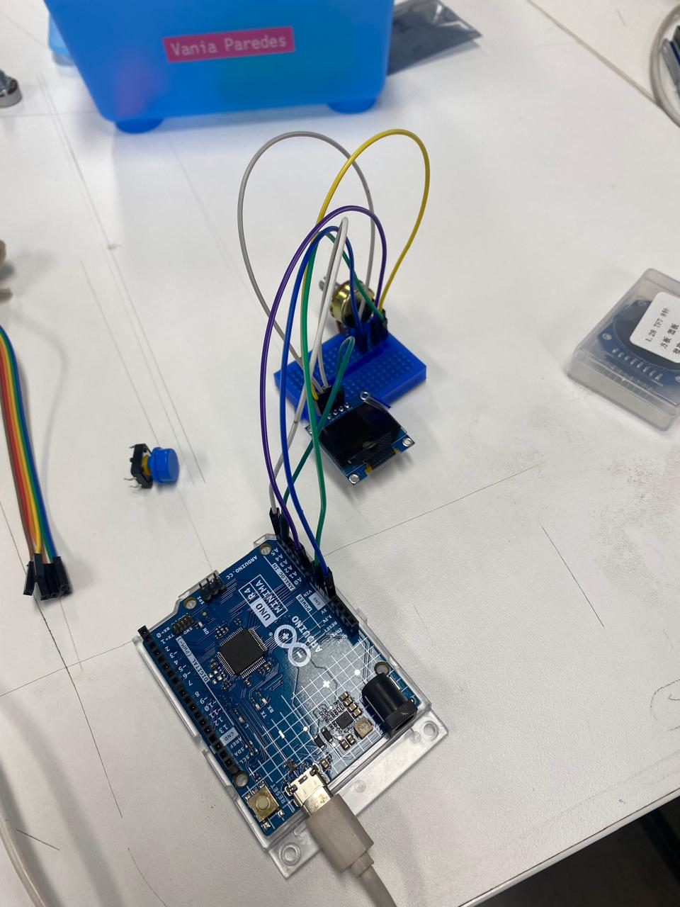
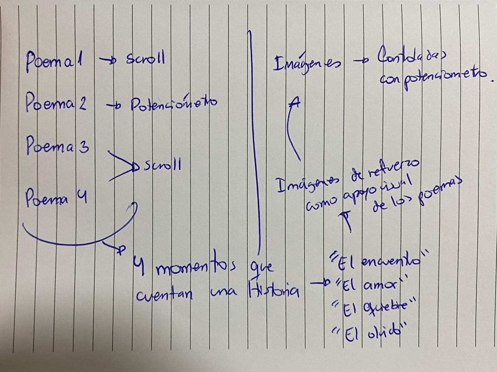
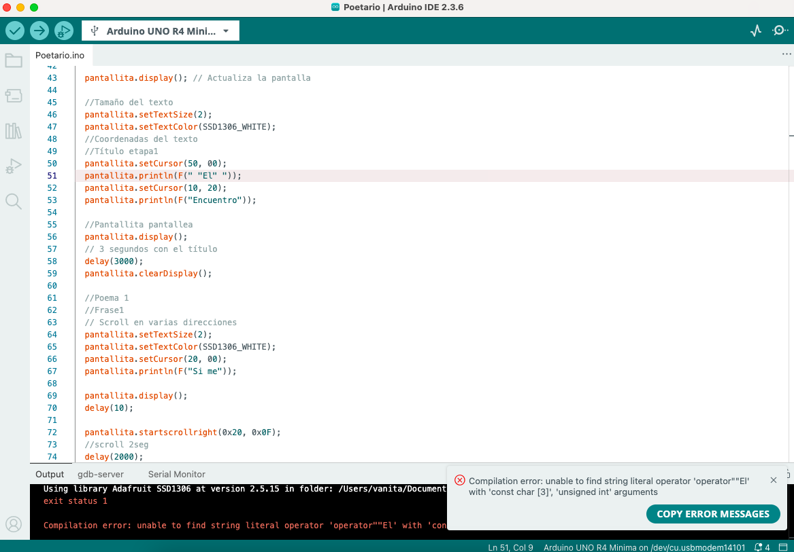
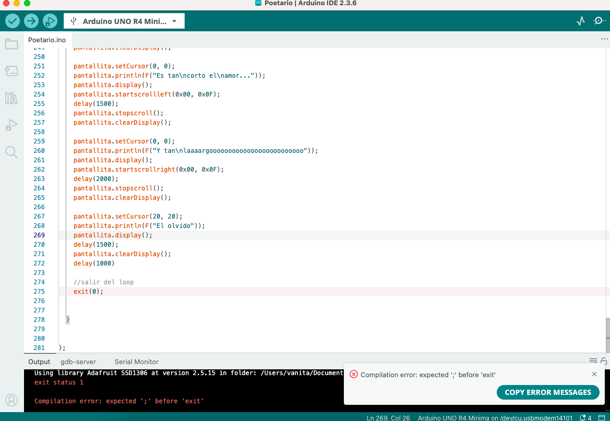
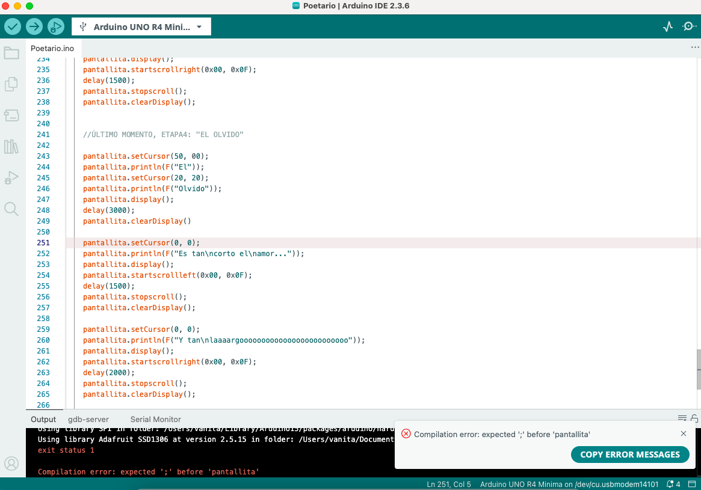

# proyecto-01

## Acerca del proyecto

- Grupo: 08
- Nombre de grupo: Las dos
- Integrantes:
  - Valentina Chávez
  - Vania Paredes

## Presentación textual

El problema de diseño que abordamos fue cómo crear una experiencia poética interactiva. La idea fue crear un “carrusel poético” en pantallas OLED, donde se cuentan distintas etapas de una historia usando versos de poetas chilenos como Gabriela Mistral y Pablo Neruda. La intención es que no fuera solo leer un texto fijo, sino que la persona pudiera ver cómo los poemas van apareciendo y conectándose entre sí, contando una historia.

El poetario está dividido en cuatro momentos principales que reflejan un recorrido:

## 1. **El Encuentro**

“Si me miras, yo me vuelvo hermosa.”
— Gabriela Mistral, Vergüenza.

## 2. **El Amor**

“Quiero hacer contigo
lo que la primavera hace con los cerezos.”
— Pablo Neruda, Veinte poemas de amor y una canción desesperada, Poema 14.

## 3. **El Quiebre**

"Mi alma no se contenta con haberla perdido"
— Pablo Neruda, Veinte poemas de amor y una canción desesperada, Poema 20.

## 4. **El Olvido**

“Es tan corto el amor,
y tan largo el olvido.”
— Pablo Neruda, Veinte poemas de amor y una canción desesperada, Poema 20.

### La interacción

Para hacer de la interacción mejor, el poema Nº2 se conecta a un potenciómetro: según el valor detectado, la pantalla despliega diferentes versos, permitiendo que el lector interactúe con el texto y sienta que lo “despliega” él mismo. Se escogió el poema Nº2 porque es el mas largo, y como la pantalla es pequeña y no queriamos hacerlo con el texto tan pequeño, preferimos separarlo en varios versos que caigan en la pantalla y poder controlar su velocidad con el potenciómetro.

En cambio, los otros poemas se controlan directamente desde el código. Se usaron funciones de scroll, permitiendo que el poema se sienta más dinámico y no solo estático en pantalla.

Al mismo tiempo, en la segunda pantalla se van mostrando imágenes en forma de carrusel, también controladas con el potenciómetro. Estas imágenes funcionan como un apoyo visual a los poemas, reforzando el ambiente de cada etapa.

## Inputs y outputs

¿Cuál es la interacción? ¿Qué ofrece la máquina de vuelta?

**Código poetario:**
*Inputs:*

Potenciómetro: Se gira y así cambia el valor analógico que lee el Arduino (de 0 a 1023)
Código del poema: Arduino interpreta ese valor (del potenciómetro) y decide qué parte del poema (Poema 2) mostrar.

*Outputs:*

Pantalla OLED: Muestra el texto dividido en frases del poema. Según el rango del potenciómetro, aparece una frase distinta.

La interacción entonces es girar el potenciómetro y como respuesta ofrece versos en la pantalla, uno por uno, como un carrusel de texto.

**Código carrusel de imágenes:**

```cpp
//proyecto_01 para Taller de Diseño de Máquinas Computacionales 
//Uso de potenciómetro y pantalla para carrusel de poemas
//Valentina Chávez y Vania Paredes

#include <Wire.h> // I2C (comunicación con la pantalla OLED)
#include <Adafruit_GFX.h> // librería de gráficos para texto, bitmaps, etc
#include <Adafruit_SSD1306.h> //controlador de la pantalla

//configuración de la pantalla
#define SCREEN_WIDTH 128 
#define SCREEN_HEIGHT 64
#define OLED_ADDR 0x3C
#define OLED_RESET -1
Adafruit_SSD1306 oled(SCREEN_WIDTH, SCREEN_HEIGHT, &Wire, OLED_RESET);

//potenciómetro
const int PIN_POT = A0; //pin donde está conectado el potenciómetro
int valorPot = 0; // valor del potenciómetro comienza con 0

//tamaño del bitmap
const uint16_t BMP_W = 128;
const uint16_t BMP_H = 64;

//bitmap de las imagenes 
const unsigned char ojos [] PROGMEM = { //bitmap de los ojos
  0x00, 0x00, 0xff, 0xff, 0xff, 0xff, 0xff, 0xff, 0xff, 0xff, 0xff, 0xff, 0xff, 0xff, 0x00, 0x00, 
 0x00, 0x00, 0xff, 0xff, 0xff, 0xff, 0xff, 0xff, 0xff, 0xff, 0xff, 0xff, 0xff, 0xff, 0x00, 0x00, 
 0x00, 0x00, 0xff, 0xff, 0xff, 0xff, 0xff, 0xff, 0xff, 0xff, 0xff, 0xff, 0xff, 0xff, 0x00, 0x00, 
 0x00, 0x00, 0xff, 0xff, 0xff, 0xff, 0xff, 0xff, 0xff, 0xff, 0xff, 0xff, 0xff, 0xff, 0x00, 0x00, 
 0x00, 0x00, 0xff, 0xff, 0xff, 0xff, 0xff, 0xff, 0xff, 0xff, 0xff, 0xff, 0xff, 0xff, 0x00, 0x00, 
 0x00, 0x00, 0xff, 0xff, 0xff, 0xff, 0xff, 0xff, 0xff, 0xff, 0xff, 0xff, 0xff, 0xff, 0x00, 0x00, 
 0x00, 0x00, 0xff, 0xff, 0xff, 0xff, 0xff, 0xff, 0xff, 0xff, 0xff, 0xff, 0xff, 0xff, 0x00, 0x00, 
 0x00, 0x00, 0xff, 0xff, 0xff, 0xff, 0xff, 0xff, 0xff, 0xff, 0xff, 0xff, 0xff, 0xff, 0x00, 0x00, 
 0x00, 0x00, 0xff, 0xff, 0xff, 0xff, 0xff, 0xff, 0xff, 0xff, 0xff, 0xff, 0xff, 0xff, 0x00, 0x00, 
 0x00, 0x00, 0xff, 0xff, 0xff, 0xff, 0xff, 0xff, 0xff, 0xff, 0xff, 0xff, 0xff, 0xff, 0x00, 0x00, 
 0x00, 0x00, 0xff, 0xff, 0xff, 0xff, 0xff, 0xff, 0xff, 0xff, 0xff, 0xff, 0xff, 0xff, 0x00, 0x00, 
 0x00, 0x00, 0xff, 0xff, 0xff, 0xff, 0xff, 0xff, 0xff, 0xff, 0xff, 0xff, 0xff, 0xff, 0x00, 0x00, 
 0x00, 0x00, 0xff, 0xff, 0xff, 0xff, 0xff, 0xff, 0xff, 0xff, 0xff, 0xff, 0xff, 0xff, 0x00, 0x00, 
 0x00, 0x00, 0xff, 0xff, 0xff, 0xff, 0xff, 0xff, 0xff, 0xff, 0xff, 0xff, 0xff, 0xff, 0x00, 0x00, 
 0x00, 0x00, 0xff, 0xff, 0xff, 0xff, 0xff, 0xff, 0xff, 0xff, 0xff, 0xff, 0xff, 0xff, 0x00, 0x00, 
 0x00, 0x00, 0xff, 0xff, 0xff, 0xff, 0xff, 0xff, 0xff, 0xff, 0xff, 0xff, 0xff, 0xff, 0x00, 0x00, 
 0x00, 0x00, 0xff, 0xff, 0xff, 0xff, 0xff, 0xff, 0xff, 0xff, 0xff, 0xff, 0xff, 0xff, 0x00, 0x00, 
 0x00, 0x00, 0xff, 0xff, 0xff, 0xff, 0xff, 0xff, 0xff, 0xff, 0xff, 0xff, 0xff, 0xff, 0x00, 0x00, 
 0x00, 0x00, 0xff, 0xff, 0xff, 0xff, 0xff, 0xff, 0xff, 0xff, 0xff, 0xff, 0xff, 0xff, 0x00, 0x00, 
 0x00, 0x00, 0xe0, 0x7f, 0xff, 0xff, 0xff, 0xff, 0xff, 0xff, 0xff, 0xff, 0xff, 0xf8, 0x00, 0x00, 
 0x00, 0x00, 0x00, 0x2f, 0xff, 0xff, 0xff, 0xff, 0xff, 0xff, 0xff, 0xff, 0xff, 0xff, 0x00, 0x00, 
 0x00, 0x00, 0x00, 0x07, 0xff, 0xff, 0xff, 0xff, 0xff, 0xff, 0xff, 0xff, 0xff, 0xff, 0x00, 0x00, 
 0x00, 0x00, 0x00, 0x00, 0x7f, 0xff, 0xff, 0xff, 0xff, 0xff, 0xff, 0xc0, 0x3b, 0xff, 0x00, 0x00, 
 0x00, 0x00, 0xfe, 0x00, 0x07, 0xff, 0xff, 0xff, 0xff, 0xff, 0xf0, 0x01, 0x0f, 0xff, 0x00, 0x00, 
 0x00, 0x00, 0xff, 0x80, 0x00, 0x0f, 0xff, 0xff, 0xff, 0xff, 0xc0, 0x00, 0xff, 0xff, 0x00, 0x00, 
 0x00, 0x00, 0xff, 0xc0, 0x00, 0x01, 0xff, 0xff, 0xff, 0xff, 0xc0, 0x07, 0xff, 0xff, 0x00, 0x00, 
 0x00, 0x00, 0xff, 0xc0, 0x00, 0x00, 0x7f, 0xff, 0xff, 0xff, 0xc0, 0x7f, 0xff, 0xff, 0x00, 0x00, 
 0x00, 0x00, 0xdf, 0xc0, 0x00, 0x00, 0x7f, 0xff, 0xff, 0xff, 0xc0, 0x00, 0x03, 0xff, 0x00, 0x00, 
 0x00, 0x00, 0x00, 0x00, 0x00, 0x00, 0x3f, 0xff, 0xff, 0xff, 0xc0, 0x00, 0x00, 0x3f, 0x00, 0x00, 
 0x00, 0x00, 0x00, 0x00, 0x00, 0x00, 0x1f, 0xff, 0xff, 0xff, 0x80, 0x02, 0x00, 0x0f, 0x00, 0x00, 
 0x00, 0x00, 0x00, 0x00, 0x00, 0x00, 0x07, 0xff, 0xff, 0xfe, 0x02, 0x00, 0x00, 0x07, 0x00, 0x00, 
 0x00, 0x00, 0x00, 0x00, 0x00, 0x00, 0x07, 0xff, 0xff, 0xfe, 0x0e, 0x00, 0x00, 0x03, 0x00, 0x00, 
 0x00, 0x00, 0x00, 0x00, 0x00, 0x00, 0x03, 0xff, 0xff, 0xfe, 0x38, 0x00, 0x60, 0x03, 0x00, 0x00, 
 0x00, 0x00, 0x00, 0x1c, 0x1c, 0x08, 0x03, 0xff, 0xff, 0xfc, 0xf0, 0x0e, 0x3c, 0x03, 0x00, 0x00, 
 0x00, 0x00, 0x00, 0x3c, 0x1c, 0x66, 0x01, 0xff, 0xff, 0xf1, 0xe6, 0x0c, 0x3e, 0x01, 0x00, 0x00, 
 0x00, 0x00, 0x80, 0x7c, 0x00, 0x73, 0x01, 0xff, 0xff, 0xff, 0xde, 0x00, 0x3f, 0x07, 0x00, 0x00, 
 0x00, 0x00, 0xf0, 0x7c, 0x00, 0xf9, 0x80, 0xff, 0xff, 0xff, 0xbf, 0x00, 0x3f, 0x1f, 0x00, 0x00, 
 0x00, 0x00, 0xf8, 0xfc, 0x00, 0xfc, 0xe0, 0xff, 0xff, 0xff, 0x7f, 0x00, 0x7e, 0x3f, 0x00, 0x00, 
 0x00, 0x00, 0xf8, 0x7c, 0x01, 0xfe, 0x7c, 0xff, 0xff, 0xff, 0xff, 0x80, 0x7e, 0x3f, 0x00, 0x00, 
 0x00, 0x00, 0xfc, 0x3e, 0x03, 0xff, 0xbe, 0xff, 0xff, 0xff, 0xff, 0xc0, 0xfc, 0x7f, 0x00, 0x00, 
 0x00, 0x00, 0xfc, 0x3f, 0x87, 0xff, 0xbf, 0xff, 0xff, 0xff, 0xff, 0xf3, 0xfb, 0xff, 0x00, 0x00, 
 0x00, 0x00, 0xfe, 0x4f, 0xff, 0xff, 0xff, 0xff, 0xff, 0xff, 0xff, 0xff, 0xe7, 0xff, 0x00, 0x00, 
 0x00, 0x00, 0xff, 0xdc, 0xff, 0xff, 0xff, 0xff, 0xff, 0xff, 0xff, 0xff, 0xff, 0xff, 0x00, 0x00, 
 0x00, 0x00, 0xff, 0x9e, 0xef, 0xff, 0xff, 0xff, 0xff, 0xff, 0xff, 0xff, 0xff, 0xff, 0x00, 0x00, 
 0x00, 0x00, 0xff, 0xef, 0xff, 0xff, 0xff, 0xff, 0xff, 0xff, 0xff, 0xff, 0xff, 0xff, 0x00, 0x00, 
 0x00, 0x00, 0xff, 0xfc, 0xff, 0xff, 0xff, 0xff, 0xff, 0xff, 0xff, 0xff, 0xff, 0xff, 0x00, 0x00, 
 0x00, 0x00, 0xff, 0xff, 0xff, 0xff, 0xff, 0xff, 0xff, 0xff, 0xff, 0xff, 0xff, 0xff, 0x00, 0x00, 
 0x00, 0x00, 0xff, 0xff, 0xff, 0xff, 0xff, 0xff, 0xff, 0xff, 0xff, 0xff, 0xff, 0xff, 0x00, 0x00, 
 0x00, 0x00, 0xff, 0xff, 0xff, 0xff, 0xff, 0xff, 0xff, 0xff, 0xff, 0xff, 0xff, 0xff, 0x00, 0x00, 
 0x00, 0x00, 0xff, 0xff, 0xff, 0xff, 0xff, 0xff, 0xff, 0xff, 0xff, 0xff, 0xff, 0xff, 0x00, 0x00, 
 0x00, 0x00, 0xff, 0xff, 0xff, 0xff, 0xff, 0xff, 0xff, 0xff, 0xff, 0xff, 0xff, 0xff, 0x00, 0x00, 
 0x00, 0x00, 0xff, 0xff, 0xff, 0xff, 0xff, 0xff, 0xff, 0xff, 0xff, 0xff, 0xff, 0xff, 0x00, 0x00, 
 0x00, 0x00, 0xff, 0xff, 0xff, 0xff, 0xff, 0xff, 0xff, 0xff, 0xff, 0xff, 0xff, 0xff, 0x00, 0x00, 
 0x00, 0x00, 0xff, 0xff, 0xff, 0xff, 0xff, 0xff, 0xff, 0xff, 0xff, 0xff, 0xff, 0xff, 0x00, 0x00, 
 0x00, 0x00, 0xff, 0xff, 0xff, 0xff, 0xff, 0xff, 0xff, 0xff, 0xff, 0xff, 0xff, 0xff, 0x00, 0x00, 
 0x00, 0x00, 0xff, 0xff, 0xff, 0xff, 0xff, 0xff, 0xff, 0xff, 0xff, 0xff, 0xff, 0xff, 0x00, 0x00, 
 0x00, 0x00, 0xff, 0xff, 0xff, 0xff, 0xff, 0xff, 0xff, 0xff, 0xff, 0xff, 0xff, 0xff, 0x00, 0x00, 
 0x00, 0x00, 0xff, 0xff, 0xff, 0xff, 0xff, 0xff, 0xff, 0xff, 0xff, 0xff, 0xff, 0xff, 0x00, 0x00, 
 0x00, 0x00, 0xff, 0xff, 0xff, 0xff, 0xff, 0xff, 0xff, 0xff, 0xff, 0xff, 0xff, 0xff, 0x00, 0x00, 
 0x00, 0x00, 0xff, 0xff, 0xff, 0xff, 0xff, 0xff, 0xff, 0xff, 0xff, 0xff, 0xff, 0xff, 0x00, 0x00, 
 0x00, 0x00, 0xff, 0xff, 0xff, 0xff, 0xff, 0xff, 0xff, 0xff, 0xff, 0xff, 0xff, 0xff, 0x00, 0x00, 
 0x00, 0x00, 0xff, 0xff, 0xff, 0xff, 0xff, 0xff, 0xff, 0xff, 0xff, 0xff, 0xff, 0xff, 0x00, 0x00, 
 0x00, 0x00, 0xff, 0xff, 0xff, 0xff, 0xff, 0xff, 0xff, 0xff, 0xff, 0xff, 0xff, 0xff, 0x00, 0x00, 
 0x00, 0x00, 0xff, 0xff, 0xff, 0xff, 0xff, 0xff, 0xff, 0xff, 0xff, 0xff, 0xff, 0xff, 0x00, 0x00
};
const unsigned char florDeCerezo[] PROGMEM = { //bitmap de flor de cerezo
  0xff, 0xff, 0xff, 0xff, 0xff, 0xff, 0xff, 0xff, 0xff, 0xff, 0xff, 0xff, 0xff, 0xff, 0xff, 0xff, 
 0xff, 0xff, 0xff, 0xff, 0xff, 0xff, 0xff, 0xff, 0xff, 0xff, 0xff, 0xff, 0xff, 0xff, 0xff, 0xff, 
 0xff, 0xff, 0xff, 0xff, 0xff, 0xff, 0xff, 0xff, 0xff, 0xff, 0xff, 0xff, 0xff, 0xff, 0xff, 0xff, 
 0xff, 0xff, 0xff, 0xff, 0xff, 0xff, 0xff, 0xff, 0xff, 0xff, 0xff, 0xff, 0xff, 0xff, 0xff, 0xff, 
 0xff, 0xff, 0xff, 0xff, 0xff, 0xff, 0xff, 0xff, 0xff, 0xff, 0xff, 0xff, 0xff, 0xff, 0xff, 0xff, 
 0xff, 0xff, 0xff, 0xff, 0xff, 0xff, 0xff, 0xff, 0xff, 0xff, 0xff, 0xff, 0xff, 0xff, 0xff, 0xff, 
 0xff, 0xff, 0xff, 0xff, 0xff, 0xff, 0xff, 0xff, 0xff, 0xff, 0xff, 0xff, 0xff, 0xff, 0xff, 0xff, 
 0xff, 0xff, 0xff, 0xff, 0xff, 0xff, 0xff, 0xff, 0xff, 0xff, 0xff, 0xff, 0xff, 0xff, 0xff, 0xff, 
 0xff, 0xff, 0xff, 0xff, 0xff, 0xff, 0xff, 0xff, 0xff, 0xff, 0xff, 0xff, 0xff, 0xff, 0xff, 0xff, 
 0xff, 0xff, 0xff, 0xff, 0xff, 0xff, 0xff, 0xff, 0xff, 0xff, 0xff, 0xff, 0xff, 0xff, 0xff, 0xff, 
 0xff, 0xff, 0xff, 0xff, 0xff, 0xff, 0xff, 0xff, 0xff, 0xff, 0xff, 0xff, 0xff, 0xff, 0xff, 0xff, 
 0xff, 0xff, 0xff, 0xff, 0xff, 0xff, 0xff, 0xff, 0xff, 0xff, 0xff, 0xff, 0xff, 0xff, 0xff, 0xff, 
 0xff, 0xff, 0xff, 0xff, 0xff, 0xff, 0xff, 0xff, 0xff, 0xff, 0xff, 0xff, 0xff, 0xff, 0xff, 0xff, 
 0xff, 0xff, 0xff, 0xff, 0xff, 0xff, 0xff, 0xff, 0xff, 0xff, 0xff, 0xff, 0xff, 0xff, 0xff, 0xff, 
 0xff, 0xff, 0xff, 0xff, 0xff, 0xfc, 0x03, 0xff, 0xff, 0xc0, 0x3f, 0xff, 0xff, 0xff, 0xff, 0xff, 
 0xff, 0xff, 0xff, 0xff, 0xff, 0xf0, 0x00, 0x3f, 0xfc, 0x00, 0x0f, 0xff, 0xff, 0xff, 0xff, 0xff, 
 0xff, 0xff, 0xff, 0xff, 0xff, 0xe0, 0x00, 0x07, 0xe0, 0x00, 0x07, 0xff, 0xff, 0xff, 0xff, 0xff, 
 0xff, 0xff, 0xff, 0xff, 0xfc, 0x00, 0x00, 0x01, 0x80, 0x00, 0x00, 0x3f, 0xff, 0xff, 0xff, 0xff, 
 0xff, 0xff, 0xff, 0xff, 0xf8, 0x01, 0xff, 0x00, 0x00, 0xff, 0x80, 0x1f, 0xff, 0xff, 0xff, 0xff, 
 0xff, 0xff, 0xff, 0xff, 0xf0, 0x04, 0xff, 0xe0, 0x07, 0xff, 0x20, 0x0f, 0xff, 0xff, 0xff, 0xff, 
 0xff, 0xff, 0xff, 0xff, 0xf0, 0x1f, 0x7f, 0xf0, 0x0f, 0xfc, 0xf8, 0x0f, 0xff, 0xff, 0xff, 0xff, 
 0xff, 0xff, 0xff, 0xff, 0xf0, 0x1f, 0xff, 0xf8, 0x0f, 0xff, 0xf8, 0x0f, 0xff, 0xff, 0xff, 0xff, 
 0xff, 0xff, 0xff, 0xff, 0xf0, 0x3f, 0xfd, 0xf8, 0x0f, 0xbf, 0xfc, 0x0f, 0xff, 0xff, 0xff, 0xff, 
 0xff, 0xff, 0xff, 0xff, 0xf0, 0x3f, 0xfc, 0xf8, 0x0f, 0x3f, 0xfc, 0x0f, 0xff, 0xff, 0xff, 0xff, 
 0xff, 0xff, 0xff, 0xff, 0xf8, 0x1f, 0xff, 0xe1, 0x07, 0xff, 0xf8, 0x1f, 0xff, 0xff, 0xff, 0xff, 
 0xff, 0xff, 0xff, 0xff, 0xfc, 0x0f, 0xff, 0xe1, 0x87, 0xff, 0xf0, 0x3f, 0xff, 0xff, 0xff, 0xff, 
 0xff, 0xff, 0xff, 0xff, 0xfe, 0x00, 0x38, 0x65, 0x2e, 0x1c, 0x00, 0x7f, 0xff, 0xff, 0xff, 0xff, 
 0xff, 0xff, 0xff, 0xff, 0xfc, 0x00, 0x18, 0x77, 0x7a, 0x78, 0x00, 0x1f, 0xff, 0xff, 0xff, 0xff, 
 0xff, 0xff, 0xff, 0xff, 0xc0, 0x00, 0x07, 0x3f, 0x6f, 0xc0, 0x00, 0x03, 0xff, 0xff, 0xff, 0xff, 
 0xff, 0xff, 0xff, 0xff, 0x00, 0x1f, 0x00, 0xfe, 0xbc, 0x00, 0x00, 0x00, 0xff, 0xff, 0xff, 0xff, 
 0xff, 0xff, 0xff, 0xfc, 0x01, 0xf9, 0xf0, 0xf8, 0x1f, 0x80, 0x9f, 0x80, 0x3f, 0xff, 0xff, 0xff, 
 0xff, 0xff, 0xff, 0xf8, 0x07, 0xf9, 0xff, 0xf8, 0x1c, 0x7f, 0x9f, 0xe0, 0x1f, 0xff, 0xff, 0xff, 
 0xff, 0xff, 0xff, 0xe0, 0x0f, 0xff, 0xc3, 0xfd, 0x3f, 0xc3, 0xff, 0xf0, 0x07, 0xff, 0xff, 0xff, 
 0xff, 0xff, 0xff, 0xe0, 0x0f, 0xff, 0xff, 0xff, 0xfd, 0xff, 0xff, 0xf0, 0x07, 0xff, 0xff, 0xff, 
 0xff, 0xff, 0xff, 0xe0, 0x0f, 0xff, 0xfe, 0x4f, 0xef, 0x7f, 0xff, 0xf0, 0x07, 0xff, 0xff, 0xff, 
 0xff, 0xff, 0xff, 0xf0, 0x01, 0xfe, 0x38, 0x37, 0xe6, 0x1c, 0x7f, 0x80, 0x0f, 0xff, 0xff, 0xff, 
 0xff, 0xff, 0xff, 0xfc, 0x07, 0xff, 0xf8, 0x63, 0xc2, 0x1f, 0xff, 0xe0, 0x3f, 0xff, 0xff, 0xff, 
 0xff, 0xff, 0xff, 0xfc, 0x03, 0xff, 0xf0, 0x03, 0xc0, 0x1f, 0xff, 0xc0, 0x3f, 0xff, 0xff, 0xff, 
 0xff, 0xff, 0xff, 0xfc, 0x00, 0x7f, 0xc0, 0x3f, 0xfc, 0x03, 0xfe, 0x00, 0x3f, 0xff, 0xff, 0xff, 
 0xff, 0xff, 0xff, 0xfc, 0x00, 0x00, 0x00, 0xfe, 0x7f, 0x00, 0x00, 0x00, 0x3f, 0xff, 0xff, 0xff, 
 0xff, 0xff, 0xff, 0xff, 0x00, 0x00, 0x01, 0xfe, 0x7f, 0x80, 0x00, 0x00, 0xff, 0xff, 0xff, 0xff, 
 0xff, 0xff, 0xff, 0xff, 0xf0, 0x00, 0x03, 0xff, 0xff, 0x80, 0x00, 0x0f, 0xff, 0xff, 0xff, 0xff, 
 0xff, 0xff, 0xff, 0xff, 0xff, 0xff, 0x81, 0xff, 0xff, 0x81, 0xff, 0xff, 0xff, 0xff, 0xff, 0xff, 
 0xff, 0xff, 0xff, 0xff, 0xff, 0xff, 0x80, 0xff, 0x7f, 0x01, 0xff, 0xff, 0xff, 0xff, 0xff, 0xff, 
 0xff, 0xff, 0xff, 0xff, 0xff, 0xff, 0xc0, 0x1e, 0x78, 0x03, 0xff, 0xff, 0xff, 0xff, 0xff, 0xff, 
 0xff, 0xff, 0xff, 0xff, 0xff, 0xff, 0xe0, 0x00, 0x00, 0x07, 0xff, 0xff, 0xff, 0xff, 0xff, 0xff, 
 0xff, 0xff, 0xff, 0xff, 0xff, 0xff, 0xf0, 0x00, 0x00, 0x0f, 0xff, 0xff, 0xff, 0xff, 0xff, 0xff, 
 0xff, 0xff, 0xff, 0xff, 0xff, 0xff, 0xf8, 0x00, 0x00, 0x1f, 0xff, 0xff, 0xff, 0xff, 0xff, 0xff, 
 0xff, 0xff, 0xff, 0xff, 0xff, 0xff, 0xfe, 0x00, 0x00, 0x7f, 0xff, 0xff, 0xff, 0xff, 0xff, 0xff, 
 0xff, 0xff, 0xff, 0xff, 0xff, 0xff, 0xff, 0x83, 0xc1, 0xff, 0xff, 0xff, 0xff, 0xff, 0xff, 0xff, 
 0xff, 0xff, 0xff, 0xff, 0xff, 0xff, 0xff, 0xff, 0xff, 0xff, 0xff, 0xff, 0xff, 0xff, 0xff, 0xff, 
 0xff, 0xff, 0xff, 0xff, 0xff, 0xff, 0xff, 0xff, 0xff, 0xff, 0xff, 0xff, 0xff, 0xff, 0xff, 0xff, 
 0xff, 0xff, 0xff, 0xff, 0xff, 0xff, 0xff, 0xff, 0xff, 0xff, 0xff, 0xff, 0xff, 0xff, 0xff, 0xff, 
 0xff, 0xff, 0xff, 0xff, 0xff, 0xff, 0xff, 0xff, 0xff, 0xff, 0xff, 0xff, 0xff, 0xff, 0xff, 0xff, 
 0xff, 0xff, 0xff, 0xff, 0xff, 0xff, 0xff, 0xff, 0xff, 0xff, 0xff, 0xff, 0xff, 0xff, 0xff, 0xff, 
 0xff, 0xff, 0xff, 0xff, 0xff, 0xff, 0xff, 0xff, 0xff, 0xff, 0xff, 0xff, 0xff, 0xff, 0xff, 0xff, 
 0xff, 0xff, 0xff, 0xff, 0xff, 0xff, 0xff, 0xff, 0xff, 0xff, 0xff, 0xff, 0xff, 0xff, 0xff, 0xff, 
 0xff, 0xff, 0xff, 0xff, 0xff, 0xff, 0xff, 0xff, 0xff, 0xff, 0xff, 0xff, 0xff, 0xff, 0xff, 0xff, 
 0xff, 0xff, 0xff, 0xff, 0xff, 0xff, 0xff, 0xff, 0xff, 0xff, 0xff, 0xff, 0xff, 0xff, 0xff, 0xff, 
 0xff, 0xff, 0xff, 0xff, 0xff, 0xff, 0xff, 0xff, 0xff, 0xff, 0xff, 0xff, 0xff, 0xff, 0xff, 0xff, 
 0xff, 0xff, 0xff, 0xff, 0xff, 0xff, 0xff, 0xff, 0xff, 0xff, 0xff, 0xff, 0xff, 0xff, 0xff, 0xff, 
 0xff, 0xff, 0xff, 0xff, 0xff, 0xff, 0xff, 0xff, 0xff, 0xff, 0xff, 0xff, 0xff, 0xff, 0xff, 0xff, 
 0xff, 0xff, 0xff, 0xff, 0xff, 0xff, 0xff, 0xff, 0xff, 0xff, 0xff, 0xff, 0xff, 0xff, 0xff, 0xff, 
 0xff, 0xff, 0xff, 0xff, 0xff, 0xff, 0xff, 0xff, 0xff, 0xff, 0xff, 0xff, 0xff, 0xff, 0xff, 0xff
};
const unsigned char corazonRoto [] PROGMEM = { //bitmap de corazon roto
  0xff, 0xff, 0xff, 0xff, 0xff, 0x80, 0x3f, 0xff, 0xff, 0xff, 0x03, 0xff, 0xff, 0xff, 0xff, 0xff, 
 0xff, 0xff, 0xff, 0xff, 0xfc, 0x00, 0x0f, 0xff, 0xff, 0xf0, 0x00, 0x7f, 0xff, 0xff, 0xff, 0xff, 
 0xff, 0xff, 0xff, 0xff, 0xf8, 0x00, 0x03, 0xff, 0xff, 0xc0, 0x00, 0x1f, 0xff, 0xff, 0xff, 0xff, 
 0xff, 0xff, 0xff, 0xff, 0xe0, 0x00, 0x01, 0xff, 0xff, 0x80, 0x00, 0x0f, 0xff, 0xff, 0xff, 0xff, 
 0xff, 0xff, 0xff, 0xff, 0xc0, 0x7f, 0xc0, 0xff, 0xff, 0x03, 0xfe, 0x03, 0xff, 0xff, 0xff, 0xff, 
 0xff, 0xff, 0xff, 0xff, 0x81, 0xff, 0xf0, 0x7f, 0xfe, 0x0f, 0xff, 0x83, 0xff, 0xff, 0xff, 0xff, 
 0xff, 0xff, 0xff, 0xff, 0x03, 0xff, 0xf8, 0x3f, 0xf8, 0x1f, 0xff, 0xc1, 0xff, 0xff, 0xff, 0xff, 
 0xff, 0xff, 0xff, 0xff, 0x00, 0x00, 0x00, 0x1f, 0xf8, 0x3f, 0xff, 0xe0, 0xff, 0xff, 0xff, 0xff, 
 0xff, 0xff, 0xff, 0xfe, 0x00, 0x00, 0x00, 0x0f, 0xf0, 0x00, 0x01, 0xe0, 0x7f, 0xff, 0xff, 0xff, 
 0xff, 0xff, 0xff, 0xfe, 0x00, 0x00, 0x00, 0x07, 0xe0, 0x00, 0x00, 0x00, 0x7f, 0xff, 0xff, 0xff, 
 0xff, 0xff, 0xff, 0xfc, 0x00, 0x00, 0x00, 0x07, 0xc0, 0x00, 0x00, 0x00, 0x3f, 0xff, 0xff, 0xff, 
 0xff, 0xff, 0xff, 0xfc, 0x00, 0x00, 0x00, 0x07, 0xc0, 0x00, 0x00, 0x00, 0x3f, 0xff, 0xff, 0xff, 
 0xff, 0xff, 0xff, 0xf8, 0x00, 0x00, 0x00, 0x07, 0x80, 0x00, 0x00, 0x00, 0x3f, 0xff, 0xff, 0xff, 
 0xff, 0xff, 0xff, 0xf8, 0x00, 0x00, 0x00, 0x0f, 0x00, 0x00, 0x00, 0x00, 0x3f, 0xff, 0xff, 0xff, 
 0xff, 0xff, 0xff, 0xf8, 0x00, 0x00, 0x00, 0x0f, 0x00, 0x00, 0x00, 0x00, 0x3f, 0xff, 0xff, 0xff, 
 0xff, 0xff, 0xff, 0xf8, 0x00, 0x00, 0x00, 0x1e, 0x00, 0x00, 0x00, 0x00, 0x3f, 0xff, 0xff, 0xff, 
 0xff, 0xff, 0xff, 0xf8, 0x00, 0x00, 0x00, 0x3c, 0x00, 0x00, 0x00, 0x00, 0x3f, 0xff, 0xff, 0xff, 
 0xff, 0xff, 0xff, 0xf8, 0x00, 0x00, 0x00, 0x3c, 0x00, 0x00, 0x00, 0x00, 0x3f, 0xff, 0xff, 0xff, 
 0xff, 0xff, 0xff, 0xf8, 0x00, 0x00, 0x00, 0x78, 0x00, 0x00, 0x00, 0x00, 0x3f, 0xff, 0xff, 0xff, 
 0xff, 0xff, 0xff, 0xf8, 0x00, 0x00, 0x00, 0xf8, 0x00, 0x00, 0x00, 0x00, 0x3f, 0xff, 0xff, 0xff, 
 0xff, 0xff, 0xff, 0xf8, 0x00, 0x00, 0x00, 0xf0, 0x00, 0x00, 0x00, 0x00, 0x3f, 0xff, 0xff, 0xff, 
 0xff, 0xff, 0xff, 0xf8, 0x00, 0x00, 0x00, 0xf0, 0x00, 0x00, 0x00, 0x00, 0x3f, 0xff, 0xff, 0xff, 
 0xff, 0xff, 0xff, 0xfc, 0x00, 0x00, 0x00, 0xf0, 0x00, 0x00, 0x00, 0x00, 0x3f, 0xff, 0xff, 0xff, 
 0xff, 0xff, 0xff, 0xfc, 0x00, 0x00, 0x00, 0x78, 0x00, 0x00, 0x00, 0x00, 0x3f, 0xff, 0xff, 0xff, 
 0xff, 0xff, 0xff, 0xfc, 0x00, 0x00, 0x00, 0x38, 0x00, 0x00, 0x00, 0x00, 0x3f, 0xff, 0xff, 0xff, 
 0xff, 0xff, 0xff, 0xfe, 0x00, 0x00, 0x00, 0x3c, 0x00, 0x00, 0x00, 0x00, 0x7f, 0xff, 0xff, 0xff, 
 0xff, 0xff, 0xff, 0xfe, 0x00, 0x00, 0x00, 0x1e, 0x00, 0x00, 0x00, 0x00, 0x7f, 0xff, 0xff, 0xff, 
 0xff, 0xff, 0xff, 0xfe, 0x00, 0x00, 0x00, 0x0e, 0x00, 0x00, 0x00, 0x00, 0x7f, 0xff, 0xff, 0xff, 
 0xff, 0xff, 0xff, 0xff, 0x00, 0x00, 0x00, 0x0f, 0x00, 0x00, 0x00, 0x00, 0xff, 0xff, 0xff, 0xff, 
 0xff, 0xff, 0xff, 0xff, 0x00, 0x00, 0x00, 0x07, 0x80, 0x00, 0x00, 0x00, 0xff, 0xff, 0xff, 0xff, 
 0xff, 0xff, 0xff, 0xff, 0x80, 0x00, 0x00, 0x07, 0x80, 0x00, 0x00, 0x01, 0xff, 0xff, 0xff, 0xff, 
 0xff, 0xff, 0xff, 0xff, 0x80, 0x00, 0x00, 0x03, 0xc0, 0x00, 0x00, 0x01, 0xff, 0xff, 0xff, 0xff, 
 0xff, 0xff, 0xff, 0xff, 0xc0, 0x00, 0x00, 0x03, 0xe0, 0x00, 0x00, 0x03, 0xff, 0xff, 0xff, 0xff, 
 0xff, 0xff, 0xff, 0xff, 0xc0, 0x00, 0x00, 0x03, 0xc0, 0x00, 0x00, 0x03, 0xff, 0xff, 0xff, 0xff, 
 0xff, 0xff, 0xff, 0xff, 0xe0, 0x00, 0x00, 0x07, 0xc0, 0x00, 0x00, 0x07, 0xff, 0xff, 0xff, 0xff, 
 0xff, 0xff, 0xff, 0xff, 0xf0, 0x00, 0x00, 0x07, 0x80, 0x00, 0x00, 0x0f, 0xff, 0xff, 0xff, 0xff, 
 0xff, 0xff, 0xff, 0xff, 0xf0, 0x00, 0x00, 0x0f, 0x00, 0x00, 0x00, 0x0f, 0xff, 0xff, 0xff, 0xff, 
 0xff, 0xff, 0xff, 0xff, 0xf8, 0x00, 0x00, 0x0f, 0x00, 0x00, 0x00, 0x1f, 0xff, 0xff, 0xff, 0xff, 
 0xff, 0xff, 0xff, 0xff, 0xfc, 0x00, 0x00, 0x1e, 0x00, 0x00, 0x00, 0x3f, 0xff, 0xff, 0xff, 0xff, 
 0xff, 0xff, 0xff, 0xff, 0xfc, 0x00, 0x00, 0x3c, 0x00, 0x00, 0x00, 0x3f, 0xff, 0xff, 0xff, 0xff, 
 0xff, 0xff, 0xff, 0xff, 0xfe, 0x00, 0x00, 0x3c, 0x00, 0x00, 0x00, 0x7f, 0xff, 0xff, 0xff, 0xff, 
 0xff, 0xff, 0xff, 0xff, 0xff, 0x00, 0x00, 0x78, 0x00, 0x00, 0x00, 0xff, 0xff, 0xff, 0xff, 0xff, 
 0xff, 0xff, 0xff, 0xff, 0xff, 0x80, 0x00, 0xf0, 0x00, 0x00, 0x01, 0xff, 0xff, 0xff, 0xff, 0xff, 
 0xff, 0xff, 0xff, 0xff, 0xff, 0xc0, 0x00, 0xf0, 0x00, 0x00, 0x03, 0xff, 0xff, 0xff, 0xff, 0xff, 
 0xff, 0xff, 0xff, 0xff, 0xff, 0xe0, 0x00, 0xe0, 0x00, 0x00, 0x07, 0xff, 0xff, 0xff, 0xff, 0xff, 
 0xff, 0xff, 0xff, 0xff, 0xff, 0xf0, 0x00, 0xf0, 0x00, 0x00, 0x0f, 0xff, 0xff, 0xff, 0xff, 0xff, 
 0xff, 0xff, 0xff, 0xff, 0xff, 0xf0, 0x00, 0xf0, 0x00, 0x00, 0x1f, 0xff, 0xff, 0xff, 0xff, 0xff, 
 0xff, 0xff, 0xff, 0xff, 0xff, 0xf8, 0x00, 0xf0, 0x00, 0x00, 0x1f, 0xff, 0xff, 0xff, 0xff, 0xff, 
 0xff, 0xff, 0xff, 0xff, 0xff, 0xfc, 0x00, 0x78, 0x00, 0x00, 0x3f, 0xff, 0xff, 0xff, 0xff, 0xff, 
 0xff, 0xff, 0xff, 0xff, 0xff, 0xfe, 0x00, 0x78, 0x00, 0x00, 0x7f, 0xff, 0xff, 0xff, 0xff, 0xff, 
 0xff, 0xff, 0xff, 0xff, 0xff, 0xff, 0x00, 0x78, 0x00, 0x00, 0xff, 0xff, 0xff, 0xff, 0xff, 0xff, 
 0xff, 0xff, 0xff, 0xff, 0xff, 0xff, 0x80, 0x3c, 0x00, 0x01, 0xff, 0xff, 0xff, 0xff, 0xff, 0xff, 
 0xff, 0xff, 0xff, 0xff, 0xff, 0xff, 0xc0, 0x3c, 0x00, 0x03, 0xff, 0xff, 0xff, 0xff, 0xff, 0xff, 
 0xff, 0xff, 0xff, 0xff, 0xff, 0xff, 0xe0, 0x3c, 0x00, 0x07, 0xff, 0xff, 0xff, 0xff, 0xff, 0xff, 
 0xff, 0xff, 0xff, 0xff, 0xff, 0xff, 0xf0, 0x1e, 0x00, 0x0f, 0xff, 0xff, 0xff, 0xff, 0xff, 0xff, 
 0xff, 0xff, 0xff, 0xff, 0xff, 0xff, 0xf8, 0x1e, 0x00, 0x1f, 0xff, 0xff, 0xff, 0xff, 0xff, 0xff, 
 0xff, 0xff, 0xff, 0xff, 0xff, 0xff, 0xfc, 0x1e, 0x00, 0x3f, 0xff, 0xff, 0xff, 0xff, 0xff, 0xff, 
 0xff, 0xff, 0xff, 0xff, 0xff, 0xff, 0xfe, 0x0f, 0x00, 0x7f, 0xff, 0xff, 0xff, 0xff, 0xff, 0xff, 
 0xff, 0xff, 0xff, 0xff, 0xff, 0xff, 0xff, 0x0f, 0x00, 0xff, 0xff, 0xff, 0xff, 0xff, 0xff, 0xff, 
 0xff, 0xff, 0xff, 0xff, 0xff, 0xff, 0xff, 0x8f, 0x01, 0xff, 0xff, 0xff, 0xff, 0xff, 0xff, 0xff, 
 0xff, 0xff, 0xff, 0xff, 0xff, 0xff, 0xff, 0xc7, 0x83, 0xff, 0xff, 0xff, 0xff, 0xff, 0xff, 0xff, 
 0xff, 0xff, 0xff, 0xff, 0xff, 0xff, 0xff, 0xe7, 0x87, 0xff, 0xff, 0xff, 0xff, 0xff, 0xff, 0xff, 
 0xff, 0xff, 0xff, 0xff, 0xff, 0xff, 0xff, 0xf7, 0x8f, 0xff, 0xff, 0xff, 0xff, 0xff, 0xff, 0xff, 
 0xff, 0xff, 0xff, 0xff, 0xff, 0xff, 0xff, 0xff, 0xdf, 0xff, 0xff, 0xff, 0xff, 0xff, 0xff, 0xff
};
const unsigned char arbolSinHojas[] PROGMEM = { //bitmap de un arbol sin hojas 
  0x00, 0x00, 0x00, 0x00, 0x00, 0x00, 0x00, 0x00, 0x00, 0x00, 0x00, 0x00, 0x00, 0x00, 0x00, 0x00, 
 0x00, 0x00, 0x00, 0x00, 0x00, 0x00, 0x00, 0x00, 0x00, 0x00, 0x00, 0x00, 0x00, 0x00, 0x00, 0x00, 
 0x00, 0x00, 0x00, 0x00, 0x00, 0x00, 0x00, 0x00, 0x00, 0x00, 0x00, 0x00, 0x00, 0x00, 0x00, 0x00, 
 0x00, 0x00, 0x00, 0x00, 0x00, 0x00, 0x00, 0x00, 0x00, 0x00, 0x00, 0x00, 0x00, 0x00, 0x00, 0x00, 
 0x00, 0x00, 0x00, 0x00, 0x00, 0x00, 0x00, 0x00, 0x00, 0x00, 0x00, 0x00, 0x00, 0x00, 0x00, 0x00, 
 0x00, 0x00, 0x00, 0x00, 0x00, 0x00, 0x00, 0x00, 0x00, 0x00, 0x00, 0x00, 0x00, 0x00, 0x00, 0x00, 
 0x00, 0x00, 0x00, 0x00, 0x00, 0x00, 0x00, 0x01, 0x10, 0x00, 0x00, 0x00, 0x00, 0x00, 0x00, 0x00, 
 0x00, 0x00, 0x00, 0x00, 0x00, 0x00, 0x00, 0x00, 0x00, 0x00, 0x00, 0x00, 0x00, 0x00, 0x00, 0x00, 
 0x00, 0x00, 0x00, 0x00, 0x00, 0x00, 0x00, 0x00, 0x40, 0x00, 0x00, 0x00, 0x00, 0x00, 0x00, 0x00, 
 0x00, 0x00, 0x00, 0x00, 0x00, 0x00, 0x00, 0x40, 0x00, 0x00, 0x10, 0x00, 0x00, 0x00, 0x00, 0x00, 
 0x00, 0x00, 0x00, 0x00, 0x00, 0x00, 0x40, 0x40, 0x20, 0x01, 0x00, 0x10, 0x00, 0x00, 0x00, 0x00, 
 0x00, 0x00, 0x00, 0x00, 0x00, 0x00, 0x20, 0x40, 0xa0, 0x00, 0x08, 0x60, 0x00, 0x00, 0x00, 0x00, 
 0x00, 0x00, 0x00, 0x00, 0x01, 0x00, 0x10, 0x00, 0x20, 0x20, 0x48, 0x40, 0x00, 0x00, 0x00, 0x00, 
 0x00, 0x00, 0x00, 0x00, 0x04, 0x00, 0x08, 0x20, 0x10, 0x00, 0x20, 0x87, 0x00, 0x00, 0x00, 0x00, 
 0x00, 0x00, 0x00, 0x00, 0x01, 0x00, 0x04, 0x20, 0x28, 0x82, 0x0c, 0x70, 0x00, 0x00, 0x00, 0x00, 
 0x00, 0x00, 0x00, 0x00, 0x08, 0x80, 0x00, 0x30, 0x4b, 0x02, 0x0d, 0x80, 0x00, 0x00, 0x00, 0x00, 
 0x00, 0x00, 0x00, 0x00, 0x00, 0x00, 0x02, 0x14, 0x0c, 0x02, 0x06, 0x00, 0x00, 0x00, 0x00, 0x00, 
 0x00, 0x00, 0x00, 0x00, 0x00, 0x20, 0x12, 0x08, 0x88, 0x00, 0x04, 0x00, 0x00, 0x00, 0x00, 0x00, 
 0x00, 0x00, 0x00, 0x00, 0x00, 0x10, 0x08, 0x04, 0x18, 0x00, 0x00, 0x1f, 0x80, 0x00, 0x00, 0x00, 
 0x00, 0x00, 0x00, 0x00, 0x00, 0x08, 0x04, 0x02, 0x10, 0x9f, 0x08, 0x40, 0x00, 0x00, 0x00, 0x00, 
 0x00, 0x00, 0x00, 0x00, 0x00, 0x04, 0x02, 0x02, 0x31, 0xc1, 0x10, 0x80, 0x00, 0x00, 0x00, 0x00, 
 0x00, 0x00, 0x00, 0x00, 0x00, 0x03, 0x02, 0x01, 0x22, 0x01, 0x12, 0x02, 0x00, 0x00, 0x00, 0x00, 
 0x00, 0x00, 0x00, 0x01, 0x04, 0x00, 0x82, 0x01, 0x64, 0x01, 0x2f, 0xf0, 0x00, 0x00, 0x00, 0x00, 
 0x00, 0x00, 0x00, 0x00, 0x04, 0x00, 0x32, 0x01, 0x68, 0x01, 0x70, 0x00, 0x00, 0x00, 0x00, 0x00, 
 0x00, 0x00, 0x00, 0x00, 0x84, 0x00, 0x0e, 0x00, 0xf0, 0x01, 0xc0, 0x00, 0x00, 0x00, 0x00, 0x00, 
 0x00, 0x00, 0x00, 0x00, 0x40, 0x00, 0x02, 0x00, 0xe0, 0x23, 0x80, 0x00, 0x00, 0x00, 0x00, 0x00, 
 0x00, 0x00, 0x00, 0x00, 0x22, 0x00, 0x81, 0x80, 0x60, 0x07, 0x04, 0x00, 0x00, 0x00, 0x00, 0x00, 
 0x00, 0x00, 0x00, 0x00, 0x32, 0x00, 0x1d, 0x80, 0x60, 0x16, 0x84, 0x00, 0x00, 0x00, 0x00, 0x00, 
 0x00, 0x00, 0x00, 0x00, 0x12, 0x00, 0x01, 0xd0, 0x70, 0x1d, 0x04, 0x10, 0x00, 0x00, 0x00, 0x00, 
 0x00, 0x00, 0x00, 0x00, 0x0e, 0x00, 0x00, 0x70, 0x30, 0x1a, 0x00, 0x00, 0x80, 0x00, 0x00, 0x00, 
 0x00, 0x00, 0x00, 0x00, 0x06, 0x00, 0x00, 0x30, 0x38, 0x38, 0x08, 0x00, 0x00, 0x00, 0x00, 0x00, 
 0x00, 0x00, 0x00, 0x00, 0x03, 0x00, 0x00, 0x18, 0x38, 0xf0, 0x00, 0x40, 0xc0, 0x00, 0x00, 0x00, 
 0x00, 0x00, 0x00, 0x00, 0x01, 0x80, 0x00, 0x18, 0x3b, 0xe0, 0x00, 0x86, 0x00, 0x00, 0x00, 0x00, 
 0x00, 0x00, 0x00, 0x00, 0x00, 0xc0, 0x20, 0x0c, 0x3f, 0x80, 0x03, 0xf8, 0x00, 0x00, 0x00, 0x00, 
 0x00, 0x00, 0x00, 0x00, 0x00, 0x30, 0x0c, 0x0e, 0x7f, 0x04, 0xdf, 0x00, 0x00, 0x00, 0x00, 0x00, 
 0x00, 0x00, 0x00, 0x00, 0x00, 0x1c, 0x04, 0x06, 0x7e, 0x05, 0xf0, 0x00, 0x00, 0x00, 0x00, 0x00, 
 0x00, 0x00, 0x00, 0x00, 0x08, 0x0f, 0x02, 0x07, 0xf8, 0x07, 0x80, 0x00, 0x00, 0x00, 0x00, 0x00, 
 0x00, 0x00, 0x00, 0x00, 0x03, 0x83, 0xc1, 0x03, 0xf0, 0x1e, 0x00, 0x00, 0x00, 0x00, 0x00, 0x00, 
 0x00, 0x00, 0x00, 0x00, 0x5c, 0x00, 0x79, 0x03, 0xf0, 0x3f, 0x80, 0x00, 0x00, 0x00, 0x00, 0x00, 
 0x00, 0x00, 0x00, 0x00, 0x00, 0x00, 0xff, 0x83, 0xe0, 0xf0, 0x7f, 0xe0, 0x00, 0x00, 0x00, 0x00, 
 0x00, 0x00, 0x00, 0x00, 0x00, 0x01, 0x87, 0xc3, 0xe3, 0xf8, 0x0c, 0x0e, 0x00, 0x00, 0x00, 0x00, 
 0x00, 0x00, 0x00, 0x00, 0x00, 0x03, 0x01, 0xe7, 0xff, 0x02, 0x01, 0x80, 0x00, 0x00, 0x00, 0x00, 
 0x00, 0x00, 0x00, 0x00, 0x00, 0x1d, 0x00, 0xf7, 0xfc, 0x01, 0x00, 0x40, 0x00, 0x00, 0x00, 0x00, 
 0x00, 0x00, 0x00, 0x00, 0x01, 0xe0, 0x00, 0x7f, 0xf8, 0x00, 0x80, 0x10, 0x00, 0x00, 0x00, 0x00, 
 0x00, 0x00, 0x00, 0x00, 0x06, 0x02, 0x00, 0x3f, 0xf0, 0x00, 0x40, 0x10, 0x00, 0x00, 0x00, 0x00, 
 0x00, 0x00, 0x00, 0x00, 0x08, 0x02, 0x00, 0x1f, 0xe0, 0x00, 0x00, 0x00, 0x00, 0x00, 0x00, 0x00, 
 0x00, 0x00, 0x00, 0x00, 0x10, 0x06, 0x00, 0x1f, 0xc0, 0x00, 0x00, 0x08, 0x00, 0x00, 0x00, 0x00, 
 0x00, 0x00, 0x00, 0x00, 0x00, 0x08, 0x00, 0x0f, 0xc0, 0x00, 0x00, 0x00, 0x00, 0x00, 0x00, 0x00, 
 0x00, 0x00, 0x00, 0x00, 0x40, 0x10, 0x00, 0x0f, 0xc0, 0x00, 0x00, 0x00, 0x00, 0x00, 0x00, 0x00, 
 0x00, 0x00, 0x00, 0x00, 0x00, 0x00, 0x00, 0x0f, 0xc0, 0x00, 0x00, 0x00, 0x00, 0x00, 0x00, 0x00, 
 0x00, 0x00, 0x00, 0x00, 0x00, 0x00, 0x00, 0x0f, 0xe0, 0x00, 0x00, 0x00, 0x00, 0x00, 0x00, 0x00, 
 0x00, 0x00, 0x00, 0x00, 0x00, 0x00, 0x00, 0x07, 0xe0, 0x00, 0x00, 0x00, 0x00, 0x00, 0x00, 0x00, 
 0x00, 0x00, 0x00, 0x00, 0x00, 0x00, 0x00, 0x07, 0xe0, 0x00, 0x00, 0x00, 0x00, 0x00, 0x00, 0x00, 
 0x00, 0x00, 0x00, 0x00, 0x00, 0x00, 0x00, 0x07, 0xe0, 0x00, 0x00, 0x00, 0x00, 0x00, 0x00, 0x00, 
 0x00, 0x00, 0x00, 0x00, 0x00, 0x00, 0x00, 0x07, 0xf0, 0x00, 0x00, 0x00, 0x00, 0x00, 0x00, 0x00, 
 0x00, 0x00, 0x00, 0x00, 0x00, 0x00, 0x00, 0x07, 0xf0, 0x00, 0x00, 0x00, 0x00, 0x00, 0x00, 0x00, 
 0x00, 0x00, 0x00, 0x00, 0x00, 0x00, 0x00, 0x07, 0xf0, 0x00, 0x00, 0x00, 0x00, 0x00, 0x00, 0x00, 
 0x00, 0x00, 0x00, 0x00, 0x00, 0x00, 0x00, 0x07, 0xf8, 0x00, 0x00, 0x00, 0x00, 0x00, 0x00, 0x00, 
 0x00, 0x00, 0x00, 0x00, 0x00, 0x00, 0x00, 0x0f, 0xfc, 0x00, 0x00, 0x00, 0x00, 0x00, 0x00, 0x00, 
 0x00, 0x00, 0x00, 0x00, 0x00, 0x00, 0x00, 0x1f, 0xfe, 0x00, 0x00, 0x00, 0x00, 0x00, 0x00, 0x00, 
 0x00, 0x00, 0x00, 0x00, 0x00, 0x00, 0x01, 0xff, 0xff, 0xc0, 0x00, 0x00, 0x00, 0x00, 0x00, 0x00, 
 0x00, 0x00, 0x00, 0x00, 0x00, 0x00, 0x0c, 0x7c, 0x30, 0x00, 0x00, 0x00, 0x00, 0x00, 0x00, 0x00, 
 0x00, 0x00, 0x00, 0x00, 0x00, 0x00, 0x00, 0x00, 0x00, 0x00, 0x00, 0x00, 0x00, 0x00, 0x00, 0x00, 
 0x00, 0x00, 0x00, 0x00, 0x00, 0x00, 0x00, 0x00, 0x00, 0x00, 0x00, 0x00, 0x00, 0x00, 0x00, 0x00
};
const unsigned char reloj [] PROGMEM = { //bitmap de reloj
  0xff, 0xff, 0xff, 0xff, 0xff, 0xff, 0xff, 0xff, 0xff, 0xff, 0xff, 0xff, 0xff, 0xff, 0xff, 0xff, 
 0xff, 0xff, 0xff, 0xff, 0xff, 0xff, 0xff, 0xff, 0xff, 0xff, 0xff, 0xff, 0xff, 0xff, 0xff, 0xff, 
 0xff, 0xff, 0xff, 0xff, 0xff, 0xff, 0xf8, 0x00, 0x00, 0x1f, 0xff, 0xff, 0xff, 0xff, 0xff, 0xff, 
 0xff, 0xff, 0xff, 0xff, 0xff, 0xfc, 0x00, 0x00, 0x00, 0x00, 0x3f, 0xff, 0xff, 0xff, 0xff, 0xff, 
 0xff, 0xff, 0xff, 0xff, 0xff, 0xf0, 0x00, 0x00, 0x00, 0x00, 0x0f, 0xff, 0xff, 0xff, 0xff, 0xff, 
 0xff, 0xff, 0xff, 0xff, 0xff, 0xf0, 0x00, 0x00, 0x00, 0x00, 0x0f, 0xff, 0xff, 0xff, 0xff, 0xff, 
 0xff, 0xff, 0xff, 0xff, 0xff, 0xf0, 0x00, 0x00, 0x00, 0x00, 0x0f, 0xff, 0xff, 0xff, 0xff, 0xff, 
 0xff, 0xff, 0xff, 0xff, 0xff, 0xf0, 0x00, 0x00, 0x00, 0x00, 0x0f, 0xff, 0xff, 0xff, 0xff, 0xff, 
 0xff, 0xff, 0xff, 0xff, 0xff, 0xf0, 0x00, 0x00, 0x00, 0x00, 0x0f, 0xff, 0xff, 0xff, 0xff, 0xff, 
 0xff, 0xff, 0xff, 0xff, 0xff, 0xf0, 0x00, 0x00, 0x00, 0x00, 0x0f, 0xff, 0xff, 0xff, 0xff, 0xff, 
 0xff, 0xff, 0xff, 0xff, 0xff, 0xfc, 0x00, 0x00, 0x00, 0x00, 0x3f, 0xff, 0xff, 0xff, 0xff, 0xff, 
 0xff, 0xff, 0xff, 0xff, 0xff, 0xfe, 0x00, 0x00, 0x00, 0x00, 0x7f, 0xff, 0xff, 0xff, 0xff, 0xff, 
 0xff, 0xff, 0xff, 0xff, 0xff, 0xfe, 0x00, 0x00, 0x00, 0x00, 0x7f, 0xff, 0xff, 0xff, 0xff, 0xff, 
 0xff, 0xff, 0xff, 0xff, 0xff, 0xfe, 0x00, 0x00, 0x00, 0x00, 0x7f, 0xff, 0xff, 0xff, 0xff, 0xff, 
 0xff, 0xff, 0xff, 0xff, 0xff, 0xfe, 0x00, 0x00, 0x00, 0x00, 0x7f, 0xff, 0xff, 0xff, 0xff, 0xff, 
 0xff, 0xff, 0xff, 0xff, 0xff, 0xff, 0x10, 0x00, 0x00, 0x00, 0xff, 0xff, 0xff, 0xff, 0xff, 0xff, 
 0xff, 0xff, 0xff, 0xff, 0xff, 0xff, 0x38, 0x00, 0x00, 0x00, 0xff, 0xff, 0xff, 0xff, 0xff, 0xff, 
 0xff, 0xff, 0xff, 0xff, 0xff, 0xff, 0x3c, 0x00, 0x00, 0x00, 0xff, 0xff, 0xff, 0xff, 0xff, 0xff, 
 0xff, 0xff, 0xff, 0xff, 0xff, 0xff, 0x3e, 0x00, 0x00, 0x00, 0xff, 0xff, 0xff, 0xff, 0xff, 0xff, 
 0xff, 0xff, 0xff, 0xff, 0xff, 0xff, 0xbe, 0x00, 0x00, 0x01, 0xff, 0xff, 0xff, 0xff, 0xff, 0xff, 
 0xff, 0xff, 0xff, 0xff, 0xff, 0xff, 0xbe, 0x00, 0x00, 0x01, 0xff, 0xff, 0xff, 0xff, 0xff, 0xff, 
 0xff, 0xff, 0xff, 0xff, 0xff, 0xff, 0xdf, 0x00, 0x00, 0x03, 0xff, 0xff, 0xff, 0xff, 0xff, 0xff, 
 0xff, 0xff, 0xff, 0xff, 0xff, 0xff, 0xcf, 0x00, 0x00, 0x03, 0xff, 0xff, 0xff, 0xff, 0xff, 0xff, 
 0xff, 0xff, 0xff, 0xff, 0xff, 0xff, 0xe7, 0x00, 0x00, 0x07, 0xff, 0xff, 0xff, 0xff, 0xff, 0xff, 
 0xff, 0xff, 0xff, 0xff, 0xff, 0xff, 0xf0, 0x00, 0x00, 0x0f, 0xff, 0xff, 0xff, 0xff, 0xff, 0xff, 
 0xff, 0xff, 0xff, 0xff, 0xff, 0xff, 0xf8, 0x00, 0x00, 0x1f, 0xff, 0xff, 0xff, 0xff, 0xff, 0xff, 
 0xff, 0xff, 0xff, 0xff, 0xff, 0xff, 0xfc, 0x00, 0x00, 0x3f, 0xff, 0xff, 0xff, 0xff, 0xff, 0xff, 
 0xff, 0xff, 0xff, 0xff, 0xff, 0xff, 0xfe, 0x00, 0x00, 0x7f, 0xff, 0xff, 0xff, 0xff, 0xff, 0xff, 
 0xff, 0xff, 0xff, 0xff, 0xff, 0xff, 0xff, 0x00, 0x00, 0xff, 0xff, 0xff, 0xff, 0xff, 0xff, 0xff, 
 0xff, 0xff, 0xff, 0xff, 0xff, 0xff, 0xff, 0xc0, 0x03, 0xff, 0xff, 0xff, 0xff, 0xff, 0xff, 0xff, 
 0xff, 0xff, 0xff, 0xff, 0xff, 0xff, 0xff, 0xf0, 0x0f, 0xff, 0xff, 0xff, 0xff, 0xff, 0xff, 0xff, 
 0xff, 0xff, 0xff, 0xff, 0xff, 0xff, 0xff, 0xfc, 0x3f, 0xff, 0xff, 0xff, 0xff, 0xff, 0xff, 0xff, 
 0xff, 0xff, 0xff, 0xff, 0xff, 0xff, 0xff, 0xfc, 0x3f, 0xff, 0xff, 0xff, 0xff, 0xff, 0xff, 0xff, 
 0xff, 0xff, 0xff, 0xff, 0xff, 0xff, 0xff, 0xe0, 0x0f, 0xff, 0xff, 0xff, 0xff, 0xff, 0xff, 0xff, 
 0xff, 0xff, 0xff, 0xff, 0xff, 0xff, 0xff, 0xc0, 0x03, 0xff, 0xff, 0xff, 0xff, 0xff, 0xff, 0xff, 
 0xff, 0xff, 0xff, 0xff, 0xff, 0xff, 0xff, 0x00, 0x00, 0xff, 0xff, 0xff, 0xff, 0xff, 0xff, 0xff, 
 0xff, 0xff, 0xff, 0xff, 0xff, 0xff, 0xfe, 0x00, 0x00, 0x7f, 0xff, 0xff, 0xff, 0xff, 0xff, 0xff, 
 0xff, 0xff, 0xff, 0xff, 0xff, 0xff, 0xf8, 0x70, 0x00, 0x3f, 0xff, 0xff, 0xff, 0xff, 0xff, 0xff, 
 0xff, 0xff, 0xff, 0xff, 0xff, 0xff, 0xf1, 0xf0, 0x00, 0x1f, 0xff, 0xff, 0xff, 0xff, 0xff, 0xff, 
 0xff, 0xff, 0xff, 0xff, 0xff, 0xff, 0xf3, 0xf0, 0x00, 0x0f, 0xff, 0xff, 0xff, 0xff, 0xff, 0xff, 
 0xff, 0xff, 0xff, 0xff, 0xff, 0xff, 0xe7, 0xe0, 0x00, 0x07, 0xff, 0xff, 0xff, 0xff, 0xff, 0xff, 
 0xff, 0xff, 0xff, 0xff, 0xff, 0xff, 0xcf, 0xc0, 0x00, 0x03, 0xff, 0xff, 0xff, 0xff, 0xff, 0xff, 
 0xff, 0xff, 0xff, 0xff, 0xff, 0xff, 0xcf, 0xc0, 0x00, 0x03, 0xff, 0xff, 0xff, 0xff, 0xff, 0xff, 
 0xff, 0xff, 0xff, 0xff, 0xff, 0xff, 0x9f, 0x80, 0x00, 0x01, 0xff, 0xff, 0xff, 0xff, 0xff, 0xff, 
 0xff, 0xff, 0xff, 0xff, 0xff, 0xff, 0x9f, 0x80, 0x00, 0x01, 0xff, 0xff, 0xff, 0xff, 0xff, 0xff, 
 0xff, 0xff, 0xff, 0xff, 0xff, 0xff, 0x1f, 0x80, 0x00, 0x00, 0xff, 0xff, 0xff, 0xff, 0xff, 0xff, 
 0xff, 0xff, 0xff, 0xff, 0xff, 0xff, 0x1f, 0x00, 0x00, 0x00, 0xff, 0xff, 0xff, 0xff, 0xff, 0xff, 
 0xff, 0xff, 0xff, 0xff, 0xff, 0xff, 0x1f, 0x00, 0x00, 0x00, 0xff, 0xff, 0xff, 0xff, 0xff, 0xff, 
 0xff, 0xff, 0xff, 0xff, 0xff, 0xff, 0x0c, 0x00, 0x00, 0x00, 0xff, 0xff, 0xff, 0xff, 0xff, 0xff, 
 0xff, 0xff, 0xff, 0xff, 0xff, 0xfe, 0x00, 0x00, 0x00, 0x00, 0x7f, 0xff, 0xff, 0xff, 0xff, 0xff, 
 0xff, 0xff, 0xff, 0xff, 0xff, 0xfe, 0x00, 0x00, 0x00, 0x00, 0x7f, 0xff, 0xff, 0xff, 0xff, 0xff, 
 0xff, 0xff, 0xff, 0xff, 0xff, 0xfe, 0x00, 0x00, 0x00, 0x00, 0x7f, 0xff, 0xff, 0xff, 0xff, 0xff, 
 0xff, 0xff, 0xff, 0xff, 0xff, 0xfc, 0x00, 0x00, 0x00, 0x00, 0x3f, 0xff, 0xff, 0xff, 0xff, 0xff, 
 0xff, 0xff, 0xff, 0xff, 0xff, 0xf0, 0x00, 0x00, 0x00, 0x00, 0x0f, 0xff, 0xff, 0xff, 0xff, 0xff, 
 0xff, 0xff, 0xff, 0xff, 0xff, 0xf0, 0x00, 0x00, 0x00, 0x00, 0x0f, 0xff, 0xff, 0xff, 0xff, 0xff, 
 0xff, 0xff, 0xff, 0xff, 0xff, 0xf0, 0x00, 0x00, 0x00, 0x00, 0x0f, 0xff, 0xff, 0xff, 0xff, 0xff, 
 0xff, 0xff, 0xff, 0xff, 0xff, 0xf0, 0x00, 0x00, 0x00, 0x00, 0x0f, 0xff, 0xff, 0xff, 0xff, 0xff, 
 0xff, 0xff, 0xff, 0xff, 0xff, 0xf0, 0x00, 0x00, 0x00, 0x00, 0x0f, 0xff, 0xff, 0xff, 0xff, 0xff, 
 0xff, 0xff, 0xff, 0xff, 0xff, 0xf0, 0x00, 0x00, 0x00, 0x00, 0x0f, 0xff, 0xff, 0xff, 0xff, 0xff, 
 0xff, 0xff, 0xff, 0xff, 0xff, 0xf8, 0x00, 0x00, 0x00, 0x00, 0x1f, 0xff, 0xff, 0xff, 0xff, 0xff, 
 0xff, 0xff, 0xff, 0xff, 0xff, 0xff, 0x00, 0x00, 0x00, 0x00, 0xff, 0xff, 0xff, 0xff, 0xff, 0xff, 
 0xff, 0xff, 0xff, 0xff, 0xff, 0xff, 0xfc, 0x00, 0x00, 0x1f, 0xff, 0xff, 0xff, 0xff, 0xff, 0xff, 
 0xff, 0xff, 0xff, 0xff, 0xff, 0xff, 0xff, 0xff, 0xff, 0xff, 0xff, 0xff, 0xff, 0xff, 0xff, 0xff, 
 0xff, 0xff, 0xff, 0xff, 0xff, 0xff, 0xff, 0xff, 0xff, 0xff, 0xff, 0xff, 0xff, 0xff, 0xff, 0xff
};
const unsigned char atardecer[] PROGMEM = { //bitmap de una parejacmirando el atardecer
  0xff, 0xff, 0xff, 0xff, 0xff, 0xff, 0xff, 0xff, 0xff, 0xff, 0xff, 0xff, 0xff, 0xff, 0xff, 0xff, 
 0xff, 0xff, 0xff, 0xff, 0xff, 0xff, 0xff, 0xff, 0xff, 0xff, 0xff, 0xff, 0xff, 0xff, 0xff, 0xff, 
 0xff, 0xff, 0xff, 0xff, 0xff, 0xff, 0xff, 0xff, 0xff, 0xff, 0xff, 0xff, 0xff, 0xff, 0xff, 0xff, 
 0xff, 0xff, 0xff, 0xff, 0xff, 0xff, 0xff, 0xff, 0xff, 0xff, 0xff, 0xff, 0xff, 0xff, 0xff, 0xff, 
 0xff, 0xff, 0xff, 0xff, 0xff, 0xff, 0xff, 0xff, 0xff, 0xff, 0xff, 0xff, 0xff, 0xff, 0xff, 0xff, 
 0xff, 0xff, 0xff, 0xff, 0xff, 0xff, 0xff, 0xff, 0xff, 0xff, 0xff, 0xff, 0xff, 0xff, 0xff, 0xff, 
 0xff, 0xff, 0xff, 0xff, 0xff, 0xff, 0xff, 0xff, 0xff, 0xff, 0xff, 0xff, 0xff, 0xff, 0xff, 0xff, 
 0xff, 0xff, 0xff, 0xff, 0xff, 0xff, 0xff, 0xff, 0xff, 0xff, 0xff, 0xff, 0xff, 0xff, 0xff, 0xff, 
 0xff, 0xff, 0xff, 0xff, 0xff, 0xff, 0xff, 0xff, 0xff, 0xff, 0xff, 0xff, 0xff, 0xff, 0xff, 0xff, 
 0xff, 0xff, 0xff, 0xff, 0xff, 0xff, 0xff, 0xff, 0xff, 0xff, 0xff, 0xff, 0xff, 0xff, 0xff, 0xff, 
 0xff, 0xff, 0xff, 0xff, 0xff, 0xff, 0xff, 0xff, 0xff, 0xff, 0xff, 0xff, 0xff, 0xff, 0xff, 0xff, 
 0xff, 0xff, 0xff, 0xff, 0xff, 0xff, 0xff, 0xff, 0xff, 0xff, 0xff, 0xff, 0xff, 0xff, 0xff, 0xff, 
 0xff, 0xff, 0xff, 0xff, 0xff, 0xff, 0xff, 0xff, 0xff, 0xff, 0xff, 0xff, 0xff, 0xff, 0xff, 0xff, 
 0xff, 0xff, 0xff, 0xff, 0xff, 0xff, 0xff, 0xff, 0xff, 0xff, 0xff, 0xff, 0xff, 0xff, 0xff, 0xff, 
 0xff, 0xff, 0xff, 0xff, 0xff, 0xff, 0xff, 0xff, 0xff, 0xff, 0xff, 0xff, 0xff, 0xff, 0xff, 0xff, 
 0xff, 0xff, 0xff, 0xff, 0xff, 0xff, 0xff, 0xff, 0xff, 0xff, 0xff, 0xff, 0xff, 0xff, 0xff, 0xff, 
 0xff, 0xff, 0xff, 0xff, 0xff, 0xff, 0xff, 0xff, 0xff, 0xff, 0xff, 0xff, 0xff, 0xff, 0xff, 0xff, 
 0xff, 0xff, 0xff, 0xff, 0xe3, 0xff, 0xff, 0xff, 0xff, 0xff, 0xff, 0xff, 0xff, 0xff, 0xff, 0xff, 
 0xff, 0xff, 0xff, 0xff, 0x00, 0x7f, 0xff, 0xff, 0xff, 0xff, 0xff, 0xff, 0xff, 0xff, 0xff, 0xff, 
 0xff, 0xff, 0xff, 0xfe, 0x00, 0x1f, 0x83, 0xff, 0xff, 0xff, 0xff, 0xff, 0xff, 0xff, 0xff, 0xff, 
 0xff, 0xff, 0xff, 0xfe, 0x00, 0x1e, 0x01, 0xff, 0xff, 0xff, 0xff, 0xff, 0xff, 0xff, 0xff, 0xff, 
 0xff, 0xff, 0xff, 0xfe, 0x00, 0x1c, 0x00, 0xff, 0xff, 0xff, 0xff, 0xff, 0xff, 0xff, 0xff, 0xff, 
 0xff, 0xff, 0xff, 0xfe, 0x00, 0x1c, 0x00, 0x7f, 0xff, 0xff, 0xff, 0xff, 0xff, 0xff, 0xff, 0xff, 
 0xff, 0xff, 0xff, 0xfe, 0x00, 0x18, 0x00, 0x7f, 0xff, 0xff, 0xff, 0xff, 0xff, 0xff, 0xff, 0xff, 
 0xff, 0xff, 0xff, 0xfe, 0x00, 0x38, 0x00, 0x7f, 0xff, 0xff, 0xff, 0xff, 0xff, 0xff, 0xff, 0xff, 
 0xff, 0xff, 0xff, 0xfe, 0x00, 0x38, 0x00, 0x3f, 0xff, 0xff, 0xff, 0xff, 0xff, 0xff, 0xff, 0xff, 
 0xff, 0xff, 0xff, 0xfe, 0x00, 0x70, 0x00, 0x3f, 0xff, 0xff, 0xff, 0xff, 0xff, 0xff, 0xff, 0xff, 
 0xff, 0xff, 0xff, 0xff, 0x00, 0x70, 0x00, 0x3f, 0xff, 0xff, 0xff, 0xff, 0xff, 0xff, 0xff, 0xff, 
 0xff, 0xff, 0xff, 0xff, 0xf0, 0xf0, 0x00, 0x3f, 0xff, 0xff, 0xff, 0xff, 0xff, 0xff, 0xff, 0xff, 
 0xff, 0xff, 0xff, 0xff, 0xff, 0xf0, 0x00, 0x3f, 0xff, 0xff, 0xff, 0xff, 0xff, 0xff, 0xff, 0xff, 
 0xff, 0xff, 0xff, 0xff, 0xff, 0xf0, 0x00, 0x1f, 0xff, 0xff, 0xff, 0xff, 0xff, 0xff, 0xff, 0xff, 
 0xff, 0xff, 0xff, 0xff, 0xff, 0xf0, 0x00, 0x1f, 0xff, 0xff, 0xff, 0xff, 0xff, 0xff, 0xff, 0xff, 
 0xff, 0xff, 0xff, 0xff, 0xff, 0xc0, 0x00, 0x1f, 0xff, 0xff, 0xff, 0xff, 0xff, 0xff, 0xff, 0xff, 
 0xff, 0xff, 0xff, 0xff, 0xff, 0x00, 0x00, 0x07, 0xff, 0xff, 0xff, 0xff, 0xff, 0xff, 0xff, 0xff, 
 0xff, 0xff, 0xff, 0xff, 0xff, 0x00, 0x00, 0x01, 0xff, 0xff, 0xff, 0xff, 0xff, 0xff, 0xff, 0xff, 
 0xff, 0xc0, 0x1f, 0xff, 0xff, 0x00, 0x00, 0x01, 0xff, 0xff, 0xff, 0xff, 0xff, 0xff, 0xff, 0xff, 
 0xfe, 0x00, 0x3f, 0xff, 0xff, 0x00, 0x00, 0x01, 0xff, 0xff, 0xff, 0xc3, 0xf7, 0xff, 0xff, 0xff, 
 0x00, 0x00, 0x3f, 0xf7, 0xff, 0x80, 0x00, 0x03, 0xff, 0xff, 0xfe, 0x00, 0x00, 0x00, 0x00, 0x00, 
 0x0f, 0xff, 0xff, 0xff, 0xff, 0x80, 0x00, 0x01, 0xff, 0xff, 0xff, 0xff, 0xff, 0xff, 0xc0, 0x00, 
 0x00, 0x0f, 0xff, 0xff, 0xff, 0x00, 0x00, 0x01, 0xff, 0xff, 0xff, 0xff, 0xff, 0xff, 0x80, 0x00, 
 0x00, 0x00, 0xff, 0xfe, 0x7c, 0x00, 0x00, 0x00, 0x7f, 0xff, 0xff, 0xff, 0xff, 0x9c, 0x00, 0x00, 
 0x00, 0x03, 0xff, 0xfe, 0x1c, 0x00, 0x00, 0x00, 0x3f, 0xff, 0xff, 0xff, 0xfc, 0x00, 0x00, 0x00, 
 0x00, 0x5f, 0xff, 0xfc, 0x1e, 0x00, 0x00, 0x00, 0x1f, 0xff, 0xff, 0xff, 0xff, 0xff, 0xf8, 0x00, 
 0x7f, 0xff, 0xff, 0xf8, 0x1e, 0x00, 0x00, 0x00, 0x1f, 0xff, 0xff, 0xff, 0xff, 0xff, 0x00, 0x00, 
 0xff, 0xff, 0xff, 0xf8, 0x1e, 0x00, 0x00, 0x02, 0x0f, 0xff, 0xff, 0xff, 0xff, 0xff, 0x80, 0x00, 
 0x07, 0xff, 0xff, 0xf8, 0x1f, 0x80, 0x00, 0x01, 0x0f, 0xff, 0xff, 0xff, 0xff, 0x80, 0x00, 0x00, 
 0x07, 0xff, 0xff, 0xfc, 0x87, 0xe0, 0x00, 0x01, 0x0f, 0xff, 0xff, 0xff, 0xf1, 0x82, 0x00, 0x00, 
 0x00, 0xff, 0xff, 0xfd, 0x80, 0xfc, 0x00, 0x01, 0x8f, 0xff, 0xff, 0xff, 0xf3, 0xe0, 0x80, 0x00, 
 0x00, 0x1d, 0xff, 0xff, 0xc0, 0x3f, 0x80, 0x38, 0x87, 0xff, 0xff, 0xff, 0xff, 0xff, 0xc0, 0x00, 
 0x00, 0x03, 0xff, 0xff, 0xf0, 0x07, 0xff, 0xe7, 0x07, 0xff, 0xff, 0xff, 0xff, 0xfe, 0x00, 0x00, 
 0x00, 0x00, 0x7f, 0xff, 0xf2, 0x00, 0x3f, 0xfc, 0x07, 0xff, 0xff, 0xff, 0xff, 0xff, 0xf0, 0x00, 
 0x00, 0x00, 0x3f, 0xff, 0xe0, 0x00, 0x0c, 0x04, 0x07, 0xff, 0xff, 0xff, 0xff, 0xff, 0xf8, 0x00, 
 0x00, 0x00, 0x0f, 0xff, 0xc0, 0x00, 0x00, 0x00, 0x07, 0xff, 0xff, 0xff, 0xff, 0xff, 0xf8, 0x00, 
 0x00, 0x00, 0x07, 0x80, 0xc0, 0x00, 0x00, 0x00, 0x0f, 0xff, 0xff, 0xff, 0xff, 0xff, 0xf8, 0x00, 
 0x00, 0x00, 0x20, 0x7f, 0x90, 0x00, 0x00, 0x00, 0x1f, 0xff, 0xff, 0xff, 0xff, 0xff, 0xff, 0x80, 
 0x00, 0x00, 0x00, 0x3f, 0x60, 0x00, 0x00, 0x00, 0x0f, 0xff, 0xff, 0xff, 0xff, 0xff, 0xff, 0x00, 
 0x00, 0x00, 0x04, 0x3f, 0xc0, 0x00, 0x00, 0x00, 0x00, 0xbf, 0xff, 0xff, 0xff, 0xff, 0xff, 0x80, 
 0x00, 0x00, 0x00, 0x08, 0x00, 0x00, 0x00, 0x00, 0x00, 0x7b, 0x03, 0xff, 0xff, 0xff, 0xe0, 0x00, 
 0x00, 0x00, 0x00, 0x00, 0x00, 0x00, 0x00, 0x00, 0x00, 0x07, 0x01, 0xf0, 0xff, 0xff, 0xfc, 0x00, 
 0x00, 0x00, 0x00, 0x00, 0x00, 0x00, 0x00, 0x00, 0x00, 0x06, 0x01, 0xc0, 0x38, 0x03, 0xff, 0xc0, 
 0x00, 0x00, 0x00, 0x00, 0x00, 0x00, 0x00, 0x00, 0x00, 0x0c, 0x03, 0xc0, 0x38, 0x03, 0x00, 0x00, 
 0x00, 0x00, 0x00, 0x00, 0x00, 0x00, 0x00, 0x00, 0x00, 0x18, 0x03, 0x80, 0x30, 0x03, 0x40, 0x00, 
 0x00, 0x00, 0x00, 0x00, 0x00, 0x00, 0x00, 0x00, 0x00, 0x30, 0x03, 0x00, 0x30, 0x03, 0x00, 0x00, 
 0x00, 0x00, 0x00, 0x00, 0x00, 0x00, 0x00, 0x00, 0x00, 0x60, 0x07, 0x00, 0x30, 0x01, 0x00, 0x00
};

//orden de las imagenes del bitmap
const unsigned char* const IMGS[] = {ojos, florDeCerezo, corazonRoto, arbolSinHojas, reloj, atardecer};
const uint8_t NUM_IMGS = sizeof(IMGS) / sizeof(IMGS[0]); //aqui se indexan los bitmap ya que son muchos y así indica el numero de cada imagen

int currentIdx = -1; //numero de la imagen del bitmap que se muestra en vivo para evitar redibujarla


void showBitmap(const unsigned char* bmp) {
  oled.clearDisplay(); //lo borra para que empiece nuevamente 
  oled.drawBitmap((SCREEN_WIDTH - BMP_W)/2, (SCREEN_HEIGHT - BMP_H)/2, bmp, BMP_W, BMP_H, SSD1306_WHITE); //para centrar la imagen y que quede (0,0)
  oled.display();
}

void setup() {
  Serial.begin(9600); //puerto serials

  #if defined(ARDUINO_UNOR4_MINIMA)
    analogReadResolution(10); //potenciometro (10 bits, o a 1023 que es lo max del potenciómetro) 
  #endif

  if (!oled.begin(SSD1306_SWITCHCAPVCC, OLED_ADDR)) { //prende la pantalla
    while (1) {} 
  }
  oled.clearDisplay();
  oled.display();

  // Mostrar primera imagen
  currentIdx = 0;
  showBitmap(IMGS[currentIdx]);
}

void loop() {
  //Referencia ejercicio en clases
  valorPot = analogRead(A0); // leer valor entre 0 y 1023
  Serial.println(valorPot);  // para ver en Serial Monitor

  oled.clearDisplay(); // lo limpia, aunque swowBitmap ya lo limpia

  // Mostrar imagen según rango del potenciómetro
  if (valorPot < 146) {             // 0 - 145
    showBitmap(ojos);
  } 
  else if (valorPot < 292) {        // 146 - 291
    showBitmap(florDeCerezo);
  } 
  else if (valorPot < 438) {        // 292 - 437
    showBitmap(corazonRoto);
  } 
  else if (valorPot < 584) {        // 438 - 583
    showBitmap(arbolSinHojas);     
  } 
 else if (valorPot < 584) {        // 584 - 729
  showBitmap(reloj);
 }
 else if (valorPot < 730) {        // 730 - 875
  showBitmap(atardecer);
 }

  oled.display(); // mostrar en pantalla
  delay(250); //tiempo de duracion en pantalla
};
```

```cpp
//proyecto_01 para Taller de Diseño de Máquinas Computacionales 

//Uso de potenciómetro y pantalla para carrusel de poemas
//Valentina Chávez y Vania Paredes

#include <Wire.h> // I2C (comunicación con la pantalla OLED)
#include <Adafruit_GFX.h> // librería de gráficos para texto, bitmaps, etc
#include <Adafruit_SSD1306.h> //controlador de la pantalla

//configuración de la pantalla
#define SCREEN_WIDTH 128 
#define SCREEN_HEIGHT 64
#define OLED_ADDR 0x3C
#define OLED_RESET -1
Adafruit_SSD1306 oled(SCREEN_WIDTH, SCREEN_HEIGHT, &Wire, OLED_RESET);

//potenciómetro
const int PIN_POT = A0; //pin donde está conectado el potenciómetro
int valorPot = 0; // valor del potenciómetro comienza con 0

//tamaño del bitmap
const uint16_t BMP_W = 128;
const uint16_t BMP_H = 64;

//bitmap de las imagenes 
const unsigned char ojos [] PROGMEM = { //bitmap de los ojos
  0x00, 0x00, 0xff, 0xff, 0xff, 0xff, 0xff, 0xff, 0xff, 0xff, 0xff, 0xff, 0xff, 0xff, 0x00, 0x00, 
 0x00, 0x00, 0xff, 0xff, 0xff, 0xff, 0xff, 0xff, 0xff, 0xff, 0xff, 0xff, 0xff, 0xff, 0x00, 0x00, 
 0x00, 0x00, 0xff, 0xff, 0xff, 0xff, 0xff, 0xff, 0xff, 0xff, 0xff, 0xff, 0xff, 0xff, 0x00, 0x00, 
 0x00, 0x00, 0xff, 0xff, 0xff, 0xff, 0xff, 0xff, 0xff, 0xff, 0xff, 0xff, 0xff, 0xff, 0x00, 0x00, 
 0x00, 0x00, 0xff, 0xff, 0xff, 0xff, 0xff, 0xff, 0xff, 0xff, 0xff, 0xff, 0xff, 0xff, 0x00, 0x00, 
 0x00, 0x00, 0xff, 0xff, 0xff, 0xff, 0xff, 0xff, 0xff, 0xff, 0xff, 0xff, 0xff, 0xff, 0x00, 0x00, 
 0x00, 0x00, 0xff, 0xff, 0xff, 0xff, 0xff, 0xff, 0xff, 0xff, 0xff, 0xff, 0xff, 0xff, 0x00, 0x00, 
 0x00, 0x00, 0xff, 0xff, 0xff, 0xff, 0xff, 0xff, 0xff, 0xff, 0xff, 0xff, 0xff, 0xff, 0x00, 0x00, 
 0x00, 0x00, 0xff, 0xff, 0xff, 0xff, 0xff, 0xff, 0xff, 0xff, 0xff, 0xff, 0xff, 0xff, 0x00, 0x00, 
 0x00, 0x00, 0xff, 0xff, 0xff, 0xff, 0xff, 0xff, 0xff, 0xff, 0xff, 0xff, 0xff, 0xff, 0x00, 0x00, 
 0x00, 0x00, 0xff, 0xff, 0xff, 0xff, 0xff, 0xff, 0xff, 0xff, 0xff, 0xff, 0xff, 0xff, 0x00, 0x00, 
 0x00, 0x00, 0xff, 0xff, 0xff, 0xff, 0xff, 0xff, 0xff, 0xff, 0xff, 0xff, 0xff, 0xff, 0x00, 0x00, 
 0x00, 0x00, 0xff, 0xff, 0xff, 0xff, 0xff, 0xff, 0xff, 0xff, 0xff, 0xff, 0xff, 0xff, 0x00, 0x00, 
 0x00, 0x00, 0xff, 0xff, 0xff, 0xff, 0xff, 0xff, 0xff, 0xff, 0xff, 0xff, 0xff, 0xff, 0x00, 0x00, 
 0x00, 0x00, 0xff, 0xff, 0xff, 0xff, 0xff, 0xff, 0xff, 0xff, 0xff, 0xff, 0xff, 0xff, 0x00, 0x00, 
 0x00, 0x00, 0xff, 0xff, 0xff, 0xff, 0xff, 0xff, 0xff, 0xff, 0xff, 0xff, 0xff, 0xff, 0x00, 0x00, 
 0x00, 0x00, 0xff, 0xff, 0xff, 0xff, 0xff, 0xff, 0xff, 0xff, 0xff, 0xff, 0xff, 0xff, 0x00, 0x00, 
 0x00, 0x00, 0xff, 0xff, 0xff, 0xff, 0xff, 0xff, 0xff, 0xff, 0xff, 0xff, 0xff, 0xff, 0x00, 0x00, 
 0x00, 0x00, 0xff, 0xff, 0xff, 0xff, 0xff, 0xff, 0xff, 0xff, 0xff, 0xff, 0xff, 0xff, 0x00, 0x00, 
 0x00, 0x00, 0xe0, 0x7f, 0xff, 0xff, 0xff, 0xff, 0xff, 0xff, 0xff, 0xff, 0xff, 0xf8, 0x00, 0x00, 
 0x00, 0x00, 0x00, 0x2f, 0xff, 0xff, 0xff, 0xff, 0xff, 0xff, 0xff, 0xff, 0xff, 0xff, 0x00, 0x00, 
 0x00, 0x00, 0x00, 0x07, 0xff, 0xff, 0xff, 0xff, 0xff, 0xff, 0xff, 0xff, 0xff, 0xff, 0x00, 0x00, 
 0x00, 0x00, 0x00, 0x00, 0x7f, 0xff, 0xff, 0xff, 0xff, 0xff, 0xff, 0xc0, 0x3b, 0xff, 0x00, 0x00, 
 0x00, 0x00, 0xfe, 0x00, 0x07, 0xff, 0xff, 0xff, 0xff, 0xff, 0xf0, 0x01, 0x0f, 0xff, 0x00, 0x00, 
 0x00, 0x00, 0xff, 0x80, 0x00, 0x0f, 0xff, 0xff, 0xff, 0xff, 0xc0, 0x00, 0xff, 0xff, 0x00, 0x00, 
 0x00, 0x00, 0xff, 0xc0, 0x00, 0x01, 0xff, 0xff, 0xff, 0xff, 0xc0, 0x07, 0xff, 0xff, 0x00, 0x00, 
 0x00, 0x00, 0xff, 0xc0, 0x00, 0x00, 0x7f, 0xff, 0xff, 0xff, 0xc0, 0x7f, 0xff, 0xff, 0x00, 0x00, 
 0x00, 0x00, 0xdf, 0xc0, 0x00, 0x00, 0x7f, 0xff, 0xff, 0xff, 0xc0, 0x00, 0x03, 0xff, 0x00, 0x00, 
 0x00, 0x00, 0x00, 0x00, 0x00, 0x00, 0x3f, 0xff, 0xff, 0xff, 0xc0, 0x00, 0x00, 0x3f, 0x00, 0x00, 
 0x00, 0x00, 0x00, 0x00, 0x00, 0x00, 0x1f, 0xff, 0xff, 0xff, 0x80, 0x02, 0x00, 0x0f, 0x00, 0x00, 
 0x00, 0x00, 0x00, 0x00, 0x00, 0x00, 0x07, 0xff, 0xff, 0xfe, 0x02, 0x00, 0x00, 0x07, 0x00, 0x00, 
 0x00, 0x00, 0x00, 0x00, 0x00, 0x00, 0x07, 0xff, 0xff, 0xfe, 0x0e, 0x00, 0x00, 0x03, 0x00, 0x00, 
 0x00, 0x00, 0x00, 0x00, 0x00, 0x00, 0x03, 0xff, 0xff, 0xfe, 0x38, 0x00, 0x60, 0x03, 0x00, 0x00, 
 0x00, 0x00, 0x00, 0x1c, 0x1c, 0x08, 0x03, 0xff, 0xff, 0xfc, 0xf0, 0x0e, 0x3c, 0x03, 0x00, 0x00, 
 0x00, 0x00, 0x00, 0x3c, 0x1c, 0x66, 0x01, 0xff, 0xff, 0xf1, 0xe6, 0x0c, 0x3e, 0x01, 0x00, 0x00, 
 0x00, 0x00, 0x80, 0x7c, 0x00, 0x73, 0x01, 0xff, 0xff, 0xff, 0xde, 0x00, 0x3f, 0x07, 0x00, 0x00, 
 0x00, 0x00, 0xf0, 0x7c, 0x00, 0xf9, 0x80, 0xff, 0xff, 0xff, 0xbf, 0x00, 0x3f, 0x1f, 0x00, 0x00, 
 0x00, 0x00, 0xf8, 0xfc, 0x00, 0xfc, 0xe0, 0xff, 0xff, 0xff, 0x7f, 0x00, 0x7e, 0x3f, 0x00, 0x00, 
 0x00, 0x00, 0xf8, 0x7c, 0x01, 0xfe, 0x7c, 0xff, 0xff, 0xff, 0xff, 0x80, 0x7e, 0x3f, 0x00, 0x00, 
 0x00, 0x00, 0xfc, 0x3e, 0x03, 0xff, 0xbe, 0xff, 0xff, 0xff, 0xff, 0xc0, 0xfc, 0x7f, 0x00, 0x00, 
 0x00, 0x00, 0xfc, 0x3f, 0x87, 0xff, 0xbf, 0xff, 0xff, 0xff, 0xff, 0xf3, 0xfb, 0xff, 0x00, 0x00, 
 0x00, 0x00, 0xfe, 0x4f, 0xff, 0xff, 0xff, 0xff, 0xff, 0xff, 0xff, 0xff, 0xe7, 0xff, 0x00, 0x00, 
 0x00, 0x00, 0xff, 0xdc, 0xff, 0xff, 0xff, 0xff, 0xff, 0xff, 0xff, 0xff, 0xff, 0xff, 0x00, 0x00, 
 0x00, 0x00, 0xff, 0x9e, 0xef, 0xff, 0xff, 0xff, 0xff, 0xff, 0xff, 0xff, 0xff, 0xff, 0x00, 0x00, 
 0x00, 0x00, 0xff, 0xef, 0xff, 0xff, 0xff, 0xff, 0xff, 0xff, 0xff, 0xff, 0xff, 0xff, 0x00, 0x00, 
 0x00, 0x00, 0xff, 0xfc, 0xff, 0xff, 0xff, 0xff, 0xff, 0xff, 0xff, 0xff, 0xff, 0xff, 0x00, 0x00, 
 0x00, 0x00, 0xff, 0xff, 0xff, 0xff, 0xff, 0xff, 0xff, 0xff, 0xff, 0xff, 0xff, 0xff, 0x00, 0x00, 
 0x00, 0x00, 0xff, 0xff, 0xff, 0xff, 0xff, 0xff, 0xff, 0xff, 0xff, 0xff, 0xff, 0xff, 0x00, 0x00, 
 0x00, 0x00, 0xff, 0xff, 0xff, 0xff, 0xff, 0xff, 0xff, 0xff, 0xff, 0xff, 0xff, 0xff, 0x00, 0x00, 
 0x00, 0x00, 0xff, 0xff, 0xff, 0xff, 0xff, 0xff, 0xff, 0xff, 0xff, 0xff, 0xff, 0xff, 0x00, 0x00, 
 0x00, 0x00, 0xff, 0xff, 0xff, 0xff, 0xff, 0xff, 0xff, 0xff, 0xff, 0xff, 0xff, 0xff, 0x00, 0x00, 
 0x00, 0x00, 0xff, 0xff, 0xff, 0xff, 0xff, 0xff, 0xff, 0xff, 0xff, 0xff, 0xff, 0xff, 0x00, 0x00, 
 0x00, 0x00, 0xff, 0xff, 0xff, 0xff, 0xff, 0xff, 0xff, 0xff, 0xff, 0xff, 0xff, 0xff, 0x00, 0x00, 
 0x00, 0x00, 0xff, 0xff, 0xff, 0xff, 0xff, 0xff, 0xff, 0xff, 0xff, 0xff, 0xff, 0xff, 0x00, 0x00, 
 0x00, 0x00, 0xff, 0xff, 0xff, 0xff, 0xff, 0xff, 0xff, 0xff, 0xff, 0xff, 0xff, 0xff, 0x00, 0x00, 
 0x00, 0x00, 0xff, 0xff, 0xff, 0xff, 0xff, 0xff, 0xff, 0xff, 0xff, 0xff, 0xff, 0xff, 0x00, 0x00, 
 0x00, 0x00, 0xff, 0xff, 0xff, 0xff, 0xff, 0xff, 0xff, 0xff, 0xff, 0xff, 0xff, 0xff, 0x00, 0x00, 
 0x00, 0x00, 0xff, 0xff, 0xff, 0xff, 0xff, 0xff, 0xff, 0xff, 0xff, 0xff, 0xff, 0xff, 0x00, 0x00, 
 0x00, 0x00, 0xff, 0xff, 0xff, 0xff, 0xff, 0xff, 0xff, 0xff, 0xff, 0xff, 0xff, 0xff, 0x00, 0x00, 
 0x00, 0x00, 0xff, 0xff, 0xff, 0xff, 0xff, 0xff, 0xff, 0xff, 0xff, 0xff, 0xff, 0xff, 0x00, 0x00, 
 0x00, 0x00, 0xff, 0xff, 0xff, 0xff, 0xff, 0xff, 0xff, 0xff, 0xff, 0xff, 0xff, 0xff, 0x00, 0x00, 
 0x00, 0x00, 0xff, 0xff, 0xff, 0xff, 0xff, 0xff, 0xff, 0xff, 0xff, 0xff, 0xff, 0xff, 0x00, 0x00, 
 0x00, 0x00, 0xff, 0xff, 0xff, 0xff, 0xff, 0xff, 0xff, 0xff, 0xff, 0xff, 0xff, 0xff, 0x00, 0x00, 
 0x00, 0x00, 0xff, 0xff, 0xff, 0xff, 0xff, 0xff, 0xff, 0xff, 0xff, 0xff, 0xff, 0xff, 0x00, 0x00
};
const unsigned char florDeCerezo[] PROGMEM = { //bitmap de flor de cerezo
  0xff, 0xff, 0xff, 0xff, 0xff, 0xff, 0xff, 0xff, 0xff, 0xff, 0xff, 0xff, 0xff, 0xff, 0xff, 0xff, 
 0xff, 0xff, 0xff, 0xff, 0xff, 0xff, 0xff, 0xff, 0xff, 0xff, 0xff, 0xff, 0xff, 0xff, 0xff, 0xff, 
 0xff, 0xff, 0xff, 0xff, 0xff, 0xff, 0xff, 0xff, 0xff, 0xff, 0xff, 0xff, 0xff, 0xff, 0xff, 0xff, 
 0xff, 0xff, 0xff, 0xff, 0xff, 0xff, 0xff, 0xff, 0xff, 0xff, 0xff, 0xff, 0xff, 0xff, 0xff, 0xff, 
 0xff, 0xff, 0xff, 0xff, 0xff, 0xff, 0xff, 0xff, 0xff, 0xff, 0xff, 0xff, 0xff, 0xff, 0xff, 0xff, 
 0xff, 0xff, 0xff, 0xff, 0xff, 0xff, 0xff, 0xff, 0xff, 0xff, 0xff, 0xff, 0xff, 0xff, 0xff, 0xff, 
 0xff, 0xff, 0xff, 0xff, 0xff, 0xff, 0xff, 0xff, 0xff, 0xff, 0xff, 0xff, 0xff, 0xff, 0xff, 0xff, 
 0xff, 0xff, 0xff, 0xff, 0xff, 0xff, 0xff, 0xff, 0xff, 0xff, 0xff, 0xff, 0xff, 0xff, 0xff, 0xff, 
 0xff, 0xff, 0xff, 0xff, 0xff, 0xff, 0xff, 0xff, 0xff, 0xff, 0xff, 0xff, 0xff, 0xff, 0xff, 0xff, 
 0xff, 0xff, 0xff, 0xff, 0xff, 0xff, 0xff, 0xff, 0xff, 0xff, 0xff, 0xff, 0xff, 0xff, 0xff, 0xff, 
 0xff, 0xff, 0xff, 0xff, 0xff, 0xff, 0xff, 0xff, 0xff, 0xff, 0xff, 0xff, 0xff, 0xff, 0xff, 0xff, 
 0xff, 0xff, 0xff, 0xff, 0xff, 0xff, 0xff, 0xff, 0xff, 0xff, 0xff, 0xff, 0xff, 0xff, 0xff, 0xff, 
 0xff, 0xff, 0xff, 0xff, 0xff, 0xff, 0xff, 0xff, 0xff, 0xff, 0xff, 0xff, 0xff, 0xff, 0xff, 0xff, 
 0xff, 0xff, 0xff, 0xff, 0xff, 0xff, 0xff, 0xff, 0xff, 0xff, 0xff, 0xff, 0xff, 0xff, 0xff, 0xff, 
 0xff, 0xff, 0xff, 0xff, 0xff, 0xfc, 0x03, 0xff, 0xff, 0xc0, 0x3f, 0xff, 0xff, 0xff, 0xff, 0xff, 
 0xff, 0xff, 0xff, 0xff, 0xff, 0xf0, 0x00, 0x3f, 0xfc, 0x00, 0x0f, 0xff, 0xff, 0xff, 0xff, 0xff, 
 0xff, 0xff, 0xff, 0xff, 0xff, 0xe0, 0x00, 0x07, 0xe0, 0x00, 0x07, 0xff, 0xff, 0xff, 0xff, 0xff, 
 0xff, 0xff, 0xff, 0xff, 0xfc, 0x00, 0x00, 0x01, 0x80, 0x00, 0x00, 0x3f, 0xff, 0xff, 0xff, 0xff, 
 0xff, 0xff, 0xff, 0xff, 0xf8, 0x01, 0xff, 0x00, 0x00, 0xff, 0x80, 0x1f, 0xff, 0xff, 0xff, 0xff, 
 0xff, 0xff, 0xff, 0xff, 0xf0, 0x04, 0xff, 0xe0, 0x07, 0xff, 0x20, 0x0f, 0xff, 0xff, 0xff, 0xff, 
 0xff, 0xff, 0xff, 0xff, 0xf0, 0x1f, 0x7f, 0xf0, 0x0f, 0xfc, 0xf8, 0x0f, 0xff, 0xff, 0xff, 0xff, 
 0xff, 0xff, 0xff, 0xff, 0xf0, 0x1f, 0xff, 0xf8, 0x0f, 0xff, 0xf8, 0x0f, 0xff, 0xff, 0xff, 0xff, 
 0xff, 0xff, 0xff, 0xff, 0xf0, 0x3f, 0xfd, 0xf8, 0x0f, 0xbf, 0xfc, 0x0f, 0xff, 0xff, 0xff, 0xff, 
 0xff, 0xff, 0xff, 0xff, 0xf0, 0x3f, 0xfc, 0xf8, 0x0f, 0x3f, 0xfc, 0x0f, 0xff, 0xff, 0xff, 0xff, 
 0xff, 0xff, 0xff, 0xff, 0xf8, 0x1f, 0xff, 0xe1, 0x07, 0xff, 0xf8, 0x1f, 0xff, 0xff, 0xff, 0xff, 
 0xff, 0xff, 0xff, 0xff, 0xfc, 0x0f, 0xff, 0xe1, 0x87, 0xff, 0xf0, 0x3f, 0xff, 0xff, 0xff, 0xff, 
 0xff, 0xff, 0xff, 0xff, 0xfe, 0x00, 0x38, 0x65, 0x2e, 0x1c, 0x00, 0x7f, 0xff, 0xff, 0xff, 0xff, 
 0xff, 0xff, 0xff, 0xff, 0xfc, 0x00, 0x18, 0x77, 0x7a, 0x78, 0x00, 0x1f, 0xff, 0xff, 0xff, 0xff, 
 0xff, 0xff, 0xff, 0xff, 0xc0, 0x00, 0x07, 0x3f, 0x6f, 0xc0, 0x00, 0x03, 0xff, 0xff, 0xff, 0xff, 
 0xff, 0xff, 0xff, 0xff, 0x00, 0x1f, 0x00, 0xfe, 0xbc, 0x00, 0x00, 0x00, 0xff, 0xff, 0xff, 0xff, 
 0xff, 0xff, 0xff, 0xfc, 0x01, 0xf9, 0xf0, 0xf8, 0x1f, 0x80, 0x9f, 0x80, 0x3f, 0xff, 0xff, 0xff, 
 0xff, 0xff, 0xff, 0xf8, 0x07, 0xf9, 0xff, 0xf8, 0x1c, 0x7f, 0x9f, 0xe0, 0x1f, 0xff, 0xff, 0xff, 
 0xff, 0xff, 0xff, 0xe0, 0x0f, 0xff, 0xc3, 0xfd, 0x3f, 0xc3, 0xff, 0xf0, 0x07, 0xff, 0xff, 0xff, 
 0xff, 0xff, 0xff, 0xe0, 0x0f, 0xff, 0xff, 0xff, 0xfd, 0xff, 0xff, 0xf0, 0x07, 0xff, 0xff, 0xff, 
 0xff, 0xff, 0xff, 0xe0, 0x0f, 0xff, 0xfe, 0x4f, 0xef, 0x7f, 0xff, 0xf0, 0x07, 0xff, 0xff, 0xff, 
 0xff, 0xff, 0xff, 0xf0, 0x01, 0xfe, 0x38, 0x37, 0xe6, 0x1c, 0x7f, 0x80, 0x0f, 0xff, 0xff, 0xff, 
 0xff, 0xff, 0xff, 0xfc, 0x07, 0xff, 0xf8, 0x63, 0xc2, 0x1f, 0xff, 0xe0, 0x3f, 0xff, 0xff, 0xff, 
 0xff, 0xff, 0xff, 0xfc, 0x03, 0xff, 0xf0, 0x03, 0xc0, 0x1f, 0xff, 0xc0, 0x3f, 0xff, 0xff, 0xff, 
 0xff, 0xff, 0xff, 0xfc, 0x00, 0x7f, 0xc0, 0x3f, 0xfc, 0x03, 0xfe, 0x00, 0x3f, 0xff, 0xff, 0xff, 
 0xff, 0xff, 0xff, 0xfc, 0x00, 0x00, 0x00, 0xfe, 0x7f, 0x00, 0x00, 0x00, 0x3f, 0xff, 0xff, 0xff, 
 0xff, 0xff, 0xff, 0xff, 0x00, 0x00, 0x01, 0xfe, 0x7f, 0x80, 0x00, 0x00, 0xff, 0xff, 0xff, 0xff, 
 0xff, 0xff, 0xff, 0xff, 0xf0, 0x00, 0x03, 0xff, 0xff, 0x80, 0x00, 0x0f, 0xff, 0xff, 0xff, 0xff, 
 0xff, 0xff, 0xff, 0xff, 0xff, 0xff, 0x81, 0xff, 0xff, 0x81, 0xff, 0xff, 0xff, 0xff, 0xff, 0xff, 
 0xff, 0xff, 0xff, 0xff, 0xff, 0xff, 0x80, 0xff, 0x7f, 0x01, 0xff, 0xff, 0xff, 0xff, 0xff, 0xff, 
 0xff, 0xff, 0xff, 0xff, 0xff, 0xff, 0xc0, 0x1e, 0x78, 0x03, 0xff, 0xff, 0xff, 0xff, 0xff, 0xff, 
 0xff, 0xff, 0xff, 0xff, 0xff, 0xff, 0xe0, 0x00, 0x00, 0x07, 0xff, 0xff, 0xff, 0xff, 0xff, 0xff, 
 0xff, 0xff, 0xff, 0xff, 0xff, 0xff, 0xf0, 0x00, 0x00, 0x0f, 0xff, 0xff, 0xff, 0xff, 0xff, 0xff, 
 0xff, 0xff, 0xff, 0xff, 0xff, 0xff, 0xf8, 0x00, 0x00, 0x1f, 0xff, 0xff, 0xff, 0xff, 0xff, 0xff, 
 0xff, 0xff, 0xff, 0xff, 0xff, 0xff, 0xfe, 0x00, 0x00, 0x7f, 0xff, 0xff, 0xff, 0xff, 0xff, 0xff, 
 0xff, 0xff, 0xff, 0xff, 0xff, 0xff, 0xff, 0x83, 0xc1, 0xff, 0xff, 0xff, 0xff, 0xff, 0xff, 0xff, 
 0xff, 0xff, 0xff, 0xff, 0xff, 0xff, 0xff, 0xff, 0xff, 0xff, 0xff, 0xff, 0xff, 0xff, 0xff, 0xff, 
 0xff, 0xff, 0xff, 0xff, 0xff, 0xff, 0xff, 0xff, 0xff, 0xff, 0xff, 0xff, 0xff, 0xff, 0xff, 0xff, 
 0xff, 0xff, 0xff, 0xff, 0xff, 0xff, 0xff, 0xff, 0xff, 0xff, 0xff, 0xff, 0xff, 0xff, 0xff, 0xff, 
 0xff, 0xff, 0xff, 0xff, 0xff, 0xff, 0xff, 0xff, 0xff, 0xff, 0xff, 0xff, 0xff, 0xff, 0xff, 0xff, 
 0xff, 0xff, 0xff, 0xff, 0xff, 0xff, 0xff, 0xff, 0xff, 0xff, 0xff, 0xff, 0xff, 0xff, 0xff, 0xff, 
 0xff, 0xff, 0xff, 0xff, 0xff, 0xff, 0xff, 0xff, 0xff, 0xff, 0xff, 0xff, 0xff, 0xff, 0xff, 0xff, 
 0xff, 0xff, 0xff, 0xff, 0xff, 0xff, 0xff, 0xff, 0xff, 0xff, 0xff, 0xff, 0xff, 0xff, 0xff, 0xff, 
 0xff, 0xff, 0xff, 0xff, 0xff, 0xff, 0xff, 0xff, 0xff, 0xff, 0xff, 0xff, 0xff, 0xff, 0xff, 0xff, 
 0xff, 0xff, 0xff, 0xff, 0xff, 0xff, 0xff, 0xff, 0xff, 0xff, 0xff, 0xff, 0xff, 0xff, 0xff, 0xff, 
 0xff, 0xff, 0xff, 0xff, 0xff, 0xff, 0xff, 0xff, 0xff, 0xff, 0xff, 0xff, 0xff, 0xff, 0xff, 0xff, 
 0xff, 0xff, 0xff, 0xff, 0xff, 0xff, 0xff, 0xff, 0xff, 0xff, 0xff, 0xff, 0xff, 0xff, 0xff, 0xff, 
 0xff, 0xff, 0xff, 0xff, 0xff, 0xff, 0xff, 0xff, 0xff, 0xff, 0xff, 0xff, 0xff, 0xff, 0xff, 0xff, 
 0xff, 0xff, 0xff, 0xff, 0xff, 0xff, 0xff, 0xff, 0xff, 0xff, 0xff, 0xff, 0xff, 0xff, 0xff, 0xff, 
 0xff, 0xff, 0xff, 0xff, 0xff, 0xff, 0xff, 0xff, 0xff, 0xff, 0xff, 0xff, 0xff, 0xff, 0xff, 0xff
};
const unsigned char corazonRoto [] PROGMEM = { //bitmap de corazon roto
  0xff, 0xff, 0xff, 0xff, 0xff, 0x80, 0x3f, 0xff, 0xff, 0xff, 0x03, 0xff, 0xff, 0xff, 0xff, 0xff, 
 0xff, 0xff, 0xff, 0xff, 0xfc, 0x00, 0x0f, 0xff, 0xff, 0xf0, 0x00, 0x7f, 0xff, 0xff, 0xff, 0xff, 
 0xff, 0xff, 0xff, 0xff, 0xf8, 0x00, 0x03, 0xff, 0xff, 0xc0, 0x00, 0x1f, 0xff, 0xff, 0xff, 0xff, 
 0xff, 0xff, 0xff, 0xff, 0xe0, 0x00, 0x01, 0xff, 0xff, 0x80, 0x00, 0x0f, 0xff, 0xff, 0xff, 0xff, 
 0xff, 0xff, 0xff, 0xff, 0xc0, 0x7f, 0xc0, 0xff, 0xff, 0x03, 0xfe, 0x03, 0xff, 0xff, 0xff, 0xff, 
 0xff, 0xff, 0xff, 0xff, 0x81, 0xff, 0xf0, 0x7f, 0xfe, 0x0f, 0xff, 0x83, 0xff, 0xff, 0xff, 0xff, 
 0xff, 0xff, 0xff, 0xff, 0x03, 0xff, 0xf8, 0x3f, 0xf8, 0x1f, 0xff, 0xc1, 0xff, 0xff, 0xff, 0xff, 
 0xff, 0xff, 0xff, 0xff, 0x00, 0x00, 0x00, 0x1f, 0xf8, 0x3f, 0xff, 0xe0, 0xff, 0xff, 0xff, 0xff, 
 0xff, 0xff, 0xff, 0xfe, 0x00, 0x00, 0x00, 0x0f, 0xf0, 0x00, 0x01, 0xe0, 0x7f, 0xff, 0xff, 0xff, 
 0xff, 0xff, 0xff, 0xfe, 0x00, 0x00, 0x00, 0x07, 0xe0, 0x00, 0x00, 0x00, 0x7f, 0xff, 0xff, 0xff, 
 0xff, 0xff, 0xff, 0xfc, 0x00, 0x00, 0x00, 0x07, 0xc0, 0x00, 0x00, 0x00, 0x3f, 0xff, 0xff, 0xff, 
 0xff, 0xff, 0xff, 0xfc, 0x00, 0x00, 0x00, 0x07, 0xc0, 0x00, 0x00, 0x00, 0x3f, 0xff, 0xff, 0xff, 
 0xff, 0xff, 0xff, 0xf8, 0x00, 0x00, 0x00, 0x07, 0x80, 0x00, 0x00, 0x00, 0x3f, 0xff, 0xff, 0xff, 
 0xff, 0xff, 0xff, 0xf8, 0x00, 0x00, 0x00, 0x0f, 0x00, 0x00, 0x00, 0x00, 0x3f, 0xff, 0xff, 0xff, 
 0xff, 0xff, 0xff, 0xf8, 0x00, 0x00, 0x00, 0x0f, 0x00, 0x00, 0x00, 0x00, 0x3f, 0xff, 0xff, 0xff, 
 0xff, 0xff, 0xff, 0xf8, 0x00, 0x00, 0x00, 0x1e, 0x00, 0x00, 0x00, 0x00, 0x3f, 0xff, 0xff, 0xff, 
 0xff, 0xff, 0xff, 0xf8, 0x00, 0x00, 0x00, 0x3c, 0x00, 0x00, 0x00, 0x00, 0x3f, 0xff, 0xff, 0xff, 
 0xff, 0xff, 0xff, 0xf8, 0x00, 0x00, 0x00, 0x3c, 0x00, 0x00, 0x00, 0x00, 0x3f, 0xff, 0xff, 0xff, 
 0xff, 0xff, 0xff, 0xf8, 0x00, 0x00, 0x00, 0x78, 0x00, 0x00, 0x00, 0x00, 0x3f, 0xff, 0xff, 0xff, 
 0xff, 0xff, 0xff, 0xf8, 0x00, 0x00, 0x00, 0xf8, 0x00, 0x00, 0x00, 0x00, 0x3f, 0xff, 0xff, 0xff, 
 0xff, 0xff, 0xff, 0xf8, 0x00, 0x00, 0x00, 0xf0, 0x00, 0x00, 0x00, 0x00, 0x3f, 0xff, 0xff, 0xff, 
 0xff, 0xff, 0xff, 0xf8, 0x00, 0x00, 0x00, 0xf0, 0x00, 0x00, 0x00, 0x00, 0x3f, 0xff, 0xff, 0xff, 
 0xff, 0xff, 0xff, 0xfc, 0x00, 0x00, 0x00, 0xf0, 0x00, 0x00, 0x00, 0x00, 0x3f, 0xff, 0xff, 0xff, 
 0xff, 0xff, 0xff, 0xfc, 0x00, 0x00, 0x00, 0x78, 0x00, 0x00, 0x00, 0x00, 0x3f, 0xff, 0xff, 0xff, 
 0xff, 0xff, 0xff, 0xfc, 0x00, 0x00, 0x00, 0x38, 0x00, 0x00, 0x00, 0x00, 0x3f, 0xff, 0xff, 0xff, 
 0xff, 0xff, 0xff, 0xfe, 0x00, 0x00, 0x00, 0x3c, 0x00, 0x00, 0x00, 0x00, 0x7f, 0xff, 0xff, 0xff, 
 0xff, 0xff, 0xff, 0xfe, 0x00, 0x00, 0x00, 0x1e, 0x00, 0x00, 0x00, 0x00, 0x7f, 0xff, 0xff, 0xff, 
 0xff, 0xff, 0xff, 0xfe, 0x00, 0x00, 0x00, 0x0e, 0x00, 0x00, 0x00, 0x00, 0x7f, 0xff, 0xff, 0xff, 
 0xff, 0xff, 0xff, 0xff, 0x00, 0x00, 0x00, 0x0f, 0x00, 0x00, 0x00, 0x00, 0xff, 0xff, 0xff, 0xff, 
 0xff, 0xff, 0xff, 0xff, 0x00, 0x00, 0x00, 0x07, 0x80, 0x00, 0x00, 0x00, 0xff, 0xff, 0xff, 0xff, 
 0xff, 0xff, 0xff, 0xff, 0x80, 0x00, 0x00, 0x07, 0x80, 0x00, 0x00, 0x01, 0xff, 0xff, 0xff, 0xff, 
 0xff, 0xff, 0xff, 0xff, 0x80, 0x00, 0x00, 0x03, 0xc0, 0x00, 0x00, 0x01, 0xff, 0xff, 0xff, 0xff, 
 0xff, 0xff, 0xff, 0xff, 0xc0, 0x00, 0x00, 0x03, 0xe0, 0x00, 0x00, 0x03, 0xff, 0xff, 0xff, 0xff, 
 0xff, 0xff, 0xff, 0xff, 0xc0, 0x00, 0x00, 0x03, 0xc0, 0x00, 0x00, 0x03, 0xff, 0xff, 0xff, 0xff, 
 0xff, 0xff, 0xff, 0xff, 0xe0, 0x00, 0x00, 0x07, 0xc0, 0x00, 0x00, 0x07, 0xff, 0xff, 0xff, 0xff, 
 0xff, 0xff, 0xff, 0xff, 0xf0, 0x00, 0x00, 0x07, 0x80, 0x00, 0x00, 0x0f, 0xff, 0xff, 0xff, 0xff, 
 0xff, 0xff, 0xff, 0xff, 0xf0, 0x00, 0x00, 0x0f, 0x00, 0x00, 0x00, 0x0f, 0xff, 0xff, 0xff, 0xff, 
 0xff, 0xff, 0xff, 0xff, 0xf8, 0x00, 0x00, 0x0f, 0x00, 0x00, 0x00, 0x1f, 0xff, 0xff, 0xff, 0xff, 
 0xff, 0xff, 0xff, 0xff, 0xfc, 0x00, 0x00, 0x1e, 0x00, 0x00, 0x00, 0x3f, 0xff, 0xff, 0xff, 0xff, 
 0xff, 0xff, 0xff, 0xff, 0xfc, 0x00, 0x00, 0x3c, 0x00, 0x00, 0x00, 0x3f, 0xff, 0xff, 0xff, 0xff, 
 0xff, 0xff, 0xff, 0xff, 0xfe, 0x00, 0x00, 0x3c, 0x00, 0x00, 0x00, 0x7f, 0xff, 0xff, 0xff, 0xff, 
 0xff, 0xff, 0xff, 0xff, 0xff, 0x00, 0x00, 0x78, 0x00, 0x00, 0x00, 0xff, 0xff, 0xff, 0xff, 0xff, 
 0xff, 0xff, 0xff, 0xff, 0xff, 0x80, 0x00, 0xf0, 0x00, 0x00, 0x01, 0xff, 0xff, 0xff, 0xff, 0xff, 
 0xff, 0xff, 0xff, 0xff, 0xff, 0xc0, 0x00, 0xf0, 0x00, 0x00, 0x03, 0xff, 0xff, 0xff, 0xff, 0xff, 
 0xff, 0xff, 0xff, 0xff, 0xff, 0xe0, 0x00, 0xe0, 0x00, 0x00, 0x07, 0xff, 0xff, 0xff, 0xff, 0xff, 
 0xff, 0xff, 0xff, 0xff, 0xff, 0xf0, 0x00, 0xf0, 0x00, 0x00, 0x0f, 0xff, 0xff, 0xff, 0xff, 0xff, 
 0xff, 0xff, 0xff, 0xff, 0xff, 0xf0, 0x00, 0xf0, 0x00, 0x00, 0x1f, 0xff, 0xff, 0xff, 0xff, 0xff, 
 0xff, 0xff, 0xff, 0xff, 0xff, 0xf8, 0x00, 0xf0, 0x00, 0x00, 0x1f, 0xff, 0xff, 0xff, 0xff, 0xff, 
 0xff, 0xff, 0xff, 0xff, 0xff, 0xfc, 0x00, 0x78, 0x00, 0x00, 0x3f, 0xff, 0xff, 0xff, 0xff, 0xff, 
 0xff, 0xff, 0xff, 0xff, 0xff, 0xfe, 0x00, 0x78, 0x00, 0x00, 0x7f, 0xff, 0xff, 0xff, 0xff, 0xff, 
 0xff, 0xff, 0xff, 0xff, 0xff, 0xff, 0x00, 0x78, 0x00, 0x00, 0xff, 0xff, 0xff, 0xff, 0xff, 0xff, 
 0xff, 0xff, 0xff, 0xff, 0xff, 0xff, 0x80, 0x3c, 0x00, 0x01, 0xff, 0xff, 0xff, 0xff, 0xff, 0xff, 
 0xff, 0xff, 0xff, 0xff, 0xff, 0xff, 0xc0, 0x3c, 0x00, 0x03, 0xff, 0xff, 0xff, 0xff, 0xff, 0xff, 
 0xff, 0xff, 0xff, 0xff, 0xff, 0xff, 0xe0, 0x3c, 0x00, 0x07, 0xff, 0xff, 0xff, 0xff, 0xff, 0xff, 
 0xff, 0xff, 0xff, 0xff, 0xff, 0xff, 0xf0, 0x1e, 0x00, 0x0f, 0xff, 0xff, 0xff, 0xff, 0xff, 0xff, 
 0xff, 0xff, 0xff, 0xff, 0xff, 0xff, 0xf8, 0x1e, 0x00, 0x1f, 0xff, 0xff, 0xff, 0xff, 0xff, 0xff, 
 0xff, 0xff, 0xff, 0xff, 0xff, 0xff, 0xfc, 0x1e, 0x00, 0x3f, 0xff, 0xff, 0xff, 0xff, 0xff, 0xff, 
 0xff, 0xff, 0xff, 0xff, 0xff, 0xff, 0xfe, 0x0f, 0x00, 0x7f, 0xff, 0xff, 0xff, 0xff, 0xff, 0xff, 
 0xff, 0xff, 0xff, 0xff, 0xff, 0xff, 0xff, 0x0f, 0x00, 0xff, 0xff, 0xff, 0xff, 0xff, 0xff, 0xff, 
 0xff, 0xff, 0xff, 0xff, 0xff, 0xff, 0xff, 0x8f, 0x01, 0xff, 0xff, 0xff, 0xff, 0xff, 0xff, 0xff, 
 0xff, 0xff, 0xff, 0xff, 0xff, 0xff, 0xff, 0xc7, 0x83, 0xff, 0xff, 0xff, 0xff, 0xff, 0xff, 0xff, 
 0xff, 0xff, 0xff, 0xff, 0xff, 0xff, 0xff, 0xe7, 0x87, 0xff, 0xff, 0xff, 0xff, 0xff, 0xff, 0xff, 
 0xff, 0xff, 0xff, 0xff, 0xff, 0xff, 0xff, 0xf7, 0x8f, 0xff, 0xff, 0xff, 0xff, 0xff, 0xff, 0xff, 
 0xff, 0xff, 0xff, 0xff, 0xff, 0xff, 0xff, 0xff, 0xdf, 0xff, 0xff, 0xff, 0xff, 0xff, 0xff, 0xff
};
const unsigned char arbolSinHojas[] PROGMEM = { //bitmap de un arbol sin hojas 
  0x00, 0x00, 0x00, 0x00, 0x00, 0x00, 0x00, 0x00, 0x00, 0x00, 0x00, 0x00, 0x00, 0x00, 0x00, 0x00, 
 0x00, 0x00, 0x00, 0x00, 0x00, 0x00, 0x00, 0x00, 0x00, 0x00, 0x00, 0x00, 0x00, 0x00, 0x00, 0x00, 
 0x00, 0x00, 0x00, 0x00, 0x00, 0x00, 0x00, 0x00, 0x00, 0x00, 0x00, 0x00, 0x00, 0x00, 0x00, 0x00, 
 0x00, 0x00, 0x00, 0x00, 0x00, 0x00, 0x00, 0x00, 0x00, 0x00, 0x00, 0x00, 0x00, 0x00, 0x00, 0x00, 
 0x00, 0x00, 0x00, 0x00, 0x00, 0x00, 0x00, 0x00, 0x00, 0x00, 0x00, 0x00, 0x00, 0x00, 0x00, 0x00, 
 0x00, 0x00, 0x00, 0x00, 0x00, 0x00, 0x00, 0x00, 0x00, 0x00, 0x00, 0x00, 0x00, 0x00, 0x00, 0x00, 
 0x00, 0x00, 0x00, 0x00, 0x00, 0x00, 0x00, 0x01, 0x10, 0x00, 0x00, 0x00, 0x00, 0x00, 0x00, 0x00, 
 0x00, 0x00, 0x00, 0x00, 0x00, 0x00, 0x00, 0x00, 0x00, 0x00, 0x00, 0x00, 0x00, 0x00, 0x00, 0x00, 
 0x00, 0x00, 0x00, 0x00, 0x00, 0x00, 0x00, 0x00, 0x40, 0x00, 0x00, 0x00, 0x00, 0x00, 0x00, 0x00, 
 0x00, 0x00, 0x00, 0x00, 0x00, 0x00, 0x00, 0x40, 0x00, 0x00, 0x10, 0x00, 0x00, 0x00, 0x00, 0x00, 
 0x00, 0x00, 0x00, 0x00, 0x00, 0x00, 0x40, 0x40, 0x20, 0x01, 0x00, 0x10, 0x00, 0x00, 0x00, 0x00, 
 0x00, 0x00, 0x00, 0x00, 0x00, 0x00, 0x20, 0x40, 0xa0, 0x00, 0x08, 0x60, 0x00, 0x00, 0x00, 0x00, 
 0x00, 0x00, 0x00, 0x00, 0x01, 0x00, 0x10, 0x00, 0x20, 0x20, 0x48, 0x40, 0x00, 0x00, 0x00, 0x00, 
 0x00, 0x00, 0x00, 0x00, 0x04, 0x00, 0x08, 0x20, 0x10, 0x00, 0x20, 0x87, 0x00, 0x00, 0x00, 0x00, 
 0x00, 0x00, 0x00, 0x00, 0x01, 0x00, 0x04, 0x20, 0x28, 0x82, 0x0c, 0x70, 0x00, 0x00, 0x00, 0x00, 
 0x00, 0x00, 0x00, 0x00, 0x08, 0x80, 0x00, 0x30, 0x4b, 0x02, 0x0d, 0x80, 0x00, 0x00, 0x00, 0x00, 
 0x00, 0x00, 0x00, 0x00, 0x00, 0x00, 0x02, 0x14, 0x0c, 0x02, 0x06, 0x00, 0x00, 0x00, 0x00, 0x00, 
 0x00, 0x00, 0x00, 0x00, 0x00, 0x20, 0x12, 0x08, 0x88, 0x00, 0x04, 0x00, 0x00, 0x00, 0x00, 0x00, 
 0x00, 0x00, 0x00, 0x00, 0x00, 0x10, 0x08, 0x04, 0x18, 0x00, 0x00, 0x1f, 0x80, 0x00, 0x00, 0x00, 
 0x00, 0x00, 0x00, 0x00, 0x00, 0x08, 0x04, 0x02, 0x10, 0x9f, 0x08, 0x40, 0x00, 0x00, 0x00, 0x00, 
 0x00, 0x00, 0x00, 0x00, 0x00, 0x04, 0x02, 0x02, 0x31, 0xc1, 0x10, 0x80, 0x00, 0x00, 0x00, 0x00, 
 0x00, 0x00, 0x00, 0x00, 0x00, 0x03, 0x02, 0x01, 0x22, 0x01, 0x12, 0x02, 0x00, 0x00, 0x00, 0x00, 
 0x00, 0x00, 0x00, 0x01, 0x04, 0x00, 0x82, 0x01, 0x64, 0x01, 0x2f, 0xf0, 0x00, 0x00, 0x00, 0x00, 
 0x00, 0x00, 0x00, 0x00, 0x04, 0x00, 0x32, 0x01, 0x68, 0x01, 0x70, 0x00, 0x00, 0x00, 0x00, 0x00, 
 0x00, 0x00, 0x00, 0x00, 0x84, 0x00, 0x0e, 0x00, 0xf0, 0x01, 0xc0, 0x00, 0x00, 0x00, 0x00, 0x00, 
 0x00, 0x00, 0x00, 0x00, 0x40, 0x00, 0x02, 0x00, 0xe0, 0x23, 0x80, 0x00, 0x00, 0x00, 0x00, 0x00, 
 0x00, 0x00, 0x00, 0x00, 0x22, 0x00, 0x81, 0x80, 0x60, 0x07, 0x04, 0x00, 0x00, 0x00, 0x00, 0x00, 
 0x00, 0x00, 0x00, 0x00, 0x32, 0x00, 0x1d, 0x80, 0x60, 0x16, 0x84, 0x00, 0x00, 0x00, 0x00, 0x00, 
 0x00, 0x00, 0x00, 0x00, 0x12, 0x00, 0x01, 0xd0, 0x70, 0x1d, 0x04, 0x10, 0x00, 0x00, 0x00, 0x00, 
 0x00, 0x00, 0x00, 0x00, 0x0e, 0x00, 0x00, 0x70, 0x30, 0x1a, 0x00, 0x00, 0x80, 0x00, 0x00, 0x00, 
 0x00, 0x00, 0x00, 0x00, 0x06, 0x00, 0x00, 0x30, 0x38, 0x38, 0x08, 0x00, 0x00, 0x00, 0x00, 0x00, 
 0x00, 0x00, 0x00, 0x00, 0x03, 0x00, 0x00, 0x18, 0x38, 0xf0, 0x00, 0x40, 0xc0, 0x00, 0x00, 0x00, 
 0x00, 0x00, 0x00, 0x00, 0x01, 0x80, 0x00, 0x18, 0x3b, 0xe0, 0x00, 0x86, 0x00, 0x00, 0x00, 0x00, 
 0x00, 0x00, 0x00, 0x00, 0x00, 0xc0, 0x20, 0x0c, 0x3f, 0x80, 0x03, 0xf8, 0x00, 0x00, 0x00, 0x00, 
 0x00, 0x00, 0x00, 0x00, 0x00, 0x30, 0x0c, 0x0e, 0x7f, 0x04, 0xdf, 0x00, 0x00, 0x00, 0x00, 0x00, 
 0x00, 0x00, 0x00, 0x00, 0x00, 0x1c, 0x04, 0x06, 0x7e, 0x05, 0xf0, 0x00, 0x00, 0x00, 0x00, 0x00, 
 0x00, 0x00, 0x00, 0x00, 0x08, 0x0f, 0x02, 0x07, 0xf8, 0x07, 0x80, 0x00, 0x00, 0x00, 0x00, 0x00, 
 0x00, 0x00, 0x00, 0x00, 0x03, 0x83, 0xc1, 0x03, 0xf0, 0x1e, 0x00, 0x00, 0x00, 0x00, 0x00, 0x00, 
 0x00, 0x00, 0x00, 0x00, 0x5c, 0x00, 0x79, 0x03, 0xf0, 0x3f, 0x80, 0x00, 0x00, 0x00, 0x00, 0x00, 
 0x00, 0x00, 0x00, 0x00, 0x00, 0x00, 0xff, 0x83, 0xe0, 0xf0, 0x7f, 0xe0, 0x00, 0x00, 0x00, 0x00, 
 0x00, 0x00, 0x00, 0x00, 0x00, 0x01, 0x87, 0xc3, 0xe3, 0xf8, 0x0c, 0x0e, 0x00, 0x00, 0x00, 0x00, 
 0x00, 0x00, 0x00, 0x00, 0x00, 0x03, 0x01, 0xe7, 0xff, 0x02, 0x01, 0x80, 0x00, 0x00, 0x00, 0x00, 
 0x00, 0x00, 0x00, 0x00, 0x00, 0x1d, 0x00, 0xf7, 0xfc, 0x01, 0x00, 0x40, 0x00, 0x00, 0x00, 0x00, 
 0x00, 0x00, 0x00, 0x00, 0x01, 0xe0, 0x00, 0x7f, 0xf8, 0x00, 0x80, 0x10, 0x00, 0x00, 0x00, 0x00, 
 0x00, 0x00, 0x00, 0x00, 0x06, 0x02, 0x00, 0x3f, 0xf0, 0x00, 0x40, 0x10, 0x00, 0x00, 0x00, 0x00, 
 0x00, 0x00, 0x00, 0x00, 0x08, 0x02, 0x00, 0x1f, 0xe0, 0x00, 0x00, 0x00, 0x00, 0x00, 0x00, 0x00, 
 0x00, 0x00, 0x00, 0x00, 0x10, 0x06, 0x00, 0x1f, 0xc0, 0x00, 0x00, 0x08, 0x00, 0x00, 0x00, 0x00, 
 0x00, 0x00, 0x00, 0x00, 0x00, 0x08, 0x00, 0x0f, 0xc0, 0x00, 0x00, 0x00, 0x00, 0x00, 0x00, 0x00, 
 0x00, 0x00, 0x00, 0x00, 0x40, 0x10, 0x00, 0x0f, 0xc0, 0x00, 0x00, 0x00, 0x00, 0x00, 0x00, 0x00, 
 0x00, 0x00, 0x00, 0x00, 0x00, 0x00, 0x00, 0x0f, 0xc0, 0x00, 0x00, 0x00, 0x00, 0x00, 0x00, 0x00, 
 0x00, 0x00, 0x00, 0x00, 0x00, 0x00, 0x00, 0x0f, 0xe0, 0x00, 0x00, 0x00, 0x00, 0x00, 0x00, 0x00, 
 0x00, 0x00, 0x00, 0x00, 0x00, 0x00, 0x00, 0x07, 0xe0, 0x00, 0x00, 0x00, 0x00, 0x00, 0x00, 0x00, 
 0x00, 0x00, 0x00, 0x00, 0x00, 0x00, 0x00, 0x07, 0xe0, 0x00, 0x00, 0x00, 0x00, 0x00, 0x00, 0x00, 
 0x00, 0x00, 0x00, 0x00, 0x00, 0x00, 0x00, 0x07, 0xe0, 0x00, 0x00, 0x00, 0x00, 0x00, 0x00, 0x00, 
 0x00, 0x00, 0x00, 0x00, 0x00, 0x00, 0x00, 0x07, 0xf0, 0x00, 0x00, 0x00, 0x00, 0x00, 0x00, 0x00, 
 0x00, 0x00, 0x00, 0x00, 0x00, 0x00, 0x00, 0x07, 0xf0, 0x00, 0x00, 0x00, 0x00, 0x00, 0x00, 0x00, 
 0x00, 0x00, 0x00, 0x00, 0x00, 0x00, 0x00, 0x07, 0xf0, 0x00, 0x00, 0x00, 0x00, 0x00, 0x00, 0x00, 
 0x00, 0x00, 0x00, 0x00, 0x00, 0x00, 0x00, 0x07, 0xf8, 0x00, 0x00, 0x00, 0x00, 0x00, 0x00, 0x00, 
 0x00, 0x00, 0x00, 0x00, 0x00, 0x00, 0x00, 0x0f, 0xfc, 0x00, 0x00, 0x00, 0x00, 0x00, 0x00, 0x00, 
 0x00, 0x00, 0x00, 0x00, 0x00, 0x00, 0x00, 0x1f, 0xfe, 0x00, 0x00, 0x00, 0x00, 0x00, 0x00, 0x00, 
 0x00, 0x00, 0x00, 0x00, 0x00, 0x00, 0x01, 0xff, 0xff, 0xc0, 0x00, 0x00, 0x00, 0x00, 0x00, 0x00, 
 0x00, 0x00, 0x00, 0x00, 0x00, 0x00, 0x0c, 0x7c, 0x30, 0x00, 0x00, 0x00, 0x00, 0x00, 0x00, 0x00, 
 0x00, 0x00, 0x00, 0x00, 0x00, 0x00, 0x00, 0x00, 0x00, 0x00, 0x00, 0x00, 0x00, 0x00, 0x00, 0x00, 
 0x00, 0x00, 0x00, 0x00, 0x00, 0x00, 0x00, 0x00, 0x00, 0x00, 0x00, 0x00, 0x00, 0x00, 0x00, 0x00
};
const unsigned char reloj [] PROGMEM = { //bitmap de reloj
  0xff, 0xff, 0xff, 0xff, 0xff, 0xff, 0xff, 0xff, 0xff, 0xff, 0xff, 0xff, 0xff, 0xff, 0xff, 0xff, 
 0xff, 0xff, 0xff, 0xff, 0xff, 0xff, 0xff, 0xff, 0xff, 0xff, 0xff, 0xff, 0xff, 0xff, 0xff, 0xff, 
 0xff, 0xff, 0xff, 0xff, 0xff, 0xff, 0xf8, 0x00, 0x00, 0x1f, 0xff, 0xff, 0xff, 0xff, 0xff, 0xff, 
 0xff, 0xff, 0xff, 0xff, 0xff, 0xfc, 0x00, 0x00, 0x00, 0x00, 0x3f, 0xff, 0xff, 0xff, 0xff, 0xff, 
 0xff, 0xff, 0xff, 0xff, 0xff, 0xf0, 0x00, 0x00, 0x00, 0x00, 0x0f, 0xff, 0xff, 0xff, 0xff, 0xff, 
 0xff, 0xff, 0xff, 0xff, 0xff, 0xf0, 0x00, 0x00, 0x00, 0x00, 0x0f, 0xff, 0xff, 0xff, 0xff, 0xff, 
 0xff, 0xff, 0xff, 0xff, 0xff, 0xf0, 0x00, 0x00, 0x00, 0x00, 0x0f, 0xff, 0xff, 0xff, 0xff, 0xff, 
 0xff, 0xff, 0xff, 0xff, 0xff, 0xf0, 0x00, 0x00, 0x00, 0x00, 0x0f, 0xff, 0xff, 0xff, 0xff, 0xff, 
 0xff, 0xff, 0xff, 0xff, 0xff, 0xf0, 0x00, 0x00, 0x00, 0x00, 0x0f, 0xff, 0xff, 0xff, 0xff, 0xff, 
 0xff, 0xff, 0xff, 0xff, 0xff, 0xf0, 0x00, 0x00, 0x00, 0x00, 0x0f, 0xff, 0xff, 0xff, 0xff, 0xff, 
 0xff, 0xff, 0xff, 0xff, 0xff, 0xfc, 0x00, 0x00, 0x00, 0x00, 0x3f, 0xff, 0xff, 0xff, 0xff, 0xff, 
 0xff, 0xff, 0xff, 0xff, 0xff, 0xfe, 0x00, 0x00, 0x00, 0x00, 0x7f, 0xff, 0xff, 0xff, 0xff, 0xff, 
 0xff, 0xff, 0xff, 0xff, 0xff, 0xfe, 0x00, 0x00, 0x00, 0x00, 0x7f, 0xff, 0xff, 0xff, 0xff, 0xff, 
 0xff, 0xff, 0xff, 0xff, 0xff, 0xfe, 0x00, 0x00, 0x00, 0x00, 0x7f, 0xff, 0xff, 0xff, 0xff, 0xff, 
 0xff, 0xff, 0xff, 0xff, 0xff, 0xfe, 0x00, 0x00, 0x00, 0x00, 0x7f, 0xff, 0xff, 0xff, 0xff, 0xff, 
 0xff, 0xff, 0xff, 0xff, 0xff, 0xff, 0x10, 0x00, 0x00, 0x00, 0xff, 0xff, 0xff, 0xff, 0xff, 0xff, 
 0xff, 0xff, 0xff, 0xff, 0xff, 0xff, 0x38, 0x00, 0x00, 0x00, 0xff, 0xff, 0xff, 0xff, 0xff, 0xff, 
 0xff, 0xff, 0xff, 0xff, 0xff, 0xff, 0x3c, 0x00, 0x00, 0x00, 0xff, 0xff, 0xff, 0xff, 0xff, 0xff, 
 0xff, 0xff, 0xff, 0xff, 0xff, 0xff, 0x3e, 0x00, 0x00, 0x00, 0xff, 0xff, 0xff, 0xff, 0xff, 0xff, 
 0xff, 0xff, 0xff, 0xff, 0xff, 0xff, 0xbe, 0x00, 0x00, 0x01, 0xff, 0xff, 0xff, 0xff, 0xff, 0xff, 
 0xff, 0xff, 0xff, 0xff, 0xff, 0xff, 0xbe, 0x00, 0x00, 0x01, 0xff, 0xff, 0xff, 0xff, 0xff, 0xff, 
 0xff, 0xff, 0xff, 0xff, 0xff, 0xff, 0xdf, 0x00, 0x00, 0x03, 0xff, 0xff, 0xff, 0xff, 0xff, 0xff, 
 0xff, 0xff, 0xff, 0xff, 0xff, 0xff, 0xcf, 0x00, 0x00, 0x03, 0xff, 0xff, 0xff, 0xff, 0xff, 0xff, 
 0xff, 0xff, 0xff, 0xff, 0xff, 0xff, 0xe7, 0x00, 0x00, 0x07, 0xff, 0xff, 0xff, 0xff, 0xff, 0xff, 
 0xff, 0xff, 0xff, 0xff, 0xff, 0xff, 0xf0, 0x00, 0x00, 0x0f, 0xff, 0xff, 0xff, 0xff, 0xff, 0xff, 
 0xff, 0xff, 0xff, 0xff, 0xff, 0xff, 0xf8, 0x00, 0x00, 0x1f, 0xff, 0xff, 0xff, 0xff, 0xff, 0xff, 
 0xff, 0xff, 0xff, 0xff, 0xff, 0xff, 0xfc, 0x00, 0x00, 0x3f, 0xff, 0xff, 0xff, 0xff, 0xff, 0xff, 
 0xff, 0xff, 0xff, 0xff, 0xff, 0xff, 0xfe, 0x00, 0x00, 0x7f, 0xff, 0xff, 0xff, 0xff, 0xff, 0xff, 
 0xff, 0xff, 0xff, 0xff, 0xff, 0xff, 0xff, 0x00, 0x00, 0xff, 0xff, 0xff, 0xff, 0xff, 0xff, 0xff, 
 0xff, 0xff, 0xff, 0xff, 0xff, 0xff, 0xff, 0xc0, 0x03, 0xff, 0xff, 0xff, 0xff, 0xff, 0xff, 0xff, 
 0xff, 0xff, 0xff, 0xff, 0xff, 0xff, 0xff, 0xf0, 0x0f, 0xff, 0xff, 0xff, 0xff, 0xff, 0xff, 0xff, 
 0xff, 0xff, 0xff, 0xff, 0xff, 0xff, 0xff, 0xfc, 0x3f, 0xff, 0xff, 0xff, 0xff, 0xff, 0xff, 0xff, 
 0xff, 0xff, 0xff, 0xff, 0xff, 0xff, 0xff, 0xfc, 0x3f, 0xff, 0xff, 0xff, 0xff, 0xff, 0xff, 0xff, 
 0xff, 0xff, 0xff, 0xff, 0xff, 0xff, 0xff, 0xe0, 0x0f, 0xff, 0xff, 0xff, 0xff, 0xff, 0xff, 0xff, 
 0xff, 0xff, 0xff, 0xff, 0xff, 0xff, 0xff, 0xc0, 0x03, 0xff, 0xff, 0xff, 0xff, 0xff, 0xff, 0xff, 
 0xff, 0xff, 0xff, 0xff, 0xff, 0xff, 0xff, 0x00, 0x00, 0xff, 0xff, 0xff, 0xff, 0xff, 0xff, 0xff, 
 0xff, 0xff, 0xff, 0xff, 0xff, 0xff, 0xfe, 0x00, 0x00, 0x7f, 0xff, 0xff, 0xff, 0xff, 0xff, 0xff, 
 0xff, 0xff, 0xff, 0xff, 0xff, 0xff, 0xf8, 0x70, 0x00, 0x3f, 0xff, 0xff, 0xff, 0xff, 0xff, 0xff, 
 0xff, 0xff, 0xff, 0xff, 0xff, 0xff, 0xf1, 0xf0, 0x00, 0x1f, 0xff, 0xff, 0xff, 0xff, 0xff, 0xff, 
 0xff, 0xff, 0xff, 0xff, 0xff, 0xff, 0xf3, 0xf0, 0x00, 0x0f, 0xff, 0xff, 0xff, 0xff, 0xff, 0xff, 
 0xff, 0xff, 0xff, 0xff, 0xff, 0xff, 0xe7, 0xe0, 0x00, 0x07, 0xff, 0xff, 0xff, 0xff, 0xff, 0xff, 
 0xff, 0xff, 0xff, 0xff, 0xff, 0xff, 0xcf, 0xc0, 0x00, 0x03, 0xff, 0xff, 0xff, 0xff, 0xff, 0xff, 
 0xff, 0xff, 0xff, 0xff, 0xff, 0xff, 0xcf, 0xc0, 0x00, 0x03, 0xff, 0xff, 0xff, 0xff, 0xff, 0xff, 
 0xff, 0xff, 0xff, 0xff, 0xff, 0xff, 0x9f, 0x80, 0x00, 0x01, 0xff, 0xff, 0xff, 0xff, 0xff, 0xff, 
 0xff, 0xff, 0xff, 0xff, 0xff, 0xff, 0x9f, 0x80, 0x00, 0x01, 0xff, 0xff, 0xff, 0xff, 0xff, 0xff, 
 0xff, 0xff, 0xff, 0xff, 0xff, 0xff, 0x1f, 0x80, 0x00, 0x00, 0xff, 0xff, 0xff, 0xff, 0xff, 0xff, 
 0xff, 0xff, 0xff, 0xff, 0xff, 0xff, 0x1f, 0x00, 0x00, 0x00, 0xff, 0xff, 0xff, 0xff, 0xff, 0xff, 
 0xff, 0xff, 0xff, 0xff, 0xff, 0xff, 0x1f, 0x00, 0x00, 0x00, 0xff, 0xff, 0xff, 0xff, 0xff, 0xff, 
 0xff, 0xff, 0xff, 0xff, 0xff, 0xff, 0x0c, 0x00, 0x00, 0x00, 0xff, 0xff, 0xff, 0xff, 0xff, 0xff, 
 0xff, 0xff, 0xff, 0xff, 0xff, 0xfe, 0x00, 0x00, 0x00, 0x00, 0x7f, 0xff, 0xff, 0xff, 0xff, 0xff, 
 0xff, 0xff, 0xff, 0xff, 0xff, 0xfe, 0x00, 0x00, 0x00, 0x00, 0x7f, 0xff, 0xff, 0xff, 0xff, 0xff, 
 0xff, 0xff, 0xff, 0xff, 0xff, 0xfe, 0x00, 0x00, 0x00, 0x00, 0x7f, 0xff, 0xff, 0xff, 0xff, 0xff, 
 0xff, 0xff, 0xff, 0xff, 0xff, 0xfc, 0x00, 0x00, 0x00, 0x00, 0x3f, 0xff, 0xff, 0xff, 0xff, 0xff, 
 0xff, 0xff, 0xff, 0xff, 0xff, 0xf0, 0x00, 0x00, 0x00, 0x00, 0x0f, 0xff, 0xff, 0xff, 0xff, 0xff, 
 0xff, 0xff, 0xff, 0xff, 0xff, 0xf0, 0x00, 0x00, 0x00, 0x00, 0x0f, 0xff, 0xff, 0xff, 0xff, 0xff, 
 0xff, 0xff, 0xff, 0xff, 0xff, 0xf0, 0x00, 0x00, 0x00, 0x00, 0x0f, 0xff, 0xff, 0xff, 0xff, 0xff, 
 0xff, 0xff, 0xff, 0xff, 0xff, 0xf0, 0x00, 0x00, 0x00, 0x00, 0x0f, 0xff, 0xff, 0xff, 0xff, 0xff, 
 0xff, 0xff, 0xff, 0xff, 0xff, 0xf0, 0x00, 0x00, 0x00, 0x00, 0x0f, 0xff, 0xff, 0xff, 0xff, 0xff, 
 0xff, 0xff, 0xff, 0xff, 0xff, 0xf0, 0x00, 0x00, 0x00, 0x00, 0x0f, 0xff, 0xff, 0xff, 0xff, 0xff, 
 0xff, 0xff, 0xff, 0xff, 0xff, 0xf8, 0x00, 0x00, 0x00, 0x00, 0x1f, 0xff, 0xff, 0xff, 0xff, 0xff, 
 0xff, 0xff, 0xff, 0xff, 0xff, 0xff, 0x00, 0x00, 0x00, 0x00, 0xff, 0xff, 0xff, 0xff, 0xff, 0xff, 
 0xff, 0xff, 0xff, 0xff, 0xff, 0xff, 0xfc, 0x00, 0x00, 0x1f, 0xff, 0xff, 0xff, 0xff, 0xff, 0xff, 
 0xff, 0xff, 0xff, 0xff, 0xff, 0xff, 0xff, 0xff, 0xff, 0xff, 0xff, 0xff, 0xff, 0xff, 0xff, 0xff, 
 0xff, 0xff, 0xff, 0xff, 0xff, 0xff, 0xff, 0xff, 0xff, 0xff, 0xff, 0xff, 0xff, 0xff, 0xff, 0xff
};
const unsigned char atardecer[] PROGMEM = { //bitmap de una parejacmirando el atardecer
  0xff, 0xff, 0xff, 0xff, 0xff, 0xff, 0xff, 0xff, 0xff, 0xff, 0xff, 0xff, 0xff, 0xff, 0xff, 0xff, 
 0xff, 0xff, 0xff, 0xff, 0xff, 0xff, 0xff, 0xff, 0xff, 0xff, 0xff, 0xff, 0xff, 0xff, 0xff, 0xff, 
 0xff, 0xff, 0xff, 0xff, 0xff, 0xff, 0xff, 0xff, 0xff, 0xff, 0xff, 0xff, 0xff, 0xff, 0xff, 0xff, 
 0xff, 0xff, 0xff, 0xff, 0xff, 0xff, 0xff, 0xff, 0xff, 0xff, 0xff, 0xff, 0xff, 0xff, 0xff, 0xff, 
 0xff, 0xff, 0xff, 0xff, 0xff, 0xff, 0xff, 0xff, 0xff, 0xff, 0xff, 0xff, 0xff, 0xff, 0xff, 0xff, 
 0xff, 0xff, 0xff, 0xff, 0xff, 0xff, 0xff, 0xff, 0xff, 0xff, 0xff, 0xff, 0xff, 0xff, 0xff, 0xff, 
 0xff, 0xff, 0xff, 0xff, 0xff, 0xff, 0xff, 0xff, 0xff, 0xff, 0xff, 0xff, 0xff, 0xff, 0xff, 0xff, 
 0xff, 0xff, 0xff, 0xff, 0xff, 0xff, 0xff, 0xff, 0xff, 0xff, 0xff, 0xff, 0xff, 0xff, 0xff, 0xff, 
 0xff, 0xff, 0xff, 0xff, 0xff, 0xff, 0xff, 0xff, 0xff, 0xff, 0xff, 0xff, 0xff, 0xff, 0xff, 0xff, 
 0xff, 0xff, 0xff, 0xff, 0xff, 0xff, 0xff, 0xff, 0xff, 0xff, 0xff, 0xff, 0xff, 0xff, 0xff, 0xff, 
 0xff, 0xff, 0xff, 0xff, 0xff, 0xff, 0xff, 0xff, 0xff, 0xff, 0xff, 0xff, 0xff, 0xff, 0xff, 0xff, 
 0xff, 0xff, 0xff, 0xff, 0xff, 0xff, 0xff, 0xff, 0xff, 0xff, 0xff, 0xff, 0xff, 0xff, 0xff, 0xff, 
 0xff, 0xff, 0xff, 0xff, 0xff, 0xff, 0xff, 0xff, 0xff, 0xff, 0xff, 0xff, 0xff, 0xff, 0xff, 0xff, 
 0xff, 0xff, 0xff, 0xff, 0xff, 0xff, 0xff, 0xff, 0xff, 0xff, 0xff, 0xff, 0xff, 0xff, 0xff, 0xff, 
 0xff, 0xff, 0xff, 0xff, 0xff, 0xff, 0xff, 0xff, 0xff, 0xff, 0xff, 0xff, 0xff, 0xff, 0xff, 0xff, 
 0xff, 0xff, 0xff, 0xff, 0xff, 0xff, 0xff, 0xff, 0xff, 0xff, 0xff, 0xff, 0xff, 0xff, 0xff, 0xff, 
 0xff, 0xff, 0xff, 0xff, 0xff, 0xff, 0xff, 0xff, 0xff, 0xff, 0xff, 0xff, 0xff, 0xff, 0xff, 0xff, 
 0xff, 0xff, 0xff, 0xff, 0xe3, 0xff, 0xff, 0xff, 0xff, 0xff, 0xff, 0xff, 0xff, 0xff, 0xff, 0xff, 
 0xff, 0xff, 0xff, 0xff, 0x00, 0x7f, 0xff, 0xff, 0xff, 0xff, 0xff, 0xff, 0xff, 0xff, 0xff, 0xff, 
 0xff, 0xff, 0xff, 0xfe, 0x00, 0x1f, 0x83, 0xff, 0xff, 0xff, 0xff, 0xff, 0xff, 0xff, 0xff, 0xff, 
 0xff, 0xff, 0xff, 0xfe, 0x00, 0x1e, 0x01, 0xff, 0xff, 0xff, 0xff, 0xff, 0xff, 0xff, 0xff, 0xff, 
 0xff, 0xff, 0xff, 0xfe, 0x00, 0x1c, 0x00, 0xff, 0xff, 0xff, 0xff, 0xff, 0xff, 0xff, 0xff, 0xff, 
 0xff, 0xff, 0xff, 0xfe, 0x00, 0x1c, 0x00, 0x7f, 0xff, 0xff, 0xff, 0xff, 0xff, 0xff, 0xff, 0xff, 
 0xff, 0xff, 0xff, 0xfe, 0x00, 0x18, 0x00, 0x7f, 0xff, 0xff, 0xff, 0xff, 0xff, 0xff, 0xff, 0xff, 
 0xff, 0xff, 0xff, 0xfe, 0x00, 0x38, 0x00, 0x7f, 0xff, 0xff, 0xff, 0xff, 0xff, 0xff, 0xff, 0xff, 
 0xff, 0xff, 0xff, 0xfe, 0x00, 0x38, 0x00, 0x3f, 0xff, 0xff, 0xff, 0xff, 0xff, 0xff, 0xff, 0xff, 
 0xff, 0xff, 0xff, 0xfe, 0x00, 0x70, 0x00, 0x3f, 0xff, 0xff, 0xff, 0xff, 0xff, 0xff, 0xff, 0xff, 
 0xff, 0xff, 0xff, 0xff, 0x00, 0x70, 0x00, 0x3f, 0xff, 0xff, 0xff, 0xff, 0xff, 0xff, 0xff, 0xff, 
 0xff, 0xff, 0xff, 0xff, 0xf0, 0xf0, 0x00, 0x3f, 0xff, 0xff, 0xff, 0xff, 0xff, 0xff, 0xff, 0xff, 
 0xff, 0xff, 0xff, 0xff, 0xff, 0xf0, 0x00, 0x3f, 0xff, 0xff, 0xff, 0xff, 0xff, 0xff, 0xff, 0xff, 
 0xff, 0xff, 0xff, 0xff, 0xff, 0xf0, 0x00, 0x1f, 0xff, 0xff, 0xff, 0xff, 0xff, 0xff, 0xff, 0xff, 
 0xff, 0xff, 0xff, 0xff, 0xff, 0xf0, 0x00, 0x1f, 0xff, 0xff, 0xff, 0xff, 0xff, 0xff, 0xff, 0xff, 
 0xff, 0xff, 0xff, 0xff, 0xff, 0xc0, 0x00, 0x1f, 0xff, 0xff, 0xff, 0xff, 0xff, 0xff, 0xff, 0xff, 
 0xff, 0xff, 0xff, 0xff, 0xff, 0x00, 0x00, 0x07, 0xff, 0xff, 0xff, 0xff, 0xff, 0xff, 0xff, 0xff, 
 0xff, 0xff, 0xff, 0xff, 0xff, 0x00, 0x00, 0x01, 0xff, 0xff, 0xff, 0xff, 0xff, 0xff, 0xff, 0xff, 
 0xff, 0xc0, 0x1f, 0xff, 0xff, 0x00, 0x00, 0x01, 0xff, 0xff, 0xff, 0xff, 0xff, 0xff, 0xff, 0xff, 
 0xfe, 0x00, 0x3f, 0xff, 0xff, 0x00, 0x00, 0x01, 0xff, 0xff, 0xff, 0xc3, 0xf7, 0xff, 0xff, 0xff, 
 0x00, 0x00, 0x3f, 0xf7, 0xff, 0x80, 0x00, 0x03, 0xff, 0xff, 0xfe, 0x00, 0x00, 0x00, 0x00, 0x00, 
 0x0f, 0xff, 0xff, 0xff, 0xff, 0x80, 0x00, 0x01, 0xff, 0xff, 0xff, 0xff, 0xff, 0xff, 0xc0, 0x00, 
 0x00, 0x0f, 0xff, 0xff, 0xff, 0x00, 0x00, 0x01, 0xff, 0xff, 0xff, 0xff, 0xff, 0xff, 0x80, 0x00, 
 0x00, 0x00, 0xff, 0xfe, 0x7c, 0x00, 0x00, 0x00, 0x7f, 0xff, 0xff, 0xff, 0xff, 0x9c, 0x00, 0x00, 
 0x00, 0x03, 0xff, 0xfe, 0x1c, 0x00, 0x00, 0x00, 0x3f, 0xff, 0xff, 0xff, 0xfc, 0x00, 0x00, 0x00, 
 0x00, 0x5f, 0xff, 0xfc, 0x1e, 0x00, 0x00, 0x00, 0x1f, 0xff, 0xff, 0xff, 0xff, 0xff, 0xf8, 0x00, 
 0x7f, 0xff, 0xff, 0xf8, 0x1e, 0x00, 0x00, 0x00, 0x1f, 0xff, 0xff, 0xff, 0xff, 0xff, 0x00, 0x00, 
 0xff, 0xff, 0xff, 0xf8, 0x1e, 0x00, 0x00, 0x02, 0x0f, 0xff, 0xff, 0xff, 0xff, 0xff, 0x80, 0x00, 
 0x07, 0xff, 0xff, 0xf8, 0x1f, 0x80, 0x00, 0x01, 0x0f, 0xff, 0xff, 0xff, 0xff, 0x80, 0x00, 0x00, 
 0x07, 0xff, 0xff, 0xfc, 0x87, 0xe0, 0x00, 0x01, 0x0f, 0xff, 0xff, 0xff, 0xf1, 0x82, 0x00, 0x00, 
 0x00, 0xff, 0xff, 0xfd, 0x80, 0xfc, 0x00, 0x01, 0x8f, 0xff, 0xff, 0xff, 0xf3, 0xe0, 0x80, 0x00, 
 0x00, 0x1d, 0xff, 0xff, 0xc0, 0x3f, 0x80, 0x38, 0x87, 0xff, 0xff, 0xff, 0xff, 0xff, 0xc0, 0x00, 
 0x00, 0x03, 0xff, 0xff, 0xf0, 0x07, 0xff, 0xe7, 0x07, 0xff, 0xff, 0xff, 0xff, 0xfe, 0x00, 0x00, 
 0x00, 0x00, 0x7f, 0xff, 0xf2, 0x00, 0x3f, 0xfc, 0x07, 0xff, 0xff, 0xff, 0xff, 0xff, 0xf0, 0x00, 
 0x00, 0x00, 0x3f, 0xff, 0xe0, 0x00, 0x0c, 0x04, 0x07, 0xff, 0xff, 0xff, 0xff, 0xff, 0xf8, 0x00, 
 0x00, 0x00, 0x0f, 0xff, 0xc0, 0x00, 0x00, 0x00, 0x07, 0xff, 0xff, 0xff, 0xff, 0xff, 0xf8, 0x00, 
 0x00, 0x00, 0x07, 0x80, 0xc0, 0x00, 0x00, 0x00, 0x0f, 0xff, 0xff, 0xff, 0xff, 0xff, 0xf8, 0x00, 
 0x00, 0x00, 0x20, 0x7f, 0x90, 0x00, 0x00, 0x00, 0x1f, 0xff, 0xff, 0xff, 0xff, 0xff, 0xff, 0x80, 
 0x00, 0x00, 0x00, 0x3f, 0x60, 0x00, 0x00, 0x00, 0x0f, 0xff, 0xff, 0xff, 0xff, 0xff, 0xff, 0x00, 
 0x00, 0x00, 0x04, 0x3f, 0xc0, 0x00, 0x00, 0x00, 0x00, 0xbf, 0xff, 0xff, 0xff, 0xff, 0xff, 0x80, 
 0x00, 0x00, 0x00, 0x08, 0x00, 0x00, 0x00, 0x00, 0x00, 0x7b, 0x03, 0xff, 0xff, 0xff, 0xe0, 0x00, 
 0x00, 0x00, 0x00, 0x00, 0x00, 0x00, 0x00, 0x00, 0x00, 0x07, 0x01, 0xf0, 0xff, 0xff, 0xfc, 0x00, 
 0x00, 0x00, 0x00, 0x00, 0x00, 0x00, 0x00, 0x00, 0x00, 0x06, 0x01, 0xc0, 0x38, 0x03, 0xff, 0xc0, 
 0x00, 0x00, 0x00, 0x00, 0x00, 0x00, 0x00, 0x00, 0x00, 0x0c, 0x03, 0xc0, 0x38, 0x03, 0x00, 0x00, 
 0x00, 0x00, 0x00, 0x00, 0x00, 0x00, 0x00, 0x00, 0x00, 0x18, 0x03, 0x80, 0x30, 0x03, 0x40, 0x00, 
 0x00, 0x00, 0x00, 0x00, 0x00, 0x00, 0x00, 0x00, 0x00, 0x30, 0x03, 0x00, 0x30, 0x03, 0x00, 0x00, 
 0x00, 0x00, 0x00, 0x00, 0x00, 0x00, 0x00, 0x00, 0x00, 0x60, 0x07, 0x00, 0x30, 0x01, 0x00, 0x00
};

//orden de las imagenes del bitmap
const unsigned char* const IMGS[] = {ojos, florDeCerezo, corazonRoto, arbolSinHojas, reloj, atardecer};
const uint8_t NUM_IMGS = sizeof(IMGS) / sizeof(IMGS[0]); //aqui se indexan los bitmap ya que son muchos y así indica el numero de cada imagen

int currentIdx = -1; //numero de la imagen del bitmap que se muestra en vivo para evitar redibujarla


void showBitmap(const unsigned char* bmp) {
  oled.clearDisplay(); //lo borra para que empiece nuevamente 
  oled.drawBitmap((SCREEN_WIDTH - BMP_W)/2, (SCREEN_HEIGHT - BMP_H)/2, bmp, BMP_W, BMP_H, SSD1306_WHITE); //para centrar la imagen y que quede (0,0)
  oled.display();
}

void setup() {
  Serial.begin(9600); //puerto serials

  #if defined(ARDUINO_UNOR4_MINIMA)
    analogReadResolution(10); //potenciometro (10 bits, o a 1023 que es lo max del potenciómetro) 
  #endif

  if (!oled.begin(SSD1306_SWITCHCAPVCC, OLED_ADDR)) { //prende la pantalla
    while (1) {} 
  }
  oled.clearDisplay();
  oled.display();

  // Mostrar primera imagen
  currentIdx = 0;
  showBitmap(IMGS[currentIdx]);
}

void loop() {
  //Referencia ejercicio en clases
  valorPot = analogRead(A0); // leer valor entre 0 y 1023
  Serial.println(valorPot);  // para ver en Serial Monitor

  oled.clearDisplay(); // lo limpia, aunque swowBitmap ya lo limpia

  // Mostrar imagen según rango del potenciómetro
  if (valorPot < 146) {             // 0 - 145
    showBitmap(ojos);
  } 
  else if (valorPot < 292) {        // 146 - 291
    showBitmap(florDeCerezo);
  } 
  else if (valorPot < 438) {        // 292 - 437
    showBitmap(corazonRoto);
  } 
  else if (valorPot < 584) {        // 438 - 583
    showBitmap(arbolSinHojas);     
  } 
 else if (valorPot < 584) {        // 584 - 729
  showBitmap(reloj);
 }
 else if (valorPot < 730) {        // 730 - 875
  showBitmap(atardecer);
 }

  oled.display(); // mostrar en pantalla
  delay(250); //tiempo de duracion en pantalla
};
```

## Bocetos de planificación
Fotografías y dibujos de maquetas y pruebas

Videos de pruebas enviados.




Mapita mental para organizar la idea de la propuesta.

## Problemas, desafíos y errores

### CÓDIGO POETARIO

El primer problema al que nos enfrentamos fue el de colocar la primera imagen; no lográbamos hacerlo. Finalmente, el error era una palabra mal escrita y el código de la imagen fue descargado en bytes, no en código de Arduino. Esto se solucionó. :)

El desafío más grande fue conectar el potenciómetro con nuestra idea de carrusel de poemas e imágenes. Gracias a nuestra compañera Carla, en nuestro intercambio de dudas y aciertos, nos ayudó mostrándonos cómo lo hizo su grupo. Junto con el ejercicio en clases, tuvimos la idea de recorrer los versos de uno de nuestros poemas usando el potenciómetro. Para esto, utilizamos el código con if, else if y else. Hicimos este código:

```cpp
c if (valorPot < 146) {             // 0 - 145
    pantallita.println(verso0);
  } 
  else if (valorPot < 292) {        // 146 - 291
    pantallita.println(verso1);
  } 
  else if (valorPot < 438) {        // 292 - 437
    pantallita.println(verso2);
  } 
  else if (valorPot < 584) {        // 438 - 583
    pantallita.println(verso3);     
  } 
  else if (valorPot < 730) {        // 584 - 729
    pantallita.println(verso4);     
  } 
  else if (valorPot < 876) {        // 730 - 875
    pantallita.println(verso5);
  } 
  else {                            // 876 - 1023
    pantallita.println(verso6);
  }
```

El desafío fue que el poema que funcionaba con el potenciómetro era el segundo. El primero y el resto funcionaban con scroll y código solamente, por lo que hubo un error: al acabar el primer poema y tener que girar el potenciómetro, este solo mostraba una palabra y volvía a repetirse el poema 1. Pensamos que esto ocurría porque, al estar el poema 1 en "loop", se repetía e interrumpía el segundo poema. Nuestra solución fue mostrar el poema 1 en setup para que se ejecutara solo una vez y luego dejar en loop el poema 2. Después, para poder seguir con los siguientes poemas, la idea es darle la instrucción a Arduino de que, una vez que el potenciómetro llega a 1023, espere unos segundos y comience con los poemas siguientes.

Código con el error:

```cpp
#include <Wire.h>
#include <Adafruit_GFX.h>
#include <Adafruit_SSD1306.h>

//Configuración de la pantalla
#define SCREEN_WIDTH 128
#define SCREEN_HEIGHT 64
#define OLED_RESET -1
Adafruit_SSD1306 pantallita(SCREEN_WIDTH, SCREEN_HEIGHT, &Wire, OLED_RESET);

 //Potenciómetro
 int valorPot = 0; // valor leído desde el potenciómetro se comienza con 0

// VERSOS DEL POEMA2 Etapa: "El Amor"
 String verso0 = "Quiero";
 String verso1 = "hacer";
 String verso2 = "contigo";
 String verso3 = "lo que\nla";     // "lo que" enter "la" abajo
 String verso4 = "primavera\nhace"; // "primavera" enter "hace" abajo
 String verso5 = "con los";
 String verso6 = "cerezos.";

//Referencia ejemplo AdaFruit

  // Iniciar la pantalla OLED
void setup() {
  Serial.begin(9600);
  // Dirección I2C 0x3C
  if(!pantallita.begin(SSD1306_SWITCHCAPVCC, 0x3C)) {
    Serial.println(F("No se encontró la pantalla SSD1306"));
    for(;;); // Bucle infinito si no detecta la pantalla para que no se muera
  }
  // Limpiamos toda la pantalla
  pantallita.clearDisplay();
  // Color de texto en pantalla
  pantallita.setTextColor(SSD1306_WHITE);

};

void loop() {

  //PRIMER MOMENTO, ETAPA1: "EL ENCUENTRO"
  pantallita.clearDisplay(); 
  
  pantallita.display(); // Actualiza la pantalla

  //Tamaño del texto
  pantallita.setTextSize(2); 
  pantallita.setTextColor(SSD1306_WHITE);
  //Coordenadas del texto
  //Título etapa1
  pantallita.setCursor(50, 00);
  pantallita.println(F("El"));
  pantallita.setCursor(10, 20);
  pantallita.println(F("Encuentro"));

  //Pantallita pantallea
  pantallita.display();    
  // 3 segundos con el título
  delay(3000);
  pantallita.clearDisplay();

  //Poema 1
  //Frase1
  // Scroll en varias direcciones
  pantallita.setTextSize(2); 
  pantallita.setTextColor(SSD1306_WHITE);
  pantallita.setCursor(20, 00);
  pantallita.println(F("Si me"));

  pantallita.display();      
  delay(10);

  pantallita.startscrollright(0x20, 0x0F);
  //scroll 2seg
  delay(2000);
  pantallita.stopscroll();

  //Frase2 
  //Conectada con frase 1
  pantallita.setTextSize(2); 
  pantallita.setTextColor(SSD1306_WHITE);
  pantallita.setCursor(20, 20);
  pantallita.println(F("miras"));

  pantallita.display();      
  delay(10);

  pantallita.startscrollleft(0x00, 0x0F);
  delay(2000);
  pantallita.stopscroll();

  pantallita.clearDisplay();

  //Frase3
  //bajando el texto con las coordenadas
  pantallita.setTextSize(2); 
  pantallita.setTextColor(SSD1306_WHITE);
  pantallita.setCursor(40, 20);
  pantallita.println(F("yo me"));

  pantallita.display();      
  delay(10);

  pantallita.startscrollright(0x20, 0x0F);
  delay(1500);
  pantallita.stopscroll();
  pantallita.startscrollleft(0x00, 0x0F);
  delay(1500);
  pantallita.stopscroll();

  //Frase4
  //Conectada con frase 3
  pantallita.setTextSize(2); 
  pantallita.setTextColor(SSD1306_WHITE);
  pantallita.setCursor(40, 40);
  pantallita.println(F("vuelvo"));

  pantallita.display();      
  delay(10);
  pantallita.startscrollleft(0x00, 0x0F);
  delay(2000);
  pantallita.stopscroll();
 
  pantallita.clearDisplay();
  
  //Frase5
  //Sola al medio de la pantalla
  pantallita.setTextSize(2);
  pantallita.setTextColor(SSD1306_WHITE);
  pantallita.setCursor(10, 20);
  pantallita.println(F("HERMOSA"));

  pantallita.display();      
  delay(100);

  pantallita.startscrollright(0x20, 0x0F);
  delay(2000);
  pantallita.stopscroll();
  pantallita.startscrollleft(0x00, 0x0F);
  delay(3000);
  pantallita.stopscroll();
  pantallita.clearDisplay();

  //SEGUNDO MOMENTO, ETAPA2: "EL AMOR"
  //Tamaño del texto
  pantallita.setTextSize(2); 
  pantallita.setTextColor(SSD1306_WHITE);
  //Coordenadas del texto
  //Título etapa2
  pantallita.setCursor(50, 00);
  pantallita.println(F("El"));
  pantallita.setCursor(40, 20);
  pantallita.println(F("Amor"));

    //Pantallita pantallea
  pantallita.display();    
  // 3 segundos con el título
  delay(3000);
  pantallita.clearDisplay();

  //Referencia ejercicio en clases
  valorPot = analogRead(A0); // leer valor entre 0 y 1023
  Serial.println(valorPot);  // para ver en Serial Monitor

  pantallita.clearDisplay(); // limpiar
  pantallita.setTextSize(2);
  pantallita.setCursor(0, 20);

  // Mostrar frase según rango en valorpot
  if (valorPot < 146) {             // 0 - 145
    pantallita.println(verso0);
  } 
  else if (valorPot < 292) {        // 146 - 291
    pantallita.println(verso1);
  } 
  else if (valorPot < 438) {        // 292 - 437
    pantallita.println(verso2);
  } 
  else if (valorPot < 584) {        // 438 - 583
    pantallita.println(verso3);     
  } 
  else if (valorPot < 730) {        // 584 - 729
    pantallita.println(verso4);     
  } 
  else if (valorPot < 876) {        // 730 - 875
    pantallita.println(verso5);
  } 
  else {                            // 876 - 1023
    pantallita.println(verso6);
  }

  pantallita.display(); // mostrar en pantalla
  delay(150);            

};
```

Código solucionado subiendo el primer poema a setup.

```cpp
#include <Wire.h>
#include <Adafruit_GFX.h>
#include <Adafruit_SSD1306.h>

//Configuración de la pantalla
#define SCREEN_WIDTH 128
#define SCREEN_HEIGHT 64
#define OLED_RESET -1
Adafruit_SSD1306 pantallita(SCREEN_WIDTH, SCREEN_HEIGHT, &Wire, OLED_RESET);

 //Potenciómetro
 int valorPot = 0; // valor leído desde el potenciómetro se comienza con 0

// VERSOS DEL POEMA2 Etapa: "El Amor"
 String verso0 = "Quiero";
 String verso1 = "hacer";
 String verso2 = "contigo";
 String verso3 = "lo que\nla";     // "lo que" enter "la" abajo
 String verso4 = "primavera\nhace"; // "primavera" enter "hace" abajo
 String verso5 = "con los";
 String verso6 = "cerezos.";

//Referencia ejemplo AdaFruit

  // Iniciar la pantalla OLED
void setup() {
  Serial.begin(9600);
  // Dirección I2C 0x3C
  if(!pantallita.begin(SSD1306_SWITCHCAPVCC, 0x3C)) {
    Serial.println(F("No se encontró la pantalla SSD1306"));
    for(;;); // Bucle infinito si no detecta la pantalla para que no se muera
  }
  // Limpiamos toda la pantalla
  pantallita.clearDisplay();
  // Color de texto en pantalla
  pantallita.setTextColor(SSD1306_WHITE);

//PRIMER MOMENTO, ETAPA1: "EL ENCUENTRO"
  pantallita.clearDisplay(); 
  
  pantallita.display(); // Actualiza la pantalla

  //Tamaño del texto
  pantallita.setTextSize(2); 
  pantallita.setTextColor(SSD1306_WHITE);
  //Coordenadas del texto
  //Título etapa1
  pantallita.setCursor(50, 00);
  pantallita.println(F("El"));
  pantallita.setCursor(10, 20);
  pantallita.println(F("Encuentro"));

  //Pantallita pantallea
  pantallita.display();    
  // 3 segundos con el título
  delay(3000);
  pantallita.clearDisplay();

  //Poema 1
  //Frase1
  // Scroll en varias direcciones
  pantallita.setTextSize(2); 
  pantallita.setTextColor(SSD1306_WHITE);
  pantallita.setCursor(20, 00);
  pantallita.println(F("Si me"));

  pantallita.display();      
  delay(10);

  pantallita.startscrollright(0x20, 0x0F);
  //scroll 2seg
  delay(2000);
  pantallita.stopscroll();

  //Frase2 
  //Conectada con frase 1
  pantallita.setTextSize(2); 
  pantallita.setTextColor(SSD1306_WHITE);
  pantallita.setCursor(20, 20);
  pantallita.println(F("miras"));

  pantallita.display();      
  delay(10);

  pantallita.startscrollleft(0x00, 0x0F);
  delay(2000);
  pantallita.stopscroll();

  pantallita.clearDisplay();

  //Frase3
  //bajando el texto con las coordenadas
  pantallita.setTextSize(2); 
  pantallita.setTextColor(SSD1306_WHITE);
  pantallita.setCursor(40, 20);
  pantallita.println(F("yo me"));

  pantallita.display();      
  delay(10);

  pantallita.startscrollright(0x20, 0x0F);
  delay(1500);
  pantallita.stopscroll();
  pantallita.startscrollleft(0x00, 0x0F);
  delay(1500);
  pantallita.stopscroll();

  //Frase4
  //Conectada con frase 3
  pantallita.setTextSize(2); 
  pantallita.setTextColor(SSD1306_WHITE);
  pantallita.setCursor(40, 40);
  pantallita.println(F("vuelvo"));

  pantallita.display();      
  delay(10);
  pantallita.startscrollleft(0x00, 0x0F);
  delay(2000);
  pantallita.stopscroll();
 
  pantallita.clearDisplay();
  
  //Frase5
  //Sola al medio de la pantalla
  pantallita.setTextSize(2);
  pantallita.setTextColor(SSD1306_WHITE);
  pantallita.setCursor(10, 20);
  pantallita.println(F("HERMOSA"));

  pantallita.display();      
  delay(100);

  pantallita.startscrollright(0x20, 0x0F);
  delay(2000);
  pantallita.stopscroll();
  pantallita.startscrollleft(0x00, 0x0F);
  delay(3000);
  pantallita.stopscroll();
  pantallita.clearDisplay();

  //SEGUNDO MOMENTO, ETAPA2: "EL AMOR"
  //Tamaño del texto
  pantallita.setTextSize(2); 
  pantallita.setTextColor(SSD1306_WHITE);
  //Coordenadas del texto
  //Título etapa2
  pantallita.setCursor(50, 00);
  pantallita.println(F("El"));
  pantallita.setCursor(40, 20);
  pantallita.println(F("Amor"));

    //Pantallita pantallea
  pantallita.display();    
  // 3 segundos con el título
  delay(3000);
  pantallita.clearDisplay();

};

void loop() {

  //Referencia ejercicio en clases
  valorPot = analogRead(A0); // leer valor entre 0 y 1023
  Serial.println(valorPot);  // para ver en Serial Monitor

  pantallita.clearDisplay(); // limpiar
  pantallita.setTextSize(2);
  pantallita.setCursor(0, 20);

  // Mostrar frase según rango en valorpot
  if (valorPot < 146) {             // 0 - 145
    pantallita.println(verso0);
  } 
  else if (valorPot < 292) {        // 146 - 291
    pantallita.println(verso1);
  } 
  else if (valorPot < 438) {        // 292 - 437
    pantallita.println(verso2);
  } 
  else if (valorPot < 584) {        // 438 - 583
    pantallita.println(verso3);     
  } 
  else if (valorPot < 730) {        // 584 - 729
    pantallita.println(verso4);     
  } 
  else if (valorPot < 876) {        // 730 - 875
    pantallita.println(verso5);
  } 
  else {                            // 876 - 1023
    pantallita.println(verso6);
  }

  pantallita.display(); // mostrar en pantalla
  delay(150);            

};
```

Otro problema fue que poner delay al final del poema 2 no era suficiente para detener el loop, por lo que, al intentarlo, el poema 2 se repetía infinitamente. Para agregarle tiempo, se modificó así el código del verso 6 del poema 2:

```cpp
else if (valorPot < 876) {        // 730 - 875
    pantallita.println(verso5);
  } 
  else {  // cuando llega al rango máximo (876–1023)
      pantallita.println(verso6);
      pantallita.display();
      delay(3000);  // esperar 3 segundos en "cerezos."
      
      // limpiar y avanzar al siguiente poema
```

Para arreglarlo, se utilizó una variable booleana (true o false) llamada poema2Terminado. Al inicio del loop, se hace la verificación con: if (!poema2Terminado), lo que indica que si el poema 2 no ha terminado, se ejecuta el poema 2. Una vez que finaliza, se asigna poema2Terminado = true; para que el código continúe con los demás poemas.

Quería que el loop de poemas se detuviera después del último, pero no sabía cómo. Busqué en internet y finalmente usé exit(0) para parar el loop.

Otro problema fue que olvidé colocar pantallita.display(); después de los títulos, por lo que no se mostraban y el programa saltaba directamente a los versos del poema.
*Videos de esos errores enviados por wetransfer.*

Algunos otros errores que documenté:

Intenté poner los títulos de cada momento/etapa entre comillas en la pantallita pero me mandaba error así que no lo hice.



Seguido olvidaba poner ";"  al final o los borraba accidentalmente.

#### CÓDIGO CARRUSEL DE IMÁGENES

Al cargar los bitmap de cada imagen y querer que se vieran en la pantalla, había puesto mal los nombres de las variables tales como:

```cpp
if (valorPot < 146) {               // 0 - 145
    const unsigned char(ojos);
  } 
  else if (valorPot < 292) {        // 146 - 291
    const unsigned char(florDeCerezo);
  } 
  else if (valorPot < 438) {        // 292 - 437
    const unsigned char(corazonRoto);
  } 
  else if (valorPot < 584) {        // 438 - 583
    const unsigned char(arbolSinHojas);     
  } 
 else if (valorPot < 584) {        // 584 - 729
  const unsigned char(reloj);
 }
 else if (valorPot < 730) {        // 730 - 875
  const unsigned char(atardecer);
 }

```

Y la imagen jamás se iba a imprimir en la pantalla, porque la variable estaba incorrecta, es por eso que se usó **showBitmap(img)**

```cpp

if (valorPot < 146) {               // 0 - 145
    showBitmap(ojos);
  } 
  else if (valorPot < 292) {        // 146 - 291
    showBitmap(florDeCerezo);
  } 
  else if (valorPot < 438) {        // 292 - 437
    showBitmap(corazonRoto);
  } 
  else if (valorPot < 584) {        // 438 - 583
    showBitmap(arbolSinHojas);     
  } 
 else if (valorPot < 584) {        // 584 - 729
  showBitmap(reloj);
 }
 else if (valorPot < 730) {        // 730 - 875
  showBitmap(atardecer);
 }
```

Con este arreglo si iba a funcionar y si se iba a visualizar en la pantalla.

### nuevo CÓDIGO CARRUSEL DE IMÁGENES

Al cargar los bitmap de cada imagen y querer que se vieran en la pantalla, había puesto mal los nombres de las variables tales como:

```cpp
if (valorPot < 146) {               // 0 - 145
    const unsigned char(ojos);
  } 
  else if (valorPot < 292) {        // 146 - 291
    const unsigned char(florDeCerezo);
  } 
  else if (valorPot < 438) {        // 292 - 437
    const unsigned char(corazonRoto);
  } 
  else if (valorPot < 584) {        // 438 - 583
    const unsigned char(arbolSinHojas);     
  } 
 else if (valorPot < 584) {        // 584 - 729
  const unsigned char(reloj);
 }
 else if (valorPot < 730) {        // 730 - 875
  const unsigned char(atardecer);
 }

```

Y la imagen jamás se iba a imprimir en la pantalla, porque la variable estaba incorrecta, es por eso que se usó **showBitmap(img)**

```cpp

if (valorPot < 146) {               // 0 - 145
    showBitmap(ojos);
  } 
  else if (valorPot < 292) {        // 146 - 291
    showBitmap(florDeCerezo);
  } 
  else if (valorPot < 438) {        // 292 - 437
    showBitmap(corazonRoto);
  } 
  else if (valorPot < 584) {        // 438 - 583
    showBitmap(arbolSinHojas);     
  } 
 else if (valorPot < 584) {        // 584 - 729
  showBitmap(reloj);
 }
 else if (valorPot < 730) {        // 730 - 875
  showBitmap(atardecer);
 }
```

Con este arreglo si iba a funcionar y si se iba a visualizar en la pantalla.

*Videos de esos errores enviados por wetransfer.*

Algunos otros errores que documenté:

Intenté poner los títulos de cada momento/Etapa entre comillas en la pantallita pero me mandaba error así que no lo hice.


Seguido olvidaba poner ; al final o los borraba accidentalmente.

## Etapas del código

Segmenta las secciones de tu código y explícalas

### Código poetario

```cpp
#include <Wire.h>
#include <Adafruit_GFX.h>
#include <Adafruit_SSD1306.h>

//Configuración de la pantalla
#define SCREEN_WIDTH 128
#define SCREEN_HEIGHT 64
#define OLED_RESET -1
Adafruit_SSD1306 pantallita(SCREEN_WIDTH, SCREEN_HEIGHT, &Wire, OLED_RESET);
```

Aquí importamos las librerías necesarias para controlar la pantalla OLED. Después definimos el tamaño de la pantalla y creamos a pantallita que manejará todo lo que se muestra.

```cpp
 //Potenciómetro
 int valorPot = 0; // valor leído desde el potenciómetro se comienza con 0

// VERSOS DEL POEMA2 Etapa: "El Amor"
 String verso0 = "Quiero";
 String verso1 = "hacer";
 String verso2 = "contigo";
 String verso3 = "lo que la";     
 String verso4 = "primavera\nhace"; // "primavera" enter "hace" abajo
 String verso5 = "con los";
 String verso6 = "cerezos.";

 bool poema2Terminado = false;  // para saber si ya terminó el poema 2
```

Definimos las variables que usarán los poemas y el potenciómetro. ValorPot lee la posición (0 a 1023) del potenciómetro
verso0 a verso6 contienen las líneas del segundo poema, “El Amor”.
booleana de "poema2Terminado" nos sirve para saber cuándo pasar al siguiente poema luego de usar el potenciómetro.

```cpp
  // Iniciar la pantalla OLED
void setup() {
  Serial.begin(9600);
  // Dirección I2C 0x3C
  if(!pantallita.begin(SSD1306_SWITCHCAPVCC, 0x3C)) {
    Serial.println(F("No se encontró la pantalla SSD1306"));
    for(;;); // Bucle infinito si no detecta la pantalla para que no se muera
  }
  // Limpiamos toda la pantalla
  pantallita.clearDisplay();
  // Color de texto en pantalla
  pantallita.setTextColor(SSD1306_WHITE);

//PRIMER MOMENTO, ETAPA1: "EL ENCUENTRO"
  pantallita.clearDisplay(); 
  
  pantallita.display(); // Actualiza la pantalla

  //Tamaño del texto
  pantallita.setTextSize(2); 
  pantallita.setTextColor(SSD1306_WHITE);
  //Coordenadas del texto
  //Título etapa1
  pantallita.setCursor(50, 00);
  pantallita.println(F("El"));
  pantallita.setCursor(10, 20);
  pantallita.println(F("Encuentro"));

  //Pantallita pantallea
  pantallita.display();    
  // 4 segundos con el título
  delay(4000);
  pantallita.clearDisplay();

  //Poema 1
  //Frase1
  // Scroll en varias direcciones
  pantallita.setTextSize(2); 
  pantallita.setTextColor(SSD1306_WHITE);
  pantallita.setCursor(20, 00);
  pantallita.println(F("Si me"));

  pantallita.display();      
  delay(10);

  pantallita.startscrollright(0x20, 0x0F);
  //scroll 2seg
  delay(2000);
  pantallita.stopscroll();

  //Frase2 
  //Conectada con frase 1
  pantallita.setTextSize(2); 
  pantallita.setTextColor(SSD1306_WHITE);
  pantallita.setCursor(20, 20);
  pantallita.println(F("miras"));

  pantallita.display();      
  delay(10);

  pantallita.startscrollleft(0x00, 0x0F);
  delay(2000);
  pantallita.stopscroll();

  pantallita.clearDisplay();

  //Frase3
  //bajando el texto con las coordenadas
  pantallita.setTextSize(2); 
  pantallita.setTextColor(SSD1306_WHITE);
  pantallita.setCursor(40, 20);
  pantallita.println(F("yo me"));

  pantallita.display();      
  delay(10);

  pantallita.startscrollright(0x20, 0x0F);
  delay(1500);
  pantallita.stopscroll();
  pantallita.startscrollleft(0x00, 0x0F);
  delay(1500);
  pantallita.stopscroll();

  //Frase4
  //Conectada con frase 3
  pantallita.setTextSize(2); 
  pantallita.setTextColor(SSD1306_WHITE);
  pantallita.setCursor(40, 40);
  pantallita.println(F("vuelvo"));

  pantallita.display();      
  delay(10);
  pantallita.startscrollleft(0x00, 0x0F);
  delay(2000);
  pantallita.stopscroll();
 
  pantallita.clearDisplay();
  
  //Frase5
  //Sola al medio de la pantalla
  pantallita.setTextSize(2);
  pantallita.setTextColor(SSD1306_WHITE);
  pantallita.setCursor(10, 20);
  pantallita.println(F("HERMOSA"));

  pantallita.display();      
  delay(100);

  pantallita.startscrollright(0x20, 0x0F);
  delay(2000);
  pantallita.stopscroll();
  pantallita.startscrollleft(0x00, 0x0F);
  delay(3000);
  pantallita.stopscroll();
  pantallita.clearDisplay();
  pantallita.display(); 
  // Esperar 1 segundo con la pantalla en blanco
  //Antes de comenzar el siguiente poema
  delay(1000);
  ```

Se inicia la comunicación Serial (para ver el valor del potenciómetro mas adelante).
Se inicia la pantalla y se limpia.
Se configura el color, coordenadas y tamaño del texto.

Luego, se muestra la etapa 1: “El Encuentro”, esta parte usando el ejemplo de adafruit, modificándola con desplazamiento de texto (scroll) en varias direcciones. Cada frase del poema se muestra con pantallita.println() y se mueve con startscrollright() o startscrollleft(), configuradas en tiempo específico, también entre frases se añadió el efecto de ir añadiendo las palabras del verso abajo de las palabras mientras iban apareciendo. :)

```cpp
  //SEGUNDO MOMENTO, ETAPA2: "EL AMOR"
  //Tamaño del texto
  pantallita.setTextSize(2); 
  pantallita.setTextColor(SSD1306_WHITE);
  //Coordenadas del texto
  //Título etapa2
  pantallita.setCursor(50, 00);
  pantallita.println(F("El"));
  pantallita.setCursor(40, 20);
  pantallita.println(F("Amor"));

    //Pantallita pantallea
  pantallita.display();    
  // 3 segundos con el título
  delay(3000);
  pantallita.clearDisplay();

};
```

Después de la primera etapa, se muestra el título para la segunda etapa.
Preparando la pantalla para mostrar los versos del poema según la posición del potenciómetro.

```cpp
void loop() {

  if (!poema2Terminado) {
  //Referencia ejercicio en clases
  valorPot = analogRead(A0); // leer valor entre 0 y 1023
  Serial.println(valorPot);  // para ver en Serial Monitor

  pantallita.clearDisplay(); // limpiar
  pantallita.setTextSize(2);
  pantallita.setCursor(0, 20);

  // Mostrar frase según rango en valorpot
  if (valorPot < 146) {             // 0 - 145
    pantallita.println(verso0);
  } 
  else if (valorPot < 292) {        // 146 - 291
    pantallita.println(verso1);
  } 
  else if (valorPot < 438) {        // 292 - 437
    pantallita.println(verso2);
  } 
  else if (valorPot < 584) {        // 438 - 583
    pantallita.println(verso3);     
  } 
  else if (valorPot < 730) {        // 584 - 729
    pantallita.println(verso4);     
  } 
  else if (valorPot < 876) {        // 730 - 875
    pantallita.println(verso5);
  } 
  else {  // cuando llega al rango máximo (876–1023)
      pantallita.println(verso6);
      pantallita.display();
      delay(3000);  // esperar 3 segundos en "cerezos."
      
      poema2Terminado = true; // marcamos que ya terminó este poema
      pantallita.clearDisplay(); //limpiar
    }
    pantallita.display(); 
    delay(1000);  

    } else {
```

En esta parte, el potenciómetro controla qué verso se muestra. Dependiendo del rango de valorPot, se elige uno de los versos (verso0 a verso6).
Una vez que se llega al último verso (verso6), se espera 3 segundos y se marca poema2Terminado = true para pasar al siguiente poema.
Esto permite controlar el poema con el potenciómetro, dando al lector la posibilidad de explorar cada verso antes de avanzar.
Y usando la variante booleana para que Arduino entienda que el poema 2 terminó y no se repita en loop, dándole pasoa los siguientes 2 poemas.

```cpp
    ////TERCER MOMENTO, ETAPA3: "EL QUIEBRE"

    // limpiar y avanzar al siguiente poema
    pantallita.setCursor(50, 00);
    pantallita.println(F("El"));
    pantallita.setCursor(20, 20);
    pantallita.println(F("Quiebre"));
    pantallita.display(); 
    delay(3000);
    pantallita.clearDisplay();

    pantallita.setCursor(0, 0);
    pantallita.println(F("Mi alma\nno se\ncontenta"));
    pantallita.display();
    pantallita.startscrollright(0x00, 0x0F);
    delay(3000);
    pantallita.stopscroll();
    pantallita.clearDisplay();

    pantallita.setCursor(0, 0);
    pantallita.println(F("con\nhaberla"));
    pantallita.display();
    pantallita.startscrollleft(0x00, 0x0F);
    delay(3000);
    pantallita.stopscroll();
    pantallita.clearDisplay();

    pantallita.setCursor(20, 20);
    pantallita.println(F("Perdido"));
    pantallita.display();
    pantallita.startscrollright(0x00, 0x0F);
    delay(3000);
    pantallita.stopscroll();
    pantallita.clearDisplay();
    pantallita.display(); 
    delay(1000);

    //ÚLTIMO MOMENTO, ETAPA4: "EL OLVIDO"

    pantallita.setCursor(50, 00);
    pantallita.println(F("El"));
    pantallita.setCursor(20, 20);
    pantallita.println(F("Olvido"));
    pantallita.display(); 
    delay(3000);
    pantallita.clearDisplay();

    pantallita.setCursor(0, 0);
    pantallita.println(F("Es tan\ncorto el\namor..."));
    pantallita.display();
    pantallita.startscrollleft(0x00, 0x0F);
    delay(2000);
    pantallita.stopscroll();
    pantallita.clearDisplay();

    pantallita.setCursor(0, 0);
    pantallita.println(F("Y tan\nlaaaargooooooooooooooooooooooooo"));
    pantallita.display();
    pantallita.startscrollright(0x00, 0x0F);
    delay(2000);
    pantallita.stopscroll();
    pantallita.clearDisplay();
  
    pantallita.setCursor(10, 20);
    pantallita.println(F("El olvido"));
    pantallita.display();
    delay(2000);
    pantallita.clearDisplay();
    pantallita.display(); 
    delay(2000);
```

Una vez terminado el poema 2, el programa pasa a mostrar los poemas 3 y 4, mostrándose con scroll como el primer poema.

Se usan comandos como pantallita.clearDisplay(), pantallita.println(), pantallita.startscrollright() y pantallita.startscrollleft() para mostrar cada línea.
Después de cada poema se pone un delay de 1 segundo para dejar la pantalla en blanco antes del siguiente.

```cpp

    //salir del loop
    exit(0);
  }
          
};
```

Al terminar todas las etapas, se sale del loop con exit(0) para que el programa no siga repitiendo los poemas.

### siguiente Código carrusel de imágenes

## Roles del equipo

### Vania

-Programación de los poemas
Me encargué de escribir el código que muestra los versos en la pantalla, asegurando que cada poema apareciera correctamente y en el orden planeado.
-Integración del potenciómetro
Programé el control del segundo poema para que el potenciómetro permitiera recorrer los distintos versos según su posición.
-Documentación y explicación del proyecto
Participé en la redacción de la documentación del proyecto, explicando cómo funciona el código y cómo interactúan los poemas con el potenciómetro y las imágenes.

### Valentina

- Código Carrusel de imágenes.

## Fotografías y videos del proyecto funcionado

Subir fotos y videos

El video debe estar subido a youtube y mencionado en un enlace para ahorrar espacio en el repositorio

## Bibliografía
Citas en APA de repositorios y enlaces de los cuales se inspiraron. Bibliotecas, tutoriales, etc.

Adafruit. (s. f.). Librería SSD1306. <https://adafruit.github.io/Adafruit_SSD1306/html/>
Javl. (s. f.). Herramienta para convertir imágenes a código. <https://javl.github.io/image2cpp/>
Pereira, E. (2020, 20 de marzo). Cómo PROGRAMAR arduino UNO desde CERO. YouTube. <https://www.youtube.com/watch?v=EEKMPT_YcTI>
**Tutorial sobre básicos de Arduino para practicar**
ElectroTV. (2021, 15 de mayo). ¿Qué es el FOR en Arduino?. YouTube. <https://www.youtube.com/watch?v=e8CEpAQ4otU&t=332s>
**Tutorial para entender y practicar el uso de for**
Maker Channel. (2019, 8 de octubre). Control de Potenciómetro con analogRead - Curso Básico de Arduino UNO. YouTube. <https://www.youtube.com/watch?v=UUncn39odKM> **Tutorial de ayuda para usar el potenciómetro**
Stack Overflow. (s. f.). How to stop a loop Arduino. <https://stackoverflow.com/questions/23096366/how-to-stop-a-loop-arduino>
**Para saber como parar el loop**
YouTube. (s. f.). Variables y constantes en Arduino: ¿cuál es la diferencia y cómo usarlas?. <https://www.youtube.com/watch?v=MP1292hpn54>
**Para entender mejor las variables**
Universidad de Chile. (s. f.). Vergüenza, en Desolación de Gabriela Mistral.<http://www.gabrielamistral.uchile.cl/poesia/desolacion/dolor/verguenza.html> **Poema 1**
Archivo Chile. (s. f.). Poemas de Pablo Neruda. <https://www.archivochile.com/Homenajes/neruda/de_neruda/homenajepneruda0007.pdf> **Poema 2, 3 y 4**
Ejemplos de clase proporcionados por el profesor.
Ejemplos de la librería Adafruit_GFX en Arduino IDE.
