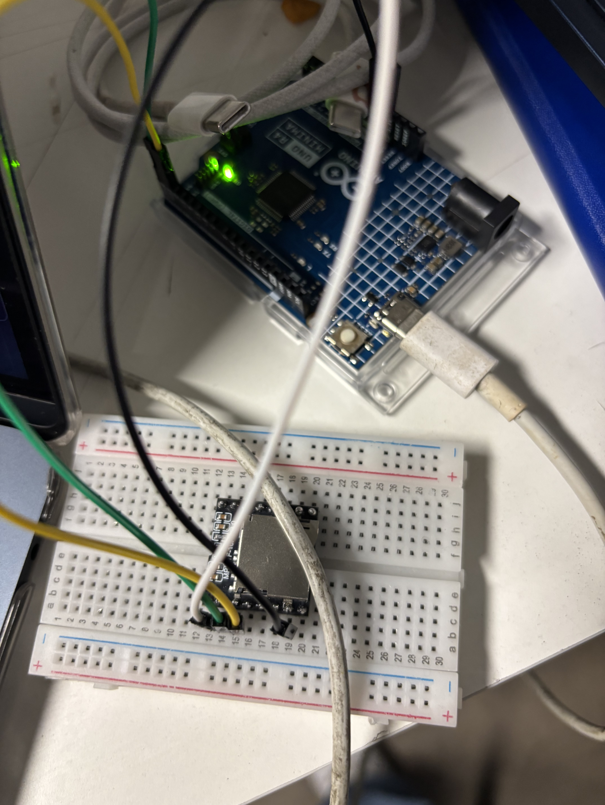
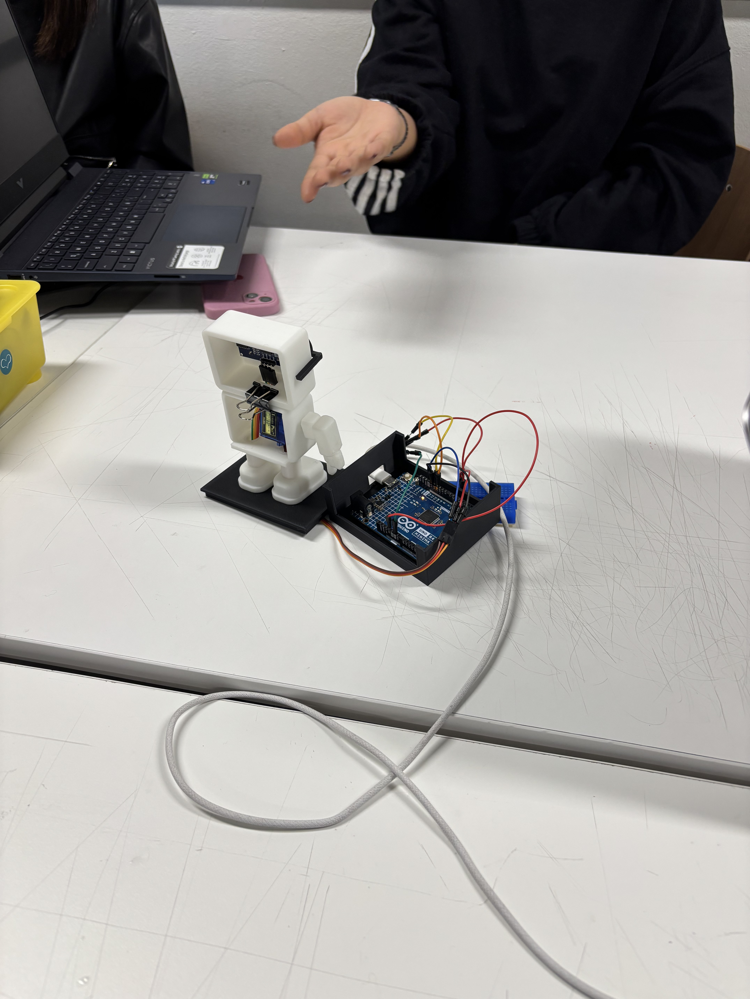
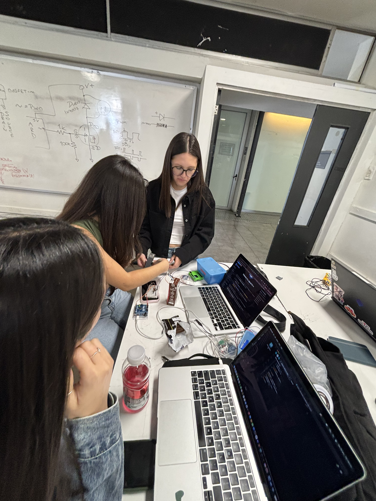
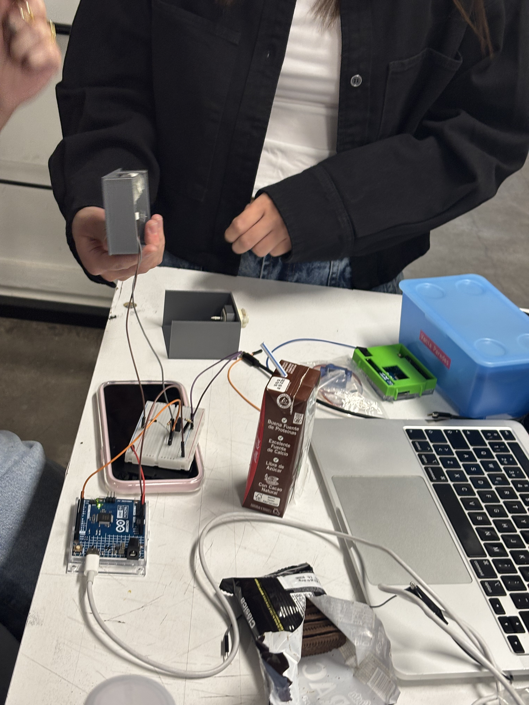
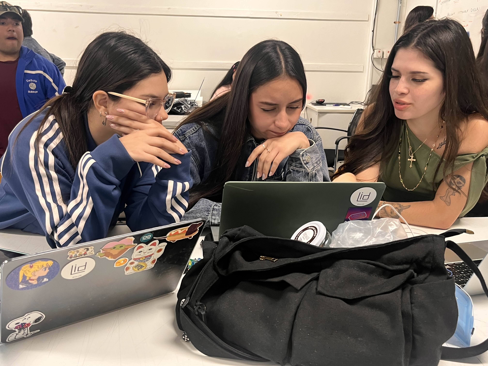

# Proyecto-02 

## Acerca del proyecto

- Grupo: 01
- Nombre de grupo: leonas.ino
- Integrantes:
  - Yamna Carrión / [yamna-bit](https://github.com/yamna-bit)
  - Sofía Cartes / [sofiacartes](https://github.com/sofiacartes)
  - Millaray Millar / [mmillar95](https://github.com/mmillar95)
  - Vania Paredes /  [21vaniaparedes](https://github.com/21vaniaparedes)
  - Valentina Ruz /[vxlentinaa](https://github.com/vxlentiinaa)

## Presentación textual 

### AND-Y

El proyecto consiste en un robot que saluda mediante la interacción con algún humano, por medio de el sensor de ultrasónico programado con Arduino R4 Minima. A través, de las diferentes distancias puede recorrer tres fases de audios:

`Diálogo:`

`Audios de saludo: Fase 1 y 2`

- Decir "hola humano, ¿porqué estas tan lejos?. Acércate"
- "Hola, no seas tímido, ven más cerca. no tengo, virus creoo, jiji. "

`Datos curiosos que dirá: Fase 3`

- “¿Sabías qué?, los 99% de los problemas se arreglan reiniciando.”
- “La nube no existe, son computadores de otro.”
- “Los datos nunca se borran, sólo se esconden.”
- “El error 404 es mi manera de hacerme el leso.”
- “El primer mouse era de madera.”
  
## Inputs y outputs

Componentes a utilizar:

- Sensor ultrasónico, sensor de proximidad HC-SR04
- Servomotor
- Motor vibrador (joystick)
- Reproductor MP3
- Altavoz
  
### Input

Mediante el sensor ultrasónico, la máquina detecta movimiento/presencia y mide la distancia.

### Output

Al detectar la distancia de la presencia la máquina reacciona de diferentes formas, según los siguientes componentes:

- Altavoz 
- Servomotor al levantar el brazo
- Motor vibrador al detectar presencia de algún humano

`Reacciones`

1. Cuando detecte una presencia esta comenzará a temblar (de nervios) mediante el motor DC el tembleque aumentará entre más cerca estés.
2. El sensor detectará presencia en 3 instancias: 2 - 15cm, 70 - 90cm, 130 - 150cm.
En cada parámetro la máquina reproduce un audio de voz distinto mediante la microSD en el reproductor MP3 y el altavoz.
3. Los parametros son:
- 130 - 150cm = Te "grita" que vengas. diciendo: "Hola humano, ¿porqué estas tan lejos?. Acércate.
- 80 - 100cm = Te grita de nuevo pidiendo que te acerque más, diciendo: "Hola, no seas tímido, ven más cerca. no tengo, virus creoo, jiji."
-  2 - 15cm = Levanta un "dedo" usando el servo motor, este se moverá de los 0 grados a los 180 mientras estés a esa distancia. Al mismo tiempo te dirá algún dato curioso.

- “¿Sabías qué?, los 99% de los problemas se arreglan reiniciando.”
-  “La nube no existe, son computadores de otro.”
-  “Los datos nunca se borran, sólo se esconden.”
-  “El error 404 es mi manera de hacerme el leso.”
-  “El primer mouse era de madera.”

## Bocetos de planificación

### Más procesos de códigos y fotografías en Github

## Etapas del código

### 1. Inicialización  del hardware

### 2. Relalizar códigos por parte según componentes a utilizar

### 3. Ver las clases de los archivos

### 4. Juntar el código 

## Etapas de la carcasa 

## Roles del equipo 

## Fotografías y videos del proyecto funcionando

## Bibliografía

### Repositorios

