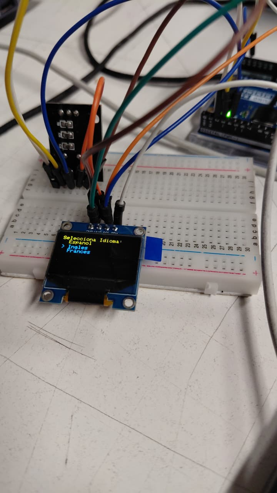
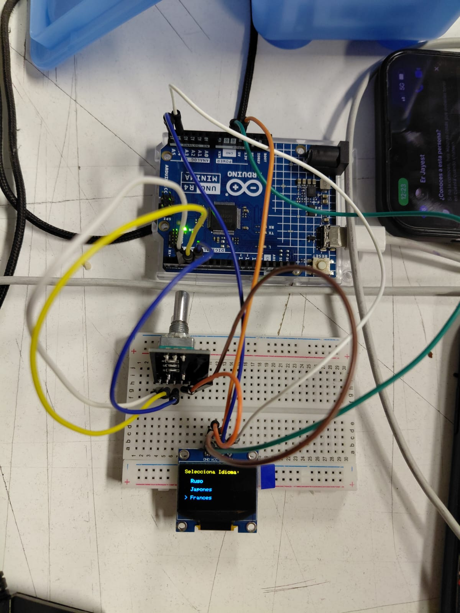
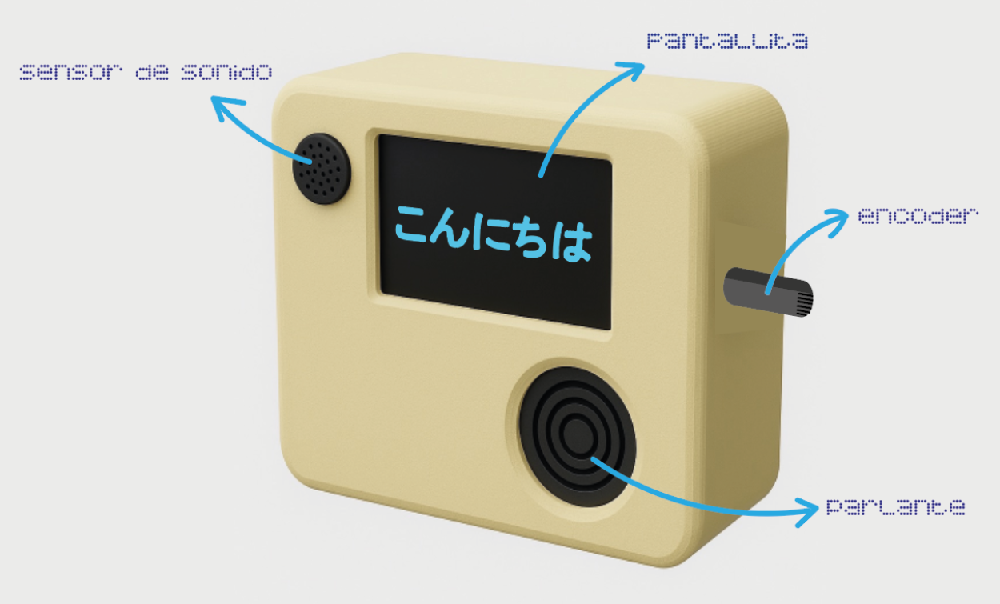
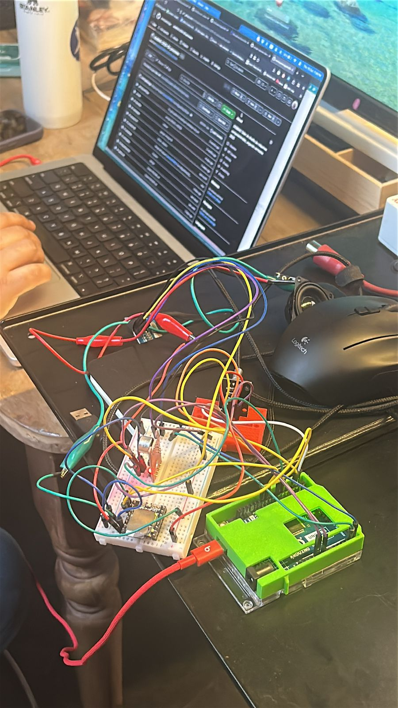
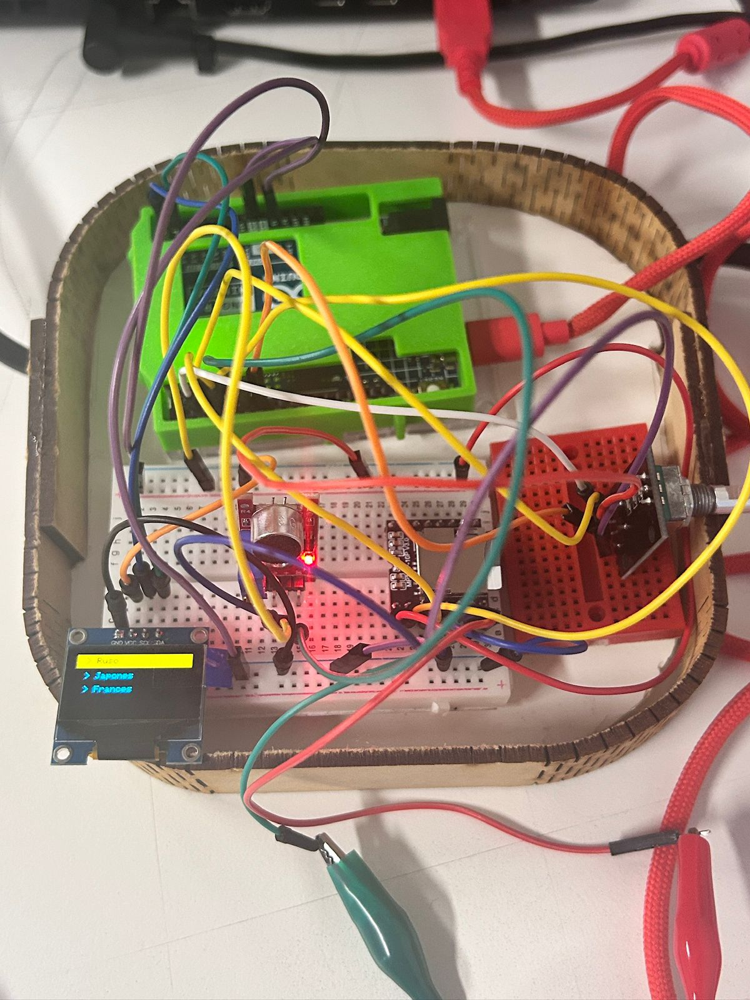
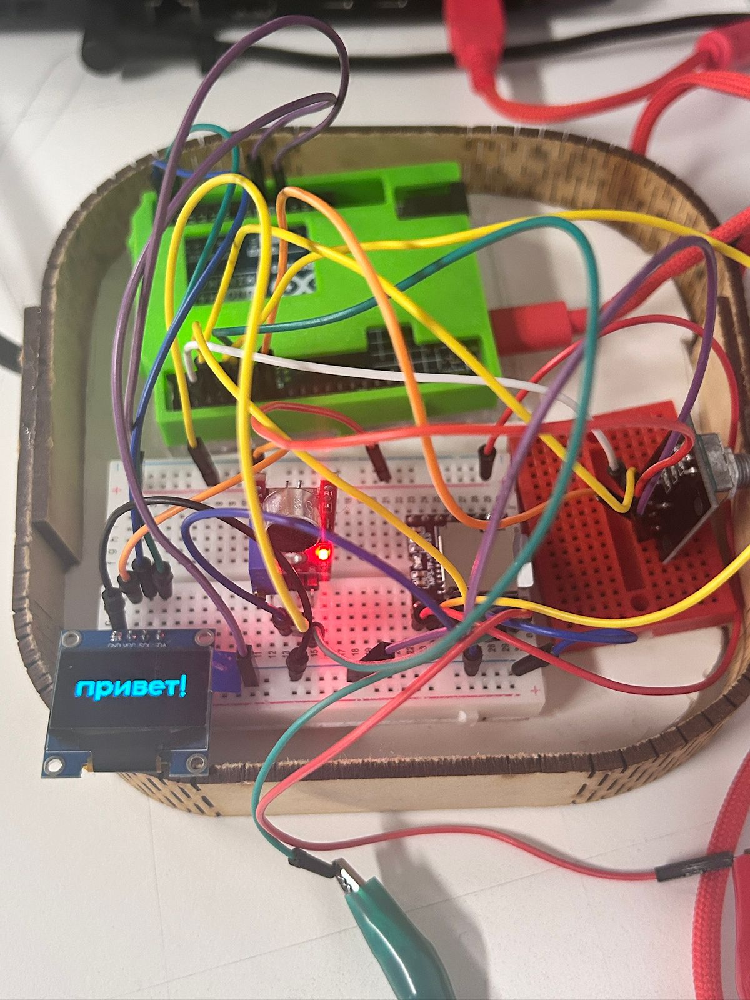

# Proyecto-02

## Acerca del proyecto

- grupo 03 
- Chispop
-Integrantes:
 - 01-[antokiaraa](https://github.com/antokiaraa/)
 - 16-[javieramoraga-rgb](https://github.com/javieramoraga-rgb/) 
 - 18-[ppia97](https://github.com/ppia97/)
 - 19-[Hiinalia](https://github.com/Hiinalia/)
 - 24-[Joquape](https://github.com/Joquape/)

## Presentación textual

Chispop es un proyecto interactivo que combina tecnología, sonido y lenguaje. La idea es crear una experiencia donde el usuario pueda elegir un idioma desde un menú en pantalla y, al aplaudir, recibir un saludo tanto visual como sonoro en el idioma seleccionado.


## Funcionamiento

Al encender el dispositivo, se muestra en la pantalla un menú de idiomas ( Ruso, Japones, Francés).

El usuario gira un encoder rotatorio para desplazarse entre las opciones y presiona su botón para seleccionar un idioma.

Luego, la pantalla muestra un mensaje que indica:

“Aplaude dos veces para continuar o presiona el botón para volver al menú.”

Si el sensor de sonido detecta un aplauso no pasa nada pero si detecta dos aplausos, se activa el reproductor DFPlayer Mini, que emite un saludo en audio correspondiente al idioma elegido y en la pantalla OLED se muestra una imagen del saludo en el idioma correspondiente.

Si el usuario presiona el botón, vuelve al menú principal.

## Componentes 
- Encoder 
- Pantalla OLED
- Sensor de sonido
- Módula DFPlayer
- Parlante

### INPUT

- Encoder rotatorio con pulsador. Gira para moverse por el menú. Se presiona para seleccionar un idioma o volver al menú.
- Sensor de sonido. Detecta el aplauso del usuario.

### OUTPUTS 

- Pantalla OLED .Muestra el menú de idiomas y los mensajes.
- Módulo DFPlayer Mini + parlante .Reproduce el audio de saludo en el idioma seleccionado.

## Roles del equipo

01-antokiaraa:
Se encargó del desarrollo del código final del proyecto, incluyendo la creación de las imágenes en formato bitmap para la pantalla. Además, colaboró en el montaje físico, en la integración de los audios y en la búsqueda del cableado necesario para el correcto funcionamiento del sistema.

16-javieramoraga-rgb:
Estuvo a cargo del desarrollo, organización y confección del código principal. También realizó la investigación de referencias necesarias, pruebas de funcionamiento en Wokwi y Arduino, y participó en la redacción del archivo README del proyecto.

18-ppia97:
Contribuyó en las pruebas de distintos códigos, la búsqueda e incorporación de los audios, la redacción del README y el montaje de las piezas. Además, participó en la investigación relacionada con el cableado del circuito.

19-Hiinalia:
Trabajó en el desarrollo del código para los sensores de aplausos y sonido, así como en el montaje físico del proyecto. También se encargó de la base y la carcasa, asegurando una correcta estructura y presentación del prototipo.

24-Joquape:
Se encargó del desarrollo y pruebas de los sensores de aplausos y sonido, colaborando en el montaje de la base y la creación de la carcasa del proyecto. Además, participó en la redacción del README y en la documentación final del trabajo.

☆ La recopilación y organización final del proyecto fue un trabajo colaborativo de todo el equipo.

## Proceso semana a semana

### sesión 7

Durante la primera semana, se definió los componentes y su cableado, el grupo logró desarrollar un prototipo de código que permitía: Mostrar un menú de idiomas en pantalla OLED. Seleccionar el idioma usando el encoder rotatorio con botón. Detectar un aplauso mediante el sensor de sonido. Reproducir el saludo en audio usando el DFPlayer Mini. Mostrar en la consola serial el idioma seleccionado y la acción realizada.

### sesión 8

Durante la segunda semana, el grupo se centró en probar los sensores e integrar la pantalla OLED, el encoder y el módulo reproductor MP3, así como en avanzar en el pseudocódigo que organizará la lógica del proyecto. Se definió la lista de idiomas siendo estas francés, japonés y ruso. Se logró que pantalla OLED y encoder funcionaran juntos. El menú de idiomas se despliega correctamente y se puede navegar girando el encoder. Con ayuda de compañeras del grupo 1, se conectó correctamente el altavoz al reproductor MP3, y se pudieron reproducir audios de prueba, incluyendo un saludo en francés ("Bonjour").

### Contratiempos

La pantalla que se pasó para el grupo no eran compatibles con la biblioteca Adafruit, por lo que se revisaron las conexiones físicas. Algunos intentos de conexión fallaron al usar otra pantalla. Pantalla OLED sin imagen: La dirección de la pantalla estaba incorrecta: se había puesto 0x3C (mayúscula) y debía ser 0x3c (minúscula). Reproductor MP3 sin sonido: Las conexiones TX y RX estaban invertidas. Tras corregirlas, el audio funciona correctamente.

### sesión 9

Durante la tercera semana, el grupo avanzó en la parte visual y sonora del proyecto, además de organizar mejor el código y planificar la carcasa del robot. Se crearon y agregaron todas las imágenes que se mostrarán en la interacción dentro de un archivo .h, listo para usar en el código. También se seleccionaron y terminaron los audios para los diferentes idiomas, incluyendo clips divertidos, como un saludo en francés de los Simpsons. Se trabajó en el sensor de sonido ,se probó un nuevo sensor más fácil de calibrar para detectar sonido y se investigó cómo detectar sonidos consecutivos para que la interacción responda correctamente. Y se organizó los archivos .ino de los sensores y la pantalla a .h y .cpp para modularizar y organizar mejor el proyecto

### sesión 10

Durante la cuarta semana, el grupo trabajó en hacer funcionar los últimos detalles del código junto con todos sus sensores y actuadores. Lo que resultó de esta semana fue poder establecer que funciona, que es lo que no funciona, y qué es lo que no alcanzamos a poder implementar. Lo que se pudo hacer funcionar fue el menú de idiomas, el encoder pulsable, el audio de los saludos, y un aplauso para reproducir. Lo que no pudo funcionar y no se implementó son los dos aplausos para reproducir, volver al menú sin que se congele en la reproducción del audio e imágenes, además de la luz LED como latidos de corazón que inicialmente se había pensado implementar.
Algunas de las características que no se pudieron cumplir fueron debido a la falta de tiempo para poder aprender acerca del tema, ya que en la programación se requiere de tiempo para poder profundizar. Esto es algo que se requería para poder implementar las partes más complejas.

### IMÁGENES DEL PROCESO











## EXPLICACIÓN CÓDIGO 

### ARCHIVO PRINCIPAL: grupo_03_2025_10_16_comentado.ino

- Aqui se describe el propósito general del proyecto, indica los componentes de hardware usados y se
resume la lógica principal del flujo.

```cpp
-/*
Archivo principal proyecto
  main.ino - CHISPOP 
  - Usa: Encoder, Pantalla OLED, Sensor de aplausos, DFPlayer Mini
     * Menú de selección con encoder
     * Pantalla de instrucción: "Aplaude dos veces"
     * Reproducción: se activa al detectar 2 aplausos (≈5 s)
*/
```
- Inclusión de clases, se importan los archivos de cabecera (.h) que definen las clases necesarias para utilizar, cada uno de estos .h tiene un .cpp correspondiente que contiene su implementación.

```cpp
// incluir clases que escribimos
#include "Pantalla.h"  //Control pantalla OLED
#include "ReproductorMP3.h"  //Control modulo DFPlayer Mini
#include "SensorEncoder.h"  //Lectura encoder rotativo
#include "SensorAplauso.h"  //Deteccion aplausos mediante microfono

```

- Declaración de objeto globales e instancias de los módulos, aquí se crean las instancias globales de las clases que se usarán en todo el archivo. Estas se inicializan en el setup().

```cpp
// Objetos principales
//Instancias de la clases que encapsulan pantalla, reproductor y sensores
SensorEncoder encoder;
SensorAplauso sensorAplauso;
Pantalla pantalla;
ReproductorMP3 mp3;

```

- Variables de estado y configuración, aqui el programa alterna entre dos estados, el modo menú (selección de idioma) y el modo detección de aplausos / reproducción.

```cpp
// Estados de la aplicación
bool enModoMenu = true;  //true si se muestra el menu
bool enReproduccion = false;  //true si esta sonando un audio
int idiomaSeleccionado = 0;  //indice del idioma seleccionado en el menú
const int totalIdiomas = 3;
const char* nombresIdiomas[totalIdiomas] = { "> Ruso", "> Japonés", "> Francés" };
```

- Control de tiempo de reproducción: aqui se define cuánto dura el audio (5000 ms = 5 s), se almacena el momento exacto en que debe terminar la reproducción, lo que permite un control no bloqueante del tiempo sin usar delay().

```cpp
// Control de tiempo reproduccion
// 5 segundos
const unsigned long duracionAudioMs = 5000UL;
unsigned long tiempoFinReproduccion = 0UL;
```

- Setup: aqui se activa el puerto serial para depuración (envío de mensajes al monitor) con una pequeña pausa para estabilizar el arranque (delay 50), también se llama a los métodos de configuración como encoder.configurar(), que define pines y estados iniciales. Con todo esto se muestra el menú de idioma inicial en pantalla.

```cpp
void setup() {  
  Serial.begin(9600); //inicio puerto serie para debug
  delay(50);
  Serial.println(F("CHISPOP - version final"));

  // configurar sensores
  encoder.configurar();  //inicializar encoder
  sensorAplauso.configurar();  //inicializar sensor aplausos

  // construir actuadores
  pantalla.iniciar(); //inicializar OLED
  mp3.iniciar();  //inicializar DFPlayer

  pantalla.mostrarMenuIdioma(idiomaSeleccionado);  //mostrar menu inicial
  Serial.println(F("Gira el encoder y presiona para elegir."));
}
```

- Función loop (1): Aqui el sistema permanece mostrando el menú de idiomas. Detecta el giro del encoder con leerMovimiento() y actualiza la pantalla según el idioma elegido. Si el botón del encoder se presiona, el programa sale del menú, muestra la instrucción “Aplaude dos veces” y prepara el sistema para la detección de sonido.
  
```cpp
void loop() {
  if (enModoMenu) {
    Serial.println("ESTOY EN MODO MENU");
    int opt = encoder.leerMovimiento();
    if (opt != idiomaSeleccionado) {
      idiomaSeleccionado = opt;
      pantalla.mostrarMenuIdioma(idiomaSeleccionado);
      Serial.print(F("Idioma seleccionado: "));
      Serial.println(nombresIdiomas[idiomaSeleccionado]);
    }

    if (encoder.botonPresionado()) {
      enModoMenu = false;
      pantalla.mostrarMensajeAplauso();
      Serial.println(F("Presiona: Aplaude dos veces para continuar."));
      delay(120);
    }
```

- Función loop (2): Aquí el sistema analiza las señales del micrófono con leer() y decidir(). Si detecta dos aplausos, muestra la imagen del idioma, reproduce el saludo correspondiente y marca el tiempo de fin. Una vez transcurridos los 5 segundos, vuelve a la instrucción inicial. Si se presiona el botón del encoder, el programa cancela la reproducción y se regresa al menú principal.

```cpp
  } else {
    sensorAplauso.leer();
    sensorAplauso.decidir();

    if (!enReproduccion && sensorAplauso.hayDosAplausos) {
      Serial.println(F("Aplausos detectados -> Reproducir saludo"));
  
      pantalla.mostrarBitmapIdioma(idiomaSeleccionado);
      mp3.reproducirSaludo(idiomaSeleccionado);

      enReproduccion = true;
      tiempoFinReproduccion = millis() + duracionAudioMs;
    }

    if (enReproduccion && millis() >= tiempoFinReproduccion) {
      enReproduccion = false;
      pantalla.mostrarMensajeAplauso();
      Serial.println(F("Reproducción finalizada."));
    }

    if (encoder.botonPresionado()) {
      enModoMenu = true;
      enReproduccion = false;
      pantalla.mostrarMenuIdioma(idiomaSeleccionado);
      Serial.println(F("Volviendo al menú principal."));
      delay(150);
    }
  }
}
```

### IMAGEN.H: Aqui se definen los bitmaps de los idiomas (Ruso, Japonés y Francés) escritos en su forma original. Cada arreglo (imagenRuso, imagenJapones, imagenFrances) contiene los datos binarios que representan la forma escrita de los saludos.

```cpp
#ifndef IMAGEN_H
#define IMAGEN_H

// Bitmaps de idiomas (copiar el contenido exacto de message.txt aquí)
const unsigned char imagenRuso [] PROGMEM = {
 0x00, 0x00, 0x00, 0x00, 0x00, 0x00, 0x00, 0x00, 0x00, 0x00, 0x00, 0x00, 0x00, 0x00, 0x00, 0x00, 
	0x00, 0x00, 0x00, 0x00, 0x00, 0x00, 0x00, 0x00, 0x00, 0x00, 0x00, 0x00, 0x00, 0x00, 0x00, 0x00, 
	0x00, 0x00, 0x00, 0x00, 0x00, 0x00, 0x00, 0x00, 0x00, 0x00, 0x00, 0x00, 0x00, 0x00, 0x00, 0x00, 
	0x00, 0x00, 0x00, 0x00, 0x00, 0x00, 0x00, 0x00, 0x00, 0x00, 0x00, 0x00, 0x00, 0x00, 0x00, 0x00, 
	0x00, 0x00, 0x00, 0x00, 0x00, 0x00, 0x00, 0x00, 0x00, 0x00, 0x00, 0x00, 0x00, 0x00, 0x00, 0x00, 
	0x00, 0x00, 0x00, 0x00, 0x00, 0x00, 0x00, 0x00, 0x00, 0x00, 0x00, 0x00, 0x00, 0x00, 0x00, 0x00, 
	0x00, 0x00, 0x00, 0x00, 0x00, 0x00, 0x00, 0x00, 0x00, 0x00, 0x00, 0x00, 0x00, 0x00, 0x00, 0x00, 
	0x00, 0x00, 0x00, 0x00, 0x00, 0x00, 0x00, 0x00, 0x00, 0x00, 0x00, 0x00, 0x00, 0x00, 0x00, 0x00, 
	0x00, 0x00, 0x00, 0x00, 0x00, 0x00, 0x00, 0x00, 0x00, 0x00, 0x00, 0x00, 0x00, 0x00, 0x00, 0x00, 
	0x00, 0x00, 0x00, 0x00, 0x00, 0x00, 0x00, 0x00, 0x00, 0x00, 0x00, 0x00, 0x00, 0x00, 0x00, 0x00, 
	0x00, 0x00, 0x00, 0x00, 0x00, 0x00, 0x00, 0x00, 0x00, 0x00, 0x00, 0x00, 0x00, 0x00, 0x00, 0x00, 
	0x00, 0x00, 0x00, 0x00, 0x00, 0x00, 0x00, 0x00, 0x00, 0x00, 0x00, 0x00, 0x00, 0x00, 0x00, 0x00, 
	0x00, 0x00, 0x00, 0x00, 0x00, 0x00, 0x00, 0x00, 0x00, 0x00, 0x00, 0x00, 0x00, 0x00, 0x00, 0x00, 
	0x00, 0x00, 0x00, 0x00, 0x00, 0x00, 0x00, 0x00, 0x00, 0x00, 0x00, 0x00, 0x00, 0x00, 0x00, 0x00, 
	0x00, 0x00, 0x00, 0x00, 0x00, 0x00, 0x00, 0x00, 0x00, 0x00, 0x00, 0x00, 0x00, 0x00, 0x00, 0x00, 
	0x00, 0x00, 0x00, 0x00, 0x00, 0x00, 0x00, 0x00, 0x00, 0x00, 0x00, 0x00, 0x00, 0x00, 0x00, 0x00, 
	0x00, 0x00, 0x00, 0x00, 0x00, 0x00, 0x00, 0x00, 0x00, 0x00, 0x00, 0x00, 0x00, 0x00, 0x00, 0x00, 
	0x00, 0x00, 0x00, 0x00, 0x00, 0x00, 0x00, 0x00, 0x00, 0x00, 0x00, 0x00, 0x00, 0x00, 0x00, 0x00, 
	0x00, 0x00, 0x00, 0x00, 0x00, 0x00, 0x00, 0x00, 0x00, 0x00, 0x00, 0x00, 0x00, 0x00, 0x00, 0x00, 
	0x00, 0x00, 0x00, 0x00, 0x00, 0x00, 0x00, 0x00, 0x00, 0x00, 0x00, 0x00, 0x00, 0x00, 0x38, 0x00, 
	0x00, 0x00, 0x00, 0x00, 0x00, 0x00, 0x00, 0x00, 0x00, 0x00, 0x00, 0x00, 0x00, 0x00, 0x38, 0x00, 
	0x00, 0x00, 0x00, 0x00, 0x00, 0x00, 0x00, 0x00, 0x00, 0x00, 0x00, 0x00, 0x00, 0x00, 0x38, 0x00, 
	0x00, 0x00, 0x00, 0x00, 0x00, 0x00, 0x00, 0x00, 0x00, 0x00, 0x00, 0x00, 0x00, 0x00, 0x38, 0x00, 
	0x00, 0x00, 0x00, 0x00, 0x00, 0x00, 0x00, 0x00, 0x00, 0x00, 0x00, 0x00, 0x00, 0x00, 0x38, 0x00, 
	0x00, 0x00, 0x00, 0x00, 0x00, 0x00, 0x00, 0x00, 0x00, 0x00, 0x00, 0x00, 0x00, 0x00, 0x38, 0x00, 
	0x00, 0x1f, 0xff, 0x87, 0x3f, 0x80, 0xe0, 0x1c, 0x3f, 0xf8, 0x07, 0xf8, 0x3f, 0xfe, 0x38, 0x00, 
	0x00, 0x3f, 0xff, 0xc7, 0xff, 0xe0, 0xe0, 0x3c, 0x3f, 0xfc, 0x1f, 0xfc, 0x7f, 0xfe, 0x38, 0x00, 
	0x00, 0x3f, 0xff, 0xc7, 0xff, 0xe0, 0xe0, 0x7c, 0x3f, 0xfe, 0x3f, 0xfe, 0x3f, 0xfe, 0x38, 0x00, 
	0x00, 0x3e, 0x03, 0xc7, 0xf3, 0xf0, 0xe0, 0xfc, 0x38, 0x1e, 0x3e, 0x1f, 0x03, 0xe0, 0x38, 0x00, 
	0x00, 0x3c, 0x03, 0xc7, 0xc0, 0xf8, 0xe1, 0xfc, 0x38, 0x1e, 0x7c, 0x0f, 0x03, 0xc0, 0x38, 0x00, 
	0x00, 0x3c, 0x03, 0xc7, 0xc0, 0x78, 0xe3, 0xfc, 0x3f, 0xfc, 0x78, 0x07, 0x03, 0xc0, 0x38, 0x00, 
	0x00, 0x3c, 0x03, 0xc7, 0x80, 0x78, 0xe3, 0xfc, 0x3f, 0xfc, 0x7f, 0xff, 0x83, 0xc0, 0x38, 0x00, 
	0x00, 0x3c, 0x03, 0xc7, 0x80, 0x78, 0xe7, 0xbc, 0x3f, 0xfe, 0x7f, 0xff, 0x83, 0xc0, 0x38, 0x00, 
	0x00, 0x3c, 0x03, 0xc7, 0x80, 0x78, 0xef, 0x3c, 0x38, 0x1e, 0x78, 0x00, 0x03, 0xc0, 0x38, 0x00, 
	0x00, 0x3c, 0x03, 0xc7, 0xc0, 0xf8, 0xfe, 0x3c, 0x38, 0x1f, 0x78, 0x00, 0x03, 0xc0, 0x38, 0x00, 
	0x00, 0x3c, 0x03, 0xc7, 0xe1, 0xf0, 0xfc, 0x3c, 0x38, 0x1f, 0x3c, 0x00, 0x03, 0xc0, 0x10, 0x00, 
	0x00, 0x3c, 0x03, 0xc7, 0xff, 0xf0, 0xf8, 0x3c, 0x3c, 0x3e, 0x3e, 0x3c, 0x03, 0xc0, 0x00, 0x00, 
	0x00, 0x3c, 0x03, 0xc7, 0xff, 0xe0, 0xf8, 0x3c, 0x3f, 0xfe, 0x1f, 0xfc, 0x03, 0xc0, 0x00, 0x00, 
	0x00, 0x1c, 0x03, 0xc7, 0xff, 0xc0, 0xf0, 0x3c, 0x3f, 0xfc, 0x0f, 0xfc, 0x03, 0xc0, 0x38, 0x00, 
	0x00, 0x1c, 0x03, 0x87, 0x9f, 0x00, 0xe0, 0x1c, 0x3f, 0xf8, 0x03, 0xf0, 0x01, 0xc0, 0x3c, 0x00, 
	0x00, 0x00, 0x00, 0x07, 0x80, 0x00, 0x00, 0x00, 0x00, 0x00, 0x00, 0x00, 0x00, 0x00, 0x38, 0x00, 
	0x00, 0x00, 0x00, 0x07, 0x80, 0x00, 0x00, 0x00, 0x00, 0x00, 0x00, 0x00, 0x00, 0x00, 0x10, 0x00, 
	0x00, 0x00, 0x00, 0x07, 0x80, 0x00, 0x00, 0x00, 0x00, 0x00, 0x00, 0x00, 0x00, 0x00, 0x00, 0x00, 
	0x00, 0x00, 0x00, 0x07, 0x80, 0x00, 0x00, 0x00, 0x00, 0x00, 0x00, 0x00, 0x00, 0x00, 0x00, 0x00, 
	0x00, 0x00, 0x00, 0x03, 0x80, 0x00, 0x00, 0x00, 0x00, 0x00, 0x00, 0x00, 0x00, 0x00, 0x00, 0x00, 
	0x00, 0x00, 0x00, 0x00, 0x00, 0x00, 0x00, 0x00, 0x00, 0x00, 0x00, 0x00, 0x00, 0x00, 0x00, 0x00, 
	0x00, 0x00, 0x00, 0x00, 0x00, 0x00, 0x00, 0x00, 0x00, 0x00, 0x00, 0x00, 0x00, 0x00, 0x00, 0x00, 
	0x00, 0x00, 0x00, 0x00, 0x00, 0x00, 0x00, 0x00, 0x00, 0x00, 0x00, 0x00, 0x00, 0x00, 0x00, 0x00, 
	0x00, 0x00, 0x00, 0x00, 0x00, 0x00, 0x00, 0x00, 0x00, 0x00, 0x00, 0x00, 0x00, 0x00, 0x00, 0x00, 
	0x00, 0x00, 0x00, 0x00, 0x00, 0x00, 0x00, 0x00, 0x00, 0x00, 0x00, 0x00, 0x00, 0x00, 0x00, 0x00, 
	0x00, 0x00, 0x00, 0x00, 0x00, 0x00, 0x00, 0x00, 0x00, 0x00, 0x00, 0x00, 0x00, 0x00, 0x00, 0x00, 
	0x00, 0x00, 0x00, 0x00, 0x00, 0x00, 0x00, 0x00, 0x00, 0x00, 0x00, 0x00, 0x00, 0x00, 0x00, 0x00, 
	0x00, 0x00, 0x00, 0x00, 0x00, 0x00, 0x00, 0x00, 0x00, 0x00, 0x00, 0x00, 0x00, 0x00, 0x00, 0x00, 
	0x00, 0x00, 0x00, 0x00, 0x00, 0x00, 0x00, 0x00, 0x00, 0x00, 0x00, 0x00, 0x00, 0x00, 0x00, 0x00, 
	0x00, 0x00, 0x00, 0x00, 0x00, 0x00, 0x00, 0x00, 0x00, 0x00, 0x00, 0x00, 0x00, 0x00, 0x00, 0x00, 
	0x00, 0x00, 0x00, 0x00, 0x00, 0x00, 0x00, 0x00, 0x00, 0x00, 0x00, 0x00, 0x00, 0x00, 0x00, 0x00, 
	0x00, 0x00, 0x00, 0x00, 0x00, 0x00, 0x00, 0x00, 0x00, 0x00, 0x00, 0x00, 0x00, 0x00, 0x00, 0x00, 
	0x00, 0x00, 0x00, 0x00, 0x00, 0x00, 0x00, 0x00, 0x00, 0x00, 0x00, 0x00, 0x00, 0x00, 0x00, 0x00, 
	0x00, 0x00, 0x00, 0x00, 0x00, 0x00, 0x00, 0x00, 0x00, 0x00, 0x00, 0x00, 0x00, 0x00, 0x00, 0x00, 
	0x00, 0x00, 0x00, 0x00, 0x00, 0x00, 0x00, 0x00, 0x00, 0x00, 0x00, 0x00, 0x00, 0x00, 0x00, 0x00, 
	0x00, 0x00, 0x00, 0x00, 0x00, 0x00, 0x00, 0x00, 0x00, 0x00, 0x00, 0x00, 0x00, 0x00, 0x00, 0x00, 
	0x00, 0x00, 0x00, 0x00, 0x00, 0x00, 0x00, 0x00, 0x00, 0x00, 0x00, 0x00, 0x00, 0x00, 0x00, 0x00, 
	0x00, 0x00, 0x00, 0x00, 0x00, 0x00, 0x00, 0x00, 0x00, 0x00, 0x00, 0x00, 0x00, 0x00, 0x00, 0x00, 
	0x00, 0x00, 0x00, 0x00, 0x00, 0x00, 0x00, 0x00, 0x00, 0x00, 0x00, 0x00, 0x00, 0x00, 0x00, 0x00
};
```

### PANTALLA.CPP 
-Se incluyen todas las librerías necesarias para manejar la pantalla OLED y los bitmaps, y se crea un objeto display que permitirá controlar la pantalla con los parámetros de ancho y alto definidos.

```cpp
#include "Pantalla.h"
#include "Imagen.h"  // Incluye bitmaps
#include <Wire.h>
#include <Adafruit_GFX.h>
#include <Adafruit_SSD1306.h>

// Definición global del objeto display
Adafruit_SSD1306 display(ANCHO_PANTALLA, ALTO_PANTALLA, &Wire, -1);
```
- Se define un constructor vacío para la clase y un método de inicio que inicializa la pantalla OLED por I2C; si falla, detiene el programa. Después limpia la pantalla y la deja lista para mostrar contenido.

```cpp
Pantalla::Pantalla() {}  //Constructor vacio

void Pantalla::iniciar() {
  if (!display.begin(SSD1306_SWITCHCAPVCC, 0x3C)) {
    Serial.println(F("No se pudo inicializar la pantalla OLED"));
    for (;;);
  }
  display.clearDisplay();
  display.display();
}
```

- Aqui se muestra un menú de selección de idiomas en la pantalla, resaltando la opción actual con fondo blanco y texto negro, mientras que las demás opciones aparecen en blanco sobre negro, permitiendo una navegación visual clara.

```cpp
void Pantalla::mostrarMenuIdioma(int opcion) {
  const char* idiomas[] = {"> Ruso", "> Japones", "> Frances"};
  int total = 3;

  display.clearDisplay();
  display.setTextSize(1);
  display.setTextColor(SSD1306_WHITE);

  for (int i = 0; i < total; i++) {
    if (i == opcion) {
      display.fillRect(0, i * 16, 128, 16, SSD1306_WHITE);
      display.setTextColor(SSD1306_BLACK);
    } else {
      display.setTextColor(SSD1306_WHITE);
    }
    display.setCursor(10, i * 16 + 4);
    display.print(idiomas[i]);
  }

  display.display();
}
```

- Aqui se limpia la pantalla y muestra un mensaje instructivo que indica al usuario que debe aplaudir dos veces para continuar, utilizando dos líneas de texto centradas y claras.

```cpp
void Pantalla::mostrarMensajeAplauso() {
  display.clearDisplay();
  display.setTextSize(1);
  display.setTextColor(SSD1306_WHITE);
  display.setCursor(10, 20);
  display.println("Aplaude dos veces");
  display.setCursor(10, 35);
  display.println("para continuar...");
  display.display();
}
```

- Luego, según el idioma seleccionado, se muestra en pantalla el bitmap correspondiente, o una imagen por defecto si la opción es inválida, asegurando que siempre haya un contenido visual mostrado.

```cpp
void Pantalla::mostrarBitmapIdioma(int idioma) {
  display.clearDisplay();
  
  if (idioma == 0) {
    display.drawBitmap(0, 0, imagenRuso, 128, 64, SSD1306_WHITE);
  } else if (idioma == 1) {
    display.drawBitmap(0, 0, imagenJapones, 128, 64, SSD1306_WHITE);
  } else if (idioma == 2) {
    display.drawBitmap(0, 0, imagenFrances, 128, 64, SSD1306_WHITE);
  } else {
    display.drawBitmap(0, 0, imagenPucha, 128, 64, SSD1306_WHITE);
  }

  display.display();
}
```
### PANTALLA.H
- Con esto, se evita que el archivo se incluya más de una vez en el proyecto, previniendo errores de compilación por redefinición.

```cpp
#ifndef PANTALLA_H
#define PANTALLA_H
```
- Se incluyen las librerías básicas de Arduino y la de la pantalla OLED para poder usar sus funciones y tipos de datos.

```cpp
#include <Arduino.h>
#include <Adafruit_SSD1306.h>
```

- Aqui se definen las dimensiones de la pantalla OLED, que se usarán en la creación del objeto display.

```cpp
#define ANCHO_PANTALLA 128
#define ALTO_PANTALLA 64
```

- Aqui se declara la clase Pantalla con su constructor y métodos públicos para inicializar la pantalla, mostrar menús, mensajes y bitmaps según el idioma seleccionado.

```cpp
class Pantalla {
  public:
    Pantalla();  //Constructor
    void iniciar();  //Inicializa pantall OLED
    void mostrarMenuIdioma(int opcion); // Muestra menú de selección de idioma, resalta 'opcion'
    void mostrarBitmapIdioma(int idioma); // Muestra imagen correspondiente al idioma seleccionado
    void mostrarMensajeAplauso(); // Muestra mensaje de instrucciones para aplauso
};
// Objeto global para usar la pantalla en todo el proyecto

extern Adafruit_SSD1306 display;

#endif
```

### REPRODUCTORMP3.CPP
- Aqui se incluyen la cabecera de la clase ReproductorMP3 y la librería SoftwareSerial para crear un puerto serial adicional y comunicarse con el DFPlayer.

```cpp
#include "ReproductorMP3.h"
#include <SoftwareSerial.h>
```

- Se define un puerto serial por software en los pines 10 y 11 y se crea un objeto dfPlayer para controlar el módulo DFPlayer Mini.

```cpp
SoftwareSerial mp3Serial(10, 11); // RX, TX
DFRobotDFPlayerMini dfPlayer; // Objeto DFPlayer
```

- Se inicia la comunicación serial a 9600 baudios, se verifica que el DFPlayer esté conectado correctamente y se ajusta el volumen inicial.

```cpp
void ReproductorMP3::iniciar() {
  mp3Serial.begin(9600); // Inicia comunicación serial con DFPlayer
  if (!dfPlayer.begin(mp3Serial)) { // Verifica conexión con el DFPlayer
    Serial.println("Error DFPlayer"); 
    return; // Sale si falla la inicialización
  }
  dfPlayer.volume(25);  // volumen inicial
}
```

- Dependiendo del valor del parámetro idioma, se reproduce el archivo de audio correspondiente; si el valor es inválido, se reproduce un archivo por defecto. Estan las 3 opciones de idioma más una si falla.

```cpp
void ReproductorMP3::reproducirSaludo(int idioma) {
  switch (idioma) {
    case 0:
      dfPlayer.play(1); // saludo ruso.mp3
      break;
    case 1:
      dfPlayer.play(2); // saludo japones.mp3
      break;
    case 2:
      dfPlayer.play(3); // saludo frances.mp3
      break;
    default:
      dfPlayer.play(4); // pucha.mp3
      break;
  }
}
```

### REPRODUCTORMP3.H
- Se incluyen la librería base de Arduino y la librería específica para controlar el módulo DFPlayer Mini.

```cpp
#include "Arduino.h"
#include "DFRobotDFPlayerMini.h"
```

- Se declara la clase que encapsula todas las funciones para controlar el reproductor MP3.

```cpp
class ReproductorMP3 {
  public:
```

-  Método que configura la comunicación con el DFPlayer y ajusta el volumen inicial.

```cpp
  void iniciar(); 
```

- Aqui, se permite reproducir un archivo de audio dependiendo del idioma elegido; maneja un valor por defecto si el idioma es inválido.

```cpp
  void reproducirSaludo(int idioma); // Reproduce archivo MP3 según idioma
};

#endif
```

### SENSORAPLAUSO.CPP
- Se incluye el archivo de definición de la clase para poder implementar sus métodos.

```cpp
#include "SensorAplauso.h"
```

- Se crea un objeto SensorAplauso; actualmente no realiza ninguna acción al instanciarse.

```cpp
SensorAplauso::SensorAplauso() {
}
```

- Configura el pin conectado al sensor de aplausos como entrada para poder leer su estado.

```cpp
void SensorAplauso::configurar() {
  pinMode(SensorAplauso::patitaSensor, INPUT);
}
```

- Aqui se lee el valor del sensor (HIGH si detecta aplauso) y registra el tiempo actual para medir intervalos entre aplausos.

```cpp
void SensorAplauso::leer() {
  SensorAplauso::valorActual = digitalRead(SensorAplauso::patitaSensor);
  SensorAplauso::tiempoActual = millis();
}
```

- Aqui se determina si se ha producido un aplauso y actualiza las variables anteriores para comparar con futuras lecturas; actualmente marca hayDosAplausos como verdadero si detecta un aplauso sin lógica de doble aplauso aún.

```cpp
void SensorAplauso::decidir() {
  if (SensorAplauso::valorActual == HIGH) {
    SensorAplauso::hayDosAplausos = true;
  } else {
    SensorAplauso::hayDosAplausos = false;
  }

  SensorAplauso::valorAnterior = SensorAplauso::valorActual;
  SensorAplauso::tiempoAnterior = SensorAplauso::tiempoActual;
}
```

**SENSORAPLAUSO.H**
- Aqui se evita que el archivo se incluya varias veces y permite usar funciones y tipos de Arduino y define la clase SensorAplauso que encapsula funciones y variables para detectar aplausos.

```cpp
#ifndef SENSOR_APLAUSO_H
#define SENSOR_APLAUSO_H

#include <Arduino.h>
class SensorAplauso {
public:
```

- El constructor inicializa el objeto y el destructor libera recursos si fuera necesario, luego se incluyen funciones para configurar el pin, leer el sensor, decidir si hay dos aplausos consecutivos y detectar aplausos de manera externa.

```cpp
  // funciones
  ////////////
// constructor, inicializa objeto
  SensorAplauso();
// destructor, libera recursos si es necesario
  ~SensorAplauso();
//Configura el pin del sensor como entrada
  void configurar();
//Leer el estado actual del sensor
  void leer();
// Decide si se detectaron dos aplausos consecutivos
  void decidir();
 // Detecta aplausos (función extra para uso externo)
  bool detectarAplausos();
```

- Aqui el Pin digital donde está conectado el sensor de sonido, originalmente era analógico pero se cambió a digital. Tambien estan las variables que guardan si se detectaron dos aplausos y los valores actuales y anteriores del sensor (LOW/HIGH).

```cpp
 int patitaSensor = 6;

 // Estado del sistema: true si hay dos aplausos
  bool hayDosAplausos = false;

  // valores de lectura pueden ser 0 (LOW) o 1 (HIGH)
  bool valorActual = 0;
  bool valorAnterior = 0;
```

- Las variables de tiempo que almacenan los momentos de lectura y el tiempo para controlar cambios en la luz LED u otros eventos temporizados.

```cpp
unsigned long tiempoActual = 0;
unsigned long tiempoAnterior = 0;
unsigned long tiempoCambioLED = 0;
```

### SENSORENCODER.CPP
- Constructor y destructor, se inicializa el estado del encoder, colocando los pines del reloj en HIGH por defecto y estableciendo la opción inicial del menú en 0 y no realiza ninguna acción especial al destruir el objeto.

```cpp
#include "SensorEncoder.h"

//Constructor
SensorEncoder::SensorEncoder() {
  // Estado por defecto
  clockActual = HIGH;
  clockAnterior = HIGH;
  opcionMenu = 0; // Opción inicial del menú
}

//Destructor
SensorEncoder::~SensorEncoder() {
}
```

- Se configuran los pines del encoder: Clock y Data como entradas, y el switch con pull-up interno. Luego, lee el estado inicial del pin Clock.

```cpp
void SensorEncoder::configurar() {
  pinMode(patitaClock, INPUT);
  pinMode(patitaData, INPUT);
  pinMode(patitaSwitch, INPUT_PULLUP);
  clockAnterior = digitalRead(patitaClock);
}
```

- Luego se detecta el giro del encoder mediante el flanco descendente del pin Clock, determina la dirección según el pin Data, ajusta la opción del menú y mantiene el valor dentro de un rango circular.

```cpp
int SensorEncoder::tomarDecisiones() {
  clockActual = digitalRead(patitaClock);
  if (clockAnterior == HIGH && clockActual == LOW) {
    int dataVal = digitalRead(patitaData);
    int nuevaOpcion = opcionMenu;
    if (dataVal == LOW) {
      nuevaOpcion = opcionMenu + 1;
    } else {
      nuevaOpcion = opcionMenu - 1;
    }
    const int maxOpciones = 3; 
    if (nuevaOpcion < 0) nuevaOpcion = maxOpciones - 1;
    if (nuevaOpcion >= maxOpciones) nuevaOpcion = 0;
    opcionMenu = nuevaOpcion;
  }
  clockAnterior = clockActual;
  return opcionMenu;
}
```

- Aqui se lee el movimiento con la función simple que devuelve la opción del menú actual llamando a tomarDecisiones() y se detecta una pulsación del botón del encoder sin debounce complicado, devolviendo true solo una vez por pulsación y usando un temporizador simple para ignorar rebotes.

```cpp
int SensorEncoder::leerMovimiento() {
  return tomarDecisiones();
}

// Botón: devuelve true una vez por pulsación (sin debounce complicado)
bool SensorEncoder::botonPresionado() {
  // El switch del encoder es activo en LOW (presionado)
  // Esta implementación es simple
  static unsigned long lastButton = 0;
  const unsigned long debounceMs = 200;
  if (digitalRead(patitaSwitch) == LOW) {
    unsigned long now = millis();
    if (now - lastButton > debounceMs) {
      lastButton = now;
      // esperar a que suelte no es obligatorio
      return true;
    }
  }
  return false;
}
```

### SENSORENCODER.H
- Estan las funciones que permiten configurar los pines del encoder, detectar giros y actualizar la opción del menú, y leer la opción actual de manera sencilla.

```cpp
void configurar(); // Configura pines del encoder y estado inicial
int tomarDecisiones(); // Detecta giro del encoder y actualiza opción del menú
int leerMovimiento();     // Devuelve la opción actual del menú  
```

- Aqui se permite detectar una pulsación del botón del encoder de manera confiable, devolviendo true solo una vez por pulsación gracias a un debounce simple y se definen los pines físicos del Arduino que se usan para el Clock, Data y Switch del encoder.

```cpp
bool botonPresionado(); // Devuelve true una vez por pulsación, debounce simple
static const int patitaClock = 2;  
static const int patitaData = 3; 
static const int patitaSwitch = 7;
```

- Aqui estan las variables que almacenan el estado del pin Clock (actual y anterior) y la opción actual seleccionada en el menú, permitiendo control y lectura desde fuera de la clase.

```cpp
int clockActual;    
int clockAnterior; 
int opcionMenu;
```

## Bibliografía 
 
 * Luis Llamas. (s.f.). *Rotary encoder KY-040 con Arduino*. 
 * Recuperado el 29 de septiembre de 2025, de 
 * https://www.luisllamas.es/arduino-encoder-rotativo/
 *
 * DFRobot. (s.f.). *DFPlayer Mini MP3 Player (documentación y ejemplos)*. 
 * Recuperado el 29 de septiembre de 2025, de 
 * https://wiki.dfrobot.com/DFPlayer_Mini_SKU_DFR0299
 *
 * Adafruit. (s.f.). *Monochrome OLED Breakouts (biblioteca y ejemplos)*. 
 * Recuperado el 29 de septiembre de 2025, de 
 * https://learn.adafruit.com/monochrome-oled-breakouts/arduino-library-and-examples
 *
 * Random Nerd Tutorials. (s.f.). *Guide for Microphone Sound Sensor with Arduino*. 
 * Recuperado el 29 de septiembre de 2025, de 
 * https://randomnerdtutorials.com/guide-for-microphone-sound-sensor-with-arduino/
 *
 * Arduino. (s.f.). *SoftwareSerial — Arduino Reference*. 
 * Recuperado el 29 de septiembre de 2025, de 
 * https://www.arduino.cc/reference/en/language/functions/communication/softwareserial/
 *
 * Instructables. (s.f.). *Turn On and Off a Lamp Clapping Twice Using Arduino*. 
 * Recuperado el 29 de septiembre de 2025, de 
 * https://www.instructables.com/Turn-on-and-Off-a-Lamp-Clapping-Twice-Using-Arduin/
 *
 * Fecha de consulta general: Septiembre de 2025.


