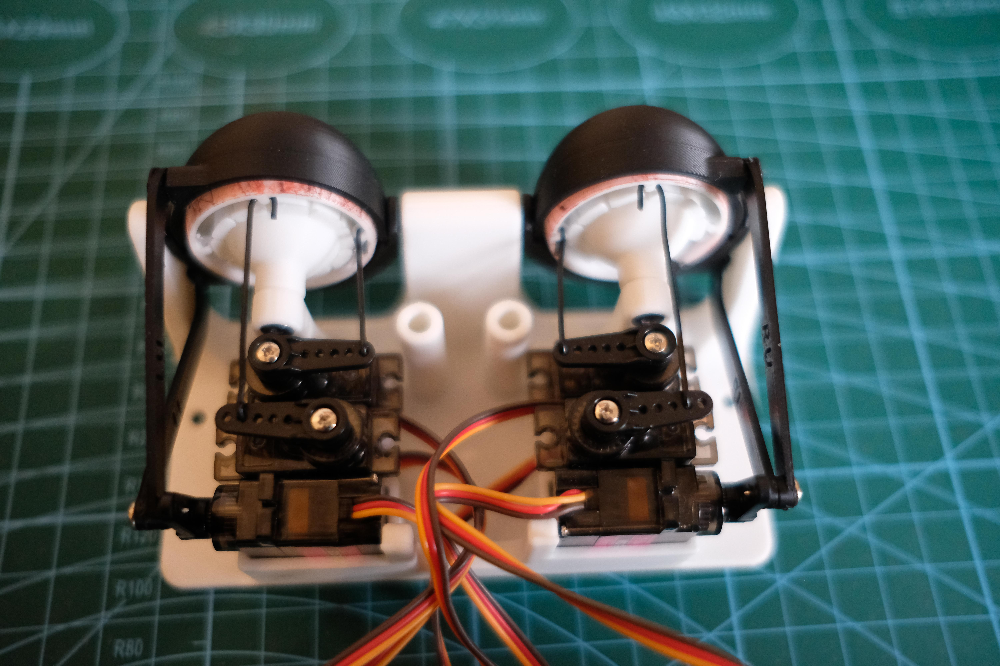
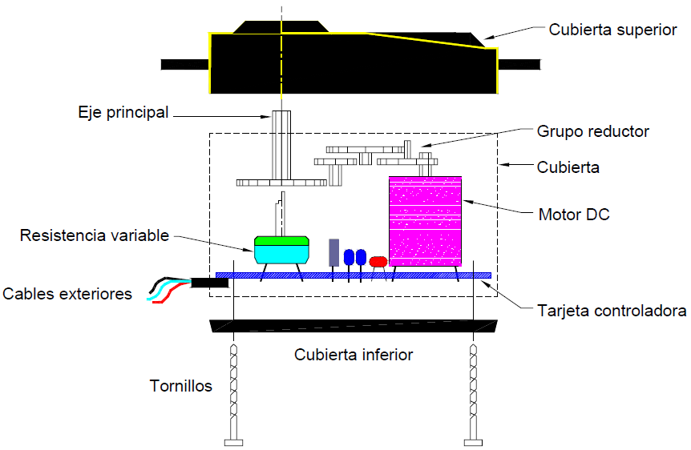

# ⋆⭒˚.⋆ └[∵┌] - Máquina de saludo - Nombre del Proyecto - [┐∵]┘ ⋆.˚⭒⋆

Viernes 17 Octubre 2025

***


## Grupo-04 "nombre del grupo" - Integrantes

- [Braulio Figueroa Vega](https://github.com/brauliofigueroa2001) (Código MP3, investigación)
- [Bernardita Lobo Baeza](https://github.com/Bernardita-lobo) (Modelado carcasa, investigación)
- [José Morales Berríos](https://github.com/jotamorales-romulus) (Código MP3, modelado carcasa, post producción)
- [Camila Parada Vasquez](https://github.com/Camila-Parada) (Código servo, investigación)
- [Francisco Stephens González](https://github.com/FranUDP) (Código ultrasónico, Optimización de código, modelado)

***

## Introducción

Este proyecto se centra en desarrollar una "caja negra" que pueda "saludar".
El saludo de define como ["Un acto comunicacional (entre humanos), en el que una persona hace notar a otra su presencia" - Wikipedia](https://es.wikipedia.org/wiki/Saludo).

A partir de esta definición es que como equipo comenzamos a ahondar en el sentido conceptual de lo que es un saludo, ya no como una actividad humana sino como una interacción que se puede emitir con otros “sujetos” u objetos, como por ejemplo una inteligencia artificial.

Ello a modo de crear una experiencia enfocada en la exploración de la interacción de un “saludo” con un paisaje. ¿Podemos saludar a un lugar? Si, el libre albedrío nos permite hacer lo que queramos. ¿Recibiremos respuesta de ello? Probablemente no, dado que se tratan de objetos u espacios inanimados, por lo que solo podemos apreciar y contemplar lo que nos ofrecen estos mismos.

A partir de esta definición es que como equipo comenzamos a ahondar en el sentido conceptual de lo que es un saludo, ya no como una actividad humana sino como una interacción que se puede emitir con otros “sujetos” u objetos, como por ejemplo una inteligencia artificial.
Ello a modo de crear una experiencia enfocada en la exploración de la interacción de un “saludo” con un sitio.

─ ¿Podemos saludar a un lugar?

Si, el libre albedrío nos permite hacer lo que queramos.

─ ¿Recibiremos respuesta de ello?

Probablemente no, dado que se tratan de objetos u espacios inanimados, por lo que solo podemos apreciar y contemplar lo que nos ofrecen estos mismos.

Por otra parte, vale aclarar que al comienzo del trabajo no hubo una idea clara sobre qué dispositivo desarrollar. Por ello se creó una propuesta colectiva a partir de las tareas efectuadas en la clase "06b", tomando la decisión de crear un mecanismo que posea ojos y que siga con la "mirada" al usuario a través de un sensor de presencia que detecte su posición en el espacio. Al identificar que la persona se encuentra a cierta distancia, una de las partes de la máquina comienza a emitir sonido de forma aleatoria, sin un orden establecido.

¿Por qué hacer que se reproduzca un sonido [aleatorio](https://es.wikipedia.org/wiki/Azar#:~:text=El%20azar%20es%20una%20casualidad,Azar%20en%20matem%C3%A1ticas)?
Pues el hecho que el usuario no poder predecir o saber que “esperar” de esta máquina genera un factor "sorpresa", puesto que depende del artefacto el elegir qué sonidos va a transmitir.
+
***

## Presentación textual de la propuesta

Nuestra máquina (nombre de la máquina) consiste en un dispositivo funcional que está planeado para ser montado en las paredes y ser utilizado por una persona a la vez.
Esta trabaja detectando la presencia del usuario a través de un “radar” compuesto por un [“sensor ultrasónico HC-SR04”]( https://www.alldatasheet.com/html-pdf/1132204/ETC2/HCSR04/110/1/HCSR04.html) y un [“servomotor SG90”](https://arduino.cl/producto/micro-servo-motor-sg90-9g/?srsltid=AfmBOopUK1FSSvEOeee794pcjIBccD8B2MQF36GlEjuMTAzqI4rHkSnN) que se encuentra en constante movimiento, rotando continuamente desde 0 a 180 grados.

Cuando se ingresa al rango de “reconocimiento” (compuesto por la rotación del servomotor más la distancia del ultrasónico) los “ojos” de la máquina se mueven a la posición aproximada en la que se encuentra la persona, siguiéndole con la “mirada” a través de un mecanísmo que posee otro motor servo.

Cuando el sujeto se acerca a una distancia (x cm) del dispositivo el apéndice, que posee un [“Modulo Reproductor MP3 DFPlayer Mini”](https://afel.cl/products/modulo-reproductor-mp3-dfplayer-mini?_pos=1&_psq=mp3&_ss=e&_v=1.0), comienza a emitir sonidos de forma aleatoria hasta que la persona se aleje lo suficiente como para salir del "rango de sonido".

Los ojos no dejan de funcionar en ningún momento, por lo que persiguen al usuario hasta que salga del rango de reconocimiento.

Por el lado conceptual y figurativo, la máquina posee una carcasa compuestas por un "cangrejo" (figura 1) y una "concha marina" (figura 2).

La primera pieza se compone de una imitación de un “cangrejo”, una réplica de una criatura asociada con la costa por su presencia en dicho sector a lo largo de todo Chile. La segunda parte se compone de una “concha de mar”, un objeto común de encontrar en las playas y que posee el mito de permitir a las personas escuchar sonidos semejantes al oleaje del mar y viento de las costas (efecto conocido como [Resonancia de las conchas de Gastrópodos](https://es.wikipedia.org/wiki/Resonancia_de_las_conchas_de_Gastr%C3%B3podos)).

***

## Desarrollo

Para poder ser más estratégicos en cuanto al aprendizaje y desarrollo es que cada integrante fue aprendiendo sobre cómo hacer funcionar un sensor o actuador. Ello requirió de procesos personales de prueba y error que fueron registrados de forma independiente en las bitácoras desde la clase “07a” hasta la fecha de entrega.

### 1) sensor ultrasónico HC-SR04

Parte a recopilar, Info de fran

︶︶︶︶︶︶︶︶︶︶︶︶︶︶︶︶︶︶︶︶︶︶︶︶︶︶︶︶︶︶︶︶︶︶︶︶︶︶︶︶︶︶︶︶︶︶︶︶︶

### 2) Servomotor SG90

En un comienzo todo partió con una inspiración: un video mostrando el proceso de fabricación y funcionamiento de unos ojos “animatronicos” (referencia compartida por [Santiago Gaete]( https://github.com/santiagoClifford)).

[](https://www.youtube.com/watch?v=Ftt9e8xnKE4)

-> Will Cogley (5 nov 2019). Cómo construir un sencillo mecanismo de ojo animatrónico Arduino impreso en 3D. Youtube. <https://www.youtube.com/watch?v=Ftt9e8xnKE4>

A partir de ello es que los estudios iniciales se centraron en replicar el mecanismo, entendiendo su construcción, las formas modeladas para cada pieza y la aplicación de los “motores servo” para su funcionamiento. Para ello se obtuvo un tutorial en [“Autodesk instructables”]( https://www.instructables.com/Animatronic-Eyes-Double-and-Single-Fully-3D-Printe/) en el que se presenta un proyecto similar. Para ir partiendo poco a poco es que se trabajó con sólo un ojo, procediendo a imprimir los archivos 3D que incluye el proyecto. Una vez listo se procedió a montar las piezas siguiendo las instrucciones.




-> Animatronic Eyes [Fotografías], por Morgan Manly, s.f., instructables (<https://www.instructables.com/Animatronic-Eyes-Double-and-Single-Fully-3D-Printe/>). CC BY-NC-SA 4.0

Ante ello se pudo concluir que es necesario un servomotor para poder hacer que el ojo abra y cierre, un segundo para poder mover el ojo en vertical y un tercero para el horizontal. Puesto que los servomotores requieren de una calibración para que las piezas funcionen es que comencé a revisar el código tipo INO que incluye el proyecto.
Al no tener experiencia previa manejando este tipo de actuadores es que se hizo una investigación en profundidad sobre como se trabaja con dicha pieza clave, además de aprender sobre qué librerías son necesarias además de las conexiones con el Arduino.

Dentro de toda la información recopilada sobre los servomotores es que son actuadores de tipo motor que permiten controlar el posicionamiento físico de manera. Suelen poseer una “unidad de control” que cuenta con un circuito integrado (controlador), un motor de corriente continua, engranajes (plásticos o metálicos), un potenciómetro además de incluir piezas que ayudan a transmitir el movimiento (servo horns o cuernos). El controlador se encarga de comparar y ajustar la posición del motor a la indicada, mientras que el potenciómetro funciona como un sensor de retroalimentación que informa la posición actual. Para poder controlar este tipo de motor es necesario el enviarle una serie de pulsos eléctricos (descargas de alto voltaje de pulso rápido y corta duración), cuya longitud determina la posición del servomotor. Se pueden conectar a pines análogos o digitales, pero en esta ocasión sólo se hará uso de los pines digitales por cuestiones de tiempo.



-> Tutorial uso de servomotores con arduino. [Dibujo], por Naylamp Mechatronics, 2017, naylamp mechatronics (<https://naylampmechatronics.com/blog/33_tutorial-uso-de-servomotores-con-arduino.html>). CC BY-NC-SA 4.0

Indagando por internet es que encontré multiples ejemplos (registrados en la [sesión 08a de Camila-Parada](https://github.com/Camila-Parada/dis8645-2025-02-procesos/tree/main/20-Camila-Parada/sesion-08a)), pero el código que mejor funcionó fue obtenido de la web [Arduino.cc](https://www.arduino.cc/en/Tutorial/LibraryExamples/Sweep/). Este mismo ejercicio forma parte de los ejemplos que trae el programa de arduino.

``` cpp
/* Sweep
 by BARRAGAN <http://barraganstudio.com>
 This example code is in the public domain.

 modified 8 Nov 2013
 by Scott Fitzgerald
 https://www.arduino.cc/en/Tutorial/LibraryExamples/Sweep
*/

#include <Servo.h>

Servo myservo;  // create servo object to control a servo
// twelve servo objects can be created on most boards

int pos = 0;    // variable to store the servo position

void setup() {
  myservo.attach(9);  // attaches the servo on pin 9 to the servo object
}

void loop() {
  for (pos = 0; pos <= 180; pos += 1) { // goes from 0 degrees to 180 degrees
    // in steps of 1 degree
    myservo.write(pos);              // tell servo to go to position in variable 'pos'
    delay(15);                       // waits 15 ms for the servo to reach the position
  }
  for (pos = 180; pos >= 0; pos -= 1) { // goes from 180 degrees to 0 degrees
    myservo.write(pos);              // tell servo to go to position in variable 'pos'
    delay(15);                       // waits 15 ms for the servo to reach the position
  }
}

```


Dado el nivel de dificultad que requería el montaje (entre 5 a 6 servos) es que decidí simplificar lo más posible y buscar un referente más cercano a lo que quería conseguir (movimiento ocular horizontal). Para poder montar un mecanismo simplificado que solo posea 1 servomotor es que me inspiré en este video.


-> Dr scott Diabolical - Evil Genius (14 sept 2023). DIY Animatronic Eyes: Test #2. Youtube. <https://www.youtube.com/watch?v=5X0v0MOrQiI>

Dado que no pude encontrar los planos es que comencé armando un prototipo simple con lo que tenía a mano: utilizando unas piezas impresas a modo de ojos, el servomotor, tornillos, alambre de 22 y unas piezas personalizadas modeladas para utilizarlas en el servomotor.


︶︶︶︶︶︶︶︶︶︶︶︶︶︶︶︶︶︶︶︶︶︶︶︶︶︶︶︶︶︶︶︶︶︶︶︶︶︶︶︶︶︶︶︶︶︶︶︶︶

### 3) Modulo Reproductor MP3 DFPlayer Mini

Cuando comenzó la investigación del módulo dfplayer mini la primera función era poder reproducir los sonidos puestos en la tarjeta SD, luego de esto el objetivo era poder reproducir los audios de forma aleatoria. Esto lo hicimos con el siguiente código


Este código permitía reproducir el número de pistas que se requería pero no existía un control sobre estas ya que la reproducción ocurría de forma aleatoria gracias a mydfplayer.randomall pero en un loop sin parar por lo cuál necesitaba una especie de pausa.

Para ello misaaa nos sugirió utilizar un botón el cuál nos permitiera establecer una especie de "dado" en el cuál al presionarlo se daba un resultado aleatorio, en este caso la reproducción de un sonido aleatorio

### 4) Modelado 3D, desarrollo de carcasa y ensamblado

Antes de diseñar la carcasa, deberíamos retomar bien el lado simbólico y conceptual del trabajo. Nuestra primera opción, antes de profundizar en el funcionamiento y en los cambios técnicos que fuimos realizando, fue trabajar con el concepto del sin sentido y la sinestesia, mezclando los sentidos como experiencia a través de los sensores.

Luego nos pareció un poco incompleta esa idea y que faltaba desarrollarla, entonces quisimos darle una especie de enfoque conceptual a nuestro proyecto, tomando los elementos que habíamos definido. Siguiendo con eso, se nos ocurrió transformar la idea de la oreja que habla y situar el resto de los elementos dentro de un contexto inspirado en Van Gogh.

Hicimos algunos bocetos, pero luego Aarón nos hizo replantearnos la propuesta, ya que provenía de un contexto violento, lo cual nos hizo bastante sentido.

insertar bocetos*

#### Carcasa Speaker

Finalmente, repasamos nuestros actuadores y pensamos qué podríamos hacer con ellos en relación a las carcasas. Se nos ocurrió crear una especie de parlante con forma de concha, haciendo alusión a los sonidos que se cree escuchar en estas, pero emitiendo sonidos reales de las playas de Chile: ruidos del ambiente, gritos, pájaros y gaviotas. La idea era generar la sensación de estar teletransportado a una playa chilena.


#### Carcasa servo, sersor ultrasonico y arduino

Con esta idea más concreta, decidimos tematizar el resto de los elementos del proyecto, como el Arduino, el servo y el sensor, dándoles la forma de un cangrejo sobre unas piedras para mantener una coherencia estética y conceptual.

insertar foto de modelado cangrejo*


***

## Producto final

Texto texto texto

***

## Comentarios finales

Este ejercicio nos dejó replanteando sobre "qué es en realidad un saludo". Si por el hecho de tener a un ser humano como el usuario "iniciador de esta actividad" es que se pueden generar interacciones con objetos o hasta lugares. Es un acto temporal pero que puede persistir en la memoria de quienes, por ejemplo, conocen o se vuelven a encontrar con lugares tales como el mar.

***

## Bibliografía

- <https://www.instructables.com/Animatronic-Eyes-Double-and-Single-Fully-3D-Printe/>
- <https://web.archive.org/web/20240421145837/https://cursos.mcielectronics.cl/2023/06/28/como-utilizar-un-servo-motor-con-arduino/>
- <https://www.arduino.cc/en/Tutorial/LibraryExamples/Sweep/>
- <https://www.instructables.com/Animatronic-Face-of-Ed-From-Good-Burger/>
- <https://www.instructables.com/Face-With-Animatronic-Eyes-Motion-Detection-and-Vo/>
- <https://es.wikipedia.org/wiki/Resonancia_de_las_conchas_de_Gastr%C3%B3podos>
- <https://wolles-elektronikkiste.de/en/arduino-controlled-dfplayer-mini>
- <https://www.instructables.com/Controlling-a-Servo-With-an-Ultrasonic-Sensor-Usin/>
- <https://www.youtube.com/watch?v=5X0v0MOrQiI>
- <https://wiki.dfrobot.com/DFPlayer_Mini_SKU_DFR0299>
- <https://felixblume.com/valparaiso/>
- <https://audiomapa.org/>


