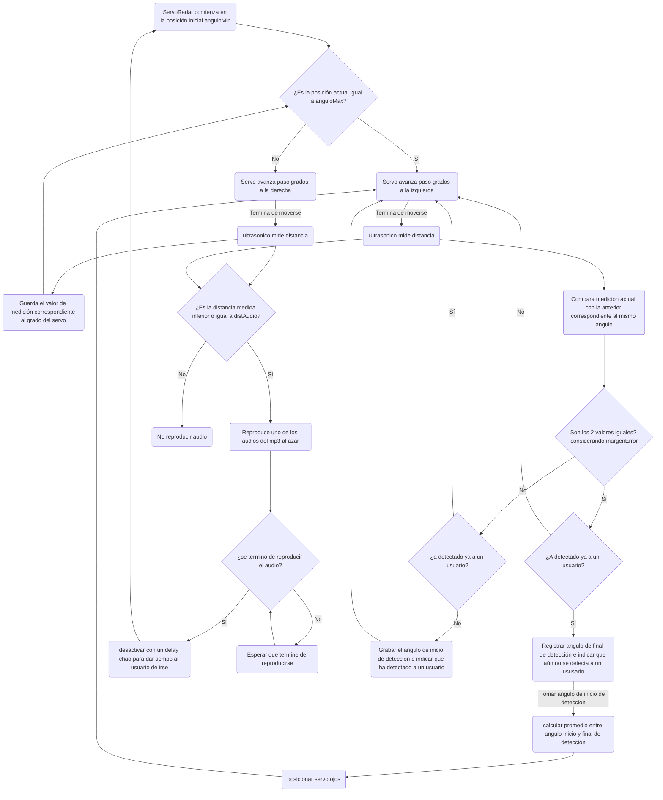
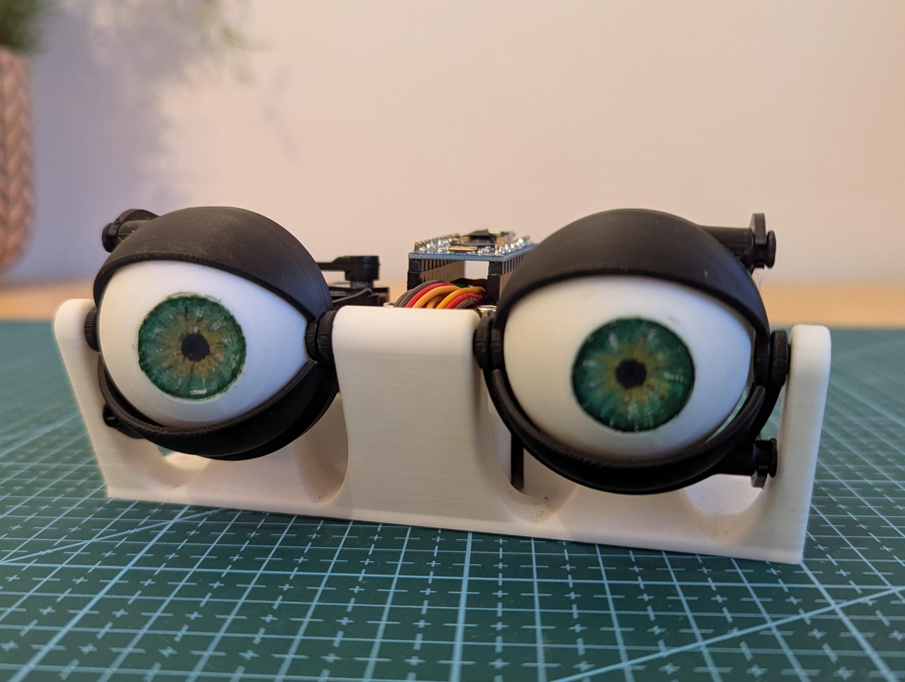
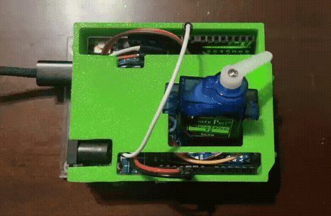
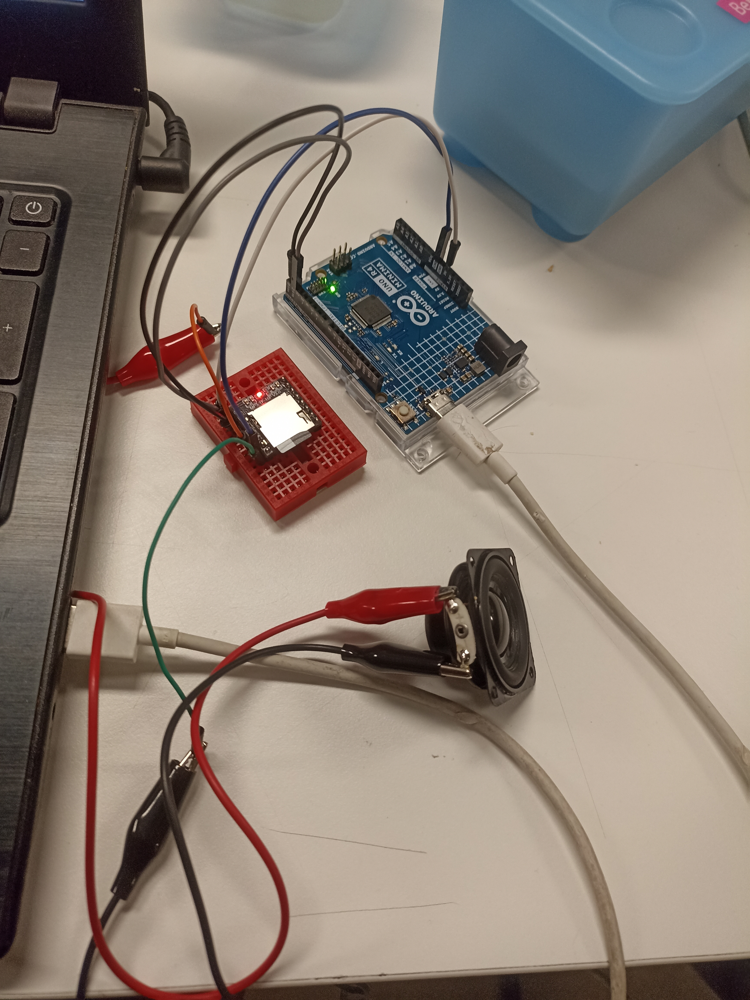
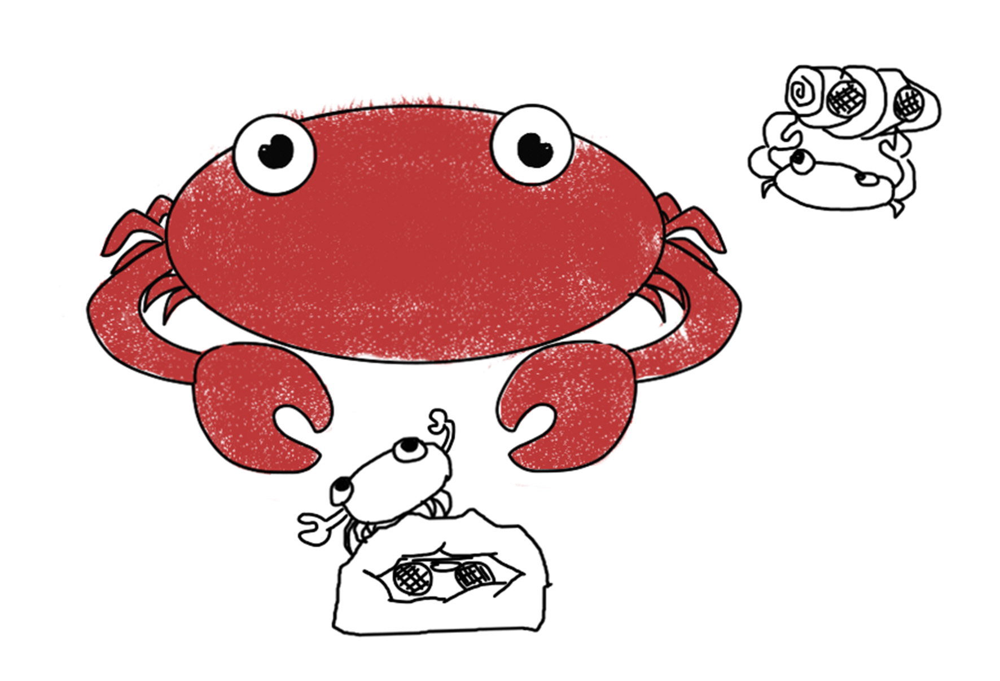
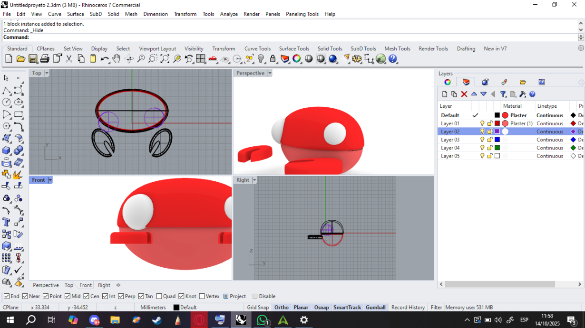
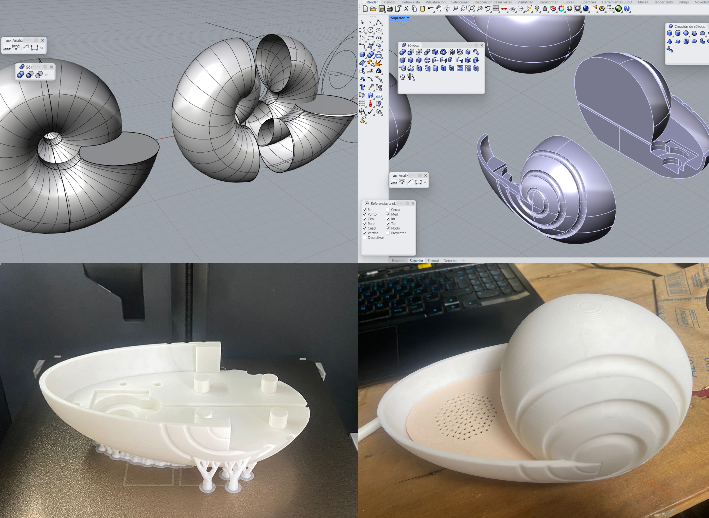
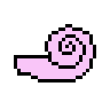

# ⋆⭒˚.⋆ └[∵┌] - Máquina de saludo - Nombre del Proyecto - [┐∵]┘ ⋆.˚⭒⋆

Viernes 17 Octubre 2025

***

## Grupo-04 "nombre del grupo" - Integrantes

- [Braulio Figueroa Vega](https://github.com/brauliofigueroa2001) (Código MP3, investigación)
- [Bernardita Lobo Baeza](https://github.com/Bernardita-lobo) (Modelado carcasa, investigación)
- [José Morales Berríos](https://github.com/jotamorales-romulus) (Código MP3, modelado carcasa, post producción)
- [Camila Parada Vasquez](https://github.com/Camila-Parada) (Código servo, investigación)
- [Francisco Stephens González](https://github.com/FranUDP) (Código ultrasónico, Optimización de código, modelado)

***

### Introducción

Este proyecto se centra en desarrollar una "caja negra" que pueda "saludar".
El saludo de define como ["Un acto comunicacional (entre humanos), en el que una persona hace notar a otra su presencia" - Wikipedia](https://es.wikipedia.org/wiki/Saludo). 

A partir de esta definición es que como equipo comenzamos a ahondar en el sentido conceptual de lo que es un saludo, ya no como una actividad humana sino como una interacción que se puede emitir con otros “sujetos” u "objetos", como por ejemplo una inteligencia artificial. 
Ello a modo de crear una experiencia enfocada en la exploración de la interacción de un “saludo” con un sitio. 

─ ¿Podemos saludar a un lugar? 

Si, el libre albedrío nos permite hacer lo que queramos. 

─ ¿Recibiremos respuesta de ello? 

Probablemente no, dado que se tratan de objetos u espacios inanimados, por lo que solo podemos apreciar y contemplar lo que nos ofrecen estos mismos. 

Como colectivo se creó una propuesta a partir de la fusión de las tareas efectuadas en la clase "06b", escogiendo la decisión de crear un mecanismo que posea "ojos" y que pueda "mirar" al usuario a través de un sensor de presencia. Al identificar que la persona se encuentra a cierta distancia, una de las partes de la máquina comienza a emitir sonido de forma aleatoria, sin un orden establecido.

¿Por qué hacer que se reproduzca un sonido [aleatorio](https://es.wikipedia.org/wiki/Azar#:~:text=El%20azar%20es%20una%20casualidad,Azar%20en%20matem%C3%A1ticas)?
Pues el hecho que el usuario no poder predecir o saber que “esperar” de esta máquina genera un factor "sorpresa", puesto que depende del artefacto el elegir qué sonidos va a transmitir.

***

### Presentación textual de la propuesta

Nuestra máquina consiste en un dispositivo funcional que está planeado para ser montado en las paredes y ser utilizado por una persona a la vez.
Esta trabaja detectando la presencia del usuario a través de un “radar” compuesto por un [“sensor ultrasónico HC-SR04”]( https://www.alldatasheet.com/html-pdf/1132204/ETC2/HCSR04/110/1/HCSR04.html) y un [“servomotor SG90”](https://arduino.cl/producto/micro-servo-motor-sg90-9g/?srsltid=AfmBOopUK1FSSvEOeee794pcjIBccD8B2MQF36GlEjuMTAzqI4rHkSnN) que se encuentra en constante movimiento, rotando continuamente desde 0 a 180 grados.

Cuando se ingresa al rango de “reconocimiento” (compuesto por la rotación del servomotor más la distancia del ultrasónico) los “ojos” de la máquina se mueven y siguen a la persona a través de un mecanísmo que posee otro motor servo.

Cuando el sujeto se acerca a una distancia (15 cm) del dispositivo, la concha que posee un [“Modulo Reproductor MP3 DFPlayer Mini”](https://afel.cl/products/modulo-reproductor-mp3-dfplayer-mini?_pos=1&_psq=mp3&_ss=e&_v=1.0), comienza a emitir sonidos de forma aleatoria hasta que la persona se aleje lo suficiente como para salir del "rango de sonido".

Los ojos no dejan de funcionar en ningún momento, por lo que persiguen al usuario hasta que salga del rango de reconocimiento.

Por el lado conceptual y figurativo, la máquina posee una carcasa compuestas por un "cangrejo" y una "concha marina".

La primera pieza se compone de una imitación de un “cangrejo”, una réplica de una criatura asociada con la costa por su presencia en dicho sector a lo largo de todo Chile. La segunda parte se compone de una “concha de mar”, un objeto común de encontrar en las playas y que posee el mito de permitir escuchar sonidos semejantes al oleaje del mar y viento de las costas (efecto conocido como [Resonancia de las conchas de Gastrópodos](https://es.wikipedia.org/wiki/Resonancia_de_las_conchas_de_Gastr%C3%B3podos)).

***

### Mapa de flujo



***

### Desarrollo

Para poder ser más estratégicos en cuanto al aprendizaje y desarrollo es que cada integrante fue aprendiendo sobre cómo hacer funcionar un sensor o actuador. Ello requirió de procesos personales de prueba y error que fueron registrados de forma independiente en las bitácoras desde la clase “07a” hasta la fecha de entrega. Estos fueron agrupados de forma lineal.

#### 1) Ultrasónico HC-SR04


︶︶︶︶︶︶︶︶︶︶︶︶︶︶︶︶︶︶︶︶︶︶︶︶︶︶︶︶︶︶︶︶︶︶︶︶︶︶︶︶︶︶︶︶︶︶︶︶︶

#### 2) Servomotor SG90 y movimiento ocular

En un comienzo todo partió con una inspiración: un video mostrando el proceso de fabricación y funcionamiento de unos ojos “animatronicos” (referencia compartida por [Santiago]( https://github.com/santiagoClifford)).

[](https://www.youtube.com/watch?v=Ftt9e8xnKE4)

-> Will Cogley (5 nov 2019). Cómo construir un sencillo mecanismo de ojo animatrónico Arduino impreso en 3D. Youtube. <https://www.youtube.com/watch?v=Ftt9e8xnKE4>

A partir de ello es que los estudios iniciales se centraron en replicar el mecanismo, entendiendo su construcción, las formas modeladas para cada pieza y la aplicación de los “motores servo” para su funcionamiento. Para ello se obtuvo un tutorial en [“Autodesk instructables”]( https://www.instructables.com/Animatronic-Eyes-Double-and-Single-Fully-3D-Printe/) en el que se presenta un proyecto similar.



-> Animatronic Eyes [Fotografías], por Morgan Manly, s.f., instructables (<https://www.instructables.com/Animatronic-Eyes-Double-and-Single-Fully-3D-Printe/>). CC BY-NC-SA 4.0

Ante ello se pudo concluir que es necesario 3 servomotores por ojo para abrir y cerrar del parpado, además de un segundo y tercero para mover el ojo en vertical y horizontal. Además se requiere de una calibración con código para ir ajustando los motores.

Dentro de toda la información recopilada sobre los servomotores es que son actuadores de tipo motor que permiten controlar el posicionamiento físico. Poseen un controlador que se encarga de comparar y ajustar la posición del motor a la indicada, un potenciómetro que funciona como un sensor de retroalimentación que informa la posición actual, engranajes de plástico o metal y un motor de corriente continua. Para poder controlar este tipo de motor es necesario el enviarle una serie de pulsos eléctricos, cuya longitud determina la posición del servomotor.

Acerca del código con el cuál comencé a explorar las funciones del servo es que pillé el ejemplo "sweep" de la web [Arduino.cc](https://www.arduino.cc/en/Tutorial/LibraryExamples/Sweep/). 



Dado el nivel de dificultad que requería el montaje (entre 5 a 6 servos) es que decidí simplificar lo más posible y buscar un referente más cercano a lo que quería conseguir (movimiento ocular horizontal). Para poder montar un mecanismo simplificado que solo posea 1 servomotor es que me inspiré en este video.


-> Dr scott Diabolical - Evil Genius (14 sept 2023). DIY Animatronic Eyes: Test #2. Youtube. <https://www.youtube.com/watch?v=5X0v0MOrQiI>

Tras varias pruebas intentando montar y mejorar las piezas vistas, es que terminé llegando a esta alternativa de construcción, y modificando el código para que quede con otros parámetros.


```cpp
```

︶︶︶︶︶︶︶︶︶︶︶︶︶︶︶︶︶︶︶︶︶︶︶︶︶︶︶︶︶︶︶︶︶︶︶︶︶︶︶︶︶︶︶︶︶︶︶︶︶

#### 3) Modulo Reproductor MP3 DFPlayer Mini

Cuando comenzó la investigación del módulo dfplayer mini la primera función era poder reproducir los sonidos puestos en la tarjeta SD, esto lo hicimos con el siguiente código que fue sacado de [githubdfrobot](https://github.com/DFRobot/DFRobotDFPlayerMini)



Este código permitía reproducir el número de pistas en específico nombradas según un orden establecido en base a una numeración específica que pedía enumerar las pistas de audio como 0001,0002,0003,0004. Luego de poder establecer una lista de audios, se necesitaba que se reproducieran de forma aleatoria por lo que se utilizó la función mydfplayer.randomall la cuál permitía correr los audios de forma aleatoria en un loop sin parar. Este era un problema ya que necesitábamos tener un control sobre el cómo se estaban reproduciendo los audios.

Para ello [Matías](https://github.com/misaaaaaa) nos sugirió utilizar un botón el cuál nos permitiera establecer una especie de "dado" en el cuál al presionarlo se daba un resultado aleatorio, en este caso la reproducción de un sonido aleatorio.

```cpp
#include "Arduino.h"
#include "DFRobotDFPlayerMini.h"

#if (defined(ARDUINO_AVR_UNO) || defined(ESP8266))  // Using a soft serial port
#include <SoftwareSerial.h>
SoftwareSerial softSerial(/*rx =*/4, /*tx =*/5);
#define FPSerial softSerial
#else
#define FPSerial Serial1
#endif

DFRobotDFPlayerMini myDFPlayer;
void printDetail(uint8_t type, int value);

// --- Constantes del Proyecto ---
const int botonPin = 2;
const int totalTracks = 10;                     // Número total de archivos mp3 en la SD

// --- Variables de estado ---
unsigned long ultimoDebounceTiempo = 0; // Para el antirrebote del botón
const unsigned long debounceDelay = 50; // Tiempo de espera del antirrebote (50 ms)

void setup()
{
  FPSerial.begin(9600);
  Serial.begin(115200);

  Serial.println(F("DFPlayer Mini - Reproductor por Botón"));
  Serial.println(F("Inicializando..."));

  if (!myDFPlayer.begin(FPSerial)) {
    Serial.println(F("Error de comunicación con DFPlayer."));
    Serial.println(F("Verifica conexiones y tarjeta SD."));
    while (true);
  }
  Serial.println(F("DFPlayer en línea. Listo para usar."));

  myDFPlayer.volume(15); // Ajusta el volumen (0 a 30)

  randomSeed(analogRead(0));
  pinMode(botonPin, INPUT_PULLUP);
}

void loop() {
  // --- 1. LÓGICA DEL BOTÓN (ÚNICA FORMA DE REPRODUCIR) ---
  // Revisa si el botón se ha presionado y si ha pasado el tiempo de antirrebote
  if (digitalRead(botonPin) == LOW && (millis() - ultimoDebounceTiempo) > debounceDelay) {
    
    // Elige un número al azar y lo reproduce
    int track = random(1, totalTracks + 1);
    Serial.print(F("--> Botón presionado! Reproduciendo pista: "));
    Serial.println(track);
    myDFPlayer.play(track);

    // Actualiza el tiempo del antirrebote para evitar lecturas falsas
    ultimoDebounceTiempo = millis();
  }

  // --- 2. REVISAR MENSAJES DEL DFPLAYER ---
  // Tarea de fondo: revisa si el módulo ha enviado información (ej: "pista terminada")
  if (myDFPlayer.available()) {
    printDetail(myDFPlayer.readType(), myDFPlayer.read());
  }
}


// La función printDetail sigue siendo la misma...
void printDetail(uint8_t type, int value){
  switch (type) {
    case TimeOut:
      Serial.println(F("Time Out!"));
      break;
    case WrongStack:
      Serial.println(F("Stack Wrong!"));
      break;
    case DFPlayerCardInserted:
      Serial.println(F("Card Inserted!"));
      break;
    case DFPlayerCardRemoved:
      Serial.println(F("Card Removed!"));
      break;
    case DFPlayerCardOnline:
      Serial.println(F("Card Online!"));
      break;
    case DFPlayerPlayFinished:
      Serial.print(F("Pista finalizada:"));
      Serial.println(value);
      break;
    case DFPlayerError:
      Serial.print(F("DFPlayerError:"));
      switch (value) {
        case Busy:
          Serial.println(F("Ocupado"));
          break;
        case Sleeping:
          Serial.println(F("Durmiendo"));
          break;
        case SerialWrongStack:
          Serial.println(F("Error de Stack Serial"));
          break;
        case CheckSumNotMatch:
          Serial.println(F("Error de Checksum"));
          break;
        case FileIndexOut:
          Serial.println(F("Índice de archivo fuera de rango"));
          break;
        case FileMismatch:
          Serial.println(F("No se encuentra el archivo"));
          break;
        case Advertise:
          Serial.println(F("En modo Advertise"));
          break;
        default:
          break;
      }
      break;
    default:
      break;
  }
}
```

Funcionamiento: Se configura la comunicación serial con el DFPlayer y se inicializa el volumen.El botón, conectado al pin 2, activa la reproducción de una pista aleatoria de la tarjeta SD,
se implementa un antirrebote para evitar lecturas falsas del botón, la función PrintDetail()muestra en el monitor serial el estado del módulo y errores, ayudando a depurar

Debido a varios problemas técnicos con el código del proyecto a última hora, decidimos improvisar y usar dos Arduinos en lugar de uno. Esto permitió repartir las tareas y evitar errores de funcionamiento

Cada Arduino tiene una función. El primero actúa como el radar: controla el servo, mide la distancia con el sensor ultrasónico y detecta si algo está demasiado cerca. El segundo es el módulo de sonido: su única tarea es manejar el DFPlayer Mini y reproducir un audio aleatorio cuando recibe una señal

La comunicación entre ambos se hace con una señal digital simple: un pin del Arduino radar se conecta al pin 2 del Arduino de sonido. Cuando el radar detecta un objeto cercano, envía un pulso eléctrico (low) que el otro Arduino interpreta como la orden para activar el sonido

Gracias a la idea de ["Fran UDP"](https://github.com/FranUDP) cada parte del código se volvió más simple. Aunque no era lo ideal, fue una manera de lograr que el proyecto funcionara.

︶︶︶︶︶︶︶︶︶︶︶︶︶︶︶︶︶︶︶︶︶︶︶︶︶︶︶︶︶︶︶︶︶︶︶︶︶︶︶︶︶︶︶︶︶︶︶︶︶

#### 4) Modelado 3D, desarrollo de carcasa y ensamblado

Como requisito fundamental para diseñar las carcasas es que hubo que profundizar en el funcionamiento y en los cambios técnicos que surgieron en cuanto al desarrollo del circuito eléctrico y el funcionamiento de cada pieza.

#### A) Carcasa Cangrejo (servo, sersor ultrasonico y arduino)

Al tener una idea más concreta, decidimos tematizar la "envoltura" de los elementos de la parte principal del proyecto, cubriendo el Arduino, el servomotor y el sensor, dándoles la forma de un cangrejo sobre unas piedras para mantener una coherencia estética y conceptual.






#### B) Carcasa Speaker (speaker, MP3 DFPlayer Mini)

Al trabajar con el conjunto del módulo mp3 (dfplayer mini y altavoz) se nos ocurrió crear una especie de "parlante" con forma de concha. Ello hace alusión a la idea que tenemos de los "" y los sonidos que se cree escuchar en estas, pero emitiendo sonidos reales de las playas de Chile: ruidos del ambiente, gritos, pájaros y gaviotas. La idea era generar la sensación de estar teletransportado a una playa chilena.



***

### Reflexiones individuales

#### - Braulio Figueroa:

Creo que la mayor dificultad que enfrentamos en el proyecto fue la comunicación y el entender las distintas capacidades de los demás para poder llegar a ser un grupo que tuviera una mayor cohesión. En diversas ocasiones sentí que nos separábamos mucho como grupo y sentía que nos queríamos decir más cosas como equipo, pero al final no lo hacíamos, no sé si por vergüenza o por incomodidad. No sé si seré la única persona del grupo que se sintió así.

Creo que no me pude terminar de sentir en un ambiente cómodo en el grupo, pero creo que también es porque siento que me cuesta adaptarme en cualquier lugar que esté, entonces no sé si es más algo de las personas con las que trabajo o algo mío más personal. Pienso que debería ser más claro cuando necesito ayuda con algo o saber expresarlo mejor para no sentirme tan encerrado en cómo me siento en cuanto a la frustración que conlleva un proyecto y de esta manera poder trabajar mejor en un futuro, a modo de autocrítica creo que me falta estudiar muchísimo más.

En cuanto al proyecto en sí, creo que me gustaría implementar más cosas para hacerlo más parecido a una especie de juguete que huya de las personas cuando las detecte, estilo cangrejo que camina de lado y que al mismo tiempo pueda tener algún tipo de detección de obstáculos para hacerlo más dinámico e interactivo con un potencial público.

︶︶︶︶︶︶︶︶︶︶︶︶︶︶︶︶︶︶︶︶︶︶︶︶︶︶︶︶︶︶︶︶︶︶︶︶︶︶︶︶︶︶︶︶︶︶︶︶︶
#### - Bernardita Lobo:

Yo creo que lo que más me costó en este primer proyecto fue sentirme preparada para gestionar algo así, ya que varias veces sentí que no sabía lo suficiente para trabajar con programación. 

Se podría decir que “perdí” bastante tiempo repasando conceptos de programación en general para sentirme más al día. Por eso, no pude involucrarme tanto en el código como me habría gustado, participando principalmente en la búsqueda de referencias. 

Además, siento que no tuvimos una comunicación tan buena y no supimos repartir bien el trabajo según nuestras habilidades. Cada integrante fue avanzando a distintos ritmos y en diferentes partes del proyecto, lo que hizo difícil concretar y unir todas las versiones de los códigos al final.

︶︶︶︶︶︶︶︶︶︶︶︶︶︶︶︶︶︶︶︶︶︶︶︶︶︶︶︶︶︶︶︶︶︶︶︶︶︶︶︶︶︶︶︶︶︶︶︶︶
#### - José Morales:

Primero, quiero agradecer el trabajo realizado por el equipo, ya que fue grato colaborar y compartir ideas durante el desarrollo del proyecto. En cuanto a mi participación, reconozco que algunas tareas se me hicieron complejas y más de alguna vez me ganó la ansiedad. Al haber tantas cosas por resolver al mismo tiempo, me sentí un poco abrumado, especialmente al intentar programar el código del audio randomizado. Aunque logré avanzar, se me dificultó lograr que funcionara correctamente junto con el resto de cosas, lo que me llevó a comprender mejor la importancia de la integración y la comunicación entre las distintas partes del proyecto. 

El modelado y prototipado fueron un verdadero desafío, ya que comenzamos a trabajarlos cuando el proyecto ya estaba avanzado. Creo que, si hubiésemos abordado esa etapa desde el inicio, habríamos tenido más oportunidades para hacer pruebas, detectar errores y mejorar el diseño. También creo que podríamos haber explorado un objeto más compacto, algo que integrara varias funciones. 

Finalmente, el trabajo en grupo fue clave para avanzar, pero también hubo momentos en los que se notaron algunas debilidades en la organización y en la gestión del tiempo. Hubo ideas que se estancaron y tiempos muertos que afectaron el ritmo del proyecto. Ha futuro me gustaría que hubiese una planificación clara y una distribución equitativa de tareas.

︶︶︶︶︶︶︶︶︶︶︶︶︶︶︶︶︶︶︶︶︶︶︶︶︶︶︶︶︶︶︶︶︶︶︶︶︶︶︶︶︶︶︶︶︶︶︶︶︶
#### - Camila Parada:

︶︶︶︶︶︶︶︶︶︶︶︶︶︶︶︶︶︶︶︶︶︶︶︶︶︶︶︶︶︶︶︶︶︶︶︶︶︶︶︶︶︶︶︶︶︶︶︶︶
#### - Francisco Stephens:

Personalmente me enredé mucho con el “OOP”, estuve como dos semanas dando vueltas en círculos intentando comenzar a hacer el código, no fue hasta que @montoyamoraga tomó lo poco que teníamos y nos dio una base clara desde donde comenzar a construir el código, quizás hubiese sido beneficioso tener esas revisiones de código en clase antes. 

También encontré que trabajar en el código con múltiples personas era muy confuso, pues sabiendo lo frágil que es el código, escribirlo teniendo en cuenta que sea “futureproof”, para que no se rompa a cada rato fue un jaleo. Creo que hubiese sido beneficioso haber visto en clase como anticipar estos problemas y programar entre varios. 

Por último, nos pasó que todos avanzábamos a distintos ritmos, lo que ocasionó que terminase escribiendo casi todo el código, pues yo ya había terminado mi parte mientras los otros seguían trabajando en el modelado, investigando referentes y demás, no es que esto me moleste, nomás que me desorienta no estar actualizado sobre qué está pasando con cada uno, para poder anticipar y planificar mejor.

***

### Comentarios finales

Este ejercicio nos dejó replanteando sobre "qué es en realidad un saludo". Si por el hecho de tener a un ser humano como el usuario "iniciador de esta actividad" es que se pueden generar interacciones con objetos o hasta lugares. Es un acto temporal pero que puede persistir en la memoria de quienes, por ejemplo, conocen o se vuelven a encontrar con lugares tales como el mar.



***

## Bibliografía

- <https://www.instructables.com/Animatronic-Eyes-Double-and-Single-Fully-3D-Printe/>
- <https://web.archive.org/web/20240421145837/https://cursos.mcielectronics.cl/2023/06/28/como-utilizar-un-servo-motor-con-arduino/>
- <https://www.arduino.cc/en/Tutorial/LibraryExamples/Sweep/>
- <https://www.instructables.com/Animatronic-Face-of-Ed-From-Good-Burger/>
- <https://www.instructables.com/Face-With-Animatronic-Eyes-Motion-Detection-and-Vo/>
- <https://es.wikipedia.org/wiki/Resonancia_de_las_conchas_de_Gastr%C3%B3podos>
- <https://wolles-elektronikkiste.de/en/arduino-controlled-dfplayer-mini>
- <https://www.instructables.com/Controlling-a-Servo-With-an-Ultrasonic-Sensor-Usin/>
- <https://www.youtube.com/watch?v=5X0v0MOrQiI>
- <https://wiki.dfrobot.com/DFPlayer_Mini_SKU_DFR0299>
- <https://felixblume.com/valparaiso/>
- <https://audiomapa.org/>


