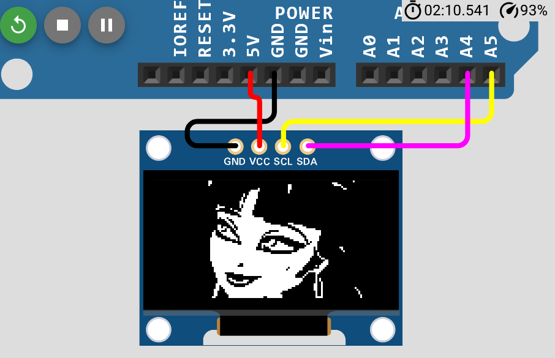

# sesion-03b // viernes 22 de agosto ⋆ 𐙚 ̊.

- Por hacer:

**Encargo 7**

"03b"

- documentar aprendizajes y dificultades del trabajo con pantallas y displays SSD1306 con simulador Wokwi

- pendiente volver a repasar videos de la clase

## Repaso

> pantalla OLED 128x64 y mini protoboard

> tinkercad / wokwi

4 cables:

- **GND** cable principal de tierra, ground (*GND*)
- **VCC** voltaje de alimentación (importante saber el voltaje) (*5V*)
- **SCL** signal clock, tiene que saber "cuándo" (*A5*)
- **SDA** datos (*A4*)


Biblioteca: Adafruit GFX Library / Adafruit SSD1306 Library

en Arduino IDE en las bibliotecas buscar Adafruit GFX y SSD1306 (la más reciente) instalar dependencias.

File < Examples < Adafruit SSD1306 < ssd1306_128x64_i2c

copiar código a Wokwi

- navegar y entender para la entrega texto que hace scroll (testscrolltext();    // Draw scrolling text)

modificación en el código // FIX la dirección era otra

```cpp
// #define SCREEN_ADDRESS 0x3D ///< See datasheet for Address; 0x3D for 128x64, 0x3C for 128x32
#define SCREEN_ADDRESS 0x3C
```

al usar i2c importante conocer la dirección del módulo

los nombres modificables ojalá darle un nombre a elección en español

<https://www.wolframalpha.com/>

- para el encargo los comentarios/citas son muy importantes, mencionar que la base del código fue sacado de tal ejemplo (si se utiliza un código existente como base), separar lo que nosotros contribuimos, lo que remixeamos, podemos robar mientras sea acreditado

### Ejemplo utilizado en Wokwi

```cpp
#include <Wire.h>
#include <Adafruit_GFX.h>
#include <Adafruit_SSD1306.h>

#define SCREEN_WIDTH 128
#define SCREEN_HEIGHT 64
#define OLED_RESET -1
Adafruit_SSD1306 pantallita(SCREEN_WIDTH, SCREEN_HEIGHT, &Wire, OLED_RESET);

int contador = 0;

void setup() {
  if(!pantallita.begin(SSD1306_SWITCHCAPVCC, 0x3C)) {
    Serial.println(F("No se encontró la pantalla SSD1306"));
    for(;;);
  }
  pantallita.clearDisplay();
  pantallita.setTextColor(SSD1306_WHITE);
}

void loop() {
  pantallita.clearDisplay(); // Limpiamos toda la pantalla
  pantallita.setTextSize(1); // Tamaño de texto más grande
  String mensaje = "Contador:";
  int16_t x1, y1;
  uint16_t w, h;
  
  // Medimos el ancho del texto para centrarlo horizontalmente
  pantallita.getTextBounds(mensaje, 0, 0, &x1, &y1, &w, &h);
  pantallita.setCursor((SCREEN_WIDTH - w)/2, 0);
  pantallita.println(mensaje);

  // Mostramos el número centrado
  String numero = String(contador);
  pantallita.getTextBounds(numero, 0, 0, &x1, &y1, &w, &h);
  pantallita.setCursor((SCREEN_WIDTH - w)/2, 30); // 30 píxeles hacia abajo
  pantallita.println(numero);

  pantallita.display(); // Actualiza la pantalla
  contador++;
  delay(1000);
}
```

<https://javl.github.io/image2cpp/>

- probé colocar una imagen en la pantallita

Código:

```cpp
#include <Wire.h>
#include <Adafruit_GFX.h>
#include <Adafruit_SSD1306.h>

#define SCREEN_WIDTH 128
#define SCREEN_HEIGHT 64
#define OLED_RESET -1
Adafruit_SSD1306 pantallita(SCREEN_WIDTH, SCREEN_HEIGHT, &Wire, OLED_RESET);

int contador = 0;
const unsigned char dracu [] PROGMEM = {
 // 'dracu', 128x64px
 0x00, 0x00, 0x00, 0x03, 0x00, 0x00, 0x00, 0x00, 0x00, 0x00, 0x00, 0x00, 0x00, 0x08, 0x00, 0x00, 
 0x00, 0x00, 0x00, 0x03, 0x00, 0x00, 0x00, 0x00, 0x00, 0x00, 0x00, 0x00, 0x70, 0x00, 0x00, 0x00, 
 0x00, 0x00, 0x00, 0x02, 0x00, 0x00, 0x00, 0x00, 0x00, 0x60, 0x00, 0x00, 0x3c, 0x00, 0x00, 0x00, 
 0x00, 0x00, 0x00, 0x00, 0x00, 0x00, 0x00, 0x00, 0x00, 0x60, 0x00, 0x00, 0x02, 0x00, 0x00, 0x00, 
 0x00, 0x00, 0x00, 0x00, 0x00, 0x00, 0x00, 0x40, 0x00, 0x60, 0x00, 0x00, 0x01, 0x80, 0x00, 0x00, 
 0x00, 0x00, 0x00, 0x00, 0x00, 0x00, 0x07, 0xc0, 0x00, 0x40, 0x00, 0x00, 0x00, 0x00, 0x00, 0x00, 
 0x00, 0x00, 0x00, 0x00, 0x00, 0x00, 0x0f, 0x80, 0x00, 0x40, 0x00, 0x00, 0x00, 0x00, 0x00, 0x00, 
 0x00, 0x00, 0x00, 0x00, 0x00, 0x00, 0x4f, 0x80, 0x00, 0x00, 0x00, 0x00, 0x00, 0x00, 0x00, 0x00, 
 0x00, 0x00, 0x00, 0x00, 0x00, 0x00, 0x5f, 0x80, 0x00, 0x00, 0x00, 0x00, 0x00, 0x00, 0x00, 0x00, 
 0x00, 0x00, 0x00, 0x00, 0x00, 0x00, 0x9f, 0x80, 0x00, 0x00, 0x00, 0x00, 0x00, 0x00, 0x00, 0x00, 
 0x00, 0x00, 0x00, 0x00, 0x00, 0x00, 0xbf, 0x00, 0x00, 0x00, 0x00, 0x00, 0x00, 0x00, 0x00, 0x00, 
 0x00, 0x00, 0x00, 0x00, 0x00, 0x01, 0xbf, 0x00, 0x00, 0x00, 0x00, 0x00, 0x00, 0x00, 0x00, 0x00, 
 0x00, 0x00, 0x00, 0x00, 0x00, 0x01, 0xff, 0x00, 0x00, 0x00, 0x00, 0x00, 0x00, 0x00, 0x00, 0x00, 
 0x00, 0x00, 0x00, 0x00, 0x10, 0x01, 0x7e, 0x00, 0x00, 0x00, 0x00, 0x00, 0x00, 0x00, 0x00, 0x00, 
 0x00, 0x00, 0x00, 0x00, 0x1e, 0x01, 0x7e, 0x00, 0x00, 0x00, 0x00, 0x00, 0x00, 0x00, 0x00, 0x00, 
 0x00, 0x00, 0x00, 0x00, 0x30, 0x20, 0xfe, 0x00, 0x00, 0x00, 0x00, 0x00, 0x00, 0x00, 0x00, 0x00, 
 0x00, 0x00, 0x00, 0x00, 0x00, 0x0c, 0xfc, 0x00, 0x00, 0x00, 0x00, 0x00, 0x00, 0x00, 0x00, 0x00, 
 0x00, 0x00, 0x00, 0x00, 0x1e, 0x03, 0xfc, 0x00, 0x00, 0x00, 0x00, 0x00, 0x00, 0x00, 0x00, 0x00, 
 0x00, 0x00, 0x00, 0x00, 0x1f, 0xc1, 0xfc, 0x00, 0x00, 0x00, 0x00, 0x00, 0x00, 0x00, 0x00, 0x00, 
 0x00, 0x00, 0x00, 0x00, 0x1f, 0xfc, 0xfe, 0x00, 0x00, 0x00, 0x00, 0x00, 0x00, 0x00, 0x00, 0x00, 
 0x00, 0x00, 0x00, 0x00, 0x17, 0x7f, 0xff, 0xf0, 0x00, 0x00, 0x00, 0x00, 0x00, 0x00, 0x00, 0x00, 
 0x00, 0x00, 0x00, 0x00, 0x01, 0x9f, 0xff, 0xf0, 0x00, 0x00, 0x00, 0x00, 0x00, 0x00, 0x00, 0x00, 
 0x00, 0x00, 0x00, 0x00, 0x00, 0xcf, 0xff, 0xf8, 0x00, 0x00, 0x00, 0x00, 0x00, 0x00, 0x00, 0x00, 
 0x00, 0x00, 0x00, 0x00, 0x00, 0x6f, 0xff, 0xff, 0x00, 0x70, 0x00, 0x00, 0x00, 0x00, 0x00, 0x00, 
 0x00, 0x00, 0x00, 0x00, 0x18, 0x37, 0xff, 0xff, 0xf8, 0x1f, 0x80, 0x00, 0x00, 0x00, 0x00, 0x00, 
 0x00, 0x00, 0x00, 0x00, 0x1b, 0x13, 0xff, 0xff, 0xff, 0x87, 0xe0, 0x00, 0x00, 0x00, 0x00, 0x00, 
 0x00, 0x00, 0x00, 0x00, 0x1e, 0xcb, 0xff, 0xff, 0xff, 0xe1, 0xff, 0x00, 0x00, 0x00, 0x00, 0x00, 
 0x00, 0x00, 0x00, 0x00, 0x48, 0xc7, 0xff, 0xfe, 0x0f, 0xf8, 0xff, 0xe0, 0x00, 0x00, 0x00, 0x00, 
 0x00, 0x00, 0x00, 0x00, 0xc7, 0xe7, 0xff, 0xf8, 0xff, 0xfe, 0x7f, 0xe0, 0x00, 0x00, 0x00, 0x00, 
 0x00, 0x00, 0x00, 0x00, 0xc3, 0xf3, 0xff, 0xf7, 0xff, 0xff, 0x3f, 0xe0, 0x00, 0x00, 0x00, 0x00, 
 0x00, 0x00, 0x00, 0x00, 0xe0, 0xf9, 0xff, 0xe8, 0x01, 0xff, 0x9f, 0xc0, 0x00, 0x00, 0x00, 0x00, 
 0x00, 0x00, 0x00, 0x01, 0xf8, 0x3d, 0xff, 0xe0, 0x00, 0x3f, 0xdf, 0xc0, 0x00, 0x00, 0x00, 0x00, 
 0x00, 0x00, 0x00, 0x01, 0xfe, 0x05, 0xff, 0xc0, 0xc0, 0x0f, 0xcf, 0xc0, 0x00, 0x00, 0x00, 0x00, 
 0x00, 0x00, 0x00, 0x01, 0xff, 0xe0, 0xff, 0xc1, 0xd8, 0x01, 0xeb, 0x80, 0x00, 0x00, 0x00, 0x00, 
 0x00, 0x00, 0x00, 0x01, 0xff, 0xfc, 0xff, 0x9f, 0x9e, 0x00, 0x27, 0x80, 0x00, 0x00, 0x00, 0x00, 
 0x00, 0x00, 0x00, 0x01, 0xff, 0xff, 0xff, 0x97, 0x3f, 0x80, 0x1f, 0x80, 0x00, 0x00, 0x00, 0x00, 
 0x00, 0x00, 0x00, 0x01, 0xff, 0xff, 0xff, 0x11, 0xff, 0xf0, 0x3e, 0x80, 0x06, 0x00, 0x00, 0x00, 
 0x00, 0x00, 0x00, 0x01, 0xff, 0xff, 0xff, 0x00, 0xff, 0xf1, 0xfe, 0x80, 0x02, 0x00, 0x00, 0x00, 
 0x00, 0x00, 0x00, 0x01, 0xff, 0xff, 0xff, 0xf0, 0x00, 0x03, 0xfe, 0x00, 0x01, 0x00, 0x00, 0x00, 
 0x00, 0x00, 0x00, 0x01, 0xff, 0xff, 0xff, 0xff, 0x00, 0x1f, 0xfe, 0x40, 0x00, 0x00, 0x00, 0x00, 
 0x00, 0x00, 0x00, 0x01, 0xff, 0xff, 0xff, 0xff, 0xff, 0xff, 0xfe, 0x40, 0x00, 0x00, 0x00, 0x00, 
 0x00, 0x00, 0x00, 0x01, 0xff, 0xff, 0xff, 0xff, 0xff, 0xff, 0xfc, 0x20, 0x00, 0x00, 0x00, 0x00, 
 0x00, 0x00, 0x00, 0x01, 0xff, 0xff, 0xff, 0xff, 0xff, 0xff, 0xf8, 0x18, 0x00, 0x00, 0x00, 0x00, 
 0x00, 0x00, 0x00, 0x01, 0xff, 0xff, 0xff, 0xff, 0xff, 0xff, 0xf8, 0x06, 0x00, 0x00, 0x00, 0x00, 
 0x00, 0x00, 0x00, 0x00, 0xff, 0xff, 0xff, 0xff, 0xff, 0xff, 0xf0, 0x0e, 0x00, 0x00, 0x00, 0x00, 
 0x00, 0x00, 0x00, 0x00, 0xff, 0xfe, 0x7f, 0xff, 0xff, 0xff, 0xe0, 0x1e, 0x00, 0x00, 0x00, 0x00, 
 0x00, 0x00, 0x00, 0x00, 0xff, 0xfc, 0x7f, 0xff, 0xff, 0xff, 0xc0, 0xbc, 0x00, 0x00, 0x00, 0x00, 
 0x00, 0x00, 0x00, 0x00, 0x7f, 0xff, 0xff, 0xff, 0xff, 0xbf, 0x80, 0x38, 0x00, 0x00, 0x00, 0x00, 
 0x00, 0x00, 0x00, 0x00, 0x7f, 0xff, 0xff, 0xff, 0xff, 0x7f, 0x81, 0xf0, 0x00, 0x00, 0x00, 0x00, 
 0x00, 0x00, 0x00, 0x00, 0x7f, 0xff, 0xff, 0xff, 0xff, 0xfe, 0x0f, 0xe0, 0x00, 0x00, 0x00, 0x00, 
 0x00, 0x00, 0x00, 0x00, 0x3e, 0x0f, 0xff, 0xff, 0xff, 0xfc, 0x10, 0xc0, 0x00, 0x00, 0x00, 0x00, 
 0x00, 0x00, 0x00, 0x00, 0x3f, 0x00, 0x7f, 0xff, 0xff, 0xf8, 0x20, 0x80, 0x00, 0x00, 0x00, 0x00, 
 0x00, 0x00, 0x00, 0x00, 0x3f, 0x00, 0x00, 0x1f, 0xff, 0xf8, 0x40, 0x80, 0x00, 0x00, 0x00, 0x00, 
 0x00, 0x00, 0x00, 0x00, 0x1f, 0x60, 0x00, 0x7f, 0xff, 0xff, 0x80, 0xa0, 0x00, 0x00, 0x00, 0x00, 
 0x00, 0x00, 0x00, 0x00, 0x1f, 0x38, 0x71, 0xff, 0xff, 0xff, 0x80, 0xa0, 0x00, 0x00, 0x00, 0x00, 
 0x00, 0x00, 0x00, 0x00, 0x1f, 0x8f, 0xe3, 0xff, 0xff, 0xff, 0x00, 0x90, 0x00, 0x00, 0x00, 0x00, 
 0x00, 0x00, 0x00, 0x00, 0x3f, 0xc0, 0x0f, 0xff, 0xff, 0xfe, 0x01, 0x90, 0x00, 0x00, 0x00, 0x00, 
 0x00, 0x00, 0x00, 0x00, 0x37, 0xf0, 0x3f, 0xff, 0xff, 0xf8, 0x01, 0x90, 0x00, 0x00, 0x00, 0x00, 
 0x00, 0x00, 0x00, 0x00, 0x33, 0xff, 0xff, 0xff, 0xff, 0xe0, 0x01, 0x90, 0x00, 0x04, 0x00, 0x00, 
 0x00, 0x00, 0x00, 0x00, 0x71, 0xff, 0xff, 0xff, 0xff, 0x80, 0x01, 0x90, 0x00, 0x02, 0x00, 0x00, 
 0x00, 0x00, 0x00, 0x00, 0x61, 0xff, 0xff, 0xff, 0xfc, 0x00, 0x00, 0x90, 0x00, 0x01, 0x00, 0x00, 
 0x00, 0x00, 0x00, 0x00, 0x60, 0xff, 0xff, 0xff, 0xf8, 0x00, 0x00, 0x90, 0x00, 0x01, 0x00, 0x00, 
 0x00, 0x00, 0x00, 0x00, 0x60, 0x7f, 0xff, 0xff, 0xfc, 0x00, 0x00, 0x90, 0x00, 0x00, 0x80, 0x00, 
 0x00, 0x00, 0x00, 0x00, 0xc0, 0x7f, 0xff, 0xf3, 0xfc, 0x00, 0x00, 0xf0, 0x00, 0x00, 0x80, 0x00
};


void setup() {
  if(!pantallita.begin(SSD1306_SWITCHCAPVCC, 0x3C)) {
    Serial.println(F("No se encontró la pantalla SSD1306"));
    for(;;);
  }
  pantallita.clearDisplay();
  pantallita.setTextColor(SSD1306_WHITE);
}

void loop() {
  pantallita.clearDisplay(); // Limpiamos toda la pantalla
  // pantallita.setTextSize(1); // Tamaño de texto más grande
  // String mensaje = "Contador muy grande matias recomienda j:";
  // int16_t x1, y1;
  // uint16_t w, h;
  
  // // Medimos el ancho del texto para centrarlo horizontalmente
  // pantallita.getTextBounds(mensaje, 0, 0, &x1, &y1, &w, &h);
  // pantallita.setCursor((SCREEN_WIDTH - w)/2, 0);
  // pantallita.println(mensaje);

  // // Mostramos el número centrado
  // String numero = String(contador);
  // pantallita.getTextBounds(numero, 0, 0, &x1, &y1, &w, &h);
  // pantallita.setCursor((SCREEN_WIDTH - w)/2, 30); // 30 píxeles hacia abajo
  // pantallita.println(numero);

  pantallita.drawBitmap(0, 0, dracu, 128, 64, WHITE);

  pantallita.display(); // Actualiza la pantalla
  contador++;
  delay(1000);
}
```

Resultado:



- Última parte clase

```cpp
#include <Wire.h>
#include <Adafruit_GFX.h>
#include <Adafruit_SSD1306.h>

#define SCREEN_WIDTH 128
#define SCREEN_HEIGHT 64
#define OLED_RESET -1
Adafruit_SSD1306 pantallita(SCREEN_WIDTH, SCREEN_HEIGHT, &Wire, OLED_RESET);

int contador = 0;

char *myStrings[] = {"This is string 1", "This is string 2", "This is string 3",
                         "This is string 4", "This is string 5", "This is string 6"
                        };


String linea0;
String linea1;
String linea2;

void setup() {
  if(!pantallita.begin(SSD1306_SWITCHCAPVCC, 0x3C)) {
    Serial.println(F("No se encontró la pantalla SSD1306"));
    for(;;);
  }
  pantallita.clearDisplay();
  pantallita.setTextColor(SSD1306_WHITE);
 
    linea0 = "hola";
    linea1 = "como";
    linea2 = "estas";
}

void loop() {
  pantallita.clearDisplay(); // Limpiamos toda la pantalla

    // recorrer el arreglo de strings
  // a su vez cada string es un arreglo de chars
  // vivan los for loops
  // tb conocidos como bucles

   for (int i = 0; i < 6; i++) {
    testscrolltext(myStrings[i], 300);
  }
  

  //testscrolltext(linea0, 300);
 // testscrolltext(linea1, 300);
 // testscrolltext(linea2, 600);

    pantallita.display(); // Actualiza la pantalla

}


// void testscrolltext(void) {
   void testscrolltext(String texto, int pausa) {
  pantallita.clearDisplay();

  pantallita.setTextSize(2); // Draw 2X-scale text
  pantallita.setTextColor(SSD1306_WHITE);
  pantallita.setCursor(10, 0);
  pantallita.println(texto);
  pantallita.display();      // Show initial text
  delay(100);

  // Scroll in various directions, pausing in-between:
  pantallita.startscrollright(0x00, 0x0F);
  delay(pausa);
  pantallita.stopscroll();
  delay(pausa);
  pantallita.startscrollleft(0x00, 0x0F);
  delay(pausa);
  pantallita.stopscroll();
  delay(pausa);
  pantallita.startscrolldiagright(0x00, 0x07);
  delay(pausa);
  pantallita.startscrolldiagleft(0x00, 0x07);
  delay(pausa);
  pantallita.stopscroll();
  delay(pausa);
}
```
