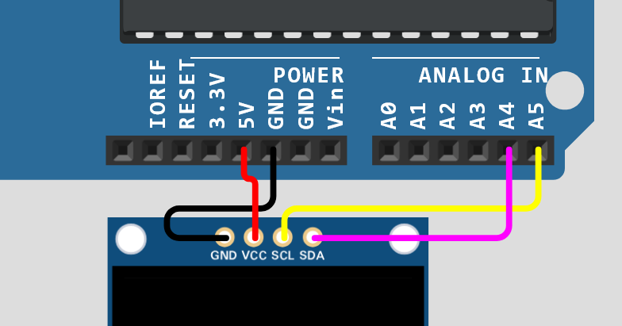

# sesion-03b

**Por hacer:**

Encargo 7

"03b"

"documentar aprendizajes y dificultades del trabajo con pantallas y displays SSD1306 con simulador Wokwi"));

**pendiente volver a repasar videos de la clase**

## repaso

pantalla OLED 128x64 y mini protoboard

tinkercad / wokwi

4 cables:

- **GND** cable principal de tierra, ground (*GND*)
- **VCC** voltaje de alimentación (importante saber el voltaje) (*5V*)
- **SCL** signal clock, tiene que saber "cuándo" (*A5*)
- **SDA** datos (*A4*)



Biblioteca: Adafruit GFX Library / Adafruit SSD1306 Library

en Arduino IDE en las bibliotecas buscar Adafruit GFX y SSD1306 (la más reciente) instalar dependencias.

File < Examples < Adafruit SSD1306 < ssd1306_128x64_i2c

copiar código a Wokwi

**navegar y entender para la entrega texto que hace scroll (testscrolltext();    // Draw scrolling text)**

modificación en el código // FIX la dirección era otra

```ccp
// #define SCREEN_ADDRESS 0x3D ///< See datasheet for Address; 0x3D for 128x64, 0x3C for 128x32
#define SCREEN_ADDRESS 0x3C
```
al usar i2c importante conocer la dirección del módulo 

los nombres modificables ojalá darle un nombre a elección en español

<https://www.wolframalpha.com/>

**hasta aquí llegué, me falta la última parte de la clase para poder seguir**


