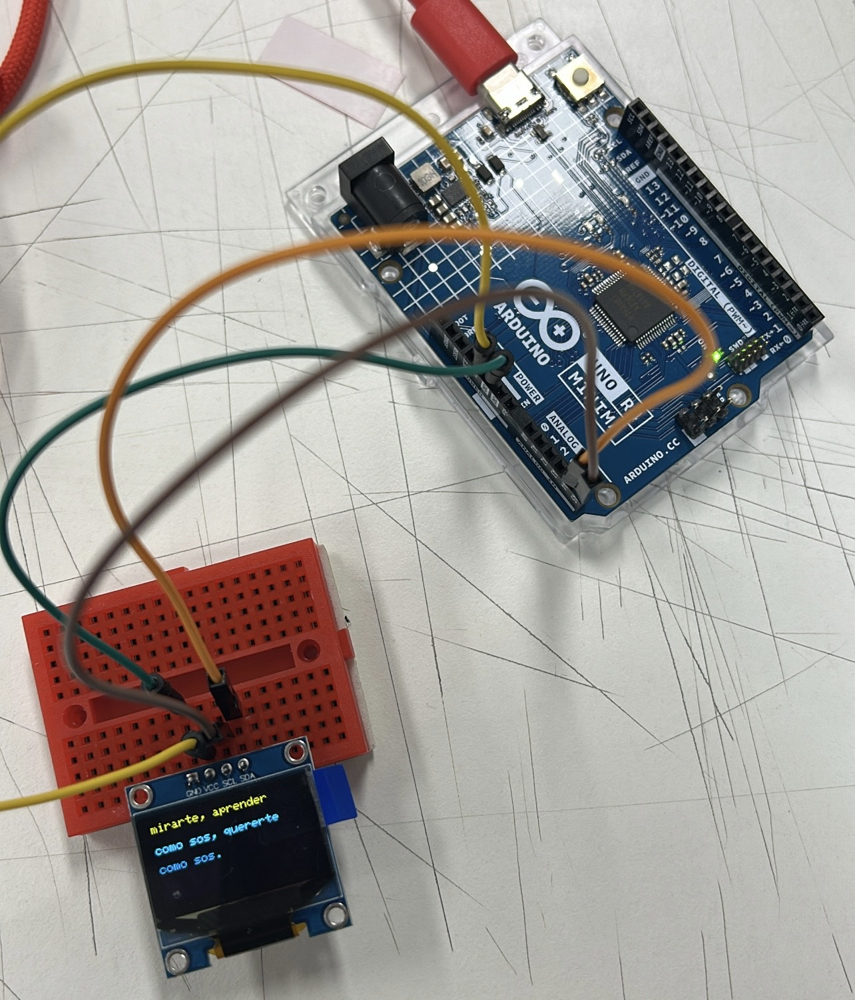
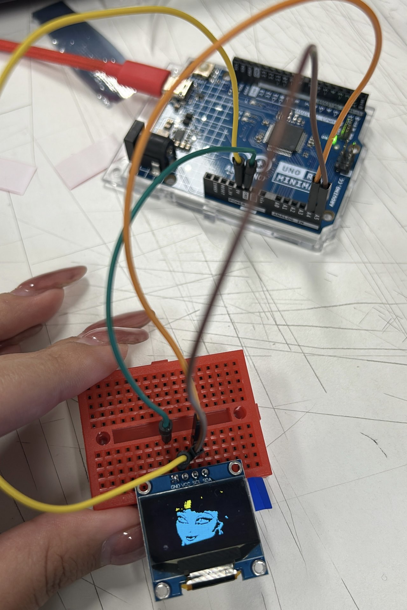
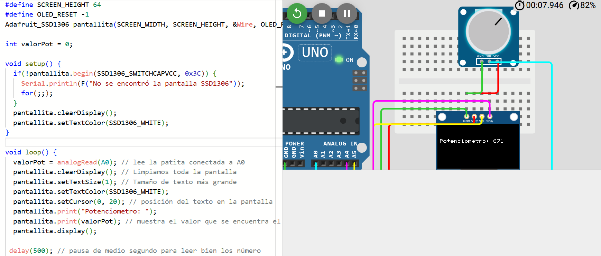

# sesion-04a - martes 26 de agosto ⋆ 𐙚 ̊.

## Uso de pantalla y protoboard 

Simulación potenciómetro en wokwi:

```cpp

// declarar valor
// inicializar 0
int valorPot = 0;

void setup() {
  // put your setup code here, to run once:
  Serial.begin(9600);

}

void loop() {
  // put your main code here, to run repeatedly:
  
  // leer el valor
  valorPot = analogRead(A0);
  
  Serial.println(valorPot);
}
```

### Pruebas en pantalla






### Proceso proyecto 01 ・┆✦ʚ♡ɞ✦ ┆・

- potenciómetro funcionando con el código de arriba. ⋆⋆⋆
- integrar pantalla a código: agregar bibliotecas de Adafruit (GFX y SSD1306) vistas anteriormente.

### Poema seleccionado por nuestro grupo

- Mario Benedetti - "Táctica y estrategia"
  
### Conexión pantalla en mini protoboard con potenciómetro


- Potenciómetro: una patita a 5V (en protoboard), la otra a GND (en protoboard), la del medio a A0 (en arduino).

### Prueba potenciómetro + display en pantalla (valor del potenciómetro)

```cpp
#include <Wire.h>
#include <Adafruit_GFX.h>
#include <Adafruit_SSD1306.h>

#define SCREEN_WIDTH 128
#define SCREEN_HEIGHT 64
#define OLED_RESET -1
Adafruit_SSD1306 pantallita(SCREEN_WIDTH, SCREEN_HEIGHT, &Wire, OLED_RESET);

int valorPot = 0;

void setup() {
  if(!pantallita.begin(SSD1306_SWITCHCAPVCC, 0x3C)) {
    Serial.println(F("No se encontró la pantalla SSD1306"));
    for(;;);
  }
  pantallita.clearDisplay();
  pantallita.setTextColor(SSD1306_WHITE);
}

void loop() {
  valorPot = analogRead(A0); // lee la patita conectada a A0
  pantallita.clearDisplay(); // Limpiamos toda la pantalla
  pantallita.setTextSize(1); // Tamaño de texto más grande
  pantallita.setTextColor(SSD1306_WHITE); 
  pantallita.setCursor(0, 20); // posición del texto en la pantalla
  pantallita.print("Potenciometro: ");
  pantallita.print(valorPot); // muestra el valor que se encuentra el potenciómetro
  pantallita.display(); 

 delay(500); // pausa de medio segundo para leer bien los número
}
```
- todo funcionando correctamente:
  

