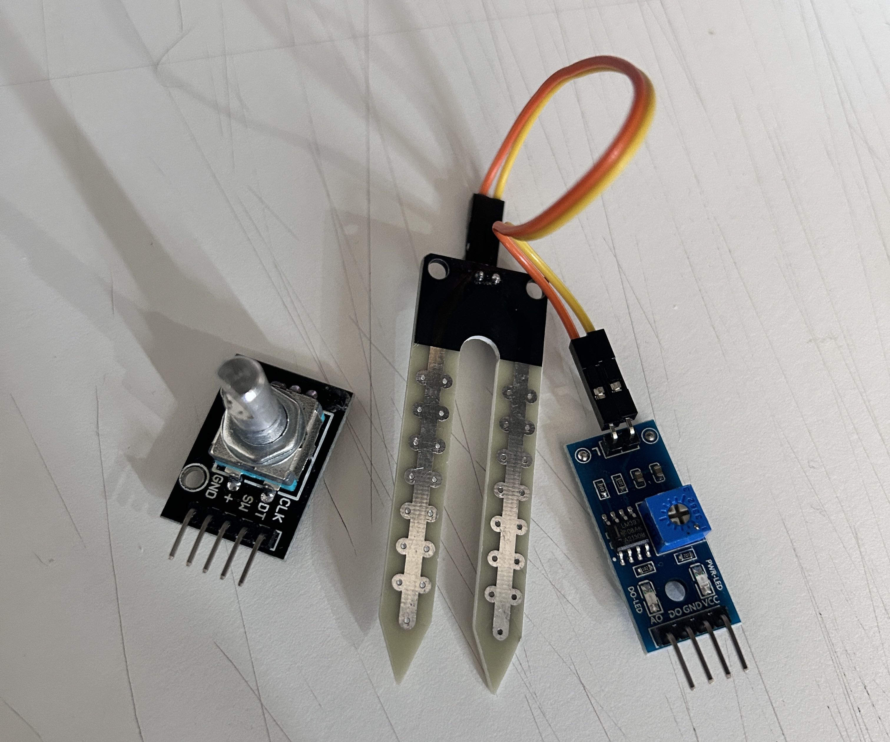

# sesion-06a

## Scratch

- no me acordaba pero me metí a la página y pude recuperar mi cuenta y encontré mi proyecto de 3ero medio que hice en el colegio con scratch!

### Acercamiento a proyecto 02: Robotcito que salude mediante una interacción en tiempo real

### Uso de sensores

- Encoder rotatorio (similar al potenciómetro pero no tiene un límite)
- De humedad

## Pensar 3 maneras de usar los sensores

- cotizar, referentes, usos

### Posibles interacciones

1. Input: Según humedad de una plantita
- Output: Si está húmeda podría responder positivamente (saludo, agradecimiento, felicidad) / Si está seco podría responder con una necesidad (ayúdame, riégame, etc)

2. Input: Velocidad de giro del encoder
- Output: La energía del saludo varía según la velocidad en la que se mueve el encoder (hola, holaaaaaaaaaaaaaaaaaa)

3. Input: Girar el encoder
- Output: Según vaya girando saluda en distintos idiomas c: (hola, hello, konnichiwa, oi, etc)

### Otros posibles sensores

- Sensor pulso cardíaco corazón: $3.500 (idea de interacción según el pulso, interacciones según rango asignado)
- Sensor reconocimiento gestual: $6.990 (interacciones mediante diferentes gestos, cada uno activa algo diferente)

### Referentes

- Uso de sensor de húmedad: <https://youtu.be/moa6d8DboCo?feature=shared>
- Uso de encoder para menú interactivo: <https://youtu.be/ak5TsUFhyf8?feature=shared>
