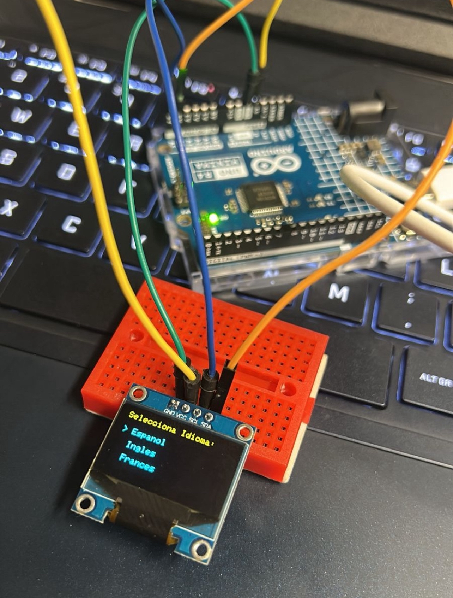

# sesion-08a - Martes 30 de septiembre

## Avance hasta el momento en clase

### Encargo 16

"cada persona del grupo debe subir a su README: qué llevan hasta el final de esta sesión, qué sí funciona, qué funciona casi, qué no funciona. después subir nueva versión del código y de la documentación, del trabajo que hagan entre 8a y 9a."

- La pantallita no daba imagen y era por una minúscula, va en 0x3c.
- No olvidar modificar librerías por BIBLIOTECAS!
- Tenemos funcionando la pantallita y el encoder juntos, el menú de idiomas se muestra y se puede navegar girando el encoder.
- Hicimos algunas modificaciones en la lista de idioma (quitamos español e inglés) para incluir algunos más entretenidos como el japones y el ruso.

