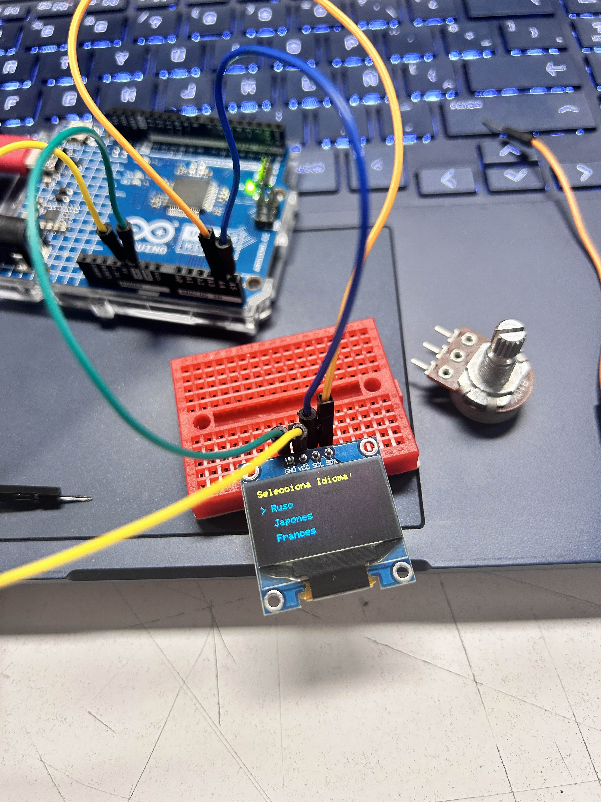

# sesion-09a - Martes 7 de septiembre

## Proyecto avance en clases

- Hacer imágenes que se verán desplegadas en la interacción
- Definir audios: buscamos audios más entretenidos que dijieran "Hola" en el idioma seleccionado, por ejemplo en Francés encontramos un audio de los Simpsons
- Volver a estructurar archivos, pasar los .ino de los sensores a .h y .cpp y organizarlo
- Agregar y ordenar los comentarios, importante dar a conocer lo que queremos que pase!

### Fotitos proceso

