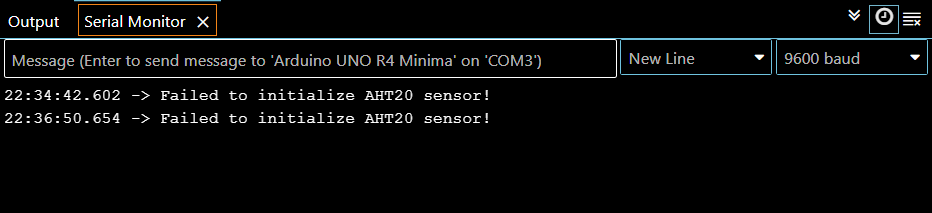

# sesion-07b

Hola llegue tarde despues agrego apuntes :-)

igual hice el pseudocodigo

pseudocodigoV0 tiene un error en cableado sensor ultrasonico, en pseudocodigoV0_1 se corrige :-)

## Encargo 14
"cada persona del grupo debe implementar en diagrama de flujo dibujado o con la herramienta Mermaid.js con sus propias palabras y subirlo a su README."


Código para desarrollar el diagrama con la herramienta Mermaid.js
```js
---
config:
  layout: fixed
  look: neo
---
flowchart TD
    A["robotFriolento"] -- sensor ultrasonico --> C("detecta tu presencia")
    C --> D["no"] & E["sí"]
    D --> F["no hace nada"]
    F --> C
    E -- sensor temperatura --> G["lee la temperatura"]
    G --> H["Hacen menos o igual de 15° C"] & I["Hacen mas de 15° C"]
    H -- Display --> J["«no te quiero saludar, hace mucho frio» y se ve una cara triste :-("]
    H -- servomotor --> K["no se mueve para saludar"]
    I -- Display --> L["«ahora te puedo saludar, ya no hace frio» y se ve una cara feliz :-)"]
    I -- servomotor --> M["se mueve el servo motor en un rango aungular entre 135 y 45 de una circunferencia múltiples veces, entre 3 y 5"]

```

## Encargo 15
"cada persona del grupo debe subir a su README: documentar funcionamiento de sus sensores, incluyendo instrucciones de conexión y de configuración, subir el proyecto entero de arduino como carpeta, tiene que poder compilar sin problema y mostrar en consola los datos de los sensores."

Apoye a [SebastianSaez1003](https://github.com/SebastianSaez1003/dis8645-2025-02-procesos)

El Seba presentó problemas en recibir una respuesta del serial monitor y pidió ayuda dentro del grupo; yo decidí revisar qué pudo estar ocurriendo, pero prefiero dar contexto primero.

El Seba encontró este código. 
```cpp

#include <Wire.h>
#include <Adafruit_AHTX0.h> // Library for AHT20
#include <Adafruit_BMP280.h> // Library for BMP280

// Create sensor objects
Adafruit_AHTX0 aht;
Adafruit_BMP280 bmp;

void setup() {
  Serial.begin(9600);
  while (!Serial); // Wait for Serial Monitor to open

  // Initialize AHT20 sensor
  if (!aht.begin()) {
    Serial.println("Failed to initialize AHT20 sensor!");
    while (1);
  }
  Serial.println("AHT20 sensor initialized.");

  // Initialize BMP280 sensor
  if (!bmp.begin(0x76)) { // Default I²C address for BMP280 is 0x76
    Serial.println("Failed to initialize BMP280 sensor!");
    while (1);
  }
  Serial.println("BMP280 sensor initialized.");
}

void loop() {
  // Read data from AHT20
  sensors_event_t humidity, temp;
  aht.getEvent(&humidity, &temp);

  // Read data from BMP280
  float pressure = bmp.readPressure() / 100.0F; // Convert to hPa
  float altitude = bmp.readAltitude(1013.25); // Sea level pressure in hPa

  // Print sensor data to Serial Monitor
  Serial.print("AHT20 - Temperature: ");
  Serial.print(temp.temperature);
  Serial.print(" °C, Humidity: ");
  Serial.print(humidity.relative_humidity);
  Serial.println(" %");

  Serial.print("BMP280 - Pressure: ");
  Serial.print(pressure);
  Serial.print(" hPa, Altitude: ");
  Serial.print(altitude);
  Serial.println(" m");

  delay(2000); // Wait 2 seconds before next reading
}
```
Y explica que, aun cuando se compila el código y se logra subir al Arduino, no era capaz de recibir la comunicación serial.

Ya ahí el Seba pidió apoyo para ver qué pasaba con el código; él explica que instaló las bibliotecas manualmente y aun así no le resulta.

Cuando yo instalé las bibliotecas Adafruit AHTX0 y Adafruit BMP280, sí logré la comunicación en el serial monitor.



No sabemos por qué al Seba no le resulta; de igual manera, mi apoyo no es tan confiable debido a que no pude probar el sensor con mi Arduino.

