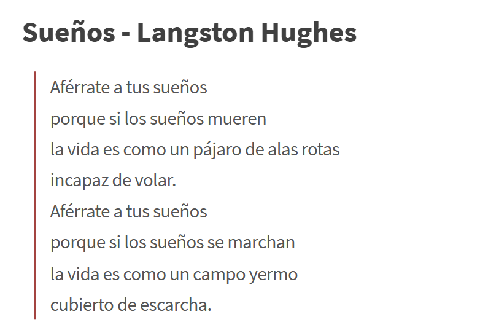

# sesion-04a

## Clase 4a: 26/08 MÁQUINAS COMPUTACIONALES

### Apuntes

(Iniciamos la clase de trabajo en grupo, para entrega del viernes)

Probamos y elegimos lo que haríamos como grupo según los roles acordados la clase pasada

## Protoboard -> Lugar donde se pueden realizar conexiones

Potenciómetro

- Para leerlo se conecta en **paralelo**
  
- Tiene **3 terminales**: 0, 1 y salida variable

Análogo (*analog*)

- Características: **fluido, continuo, real, infinito**

- **Ejemplos:** Tiempo, el mundo real

digital (*digital*)

- Características: **discreto, por pasos, en píxeles**

- **Ejemplos:** Hora digital, *Minecraft*, píxel de una foto

Mientras nos poniamos de acuerdo de lo que queriamos hacer, comence a buscar opciones de poemas que conectara con cada uno de nosotros para darle un sentido mas propio al proyecto 01 

 

Luego comenzamos a hacer una lluvia de ideas para definir cómo queríamos mostrar el poema. Nuestra idea inicial fue crear fotogramas reemplazando palabras; por ejemplo: sueños con un fotograma, mueren con otro fotograma, y así sucesivamente, mientras se mostraba el poema escrito. Otra opción que pensamos fue que las palabras aparecieran en diferentes lugares y que estos se fueran saturando, pero Nico nos había mostrado que eso no funcionaba bien y sería un problema.

Al final, pensamos en cómo podíamos conectar el poema con el símbolo central, que era el pájaro, haciendo una similitud con nosotros. Sin duda, era una parte primordial del poema. Así que nos pusimos a buscar qué opciones podíamos hacer. Fue entonces cuando planteé en el grupo: ¿qué pasaría si hacemos fotogramas que parezcan videos? Cata afirmó que se podía hacer en AI y que teníamos que calcular cuántos fotogramas podrían aparecer para que el potenciómetro fuera fluido.

Al inicio planteamos 8 cambios, pero finalmente nos quedamos con 16, y así los subdividimos de 0 a 1023 (valor del potenciómetro de 10 bits).

Videos de proceso en clases:

<https://youtube.com/shorts/prP_wWswPBg>

<https://youtu.be/AQlyXXPR3ow>

<https://youtu.be/_c7rWq3Rkxc>

<https://youtube.com/shorts/S3kj9cHH_Oc>

(FALTA REGISTRO DE FALLAS Y LOGROS)

## GITHUB

- Aceptar y leer la bandeja de entrada

- Hacer SYNC antes de hacer commit siempre sino puede haber error

- En el original se revisa los comentarios personales

(Nota: entrar a google docs para ver la retroalimentación especifica)
