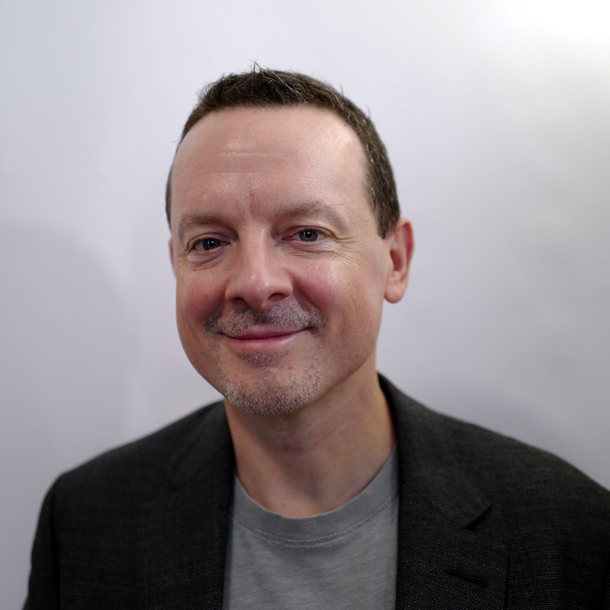
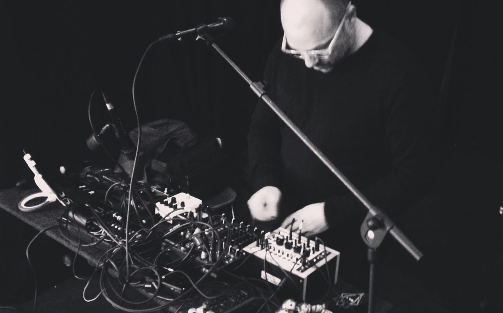

# sesion-04b

## Clase 4b: 26/08 MÁQUINAS COMPUTACIONALES

Nota: Hoy iniciamos con las presentaciones del proyecto 01 (estaba muy nerviosa, me cuesta hablar en público). Tuvimos el placer de contar con la presencia de un gran poeta chileno, Martín Gubbins, quien llegó en el segundo bloque. Fue emocionante saber que le gustaron mucho los proyectos de mis compañeros, incluyendo el nuestro. Estuvieron realmente muy buenos: pude conectar y ver la magia que surge al unir el diseño, la programación y la visión de cada compañero. La premisa de los proyectos era la misma para todos, pero cada uno logró darle su propio sello.

Encargo 06: Investigar a los poetas Allison Parrish, Nick Montfort y Martín Gubbins

## Allison Parrish 

## Nick Montfort 

## Martín Gubbins

Nota: aprendí a poner imagenes al fin :)
