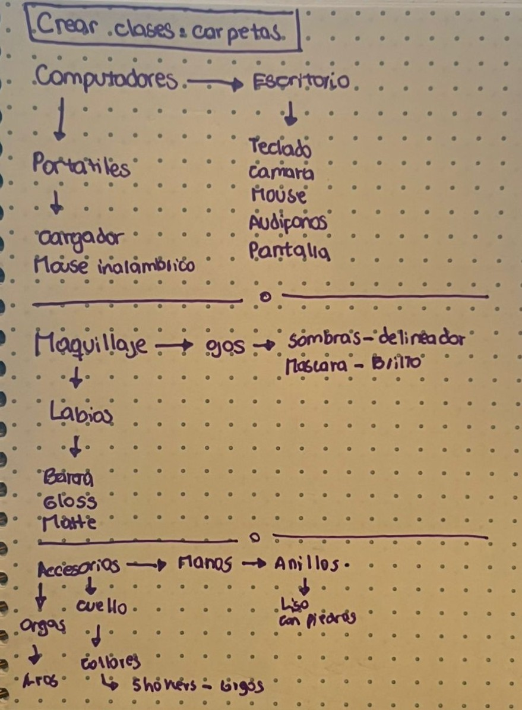

# sesion-05b

## Clase 5b: 05/09 MÁQUINAS COMPUTACIONALES

Nota: Hoy partimos revisando las notas del proyecto 01, las cuales en general estuvieron muy buenas. Luego comenzamos a hacer un resumen de la clase pasada, a la cual falté por motivos personales. De antemano, pido disculpas, pero prometo ponerme al día con todo, porque llegué y estaba súper perdida. Además, hoy pude conocer el laboratorio de interacción digital oficialmente.

Conceptos clave

`<>`-> Significa que hay que buscar el archivo para colocarlo en el código.

`.h`-> Promete

`cpp`-> Se hace cargo de lo que promete

`GFX`-> Es una biblioteca de gráficas creado por Adafruit (Adafruit_GFX)

`Atributos`-> Son las variables

Despues del break, tuvimos una actividad en la cual consistía en crear clases con subcategorias, la condición inicial fue primero escribirlo tipo boceto a mano antes de programarlo

 

Encargo 07: Investigar a Primus y Mitch Resnick
