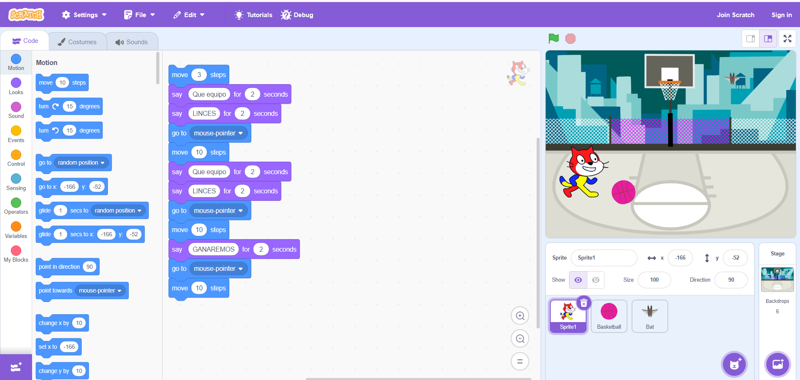

# sesion-05b

## Clase 5b: 05/09 MÁQUINAS COMPUTACIONALES

Nota: Hoy partimos revisando las notas del proyecto 01, las cuales en general estuvieron muy buenas. Luego comenzamos a hacer un resumen de la clase pasada, a la cual falté por motivos personales. De antemano, pido disculpas, pero prometo ponerme al día con todo, porque llegué y estaba súper perdida. Además, hoy pude conocer el laboratorio de interacción digital oficialmente.

Conceptos clave

`<>`-> Significa que hay que buscar el archivo para colocarlo en el código.

`.h`-> Promete

`cpp`-> Se hace cargo de lo que promete

`GFX`-> Es una biblioteca de gráficas creado por Adafruit (Adafruit_GFX)

`Atributos`-> Son las variables

Despues del break, tuvimos una actividad en la cual consistía en crear clases con subcategorias, la condición inicial fue primero escribirlo tipo boceto a mano antes de programarlo

 

Encargo 07: Investigar a Primus y Mitch Resnick

### Primus

Video: Primus - Wynonna's Big Brown Beaver

Partí buscando en internet solo el nombre **“Primus”** y me fui a la sección de videos. El primer video musical que me apareció fue **“My Name Is Mud”**, el cual no me gustó; apenas lo escuché, tuve que salir porque tenía una temática que no suelo escuchar, así que preferí salirme ya que me incomodó. Sin embargo, decidí darle una oportunidad más y me encontré con otro que sí me gustó: se llamaba **“Wynonna’s Big Brown Beaver”**. Combinaba humor y rareza de una forma muy llamativa. Los músicos aparecían con trajes rígidos y máscaras que los hacían ver como muñecos de cera, con colores vivos y una ambientación rural tipo *country*. Mientras tanto, la música, desde un inicio, te hace sentir en sintonía, ya que el bajo está muy presente. La forma de interpretación también era muy buena.

En resumen, es un video entretenido de ver, escuchar y bailar: sorprende. (Iba en el metro camino a mi casa después del trabajo escuchándolo).

Link del video musical

<https://www.youtube.com/watch?v=aYDfwUJzYQg&list=RDaYDfwUJzYQg&start_radio=1>

### Mitch Resnick

Video: Mitch Resnick: Enseñemos a los niños a codificar

Mitch Resnick plantea que la programación no debe ser algo solo para expertos o personas con muchos conocimientos técnicos, sino una herramienta para todos los niños. Explica que usar lenguajes como Scratch, donde se “arman bloques” para crear animaciones, juegos o historias, les permite experimentar, equivocarse y aprender jugando. Lo valioso es que codificar enseña más que computación, ya que desarrolla creatividad, lógica, paciencia al enfrentar problemas y colaboración entre pares. En resumen, el video defiende la idea que codificar es como aprender a leer y escribir: abre puertas para expresarse y entender el mundo, no solo para usarlo. La verdad, me dio curiosidad, así que me metí al programa y me quedé como una hora buscando qué hacer. Me hubiese gustado haberlo encontrado cuando era pequeña.
 

Link de la conferencia

<https://www.youtube.com/watch?v=Ok6LbV6bqaE>

<https://scratch.mit.edu/>

