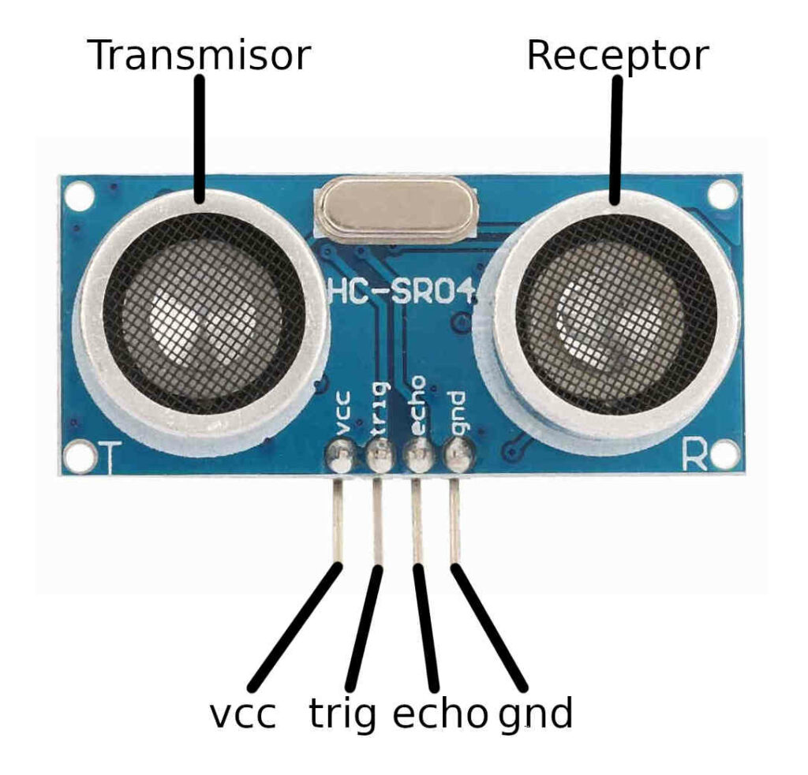

# sesion-06a

## Clase 6a: MÁQUINAS COMPUTACIONALES

Nota: Comenzamos hablando sobre otras formas de programar llegué 5 min. pasado de las 9:00.

La programación es detalles **repetir**  y **automatizar**

Conceptos clave

`Automatizar`-> Es hacer que algo funcione solo, con instrucciones previamente asignadas para optimizar tiempo y limitar errores.

`Lint`-> Es un proceso automatizado encargado de detectar errores.

`YAML`-> Lenguaje de programación caracterizado por ser fácil de leer y entender.

Links de clase

<https://scratch.mit.edu/>

<https://puredata.info/>

<https://github.com/Arduino>

<https://es.overleaf.com/>

### Proyecto 02: Sensores

Comenzamos hablando sobre los posibles proyectos que se podrían hacer, desde sonido, aproximador, temperatura, etc.

- Sensor ultrasónico-> Medir distancia/ detector de proximidad.

- Sensor de temperatura y humedad-> Ambiente.

- Sensor tipo potenciómetro sin límite.

- Sensor de lluvia-> Detecta las gotas de lluvia (pasivo).

- Joystick-> Un tipo potenciómetro con amplio rango de movimiento.

- Sensor diodo-> Utilizado como interruptor.

- Sensor de sonido-> Transmite ondas sonoras. 

Encargo 8: Plantear 3 posibles ideas de programación con sensores e investigar

### Sensor ultrasónico HC-SR04

 

Características importantes

- Tiene un rango de distancia entre 2 y 400 cm.

- Está compuesto por un transmisor y receptor.

- En Arduino cuenta con los pines Trigger y Echo.

- No se afecta por la exposición solar ni el color negro.

- Pero sí se afecta por las estructuras de la tela y lana.

Links de información

<https://uelectronics.com/producto/sensor-ultrasonico-hc-sr04/>

<https://proyectosinteresantes.com/10-proyectos-de-arduino-con-el-sensor-ultrasonico-hc-sr04/>

Para empezar a planear las ideas de posibles proyectos, me basé en cosas que veo día a día y en cómo podrían reflejarse en ellas. (Con mis compañeros cometimos un error: la clase pasada habíamos entendido que teníamos que llevar 3 ideas con códigos funcionando para el viernes, y junto a Nicolás-Miranda1312 estábamos trabajando en la generación de estos. De todas formas, conversamos, les mostré mis ideas y él las suyas, y generamos la idea 2 que propuse acá. Igualmente, dejaré registro de eso).

### Idea 1

En relación a los contadores de billetes existentes en los bancos, surgió la primera idea combinando ambos dispositivos: la pantalla OLED y el sensor ultrasónico, para formar un contador de objetos o personas. Por ejemplo, al entrar a una sala, la pantalla podría mostrar el número de personas presentes, con el objetivo de saber cuántas personas están en un mismo espacio.

### Idea 2

La segunda idea es más lúdica, basada en la interacción humano-computador, similar a una conversación o interacción corta universal. La persona que interactúa con la pantalla lo hace variando su distancia al dispositivo, que tiene un rango de 2 a 400 cm.

Ejemplo:

Pantallita: Zzz… nadie por aquí

Pantallita: ¿Quién anda ahí?

Pantallita: Ah, eras tú, me asustaste

Pantallita: Oh, ya te fuiste :c

<https://youtube.com/shorts/U_dec08-dB4?feature=share>

### Idea 3

Para la tercera idea pensé en algo más interactivo: un juego humano-computador. La persona, mediante la lectura de sus movimientos y ondas, junto con fotogramas que pasan en la pantalla, puede generar comandos. Por ejemplo, para que un personaje salte debe colocarse a una distancia X, para agacharse a una distancia Y y para detenerse a una distancia Z. Así se crea un juego comunitario donde se involucre la programación y la interacción de varias personas.

Nota extra: Desde esta clase no paro de ver sensores en todos lados. Quién diría que había sensor para casi todo y que en verdad estamos rodeados de estos cotidianamente. Me parece fabuloso e increíble. (El Matí mencionó los sensores del metro especificamente las puertas, fui directo a curiosear a la salida :o)

