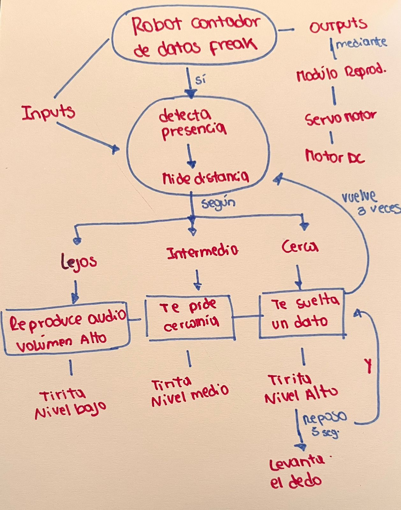
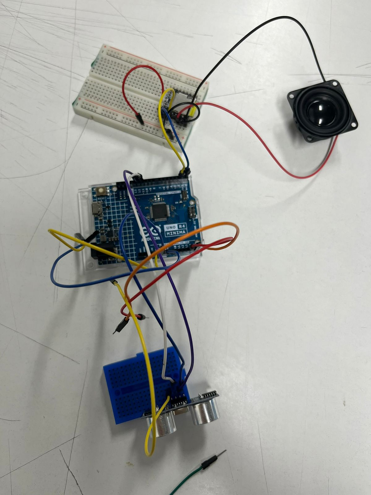
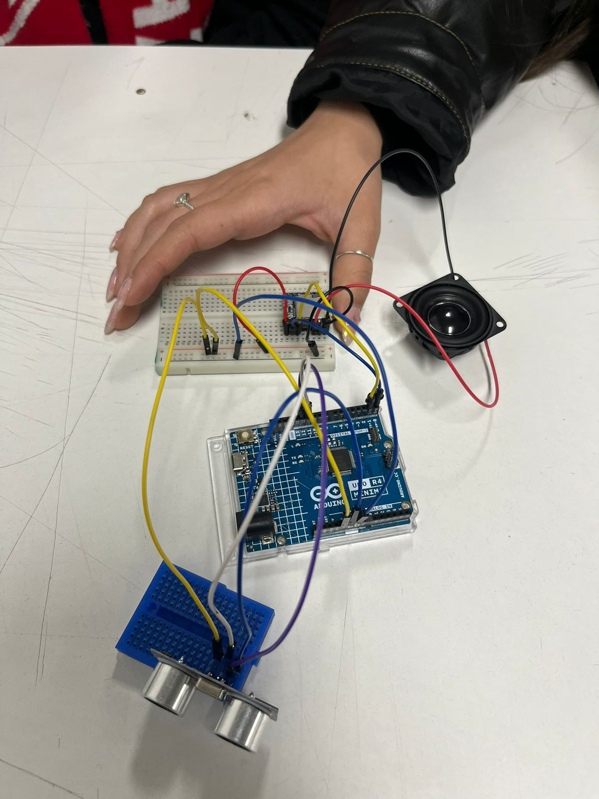
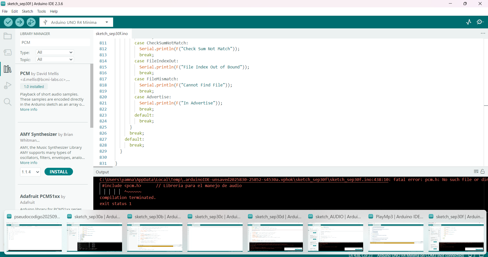

# sesion-07b

## Clase 26/09 07b: MÁQUINAS COMPUTACIONALES

Nota: Iniciamos el trabajo en clase con un ejemplo en Arduino para aprender cómo distribuir acciones en diferentes archivos .ino, definiendo de manera general la función que cumplirá cada uno.
### Acciones clave

- Programar es decidir que hacer.

- Recomendación desde lo **macro** a lo particular. 

### Encargo 14 

Cada persona del grupo debe implementar en diagrama de flujo dibujado o con la herramienta Mermaid.js con sus propias palabras y subirlo a su README.

### Encargo 15

Cada persona del grupo debe subir a su README: documentar funcionamiento de sus sensores, incluyendo instrucciones de conexión y de configuración, subir el proyecto entero de arduino como carpeta, tiene que poder compilar sin problema y mostrar en consola los datos de los sensores.

### REGISTRO DE FALLAS Y LOGROS

Partimos de un ejemplo que habíamos trabajado con Nicolás Miranda: un código de ultrasonido + pantalla OLED. Adaptamos el código para que, en lugar de la pantalla, funcionara con el reproductor de audio MP3 + el altavoz. Sin embargo, nos lanzamos a probar todo junto sin haberlo verificado por separado. Pasamos casi toda la clase tratando con cables, buscando códigos y haciendo pruebas. En resumen **"Caos cretivo"** (Estresante y divertido a la vez).

### Fotos

- Desconectamos todo que previamente estaba conectado según un diagrama universal de afel.
  

- No sabiamos como conectar porque no sabiamos sí era en digital 10 y 11 o TX o RX.
  

- Logramos conectar el dispositivo, pero el código no funcionó. Le preguntamos a Misa, y nos explicó que nos estábamos adelantando al intentar juntar todo de una vez. Nos recomendó buscar ejemplos de códigos para probar cada componente por separado antes de integrarlos.
  

- Así se veía mi pantalla después de probar una gran cantidad de códigos existentes. Llamamos a Mateo y Janis para que nos ayudaran, perotampoco lograban entender qué podía estar fallando. Revisamos las conexiones, el código, las descargas de librerías y aun así el error seguía apareciendo. A esas alturas ya estábamos muy frustradas y cansadas, con el cerebro prácticamente frito. :(

### Video de logro

<https://youtube.com/shorts/ODBURVm9aoA?si=OAUZ1hqbeeeDXMg8>

