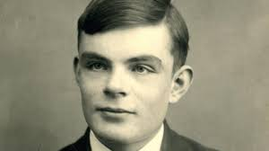
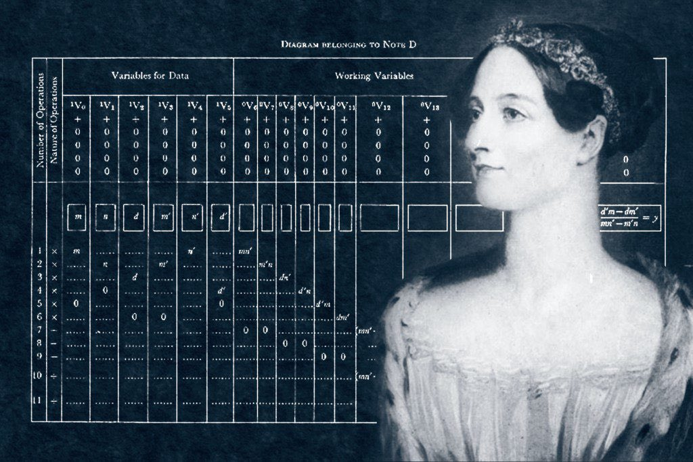

# sesion-01a 05/08

## Apuntes clase

**Máquina:**

* Objeto físico.
* Capacidad de correr procesos.
* Tiene un in y un out.
* Piezas móviles.
* Componentes electrónicos.
* Requiere energía.
* Tiempo.
* Objeto definido.
* Compuesta por más de un elemento.
* Intención.
* Facilitar.

**Computacionales:**

* Objeto físico.
* Tecnología -> TEKHNE: arte, oficio, destreza, signos y siniótica.
* Lenguaje.
* Orden -> secuencial, lógico.
* Cómputo -> númerocon binacional o secuencial.
* Datos/Cálculo.
* Interfaz.
* Información.

*Operación que ocurre un cambio mediante el tiempo.*

*El tiempo rs el sustrato de la energía.*

**HCI:** Interfaz Humano Computador.

**STS:** Science Technology Sociality.
  
**PCBA:** La A es de assembly.

**Micro controlador:** circuito integrado programable.

## Encargo 01

Buscar quienes fueron Alan Turin y Ada lovelace

### Alan Turing

imágen sacada de: <https://www.lavanguardia.com/historiayvida/historia-contemporanea/20180627/47312986353/que-aporto-ciencia-alan-turing.html>

Matemático, lógico, informático, criptógrafo, filósofo y biólogo nacido en 1912 en el Reino Unido.
Una vez licenciado se dedicó hacer artículo que revolucionó la lógica de esta ciencia titulado Sobre los números computables, con una aplicación al problema de decisión, en el que ya hablaba del concepto de algoritmo y exponía las bases de su máquina de calcular: la Máquina Universal, conocida más tarde como **Máquina de Turing.**
Entre los años 1937 y 1938 se doctoró en la Universidad de Princeton, en Nueva Jersey. En su tesis anunciaba el concepto de **hipercomputación**, un sistema que iba a permitir la resolución de problemas que carecían de una solución algorítmica.

### Máquina de Turing

Este dispositivo se encarga del proceso automático para determinar si un problema matemático puede ser resuelto o no mediante un procedimiento definido. Fue ideado para resolver una operación concreta.

Él la creó en 1936, el mismo año que teorizó acerca de la máquina.
Esto empieza de querer resolver todos los problemas matemáticos que pueden expresarse mediante un algoritmo. La diferencia radica en que la máquina universal se asemeja a un ordenador gracias a su capacidad de llevar a cabo múltiples procesos y de correr la función.

### Ada Lovelace

imágen sacada de: <https://mujeres360.org/mujeres-destacadas/ada-lovelance-la-primera-programadora-de-la-historia/>

Matemática y escritora inglesa, la primera programadora informática de la historia.
Nacida en 1815. Fue educada por tutores y de forma autodidacta. Al conocer a  Charles Babbage, se interesó en el concepto de los dipositivos mecánicos, el cual servía para calcular valores de funciones.

Ella fue la primera en reconocer que la máquina tenía aplicaciones más allá del cálculo puro y que también podía manipular símbolos. Además, publicó el primer algoritmo destinado a ser llevado a cabo por tal aparato.

fuentes utilizadas:

* <https://psicologiaymente.com/cultura/maquina-de-turing>
* <https://www.lavanguardia.com/historiayvida/historia-contemporanea/20180627/47312986353/que-aporto-ciencia-alan-turing.html>
* <https://historia.nationalgeographic.com.es/a/alan-turing-arma-secreta-aliados_16352>
* <https://ebac.mx/blog/ada-lovelace>
* <https://www.nationalgeographicla.com/ciencia/2023/10/fue-la-primera-programadora-de-la-historia-y-predijo-la-existencia-de-la-inteligencia-artificial>
* <https://www.fundacionaquae.org/wiki/ada-lovelace-madre-de-la-programacion/>
