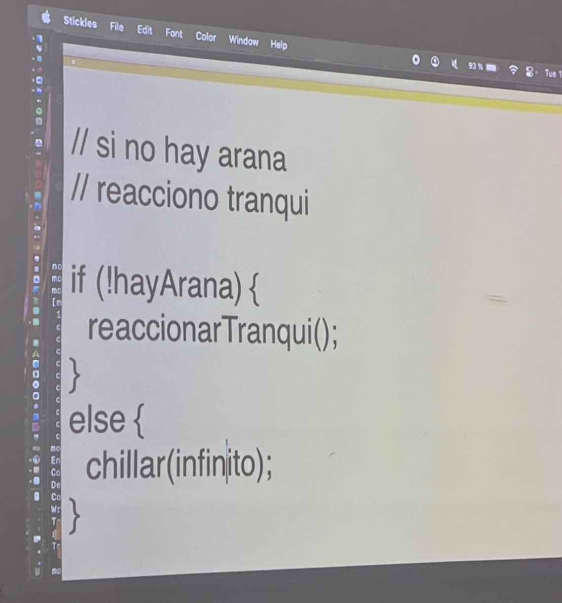
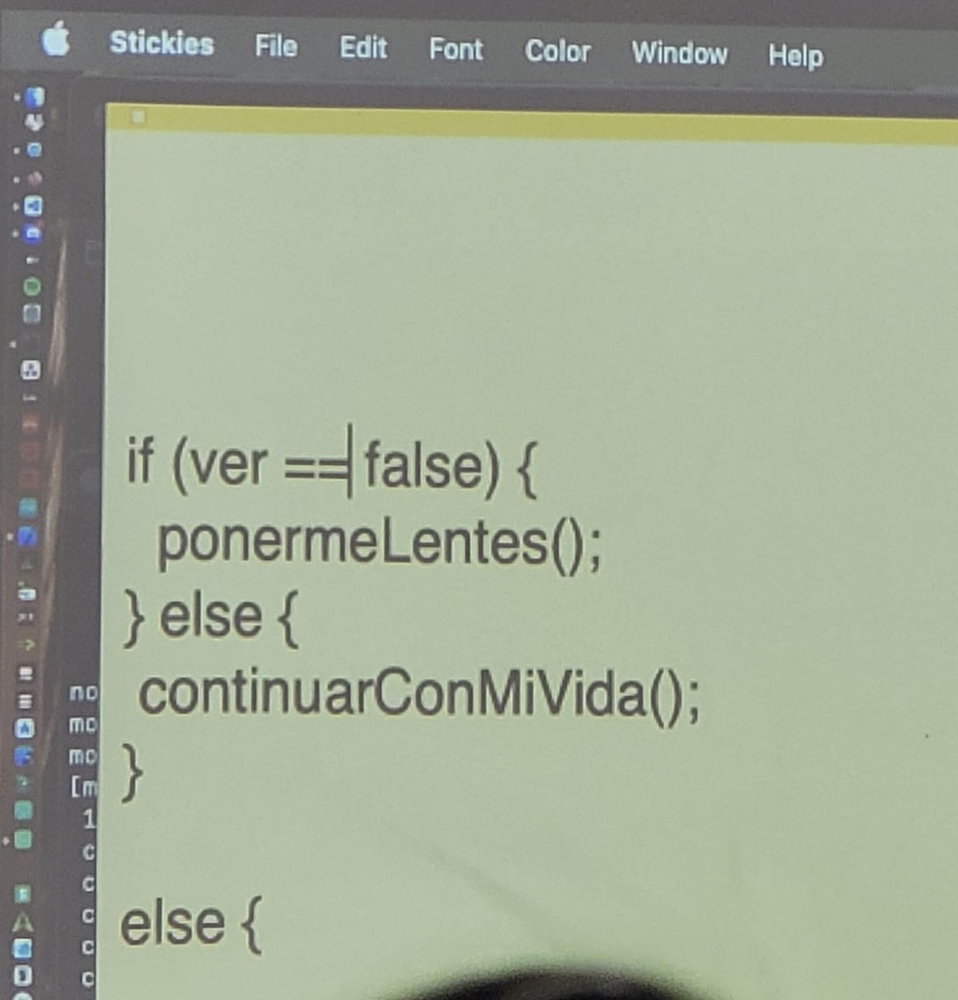
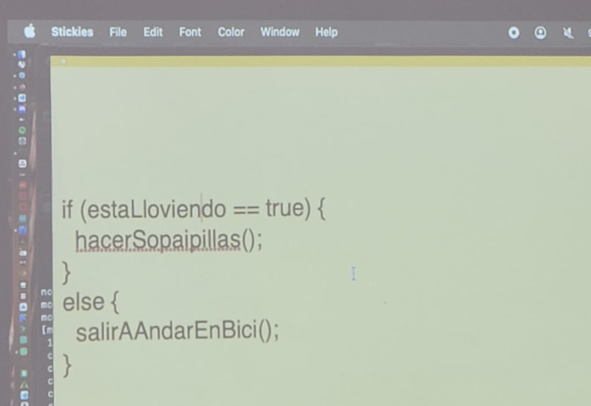

# sesion-03a 19/08

## Apuntes clase

Operadores lógicos

AND: inputs mutuamente dependientes -> **&&**

OR: inputs independientes -> **| |**

NOT: es un inversor -> **!**


Apuntes más sus funciones

- **AND**: Debe cumplir todas.
- **OR**: Debe cumplir alguna.
- **command t**: se ordena en el arduino.
- **Serial.println**: Imprime en otra línea.
- **Serial.print**: Imprime en la misma línea.
- **for**: Iteración.
- **if**: Si pasa algo funciona. Es como si tuviera mas opciones. *Para hacer o no hacer cualquier código.*
- **else**:
- **módulo o %**: Cuantas veces entra el número en ese. *El módulo es solo para números enteros*
  
Ejemplos:

3 en 6:2

3 en 3:1

- 7/2 -> nos entrega la división.
- 7%2 -> nos entrega el módulo.

- **end if**:
  
 ```cpp
  //se itera con for
  //se pone entre parentesis 3 cosas:
  // 1 partida
  // 2 término
  // 3 actualización
  // y entre murcielagos { } lo que quiero iterar
 
  for (int i = 0; i<veces; i = i +1)
  {
  hazEsto();
  }
```

**Ejemplo:**

```cpp
if(saldo>250){
 abrirTorniquete();
}else{
 Serial.println("SALDO INSUFICIENTE")
}

```

**Ejemplos vistos en clases**







**Trabajo  de códigos en clases, en conjunto:**

```cpp
//bool prender = false;
bool prender = true;

void setup() {
pinMode(LED_BUILTIN, OUTPUT);
}

void loop() {
  digitalWrite(LED_BUILTIN, prender);
  delay(3000);
  prender = false;
  digitalWrite(LED_BUILTIN, prender);
}
```

```cpp
bool prendido = false;

void setup() {
  pinMode(LED_BUILTIN, OUTPUT);
  Serial.begin(9600);
}

void loop() {
  //Serial.println(millis() / 1000);
unsigned long segundos = millis() / 1000;

  // con este if, el led se prende durante 3 segundos y luego se apaga
  if (segundos < 3) {
    prendido = true;
  }/* else if (segundos > 10) {
    prendido = true;
  } */else {
    prendido = false;
  }

  digitalWrite(LED_BUILTIN, prendido);
}
```


## Encargo 03

Investigar NAND, NOR, XOR, XNOR.

**¿Qué es una copuerta lógica?**

Es un circuito electrónico que opera con una o más señales para obtener un output.

* Compuerta **NAND**: Tiene dos o más entradas y una salida. Es complementaria  a la función AND.
  
| | |output|
|-|-|-|
|0|0|1|
|0|1|1|
|1|0|1|
|1|1|0|

* Compuerta **NOR**: Tiene dos o más entradas y sólo una salida. Es el complemento de la función OR.
  
|entrada A|entrada B|output|
|-|-|-|
|0|0|1|
|0|1|0|
|1|0|0|
|1|1|0|

* Compuerta **XOR**: Tiene de salida 1 verdadero, cuando ambas entradas son opuestas es verdadero o 1. Si ambas entradas son iguales es falso o 0.
  
|entrada A|entrada B|output|
|-|-|-|
|0|0|0|
|0|1|1|
|1|0|1|
|1|1|0|

* Compuerta **XNOR**: Produce 1/verdadero solo cuando el voltaje de las dos entradas es el mismo. Las entradas opuestas tienen salida 0/falso.
  
|entrada A|entrada B|output|
|-|-|-|
|0|0|1|
|0|1|0|
|1|0|0|
|1|1|1|

