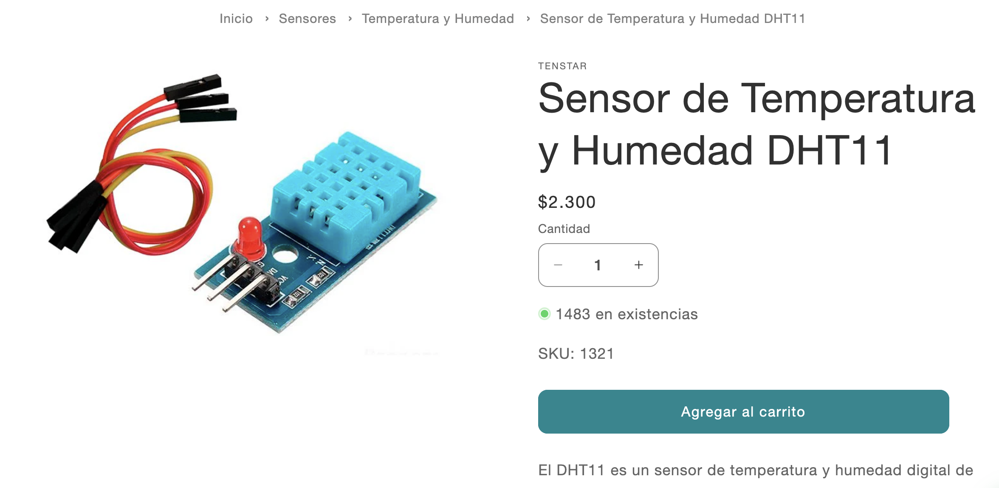

# sesion-06a 09/09

## Apuntes clase

[Scratch](https://scratch.mit.edu/): Es un software de programación. Estrategia de programar con bloques. Fue desarrolldo por MIT Media Lab.

[Pure data](https://puredata.info/): Es un software para programar audios. Está programado en C++.
  
 
### Miller Puckette

Es un matemático, programador y profesor de música estadounidense, director asociado del CRSA, así como miembro del claustro de la facultad de la UC University of California en San Diego donde trabaja desde 1994. Cycling 74 esta empresa vende un software llamado `Max map`.
  
Hizo nueva versión.

- **Max**: Gráficas para hacer audios
- **dac**: De digital a análogo.
- las cajitas que están arriba son entradas y las de abajo son salidas. input/output.
- la `~` es la salida del sonido.
- si creo un `pd` se hace un subpach.
- Lint: Proceso de automatización para corregir errores, por ejemplo, sacar las pelusas de la ropa.
- YAML: Es un formato de serialización de datos legible por humanos que se utiliza principalmente para archivos de configuración y para transmitir datos ente sistemas, gracias a su facil lectura y escritura. Pueden variar los inputs y output.
  
---

- programación en estado de objetos
- [lauren lee mccarthy tools for improved social interacting](https://get-lauren.net/Tools-for-Improved-Social-Interacting)
- [renata gaui hysterical wearable](https://vimeo.com/215600031?fl=pl&fe=sh)
- [Touchdesigner](https://derivative.ca/)
- [Isadora software](https://en.wikipedia.org/wiki/Isadora_(software))

---

### Ejemplo:

on

 Hay un espacio antes 

- En c++ son los murciélagos {}.
- Arduino controlled namaste gratin robot.
  
### Sensores y Actuadores

**Sensor**: entrada a nuestra caja negra.

**Actuador:** salida.

- obs
- Ultrasonico : emitir un pulso y detecta el ultrasonido y cuenta en cuanto se demora en devolverse.
- Sensor de temperatura y humedad:  atmosféricarica.
- Sensor de gas.
  
  Potenciometro 5 patas encoder rotatorio, no tiene límite.
  
- Sensores de humedad
- Sensor de lluvia, resistencia experimental -> Sensores pasivos. (Hay otro y se ocupa para el nivel del agua).

- Joistik

- Sensor de luz
  
Fotodiodo 

- Sensores de sonido
  
Tienen mic

## Encargo

Investigar sensor elegido en clases y buscar tres ideas de cómo utilizarlo.

### Sensor de proximidad HC­-SR04

- Capazdedetectar objetos y calcular ladistanciaalaque se encuentra en un rangode 2 a 450cm.

- El sensor posee dos transductores, un emisor y un receptor, piezoeléctricos.
  
- El funcionamiento de este es porque el emisor, piezoeléctrico, emite 8 pulsos de ultrasonido.
Luego, de recibir la orden en el pin TRIG, las ondas de sonido viajan en el aire y rebotan al encontrar un objeto, el sonido de rebote es detectado por el receptor piezoeléctrico.
Después,el pin ECHO cambia a Alto por un tiempo igual al que demoró la onda, desde que fue emitida hasta que fuedetectada.

---

- VCC -> +5V DC
- TRIG -> Disparo del ultrasonido
- ECHO -> Recepción del ultrasonido
- GND -> 0V

---

- En el pdf de "**ULTRASONIC-HC-SR04** sensor de distancia ULTRASONICOHC-SR04" sale un ejemplo de cómo conectarlo al arduino y programarlo.

### Referentes

- <https://www.alldatasheet.com/view.jsp?Searchword=Hcsr04&gad_source=1&gad_campaignid=1434060638&gbraid=0AAAAADcdDU_3WQz4u0DzpZeXNn-3MtZrJ&gclid=Cj0KCQjww4TGBhCKARIsAFLXndTs1R1fS00TREmq_0RvPVZ1qDk8mfWRS0penD4mX2Y5jNh88lqOTgaAmVzEALw_wcB>
- <https://agelectronica.lat/pdfs/textos/U/ULTRASONIC-HC-SR04.PDF>
- <https://proyectosinteresantes.com/10-proyectos-de-arduino-con-el-sensor-ultrasonico-hc-sr04/>

### Ideas de cómo utilizarlo

1. Al acercarse a distintas distancias haga sonidos distintos mediante un parlante, así poder jugar/crear distintas melodías.
2. Al detectar a alguien cerca se activa un motor y abre algo.
3. Que detecte a una persona en algun espacio y si no tiene presencia de nadie que se apaguen las luces.
   
## Encargo 11

Investigar sensores vistos en clases, cotizarlos, encontrar referentes que los usen, y describir 3 pequeñas ideas que podamos aplicar a su proyecto-02 de máquinas de saludar.

### Sensor de Temperatura y Humedad DHT11

El DHT11 es un sensor de temperatura y humedad digital de bajo costo.  Tiene un sensor capacitivo de humedad y un termistor para poder medir el aire que rodea el espacio y muestra los datos mediante una señal digital en el pin de datos.

- No tiene pines de entrada analógica.
- Tiene un rango de temperatura de 0° a 50°.

`Idea de saludo`

Si alguien entra a la sala o algún espacio cerrado, el dispositivo se activa y exclama: "¡Alarma de Ser Vivo! Te vi con mis ojos infrarrojos. ¡Quédate quieto!" Si el lugar queda vacío, cambia a un estado existencialista: "Me he quedado solo :("

### Sensor Color RGB TCS3472

Sensor de color que mide RGB y luz total. Puede ser utilizado por microcontroladores o micro-computadores, para obtener los valores RGB del color de un objeto o luz frente al sensor.

Se conecta por I2C, tiene filtro IR, LED propio y permite ajustar medición y ganancia; detecta colores con alta precisión, incluso a través de vidrios.

Este sensor es un integrado completo que realiza un tratamiento digital de la medición de color

- Proporcionando los valores RGB y Clear
- Medición total sin filtrar
- Posee un filtro de infrarrojos, lo que mejora su precisión ante el ruido del entorno.
- Incorpora LED SMD de Luz Blanca y Filtro de Bloqueo IR.
  
`Idea de saludo`

Trata sobre si acercas alguún color  este parpadee con el color respectivo y que el parpadeo sea un hola en morse.

### Sensor de distancia por ToF VL53L0X

El sensor de distancia por tiempo de vuelo es similar al de los sensores ultrasonido. Tiene un emisor laser que cada cierto tiempo emite un haz de luz, al encontrarse con un objeto la luz es reflejada, el sensor se encarga de medir el tiempo entre la emisión y la detección de la luz.

`Idea de saludo`

Si estás a más de metro y medio, la pantalla mostrará "zzz, No veo nada aqui!", como si estuviera dormido.

Al cruzar el umbral (a un metro, por ejemplo), se despierta con un salto "¡Hay algo! ¿Quién anda ahi?"

Finalmente, solo si te pegas a él, te da la bienvenida "¡Llegaste al fin! ¡HOLA!"
