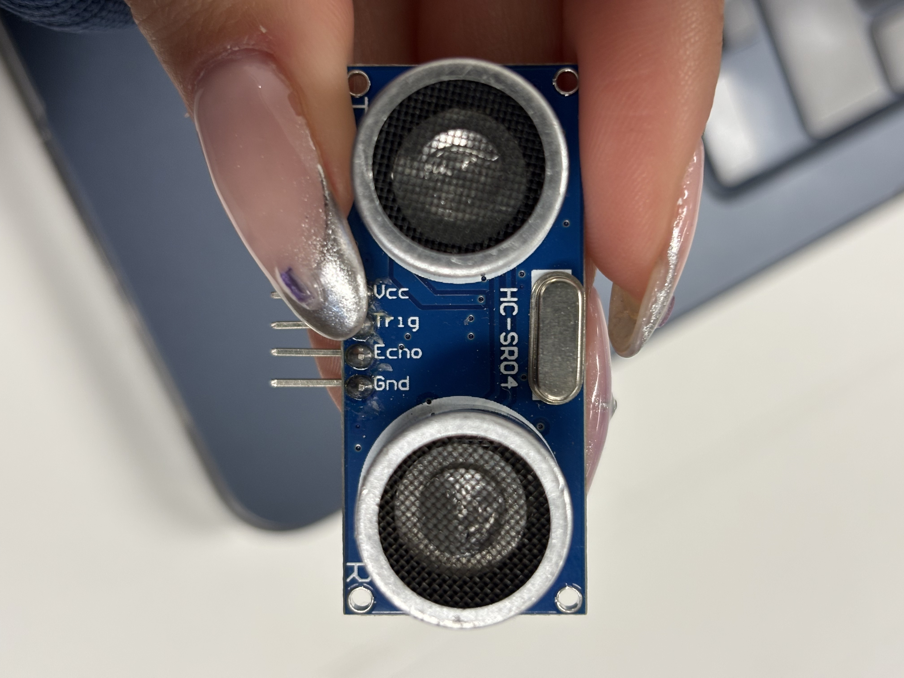
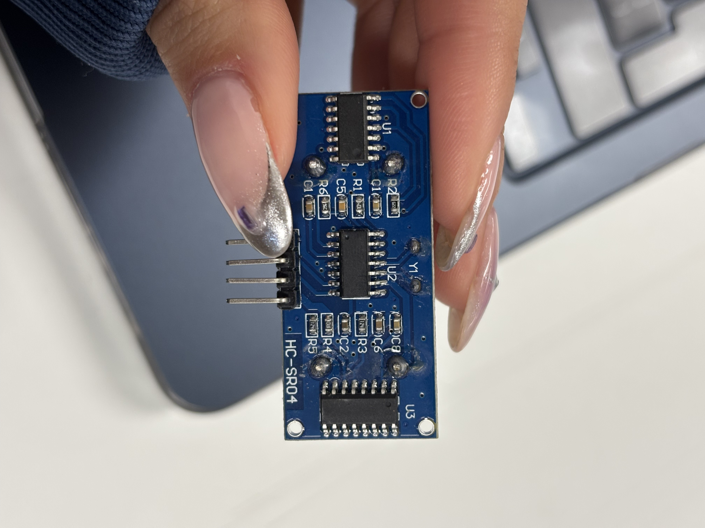
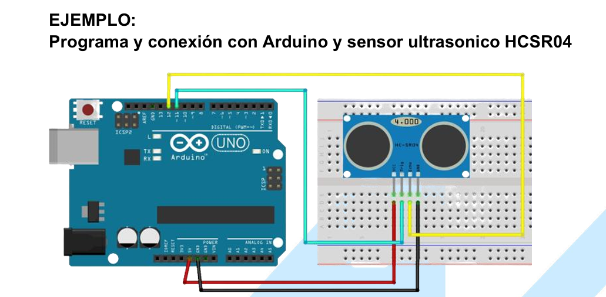
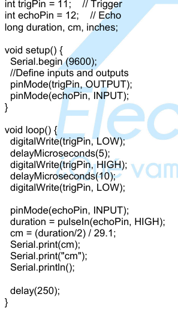

# sesion-06a 09/09

## Apuntes clase

### Scratch 

Es un software de programación. Estrategia de programar con bloques.
  
<https://scratch.mit.edu/>

### Pure data

Es un software para programar audios.
  
<https://puredata.info/>

- pd está programado en c++.
- Miller Puckette hizo nueva versión.
- **dac** : de digital a análogo.
- las cajitas que están arriba son entradas y las de abajo son salidas.
- si creo un pd se hace un subpach.
- la **~** es para la salida del sonido.
  
---

- max msp
- touchdesinger
- isadora software
- programación en estado de objetos
- [lauren lee mccarthy tools for improved social interacting](https://get-lauren.net/Tools-for-Improved-Social-Interacting)
- [renata gaui hysterical wearable](https://vimeo.com/215600031?fl=pl&fe=sh)
  
---
- Lint hacker proceso automatizado de limpieza/orden de estilos.
- yaml: tipo de lenguaje para configurar cosas “para decir las cosas son así”.
- lo que está un poquito mas adentro, es lo que está adentro.

---

### Ejemplo:

on

 Hay un espacio antes 

- En c++ son los murciélagos {}.
- Arduino controlled namaste gratin robot.
  
### Sensores y Actuadores

**Sensor**: entrada a nuestra caja negra.

Actuador: salida.

- obs
- Ultrasonico : emitir un pulso y detecta el ultrasonido y cuenta en cuanto se demora en devolverse.
- Sensor de temperatura y humedad:  atmosféricarica.
- Sensor de gas.
  
  Potenciometro 5 patas encoder rotatorio, no tiene límite.
  
- Sensores de humedad
- Sensor de lluvia, resistencia experimental -> Sensores pasivos. (Hay otro y se ocupa para el nivel del agua).

- Joistik

- Sensor de luz
  
Fotodiodo 

- Sensores de sonido
  
Tienen mic

## Encargo

Investigar sensor elegido en clases y buscar tres ideas de cómo utilizarlo.

### Sensor de proximidad HC­-SR04

- Capazdedetectar objetos y calcular ladistanciaalaque se encuentra en un rangode 2 a 450cm.

- El sensor posee dos transductores, un emisor y un receptor, piezoeléctricos.
  
- El funcionamiento de este es porque el emisor, piezoeléctrico, emite 8 pulsos de ultrasonido.
Luego, de recibir la orden en el pin TRIG, las ondas de sonido viajan en el aire y rebotan al encontrar un objeto, el sonido de rebote es detectado por el receptor piezoeléctrico.
Después,el pin ECHO cambia a Alto por un tiempo igual al que demoró la onda, desde que fue emitida hasta que fuedetectada.

---

- VCC -> +5V DC
- TRIG -> Disparo del ultrasonido
- ECHO -> Recepción del ultrasonido
- GND -> 0V

---

- En el pdf de "**ULTRASONIC-HC-SR04** sensor de distancia ULTRASONICOHC-SR04" sale un ejemplo de cómo conectarlo al arduino y programarlo.

### Referentes

- <https://www.alldatasheet.com/view.jsp?Searchword=Hcsr04&gad_source=1&gad_campaignid=1434060638&gbraid=0AAAAADcdDU_3WQz4u0DzpZeXNn-3MtZrJ&gclid=Cj0KCQjww4TGBhCKARIsAFLXndTs1R1fS00TREmq_0RvPVZ1qDk8mfWRS0penD4mX2Y5jNh88lqOTgaAmVzEALw_wcB>
- <https://agelectronica.lat/pdfs/textos/U/ULTRASONIC-HC-SR04.PDF>
- <https://proyectosinteresantes.com/10-proyectos-de-arduino-con-el-sensor-ultrasonico-hc-sr04/>

### Ideas de cómo utilizarlo
1. Al acercarse a distintas distancias haga sonidos distintos mediante un parlante, así poder jugar/crear distintas melodías.
2. Al detectar a alguien cerca se activa un motor y abre algo.
3. Que detecte a una persona en algun espacio y si no tiene presencia de nadie que se apaguen las luces.
