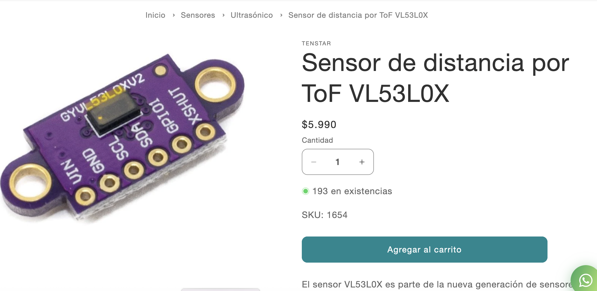

# sesion-06b 12/09

## Apuntes clase

Teloneo

- ` ffmpeg`:Colección de software libre que puede grabar, convertir y hacer streaming de audio y vídeo.
- ` mp4` : Para almacenar los formatos audiovisuales especificados por ISO/IEC.
- `mp`: Solo el audio, tipo podcast.
- `grep`: Permite buscar en texto.
- `videogrep`: Buscar en videos.
- `supercut`: Tipo de edición de video que consiste en un montaje de clips cortos con el mismo tema.
- `spaCy`: Librería de software para procesamiento de lenguajes. Programado en lenguaje Python.

### Tesis Mateo 

[matbutom](https://github.com/matbutom)

-Tipografía en la propaganda política chilena
- serif display, rotulos y sans serif.
- Se encarga de buscar las tipografias en todos los archivos
- `compilar`: Pasar de lenguaje legible de humano a máquina.
- `transpilar`: Compilar algo que estaba en python. eso hizo mateo.
- `shuffle`: Es un código para que no se repita a cada rato.
  
---

Importante:

- Encontrar comportamientos e intensionarlos.
- Primero escribir los comentarios y después programarlo.

### Tesis Janis 

[janisepulveda](https://github.com/janisepulveda)

- Neuralgía del trigemino, como desde el diseño podemos transformar lo invisible en algo visible.
-  Como desde el diseño podemos transformar algo invisible a algo visible.
-  Amuleto para ver el tema de las crisis.
-  [Flutter](https://flutter.dev/?utm_source=google&utm_medium=cpc&utm_campaign=brand_sem&utm_content=latam_latam&gclsrc=aw.ds&gad_source=1&gad_campaignid=13034410696&gbraid=0AAAAAC-INI_zdUFH-tcI12hAaTPWRbqpN&gclid=CjwKCAjwiY_GBhBEEiwAFaghvsei6-ya9YH7SR2JM56XgK4IHPnrq-MMlnvseSFaGbWq6hkgPWrkghoCk4cQAvD_BwE): Para crear apps. tiene acceso a materials de google, donde se puede utilizar iconografías y/o tipografías.
-  Está trabajando con `esp32` super mini.
-  `bluethooth low energy`, utiliza baja energía.
-  `BlE`: Se usa para cosas muy específicas. Solo se coneta a eso.
  
---

#### Ejercicio en clases

Especificar ideas, version iterada de nuestros compañeros.

Sensor de proximidad 

- Al acercercarse a un metro de distancia, te saluda con código morse, mediante el sonido de un parlante y al alejarse, de esa distancia, no emite el código.
   
1.  al arduino estará conectado al sensor de proximidad y un parlante.
2.  el cual si te acercas a un metro de distacia apróx. el parlante por código morse dirá la palabra "hola"
3. .... /_ _ _  / ._.. /._ //
4.  en cambio, si te alejas de la distancia predeterminada dejará de emirtir el sonido.

- Al acercarse habrá una cajita cerrada, la cual se abrirá y se mostrará un objeto saludando.

1. habrá una cajita cerrada con conexiones al arduino, al sensor de proximidad y a un motor.
2. cuándo te acerques a 30 cm. apróx.
3. el motor funcionará hasta cierto punto 90° apróx., para abirla.
4. y habrá un monito/objeto diciendo "hola".

- Al sentir la proximidad  de alguien el led se encenderá y la pantalla oled te dará la bienvenida con un "hola".
   
1. El arduino debe estar conectado a la pantalla oled y al sensor de proximidad.
2. El cual a sentir la proximidad de la mano de alguien.
3. La pantalla oled te dará la bienvenida y un hola. 

#### parte 2 del ejercicio, dividirlo en líneas 

Idea 1

Paso 1: hacer un código.

Paso 2: definir que a un metro de distancia emita el código morse

Paso 3: definir el código morse que diga hola. ... /_ _ _  / ._.. /._ //

Paso 4: colocar el arduino con conexión al parlante.

Paso 5: probar la distancia y la sensibilidad.

---

Idea 2

Paso 1: hacer un código.

Paso 2: definir que la cercanía de 30 cm. apróx.

Paso 3: definir que al tener esta distancia que se abra la cajita.

Paso 4: tener una cajita y colocarle el motor en una parte cómoda para que se abra la tapa.

Paso 5: conectar el sensor de proximidad, el motor al arduino.

paso 6: dibujar, crear un objeto/monito que diga "hola" mediante una gráfica.

---

Idea 3

Paso 1: hacer un código. 

Paso 2: definir que al pasar la mano cerca delo sensor.

Paso 3: definir que al tener esta distancia debe estar la mano.

Paso 4: conectar la pantalla oled. 

Paso 5: programar la pantalla para que diga hola.

Paso 6: La pantalla oled te dará la bienvenida y un hola.

Como retroalimentación en clases hay  que definir los tiempos y velocidades.

### Encargo 11

Investigar sensores vistos en clases, cotizarlos, encontrar referentes que los usen, y describir 3 pequeñas ideas que podamos aplicar a su proyecto-02 de máquinas de saludar.

#### Sensor de Temperatura y Humedad DHT11

El DHT11 es un sensor de temperatura y humedad digital de bajo costo.  Tiene un sensor capacitivo de humedad y un termistor para poder medir el aire que rodea el espacio y muestra los datos mediante una señal digital en el pin de datos.

- No tiene pines de entrada analógica.
- Tiene un rango de temperatura de 0° a 50°.

`Idea de saludo`

Si alguien entra a la sala o algún espacio cerrado, el dispositivo se activa y exclama: "¡Alarma de Ser Vivo! Te vi con mis ojos infrarrojos. ¡Quédate quieto!" Si el lugar queda vacío, cambia a un estado existencialista: "Me he quedado solo :("

#### Sensor Color RGB TCS3472

Sensor de color que mide RGB y luz total. Puede ser utilizado por microcontroladores o micro-computadores, para obtener los valores RGB del color de un objeto o luz frente al sensor.

Se conecta por I2C, tiene filtro IR, LED propio y permite ajustar medición y ganancia; detecta colores con alta precisión, incluso a través de vidrios.

Este sensor es un integrado completo que realiza un tratamiento digital de la medición de color

- Proporcionando los valores RGB y Clear
- Medición total sin filtrar
- Posee un filtro de infrarrojos, lo que mejora su precisión ante el ruido del entorno.
- Incorpora LED SMD de Luz Blanca y Filtro de Bloqueo IR.
  
`Idea de saludo`

Trata sobre si acercas alguún color  este parpadee con el color respectivo y que el parpadeo sea un hola en morse.

#### Sensor de distancia por ToF VL53L0X

El sensor de distancia por tiempo de vuelo es similar al de los sensores ultrasonido. Tiene un emisor laser que cada cierto tiempo emite un haz de luz, al encontrarse con un objeto la luz es reflejada, el sensor se encarga de medir el tiempo entre la emisión y la detección de la luz.

`Idea de saludo`

Si estás a más de metro y medio, la pantalla mostrará "zzz, No veo nada aqui!", como si estuviera dormido.

Al cruzar el umbral (a un metro, por ejemplo), se despierta con un salto "¡Hay algo! ¿Quién anda ahi?"

Finalmente, solo si te pegas a él, te da la bienvenida "¡Llegaste al fin! ¡HOLA!"

