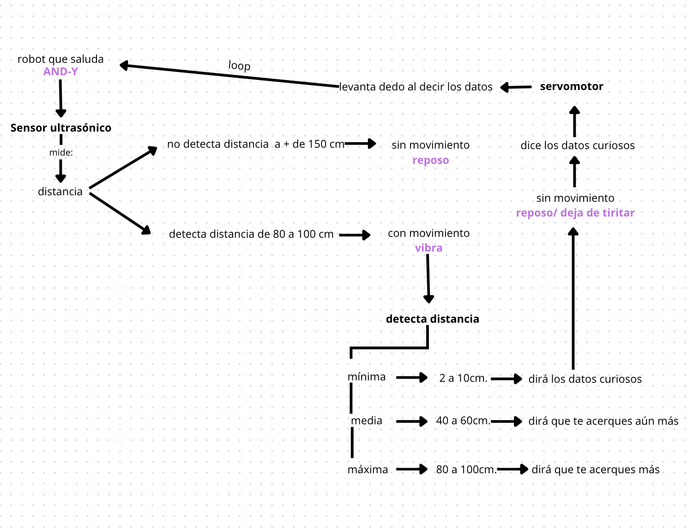

# sesion-07b 26/09

## Apuntes clase

Comisión Cynthia Shuffer

- Sensor ultrasónico [HC-sr04](https://afel.cl/products/sensor-de-ultrasonico-hc-sr04) 
- La velocidad del sonido en el aire, a 20°C, es de aproximadamente 343,2 metros por segundo (m/s), lo que equivale a 1234 km/h
 - Ejemplos de velocidad de sonido en diferentes medios:
 - Aire (a 15°C): 340 m/s (1224 km/h)
 - Agua (a 25°C): 1593 m/s
 - Madera: 3700 m/s
 - Acero: 6100 M/s
  
### Pseudocodigo

1. Intentar que el código se pueda ver completo en la primera pantalla
2. archivo.ino
3. creditos.ino
4. cableado.ino
   
### Archivo principal.ino

1 Usar bool para switch
2. variables con clases (.cpp/.h)
3. Usar booleanas para definir las variables, ej: Persona de 2 a 10 cm de distancia : true / false
   
### Pasos

Configurar sensor (ultrasónico en este caso) en archivo principal
Funciones con void
Quedaría en setup
Comentar lo que vamos hacer, que es lo que hará el código

```cpp
 void setup() {
  configurarSensoresActuadores();
 }
```

En void loop:

```cpp
void loop() {
  leerSensores();
  tomarDecisiones();
  actuar();
}
```

### Ultrasónico 

```cpp
 void configurarSensorUltrasonico() {
  // conectar la patita

  // definir la distancia minima
  // definir la distancia maxima

}
```
 
### sensoresActuador.ino

- sirve para configurar más sensores y actuadores

```cpp
  void configurarSensoresActuadores() {

  configurarSensorUltrasonico();

  // configurar mas sensores
  // configurar actuadores
  }

  void leerSensores() {}

  void tomarDecisiones() {}

  void actuar() {}
```

---

#### Proyecto-02

- Máquina de datos curiosos

- 1- Cuando el robot detecte una presencia, comenzará a temblar (de nervios) mediante el motor DC el tembleque aumentará entre más cerca estés.
- 2- El sensor detectará presencia en 3 instancias: 2 - 15cm, 80 - 100cm, 80 - 150cm
- 3- En cada parámetro la máquina reproduce un audio de voz distinto mediante la microSD en el reproductor MP3 y el altavoz.
- 4- Los parametros son:
  - 80 - 150cm = Te "grita" que vengas diciendo: "HOLA HUMANO, VEEEN!"
  - 80 - 100cm = Te grita de nuevo pidiendo que te acerque más, diciendo: "HOOLAA, MÁS CERCA!"
  - 2 - 15cm = Levanta un "dedo" usando el servo motor, este se moverá de los 0 grados a los 180 mientras estés a esa distancia. Al mismo tiempo te dirá algún dato interesante como "El maní es una legumbre, no un fruto seco.”


- Componentes a utilizar:
  
 - Sensor ultrasónico
 - Servomotor
 - Arduino R4 minima
 - Altavoz
 - Reproductor MP3
 - Motor DC (motor vibrador)

---

### Encargo 14 y 15

Cada persona del grupo debe implementar en diagrama de flujo dibujado o con la herramienta Mermaid.js con sus propias palabras y subirlo a su README.

Cada persona del grupo debe subir a su README: documentar funcionamiento de sus sensores, incluyendo instrucciones de conexión y de configuración, subir el proyecto entero de arduino como carpeta, tiene que poder compilar sin problema y mostrar en consola los datos de los sensores.

### Encargo 14



### Encargo 15

#### Sensor ultrasónico HC-sr04

Este código lo realizó Nicolas Miranda, el cual un día estuvimos trabajando juntos en busqueda de sensores y logró este. Lo mando por whatsapp.

```cpp
#include <Wire.h>
#include <Adafruit_GFX.h>
#include <Adafruit_SSD1306.h>

// Configuración de la pantalla OLED
#define SCREEN_WIDTH 128
#define SCREEN_HEIGHT 64
#define OLED_RESET    -1  
Adafruit_SSD1306 display(SCREEN_WIDTH, SCREEN_HEIGHT, &Wire, OLED_RESET);


const int TRIG_PIN = 11; // Pin TRIG del sensor
const int ECHO_PIN = 12; // Pin ECHO del sensor
long duration;
float distanceCm;

void setup() {
  // Inicialización de la pantalla OLED
  if (!display.begin(SSD1306_SWITCHCAPVCC, 0x3C)) { 
    Serial.println(F("Error al iniciar la pantalla OLED"));
    while (true);
  }
  display.clearDisplay();
  display.setTextColor(SSD1306_WHITE);
  
  // Configuración del sensor ultrasónico
  pinMode(TRIG_PIN, OUTPUT);
  pinMode(ECHO_PIN, INPUT);


  // Inicialización de la comunicación serial
  Serial.begin(9600);
}

void loop() {
  // Enviar pulso de ultrasonido
  digitalWrite(TRIG_PIN, LOW);
  delayMicroseconds(2);
  digitalWrite(TRIG_PIN, HIGH);
  delayMicroseconds(10);
  digitalWrite(TRIG_PIN, LOW);

  // Leer la duración del pulso de retorno
  duration = pulseIn(ECHO_PIN, HIGH);
  
  // Calcular la distancia en cm (velocidad del sonido = 343 m/s)
  distanceCm = duration * 0.0343 / 2;

 display.clearDisplay(); 
  display.setTextSize(1);
  display.setCursor(0,20);

  // Mostrar mensaje según la distancia
  if (distanceCm < 10) {
    display.println("Hola");
  }
  else if (distanceCm < 40) {
    display.println("Quien anda ahi?");
  }
  else if (distanceCm < 100) {
    display.println("Ah eras tu");
  }
  else if (distanceCm < 130) {
    display.println("Zzz.. nadie");
  }
  else {
    display.println("Oh ya te fuiste :c");
  }


  display.display(); // Actualizar la pantalla
  delay(500); // Esperar 500 ms
  }
```

Código es el que modificamos y final

```cpp
//SENSOR ULTRASÓNICO
const int TRIG_PIN = 11;   // Pin digital 11 para el Trigger del sensor
const int ECHO_PIN = 12;   // Pin digital 12 para el Echo del sensor

// definir la distancia minima de 2 a 10 cm
// definir distancia media de 40 a 60 cm
// definir la distancia maxima de 80 a 100 cm
// Tiempo de reposo cuando no siente presencia 

long duration;
float distanceCm;

// Configurar pines del sensor ultrasonico
void configurarSensorUltrasonico() {
  pinMode(TRIG_PIN, OUTPUT);
  pinMode(ECHO_PIN, INPUT);
  Serial.begin(9600);
}

// Medir la distancia y devolverla
float medirDistancia() {
  digitalWrite(TRIG_PIN, LOW);
  delayMicroseconds(2);
  digitalWrite(TRIG_PIN, HIGH);
  delayMicroseconds(10);
  digitalWrite(TRIG_PIN, LOW);

  // Leer la duración del pulso de retorno
  duration = pulseIn(ECHO_PIN, HIGH);
  // Calcular la distancia en cm (velocidad del sonido = 343 m/s)
  distanceCm = duration * 0.0343 / 2;

  // Mostrar distancia medida en el monitor serial
  Serial.print("Distancia: ");
  Serial.print(distanceCm);
  Serial.println(" cm");

  return distanceCm;
}
```

El sensor ultrasónico se conecta a los siguientes pines: 

- Trig: pin 11
- Echo: pin 12
- GND
- VCC
  
#### Altavoz

Este es el código que encontró Janis y Mateo para el reproductor MP3 y lo mandaron por el discor de taller para que lo utilizaramos y modificaramos.

```cpp
#include "Arduino.h"
#include "DFRobotDFPlayerMini.h"

#if (defined(ARDUINO_AVR_UNO) || defined(ESP8266))   // Para placas tipo UNO o ESP8266
#include <SoftwareSerial.h>
SoftwareSerial mp3Serial(4, 5); // RX, TX
#define MP3_SERIAL mp3Serial
#else
#define MP3_SERIAL Serial1
#endif

DFRobotDFPlayerMini mp3Player;

// Inicializar el reproductor MP3
void configurarMP3() {
  MP3_SERIAL.begin(9600);
  Serial.println(F("Inicializando DFPlayer..."));

  if (!mp3Player.begin(MP3_SERIAL, true, true)) {
    Serial.println(F("⚠️ Error: No se pudo iniciar el DFPlayer."));
    Serial.println(F("1. Revisa las conexiones (RX/TX)."));
    Serial.println(F("2. Asegúrate de que la SD esté insertada."));
    while (true) { delay(100); }
  }

  Serial.println(F("🎶 DFPlayer Mini listo."));
  mp3Player.volume(25); // volumen 0–30
}

// Reproducir audio según distancia medida
void reproducirAudioPorDistancia(float distancia) {
  static int ultimoAudio = 0; // evita repetir el mismo audio constantemente

  if (distancia >= 2 && distancia <= 18) {
    // Rango corto: audios 3–8
    int audio = random(3, 8); // random entre 3 y 8 (el límite superior no se incluye)
    if (audio != ultimoAudio) {
      mp3Player.play(audio);
      Serial.print("Reproduciendo datos");
      Serial.println(audio);
      ultimoAudio = audio;
    }
  } 
  else if (distancia >= 40 && distancia <= 60) {
    // Rango medio: audio 2
    if (ultimoAudio != 2) {
      mp3Player.play(2);
      Serial.println("Reproduciendo audio 2");
      ultimoAudio = 2;
    }
  } 
  else if (distancia >= 80 && distancia <= 100) {
    // Rango largo: audio 1
    if (ultimoAudio != 1) {
      mp3Player.play(1);
      Serial.println("Reproduciendo audio 1");
      ultimoAudio = 1;
    }
  } 
  else {
    ultimoAudio = 0; // fuera de rango: reinicia estado
  }
}
```

#### Motor DC / Motor de vibración

Este es el código cpp, pero todavía no sabemos si funciona 

```cpp
#include "SalidaMotorVibracion.h"

//Constructor
SalidaMotorVibracion::SalidaMotorVibracion() {}

//Destructor
SalidaMotorVibracion::~SalidaMotorVibracion() {}

//Configuración inicial 
void SalidaMotorVibracion::configurar() {
  pinMode(TRIG_PIN, OUTPUT);
  pinMode(ECHO_PIN, INPUT);
  pinMode(MOTOR_PIN, OUTPUT);
  Serial.begin(9600);
}

//Medición de distancia con sensor ultrasónico
float SalidaMotorVibracion::medirDistancia() {
  digitalWrite(TRIG_PIN, LOW);
  delayMicroseconds(2);
  digitalWrite(TRIG_PIN, HIGH);
  delayMicroseconds(10);
  digitalWrite(TRIG_PIN, LOW);

  duracion = pulseIn(ECHO_PIN, HIGH);
  distanciaCm = duracion * 0.0343 / 2;
  return distanciaCm;
}

// Actualiza la vibración según la distancia
void SalidaMotorVibracion::actualizar() {
  float distancia = medirDistancia();

  if (distancia >= minCercana && distancia <= maxCercana) {
    intensidad = 0;           // No vibra
  } 
  else if (distancia >= minMediana && distancia <= maxMediana) {
    intensidad = 255;         // Vibra mucho
  } 
  else if (distancia >= minLejana && distancia <= maxLejana) {
    intensidad = 100;         // Vibra poco
  } 
  else {
    intensidad = 0;           // Fuera de rango, no vibra
  }

  analogWrite(MOTOR_PIN, intensidad);

  Serial.print("Distancia: ");
  Serial.print(distancia);
  Serial.print(" cm  |  Intensidad: ");
  Serial.println(intensidad);

  delay(100);
}
```

Este es el código .h que tampoco sabemos si funciona, no lo hemos subido al .ino como tal

```cpp
#ifndef MOTOR_VIBRACION_H
#define MOTOR_VIBRACION_H

#include <Arduino.h>

class SalidaMotorVibracion {
public:
  SalidaMotorVibracion();       // Constructor
  ~SalidaMotorVibracion();      // Destructor

  void configurar();         // Configura los pines
  void actualizar();         // Mide distancia y ajusta vibración
  float medirDistancia();    // Función auxiliar

private:
  // Pines
  const int TRIG_PIN = 11;
  const int ECHO_PIN = 12;
  const int MOTOR_PIN = 9;

  // Rangos de distancia (en cm)
  float minCercana = 2;
  float maxCercana = 10;

  float minMediana = 40;
  float maxMediana = 60;

  float minLejana = 80;
  float maxLejana = 100;

  // Variables internas
  long duracion = 0;
  float distanciaCm = 0;
  int intensidad = 0;
};

#endif
```

#### Servomotor

Este ejemplo de código lo sacó Vania de Gemini Ai

```cpp
  #include <Servo.h>

Servo myservo;  // Crea un objeto servo
int servoPin = 13; // El pin al que conectamos el cable de señal del servo

void setup() {
  myservo.attach(servoPin); // Vincula el objeto servo al pin 9
}

void loop() {
  myservo.write(0);   // Gira el servo a 0 grados
  delay(1000);        // Espera 1 segundo
  myservo.write(90);  // Gira el servo a 90 grados
  delay(1000);        // Espera 1 segundo
  myservo.write(180); // Gira el servo a 180 grados
  delay(1000);        // Espera 1 segundo
}
```

Este código fue el que ordenó Aarón

```cpp
#include "SalidaDedo.h"

SalidaDedo::SalidaDedo() {}

SalidaDedo::~SalidaDedo() {}

void SalidaDedo::configurar() {
  servo.attach(SalidaDedo::patitaServo);
  // posicion inicial 0 grados
  servo.write(0);
}

void SalidaDedo::levantar() {
  // 180 grados
  servo.write(180);
}

void SalidaDedo::bajar() {
  //0 grados
  servo.write(0);
}
```

```cpp
#include <Servo.h>

Servo dedo;// Crear objeto servo
const int SERVO_PIN = 13;

// Configurar servo motor
void configurarServo() {
  dedo.attach(SERVO_PIN);
  dedo.write(0); // posición inicial 0°
}

// Levantar dedo
void levantarDedo() {
  dedo.write(180);
}

// Bajar dedo
void bajarDedo() {
  dedo.write(0);
}
```

El servomotor empieza en 0° y cuando se levanta el dedo termina en 180°

Pin a conectar:

- Cable Café: GND
- Cable Rojo: VCC
- Cable Amarillo: pin 13
