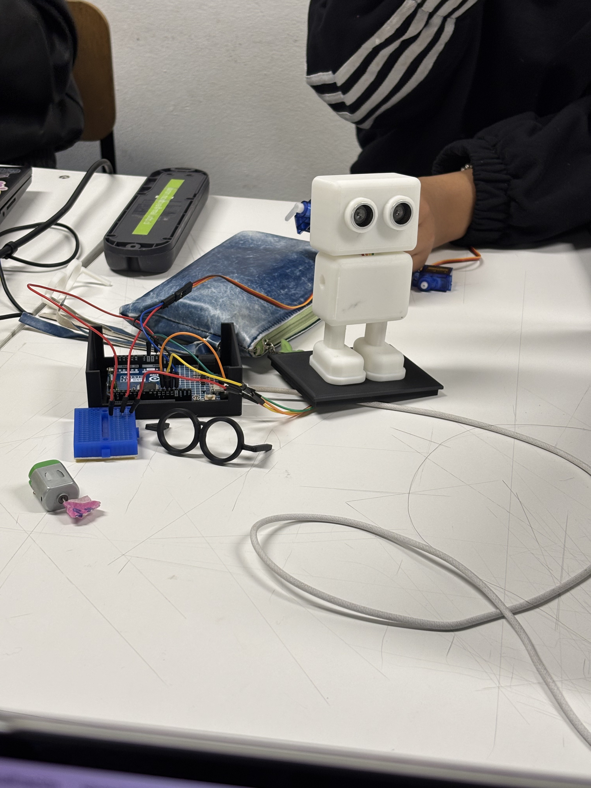
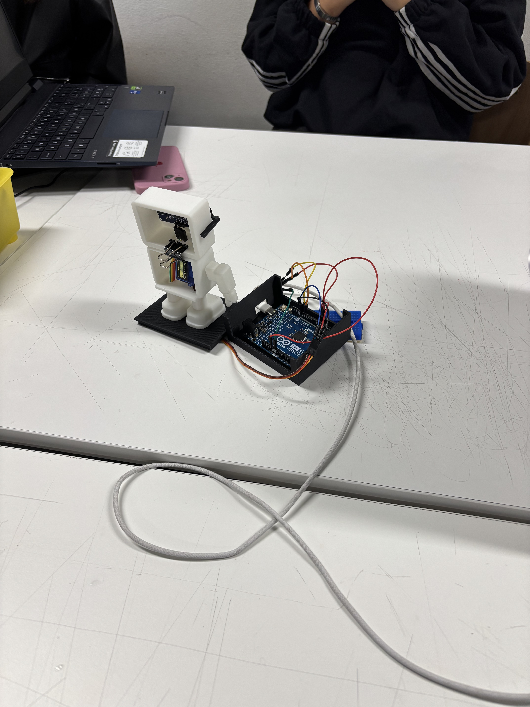
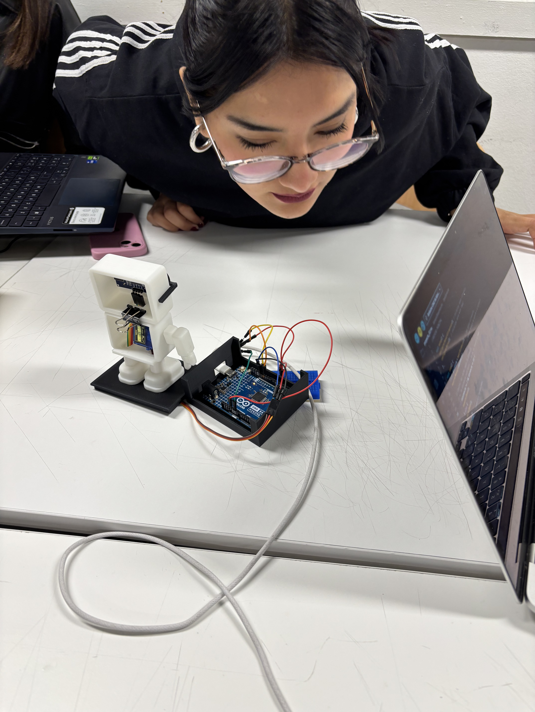
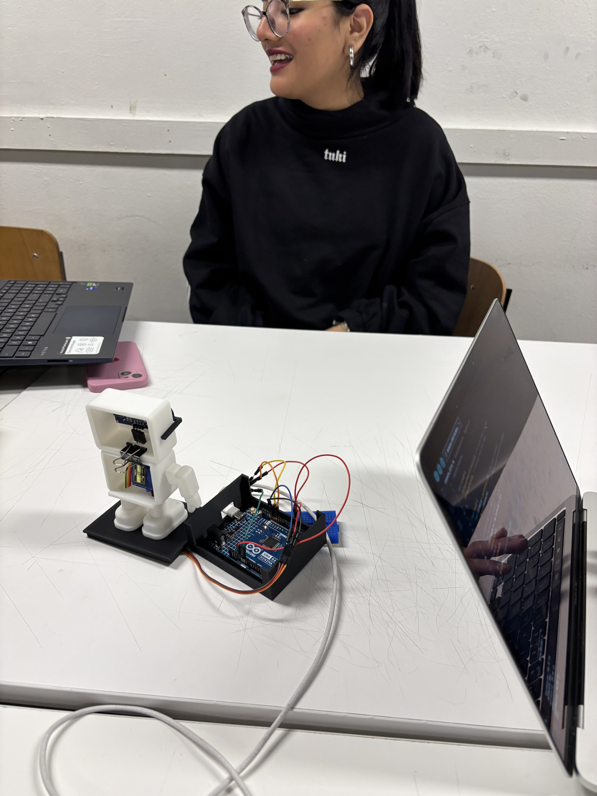

# sesion-09a 07/10

## Retroalimentación

- Configuramos la manito del robot, ya que debiamos cambiar el ángulo para que quede recto para arriba (180°) y no sea facista.
- Cambiamos las distancias el sensor ultrasónico a 18cm para que tenga mayor rango de medición.
- El servomotor solo llega a 180°, por alguna razón no lo levantaba compretamente asi que, movimos un poco pas adelante para que quede arriba.

`Archivo.ino que creó el profe para nosotras.`

En clases el profe Aarón, nos creó un archivo del código que teníamos, separó cada  uno en `.cpp` y `.h`, nos falta para que compilen colocar entre ambos la carpeta `.ino`.
  
1. incluir archivos h (fórmula)
2. instrtancias de las clases, programación estado de objetos. Es la variable pero en difícil
3. `ultrasonico.configurar();`
4. `dedo.configurar();` porque extisten dentro de
5. ambas clases no saben que existen entre si
6. hoy ocultaremos/ordenaremos los codigos
7. orden de ultrasonico a
8. ver si queremos que en la consola se muestre
9. `<>` son para que esté desde el computador
10. en la clase siempre viene  el punto y coma `};`
11. `{}` es para  crear las promesas
12. `void EntradaUltrasonico:: configurar()` aquí está la complejidad
13. `Servo servo;` tiene una clase que dentro tiene otra clase

- ordenar códigos
- hacer diagrama de flujo
- en carpeta docentes, grupo-01 colocar toda nuestra información.
- entrada `ultrasonico.cpp`
- el `.ino` solo tendrá comentarios

---

- cuando el sensor hace todo lo que debe hacer  bool estaCerca=false;

- Le colocamos nombre a nuestro robot  el cual es RAMón

- ver como hacer que vibre el moto DC y ver como colocar el parlante en la carcasa

### Trabajo en clases

Avanzamos en la unión de los códigos para ver cómo interactuaban los sensores y componentes con nuestro robot. Dentro de este nos ocurrió el problema de que reproducía audios de manera aleatoria y no los reproducía por completo.

Por otra parte, ajustamos el volumen del audio del código, el ángulo que debe rotar el motor (dedo) que es 180° y la distancia para que levante la mano con el ultrasonico sea de 2 cm a 18 cm.

Los parametros son:

En cada parámetro la máquina reproduce un audio de voz distinto mediante la microSD en el reproductor MP3 y el altavoz.

80 - 100cm = Te "grita": "Hola humano ¿Por qué estás tan lejos? Acércate." `hola1.mp3`

40 - 60cm = Te grita nuevamnente pidiendo que te acerque más: "Hola! No seas timido, ven más cerca, no tengo virus... creo jiji" `hola2.mp3`

2 - 10cm = Levanta un "dedo" usando el servo motor, este se moverá de los 0° a los 180° mientras estés a esa distancia. Al mismo tiempo te dirá el `dato1, 2, 3, 4,5 o 6.mp3`

`dato1`: "¿Sabías qué? El primer mause era de madera... Seguro también servía de leña jajaj"

`dato2`: "¿Sabías qué? El error 404 es mi manera de hacerme el leso... jajaja"

`dato3`: "¿Sabías qué? La nube no existe, son computadores de otro... pero no se lo digas a nadie"

`dato4`: "¿Sabías qué? Los datos nunca se borran, solo se esconden... igual que tus calcetines"

`dato5`: "¿Sabías qué? Apagar y prender arregla todo, y sino, un golpecito y como nuevo"

`dato6`: "¿Sabías qué? El porcentaje exacto de 99,999999999999... Nah, inventé jajaja pero aún sigues aquí ¿no?"

