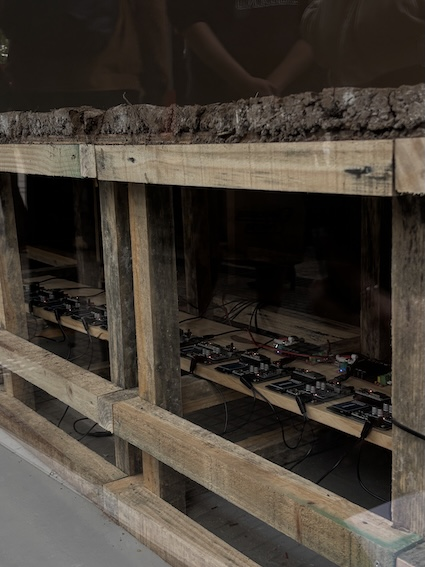
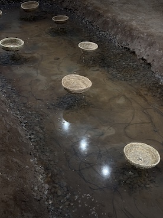
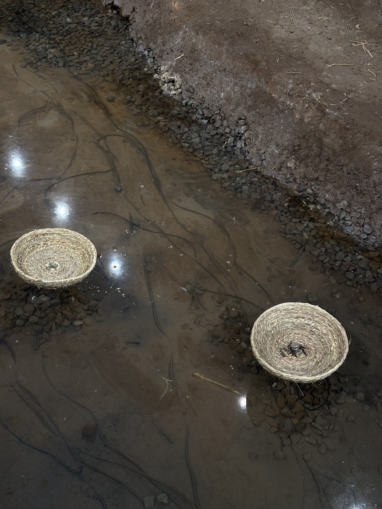
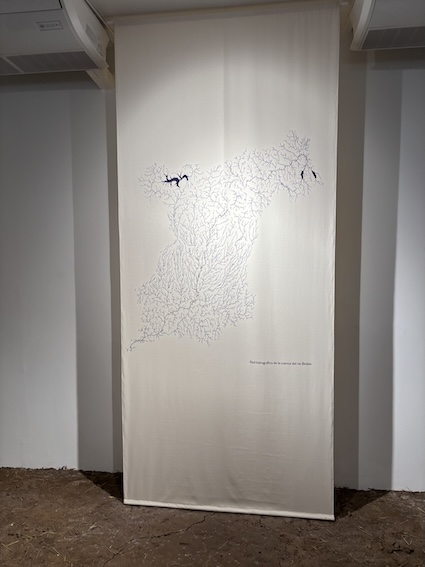

# sesion-11b 24/10

## Apuntes clases

- Máquinas de lenguaje
- Máquinas de felicidad
- Máquinas transductoras -> convertirr E° en otra.
- Máquinas sentimentales
- Chewing the apple of your  eye -> sentimiento. es una metáfora.
- Ontología Orientada a Objetos (OOO).
  
### Grahad Harman

Filósofo reciente, actual. El enemigo de Harman es el lenguaje. Dice que la realidad existe. Dependiendo de cómo llamemos las cosas igualmente estan.

Es parte de la corriente filosófica de la cosmología. "La tercera mesa" ¿Qué es una mesa?. 

Tiene cualidades **materiales y relaciones.** -> Reduccionismo: Es que las relaciones son lo overmining y sus materiales son undermnining y en el medio esta la mesa real (aparrecen cuando fallan) por eso se dise que un buen diseño pasa desapercibido.

¿Porqué empieza "la tercera mesa?

Es porque Harman quiere definir que es la mesa, (el medio que hablamos antes) de ahí sale la Ontología Orientada a Objetos. Asíntota.

Cómo llegamos a la mesa real: mediante la filosofía y el arte (como son) -> metáforas.

Tiene cualidades no escenciales, en este caso son sus accidentes y escenciales, no lo sabemos. La escencia de los objetos es inaccesible.

### ¿Qué similtud tiene con lo que hicimos en el proyecto 02?

- Funciones -> método (OOP).
- Metaclases -> variables, atributos (OOO).
- Cuando diseñamos pensamos en estas ambas dimensiones. factura y materialidad/escenciales y no escenciales.
- Cómo resolver diseño.
  
### Encargos

- Cada persona debe subir una investigación detallada de la obra artística de Claudia González Godoy, con énfasis en su investigación sobre ríos, incluyendo información sobre premios, exposiciones, colaboradores, estudios y referencias en su obra.
- Cada persona debe subir taxonomía detallada de sensores, actuadores, software y hardware utilizado en 1 obra exhibida en la Bienal de Artes Mediales 2025, citando correctamente a las fuentes
Metáforas -> uno puede proponer como hablar de la mesa. Según Harman las metáforas consisten en conectar dos cualidades no escenciales de objetos distintos.

#### Claudia González Godoy

[CGG](https://www.claudiagonzalez.cl/cgg/)

Artista medial independiente y gestora de proyectos educativos en arte y tecnología, a explorado las relaciones entre arte, ciencia, naturaleza y tecnología, tanto en su labor como artista y docente. Su trabajo forma parte de colecciones nacionales e internacionales como MINCAP Chile, ifa Galelery y ZKM Karlsruhe en Alemania, y ha participado en festivales y bienales internacionale como Tsonami, FILE Brasil y la Bienal de Artes Mediales.  

desarrolla su serie “Hidroscopias”, y el proyecto se titula **Hidroscopia / Biobío.]** Explora el río Río Bío‑Bío desde su nacimiento hasta su desembocadura, investigando cómo las intervenciones humanas; presas, embalses, extracción de agua, cómo alteran su flujo, sonido, memoria y vida ecosistémica.

 COn una combinación de arte, tecnología, trabajo de campo y colaboración con comunidades locales, la obra articula materialidades (cerámica, textil, agua, tierra) con instalaciones sonoras
 
<https://artishockrevista.com/2025/09/14/claudia-gonzalez-godoy-hidroscopias/>

Galería Gabriela Mistral, Decantaciones y Resonaciones ¿Dónde nace y termina el rumor del río?

