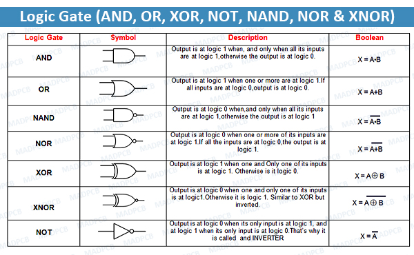

# sesion-03a

Martes 19 de Agosto, 2025

Nota del día: El viernes pasado fue feriado así que de momento siento que sigo perdida con lo que vemos. 

## Qué aprendí hoy

### Aspectos generales

- **command t:** se ordena en el arduino.
- **Serial.println:** Imprime en otra línea.
- **Serial.print:** Imprime en la misma línea.
- **setup:** ocurre solo1 vez.
- los () van pegados a las palabras que esten antes.
- **Valor en mayúscula:** Constante-
- **Valor en minúscula:**
- cuando se debe escribir una frase o más de una palabra dentro de un () se escriba juntan, sin separación pero al inicio de la siguiente palabra se empieza con mayúscula y despues se escribe la palabra normal.

ejemplo: `cantidadAlumnos`

- **==** signfica true false, si es verdad o no.
- no usar la letra Ñ o tildes en los códigos. 

### Condicionales

Sirve para que el programa haga una cosa u otra dependiendo de cada situación.

```cpp
if (Boolean condition) THEN
    (consequent)
else
    (alternative)
// entonces, todo lo que pongamos aquí se cumplira
// siempre que se cumpla la condición
```

- **if:** Si pasa algo funciona. Es como si tuviera mas opciones. Para hacer o no hacer cualquier código.
- **else:** en otro caso. 
    - puede ser que con el else no pase nada. 
    
- cuando la condición se cumple, ¿qué es lo que hago?
- Se puede escribir una condición dentro de otra.
- condición binaria o bifurcación.

La condición es la que hará que se ejecute el código que hay entre las llaves. Si es verdadera, el flujo del código de Arduino entrará dentro de las llaves y ejecutará todo lo que hay dentro. Esto, entendiendo a la condición algo que puede ser evaluado como verdadero o falso. 

posibles variaciones: 
- if -> then -> end.
- if -> else -> if -> then -> end or else -> end.

Ejemplos: 

```cpp
if(saldo>250){
 abrirTorniquete();
}else{
 Serial.println("SALDO INSUFICIENTE")
} 
```

```cpp
if (estaLloviendo == true) {
    hacerSopaipillas();
}
else {
    salirAAndarEnBici();
}
```

```cpp
// Si no hay araña, reacciono tranqui

if (!hayArana) {
    reaccionarTranqui();
}
else {
    chillar(volumen = infinito);
}
```

```cpp
// si mi edad es igual o mayor a 18
// y es menor a 80
if (edad >= 18 AND edad < 80){
// puedo conducir
    puedoConducir();
}
```

```cpp
// !
if (diciembre AND donFrancisco AND !godZilla AND !lecciones){
    teleton;
}
```

### Operadores lógicos

Es un circuito electrónico que opera con una o más señales para obtener un output.

- **AND:** inputs mutuamente dependientes -> & - debe cumplir todo, solo pasa si todas las variables estan ya que **dependen** entre si. En el código se pone en mayúsculas.
- **OR:** inputs independientes -> | | - debe cumplir alguna, se llega a un resultado cuando alguna de las variables está pasando. es **independiente**. 
- **NOT:** es un inversor -> ! - si funciona "a", "b" no funciona, si funciona "b", "a" no funciona; cada variable funciona en base a que su contraparte no lo haga. Hace lo contaria que haga la otra variable, es un **inversor**. 
   - "a" abajo, "b" arriba.
   - "a" arriba, "b" abajo.
     
Not se usa cuando tengo que detectar la ausencia de algo. 

ej: quiero saber si esta temblando.
!terremoto  

### Iteradores

- **INT** = iterar: repetir pero no en loop. Aunque puede ser indefinidamente, cuantas veces yo quiera. 

For: Es la iteración. Se usa para ejecutar un bloque de código un número específico de veces

entonces, se itera con for, se pone entre paréntesis 3 cosas importantes:

1. partida
2. término
3. actualización

y entre murciélagos {} lo que queremos iterar

```cpp
int veces;

for (parto; termino; qué hago en cada paso);
{
    hazEsto();
} 
```
ejemplo: 

```cpp
int numEstudiantes = 29;

void setup() ;

// activa el monitorSerial 
  Serial.begin(9600);

  Serial.begin(9600);

  for (int i = 0; i < numEstudiantes; i++) {
    // imprime "estudiante:"
    Serial.print("estudiante:");
    // imprime un espacio luego de "estudiante:"
    Serial.print(" ");
    // si numEstudiante es menor que 10
    // agrega un espacio antes del número
     if (i < 10) {
    Serial.print(" ");
   }
    // si i es 13 que no aparezca
    if (i != 13) {
    Serial.print(i);
    }
    // imprime el numEstudiantes
    Serial.print(i);
    // imprime un enter
    Serial.print("\n");
    delay(500)
  }
}
```

## Encargo 

Investigar: NAND, XNOR, XOR, NOR. 

- **NAND:** Tiene dos o más entradas y una salida.

Es complementaria a la función AND. Una puerta NAND produce una salida de 1 (verdadero) a menos que todas sus entradas sean 1. 

En ese caso específico (todas las entradas en 1), la salida es 0 (falso). 

se usan en la construcción de circuitos digitales. La puerta NAND es una puerta lógica universal que, junto con las puertas NOR, permite construir cualquier otro circuito lógico digital.


- **NOR:** Tiene dos o más entradas y sólo una salida.

Es el complemento de la función OR. Es una combinación de las compuertas OR y NOT, es la versión inversa de la compuerta OR.

Al tener sus entradas en estado inactivo “0” su salida estará en un estado activo “1”, pero si alguna de las entradas pasa a un estado binario “1” su salida tendrá un estado inactivo “0”.

- **XOR:** Tiene de salida 1 verdadero, cuando ambas entradas son opuestas es verdadero o 1.

Si ambas entradas son iguales es falso o 0. Es un operador bit a bit representado por el símbolo "^", que compara los bits de dos números

El operador XOR compara los bits de dos números de forma individual.

Si un bit es 1 y el otro es 0, el resultado es 1.

Si ambos bits son iguales (ambos 1 o ambos 0), el resultado es 0.

- **XNOR:** Produce 1/verdadero solo cuando el voltaje de las dos entradas es el mismo.

Las entradas opuestas tienen salida 0/falso. 

Es un componente lógico digital que es una puerta XOR pero con la lógica invertida, produce una salida alta (1 lógico) solo cuando ambas entradas son iguales (ambas altas o ambas bajas). Por lo tanto, si las entradas son diferentes (una alta y otra baja), la salida de la puerta XNOR será baja (0 lógico).




### Bibliografía

Descubre Arduino. (2020, 9 de diciembre). Puertas lógicas. Descubre Arduino. <https://descubrearduino.com/puertas-logicas/>

TechTarget. (s.f.). Logic gate: AND, OR, XOR, NOT, NAND, NOR and XNOR. TechTarget. <https://www.techtarget.com/whatis/definition/logic-gate-AND-OR-XOR-NOT-NAND-NOR-and-XNOR>

