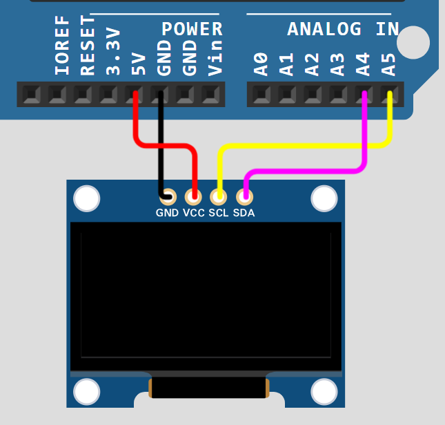
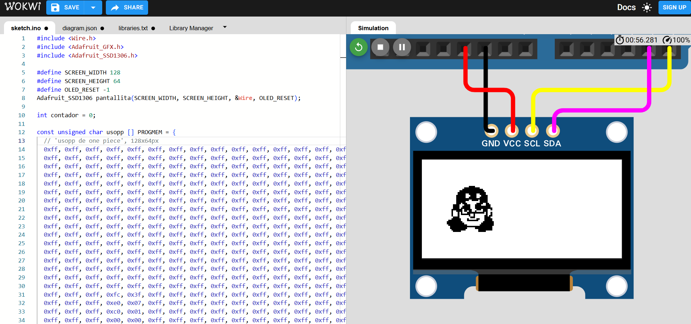
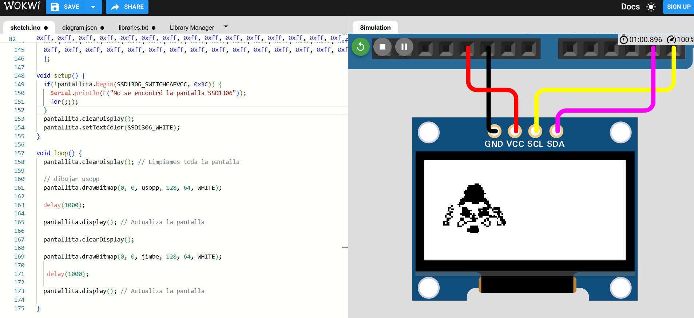

# sesion-03b

Viernes 22 de Agosto - 2025

Nota del día: a pesar de que no estabamos presencial disfrute mucho la clase, me encanto lo que se logra con la pantallita. 

## Referentes

- Mouser.cl
- DspaceMIT
- **Daniel Cruz** (artista electrónico)
- Limor Fried alias **LadyADA** (ingeniera eléctrica estadounidense y dueña de la compañía de electrónicos Adafruit Industries. Es influyente en la comunidad de hardware libre, participó en la Primera Reunión de Hardware Libre y en la redacción de la definición de Hardware Libre. - es una persona muy cool, me encanta su cabello)
- **Adafruit - Adafruit.com** (empresa de hardware de código abierto con sede en Nueva York, Estados Unidos. La empresa diseña, fabrica y vende productos electrónicos, componentes electrónicos, herramientas y accesorios.)
- Wokwi (simulador de eletrónica en línea - lo utilizamos durante la clase)
- image2cpp (página para convertir fotos a código de arduino, especificar el tamaño y en caso de algo escalar hasta que calce)

## Qué aprendí hoy

### Pantallas

Para elegir una pantalla, necesitamos tener en cuenta: 
- la resolución, cantidad y la densidad de los pixeles, ya que el número de pixeles individuales son capaces de verse en una dimensión.

Finalmente, una pantalla son muchos LEDS ordenandos, aunque también existen pantallas que solo hacen carácteres.

- Utilizaremos la pantalla SSD1306 OLED, que utiliza el chip 1306, esta pantalla solo recibe información, no entrega.
     - tamaño: 128 x 64 px

Conexiones pantalla al ARDUINO: 

- VCC: carga positiva.
- GND: carga negativa o tierra.
- SCL: signal clock, clock line, determina el pulso del tiempo.
- SDA: signal data, data line.

A la hora de trabajar debemos preocuparnos de revisar la alimentación que se necesita; con la pantalla y el arduino r4 minima es de 3.3 v.



### información general
 
i2C: comunicación synchronous, protocolo que permite conectar las cosas entre si, permite conectar dos cosas entre si

- Instalar SSD1306 en la app Arduino
- Adafruit GFX library
  
*¿Cómo descargar biblioteca en arduino?*

- Buscar en el buscador de bibliotecas, GFX adafruit GFX library.
- SSD1306 (lo más reciente)
- 128 x 64_I2C.ino
- I2C es la resolución que estamos usando
- 0x3C: default value
- I2c: hay que corrobar la dirección


## Códigos visto en clase

```cpp
#include <Wire.h>
#include <Adafruit_GFX.h>
#include <Adafruit_SSD1306.h>

#define SCREEN_WIDTH 128
#define SCREEN_HEIGHT 64
#define OLED_RESET -1
Adafruit_SSD1306 pantallita(SCREEN_WIDTH, SCREEN_HEIGHT, &Wire, OLED_RESET);

int contador = 0;

void setup() {
 if(!pantallita.begin(SSD1306_SWITCHCAPVCC, 0x3C)) {
   Serial.println(F("No se encontró la pantalla SSD1306"));
   for(;;);
 }
 pantallita.clearDisplay();
 pantallita.setTextColor(SSD1306_WHITE);
}

void loop() {
 pantallita.clearDisplay(); // Limpiamos toda la pantalla
 pantallita.setTextSize(2); // Tamaño de texto más grande
 String mensaje = "Contador:";
 int16_t x1, y1;
 uint16_t w, h;
 
 // Medimos el ancho del texto para centrarlo horizontalmente
 pantallita.getTextBounds(mensaje, 0, 0, &x1, &y1, &w, &h);
 pantallita.setCursor((SCREEN_WIDTH - w)/2, 0);
 pantallita.println(mensaje);

 // Mostramos el número centrado
 String numero = String(contador);
 pantallita.getTextBounds(numero, 0, 0, &x1, &y1, &w, &h);
 pantallita.setCursor((SCREEN_WIDTH - w)/2, 30); // 30 píxeles hacia abajo
 pantallita.println(numero);

 pantallita.display(); // Actualiza la pantalla
 contador++;
 delay(1000);
}
```

```cpp
#include <Wire.h>
#include <Adafruit_GFX.h>
#include <Adafruit_SSD1306.h>

#define SCREEN_WIDTH 128
#define SCREEN_HEIGHT 64
#define OLED_RESET -1
Adafruit_SSD1306 pantallita(SCREEN_WIDTH, SCREEN_HEIGHT, &Wire, OLED_RESET);

int contador = 0;

const unsigned  char rafita [] PROGMEM = {

 // 'rafita_2025', 128x64px
0xff, 0xff, 0xff, 0xff, 0xff, 0x81, 0xff, 0xff, 0xff, 0xff, 0xff, 0xff, 0xff, 0xff, 0xff, 0xff, 
0xff, 0xff, 0xff, 0xff, 0xf8, 0x00, 0x3f, 0xff, 0xff, 0xff, 0xff, 0xff, 0xff, 0xff, 0xff, 0xff, 
0xff, 0xff, 0xff, 0xff, 0xe0, 0x00, 0x07, 0xff, 0xff, 0xff, 0xff, 0xff, 0xff, 0xff, 0xff, 0xff, 
0xff, 0xff, 0xff, 0xff, 0x80, 0xff, 0x01, 0xff, 0xff, 0xff, 0xff, 0xff, 0xff, 0xff, 0xff, 0xff, 
0xff, 0xff, 0xff, 0xff, 0x07, 0xff, 0xe0, 0xff, 0xff, 0xff, 0xff, 0xff, 0xff, 0xff, 0xff, 0xff, 
0xff, 0xff, 0xff, 0xfe, 0x1f, 0xff, 0xf8, 0x3f, 0xff, 0xff, 0xff, 0xff, 0xf9, 0xff, 0xff, 0xff, 
0xff, 0xff, 0xff, 0xfc, 0x3f, 0xff, 0xfe, 0x0f, 0xff, 0xff, 0xff, 0xff, 0xe0, 0x7f, 0xff, 0xff, 
0xff, 0xff, 0xff, 0xf8, 0x7f, 0xff, 0xff, 0x07, 0xff, 0xff, 0xff, 0xff, 0xc0, 0x7f, 0xff, 0xff, 
0xff, 0xff, 0xff, 0xc0, 0xff, 0xff, 0xff, 0xc3, 0xff, 0xff, 0xff, 0xff, 0xc6, 0x3f, 0xff, 0xff, 
0xff, 0xff, 0xff, 0x80, 0xff, 0xff, 0xff, 0xf1, 0xff, 0xff, 0xff, 0xff, 0xc6, 0x3f, 0xff, 0xff, 
0xff, 0xff, 0xff, 0x0d, 0xff, 0xff, 0xff, 0xf8, 0xff, 0xff, 0xff, 0xff, 0xcf, 0x1f, 0xff, 0xff, 
0xff, 0xff, 0xfe, 0x1d, 0xff, 0xff, 0xff, 0xf8, 0x7f, 0xff, 0xff, 0xff, 0x8f, 0x1f, 0xff, 0xff, 
0xff, 0xff, 0xfc, 0x7b, 0xff, 0xff, 0xf7, 0xfc, 0x7f, 0xff, 0xff, 0xff, 0x8f, 0x1f, 0xff, 0xff, 
0xff, 0xff, 0xfc, 0x7b, 0xff, 0xff, 0xf7, 0xfe, 0x3f, 0xfe, 0x00, 0x1f, 0x0f, 0x3f, 0xff, 0xff, 
0xff, 0xff, 0xfc, 0xfb, 0xff, 0xff, 0xf7, 0xfe, 0x3f, 0xe0, 0x00, 0x03, 0x1e, 0x3f, 0xff, 0xff, 
0xff, 0xff, 0xf8, 0xfb, 0xff, 0xff, 0xf7, 0xfe, 0x3e, 0x00, 0x00, 0x00, 0x1e, 0x3f, 0xff, 0xff, 
0xff, 0xff, 0xf8, 0xfb, 0x3f, 0xff, 0xf7, 0xff, 0x00, 0x03, 0xff, 0xf0, 0x3c, 0x7f, 0xff, 0xff, 
0xff, 0xff, 0xf9, 0xfb, 0x3f, 0xff, 0xf7, 0xff, 0x00, 0x1f, 0xff, 0xfc, 0x7c, 0x7f, 0xff, 0xff, 
0xff, 0xff, 0xf1, 0xfb, 0xff, 0xf3, 0xf7, 0xff, 0x01, 0xff, 0xff, 0xfe, 0x78, 0xff, 0xff, 0xff, 
0xff, 0xff, 0xf1, 0xfb, 0xff, 0xf3, 0xf3, 0xff, 0x7f, 0xff, 0xff, 0xff, 0xb0, 0xff, 0xff, 0xff, 
0xff, 0xff, 0xf1, 0xfb, 0xff, 0xff, 0xfb, 0xff, 0x7f, 0xff, 0xff, 0xff, 0xc1, 0xff, 0xff, 0xff, 
0xff, 0xff, 0xf1, 0xff, 0xc3, 0xff, 0xfb, 0xff, 0x7f, 0xff, 0xff, 0xff, 0xe3, 0xff, 0xff, 0xff, 
0xff, 0xff, 0xf9, 0xf7, 0xc3, 0xff, 0xfd, 0xff, 0x7f, 0xff, 0xff, 0xff, 0xf1, 0xff, 0xff, 0xff, 
0xff, 0xff, 0xf8, 0xf7, 0xe7, 0xff, 0xfd, 0xfe, 0xff, 0xff, 0xff, 0xff, 0xf1, 0xff, 0xff, 0xff, 
0xff, 0xff, 0xfc, 0x07, 0xff, 0xff, 0xfe, 0x79, 0xff, 0xff, 0xff, 0xff, 0xf8, 0xff, 0xff, 0xff, 
0xff, 0xff, 0xfc, 0x07, 0xff, 0xff, 0xff, 0x03, 0xff, 0xff, 0xff, 0xff, 0xf8, 0xff, 0xff, 0xff, 
0xff, 0xff, 0xff, 0x87, 0xbf, 0xff, 0xff, 0xff, 0xff, 0xff, 0xff, 0xff, 0xf8, 0xff, 0xff, 0xff, 
0xff, 0xff, 0xff, 0xe3, 0xc0, 0x7f, 0xff, 0xff, 0xff, 0xff, 0xff, 0xff, 0xfc, 0xff, 0xff, 0xff, 
0xff, 0xff, 0xff, 0xe1, 0xff, 0xff, 0xff, 0xff, 0xff, 0xff, 0xff, 0xff, 0xfc, 0xff, 0xff, 0xff, 
0xff, 0xff, 0xff, 0xf1, 0xff, 0xff, 0xff, 0xff, 0xff, 0xff, 0xff, 0xff, 0xfc, 0xff, 0xff, 0xff, 
0xff, 0xff, 0xff, 0xf8, 0xff, 0xff, 0xff, 0xff, 0xff, 0xff, 0xff, 0xff, 0xfc, 0xff, 0xff, 0xff, 
0xff, 0xff, 0xff, 0xf8, 0x3f, 0xff, 0xff, 0xff, 0xff, 0xff, 0xff, 0xff, 0xfc, 0xff, 0xff, 0xff, 
0xff, 0xff, 0xff, 0xfc, 0x03, 0xff, 0xff, 0xff, 0xff, 0xff, 0xff, 0xff, 0xf8, 0xff, 0xff, 0xff, 
0xff, 0xff, 0xff, 0xff, 0x00, 0x1f, 0xff, 0xff, 0xff, 0xff, 0xff, 0xff, 0xf8, 0xff, 0xff, 0xff, 
0xff, 0xff, 0xff, 0xff, 0xe0, 0x3f, 0xff, 0xff, 0xff, 0xff, 0xff, 0xff, 0xf8, 0xff, 0xff, 0xff, 
0xff, 0xff, 0xff, 0xff, 0xfe, 0x3f, 0xff, 0xff, 0xff, 0xff, 0xff, 0xff, 0xf9, 0xff, 0xff, 0xff, 
0xff, 0xff, 0xff, 0xff, 0xff, 0x1f, 0xff, 0xff, 0xff, 0xff, 0xff, 0xff, 0xf1, 0xff, 0xff, 0xff, 
0xff, 0xff, 0xff, 0xff, 0xff, 0x1f, 0xff, 0xff, 0xff, 0xff, 0xff, 0xff, 0xf0, 0xff, 0xff, 0xff, 
0xff, 0xff, 0xff, 0xff, 0xfe, 0x1f, 0xff, 0xff, 0xff, 0xff, 0xff, 0xff, 0xf8, 0xff, 0xff, 0xff, 
0xff, 0xff, 0xff, 0xff, 0xfc, 0x1f, 0xff, 0xff, 0xff, 0xff, 0xff, 0xff, 0xfc, 0x7f, 0xff, 0xff, 
0xff, 0xff, 0xff, 0xff, 0xf8, 0x6f, 0xff, 0xff, 0xff, 0xff, 0xff, 0xbf, 0xfc, 0x7f, 0xff, 0xff, 
0xff, 0xff, 0xff, 0xff, 0xe0, 0xf7, 0xff, 0xff, 0xff, 0xff, 0xff, 0xbf, 0xfe, 0x3f, 0xff, 0xff, 
0xff, 0xff, 0xff, 0xff, 0x81, 0xf3, 0xff, 0xff, 0xff, 0xff, 0xff, 0xbf, 0xff, 0x1f, 0xff, 0xff, 
0xff, 0xff, 0xff, 0xff, 0x03, 0xf9, 0xff, 0xff, 0xff, 0xff, 0xff, 0xbf, 0xff, 0x1f, 0xff, 0xff, 
0xff, 0xff, 0xff, 0xfe, 0x3f, 0xfc, 0xff, 0xff, 0xff, 0xff, 0xff, 0xdf, 0xff, 0x9f, 0xff, 0xff, 
0xff, 0xff, 0xff, 0xfe, 0x3f, 0xfe, 0x7f, 0xff, 0xff, 0xff, 0xff, 0xdf, 0xff, 0x8f, 0xff, 0xff, 
0xff, 0xff, 0xff, 0xfe, 0x77, 0xff, 0x1f, 0xff, 0x7f, 0xff, 0xff, 0x8f, 0xff, 0x8f, 0xff, 0xff, 
0xff, 0xff, 0xff, 0xfe, 0x2f, 0xff, 0x0f, 0xfe, 0x7f, 0xff, 0xfe, 0x77, 0xff, 0x8f, 0xff, 0xff, 
0xff, 0xff, 0xff, 0xfe, 0x1c, 0xfe, 0x07, 0xfe, 0xff, 0xff, 0xf1, 0xf3, 0xff, 0x8f, 0xff, 0xff, 
0xff, 0xff, 0xff, 0xfe, 0x19, 0xfc, 0x0f, 0xfe, 0xff, 0xf0, 0x0f, 0xf8, 0xff, 0xcf, 0xff, 0xff, 
0xff, 0xff, 0xff, 0xff, 0x0b, 0xf8, 0x0f, 0xfe, 0x00, 0x00, 0x0f, 0xf8, 0xff, 0x8f, 0xff, 0xff, 
0xff, 0xff, 0xff, 0xff, 0x83, 0xf0, 0x1f, 0xfc, 0x00, 0x00, 0x0f, 0xf8, 0xdb, 0x8f, 0xff, 0xff, 
0xff, 0xff, 0xff, 0xff, 0xc0, 0x00, 0x1f, 0xfc, 0x00, 0x7f, 0xc7, 0xf8, 0xdb, 0x8f, 0xff, 0xff, 
0xff, 0xff, 0xff, 0xff, 0xe0, 0x00, 0x3f, 0xfc, 0x7f, 0xff, 0xc7, 0xf8, 0x5b, 0x8f, 0xff, 0xff, 
0xff, 0xff, 0xff, 0xff, 0xf8, 0x08, 0x7f, 0xf8, 0xff, 0xff, 0xc7, 0xfc, 0x4d, 0x1f, 0xff, 0xff, 
0xff, 0xff, 0xff, 0xff, 0xff, 0xf8, 0xef, 0xf8, 0xff, 0xff, 0x8f, 0xfc, 0x08, 0x3f, 0xff, 0xff, 
0xff, 0xff, 0xff, 0xff, 0xff, 0xf8, 0xdf, 0xf1, 0xff, 0xff, 0x8d, 0xb8, 0x00, 0x7f, 0xff, 0xff, 
0xff, 0xff, 0xff, 0xff, 0xff, 0xf8, 0xb9, 0xf1, 0xff, 0xff, 0x8d, 0xb8, 0x00, 0xff, 0xff, 0xff, 
0xff, 0xff, 0xff, 0xff, 0xff, 0xf8, 0x37, 0xe3, 0xff, 0xff, 0xcd, 0xb0, 0xff, 0xff, 0xff, 0xff, 
0xff, 0xff, 0xff, 0xff, 0xff, 0xfc, 0x37, 0xc7, 0xff, 0xff, 0xc5, 0x81, 0xff, 0xff, 0xff, 0xff, 
0xff, 0xff, 0xff, 0xff, 0xff, 0xfe, 0x0f, 0x07, 0xff, 0xff, 0xc0, 0x03, 0xff, 0xff, 0xff, 0xff, 
0xff, 0xff, 0xff, 0xff, 0xff, 0xff, 0x00, 0x0f, 0xff, 0xff, 0xe0, 0x07, 0xff, 0xff, 0xff, 0xff, 
0xff, 0xff, 0xff, 0xff, 0xff, 0xff, 0x80, 0x3f, 0xff, 0xff, 0xf8, 0x3f, 0xff, 0xff, 0xff, 0xff, 
0xff, 0xff, 0xff, 0xff, 0xff, 0xff, 0xf0, 0xff, 0xff, 0xff, 0xff, 0xff, 0xff, 0xff, 0xff, 0xff
};

const unsigned char akrilla [] PROGMEM = {
 // 'akrilla', 128x64px
0xff, 0xc0, 0x00, 0x00, 0x00, 0x01, 0x00, 0x00, 0x00, 0x0f, 0x80, 0x00, 0x03, 0xff, 0xff, 0xe0, 
0xff, 0xc0, 0x00, 0x00, 0x00, 0x00, 0x00, 0x00, 0x00, 0x0e, 0x80, 0x00, 0x03, 0xff, 0xff, 0xe0, 
0xff, 0xc0, 0x00, 0x00, 0x00, 0x02, 0x00, 0x00, 0x00, 0x1f, 0x80, 0x00, 0x07, 0xff, 0xff, 0xf0, 
0xff, 0x80, 0x00, 0x00, 0x00, 0x00, 0x00, 0x00, 0x00, 0x1b, 0xa0, 0x00, 0x07, 0xff, 0xff, 0xf0, 
0xff, 0x80, 0x00, 0x00, 0x00, 0x00, 0x00, 0x00, 0x00, 0x1f, 0x60, 0x00, 0x07, 0xff, 0xff, 0xf0, 
0xff, 0x80, 0x00, 0x00, 0x00, 0x00, 0x00, 0x00, 0x00, 0x1f, 0x60, 0x00, 0x07, 0xff, 0xff, 0xf0, 
0xff, 0x00, 0x00, 0x00, 0x00, 0x00, 0x00, 0x00, 0x00, 0x3f, 0x70, 0x00, 0x07, 0xff, 0xff, 0xf0, 
0xff, 0x00, 0x00, 0x00, 0x00, 0x00, 0x00, 0x00, 0x00, 0x3f, 0xf0, 0x00, 0x07, 0xff, 0xff, 0xf0, 
0xff, 0x00, 0x00, 0x00, 0x00, 0x00, 0x00, 0x00, 0x00, 0x7e, 0xf0, 0x00, 0x0f, 0xff, 0xff, 0xf0, 
0xff, 0x00, 0x00, 0x00, 0x00, 0x00, 0x00, 0x00, 0x00, 0x7e, 0xf8, 0x00, 0x0f, 0xff, 0xff, 0xf8, 
0xff, 0x00, 0x00, 0x00, 0x00, 0x00, 0x00, 0x00, 0x00, 0x7f, 0xf8, 0x00, 0x0f, 0xff, 0xff, 0xf8, 
0xfe, 0x00, 0x00, 0x00, 0x00, 0x00, 0x00, 0x00, 0x00, 0x7f, 0xf8, 0x00, 0x0f, 0xff, 0xff, 0xf8, 
0xfe, 0x00, 0x00, 0x00, 0x00, 0x00, 0x00, 0x00, 0x00, 0xff, 0xfc, 0x00, 0x0f, 0xff, 0xff, 0xf8, 
0xfe, 0x00, 0x00, 0x00, 0x00, 0x00, 0x00, 0x00, 0x00, 0xff, 0xfc, 0x00, 0x0f, 0xff, 0xff, 0xf8, 
0xfe, 0x00, 0x00, 0x00, 0x00, 0x00, 0x00, 0x00, 0x01, 0xff, 0xfc, 0x00, 0x0f, 0xff, 0xff, 0xf8, 
0xfe, 0x00, 0x00, 0x00, 0x00, 0x00, 0x00, 0x00, 0x00, 0xff, 0xfc, 0x00, 0x0f, 0xff, 0xff, 0xf8, 
0xfe, 0x00, 0x00, 0x00, 0x00, 0x00, 0x00, 0x00, 0x01, 0xff, 0xfc, 0x00, 0x0f, 0xff, 0xff, 0xf8, 
0xfc, 0x00, 0x00, 0x00, 0x00, 0x00, 0x00, 0x00, 0x01, 0xff, 0xfe, 0x00, 0x0f, 0xff, 0xff, 0xf8, 
0xfc, 0x00, 0x00, 0x00, 0x00, 0x00, 0x00, 0x00, 0x01, 0xf7, 0xfe, 0x00, 0x0f, 0xff, 0xff, 0xf8, 
0xfc, 0x00, 0x00, 0x00, 0x40, 0x00, 0x00, 0x00, 0x01, 0xff, 0xfe, 0x00, 0x0f, 0xff, 0xff, 0xfc, 
0xfc, 0x00, 0x00, 0x00, 0x00, 0x00, 0x00, 0x00, 0x01, 0xff, 0xfe, 0x00, 0x1f, 0xff, 0xff, 0xfc, 
0xfc, 0x00, 0x02, 0x00, 0x00, 0x00, 0x00, 0x00, 0x09, 0xef, 0xfe, 0x00, 0x1f, 0xff, 0xff, 0xfc, 
0xfc, 0x00, 0x00, 0x00, 0x00, 0x00, 0x08, 0x00, 0x01, 0xcf, 0xfe, 0x00, 0x1f, 0xff, 0xff, 0xfc, 
0xfc, 0x00, 0x00, 0x00, 0x40, 0x00, 0x00, 0x00, 0x01, 0xcf, 0xfe, 0x00, 0x1f, 0xff, 0xff, 0xfc, 
0xfc, 0x00, 0x00, 0x00, 0x00, 0x00, 0x00, 0x00, 0x01, 0xcf, 0xfe, 0x00, 0x1f, 0xff, 0xff, 0xfc, 
0xfc, 0x00, 0x00, 0x00, 0x00, 0x00, 0x00, 0x00, 0x01, 0xdf, 0xfe, 0x00, 0x1f, 0xff, 0xff, 0xfc, 
0xfc, 0x00, 0x00, 0x00, 0x00, 0x00, 0x00, 0x00, 0x01, 0xff, 0xfe, 0x00, 0x1f, 0xff, 0xff, 0xfc, 
0xf8, 0x00, 0x00, 0x00, 0x00, 0x00, 0x00, 0x00, 0x01, 0xff, 0xfe, 0x00, 0x1f, 0xff, 0xff, 0xfc, 
0xf8, 0x00, 0x00, 0x00, 0x00, 0x00, 0x00, 0x00, 0x01, 0xff, 0xfe, 0x00, 0x1f, 0xff, 0xff, 0xfc, 
0xf8, 0x00, 0x00, 0x00, 0x00, 0x00, 0x00, 0x00, 0x09, 0xff, 0xfe, 0x00, 0x1f, 0xff, 0xff, 0xfc, 
0xf8, 0x00, 0x00, 0x00, 0x00, 0x00, 0x00, 0x00, 0x0b, 0xff, 0xfe, 0x00, 0x1f, 0xff, 0xff, 0xfe, 
0xf8, 0x00, 0x00, 0x00, 0x00, 0x00, 0x00, 0x00, 0x47, 0xff, 0xfe, 0x00, 0x1f, 0xff, 0xff, 0xfe, 
0xf8, 0x00, 0x00, 0x00, 0x00, 0x00, 0x00, 0x00, 0x42, 0xff, 0xfe, 0x00, 0x1f, 0xff, 0xff, 0xfe, 
0xf8, 0x00, 0x00, 0x00, 0x00, 0x00, 0x00, 0x00, 0x02, 0xff, 0xfe, 0x00, 0x1f, 0xff, 0xff, 0xfe, 
0xf8, 0x00, 0x00, 0x00, 0x00, 0x00, 0x00, 0x00, 0x02, 0xff, 0xfe, 0x00, 0x1f, 0xff, 0xff, 0xfe, 
0xf8, 0x00, 0x00, 0x00, 0x00, 0x00, 0x00, 0x00, 0x42, 0xff, 0xfe, 0x00, 0x1f, 0xff, 0xff, 0xfe, 
0xf8, 0x00, 0x00, 0x00, 0x00, 0x00, 0x00, 0x00, 0x43, 0xff, 0xfe, 0x00, 0x1f, 0xff, 0xff, 0xfe, 
0xf8, 0x00, 0x20, 0x00, 0x00, 0x00, 0x00, 0x00, 0xe3, 0xff, 0xfe, 0x00, 0x1f, 0xff, 0xff, 0xfe, 
0xf8, 0x00, 0x00, 0x00, 0x00, 0x00, 0x00, 0x00, 0xe2, 0xff, 0xfe, 0x00, 0x1f, 0xff, 0xff, 0xfe, 
0xf8, 0x00, 0x00, 0x00, 0x00, 0x00, 0x00, 0x00, 0xf3, 0xff, 0xfe, 0x00, 0x1f, 0xff, 0xff, 0xfe, 
0xf8, 0x00, 0x00, 0x00, 0x00, 0x00, 0x00, 0x00, 0xf3, 0xff, 0xfe, 0x00, 0x1f, 0xff, 0xff, 0xfe, 
0xf8, 0x00, 0x00, 0x00, 0x00, 0x00, 0x00, 0x00, 0xf3, 0xff, 0xfe, 0x00, 0x1f, 0xff, 0xff, 0xfe, 
0xf8, 0x00, 0x00, 0x00, 0x00, 0x00, 0x00, 0x01, 0xf5, 0xff, 0xfe, 0x00, 0x1f, 0xff, 0xff, 0xfe, 
0xf8, 0x00, 0x00, 0x00, 0x00, 0x00, 0x00, 0x01, 0xf3, 0xff, 0xfe, 0x40, 0x1f, 0xff, 0xff, 0xff, 
0xf8, 0x00, 0x00, 0x00, 0x00, 0x00, 0x00, 0x03, 0xfb, 0xff, 0xfe, 0x40, 0x1f, 0xff, 0xff, 0xff, 
0xf8, 0x00, 0x00, 0x00, 0x00, 0x00, 0x00, 0x03, 0xff, 0xff, 0xfe, 0x40, 0x1f, 0xff, 0xff, 0xff, 
0xf8, 0x00, 0x00, 0x00, 0x00, 0x00, 0x00, 0x03, 0xff, 0xff, 0xfe, 0x40, 0x1f, 0xff, 0xff, 0xff, 
0xf8, 0x00, 0x00, 0x00, 0x00, 0x00, 0x00, 0x03, 0xff, 0xff, 0xff, 0xe0, 0x0f, 0xff, 0xff, 0xff, 
0xf8, 0x00, 0x00, 0x00, 0x00, 0x00, 0x00, 0x07, 0xff, 0xff, 0xfd, 0xe0, 0x1f, 0xff, 0xff, 0xff, 
0xf8, 0x00, 0x00, 0x00, 0x00, 0x00, 0x00, 0x07, 0xff, 0xff, 0xfd, 0xe0, 0x1f, 0xff, 0xff, 0xff, 
0xf8, 0x00, 0x00, 0x00, 0x00, 0x00, 0x00, 0x07, 0xff, 0xff, 0xff, 0xc0, 0x1f, 0xff, 0xff, 0xff, 
0xf8, 0x00, 0x00, 0x00, 0x00, 0x00, 0x00, 0x0f, 0xff, 0xff, 0xff, 0xe0, 0x1f, 0xff, 0xff, 0xff, 
0xf8, 0x00, 0x00, 0x00, 0x00, 0x00, 0x00, 0x0f, 0xff, 0xff, 0xfb, 0xe0, 0x1f, 0xff, 0xff, 0xff, 
0xf8, 0x00, 0x00, 0x00, 0x00, 0x00, 0x00, 0x0f, 0xff, 0xff, 0xfb, 0xe0, 0x1f, 0xff, 0xff, 0xff, 
0xfc, 0x00, 0x00, 0x00, 0x00, 0x00, 0x00, 0x1f, 0xff, 0xff, 0xfb, 0xe0, 0x1f, 0xff, 0xff, 0xff, 
0xfc, 0x00, 0x00, 0x00, 0x00, 0x00, 0x00, 0x1f, 0xff, 0xff, 0xff, 0xe0, 0x1f, 0xff, 0xff, 0xff, 
0xfc, 0x00, 0x00, 0x00, 0x00, 0x00, 0x00, 0x1f, 0xff, 0xff, 0xff, 0xf0, 0x1f, 0xff, 0xff, 0xff, 
0xfc, 0x00, 0x00, 0x00, 0x00, 0x00, 0x00, 0x1f, 0xff, 0xff, 0xff, 0xf0, 0x1f, 0xff, 0xff, 0xff, 
0xfc, 0x00, 0x00, 0x00, 0x00, 0x00, 0x00, 0x3f, 0xff, 0xff, 0xff, 0xf0, 0x1d, 0xff, 0xff, 0xff, 
0xff, 0x00, 0x00, 0x00, 0x00, 0x00, 0x00, 0x3f, 0xff, 0xff, 0xff, 0xf0, 0x0f, 0xff, 0xff, 0xff, 
0xff, 0x80, 0x00, 0x00, 0x00, 0x00, 0x00, 0x7f, 0xff, 0xff, 0xff, 0xf8, 0x0f, 0xff, 0xff, 0xff, 
0xfe, 0x80, 0x00, 0x00, 0x00, 0x00, 0x00, 0x7f, 0xff, 0xff, 0xff, 0xf8, 0x0f, 0xff, 0xff, 0xff, 
0xff, 0x00, 0x00, 0x00, 0x00, 0x00, 0x00, 0x7f, 0xff, 0xff, 0xff, 0xf8, 0x0f, 0xff, 0xff, 0xff, 
0xff, 0x80, 0x00, 0x00, 0x00, 0x00, 0x00, 0x7f, 0xff, 0xff, 0xff, 0xf8, 0x0f, 0xff, 0xff, 0xff
};


void setup() {
 if(!pantallita.begin(SSD1306_SWITCHCAPVCC, 0x3C)) {
   Serial.println(F("No se encontró la pantalla SSD1306"));
   for(;;);
 }
 pantallita.clearDisplay();
 pantallita.setTextColor(SSD1306_WHITE);
}

void loop() {
 pantallita.clearDisplay(); // Limpiamos toda la pantalla
 
 // dibujar akrilla
 pantallita.drawBitmap(0, 0, akrilla, 128, 64, WHITE);

 delay(1000);

 pantallita.display(); // Actualiza la pantalla

 pantallita.clearDisplay();

 pantallita.drawBitmap(0, 0, rafita, 128, 64, WHITE);

  delay(1000);

 pantallita.display(); // Actualiza la pantalla

 


}
```

```cpp
#include <Wire.h>
#include <Adafruit_GFX.h>
#include <Adafruit_SSD1306.h>

#define SCREEN_WIDTH 128
#define SCREEN_HEIGHT 64
#define OLED_RESET -1
Adafruit_SSD1306 pantallita(SCREEN_WIDTH, SCREEN_HEIGHT, &Wire, OLED_RESET);

int contador = 0;

String linea0;
String linea1;
String linea2;


void setup() {
 if(!pantallita.begin(SSD1306_SWITCHCAPVCC, 0x3C)) {
   Serial.println(F("No se encontró la pantalla SSD1306"));
   for(;;);
 }
 pantallita.clearDisplay();
 pantallita.setTextColor(SSD1306_WHITE);

 linea0 = "respuesta del oraculo";
 linea1 = "hagas lo que hagas";
 linea2 = "te arrepentiras";
}

void loop() {
 pantallita.clearDisplay(); // Limpiamos toda la pantalla
 
 testscrolltext(linea0);
 testscrolltext(linea1);
 testscrolltext(linea2);
 
 pantallita.display(); // Actualiza la pantalla


}


// void testscrolltext(void) {
 // cambiar la linea anterior
 // para agregar parametro String
 // de input
 void testscrolltext(String texto) {
 pantallita.clearDisplay();

 pantallita.setTextSize(2); // Draw 2X-scale text
 pantallita.setTextColor(SSD1306_WHITE);
 pantallita.setCursor(10, 0);
 // pantallita.println(F("scroll"));
 // mod que le hice yo
 pantallita.println(texto);

 pantallita.display();      // Show initial text
 delay(100);

 // Scroll in various directions, pausing in-between:
 pantallita.startscrollright(0x00, 0x0F);
 delay(2000);
 pantallita.stopscroll();
 delay(1000);
 pantallita.startscrollleft(0x00, 0x0F);
 delay(2000);
 pantallita.stopscroll();
 delay(1000);
 pantallita.startscrolldiagright(0x00, 0x07);
 delay(2000);
 pantallita.startscrolldiagleft(0x00, 0x07);
 delay(2000);
 pantallita.stopscroll();
 delay(1000);
}
```

```cpp
#include <Wire.h>
#include <Adafruit_GFX.h>
#include <Adafruit_SSD1306.h>

#define SCREEN_WIDTH 128
#define SCREEN_HEIGHT 64
#define OLED_RESET -1
Adafruit_SSD1306 pantallita(SCREEN_WIDTH, SCREEN_HEIGHT, &Wire, OLED_RESET);

int contador = 0;

String linea0;
String linea1;
String linea2;


void setup() {
 if(!pantallita.begin(SSD1306_SWITCHCAPVCC, 0x3C)) {
   Serial.println(F("No se encontró la pantalla SSD1306"));
   for(;;);
 }
 pantallita.clearDisplay();
 pantallita.setTextColor(SSD1306_WHITE);

 linea0 = "respuesta del oraculo";
 linea1 = "hagas lo que hagas";
 linea2 = "te arrepentiras";
}

void loop() {
 pantallita.clearDisplay(); // Limpiamos toda la pantalla
 
 testscrolltext(linea0, 300);
 testscrolltext(linea1, 300);
 testscrolltext(linea2, 600);
 
 pantallita.display(); // Actualiza la pantalla


}


// void testscrolltext(void) {
 // cambiar la linea anterior
 // para agregar parametro String
 // de input
 // y tambien int para delays
 void testscrolltext(String texto, int pausa) {
 pantallita.clearDisplay();

 pantallita.setTextSize(2); // Draw 2X-scale text
 pantallita.setTextColor(SSD1306_WHITE);
 pantallita.setCursor(10, 0);
 // pantallita.println(F("scroll"));
 // mod que le hice yo
 pantallita.println(texto);

 pantallita.display();      // Show initial text
 delay(100);

 // Scroll in various directions, pausing in-between:
 pantallita.startscrollright(0x00, 0x0F);
 delay(pausa);
 pantallita.stopscroll();
 delay(pausa);
 pantallita.startscrollleft(0x00, 0x0F);
 delay(pausa);
 pantallita.stopscroll();
 delay(pausa);
 pantallita.startscrolldiagright(0x00, 0x07);
 delay(pausa);
 pantallita.startscrolldiagleft(0x00, 0x07);
 delay(pausa);
 pantallita.stopscroll();
 delay(pausa);
}
```

## Código experimentación

El código muestra a la tripulación de los sombreros de paja de one piece en orden en el que se unieron al grupo.

```cpp
#include <Wire.h>
#include <Adafruit_GFX.h>
#include <Adafruit_SSD1306.h>

#define SCREEN_WIDTH 128
#define SCREEN_HEIGHT 64
#define OLED_RESET -1
Adafruit_SSD1306 pantallita(SCREEN_WIDTH, SCREEN_HEIGHT, &Wire, OLED_RESET);

int contador = 0;

const unsigned char usopp [] PROGMEM = {
  // 'usopp de one piece', 128x64px
	0xff, 0xff, 0xff, 0xff, 0xff, 0xff, 0xff, 0xff, 0xff, 0xff, 0xff, 0xff, 0xff, 0xff, 0xff, 0xff, 
	0xff, 0xff, 0xff, 0xff, 0xff, 0xff, 0xff, 0xff, 0xff, 0xff, 0xff, 0xff, 0xff, 0xff, 0xff, 0xff, 
	0xff, 0xff, 0xff, 0xff, 0xff, 0xff, 0xff, 0xff, 0xff, 0xff, 0xff, 0xff, 0xff, 0xff, 0xff, 0xff, 
	0xff, 0xff, 0xff, 0xff, 0xff, 0xff, 0xff, 0xff, 0xff, 0xff, 0xff, 0xff, 0xff, 0xff, 0xff, 0xff, 
	0xff, 0xff, 0xff, 0xff, 0xff, 0xff, 0xff, 0xff, 0xff, 0xff, 0xff, 0xff, 0xff, 0xff, 0xff, 0xff, 
	0xff, 0xff, 0xff, 0xff, 0xff, 0xff, 0xff, 0xff, 0xff, 0xff, 0xff, 0xff, 0xff, 0xff, 0xff, 0xff, 
	0xff, 0xff, 0xff, 0xff, 0xff, 0xff, 0xff, 0xff, 0xff, 0xff, 0xff, 0xff, 0xff, 0xff, 0xff, 0xff, 
	0xff, 0xff, 0xff, 0xff, 0xff, 0xff, 0xff, 0xff, 0xff, 0xff, 0xff, 0xff, 0xff, 0xff, 0xff, 0xff, 
	0xff, 0xff, 0xff, 0xff, 0xff, 0xff, 0xff, 0xff, 0xff, 0xff, 0xff, 0xff, 0xff, 0xff, 0xff, 0xff, 
	0xff, 0xff, 0xff, 0xff, 0xff, 0xff, 0xff, 0xff, 0xff, 0xff, 0xff, 0xff, 0xff, 0xff, 0xff, 0xff, 
	0xff, 0xff, 0xff, 0xff, 0xff, 0xff, 0xff, 0xff, 0xff, 0xff, 0xff, 0xff, 0xff, 0xff, 0xff, 0xff, 
	0xff, 0xff, 0xff, 0xff, 0xff, 0xff, 0xff, 0xff, 0xff, 0xff, 0xff, 0xff, 0xff, 0xff, 0xff, 0xff, 
	0xff, 0xff, 0xff, 0xff, 0xff, 0xff, 0xff, 0xff, 0xff, 0xff, 0xff, 0xff, 0xff, 0xff, 0xff, 0xff, 
	0xff, 0xff, 0xff, 0xff, 0xff, 0xff, 0xff, 0xff, 0xff, 0xff, 0xff, 0xff, 0xff, 0xff, 0xff, 0xff, 
	0xff, 0xff, 0xff, 0xff, 0xff, 0xff, 0xff, 0xff, 0xff, 0xff, 0xff, 0xff, 0xff, 0xff, 0xff, 0xff, 
	0xff, 0xff, 0xff, 0xff, 0xff, 0xff, 0xff, 0xff, 0xff, 0xff, 0xff, 0xff, 0xff, 0xff, 0xff, 0xff, 
	0xff, 0xff, 0xff, 0xff, 0xff, 0xff, 0xff, 0xff, 0xff, 0xff, 0xff, 0xff, 0xff, 0xff, 0xff, 0xff, 
	0xff, 0xff, 0xff, 0xfc, 0x3f, 0xff, 0xff, 0xff, 0xff, 0xff, 0xff, 0xff, 0xff, 0xff, 0xff, 0xff, 
	0xff, 0xff, 0xff, 0xe0, 0x07, 0xff, 0xff, 0xff, 0xff, 0xff, 0xff, 0xff, 0xff, 0xff, 0xff, 0xff, 
	0xff, 0xff, 0xff, 0xc0, 0x01, 0xff, 0xff, 0xff, 0xff, 0xff, 0xff, 0xff, 0xff, 0xff, 0xff, 0xff, 
	0xff, 0xff, 0xff, 0x00, 0x00, 0xff, 0xff, 0xff, 0xff, 0xff, 0xff, 0xff, 0xff, 0xff, 0xff, 0xff, 
	0xff, 0xff, 0xfe, 0x00, 0x00, 0x7f, 0xff, 0xff, 0xff, 0xff, 0xff, 0xff, 0xff, 0xff, 0xff, 0xff, 
	0xff, 0xff, 0xfe, 0x0c, 0x18, 0x7f, 0xff, 0xff, 0xff, 0xff, 0xff, 0xff, 0xff, 0xff, 0xff, 0xff, 
	0xff, 0xff, 0xfc, 0x0e, 0x1c, 0x3f, 0xff, 0xff, 0xff, 0xff, 0xff, 0xff, 0xff, 0xff, 0xff, 0xff, 
	0xff, 0xff, 0xfc, 0x0c, 0x18, 0x3f, 0xff, 0xff, 0xff, 0xff, 0xff, 0xff, 0xff, 0xff, 0xff, 0xff, 
	0xff, 0xff, 0xfc, 0x00, 0x00, 0x3f, 0xff, 0xff, 0xff, 0xff, 0xff, 0xff, 0xff, 0xff, 0xff, 0xff, 
	0xff, 0xff, 0xfc, 0x03, 0x08, 0x3f, 0xff, 0xff, 0xff, 0xff, 0xff, 0xff, 0xff, 0xff, 0xff, 0xff, 
	0xff, 0xff, 0xfc, 0x0f, 0xf8, 0x3f, 0xff, 0xff, 0xff, 0xff, 0xff, 0xff, 0xff, 0xff, 0xff, 0xff, 
	0xff, 0xff, 0xfc, 0x47, 0xe1, 0x9f, 0xff, 0xff, 0xff, 0xff, 0xff, 0xff, 0xff, 0xff, 0xff, 0xff, 
	0xff, 0xff, 0xf0, 0xe1, 0xc3, 0x8f, 0xff, 0xff, 0xff, 0xff, 0xff, 0xff, 0xff, 0xff, 0xff, 0xff, 
	0xff, 0xff, 0xf0, 0xc1, 0xc0, 0x0f, 0xff, 0xff, 0xff, 0xff, 0xff, 0xff, 0xff, 0xff, 0xff, 0xff, 
	0xff, 0xff, 0xf0, 0x81, 0xc0, 0x07, 0xff, 0xff, 0xff, 0xff, 0xff, 0xff, 0xff, 0xff, 0xff, 0xff, 
	0xff, 0xff, 0xe0, 0x20, 0xe2, 0x37, 0xff, 0xff, 0xff, 0xff, 0xff, 0xff, 0xff, 0xff, 0xff, 0xff, 
	0xff, 0xff, 0xec, 0x24, 0xde, 0x3f, 0xff, 0xff, 0xff, 0xff, 0xff, 0xff, 0xff, 0xff, 0xff, 0xff, 
	0xff, 0xff, 0xee, 0xb8, 0x00, 0xb7, 0xff, 0xff, 0xff, 0xff, 0xff, 0xff, 0xff, 0xff, 0xff, 0xff, 
	0xff, 0xff, 0xee, 0x81, 0xbf, 0xb7, 0xff, 0xff, 0xff, 0xff, 0xff, 0xff, 0xff, 0xff, 0xff, 0xff, 
	0xff, 0xff, 0xee, 0xfd, 0xbf, 0x27, 0xff, 0xff, 0xff, 0xff, 0xff, 0xff, 0xff, 0xff, 0xff, 0xff, 
	0xff, 0xff, 0xf0, 0xfe, 0x3f, 0x0f, 0xff, 0xff, 0xff, 0xff, 0xff, 0xff, 0xff, 0xff, 0xff, 0xff, 
	0xff, 0xff, 0xe0, 0x7b, 0xe7, 0x07, 0xff, 0xff, 0xff, 0xff, 0xff, 0xff, 0xff, 0xff, 0xff, 0xff, 
	0xff, 0xff, 0x80, 0x78, 0x0f, 0x07, 0xff, 0xff, 0xff, 0xff, 0xff, 0xff, 0xff, 0xff, 0xff, 0xff, 
	0xff, 0xff, 0x00, 0x3f, 0xfe, 0x03, 0xff, 0xff, 0xff, 0xff, 0xff, 0xff, 0xff, 0xff, 0xff, 0xff, 
	0xff, 0xff, 0x00, 0x1f, 0xfc, 0x03, 0xff, 0xff, 0xff, 0xff, 0xff, 0xff, 0xff, 0xff, 0xff, 0xff, 
	0xff, 0xff, 0x80, 0x07, 0xf8, 0x03, 0xff, 0xff, 0xff, 0xff, 0xff, 0xff, 0xff, 0xff, 0xff, 0xff, 
	0xff, 0xff, 0xc0, 0x00, 0x00, 0x07, 0xff, 0xff, 0xff, 0xff, 0xff, 0xff, 0xff, 0xff, 0xff, 0xff, 
	0xff, 0xff, 0xc0, 0x07, 0xc0, 0x07, 0xff, 0xff, 0xff, 0xff, 0xff, 0xff, 0xff, 0xff, 0xff, 0xff, 
	0xff, 0xff, 0xe0, 0x0f, 0xf0, 0x07, 0xff, 0xff, 0xff, 0xff, 0xff, 0xff, 0xff, 0xff, 0xff, 0xff, 
	0xff, 0xff, 0xf0, 0x7f, 0xf0, 0x7f, 0xff, 0xff, 0xff, 0xff, 0xff, 0xff, 0xff, 0xff, 0xff, 0xff, 
	0xff, 0xff, 0xff, 0xff, 0xff, 0xff, 0xff, 0xff, 0xff, 0xff, 0xff, 0xff, 0xff, 0xff, 0xff, 0xff, 
	0xff, 0xff, 0xff, 0xff, 0xff, 0xff, 0xff, 0xff, 0xff, 0xff, 0xff, 0xff, 0xff, 0xff, 0xff, 0xff, 
	0xff, 0xff, 0xff, 0xff, 0xff, 0xff, 0xff, 0xff, 0xff, 0xff, 0xff, 0xff, 0xff, 0xff, 0xff, 0xff, 
	0xff, 0xff, 0xff, 0xff, 0xff, 0xff, 0xff, 0xff, 0xff, 0xff, 0xff, 0xff, 0xff, 0xff, 0xff, 0xff, 
	0xff, 0xff, 0xff, 0xff, 0xff, 0xff, 0xff, 0xff, 0xff, 0xff, 0xff, 0xff, 0xff, 0xff, 0xff, 0xff, 
	0xff, 0xff, 0xff, 0xff, 0xff, 0xff, 0xff, 0xff, 0xff, 0xff, 0xff, 0xff, 0xff, 0xff, 0xff, 0xff, 
	0xff, 0xff, 0xff, 0xff, 0xff, 0xff, 0xff, 0xff, 0xff, 0xff, 0xff, 0xff, 0xff, 0xff, 0xff, 0xff, 
	0xff, 0xff, 0xff, 0xff, 0xff, 0xff, 0xff, 0xff, 0xff, 0xff, 0xff, 0xff, 0xff, 0xff, 0xff, 0xff, 
	0xff, 0xff, 0xff, 0xff, 0xff, 0xff, 0xff, 0xff, 0xff, 0xff, 0xff, 0xff, 0xff, 0xff, 0xff, 0xff, 
	0xff, 0xff, 0xff, 0xff, 0xff, 0xff, 0xff, 0xff, 0xff, 0xff, 0xff, 0xff, 0xff, 0xff, 0xff, 0xff, 
	0xff, 0xff, 0xff, 0xff, 0xff, 0xff, 0xff, 0xff, 0xff, 0xff, 0xff, 0xff, 0xff, 0xff, 0xff, 0xff, 
	0xff, 0xff, 0xff, 0xff, 0xff, 0xff, 0xff, 0xff, 0xff, 0xff, 0xff, 0xff, 0xff, 0xff, 0xff, 0xff, 
	0xff, 0xff, 0xff, 0xff, 0xff, 0xff, 0xff, 0xff, 0xff, 0xff, 0xff, 0xff, 0xff, 0xff, 0xff, 0xff, 
	0xff, 0xff, 0xff, 0xff, 0xff, 0xff, 0xff, 0xff, 0xff, 0xff, 0xff, 0xff, 0xff, 0xff, 0xff, 0xff, 
	0xff, 0xff, 0xff, 0xff, 0xff, 0xff, 0xff, 0xff, 0xff, 0xff, 0xff, 0xff, 0xff, 0xff, 0xff, 0xff, 
	0xff, 0xff, 0xff, 0xff, 0xff, 0xff, 0xff, 0xff, 0xff, 0xff, 0xff, 0xff, 0xff, 0xff, 0xff, 0xff, 
	0xff, 0xff, 0xff, 0xff, 0xff, 0xff, 0xff, 0xff, 0xff, 0xff, 0xff, 0xff, 0xff, 0xff, 0xff, 0xff
};

const unsigned char jimbe [] PROGMEM = {
  //'jimbe de one piece', 128x64px
0xff, 0xff, 0xff, 0xff, 0xff, 0xff, 0xff, 0xff, 0xff, 0xff, 0xff, 0xff, 0xff, 0xff, 0xff, 0xff, 
	0xff, 0xff, 0xff, 0xff, 0xff, 0xff, 0xff, 0xff, 0xff, 0xff, 0xff, 0xff, 0xff, 0xff, 0xff, 0xff, 
	0xff, 0xff, 0xff, 0xff, 0xff, 0xff, 0xff, 0xff, 0xff, 0xff, 0xff, 0xff, 0xff, 0xff, 0xff, 0xff, 
	0xff, 0xff, 0xff, 0xff, 0xff, 0xff, 0xff, 0xff, 0xff, 0xff, 0xff, 0xff, 0xff, 0xff, 0xff, 0xff, 
	0xff, 0xff, 0xff, 0xff, 0xff, 0xff, 0xff, 0xff, 0xff, 0xff, 0xff, 0xff, 0xff, 0xff, 0xff, 0xff, 
	0xff, 0xff, 0xff, 0xff, 0xff, 0xff, 0xff, 0xff, 0xff, 0xff, 0xff, 0xff, 0xff, 0xff, 0xff, 0xff, 
	0xff, 0xff, 0xff, 0xff, 0xff, 0xff, 0xff, 0xff, 0xff, 0xff, 0xff, 0xff, 0xff, 0xff, 0xff, 0xff, 
	0xff, 0xff, 0xff, 0xff, 0xff, 0xff, 0xff, 0xff, 0xff, 0xff, 0xff, 0xff, 0xff, 0xff, 0xff, 0xff, 
	0xff, 0xff, 0xff, 0xff, 0xff, 0xff, 0xff, 0xff, 0xff, 0xff, 0xff, 0xff, 0xff, 0xff, 0xff, 0xff, 
	0xff, 0xff, 0xff, 0xff, 0xff, 0xff, 0xff, 0xff, 0xff, 0xff, 0xff, 0xff, 0xff, 0xff, 0xff, 0xff, 
	0xff, 0xff, 0xff, 0xff, 0xff, 0xff, 0xff, 0xff, 0xff, 0xff, 0xff, 0xff, 0xff, 0xff, 0xff, 0xff, 
	0xff, 0xff, 0xff, 0xff, 0xff, 0xff, 0xff, 0xff, 0xff, 0xff, 0xff, 0xff, 0xff, 0xff, 0xff, 0xff, 
	0xff, 0xff, 0xff, 0xff, 0xff, 0xff, 0xff, 0xff, 0xff, 0xff, 0xff, 0xff, 0xff, 0xff, 0xff, 0xff, 
	0xff, 0xff, 0xff, 0xff, 0xff, 0xff, 0xff, 0xff, 0xff, 0xff, 0xff, 0xff, 0xff, 0xff, 0xff, 0xff, 
	0xff, 0xff, 0xff, 0xff, 0xff, 0xff, 0xff, 0xff, 0xff, 0xff, 0xff, 0xff, 0xff, 0xff, 0xff, 0xff, 
	0xff, 0xff, 0xff, 0xff, 0x1f, 0xff, 0xff, 0xff, 0xff, 0xff, 0xff, 0xff, 0xff, 0xff, 0xff, 0xff, 
	0xff, 0xff, 0xff, 0xf0, 0x0f, 0xff, 0xff, 0xff, 0xff, 0xff, 0xff, 0xff, 0xff, 0xff, 0xff, 0xff, 
	0xff, 0xff, 0xff, 0xe0, 0x07, 0xff, 0xff, 0xff, 0xff, 0xff, 0xff, 0xff, 0xff, 0xff, 0xff, 0xff, 
	0xff, 0xff, 0xff, 0xe0, 0x07, 0xff, 0xff, 0xff, 0xff, 0xff, 0xff, 0xff, 0xff, 0xff, 0xff, 0xff, 
	0xff, 0xff, 0xff, 0xc0, 0x03, 0xff, 0xff, 0xff, 0xff, 0xff, 0xff, 0xff, 0xff, 0xff, 0xff, 0xff, 
	0xff, 0xff, 0xff, 0x80, 0x03, 0xff, 0xff, 0xff, 0xff, 0xff, 0xff, 0xff, 0xff, 0xff, 0xff, 0xff, 
	0xff, 0xff, 0xff, 0x80, 0x01, 0xff, 0xff, 0xff, 0xff, 0xff, 0xff, 0xff, 0xff, 0xff, 0xff, 0xff, 
	0xff, 0xff, 0xff, 0xc0, 0x03, 0xff, 0xff, 0xff, 0xff, 0xff, 0xff, 0xff, 0xff, 0xff, 0xff, 0xff, 
	0xff, 0xff, 0xff, 0x80, 0x03, 0xff, 0xff, 0xff, 0xff, 0xff, 0xff, 0xff, 0xff, 0xff, 0xff, 0xff, 
	0xff, 0xff, 0xff, 0x00, 0x01, 0xff, 0xff, 0xff, 0xff, 0xff, 0xff, 0xff, 0xff, 0xff, 0xff, 0xff, 
	0xff, 0xff, 0xfe, 0x00, 0x00, 0xff, 0xff, 0xff, 0xff, 0xff, 0xff, 0xff, 0xff, 0xff, 0xff, 0xff, 
	0xff, 0xff, 0xfe, 0x00, 0x00, 0x7f, 0xff, 0xff, 0xff, 0xff, 0xff, 0xff, 0xff, 0xff, 0xff, 0xff, 
	0xff, 0xff, 0xfc, 0x3c, 0x1c, 0x7f, 0xff, 0xff, 0xff, 0xff, 0xff, 0xff, 0xff, 0xff, 0xff, 0xff, 
	0xff, 0xff, 0xf8, 0x7f, 0xfe, 0x3f, 0xff, 0xff, 0xff, 0xff, 0xff, 0xff, 0xff, 0xff, 0xff, 0xff, 
	0xff, 0xff, 0xbd, 0xff, 0xff, 0x3f, 0xff, 0xff, 0xff, 0xff, 0xff, 0xff, 0xff, 0xff, 0xff, 0xff, 
	0xff, 0xfe, 0x7f, 0x1f, 0xf8, 0x10, 0xff, 0xff, 0xff, 0xff, 0xff, 0xff, 0xff, 0xff, 0xff, 0xff, 
	0xff, 0xfe, 0x9f, 0x0f, 0xc0, 0x60, 0xff, 0xff, 0xff, 0xff, 0xff, 0xff, 0xff, 0xff, 0xff, 0xff, 
	0xff, 0xfe, 0xff, 0x03, 0xc8, 0xee, 0xff, 0xff, 0xff, 0xff, 0xff, 0xff, 0xff, 0xff, 0xff, 0xff, 
	0xff, 0xff, 0x3f, 0x07, 0xe0, 0x70, 0x7f, 0xff, 0xff, 0xff, 0xff, 0xff, 0xff, 0xff, 0xff, 0xff, 
	0xff, 0xfc, 0x7e, 0x02, 0xc0, 0x7c, 0xbf, 0xff, 0xff, 0xff, 0xff, 0xff, 0xff, 0xff, 0xff, 0xff, 
	0xff, 0xfb, 0x7f, 0x04, 0x40, 0x16, 0xff, 0xff, 0xff, 0xff, 0xff, 0xff, 0xff, 0xff, 0xff, 0xff, 
	0xff, 0xfb, 0xbf, 0xc4, 0xe7, 0x82, 0x3f, 0xff, 0xff, 0xff, 0xff, 0xff, 0xff, 0xff, 0xff, 0xff, 
	0xff, 0xfc, 0x7e, 0x78, 0x3e, 0x7d, 0x3f, 0xff, 0xff, 0xff, 0xff, 0xff, 0xff, 0xff, 0xff, 0xff, 
	0xff, 0xfc, 0xfe, 0x7c, 0x7d, 0x7f, 0x1f, 0xff, 0xff, 0xff, 0xff, 0xff, 0xff, 0xff, 0xff, 0xff, 
	0xff, 0xf1, 0xfd, 0xa0, 0x7d, 0xbd, 0x8f, 0xff, 0xff, 0xff, 0xff, 0xff, 0xff, 0xff, 0xff, 0xff, 
	0xff, 0xf4, 0xfb, 0x9f, 0xf3, 0xbd, 0x8f, 0xff, 0xff, 0xff, 0xff, 0xff, 0xff, 0xff, 0xff, 0xff, 
	0xff, 0xf0, 0xfb, 0x7f, 0xfd, 0xbc, 0x5f, 0xff, 0xff, 0xff, 0xff, 0xff, 0xff, 0xff, 0xff, 0xff, 
	0xff, 0xff, 0xf8, 0xf8, 0x3e, 0x7f, 0xff, 0xff, 0xff, 0xff, 0xff, 0xff, 0xff, 0xff, 0xff, 0xff, 
	0xff, 0xff, 0xff, 0xf8, 0x3f, 0xff, 0xff, 0xff, 0xff, 0xff, 0xff, 0xff, 0xff, 0xff, 0xff, 0xff, 
	0xff, 0xff, 0xff, 0xe0, 0x1f, 0xff, 0xff, 0xff, 0xff, 0xff, 0xff, 0xff, 0xff, 0xff, 0xff, 0xff, 
	0xff, 0xff, 0xff, 0xe0, 0x1f, 0xff, 0xff, 0xff, 0xff, 0xff, 0xff, 0xff, 0xff, 0xff, 0xff, 0xff, 
	0xff, 0xff, 0xff, 0xf8, 0x3f, 0xff, 0xff, 0xff, 0xff, 0xff, 0xff, 0xff, 0xff, 0xff, 0xff, 0xff, 
	0xff, 0xff, 0xff, 0xff, 0xff, 0xff, 0xff, 0xff, 0xff, 0xff, 0xff, 0xff, 0xff, 0xff, 0xff, 0xff, 
	0xff, 0xff, 0xff, 0xff, 0xff, 0xff, 0xff, 0xff, 0xff, 0xff, 0xff, 0xff, 0xff, 0xff, 0xff, 0xff, 
	0xff, 0xff, 0xff, 0xff, 0xff, 0xff, 0xff, 0xff, 0xff, 0xff, 0xff, 0xff, 0xff, 0xff, 0xff, 0xff, 
	0xff, 0xff, 0xff, 0xff, 0xff, 0xff, 0xff, 0xff, 0xff, 0xff, 0xff, 0xff, 0xff, 0xff, 0xff, 0xff, 
	0xff, 0xff, 0xff, 0xff, 0xff, 0xff, 0xff, 0xff, 0xff, 0xff, 0xff, 0xff, 0xff, 0xff, 0xff, 0xff, 
	0xff, 0xff, 0xff, 0xff, 0xff, 0xff, 0xff, 0xff, 0xff, 0xff, 0xff, 0xff, 0xff, 0xff, 0xff, 0xff, 
	0xff, 0xff, 0xff, 0xff, 0xff, 0xff, 0xff, 0xff, 0xff, 0xff, 0xff, 0xff, 0xff, 0xff, 0xff, 0xff, 
	0xff, 0xff, 0xff, 0xff, 0xff, 0xff, 0xff, 0xff, 0xff, 0xff, 0xff, 0xff, 0xff, 0xff, 0xff, 0xff, 
	0xff, 0xff, 0xff, 0xff, 0xff, 0xff, 0xff, 0xff, 0xff, 0xff, 0xff, 0xff, 0xff, 0xff, 0xff, 0xff, 
	0xff, 0xff, 0xff, 0xff, 0xff, 0xff, 0xff, 0xff, 0xff, 0xff, 0xff, 0xff, 0xff, 0xff, 0xff, 0xff, 
	0xff, 0xff, 0xff, 0xff, 0xff, 0xff, 0xff, 0xff, 0xff, 0xff, 0xff, 0xff, 0xff, 0xff, 0xff, 0xff, 
	0xff, 0xff, 0xff, 0xff, 0xff, 0xff, 0xff, 0xff, 0xff, 0xff, 0xff, 0xff, 0xff, 0xff, 0xff, 0xff, 
	0xff, 0xff, 0xff, 0xff, 0xff, 0xff, 0xff, 0xff, 0xff, 0xff, 0xff, 0xff, 0xff, 0xff, 0xff, 0xff, 
	0xff, 0xff, 0xff, 0xff, 0xff, 0xff, 0xff, 0xff, 0xff, 0xff, 0xff, 0xff, 0xff, 0xff, 0xff, 0xff, 
	0xff, 0xff, 0xff, 0xff, 0xff, 0xff, 0xff, 0xff, 0xff, 0xff, 0xff, 0xff, 0xff, 0xff, 0xff, 0xff, 
	0xff, 0xff, 0xff, 0xff, 0xff, 0xff, 0xff, 0xff, 0xff, 0xff, 0xff, 0xff, 0xff, 0xff, 0xff, 0xff, 
	0xff, 0xff, 0xff, 0xff, 0xff, 0xff, 0xff, 0xff, 0xff, 0xff, 0xff, 0xff, 0xff, 0xff, 0xff, 0xff
  };

const unsigned char luffy [] PROGMEM = {
  //'luffy de one piece', 128x64px
  0xff, 0xff, 0xff, 0xff, 0xff, 0xff, 0xff, 0xff, 0xff, 0xff, 0xff, 0xff, 0xff, 0xff, 0xff, 0xff, 
	0xff, 0xff, 0xff, 0xff, 0xff, 0xff, 0xff, 0xff, 0xff, 0xff, 0xff, 0xff, 0xff, 0xff, 0xff, 0xff, 
	0xff, 0xff, 0xff, 0xff, 0xff, 0xff, 0xff, 0xff, 0xff, 0xff, 0xff, 0xff, 0xff, 0xff, 0xff, 0xff, 
	0xff, 0xff, 0xff, 0xff, 0xff, 0xff, 0xff, 0xff, 0xff, 0xff, 0xff, 0xff, 0xff, 0xff, 0xff, 0xff, 
	0xff, 0xff, 0xff, 0xff, 0xff, 0xff, 0xff, 0xff, 0xff, 0xff, 0xff, 0xff, 0xff, 0xff, 0xff, 0xff, 
	0xff, 0xff, 0xff, 0xff, 0xff, 0xff, 0xff, 0xff, 0xff, 0xff, 0xff, 0xff, 0xff, 0xff, 0xff, 0xff, 
	0xff, 0xff, 0xff, 0xff, 0xff, 0xff, 0xff, 0xff, 0xff, 0xff, 0xff, 0xff, 0xff, 0xff, 0xff, 0xff, 
	0xff, 0xff, 0xff, 0xff, 0xff, 0xff, 0xff, 0xff, 0xff, 0xff, 0xff, 0xff, 0xff, 0xff, 0xff, 0xff, 
	0xff, 0xff, 0xff, 0xff, 0xff, 0xff, 0xff, 0xff, 0xff, 0xff, 0xff, 0xff, 0xff, 0xff, 0xff, 0xff, 
	0xff, 0xff, 0xff, 0xff, 0xff, 0xff, 0xff, 0xff, 0xff, 0xff, 0xff, 0xff, 0xff, 0xff, 0xff, 0xff, 
	0xff, 0xff, 0xff, 0xff, 0xff, 0xff, 0xff, 0xff, 0xff, 0xff, 0xff, 0xff, 0xff, 0xff, 0xff, 0xff, 
	0xff, 0xff, 0xff, 0xff, 0xff, 0xff, 0xff, 0xff, 0xff, 0xff, 0xff, 0xff, 0xff, 0xff, 0xff, 0xff, 
	0xff, 0xff, 0xff, 0xff, 0xff, 0xff, 0xff, 0xff, 0xff, 0xff, 0xff, 0xff, 0xff, 0xff, 0xff, 0xff, 
	0xff, 0xff, 0xff, 0xff, 0xff, 0xff, 0xff, 0xff, 0xff, 0xff, 0xff, 0xff, 0xff, 0xff, 0xff, 0xff, 
	0xff, 0xff, 0xff, 0xff, 0xff, 0xff, 0xff, 0xff, 0xff, 0xff, 0xff, 0xff, 0xff, 0xff, 0xff, 0xff, 
	0xff, 0xff, 0xff, 0xff, 0xff, 0xff, 0xff, 0xff, 0xff, 0xff, 0xff, 0xff, 0xff, 0xff, 0xff, 0xff, 
	0xff, 0xff, 0xff, 0xff, 0xff, 0xff, 0xff, 0xff, 0xff, 0xff, 0xff, 0xff, 0xff, 0xff, 0xff, 0xff, 
	0xff, 0xff, 0xff, 0xff, 0xff, 0xff, 0xff, 0xff, 0xff, 0xff, 0xff, 0xff, 0xff, 0xff, 0xff, 0xff, 
	0xff, 0xff, 0xff, 0xe0, 0x03, 0xff, 0xff, 0xff, 0xff, 0xff, 0xff, 0xff, 0xff, 0xff, 0xff, 0xff, 
	0xff, 0xff, 0xff, 0x8f, 0xf8, 0xff, 0xff, 0xff, 0xff, 0xff, 0xff, 0xff, 0xff, 0xff, 0xff, 0xff, 
	0xff, 0xff, 0xff, 0x3f, 0xfe, 0x7f, 0xff, 0xff, 0xff, 0xff, 0xff, 0xff, 0xff, 0xff, 0xff, 0xff, 
	0xff, 0xff, 0xfe, 0x7f, 0xff, 0xbf, 0xff, 0xff, 0xff, 0xff, 0xff, 0xff, 0xff, 0xff, 0xff, 0xff, 
	0xff, 0xff, 0xfc, 0xff, 0xff, 0x9f, 0xff, 0xff, 0xff, 0xff, 0xff, 0xff, 0xff, 0xff, 0xff, 0xff, 
	0xff, 0xff, 0xf9, 0xff, 0xff, 0xcf, 0xff, 0xff, 0xff, 0xff, 0xff, 0xff, 0xff, 0xff, 0xff, 0xff, 
	0xff, 0xff, 0xf3, 0x98, 0x00, 0x8f, 0xff, 0xff, 0xff, 0xff, 0xff, 0xff, 0xff, 0xff, 0xff, 0xff, 
	0xff, 0xff, 0xf4, 0x00, 0x00, 0x07, 0xff, 0xff, 0xff, 0xff, 0xff, 0xff, 0xff, 0xff, 0xff, 0xff, 
	0xff, 0xff, 0xe0, 0x22, 0x22, 0x27, 0xff, 0xff, 0xff, 0xff, 0xff, 0xff, 0xff, 0xff, 0xff, 0xff, 
	0xff, 0xff, 0xe1, 0x11, 0x99, 0x1f, 0xff, 0xff, 0xff, 0xff, 0xff, 0xff, 0xff, 0xff, 0xff, 0xff, 
	0xff, 0xff, 0xe8, 0x00, 0x00, 0x01, 0xff, 0xff, 0xff, 0xff, 0xff, 0xff, 0xff, 0xff, 0xff, 0xff, 
	0xff, 0xff, 0xe0, 0x00, 0x00, 0x00, 0x3f, 0xff, 0xff, 0xff, 0xff, 0xff, 0xff, 0xff, 0xff, 0xff, 
	0xff, 0xf8, 0x00, 0x00, 0x00, 0x01, 0x87, 0xff, 0xff, 0xff, 0xff, 0xff, 0xff, 0xff, 0xff, 0xff, 
	0xff, 0xc3, 0x00, 0x00, 0x01, 0x80, 0xf1, 0xff, 0xff, 0xff, 0xff, 0xff, 0xff, 0xff, 0xff, 0xff, 
	0xff, 0x98, 0x03, 0x18, 0x04, 0xc0, 0x7d, 0xff, 0xff, 0xff, 0xff, 0xff, 0xff, 0xff, 0xff, 0xff, 
	0xff, 0xbf, 0x86, 0x06, 0x30, 0x00, 0x3e, 0xff, 0xff, 0xff, 0xff, 0xff, 0xff, 0xff, 0xff, 0xff, 
	0xff, 0x7f, 0x04, 0x02, 0x20, 0x60, 0x3c, 0xff, 0xff, 0xff, 0xff, 0xff, 0xff, 0xff, 0xff, 0xff, 
	0xff, 0x7f, 0x85, 0x02, 0x28, 0x30, 0x79, 0xff, 0xff, 0xff, 0xff, 0xff, 0xff, 0xff, 0xff, 0xff, 
	0xff, 0xbf, 0x8e, 0x06, 0x30, 0x39, 0x03, 0xff, 0xff, 0xff, 0xff, 0xff, 0xff, 0xff, 0xff, 0xff, 
	0xff, 0x9e, 0x46, 0x07, 0x30, 0x39, 0xbf, 0xff, 0xff, 0xff, 0xff, 0xff, 0xff, 0xff, 0xff, 0xff, 
	0xff, 0xc2, 0xc7, 0x07, 0xf8, 0x65, 0xbf, 0xff, 0xff, 0xff, 0xff, 0xff, 0xff, 0xff, 0xff, 0xff, 
	0xff, 0xfe, 0xc7, 0xcf, 0xfc, 0xc5, 0x9f, 0xff, 0xff, 0xff, 0xff, 0xff, 0xff, 0xff, 0xff, 0xff, 
	0xff, 0xfe, 0xf7, 0xff, 0xff, 0x83, 0x9f, 0xff, 0xff, 0xff, 0xff, 0xff, 0xff, 0xff, 0xff, 0xff, 
	0xff, 0xfe, 0xf3, 0xef, 0xfb, 0x93, 0xbf, 0xff, 0xff, 0xff, 0xff, 0xff, 0xff, 0xff, 0xff, 0xff, 
	0xff, 0xfe, 0x7b, 0xe3, 0x23, 0xc2, 0x7f, 0xff, 0xff, 0xff, 0xff, 0xff, 0xff, 0xff, 0xff, 0xff, 
	0xff, 0xff, 0x11, 0xf0, 0x1f, 0xe9, 0xff, 0xff, 0xff, 0xff, 0xff, 0xff, 0xff, 0xff, 0xff, 0xff, 
	0xff, 0xff, 0xcc, 0xff, 0xff, 0xcf, 0xff, 0xff, 0xff, 0xff, 0xff, 0xff, 0xff, 0xff, 0xff, 0xff, 
	0xff, 0xff, 0xfe, 0x7f, 0xff, 0x1f, 0xff, 0xff, 0xff, 0xff, 0xff, 0xff, 0xff, 0xff, 0xff, 0xff, 
	0xff, 0xff, 0xff, 0x1f, 0xe0, 0x7f, 0xff, 0xff, 0xff, 0xff, 0xff, 0xff, 0xff, 0xff, 0xff, 0xff, 
	0xff, 0xff, 0xff, 0xc0, 0x07, 0xff, 0xff, 0xff, 0xff, 0xff, 0xff, 0xff, 0xff, 0xff, 0xff, 0xff, 
	0xff, 0xff, 0xff, 0xff, 0xff, 0xff, 0xff, 0xff, 0xff, 0xff, 0xff, 0xff, 0xff, 0xff, 0xff, 0xff, 
	0xff, 0xff, 0xff, 0xff, 0xff, 0xff, 0xff, 0xff, 0xff, 0xff, 0xff, 0xff, 0xff, 0xff, 0xff, 0xff, 
	0xff, 0xff, 0xff, 0xff, 0xff, 0xff, 0xff, 0xff, 0xff, 0xff, 0xff, 0xff, 0xff, 0xff, 0xff, 0xff, 
	0xff, 0xff, 0xff, 0xff, 0xff, 0xff, 0xff, 0xff, 0xff, 0xff, 0xff, 0xff, 0xff, 0xff, 0xff, 0xff, 
	0xff, 0xff, 0xff, 0xff, 0xff, 0xff, 0xff, 0xff, 0xff, 0xff, 0xff, 0xff, 0xff, 0xff, 0xff, 0xff, 
	0xff, 0xff, 0xff, 0xff, 0xff, 0xff, 0xff, 0xff, 0xff, 0xff, 0xff, 0xff, 0xff, 0xff, 0xff, 0xff, 
	0xff, 0xff, 0xff, 0xff, 0xff, 0xff, 0xff, 0xff, 0xff, 0xff, 0xff, 0xff, 0xff, 0xff, 0xff, 0xff, 
	0xff, 0xff, 0xff, 0xff, 0xff, 0xff, 0xff, 0xff, 0xff, 0xff, 0xff, 0xff, 0xff, 0xff, 0xff, 0xff, 
	0xff, 0xff, 0xff, 0xff, 0xff, 0xff, 0xff, 0xff, 0xff, 0xff, 0xff, 0xff, 0xff, 0xff, 0xff, 0xff, 
	0xff, 0xff, 0xff, 0xff, 0xff, 0xff, 0xff, 0xff, 0xff, 0xff, 0xff, 0xff, 0xff, 0xff, 0xff, 0xff, 
	0xff, 0xff, 0xff, 0xff, 0xff, 0xff, 0xff, 0xff, 0xff, 0xff, 0xff, 0xff, 0xff, 0xff, 0xff, 0xff, 
	0xff, 0xff, 0xff, 0xff, 0xff, 0xff, 0xff, 0xff, 0xff, 0xff, 0xff, 0xff, 0xff, 0xff, 0xff, 0xff, 
	0xff, 0xff, 0xff, 0xff, 0xff, 0xff, 0xff, 0xff, 0xff, 0xff, 0xff, 0xff, 0xff, 0xff, 0xff, 0xff, 
	0xff, 0xff, 0xff, 0xff, 0xff, 0xff, 0xff, 0xff, 0xff, 0xff, 0xff, 0xff, 0xff, 0xff, 0xff, 0xff, 
	0xff, 0xff, 0xff, 0xff, 0xff, 0xff, 0xff, 0xff, 0xff, 0xff, 0xff, 0xff, 0xff, 0xff, 0xff, 0xff, 
	0xff, 0xff, 0xff, 0xff, 0xff, 0xff, 0xff, 0xff, 0xff, 0xff, 0xff, 0xff, 0xff, 0xff, 0xff, 0xff
};

const unsigned char sanji [] PROGMEM = {
  //'sanji de one piece', 128x64px
0xff, 0xff, 0xff, 0xff, 0xff, 0xff, 0xff, 0xff, 0xff, 0xff, 0xff, 0xff, 0xff, 0xff, 0xff, 0xff, 
	0xff, 0xff, 0xff, 0xff, 0xff, 0xff, 0xff, 0xff, 0xff, 0xff, 0xff, 0xff, 0xff, 0xff, 0xff, 0xff, 
	0xff, 0xff, 0xff, 0xff, 0xff, 0xff, 0xff, 0xff, 0xff, 0xff, 0xff, 0xff, 0xff, 0xff, 0xff, 0xff, 
	0xff, 0xff, 0xff, 0xff, 0xff, 0xff, 0xff, 0xff, 0xff, 0xff, 0xff, 0xff, 0xff, 0xff, 0xff, 0xff, 
	0xff, 0xff, 0xff, 0xff, 0xff, 0xff, 0xff, 0xff, 0xff, 0xff, 0xff, 0xff, 0xff, 0xff, 0xff, 0xff, 
	0xff, 0xff, 0xff, 0xff, 0xff, 0xff, 0xff, 0xff, 0xff, 0xff, 0xff, 0xff, 0xff, 0xff, 0xff, 0xff, 
	0xff, 0xff, 0xff, 0xff, 0xff, 0xff, 0xff, 0xff, 0xff, 0xff, 0xff, 0xff, 0xff, 0xff, 0xff, 0xff, 
	0xff, 0xff, 0xff, 0xff, 0xff, 0xff, 0xff, 0xff, 0xff, 0xff, 0xff, 0xff, 0xff, 0xff, 0xff, 0xff, 
	0xff, 0xff, 0xff, 0xff, 0xff, 0xff, 0xff, 0xff, 0xff, 0xff, 0xff, 0xff, 0xff, 0xff, 0xff, 0xff, 
	0xff, 0xff, 0xff, 0xff, 0xff, 0xff, 0xff, 0xff, 0xff, 0xff, 0xff, 0xff, 0xff, 0xff, 0xff, 0xff, 
	0xff, 0xff, 0xff, 0xff, 0xff, 0xff, 0xff, 0xff, 0xff, 0xff, 0xff, 0xff, 0xff, 0xff, 0xff, 0xff, 
	0xff, 0xff, 0xff, 0xff, 0xff, 0xff, 0xff, 0xff, 0xff, 0xff, 0xff, 0xff, 0xff, 0xff, 0xff, 0xff, 
	0xff, 0xff, 0xff, 0xff, 0xff, 0xff, 0xff, 0xff, 0xff, 0xff, 0xff, 0xff, 0xff, 0xff, 0xff, 0xff, 
	0xff, 0xff, 0xff, 0xff, 0xff, 0xff, 0xff, 0xff, 0xff, 0xff, 0xff, 0xff, 0xff, 0xff, 0xff, 0xff, 
	0xff, 0xff, 0xff, 0xff, 0xff, 0xff, 0xff, 0xff, 0xff, 0xff, 0xff, 0xff, 0xff, 0xff, 0xff, 0xff, 
	0xff, 0xff, 0xff, 0xff, 0xff, 0xff, 0xff, 0xff, 0xff, 0xff, 0xff, 0xff, 0xff, 0xff, 0xff, 0xff, 
	0xff, 0xff, 0xff, 0xff, 0xff, 0xff, 0xff, 0xff, 0xff, 0xff, 0xff, 0xff, 0xff, 0xff, 0xff, 0xff, 
	0xff, 0xff, 0xff, 0xff, 0xff, 0xff, 0xff, 0xff, 0xff, 0xff, 0xff, 0xff, 0xff, 0xff, 0xff, 0xff, 
	0xff, 0xff, 0xff, 0xff, 0xff, 0xff, 0xff, 0xff, 0xff, 0xff, 0xff, 0xff, 0xff, 0xff, 0xff, 0xff, 
	0xff, 0xff, 0xff, 0xff, 0xff, 0xff, 0xff, 0xff, 0xff, 0xff, 0xff, 0xff, 0xff, 0xff, 0xff, 0xff, 
	0xff, 0xff, 0xff, 0xff, 0xff, 0xff, 0xff, 0xff, 0xff, 0xff, 0xff, 0xff, 0xff, 0xff, 0xff, 0xff, 
	0xff, 0xff, 0xff, 0xff, 0xff, 0xff, 0xff, 0xff, 0xff, 0xff, 0xff, 0xff, 0xff, 0xff, 0xff, 0xff, 
	0xff, 0xff, 0xff, 0xff, 0xff, 0xff, 0xff, 0xff, 0xff, 0xff, 0xff, 0xff, 0xff, 0xff, 0xff, 0xff, 
	0xff, 0xff, 0xff, 0xff, 0xff, 0xff, 0xff, 0xff, 0xff, 0xff, 0xff, 0xff, 0xff, 0xff, 0xff, 0xff, 
	0xff, 0xff, 0xff, 0xff, 0xff, 0xff, 0xff, 0xff, 0xff, 0xff, 0xff, 0xff, 0xff, 0xff, 0xff, 0xff, 
	0xff, 0xff, 0xff, 0xff, 0xff, 0xff, 0xff, 0xff, 0xff, 0xff, 0xff, 0xff, 0xff, 0xff, 0xff, 0xff, 
	0xff, 0xff, 0xff, 0xff, 0xfc, 0x7f, 0xff, 0xff, 0xff, 0xff, 0xff, 0xff, 0xff, 0xff, 0xff, 0xff, 
	0xff, 0xff, 0xff, 0xff, 0xf1, 0x7f, 0xff, 0xff, 0xff, 0xff, 0xff, 0xff, 0xff, 0xff, 0xff, 0xff, 
	0xff, 0xff, 0xff, 0xff, 0xf4, 0xbf, 0xff, 0xff, 0xff, 0xff, 0xff, 0xff, 0xff, 0xff, 0xff, 0xff, 
	0xff, 0xff, 0xff, 0xff, 0xf8, 0x3f, 0xff, 0xff, 0xff, 0xff, 0xff, 0xff, 0xff, 0xff, 0xff, 0xff, 
	0xff, 0xff, 0xff, 0xff, 0xfc, 0x7f, 0xff, 0xff, 0xff, 0xff, 0xff, 0xff, 0xff, 0xff, 0xff, 0xff, 
	0xff, 0xff, 0xff, 0xff, 0xf3, 0xff, 0xff, 0xff, 0xff, 0xff, 0xff, 0xff, 0xff, 0xff, 0xff, 0xff, 
	0xff, 0xff, 0xff, 0xff, 0xc9, 0xfb, 0xff, 0xff, 0xff, 0xff, 0xff, 0xff, 0xff, 0xff, 0xff, 0xff, 
	0xff, 0xff, 0xc7, 0xff, 0xe0, 0x69, 0xff, 0xff, 0xff, 0xff, 0xff, 0xff, 0xff, 0xff, 0xff, 0xff, 
	0xff, 0xff, 0xbb, 0xff, 0xc8, 0xed, 0xff, 0xff, 0xff, 0xff, 0xff, 0xff, 0xff, 0xff, 0xff, 0xff, 
	0xff, 0xff, 0x9b, 0xff, 0xe9, 0xe5, 0xff, 0xff, 0xff, 0xff, 0xff, 0xff, 0xff, 0xff, 0xff, 0xff, 
	0xff, 0xff, 0xa1, 0xff, 0xe4, 0xc5, 0xff, 0xff, 0xff, 0xff, 0xff, 0xff, 0xff, 0xff, 0xff, 0xff, 
	0xff, 0xff, 0xd9, 0xfc, 0x71, 0xc5, 0xff, 0xff, 0xff, 0xff, 0xff, 0xff, 0xff, 0xff, 0xff, 0xff, 
	0xff, 0xff, 0xd1, 0xfe, 0xfd, 0x55, 0xff, 0xff, 0xff, 0xff, 0xff, 0xff, 0xff, 0xff, 0xff, 0xff, 
	0xff, 0xff, 0xdc, 0xff, 0xfd, 0x1b, 0xff, 0xff, 0xff, 0xff, 0xff, 0xff, 0xff, 0xff, 0xff, 0xff, 
	0xff, 0xff, 0xc0, 0xff, 0xf9, 0x07, 0xff, 0xff, 0xff, 0xff, 0xff, 0xff, 0xff, 0xff, 0xff, 0xff, 
	0xff, 0xff, 0xf8, 0xf3, 0x07, 0x7f, 0xff, 0xff, 0xff, 0xff, 0xff, 0xff, 0xff, 0xff, 0xff, 0xff, 
	0xff, 0xff, 0xfe, 0x7e, 0x62, 0x7f, 0xff, 0xff, 0xff, 0xff, 0xff, 0xff, 0xff, 0xff, 0xff, 0xff, 
	0xff, 0xff, 0xff, 0x1f, 0xf0, 0xdf, 0xff, 0xff, 0xff, 0xff, 0xff, 0xff, 0xff, 0xff, 0xff, 0xff, 
	0xff, 0xff, 0xff, 0xcf, 0xf1, 0x9f, 0xff, 0xff, 0xff, 0xff, 0xff, 0xff, 0xff, 0xff, 0xff, 0xff, 
	0xff, 0xff, 0xff, 0xe7, 0xe0, 0x1f, 0xff, 0xff, 0xff, 0xff, 0xff, 0xff, 0xff, 0xff, 0xff, 0xff, 
	0xff, 0xff, 0xff, 0xf0, 0x1e, 0x7f, 0xff, 0xff, 0xff, 0xff, 0xff, 0xff, 0xff, 0xff, 0xff, 0xff, 
	0xff, 0xff, 0xff, 0xff, 0xff, 0xff, 0xff, 0xff, 0xff, 0xff, 0xff, 0xff, 0xff, 0xff, 0xff, 0xff, 
	0xff, 0xff, 0xff, 0xff, 0xff, 0xff, 0xff, 0xff, 0xff, 0xff, 0xff, 0xff, 0xff, 0xff, 0xff, 0xff, 
	0xff, 0xff, 0xff, 0xff, 0xff, 0xff, 0xff, 0xff, 0xff, 0xff, 0xff, 0xff, 0xff, 0xff, 0xff, 0xff, 
	0xff, 0xff, 0xff, 0xff, 0xff, 0xff, 0xff, 0xff, 0xff, 0xff, 0xff, 0xff, 0xff, 0xff, 0xff, 0xff, 
	0xff, 0xff, 0xff, 0xff, 0xff, 0xff, 0xff, 0xff, 0xff, 0xff, 0xff, 0xff, 0xff, 0xff, 0xff, 0xff, 
	0xff, 0xff, 0xff, 0xff, 0xff, 0xff, 0xff, 0xff, 0xff, 0xff, 0xff, 0xff, 0xff, 0xff, 0xff, 0xff, 
	0xff, 0xff, 0xff, 0xff, 0xff, 0xff, 0xff, 0xff, 0xff, 0xff, 0xff, 0xff, 0xff, 0xff, 0xff, 0xff, 
	0xff, 0xff, 0xff, 0xff, 0xff, 0xff, 0xff, 0xff, 0xff, 0xff, 0xff, 0xff, 0xff, 0xff, 0xff, 0xff, 
	0xff, 0xff, 0xff, 0xff, 0xff, 0xff, 0xff, 0xff, 0xff, 0xff, 0xff, 0xff, 0xff, 0xff, 0xff, 0xff, 
	0xff, 0xff, 0xff, 0xff, 0xff, 0xff, 0xff, 0xff, 0xff, 0xff, 0xff, 0xff, 0xff, 0xff, 0xff, 0xff, 
	0xff, 0xff, 0xff, 0xff, 0xff, 0xff, 0xff, 0xff, 0xff, 0xff, 0xff, 0xff, 0xff, 0xff, 0xff, 0xff, 
	0xff, 0xff, 0xff, 0xff, 0xff, 0xff, 0xff, 0xff, 0xff, 0xff, 0xff, 0xff, 0xff, 0xff, 0xff, 0xff, 
	0xff, 0xff, 0xff, 0xff, 0xff, 0xff, 0xff, 0xff, 0xff, 0xff, 0xff, 0xff, 0xff, 0xff, 0xff, 0xff, 
	0xff, 0xff, 0xff, 0xff, 0xff, 0xff, 0xff, 0xff, 0xff, 0xff, 0xff, 0xff, 0xff, 0xff, 0xff, 0xff, 
	0xff, 0xff, 0xff, 0xff, 0xff, 0xff, 0xff, 0xff, 0xff, 0xff, 0xff, 0xff, 0xff, 0xff, 0xff, 0xff, 
	0xff, 0xff, 0xff, 0xff, 0xff, 0xff, 0xff, 0xff, 0xff, 0xff, 0xff, 0xff, 0xff, 0xff, 0xff, 0xff, 
	0xff, 0xff, 0xff, 0xff, 0xff, 0xff, 0xff, 0xff, 0xff, 0xff, 0xff, 0xff, 0xff, 0xff, 0xff, 0xff
};

const unsigned char zoro [] PROGMEM = {
  //'zoro de one piece', 128x64px
0xff, 0xff, 0xff, 0xff, 0xff, 0xff, 0xff, 0xff, 0xff, 0xff, 0xff, 0xff, 0xff, 0xff, 0xff, 0xff, 
	0xff, 0xff, 0xff, 0xff, 0xff, 0xff, 0xff, 0xff, 0xff, 0xff, 0xff, 0xff, 0xff, 0xff, 0xff, 0xff, 
	0xff, 0xff, 0xff, 0xff, 0xff, 0xff, 0xff, 0xff, 0xff, 0xff, 0xff, 0xff, 0xff, 0xff, 0xff, 0xff, 
	0xff, 0xff, 0xff, 0xff, 0xff, 0xff, 0xff, 0xff, 0xff, 0xff, 0xff, 0xff, 0xff, 0xff, 0xff, 0xff, 
	0xff, 0xff, 0xff, 0xff, 0xff, 0xff, 0xff, 0xff, 0xff, 0xff, 0xff, 0xff, 0xff, 0xff, 0xff, 0xff, 
	0xff, 0xff, 0xff, 0xff, 0xff, 0xff, 0xff, 0xff, 0xff, 0xff, 0xff, 0xff, 0xff, 0xff, 0xff, 0xff, 
	0xff, 0xff, 0xff, 0xff, 0xff, 0xff, 0xff, 0xff, 0xff, 0xff, 0xff, 0xff, 0xff, 0xff, 0xff, 0xff, 
	0xff, 0xff, 0xff, 0xff, 0xff, 0xff, 0xff, 0xff, 0xff, 0xff, 0xff, 0xff, 0xff, 0xff, 0xff, 0xff, 
	0xff, 0xff, 0xff, 0xff, 0xff, 0xff, 0xff, 0xff, 0xff, 0xff, 0xff, 0xff, 0xff, 0xff, 0xff, 0xff, 
	0xff, 0xff, 0xff, 0xff, 0xff, 0xff, 0xff, 0xff, 0xff, 0xff, 0xff, 0xff, 0xff, 0xff, 0xff, 0xff, 
	0xff, 0xff, 0xff, 0xff, 0xff, 0xff, 0xff, 0xff, 0xff, 0xff, 0xff, 0xff, 0xff, 0xff, 0xff, 0xff, 
	0xff, 0xff, 0xff, 0xff, 0xff, 0xff, 0xff, 0xff, 0xff, 0xff, 0xff, 0xff, 0xff, 0xff, 0xff, 0xff, 
	0xff, 0xff, 0xff, 0xff, 0xff, 0xff, 0xff, 0xff, 0xff, 0xff, 0xff, 0xff, 0xff, 0xff, 0xff, 0xff, 
	0xff, 0xff, 0xff, 0xff, 0xff, 0xff, 0xff, 0xff, 0xff, 0xff, 0xff, 0xff, 0xff, 0xff, 0xff, 0xff, 
	0xff, 0xff, 0xff, 0xff, 0xff, 0xff, 0xff, 0xff, 0xff, 0xff, 0xff, 0xff, 0xff, 0xff, 0xff, 0xff, 
	0xff, 0xff, 0xff, 0xff, 0xff, 0xff, 0xff, 0xff, 0xff, 0xff, 0xff, 0xff, 0xff, 0xff, 0xff, 0xff, 
	0xff, 0xff, 0xff, 0xff, 0xff, 0xff, 0xff, 0xff, 0xff, 0xff, 0xff, 0xff, 0xff, 0xff, 0xff, 0xff, 
	0xff, 0xff, 0xff, 0xf7, 0xff, 0xff, 0xff, 0xff, 0xff, 0xff, 0xff, 0xff, 0xff, 0xff, 0xff, 0xff, 
	0xff, 0xff, 0xff, 0xf6, 0xe7, 0xff, 0xff, 0xff, 0xff, 0xff, 0xff, 0xff, 0xff, 0xff, 0xff, 0xff, 
	0xff, 0xff, 0xf9, 0x99, 0x99, 0x9f, 0xff, 0xff, 0xff, 0xff, 0xff, 0xff, 0xff, 0xff, 0xff, 0xff, 
	0xff, 0xff, 0xfd, 0x99, 0x99, 0x9f, 0xff, 0xff, 0xff, 0xff, 0xff, 0xff, 0xff, 0xff, 0xff, 0xff, 
	0xff, 0xff, 0xfe, 0x66, 0x66, 0x67, 0xff, 0xff, 0xff, 0xff, 0xff, 0xff, 0xff, 0xff, 0xff, 0xff, 
	0xff, 0xff, 0xfe, 0x66, 0x66, 0x67, 0xff, 0xff, 0xff, 0xff, 0xff, 0xff, 0xff, 0xff, 0xff, 0xff, 
	0xff, 0xff, 0xf9, 0x99, 0x99, 0x99, 0xff, 0xff, 0xff, 0xff, 0xff, 0xff, 0xff, 0xff, 0xff, 0xff, 
	0xff, 0xff, 0xf9, 0x99, 0x99, 0x9f, 0xff, 0xff, 0xff, 0xff, 0xff, 0xff, 0xff, 0xff, 0xff, 0xff, 
	0xff, 0xff, 0xe6, 0x67, 0x6e, 0x67, 0xff, 0xff, 0xff, 0xff, 0xff, 0xff, 0xff, 0xff, 0xff, 0xff, 
	0xff, 0xff, 0xe6, 0x77, 0x7f, 0xe7, 0xff, 0xff, 0xff, 0xff, 0xff, 0xff, 0xff, 0xff, 0xff, 0xff, 
	0xff, 0xff, 0xd9, 0xfb, 0xff, 0xfb, 0xff, 0xff, 0xff, 0xff, 0xff, 0xff, 0xff, 0xff, 0xff, 0xff, 
	0xff, 0xff, 0xdb, 0xff, 0xff, 0xf9, 0xff, 0xff, 0xff, 0xff, 0xff, 0xff, 0xff, 0xff, 0xff, 0xff, 
	0xff, 0xff, 0xe7, 0xff, 0xff, 0xf7, 0xff, 0xff, 0xff, 0xff, 0xff, 0xff, 0xff, 0xff, 0xff, 0xff, 
	0xff, 0xff, 0xe6, 0x7f, 0xff, 0xf7, 0xff, 0xff, 0xff, 0xff, 0xff, 0xff, 0xff, 0xff, 0xff, 0xff, 
	0xff, 0xff, 0x9c, 0x1f, 0xff, 0x99, 0xff, 0xff, 0xff, 0xff, 0xff, 0xff, 0xff, 0xff, 0xff, 0xff, 
	0xff, 0xff, 0xff, 0xc1, 0xe0, 0x93, 0xff, 0xff, 0xff, 0xff, 0xff, 0xff, 0xff, 0xff, 0xff, 0xff, 
	0xff, 0xff, 0xe7, 0x30, 0xe4, 0x01, 0xff, 0xff, 0xff, 0xff, 0xff, 0xff, 0xff, 0xff, 0xff, 0xff, 
	0xff, 0xff, 0xd6, 0x07, 0xe0, 0x76, 0xff, 0xff, 0xff, 0xff, 0xff, 0xff, 0xff, 0xff, 0xff, 0xff, 
	0xff, 0xff, 0xb7, 0x9b, 0xdf, 0xc6, 0xff, 0xff, 0xff, 0xff, 0xff, 0xff, 0xff, 0xff, 0xff, 0xff, 
	0xff, 0xff, 0x05, 0xf3, 0xe1, 0x80, 0x7f, 0xff, 0xff, 0xff, 0xff, 0xff, 0xff, 0xff, 0xff, 0xff, 
	0xff, 0xff, 0x66, 0x07, 0xf4, 0x66, 0xff, 0xff, 0xff, 0xff, 0xff, 0xff, 0xff, 0xff, 0xff, 0xff, 
	0xff, 0xff, 0x67, 0xff, 0xff, 0xe2, 0xff, 0xff, 0xff, 0xff, 0xff, 0xff, 0xff, 0xff, 0xff, 0xff, 
	0xff, 0xff, 0x37, 0xff, 0xff, 0xec, 0xff, 0xff, 0xff, 0xff, 0xff, 0xff, 0xff, 0xff, 0xff, 0xff, 
	0xff, 0xff, 0x93, 0xff, 0xff, 0xe9, 0xff, 0xff, 0xff, 0xff, 0xff, 0xff, 0xff, 0xff, 0xff, 0xff, 
	0xff, 0xff, 0xc3, 0xff, 0xff, 0xc3, 0xff, 0xff, 0xff, 0xff, 0xff, 0xff, 0xff, 0xff, 0xff, 0xff, 
	0xff, 0xff, 0xfc, 0xf0, 0x07, 0xc7, 0xff, 0xff, 0xff, 0xff, 0xff, 0xff, 0xff, 0xff, 0xff, 0xff, 
	0xff, 0xff, 0xfe, 0x77, 0xf7, 0x9f, 0xff, 0xff, 0xff, 0xff, 0xff, 0xff, 0xff, 0xff, 0xff, 0xff, 
	0xff, 0xff, 0xff, 0x3f, 0xff, 0xbf, 0xff, 0xff, 0xff, 0xff, 0xff, 0xff, 0xff, 0xff, 0xff, 0xff, 
	0xff, 0xff, 0xff, 0xbf, 0xfe, 0x7f, 0xff, 0xff, 0xff, 0xff, 0xff, 0xff, 0xff, 0xff, 0xff, 0xff, 
	0xff, 0xff, 0xff, 0xc7, 0x74, 0xff, 0xff, 0xff, 0xff, 0xff, 0xff, 0xff, 0xff, 0xff, 0xff, 0xff, 
	0xff, 0xff, 0xff, 0xf0, 0x03, 0xff, 0xff, 0xff, 0xff, 0xff, 0xff, 0xff, 0xff, 0xff, 0xff, 0xff, 
	0xff, 0xff, 0xff, 0xff, 0xff, 0xff, 0xff, 0xff, 0xff, 0xff, 0xff, 0xff, 0xff, 0xff, 0xff, 0xff, 
	0xff, 0xff, 0xff, 0xff, 0xff, 0xff, 0xff, 0xff, 0xff, 0xff, 0xff, 0xff, 0xff, 0xff, 0xff, 0xff, 
	0xff, 0xff, 0xff, 0xff, 0xff, 0xff, 0xff, 0xff, 0xff, 0xff, 0xff, 0xff, 0xff, 0xff, 0xff, 0xff, 
	0xff, 0xff, 0xff, 0xff, 0xff, 0xff, 0xff, 0xff, 0xff, 0xff, 0xff, 0xff, 0xff, 0xff, 0xff, 0xff, 
	0xff, 0xff, 0xff, 0xff, 0xff, 0xff, 0xff, 0xff, 0xff, 0xff, 0xff, 0xff, 0xff, 0xff, 0xff, 0xff, 
	0xff, 0xff, 0xff, 0xff, 0xff, 0xff, 0xff, 0xff, 0xff, 0xff, 0xff, 0xff, 0xff, 0xff, 0xff, 0xff, 
	0xff, 0xff, 0xff, 0xff, 0xff, 0xff, 0xff, 0xff, 0xff, 0xff, 0xff, 0xff, 0xff, 0xff, 0xff, 0xff, 
	0xff, 0xff, 0xff, 0xff, 0xff, 0xff, 0xff, 0xff, 0xff, 0xff, 0xff, 0xff, 0xff, 0xff, 0xff, 0xff, 
	0xff, 0xff, 0xff, 0xff, 0xff, 0xff, 0xff, 0xff, 0xff, 0xff, 0xff, 0xff, 0xff, 0xff, 0xff, 0xff, 
	0xff, 0xff, 0xff, 0xff, 0xff, 0xff, 0xff, 0xff, 0xff, 0xff, 0xff, 0xff, 0xff, 0xff, 0xff, 0xff, 
	0xff, 0xff, 0xff, 0xff, 0xff, 0xff, 0xff, 0xff, 0xff, 0xff, 0xff, 0xff, 0xff, 0xff, 0xff, 0xff, 
	0xff, 0xff, 0xff, 0xff, 0xff, 0xff, 0xff, 0xff, 0xff, 0xff, 0xff, 0xff, 0xff, 0xff, 0xff, 0xff, 
	0xff, 0xff, 0xff, 0xff, 0xff, 0xff, 0xff, 0xff, 0xff, 0xff, 0xff, 0xff, 0xff, 0xff, 0xff, 0xff, 
	0xff, 0xff, 0xff, 0xff, 0xff, 0xff, 0xff, 0xff, 0xff, 0xff, 0xff, 0xff, 0xff, 0xff, 0xff, 0xff, 
	0xff, 0xff, 0xff, 0xff, 0xff, 0xff, 0xff, 0xff, 0xff, 0xff, 0xff, 0xff, 0xff, 0xff, 0xff, 0xff, 
	0xff, 0xff, 0xff, 0xff, 0xff, 0xff, 0xff, 0xff, 0xff, 0xff, 0xff, 0xff, 0xff, 0xff, 0xff, 0xff
};

const unsigned char franky [] PROGMEM = {
  //'franky de one piece', 128x64px
 	0xff, 0xff, 0xff, 0xff, 0xff, 0xff, 0xff, 0xff, 0xff, 0xff, 0xff, 0xff, 0xff, 0xff, 0xff, 0xff, 
	0xff, 0xff, 0xff, 0xff, 0xff, 0xff, 0xff, 0xff, 0xff, 0xff, 0xff, 0xff, 0xff, 0xff, 0xff, 0xff, 
	0xff, 0xff, 0xff, 0xff, 0xff, 0xff, 0xff, 0xff, 0xff, 0xff, 0xff, 0xff, 0xff, 0xff, 0xff, 0xff, 
	0xff, 0xff, 0xff, 0xff, 0xff, 0xff, 0xff, 0xff, 0xff, 0xff, 0xff, 0xff, 0xff, 0xff, 0xff, 0xff, 
	0xff, 0xff, 0xff, 0xff, 0xff, 0xff, 0xff, 0xff, 0xff, 0xff, 0xff, 0xff, 0xff, 0xff, 0xff, 0xff, 
	0xff, 0xff, 0xff, 0xff, 0xff, 0xff, 0xff, 0xff, 0xff, 0xff, 0xff, 0xff, 0xff, 0xff, 0xff, 0xff, 
	0xff, 0xff, 0xff, 0xff, 0xff, 0xff, 0xff, 0xff, 0xff, 0xff, 0xff, 0xff, 0xff, 0xff, 0xff, 0xff, 
	0xff, 0xff, 0xff, 0xff, 0xff, 0xff, 0xff, 0xff, 0xff, 0xff, 0xff, 0xff, 0xff, 0xff, 0xff, 0xff, 
	0xff, 0xff, 0xff, 0xff, 0xff, 0xff, 0xff, 0xff, 0xff, 0xff, 0xff, 0xff, 0xff, 0xff, 0xff, 0xff, 
	0xff, 0xff, 0xff, 0xff, 0xff, 0xff, 0xff, 0xff, 0xff, 0xff, 0xff, 0xff, 0xff, 0xff, 0xff, 0xff, 
	0xff, 0xff, 0xff, 0xff, 0xff, 0xff, 0xff, 0xff, 0xff, 0xff, 0xff, 0xff, 0xff, 0xff, 0xff, 0xff, 
	0xff, 0xff, 0xff, 0xff, 0xff, 0xff, 0xff, 0xff, 0xff, 0xff, 0xff, 0xff, 0xff, 0xff, 0xff, 0xff, 
	0xff, 0xff, 0xff, 0xff, 0xdf, 0xff, 0xff, 0xff, 0xff, 0xff, 0xff, 0xff, 0xff, 0xff, 0xff, 0xff, 
	0xff, 0xff, 0xff, 0xff, 0xff, 0xff, 0xff, 0xff, 0xff, 0xff, 0xff, 0xff, 0xff, 0xff, 0xff, 0xff, 
	0xff, 0xff, 0xff, 0xff, 0xff, 0xff, 0xff, 0xff, 0xff, 0xff, 0xff, 0xff, 0xff, 0xff, 0xff, 0xff, 
	0xff, 0xff, 0xff, 0xff, 0xff, 0xff, 0xff, 0xff, 0xff, 0xff, 0xff, 0xff, 0xff, 0xff, 0xff, 0xff, 
	0xff, 0xff, 0xff, 0xfd, 0xff, 0xff, 0xff, 0xff, 0xff, 0xff, 0xff, 0xff, 0xff, 0xff, 0xff, 0xff, 
	0xff, 0xff, 0xff, 0xff, 0xff, 0xff, 0xff, 0xff, 0xff, 0xff, 0xff, 0xff, 0xff, 0xff, 0xff, 0xff, 
	0xff, 0xff, 0xff, 0xf7, 0xf7, 0xff, 0xff, 0xff, 0xff, 0xff, 0xff, 0xff, 0xff, 0xff, 0xff, 0xff, 
	0xff, 0xff, 0xff, 0xff, 0xff, 0xff, 0xff, 0xff, 0xff, 0xff, 0xff, 0xff, 0xff, 0xff, 0xff, 0xff, 
	0xff, 0xff, 0xff, 0xfd, 0xdd, 0xff, 0xff, 0xff, 0xff, 0xff, 0xff, 0xff, 0xff, 0xff, 0xff, 0xff, 
	0xff, 0xff, 0xff, 0xff, 0xff, 0xff, 0xff, 0xff, 0xff, 0xff, 0xff, 0xff, 0xff, 0xff, 0xff, 0xff, 
	0xff, 0xff, 0xff, 0xff, 0x7f, 0x7f, 0xff, 0xff, 0xff, 0xff, 0xff, 0xff, 0xff, 0xff, 0xff, 0xff, 
	0xff, 0xff, 0xff, 0xff, 0xff, 0xff, 0xff, 0xff, 0xff, 0xff, 0xff, 0xff, 0xff, 0xff, 0xff, 0xff, 
	0xff, 0xff, 0xff, 0xdd, 0xdd, 0xff, 0xff, 0xff, 0xff, 0xff, 0xff, 0xff, 0xff, 0xff, 0xff, 0xff, 
	0xff, 0xff, 0xff, 0xff, 0xff, 0xff, 0xff, 0xff, 0xff, 0xff, 0xff, 0xff, 0xff, 0xff, 0xff, 0xff, 
	0xff, 0xff, 0xff, 0xf7, 0x77, 0x7f, 0xff, 0xff, 0xff, 0xff, 0xff, 0xff, 0xff, 0xff, 0xff, 0xff, 
	0xff, 0xff, 0xff, 0xff, 0xff, 0xff, 0xff, 0xff, 0xff, 0xff, 0xff, 0xff, 0xff, 0xff, 0xff, 0xff, 
	0xff, 0xff, 0xfd, 0xdf, 0xfd, 0xff, 0xff, 0xff, 0xff, 0xff, 0xff, 0xff, 0xff, 0xff, 0xff, 0xff, 
	0xff, 0xff, 0xff, 0xff, 0xff, 0xff, 0xff, 0xff, 0xff, 0xff, 0xff, 0xff, 0xff, 0xff, 0xff, 0xff, 
	0xff, 0xff, 0xff, 0xff, 0x77, 0xff, 0xff, 0xff, 0xff, 0xff, 0xff, 0xff, 0xff, 0xff, 0xff, 0xff, 
	0xff, 0xff, 0xff, 0xff, 0xff, 0xff, 0xff, 0xff, 0xff, 0xff, 0xff, 0xff, 0xff, 0xff, 0xff, 0xff, 
	0xff, 0xff, 0xfd, 0xff, 0xfd, 0x1f, 0xff, 0xff, 0xff, 0xff, 0xff, 0xff, 0xff, 0xff, 0xff, 0xff, 
	0xff, 0xff, 0xff, 0xbf, 0xf0, 0x7f, 0xff, 0xff, 0xff, 0xff, 0xff, 0xff, 0xff, 0xff, 0xff, 0xff, 
	0xff, 0xff, 0xf7, 0x8f, 0x63, 0xff, 0xff, 0xff, 0xff, 0xff, 0xff, 0xff, 0xff, 0xff, 0xff, 0xff, 
	0xff, 0xff, 0xff, 0xc6, 0x7f, 0xff, 0xff, 0xff, 0xff, 0xff, 0xff, 0xff, 0xff, 0xff, 0xff, 0xff, 
	0xff, 0xff, 0xff, 0x8e, 0x00, 0x1f, 0xff, 0xff, 0xff, 0xff, 0xff, 0xff, 0xff, 0xff, 0xff, 0xff, 
	0xff, 0xff, 0xe4, 0x01, 0x00, 0x07, 0xff, 0xff, 0xff, 0xff, 0xff, 0xff, 0xff, 0xff, 0xff, 0xff, 
	0xff, 0xff, 0xc0, 0x01, 0xa0, 0x1b, 0xff, 0xff, 0xff, 0xff, 0xff, 0xff, 0xff, 0xff, 0xff, 0xff, 
	0xff, 0xff, 0xda, 0x01, 0x90, 0x1b, 0xff, 0xff, 0xff, 0xff, 0xff, 0xff, 0xff, 0xff, 0xff, 0xff, 
	0xff, 0xff, 0xdb, 0x88, 0x19, 0xdd, 0xff, 0xff, 0xff, 0xff, 0xff, 0xff, 0xff, 0xff, 0xff, 0xff, 
	0xff, 0xff, 0xdb, 0xfd, 0xff, 0xdd, 0xff, 0xff, 0xff, 0xff, 0xff, 0xff, 0xff, 0xff, 0xff, 0xff, 
	0xff, 0xff, 0xdb, 0xe0, 0x07, 0xdb, 0xff, 0xff, 0xff, 0xff, 0xff, 0xff, 0xff, 0xff, 0xff, 0xff, 
	0xff, 0xff, 0xdd, 0xc7, 0xf9, 0x9b, 0xff, 0xff, 0xff, 0xff, 0xff, 0xff, 0xff, 0xff, 0xff, 0xff, 
	0xff, 0xff, 0xdd, 0xc1, 0xc3, 0xbb, 0xff, 0xff, 0xff, 0xff, 0xff, 0xff, 0xff, 0xff, 0xff, 0xff, 
	0xff, 0xff, 0xe5, 0xe7, 0xf3, 0x87, 0xff, 0xff, 0xff, 0xff, 0xff, 0xff, 0xff, 0xff, 0xff, 0xff, 
	0xff, 0xff, 0xf1, 0xf7, 0xe7, 0xaf, 0xff, 0xff, 0xff, 0xff, 0xff, 0xff, 0xff, 0xff, 0xff, 0xff, 
	0xff, 0xff, 0xfc, 0xf9, 0xcf, 0xbf, 0xff, 0xff, 0xff, 0xff, 0xff, 0xff, 0xff, 0xff, 0xff, 0xff, 
	0xff, 0xff, 0xfe, 0xfc, 0x1f, 0x7f, 0xff, 0xff, 0xff, 0xff, 0xff, 0xff, 0xff, 0xff, 0xff, 0xff, 
	0xff, 0xff, 0xfe, 0x7f, 0xff, 0x7f, 0xff, 0xff, 0xff, 0xff, 0xff, 0xff, 0xff, 0xff, 0xff, 0xff, 
	0xff, 0xff, 0xff, 0x73, 0xfe, 0x7f, 0xff, 0xff, 0xff, 0xff, 0xff, 0xff, 0xff, 0xff, 0xff, 0xff, 
	0xff, 0xff, 0xff, 0xb3, 0xdc, 0xff, 0xff, 0xff, 0xff, 0xff, 0xff, 0xff, 0xff, 0xff, 0xff, 0xff, 
	0xff, 0xff, 0xff, 0x91, 0x8d, 0xff, 0xff, 0xff, 0xff, 0xff, 0xff, 0xff, 0xff, 0xff, 0xff, 0xff, 
	0xff, 0xff, 0xff, 0xd4, 0xab, 0xff, 0xff, 0xff, 0xff, 0xff, 0xff, 0xff, 0xff, 0xff, 0xff, 0xff, 
	0xff, 0xff, 0xff, 0xc6, 0x33, 0xff, 0xff, 0xff, 0xff, 0xff, 0xff, 0xff, 0xff, 0xff, 0xff, 0xff, 
	0xff, 0xff, 0xff, 0xff, 0xf7, 0xff, 0xff, 0xff, 0xff, 0xff, 0xff, 0xff, 0xff, 0xff, 0xff, 0xff, 
	0xff, 0xff, 0xff, 0xff, 0xff, 0xff, 0xff, 0xff, 0xff, 0xff, 0xff, 0xff, 0xff, 0xff, 0xff, 0xff, 
	0xff, 0xff, 0xff, 0xff, 0xff, 0xff, 0xff, 0xff, 0xff, 0xff, 0xff, 0xff, 0xff, 0xff, 0xff, 0xff, 
	0xff, 0xff, 0xff, 0xff, 0xff, 0xff, 0xff, 0xff, 0xff, 0xff, 0xff, 0xff, 0xff, 0xff, 0xff, 0xff, 
	0xff, 0xff, 0xff, 0xff, 0xff, 0xff, 0xff, 0xff, 0xff, 0xff, 0xff, 0xff, 0xff, 0xff, 0xff, 0xff, 
	0xff, 0xff, 0xff, 0xff, 0xff, 0xff, 0xff, 0xff, 0xff, 0xff, 0xff, 0xff, 0xff, 0xff, 0xff, 0xff, 
	0xff, 0xff, 0xff, 0xff, 0xff, 0xff, 0xff, 0xff, 0xff, 0xff, 0xff, 0xff, 0xff, 0xff, 0xff, 0xff, 
	0xff, 0xff, 0xff, 0xff, 0xff, 0xff, 0xff, 0xff, 0xff, 0xff, 0xff, 0xff, 0xff, 0xff, 0xff, 0xff, 
	0xff, 0xff, 0xff, 0xff, 0xff, 0xff, 0xff, 0xff, 0xff, 0xff, 0xff, 0xff, 0xff, 0xff, 0xff, 0xff
};

const unsigned char brook [] PROGMEM = {
  //'brook de one piece', 128x64px
	0xff, 0xff, 0xff, 0xff, 0xff, 0xff, 0xff, 0xff, 0xff, 0xff, 0xff, 0xff, 0xff, 0xff, 0xff, 0xff, 
	0xff, 0xff, 0xff, 0xff, 0xff, 0xff, 0xff, 0xff, 0xff, 0xff, 0xff, 0xff, 0xff, 0xff, 0xff, 0xff, 
	0xff, 0xff, 0xff, 0xff, 0xff, 0xff, 0xff, 0xff, 0xff, 0xff, 0xff, 0xff, 0xff, 0xff, 0xff, 0xff, 
	0xff, 0xff, 0xff, 0xff, 0xff, 0xff, 0xff, 0xff, 0xff, 0xff, 0xff, 0xff, 0xff, 0xff, 0xff, 0xff, 
	0xff, 0xff, 0xff, 0xff, 0xff, 0xff, 0xff, 0xff, 0xff, 0xff, 0xff, 0xff, 0xff, 0xff, 0xff, 0xff, 
	0xff, 0xff, 0xff, 0xff, 0xff, 0xff, 0xff, 0xff, 0xff, 0xff, 0xff, 0xff, 0xff, 0xff, 0xff, 0xff, 
	0xff, 0xff, 0xff, 0xff, 0xff, 0xff, 0xff, 0xff, 0xff, 0xff, 0xff, 0xff, 0xff, 0xff, 0xff, 0xff, 
	0xff, 0xff, 0xff, 0xff, 0xff, 0xff, 0xff, 0xff, 0xff, 0xff, 0xff, 0xff, 0xff, 0xff, 0xff, 0xff, 
	0xff, 0xff, 0xff, 0xff, 0xff, 0xff, 0xff, 0xff, 0xff, 0xff, 0xff, 0xff, 0xff, 0xff, 0xff, 0xff, 
	0xff, 0xff, 0xff, 0xff, 0xff, 0xff, 0xff, 0xff, 0xff, 0xff, 0xff, 0xff, 0xff, 0xff, 0xff, 0xff, 
	0xff, 0xff, 0xff, 0xfc, 0x3f, 0xff, 0xff, 0xff, 0xff, 0xff, 0xff, 0xff, 0xff, 0xff, 0xff, 0xff, 
	0xff, 0xff, 0xff, 0xe0, 0x0f, 0xff, 0xff, 0xff, 0xff, 0xff, 0xff, 0xff, 0xff, 0xff, 0xff, 0xff, 
	0xff, 0xff, 0xff, 0xe8, 0x8f, 0xff, 0xff, 0xff, 0xff, 0xff, 0xff, 0xff, 0xff, 0xff, 0xff, 0xff, 
	0xff, 0xff, 0xff, 0xe0, 0x0f, 0xff, 0xff, 0xff, 0xff, 0xff, 0xff, 0xff, 0xff, 0xff, 0xff, 0xff, 
	0xff, 0xff, 0xff, 0xe0, 0x0f, 0xff, 0xff, 0xff, 0xff, 0xff, 0xff, 0xff, 0xff, 0xff, 0xff, 0xff, 
	0xff, 0xff, 0xff, 0xc0, 0x0f, 0xff, 0xff, 0xff, 0xff, 0xff, 0xff, 0xff, 0xff, 0xff, 0xff, 0xff, 
	0xff, 0xff, 0xff, 0xc8, 0x8f, 0xff, 0xff, 0xff, 0xff, 0xff, 0xff, 0xff, 0xff, 0xff, 0xff, 0xff, 
	0xff, 0xff, 0xff, 0xc0, 0x0f, 0xff, 0xff, 0xff, 0xff, 0xff, 0xff, 0xff, 0xff, 0xff, 0xff, 0xff, 
	0xff, 0xff, 0xff, 0xe0, 0x0f, 0xff, 0xff, 0xff, 0xff, 0xff, 0xff, 0xff, 0xff, 0xff, 0xff, 0xff, 
	0xff, 0xff, 0xff, 0xc0, 0x0f, 0xff, 0xff, 0xff, 0xff, 0xff, 0xff, 0xff, 0xff, 0xff, 0xff, 0xff, 
	0xff, 0xff, 0xff, 0x88, 0x8b, 0xff, 0xff, 0xff, 0xff, 0xff, 0xff, 0xff, 0xff, 0xff, 0xff, 0xff, 
	0xff, 0xff, 0xfe, 0x00, 0x00, 0xff, 0xff, 0xff, 0xff, 0xff, 0xff, 0xff, 0xff, 0xff, 0xff, 0xff, 
	0xff, 0xff, 0xfe, 0x00, 0x00, 0xff, 0xff, 0xff, 0xff, 0xff, 0xff, 0xff, 0xff, 0xff, 0xff, 0xff, 
	0xff, 0xff, 0xf0, 0x00, 0x00, 0x3f, 0xff, 0xff, 0xff, 0xff, 0xff, 0xff, 0xff, 0xff, 0xff, 0xff, 
	0xff, 0xff, 0xc0, 0x00, 0x00, 0x1f, 0xff, 0xff, 0xff, 0xff, 0xff, 0xff, 0xff, 0xff, 0xff, 0xff, 
	0xff, 0xff, 0xc0, 0x00, 0x00, 0x0f, 0xff, 0xff, 0xff, 0xff, 0xff, 0xff, 0xff, 0xff, 0xff, 0xff, 
	0xff, 0xff, 0xc0, 0x00, 0x00, 0x07, 0xff, 0xff, 0xff, 0xff, 0xff, 0xff, 0xff, 0xff, 0xff, 0xff, 
	0xff, 0xff, 0xc0, 0x00, 0x00, 0x07, 0xff, 0xff, 0xff, 0xff, 0xff, 0xff, 0xff, 0xff, 0xff, 0xff, 
	0xff, 0xff, 0xe0, 0x03, 0xc0, 0x03, 0xff, 0xff, 0xff, 0xff, 0xff, 0xff, 0xff, 0xff, 0xff, 0xff, 
	0xff, 0xff, 0xc0, 0x01, 0xf0, 0x01, 0xff, 0xff, 0xff, 0xff, 0xff, 0xff, 0xff, 0xff, 0xff, 0xff, 
	0xff, 0xff, 0x80, 0x06, 0xf0, 0x01, 0xff, 0xff, 0xff, 0xff, 0xff, 0xff, 0xff, 0xff, 0xff, 0xff, 
	0xff, 0xff, 0x00, 0x0f, 0xd8, 0x03, 0xff, 0xff, 0xff, 0xff, 0xff, 0xff, 0xff, 0xff, 0xff, 0xff, 
	0xff, 0xfe, 0x00, 0x0d, 0xf8, 0x00, 0xff, 0xff, 0xff, 0xff, 0xff, 0xff, 0xff, 0xff, 0xff, 0xff, 
	0xff, 0xfe, 0x00, 0x0f, 0xd8, 0x00, 0x7f, 0xff, 0xff, 0xff, 0xff, 0xff, 0xff, 0xff, 0xff, 0xff, 
	0xff, 0xfe, 0x00, 0x01, 0xc8, 0x00, 0x3f, 0xff, 0xff, 0xff, 0xff, 0xff, 0xff, 0xff, 0xff, 0xff, 
	0xff, 0xff, 0x00, 0x01, 0xc8, 0x00, 0x3f, 0xff, 0xff, 0xff, 0xff, 0xff, 0xff, 0xff, 0xff, 0xff, 
	0xff, 0xff, 0x00, 0x19, 0xc8, 0x00, 0x1f, 0xff, 0xff, 0xff, 0xff, 0xff, 0xff, 0xff, 0xff, 0xff, 
	0xff, 0xff, 0x00, 0x0e, 0x78, 0x00, 0x1f, 0xff, 0xff, 0xff, 0xff, 0xff, 0xff, 0xff, 0xff, 0xff, 
	0xff, 0xfe, 0x00, 0x1e, 0x70, 0x00, 0x3f, 0xff, 0xff, 0xff, 0xff, 0xff, 0xff, 0xff, 0xff, 0xff, 
	0xff, 0xfc, 0x00, 0x07, 0xf0, 0x00, 0x7f, 0xff, 0xff, 0xff, 0xff, 0xff, 0xff, 0xff, 0xff, 0xff, 
	0xff, 0xff, 0x00, 0x01, 0x00, 0x00, 0x7f, 0xff, 0xff, 0xff, 0xff, 0xff, 0xff, 0xff, 0xff, 0xff, 
	0xff, 0xfe, 0x00, 0x00, 0x90, 0x00, 0xff, 0xff, 0xff, 0xff, 0xff, 0xff, 0xff, 0xff, 0xff, 0xff, 
	0xff, 0xfe, 0x00, 0x00, 0x10, 0x01, 0xff, 0xff, 0xff, 0xff, 0xff, 0xff, 0xff, 0xff, 0xff, 0xff, 
	0xff, 0xff, 0x00, 0x00, 0x70, 0x01, 0xff, 0xff, 0xff, 0xff, 0xff, 0xff, 0xff, 0xff, 0xff, 0xff, 
	0xff, 0xff, 0x00, 0x00, 0x10, 0x01, 0xff, 0xff, 0xff, 0xff, 0xff, 0xff, 0xff, 0xff, 0xff, 0xff, 
	0xff, 0xff, 0x80, 0x07, 0xf0, 0x03, 0xff, 0xff, 0xff, 0xff, 0xff, 0xff, 0xff, 0xff, 0xff, 0xff, 
	0xff, 0xff, 0xc0, 0x03, 0x80, 0x07, 0xff, 0xff, 0xff, 0xff, 0xff, 0xff, 0xff, 0xff, 0xff, 0xff, 
	0xff, 0xff, 0xc0, 0x00, 0x00, 0x07, 0xff, 0xff, 0xff, 0xff, 0xff, 0xff, 0xff, 0xff, 0xff, 0xff, 
	0xff, 0xff, 0xc0, 0x00, 0x00, 0x07, 0xff, 0xff, 0xff, 0xff, 0xff, 0xff, 0xff, 0xff, 0xff, 0xff, 
	0xff, 0xff, 0xf0, 0x00, 0x00, 0x0f, 0xff, 0xff, 0xff, 0xff, 0xff, 0xff, 0xff, 0xff, 0xff, 0xff, 
	0xff, 0xff, 0xf8, 0x00, 0x00, 0x7f, 0xff, 0xff, 0xff, 0xff, 0xff, 0xff, 0xff, 0xff, 0xff, 0xff, 
	0xff, 0xff, 0xfc, 0x00, 0x07, 0xff, 0xff, 0xff, 0xff, 0xff, 0xff, 0xff, 0xff, 0xff, 0xff, 0xff, 
	0xff, 0xff, 0xfe, 0x18, 0x0f, 0xff, 0xff, 0xff, 0xff, 0xff, 0xff, 0xff, 0xff, 0xff, 0xff, 0xff, 
	0xff, 0xff, 0xff, 0xff, 0xff, 0xff, 0xff, 0xff, 0xff, 0xff, 0xff, 0xff, 0xff, 0xff, 0xff, 0xff, 
	0xff, 0xff, 0xff, 0xff, 0xff, 0xff, 0xff, 0xff, 0xff, 0xff, 0xff, 0xff, 0xff, 0xff, 0xff, 0xff, 
	0xff, 0xff, 0xff, 0xff, 0xff, 0xff, 0xff, 0xff, 0xff, 0xff, 0xff, 0xff, 0xff, 0xff, 0xff, 0xff, 
	0xff, 0xff, 0xff, 0xff, 0xff, 0xff, 0xff, 0xff, 0xff, 0xff, 0xff, 0xff, 0xff, 0xff, 0xff, 0xff, 
	0xff, 0xff, 0xff, 0xff, 0xff, 0xff, 0xff, 0xff, 0xff, 0xff, 0xff, 0xff, 0xff, 0xff, 0xff, 0xff, 
	0xff, 0xff, 0xff, 0xff, 0xff, 0xff, 0xff, 0xff, 0xff, 0xff, 0xff, 0xff, 0xff, 0xff, 0xff, 0xff, 
	0xff, 0xff, 0xff, 0xff, 0xff, 0xff, 0xff, 0xff, 0xff, 0xff, 0xff, 0xff, 0xff, 0xff, 0xff, 0xff, 
	0xff, 0xff, 0xff, 0xff, 0xff, 0xff, 0xff, 0xff, 0xff, 0xff, 0xff, 0xff, 0xff, 0xff, 0xff, 0xff, 
	0xff, 0xff, 0xff, 0xff, 0xff, 0xff, 0xff, 0xff, 0xff, 0xff, 0xff, 0xff, 0xff, 0xff, 0xff, 0xff, 
	0xff, 0xff, 0xff, 0xff, 0xff, 0xff, 0xff, 0xff, 0xff, 0xff, 0xff, 0xff, 0xff, 0xff, 0xff, 0xff, 
	0xff, 0xff, 0xff, 0xff, 0xff, 0xff, 0xff, 0xff, 0xff, 0xff, 0xff, 0xff, 0xff, 0xff, 0xff, 0xff
  };

const unsigned char nicoRobin [] PROGMEM = {
  //'nicoRobin de one piece', 128x64px
  0xff, 0xff, 0xff, 0xff, 0xff, 0xff, 0xff, 0xff, 0xff, 0xff, 0xff, 0xff, 0xff, 0xff, 0xff, 0xff, 
	0xff, 0xff, 0xff, 0xff, 0xff, 0xff, 0xff, 0xff, 0xff, 0xff, 0xff, 0xff, 0xff, 0xff, 0xff, 0xff, 
	0xff, 0xff, 0xff, 0xff, 0xff, 0xff, 0xff, 0xff, 0xff, 0xff, 0xff, 0xff, 0xff, 0xff, 0xff, 0xff, 
	0xff, 0xff, 0xff, 0xff, 0xff, 0xff, 0xff, 0xff, 0xff, 0xff, 0xff, 0xff, 0xff, 0xff, 0xff, 0xff, 
	0xff, 0xff, 0xff, 0xff, 0xff, 0xff, 0xff, 0xff, 0xff, 0xff, 0xff, 0xff, 0xff, 0xff, 0xff, 0xff, 
	0xff, 0xff, 0xff, 0xff, 0xff, 0xff, 0xff, 0xff, 0xff, 0xff, 0xff, 0xff, 0xff, 0xff, 0xff, 0xff, 
	0xff, 0xff, 0xff, 0xff, 0xff, 0xff, 0xff, 0xff, 0xff, 0xff, 0xff, 0xff, 0xff, 0xff, 0xff, 0xff, 
	0xff, 0xff, 0xff, 0xff, 0xff, 0xff, 0xff, 0xff, 0xff, 0xff, 0xff, 0xff, 0xff, 0xff, 0xff, 0xff, 
	0xff, 0xff, 0xff, 0xff, 0xff, 0xff, 0xff, 0xff, 0xff, 0xff, 0xff, 0xff, 0xff, 0xff, 0xff, 0xff, 
	0xff, 0xff, 0xff, 0xff, 0xff, 0xff, 0xff, 0xff, 0xff, 0xff, 0xff, 0xff, 0xff, 0xff, 0xff, 0xff, 
	0xff, 0xff, 0xff, 0xff, 0xff, 0xff, 0xff, 0xff, 0xff, 0xff, 0xff, 0xff, 0xff, 0xff, 0xff, 0xff, 
	0xff, 0xff, 0xff, 0xff, 0xff, 0xff, 0xff, 0xff, 0xff, 0xff, 0xff, 0xff, 0xff, 0xff, 0xff, 0xff, 
	0xff, 0xff, 0xff, 0xff, 0xff, 0xff, 0xff, 0xff, 0xff, 0xff, 0xff, 0xff, 0xff, 0xff, 0xff, 0xff, 
	0xff, 0xff, 0xff, 0xff, 0xff, 0xff, 0xff, 0xff, 0xff, 0xff, 0xff, 0xff, 0xff, 0xff, 0xff, 0xff, 
	0xff, 0xff, 0xff, 0xff, 0xff, 0xff, 0xff, 0xff, 0xff, 0xff, 0xff, 0xff, 0xff, 0xff, 0xff, 0xff, 
	0xff, 0xff, 0xff, 0xff, 0xff, 0xff, 0xff, 0xff, 0xff, 0xff, 0xff, 0xff, 0xff, 0xff, 0xff, 0xff, 
	0xff, 0xff, 0xff, 0xe1, 0x07, 0xff, 0xff, 0xff, 0xff, 0xff, 0xff, 0xff, 0xff, 0xff, 0xff, 0xff, 
	0xff, 0xff, 0xff, 0x80, 0x03, 0xff, 0xff, 0xff, 0xff, 0xff, 0xff, 0xff, 0xff, 0xff, 0xff, 0xff, 
	0xff, 0xff, 0xfe, 0x00, 0x00, 0xff, 0xff, 0xff, 0xff, 0xff, 0xff, 0xff, 0xff, 0xff, 0xff, 0xff, 
	0xff, 0xff, 0xfe, 0x00, 0x00, 0xfb, 0xff, 0xff, 0xff, 0xff, 0xff, 0xff, 0xff, 0xff, 0xff, 0xff, 
	0xff, 0xff, 0xfc, 0x00, 0x00, 0xf9, 0xbf, 0xff, 0xff, 0xff, 0xff, 0xff, 0xff, 0xff, 0xff, 0xff, 
	0xff, 0xff, 0xfc, 0x00, 0x00, 0x76, 0x7f, 0xff, 0xff, 0xff, 0xff, 0xff, 0xff, 0xff, 0xff, 0xff, 
	0xff, 0xff, 0xfc, 0x00, 0x00, 0x76, 0xff, 0xff, 0xff, 0xff, 0xff, 0xff, 0xff, 0xff, 0xff, 0xff, 
	0xff, 0xff, 0xf8, 0x00, 0x00, 0x39, 0xff, 0xff, 0xff, 0xff, 0xff, 0xff, 0xff, 0xff, 0xff, 0xff, 
	0xff, 0xff, 0xf0, 0x00, 0x00, 0x3f, 0xff, 0xff, 0xff, 0xff, 0xff, 0xff, 0xff, 0xff, 0xff, 0xff, 
	0xff, 0xff, 0xf0, 0x04, 0x00, 0x3f, 0xff, 0xff, 0xff, 0xff, 0xff, 0xff, 0xff, 0xff, 0xff, 0xff, 
	0xff, 0xff, 0xf0, 0x04, 0x48, 0x3f, 0xff, 0xff, 0xff, 0xff, 0xff, 0xff, 0xff, 0xff, 0xff, 0xff, 
	0xff, 0xff, 0xe0, 0x6c, 0x40, 0x3f, 0xff, 0xff, 0xff, 0xff, 0xff, 0xff, 0xff, 0xff, 0xff, 0xff, 
	0xff, 0xff, 0xe0, 0x0c, 0x00, 0x3f, 0xff, 0xff, 0xff, 0xff, 0xff, 0xff, 0xff, 0xff, 0xff, 0xff, 
	0xff, 0xff, 0xe0, 0xe4, 0x62, 0x3f, 0xff, 0xff, 0xff, 0xff, 0xff, 0xff, 0xff, 0xff, 0xff, 0xff, 
	0xff, 0xff, 0xf0, 0x06, 0x00, 0x3f, 0xff, 0xff, 0xff, 0xff, 0xff, 0xff, 0xff, 0xff, 0xff, 0xff, 
	0xff, 0xff, 0xf0, 0xc7, 0xe4, 0x3f, 0xff, 0xff, 0xff, 0xff, 0xff, 0xff, 0xff, 0xff, 0xff, 0xff, 
	0xff, 0xff, 0xf0, 0x47, 0xda, 0x3f, 0xff, 0xff, 0xff, 0xff, 0xff, 0xff, 0xff, 0xff, 0xff, 0xff, 
	0xff, 0xff, 0xf0, 0x07, 0xe4, 0x7f, 0xff, 0xff, 0xff, 0xff, 0xff, 0xff, 0xff, 0xff, 0xff, 0xff, 
	0xff, 0xff, 0xf0, 0x1c, 0xe4, 0x7f, 0xff, 0xff, 0xff, 0xff, 0xff, 0xff, 0xff, 0xff, 0xff, 0xff, 
	0xff, 0xff, 0xf8, 0xbe, 0xf4, 0x7f, 0xff, 0xff, 0xff, 0xff, 0xff, 0xff, 0xff, 0xff, 0xff, 0xff, 
	0xff, 0xff, 0xf8, 0xff, 0xfc, 0xff, 0xff, 0xff, 0xff, 0xff, 0xff, 0xff, 0xff, 0xff, 0xff, 0xff, 
	0xff, 0xff, 0xf8, 0x67, 0x98, 0xff, 0xff, 0xff, 0xff, 0xff, 0xff, 0xff, 0xff, 0xff, 0xff, 0xff, 
	0xff, 0xff, 0xf8, 0x30, 0x70, 0xff, 0xff, 0xff, 0xff, 0xff, 0xff, 0xff, 0xff, 0xff, 0xff, 0xff, 
	0xff, 0xff, 0xf8, 0x3f, 0xe0, 0xff, 0xff, 0xff, 0xff, 0xff, 0xff, 0xff, 0xff, 0xff, 0xff, 0xff, 
	0xff, 0xff, 0xf0, 0x0f, 0xc0, 0x7f, 0xff, 0xff, 0xff, 0xff, 0xff, 0xff, 0xff, 0xff, 0xff, 0xff, 
	0xff, 0xff, 0xf0, 0x07, 0x00, 0x7f, 0xff, 0xff, 0xff, 0xff, 0xff, 0xff, 0xff, 0xff, 0xff, 0xff, 
	0xff, 0xff, 0xf0, 0x00, 0x00, 0x7f, 0xff, 0xff, 0xff, 0xff, 0xff, 0xff, 0xff, 0xff, 0xff, 0xff, 
	0xff, 0xff, 0xf0, 0x00, 0x00, 0x7f, 0xff, 0xff, 0xff, 0xff, 0xff, 0xff, 0xff, 0xff, 0xff, 0xff, 
	0xff, 0xff, 0xf0, 0x00, 0x00, 0x7f, 0xff, 0xff, 0xff, 0xff, 0xff, 0xff, 0xff, 0xff, 0xff, 0xff, 
	0xff, 0xff, 0xe8, 0x00, 0x01, 0xff, 0xff, 0xff, 0xff, 0xff, 0xff, 0xff, 0xff, 0xff, 0xff, 0xff, 
	0xff, 0xff, 0xfc, 0x00, 0x45, 0xff, 0xff, 0xff, 0xff, 0xff, 0xff, 0xff, 0xff, 0xff, 0xff, 0xff, 
	0xff, 0xff, 0xfe, 0x08, 0x47, 0xff, 0xff, 0xff, 0xff, 0xff, 0xff, 0xff, 0xff, 0xff, 0xff, 0xff, 
	0xff, 0xff, 0xff, 0xf8, 0xdf, 0xff, 0xff, 0xff, 0xff, 0xff, 0xff, 0xff, 0xff, 0xff, 0xff, 0xff, 
	0xff, 0xff, 0xff, 0xf9, 0xff, 0xff, 0xff, 0xff, 0xff, 0xff, 0xff, 0xff, 0xff, 0xff, 0xff, 0xff, 
	0xff, 0xff, 0xff, 0xff, 0xff, 0xff, 0xff, 0xff, 0xff, 0xff, 0xff, 0xff, 0xff, 0xff, 0xff, 0xff, 
	0xff, 0xff, 0xff, 0xff, 0xff, 0xff, 0xff, 0xff, 0xff, 0xff, 0xff, 0xff, 0xff, 0xff, 0xff, 0xff, 
	0xff, 0xff, 0xff, 0xff, 0xff, 0xff, 0xff, 0xff, 0xff, 0xff, 0xff, 0xff, 0xff, 0xff, 0xff, 0xff, 
	0xff, 0xff, 0xff, 0xff, 0xff, 0xff, 0xff, 0xff, 0xff, 0xff, 0xff, 0xff, 0xff, 0xff, 0xff, 0xff, 
	0xff, 0xff, 0xff, 0xff, 0xff, 0xff, 0xff, 0xff, 0xff, 0xff, 0xff, 0xff, 0xff, 0xff, 0xff, 0xff, 
	0xff, 0xff, 0xff, 0xff, 0xff, 0xff, 0xff, 0xff, 0xff, 0xff, 0xff, 0xff, 0xff, 0xff, 0xff, 0xff, 
	0xff, 0xff, 0xff, 0xff, 0xff, 0xff, 0xff, 0xff, 0xff, 0xff, 0xff, 0xff, 0xff, 0xff, 0xff, 0xff, 
	0xff, 0xff, 0xff, 0xff, 0xff, 0xff, 0xff, 0xff, 0xff, 0xff, 0xff, 0xff, 0xff, 0xff, 0xff, 0xff, 
	0xff, 0xff, 0xff, 0xff, 0xff, 0xff, 0xff, 0xff, 0xff, 0xff, 0xff, 0xff, 0xff, 0xff, 0xff, 0xff, 
	0xff, 0xff, 0xff, 0xff, 0xff, 0xff, 0xff, 0xff, 0xff, 0xff, 0xff, 0xff, 0xff, 0xff, 0xff, 0xff, 
	0xff, 0xff, 0xff, 0xff, 0xff, 0xff, 0xff, 0xff, 0xff, 0xff, 0xff, 0xff, 0xff, 0xff, 0xff, 0xff, 
	0xff, 0xff, 0xff, 0xff, 0xff, 0xff, 0xff, 0xff, 0xff, 0xff, 0xff, 0xff, 0xff, 0xff, 0xff, 0xff, 
	0xff, 0xff, 0xff, 0xff, 0xff, 0xff, 0xff, 0xff, 0xff, 0xff, 0xff, 0xff, 0xff, 0xff, 0xff, 0xff, 
	0xff, 0xff, 0xff, 0xff, 0xff, 0xff, 0xff, 0xff, 0xff, 0xff, 0xff, 0xff, 0xff, 0xff, 0xff, 0xff
};

const unsigned char chopper [] PROGMEM = {
  //'chopper de one piece', 128x64px
	0xff, 0xff, 0xff, 0xff, 0xff, 0xff, 0xff, 0xff, 0xff, 0xff, 0xff, 0xff, 0xff, 0xff, 0xff, 0xff, 
	0xff, 0xff, 0xff, 0xff, 0xff, 0xff, 0xff, 0xff, 0xff, 0xff, 0xff, 0xff, 0xff, 0xff, 0xff, 0xff, 
	0xff, 0xff, 0xff, 0xff, 0xff, 0xff, 0xff, 0xff, 0xff, 0xff, 0xff, 0xff, 0xff, 0xff, 0xff, 0xff, 
	0xff, 0xff, 0xff, 0xff, 0xff, 0xff, 0xff, 0xff, 0xff, 0xff, 0xff, 0xff, 0xff, 0xff, 0xff, 0xff, 
	0xff, 0xff, 0xff, 0xff, 0xff, 0xff, 0xff, 0xff, 0xff, 0xff, 0xff, 0xff, 0xff, 0xff, 0xff, 0xff, 
	0xff, 0xff, 0xff, 0xff, 0xff, 0xff, 0xff, 0xff, 0xff, 0xff, 0xff, 0xff, 0xff, 0xff, 0xff, 0xff, 
	0xff, 0xff, 0xff, 0xff, 0xff, 0xff, 0xff, 0xff, 0xff, 0xff, 0xff, 0xff, 0xff, 0xff, 0xff, 0xff, 
	0xff, 0xff, 0xff, 0xff, 0xff, 0xff, 0xff, 0xff, 0xff, 0xff, 0xff, 0xff, 0xff, 0xff, 0xff, 0xff, 
	0xff, 0xff, 0xff, 0xff, 0xff, 0xff, 0xff, 0xff, 0xff, 0xff, 0xff, 0xff, 0xff, 0xff, 0xff, 0xff, 
	0xff, 0xff, 0xff, 0xff, 0xff, 0xff, 0xff, 0xff, 0xff, 0xff, 0xff, 0xff, 0xff, 0xff, 0xff, 0xff, 
	0xff, 0xff, 0xff, 0xff, 0xff, 0xff, 0xff, 0xff, 0xff, 0xff, 0xff, 0xff, 0xff, 0xff, 0xff, 0xff, 
	0xff, 0xff, 0xff, 0xff, 0xff, 0xff, 0xff, 0xff, 0xff, 0xff, 0xff, 0xff, 0xff, 0xff, 0xff, 0xff, 
	0xff, 0xff, 0xff, 0xff, 0xff, 0xff, 0xff, 0xff, 0xff, 0xff, 0xff, 0xff, 0xff, 0xff, 0xff, 0xff, 
	0xff, 0xff, 0xff, 0xff, 0xff, 0xff, 0xff, 0xff, 0xff, 0xff, 0xff, 0xff, 0xff, 0xff, 0xff, 0xff, 
	0xff, 0xff, 0xff, 0xff, 0xff, 0xff, 0xff, 0xff, 0xff, 0xff, 0xff, 0xff, 0xff, 0xff, 0xff, 0xff, 
	0xff, 0xff, 0xff, 0xff, 0xff, 0xff, 0xff, 0xff, 0xff, 0xff, 0xff, 0xff, 0xff, 0xff, 0xff, 0xff, 
	0xff, 0xff, 0xff, 0xe0, 0x01, 0xff, 0xff, 0xff, 0xff, 0xff, 0xff, 0xff, 0xff, 0xff, 0xff, 0xff, 
	0xff, 0xff, 0xfc, 0x00, 0x00, 0x7f, 0xff, 0xff, 0xff, 0xff, 0xff, 0xff, 0xff, 0xff, 0xff, 0xff, 
	0xff, 0xff, 0xf8, 0x00, 0x00, 0x1f, 0x3f, 0xff, 0xff, 0xff, 0xff, 0xff, 0xff, 0xff, 0xff, 0xff, 
	0xff, 0xfe, 0x70, 0x00, 0x00, 0x0f, 0x3f, 0xff, 0xff, 0xff, 0xff, 0xff, 0xff, 0xff, 0xff, 0xff, 
	0xff, 0xfd, 0x70, 0x00, 0x00, 0x0f, 0x17, 0xff, 0xff, 0xff, 0xff, 0xff, 0xff, 0xff, 0xff, 0xff, 
	0xff, 0xf9, 0x70, 0x00, 0x00, 0x09, 0x23, 0xff, 0xff, 0xff, 0xff, 0xff, 0xff, 0xff, 0xff, 0xff, 
	0xff, 0xe5, 0x10, 0x00, 0x30, 0x10, 0x09, 0xff, 0xff, 0xff, 0xff, 0xff, 0xff, 0xff, 0xff, 0xff, 
	0xff, 0xc1, 0x00, 0x0e, 0x70, 0x14, 0xfd, 0xff, 0xff, 0xff, 0xff, 0xff, 0xff, 0xff, 0xff, 0xff, 
	0xff, 0x99, 0x20, 0x1f, 0xe0, 0x13, 0xfb, 0xff, 0xff, 0xff, 0xff, 0xff, 0xff, 0xff, 0xff, 0xff, 
	0xff, 0xdf, 0xa0, 0x0f, 0xc0, 0x19, 0xc7, 0xff, 0xff, 0xff, 0xff, 0xff, 0xff, 0xff, 0xff, 0xff, 
	0xff, 0xe3, 0xc0, 0x07, 0xc0, 0x19, 0xbf, 0xff, 0xff, 0xff, 0xff, 0xff, 0xff, 0xff, 0xff, 0xff, 
	0xff, 0xf9, 0xd0, 0x07, 0xe0, 0x07, 0xbf, 0xff, 0xff, 0xff, 0xff, 0xff, 0xff, 0xff, 0xff, 0xff, 
	0xff, 0xf9, 0xc0, 0x0e, 0x70, 0x18, 0x3f, 0xff, 0xff, 0xff, 0xff, 0xff, 0xff, 0xff, 0xff, 0xff, 
	0xff, 0xfc, 0xf0, 0x00, 0x00, 0x11, 0xff, 0xff, 0xff, 0xff, 0xff, 0xff, 0xff, 0xff, 0xff, 0xff, 
	0xff, 0xfe, 0x30, 0x00, 0x00, 0x0d, 0xff, 0xff, 0xff, 0xff, 0xff, 0xff, 0xff, 0xff, 0xff, 0xff, 
	0xff, 0xff, 0x00, 0x00, 0x00, 0x0d, 0xff, 0xff, 0xff, 0xff, 0xff, 0xff, 0xff, 0xff, 0xff, 0xff, 
	0xff, 0xff, 0x60, 0x00, 0x00, 0x1d, 0xff, 0xff, 0xff, 0xff, 0xff, 0xff, 0xff, 0xff, 0xff, 0xff, 
	0xff, 0xff, 0x60, 0x00, 0x00, 0x01, 0xff, 0xff, 0xff, 0xff, 0xff, 0xff, 0xff, 0xff, 0xff, 0xff, 
	0xff, 0xff, 0x00, 0x00, 0x00, 0x01, 0xff, 0xff, 0xff, 0xff, 0xff, 0xff, 0xff, 0xff, 0xff, 0xff, 
	0xff, 0xfe, 0x00, 0x00, 0x00, 0x00, 0xff, 0xff, 0xff, 0xff, 0xff, 0xff, 0xff, 0xff, 0xff, 0xff, 
	0xff, 0xfc, 0x00, 0x00, 0x00, 0x00, 0x7f, 0xff, 0xff, 0xff, 0xff, 0xff, 0xff, 0xff, 0xff, 0xff, 
	0xff, 0xf8, 0x00, 0x00, 0x00, 0x00, 0x7f, 0xff, 0xff, 0xff, 0xff, 0xff, 0xff, 0xff, 0xff, 0xff, 
	0xff, 0xf8, 0x00, 0x1f, 0xf0, 0x00, 0x7f, 0xff, 0xff, 0xff, 0xff, 0xff, 0xff, 0xff, 0xff, 0xff, 
	0xff, 0xf8, 0x01, 0x0f, 0xc2, 0x00, 0x7f, 0xff, 0xff, 0xff, 0xff, 0xff, 0xff, 0xff, 0xff, 0xff, 
	0xff, 0xfc, 0x03, 0x47, 0x80, 0x00, 0x7f, 0xff, 0xff, 0xff, 0xff, 0xff, 0xff, 0xff, 0xff, 0xff, 
	0xff, 0xfc, 0x02, 0x83, 0x00, 0x00, 0xff, 0xff, 0xff, 0xff, 0xff, 0xff, 0xff, 0xff, 0xff, 0xff, 
	0xff, 0xfe, 0x00, 0x83, 0x40, 0x03, 0xff, 0xff, 0xff, 0xff, 0xff, 0xff, 0xff, 0xff, 0xff, 0xff, 
	0xff, 0xff, 0x80, 0xc3, 0x00, 0x07, 0xff, 0xff, 0xff, 0xff, 0xff, 0xff, 0xff, 0xff, 0xff, 0xff, 
	0xff, 0xff, 0xf8, 0x00, 0x02, 0xff, 0xff, 0xff, 0xff, 0xff, 0xff, 0xff, 0xff, 0xff, 0xff, 0xff, 
	0xff, 0xff, 0xfd, 0xf4, 0xfc, 0xff, 0xff, 0xff, 0xff, 0xff, 0xff, 0xff, 0xff, 0xff, 0xff, 0xff, 
	0xff, 0xff, 0xfc, 0xf8, 0x79, 0xff, 0xff, 0xff, 0xff, 0xff, 0xff, 0xff, 0xff, 0xff, 0xff, 0xff, 
	0xff, 0xff, 0xfe, 0x78, 0x27, 0xff, 0xff, 0xff, 0xff, 0xff, 0xff, 0xff, 0xff, 0xff, 0xff, 0xff, 
	0xff, 0xff, 0xff, 0x84, 0x1f, 0xff, 0xff, 0xff, 0xff, 0xff, 0xff, 0xff, 0xff, 0xff, 0xff, 0xff, 
	0xff, 0xff, 0xff, 0xff, 0xff, 0xff, 0xff, 0xff, 0xff, 0xff, 0xff, 0xff, 0xff, 0xff, 0xff, 0xff, 
	0xff, 0xff, 0xff, 0xff, 0xff, 0xff, 0xff, 0xff, 0xff, 0xff, 0xff, 0xff, 0xff, 0xff, 0xff, 0xff, 
	0xff, 0xff, 0xff, 0xff, 0xff, 0xff, 0xff, 0xff, 0xff, 0xff, 0xff, 0xff, 0xff, 0xff, 0xff, 0xff, 
	0xff, 0xff, 0xff, 0xff, 0xff, 0xff, 0xff, 0xff, 0xff, 0xff, 0xff, 0xff, 0xff, 0xff, 0xff, 0xff, 
	0xff, 0xff, 0xff, 0xff, 0xff, 0xff, 0xff, 0xff, 0xff, 0xff, 0xff, 0xff, 0xff, 0xff, 0xff, 0xff, 
	0xff, 0xff, 0xff, 0xff, 0xff, 0xff, 0xff, 0xff, 0xff, 0xff, 0xff, 0xff, 0xff, 0xff, 0xff, 0xff, 
	0xff, 0xff, 0xff, 0xff, 0xff, 0xff, 0xff, 0xff, 0xff, 0xff, 0xff, 0xff, 0xff, 0xff, 0xff, 0xff, 
	0xff, 0xff, 0xff, 0xff, 0xff, 0xff, 0xff, 0xff, 0xff, 0xff, 0xff, 0xff, 0xff, 0xff, 0xff, 0xff, 
	0xff, 0xff, 0xff, 0xff, 0xff, 0xff, 0xff, 0xff, 0xff, 0xff, 0xff, 0xff, 0xff, 0xff, 0xff, 0xff, 
	0xff, 0xff, 0xff, 0xff, 0xff, 0xff, 0xff, 0xff, 0xff, 0xff, 0xff, 0xff, 0xff, 0xff, 0xff, 0xff, 
	0xff, 0xff, 0xff, 0xff, 0xff, 0xff, 0xff, 0xff, 0xff, 0xff, 0xff, 0xff, 0xff, 0xff, 0xff, 0xff, 
	0xff, 0xff, 0xff, 0xff, 0xff, 0xff, 0xff, 0xff, 0xff, 0xff, 0xff, 0xff, 0xff, 0xff, 0xff, 0xff, 
	0xff, 0xff, 0xff, 0xff, 0xff, 0xff, 0xff, 0xff, 0xff, 0xff, 0xff, 0xff, 0xff, 0xff, 0xff, 0xff, 
	0xff, 0xff, 0xff, 0xff, 0xff, 0xff, 0xff, 0xff, 0xff, 0xff, 0xff, 0xff, 0xff, 0xff, 0xff, 0xff, 
	0xff, 0xff, 0xff, 0xff, 0xff, 0xff, 0xff, 0xff, 0xff, 0xff, 0xff, 0xff, 0xff, 0xff, 0xff, 0xff
};

const unsigned char nami [] PROGMEM = {
  //'nami de one piece', 128x64px
0xff, 0xff, 0xff, 0xff, 0xff, 0xff, 0xff, 0xff, 0xff, 0xff, 0xff, 0xff, 0xff, 0xff, 0xff, 0xff, 
	0xff, 0xff, 0xff, 0xff, 0xff, 0xff, 0xff, 0xff, 0xff, 0xff, 0xff, 0xff, 0xff, 0xff, 0xff, 0xff, 
	0xff, 0xff, 0xff, 0xff, 0xff, 0xff, 0xff, 0xff, 0xff, 0xff, 0xff, 0xff, 0xff, 0xff, 0xff, 0xff, 
	0xff, 0xff, 0xff, 0xff, 0xff, 0xff, 0xff, 0xff, 0xff, 0xff, 0xff, 0xff, 0xff, 0xff, 0xff, 0xff, 
	0xff, 0xff, 0xff, 0xff, 0xff, 0xff, 0xff, 0xff, 0xff, 0xff, 0xff, 0xff, 0xff, 0xff, 0xff, 0xff, 
	0xff, 0xff, 0xff, 0xff, 0xff, 0xff, 0xff, 0xff, 0xff, 0xff, 0xff, 0xff, 0xff, 0xff, 0xff, 0xff, 
	0xff, 0xff, 0xff, 0xff, 0xff, 0xff, 0xff, 0xff, 0xff, 0xff, 0xff, 0xff, 0xff, 0xff, 0xff, 0xff, 
	0xff, 0xff, 0xff, 0xff, 0xff, 0xff, 0xff, 0xff, 0xff, 0xff, 0xff, 0xff, 0xff, 0xff, 0xff, 0xff, 
	0xff, 0xff, 0xff, 0xff, 0xff, 0xff, 0xff, 0xff, 0xff, 0xff, 0xff, 0xff, 0xff, 0xff, 0xff, 0xff, 
	0xff, 0xff, 0xff, 0xff, 0xff, 0xff, 0xff, 0xff, 0xff, 0xff, 0xff, 0xff, 0xff, 0xff, 0xff, 0xff, 
	0xff, 0xff, 0xff, 0xff, 0xff, 0xff, 0xff, 0xff, 0xff, 0xff, 0xff, 0xff, 0xff, 0xff, 0xff, 0xff, 
	0xff, 0xff, 0xff, 0xff, 0xff, 0xff, 0xff, 0xff, 0xff, 0xff, 0xff, 0xff, 0xff, 0xff, 0xff, 0xff, 
	0xff, 0xff, 0xff, 0xff, 0xff, 0xff, 0xff, 0xff, 0xff, 0xff, 0xff, 0xff, 0xff, 0xff, 0xff, 0xff, 
	0xff, 0xff, 0xff, 0xff, 0xff, 0xff, 0xff, 0xff, 0xff, 0xff, 0xff, 0xff, 0xff, 0xff, 0xff, 0xff, 
	0xff, 0xff, 0xff, 0xbb, 0xff, 0x3f, 0xff, 0xff, 0xff, 0xff, 0xff, 0xff, 0xff, 0xff, 0xff, 0xff, 
	0xff, 0xff, 0xff, 0xff, 0xff, 0xff, 0xff, 0xff, 0xff, 0xff, 0xff, 0xff, 0xff, 0xff, 0xff, 0xff, 
	0xff, 0xff, 0xff, 0xee, 0xfd, 0xcf, 0xbf, 0xff, 0xff, 0xff, 0xff, 0xff, 0xff, 0xff, 0xff, 0xff, 
	0xff, 0xff, 0xff, 0xff, 0xff, 0xff, 0xff, 0xff, 0xff, 0xff, 0xff, 0xff, 0xff, 0xff, 0xff, 0xff, 
	0xff, 0xff, 0xff, 0xff, 0xff, 0xff, 0xff, 0xff, 0xff, 0xff, 0xff, 0xff, 0xff, 0xff, 0xff, 0xff, 
	0xff, 0xff, 0xff, 0xff, 0xff, 0xff, 0xff, 0xff, 0xff, 0xff, 0xff, 0xff, 0xff, 0xff, 0xff, 0xff, 
	0xff, 0xff, 0xff, 0xff, 0xff, 0xff, 0xff, 0xff, 0xff, 0xff, 0xff, 0xff, 0xff, 0xff, 0xff, 0xff, 
	0xff, 0xff, 0xff, 0xff, 0xff, 0xff, 0xef, 0xff, 0xff, 0xff, 0xff, 0xff, 0xff, 0xff, 0xff, 0xff, 
	0xff, 0xff, 0xff, 0xff, 0xff, 0xff, 0xff, 0xff, 0xff, 0xff, 0xff, 0xff, 0xff, 0xff, 0xff, 0xff, 
	0xff, 0xff, 0x7f, 0xff, 0xff, 0xff, 0xff, 0xff, 0xff, 0xff, 0xff, 0xff, 0xff, 0xff, 0xff, 0xff, 
	0xff, 0xff, 0xff, 0xff, 0xff, 0xff, 0xff, 0xff, 0xff, 0xff, 0xff, 0xff, 0xff, 0xff, 0xff, 0xff, 
	0xff, 0xff, 0xdf, 0xff, 0xff, 0xf3, 0xe7, 0xff, 0xff, 0xff, 0xff, 0xff, 0xff, 0xff, 0xff, 0xff, 
	0xff, 0xff, 0xff, 0xef, 0xff, 0xc7, 0xff, 0xff, 0xff, 0xff, 0xff, 0xff, 0xff, 0xff, 0xff, 0xff, 
	0xff, 0xff, 0x77, 0xc7, 0xff, 0x0d, 0xbf, 0xff, 0xff, 0xff, 0xff, 0xff, 0xff, 0xff, 0xff, 0xff, 
	0xff, 0xff, 0xff, 0xe1, 0xfe, 0x39, 0xff, 0xff, 0xff, 0xff, 0xff, 0xff, 0xff, 0xff, 0xff, 0xff, 
	0xff, 0xff, 0xdf, 0x60, 0xfe, 0x01, 0xef, 0xff, 0xff, 0xff, 0xff, 0xff, 0xff, 0xff, 0xff, 0xff, 
	0xff, 0xff, 0xff, 0x00, 0x3e, 0x01, 0x77, 0xff, 0xff, 0xff, 0xff, 0xff, 0xff, 0xff, 0xff, 0xff, 
	0xff, 0xff, 0x7b, 0x00, 0xfe, 0x07, 0x63, 0xff, 0xff, 0xff, 0xff, 0xff, 0xff, 0xff, 0xff, 0xff, 
	0xff, 0xff, 0x72, 0x00, 0xfe, 0x07, 0xf3, 0xff, 0xff, 0xff, 0xff, 0xff, 0xff, 0xff, 0xff, 0xff, 
	0xff, 0xff, 0x72, 0xc0, 0xff, 0x07, 0xfb, 0xff, 0xff, 0xff, 0xff, 0xff, 0xff, 0xff, 0xff, 0xff, 
	0xff, 0xfe, 0x73, 0xc1, 0xff, 0x07, 0xd9, 0xff, 0xff, 0xff, 0xff, 0xff, 0xff, 0xff, 0xff, 0xff, 
	0xff, 0xfe, 0x0b, 0xc3, 0xfe, 0x03, 0xc1, 0xff, 0xff, 0xff, 0xff, 0xff, 0xff, 0xff, 0xff, 0xff, 
	0xff, 0xfe, 0x07, 0x21, 0xfe, 0x03, 0xc9, 0xff, 0xff, 0xff, 0xff, 0xff, 0xff, 0xff, 0xff, 0xff, 
	0xff, 0xfe, 0x47, 0x81, 0xc7, 0x87, 0xcb, 0xff, 0xff, 0xff, 0xff, 0xff, 0xff, 0xff, 0xff, 0xff, 
	0xff, 0xff, 0x03, 0xff, 0x87, 0xff, 0xb3, 0xff, 0xff, 0xff, 0xff, 0xff, 0xff, 0xff, 0xff, 0xff, 
	0xff, 0xff, 0x13, 0x1f, 0x8f, 0xf1, 0xf3, 0xff, 0xff, 0xff, 0xff, 0xff, 0xff, 0xff, 0xff, 0xff, 
	0xff, 0xff, 0x81, 0x0f, 0xff, 0xe1, 0xc7, 0xff, 0xff, 0xff, 0xff, 0xff, 0xff, 0xff, 0xff, 0xff, 
	0xff, 0xff, 0xe1, 0x9f, 0xff, 0xff, 0x8f, 0xff, 0xff, 0xff, 0xff, 0xff, 0xff, 0xff, 0xff, 0xff, 
	0xff, 0xff, 0xf8, 0xfc, 0xfe, 0x7f, 0xbf, 0xff, 0xff, 0xff, 0xff, 0xff, 0xff, 0xff, 0xff, 0xff, 
	0xff, 0xff, 0xfc, 0x7e, 0x00, 0x7b, 0xff, 0xff, 0xff, 0xff, 0xff, 0xff, 0xff, 0xff, 0xff, 0xff, 
	0xff, 0xff, 0xfe, 0x7f, 0x01, 0xfb, 0xff, 0xff, 0xff, 0xff, 0xff, 0xff, 0xff, 0xff, 0xff, 0xff, 
	0xff, 0xff, 0xff, 0x3f, 0xff, 0xf3, 0xff, 0xff, 0xff, 0xff, 0xff, 0xff, 0xff, 0xff, 0xff, 0xff, 
	0xff, 0xff, 0xff, 0x0f, 0xff, 0xef, 0xff, 0xff, 0xff, 0xff, 0xff, 0xff, 0xff, 0xff, 0xff, 0xff, 
	0xff, 0xff, 0xdf, 0xc7, 0xff, 0x8f, 0xff, 0xff, 0xff, 0xff, 0xff, 0xff, 0xff, 0xff, 0xff, 0xff, 
	0xff, 0xff, 0xff, 0xf1, 0xfc, 0x0f, 0xff, 0xff, 0xff, 0xff, 0xff, 0xff, 0xff, 0xff, 0xff, 0xff, 
	0xff, 0xff, 0x77, 0xf8, 0x00, 0xcf, 0xff, 0xff, 0xff, 0xff, 0xff, 0xff, 0xff, 0xff, 0xff, 0xff, 
	0xff, 0xff, 0xff, 0xfe, 0x07, 0xff, 0xff, 0xff, 0xff, 0xff, 0xff, 0xff, 0xff, 0xff, 0xff, 0xff, 
	0xff, 0xff, 0xff, 0xff, 0xff, 0xbf, 0xff, 0xff, 0xff, 0xff, 0xff, 0xff, 0xff, 0xff, 0xff, 0xff, 
	0xff, 0xff, 0xff, 0xff, 0xff, 0xff, 0xff, 0xff, 0xff, 0xff, 0xff, 0xff, 0xff, 0xff, 0xff, 0xff, 
	0xff, 0xff, 0xff, 0xff, 0xff, 0xff, 0xff, 0xff, 0xff, 0xff, 0xff, 0xff, 0xff, 0xff, 0xff, 0xff, 
	0xff, 0xff, 0xff, 0xff, 0xff, 0xff, 0xff, 0xff, 0xff, 0xff, 0xff, 0xff, 0xff, 0xff, 0xff, 0xff, 
	0xff, 0xff, 0xff, 0xff, 0xff, 0xff, 0xff, 0xff, 0xff, 0xff, 0xff, 0xff, 0xff, 0xff, 0xff, 0xff, 
	0xff, 0xff, 0xff, 0xff, 0xff, 0xff, 0xff, 0xff, 0xff, 0xff, 0xff, 0xff, 0xff, 0xff, 0xff, 0xff, 
	0xff, 0xff, 0xff, 0xff, 0xff, 0xff, 0xff, 0xff, 0xff, 0xff, 0xff, 0xff, 0xff, 0xff, 0xff, 0xff, 
	0xff, 0xff, 0xff, 0xff, 0xff, 0xff, 0xff, 0xff, 0xff, 0xff, 0xff, 0xff, 0xff, 0xff, 0xff, 0xff, 
	0xff, 0xff, 0xff, 0xff, 0xff, 0xff, 0xff, 0xff, 0xff, 0xff, 0xff, 0xff, 0xff, 0xff, 0xff, 0xff, 
	0xff, 0xff, 0xff, 0xff, 0xff, 0xff, 0xff, 0xff, 0xff, 0xff, 0xff, 0xff, 0xff, 0xff, 0xff, 0xff, 
	0xff, 0xff, 0xff, 0xff, 0xff, 0xff, 0xff, 0xff, 0xff, 0xff, 0xff, 0xff, 0xff, 0xff, 0xff, 0xff, 
	0xff, 0xff, 0xff, 0xff, 0xff, 0xff, 0xff, 0xff, 0xff, 0xff, 0xff, 0xff, 0xff, 0xff, 0xff, 0xff, 
	0xff, 0xff, 0xff, 0xff, 0xff, 0xff, 0xff, 0xff, 0xff, 0xff, 0xff, 0xff, 0xff, 0xff, 0xff, 0xff
};

void setup() {
  if(!pantallita.begin(SSD1306_SWITCHCAPVCC, 0x3C)) {
    Serial.println(F("No se encontró la pantalla SSD1306"));
    for(;;);
  }
  pantallita.clearDisplay();
  pantallita.setTextColor(SSD1306_WHITE);
}

void loop() {
  pantallita.clearDisplay(); // Limpiamos toda la pantalla
  
  // dibujar usopp
  pantallita.drawBitmap(0, 0, luffy, 128, 64, WHITE);

  delay(1000);

  pantallita.display(); // Actualiza la pantalla

  pantallita.clearDisplay();

  pantallita.drawBitmap(0, 0, zoro, 128, 64, WHITE);

   delay(1000);

  pantallita.display(); // Actualiza la pantalla

  pantallita.clearDisplay();

  pantallita.drawBitmap(0, 0, nami, 128, 64, WHITE);

   delay(1000);

  pantallita.display(); // Actualiza la pantalla

    pantallita.clearDisplay();

  pantallita.drawBitmap(0, 0, usopp, 128, 64, WHITE);

   delay(1000);

  pantallita.display(); // Actualiza la pantalla

    pantallita.clearDisplay();

  pantallita.drawBitmap(0, 0, sanji, 128, 64, WHITE);

   delay(1000);

  pantallita.display(); // Actualiza la pantalla

    pantallita.clearDisplay();

  pantallita.drawBitmap(0, 0, chopper, 128, 64, WHITE);

   delay(1000);

  pantallita.display(); // Actualiza la pantalla

   pantallita.clearDisplay();

  pantallita.drawBitmap(0, 0, nicoRobin, 128, 64, WHITE);

   delay(1000);

  pantallita.display(); // Actualiza la pantalla

     pantallita.clearDisplay();

  pantallita.drawBitmap(0, 0, franky, 128, 64, WHITE);

   delay(1000);

  pantallita.display(); // Actualiza la pantalla

   pantallita.clearDisplay();

  pantallita.drawBitmap(0, 0, brook, 128, 64, WHITE);

   delay(1000);

  pantallita.display(); // Actualiza la pantalla

  
   pantallita.clearDisplay();

  pantallita.drawBitmap(0, 0, jimbe, 128, 64, WHITE);

   delay(1000);

  pantallita.display(); // Actualiza la pantalla


}
```




