# sesion-04a

Martes 26 de Agosto - 2025

Nota del día: disfrute mucho la clase, me encanto poder ver el resultado que hice en la clase anterior en la pantalla real y en general poder llegar a distintos resultados, fue muy divertido.

## Qué aprendí hoy

### Potenciómetro

- el menor valor que puede hacer es 0 y el máximo es 1023
- Se escribe en digital y se lee en analógico
- En Arduino, las conexiones se realizan de la siguiente forma:
  - A -> 5V (positivo)
  - B -> GND (tierra)
  - W -> A0 (entrada analógica)
El código con analogRead(A0) convierte el voltaje de 0V a 5V en un valor digital de 0 a 1023.

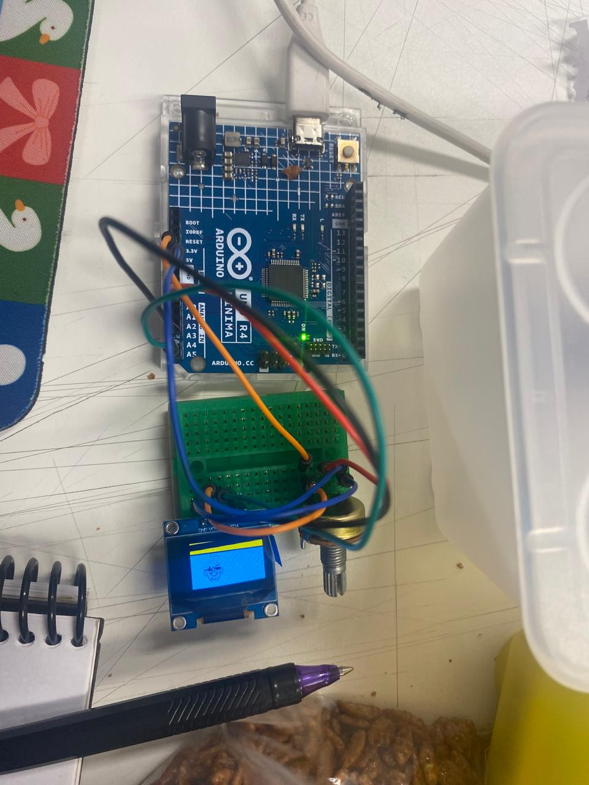

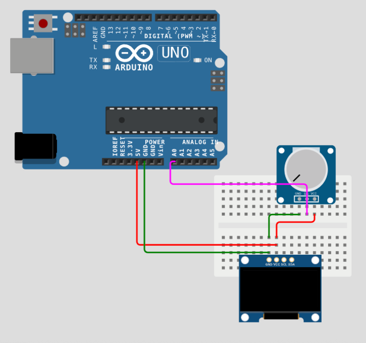

En esta imagén se muestra un error que cometimos como grupo al momento de conectar el potenciómetro al arduino:

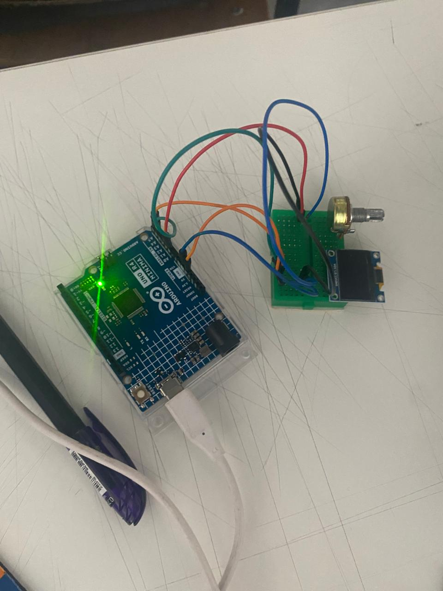

Se vio como el potenciómetro modifica valores en el código (entrada analógica) y cómo podemos usarlo para controlar la pantalla.

Ejemplo visto en clase:

```cpp
// declarar valor
// inicializar 0
int valorPot = 0;

String verso0;
String verso1;
String verso2;

void setup() {
  // put your setup code here, to run once:
  Serial.begin(9600);

  verso0 = "ventilador";
  verso1 = "techo";
  verso2 = "lampara";

}

void loop() {
  // put your main code here, to run repeatedly:
  
  // leer el valor
  valorPot = analogRead(A0);

  if (valorPot < 300) {
    // aca esta entre 0 y 300-1
    Serial.println(verso0);
  }
  else if (valorPot < 600) {
    // aca esta entre 300 y 600
    Serial.println(verso1);
  } else {
    // aca esta mayor que 600
    Serial.println(verso2);
  }

  
  // Serial.println(valorPot);
}
```

**Los comandos para escribir o leer en analógico y digital:**

Leer:

- analógico: analogRead(pin que leerá)
- digital: digitalRead()

escribir:

- analógico: analogWrite()
- digital: digitalWrite()

## Trabajo en clase

### Especificaciones trabajo

- **Grupo de trabajo:** 07 - Soundi (dato: el nombre es por un trabajo que hicimos en conjunto el semestre pasado, era un parlante con extremidades muy divertido llamado Soundi - fue para el curso de profundización: Fabricación digital avanzada)
- **Integrantes:**
  - Yamna Carrión
  - Catalina Catalán
  - Nicolás Miranda
- **Rol de trabajo:** Hacer fotogramas (que contienen dibujo pajaro y poema escrito) y pasarlos a código mediante la página image2cpp.

**Poema: "Sueños" de langston hughes.**

Aférrate a tus sueños

porque si los sueños mueren

la vida es como un pájaro de alas rotas

incapaz de volar

Aférrate a tus sueños

porque si los sueños se marchan

la vida es como un campo yermo

cubierto de escarcha.

### Proceso

1. Nos entregaron el protoboard, la pantalla OLED y los potenciómetros.
2. Pudimos probar nuestros primeros códigos de pruebas (echos antes de la clase) en la pantalla para verificar que estos funcionaran correctamente.
3. En base a las distintas pruebas llegamos al acuerdo de que ibamos a realizar para abordar el poema: fotogramas que generan una especie de animación que puede ser contralada con el potenciómetro.

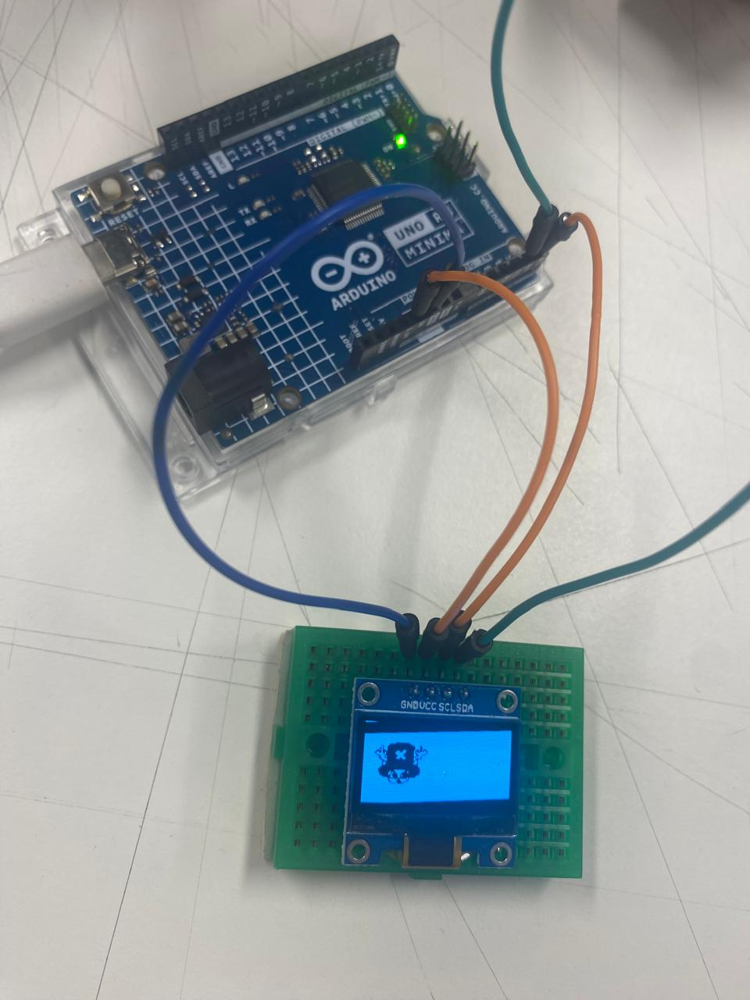

### Código probado en primera fase

El código muestra a la tripulación de los sombreros de paja de one piece en orden en el que se unieron al grupo.

Lo utilizamos de prueba para ver que habíamos experimentado y generar ideas.

En este caso nos gustó que se pasara de foto en foto.

```cpp
#include <Wire.h>
#include <Adafruit_GFX.h>
#include <Adafruit_SSD1306.h>

#define SCREEN_WIDTH 128
#define SCREEN_HEIGHT 64
#define OLED_RESET -1
Adafruit_SSD1306 pantallita(SCREEN_WIDTH, SCREEN_HEIGHT, &Wire, OLED_RESET);

int contador = 0;

const unsigned char usopp [] PROGMEM = {
  // 'usopp de one piece', 128x64px
 0xff, 0xff, 0xff, 0xff, 0xff, 0xff, 0xff, 0xff, 0xff, 0xff, 0xff, 0xff, 0xff, 0xff, 0xff, 0xff, 
 0xff, 0xff, 0xff, 0xff, 0xff, 0xff, 0xff, 0xff, 0xff, 0xff, 0xff, 0xff, 0xff, 0xff, 0xff, 0xff, 
 0xff, 0xff, 0xff, 0xff, 0xff, 0xff, 0xff, 0xff, 0xff, 0xff, 0xff, 0xff, 0xff, 0xff, 0xff, 0xff, 
 0xff, 0xff, 0xff, 0xff, 0xff, 0xff, 0xff, 0xff, 0xff, 0xff, 0xff, 0xff, 0xff, 0xff, 0xff, 0xff, 
 0xff, 0xff, 0xff, 0xff, 0xff, 0xff, 0xff, 0xff, 0xff, 0xff, 0xff, 0xff, 0xff, 0xff, 0xff, 0xff, 
 0xff, 0xff, 0xff, 0xff, 0xff, 0xff, 0xff, 0xff, 0xff, 0xff, 0xff, 0xff, 0xff, 0xff, 0xff, 0xff, 
 0xff, 0xff, 0xff, 0xff, 0xff, 0xff, 0xff, 0xff, 0xff, 0xff, 0xff, 0xff, 0xff, 0xff, 0xff, 0xff, 
 0xff, 0xff, 0xff, 0xff, 0xff, 0xff, 0xff, 0xff, 0xff, 0xff, 0xff, 0xff, 0xff, 0xff, 0xff, 0xff, 
 0xff, 0xff, 0xff, 0xff, 0xff, 0xff, 0xff, 0xff, 0xff, 0xff, 0xff, 0xff, 0xff, 0xff, 0xff, 0xff, 
 0xff, 0xff, 0xff, 0xff, 0xff, 0xff, 0xff, 0xff, 0xff, 0xff, 0xff, 0xff, 0xff, 0xff, 0xff, 0xff, 
 0xff, 0xff, 0xff, 0xff, 0xff, 0xff, 0xff, 0xff, 0xff, 0xff, 0xff, 0xff, 0xff, 0xff, 0xff, 0xff, 
 0xff, 0xff, 0xff, 0xff, 0xff, 0xff, 0xff, 0xff, 0xff, 0xff, 0xff, 0xff, 0xff, 0xff, 0xff, 0xff, 
 0xff, 0xff, 0xff, 0xff, 0xff, 0xff, 0xff, 0xff, 0xff, 0xff, 0xff, 0xff, 0xff, 0xff, 0xff, 0xff, 
 0xff, 0xff, 0xff, 0xff, 0xff, 0xff, 0xff, 0xff, 0xff, 0xff, 0xff, 0xff, 0xff, 0xff, 0xff, 0xff, 
 0xff, 0xff, 0xff, 0xff, 0xff, 0xff, 0xff, 0xff, 0xff, 0xff, 0xff, 0xff, 0xff, 0xff, 0xff, 0xff, 
 0xff, 0xff, 0xff, 0xff, 0xff, 0xff, 0xff, 0xff, 0xff, 0xff, 0xff, 0xff, 0xff, 0xff, 0xff, 0xff, 
 0xff, 0xff, 0xff, 0xff, 0xff, 0xff, 0xff, 0xff, 0xff, 0xff, 0xff, 0xff, 0xff, 0xff, 0xff, 0xff, 
 0xff, 0xff, 0xff, 0xfc, 0x3f, 0xff, 0xff, 0xff, 0xff, 0xff, 0xff, 0xff, 0xff, 0xff, 0xff, 0xff, 
 0xff, 0xff, 0xff, 0xe0, 0x07, 0xff, 0xff, 0xff, 0xff, 0xff, 0xff, 0xff, 0xff, 0xff, 0xff, 0xff, 
 0xff, 0xff, 0xff, 0xc0, 0x01, 0xff, 0xff, 0xff, 0xff, 0xff, 0xff, 0xff, 0xff, 0xff, 0xff, 0xff, 
 0xff, 0xff, 0xff, 0x00, 0x00, 0xff, 0xff, 0xff, 0xff, 0xff, 0xff, 0xff, 0xff, 0xff, 0xff, 0xff, 
 0xff, 0xff, 0xfe, 0x00, 0x00, 0x7f, 0xff, 0xff, 0xff, 0xff, 0xff, 0xff, 0xff, 0xff, 0xff, 0xff, 
 0xff, 0xff, 0xfe, 0x0c, 0x18, 0x7f, 0xff, 0xff, 0xff, 0xff, 0xff, 0xff, 0xff, 0xff, 0xff, 0xff, 
 0xff, 0xff, 0xfc, 0x0e, 0x1c, 0x3f, 0xff, 0xff, 0xff, 0xff, 0xff, 0xff, 0xff, 0xff, 0xff, 0xff, 
 0xff, 0xff, 0xfc, 0x0c, 0x18, 0x3f, 0xff, 0xff, 0xff, 0xff, 0xff, 0xff, 0xff, 0xff, 0xff, 0xff, 
 0xff, 0xff, 0xfc, 0x00, 0x00, 0x3f, 0xff, 0xff, 0xff, 0xff, 0xff, 0xff, 0xff, 0xff, 0xff, 0xff, 
 0xff, 0xff, 0xfc, 0x03, 0x08, 0x3f, 0xff, 0xff, 0xff, 0xff, 0xff, 0xff, 0xff, 0xff, 0xff, 0xff, 
 0xff, 0xff, 0xfc, 0x0f, 0xf8, 0x3f, 0xff, 0xff, 0xff, 0xff, 0xff, 0xff, 0xff, 0xff, 0xff, 0xff, 
 0xff, 0xff, 0xfc, 0x47, 0xe1, 0x9f, 0xff, 0xff, 0xff, 0xff, 0xff, 0xff, 0xff, 0xff, 0xff, 0xff, 
 0xff, 0xff, 0xf0, 0xe1, 0xc3, 0x8f, 0xff, 0xff, 0xff, 0xff, 0xff, 0xff, 0xff, 0xff, 0xff, 0xff, 
 0xff, 0xff, 0xf0, 0xc1, 0xc0, 0x0f, 0xff, 0xff, 0xff, 0xff, 0xff, 0xff, 0xff, 0xff, 0xff, 0xff, 
 0xff, 0xff, 0xf0, 0x81, 0xc0, 0x07, 0xff, 0xff, 0xff, 0xff, 0xff, 0xff, 0xff, 0xff, 0xff, 0xff, 
 0xff, 0xff, 0xe0, 0x20, 0xe2, 0x37, 0xff, 0xff, 0xff, 0xff, 0xff, 0xff, 0xff, 0xff, 0xff, 0xff, 
 0xff, 0xff, 0xec, 0x24, 0xde, 0x3f, 0xff, 0xff, 0xff, 0xff, 0xff, 0xff, 0xff, 0xff, 0xff, 0xff, 
 0xff, 0xff, 0xee, 0xb8, 0x00, 0xb7, 0xff, 0xff, 0xff, 0xff, 0xff, 0xff, 0xff, 0xff, 0xff, 0xff, 
 0xff, 0xff, 0xee, 0x81, 0xbf, 0xb7, 0xff, 0xff, 0xff, 0xff, 0xff, 0xff, 0xff, 0xff, 0xff, 0xff, 
 0xff, 0xff, 0xee, 0xfd, 0xbf, 0x27, 0xff, 0xff, 0xff, 0xff, 0xff, 0xff, 0xff, 0xff, 0xff, 0xff, 
 0xff, 0xff, 0xf0, 0xfe, 0x3f, 0x0f, 0xff, 0xff, 0xff, 0xff, 0xff, 0xff, 0xff, 0xff, 0xff, 0xff, 
 0xff, 0xff, 0xe0, 0x7b, 0xe7, 0x07, 0xff, 0xff, 0xff, 0xff, 0xff, 0xff, 0xff, 0xff, 0xff, 0xff, 
 0xff, 0xff, 0x80, 0x78, 0x0f, 0x07, 0xff, 0xff, 0xff, 0xff, 0xff, 0xff, 0xff, 0xff, 0xff, 0xff, 
 0xff, 0xff, 0x00, 0x3f, 0xfe, 0x03, 0xff, 0xff, 0xff, 0xff, 0xff, 0xff, 0xff, 0xff, 0xff, 0xff, 
 0xff, 0xff, 0x00, 0x1f, 0xfc, 0x03, 0xff, 0xff, 0xff, 0xff, 0xff, 0xff, 0xff, 0xff, 0xff, 0xff, 
 0xff, 0xff, 0x80, 0x07, 0xf8, 0x03, 0xff, 0xff, 0xff, 0xff, 0xff, 0xff, 0xff, 0xff, 0xff, 0xff, 
 0xff, 0xff, 0xc0, 0x00, 0x00, 0x07, 0xff, 0xff, 0xff, 0xff, 0xff, 0xff, 0xff, 0xff, 0xff, 0xff, 
 0xff, 0xff, 0xc0, 0x07, 0xc0, 0x07, 0xff, 0xff, 0xff, 0xff, 0xff, 0xff, 0xff, 0xff, 0xff, 0xff, 
 0xff, 0xff, 0xe0, 0x0f, 0xf0, 0x07, 0xff, 0xff, 0xff, 0xff, 0xff, 0xff, 0xff, 0xff, 0xff, 0xff, 
 0xff, 0xff, 0xf0, 0x7f, 0xf0, 0x7f, 0xff, 0xff, 0xff, 0xff, 0xff, 0xff, 0xff, 0xff, 0xff, 0xff, 
 0xff, 0xff, 0xff, 0xff, 0xff, 0xff, 0xff, 0xff, 0xff, 0xff, 0xff, 0xff, 0xff, 0xff, 0xff, 0xff, 
 0xff, 0xff, 0xff, 0xff, 0xff, 0xff, 0xff, 0xff, 0xff, 0xff, 0xff, 0xff, 0xff, 0xff, 0xff, 0xff, 
 0xff, 0xff, 0xff, 0xff, 0xff, 0xff, 0xff, 0xff, 0xff, 0xff, 0xff, 0xff, 0xff, 0xff, 0xff, 0xff, 
 0xff, 0xff, 0xff, 0xff, 0xff, 0xff, 0xff, 0xff, 0xff, 0xff, 0xff, 0xff, 0xff, 0xff, 0xff, 0xff, 
 0xff, 0xff, 0xff, 0xff, 0xff, 0xff, 0xff, 0xff, 0xff, 0xff, 0xff, 0xff, 0xff, 0xff, 0xff, 0xff, 
 0xff, 0xff, 0xff, 0xff, 0xff, 0xff, 0xff, 0xff, 0xff, 0xff, 0xff, 0xff, 0xff, 0xff, 0xff, 0xff, 
 0xff, 0xff, 0xff, 0xff, 0xff, 0xff, 0xff, 0xff, 0xff, 0xff, 0xff, 0xff, 0xff, 0xff, 0xff, 0xff, 
 0xff, 0xff, 0xff, 0xff, 0xff, 0xff, 0xff, 0xff, 0xff, 0xff, 0xff, 0xff, 0xff, 0xff, 0xff, 0xff, 
 0xff, 0xff, 0xff, 0xff, 0xff, 0xff, 0xff, 0xff, 0xff, 0xff, 0xff, 0xff, 0xff, 0xff, 0xff, 0xff, 
 0xff, 0xff, 0xff, 0xff, 0xff, 0xff, 0xff, 0xff, 0xff, 0xff, 0xff, 0xff, 0xff, 0xff, 0xff, 0xff, 
 0xff, 0xff, 0xff, 0xff, 0xff, 0xff, 0xff, 0xff, 0xff, 0xff, 0xff, 0xff, 0xff, 0xff, 0xff, 0xff, 
 0xff, 0xff, 0xff, 0xff, 0xff, 0xff, 0xff, 0xff, 0xff, 0xff, 0xff, 0xff, 0xff, 0xff, 0xff, 0xff, 
 0xff, 0xff, 0xff, 0xff, 0xff, 0xff, 0xff, 0xff, 0xff, 0xff, 0xff, 0xff, 0xff, 0xff, 0xff, 0xff, 
 0xff, 0xff, 0xff, 0xff, 0xff, 0xff, 0xff, 0xff, 0xff, 0xff, 0xff, 0xff, 0xff, 0xff, 0xff, 0xff, 
 0xff, 0xff, 0xff, 0xff, 0xff, 0xff, 0xff, 0xff, 0xff, 0xff, 0xff, 0xff, 0xff, 0xff, 0xff, 0xff, 
 0xff, 0xff, 0xff, 0xff, 0xff, 0xff, 0xff, 0xff, 0xff, 0xff, 0xff, 0xff, 0xff, 0xff, 0xff, 0xff, 
 0xff, 0xff, 0xff, 0xff, 0xff, 0xff, 0xff, 0xff, 0xff, 0xff, 0xff, 0xff, 0xff, 0xff, 0xff, 0xff
};

const unsigned char jimbe [] PROGMEM = {
  //'jimbe de one piece', 128x64px
0xff, 0xff, 0xff, 0xff, 0xff, 0xff, 0xff, 0xff, 0xff, 0xff, 0xff, 0xff, 0xff, 0xff, 0xff, 0xff, 
 0xff, 0xff, 0xff, 0xff, 0xff, 0xff, 0xff, 0xff, 0xff, 0xff, 0xff, 0xff, 0xff, 0xff, 0xff, 0xff, 
 0xff, 0xff, 0xff, 0xff, 0xff, 0xff, 0xff, 0xff, 0xff, 0xff, 0xff, 0xff, 0xff, 0xff, 0xff, 0xff, 
 0xff, 0xff, 0xff, 0xff, 0xff, 0xff, 0xff, 0xff, 0xff, 0xff, 0xff, 0xff, 0xff, 0xff, 0xff, 0xff, 
 0xff, 0xff, 0xff, 0xff, 0xff, 0xff, 0xff, 0xff, 0xff, 0xff, 0xff, 0xff, 0xff, 0xff, 0xff, 0xff, 
 0xff, 0xff, 0xff, 0xff, 0xff, 0xff, 0xff, 0xff, 0xff, 0xff, 0xff, 0xff, 0xff, 0xff, 0xff, 0xff, 
 0xff, 0xff, 0xff, 0xff, 0xff, 0xff, 0xff, 0xff, 0xff, 0xff, 0xff, 0xff, 0xff, 0xff, 0xff, 0xff, 
 0xff, 0xff, 0xff, 0xff, 0xff, 0xff, 0xff, 0xff, 0xff, 0xff, 0xff, 0xff, 0xff, 0xff, 0xff, 0xff, 
 0xff, 0xff, 0xff, 0xff, 0xff, 0xff, 0xff, 0xff, 0xff, 0xff, 0xff, 0xff, 0xff, 0xff, 0xff, 0xff, 
 0xff, 0xff, 0xff, 0xff, 0xff, 0xff, 0xff, 0xff, 0xff, 0xff, 0xff, 0xff, 0xff, 0xff, 0xff, 0xff, 
 0xff, 0xff, 0xff, 0xff, 0xff, 0xff, 0xff, 0xff, 0xff, 0xff, 0xff, 0xff, 0xff, 0xff, 0xff, 0xff, 
 0xff, 0xff, 0xff, 0xff, 0xff, 0xff, 0xff, 0xff, 0xff, 0xff, 0xff, 0xff, 0xff, 0xff, 0xff, 0xff, 
 0xff, 0xff, 0xff, 0xff, 0xff, 0xff, 0xff, 0xff, 0xff, 0xff, 0xff, 0xff, 0xff, 0xff, 0xff, 0xff, 
 0xff, 0xff, 0xff, 0xff, 0xff, 0xff, 0xff, 0xff, 0xff, 0xff, 0xff, 0xff, 0xff, 0xff, 0xff, 0xff, 
 0xff, 0xff, 0xff, 0xff, 0xff, 0xff, 0xff, 0xff, 0xff, 0xff, 0xff, 0xff, 0xff, 0xff, 0xff, 0xff, 
 0xff, 0xff, 0xff, 0xff, 0x1f, 0xff, 0xff, 0xff, 0xff, 0xff, 0xff, 0xff, 0xff, 0xff, 0xff, 0xff, 
 0xff, 0xff, 0xff, 0xf0, 0x0f, 0xff, 0xff, 0xff, 0xff, 0xff, 0xff, 0xff, 0xff, 0xff, 0xff, 0xff, 
 0xff, 0xff, 0xff, 0xe0, 0x07, 0xff, 0xff, 0xff, 0xff, 0xff, 0xff, 0xff, 0xff, 0xff, 0xff, 0xff, 
 0xff, 0xff, 0xff, 0xe0, 0x07, 0xff, 0xff, 0xff, 0xff, 0xff, 0xff, 0xff, 0xff, 0xff, 0xff, 0xff, 
 0xff, 0xff, 0xff, 0xc0, 0x03, 0xff, 0xff, 0xff, 0xff, 0xff, 0xff, 0xff, 0xff, 0xff, 0xff, 0xff, 
 0xff, 0xff, 0xff, 0x80, 0x03, 0xff, 0xff, 0xff, 0xff, 0xff, 0xff, 0xff, 0xff, 0xff, 0xff, 0xff, 
 0xff, 0xff, 0xff, 0x80, 0x01, 0xff, 0xff, 0xff, 0xff, 0xff, 0xff, 0xff, 0xff, 0xff, 0xff, 0xff, 
 0xff, 0xff, 0xff, 0xc0, 0x03, 0xff, 0xff, 0xff, 0xff, 0xff, 0xff, 0xff, 0xff, 0xff, 0xff, 0xff, 
 0xff, 0xff, 0xff, 0x80, 0x03, 0xff, 0xff, 0xff, 0xff, 0xff, 0xff, 0xff, 0xff, 0xff, 0xff, 0xff, 
 0xff, 0xff, 0xff, 0x00, 0x01, 0xff, 0xff, 0xff, 0xff, 0xff, 0xff, 0xff, 0xff, 0xff, 0xff, 0xff, 
 0xff, 0xff, 0xfe, 0x00, 0x00, 0xff, 0xff, 0xff, 0xff, 0xff, 0xff, 0xff, 0xff, 0xff, 0xff, 0xff, 
 0xff, 0xff, 0xfe, 0x00, 0x00, 0x7f, 0xff, 0xff, 0xff, 0xff, 0xff, 0xff, 0xff, 0xff, 0xff, 0xff, 
 0xff, 0xff, 0xfc, 0x3c, 0x1c, 0x7f, 0xff, 0xff, 0xff, 0xff, 0xff, 0xff, 0xff, 0xff, 0xff, 0xff, 
 0xff, 0xff, 0xf8, 0x7f, 0xfe, 0x3f, 0xff, 0xff, 0xff, 0xff, 0xff, 0xff, 0xff, 0xff, 0xff, 0xff, 
 0xff, 0xff, 0xbd, 0xff, 0xff, 0x3f, 0xff, 0xff, 0xff, 0xff, 0xff, 0xff, 0xff, 0xff, 0xff, 0xff, 
 0xff, 0xfe, 0x7f, 0x1f, 0xf8, 0x10, 0xff, 0xff, 0xff, 0xff, 0xff, 0xff, 0xff, 0xff, 0xff, 0xff, 
 0xff, 0xfe, 0x9f, 0x0f, 0xc0, 0x60, 0xff, 0xff, 0xff, 0xff, 0xff, 0xff, 0xff, 0xff, 0xff, 0xff, 
 0xff, 0xfe, 0xff, 0x03, 0xc8, 0xee, 0xff, 0xff, 0xff, 0xff, 0xff, 0xff, 0xff, 0xff, 0xff, 0xff, 
 0xff, 0xff, 0x3f, 0x07, 0xe0, 0x70, 0x7f, 0xff, 0xff, 0xff, 0xff, 0xff, 0xff, 0xff, 0xff, 0xff, 
 0xff, 0xfc, 0x7e, 0x02, 0xc0, 0x7c, 0xbf, 0xff, 0xff, 0xff, 0xff, 0xff, 0xff, 0xff, 0xff, 0xff, 
 0xff, 0xfb, 0x7f, 0x04, 0x40, 0x16, 0xff, 0xff, 0xff, 0xff, 0xff, 0xff, 0xff, 0xff, 0xff, 0xff, 
 0xff, 0xfb, 0xbf, 0xc4, 0xe7, 0x82, 0x3f, 0xff, 0xff, 0xff, 0xff, 0xff, 0xff, 0xff, 0xff, 0xff, 
 0xff, 0xfc, 0x7e, 0x78, 0x3e, 0x7d, 0x3f, 0xff, 0xff, 0xff, 0xff, 0xff, 0xff, 0xff, 0xff, 0xff, 
 0xff, 0xfc, 0xfe, 0x7c, 0x7d, 0x7f, 0x1f, 0xff, 0xff, 0xff, 0xff, 0xff, 0xff, 0xff, 0xff, 0xff, 
 0xff, 0xf1, 0xfd, 0xa0, 0x7d, 0xbd, 0x8f, 0xff, 0xff, 0xff, 0xff, 0xff, 0xff, 0xff, 0xff, 0xff, 
 0xff, 0xf4, 0xfb, 0x9f, 0xf3, 0xbd, 0x8f, 0xff, 0xff, 0xff, 0xff, 0xff, 0xff, 0xff, 0xff, 0xff, 
 0xff, 0xf0, 0xfb, 0x7f, 0xfd, 0xbc, 0x5f, 0xff, 0xff, 0xff, 0xff, 0xff, 0xff, 0xff, 0xff, 0xff, 
 0xff, 0xff, 0xf8, 0xf8, 0x3e, 0x7f, 0xff, 0xff, 0xff, 0xff, 0xff, 0xff, 0xff, 0xff, 0xff, 0xff, 
 0xff, 0xff, 0xff, 0xf8, 0x3f, 0xff, 0xff, 0xff, 0xff, 0xff, 0xff, 0xff, 0xff, 0xff, 0xff, 0xff, 
 0xff, 0xff, 0xff, 0xe0, 0x1f, 0xff, 0xff, 0xff, 0xff, 0xff, 0xff, 0xff, 0xff, 0xff, 0xff, 0xff, 
 0xff, 0xff, 0xff, 0xe0, 0x1f, 0xff, 0xff, 0xff, 0xff, 0xff, 0xff, 0xff, 0xff, 0xff, 0xff, 0xff, 
 0xff, 0xff, 0xff, 0xf8, 0x3f, 0xff, 0xff, 0xff, 0xff, 0xff, 0xff, 0xff, 0xff, 0xff, 0xff, 0xff, 
 0xff, 0xff, 0xff, 0xff, 0xff, 0xff, 0xff, 0xff, 0xff, 0xff, 0xff, 0xff, 0xff, 0xff, 0xff, 0xff, 
 0xff, 0xff, 0xff, 0xff, 0xff, 0xff, 0xff, 0xff, 0xff, 0xff, 0xff, 0xff, 0xff, 0xff, 0xff, 0xff, 
 0xff, 0xff, 0xff, 0xff, 0xff, 0xff, 0xff, 0xff, 0xff, 0xff, 0xff, 0xff, 0xff, 0xff, 0xff, 0xff, 
 0xff, 0xff, 0xff, 0xff, 0xff, 0xff, 0xff, 0xff, 0xff, 0xff, 0xff, 0xff, 0xff, 0xff, 0xff, 0xff, 
 0xff, 0xff, 0xff, 0xff, 0xff, 0xff, 0xff, 0xff, 0xff, 0xff, 0xff, 0xff, 0xff, 0xff, 0xff, 0xff, 
 0xff, 0xff, 0xff, 0xff, 0xff, 0xff, 0xff, 0xff, 0xff, 0xff, 0xff, 0xff, 0xff, 0xff, 0xff, 0xff, 
 0xff, 0xff, 0xff, 0xff, 0xff, 0xff, 0xff, 0xff, 0xff, 0xff, 0xff, 0xff, 0xff, 0xff, 0xff, 0xff, 
 0xff, 0xff, 0xff, 0xff, 0xff, 0xff, 0xff, 0xff, 0xff, 0xff, 0xff, 0xff, 0xff, 0xff, 0xff, 0xff, 
 0xff, 0xff, 0xff, 0xff, 0xff, 0xff, 0xff, 0xff, 0xff, 0xff, 0xff, 0xff, 0xff, 0xff, 0xff, 0xff, 
 0xff, 0xff, 0xff, 0xff, 0xff, 0xff, 0xff, 0xff, 0xff, 0xff, 0xff, 0xff, 0xff, 0xff, 0xff, 0xff, 
 0xff, 0xff, 0xff, 0xff, 0xff, 0xff, 0xff, 0xff, 0xff, 0xff, 0xff, 0xff, 0xff, 0xff, 0xff, 0xff, 
 0xff, 0xff, 0xff, 0xff, 0xff, 0xff, 0xff, 0xff, 0xff, 0xff, 0xff, 0xff, 0xff, 0xff, 0xff, 0xff, 
 0xff, 0xff, 0xff, 0xff, 0xff, 0xff, 0xff, 0xff, 0xff, 0xff, 0xff, 0xff, 0xff, 0xff, 0xff, 0xff, 
 0xff, 0xff, 0xff, 0xff, 0xff, 0xff, 0xff, 0xff, 0xff, 0xff, 0xff, 0xff, 0xff, 0xff, 0xff, 0xff, 
 0xff, 0xff, 0xff, 0xff, 0xff, 0xff, 0xff, 0xff, 0xff, 0xff, 0xff, 0xff, 0xff, 0xff, 0xff, 0xff, 
 0xff, 0xff, 0xff, 0xff, 0xff, 0xff, 0xff, 0xff, 0xff, 0xff, 0xff, 0xff, 0xff, 0xff, 0xff, 0xff, 
 0xff, 0xff, 0xff, 0xff, 0xff, 0xff, 0xff, 0xff, 0xff, 0xff, 0xff, 0xff, 0xff, 0xff, 0xff, 0xff
  };

const unsigned char luffy [] PROGMEM = {
  //'luffy de one piece', 128x64px
  0xff, 0xff, 0xff, 0xff, 0xff, 0xff, 0xff, 0xff, 0xff, 0xff, 0xff, 0xff, 0xff, 0xff, 0xff, 0xff, 
 0xff, 0xff, 0xff, 0xff, 0xff, 0xff, 0xff, 0xff, 0xff, 0xff, 0xff, 0xff, 0xff, 0xff, 0xff, 0xff, 
 0xff, 0xff, 0xff, 0xff, 0xff, 0xff, 0xff, 0xff, 0xff, 0xff, 0xff, 0xff, 0xff, 0xff, 0xff, 0xff, 
 0xff, 0xff, 0xff, 0xff, 0xff, 0xff, 0xff, 0xff, 0xff, 0xff, 0xff, 0xff, 0xff, 0xff, 0xff, 0xff, 
 0xff, 0xff, 0xff, 0xff, 0xff, 0xff, 0xff, 0xff, 0xff, 0xff, 0xff, 0xff, 0xff, 0xff, 0xff, 0xff, 
 0xff, 0xff, 0xff, 0xff, 0xff, 0xff, 0xff, 0xff, 0xff, 0xff, 0xff, 0xff, 0xff, 0xff, 0xff, 0xff, 
 0xff, 0xff, 0xff, 0xff, 0xff, 0xff, 0xff, 0xff, 0xff, 0xff, 0xff, 0xff, 0xff, 0xff, 0xff, 0xff, 
 0xff, 0xff, 0xff, 0xff, 0xff, 0xff, 0xff, 0xff, 0xff, 0xff, 0xff, 0xff, 0xff, 0xff, 0xff, 0xff, 
 0xff, 0xff, 0xff, 0xff, 0xff, 0xff, 0xff, 0xff, 0xff, 0xff, 0xff, 0xff, 0xff, 0xff, 0xff, 0xff, 
 0xff, 0xff, 0xff, 0xff, 0xff, 0xff, 0xff, 0xff, 0xff, 0xff, 0xff, 0xff, 0xff, 0xff, 0xff, 0xff, 
 0xff, 0xff, 0xff, 0xff, 0xff, 0xff, 0xff, 0xff, 0xff, 0xff, 0xff, 0xff, 0xff, 0xff, 0xff, 0xff, 
 0xff, 0xff, 0xff, 0xff, 0xff, 0xff, 0xff, 0xff, 0xff, 0xff, 0xff, 0xff, 0xff, 0xff, 0xff, 0xff, 
 0xff, 0xff, 0xff, 0xff, 0xff, 0xff, 0xff, 0xff, 0xff, 0xff, 0xff, 0xff, 0xff, 0xff, 0xff, 0xff, 
 0xff, 0xff, 0xff, 0xff, 0xff, 0xff, 0xff, 0xff, 0xff, 0xff, 0xff, 0xff, 0xff, 0xff, 0xff, 0xff, 
 0xff, 0xff, 0xff, 0xff, 0xff, 0xff, 0xff, 0xff, 0xff, 0xff, 0xff, 0xff, 0xff, 0xff, 0xff, 0xff, 
 0xff, 0xff, 0xff, 0xff, 0xff, 0xff, 0xff, 0xff, 0xff, 0xff, 0xff, 0xff, 0xff, 0xff, 0xff, 0xff, 
 0xff, 0xff, 0xff, 0xff, 0xff, 0xff, 0xff, 0xff, 0xff, 0xff, 0xff, 0xff, 0xff, 0xff, 0xff, 0xff, 
 0xff, 0xff, 0xff, 0xff, 0xff, 0xff, 0xff, 0xff, 0xff, 0xff, 0xff, 0xff, 0xff, 0xff, 0xff, 0xff, 
 0xff, 0xff, 0xff, 0xe0, 0x03, 0xff, 0xff, 0xff, 0xff, 0xff, 0xff, 0xff, 0xff, 0xff, 0xff, 0xff, 
 0xff, 0xff, 0xff, 0x8f, 0xf8, 0xff, 0xff, 0xff, 0xff, 0xff, 0xff, 0xff, 0xff, 0xff, 0xff, 0xff, 
 0xff, 0xff, 0xff, 0x3f, 0xfe, 0x7f, 0xff, 0xff, 0xff, 0xff, 0xff, 0xff, 0xff, 0xff, 0xff, 0xff, 
 0xff, 0xff, 0xfe, 0x7f, 0xff, 0xbf, 0xff, 0xff, 0xff, 0xff, 0xff, 0xff, 0xff, 0xff, 0xff, 0xff, 
 0xff, 0xff, 0xfc, 0xff, 0xff, 0x9f, 0xff, 0xff, 0xff, 0xff, 0xff, 0xff, 0xff, 0xff, 0xff, 0xff, 
 0xff, 0xff, 0xf9, 0xff, 0xff, 0xcf, 0xff, 0xff, 0xff, 0xff, 0xff, 0xff, 0xff, 0xff, 0xff, 0xff, 
 0xff, 0xff, 0xf3, 0x98, 0x00, 0x8f, 0xff, 0xff, 0xff, 0xff, 0xff, 0xff, 0xff, 0xff, 0xff, 0xff, 
 0xff, 0xff, 0xf4, 0x00, 0x00, 0x07, 0xff, 0xff, 0xff, 0xff, 0xff, 0xff, 0xff, 0xff, 0xff, 0xff, 
 0xff, 0xff, 0xe0, 0x22, 0x22, 0x27, 0xff, 0xff, 0xff, 0xff, 0xff, 0xff, 0xff, 0xff, 0xff, 0xff, 
 0xff, 0xff, 0xe1, 0x11, 0x99, 0x1f, 0xff, 0xff, 0xff, 0xff, 0xff, 0xff, 0xff, 0xff, 0xff, 0xff, 
 0xff, 0xff, 0xe8, 0x00, 0x00, 0x01, 0xff, 0xff, 0xff, 0xff, 0xff, 0xff, 0xff, 0xff, 0xff, 0xff, 
 0xff, 0xff, 0xe0, 0x00, 0x00, 0x00, 0x3f, 0xff, 0xff, 0xff, 0xff, 0xff, 0xff, 0xff, 0xff, 0xff, 
 0xff, 0xf8, 0x00, 0x00, 0x00, 0x01, 0x87, 0xff, 0xff, 0xff, 0xff, 0xff, 0xff, 0xff, 0xff, 0xff, 
 0xff, 0xc3, 0x00, 0x00, 0x01, 0x80, 0xf1, 0xff, 0xff, 0xff, 0xff, 0xff, 0xff, 0xff, 0xff, 0xff, 
 0xff, 0x98, 0x03, 0x18, 0x04, 0xc0, 0x7d, 0xff, 0xff, 0xff, 0xff, 0xff, 0xff, 0xff, 0xff, 0xff, 
 0xff, 0xbf, 0x86, 0x06, 0x30, 0x00, 0x3e, 0xff, 0xff, 0xff, 0xff, 0xff, 0xff, 0xff, 0xff, 0xff, 
 0xff, 0x7f, 0x04, 0x02, 0x20, 0x60, 0x3c, 0xff, 0xff, 0xff, 0xff, 0xff, 0xff, 0xff, 0xff, 0xff, 
 0xff, 0x7f, 0x85, 0x02, 0x28, 0x30, 0x79, 0xff, 0xff, 0xff, 0xff, 0xff, 0xff, 0xff, 0xff, 0xff, 
 0xff, 0xbf, 0x8e, 0x06, 0x30, 0x39, 0x03, 0xff, 0xff, 0xff, 0xff, 0xff, 0xff, 0xff, 0xff, 0xff, 
 0xff, 0x9e, 0x46, 0x07, 0x30, 0x39, 0xbf, 0xff, 0xff, 0xff, 0xff, 0xff, 0xff, 0xff, 0xff, 0xff, 
 0xff, 0xc2, 0xc7, 0x07, 0xf8, 0x65, 0xbf, 0xff, 0xff, 0xff, 0xff, 0xff, 0xff, 0xff, 0xff, 0xff, 
 0xff, 0xfe, 0xc7, 0xcf, 0xfc, 0xc5, 0x9f, 0xff, 0xff, 0xff, 0xff, 0xff, 0xff, 0xff, 0xff, 0xff, 
 0xff, 0xfe, 0xf7, 0xff, 0xff, 0x83, 0x9f, 0xff, 0xff, 0xff, 0xff, 0xff, 0xff, 0xff, 0xff, 0xff, 
 0xff, 0xfe, 0xf3, 0xef, 0xfb, 0x93, 0xbf, 0xff, 0xff, 0xff, 0xff, 0xff, 0xff, 0xff, 0xff, 0xff, 
 0xff, 0xfe, 0x7b, 0xe3, 0x23, 0xc2, 0x7f, 0xff, 0xff, 0xff, 0xff, 0xff, 0xff, 0xff, 0xff, 0xff, 
 0xff, 0xff, 0x11, 0xf0, 0x1f, 0xe9, 0xff, 0xff, 0xff, 0xff, 0xff, 0xff, 0xff, 0xff, 0xff, 0xff, 
 0xff, 0xff, 0xcc, 0xff, 0xff, 0xcf, 0xff, 0xff, 0xff, 0xff, 0xff, 0xff, 0xff, 0xff, 0xff, 0xff, 
 0xff, 0xff, 0xfe, 0x7f, 0xff, 0x1f, 0xff, 0xff, 0xff, 0xff, 0xff, 0xff, 0xff, 0xff, 0xff, 0xff, 
 0xff, 0xff, 0xff, 0x1f, 0xe0, 0x7f, 0xff, 0xff, 0xff, 0xff, 0xff, 0xff, 0xff, 0xff, 0xff, 0xff, 
 0xff, 0xff, 0xff, 0xc0, 0x07, 0xff, 0xff, 0xff, 0xff, 0xff, 0xff, 0xff, 0xff, 0xff, 0xff, 0xff, 
 0xff, 0xff, 0xff, 0xff, 0xff, 0xff, 0xff, 0xff, 0xff, 0xff, 0xff, 0xff, 0xff, 0xff, 0xff, 0xff, 
 0xff, 0xff, 0xff, 0xff, 0xff, 0xff, 0xff, 0xff, 0xff, 0xff, 0xff, 0xff, 0xff, 0xff, 0xff, 0xff, 
 0xff, 0xff, 0xff, 0xff, 0xff, 0xff, 0xff, 0xff, 0xff, 0xff, 0xff, 0xff, 0xff, 0xff, 0xff, 0xff, 
 0xff, 0xff, 0xff, 0xff, 0xff, 0xff, 0xff, 0xff, 0xff, 0xff, 0xff, 0xff, 0xff, 0xff, 0xff, 0xff, 
 0xff, 0xff, 0xff, 0xff, 0xff, 0xff, 0xff, 0xff, 0xff, 0xff, 0xff, 0xff, 0xff, 0xff, 0xff, 0xff, 
 0xff, 0xff, 0xff, 0xff, 0xff, 0xff, 0xff, 0xff, 0xff, 0xff, 0xff, 0xff, 0xff, 0xff, 0xff, 0xff, 
 0xff, 0xff, 0xff, 0xff, 0xff, 0xff, 0xff, 0xff, 0xff, 0xff, 0xff, 0xff, 0xff, 0xff, 0xff, 0xff, 
 0xff, 0xff, 0xff, 0xff, 0xff, 0xff, 0xff, 0xff, 0xff, 0xff, 0xff, 0xff, 0xff, 0xff, 0xff, 0xff, 
 0xff, 0xff, 0xff, 0xff, 0xff, 0xff, 0xff, 0xff, 0xff, 0xff, 0xff, 0xff, 0xff, 0xff, 0xff, 0xff, 
 0xff, 0xff, 0xff, 0xff, 0xff, 0xff, 0xff, 0xff, 0xff, 0xff, 0xff, 0xff, 0xff, 0xff, 0xff, 0xff, 
 0xff, 0xff, 0xff, 0xff, 0xff, 0xff, 0xff, 0xff, 0xff, 0xff, 0xff, 0xff, 0xff, 0xff, 0xff, 0xff, 
 0xff, 0xff, 0xff, 0xff, 0xff, 0xff, 0xff, 0xff, 0xff, 0xff, 0xff, 0xff, 0xff, 0xff, 0xff, 0xff, 
 0xff, 0xff, 0xff, 0xff, 0xff, 0xff, 0xff, 0xff, 0xff, 0xff, 0xff, 0xff, 0xff, 0xff, 0xff, 0xff, 
 0xff, 0xff, 0xff, 0xff, 0xff, 0xff, 0xff, 0xff, 0xff, 0xff, 0xff, 0xff, 0xff, 0xff, 0xff, 0xff, 
 0xff, 0xff, 0xff, 0xff, 0xff, 0xff, 0xff, 0xff, 0xff, 0xff, 0xff, 0xff, 0xff, 0xff, 0xff, 0xff, 
 0xff, 0xff, 0xff, 0xff, 0xff, 0xff, 0xff, 0xff, 0xff, 0xff, 0xff, 0xff, 0xff, 0xff, 0xff, 0xff
};

const unsigned char sanji [] PROGMEM = {
  //'sanji de one piece', 128x64px
0xff, 0xff, 0xff, 0xff, 0xff, 0xff, 0xff, 0xff, 0xff, 0xff, 0xff, 0xff, 0xff, 0xff, 0xff, 0xff, 
 0xff, 0xff, 0xff, 0xff, 0xff, 0xff, 0xff, 0xff, 0xff, 0xff, 0xff, 0xff, 0xff, 0xff, 0xff, 0xff, 
 0xff, 0xff, 0xff, 0xff, 0xff, 0xff, 0xff, 0xff, 0xff, 0xff, 0xff, 0xff, 0xff, 0xff, 0xff, 0xff, 
 0xff, 0xff, 0xff, 0xff, 0xff, 0xff, 0xff, 0xff, 0xff, 0xff, 0xff, 0xff, 0xff, 0xff, 0xff, 0xff, 
 0xff, 0xff, 0xff, 0xff, 0xff, 0xff, 0xff, 0xff, 0xff, 0xff, 0xff, 0xff, 0xff, 0xff, 0xff, 0xff, 
 0xff, 0xff, 0xff, 0xff, 0xff, 0xff, 0xff, 0xff, 0xff, 0xff, 0xff, 0xff, 0xff, 0xff, 0xff, 0xff, 
 0xff, 0xff, 0xff, 0xff, 0xff, 0xff, 0xff, 0xff, 0xff, 0xff, 0xff, 0xff, 0xff, 0xff, 0xff, 0xff, 
 0xff, 0xff, 0xff, 0xff, 0xff, 0xff, 0xff, 0xff, 0xff, 0xff, 0xff, 0xff, 0xff, 0xff, 0xff, 0xff, 
 0xff, 0xff, 0xff, 0xff, 0xff, 0xff, 0xff, 0xff, 0xff, 0xff, 0xff, 0xff, 0xff, 0xff, 0xff, 0xff, 
 0xff, 0xff, 0xff, 0xff, 0xff, 0xff, 0xff, 0xff, 0xff, 0xff, 0xff, 0xff, 0xff, 0xff, 0xff, 0xff, 
 0xff, 0xff, 0xff, 0xff, 0xff, 0xff, 0xff, 0xff, 0xff, 0xff, 0xff, 0xff, 0xff, 0xff, 0xff, 0xff, 
 0xff, 0xff, 0xff, 0xff, 0xff, 0xff, 0xff, 0xff, 0xff, 0xff, 0xff, 0xff, 0xff, 0xff, 0xff, 0xff, 
 0xff, 0xff, 0xff, 0xff, 0xff, 0xff, 0xff, 0xff, 0xff, 0xff, 0xff, 0xff, 0xff, 0xff, 0xff, 0xff, 
 0xff, 0xff, 0xff, 0xff, 0xff, 0xff, 0xff, 0xff, 0xff, 0xff, 0xff, 0xff, 0xff, 0xff, 0xff, 0xff, 
 0xff, 0xff, 0xff, 0xff, 0xff, 0xff, 0xff, 0xff, 0xff, 0xff, 0xff, 0xff, 0xff, 0xff, 0xff, 0xff, 
 0xff, 0xff, 0xff, 0xff, 0xff, 0xff, 0xff, 0xff, 0xff, 0xff, 0xff, 0xff, 0xff, 0xff, 0xff, 0xff, 
 0xff, 0xff, 0xff, 0xff, 0xff, 0xff, 0xff, 0xff, 0xff, 0xff, 0xff, 0xff, 0xff, 0xff, 0xff, 0xff, 
 0xff, 0xff, 0xff, 0xff, 0xff, 0xff, 0xff, 0xff, 0xff, 0xff, 0xff, 0xff, 0xff, 0xff, 0xff, 0xff, 
 0xff, 0xff, 0xff, 0xff, 0xff, 0xff, 0xff, 0xff, 0xff, 0xff, 0xff, 0xff, 0xff, 0xff, 0xff, 0xff, 
 0xff, 0xff, 0xff, 0xff, 0xff, 0xff, 0xff, 0xff, 0xff, 0xff, 0xff, 0xff, 0xff, 0xff, 0xff, 0xff, 
 0xff, 0xff, 0xff, 0xff, 0xff, 0xff, 0xff, 0xff, 0xff, 0xff, 0xff, 0xff, 0xff, 0xff, 0xff, 0xff, 
 0xff, 0xff, 0xff, 0xff, 0xff, 0xff, 0xff, 0xff, 0xff, 0xff, 0xff, 0xff, 0xff, 0xff, 0xff, 0xff, 
 0xff, 0xff, 0xff, 0xff, 0xff, 0xff, 0xff, 0xff, 0xff, 0xff, 0xff, 0xff, 0xff, 0xff, 0xff, 0xff, 
 0xff, 0xff, 0xff, 0xff, 0xff, 0xff, 0xff, 0xff, 0xff, 0xff, 0xff, 0xff, 0xff, 0xff, 0xff, 0xff, 
 0xff, 0xff, 0xff, 0xff, 0xff, 0xff, 0xff, 0xff, 0xff, 0xff, 0xff, 0xff, 0xff, 0xff, 0xff, 0xff, 
 0xff, 0xff, 0xff, 0xff, 0xff, 0xff, 0xff, 0xff, 0xff, 0xff, 0xff, 0xff, 0xff, 0xff, 0xff, 0xff, 
 0xff, 0xff, 0xff, 0xff, 0xfc, 0x7f, 0xff, 0xff, 0xff, 0xff, 0xff, 0xff, 0xff, 0xff, 0xff, 0xff, 
 0xff, 0xff, 0xff, 0xff, 0xf1, 0x7f, 0xff, 0xff, 0xff, 0xff, 0xff, 0xff, 0xff, 0xff, 0xff, 0xff, 
 0xff, 0xff, 0xff, 0xff, 0xf4, 0xbf, 0xff, 0xff, 0xff, 0xff, 0xff, 0xff, 0xff, 0xff, 0xff, 0xff, 
 0xff, 0xff, 0xff, 0xff, 0xf8, 0x3f, 0xff, 0xff, 0xff, 0xff, 0xff, 0xff, 0xff, 0xff, 0xff, 0xff, 
 0xff, 0xff, 0xff, 0xff, 0xfc, 0x7f, 0xff, 0xff, 0xff, 0xff, 0xff, 0xff, 0xff, 0xff, 0xff, 0xff, 
 0xff, 0xff, 0xff, 0xff, 0xf3, 0xff, 0xff, 0xff, 0xff, 0xff, 0xff, 0xff, 0xff, 0xff, 0xff, 0xff, 
 0xff, 0xff, 0xff, 0xff, 0xc9, 0xfb, 0xff, 0xff, 0xff, 0xff, 0xff, 0xff, 0xff, 0xff, 0xff, 0xff, 
 0xff, 0xff, 0xc7, 0xff, 0xe0, 0x69, 0xff, 0xff, 0xff, 0xff, 0xff, 0xff, 0xff, 0xff, 0xff, 0xff, 
 0xff, 0xff, 0xbb, 0xff, 0xc8, 0xed, 0xff, 0xff, 0xff, 0xff, 0xff, 0xff, 0xff, 0xff, 0xff, 0xff, 
 0xff, 0xff, 0x9b, 0xff, 0xe9, 0xe5, 0xff, 0xff, 0xff, 0xff, 0xff, 0xff, 0xff, 0xff, 0xff, 0xff, 
 0xff, 0xff, 0xa1, 0xff, 0xe4, 0xc5, 0xff, 0xff, 0xff, 0xff, 0xff, 0xff, 0xff, 0xff, 0xff, 0xff, 
 0xff, 0xff, 0xd9, 0xfc, 0x71, 0xc5, 0xff, 0xff, 0xff, 0xff, 0xff, 0xff, 0xff, 0xff, 0xff, 0xff, 
 0xff, 0xff, 0xd1, 0xfe, 0xfd, 0x55, 0xff, 0xff, 0xff, 0xff, 0xff, 0xff, 0xff, 0xff, 0xff, 0xff, 
 0xff, 0xff, 0xdc, 0xff, 0xfd, 0x1b, 0xff, 0xff, 0xff, 0xff, 0xff, 0xff, 0xff, 0xff, 0xff, 0xff, 
 0xff, 0xff, 0xc0, 0xff, 0xf9, 0x07, 0xff, 0xff, 0xff, 0xff, 0xff, 0xff, 0xff, 0xff, 0xff, 0xff, 
 0xff, 0xff, 0xf8, 0xf3, 0x07, 0x7f, 0xff, 0xff, 0xff, 0xff, 0xff, 0xff, 0xff, 0xff, 0xff, 0xff, 
 0xff, 0xff, 0xfe, 0x7e, 0x62, 0x7f, 0xff, 0xff, 0xff, 0xff, 0xff, 0xff, 0xff, 0xff, 0xff, 0xff, 
 0xff, 0xff, 0xff, 0x1f, 0xf0, 0xdf, 0xff, 0xff, 0xff, 0xff, 0xff, 0xff, 0xff, 0xff, 0xff, 0xff, 
 0xff, 0xff, 0xff, 0xcf, 0xf1, 0x9f, 0xff, 0xff, 0xff, 0xff, 0xff, 0xff, 0xff, 0xff, 0xff, 0xff, 
 0xff, 0xff, 0xff, 0xe7, 0xe0, 0x1f, 0xff, 0xff, 0xff, 0xff, 0xff, 0xff, 0xff, 0xff, 0xff, 0xff, 
 0xff, 0xff, 0xff, 0xf0, 0x1e, 0x7f, 0xff, 0xff, 0xff, 0xff, 0xff, 0xff, 0xff, 0xff, 0xff, 0xff, 
 0xff, 0xff, 0xff, 0xff, 0xff, 0xff, 0xff, 0xff, 0xff, 0xff, 0xff, 0xff, 0xff, 0xff, 0xff, 0xff, 
 0xff, 0xff, 0xff, 0xff, 0xff, 0xff, 0xff, 0xff, 0xff, 0xff, 0xff, 0xff, 0xff, 0xff, 0xff, 0xff, 
 0xff, 0xff, 0xff, 0xff, 0xff, 0xff, 0xff, 0xff, 0xff, 0xff, 0xff, 0xff, 0xff, 0xff, 0xff, 0xff, 
 0xff, 0xff, 0xff, 0xff, 0xff, 0xff, 0xff, 0xff, 0xff, 0xff, 0xff, 0xff, 0xff, 0xff, 0xff, 0xff, 
 0xff, 0xff, 0xff, 0xff, 0xff, 0xff, 0xff, 0xff, 0xff, 0xff, 0xff, 0xff, 0xff, 0xff, 0xff, 0xff, 
 0xff, 0xff, 0xff, 0xff, 0xff, 0xff, 0xff, 0xff, 0xff, 0xff, 0xff, 0xff, 0xff, 0xff, 0xff, 0xff, 
 0xff, 0xff, 0xff, 0xff, 0xff, 0xff, 0xff, 0xff, 0xff, 0xff, 0xff, 0xff, 0xff, 0xff, 0xff, 0xff, 
 0xff, 0xff, 0xff, 0xff, 0xff, 0xff, 0xff, 0xff, 0xff, 0xff, 0xff, 0xff, 0xff, 0xff, 0xff, 0xff, 
 0xff, 0xff, 0xff, 0xff, 0xff, 0xff, 0xff, 0xff, 0xff, 0xff, 0xff, 0xff, 0xff, 0xff, 0xff, 0xff, 
 0xff, 0xff, 0xff, 0xff, 0xff, 0xff, 0xff, 0xff, 0xff, 0xff, 0xff, 0xff, 0xff, 0xff, 0xff, 0xff, 
 0xff, 0xff, 0xff, 0xff, 0xff, 0xff, 0xff, 0xff, 0xff, 0xff, 0xff, 0xff, 0xff, 0xff, 0xff, 0xff, 
 0xff, 0xff, 0xff, 0xff, 0xff, 0xff, 0xff, 0xff, 0xff, 0xff, 0xff, 0xff, 0xff, 0xff, 0xff, 0xff, 
 0xff, 0xff, 0xff, 0xff, 0xff, 0xff, 0xff, 0xff, 0xff, 0xff, 0xff, 0xff, 0xff, 0xff, 0xff, 0xff, 
 0xff, 0xff, 0xff, 0xff, 0xff, 0xff, 0xff, 0xff, 0xff, 0xff, 0xff, 0xff, 0xff, 0xff, 0xff, 0xff, 
 0xff, 0xff, 0xff, 0xff, 0xff, 0xff, 0xff, 0xff, 0xff, 0xff, 0xff, 0xff, 0xff, 0xff, 0xff, 0xff, 
 0xff, 0xff, 0xff, 0xff, 0xff, 0xff, 0xff, 0xff, 0xff, 0xff, 0xff, 0xff, 0xff, 0xff, 0xff, 0xff, 
 0xff, 0xff, 0xff, 0xff, 0xff, 0xff, 0xff, 0xff, 0xff, 0xff, 0xff, 0xff, 0xff, 0xff, 0xff, 0xff
};

const unsigned char zoro [] PROGMEM = {
  //'zoro de one piece', 128x64px
0xff, 0xff, 0xff, 0xff, 0xff, 0xff, 0xff, 0xff, 0xff, 0xff, 0xff, 0xff, 0xff, 0xff, 0xff, 0xff, 
 0xff, 0xff, 0xff, 0xff, 0xff, 0xff, 0xff, 0xff, 0xff, 0xff, 0xff, 0xff, 0xff, 0xff, 0xff, 0xff, 
 0xff, 0xff, 0xff, 0xff, 0xff, 0xff, 0xff, 0xff, 0xff, 0xff, 0xff, 0xff, 0xff, 0xff, 0xff, 0xff, 
 0xff, 0xff, 0xff, 0xff, 0xff, 0xff, 0xff, 0xff, 0xff, 0xff, 0xff, 0xff, 0xff, 0xff, 0xff, 0xff, 
 0xff, 0xff, 0xff, 0xff, 0xff, 0xff, 0xff, 0xff, 0xff, 0xff, 0xff, 0xff, 0xff, 0xff, 0xff, 0xff, 
 0xff, 0xff, 0xff, 0xff, 0xff, 0xff, 0xff, 0xff, 0xff, 0xff, 0xff, 0xff, 0xff, 0xff, 0xff, 0xff, 
 0xff, 0xff, 0xff, 0xff, 0xff, 0xff, 0xff, 0xff, 0xff, 0xff, 0xff, 0xff, 0xff, 0xff, 0xff, 0xff, 
 0xff, 0xff, 0xff, 0xff, 0xff, 0xff, 0xff, 0xff, 0xff, 0xff, 0xff, 0xff, 0xff, 0xff, 0xff, 0xff, 
 0xff, 0xff, 0xff, 0xff, 0xff, 0xff, 0xff, 0xff, 0xff, 0xff, 0xff, 0xff, 0xff, 0xff, 0xff, 0xff, 
 0xff, 0xff, 0xff, 0xff, 0xff, 0xff, 0xff, 0xff, 0xff, 0xff, 0xff, 0xff, 0xff, 0xff, 0xff, 0xff, 
 0xff, 0xff, 0xff, 0xff, 0xff, 0xff, 0xff, 0xff, 0xff, 0xff, 0xff, 0xff, 0xff, 0xff, 0xff, 0xff, 
 0xff, 0xff, 0xff, 0xff, 0xff, 0xff, 0xff, 0xff, 0xff, 0xff, 0xff, 0xff, 0xff, 0xff, 0xff, 0xff, 
 0xff, 0xff, 0xff, 0xff, 0xff, 0xff, 0xff, 0xff, 0xff, 0xff, 0xff, 0xff, 0xff, 0xff, 0xff, 0xff, 
 0xff, 0xff, 0xff, 0xff, 0xff, 0xff, 0xff, 0xff, 0xff, 0xff, 0xff, 0xff, 0xff, 0xff, 0xff, 0xff, 
 0xff, 0xff, 0xff, 0xff, 0xff, 0xff, 0xff, 0xff, 0xff, 0xff, 0xff, 0xff, 0xff, 0xff, 0xff, 0xff, 
 0xff, 0xff, 0xff, 0xff, 0xff, 0xff, 0xff, 0xff, 0xff, 0xff, 0xff, 0xff, 0xff, 0xff, 0xff, 0xff, 
 0xff, 0xff, 0xff, 0xff, 0xff, 0xff, 0xff, 0xff, 0xff, 0xff, 0xff, 0xff, 0xff, 0xff, 0xff, 0xff, 
 0xff, 0xff, 0xff, 0xf7, 0xff, 0xff, 0xff, 0xff, 0xff, 0xff, 0xff, 0xff, 0xff, 0xff, 0xff, 0xff, 
 0xff, 0xff, 0xff, 0xf6, 0xe7, 0xff, 0xff, 0xff, 0xff, 0xff, 0xff, 0xff, 0xff, 0xff, 0xff, 0xff, 
 0xff, 0xff, 0xf9, 0x99, 0x99, 0x9f, 0xff, 0xff, 0xff, 0xff, 0xff, 0xff, 0xff, 0xff, 0xff, 0xff, 
 0xff, 0xff, 0xfd, 0x99, 0x99, 0x9f, 0xff, 0xff, 0xff, 0xff, 0xff, 0xff, 0xff, 0xff, 0xff, 0xff, 
 0xff, 0xff, 0xfe, 0x66, 0x66, 0x67, 0xff, 0xff, 0xff, 0xff, 0xff, 0xff, 0xff, 0xff, 0xff, 0xff, 
 0xff, 0xff, 0xfe, 0x66, 0x66, 0x67, 0xff, 0xff, 0xff, 0xff, 0xff, 0xff, 0xff, 0xff, 0xff, 0xff, 
 0xff, 0xff, 0xf9, 0x99, 0x99, 0x99, 0xff, 0xff, 0xff, 0xff, 0xff, 0xff, 0xff, 0xff, 0xff, 0xff, 
 0xff, 0xff, 0xf9, 0x99, 0x99, 0x9f, 0xff, 0xff, 0xff, 0xff, 0xff, 0xff, 0xff, 0xff, 0xff, 0xff, 
 0xff, 0xff, 0xe6, 0x67, 0x6e, 0x67, 0xff, 0xff, 0xff, 0xff, 0xff, 0xff, 0xff, 0xff, 0xff, 0xff, 
 0xff, 0xff, 0xe6, 0x77, 0x7f, 0xe7, 0xff, 0xff, 0xff, 0xff, 0xff, 0xff, 0xff, 0xff, 0xff, 0xff, 
 0xff, 0xff, 0xd9, 0xfb, 0xff, 0xfb, 0xff, 0xff, 0xff, 0xff, 0xff, 0xff, 0xff, 0xff, 0xff, 0xff, 
 0xff, 0xff, 0xdb, 0xff, 0xff, 0xf9, 0xff, 0xff, 0xff, 0xff, 0xff, 0xff, 0xff, 0xff, 0xff, 0xff, 
 0xff, 0xff, 0xe7, 0xff, 0xff, 0xf7, 0xff, 0xff, 0xff, 0xff, 0xff, 0xff, 0xff, 0xff, 0xff, 0xff, 
 0xff, 0xff, 0xe6, 0x7f, 0xff, 0xf7, 0xff, 0xff, 0xff, 0xff, 0xff, 0xff, 0xff, 0xff, 0xff, 0xff, 
 0xff, 0xff, 0x9c, 0x1f, 0xff, 0x99, 0xff, 0xff, 0xff, 0xff, 0xff, 0xff, 0xff, 0xff, 0xff, 0xff, 
 0xff, 0xff, 0xff, 0xc1, 0xe0, 0x93, 0xff, 0xff, 0xff, 0xff, 0xff, 0xff, 0xff, 0xff, 0xff, 0xff, 
 0xff, 0xff, 0xe7, 0x30, 0xe4, 0x01, 0xff, 0xff, 0xff, 0xff, 0xff, 0xff, 0xff, 0xff, 0xff, 0xff, 
 0xff, 0xff, 0xd6, 0x07, 0xe0, 0x76, 0xff, 0xff, 0xff, 0xff, 0xff, 0xff, 0xff, 0xff, 0xff, 0xff, 
 0xff, 0xff, 0xb7, 0x9b, 0xdf, 0xc6, 0xff, 0xff, 0xff, 0xff, 0xff, 0xff, 0xff, 0xff, 0xff, 0xff, 
 0xff, 0xff, 0x05, 0xf3, 0xe1, 0x80, 0x7f, 0xff, 0xff, 0xff, 0xff, 0xff, 0xff, 0xff, 0xff, 0xff, 
 0xff, 0xff, 0x66, 0x07, 0xf4, 0x66, 0xff, 0xff, 0xff, 0xff, 0xff, 0xff, 0xff, 0xff, 0xff, 0xff, 
 0xff, 0xff, 0x67, 0xff, 0xff, 0xe2, 0xff, 0xff, 0xff, 0xff, 0xff, 0xff, 0xff, 0xff, 0xff, 0xff, 
 0xff, 0xff, 0x37, 0xff, 0xff, 0xec, 0xff, 0xff, 0xff, 0xff, 0xff, 0xff, 0xff, 0xff, 0xff, 0xff, 
 0xff, 0xff, 0x93, 0xff, 0xff, 0xe9, 0xff, 0xff, 0xff, 0xff, 0xff, 0xff, 0xff, 0xff, 0xff, 0xff, 
 0xff, 0xff, 0xc3, 0xff, 0xff, 0xc3, 0xff, 0xff, 0xff, 0xff, 0xff, 0xff, 0xff, 0xff, 0xff, 0xff, 
 0xff, 0xff, 0xfc, 0xf0, 0x07, 0xc7, 0xff, 0xff, 0xff, 0xff, 0xff, 0xff, 0xff, 0xff, 0xff, 0xff, 
 0xff, 0xff, 0xfe, 0x77, 0xf7, 0x9f, 0xff, 0xff, 0xff, 0xff, 0xff, 0xff, 0xff, 0xff, 0xff, 0xff, 
 0xff, 0xff, 0xff, 0x3f, 0xff, 0xbf, 0xff, 0xff, 0xff, 0xff, 0xff, 0xff, 0xff, 0xff, 0xff, 0xff, 
 0xff, 0xff, 0xff, 0xbf, 0xfe, 0x7f, 0xff, 0xff, 0xff, 0xff, 0xff, 0xff, 0xff, 0xff, 0xff, 0xff, 
 0xff, 0xff, 0xff, 0xc7, 0x74, 0xff, 0xff, 0xff, 0xff, 0xff, 0xff, 0xff, 0xff, 0xff, 0xff, 0xff, 
 0xff, 0xff, 0xff, 0xf0, 0x03, 0xff, 0xff, 0xff, 0xff, 0xff, 0xff, 0xff, 0xff, 0xff, 0xff, 0xff, 
 0xff, 0xff, 0xff, 0xff, 0xff, 0xff, 0xff, 0xff, 0xff, 0xff, 0xff, 0xff, 0xff, 0xff, 0xff, 0xff, 
 0xff, 0xff, 0xff, 0xff, 0xff, 0xff, 0xff, 0xff, 0xff, 0xff, 0xff, 0xff, 0xff, 0xff, 0xff, 0xff, 
 0xff, 0xff, 0xff, 0xff, 0xff, 0xff, 0xff, 0xff, 0xff, 0xff, 0xff, 0xff, 0xff, 0xff, 0xff, 0xff, 
 0xff, 0xff, 0xff, 0xff, 0xff, 0xff, 0xff, 0xff, 0xff, 0xff, 0xff, 0xff, 0xff, 0xff, 0xff, 0xff, 
 0xff, 0xff, 0xff, 0xff, 0xff, 0xff, 0xff, 0xff, 0xff, 0xff, 0xff, 0xff, 0xff, 0xff, 0xff, 0xff, 
 0xff, 0xff, 0xff, 0xff, 0xff, 0xff, 0xff, 0xff, 0xff, 0xff, 0xff, 0xff, 0xff, 0xff, 0xff, 0xff, 
 0xff, 0xff, 0xff, 0xff, 0xff, 0xff, 0xff, 0xff, 0xff, 0xff, 0xff, 0xff, 0xff, 0xff, 0xff, 0xff, 
 0xff, 0xff, 0xff, 0xff, 0xff, 0xff, 0xff, 0xff, 0xff, 0xff, 0xff, 0xff, 0xff, 0xff, 0xff, 0xff, 
 0xff, 0xff, 0xff, 0xff, 0xff, 0xff, 0xff, 0xff, 0xff, 0xff, 0xff, 0xff, 0xff, 0xff, 0xff, 0xff, 
 0xff, 0xff, 0xff, 0xff, 0xff, 0xff, 0xff, 0xff, 0xff, 0xff, 0xff, 0xff, 0xff, 0xff, 0xff, 0xff, 
 0xff, 0xff, 0xff, 0xff, 0xff, 0xff, 0xff, 0xff, 0xff, 0xff, 0xff, 0xff, 0xff, 0xff, 0xff, 0xff, 
 0xff, 0xff, 0xff, 0xff, 0xff, 0xff, 0xff, 0xff, 0xff, 0xff, 0xff, 0xff, 0xff, 0xff, 0xff, 0xff, 
 0xff, 0xff, 0xff, 0xff, 0xff, 0xff, 0xff, 0xff, 0xff, 0xff, 0xff, 0xff, 0xff, 0xff, 0xff, 0xff, 
 0xff, 0xff, 0xff, 0xff, 0xff, 0xff, 0xff, 0xff, 0xff, 0xff, 0xff, 0xff, 0xff, 0xff, 0xff, 0xff, 
 0xff, 0xff, 0xff, 0xff, 0xff, 0xff, 0xff, 0xff, 0xff, 0xff, 0xff, 0xff, 0xff, 0xff, 0xff, 0xff, 
 0xff, 0xff, 0xff, 0xff, 0xff, 0xff, 0xff, 0xff, 0xff, 0xff, 0xff, 0xff, 0xff, 0xff, 0xff, 0xff
};

const unsigned char franky [] PROGMEM = {
  //'franky de one piece', 128x64px
  0xff, 0xff, 0xff, 0xff, 0xff, 0xff, 0xff, 0xff, 0xff, 0xff, 0xff, 0xff, 0xff, 0xff, 0xff, 0xff, 
 0xff, 0xff, 0xff, 0xff, 0xff, 0xff, 0xff, 0xff, 0xff, 0xff, 0xff, 0xff, 0xff, 0xff, 0xff, 0xff, 
 0xff, 0xff, 0xff, 0xff, 0xff, 0xff, 0xff, 0xff, 0xff, 0xff, 0xff, 0xff, 0xff, 0xff, 0xff, 0xff, 
 0xff, 0xff, 0xff, 0xff, 0xff, 0xff, 0xff, 0xff, 0xff, 0xff, 0xff, 0xff, 0xff, 0xff, 0xff, 0xff, 
 0xff, 0xff, 0xff, 0xff, 0xff, 0xff, 0xff, 0xff, 0xff, 0xff, 0xff, 0xff, 0xff, 0xff, 0xff, 0xff, 
 0xff, 0xff, 0xff, 0xff, 0xff, 0xff, 0xff, 0xff, 0xff, 0xff, 0xff, 0xff, 0xff, 0xff, 0xff, 0xff, 
 0xff, 0xff, 0xff, 0xff, 0xff, 0xff, 0xff, 0xff, 0xff, 0xff, 0xff, 0xff, 0xff, 0xff, 0xff, 0xff, 
 0xff, 0xff, 0xff, 0xff, 0xff, 0xff, 0xff, 0xff, 0xff, 0xff, 0xff, 0xff, 0xff, 0xff, 0xff, 0xff, 
 0xff, 0xff, 0xff, 0xff, 0xff, 0xff, 0xff, 0xff, 0xff, 0xff, 0xff, 0xff, 0xff, 0xff, 0xff, 0xff, 
 0xff, 0xff, 0xff, 0xff, 0xff, 0xff, 0xff, 0xff, 0xff, 0xff, 0xff, 0xff, 0xff, 0xff, 0xff, 0xff, 
 0xff, 0xff, 0xff, 0xff, 0xff, 0xff, 0xff, 0xff, 0xff, 0xff, 0xff, 0xff, 0xff, 0xff, 0xff, 0xff, 
 0xff, 0xff, 0xff, 0xff, 0xff, 0xff, 0xff, 0xff, 0xff, 0xff, 0xff, 0xff, 0xff, 0xff, 0xff, 0xff, 
 0xff, 0xff, 0xff, 0xff, 0xdf, 0xff, 0xff, 0xff, 0xff, 0xff, 0xff, 0xff, 0xff, 0xff, 0xff, 0xff, 
 0xff, 0xff, 0xff, 0xff, 0xff, 0xff, 0xff, 0xff, 0xff, 0xff, 0xff, 0xff, 0xff, 0xff, 0xff, 0xff, 
 0xff, 0xff, 0xff, 0xff, 0xff, 0xff, 0xff, 0xff, 0xff, 0xff, 0xff, 0xff, 0xff, 0xff, 0xff, 0xff, 
 0xff, 0xff, 0xff, 0xff, 0xff, 0xff, 0xff, 0xff, 0xff, 0xff, 0xff, 0xff, 0xff, 0xff, 0xff, 0xff, 
 0xff, 0xff, 0xff, 0xfd, 0xff, 0xff, 0xff, 0xff, 0xff, 0xff, 0xff, 0xff, 0xff, 0xff, 0xff, 0xff, 
 0xff, 0xff, 0xff, 0xff, 0xff, 0xff, 0xff, 0xff, 0xff, 0xff, 0xff, 0xff, 0xff, 0xff, 0xff, 0xff, 
 0xff, 0xff, 0xff, 0xf7, 0xf7, 0xff, 0xff, 0xff, 0xff, 0xff, 0xff, 0xff, 0xff, 0xff, 0xff, 0xff, 
 0xff, 0xff, 0xff, 0xff, 0xff, 0xff, 0xff, 0xff, 0xff, 0xff, 0xff, 0xff, 0xff, 0xff, 0xff, 0xff, 
 0xff, 0xff, 0xff, 0xfd, 0xdd, 0xff, 0xff, 0xff, 0xff, 0xff, 0xff, 0xff, 0xff, 0xff, 0xff, 0xff, 
 0xff, 0xff, 0xff, 0xff, 0xff, 0xff, 0xff, 0xff, 0xff, 0xff, 0xff, 0xff, 0xff, 0xff, 0xff, 0xff, 
 0xff, 0xff, 0xff, 0xff, 0x7f, 0x7f, 0xff, 0xff, 0xff, 0xff, 0xff, 0xff, 0xff, 0xff, 0xff, 0xff, 
 0xff, 0xff, 0xff, 0xff, 0xff, 0xff, 0xff, 0xff, 0xff, 0xff, 0xff, 0xff, 0xff, 0xff, 0xff, 0xff, 
 0xff, 0xff, 0xff, 0xdd, 0xdd, 0xff, 0xff, 0xff, 0xff, 0xff, 0xff, 0xff, 0xff, 0xff, 0xff, 0xff, 
 0xff, 0xff, 0xff, 0xff, 0xff, 0xff, 0xff, 0xff, 0xff, 0xff, 0xff, 0xff, 0xff, 0xff, 0xff, 0xff, 
 0xff, 0xff, 0xff, 0xf7, 0x77, 0x7f, 0xff, 0xff, 0xff, 0xff, 0xff, 0xff, 0xff, 0xff, 0xff, 0xff, 
 0xff, 0xff, 0xff, 0xff, 0xff, 0xff, 0xff, 0xff, 0xff, 0xff, 0xff, 0xff, 0xff, 0xff, 0xff, 0xff, 
 0xff, 0xff, 0xfd, 0xdf, 0xfd, 0xff, 0xff, 0xff, 0xff, 0xff, 0xff, 0xff, 0xff, 0xff, 0xff, 0xff, 
 0xff, 0xff, 0xff, 0xff, 0xff, 0xff, 0xff, 0xff, 0xff, 0xff, 0xff, 0xff, 0xff, 0xff, 0xff, 0xff, 
 0xff, 0xff, 0xff, 0xff, 0x77, 0xff, 0xff, 0xff, 0xff, 0xff, 0xff, 0xff, 0xff, 0xff, 0xff, 0xff, 
 0xff, 0xff, 0xff, 0xff, 0xff, 0xff, 0xff, 0xff, 0xff, 0xff, 0xff, 0xff, 0xff, 0xff, 0xff, 0xff, 
 0xff, 0xff, 0xfd, 0xff, 0xfd, 0x1f, 0xff, 0xff, 0xff, 0xff, 0xff, 0xff, 0xff, 0xff, 0xff, 0xff, 
 0xff, 0xff, 0xff, 0xbf, 0xf0, 0x7f, 0xff, 0xff, 0xff, 0xff, 0xff, 0xff, 0xff, 0xff, 0xff, 0xff, 
 0xff, 0xff, 0xf7, 0x8f, 0x63, 0xff, 0xff, 0xff, 0xff, 0xff, 0xff, 0xff, 0xff, 0xff, 0xff, 0xff, 
 0xff, 0xff, 0xff, 0xc6, 0x7f, 0xff, 0xff, 0xff, 0xff, 0xff, 0xff, 0xff, 0xff, 0xff, 0xff, 0xff, 
 0xff, 0xff, 0xff, 0x8e, 0x00, 0x1f, 0xff, 0xff, 0xff, 0xff, 0xff, 0xff, 0xff, 0xff, 0xff, 0xff, 
 0xff, 0xff, 0xe4, 0x01, 0x00, 0x07, 0xff, 0xff, 0xff, 0xff, 0xff, 0xff, 0xff, 0xff, 0xff, 0xff, 
 0xff, 0xff, 0xc0, 0x01, 0xa0, 0x1b, 0xff, 0xff, 0xff, 0xff, 0xff, 0xff, 0xff, 0xff, 0xff, 0xff, 
 0xff, 0xff, 0xda, 0x01, 0x90, 0x1b, 0xff, 0xff, 0xff, 0xff, 0xff, 0xff, 0xff, 0xff, 0xff, 0xff, 
 0xff, 0xff, 0xdb, 0x88, 0x19, 0xdd, 0xff, 0xff, 0xff, 0xff, 0xff, 0xff, 0xff, 0xff, 0xff, 0xff, 
 0xff, 0xff, 0xdb, 0xfd, 0xff, 0xdd, 0xff, 0xff, 0xff, 0xff, 0xff, 0xff, 0xff, 0xff, 0xff, 0xff, 
 0xff, 0xff, 0xdb, 0xe0, 0x07, 0xdb, 0xff, 0xff, 0xff, 0xff, 0xff, 0xff, 0xff, 0xff, 0xff, 0xff, 
 0xff, 0xff, 0xdd, 0xc7, 0xf9, 0x9b, 0xff, 0xff, 0xff, 0xff, 0xff, 0xff, 0xff, 0xff, 0xff, 0xff, 
 0xff, 0xff, 0xdd, 0xc1, 0xc3, 0xbb, 0xff, 0xff, 0xff, 0xff, 0xff, 0xff, 0xff, 0xff, 0xff, 0xff, 
 0xff, 0xff, 0xe5, 0xe7, 0xf3, 0x87, 0xff, 0xff, 0xff, 0xff, 0xff, 0xff, 0xff, 0xff, 0xff, 0xff, 
 0xff, 0xff, 0xf1, 0xf7, 0xe7, 0xaf, 0xff, 0xff, 0xff, 0xff, 0xff, 0xff, 0xff, 0xff, 0xff, 0xff, 
 0xff, 0xff, 0xfc, 0xf9, 0xcf, 0xbf, 0xff, 0xff, 0xff, 0xff, 0xff, 0xff, 0xff, 0xff, 0xff, 0xff, 
 0xff, 0xff, 0xfe, 0xfc, 0x1f, 0x7f, 0xff, 0xff, 0xff, 0xff, 0xff, 0xff, 0xff, 0xff, 0xff, 0xff, 
 0xff, 0xff, 0xfe, 0x7f, 0xff, 0x7f, 0xff, 0xff, 0xff, 0xff, 0xff, 0xff, 0xff, 0xff, 0xff, 0xff, 
 0xff, 0xff, 0xff, 0x73, 0xfe, 0x7f, 0xff, 0xff, 0xff, 0xff, 0xff, 0xff, 0xff, 0xff, 0xff, 0xff, 
 0xff, 0xff, 0xff, 0xb3, 0xdc, 0xff, 0xff, 0xff, 0xff, 0xff, 0xff, 0xff, 0xff, 0xff, 0xff, 0xff, 
 0xff, 0xff, 0xff, 0x91, 0x8d, 0xff, 0xff, 0xff, 0xff, 0xff, 0xff, 0xff, 0xff, 0xff, 0xff, 0xff, 
 0xff, 0xff, 0xff, 0xd4, 0xab, 0xff, 0xff, 0xff, 0xff, 0xff, 0xff, 0xff, 0xff, 0xff, 0xff, 0xff, 
 0xff, 0xff, 0xff, 0xc6, 0x33, 0xff, 0xff, 0xff, 0xff, 0xff, 0xff, 0xff, 0xff, 0xff, 0xff, 0xff, 
 0xff, 0xff, 0xff, 0xff, 0xf7, 0xff, 0xff, 0xff, 0xff, 0xff, 0xff, 0xff, 0xff, 0xff, 0xff, 0xff, 
 0xff, 0xff, 0xff, 0xff, 0xff, 0xff, 0xff, 0xff, 0xff, 0xff, 0xff, 0xff, 0xff, 0xff, 0xff, 0xff, 
 0xff, 0xff, 0xff, 0xff, 0xff, 0xff, 0xff, 0xff, 0xff, 0xff, 0xff, 0xff, 0xff, 0xff, 0xff, 0xff, 
 0xff, 0xff, 0xff, 0xff, 0xff, 0xff, 0xff, 0xff, 0xff, 0xff, 0xff, 0xff, 0xff, 0xff, 0xff, 0xff, 
 0xff, 0xff, 0xff, 0xff, 0xff, 0xff, 0xff, 0xff, 0xff, 0xff, 0xff, 0xff, 0xff, 0xff, 0xff, 0xff, 
 0xff, 0xff, 0xff, 0xff, 0xff, 0xff, 0xff, 0xff, 0xff, 0xff, 0xff, 0xff, 0xff, 0xff, 0xff, 0xff, 
 0xff, 0xff, 0xff, 0xff, 0xff, 0xff, 0xff, 0xff, 0xff, 0xff, 0xff, 0xff, 0xff, 0xff, 0xff, 0xff, 
 0xff, 0xff, 0xff, 0xff, 0xff, 0xff, 0xff, 0xff, 0xff, 0xff, 0xff, 0xff, 0xff, 0xff, 0xff, 0xff, 
 0xff, 0xff, 0xff, 0xff, 0xff, 0xff, 0xff, 0xff, 0xff, 0xff, 0xff, 0xff, 0xff, 0xff, 0xff, 0xff
};

const unsigned char brook [] PROGMEM = {
  //'brook de one piece', 128x64px
 0xff, 0xff, 0xff, 0xff, 0xff, 0xff, 0xff, 0xff, 0xff, 0xff, 0xff, 0xff, 0xff, 0xff, 0xff, 0xff, 
 0xff, 0xff, 0xff, 0xff, 0xff, 0xff, 0xff, 0xff, 0xff, 0xff, 0xff, 0xff, 0xff, 0xff, 0xff, 0xff, 
 0xff, 0xff, 0xff, 0xff, 0xff, 0xff, 0xff, 0xff, 0xff, 0xff, 0xff, 0xff, 0xff, 0xff, 0xff, 0xff, 
 0xff, 0xff, 0xff, 0xff, 0xff, 0xff, 0xff, 0xff, 0xff, 0xff, 0xff, 0xff, 0xff, 0xff, 0xff, 0xff, 
 0xff, 0xff, 0xff, 0xff, 0xff, 0xff, 0xff, 0xff, 0xff, 0xff, 0xff, 0xff, 0xff, 0xff, 0xff, 0xff, 
 0xff, 0xff, 0xff, 0xff, 0xff, 0xff, 0xff, 0xff, 0xff, 0xff, 0xff, 0xff, 0xff, 0xff, 0xff, 0xff, 
 0xff, 0xff, 0xff, 0xff, 0xff, 0xff, 0xff, 0xff, 0xff, 0xff, 0xff, 0xff, 0xff, 0xff, 0xff, 0xff, 
 0xff, 0xff, 0xff, 0xff, 0xff, 0xff, 0xff, 0xff, 0xff, 0xff, 0xff, 0xff, 0xff, 0xff, 0xff, 0xff, 
 0xff, 0xff, 0xff, 0xff, 0xff, 0xff, 0xff, 0xff, 0xff, 0xff, 0xff, 0xff, 0xff, 0xff, 0xff, 0xff, 
 0xff, 0xff, 0xff, 0xff, 0xff, 0xff, 0xff, 0xff, 0xff, 0xff, 0xff, 0xff, 0xff, 0xff, 0xff, 0xff, 
 0xff, 0xff, 0xff, 0xfc, 0x3f, 0xff, 0xff, 0xff, 0xff, 0xff, 0xff, 0xff, 0xff, 0xff, 0xff, 0xff, 
 0xff, 0xff, 0xff, 0xe0, 0x0f, 0xff, 0xff, 0xff, 0xff, 0xff, 0xff, 0xff, 0xff, 0xff, 0xff, 0xff, 
 0xff, 0xff, 0xff, 0xe8, 0x8f, 0xff, 0xff, 0xff, 0xff, 0xff, 0xff, 0xff, 0xff, 0xff, 0xff, 0xff, 
 0xff, 0xff, 0xff, 0xe0, 0x0f, 0xff, 0xff, 0xff, 0xff, 0xff, 0xff, 0xff, 0xff, 0xff, 0xff, 0xff, 
 0xff, 0xff, 0xff, 0xe0, 0x0f, 0xff, 0xff, 0xff, 0xff, 0xff, 0xff, 0xff, 0xff, 0xff, 0xff, 0xff, 
 0xff, 0xff, 0xff, 0xc0, 0x0f, 0xff, 0xff, 0xff, 0xff, 0xff, 0xff, 0xff, 0xff, 0xff, 0xff, 0xff, 
 0xff, 0xff, 0xff, 0xc8, 0x8f, 0xff, 0xff, 0xff, 0xff, 0xff, 0xff, 0xff, 0xff, 0xff, 0xff, 0xff, 
 0xff, 0xff, 0xff, 0xc0, 0x0f, 0xff, 0xff, 0xff, 0xff, 0xff, 0xff, 0xff, 0xff, 0xff, 0xff, 0xff, 
 0xff, 0xff, 0xff, 0xe0, 0x0f, 0xff, 0xff, 0xff, 0xff, 0xff, 0xff, 0xff, 0xff, 0xff, 0xff, 0xff, 
 0xff, 0xff, 0xff, 0xc0, 0x0f, 0xff, 0xff, 0xff, 0xff, 0xff, 0xff, 0xff, 0xff, 0xff, 0xff, 0xff, 
 0xff, 0xff, 0xff, 0x88, 0x8b, 0xff, 0xff, 0xff, 0xff, 0xff, 0xff, 0xff, 0xff, 0xff, 0xff, 0xff, 
 0xff, 0xff, 0xfe, 0x00, 0x00, 0xff, 0xff, 0xff, 0xff, 0xff, 0xff, 0xff, 0xff, 0xff, 0xff, 0xff, 
 0xff, 0xff, 0xfe, 0x00, 0x00, 0xff, 0xff, 0xff, 0xff, 0xff, 0xff, 0xff, 0xff, 0xff, 0xff, 0xff, 
 0xff, 0xff, 0xf0, 0x00, 0x00, 0x3f, 0xff, 0xff, 0xff, 0xff, 0xff, 0xff, 0xff, 0xff, 0xff, 0xff, 
 0xff, 0xff, 0xc0, 0x00, 0x00, 0x1f, 0xff, 0xff, 0xff, 0xff, 0xff, 0xff, 0xff, 0xff, 0xff, 0xff, 
 0xff, 0xff, 0xc0, 0x00, 0x00, 0x0f, 0xff, 0xff, 0xff, 0xff, 0xff, 0xff, 0xff, 0xff, 0xff, 0xff, 
 0xff, 0xff, 0xc0, 0x00, 0x00, 0x07, 0xff, 0xff, 0xff, 0xff, 0xff, 0xff, 0xff, 0xff, 0xff, 0xff, 
 0xff, 0xff, 0xc0, 0x00, 0x00, 0x07, 0xff, 0xff, 0xff, 0xff, 0xff, 0xff, 0xff, 0xff, 0xff, 0xff, 
 0xff, 0xff, 0xe0, 0x03, 0xc0, 0x03, 0xff, 0xff, 0xff, 0xff, 0xff, 0xff, 0xff, 0xff, 0xff, 0xff, 
 0xff, 0xff, 0xc0, 0x01, 0xf0, 0x01, 0xff, 0xff, 0xff, 0xff, 0xff, 0xff, 0xff, 0xff, 0xff, 0xff, 
 0xff, 0xff, 0x80, 0x06, 0xf0, 0x01, 0xff, 0xff, 0xff, 0xff, 0xff, 0xff, 0xff, 0xff, 0xff, 0xff, 
 0xff, 0xff, 0x00, 0x0f, 0xd8, 0x03, 0xff, 0xff, 0xff, 0xff, 0xff, 0xff, 0xff, 0xff, 0xff, 0xff, 
 0xff, 0xfe, 0x00, 0x0d, 0xf8, 0x00, 0xff, 0xff, 0xff, 0xff, 0xff, 0xff, 0xff, 0xff, 0xff, 0xff, 
 0xff, 0xfe, 0x00, 0x0f, 0xd8, 0x00, 0x7f, 0xff, 0xff, 0xff, 0xff, 0xff, 0xff, 0xff, 0xff, 0xff, 
 0xff, 0xfe, 0x00, 0x01, 0xc8, 0x00, 0x3f, 0xff, 0xff, 0xff, 0xff, 0xff, 0xff, 0xff, 0xff, 0xff, 
 0xff, 0xff, 0x00, 0x01, 0xc8, 0x00, 0x3f, 0xff, 0xff, 0xff, 0xff, 0xff, 0xff, 0xff, 0xff, 0xff, 
 0xff, 0xff, 0x00, 0x19, 0xc8, 0x00, 0x1f, 0xff, 0xff, 0xff, 0xff, 0xff, 0xff, 0xff, 0xff, 0xff, 
 0xff, 0xff, 0x00, 0x0e, 0x78, 0x00, 0x1f, 0xff, 0xff, 0xff, 0xff, 0xff, 0xff, 0xff, 0xff, 0xff, 
 0xff, 0xfe, 0x00, 0x1e, 0x70, 0x00, 0x3f, 0xff, 0xff, 0xff, 0xff, 0xff, 0xff, 0xff, 0xff, 0xff, 
 0xff, 0xfc, 0x00, 0x07, 0xf0, 0x00, 0x7f, 0xff, 0xff, 0xff, 0xff, 0xff, 0xff, 0xff, 0xff, 0xff, 
 0xff, 0xff, 0x00, 0x01, 0x00, 0x00, 0x7f, 0xff, 0xff, 0xff, 0xff, 0xff, 0xff, 0xff, 0xff, 0xff, 
 0xff, 0xfe, 0x00, 0x00, 0x90, 0x00, 0xff, 0xff, 0xff, 0xff, 0xff, 0xff, 0xff, 0xff, 0xff, 0xff, 
 0xff, 0xfe, 0x00, 0x00, 0x10, 0x01, 0xff, 0xff, 0xff, 0xff, 0xff, 0xff, 0xff, 0xff, 0xff, 0xff, 
 0xff, 0xff, 0x00, 0x00, 0x70, 0x01, 0xff, 0xff, 0xff, 0xff, 0xff, 0xff, 0xff, 0xff, 0xff, 0xff, 
 0xff, 0xff, 0x00, 0x00, 0x10, 0x01, 0xff, 0xff, 0xff, 0xff, 0xff, 0xff, 0xff, 0xff, 0xff, 0xff, 
 0xff, 0xff, 0x80, 0x07, 0xf0, 0x03, 0xff, 0xff, 0xff, 0xff, 0xff, 0xff, 0xff, 0xff, 0xff, 0xff, 
 0xff, 0xff, 0xc0, 0x03, 0x80, 0x07, 0xff, 0xff, 0xff, 0xff, 0xff, 0xff, 0xff, 0xff, 0xff, 0xff, 
 0xff, 0xff, 0xc0, 0x00, 0x00, 0x07, 0xff, 0xff, 0xff, 0xff, 0xff, 0xff, 0xff, 0xff, 0xff, 0xff, 
 0xff, 0xff, 0xc0, 0x00, 0x00, 0x07, 0xff, 0xff, 0xff, 0xff, 0xff, 0xff, 0xff, 0xff, 0xff, 0xff, 
 0xff, 0xff, 0xf0, 0x00, 0x00, 0x0f, 0xff, 0xff, 0xff, 0xff, 0xff, 0xff, 0xff, 0xff, 0xff, 0xff, 
 0xff, 0xff, 0xf8, 0x00, 0x00, 0x7f, 0xff, 0xff, 0xff, 0xff, 0xff, 0xff, 0xff, 0xff, 0xff, 0xff, 
 0xff, 0xff, 0xfc, 0x00, 0x07, 0xff, 0xff, 0xff, 0xff, 0xff, 0xff, 0xff, 0xff, 0xff, 0xff, 0xff, 
 0xff, 0xff, 0xfe, 0x18, 0x0f, 0xff, 0xff, 0xff, 0xff, 0xff, 0xff, 0xff, 0xff, 0xff, 0xff, 0xff, 
 0xff, 0xff, 0xff, 0xff, 0xff, 0xff, 0xff, 0xff, 0xff, 0xff, 0xff, 0xff, 0xff, 0xff, 0xff, 0xff, 
 0xff, 0xff, 0xff, 0xff, 0xff, 0xff, 0xff, 0xff, 0xff, 0xff, 0xff, 0xff, 0xff, 0xff, 0xff, 0xff, 
 0xff, 0xff, 0xff, 0xff, 0xff, 0xff, 0xff, 0xff, 0xff, 0xff, 0xff, 0xff, 0xff, 0xff, 0xff, 0xff, 
 0xff, 0xff, 0xff, 0xff, 0xff, 0xff, 0xff, 0xff, 0xff, 0xff, 0xff, 0xff, 0xff, 0xff, 0xff, 0xff, 
 0xff, 0xff, 0xff, 0xff, 0xff, 0xff, 0xff, 0xff, 0xff, 0xff, 0xff, 0xff, 0xff, 0xff, 0xff, 0xff, 
 0xff, 0xff, 0xff, 0xff, 0xff, 0xff, 0xff, 0xff, 0xff, 0xff, 0xff, 0xff, 0xff, 0xff, 0xff, 0xff, 
 0xff, 0xff, 0xff, 0xff, 0xff, 0xff, 0xff, 0xff, 0xff, 0xff, 0xff, 0xff, 0xff, 0xff, 0xff, 0xff, 
 0xff, 0xff, 0xff, 0xff, 0xff, 0xff, 0xff, 0xff, 0xff, 0xff, 0xff, 0xff, 0xff, 0xff, 0xff, 0xff, 
 0xff, 0xff, 0xff, 0xff, 0xff, 0xff, 0xff, 0xff, 0xff, 0xff, 0xff, 0xff, 0xff, 0xff, 0xff, 0xff, 
 0xff, 0xff, 0xff, 0xff, 0xff, 0xff, 0xff, 0xff, 0xff, 0xff, 0xff, 0xff, 0xff, 0xff, 0xff, 0xff, 
 0xff, 0xff, 0xff, 0xff, 0xff, 0xff, 0xff, 0xff, 0xff, 0xff, 0xff, 0xff, 0xff, 0xff, 0xff, 0xff
  };

const unsigned char nicoRobin [] PROGMEM = {
  //'nicoRobin de one piece', 128x64px
  0xff, 0xff, 0xff, 0xff, 0xff, 0xff, 0xff, 0xff, 0xff, 0xff, 0xff, 0xff, 0xff, 0xff, 0xff, 0xff, 
 0xff, 0xff, 0xff, 0xff, 0xff, 0xff, 0xff, 0xff, 0xff, 0xff, 0xff, 0xff, 0xff, 0xff, 0xff, 0xff, 
 0xff, 0xff, 0xff, 0xff, 0xff, 0xff, 0xff, 0xff, 0xff, 0xff, 0xff, 0xff, 0xff, 0xff, 0xff, 0xff, 
 0xff, 0xff, 0xff, 0xff, 0xff, 0xff, 0xff, 0xff, 0xff, 0xff, 0xff, 0xff, 0xff, 0xff, 0xff, 0xff, 
 0xff, 0xff, 0xff, 0xff, 0xff, 0xff, 0xff, 0xff, 0xff, 0xff, 0xff, 0xff, 0xff, 0xff, 0xff, 0xff, 
 0xff, 0xff, 0xff, 0xff, 0xff, 0xff, 0xff, 0xff, 0xff, 0xff, 0xff, 0xff, 0xff, 0xff, 0xff, 0xff, 
 0xff, 0xff, 0xff, 0xff, 0xff, 0xff, 0xff, 0xff, 0xff, 0xff, 0xff, 0xff, 0xff, 0xff, 0xff, 0xff, 
 0xff, 0xff, 0xff, 0xff, 0xff, 0xff, 0xff, 0xff, 0xff, 0xff, 0xff, 0xff, 0xff, 0xff, 0xff, 0xff, 
 0xff, 0xff, 0xff, 0xff, 0xff, 0xff, 0xff, 0xff, 0xff, 0xff, 0xff, 0xff, 0xff, 0xff, 0xff, 0xff, 
 0xff, 0xff, 0xff, 0xff, 0xff, 0xff, 0xff, 0xff, 0xff, 0xff, 0xff, 0xff, 0xff, 0xff, 0xff, 0xff, 
 0xff, 0xff, 0xff, 0xff, 0xff, 0xff, 0xff, 0xff, 0xff, 0xff, 0xff, 0xff, 0xff, 0xff, 0xff, 0xff, 
 0xff, 0xff, 0xff, 0xff, 0xff, 0xff, 0xff, 0xff, 0xff, 0xff, 0xff, 0xff, 0xff, 0xff, 0xff, 0xff, 
 0xff, 0xff, 0xff, 0xff, 0xff, 0xff, 0xff, 0xff, 0xff, 0xff, 0xff, 0xff, 0xff, 0xff, 0xff, 0xff, 
 0xff, 0xff, 0xff, 0xff, 0xff, 0xff, 0xff, 0xff, 0xff, 0xff, 0xff, 0xff, 0xff, 0xff, 0xff, 0xff, 
 0xff, 0xff, 0xff, 0xff, 0xff, 0xff, 0xff, 0xff, 0xff, 0xff, 0xff, 0xff, 0xff, 0xff, 0xff, 0xff, 
 0xff, 0xff, 0xff, 0xff, 0xff, 0xff, 0xff, 0xff, 0xff, 0xff, 0xff, 0xff, 0xff, 0xff, 0xff, 0xff, 
 0xff, 0xff, 0xff, 0xe1, 0x07, 0xff, 0xff, 0xff, 0xff, 0xff, 0xff, 0xff, 0xff, 0xff, 0xff, 0xff, 
 0xff, 0xff, 0xff, 0x80, 0x03, 0xff, 0xff, 0xff, 0xff, 0xff, 0xff, 0xff, 0xff, 0xff, 0xff, 0xff, 
 0xff, 0xff, 0xfe, 0x00, 0x00, 0xff, 0xff, 0xff, 0xff, 0xff, 0xff, 0xff, 0xff, 0xff, 0xff, 0xff, 
 0xff, 0xff, 0xfe, 0x00, 0x00, 0xfb, 0xff, 0xff, 0xff, 0xff, 0xff, 0xff, 0xff, 0xff, 0xff, 0xff, 
 0xff, 0xff, 0xfc, 0x00, 0x00, 0xf9, 0xbf, 0xff, 0xff, 0xff, 0xff, 0xff, 0xff, 0xff, 0xff, 0xff, 
 0xff, 0xff, 0xfc, 0x00, 0x00, 0x76, 0x7f, 0xff, 0xff, 0xff, 0xff, 0xff, 0xff, 0xff, 0xff, 0xff, 
 0xff, 0xff, 0xfc, 0x00, 0x00, 0x76, 0xff, 0xff, 0xff, 0xff, 0xff, 0xff, 0xff, 0xff, 0xff, 0xff, 
 0xff, 0xff, 0xf8, 0x00, 0x00, 0x39, 0xff, 0xff, 0xff, 0xff, 0xff, 0xff, 0xff, 0xff, 0xff, 0xff, 
 0xff, 0xff, 0xf0, 0x00, 0x00, 0x3f, 0xff, 0xff, 0xff, 0xff, 0xff, 0xff, 0xff, 0xff, 0xff, 0xff, 
 0xff, 0xff, 0xf0, 0x04, 0x00, 0x3f, 0xff, 0xff, 0xff, 0xff, 0xff, 0xff, 0xff, 0xff, 0xff, 0xff, 
 0xff, 0xff, 0xf0, 0x04, 0x48, 0x3f, 0xff, 0xff, 0xff, 0xff, 0xff, 0xff, 0xff, 0xff, 0xff, 0xff, 
 0xff, 0xff, 0xe0, 0x6c, 0x40, 0x3f, 0xff, 0xff, 0xff, 0xff, 0xff, 0xff, 0xff, 0xff, 0xff, 0xff, 
 0xff, 0xff, 0xe0, 0x0c, 0x00, 0x3f, 0xff, 0xff, 0xff, 0xff, 0xff, 0xff, 0xff, 0xff, 0xff, 0xff, 
 0xff, 0xff, 0xe0, 0xe4, 0x62, 0x3f, 0xff, 0xff, 0xff, 0xff, 0xff, 0xff, 0xff, 0xff, 0xff, 0xff, 
 0xff, 0xff, 0xf0, 0x06, 0x00, 0x3f, 0xff, 0xff, 0xff, 0xff, 0xff, 0xff, 0xff, 0xff, 0xff, 0xff, 
 0xff, 0xff, 0xf0, 0xc7, 0xe4, 0x3f, 0xff, 0xff, 0xff, 0xff, 0xff, 0xff, 0xff, 0xff, 0xff, 0xff, 
 0xff, 0xff, 0xf0, 0x47, 0xda, 0x3f, 0xff, 0xff, 0xff, 0xff, 0xff, 0xff, 0xff, 0xff, 0xff, 0xff, 
 0xff, 0xff, 0xf0, 0x07, 0xe4, 0x7f, 0xff, 0xff, 0xff, 0xff, 0xff, 0xff, 0xff, 0xff, 0xff, 0xff, 
 0xff, 0xff, 0xf0, 0x1c, 0xe4, 0x7f, 0xff, 0xff, 0xff, 0xff, 0xff, 0xff, 0xff, 0xff, 0xff, 0xff, 
 0xff, 0xff, 0xf8, 0xbe, 0xf4, 0x7f, 0xff, 0xff, 0xff, 0xff, 0xff, 0xff, 0xff, 0xff, 0xff, 0xff, 
 0xff, 0xff, 0xf8, 0xff, 0xfc, 0xff, 0xff, 0xff, 0xff, 0xff, 0xff, 0xff, 0xff, 0xff, 0xff, 0xff, 
 0xff, 0xff, 0xf8, 0x67, 0x98, 0xff, 0xff, 0xff, 0xff, 0xff, 0xff, 0xff, 0xff, 0xff, 0xff, 0xff, 
 0xff, 0xff, 0xf8, 0x30, 0x70, 0xff, 0xff, 0xff, 0xff, 0xff, 0xff, 0xff, 0xff, 0xff, 0xff, 0xff, 
 0xff, 0xff, 0xf8, 0x3f, 0xe0, 0xff, 0xff, 0xff, 0xff, 0xff, 0xff, 0xff, 0xff, 0xff, 0xff, 0xff, 
 0xff, 0xff, 0xf0, 0x0f, 0xc0, 0x7f, 0xff, 0xff, 0xff, 0xff, 0xff, 0xff, 0xff, 0xff, 0xff, 0xff, 
 0xff, 0xff, 0xf0, 0x07, 0x00, 0x7f, 0xff, 0xff, 0xff, 0xff, 0xff, 0xff, 0xff, 0xff, 0xff, 0xff, 
 0xff, 0xff, 0xf0, 0x00, 0x00, 0x7f, 0xff, 0xff, 0xff, 0xff, 0xff, 0xff, 0xff, 0xff, 0xff, 0xff, 
 0xff, 0xff, 0xf0, 0x00, 0x00, 0x7f, 0xff, 0xff, 0xff, 0xff, 0xff, 0xff, 0xff, 0xff, 0xff, 0xff, 
 0xff, 0xff, 0xf0, 0x00, 0x00, 0x7f, 0xff, 0xff, 0xff, 0xff, 0xff, 0xff, 0xff, 0xff, 0xff, 0xff, 
 0xff, 0xff, 0xe8, 0x00, 0x01, 0xff, 0xff, 0xff, 0xff, 0xff, 0xff, 0xff, 0xff, 0xff, 0xff, 0xff, 
 0xff, 0xff, 0xfc, 0x00, 0x45, 0xff, 0xff, 0xff, 0xff, 0xff, 0xff, 0xff, 0xff, 0xff, 0xff, 0xff, 
 0xff, 0xff, 0xfe, 0x08, 0x47, 0xff, 0xff, 0xff, 0xff, 0xff, 0xff, 0xff, 0xff, 0xff, 0xff, 0xff, 
 0xff, 0xff, 0xff, 0xf8, 0xdf, 0xff, 0xff, 0xff, 0xff, 0xff, 0xff, 0xff, 0xff, 0xff, 0xff, 0xff, 
 0xff, 0xff, 0xff, 0xf9, 0xff, 0xff, 0xff, 0xff, 0xff, 0xff, 0xff, 0xff, 0xff, 0xff, 0xff, 0xff, 
 0xff, 0xff, 0xff, 0xff, 0xff, 0xff, 0xff, 0xff, 0xff, 0xff, 0xff, 0xff, 0xff, 0xff, 0xff, 0xff, 
 0xff, 0xff, 0xff, 0xff, 0xff, 0xff, 0xff, 0xff, 0xff, 0xff, 0xff, 0xff, 0xff, 0xff, 0xff, 0xff, 
 0xff, 0xff, 0xff, 0xff, 0xff, 0xff, 0xff, 0xff, 0xff, 0xff, 0xff, 0xff, 0xff, 0xff, 0xff, 0xff, 
 0xff, 0xff, 0xff, 0xff, 0xff, 0xff, 0xff, 0xff, 0xff, 0xff, 0xff, 0xff, 0xff, 0xff, 0xff, 0xff, 
 0xff, 0xff, 0xff, 0xff, 0xff, 0xff, 0xff, 0xff, 0xff, 0xff, 0xff, 0xff, 0xff, 0xff, 0xff, 0xff, 
 0xff, 0xff, 0xff, 0xff, 0xff, 0xff, 0xff, 0xff, 0xff, 0xff, 0xff, 0xff, 0xff, 0xff, 0xff, 0xff, 
 0xff, 0xff, 0xff, 0xff, 0xff, 0xff, 0xff, 0xff, 0xff, 0xff, 0xff, 0xff, 0xff, 0xff, 0xff, 0xff, 
 0xff, 0xff, 0xff, 0xff, 0xff, 0xff, 0xff, 0xff, 0xff, 0xff, 0xff, 0xff, 0xff, 0xff, 0xff, 0xff, 
 0xff, 0xff, 0xff, 0xff, 0xff, 0xff, 0xff, 0xff, 0xff, 0xff, 0xff, 0xff, 0xff, 0xff, 0xff, 0xff, 
 0xff, 0xff, 0xff, 0xff, 0xff, 0xff, 0xff, 0xff, 0xff, 0xff, 0xff, 0xff, 0xff, 0xff, 0xff, 0xff, 
 0xff, 0xff, 0xff, 0xff, 0xff, 0xff, 0xff, 0xff, 0xff, 0xff, 0xff, 0xff, 0xff, 0xff, 0xff, 0xff, 
 0xff, 0xff, 0xff, 0xff, 0xff, 0xff, 0xff, 0xff, 0xff, 0xff, 0xff, 0xff, 0xff, 0xff, 0xff, 0xff, 
 0xff, 0xff, 0xff, 0xff, 0xff, 0xff, 0xff, 0xff, 0xff, 0xff, 0xff, 0xff, 0xff, 0xff, 0xff, 0xff, 
 0xff, 0xff, 0xff, 0xff, 0xff, 0xff, 0xff, 0xff, 0xff, 0xff, 0xff, 0xff, 0xff, 0xff, 0xff, 0xff
};

const unsigned char chopper [] PROGMEM = {
  //'chopper de one piece', 128x64px
 0xff, 0xff, 0xff, 0xff, 0xff, 0xff, 0xff, 0xff, 0xff, 0xff, 0xff, 0xff, 0xff, 0xff, 0xff, 0xff, 
 0xff, 0xff, 0xff, 0xff, 0xff, 0xff, 0xff, 0xff, 0xff, 0xff, 0xff, 0xff, 0xff, 0xff, 0xff, 0xff, 
 0xff, 0xff, 0xff, 0xff, 0xff, 0xff, 0xff, 0xff, 0xff, 0xff, 0xff, 0xff, 0xff, 0xff, 0xff, 0xff, 
 0xff, 0xff, 0xff, 0xff, 0xff, 0xff, 0xff, 0xff, 0xff, 0xff, 0xff, 0xff, 0xff, 0xff, 0xff, 0xff, 
 0xff, 0xff, 0xff, 0xff, 0xff, 0xff, 0xff, 0xff, 0xff, 0xff, 0xff, 0xff, 0xff, 0xff, 0xff, 0xff, 
 0xff, 0xff, 0xff, 0xff, 0xff, 0xff, 0xff, 0xff, 0xff, 0xff, 0xff, 0xff, 0xff, 0xff, 0xff, 0xff, 
 0xff, 0xff, 0xff, 0xff, 0xff, 0xff, 0xff, 0xff, 0xff, 0xff, 0xff, 0xff, 0xff, 0xff, 0xff, 0xff, 
 0xff, 0xff, 0xff, 0xff, 0xff, 0xff, 0xff, 0xff, 0xff, 0xff, 0xff, 0xff, 0xff, 0xff, 0xff, 0xff, 
 0xff, 0xff, 0xff, 0xff, 0xff, 0xff, 0xff, 0xff, 0xff, 0xff, 0xff, 0xff, 0xff, 0xff, 0xff, 0xff, 
 0xff, 0xff, 0xff, 0xff, 0xff, 0xff, 0xff, 0xff, 0xff, 0xff, 0xff, 0xff, 0xff, 0xff, 0xff, 0xff, 
 0xff, 0xff, 0xff, 0xff, 0xff, 0xff, 0xff, 0xff, 0xff, 0xff, 0xff, 0xff, 0xff, 0xff, 0xff, 0xff, 
 0xff, 0xff, 0xff, 0xff, 0xff, 0xff, 0xff, 0xff, 0xff, 0xff, 0xff, 0xff, 0xff, 0xff, 0xff, 0xff, 
 0xff, 0xff, 0xff, 0xff, 0xff, 0xff, 0xff, 0xff, 0xff, 0xff, 0xff, 0xff, 0xff, 0xff, 0xff, 0xff, 
 0xff, 0xff, 0xff, 0xff, 0xff, 0xff, 0xff, 0xff, 0xff, 0xff, 0xff, 0xff, 0xff, 0xff, 0xff, 0xff, 
 0xff, 0xff, 0xff, 0xff, 0xff, 0xff, 0xff, 0xff, 0xff, 0xff, 0xff, 0xff, 0xff, 0xff, 0xff, 0xff, 
 0xff, 0xff, 0xff, 0xff, 0xff, 0xff, 0xff, 0xff, 0xff, 0xff, 0xff, 0xff, 0xff, 0xff, 0xff, 0xff, 
 0xff, 0xff, 0xff, 0xe0, 0x01, 0xff, 0xff, 0xff, 0xff, 0xff, 0xff, 0xff, 0xff, 0xff, 0xff, 0xff, 
 0xff, 0xff, 0xfc, 0x00, 0x00, 0x7f, 0xff, 0xff, 0xff, 0xff, 0xff, 0xff, 0xff, 0xff, 0xff, 0xff, 
 0xff, 0xff, 0xf8, 0x00, 0x00, 0x1f, 0x3f, 0xff, 0xff, 0xff, 0xff, 0xff, 0xff, 0xff, 0xff, 0xff, 
 0xff, 0xfe, 0x70, 0x00, 0x00, 0x0f, 0x3f, 0xff, 0xff, 0xff, 0xff, 0xff, 0xff, 0xff, 0xff, 0xff, 
 0xff, 0xfd, 0x70, 0x00, 0x00, 0x0f, 0x17, 0xff, 0xff, 0xff, 0xff, 0xff, 0xff, 0xff, 0xff, 0xff, 
 0xff, 0xf9, 0x70, 0x00, 0x00, 0x09, 0x23, 0xff, 0xff, 0xff, 0xff, 0xff, 0xff, 0xff, 0xff, 0xff, 
 0xff, 0xe5, 0x10, 0x00, 0x30, 0x10, 0x09, 0xff, 0xff, 0xff, 0xff, 0xff, 0xff, 0xff, 0xff, 0xff, 
 0xff, 0xc1, 0x00, 0x0e, 0x70, 0x14, 0xfd, 0xff, 0xff, 0xff, 0xff, 0xff, 0xff, 0xff, 0xff, 0xff, 
 0xff, 0x99, 0x20, 0x1f, 0xe0, 0x13, 0xfb, 0xff, 0xff, 0xff, 0xff, 0xff, 0xff, 0xff, 0xff, 0xff, 
 0xff, 0xdf, 0xa0, 0x0f, 0xc0, 0x19, 0xc7, 0xff, 0xff, 0xff, 0xff, 0xff, 0xff, 0xff, 0xff, 0xff, 
 0xff, 0xe3, 0xc0, 0x07, 0xc0, 0x19, 0xbf, 0xff, 0xff, 0xff, 0xff, 0xff, 0xff, 0xff, 0xff, 0xff, 
 0xff, 0xf9, 0xd0, 0x07, 0xe0, 0x07, 0xbf, 0xff, 0xff, 0xff, 0xff, 0xff, 0xff, 0xff, 0xff, 0xff, 
 0xff, 0xf9, 0xc0, 0x0e, 0x70, 0x18, 0x3f, 0xff, 0xff, 0xff, 0xff, 0xff, 0xff, 0xff, 0xff, 0xff, 
 0xff, 0xfc, 0xf0, 0x00, 0x00, 0x11, 0xff, 0xff, 0xff, 0xff, 0xff, 0xff, 0xff, 0xff, 0xff, 0xff, 
 0xff, 0xfe, 0x30, 0x00, 0x00, 0x0d, 0xff, 0xff, 0xff, 0xff, 0xff, 0xff, 0xff, 0xff, 0xff, 0xff, 
 0xff, 0xff, 0x00, 0x00, 0x00, 0x0d, 0xff, 0xff, 0xff, 0xff, 0xff, 0xff, 0xff, 0xff, 0xff, 0xff, 
 0xff, 0xff, 0x60, 0x00, 0x00, 0x1d, 0xff, 0xff, 0xff, 0xff, 0xff, 0xff, 0xff, 0xff, 0xff, 0xff, 
 0xff, 0xff, 0x60, 0x00, 0x00, 0x01, 0xff, 0xff, 0xff, 0xff, 0xff, 0xff, 0xff, 0xff, 0xff, 0xff, 
 0xff, 0xff, 0x00, 0x00, 0x00, 0x01, 0xff, 0xff, 0xff, 0xff, 0xff, 0xff, 0xff, 0xff, 0xff, 0xff, 
 0xff, 0xfe, 0x00, 0x00, 0x00, 0x00, 0xff, 0xff, 0xff, 0xff, 0xff, 0xff, 0xff, 0xff, 0xff, 0xff, 
 0xff, 0xfc, 0x00, 0x00, 0x00, 0x00, 0x7f, 0xff, 0xff, 0xff, 0xff, 0xff, 0xff, 0xff, 0xff, 0xff, 
 0xff, 0xf8, 0x00, 0x00, 0x00, 0x00, 0x7f, 0xff, 0xff, 0xff, 0xff, 0xff, 0xff, 0xff, 0xff, 0xff, 
 0xff, 0xf8, 0x00, 0x1f, 0xf0, 0x00, 0x7f, 0xff, 0xff, 0xff, 0xff, 0xff, 0xff, 0xff, 0xff, 0xff, 
 0xff, 0xf8, 0x01, 0x0f, 0xc2, 0x00, 0x7f, 0xff, 0xff, 0xff, 0xff, 0xff, 0xff, 0xff, 0xff, 0xff, 
 0xff, 0xfc, 0x03, 0x47, 0x80, 0x00, 0x7f, 0xff, 0xff, 0xff, 0xff, 0xff, 0xff, 0xff, 0xff, 0xff, 
 0xff, 0xfc, 0x02, 0x83, 0x00, 0x00, 0xff, 0xff, 0xff, 0xff, 0xff, 0xff, 0xff, 0xff, 0xff, 0xff, 
 0xff, 0xfe, 0x00, 0x83, 0x40, 0x03, 0xff, 0xff, 0xff, 0xff, 0xff, 0xff, 0xff, 0xff, 0xff, 0xff, 
 0xff, 0xff, 0x80, 0xc3, 0x00, 0x07, 0xff, 0xff, 0xff, 0xff, 0xff, 0xff, 0xff, 0xff, 0xff, 0xff, 
 0xff, 0xff, 0xf8, 0x00, 0x02, 0xff, 0xff, 0xff, 0xff, 0xff, 0xff, 0xff, 0xff, 0xff, 0xff, 0xff, 
 0xff, 0xff, 0xfd, 0xf4, 0xfc, 0xff, 0xff, 0xff, 0xff, 0xff, 0xff, 0xff, 0xff, 0xff, 0xff, 0xff, 
 0xff, 0xff, 0xfc, 0xf8, 0x79, 0xff, 0xff, 0xff, 0xff, 0xff, 0xff, 0xff, 0xff, 0xff, 0xff, 0xff, 
 0xff, 0xff, 0xfe, 0x78, 0x27, 0xff, 0xff, 0xff, 0xff, 0xff, 0xff, 0xff, 0xff, 0xff, 0xff, 0xff, 
 0xff, 0xff, 0xff, 0x84, 0x1f, 0xff, 0xff, 0xff, 0xff, 0xff, 0xff, 0xff, 0xff, 0xff, 0xff, 0xff, 
 0xff, 0xff, 0xff, 0xff, 0xff, 0xff, 0xff, 0xff, 0xff, 0xff, 0xff, 0xff, 0xff, 0xff, 0xff, 0xff, 
 0xff, 0xff, 0xff, 0xff, 0xff, 0xff, 0xff, 0xff, 0xff, 0xff, 0xff, 0xff, 0xff, 0xff, 0xff, 0xff, 
 0xff, 0xff, 0xff, 0xff, 0xff, 0xff, 0xff, 0xff, 0xff, 0xff, 0xff, 0xff, 0xff, 0xff, 0xff, 0xff, 
 0xff, 0xff, 0xff, 0xff, 0xff, 0xff, 0xff, 0xff, 0xff, 0xff, 0xff, 0xff, 0xff, 0xff, 0xff, 0xff, 
 0xff, 0xff, 0xff, 0xff, 0xff, 0xff, 0xff, 0xff, 0xff, 0xff, 0xff, 0xff, 0xff, 0xff, 0xff, 0xff, 
 0xff, 0xff, 0xff, 0xff, 0xff, 0xff, 0xff, 0xff, 0xff, 0xff, 0xff, 0xff, 0xff, 0xff, 0xff, 0xff, 
 0xff, 0xff, 0xff, 0xff, 0xff, 0xff, 0xff, 0xff, 0xff, 0xff, 0xff, 0xff, 0xff, 0xff, 0xff, 0xff, 
 0xff, 0xff, 0xff, 0xff, 0xff, 0xff, 0xff, 0xff, 0xff, 0xff, 0xff, 0xff, 0xff, 0xff, 0xff, 0xff, 
 0xff, 0xff, 0xff, 0xff, 0xff, 0xff, 0xff, 0xff, 0xff, 0xff, 0xff, 0xff, 0xff, 0xff, 0xff, 0xff, 
 0xff, 0xff, 0xff, 0xff, 0xff, 0xff, 0xff, 0xff, 0xff, 0xff, 0xff, 0xff, 0xff, 0xff, 0xff, 0xff, 
 0xff, 0xff, 0xff, 0xff, 0xff, 0xff, 0xff, 0xff, 0xff, 0xff, 0xff, 0xff, 0xff, 0xff, 0xff, 0xff, 
 0xff, 0xff, 0xff, 0xff, 0xff, 0xff, 0xff, 0xff, 0xff, 0xff, 0xff, 0xff, 0xff, 0xff, 0xff, 0xff, 
 0xff, 0xff, 0xff, 0xff, 0xff, 0xff, 0xff, 0xff, 0xff, 0xff, 0xff, 0xff, 0xff, 0xff, 0xff, 0xff, 
 0xff, 0xff, 0xff, 0xff, 0xff, 0xff, 0xff, 0xff, 0xff, 0xff, 0xff, 0xff, 0xff, 0xff, 0xff, 0xff, 
 0xff, 0xff, 0xff, 0xff, 0xff, 0xff, 0xff, 0xff, 0xff, 0xff, 0xff, 0xff, 0xff, 0xff, 0xff, 0xff
};

const unsigned char nami [] PROGMEM = {
  //'nami de one piece', 128x64px
0xff, 0xff, 0xff, 0xff, 0xff, 0xff, 0xff, 0xff, 0xff, 0xff, 0xff, 0xff, 0xff, 0xff, 0xff, 0xff, 
 0xff, 0xff, 0xff, 0xff, 0xff, 0xff, 0xff, 0xff, 0xff, 0xff, 0xff, 0xff, 0xff, 0xff, 0xff, 0xff, 
 0xff, 0xff, 0xff, 0xff, 0xff, 0xff, 0xff, 0xff, 0xff, 0xff, 0xff, 0xff, 0xff, 0xff, 0xff, 0xff, 
 0xff, 0xff, 0xff, 0xff, 0xff, 0xff, 0xff, 0xff, 0xff, 0xff, 0xff, 0xff, 0xff, 0xff, 0xff, 0xff, 
 0xff, 0xff, 0xff, 0xff, 0xff, 0xff, 0xff, 0xff, 0xff, 0xff, 0xff, 0xff, 0xff, 0xff, 0xff, 0xff, 
 0xff, 0xff, 0xff, 0xff, 0xff, 0xff, 0xff, 0xff, 0xff, 0xff, 0xff, 0xff, 0xff, 0xff, 0xff, 0xff, 
 0xff, 0xff, 0xff, 0xff, 0xff, 0xff, 0xff, 0xff, 0xff, 0xff, 0xff, 0xff, 0xff, 0xff, 0xff, 0xff, 
 0xff, 0xff, 0xff, 0xff, 0xff, 0xff, 0xff, 0xff, 0xff, 0xff, 0xff, 0xff, 0xff, 0xff, 0xff, 0xff, 
 0xff, 0xff, 0xff, 0xff, 0xff, 0xff, 0xff, 0xff, 0xff, 0xff, 0xff, 0xff, 0xff, 0xff, 0xff, 0xff, 
 0xff, 0xff, 0xff, 0xff, 0xff, 0xff, 0xff, 0xff, 0xff, 0xff, 0xff, 0xff, 0xff, 0xff, 0xff, 0xff, 
 0xff, 0xff, 0xff, 0xff, 0xff, 0xff, 0xff, 0xff, 0xff, 0xff, 0xff, 0xff, 0xff, 0xff, 0xff, 0xff, 
 0xff, 0xff, 0xff, 0xff, 0xff, 0xff, 0xff, 0xff, 0xff, 0xff, 0xff, 0xff, 0xff, 0xff, 0xff, 0xff, 
 0xff, 0xff, 0xff, 0xff, 0xff, 0xff, 0xff, 0xff, 0xff, 0xff, 0xff, 0xff, 0xff, 0xff, 0xff, 0xff, 
 0xff, 0xff, 0xff, 0xff, 0xff, 0xff, 0xff, 0xff, 0xff, 0xff, 0xff, 0xff, 0xff, 0xff, 0xff, 0xff, 
 0xff, 0xff, 0xff, 0xbb, 0xff, 0x3f, 0xff, 0xff, 0xff, 0xff, 0xff, 0xff, 0xff, 0xff, 0xff, 0xff, 
 0xff, 0xff, 0xff, 0xff, 0xff, 0xff, 0xff, 0xff, 0xff, 0xff, 0xff, 0xff, 0xff, 0xff, 0xff, 0xff, 
 0xff, 0xff, 0xff, 0xee, 0xfd, 0xcf, 0xbf, 0xff, 0xff, 0xff, 0xff, 0xff, 0xff, 0xff, 0xff, 0xff, 
 0xff, 0xff, 0xff, 0xff, 0xff, 0xff, 0xff, 0xff, 0xff, 0xff, 0xff, 0xff, 0xff, 0xff, 0xff, 0xff, 
 0xff, 0xff, 0xff, 0xff, 0xff, 0xff, 0xff, 0xff, 0xff, 0xff, 0xff, 0xff, 0xff, 0xff, 0xff, 0xff, 
 0xff, 0xff, 0xff, 0xff, 0xff, 0xff, 0xff, 0xff, 0xff, 0xff, 0xff, 0xff, 0xff, 0xff, 0xff, 0xff, 
 0xff, 0xff, 0xff, 0xff, 0xff, 0xff, 0xff, 0xff, 0xff, 0xff, 0xff, 0xff, 0xff, 0xff, 0xff, 0xff, 
 0xff, 0xff, 0xff, 0xff, 0xff, 0xff, 0xef, 0xff, 0xff, 0xff, 0xff, 0xff, 0xff, 0xff, 0xff, 0xff, 
 0xff, 0xff, 0xff, 0xff, 0xff, 0xff, 0xff, 0xff, 0xff, 0xff, 0xff, 0xff, 0xff, 0xff, 0xff, 0xff, 
 0xff, 0xff, 0x7f, 0xff, 0xff, 0xff, 0xff, 0xff, 0xff, 0xff, 0xff, 0xff, 0xff, 0xff, 0xff, 0xff, 
 0xff, 0xff, 0xff, 0xff, 0xff, 0xff, 0xff, 0xff, 0xff, 0xff, 0xff, 0xff, 0xff, 0xff, 0xff, 0xff, 
 0xff, 0xff, 0xdf, 0xff, 0xff, 0xf3, 0xe7, 0xff, 0xff, 0xff, 0xff, 0xff, 0xff, 0xff, 0xff, 0xff, 
 0xff, 0xff, 0xff, 0xef, 0xff, 0xc7, 0xff, 0xff, 0xff, 0xff, 0xff, 0xff, 0xff, 0xff, 0xff, 0xff, 
 0xff, 0xff, 0x77, 0xc7, 0xff, 0x0d, 0xbf, 0xff, 0xff, 0xff, 0xff, 0xff, 0xff, 0xff, 0xff, 0xff, 
 0xff, 0xff, 0xff, 0xe1, 0xfe, 0x39, 0xff, 0xff, 0xff, 0xff, 0xff, 0xff, 0xff, 0xff, 0xff, 0xff, 
 0xff, 0xff, 0xdf, 0x60, 0xfe, 0x01, 0xef, 0xff, 0xff, 0xff, 0xff, 0xff, 0xff, 0xff, 0xff, 0xff, 
 0xff, 0xff, 0xff, 0x00, 0x3e, 0x01, 0x77, 0xff, 0xff, 0xff, 0xff, 0xff, 0xff, 0xff, 0xff, 0xff, 
 0xff, 0xff, 0x7b, 0x00, 0xfe, 0x07, 0x63, 0xff, 0xff, 0xff, 0xff, 0xff, 0xff, 0xff, 0xff, 0xff, 
 0xff, 0xff, 0x72, 0x00, 0xfe, 0x07, 0xf3, 0xff, 0xff, 0xff, 0xff, 0xff, 0xff, 0xff, 0xff, 0xff, 
 0xff, 0xff, 0x72, 0xc0, 0xff, 0x07, 0xfb, 0xff, 0xff, 0xff, 0xff, 0xff, 0xff, 0xff, 0xff, 0xff, 
 0xff, 0xfe, 0x73, 0xc1, 0xff, 0x07, 0xd9, 0xff, 0xff, 0xff, 0xff, 0xff, 0xff, 0xff, 0xff, 0xff, 
 0xff, 0xfe, 0x0b, 0xc3, 0xfe, 0x03, 0xc1, 0xff, 0xff, 0xff, 0xff, 0xff, 0xff, 0xff, 0xff, 0xff, 
 0xff, 0xfe, 0x07, 0x21, 0xfe, 0x03, 0xc9, 0xff, 0xff, 0xff, 0xff, 0xff, 0xff, 0xff, 0xff, 0xff, 
 0xff, 0xfe, 0x47, 0x81, 0xc7, 0x87, 0xcb, 0xff, 0xff, 0xff, 0xff, 0xff, 0xff, 0xff, 0xff, 0xff, 
 0xff, 0xff, 0x03, 0xff, 0x87, 0xff, 0xb3, 0xff, 0xff, 0xff, 0xff, 0xff, 0xff, 0xff, 0xff, 0xff, 
 0xff, 0xff, 0x13, 0x1f, 0x8f, 0xf1, 0xf3, 0xff, 0xff, 0xff, 0xff, 0xff, 0xff, 0xff, 0xff, 0xff, 
 0xff, 0xff, 0x81, 0x0f, 0xff, 0xe1, 0xc7, 0xff, 0xff, 0xff, 0xff, 0xff, 0xff, 0xff, 0xff, 0xff, 
 0xff, 0xff, 0xe1, 0x9f, 0xff, 0xff, 0x8f, 0xff, 0xff, 0xff, 0xff, 0xff, 0xff, 0xff, 0xff, 0xff, 
 0xff, 0xff, 0xf8, 0xfc, 0xfe, 0x7f, 0xbf, 0xff, 0xff, 0xff, 0xff, 0xff, 0xff, 0xff, 0xff, 0xff, 
 0xff, 0xff, 0xfc, 0x7e, 0x00, 0x7b, 0xff, 0xff, 0xff, 0xff, 0xff, 0xff, 0xff, 0xff, 0xff, 0xff, 
 0xff, 0xff, 0xfe, 0x7f, 0x01, 0xfb, 0xff, 0xff, 0xff, 0xff, 0xff, 0xff, 0xff, 0xff, 0xff, 0xff, 
 0xff, 0xff, 0xff, 0x3f, 0xff, 0xf3, 0xff, 0xff, 0xff, 0xff, 0xff, 0xff, 0xff, 0xff, 0xff, 0xff, 
 0xff, 0xff, 0xff, 0x0f, 0xff, 0xef, 0xff, 0xff, 0xff, 0xff, 0xff, 0xff, 0xff, 0xff, 0xff, 0xff, 
 0xff, 0xff, 0xdf, 0xc7, 0xff, 0x8f, 0xff, 0xff, 0xff, 0xff, 0xff, 0xff, 0xff, 0xff, 0xff, 0xff, 
 0xff, 0xff, 0xff, 0xf1, 0xfc, 0x0f, 0xff, 0xff, 0xff, 0xff, 0xff, 0xff, 0xff, 0xff, 0xff, 0xff, 
 0xff, 0xff, 0x77, 0xf8, 0x00, 0xcf, 0xff, 0xff, 0xff, 0xff, 0xff, 0xff, 0xff, 0xff, 0xff, 0xff, 
 0xff, 0xff, 0xff, 0xfe, 0x07, 0xff, 0xff, 0xff, 0xff, 0xff, 0xff, 0xff, 0xff, 0xff, 0xff, 0xff, 
 0xff, 0xff, 0xff, 0xff, 0xff, 0xbf, 0xff, 0xff, 0xff, 0xff, 0xff, 0xff, 0xff, 0xff, 0xff, 0xff, 
 0xff, 0xff, 0xff, 0xff, 0xff, 0xff, 0xff, 0xff, 0xff, 0xff, 0xff, 0xff, 0xff, 0xff, 0xff, 0xff, 
 0xff, 0xff, 0xff, 0xff, 0xff, 0xff, 0xff, 0xff, 0xff, 0xff, 0xff, 0xff, 0xff, 0xff, 0xff, 0xff, 
 0xff, 0xff, 0xff, 0xff, 0xff, 0xff, 0xff, 0xff, 0xff, 0xff, 0xff, 0xff, 0xff, 0xff, 0xff, 0xff, 
 0xff, 0xff, 0xff, 0xff, 0xff, 0xff, 0xff, 0xff, 0xff, 0xff, 0xff, 0xff, 0xff, 0xff, 0xff, 0xff, 
 0xff, 0xff, 0xff, 0xff, 0xff, 0xff, 0xff, 0xff, 0xff, 0xff, 0xff, 0xff, 0xff, 0xff, 0xff, 0xff, 
 0xff, 0xff, 0xff, 0xff, 0xff, 0xff, 0xff, 0xff, 0xff, 0xff, 0xff, 0xff, 0xff, 0xff, 0xff, 0xff, 
 0xff, 0xff, 0xff, 0xff, 0xff, 0xff, 0xff, 0xff, 0xff, 0xff, 0xff, 0xff, 0xff, 0xff, 0xff, 0xff, 
 0xff, 0xff, 0xff, 0xff, 0xff, 0xff, 0xff, 0xff, 0xff, 0xff, 0xff, 0xff, 0xff, 0xff, 0xff, 0xff, 
 0xff, 0xff, 0xff, 0xff, 0xff, 0xff, 0xff, 0xff, 0xff, 0xff, 0xff, 0xff, 0xff, 0xff, 0xff, 0xff, 
 0xff, 0xff, 0xff, 0xff, 0xff, 0xff, 0xff, 0xff, 0xff, 0xff, 0xff, 0xff, 0xff, 0xff, 0xff, 0xff, 
 0xff, 0xff, 0xff, 0xff, 0xff, 0xff, 0xff, 0xff, 0xff, 0xff, 0xff, 0xff, 0xff, 0xff, 0xff, 0xff, 
 0xff, 0xff, 0xff, 0xff, 0xff, 0xff, 0xff, 0xff, 0xff, 0xff, 0xff, 0xff, 0xff, 0xff, 0xff, 0xff
};

void setup() {
  if(!pantallita.begin(SSD1306_SWITCHCAPVCC, 0x3C)) {
    Serial.println(F("No se encontró la pantalla SSD1306"));
    for(;;);
  }
  pantallita.clearDisplay();
  pantallita.setTextColor(SSD1306_WHITE);
}

void loop() {
  pantallita.clearDisplay(); // Limpiamos toda la pantalla
  
  // dibujar usopp
  pantallita.drawBitmap(0, 0, luffy, 128, 64, WHITE);

  delay(1000);

  pantallita.display(); // Actualiza la pantalla

  pantallita.clearDisplay();

  pantallita.drawBitmap(0, 0, zoro, 128, 64, WHITE);

   delay(1000);

  pantallita.display(); // Actualiza la pantalla

  pantallita.clearDisplay();

  pantallita.drawBitmap(0, 0, nami, 128, 64, WHITE);

   delay(1000);

  pantallita.display(); // Actualiza la pantalla

    pantallita.clearDisplay();

  pantallita.drawBitmap(0, 0, usopp, 128, 64, WHITE);

   delay(1000);

  pantallita.display(); // Actualiza la pantalla

    pantallita.clearDisplay();

  pantallita.drawBitmap(0, 0, sanji, 128, 64, WHITE);

   delay(1000);

  pantallita.display(); // Actualiza la pantalla

    pantallita.clearDisplay();

  pantallita.drawBitmap(0, 0, chopper, 128, 64, WHITE);

   delay(1000);

  pantallita.display(); // Actualiza la pantalla

   pantallita.clearDisplay();

  pantallita.drawBitmap(0, 0, nicoRobin, 128, 64, WHITE);

   delay(1000);

  pantallita.display(); // Actualiza la pantalla

     pantallita.clearDisplay();

  pantallita.drawBitmap(0, 0, franky, 128, 64, WHITE);

   delay(1000);

  pantallita.display(); // Actualiza la pantalla

   pantallita.clearDisplay();

  pantallita.drawBitmap(0, 0, brook, 128, 64, WHITE);

   delay(1000);

  pantallita.display(); // Actualiza la pantalla

  
   pantallita.clearDisplay();

  pantallita.drawBitmap(0, 0, jimbe, 128, 64, WHITE);

   delay(1000);

  pantallita.display(); // Actualiza la pantalla
}
```

### Código modificado para poder utilizar el potenciometro

El código sigue la tematica del código anterior (utilizamos lo mismo solo ir probando) pero ahora solo seleccionamos algunos personajes de la tripulación.

Lo utilizamos de prueba para ver si lograbamos cambiar de fotos con el potenciómetro, cada uno probo distintas ideas y códigos.

En este caso este fue el código que funcionó y utilizamos.

Lo hice modificando el código que dio de ejemplo el profe Aarón.

Al principio creí que no funcionaba pero era porque tenía mal conectado la placa.

```cpp
#include <Wire.h>
#include <Adafruit_GFX.h>
#include <Adafruit_SSD1306.h>

#define SCREEN_WIDTH 128
#define SCREEN_HEIGHT 64
#define OLED_RESET -1
Adafruit_SSD1306 pantallita(SCREEN_WIDTH, SCREEN_HEIGHT, &Wire, OLED_RESET);

const unsigned char usopp [] PROGMEM = {
  // 'usopp de one piece', 128x64px
 0xff, 0xff, 0xff, 0xff, 0xff, 0xff, 0xff, 0xff, 0xff, 0xff, 0xff, 0xff, 0xff, 0xff, 0xff, 0xff, 
 0xff, 0xff, 0xff, 0xff, 0xff, 0xff, 0xff, 0xff, 0xff, 0xff, 0xff, 0xff, 0xff, 0xff, 0xff, 0xff, 
 0xff, 0xff, 0xff, 0xff, 0xff, 0xff, 0xff, 0xff, 0xff, 0xff, 0xff, 0xff, 0xff, 0xff, 0xff, 0xff, 
 0xff, 0xff, 0xff, 0xff, 0xff, 0xff, 0xff, 0xff, 0xff, 0xff, 0xff, 0xff, 0xff, 0xff, 0xff, 0xff, 
 0xff, 0xff, 0xff, 0xff, 0xff, 0xff, 0xff, 0xff, 0xff, 0xff, 0xff, 0xff, 0xff, 0xff, 0xff, 0xff, 
 0xff, 0xff, 0xff, 0xff, 0xff, 0xff, 0xff, 0xff, 0xff, 0xff, 0xff, 0xff, 0xff, 0xff, 0xff, 0xff, 
 0xff, 0xff, 0xff, 0xff, 0xff, 0xff, 0xff, 0xff, 0xff, 0xff, 0xff, 0xff, 0xff, 0xff, 0xff, 0xff, 
 0xff, 0xff, 0xff, 0xff, 0xff, 0xff, 0xff, 0xff, 0xff, 0xff, 0xff, 0xff, 0xff, 0xff, 0xff, 0xff, 
 0xff, 0xff, 0xff, 0xff, 0xff, 0xff, 0xff, 0xff, 0xff, 0xff, 0xff, 0xff, 0xff, 0xff, 0xff, 0xff, 
 0xff, 0xff, 0xff, 0xff, 0xff, 0xff, 0xff, 0xff, 0xff, 0xff, 0xff, 0xff, 0xff, 0xff, 0xff, 0xff, 
 0xff, 0xff, 0xff, 0xff, 0xff, 0xff, 0xff, 0xff, 0xff, 0xff, 0xff, 0xff, 0xff, 0xff, 0xff, 0xff, 
 0xff, 0xff, 0xff, 0xff, 0xff, 0xff, 0xff, 0xff, 0xff, 0xff, 0xff, 0xff, 0xff, 0xff, 0xff, 0xff, 
 0xff, 0xff, 0xff, 0xff, 0xff, 0xff, 0xff, 0xff, 0xff, 0xff, 0xff, 0xff, 0xff, 0xff, 0xff, 0xff, 
 0xff, 0xff, 0xff, 0xff, 0xff, 0xff, 0xff, 0xff, 0xff, 0xff, 0xff, 0xff, 0xff, 0xff, 0xff, 0xff, 
 0xff, 0xff, 0xff, 0xff, 0xff, 0xff, 0xff, 0xff, 0xff, 0xff, 0xff, 0xff, 0xff, 0xff, 0xff, 0xff, 
 0xff, 0xff, 0xff, 0xff, 0xff, 0xff, 0xff, 0xff, 0xff, 0xff, 0xff, 0xff, 0xff, 0xff, 0xff, 0xff, 
 0xff, 0xff, 0xff, 0xff, 0xff, 0xff, 0xff, 0xff, 0xff, 0xff, 0xff, 0xff, 0xff, 0xff, 0xff, 0xff, 
 0xff, 0xff, 0xff, 0xfc, 0x3f, 0xff, 0xff, 0xff, 0xff, 0xff, 0xff, 0xff, 0xff, 0xff, 0xff, 0xff, 
 0xff, 0xff, 0xff, 0xe0, 0x07, 0xff, 0xff, 0xff, 0xff, 0xff, 0xff, 0xff, 0xff, 0xff, 0xff, 0xff, 
 0xff, 0xff, 0xff, 0xc0, 0x01, 0xff, 0xff, 0xff, 0xff, 0xff, 0xff, 0xff, 0xff, 0xff, 0xff, 0xff, 
 0xff, 0xff, 0xff, 0x00, 0x00, 0xff, 0xff, 0xff, 0xff, 0xff, 0xff, 0xff, 0xff, 0xff, 0xff, 0xff, 
 0xff, 0xff, 0xfe, 0x00, 0x00, 0x7f, 0xff, 0xff, 0xff, 0xff, 0xff, 0xff, 0xff, 0xff, 0xff, 0xff, 
 0xff, 0xff, 0xfe, 0x0c, 0x18, 0x7f, 0xff, 0xff, 0xff, 0xff, 0xff, 0xff, 0xff, 0xff, 0xff, 0xff, 
 0xff, 0xff, 0xfc, 0x0e, 0x1c, 0x3f, 0xff, 0xff, 0xff, 0xff, 0xff, 0xff, 0xff, 0xff, 0xff, 0xff, 
 0xff, 0xff, 0xfc, 0x0c, 0x18, 0x3f, 0xff, 0xff, 0xff, 0xff, 0xff, 0xff, 0xff, 0xff, 0xff, 0xff, 
 0xff, 0xff, 0xfc, 0x00, 0x00, 0x3f, 0xff, 0xff, 0xff, 0xff, 0xff, 0xff, 0xff, 0xff, 0xff, 0xff, 
 0xff, 0xff, 0xfc, 0x03, 0x08, 0x3f, 0xff, 0xff, 0xff, 0xff, 0xff, 0xff, 0xff, 0xff, 0xff, 0xff, 
 0xff, 0xff, 0xfc, 0x0f, 0xf8, 0x3f, 0xff, 0xff, 0xff, 0xff, 0xff, 0xff, 0xff, 0xff, 0xff, 0xff, 
 0xff, 0xff, 0xfc, 0x47, 0xe1, 0x9f, 0xff, 0xff, 0xff, 0xff, 0xff, 0xff, 0xff, 0xff, 0xff, 0xff, 
 0xff, 0xff, 0xf0, 0xe1, 0xc3, 0x8f, 0xff, 0xff, 0xff, 0xff, 0xff, 0xff, 0xff, 0xff, 0xff, 0xff, 
 0xff, 0xff, 0xf0, 0xc1, 0xc0, 0x0f, 0xff, 0xff, 0xff, 0xff, 0xff, 0xff, 0xff, 0xff, 0xff, 0xff, 
 0xff, 0xff, 0xf0, 0x81, 0xc0, 0x07, 0xff, 0xff, 0xff, 0xff, 0xff, 0xff, 0xff, 0xff, 0xff, 0xff, 
 0xff, 0xff, 0xe0, 0x20, 0xe2, 0x37, 0xff, 0xff, 0xff, 0xff, 0xff, 0xff, 0xff, 0xff, 0xff, 0xff, 
 0xff, 0xff, 0xec, 0x24, 0xde, 0x3f, 0xff, 0xff, 0xff, 0xff, 0xff, 0xff, 0xff, 0xff, 0xff, 0xff, 
 0xff, 0xff, 0xee, 0xb8, 0x00, 0xb7, 0xff, 0xff, 0xff, 0xff, 0xff, 0xff, 0xff, 0xff, 0xff, 0xff, 
 0xff, 0xff, 0xee, 0x81, 0xbf, 0xb7, 0xff, 0xff, 0xff, 0xff, 0xff, 0xff, 0xff, 0xff, 0xff, 0xff, 
 0xff, 0xff, 0xee, 0xfd, 0xbf, 0x27, 0xff, 0xff, 0xff, 0xff, 0xff, 0xff, 0xff, 0xff, 0xff, 0xff, 
 0xff, 0xff, 0xf0, 0xfe, 0x3f, 0x0f, 0xff, 0xff, 0xff, 0xff, 0xff, 0xff, 0xff, 0xff, 0xff, 0xff, 
 0xff, 0xff, 0xe0, 0x7b, 0xe7, 0x07, 0xff, 0xff, 0xff, 0xff, 0xff, 0xff, 0xff, 0xff, 0xff, 0xff, 
 0xff, 0xff, 0x80, 0x78, 0x0f, 0x07, 0xff, 0xff, 0xff, 0xff, 0xff, 0xff, 0xff, 0xff, 0xff, 0xff, 
 0xff, 0xff, 0x00, 0x3f, 0xfe, 0x03, 0xff, 0xff, 0xff, 0xff, 0xff, 0xff, 0xff, 0xff, 0xff, 0xff, 
 0xff, 0xff, 0x00, 0x1f, 0xfc, 0x03, 0xff, 0xff, 0xff, 0xff, 0xff, 0xff, 0xff, 0xff, 0xff, 0xff, 
 0xff, 0xff, 0x80, 0x07, 0xf8, 0x03, 0xff, 0xff, 0xff, 0xff, 0xff, 0xff, 0xff, 0xff, 0xff, 0xff, 
 0xff, 0xff, 0xc0, 0x00, 0x00, 0x07, 0xff, 0xff, 0xff, 0xff, 0xff, 0xff, 0xff, 0xff, 0xff, 0xff, 
 0xff, 0xff, 0xc0, 0x07, 0xc0, 0x07, 0xff, 0xff, 0xff, 0xff, 0xff, 0xff, 0xff, 0xff, 0xff, 0xff, 
 0xff, 0xff, 0xe0, 0x0f, 0xf0, 0x07, 0xff, 0xff, 0xff, 0xff, 0xff, 0xff, 0xff, 0xff, 0xff, 0xff, 
 0xff, 0xff, 0xf0, 0x7f, 0xf0, 0x7f, 0xff, 0xff, 0xff, 0xff, 0xff, 0xff, 0xff, 0xff, 0xff, 0xff, 
 0xff, 0xff, 0xff, 0xff, 0xff, 0xff, 0xff, 0xff, 0xff, 0xff, 0xff, 0xff, 0xff, 0xff, 0xff, 0xff, 
 0xff, 0xff, 0xff, 0xff, 0xff, 0xff, 0xff, 0xff, 0xff, 0xff, 0xff, 0xff, 0xff, 0xff, 0xff, 0xff, 
 0xff, 0xff, 0xff, 0xff, 0xff, 0xff, 0xff, 0xff, 0xff, 0xff, 0xff, 0xff, 0xff, 0xff, 0xff, 0xff, 
 0xff, 0xff, 0xff, 0xff, 0xff, 0xff, 0xff, 0xff, 0xff, 0xff, 0xff, 0xff, 0xff, 0xff, 0xff, 0xff, 
 0xff, 0xff, 0xff, 0xff, 0xff, 0xff, 0xff, 0xff, 0xff, 0xff, 0xff, 0xff, 0xff, 0xff, 0xff, 0xff, 
 0xff, 0xff, 0xff, 0xff, 0xff, 0xff, 0xff, 0xff, 0xff, 0xff, 0xff, 0xff, 0xff, 0xff, 0xff, 0xff, 
 0xff, 0xff, 0xff, 0xff, 0xff, 0xff, 0xff, 0xff, 0xff, 0xff, 0xff, 0xff, 0xff, 0xff, 0xff, 0xff, 
 0xff, 0xff, 0xff, 0xff, 0xff, 0xff, 0xff, 0xff, 0xff, 0xff, 0xff, 0xff, 0xff, 0xff, 0xff, 0xff, 
 0xff, 0xff, 0xff, 0xff, 0xff, 0xff, 0xff, 0xff, 0xff, 0xff, 0xff, 0xff, 0xff, 0xff, 0xff, 0xff, 
 0xff, 0xff, 0xff, 0xff, 0xff, 0xff, 0xff, 0xff, 0xff, 0xff, 0xff, 0xff, 0xff, 0xff, 0xff, 0xff, 
 0xff, 0xff, 0xff, 0xff, 0xff, 0xff, 0xff, 0xff, 0xff, 0xff, 0xff, 0xff, 0xff, 0xff, 0xff, 0xff, 
 0xff, 0xff, 0xff, 0xff, 0xff, 0xff, 0xff, 0xff, 0xff, 0xff, 0xff, 0xff, 0xff, 0xff, 0xff, 0xff, 
 0xff, 0xff, 0xff, 0xff, 0xff, 0xff, 0xff, 0xff, 0xff, 0xff, 0xff, 0xff, 0xff, 0xff, 0xff, 0xff, 
 0xff, 0xff, 0xff, 0xff, 0xff, 0xff, 0xff, 0xff, 0xff, 0xff, 0xff, 0xff, 0xff, 0xff, 0xff, 0xff, 
 0xff, 0xff, 0xff, 0xff, 0xff, 0xff, 0xff, 0xff, 0xff, 0xff, 0xff, 0xff, 0xff, 0xff, 0xff, 0xff, 
 0xff, 0xff, 0xff, 0xff, 0xff, 0xff, 0xff, 0xff, 0xff, 0xff, 0xff, 0xff, 0xff, 0xff, 0xff, 0xff, 
 0xff, 0xff, 0xff, 0xff, 0xff, 0xff, 0xff, 0xff, 0xff, 0xff, 0xff, 0xff, 0xff, 0xff, 0xff, 0xff
};

const unsigned char jimbe [] PROGMEM = {
  //'jimbe de one piece', 128x64px
0xff, 0xff, 0xff, 0xff, 0xff, 0xff, 0xff, 0xff, 0xff, 0xff, 0xff, 0xff, 0xff, 0xff, 0xff, 0xff, 
 0xff, 0xff, 0xff, 0xff, 0xff, 0xff, 0xff, 0xff, 0xff, 0xff, 0xff, 0xff, 0xff, 0xff, 0xff, 0xff, 
 0xff, 0xff, 0xff, 0xff, 0xff, 0xff, 0xff, 0xff, 0xff, 0xff, 0xff, 0xff, 0xff, 0xff, 0xff, 0xff, 
 0xff, 0xff, 0xff, 0xff, 0xff, 0xff, 0xff, 0xff, 0xff, 0xff, 0xff, 0xff, 0xff, 0xff, 0xff, 0xff, 
 0xff, 0xff, 0xff, 0xff, 0xff, 0xff, 0xff, 0xff, 0xff, 0xff, 0xff, 0xff, 0xff, 0xff, 0xff, 0xff, 
 0xff, 0xff, 0xff, 0xff, 0xff, 0xff, 0xff, 0xff, 0xff, 0xff, 0xff, 0xff, 0xff, 0xff, 0xff, 0xff, 
 0xff, 0xff, 0xff, 0xff, 0xff, 0xff, 0xff, 0xff, 0xff, 0xff, 0xff, 0xff, 0xff, 0xff, 0xff, 0xff, 
 0xff, 0xff, 0xff, 0xff, 0xff, 0xff, 0xff, 0xff, 0xff, 0xff, 0xff, 0xff, 0xff, 0xff, 0xff, 0xff, 
 0xff, 0xff, 0xff, 0xff, 0xff, 0xff, 0xff, 0xff, 0xff, 0xff, 0xff, 0xff, 0xff, 0xff, 0xff, 0xff, 
 0xff, 0xff, 0xff, 0xff, 0xff, 0xff, 0xff, 0xff, 0xff, 0xff, 0xff, 0xff, 0xff, 0xff, 0xff, 0xff, 
 0xff, 0xff, 0xff, 0xff, 0xff, 0xff, 0xff, 0xff, 0xff, 0xff, 0xff, 0xff, 0xff, 0xff, 0xff, 0xff, 
 0xff, 0xff, 0xff, 0xff, 0xff, 0xff, 0xff, 0xff, 0xff, 0xff, 0xff, 0xff, 0xff, 0xff, 0xff, 0xff, 
 0xff, 0xff, 0xff, 0xff, 0xff, 0xff, 0xff, 0xff, 0xff, 0xff, 0xff, 0xff, 0xff, 0xff, 0xff, 0xff, 
 0xff, 0xff, 0xff, 0xff, 0xff, 0xff, 0xff, 0xff, 0xff, 0xff, 0xff, 0xff, 0xff, 0xff, 0xff, 0xff, 
 0xff, 0xff, 0xff, 0xff, 0xff, 0xff, 0xff, 0xff, 0xff, 0xff, 0xff, 0xff, 0xff, 0xff, 0xff, 0xff, 
 0xff, 0xff, 0xff, 0xff, 0x1f, 0xff, 0xff, 0xff, 0xff, 0xff, 0xff, 0xff, 0xff, 0xff, 0xff, 0xff, 
 0xff, 0xff, 0xff, 0xf0, 0x0f, 0xff, 0xff, 0xff, 0xff, 0xff, 0xff, 0xff, 0xff, 0xff, 0xff, 0xff, 
 0xff, 0xff, 0xff, 0xe0, 0x07, 0xff, 0xff, 0xff, 0xff, 0xff, 0xff, 0xff, 0xff, 0xff, 0xff, 0xff, 
 0xff, 0xff, 0xff, 0xe0, 0x07, 0xff, 0xff, 0xff, 0xff, 0xff, 0xff, 0xff, 0xff, 0xff, 0xff, 0xff, 
 0xff, 0xff, 0xff, 0xc0, 0x03, 0xff, 0xff, 0xff, 0xff, 0xff, 0xff, 0xff, 0xff, 0xff, 0xff, 0xff, 
 0xff, 0xff, 0xff, 0x80, 0x03, 0xff, 0xff, 0xff, 0xff, 0xff, 0xff, 0xff, 0xff, 0xff, 0xff, 0xff, 
 0xff, 0xff, 0xff, 0x80, 0x01, 0xff, 0xff, 0xff, 0xff, 0xff, 0xff, 0xff, 0xff, 0xff, 0xff, 0xff, 
 0xff, 0xff, 0xff, 0xc0, 0x03, 0xff, 0xff, 0xff, 0xff, 0xff, 0xff, 0xff, 0xff, 0xff, 0xff, 0xff, 
 0xff, 0xff, 0xff, 0x80, 0x03, 0xff, 0xff, 0xff, 0xff, 0xff, 0xff, 0xff, 0xff, 0xff, 0xff, 0xff, 
 0xff, 0xff, 0xff, 0x00, 0x01, 0xff, 0xff, 0xff, 0xff, 0xff, 0xff, 0xff, 0xff, 0xff, 0xff, 0xff, 
 0xff, 0xff, 0xfe, 0x00, 0x00, 0xff, 0xff, 0xff, 0xff, 0xff, 0xff, 0xff, 0xff, 0xff, 0xff, 0xff, 
 0xff, 0xff, 0xfe, 0x00, 0x00, 0x7f, 0xff, 0xff, 0xff, 0xff, 0xff, 0xff, 0xff, 0xff, 0xff, 0xff, 
 0xff, 0xff, 0xfc, 0x3c, 0x1c, 0x7f, 0xff, 0xff, 0xff, 0xff, 0xff, 0xff, 0xff, 0xff, 0xff, 0xff, 
 0xff, 0xff, 0xf8, 0x7f, 0xfe, 0x3f, 0xff, 0xff, 0xff, 0xff, 0xff, 0xff, 0xff, 0xff, 0xff, 0xff, 
 0xff, 0xff, 0xbd, 0xff, 0xff, 0x3f, 0xff, 0xff, 0xff, 0xff, 0xff, 0xff, 0xff, 0xff, 0xff, 0xff, 
 0xff, 0xfe, 0x7f, 0x1f, 0xf8, 0x10, 0xff, 0xff, 0xff, 0xff, 0xff, 0xff, 0xff, 0xff, 0xff, 0xff, 
 0xff, 0xfe, 0x9f, 0x0f, 0xc0, 0x60, 0xff, 0xff, 0xff, 0xff, 0xff, 0xff, 0xff, 0xff, 0xff, 0xff, 
 0xff, 0xfe, 0xff, 0x03, 0xc8, 0xee, 0xff, 0xff, 0xff, 0xff, 0xff, 0xff, 0xff, 0xff, 0xff, 0xff, 
 0xff, 0xff, 0x3f, 0x07, 0xe0, 0x70, 0x7f, 0xff, 0xff, 0xff, 0xff, 0xff, 0xff, 0xff, 0xff, 0xff, 
 0xff, 0xfc, 0x7e, 0x02, 0xc0, 0x7c, 0xbf, 0xff, 0xff, 0xff, 0xff, 0xff, 0xff, 0xff, 0xff, 0xff, 
 0xff, 0xfb, 0x7f, 0x04, 0x40, 0x16, 0xff, 0xff, 0xff, 0xff, 0xff, 0xff, 0xff, 0xff, 0xff, 0xff, 
 0xff, 0xfb, 0xbf, 0xc4, 0xe7, 0x82, 0x3f, 0xff, 0xff, 0xff, 0xff, 0xff, 0xff, 0xff, 0xff, 0xff, 
 0xff, 0xfc, 0x7e, 0x78, 0x3e, 0x7d, 0x3f, 0xff, 0xff, 0xff, 0xff, 0xff, 0xff, 0xff, 0xff, 0xff, 
 0xff, 0xfc, 0xfe, 0x7c, 0x7d, 0x7f, 0x1f, 0xff, 0xff, 0xff, 0xff, 0xff, 0xff, 0xff, 0xff, 0xff, 
 0xff, 0xf1, 0xfd, 0xa0, 0x7d, 0xbd, 0x8f, 0xff, 0xff, 0xff, 0xff, 0xff, 0xff, 0xff, 0xff, 0xff, 
 0xff, 0xf4, 0xfb, 0x9f, 0xf3, 0xbd, 0x8f, 0xff, 0xff, 0xff, 0xff, 0xff, 0xff, 0xff, 0xff, 0xff, 
 0xff, 0xf0, 0xfb, 0x7f, 0xfd, 0xbc, 0x5f, 0xff, 0xff, 0xff, 0xff, 0xff, 0xff, 0xff, 0xff, 0xff, 
 0xff, 0xff, 0xf8, 0xf8, 0x3e, 0x7f, 0xff, 0xff, 0xff, 0xff, 0xff, 0xff, 0xff, 0xff, 0xff, 0xff, 
 0xff, 0xff, 0xff, 0xf8, 0x3f, 0xff, 0xff, 0xff, 0xff, 0xff, 0xff, 0xff, 0xff, 0xff, 0xff, 0xff, 
 0xff, 0xff, 0xff, 0xe0, 0x1f, 0xff, 0xff, 0xff, 0xff, 0xff, 0xff, 0xff, 0xff, 0xff, 0xff, 0xff, 
 0xff, 0xff, 0xff, 0xe0, 0x1f, 0xff, 0xff, 0xff, 0xff, 0xff, 0xff, 0xff, 0xff, 0xff, 0xff, 0xff, 
 0xff, 0xff, 0xff, 0xf8, 0x3f, 0xff, 0xff, 0xff, 0xff, 0xff, 0xff, 0xff, 0xff, 0xff, 0xff, 0xff, 
 0xff, 0xff, 0xff, 0xff, 0xff, 0xff, 0xff, 0xff, 0xff, 0xff, 0xff, 0xff, 0xff, 0xff, 0xff, 0xff, 
 0xff, 0xff, 0xff, 0xff, 0xff, 0xff, 0xff, 0xff, 0xff, 0xff, 0xff, 0xff, 0xff, 0xff, 0xff, 0xff, 
 0xff, 0xff, 0xff, 0xff, 0xff, 0xff, 0xff, 0xff, 0xff, 0xff, 0xff, 0xff, 0xff, 0xff, 0xff, 0xff, 
 0xff, 0xff, 0xff, 0xff, 0xff, 0xff, 0xff, 0xff, 0xff, 0xff, 0xff, 0xff, 0xff, 0xff, 0xff, 0xff, 
 0xff, 0xff, 0xff, 0xff, 0xff, 0xff, 0xff, 0xff, 0xff, 0xff, 0xff, 0xff, 0xff, 0xff, 0xff, 0xff, 
 0xff, 0xff, 0xff, 0xff, 0xff, 0xff, 0xff, 0xff, 0xff, 0xff, 0xff, 0xff, 0xff, 0xff, 0xff, 0xff, 
 0xff, 0xff, 0xff, 0xff, 0xff, 0xff, 0xff, 0xff, 0xff, 0xff, 0xff, 0xff, 0xff, 0xff, 0xff, 0xff, 
 0xff, 0xff, 0xff, 0xff, 0xff, 0xff, 0xff, 0xff, 0xff, 0xff, 0xff, 0xff, 0xff, 0xff, 0xff, 0xff, 
 0xff, 0xff, 0xff, 0xff, 0xff, 0xff, 0xff, 0xff, 0xff, 0xff, 0xff, 0xff, 0xff, 0xff, 0xff, 0xff, 
 0xff, 0xff, 0xff, 0xff, 0xff, 0xff, 0xff, 0xff, 0xff, 0xff, 0xff, 0xff, 0xff, 0xff, 0xff, 0xff, 
 0xff, 0xff, 0xff, 0xff, 0xff, 0xff, 0xff, 0xff, 0xff, 0xff, 0xff, 0xff, 0xff, 0xff, 0xff, 0xff, 
 0xff, 0xff, 0xff, 0xff, 0xff, 0xff, 0xff, 0xff, 0xff, 0xff, 0xff, 0xff, 0xff, 0xff, 0xff, 0xff, 
 0xff, 0xff, 0xff, 0xff, 0xff, 0xff, 0xff, 0xff, 0xff, 0xff, 0xff, 0xff, 0xff, 0xff, 0xff, 0xff, 
 0xff, 0xff, 0xff, 0xff, 0xff, 0xff, 0xff, 0xff, 0xff, 0xff, 0xff, 0xff, 0xff, 0xff, 0xff, 0xff, 
 0xff, 0xff, 0xff, 0xff, 0xff, 0xff, 0xff, 0xff, 0xff, 0xff, 0xff, 0xff, 0xff, 0xff, 0xff, 0xff, 
 0xff, 0xff, 0xff, 0xff, 0xff, 0xff, 0xff, 0xff, 0xff, 0xff, 0xff, 0xff, 0xff, 0xff, 0xff, 0xff, 
 0xff, 0xff, 0xff, 0xff, 0xff, 0xff, 0xff, 0xff, 0xff, 0xff, 0xff, 0xff, 0xff, 0xff, 0xff, 0xff
  };

const unsigned char brook [] PROGMEM = {
  //'brook de one piece', 128x64px
 0xff, 0xff, 0xff, 0xff, 0xff, 0xff, 0xff, 0xff, 0xff, 0xff, 0xff, 0xff, 0xff, 0xff, 0xff, 0xff, 
 0xff, 0xff, 0xff, 0xff, 0xff, 0xff, 0xff, 0xff, 0xff, 0xff, 0xff, 0xff, 0xff, 0xff, 0xff, 0xff, 
 0xff, 0xff, 0xff, 0xff, 0xff, 0xff, 0xff, 0xff, 0xff, 0xff, 0xff, 0xff, 0xff, 0xff, 0xff, 0xff, 
 0xff, 0xff, 0xff, 0xff, 0xff, 0xff, 0xff, 0xff, 0xff, 0xff, 0xff, 0xff, 0xff, 0xff, 0xff, 0xff, 
 0xff, 0xff, 0xff, 0xff, 0xff, 0xff, 0xff, 0xff, 0xff, 0xff, 0xff, 0xff, 0xff, 0xff, 0xff, 0xff, 
 0xff, 0xff, 0xff, 0xff, 0xff, 0xff, 0xff, 0xff, 0xff, 0xff, 0xff, 0xff, 0xff, 0xff, 0xff, 0xff, 
 0xff, 0xff, 0xff, 0xff, 0xff, 0xff, 0xff, 0xff, 0xff, 0xff, 0xff, 0xff, 0xff, 0xff, 0xff, 0xff, 
 0xff, 0xff, 0xff, 0xff, 0xff, 0xff, 0xff, 0xff, 0xff, 0xff, 0xff, 0xff, 0xff, 0xff, 0xff, 0xff, 
 0xff, 0xff, 0xff, 0xff, 0xff, 0xff, 0xff, 0xff, 0xff, 0xff, 0xff, 0xff, 0xff, 0xff, 0xff, 0xff, 
 0xff, 0xff, 0xff, 0xff, 0xff, 0xff, 0xff, 0xff, 0xff, 0xff, 0xff, 0xff, 0xff, 0xff, 0xff, 0xff, 
 0xff, 0xff, 0xff, 0xfc, 0x3f, 0xff, 0xff, 0xff, 0xff, 0xff, 0xff, 0xff, 0xff, 0xff, 0xff, 0xff, 
 0xff, 0xff, 0xff, 0xe0, 0x0f, 0xff, 0xff, 0xff, 0xff, 0xff, 0xff, 0xff, 0xff, 0xff, 0xff, 0xff, 
 0xff, 0xff, 0xff, 0xe8, 0x8f, 0xff, 0xff, 0xff, 0xff, 0xff, 0xff, 0xff, 0xff, 0xff, 0xff, 0xff, 
 0xff, 0xff, 0xff, 0xe0, 0x0f, 0xff, 0xff, 0xff, 0xff, 0xff, 0xff, 0xff, 0xff, 0xff, 0xff, 0xff, 
 0xff, 0xff, 0xff, 0xe0, 0x0f, 0xff, 0xff, 0xff, 0xff, 0xff, 0xff, 0xff, 0xff, 0xff, 0xff, 0xff, 
 0xff, 0xff, 0xff, 0xc0, 0x0f, 0xff, 0xff, 0xff, 0xff, 0xff, 0xff, 0xff, 0xff, 0xff, 0xff, 0xff, 
 0xff, 0xff, 0xff, 0xc8, 0x8f, 0xff, 0xff, 0xff, 0xff, 0xff, 0xff, 0xff, 0xff, 0xff, 0xff, 0xff, 
 0xff, 0xff, 0xff, 0xc0, 0x0f, 0xff, 0xff, 0xff, 0xff, 0xff, 0xff, 0xff, 0xff, 0xff, 0xff, 0xff, 
 0xff, 0xff, 0xff, 0xe0, 0x0f, 0xff, 0xff, 0xff, 0xff, 0xff, 0xff, 0xff, 0xff, 0xff, 0xff, 0xff, 
 0xff, 0xff, 0xff, 0xc0, 0x0f, 0xff, 0xff, 0xff, 0xff, 0xff, 0xff, 0xff, 0xff, 0xff, 0xff, 0xff, 
 0xff, 0xff, 0xff, 0x88, 0x8b, 0xff, 0xff, 0xff, 0xff, 0xff, 0xff, 0xff, 0xff, 0xff, 0xff, 0xff, 
 0xff, 0xff, 0xfe, 0x00, 0x00, 0xff, 0xff, 0xff, 0xff, 0xff, 0xff, 0xff, 0xff, 0xff, 0xff, 0xff, 
 0xff, 0xff, 0xfe, 0x00, 0x00, 0xff, 0xff, 0xff, 0xff, 0xff, 0xff, 0xff, 0xff, 0xff, 0xff, 0xff, 
 0xff, 0xff, 0xf0, 0x00, 0x00, 0x3f, 0xff, 0xff, 0xff, 0xff, 0xff, 0xff, 0xff, 0xff, 0xff, 0xff, 
 0xff, 0xff, 0xc0, 0x00, 0x00, 0x1f, 0xff, 0xff, 0xff, 0xff, 0xff, 0xff, 0xff, 0xff, 0xff, 0xff, 
 0xff, 0xff, 0xc0, 0x00, 0x00, 0x0f, 0xff, 0xff, 0xff, 0xff, 0xff, 0xff, 0xff, 0xff, 0xff, 0xff, 
 0xff, 0xff, 0xc0, 0x00, 0x00, 0x07, 0xff, 0xff, 0xff, 0xff, 0xff, 0xff, 0xff, 0xff, 0xff, 0xff, 
 0xff, 0xff, 0xc0, 0x00, 0x00, 0x07, 0xff, 0xff, 0xff, 0xff, 0xff, 0xff, 0xff, 0xff, 0xff, 0xff, 
 0xff, 0xff, 0xe0, 0x03, 0xc0, 0x03, 0xff, 0xff, 0xff, 0xff, 0xff, 0xff, 0xff, 0xff, 0xff, 0xff, 
 0xff, 0xff, 0xc0, 0x01, 0xf0, 0x01, 0xff, 0xff, 0xff, 0xff, 0xff, 0xff, 0xff, 0xff, 0xff, 0xff, 
 0xff, 0xff, 0x80, 0x06, 0xf0, 0x01, 0xff, 0xff, 0xff, 0xff, 0xff, 0xff, 0xff, 0xff, 0xff, 0xff, 
 0xff, 0xff, 0x00, 0x0f, 0xd8, 0x03, 0xff, 0xff, 0xff, 0xff, 0xff, 0xff, 0xff, 0xff, 0xff, 0xff, 
 0xff, 0xfe, 0x00, 0x0d, 0xf8, 0x00, 0xff, 0xff, 0xff, 0xff, 0xff, 0xff, 0xff, 0xff, 0xff, 0xff, 
 0xff, 0xfe, 0x00, 0x0f, 0xd8, 0x00, 0x7f, 0xff, 0xff, 0xff, 0xff, 0xff, 0xff, 0xff, 0xff, 0xff, 
 0xff, 0xfe, 0x00, 0x01, 0xc8, 0x00, 0x3f, 0xff, 0xff, 0xff, 0xff, 0xff, 0xff, 0xff, 0xff, 0xff, 
 0xff, 0xff, 0x00, 0x01, 0xc8, 0x00, 0x3f, 0xff, 0xff, 0xff, 0xff, 0xff, 0xff, 0xff, 0xff, 0xff, 
 0xff, 0xff, 0x00, 0x19, 0xc8, 0x00, 0x1f, 0xff, 0xff, 0xff, 0xff, 0xff, 0xff, 0xff, 0xff, 0xff, 
 0xff, 0xff, 0x00, 0x0e, 0x78, 0x00, 0x1f, 0xff, 0xff, 0xff, 0xff, 0xff, 0xff, 0xff, 0xff, 0xff, 
 0xff, 0xfe, 0x00, 0x1e, 0x70, 0x00, 0x3f, 0xff, 0xff, 0xff, 0xff, 0xff, 0xff, 0xff, 0xff, 0xff, 
 0xff, 0xfc, 0x00, 0x07, 0xf0, 0x00, 0x7f, 0xff, 0xff, 0xff, 0xff, 0xff, 0xff, 0xff, 0xff, 0xff, 
 0xff, 0xff, 0x00, 0x01, 0x00, 0x00, 0x7f, 0xff, 0xff, 0xff, 0xff, 0xff, 0xff, 0xff, 0xff, 0xff, 
 0xff, 0xfe, 0x00, 0x00, 0x90, 0x00, 0xff, 0xff, 0xff, 0xff, 0xff, 0xff, 0xff, 0xff, 0xff, 0xff, 
 0xff, 0xfe, 0x00, 0x00, 0x10, 0x01, 0xff, 0xff, 0xff, 0xff, 0xff, 0xff, 0xff, 0xff, 0xff, 0xff, 
 0xff, 0xff, 0x00, 0x00, 0x70, 0x01, 0xff, 0xff, 0xff, 0xff, 0xff, 0xff, 0xff, 0xff, 0xff, 0xff, 
 0xff, 0xff, 0x00, 0x00, 0x10, 0x01, 0xff, 0xff, 0xff, 0xff, 0xff, 0xff, 0xff, 0xff, 0xff, 0xff, 
 0xff, 0xff, 0x80, 0x07, 0xf0, 0x03, 0xff, 0xff, 0xff, 0xff, 0xff, 0xff, 0xff, 0xff, 0xff, 0xff, 
 0xff, 0xff, 0xc0, 0x03, 0x80, 0x07, 0xff, 0xff, 0xff, 0xff, 0xff, 0xff, 0xff, 0xff, 0xff, 0xff, 
 0xff, 0xff, 0xc0, 0x00, 0x00, 0x07, 0xff, 0xff, 0xff, 0xff, 0xff, 0xff, 0xff, 0xff, 0xff, 0xff, 
 0xff, 0xff, 0xc0, 0x00, 0x00, 0x07, 0xff, 0xff, 0xff, 0xff, 0xff, 0xff, 0xff, 0xff, 0xff, 0xff, 
 0xff, 0xff, 0xf0, 0x00, 0x00, 0x0f, 0xff, 0xff, 0xff, 0xff, 0xff, 0xff, 0xff, 0xff, 0xff, 0xff, 
 0xff, 0xff, 0xf8, 0x00, 0x00, 0x7f, 0xff, 0xff, 0xff, 0xff, 0xff, 0xff, 0xff, 0xff, 0xff, 0xff, 
 0xff, 0xff, 0xfc, 0x00, 0x07, 0xff, 0xff, 0xff, 0xff, 0xff, 0xff, 0xff, 0xff, 0xff, 0xff, 0xff, 
 0xff, 0xff, 0xfe, 0x18, 0x0f, 0xff, 0xff, 0xff, 0xff, 0xff, 0xff, 0xff, 0xff, 0xff, 0xff, 0xff, 
 0xff, 0xff, 0xff, 0xff, 0xff, 0xff, 0xff, 0xff, 0xff, 0xff, 0xff, 0xff, 0xff, 0xff, 0xff, 0xff, 
 0xff, 0xff, 0xff, 0xff, 0xff, 0xff, 0xff, 0xff, 0xff, 0xff, 0xff, 0xff, 0xff, 0xff, 0xff, 0xff, 
 0xff, 0xff, 0xff, 0xff, 0xff, 0xff, 0xff, 0xff, 0xff, 0xff, 0xff, 0xff, 0xff, 0xff, 0xff, 0xff, 
 0xff, 0xff, 0xff, 0xff, 0xff, 0xff, 0xff, 0xff, 0xff, 0xff, 0xff, 0xff, 0xff, 0xff, 0xff, 0xff, 
 0xff, 0xff, 0xff, 0xff, 0xff, 0xff, 0xff, 0xff, 0xff, 0xff, 0xff, 0xff, 0xff, 0xff, 0xff, 0xff, 
 0xff, 0xff, 0xff, 0xff, 0xff, 0xff, 0xff, 0xff, 0xff, 0xff, 0xff, 0xff, 0xff, 0xff, 0xff, 0xff, 
 0xff, 0xff, 0xff, 0xff, 0xff, 0xff, 0xff, 0xff, 0xff, 0xff, 0xff, 0xff, 0xff, 0xff, 0xff, 0xff, 
 0xff, 0xff, 0xff, 0xff, 0xff, 0xff, 0xff, 0xff, 0xff, 0xff, 0xff, 0xff, 0xff, 0xff, 0xff, 0xff, 
 0xff, 0xff, 0xff, 0xff, 0xff, 0xff, 0xff, 0xff, 0xff, 0xff, 0xff, 0xff, 0xff, 0xff, 0xff, 0xff, 
 0xff, 0xff, 0xff, 0xff, 0xff, 0xff, 0xff, 0xff, 0xff, 0xff, 0xff, 0xff, 0xff, 0xff, 0xff, 0xff, 
 0xff, 0xff, 0xff, 0xff, 0xff, 0xff, 0xff, 0xff, 0xff, 0xff, 0xff, 0xff, 0xff, 0xff, 0xff, 0xff
  };

const unsigned char chopper [] PROGMEM = {
  //'chopper de one piece', 128x64px
 0xff, 0xff, 0xff, 0xff, 0xff, 0xff, 0xff, 0xff, 0xff, 0xff, 0xff, 0xff, 0xff, 0xff, 0xff, 0xff, 
 0xff, 0xff, 0xff, 0xff, 0xff, 0xff, 0xff, 0xff, 0xff, 0xff, 0xff, 0xff, 0xff, 0xff, 0xff, 0xff, 
 0xff, 0xff, 0xff, 0xff, 0xff, 0xff, 0xff, 0xff, 0xff, 0xff, 0xff, 0xff, 0xff, 0xff, 0xff, 0xff, 
 0xff, 0xff, 0xff, 0xff, 0xff, 0xff, 0xff, 0xff, 0xff, 0xff, 0xff, 0xff, 0xff, 0xff, 0xff, 0xff, 
 0xff, 0xff, 0xff, 0xff, 0xff, 0xff, 0xff, 0xff, 0xff, 0xff, 0xff, 0xff, 0xff, 0xff, 0xff, 0xff, 
 0xff, 0xff, 0xff, 0xff, 0xff, 0xff, 0xff, 0xff, 0xff, 0xff, 0xff, 0xff, 0xff, 0xff, 0xff, 0xff, 
 0xff, 0xff, 0xff, 0xff, 0xff, 0xff, 0xff, 0xff, 0xff, 0xff, 0xff, 0xff, 0xff, 0xff, 0xff, 0xff, 
 0xff, 0xff, 0xff, 0xff, 0xff, 0xff, 0xff, 0xff, 0xff, 0xff, 0xff, 0xff, 0xff, 0xff, 0xff, 0xff, 
 0xff, 0xff, 0xff, 0xff, 0xff, 0xff, 0xff, 0xff, 0xff, 0xff, 0xff, 0xff, 0xff, 0xff, 0xff, 0xff, 
 0xff, 0xff, 0xff, 0xff, 0xff, 0xff, 0xff, 0xff, 0xff, 0xff, 0xff, 0xff, 0xff, 0xff, 0xff, 0xff, 
 0xff, 0xff, 0xff, 0xff, 0xff, 0xff, 0xff, 0xff, 0xff, 0xff, 0xff, 0xff, 0xff, 0xff, 0xff, 0xff, 
 0xff, 0xff, 0xff, 0xff, 0xff, 0xff, 0xff, 0xff, 0xff, 0xff, 0xff, 0xff, 0xff, 0xff, 0xff, 0xff, 
 0xff, 0xff, 0xff, 0xff, 0xff, 0xff, 0xff, 0xff, 0xff, 0xff, 0xff, 0xff, 0xff, 0xff, 0xff, 0xff, 
 0xff, 0xff, 0xff, 0xff, 0xff, 0xff, 0xff, 0xff, 0xff, 0xff, 0xff, 0xff, 0xff, 0xff, 0xff, 0xff, 
 0xff, 0xff, 0xff, 0xff, 0xff, 0xff, 0xff, 0xff, 0xff, 0xff, 0xff, 0xff, 0xff, 0xff, 0xff, 0xff, 
 0xff, 0xff, 0xff, 0xff, 0xff, 0xff, 0xff, 0xff, 0xff, 0xff, 0xff, 0xff, 0xff, 0xff, 0xff, 0xff, 
 0xff, 0xff, 0xff, 0xe0, 0x01, 0xff, 0xff, 0xff, 0xff, 0xff, 0xff, 0xff, 0xff, 0xff, 0xff, 0xff, 
 0xff, 0xff, 0xfc, 0x00, 0x00, 0x7f, 0xff, 0xff, 0xff, 0xff, 0xff, 0xff, 0xff, 0xff, 0xff, 0xff, 
 0xff, 0xff, 0xf8, 0x00, 0x00, 0x1f, 0x3f, 0xff, 0xff, 0xff, 0xff, 0xff, 0xff, 0xff, 0xff, 0xff, 
 0xff, 0xfe, 0x70, 0x00, 0x00, 0x0f, 0x3f, 0xff, 0xff, 0xff, 0xff, 0xff, 0xff, 0xff, 0xff, 0xff, 
 0xff, 0xfd, 0x70, 0x00, 0x00, 0x0f, 0x17, 0xff, 0xff, 0xff, 0xff, 0xff, 0xff, 0xff, 0xff, 0xff, 
 0xff, 0xf9, 0x70, 0x00, 0x00, 0x09, 0x23, 0xff, 0xff, 0xff, 0xff, 0xff, 0xff, 0xff, 0xff, 0xff, 
 0xff, 0xe5, 0x10, 0x00, 0x30, 0x10, 0x09, 0xff, 0xff, 0xff, 0xff, 0xff, 0xff, 0xff, 0xff, 0xff, 
 0xff, 0xc1, 0x00, 0x0e, 0x70, 0x14, 0xfd, 0xff, 0xff, 0xff, 0xff, 0xff, 0xff, 0xff, 0xff, 0xff, 
 0xff, 0x99, 0x20, 0x1f, 0xe0, 0x13, 0xfb, 0xff, 0xff, 0xff, 0xff, 0xff, 0xff, 0xff, 0xff, 0xff, 
 0xff, 0xdf, 0xa0, 0x0f, 0xc0, 0x19, 0xc7, 0xff, 0xff, 0xff, 0xff, 0xff, 0xff, 0xff, 0xff, 0xff, 
 0xff, 0xe3, 0xc0, 0x07, 0xc0, 0x19, 0xbf, 0xff, 0xff, 0xff, 0xff, 0xff, 0xff, 0xff, 0xff, 0xff, 
 0xff, 0xf9, 0xd0, 0x07, 0xe0, 0x07, 0xbf, 0xff, 0xff, 0xff, 0xff, 0xff, 0xff, 0xff, 0xff, 0xff, 
 0xff, 0xf9, 0xc0, 0x0e, 0x70, 0x18, 0x3f, 0xff, 0xff, 0xff, 0xff, 0xff, 0xff, 0xff, 0xff, 0xff, 
 0xff, 0xfc, 0xf0, 0x00, 0x00, 0x11, 0xff, 0xff, 0xff, 0xff, 0xff, 0xff, 0xff, 0xff, 0xff, 0xff, 
 0xff, 0xfe, 0x30, 0x00, 0x00, 0x0d, 0xff, 0xff, 0xff, 0xff, 0xff, 0xff, 0xff, 0xff, 0xff, 0xff, 
 0xff, 0xff, 0x00, 0x00, 0x00, 0x0d, 0xff, 0xff, 0xff, 0xff, 0xff, 0xff, 0xff, 0xff, 0xff, 0xff, 
 0xff, 0xff, 0x60, 0x00, 0x00, 0x1d, 0xff, 0xff, 0xff, 0xff, 0xff, 0xff, 0xff, 0xff, 0xff, 0xff, 
 0xff, 0xff, 0x60, 0x00, 0x00, 0x01, 0xff, 0xff, 0xff, 0xff, 0xff, 0xff, 0xff, 0xff, 0xff, 0xff, 
 0xff, 0xff, 0x00, 0x00, 0x00, 0x01, 0xff, 0xff, 0xff, 0xff, 0xff, 0xff, 0xff, 0xff, 0xff, 0xff, 
 0xff, 0xfe, 0x00, 0x00, 0x00, 0x00, 0xff, 0xff, 0xff, 0xff, 0xff, 0xff, 0xff, 0xff, 0xff, 0xff, 
 0xff, 0xfc, 0x00, 0x00, 0x00, 0x00, 0x7f, 0xff, 0xff, 0xff, 0xff, 0xff, 0xff, 0xff, 0xff, 0xff, 
 0xff, 0xf8, 0x00, 0x00, 0x00, 0x00, 0x7f, 0xff, 0xff, 0xff, 0xff, 0xff, 0xff, 0xff, 0xff, 0xff, 
 0xff, 0xf8, 0x00, 0x1f, 0xf0, 0x00, 0x7f, 0xff, 0xff, 0xff, 0xff, 0xff, 0xff, 0xff, 0xff, 0xff, 
 0xff, 0xf8, 0x01, 0x0f, 0xc2, 0x00, 0x7f, 0xff, 0xff, 0xff, 0xff, 0xff, 0xff, 0xff, 0xff, 0xff, 
 0xff, 0xfc, 0x03, 0x47, 0x80, 0x00, 0x7f, 0xff, 0xff, 0xff, 0xff, 0xff, 0xff, 0xff, 0xff, 0xff, 
 0xff, 0xfc, 0x02, 0x83, 0x00, 0x00, 0xff, 0xff, 0xff, 0xff, 0xff, 0xff, 0xff, 0xff, 0xff, 0xff, 
 0xff, 0xfe, 0x00, 0x83, 0x40, 0x03, 0xff, 0xff, 0xff, 0xff, 0xff, 0xff, 0xff, 0xff, 0xff, 0xff, 
 0xff, 0xff, 0x80, 0xc3, 0x00, 0x07, 0xff, 0xff, 0xff, 0xff, 0xff, 0xff, 0xff, 0xff, 0xff, 0xff, 
 0xff, 0xff, 0xf8, 0x00, 0x02, 0xff, 0xff, 0xff, 0xff, 0xff, 0xff, 0xff, 0xff, 0xff, 0xff, 0xff, 
 0xff, 0xff, 0xfd, 0xf4, 0xfc, 0xff, 0xff, 0xff, 0xff, 0xff, 0xff, 0xff, 0xff, 0xff, 0xff, 0xff, 
 0xff, 0xff, 0xfc, 0xf8, 0x79, 0xff, 0xff, 0xff, 0xff, 0xff, 0xff, 0xff, 0xff, 0xff, 0xff, 0xff, 
 0xff, 0xff, 0xfe, 0x78, 0x27, 0xff, 0xff, 0xff, 0xff, 0xff, 0xff, 0xff, 0xff, 0xff, 0xff, 0xff, 
 0xff, 0xff, 0xff, 0x84, 0x1f, 0xff, 0xff, 0xff, 0xff, 0xff, 0xff, 0xff, 0xff, 0xff, 0xff, 0xff, 
 0xff, 0xff, 0xff, 0xff, 0xff, 0xff, 0xff, 0xff, 0xff, 0xff, 0xff, 0xff, 0xff, 0xff, 0xff, 0xff, 
 0xff, 0xff, 0xff, 0xff, 0xff, 0xff, 0xff, 0xff, 0xff, 0xff, 0xff, 0xff, 0xff, 0xff, 0xff, 0xff, 
 0xff, 0xff, 0xff, 0xff, 0xff, 0xff, 0xff, 0xff, 0xff, 0xff, 0xff, 0xff, 0xff, 0xff, 0xff, 0xff, 
 0xff, 0xff, 0xff, 0xff, 0xff, 0xff, 0xff, 0xff, 0xff, 0xff, 0xff, 0xff, 0xff, 0xff, 0xff, 0xff, 
 0xff, 0xff, 0xff, 0xff, 0xff, 0xff, 0xff, 0xff, 0xff, 0xff, 0xff, 0xff, 0xff, 0xff, 0xff, 0xff, 
 0xff, 0xff, 0xff, 0xff, 0xff, 0xff, 0xff, 0xff, 0xff, 0xff, 0xff, 0xff, 0xff, 0xff, 0xff, 0xff, 
 0xff, 0xff, 0xff, 0xff, 0xff, 0xff, 0xff, 0xff, 0xff, 0xff, 0xff, 0xff, 0xff, 0xff, 0xff, 0xff, 
 0xff, 0xff, 0xff, 0xff, 0xff, 0xff, 0xff, 0xff, 0xff, 0xff, 0xff, 0xff, 0xff, 0xff, 0xff, 0xff, 
 0xff, 0xff, 0xff, 0xff, 0xff, 0xff, 0xff, 0xff, 0xff, 0xff, 0xff, 0xff, 0xff, 0xff, 0xff, 0xff, 
 0xff, 0xff, 0xff, 0xff, 0xff, 0xff, 0xff, 0xff, 0xff, 0xff, 0xff, 0xff, 0xff, 0xff, 0xff, 0xff, 
 0xff, 0xff, 0xff, 0xff, 0xff, 0xff, 0xff, 0xff, 0xff, 0xff, 0xff, 0xff, 0xff, 0xff, 0xff, 0xff, 
 0xff, 0xff, 0xff, 0xff, 0xff, 0xff, 0xff, 0xff, 0xff, 0xff, 0xff, 0xff, 0xff, 0xff, 0xff, 0xff, 
 0xff, 0xff, 0xff, 0xff, 0xff, 0xff, 0xff, 0xff, 0xff, 0xff, 0xff, 0xff, 0xff, 0xff, 0xff, 0xff, 
 0xff, 0xff, 0xff, 0xff, 0xff, 0xff, 0xff, 0xff, 0xff, 0xff, 0xff, 0xff, 0xff, 0xff, 0xff, 0xff, 
 0xff, 0xff, 0xff, 0xff, 0xff, 0xff, 0xff, 0xff, 0xff, 0xff, 0xff, 0xff, 0xff, 0xff, 0xff, 0xff
};

 int valorPot = 0;

void setup() {
  Serial.begin(9600); 
  if (!pantallita.begin(SSD1306_SWITCHCAPVCC, 0x3C)) {
    Serial.println(F("No se encontró la pantalla SSD1306"));
    for (;;); 
  }
  pantallita.clearDisplay();
  pantallita.setTextColor(SSD1306_WHITE);
  pantallita.display(); 
}

void loop() {
  int valorPot = analogRead(A0);

  pantallita.clearDisplay(); 

  if (valorPot < 300) {
    pantallita.drawBitmap(0, 0, jimbe, 128, 64, WHITE);
  }
  else if (valorPot < 600) {
    pantallita.drawBitmap(0, 0, brook, 128, 64, WHITE);
  } 
  else {
    pantallita.drawBitmap(0, 0, chopper, 128, 64, WHITE);
  }
else {
    pantallita.drawBitmap(0, 0, usopp, 128, 64, WHITE);
  }

  pantallita.display(); 
  delay(100); 
}
```

## Trabajo semanal pre-entrega

### Herramientas y programas utilizados

- **Illustrator** (escribir poema y dibujar con formas/herramienta pluma un pájaro en movimiento, fuente utilizada para el poema: Lemon Milk)
- **image2cpp** (pasar los fotogramas a código)
- **Wokwi** (revisar códigos de fotograma)
- **FlexClip** (revisar fotogramas y que cumplan con la sensación de un gift animado con el pajaro en movimiento)

### Proceso del trabajo

1. Dividir el poema, en este caso lo dividimos en 16 partes lo que hace que sean 16 fotogramas.
2. En illustrator crear 16 mesas de trabajo con las medidas establecidas (128 x 64 px)
3. Escribir y acomodar el poema divido. (La división es para que se pueda entender mejor el texto y asi mismo caiga bien el dibujo en cada fotograma)
   - fotograma 1: *AFÉRRATE*
   - fotograma 2: *A TUS SUEÑOS*
   - fotograma 3: *PORQUE*
   - fotograma 4: *SI LOS SUEÑOS MUEREN*
   - fotograma 5: *LA VIDA ES*
   - fotograma 6: *COMO UN PÁJARO*
   - fotograma 7: *DE ALAS ROTAS*
   - fotograma 8: *INCAPAZ DE VOLAR*
   - fotograma 9: *AFÉRRATE*
   - fotograma 10: *A TUS SUEÑOS*
   - fotograma 11: *PORQUE*
   - fotograma 12: *SI LOS SUEÑOS*
   - fotograma 13: *SE MARCHAN*
   - fotograma 14: *LA VIDA ES*
   - fotograma 15: *COMO UN CAMPO YERMO*
   - fotograma 16: *CUBIERTO DE ESCARCHA*

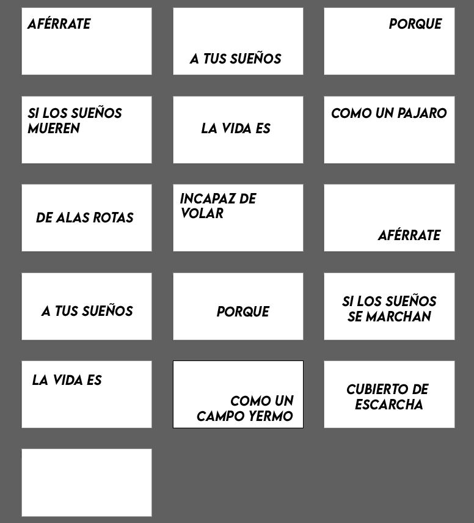

4. Dibujar con herramienta pluma contorno de pájaro en movimiento (16 veces para generar sensación de movimiento real tipo GIFT) y rellenar. Hacer solo silueta sin tanto detalle sino no sé apreciaría mucho.

5. Ordenar todo por mesa de trabajo, poner en posición correcta cada pájaro manteniendo una linea imaginaria para generar movimiento.

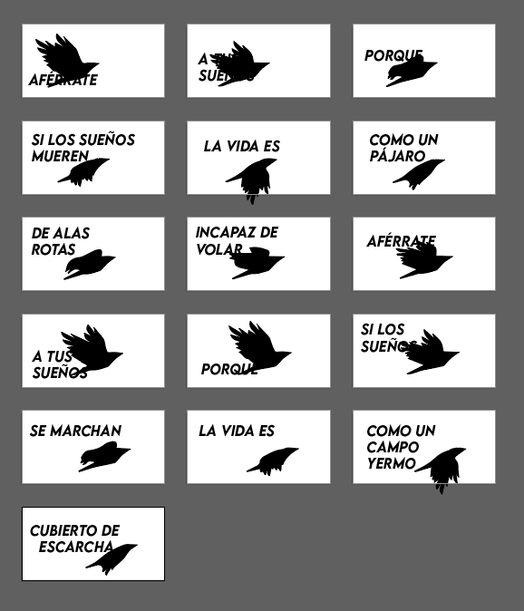

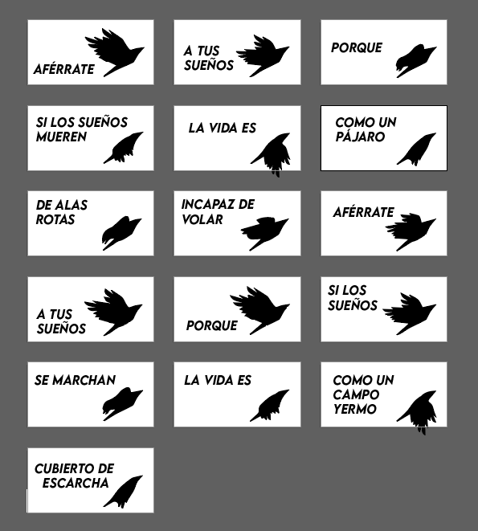

6. Descargar imágenes.


7. Pasar imágenes a image2cpp.

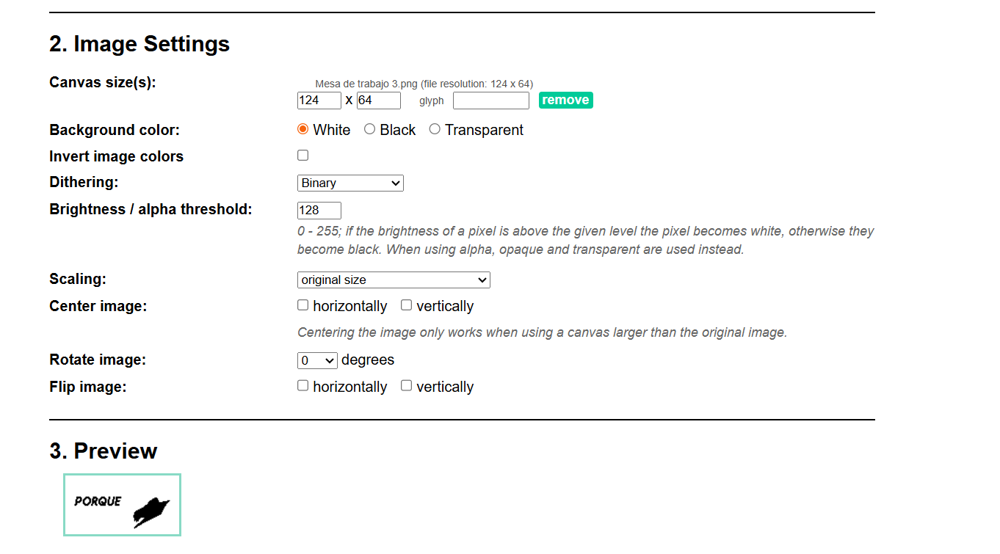

8. Copiar códigos y pasarlos a WOKWI para probarlos.

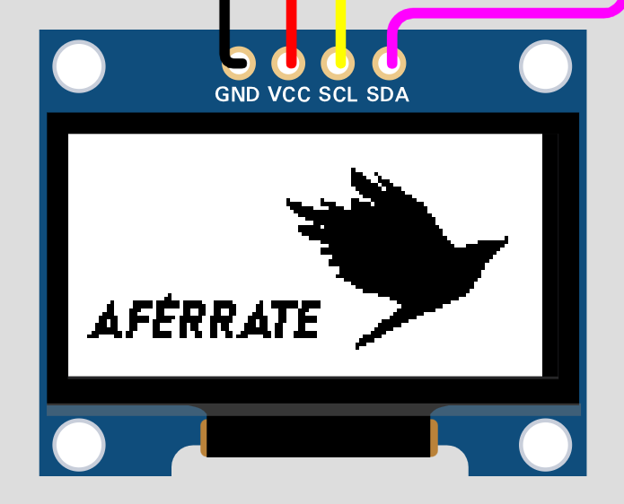

9. Mandar evidencia al grupo para ver errores y opiniones.

10. Corregir errores en el illustrator y descargar las nuevas versiones.

11. Utilizar flexclip para ver una referencia del resultado tipo animado.

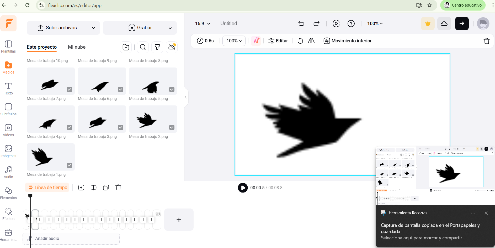

12. Mandar evidencia al grupo para ver errores y opiniones.

13. Una vez autorizado todo pasar nuevas imágenes a image2cpp.

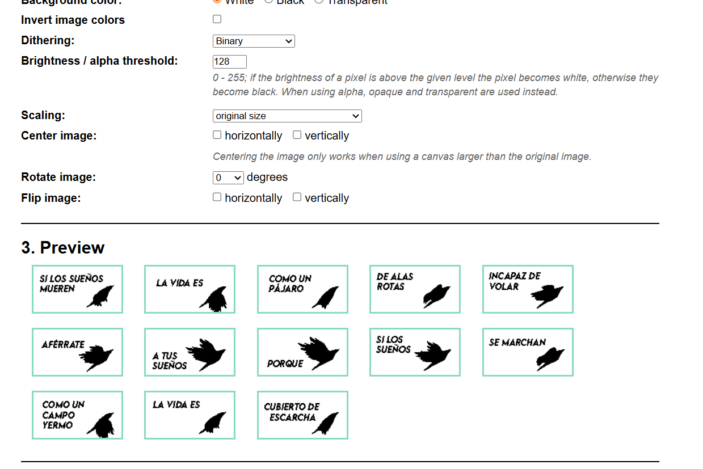

14. Copiar nuevo código y probarlo en Wokwi.

15. Al ver que funciona mandar a grupo de trabajo.

Extras:

- Todo lo que fue registrado durante el proceso igual fue mandado al grupo de trabajo.

Video proceso: <https://youtu.be/apL3aa1PRMo>

### Primer código de prueba

Se utilizo para verificar si los códigos por fotogramas funcionaban y como prueba para ver el formato utilizado en las imágenes.
⠀⠀⠀⠀
```cpp
#include <Wire.h>
#include <Adafruit_GFX.h>
#include <Adafruit_SSD1306.h>

#define SCREEN_WIDTH 128
#define SCREEN_HEIGHT 64
#define OLED_RESET -1
Adafruit_SSD1306 pantallita(SCREEN_WIDTH, SCREEN_HEIGHT, &Wire, OLED_RESET);

int contador = 0;

const unsigned char foto4 [] PROGMEM = {
  // 'foto4 128x64px
0xff, 0xff, 0xff, 0xff, 0xff, 0xff, 0xff, 0xff, 0xff, 0xff, 0xff, 0xff, 0xff, 0xff, 0xff, 0xf0, 
 0xff, 0xff, 0xff, 0xff, 0xff, 0xff, 0xff, 0xff, 0xff, 0xff, 0xff, 0xff, 0xff, 0xff, 0xff, 0xf0, 
 0xff, 0xff, 0xff, 0xff, 0xff, 0xff, 0xff, 0xff, 0xff, 0xff, 0xff, 0xff, 0xff, 0xff, 0xff, 0xf0, 
 0xff, 0xff, 0xff, 0xff, 0xff, 0xff, 0xff, 0xff, 0xff, 0xff, 0xff, 0xff, 0xff, 0xff, 0xff, 0xf0, 
 0xff, 0xff, 0xff, 0xff, 0xff, 0xff, 0xff, 0xff, 0xff, 0xff, 0xff, 0xff, 0xff, 0xff, 0xff, 0xf0, 
 0xff, 0xff, 0xff, 0xff, 0xff, 0xff, 0xff, 0xff, 0xff, 0xff, 0xff, 0xff, 0xff, 0xff, 0xff, 0xf0, 
 0xff, 0xff, 0xff, 0xff, 0xff, 0xff, 0xff, 0xff, 0xff, 0xff, 0xff, 0xff, 0xff, 0xff, 0xff, 0xf0, 
 0xff, 0xff, 0xff, 0xff, 0xff, 0xff, 0xff, 0xff, 0xff, 0xff, 0xff, 0xff, 0xff, 0xff, 0xff, 0xf0, 
 0xff, 0xff, 0xff, 0xff, 0xff, 0xff, 0xff, 0xff, 0xff, 0xff, 0xff, 0xff, 0xff, 0xff, 0xff, 0xf0, 
 0xff, 0xff, 0xff, 0xff, 0xff, 0xff, 0xff, 0xff, 0xff, 0xff, 0xff, 0xff, 0xff, 0xff, 0xff, 0xf0, 
 0xff, 0xff, 0xff, 0xff, 0xff, 0xff, 0xff, 0xff, 0xff, 0xf1, 0x7f, 0xff, 0xff, 0xff, 0xff, 0xf0, 
 0xff, 0xff, 0xff, 0xff, 0xff, 0xff, 0xff, 0xff, 0xff, 0xfc, 0xff, 0xff, 0xff, 0xff, 0xff, 0xf0, 
 0xff, 0xf1, 0xcf, 0x9f, 0x87, 0xc7, 0xf8, 0xe7, 0x20, 0x7f, 0x38, 0x7c, 0x7f, 0xff, 0xff, 0xf0, 
 0xff, 0xe0, 0xcf, 0x9f, 0x03, 0x83, 0xf0, 0x67, 0x20, 0x4f, 0x30, 0x38, 0x3f, 0xff, 0xff, 0xf0, 
 0xff, 0xcd, 0x9f, 0x1e, 0x31, 0x9b, 0xf3, 0x67, 0x27, 0xc6, 0x63, 0x19, 0xbf, 0xff, 0xff, 0xf0, 
 0xff, 0xcf, 0x9f, 0x3c, 0x79, 0x9f, 0xf3, 0xce, 0x67, 0xc6, 0x47, 0x99, 0xff, 0xff, 0xff, 0xf0, 
 0xff, 0xc3, 0x9f, 0x3c, 0xf9, 0x8f, 0xf1, 0xce, 0x60, 0xc2, 0x4f, 0x98, 0xff, 0xff, 0xff, 0xf0, 
 0xff, 0xf1, 0x9f, 0x3c, 0xf9, 0xc7, 0xf8, 0xce, 0x41, 0xc0, 0x4f, 0x9c, 0x7f, 0xff, 0xff, 0xf0, 
 0xff, 0xf9, 0x9f, 0x3c, 0xf1, 0xe3, 0xfc, 0x4e, 0x4f, 0x98, 0x4f, 0x1e, 0x3f, 0xff, 0xff, 0xf0, 
 0xff, 0x99, 0x9f, 0x3c, 0x73, 0x73, 0xee, 0x4c, 0x4f, 0x9c, 0x47, 0x37, 0x3f, 0xff, 0xff, 0xf0, 
 0xff, 0x81, 0x3e, 0x06, 0x06, 0x07, 0xc0, 0xc0, 0xc1, 0x9e, 0xe0, 0x60, 0x7f, 0xff, 0xff, 0xf0, 
 0xff, 0xc3, 0x3e, 0x07, 0x0f, 0x0f, 0xe1, 0xe1, 0xc1, 0x9f, 0xf0, 0xf0, 0xff, 0xff, 0xff, 0xf0, 
 0xff, 0xff, 0xff, 0xff, 0xff, 0xff, 0xff, 0xff, 0xff, 0xff, 0xff, 0xff, 0xff, 0xff, 0xff, 0xf0, 
 0xff, 0xff, 0xff, 0xff, 0xff, 0xff, 0xff, 0xff, 0xff, 0xff, 0xff, 0xff, 0xff, 0xff, 0xff, 0xf0, 
 0xff, 0xff, 0xff, 0xff, 0xff, 0xff, 0xff, 0xff, 0xff, 0xff, 0xff, 0xff, 0xff, 0xff, 0xff, 0xf0, 
 0xff, 0xff, 0xff, 0xff, 0xff, 0xff, 0xff, 0xff, 0xff, 0xff, 0xff, 0xff, 0xff, 0xff, 0xff, 0xf0, 
 0xff, 0xff, 0xe9, 0xcc, 0x10, 0x70, 0x2f, 0x3f, 0xff, 0xff, 0xff, 0xff, 0xff, 0xff, 0xbf, 0xf0, 
 0xff, 0xef, 0xc9, 0xcc, 0x10, 0x30, 0x2f, 0x3f, 0xff, 0xff, 0xff, 0xff, 0xff, 0xe0, 0x7f, 0xf0, 
 0xff, 0xcf, 0x99, 0xc8, 0xf3, 0x33, 0xc7, 0x3f, 0xff, 0xff, 0xff, 0xff, 0xfe, 0x00, 0xff, 0xf0, 
 0xff, 0xc7, 0x93, 0x99, 0xf3, 0x33, 0xc3, 0x3f, 0xff, 0xff, 0xff, 0xff, 0xfc, 0x01, 0xff, 0xf0, 
 0xff, 0xc7, 0x13, 0x98, 0x20, 0x70, 0x40, 0x7f, 0xff, 0xff, 0xff, 0xff, 0xf0, 0x01, 0xff, 0xf0, 
 0xff, 0xc2, 0x13, 0x98, 0x20, 0x60, 0xc8, 0x7f, 0xff, 0xff, 0xff, 0xff, 0xc0, 0x03, 0xff, 0xf0, 
 0xff, 0xc0, 0x13, 0x99, 0xe4, 0xe7, 0xcc, 0x7f, 0xff, 0xff, 0xff, 0xff, 0x00, 0x07, 0xff, 0xf0, 
 0xff, 0xc9, 0x13, 0x19, 0xe4, 0xe7, 0xcc, 0x7f, 0xff, 0xff, 0xff, 0xfe, 0x00, 0x0f, 0xff, 0xf0, 
 0xff, 0x99, 0x30, 0x30, 0x26, 0x60, 0x9e, 0x7f, 0xff, 0xff, 0xff, 0xf8, 0x00, 0x0f, 0xff, 0xf0, 
 0xff, 0x9f, 0x38, 0x70, 0x26, 0x60, 0x9f, 0xff, 0xff, 0xff, 0xff, 0xf0, 0x00, 0x1f, 0xff, 0xf0, 
 0xff, 0xff, 0xff, 0xff, 0xff, 0xff, 0xff, 0xff, 0xff, 0xff, 0xff, 0xe0, 0x00, 0x3f, 0xff, 0xf0, 
 0xff, 0xff, 0xff, 0xff, 0xff, 0xff, 0xff, 0xff, 0xff, 0xff, 0xff, 0xc0, 0x00, 0x3f, 0xff, 0xf0, 
 0xff, 0xff, 0xff, 0xff, 0xff, 0xff, 0xff, 0xff, 0xff, 0xff, 0xff, 0x80, 0x00, 0x3f, 0xff, 0xf0, 
 0xff, 0xff, 0xff, 0xff, 0xff, 0xff, 0xff, 0xff, 0xff, 0xff, 0xfe, 0x00, 0x00, 0x7f, 0xff, 0xf0, 
 0xff, 0xff, 0xff, 0xff, 0xff, 0xff, 0xff, 0xff, 0xff, 0xff, 0xfc, 0x00, 0x00, 0x7f, 0xff, 0xf0, 
 0xff, 0xff, 0xff, 0xff, 0xff, 0xff, 0xff, 0xff, 0xff, 0xff, 0xf8, 0x00, 0x00, 0x7f, 0xff, 0xf0, 
 0xff, 0xff, 0xff, 0xff, 0xff, 0xff, 0xff, 0xff, 0xff, 0xff, 0xf8, 0x00, 0x00, 0xff, 0xff, 0xf0, 
 0xff, 0xff, 0xff, 0xff, 0xff, 0xff, 0xff, 0xff, 0xff, 0xff, 0xf0, 0x00, 0x00, 0xff, 0xff, 0xf0, 
 0xff, 0xff, 0xff, 0xff, 0xff, 0xff, 0xff, 0xff, 0xff, 0xff, 0xf0, 0x00, 0x01, 0xff, 0xff, 0xf0, 
 0xff, 0xff, 0xff, 0xff, 0xff, 0xff, 0xff, 0xff, 0xff, 0xff, 0xf0, 0x00, 0x01, 0xff, 0xff, 0xf0, 
 0xff, 0xff, 0xff, 0xff, 0xff, 0xff, 0xff, 0xff, 0xff, 0xff, 0xf0, 0x00, 0x00, 0xff, 0xff, 0xf0, 
 0xff, 0xff, 0xff, 0xff, 0xff, 0xff, 0xff, 0xff, 0xff, 0xff, 0xf0, 0x00, 0x00, 0xff, 0xff, 0xf0, 
 0xff, 0xff, 0xff, 0xff, 0xff, 0xff, 0xff, 0xff, 0xff, 0xff, 0xf0, 0x00, 0x0c, 0xff, 0xff, 0xf0, 
 0xff, 0xff, 0xff, 0xff, 0xff, 0xff, 0xff, 0xff, 0xff, 0xff, 0xe0, 0x00, 0x6e, 0xff, 0xff, 0xf0, 
 0xff, 0xff, 0xff, 0xff, 0xff, 0xff, 0xff, 0xff, 0xff, 0xff, 0xc0, 0x01, 0xff, 0xff, 0xff, 0xf0, 
 0xff, 0xff, 0xff, 0xff, 0xff, 0xff, 0xff, 0xff, 0xff, 0xff, 0x80, 0x01, 0xff, 0xff, 0xff, 0xf0, 
 0xff, 0xff, 0xff, 0xff, 0xff, 0xff, 0xff, 0xff, 0xff, 0xff, 0x00, 0x01, 0xff, 0xff, 0xff, 0xf0, 
 0xff, 0xff, 0xff, 0xff, 0xff, 0xff, 0xff, 0xff, 0xff, 0xfe, 0x0c, 0x00, 0xff, 0xff, 0xff, 0xf0, 
 0xff, 0xff, 0xff, 0xff, 0xff, 0xff, 0xff, 0xff, 0xff, 0xfc, 0x3c, 0x88, 0xff, 0xff, 0xff, 0xf0, 
 0xff, 0xff, 0xff, 0xff, 0xff, 0xff, 0xff, 0xff, 0xff, 0xf0, 0xff, 0xcc, 0xff, 0xff, 0xff, 0xf0, 
 0xff, 0xff, 0xff, 0xff, 0xff, 0xff, 0xff, 0xff, 0xff, 0xe3, 0xff, 0xff, 0xff, 0xff, 0xff, 0xf0, 
 0xff, 0xff, 0xff, 0xff, 0xff, 0xff, 0xff, 0xff, 0xff, 0xef, 0xff, 0xff, 0xff, 0xff, 0xff, 0xf0, 
 0xff, 0xff, 0xff, 0xff, 0xff, 0xff, 0xff, 0xff, 0xff, 0xff, 0xff, 0xff, 0xff, 0xff, 0xff, 0xf0, 
 0xff, 0xff, 0xff, 0xff, 0xff, 0xff, 0xff, 0xff, 0xff, 0xff, 0xff, 0xff, 0xff, 0xff, 0xff, 0xf0, 
 0xff, 0xff, 0xff, 0xff, 0xff, 0xff, 0xff, 0xff, 0xff, 0xff, 0xff, 0xff, 0xff, 0xff, 0xff, 0xf0, 
 0xff, 0xff, 0xff, 0xff, 0xff, 0xff, 0xff, 0xff, 0xff, 0xff, 0xff, 0xff, 0xff, 0xff, 0xff, 0xf0, 
 0xff, 0xff, 0xff, 0xff, 0xff, 0xff, 0xff, 0xff, 0xff, 0xff, 0xff, 0xff, 0xff, 0xff, 0xff, 0xf0, 
 0xff, 0xff, 0xff, 0xff, 0xff, 0xff, 0xff, 0xff, 0xff, 0xff, 0xff, 0xff, 0xff, 0xff, 0xff, 0xf0
 };

const unsigned char foto10 [] PROGMEM = {
  //'foto10', 128x64px
0xff, 0xff, 0xff, 0xff, 0xff, 0xff, 0xff, 0xff, 0xff, 0xff, 0xff, 0xff, 0xff, 0xff, 0xff, 0xf0, 
 0xff, 0xff, 0xff, 0xff, 0xff, 0xff, 0xff, 0xff, 0xff, 0xff, 0xff, 0xff, 0xff, 0xff, 0xff, 0xf0, 
 0xff, 0xff, 0xff, 0xff, 0xff, 0xff, 0xff, 0xff, 0xff, 0xff, 0xff, 0xff, 0xff, 0xff, 0xff, 0xf0, 
 0xff, 0xff, 0xff, 0xff, 0xff, 0xff, 0xff, 0xff, 0xff, 0xff, 0xff, 0xff, 0xff, 0xff, 0xff, 0xf0, 
 0xff, 0xff, 0xff, 0xff, 0xff, 0xff, 0xff, 0xff, 0xff, 0xff, 0xff, 0xff, 0xff, 0xff, 0xff, 0xf0, 
 0xff, 0xff, 0xff, 0xff, 0xff, 0xff, 0xff, 0xff, 0xff, 0xff, 0xff, 0xff, 0xff, 0xff, 0xff, 0xf0, 
 0xff, 0xff, 0xff, 0xff, 0xff, 0xff, 0xff, 0xff, 0xff, 0xff, 0xff, 0xff, 0xff, 0xff, 0xff, 0xf0, 
 0xff, 0xff, 0xff, 0xff, 0xff, 0xff, 0xff, 0xff, 0xff, 0xff, 0xff, 0xff, 0xff, 0xff, 0xff, 0xf0, 
 0xff, 0xff, 0xff, 0xff, 0xff, 0xff, 0xff, 0xff, 0xff, 0xff, 0xff, 0xff, 0xff, 0xff, 0xff, 0xf0, 
 0xff, 0xff, 0xff, 0xff, 0xff, 0xff, 0xff, 0xff, 0xff, 0xff, 0xff, 0xff, 0xff, 0xff, 0xff, 0xf0, 
 0xff, 0xff, 0xff, 0xff, 0xff, 0xff, 0xff, 0xff, 0xff, 0xff, 0xff, 0xff, 0xff, 0xff, 0xff, 0xf0, 
 0xff, 0xff, 0xff, 0xff, 0xff, 0xff, 0xff, 0xff, 0xff, 0xff, 0xff, 0xff, 0xff, 0xff, 0xff, 0xf0, 
 0xff, 0xff, 0xff, 0xff, 0xff, 0xff, 0xff, 0xff, 0xff, 0xff, 0xff, 0xff, 0xff, 0xff, 0xff, 0xf0, 
 0xff, 0xff, 0xff, 0xff, 0xff, 0xff, 0xff, 0xff, 0xff, 0xf1, 0xff, 0xff, 0xff, 0xff, 0xff, 0xf0, 
 0xff, 0xff, 0xff, 0xff, 0xff, 0xff, 0xff, 0xff, 0xff, 0xf0, 0xef, 0xff, 0xff, 0xff, 0xff, 0xf0, 
 0xff, 0xff, 0xff, 0xff, 0xff, 0xff, 0xff, 0xff, 0xff, 0xf0, 0x63, 0xff, 0xff, 0xff, 0xff, 0xf0, 
 0xff, 0xff, 0xff, 0xff, 0xff, 0xff, 0xff, 0xff, 0xff, 0xf0, 0x10, 0xff, 0xff, 0xff, 0xff, 0xf0, 
 0xff, 0xff, 0xff, 0xff, 0xff, 0xff, 0xff, 0xff, 0xff, 0xf8, 0x00, 0x7f, 0xff, 0xff, 0xff, 0xf0, 
 0xff, 0xff, 0xff, 0xff, 0xff, 0xff, 0xff, 0xff, 0xff, 0xfc, 0x00, 0x3f, 0xff, 0xff, 0xff, 0xf0, 
 0xff, 0xff, 0xff, 0xff, 0xff, 0xff, 0xff, 0xff, 0xff, 0xfe, 0x00, 0x0f, 0xff, 0xff, 0xff, 0xf0, 
 0xff, 0xff, 0xff, 0xff, 0xff, 0xff, 0xff, 0xff, 0xff, 0xf7, 0x00, 0x07, 0xff, 0xff, 0xff, 0xf0, 
 0xff, 0xff, 0xff, 0xff, 0xff, 0xff, 0xff, 0xff, 0xff, 0xf0, 0x00, 0x03, 0xff, 0xff, 0xff, 0xf0, 
 0xff, 0xff, 0xff, 0xff, 0xff, 0xff, 0xff, 0xff, 0xff, 0xf0, 0x00, 0x01, 0xff, 0xff, 0xff, 0xf0, 
 0xff, 0xff, 0xff, 0xff, 0xff, 0xff, 0xff, 0xff, 0xff, 0xf8, 0x00, 0x01, 0xff, 0xff, 0xff, 0xf0, 
 0xff, 0xff, 0xff, 0xff, 0xff, 0xff, 0xff, 0xff, 0x9f, 0xfc, 0x00, 0x00, 0xff, 0xff, 0xff, 0xf0, 
 0xff, 0xff, 0xff, 0xff, 0xff, 0xff, 0xff, 0x1f, 0xc0, 0x7e, 0x00, 0x00, 0xff, 0xff, 0xff, 0xf0, 
 0xff, 0xff, 0xff, 0xff, 0xff, 0xff, 0xff, 0x80, 0x60, 0x00, 0x80, 0x00, 0x7f, 0xff, 0xff, 0xf0, 
 0xff, 0xff, 0xff, 0xff, 0xff, 0xff, 0xff, 0xc0, 0x00, 0x00, 0x00, 0x00, 0x7f, 0xff, 0xff, 0xf0, 
 0xff, 0xff, 0xff, 0xff, 0xff, 0xff, 0xff, 0xe0, 0x00, 0x00, 0x00, 0x00, 0x3f, 0xf0, 0x7f, 0xf0, 
 0xff, 0xff, 0xff, 0xff, 0xff, 0xff, 0xff, 0xf8, 0x00, 0x00, 0x00, 0x00, 0x1f, 0x00, 0xff, 0xf0, 
 0xff, 0xff, 0xff, 0xff, 0xff, 0xff, 0xff, 0xff, 0x80, 0x00, 0x00, 0x00, 0x00, 0x01, 0xff, 0xf0, 
 0xff, 0xff, 0xff, 0xff, 0xff, 0xff, 0xff, 0xe0, 0x00, 0x00, 0x00, 0x00, 0x00, 0x01, 0xff, 0xf0, 
 0xff, 0xfe, 0xfe, 0x00, 0xe7, 0x1f, 0xff, 0xf0, 0x00, 0x00, 0x00, 0x00, 0x00, 0x03, 0xff, 0xf0, 
 0xff, 0xfc, 0xfe, 0x00, 0xe6, 0x0f, 0xff, 0xf8, 0x00, 0x00, 0x00, 0x00, 0x00, 0x07, 0xff, 0xf0, 
 0xff, 0xfc, 0xff, 0x9c, 0xe6, 0x6f, 0xff, 0xff, 0xf0, 0x00, 0x00, 0x00, 0x00, 0x0f, 0xff, 0xf0, 
 0xff, 0xf8, 0xff, 0x9c, 0xe6, 0x7f, 0xff, 0xff, 0xe0, 0x00, 0x00, 0x00, 0x00, 0x0f, 0xff, 0xf0, 
 0xff, 0xf0, 0x7f, 0x99, 0xce, 0x3f, 0xff, 0xff, 0x80, 0x00, 0x00, 0x00, 0x00, 0x1f, 0xff, 0xf0, 
 0xff, 0xf2, 0x7f, 0x99, 0xcf, 0x1f, 0xff, 0xff, 0xe0, 0x00, 0x00, 0x00, 0x00, 0x1f, 0xff, 0xf0, 
 0xff, 0xe2, 0x7f, 0x39, 0xcf, 0x8f, 0xff, 0xff, 0xf0, 0x00, 0x00, 0x00, 0x00, 0x3f, 0xff, 0xf0, 
 0xff, 0xe0, 0x7f, 0x39, 0x8d, 0xcf, 0xff, 0xff, 0xe0, 0x00, 0x00, 0x00, 0x00, 0x3f, 0xff, 0xf0, 
 0xff, 0xc0, 0x3f, 0x38, 0x18, 0x1f, 0xff, 0xff, 0xf8, 0x00, 0x00, 0x00, 0x00, 0x7f, 0xff, 0xf0, 
 0xff, 0x8f, 0x3f, 0x3c, 0x3c, 0x3f, 0xff, 0xff, 0xfc, 0x00, 0x00, 0x00, 0x00, 0x7f, 0xff, 0xf0, 
 0xff, 0xff, 0xff, 0xff, 0xff, 0xff, 0xff, 0xff, 0xfc, 0x00, 0x00, 0x00, 0x00, 0xff, 0xff, 0xf0, 
 0xff, 0xff, 0xff, 0xff, 0xff, 0xff, 0xff, 0xff, 0xff, 0xc0, 0x00, 0x00, 0x01, 0xff, 0xff, 0xf0, 
 0xff, 0xff, 0xff, 0xff, 0xe2, 0xff, 0xff, 0xff, 0xff, 0xf8, 0x00, 0x00, 0x03, 0xff, 0xff, 0xf0, 
 0xff, 0xff, 0xff, 0xff, 0xf9, 0xff, 0xff, 0xff, 0xff, 0xff, 0x00, 0x00, 0x0f, 0xff, 0xff, 0xf0, 
 0xff, 0xf1, 0xce, 0x60, 0xfe, 0x78, 0x7c, 0x7f, 0xff, 0xff, 0xf0, 0x00, 0x1f, 0xff, 0xff, 0xf0, 
 0xff, 0xe0, 0xce, 0x60, 0x9e, 0x60, 0x38, 0x3f, 0xff, 0xff, 0xfc, 0x00, 0x7f, 0xff, 0xff, 0xf0, 
 0xff, 0xe6, 0xce, 0x47, 0x8c, 0xc7, 0x13, 0x7f, 0xff, 0xff, 0xf8, 0x01, 0xff, 0xff, 0xff, 0xf0, 
 0xff, 0xe7, 0xce, 0x4f, 0x8c, 0xcf, 0x93, 0xff, 0xff, 0xff, 0xf0, 0x0f, 0xff, 0xff, 0xff, 0xf0, 
 0xff, 0xe3, 0x9c, 0xc1, 0x84, 0x9f, 0x90, 0xff, 0xff, 0xff, 0xe0, 0x3f, 0xff, 0xff, 0xff, 0xf0, 
 0xff, 0xf1, 0x9c, 0xc1, 0x80, 0x9f, 0x9c, 0x7f, 0xff, 0xff, 0xc0, 0xff, 0xff, 0xff, 0xff, 0xf0, 
 0xff, 0xf8, 0x9c, 0xcf, 0x30, 0x9f, 0x1e, 0x7f, 0xff, 0xff, 0x81, 0xff, 0xff, 0xff, 0xff, 0xf0, 
 0xff, 0xdc, 0x98, 0xcf, 0x38, 0x8e, 0x26, 0x7f, 0xff, 0xff, 0x07, 0xff, 0xff, 0xff, 0xff, 0xf0, 
 0xff, 0x81, 0x81, 0x81, 0x3d, 0xc0, 0x60, 0x7f, 0xff, 0xfe, 0x0f, 0xff, 0xff, 0xff, 0xff, 0xf0, 
 0xff, 0xc3, 0xc3, 0x81, 0x3f, 0xe0, 0xf0, 0xff, 0xff, 0xfc, 0x3f, 0xff, 0xff, 0xff, 0xff, 0xf0, 
 0xff, 0xff, 0xff, 0xff, 0xff, 0xff, 0xff, 0xff, 0xff, 0xf8, 0x7f, 0xff, 0xff, 0xff, 0xff, 0xf0, 
 0xff, 0xff, 0xff, 0xff, 0xff, 0xff, 0xff, 0xff, 0xff, 0xf1, 0xff, 0xff, 0xff, 0xff, 0xff, 0xf0, 
 0xff, 0xff, 0xff, 0xff, 0xff, 0xff, 0xff, 0xff, 0xff, 0xe7, 0xff, 0xff, 0xff, 0xff, 0xff, 0xf0, 
 0xff, 0xff, 0xff, 0xff, 0xff, 0xff, 0xff, 0xff, 0xff, 0xff, 0xff, 0xff, 0xff, 0xff, 0xff, 0xf0, 
 0xff, 0xff, 0xff, 0xff, 0xff, 0xff, 0xff, 0xff, 0xff, 0xff, 0xff, 0xff, 0xff, 0xff, 0xff, 0xf0, 
 0xff, 0xff, 0xff, 0xff, 0xff, 0xff, 0xff, 0xff, 0xff, 0xff, 0xff, 0xff, 0xff, 0xff, 0xff, 0xf0, 
 0xff, 0xff, 0xff, 0xff, 0xff, 0xff, 0xff, 0xff, 0xff, 0xff, 0xff, 0xff, 0xff, 0xff, 0xff, 0xf0, 
 0xff, 0xff, 0xff, 0xff, 0xff, 0xff, 0xff, 0xff, 0xff, 0xff, 0xff, 0xff, 0xff, 0xff, 0xff, 0xf0
};

const unsigned char foto1 [] PROGMEM = {
  //'foto1', 128x64px
0xff, 0xff, 0xff, 0xff, 0xff, 0xff, 0xff, 0xff, 0xff, 0xff, 0xff, 0xff, 0xff, 0xff, 0xff, 0xf0, 
 0xff, 0xff, 0xff, 0xff, 0xff, 0xff, 0xff, 0xff, 0xff, 0xff, 0xff, 0xff, 0xff, 0xff, 0xff, 0xf0, 
 0xff, 0xff, 0xff, 0xff, 0xff, 0xff, 0xff, 0xff, 0xff, 0xff, 0xff, 0xff, 0xff, 0xff, 0xff, 0xf0, 
 0xff, 0xff, 0xff, 0xff, 0xff, 0xff, 0xff, 0xff, 0xff, 0xff, 0xff, 0xff, 0xff, 0xff, 0xff, 0xf0, 
 0xff, 0xff, 0xff, 0xff, 0xff, 0xff, 0xff, 0xff, 0xff, 0xff, 0xff, 0xff, 0xff, 0xff, 0xff, 0xf0, 
 0xff, 0xff, 0xff, 0xff, 0xff, 0xff, 0xff, 0xff, 0xff, 0xff, 0xff, 0xff, 0xff, 0xff, 0xff, 0xf0, 
 0xff, 0xff, 0xff, 0xff, 0xff, 0xff, 0xff, 0xff, 0xff, 0xff, 0xff, 0xff, 0xff, 0xff, 0xff, 0xf0, 
 0xff, 0xff, 0xff, 0xff, 0xff, 0xff, 0xff, 0xff, 0xff, 0xff, 0xff, 0xff, 0xff, 0xff, 0xff, 0xf0, 
 0xff, 0xff, 0xff, 0xff, 0xff, 0xff, 0xff, 0xff, 0xff, 0xff, 0xff, 0xff, 0xff, 0xff, 0xff, 0xf0, 
 0xff, 0xff, 0xff, 0xff, 0xff, 0xff, 0xff, 0xff, 0xff, 0xdf, 0xff, 0xff, 0xff, 0xff, 0xff, 0xf0, 
 0xff, 0xff, 0xff, 0xff, 0xff, 0xff, 0xff, 0xff, 0xff, 0xc7, 0x7f, 0xff, 0xff, 0xff, 0xff, 0xf0, 
 0xff, 0xff, 0xff, 0xff, 0xff, 0xff, 0xff, 0xff, 0xff, 0xc3, 0xbf, 0xff, 0xff, 0xff, 0xff, 0xf0, 
 0xff, 0xff, 0xff, 0xff, 0xff, 0xff, 0xff, 0xff, 0xff, 0xc1, 0x8f, 0xff, 0xff, 0xff, 0xff, 0xf0, 
 0xff, 0xff, 0xff, 0xff, 0xff, 0xff, 0xff, 0xff, 0xff, 0xc0, 0x47, 0xff, 0xff, 0xff, 0xff, 0xf0, 
 0xff, 0xff, 0xff, 0xff, 0xff, 0xff, 0xff, 0xff, 0xff, 0xe0, 0x21, 0xff, 0xff, 0xff, 0xff, 0xf0, 
 0xff, 0xff, 0xff, 0xff, 0xff, 0xff, 0xff, 0xff, 0xff, 0xf0, 0x00, 0xff, 0xff, 0xff, 0xff, 0xf0, 
 0xff, 0xff, 0xff, 0xff, 0xff, 0xff, 0xff, 0xff, 0xff, 0xf8, 0x00, 0x3f, 0xff, 0xff, 0xff, 0xf0, 
 0xff, 0xff, 0xff, 0xff, 0xff, 0xff, 0xff, 0xbf, 0xdf, 0xce, 0x00, 0x1f, 0xff, 0xff, 0xff, 0xf0, 
 0xff, 0xff, 0xff, 0xff, 0xff, 0xff, 0xff, 0x87, 0xc3, 0xc1, 0x00, 0x07, 0xff, 0xff, 0xff, 0xf0, 
 0xff, 0xff, 0xff, 0xff, 0xff, 0xff, 0xff, 0xc0, 0xf0, 0xc0, 0x00, 0x03, 0xff, 0xff, 0xff, 0xf0, 
 0xff, 0xff, 0xff, 0xff, 0xff, 0xff, 0xff, 0xe0, 0x00, 0x00, 0x00, 0x03, 0xff, 0xff, 0xff, 0xf0, 
 0xff, 0xff, 0xff, 0xff, 0xff, 0xff, 0xff, 0xf0, 0x00, 0x00, 0x00, 0x01, 0xff, 0xff, 0xff, 0xf0, 
 0xff, 0xff, 0xff, 0xff, 0xff, 0xff, 0xff, 0xfc, 0x00, 0x00, 0x00, 0x00, 0xff, 0xff, 0xff, 0xf0, 
 0xff, 0xff, 0xff, 0xff, 0xff, 0xff, 0xff, 0xff, 0x00, 0x00, 0x00, 0x00, 0xff, 0xff, 0xff, 0xf0, 
 0xff, 0xff, 0xff, 0xff, 0xff, 0xff, 0xff, 0xf0, 0x20, 0x00, 0x00, 0x00, 0x7f, 0xff, 0xff, 0xf0, 
 0xff, 0xff, 0xff, 0xff, 0xff, 0xff, 0xff, 0xf0, 0x00, 0x00, 0x00, 0x00, 0x3f, 0xff, 0xff, 0xf0, 
 0xff, 0xff, 0xff, 0xff, 0xff, 0xff, 0xff, 0xf8, 0x00, 0x00, 0x00, 0x00, 0x3f, 0xff, 0xff, 0xf0, 
 0xff, 0xff, 0xff, 0xff, 0xff, 0xff, 0xff, 0xfe, 0x00, 0x00, 0x00, 0x00, 0x1f, 0xff, 0xdf, 0xf0, 
 0xff, 0xff, 0xff, 0xff, 0xff, 0xff, 0xff, 0xff, 0xc0, 0x00, 0x00, 0x00, 0x0f, 0xe0, 0x1f, 0xf0, 
 0xff, 0xff, 0xff, 0xff, 0xff, 0xff, 0xff, 0xff, 0xf0, 0x00, 0x00, 0x00, 0x07, 0x00, 0x3f, 0xf0, 
 0xff, 0xff, 0xff, 0xff, 0xff, 0xff, 0xff, 0xff, 0xc0, 0x00, 0x00, 0x00, 0x00, 0x00, 0x7f, 0xf0, 
 0xff, 0xff, 0xff, 0xff, 0xff, 0xff, 0xff, 0xff, 0xc0, 0x00, 0x00, 0x00, 0x00, 0x00, 0xff, 0xf0, 
 0xff, 0xff, 0xff, 0xff, 0xff, 0xff, 0xff, 0xff, 0xf8, 0x00, 0x00, 0x00, 0x00, 0x01, 0xff, 0xf0, 
 0xff, 0xff, 0xff, 0xff, 0xff, 0xff, 0xff, 0xff, 0xf0, 0x00, 0x00, 0x00, 0x00, 0x03, 0xff, 0xf0, 
 0xff, 0xff, 0xff, 0xff, 0xff, 0xff, 0xff, 0xff, 0xf0, 0x00, 0x00, 0x00, 0x00, 0x07, 0xff, 0xf0, 
 0xff, 0xff, 0xff, 0xff, 0xff, 0xff, 0xff, 0xff, 0xfe, 0x00, 0x00, 0x00, 0x00, 0x07, 0xff, 0xf0, 
 0xff, 0xff, 0xff, 0xff, 0xff, 0xff, 0xff, 0xff, 0xfe, 0x00, 0x00, 0x00, 0x00, 0x0f, 0xff, 0xf0, 
 0xff, 0xff, 0xff, 0xff, 0xff, 0xff, 0xff, 0xff, 0xfc, 0x00, 0x00, 0x00, 0x00, 0x0f, 0xff, 0xf0, 
 0xff, 0xff, 0xff, 0xff, 0xff, 0xff, 0xff, 0xff, 0xff, 0x00, 0x00, 0x00, 0x00, 0x1f, 0xff, 0xf0, 
 0xff, 0xff, 0xff, 0xff, 0xff, 0xff, 0xff, 0xff, 0xff, 0xc0, 0x00, 0x00, 0x00, 0x3f, 0xff, 0xf0, 
 0xff, 0xff, 0xff, 0xff, 0xff, 0xff, 0xff, 0xff, 0xff, 0xe0, 0x00, 0x00, 0x00, 0x3f, 0xff, 0xf0, 
 0xff, 0xff, 0xff, 0xff, 0xff, 0xff, 0xff, 0xff, 0xff, 0xf8, 0x00, 0x00, 0x00, 0x7f, 0xff, 0xf0, 
 0xff, 0xff, 0xff, 0xdf, 0xff, 0xff, 0xff, 0xff, 0xff, 0xff, 0x80, 0x00, 0x00, 0xff, 0xff, 0xf0, 
 0xff, 0xff, 0xff, 0x9f, 0xff, 0xff, 0xff, 0xff, 0xff, 0xff, 0xf0, 0x00, 0x03, 0xff, 0xff, 0xf0, 
 0xff, 0xef, 0x82, 0x04, 0x1c, 0x1f, 0xd8, 0x08, 0x3f, 0xff, 0xfc, 0x00, 0x0f, 0xff, 0xff, 0xf0, 
 0xff, 0xcf, 0x82, 0x04, 0x0c, 0x0f, 0x98, 0x08, 0x3f, 0xff, 0xfe, 0x00, 0x3f, 0xff, 0xff, 0xf0, 
 0xff, 0xcf, 0x1e, 0x7c, 0xcc, 0xcf, 0x9e, 0x71, 0xff, 0xff, 0xfc, 0x00, 0xff, 0xff, 0xff, 0xf0, 
 0xff, 0x8f, 0x3e, 0x7c, 0xcc, 0xcf, 0x1e, 0x73, 0xff, 0xff, 0xf8, 0x07, 0xff, 0xff, 0xff, 0xf0, 
 0xff, 0x07, 0x06, 0x08, 0x18, 0x1e, 0x0e, 0x70, 0x7f, 0xff, 0xf0, 0x1f, 0xff, 0xff, 0xff, 0xf0, 
 0xff, 0x27, 0x04, 0x18, 0x18, 0x1e, 0x4e, 0x70, 0x7f, 0xff, 0xc0, 0x7f, 0xff, 0xff, 0xff, 0xf0, 
 0xfe, 0x27, 0x3c, 0xf9, 0x39, 0x3c, 0x4c, 0xf3, 0xff, 0xff, 0x81, 0xff, 0xff, 0xff, 0xff, 0xf0, 
 0xfe, 0x07, 0x3c, 0xf9, 0x39, 0x3c, 0x0c, 0xf3, 0xff, 0xff, 0x07, 0xff, 0xff, 0xff, 0xff, 0xf0, 
 0xfc, 0x02, 0x7c, 0x19, 0x99, 0x98, 0x04, 0xe0, 0x7f, 0xfe, 0x1f, 0xff, 0xff, 0xff, 0xff, 0xf0, 
 0xf8, 0xf2, 0x7c, 0x19, 0x99, 0x91, 0xe4, 0xe0, 0x7f, 0xf8, 0x3f, 0xff, 0xff, 0xff, 0xff, 0xf0, 
 0xff, 0xff, 0xff, 0xff, 0xff, 0xff, 0xff, 0xff, 0xff, 0xf0, 0xff, 0xff, 0xff, 0xff, 0xff, 0xf0, 
 0xff, 0xff, 0xff, 0xff, 0xff, 0xff, 0xff, 0xff, 0xff, 0xe3, 0xff, 0xff, 0xff, 0xff, 0xff, 0xf0, 
 0xff, 0xff, 0xff, 0xff, 0xff, 0xff, 0xff, 0xff, 0xff, 0xef, 0xff, 0xff, 0xff, 0xff, 0xff, 0xf0, 
 0xff, 0xff, 0xff, 0xff, 0xff, 0xff, 0xff, 0xff, 0xff, 0xff, 0xff, 0xff, 0xff, 0xff, 0xff, 0xf0, 
 0xff, 0xff, 0xff, 0xff, 0xff, 0xff, 0xff, 0xff, 0xff, 0xff, 0xff, 0xff, 0xff, 0xff, 0xff, 0xf0, 
 0xff, 0xff, 0xff, 0xff, 0xff, 0xff, 0xff, 0xff, 0xff, 0xff, 0xff, 0xff, 0xff, 0xff, 0xff, 0xf0, 
 0xff, 0xff, 0xff, 0xff, 0xff, 0xff, 0xff, 0xff, 0xff, 0xff, 0xff, 0xff, 0xff, 0xff, 0xff, 0xf0, 
 0xff, 0xff, 0xff, 0xff, 0xff, 0xff, 0xff, 0xff, 0xff, 0xff, 0xff, 0xff, 0xff, 0xff, 0xff, 0xf0, 
 0xff, 0xff, 0xff, 0xff, 0xff, 0xff, 0xff, 0xff, 0xff, 0xff, 0xff, 0xff, 0xff, 0xff, 0xff, 0xf0, 
 0xff, 0xff, 0xff, 0xff, 0xff, 0xff, 0xff, 0xff, 0xff, 0xff, 0xff, 0xff, 0xff, 0xff, 0xff, 0xf0
};

const unsigned char foto5 [] PROGMEM = {
  //'foto5', 128x64px
0xff, 0xff, 0xff, 0xff, 0xff, 0xff, 0xff, 0xff, 0xff, 0xff, 0xff, 0xff, 0xff, 0xff, 0xff, 0xf0, 
 0xff, 0xff, 0xff, 0xff, 0xff, 0xff, 0xff, 0xff, 0xff, 0xff, 0xff, 0xff, 0xff, 0xff, 0xff, 0xf0, 
 0xff, 0xff, 0xff, 0xff, 0xff, 0xff, 0xff, 0xff, 0xff, 0xff, 0xff, 0xff, 0xff, 0xff, 0xff, 0xf0, 
 0xff, 0xff, 0xff, 0xff, 0xff, 0xff, 0xff, 0xff, 0xff, 0xff, 0xff, 0xff, 0xff, 0xff, 0xff, 0xf0, 
 0xff, 0xff, 0xff, 0xff, 0xff, 0xff, 0xff, 0xff, 0xff, 0xff, 0xff, 0xff, 0xff, 0xff, 0xff, 0xf0, 
 0xff, 0xff, 0xff, 0xff, 0xff, 0xff, 0xff, 0xff, 0xff, 0xff, 0xff, 0xff, 0xff, 0xff, 0xff, 0xf0, 
 0xff, 0xff, 0xff, 0xff, 0xff, 0xff, 0xff, 0xff, 0xff, 0xff, 0xff, 0xff, 0xff, 0xff, 0xff, 0xf0, 
 0xff, 0xff, 0xff, 0xff, 0xff, 0xff, 0xff, 0xff, 0xff, 0xff, 0xff, 0xff, 0xff, 0xff, 0xff, 0xf0, 
 0xff, 0xff, 0xff, 0xff, 0xff, 0xff, 0xff, 0xff, 0xff, 0xff, 0xff, 0xff, 0xff, 0xff, 0xff, 0xf0, 
 0xff, 0xff, 0xff, 0xff, 0xff, 0xff, 0xff, 0xff, 0xff, 0xff, 0xff, 0xff, 0xff, 0xff, 0xff, 0xf0, 
 0xff, 0xff, 0xff, 0xff, 0xff, 0xff, 0xff, 0xff, 0xff, 0xff, 0xff, 0xff, 0xff, 0xff, 0xff, 0xf0, 
 0xff, 0xff, 0xff, 0xff, 0xff, 0xff, 0xff, 0xff, 0xff, 0xff, 0xff, 0xff, 0xff, 0xff, 0xff, 0xf0, 
 0xff, 0xff, 0xff, 0xff, 0xff, 0xff, 0xff, 0xff, 0xff, 0xff, 0xff, 0xff, 0xff, 0xff, 0xff, 0xf0, 
 0xff, 0xff, 0xff, 0xff, 0xff, 0xff, 0xff, 0xff, 0xff, 0xff, 0xff, 0xff, 0xff, 0xff, 0xff, 0xf0, 
 0xff, 0xff, 0xff, 0xff, 0xff, 0xff, 0xff, 0xff, 0xff, 0xff, 0xff, 0xff, 0xff, 0xff, 0xff, 0xf0, 
 0xff, 0xff, 0xff, 0xff, 0xff, 0xff, 0xff, 0xff, 0xff, 0xff, 0xff, 0xff, 0xff, 0xff, 0xff, 0xf0, 
 0xff, 0xff, 0xff, 0xff, 0xff, 0xff, 0xff, 0xff, 0xff, 0xff, 0xff, 0xff, 0xff, 0xff, 0xff, 0xf0, 
 0xff, 0xff, 0xff, 0xff, 0xff, 0xff, 0xff, 0xff, 0xff, 0xff, 0xff, 0xff, 0xff, 0xff, 0xff, 0xf0, 
 0xff, 0xff, 0x9f, 0xef, 0xe7, 0x99, 0x1f, 0xef, 0xf0, 0x38, 0xff, 0xff, 0xff, 0xff, 0xff, 0xf0, 
 0xff, 0xff, 0x9f, 0xcf, 0xe7, 0x99, 0x03, 0xcf, 0xf0, 0x30, 0x7f, 0xff, 0xff, 0xff, 0xff, 0xf0, 
 0xff, 0xff, 0x3f, 0xcf, 0xf3, 0x33, 0x23, 0xcf, 0xf3, 0xe6, 0xff, 0xff, 0xff, 0xff, 0xff, 0xf0, 
 0xff, 0xff, 0x3f, 0x8f, 0xf2, 0x32, 0x31, 0x8f, 0xf3, 0xe7, 0xff, 0xff, 0xff, 0xff, 0xff, 0xf0, 
 0xff, 0xff, 0x3f, 0x07, 0xf2, 0x72, 0x79, 0x07, 0xf0, 0x61, 0xff, 0xff, 0xff, 0xff, 0xff, 0xf0, 
 0xff, 0xff, 0x3f, 0x27, 0xf0, 0xf2, 0x79, 0x27, 0xe0, 0xf8, 0xff, 0xff, 0xff, 0xff, 0xff, 0xf0, 
 0xff, 0xff, 0x3e, 0x27, 0xf8, 0xf2, 0x72, 0x27, 0xe7, 0xfc, 0xff, 0xff, 0xff, 0xff, 0xff, 0xf0, 
 0xff, 0xfe, 0x3e, 0x07, 0xf9, 0xf2, 0x62, 0x07, 0xe7, 0xcc, 0xff, 0xff, 0xff, 0xff, 0xff, 0xf0, 
 0xff, 0xfe, 0x04, 0x03, 0xfb, 0xe4, 0x04, 0x03, 0xe0, 0xc0, 0xff, 0xff, 0xff, 0xff, 0xff, 0xf0, 
 0xff, 0xfe, 0x00, 0xf3, 0xfb, 0xe4, 0x18, 0xf3, 0xe0, 0xe1, 0xff, 0xff, 0xff, 0xff, 0xff, 0xf0, 
 0xff, 0xff, 0xff, 0xff, 0xff, 0xff, 0xff, 0xff, 0xff, 0xff, 0xff, 0xff, 0xff, 0xe0, 0x7f, 0xf0, 
 0xff, 0xff, 0xff, 0xff, 0xff, 0xff, 0xff, 0xff, 0xff, 0xff, 0xff, 0xff, 0xff, 0x00, 0x7f, 0xf0, 
 0xff, 0xff, 0xff, 0xff, 0xff, 0xff, 0xff, 0xff, 0xff, 0xff, 0xff, 0xff, 0xfc, 0x00, 0xff, 0xf0, 
 0xff, 0xff, 0xff, 0xff, 0xff, 0xff, 0xff, 0xff, 0xff, 0xff, 0xff, 0xff, 0xf8, 0x01, 0xff, 0xf0, 
 0xff, 0xff, 0xff, 0xff, 0xff, 0xff, 0xff, 0xff, 0xff, 0xff, 0xff, 0xff, 0xf0, 0x03, 0xff, 0xf0, 
 0xff, 0xff, 0xff, 0xff, 0xff, 0xff, 0xff, 0xff, 0xff, 0xff, 0xff, 0xff, 0xc0, 0x07, 0xff, 0xf0, 
 0xff, 0xff, 0xff, 0xff, 0xff, 0xff, 0xff, 0xff, 0xff, 0xff, 0xff, 0xff, 0x80, 0x0f, 0xff, 0xf0, 
 0xff, 0xff, 0xff, 0xff, 0xff, 0xff, 0xff, 0xff, 0xff, 0xff, 0xff, 0xfe, 0x00, 0x0f, 0xff, 0xf0, 
 0xff, 0xff, 0xff, 0xff, 0xff, 0xff, 0xff, 0xff, 0xff, 0xff, 0xff, 0xfc, 0x00, 0x1f, 0xff, 0xf0, 
 0xff, 0xff, 0xff, 0xff, 0xff, 0xff, 0xff, 0xff, 0xff, 0xff, 0xff, 0xf8, 0x00, 0x1f, 0xff, 0xf0, 
 0xff, 0xff, 0xff, 0xff, 0xff, 0xff, 0xff, 0xff, 0xff, 0xff, 0xff, 0xf0, 0x00, 0x1f, 0xff, 0xf0, 
 0xff, 0xff, 0xff, 0xff, 0xff, 0xff, 0xff, 0xff, 0xff, 0xff, 0xff, 0xe0, 0x00, 0x0f, 0xff, 0xf0, 
 0xff, 0xff, 0xff, 0xff, 0xff, 0xff, 0xff, 0xff, 0xff, 0xff, 0xff, 0xe0, 0x00, 0x07, 0xff, 0xf0, 
 0xff, 0xff, 0xff, 0xff, 0xff, 0xff, 0xff, 0xff, 0xff, 0xff, 0xff, 0xc0, 0x00, 0x03, 0xff, 0xf0, 
 0xff, 0xff, 0xff, 0xff, 0xff, 0xff, 0xff, 0xff, 0xff, 0xff, 0xff, 0x80, 0x00, 0x03, 0xff, 0xf0, 
 0xff, 0xff, 0xff, 0xff, 0xff, 0xff, 0xff, 0xff, 0xff, 0xff, 0xff, 0x00, 0x00, 0x01, 0xff, 0xf0, 
 0xff, 0xff, 0xff, 0xff, 0xff, 0xff, 0xff, 0xff, 0xff, 0xff, 0xff, 0x00, 0x00, 0x01, 0xff, 0xf0, 
 0xff, 0xff, 0xff, 0xff, 0xff, 0xff, 0xff, 0xff, 0xff, 0xff, 0xfe, 0x00, 0x00, 0x01, 0xff, 0xf0, 
 0xff, 0xff, 0xff, 0xff, 0xff, 0xff, 0xff, 0xff, 0xff, 0xff, 0xfc, 0x00, 0x00, 0x00, 0xff, 0xf0, 
 0xff, 0xff, 0xff, 0xff, 0xff, 0xff, 0xff, 0xff, 0xff, 0xff, 0xf8, 0x00, 0x00, 0x00, 0xff, 0xf0, 
 0xff, 0xff, 0xff, 0xff, 0xff, 0xff, 0xff, 0xff, 0xff, 0xff, 0xf8, 0x00, 0x00, 0x00, 0xff, 0xf0, 
 0xff, 0xff, 0xff, 0xff, 0xff, 0xff, 0xff, 0xff, 0xff, 0xff, 0xf0, 0x00, 0x00, 0x00, 0x7f, 0xf0, 
 0xff, 0xff, 0xff, 0xff, 0xff, 0xff, 0xff, 0xff, 0xff, 0xff, 0xe0, 0x00, 0x00, 0x00, 0x7f, 0xf0, 
 0xff, 0xff, 0xff, 0xff, 0xff, 0xff, 0xff, 0xff, 0xff, 0xff, 0xc1, 0x00, 0x00, 0x00, 0x7f, 0xf0, 
 0xff, 0xff, 0xff, 0xff, 0xff, 0xff, 0xff, 0xff, 0xff, 0xff, 0x83, 0x80, 0x00, 0x00, 0x3f, 0xf0, 
 0xff, 0xff, 0xff, 0xff, 0xff, 0xff, 0xff, 0xff, 0xff, 0xfe, 0x0f, 0x80, 0x00, 0x00, 0xbf, 0xf0, 
 0xff, 0xff, 0xff, 0xff, 0xff, 0xff, 0xff, 0xff, 0xff, 0xfc, 0x3f, 0x80, 0x00, 0x00, 0xff, 0xf0, 
 0xff, 0xff, 0xff, 0xff, 0xff, 0xff, 0xff, 0xff, 0xff, 0xf8, 0x7f, 0x80, 0x00, 0x04, 0x7f, 0xf0, 
 0xff, 0xff, 0xff, 0xff, 0xff, 0xff, 0xff, 0xff, 0xff, 0xf1, 0xff, 0x80, 0x00, 0x24, 0x7f, 0xf0, 
 0xff, 0xff, 0xff, 0xff, 0xff, 0xff, 0xff, 0xff, 0xff, 0xe7, 0xff, 0x80, 0x00, 0x3e, 0x3f, 0xf0, 
 0xff, 0xff, 0xff, 0xff, 0xff, 0xff, 0xff, 0xff, 0xff, 0xff, 0xff, 0x90, 0x00, 0x3f, 0x3f, 0xf0, 
 0xff, 0xff, 0xff, 0xff, 0xff, 0xff, 0xff, 0xff, 0xff, 0xff, 0xff, 0xf0, 0x00, 0x3f, 0xff, 0xf0, 
 0xff, 0xff, 0xff, 0xff, 0xff, 0xff, 0xff, 0xff, 0xff, 0xff, 0xff, 0xe0, 0x00, 0x3f, 0xff, 0xf0, 
 0xff, 0xff, 0xff, 0xff, 0xff, 0xff, 0xff, 0xff, 0xff, 0xff, 0xff, 0xfc, 0x80, 0x3f, 0xff, 0xf0, 
 0xff, 0xff, 0xff, 0xff, 0xff, 0xff, 0xff, 0xff, 0xff, 0xff, 0xff, 0xfd, 0x01, 0x3f, 0xff, 0xf0, 
 0xff, 0xff, 0xff, 0xff, 0xff, 0xff, 0xff, 0xff, 0xff, 0xff, 0xff, 0xff, 0x01, 0xbf, 0xff, 0xf0
};

const unsigned char foto2 [] PROGMEM = {
  //'foto2', 128x64px
 0xff, 0xff, 0xff, 0xff, 0xff, 0xff, 0xff, 0xff, 0xff, 0xff, 0xff, 0xff, 0xff, 0xff, 0xff, 0xf0, 
 0xff, 0xff, 0xff, 0xff, 0xff, 0xff, 0xff, 0xff, 0xff, 0xff, 0xff, 0xff, 0xff, 0xff, 0xff, 0xf0, 
 0xff, 0xff, 0xff, 0xff, 0xff, 0xff, 0xff, 0xff, 0xff, 0xff, 0xff, 0xff, 0xff, 0xff, 0xff, 0xf0, 
 0xff, 0xff, 0xff, 0xff, 0xff, 0xff, 0xff, 0xff, 0xff, 0xff, 0xff, 0xff, 0xff, 0xff, 0xff, 0xf0, 
 0xff, 0xff, 0xff, 0xff, 0xff, 0xff, 0xff, 0xff, 0xff, 0xff, 0xff, 0xff, 0xff, 0xff, 0xff, 0xf0, 
 0xff, 0xff, 0xff, 0xff, 0xff, 0xff, 0xff, 0xff, 0xff, 0xff, 0xff, 0xff, 0xff, 0xff, 0xff, 0xf0, 
 0xff, 0xff, 0xff, 0xff, 0xff, 0xff, 0xff, 0xff, 0xff, 0xff, 0xff, 0xff, 0xff, 0xff, 0xff, 0xf0, 
 0xff, 0xff, 0xff, 0xff, 0xff, 0xff, 0xff, 0xff, 0xff, 0xff, 0xff, 0xff, 0xff, 0xff, 0xff, 0xf0, 
 0xff, 0xff, 0xff, 0xff, 0xff, 0xff, 0xff, 0xff, 0xff, 0xff, 0xff, 0xff, 0xff, 0xff, 0xff, 0xf0, 
 0xff, 0xff, 0xff, 0xff, 0xff, 0xff, 0xff, 0xff, 0xff, 0xff, 0xff, 0xff, 0xff, 0xff, 0xff, 0xf0, 
 0xff, 0xff, 0xff, 0xff, 0xff, 0xff, 0xff, 0xff, 0xff, 0xff, 0xff, 0xff, 0xff, 0xff, 0xff, 0xf0, 
 0xff, 0xff, 0xff, 0xff, 0xff, 0xff, 0xff, 0xff, 0xff, 0xff, 0xff, 0xff, 0xff, 0xff, 0xff, 0xf0, 
 0xff, 0xff, 0xff, 0xff, 0xff, 0xff, 0xff, 0xff, 0xff, 0xff, 0xff, 0xff, 0xff, 0xff, 0xff, 0xf0, 
 0xff, 0xff, 0xff, 0xff, 0xff, 0xff, 0xff, 0xff, 0xff, 0xff, 0xff, 0xff, 0xff, 0xff, 0xff, 0xf0, 
 0xff, 0xff, 0xff, 0xff, 0xff, 0xff, 0xff, 0xff, 0xff, 0xff, 0xff, 0xff, 0xff, 0xff, 0xff, 0xf0, 
 0xff, 0xff, 0xff, 0xff, 0xff, 0xff, 0xff, 0xff, 0xff, 0xfe, 0xff, 0xff, 0xff, 0xff, 0xff, 0xf0, 
 0xff, 0xff, 0xff, 0xff, 0xff, 0xff, 0xff, 0xff, 0xff, 0xfe, 0x3f, 0xff, 0xff, 0xff, 0xff, 0xf0, 
 0xff, 0xff, 0xff, 0xff, 0xff, 0xff, 0xff, 0xff, 0xff, 0xfe, 0x0e, 0xff, 0xff, 0xff, 0xff, 0xf0, 
 0xff, 0xff, 0xff, 0xff, 0xff, 0xff, 0xff, 0xff, 0xff, 0xff, 0x07, 0x3f, 0xff, 0xff, 0xff, 0xf0, 
 0xff, 0xff, 0xff, 0xff, 0xff, 0xff, 0xff, 0xff, 0xff, 0xff, 0x01, 0x0f, 0xff, 0xff, 0xff, 0xf0, 
 0xff, 0xff, 0xff, 0xff, 0xff, 0xff, 0xff, 0xff, 0xff, 0xff, 0x80, 0x03, 0xff, 0xff, 0xff, 0xf0, 
 0xff, 0xff, 0xff, 0xff, 0xff, 0xff, 0xff, 0xff, 0xff, 0xff, 0xe0, 0x01, 0xff, 0xff, 0xff, 0xf0, 
 0xff, 0xff, 0xff, 0xff, 0xff, 0xff, 0xff, 0xff, 0xff, 0xfe, 0x30, 0x00, 0xff, 0xff, 0xff, 0xf0, 
 0xff, 0xff, 0xff, 0xff, 0xff, 0xff, 0xff, 0xff, 0xff, 0xfe, 0x00, 0x00, 0x7f, 0xff, 0xff, 0xf0, 
 0xff, 0xff, 0xff, 0xff, 0xff, 0xff, 0xff, 0xff, 0xff, 0xff, 0x00, 0x00, 0x3f, 0xff, 0xff, 0xf0, 
 0xff, 0xff, 0xff, 0xff, 0xff, 0xff, 0xff, 0xff, 0xff, 0xff, 0x80, 0x00, 0x3f, 0xff, 0xff, 0xf0, 
 0xff, 0xfe, 0xff, 0x02, 0x73, 0x8f, 0xff, 0xff, 0xff, 0xff, 0xe0, 0x00, 0x1f, 0xff, 0xff, 0xf0, 
 0xff, 0xfc, 0xfe, 0x02, 0x73, 0x07, 0xff, 0xff, 0xff, 0xff, 0x00, 0x00, 0x1f, 0xf8, 0x7f, 0xf0, 
 0xff, 0xfc, 0xff, 0x9e, 0x72, 0x6f, 0xff, 0xff, 0xff, 0xff, 0x00, 0x00, 0x0f, 0x80, 0xff, 0xf0, 
 0xff, 0xf8, 0xff, 0x9c, 0xe6, 0x7f, 0xff, 0xff, 0xfc, 0x7f, 0x80, 0x00, 0x00, 0x01, 0xff, 0xf0, 
 0xff, 0xf0, 0x7f, 0x9c, 0xe6, 0x1f, 0xff, 0xff, 0xfc, 0x00, 0x00, 0x00, 0x00, 0x01, 0xff, 0xf0, 
 0xff, 0xf2, 0x7f, 0x9c, 0xe7, 0x8f, 0xff, 0xf8, 0x00, 0x00, 0x00, 0x00, 0x00, 0x03, 0xff, 0xf0, 
 0xff, 0xe2, 0x7f, 0x9c, 0xe7, 0xcf, 0xff, 0xfc, 0x00, 0x00, 0x00, 0x00, 0x00, 0x07, 0xff, 0xf0, 
 0xff, 0xe0, 0x7f, 0x3c, 0xc4, 0xcf, 0xff, 0xfe, 0x00, 0x00, 0x00, 0x00, 0x00, 0x0f, 0xff, 0xf0, 
 0xff, 0xc0, 0x3f, 0x3c, 0x0c, 0x0f, 0xff, 0xff, 0xf8, 0x00, 0x00, 0x00, 0x00, 0x0f, 0xff, 0xf0, 
 0xff, 0x8f, 0x3f, 0x3e, 0x1e, 0x1f, 0xff, 0xff, 0x80, 0x00, 0x00, 0x00, 0x00, 0x1f, 0xff, 0xf0, 
 0xff, 0xff, 0xff, 0xff, 0xff, 0xff, 0xff, 0xfe, 0x00, 0x00, 0x00, 0x00, 0x00, 0x1f, 0xff, 0xf0, 
 0xff, 0xff, 0xff, 0xff, 0xff, 0xff, 0xff, 0xff, 0x82, 0x00, 0x00, 0x00, 0x00, 0x3f, 0xff, 0xf0, 
 0xff, 0xff, 0xff, 0xff, 0xf1, 0x7f, 0xff, 0xff, 0xfc, 0x00, 0x00, 0x00, 0x00, 0x3f, 0xff, 0xf0, 
 0xff, 0xff, 0xff, 0xff, 0xfc, 0xff, 0xff, 0xff, 0xf0, 0x00, 0x00, 0x00, 0x00, 0x7f, 0xff, 0xf0, 
 0xff, 0xf8, 0xe7, 0x30, 0x7f, 0x38, 0x7c, 0x7f, 0xfc, 0x00, 0x00, 0x00, 0x00, 0x7f, 0xff, 0xf0, 
 0xff, 0xf0, 0x67, 0x30, 0x4f, 0x30, 0x38, 0x3f, 0xfc, 0x00, 0x00, 0x00, 0x00, 0xff, 0xff, 0xf0, 
 0xff, 0xf3, 0x67, 0x23, 0xc6, 0x63, 0x19, 0xbf, 0xff, 0x80, 0x00, 0x00, 0x01, 0xff, 0xff, 0xf0, 
 0xff, 0xf3, 0xce, 0x67, 0xc6, 0x67, 0x99, 0xff, 0xff, 0x00, 0x00, 0x00, 0x07, 0xff, 0xff, 0xf0, 
 0xff, 0xf1, 0xce, 0x60, 0xc2, 0x4f, 0x98, 0xff, 0xff, 0xf8, 0x00, 0x00, 0x1f, 0xff, 0xff, 0xf0, 
 0xff, 0xf8, 0xce, 0x60, 0xc0, 0x4f, 0x9c, 0x7f, 0xff, 0xff, 0xfc, 0x00, 0x7f, 0xff, 0xff, 0xf0, 
 0xff, 0xfc, 0x4e, 0x67, 0x98, 0x4f, 0x1e, 0x3f, 0xff, 0xff, 0xf8, 0x01, 0xff, 0xff, 0xff, 0xf0, 
 0xff, 0xee, 0x4c, 0x67, 0x9c, 0x47, 0x37, 0x3f, 0xff, 0xff, 0xf0, 0x07, 0xff, 0xff, 0xff, 0xf0, 
 0xff, 0xc0, 0xc0, 0xc0, 0x9e, 0xe0, 0x60, 0x7f, 0xff, 0xff, 0xe0, 0x1f, 0xff, 0xff, 0xff, 0xf0, 
 0xff, 0xe1, 0xe1, 0xc0, 0x9f, 0xf0, 0xf0, 0xff, 0xff, 0xff, 0xc0, 0x7f, 0xff, 0xff, 0xff, 0xf0, 
 0xff, 0xff, 0xff, 0xff, 0xff, 0xff, 0xff, 0xff, 0xff, 0xff, 0x81, 0xff, 0xff, 0xff, 0xff, 0xf0, 
 0xff, 0xff, 0xff, 0xff, 0xff, 0xff, 0xff, 0xff, 0xff, 0xff, 0x07, 0xff, 0xff, 0xff, 0xff, 0xf0, 
 0xff, 0xff, 0xff, 0xff, 0xff, 0xff, 0xff, 0xff, 0xff, 0xfe, 0x1f, 0xff, 0xff, 0xff, 0xff, 0xf0, 
 0xff, 0xff, 0xff, 0xff, 0xff, 0xff, 0xff, 0xff, 0xff, 0xfc, 0x3f, 0xff, 0xff, 0xff, 0xff, 0xf0, 
 0xff, 0xff, 0xff, 0xff, 0xff, 0xff, 0xff, 0xff, 0xff, 0xf0, 0x7f, 0xff, 0xff, 0xff, 0xff, 0xf0, 
 0xff, 0xff, 0xff, 0xff, 0xff, 0xff, 0xff, 0xff, 0xff, 0xe1, 0xff, 0xff, 0xff, 0xff, 0xff, 0xf0, 
 0xff, 0xff, 0xff, 0xff, 0xff, 0xff, 0xff, 0xff, 0xff, 0xcf, 0xff, 0xff, 0xff, 0xff, 0xff, 0xf0, 
 0xff, 0xff, 0xff, 0xff, 0xff, 0xff, 0xff, 0xff, 0xff, 0xff, 0xff, 0xff, 0xff, 0xff, 0xff, 0xf0, 
 0xff, 0xff, 0xff, 0xff, 0xff, 0xff, 0xff, 0xff, 0xff, 0xff, 0xff, 0xff, 0xff, 0xff, 0xff, 0xf0, 
 0xff, 0xff, 0xff, 0xff, 0xff, 0xff, 0xff, 0xff, 0xff, 0xff, 0xff, 0xff, 0xff, 0xff, 0xff, 0xf0, 
 0xff, 0xff, 0xff, 0xff, 0xff, 0xff, 0xff, 0xff, 0xff, 0xff, 0xff, 0xff, 0xff, 0xff, 0xff, 0xf0, 
 0xff, 0xff, 0xff, 0xff, 0xff, 0xff, 0xff, 0xff, 0xff, 0xff, 0xff, 0xff, 0xff, 0xff, 0xff, 0xf0, 
 0xff, 0xff, 0xff, 0xff, 0xff, 0xff, 0xff, 0xff, 0xff, 0xff, 0xff, 0xff, 0xff, 0xff, 0xff, 0xf0, 
 0xff, 0xff, 0xff, 0xff, 0xff, 0xff, 0xff, 0xff, 0xff, 0xff, 0xff, 0xff, 0xff, 0xff, 0xff, 0xf0
};

const unsigned char foto8 [] PROGMEM = {
  //'foto8', 128x64px
 0xff, 0xff, 0xff, 0xff, 0xff, 0xff, 0xff, 0xff, 0xff, 0xff, 0xff, 0xff, 0xff, 0xff, 0xff, 0xf0, 
 0xff, 0xff, 0xff, 0xff, 0xff, 0xff, 0xff, 0xff, 0xff, 0xff, 0xff, 0xff, 0xff, 0xff, 0xff, 0xf0, 
 0xff, 0xff, 0xff, 0xff, 0xff, 0xff, 0xff, 0xff, 0xff, 0xff, 0xff, 0xff, 0xff, 0xff, 0xff, 0xf0, 
 0xff, 0xff, 0xff, 0xff, 0xff, 0xff, 0xff, 0xff, 0xff, 0xff, 0xff, 0xff, 0xff, 0xff, 0xff, 0xf0, 
 0xff, 0xff, 0xff, 0xff, 0xff, 0xff, 0xff, 0xff, 0xff, 0xff, 0xff, 0xff, 0xff, 0xff, 0xff, 0xf0, 
 0xff, 0xff, 0xff, 0xff, 0xff, 0xff, 0xff, 0xff, 0xff, 0xff, 0xff, 0xff, 0xff, 0xff, 0xff, 0xf0, 
 0xff, 0xff, 0xff, 0xff, 0xff, 0xff, 0xff, 0xff, 0xff, 0xff, 0xff, 0xff, 0xff, 0xff, 0xff, 0xf0, 
 0xff, 0xff, 0xff, 0xff, 0xff, 0xff, 0xff, 0xff, 0xff, 0xff, 0xff, 0xff, 0xff, 0xff, 0xff, 0xf0, 
 0xff, 0x9f, 0xce, 0x1f, 0xde, 0x0f, 0xbc, 0x0f, 0x8f, 0xc0, 0xff, 0xff, 0xff, 0xff, 0xff, 0xf0, 
 0xff, 0x93, 0xcc, 0x0f, 0x9e, 0x07, 0x3c, 0x0f, 0x81, 0xc0, 0xff, 0xff, 0xff, 0xff, 0xff, 0xf0, 
 0xff, 0x31, 0x98, 0xcf, 0x9e, 0x67, 0x3f, 0x9f, 0x91, 0xcf, 0xff, 0xff, 0xff, 0xff, 0xff, 0xf0, 
 0xff, 0x31, 0x99, 0xff, 0x1c, 0xe6, 0x3f, 0x3f, 0x18, 0xcf, 0xff, 0xff, 0xff, 0xff, 0xff, 0xf0, 
 0xff, 0x30, 0x93, 0xfe, 0x0c, 0xc4, 0x1e, 0x3f, 0x3c, 0xc1, 0xff, 0xff, 0xff, 0xff, 0xff, 0xf0, 
 0xff, 0x30, 0x13, 0xfe, 0x4c, 0x0c, 0x9e, 0x7f, 0x3c, 0x83, 0xff, 0xff, 0xff, 0xff, 0xff, 0xf0, 
 0xff, 0x26, 0x13, 0xfc, 0x4c, 0x18, 0x9c, 0x7f, 0x39, 0x9f, 0xff, 0xff, 0xff, 0xff, 0xff, 0xf0, 
 0xff, 0x27, 0x11, 0xdc, 0x0c, 0xf8, 0x1c, 0xff, 0x31, 0x9f, 0xff, 0xff, 0xff, 0xff, 0xff, 0xf0, 
 0xfe, 0x67, 0xb8, 0x18, 0x00, 0xf0, 0x08, 0x1e, 0x03, 0x83, 0xff, 0xff, 0xff, 0xff, 0xff, 0xf0, 
 0xfe, 0x67, 0xfc, 0x31, 0xe1, 0xe3, 0xc0, 0x1e, 0x0f, 0x83, 0xff, 0xff, 0xff, 0xff, 0xff, 0xf0, 
 0xff, 0xff, 0xff, 0xff, 0xff, 0xff, 0xff, 0xff, 0xff, 0xff, 0xff, 0xff, 0xff, 0xff, 0xff, 0xf0, 
 0xff, 0xff, 0xff, 0xff, 0xff, 0xff, 0xff, 0xff, 0xff, 0xff, 0xff, 0xff, 0xff, 0xff, 0xff, 0xf0, 
 0xff, 0xff, 0xff, 0xff, 0xff, 0xff, 0xff, 0xff, 0xff, 0xff, 0xff, 0xff, 0xff, 0xff, 0xff, 0xf0, 
 0xff, 0xff, 0xff, 0xff, 0xff, 0xff, 0xff, 0xff, 0xff, 0xff, 0xff, 0xff, 0xff, 0xff, 0xff, 0xf0, 
 0xff, 0xff, 0xff, 0xff, 0xff, 0xff, 0xff, 0xff, 0xff, 0xff, 0xff, 0xff, 0xff, 0xff, 0xff, 0xf0, 
 0xff, 0x3c, 0x61, 0xe7, 0xfb, 0xe1, 0xff, 0xff, 0xff, 0xff, 0xff, 0xff, 0xff, 0xff, 0xff, 0xf0, 
 0xff, 0x9c, 0xc0, 0xe7, 0xf3, 0xe0, 0xff, 0xff, 0xff, 0xff, 0xff, 0xff, 0xff, 0xff, 0xff, 0xf0, 
 0xff, 0x99, 0x8c, 0x47, 0xf3, 0xc4, 0x7f, 0xff, 0xff, 0xff, 0xff, 0xff, 0xff, 0xff, 0xff, 0xf0, 
 0xff, 0x99, 0x1e, 0x4f, 0xe3, 0xcc, 0xff, 0xff, 0xff, 0xff, 0xff, 0x00, 0x7f, 0xff, 0xff, 0xf0, 
 0xff, 0x93, 0x3e, 0x4f, 0xc1, 0xc0, 0xff, 0xff, 0xff, 0xff, 0xf0, 0x00, 0x1f, 0xff, 0xff, 0xf0, 
 0xff, 0xc3, 0x3e, 0x4f, 0xc9, 0xc1, 0xff, 0xff, 0xff, 0xff, 0xc0, 0x00, 0x1f, 0xf8, 0xff, 0xf0, 
 0xff, 0xc7, 0x3c, 0x4f, 0x89, 0xc1, 0xff, 0xff, 0xff, 0xff, 0x80, 0x00, 0x1f, 0xc0, 0xff, 0xf0, 
 0xff, 0xcf, 0x1c, 0xcf, 0x81, 0xc9, 0xff, 0xff, 0xff, 0xff, 0xc0, 0x00, 0x1c, 0x01, 0xff, 0xf0, 
 0xff, 0xcf, 0x81, 0x81, 0x00, 0x98, 0xff, 0xff, 0xff, 0xff, 0xe0, 0x00, 0x00, 0x03, 0xff, 0xf0, 
 0xff, 0xff, 0xc3, 0x80, 0x3c, 0x9c, 0xff, 0xff, 0xff, 0xff, 0xf0, 0x00, 0x00, 0x07, 0xff, 0xf0, 
 0xff, 0xff, 0xff, 0xff, 0xff, 0xff, 0xff, 0xff, 0xff, 0xff, 0xc0, 0x00, 0x00, 0x0f, 0xff, 0xf0, 
 0xff, 0xff, 0xff, 0xff, 0xff, 0xff, 0xff, 0xff, 0xff, 0xfe, 0x00, 0x00, 0x00, 0x0f, 0xff, 0xf0, 
 0xff, 0xff, 0xff, 0xff, 0xff, 0xff, 0xff, 0xff, 0xff, 0xe0, 0x00, 0x00, 0x00, 0x1f, 0xff, 0xf0, 
 0xff, 0xff, 0xff, 0xff, 0xff, 0xff, 0xff, 0xff, 0xff, 0x00, 0x00, 0x00, 0x00, 0x1f, 0xff, 0xf0, 
 0xff, 0xff, 0xff, 0xff, 0xff, 0xff, 0xff, 0xff, 0xf0, 0x00, 0x00, 0x00, 0x00, 0x3f, 0xff, 0xf0, 
 0xff, 0xff, 0xff, 0xff, 0xff, 0xff, 0xff, 0xff, 0xc0, 0x00, 0x00, 0x00, 0x00, 0x3f, 0xff, 0xf0, 
 0xff, 0xff, 0xff, 0xff, 0xff, 0xff, 0xff, 0xff, 0xc0, 0x00, 0x00, 0x00, 0x00, 0x7f, 0xff, 0xf0, 
 0xff, 0xff, 0xff, 0xff, 0xff, 0xff, 0xff, 0xff, 0xf8, 0x00, 0x00, 0x00, 0x00, 0x7f, 0xff, 0xf0, 
 0xff, 0xff, 0xff, 0xff, 0xff, 0xff, 0xff, 0xff, 0xf0, 0x00, 0x00, 0x00, 0x00, 0xff, 0xff, 0xf0, 
 0xff, 0xff, 0xff, 0xff, 0xff, 0xff, 0xff, 0xff, 0xe0, 0x00, 0x00, 0x00, 0x00, 0xff, 0xff, 0xf0, 
 0xff, 0xff, 0xff, 0xff, 0xff, 0xff, 0xff, 0xff, 0xff, 0x00, 0x00, 0x00, 0x01, 0xff, 0xff, 0xf0, 
 0xff, 0xff, 0xff, 0xff, 0xff, 0xff, 0xff, 0xff, 0xff, 0x00, 0x00, 0x00, 0x07, 0xff, 0xff, 0xf0, 
 0xff, 0xff, 0xff, 0xff, 0xff, 0xff, 0xff, 0xff, 0xff, 0x00, 0x00, 0x00, 0x0f, 0xff, 0xff, 0xf0, 
 0xff, 0xff, 0xff, 0xff, 0xff, 0xff, 0xff, 0xff, 0xff, 0x80, 0x00, 0x00, 0x3f, 0xff, 0xff, 0xf0, 
 0xff, 0xff, 0xff, 0xff, 0xff, 0xff, 0xff, 0xff, 0xff, 0xc0, 0x00, 0x00, 0x7f, 0xff, 0xff, 0xf0, 
 0xff, 0xff, 0xff, 0xff, 0xff, 0xff, 0xff, 0xff, 0xff, 0xff, 0xf8, 0x01, 0xff, 0xff, 0xff, 0xf0, 
 0xff, 0xff, 0xff, 0xff, 0xff, 0xff, 0xff, 0xff, 0xff, 0xff, 0xf0, 0x0f, 0xff, 0xff, 0xff, 0xf0, 
 0xff, 0xff, 0xff, 0xff, 0xff, 0xff, 0xff, 0xff, 0xff, 0xff, 0xe0, 0x7f, 0xff, 0xff, 0xff, 0xf0, 
 0xff, 0xff, 0xff, 0xff, 0xff, 0xff, 0xff, 0xff, 0xff, 0xff, 0xc0, 0xff, 0xff, 0xff, 0xff, 0xf0, 
 0xff, 0xff, 0xff, 0xff, 0xff, 0xff, 0xff, 0xff, 0xff, 0xff, 0x83, 0xff, 0xff, 0xff, 0xff, 0xf0, 
 0xff, 0xff, 0xff, 0xff, 0xff, 0xff, 0xff, 0xff, 0xff, 0xfe, 0x0f, 0xff, 0xff, 0xff, 0xff, 0xf0, 
 0xff, 0xff, 0xff, 0xff, 0xff, 0xff, 0xff, 0xff, 0xff, 0xfc, 0x1f, 0xff, 0xff, 0xff, 0xff, 0xf0, 
 0xff, 0xff, 0xff, 0xff, 0xff, 0xff, 0xff, 0xff, 0xff, 0xf8, 0x7f, 0xff, 0xff, 0xff, 0xff, 0xf0, 
 0xff, 0xff, 0xff, 0xff, 0xff, 0xff, 0xff, 0xff, 0xff, 0xf0, 0xff, 0xff, 0xff, 0xff, 0xff, 0xf0, 
 0xff, 0xff, 0xff, 0xff, 0xff, 0xff, 0xff, 0xff, 0xff, 0xe3, 0xff, 0xff, 0xff, 0xff, 0xff, 0xf0, 
 0xff, 0xff, 0xff, 0xff, 0xff, 0xff, 0xff, 0xff, 0xff, 0xc7, 0xff, 0xff, 0xff, 0xff, 0xff, 0xf0, 
 0xff, 0xff, 0xff, 0xff, 0xff, 0xff, 0xff, 0xff, 0xff, 0xff, 0xff, 0xff, 0xff, 0xff, 0xff, 0xf0, 
 0xff, 0xff, 0xff, 0xff, 0xff, 0xff, 0xff, 0xff, 0xff, 0xff, 0xff, 0xff, 0xff, 0xff, 0xff, 0xf0, 
 0xff, 0xff, 0xff, 0xff, 0xff, 0xff, 0xff, 0xff, 0xff, 0xff, 0xff, 0xff, 0xff, 0xff, 0xff, 0xf0, 
 0xff, 0xff, 0xff, 0xff, 0xff, 0xff, 0xff, 0xff, 0xff, 0xff, 0xff, 0xff, 0xff, 0xff, 0xff, 0xf0, 
 0xff, 0xff, 0xff, 0xff, 0xff, 0xff, 0xff, 0xff, 0xff, 0xff, 0xff, 0xff, 0xff, 0xff, 0xff, 0xf0
};

const unsigned char foto9 [] PROGMEM = {
  //'foto9', 128x64px
0xff, 0xff, 0xff, 0xff, 0xff, 0xff, 0xff, 0xff, 0xff, 0xff, 0xff, 0xff, 0xff, 0xff, 0xff, 0xf0, 
 0xff, 0xff, 0xff, 0xff, 0xff, 0xff, 0xff, 0xff, 0xff, 0xff, 0xff, 0xff, 0xff, 0xff, 0xff, 0xf0, 
 0xff, 0xff, 0xff, 0xff, 0xff, 0xff, 0xff, 0xff, 0xff, 0xff, 0xff, 0xff, 0xff, 0xff, 0xff, 0xf0, 
 0xff, 0xff, 0xff, 0xff, 0xff, 0xff, 0xff, 0xff, 0xff, 0xff, 0xff, 0xff, 0xff, 0xff, 0xff, 0xf0, 
 0xff, 0xff, 0xff, 0xff, 0xff, 0xff, 0xff, 0xff, 0xff, 0xff, 0xff, 0xff, 0xff, 0xff, 0xff, 0xf0, 
 0xff, 0xff, 0xff, 0xff, 0xff, 0xff, 0xff, 0xff, 0xff, 0xff, 0xff, 0xff, 0xff, 0xff, 0xff, 0xf0, 
 0xff, 0xff, 0xff, 0xff, 0xff, 0xff, 0xff, 0xff, 0xff, 0xff, 0xff, 0xff, 0xff, 0xff, 0xff, 0xf0, 
 0xff, 0xff, 0xff, 0xff, 0xff, 0xff, 0xff, 0xff, 0xff, 0xff, 0xff, 0xff, 0xff, 0xff, 0xff, 0xf0, 
 0xff, 0xff, 0xff, 0xff, 0xff, 0xff, 0xff, 0xff, 0xff, 0xff, 0xff, 0xff, 0xff, 0xff, 0xff, 0xf0, 
 0xff, 0xff, 0xff, 0xff, 0xff, 0xff, 0xff, 0xff, 0xff, 0xff, 0xff, 0xff, 0xff, 0xff, 0xff, 0xf0, 
 0xff, 0xff, 0xff, 0xff, 0xff, 0xff, 0xff, 0xff, 0xff, 0xff, 0xff, 0xff, 0xff, 0xff, 0xff, 0xf0, 
 0xff, 0xff, 0xff, 0xff, 0xff, 0xff, 0xff, 0xff, 0xff, 0xff, 0xff, 0xff, 0xff, 0xff, 0xff, 0xf0, 
 0xff, 0xff, 0xff, 0xff, 0xff, 0xff, 0xff, 0xff, 0xff, 0xff, 0xff, 0xff, 0xff, 0xff, 0xff, 0xf0, 
 0xff, 0xff, 0xff, 0xff, 0xff, 0xff, 0xff, 0xff, 0xff, 0xff, 0xff, 0xff, 0xff, 0xff, 0xff, 0xf0, 
 0xff, 0xff, 0xff, 0xff, 0x7f, 0xff, 0xff, 0xff, 0xff, 0xff, 0xff, 0xff, 0xff, 0xff, 0xff, 0xf0, 
 0xff, 0xff, 0xff, 0xfe, 0x7f, 0xff, 0xff, 0xff, 0xff, 0xff, 0xff, 0xff, 0xff, 0xff, 0xff, 0xf0, 
 0xff, 0xff, 0xbe, 0x08, 0x10, 0x70, 0x7f, 0x60, 0x20, 0xff, 0xff, 0xff, 0xff, 0xff, 0xff, 0xf0, 
 0xff, 0xff, 0x3e, 0x08, 0x10, 0x30, 0x3e, 0x60, 0x20, 0xff, 0xff, 0xff, 0xff, 0xff, 0xff, 0xf0, 
 0xff, 0xff, 0x3c, 0x79, 0xf3, 0x33, 0x3e, 0x79, 0xc7, 0xff, 0xff, 0xff, 0xff, 0xff, 0xff, 0xf0, 
 0xff, 0xfe, 0x3c, 0xf9, 0xf3, 0x33, 0x3c, 0x79, 0xcf, 0xff, 0xff, 0xff, 0xff, 0xff, 0xff, 0xf0, 
 0xff, 0xfc, 0x1c, 0x18, 0x20, 0x60, 0x78, 0x39, 0xc1, 0xff, 0xff, 0xff, 0xff, 0xff, 0xff, 0xf0, 
 0xff, 0xfc, 0x9c, 0x10, 0x60, 0x60, 0x79, 0x39, 0xc1, 0xff, 0xff, 0xff, 0xff, 0xff, 0xff, 0xf0, 
 0xff, 0xf8, 0x9c, 0xf3, 0xe4, 0xe4, 0xf1, 0x33, 0xcf, 0xff, 0xfe, 0x7f, 0xff, 0xff, 0xff, 0xf0, 
 0xff, 0xf8, 0x1c, 0xf3, 0xe4, 0xe4, 0xf0, 0x33, 0xcf, 0xff, 0xff, 0x07, 0xff, 0xff, 0xff, 0xf0, 
 0xff, 0xf0, 0x09, 0xf0, 0x66, 0x66, 0x60, 0x13, 0x81, 0xfe, 0x00, 0x00, 0xff, 0xff, 0xff, 0xf0, 
 0xff, 0xe3, 0xc9, 0xf0, 0x66, 0x66, 0x47, 0x93, 0x81, 0xfe, 0x00, 0x00, 0x7f, 0xff, 0xff, 0xf0, 
 0xff, 0xff, 0xff, 0xff, 0xff, 0xff, 0xff, 0xff, 0xff, 0xff, 0x80, 0x00, 0x3f, 0xff, 0xff, 0xf0, 
 0xff, 0xff, 0xff, 0xff, 0xff, 0xff, 0xff, 0xff, 0xff, 0xff, 0xe0, 0x00, 0x3f, 0xff, 0xff, 0xf0, 
 0xff, 0xff, 0xff, 0xff, 0xff, 0xff, 0xff, 0xff, 0xff, 0xff, 0x00, 0x00, 0x3f, 0xfc, 0x7f, 0xf0, 
 0xff, 0xff, 0xff, 0xff, 0xff, 0xff, 0xff, 0xff, 0xff, 0xff, 0x00, 0x00, 0x1f, 0xe0, 0xff, 0xf0, 
 0xff, 0xff, 0xff, 0xff, 0xff, 0xff, 0xff, 0xff, 0xff, 0xff, 0xc0, 0x00, 0x1e, 0x01, 0xff, 0xf0, 
 0xff, 0xff, 0xff, 0xff, 0xff, 0xff, 0xff, 0xff, 0xff, 0x80, 0x00, 0x00, 0x00, 0x03, 0xff, 0xf0, 
 0xff, 0xff, 0xff, 0xff, 0xff, 0xff, 0xff, 0xff, 0xff, 0x80, 0x00, 0x00, 0x00, 0x03, 0xff, 0xf0, 
 0xff, 0xff, 0xff, 0xff, 0xff, 0xff, 0xff, 0xff, 0xff, 0xc0, 0x00, 0x00, 0x00, 0x07, 0xff, 0xf0, 
 0xff, 0xff, 0xff, 0xff, 0xff, 0xff, 0xff, 0xff, 0xf0, 0x00, 0x00, 0x00, 0x00, 0x0f, 0xff, 0xf0, 
 0xff, 0xff, 0xff, 0xff, 0xff, 0xff, 0xff, 0xff, 0x00, 0x00, 0x00, 0x00, 0x00, 0x1f, 0xff, 0xf0, 
 0xff, 0xff, 0xff, 0xff, 0xff, 0xff, 0xff, 0xff, 0x00, 0x00, 0x00, 0x00, 0x00, 0x1f, 0xff, 0xf0, 
 0xff, 0xff, 0xff, 0xff, 0xff, 0xff, 0xff, 0xff, 0xfe, 0x00, 0x00, 0x00, 0x00, 0x3f, 0xff, 0xf0, 
 0xff, 0xff, 0xff, 0xff, 0xff, 0xff, 0xff, 0xff, 0xf0, 0x00, 0x00, 0x00, 0x00, 0x3f, 0xff, 0xf0, 
 0xff, 0xff, 0xff, 0xff, 0xff, 0xff, 0xff, 0xff, 0xc0, 0x00, 0x00, 0x00, 0x00, 0x7f, 0xff, 0xf0, 
 0xff, 0xff, 0xff, 0xff, 0xff, 0xff, 0xff, 0xff, 0xc3, 0x00, 0x00, 0x00, 0x00, 0x7f, 0xff, 0xf0, 
 0xff, 0xff, 0xff, 0xff, 0xff, 0xff, 0xff, 0xff, 0xfe, 0x00, 0x00, 0x00, 0x00, 0xff, 0xff, 0xf0, 
 0xff, 0xff, 0xff, 0xff, 0xff, 0xff, 0xff, 0xff, 0xfc, 0x00, 0x00, 0x00, 0x00, 0xff, 0xff, 0xf0, 
 0xff, 0xff, 0xff, 0xff, 0xff, 0xff, 0xff, 0xff, 0xff, 0x00, 0x00, 0x00, 0x01, 0xff, 0xff, 0xf0, 
 0xff, 0xff, 0xff, 0xff, 0xff, 0xff, 0xff, 0xff, 0xff, 0x00, 0x00, 0x00, 0x03, 0xff, 0xff, 0xf0, 
 0xff, 0xff, 0xff, 0xff, 0xff, 0xff, 0xff, 0xff, 0xff, 0x80, 0x00, 0x00, 0x0f, 0xff, 0xff, 0xf0, 
 0xff, 0xff, 0xff, 0xff, 0xff, 0xff, 0xff, 0xff, 0xff, 0x00, 0x00, 0x00, 0x1f, 0xff, 0xff, 0xf0, 
 0xff, 0xff, 0xff, 0xff, 0xff, 0xff, 0xff, 0xff, 0xff, 0xfe, 0x00, 0x00, 0x7f, 0xff, 0xff, 0xf0, 
 0xff, 0xff, 0xff, 0xff, 0xff, 0xff, 0xff, 0xff, 0xff, 0xff, 0xf8, 0x01, 0xff, 0xff, 0xff, 0xf0, 
 0xff, 0xff, 0xff, 0xff, 0xff, 0xff, 0xff, 0xff, 0xff, 0xff, 0xf0, 0x07, 0xff, 0xff, 0xff, 0xf0, 
 0xff, 0xff, 0xff, 0xff, 0xff, 0xff, 0xff, 0xff, 0xff, 0xff, 0xe0, 0x3f, 0xff, 0xff, 0xff, 0xf0, 
 0xff, 0xff, 0xff, 0xff, 0xff, 0xff, 0xff, 0xff, 0xff, 0xff, 0xc0, 0xff, 0xff, 0xff, 0xff, 0xf0, 
 0xff, 0xff, 0xff, 0xff, 0xff, 0xff, 0xff, 0xff, 0xff, 0xff, 0x81, 0xff, 0xff, 0xff, 0xff, 0xf0, 
 0xff, 0xff, 0xff, 0xff, 0xff, 0xff, 0xff, 0xff, 0xff, 0xff, 0x07, 0xff, 0xff, 0xff, 0xff, 0xf0, 
 0xff, 0xff, 0xff, 0xff, 0xff, 0xff, 0xff, 0xff, 0xff, 0xfe, 0x0f, 0xff, 0xff, 0xff, 0xff, 0xf0, 
 0xff, 0xff, 0xff, 0xff, 0xff, 0xff, 0xff, 0xff, 0xff, 0xfc, 0x3f, 0xff, 0xff, 0xff, 0xff, 0xf0, 
 0xff, 0xff, 0xff, 0xff, 0xff, 0xff, 0xff, 0xff, 0xff, 0xf8, 0xff, 0xff, 0xff, 0xff, 0xff, 0xf0, 
 0xff, 0xff, 0xff, 0xff, 0xff, 0xff, 0xff, 0xff, 0xff, 0xf1, 0xff, 0xff, 0xff, 0xff, 0xff, 0xf0, 
 0xff, 0xff, 0xff, 0xff, 0xff, 0xff, 0xff, 0xff, 0xff, 0xe7, 0xff, 0xff, 0xff, 0xff, 0xff, 0xf0, 
 0xff, 0xff, 0xff, 0xff, 0xff, 0xff, 0xff, 0xff, 0xff, 0xef, 0xff, 0xff, 0xff, 0xff, 0xff, 0xf0, 
 0xff, 0xff, 0xff, 0xff, 0xff, 0xff, 0xff, 0xff, 0xff, 0xff, 0xff, 0xff, 0xff, 0xff, 0xff, 0xf0, 
 0xff, 0xff, 0xff, 0xff, 0xff, 0xff, 0xff, 0xff, 0xff, 0xff, 0xff, 0xff, 0xff, 0xff, 0xff, 0xf0, 
 0xff, 0xff, 0xff, 0xff, 0xff, 0xff, 0xff, 0xff, 0xff, 0xff, 0xff, 0xff, 0xff, 0xff, 0xff, 0xf0, 
 0xff, 0xff, 0xff, 0xff, 0xff, 0xff, 0xff, 0xff, 0xff, 0xff, 0xff, 0xff, 0xff, 0xff, 0xff, 0xf0
};

const unsigned char foto7 [] PROGMEM = {
  //'foto7', 128x64px
  0xff, 0xff, 0xff, 0xff, 0xff, 0xff, 0xff, 0xff, 0xff, 0xff, 0xff, 0xff, 0xff, 0xff, 0xff, 0xf0, 
 0xff, 0xff, 0xff, 0xff, 0xff, 0xff, 0xff, 0xff, 0xff, 0xff, 0xff, 0xff, 0xff, 0xff, 0xff, 0xf0, 
 0xff, 0xff, 0xff, 0xff, 0xff, 0xff, 0xff, 0xff, 0xff, 0xff, 0xff, 0xff, 0xff, 0xff, 0xff, 0xf0, 
 0xff, 0xff, 0xff, 0xff, 0xff, 0xff, 0xff, 0xff, 0xff, 0xff, 0xff, 0xff, 0xff, 0xff, 0xff, 0xf0, 
 0xff, 0xff, 0xff, 0xff, 0xff, 0xff, 0xff, 0xff, 0xff, 0xff, 0xff, 0xff, 0xff, 0xff, 0xff, 0xf0, 
 0xff, 0xff, 0xff, 0xff, 0xff, 0xff, 0xff, 0xff, 0xff, 0xff, 0xff, 0xff, 0xff, 0xff, 0xff, 0xf0, 
 0xff, 0xff, 0xff, 0xff, 0xff, 0xff, 0xff, 0xff, 0xff, 0xff, 0xff, 0xff, 0xff, 0xff, 0xff, 0xf0, 
 0xff, 0xff, 0xff, 0xff, 0xff, 0xff, 0xff, 0xff, 0xff, 0xff, 0xff, 0xff, 0xff, 0xff, 0xff, 0xf0, 
 0xff, 0xff, 0xff, 0xff, 0xff, 0xff, 0xff, 0xff, 0xff, 0xff, 0xff, 0xff, 0xff, 0xff, 0xff, 0xf0, 
 0xff, 0xc7, 0xe0, 0x7f, 0xbe, 0x7f, 0xbe, 0x3f, 0xff, 0xff, 0xff, 0xff, 0xff, 0xff, 0xff, 0xf0, 
 0xff, 0xc0, 0xe0, 0x7f, 0x3e, 0x7f, 0x3c, 0x1f, 0xff, 0xff, 0xff, 0xff, 0xff, 0xff, 0xff, 0xf0, 
 0xff, 0xc8, 0xe7, 0xff, 0x3c, 0xff, 0x3c, 0xdf, 0xff, 0xff, 0xff, 0xff, 0xff, 0xff, 0xff, 0xf0, 
 0xff, 0x8c, 0x67, 0xfe, 0x3c, 0xfe, 0x3c, 0xff, 0xff, 0xff, 0xff, 0xff, 0xff, 0xff, 0xff, 0xf0, 
 0xff, 0x9e, 0x60, 0xfc, 0x1c, 0xfc, 0x1c, 0x7f, 0xff, 0xff, 0xff, 0xff, 0xff, 0xff, 0xff, 0xf0, 
 0xff, 0x9e, 0x41, 0xfc, 0x9c, 0xfc, 0x9e, 0x3f, 0xff, 0xff, 0xff, 0xff, 0xff, 0xff, 0xff, 0xf0, 
 0xff, 0x9c, 0xcf, 0xf8, 0x9c, 0xf8, 0x9f, 0x1f, 0xff, 0xff, 0xff, 0xff, 0xff, 0xff, 0xff, 0xf0, 
 0xff, 0x98, 0xcf, 0xf8, 0x18, 0xf8, 0x1b, 0x9f, 0xff, 0xff, 0xff, 0xff, 0xff, 0xff, 0xff, 0xf0, 
 0xff, 0x01, 0xc1, 0xf0, 0x08, 0x10, 0x00, 0x3f, 0xff, 0xff, 0xff, 0xff, 0xff, 0xff, 0xff, 0xf0, 
 0xff, 0x07, 0xc1, 0xe3, 0xc8, 0x03, 0xc8, 0x7f, 0xff, 0xff, 0xff, 0xff, 0xff, 0xff, 0xff, 0xf0, 
 0xff, 0xff, 0xff, 0xff, 0xff, 0xff, 0xff, 0xff, 0xff, 0xff, 0xff, 0xff, 0xff, 0xff, 0xff, 0xf0, 
 0xff, 0xff, 0xff, 0xff, 0xff, 0xff, 0xff, 0xff, 0xff, 0xff, 0xff, 0xff, 0xff, 0xff, 0xff, 0xf0, 
 0xff, 0xff, 0xff, 0xff, 0xff, 0xff, 0xff, 0xff, 0xff, 0xff, 0xff, 0xff, 0xff, 0xff, 0xff, 0xf0, 
 0xff, 0xff, 0xff, 0xff, 0xff, 0xff, 0xff, 0xff, 0xff, 0xff, 0xff, 0xff, 0xff, 0xff, 0xff, 0xf0, 
 0xff, 0xc1, 0xf0, 0xe0, 0x7b, 0xe3, 0xff, 0xff, 0xff, 0xff, 0xff, 0xff, 0xff, 0xff, 0xff, 0xf0, 
 0xff, 0xc0, 0xe0, 0x40, 0x73, 0xc1, 0xff, 0xff, 0xff, 0xff, 0xff, 0xff, 0xff, 0xff, 0xff, 0xf0, 
 0xff, 0xcc, 0xc6, 0x33, 0xf3, 0x9b, 0xff, 0xff, 0xff, 0xff, 0xff, 0xff, 0x1f, 0xff, 0xff, 0xf0, 
 0xff, 0xcc, 0x8f, 0x33, 0xe3, 0x9f, 0xff, 0xff, 0xff, 0xff, 0xff, 0xfc, 0x0f, 0xff, 0xff, 0xf0, 
 0xff, 0x81, 0x9f, 0x33, 0xc1, 0x87, 0xff, 0xff, 0xff, 0xff, 0xff, 0xf8, 0x0f, 0xff, 0xff, 0xf0, 
 0xff, 0x81, 0x9f, 0x33, 0xc9, 0xe3, 0xff, 0xff, 0xff, 0xff, 0xff, 0xf0, 0x0f, 0xc0, 0xff, 0xf0, 
 0xff, 0x93, 0x9e, 0x33, 0x89, 0xf3, 0xff, 0xff, 0xff, 0xff, 0xff, 0xe0, 0x0e, 0x01, 0xff, 0xf0, 
 0xff, 0x93, 0x8c, 0x67, 0x81, 0x33, 0xff, 0xff, 0xff, 0xff, 0xff, 0x80, 0x00, 0x03, 0xff, 0xf0, 
 0xff, 0x99, 0xc0, 0xe7, 0x00, 0x03, 0xff, 0xff, 0xff, 0xff, 0xff, 0x00, 0x00, 0x03, 0xff, 0xf0, 
 0xff, 0x99, 0xe1, 0xe6, 0x3c, 0x87, 0xff, 0xff, 0xff, 0xff, 0xfe, 0x00, 0x00, 0x07, 0xff, 0xf0, 
 0xff, 0xff, 0xff, 0xff, 0xff, 0xff, 0xff, 0xff, 0xff, 0xff, 0xfc, 0x00, 0x00, 0x0f, 0xff, 0xf0, 
 0xff, 0xff, 0xff, 0xff, 0xff, 0xff, 0xff, 0xff, 0xff, 0xff, 0xf8, 0x00, 0x00, 0x1f, 0xff, 0xf0, 
 0xff, 0xff, 0xff, 0xff, 0xff, 0xff, 0xff, 0xff, 0xff, 0xff, 0xf0, 0x00, 0x00, 0x1f, 0xff, 0xf0, 
 0xff, 0xff, 0xff, 0xff, 0xff, 0xff, 0xff, 0xff, 0xff, 0xff, 0xc0, 0x00, 0x00, 0x3f, 0xff, 0xf0, 
 0xff, 0xff, 0xff, 0xff, 0xff, 0xff, 0xff, 0xff, 0xff, 0xff, 0x00, 0x00, 0x00, 0x3f, 0xff, 0xf0, 
 0xff, 0xff, 0xff, 0xff, 0xff, 0xff, 0xff, 0xff, 0xff, 0xfc, 0x00, 0x00, 0x00, 0x7f, 0xff, 0xf0, 
 0xff, 0xff, 0xff, 0xff, 0xff, 0xff, 0xff, 0xff, 0xff, 0xf8, 0x00, 0x00, 0x00, 0x7f, 0xff, 0xf0, 
 0xff, 0xff, 0xff, 0xff, 0xff, 0xff, 0xff, 0xff, 0xff, 0xf0, 0x00, 0x00, 0x00, 0xff, 0xff, 0xf0, 
 0xff, 0xff, 0xff, 0xff, 0xff, 0xff, 0xff, 0xff, 0xff, 0xe0, 0x00, 0x00, 0x00, 0xff, 0xff, 0xf0, 
 0xff, 0xff, 0xff, 0xff, 0xff, 0xff, 0xff, 0xff, 0xff, 0xe0, 0x00, 0x00, 0x01, 0xff, 0xff, 0xf0, 
 0xff, 0xff, 0xff, 0xff, 0xff, 0xff, 0xff, 0xff, 0xff, 0xc0, 0x00, 0x00, 0x03, 0xff, 0xff, 0xf0, 
 0xff, 0xff, 0xff, 0xff, 0xff, 0xff, 0xff, 0xff, 0xff, 0xc0, 0x00, 0x00, 0x07, 0xff, 0xff, 0xf0, 
 0xff, 0xff, 0xff, 0xff, 0xff, 0xff, 0xff, 0xff, 0xff, 0xc0, 0x00, 0x00, 0x1f, 0xff, 0xff, 0xf0, 
 0xff, 0xff, 0xff, 0xff, 0xff, 0xff, 0xff, 0xff, 0xff, 0xc0, 0x00, 0x00, 0x3f, 0xff, 0xff, 0xf0, 
 0xff, 0xff, 0xff, 0xff, 0xff, 0xff, 0xff, 0xff, 0xff, 0xc0, 0x18, 0x00, 0xff, 0xff, 0xff, 0xf0, 
 0xff, 0xff, 0xff, 0xff, 0xff, 0xff, 0xff, 0xff, 0xff, 0xc0, 0x78, 0x03, 0xff, 0xff, 0xff, 0xf0, 
 0xff, 0xff, 0xff, 0xff, 0xff, 0xff, 0xff, 0xff, 0xff, 0xc0, 0xe0, 0x1f, 0xff, 0xff, 0xff, 0xf0, 
 0xff, 0xff, 0xff, 0xff, 0xff, 0xff, 0xff, 0xff, 0xff, 0xc9, 0xc0, 0x7f, 0xff, 0xff, 0xff, 0xf0, 
 0xff, 0xff, 0xff, 0xff, 0xff, 0xff, 0xff, 0xff, 0xff, 0xd3, 0x81, 0xff, 0xff, 0xff, 0xff, 0xf0, 
 0xff, 0xff, 0xff, 0xff, 0xff, 0xff, 0xff, 0xff, 0xff, 0xf7, 0x03, 0xff, 0xff, 0xff, 0xff, 0xf0, 
 0xff, 0xff, 0xff, 0xff, 0xff, 0xff, 0xff, 0xff, 0xff, 0xfe, 0x0f, 0xff, 0xff, 0xff, 0xff, 0xf0, 
 0xff, 0xff, 0xff, 0xff, 0xff, 0xff, 0xff, 0xff, 0xff, 0xfc, 0x1f, 0xff, 0xff, 0xff, 0xff, 0xf0, 
 0xff, 0xff, 0xff, 0xff, 0xff, 0xff, 0xff, 0xff, 0xff, 0xf8, 0x7f, 0xff, 0xff, 0xff, 0xff, 0xf0, 
 0xff, 0xff, 0xff, 0xff, 0xff, 0xff, 0xff, 0xff, 0xff, 0xf1, 0xff, 0xff, 0xff, 0xff, 0xff, 0xf0, 
 0xff, 0xff, 0xff, 0xff, 0xff, 0xff, 0xff, 0xff, 0xff, 0xe3, 0xff, 0xff, 0xff, 0xff, 0xff, 0xf0, 
 0xff, 0xff, 0xff, 0xff, 0xff, 0xff, 0xff, 0xff, 0xff, 0xcf, 0xff, 0xff, 0xff, 0xff, 0xff, 0xf0, 
 0xff, 0xff, 0xff, 0xff, 0xff, 0xff, 0xff, 0xff, 0xff, 0xff, 0xff, 0xff, 0xff, 0xff, 0xff, 0xf0, 
 0xff, 0xff, 0xff, 0xff, 0xff, 0xff, 0xff, 0xff, 0xff, 0xff, 0xff, 0xff, 0xff, 0xff, 0xff, 0xf0, 
 0xff, 0xff, 0xff, 0xff, 0xff, 0xff, 0xff, 0xff, 0xff, 0xff, 0xff, 0xff, 0xff, 0xff, 0xff, 0xf0, 
 0xff, 0xff, 0xff, 0xff, 0xff, 0xff, 0xff, 0xff, 0xff, 0xff, 0xff, 0xff, 0xff, 0xff, 0xff, 0xf0, 
 0xff, 0xff, 0xff, 0xff, 0xff, 0xff, 0xff, 0xff, 0xff, 0xff, 0xff, 0xff, 0xff, 0xff, 0xff, 0xf0
};

const unsigned char foto6 [] PROGMEM = {
  //'foto6', 128x64px
 0xff, 0xff, 0xff, 0xff, 0xff, 0xff, 0xff, 0xff, 0xff, 0xff, 0xff, 0xff, 0xff, 0xff, 0xff, 0xf0, 
 0xff, 0xff, 0xff, 0xff, 0xff, 0xff, 0xff, 0xff, 0xff, 0xff, 0xff, 0xff, 0xff, 0xff, 0xff, 0xf0, 
 0xff, 0xff, 0xff, 0xff, 0xff, 0xff, 0xff, 0xff, 0xff, 0xff, 0xff, 0xff, 0xff, 0xff, 0xff, 0xf0, 
 0xff, 0xff, 0xff, 0xff, 0xff, 0xff, 0xff, 0xff, 0xff, 0xff, 0xff, 0xff, 0xff, 0xff, 0xff, 0xf0, 
 0xff, 0xff, 0xff, 0xff, 0xff, 0xff, 0xff, 0xff, 0xff, 0xff, 0xff, 0xff, 0xff, 0xff, 0xff, 0xf0, 
 0xff, 0xff, 0xff, 0xff, 0xff, 0xff, 0xff, 0xff, 0xff, 0xff, 0xff, 0xff, 0xff, 0xff, 0xff, 0xf0, 
 0xff, 0xff, 0xff, 0xff, 0xff, 0xff, 0xff, 0xff, 0xff, 0xff, 0xff, 0xff, 0xff, 0xff, 0xff, 0xf0, 
 0xff, 0xff, 0xff, 0xff, 0xff, 0xff, 0xff, 0xff, 0xff, 0xff, 0xff, 0xff, 0xff, 0xff, 0xff, 0xf0, 
 0xff, 0xff, 0xff, 0xff, 0xff, 0xff, 0xff, 0xff, 0xff, 0xff, 0xff, 0xff, 0xff, 0xff, 0xff, 0xf0, 
 0xff, 0xff, 0xff, 0xff, 0xff, 0xff, 0xff, 0xff, 0xff, 0xff, 0xff, 0xff, 0xff, 0xff, 0xff, 0xf0, 
 0xff, 0xff, 0xff, 0xff, 0xff, 0xff, 0xff, 0xff, 0xff, 0xff, 0xff, 0xff, 0xff, 0xff, 0xff, 0xf0, 
 0xff, 0xff, 0xff, 0xff, 0xff, 0xff, 0xff, 0xff, 0xff, 0xff, 0xff, 0xff, 0xff, 0xff, 0xff, 0xf0, 
 0xff, 0xff, 0xc3, 0xe1, 0xff, 0xee, 0x1f, 0xce, 0x6f, 0x3f, 0xff, 0xff, 0xff, 0xff, 0xff, 0xf0, 
 0xff, 0xff, 0x81, 0x80, 0xef, 0xcc, 0x0f, 0xce, 0x6f, 0x3f, 0xff, 0xff, 0xff, 0xff, 0xff, 0xf0, 
 0xff, 0xff, 0x19, 0x1c, 0x4f, 0x98, 0xc7, 0xce, 0x47, 0x3f, 0xff, 0xff, 0xff, 0xff, 0xff, 0xf0, 
 0xff, 0xff, 0x3f, 0x3e, 0x47, 0x91, 0xe7, 0xce, 0x43, 0x3f, 0xff, 0xff, 0xff, 0xff, 0xff, 0xf0, 
 0xff, 0xfe, 0x7e, 0x7e, 0x47, 0x13, 0xe7, 0x9c, 0xc0, 0x7f, 0xff, 0xff, 0xff, 0xff, 0xff, 0xf0, 
 0xff, 0xfe, 0x7e, 0x7e, 0x42, 0x13, 0xe7, 0x9c, 0xc8, 0x7f, 0xff, 0xff, 0xff, 0xff, 0xff, 0xf0, 
 0xff, 0xfe, 0x7e, 0x7c, 0x40, 0x13, 0xc7, 0x9c, 0xcc, 0x7f, 0xff, 0xff, 0xff, 0xff, 0xff, 0xf0, 
 0xff, 0xfe, 0x3a, 0x38, 0xc9, 0x11, 0xcf, 0x98, 0xcc, 0x7f, 0xff, 0xff, 0xff, 0xff, 0xff, 0xf0, 
 0xff, 0xff, 0x03, 0x01, 0x99, 0x38, 0x1f, 0x81, 0x9e, 0x7f, 0xff, 0xff, 0xff, 0xff, 0xff, 0xf0, 
 0xff, 0xff, 0x87, 0x83, 0x9f, 0x3c, 0x3f, 0xc3, 0x9f, 0xff, 0xff, 0xff, 0xff, 0xff, 0xff, 0xf0, 
 0xff, 0xff, 0xff, 0xff, 0xff, 0xff, 0xff, 0xff, 0xff, 0xff, 0xff, 0xff, 0xff, 0xff, 0xff, 0xf0, 
 0xff, 0xff, 0xff, 0xff, 0xff, 0xff, 0xff, 0xff, 0xff, 0xff, 0xff, 0xff, 0xff, 0xff, 0xff, 0xf0, 
 0xff, 0xff, 0xff, 0xe7, 0xff, 0xff, 0xff, 0xff, 0xff, 0xff, 0xff, 0xff, 0xff, 0xff, 0xff, 0xf0, 
 0xff, 0xff, 0xff, 0xcf, 0xff, 0xff, 0xff, 0xff, 0xff, 0xff, 0xff, 0xff, 0xff, 0xff, 0xff, 0xf0, 
 0xff, 0xff, 0x07, 0xef, 0xf3, 0xdf, 0x0f, 0x87, 0xff, 0xff, 0xff, 0xff, 0xff, 0xff, 0xff, 0xf0, 
 0xff, 0xff, 0x03, 0xcf, 0xf3, 0x9f, 0x07, 0x03, 0xff, 0xff, 0xff, 0xff, 0xff, 0xff, 0xff, 0xf0, 
 0xff, 0xff, 0x33, 0xcf, 0xe7, 0x9e, 0x22, 0x31, 0xff, 0xff, 0xff, 0xff, 0xff, 0xf0, 0x7f, 0xf0, 
 0xff, 0xfe, 0x73, 0x8f, 0xe7, 0x1e, 0x64, 0x79, 0xff, 0xff, 0xff, 0xff, 0xff, 0x00, 0xff, 0xf0, 
 0xff, 0xfe, 0x63, 0x07, 0xe6, 0x0e, 0x04, 0xf9, 0xff, 0xff, 0xff, 0xff, 0xfc, 0x01, 0xff, 0xf0, 
 0xff, 0xfe, 0x07, 0x27, 0xe6, 0x4e, 0x0c, 0xf9, 0xff, 0xff, 0xff, 0xff, 0xf0, 0x03, 0xff, 0xf0, 
 0xff, 0xfe, 0x0e, 0x27, 0xe4, 0x4e, 0x0c, 0xf1, 0xff, 0xff, 0xff, 0xff, 0xe0, 0x07, 0xff, 0xf0, 
 0xff, 0xfe, 0x7e, 0x07, 0xcc, 0x0e, 0x4c, 0x73, 0xff, 0xff, 0xff, 0xff, 0xc0, 0x07, 0xff, 0xf0, 
 0xff, 0xfc, 0x7c, 0x02, 0x08, 0x04, 0xc6, 0x07, 0xff, 0xff, 0xff, 0xff, 0x80, 0x0f, 0xff, 0xf0, 
 0xff, 0xfc, 0xf8, 0xf2, 0x11, 0xe4, 0xe7, 0x0f, 0xff, 0xff, 0xff, 0xfe, 0x00, 0x0f, 0xff, 0xf0, 
 0xff, 0xff, 0xff, 0xff, 0xff, 0xff, 0xff, 0xff, 0xff, 0xff, 0xff, 0xfc, 0x00, 0x1f, 0xff, 0xf0, 
 0xff, 0xff, 0xff, 0xff, 0xff, 0xff, 0xff, 0xff, 0xff, 0xff, 0xff, 0xf8, 0x00, 0x1f, 0xff, 0xf0, 
 0xff, 0xff, 0xff, 0xff, 0xff, 0xff, 0xff, 0xff, 0xff, 0xff, 0xff, 0xf0, 0x00, 0x3f, 0xff, 0xf0, 
 0xff, 0xff, 0xff, 0xff, 0xff, 0xff, 0xff, 0xff, 0xff, 0xff, 0xff, 0xe0, 0x00, 0x3f, 0xff, 0xf0, 
 0xff, 0xff, 0xff, 0xff, 0xff, 0xff, 0xff, 0xff, 0xff, 0xff, 0xff, 0xc0, 0x00, 0x3f, 0xff, 0xf0, 
 0xff, 0xff, 0xff, 0xff, 0xff, 0xff, 0xff, 0xff, 0xff, 0xff, 0xff, 0x80, 0x00, 0x7f, 0xff, 0xf0, 
 0xff, 0xff, 0xff, 0xff, 0xff, 0xff, 0xff, 0xff, 0xff, 0xff, 0xff, 0x00, 0x00, 0x7f, 0xff, 0xf0, 
 0xff, 0xff, 0xff, 0xff, 0xff, 0xff, 0xff, 0xff, 0xff, 0xff, 0xff, 0x00, 0x00, 0xff, 0xff, 0xf0, 
 0xff, 0xff, 0xff, 0xff, 0xff, 0xff, 0xff, 0xff, 0xff, 0xff, 0xfe, 0x00, 0x00, 0xff, 0xff, 0xf0, 
 0xff, 0xff, 0xff, 0xff, 0xff, 0xff, 0xff, 0xff, 0xff, 0xff, 0xfc, 0x00, 0x01, 0xff, 0xff, 0xf0, 
 0xff, 0xff, 0xff, 0xff, 0xff, 0xff, 0xff, 0xff, 0xff, 0xff, 0xf8, 0x00, 0x03, 0xff, 0xff, 0xf0, 
 0xff, 0xff, 0xff, 0xff, 0xff, 0xff, 0xff, 0xff, 0xff, 0xff, 0xf8, 0x00, 0x03, 0xff, 0xff, 0xf0, 
 0xff, 0xff, 0xff, 0xff, 0xff, 0xff, 0xff, 0xff, 0xff, 0xff, 0xf0, 0x00, 0x07, 0xff, 0xff, 0xf0, 
 0xff, 0xff, 0xff, 0xff, 0xff, 0xff, 0xff, 0xff, 0xff, 0xff, 0xe0, 0x00, 0x0f, 0xff, 0xff, 0xf0, 
 0xff, 0xff, 0xff, 0xff, 0xff, 0xff, 0xff, 0xff, 0xff, 0xff, 0xe0, 0x00, 0x0f, 0xff, 0xff, 0xf0, 
 0xff, 0xff, 0xff, 0xff, 0xff, 0xff, 0xff, 0xff, 0xff, 0xff, 0xc0, 0x00, 0x1f, 0xff, 0xff, 0xf0, 
 0xff, 0xff, 0xff, 0xff, 0xff, 0xff, 0xff, 0xff, 0xff, 0xff, 0x80, 0x00, 0x1f, 0xff, 0xff, 0xf0, 
 0xff, 0xff, 0xff, 0xff, 0xff, 0xff, 0xff, 0xff, 0xff, 0xff, 0x00, 0x00, 0x3f, 0xff, 0xff, 0xf0, 
 0xff, 0xff, 0xff, 0xff, 0xff, 0xff, 0xff, 0xff, 0xff, 0xfe, 0x1f, 0x00, 0xff, 0xff, 0xff, 0xf0, 
 0xff, 0xff, 0xff, 0xff, 0xff, 0xff, 0xff, 0xff, 0xff, 0xf8, 0x7f, 0x80, 0xff, 0xff, 0xff, 0xf0, 
 0xff, 0xff, 0xff, 0xff, 0xff, 0xff, 0xff, 0xff, 0xff, 0xf0, 0xff, 0x81, 0xff, 0xff, 0xff, 0xf0, 
 0xff, 0xff, 0xff, 0xff, 0xff, 0xff, 0xff, 0xff, 0xff, 0xe3, 0xff, 0x91, 0xff, 0xff, 0xff, 0xf0, 
 0xff, 0xff, 0xff, 0xff, 0xff, 0xff, 0xff, 0xff, 0xff, 0xef, 0xff, 0xf1, 0xff, 0xff, 0xff, 0xf0, 
 0xff, 0xff, 0xff, 0xff, 0xff, 0xff, 0xff, 0xff, 0xff, 0xff, 0xff, 0xfb, 0xff, 0xff, 0xff, 0xf0, 
 0xff, 0xff, 0xff, 0xff, 0xff, 0xff, 0xff, 0xff, 0xff, 0xff, 0xff, 0xff, 0xff, 0xff, 0xff, 0xf0, 
 0xff, 0xff, 0xff, 0xff, 0xff, 0xff, 0xff, 0xff, 0xff, 0xff, 0xff, 0xff, 0xff, 0xff, 0xff, 0xf0, 
 0xff, 0xff, 0xff, 0xff, 0xff, 0xff, 0xff, 0xff, 0xff, 0xff, 0xff, 0xff, 0xff, 0xff, 0xff, 0xf0, 
 0xff, 0xff, 0xff, 0xff, 0xff, 0xff, 0xff, 0xff, 0xff, 0xff, 0xff, 0xff, 0xff, 0xff, 0xff, 0xf0
};

const unsigned char foto3 [] PROGMEM = {
  //'foto3', 128x64px
0xff, 0xff, 0xff, 0xff, 0xff, 0xff, 0xff, 0xff, 0xff, 0xff, 0xff, 0xff, 0xff, 0xff, 0xff, 0xf0, 
 0xff, 0xff, 0xff, 0xff, 0xff, 0xff, 0xff, 0xff, 0xff, 0xff, 0xff, 0xff, 0xff, 0xff, 0xff, 0xf0, 
 0xff, 0xff, 0xff, 0xff, 0xff, 0xff, 0xff, 0xff, 0xff, 0xff, 0xff, 0xff, 0xff, 0xff, 0xff, 0xf0, 
 0xff, 0xff, 0xff, 0xff, 0xff, 0xff, 0xff, 0xff, 0xff, 0xff, 0xff, 0xff, 0xff, 0xff, 0xff, 0xf0, 
 0xff, 0xff, 0xff, 0xff, 0xff, 0xff, 0xff, 0xff, 0xff, 0xff, 0xff, 0xff, 0xff, 0xff, 0xff, 0xf0, 
 0xff, 0xff, 0xff, 0xff, 0xff, 0xff, 0xff, 0xff, 0xff, 0xff, 0xff, 0xff, 0xff, 0xff, 0xff, 0xf0, 
 0xff, 0xff, 0xff, 0xff, 0xff, 0xff, 0xff, 0xff, 0xff, 0xff, 0xff, 0xff, 0xff, 0xff, 0xff, 0xf0, 
 0xff, 0xff, 0xff, 0xff, 0xff, 0xff, 0xff, 0xff, 0xff, 0xff, 0xff, 0xff, 0xff, 0xff, 0xff, 0xf0, 
 0xff, 0xff, 0xff, 0xff, 0xff, 0xff, 0xff, 0xff, 0xff, 0xff, 0xff, 0xff, 0xff, 0xff, 0xff, 0xf0, 
 0xff, 0xff, 0xff, 0xff, 0xff, 0xff, 0xff, 0xff, 0xff, 0xff, 0xff, 0xff, 0xff, 0xff, 0xff, 0xf0, 
 0xff, 0xff, 0xff, 0xff, 0xff, 0xff, 0xff, 0xff, 0xff, 0xff, 0xff, 0xff, 0xff, 0xff, 0xff, 0xf0, 
 0xff, 0xff, 0xff, 0xff, 0xff, 0xff, 0xff, 0xff, 0xff, 0xff, 0xff, 0xff, 0xff, 0xff, 0xff, 0xf0, 
 0xff, 0xff, 0xff, 0xff, 0xff, 0xff, 0xff, 0xff, 0xff, 0xff, 0xff, 0xff, 0xff, 0xff, 0xff, 0xf0, 
 0xff, 0xff, 0xff, 0xff, 0xff, 0xff, 0xff, 0xff, 0xff, 0xff, 0xff, 0xff, 0xff, 0xff, 0xff, 0xf0, 
 0xff, 0xff, 0xff, 0xff, 0xff, 0xff, 0xff, 0xff, 0xff, 0xff, 0xff, 0xff, 0xff, 0xff, 0xff, 0xf0, 
 0xff, 0xff, 0xff, 0xff, 0xff, 0xff, 0xff, 0xff, 0xff, 0xff, 0xff, 0xff, 0xff, 0xff, 0xff, 0xf0, 
 0xff, 0xff, 0xff, 0xff, 0xff, 0xff, 0xff, 0xff, 0xff, 0xff, 0xff, 0xff, 0xff, 0xff, 0xff, 0xf0, 
 0xff, 0xff, 0xff, 0xff, 0xff, 0xff, 0xff, 0xff, 0xff, 0xff, 0xff, 0xff, 0xff, 0xff, 0xff, 0xf0, 
 0xff, 0xff, 0xff, 0xff, 0xff, 0xff, 0xff, 0xff, 0xff, 0xff, 0xff, 0xff, 0xff, 0xff, 0xff, 0xf0, 
 0xff, 0xff, 0xff, 0xff, 0xff, 0xff, 0xff, 0xff, 0xff, 0xff, 0xff, 0xff, 0xff, 0xff, 0xff, 0xf0, 
 0xff, 0xff, 0xff, 0xff, 0xff, 0xff, 0xff, 0xff, 0xff, 0xff, 0xff, 0xff, 0xff, 0xff, 0xff, 0xf0, 
 0xff, 0xff, 0xff, 0xff, 0xff, 0xff, 0xff, 0xff, 0xff, 0xff, 0xff, 0xff, 0xff, 0xff, 0xff, 0xf0, 
 0xff, 0xff, 0xff, 0xff, 0xff, 0xff, 0xff, 0xff, 0xff, 0xff, 0xff, 0xff, 0xff, 0xff, 0xff, 0xf0, 
 0xff, 0xf0, 0x7c, 0x3c, 0x3e, 0x1e, 0x72, 0x07, 0xff, 0xff, 0xff, 0xff, 0xff, 0xff, 0xff, 0xf0, 
 0xff, 0xf0, 0x38, 0x1c, 0x1c, 0x0e, 0x72, 0x07, 0xff, 0xff, 0xff, 0xff, 0x8f, 0xff, 0xff, 0xf0, 
 0xff, 0xf3, 0x31, 0x88, 0x88, 0xc6, 0x72, 0x7f, 0xff, 0xff, 0xff, 0xfe, 0x07, 0xff, 0xff, 0xf0, 
 0xff, 0xe7, 0x23, 0xc9, 0x91, 0xe4, 0xe6, 0x7f, 0xff, 0xff, 0xff, 0xfc, 0x07, 0xff, 0xff, 0xf0, 
 0xff, 0xe6, 0x27, 0xc8, 0x13, 0xe4, 0xe6, 0x0f, 0xff, 0xff, 0xff, 0xf0, 0x03, 0xfe, 0x3f, 0xf0, 
 0xff, 0xe0, 0x67, 0xc8, 0x32, 0x64, 0xe4, 0x1f, 0xff, 0xff, 0xff, 0xe0, 0x03, 0xc0, 0x7f, 0xf0, 
 0xff, 0xe0, 0xe7, 0x88, 0x32, 0x04, 0xe4, 0xff, 0xff, 0xff, 0xff, 0xc0, 0x00, 0x00, 0xff, 0xf0, 
 0xff, 0xe7, 0xe3, 0x19, 0x31, 0x0c, 0xc4, 0xff, 0xff, 0xff, 0xff, 0xc0, 0x00, 0x01, 0xff, 0xf0, 
 0xff, 0xc7, 0xf0, 0x33, 0x18, 0x0c, 0x0c, 0x1f, 0xff, 0xff, 0xff, 0x80, 0x00, 0x03, 0xff, 0xf0, 
 0xff, 0xcf, 0xf8, 0x73, 0x9c, 0x0e, 0x1c, 0x1f, 0xff, 0xff, 0xfe, 0x00, 0x00, 0x03, 0xff, 0xf0, 
 0xff, 0xff, 0xff, 0xff, 0xff, 0xff, 0xff, 0xff, 0xff, 0xff, 0xfc, 0x00, 0x00, 0x07, 0xff, 0xf0, 
 0xff, 0xff, 0xff, 0xff, 0xff, 0xff, 0xff, 0xff, 0xff, 0xff, 0xf8, 0x00, 0x00, 0x0f, 0xff, 0xf0, 
 0xff, 0xff, 0xff, 0xff, 0xff, 0xff, 0xff, 0xff, 0xff, 0xff, 0xe0, 0x00, 0x00, 0x0f, 0xff, 0xf0, 
 0xff, 0xff, 0xff, 0xff, 0xff, 0xff, 0xff, 0xff, 0xff, 0xff, 0x80, 0x00, 0x00, 0x1f, 0xff, 0xf0, 
 0xff, 0xff, 0xff, 0xff, 0xff, 0xff, 0xff, 0xff, 0xff, 0xfe, 0x00, 0x00, 0x00, 0x1f, 0xff, 0xf0, 
 0xff, 0xff, 0xff, 0xff, 0xff, 0xff, 0xff, 0xff, 0xff, 0xf8, 0x00, 0x00, 0x00, 0x3f, 0xff, 0xf0, 
 0xff, 0xff, 0xff, 0xff, 0xff, 0xff, 0xff, 0xff, 0xff, 0xf0, 0x00, 0x00, 0x00, 0x3f, 0xff, 0xf0, 
 0xff, 0xff, 0xff, 0xff, 0xff, 0xff, 0xff, 0xff, 0xff, 0xe0, 0x00, 0x00, 0x00, 0x7f, 0xff, 0xf0, 
 0xff, 0xff, 0xff, 0xff, 0xff, 0xff, 0xff, 0xff, 0xff, 0xe0, 0x00, 0x00, 0x00, 0x7f, 0xff, 0xf0, 
 0xff, 0xff, 0xff, 0xff, 0xff, 0xff, 0xff, 0xff, 0xff, 0xe0, 0x00, 0x00, 0x00, 0xff, 0xff, 0xf0, 
 0xff, 0xff, 0xff, 0xff, 0xff, 0xff, 0xff, 0xff, 0xff, 0xc0, 0x00, 0x00, 0x03, 0xff, 0xff, 0xf0, 
 0xff, 0xff, 0xff, 0xff, 0xff, 0xff, 0xff, 0xff, 0xff, 0xc0, 0x00, 0x00, 0x0f, 0xff, 0xff, 0xf0, 
 0xff, 0xff, 0xff, 0xff, 0xff, 0xff, 0xff, 0xff, 0xff, 0xc0, 0x00, 0x00, 0x3f, 0xff, 0xff, 0xf0, 
 0xff, 0xff, 0xff, 0xff, 0xff, 0xff, 0xff, 0xff, 0xff, 0xe0, 0x3c, 0x00, 0xff, 0xff, 0xff, 0xf0, 
 0xff, 0xff, 0xff, 0xff, 0xff, 0xff, 0xff, 0xff, 0xff, 0xe0, 0x78, 0x03, 0xff, 0xff, 0xff, 0xf0, 
 0xff, 0xff, 0xff, 0xff, 0xff, 0xff, 0xff, 0xff, 0xff, 0xe0, 0xf0, 0x0f, 0xff, 0xff, 0xff, 0xf0, 
 0xff, 0xff, 0xff, 0xff, 0xff, 0xff, 0xff, 0xff, 0xff, 0xe8, 0xe0, 0x3f, 0xff, 0xff, 0xff, 0xf0, 
 0xff, 0xff, 0xff, 0xff, 0xff, 0xff, 0xff, 0xff, 0xff, 0xfb, 0xc0, 0xff, 0xff, 0xff, 0xff, 0xf0, 
 0xff, 0xff, 0xff, 0xff, 0xff, 0xff, 0xff, 0xff, 0xff, 0xff, 0x83, 0xff, 0xff, 0xff, 0xff, 0xf0, 
 0xff, 0xff, 0xff, 0xff, 0xff, 0xff, 0xff, 0xff, 0xff, 0xfe, 0x0f, 0xff, 0xff, 0xff, 0xff, 0xf0, 
 0xff, 0xff, 0xff, 0xff, 0xff, 0xff, 0xff, 0xff, 0xff, 0xfc, 0x1f, 0xff, 0xff, 0xff, 0xff, 0xf0, 
 0xff, 0xff, 0xff, 0xff, 0xff, 0xff, 0xff, 0xff, 0xff, 0xf8, 0x7f, 0xff, 0xff, 0xff, 0xff, 0xf0, 
 0xff, 0xff, 0xff, 0xff, 0xff, 0xff, 0xff, 0xff, 0xff, 0xf1, 0xff, 0xff, 0xff, 0xff, 0xff, 0xf0, 
 0xff, 0xff, 0xff, 0xff, 0xff, 0xff, 0xff, 0xff, 0xff, 0xe3, 0xff, 0xff, 0xff, 0xff, 0xff, 0xf0, 
 0xff, 0xff, 0xff, 0xff, 0xff, 0xff, 0xff, 0xff, 0xff, 0xef, 0xff, 0xff, 0xff, 0xff, 0xff, 0xf0, 
 0xff, 0xff, 0xff, 0xff, 0xff, 0xff, 0xff, 0xff, 0xff, 0xff, 0xff, 0xff, 0xff, 0xff, 0xff, 0xf0, 
 0xff, 0xff, 0xff, 0xff, 0xff, 0xff, 0xff, 0xff, 0xff, 0xff, 0xff, 0xff, 0xff, 0xff, 0xff, 0xf0, 
 0xff, 0xff, 0xff, 0xff, 0xff, 0xff, 0xff, 0xff, 0xff, 0xff, 0xff, 0xff, 0xff, 0xff, 0xff, 0xf0, 
 0xff, 0xff, 0xff, 0xff, 0xff, 0xff, 0xff, 0xff, 0xff, 0xff, 0xff, 0xff, 0xff, 0xff, 0xff, 0xf0, 
 0xff, 0xff, 0xff, 0xff, 0xff, 0xff, 0xff, 0xff, 0xff, 0xff, 0xff, 0xff, 0xff, 0xff, 0xff, 0xf0, 
 0xff, 0xff, 0xff, 0xff, 0xff, 0xff, 0xff, 0xff, 0xff, 0xff, 0xff, 0xff, 0xff, 0xff, 0xff, 0xf0
};

const unsigned char foto11 [] PROGMEM = {
  //'11', 128x64px
 0xff, 0xff, 0xff, 0xff, 0xff, 0xff, 0xff, 0xff, 0xff, 0xff, 0xff, 0xff, 0xff, 0xff, 0xff, 0xf0, 
 0xff, 0xff, 0xff, 0xff, 0xff, 0xff, 0xff, 0xff, 0xff, 0xff, 0xff, 0xff, 0xff, 0xff, 0xff, 0xf0, 
 0xff, 0xff, 0xff, 0xff, 0xff, 0xff, 0xff, 0xff, 0xff, 0xff, 0xff, 0xff, 0xff, 0xff, 0xff, 0xf0, 
 0xff, 0xff, 0xff, 0xff, 0xff, 0xff, 0xff, 0xff, 0xff, 0xff, 0xff, 0xff, 0xff, 0xff, 0xff, 0xf0, 
 0xff, 0xff, 0xff, 0xff, 0xff, 0xff, 0xff, 0xff, 0xff, 0xff, 0xff, 0xff, 0xff, 0xff, 0xff, 0xf0, 
 0xff, 0xff, 0xff, 0xff, 0xff, 0xff, 0xff, 0xff, 0xff, 0xff, 0xff, 0xff, 0xff, 0xff, 0xff, 0xf0, 
 0xff, 0xff, 0xff, 0xff, 0xff, 0xff, 0xff, 0xff, 0xff, 0xff, 0xff, 0xff, 0xff, 0xff, 0xff, 0xf0, 
 0xff, 0xff, 0xff, 0xff, 0xff, 0xff, 0xff, 0xff, 0xff, 0xff, 0xff, 0xff, 0xff, 0xff, 0xff, 0xf0, 
 0xff, 0xff, 0xff, 0xff, 0xff, 0xff, 0xff, 0xff, 0xff, 0xff, 0xff, 0xff, 0xff, 0xff, 0xff, 0xf0, 
 0xff, 0xff, 0xff, 0xff, 0xff, 0xff, 0xff, 0xff, 0xff, 0xff, 0xff, 0xff, 0xff, 0xff, 0xff, 0xf0, 
 0xff, 0xff, 0xff, 0xff, 0xff, 0xff, 0xff, 0xff, 0xff, 0x7f, 0xff, 0xff, 0xff, 0xff, 0xff, 0xf0, 
 0xff, 0xff, 0xff, 0xff, 0xff, 0xff, 0xff, 0xff, 0xff, 0x1f, 0xff, 0xff, 0xff, 0xff, 0xff, 0xf0, 
 0xff, 0xff, 0xff, 0xff, 0xff, 0xff, 0xff, 0xff, 0xff, 0x0e, 0x7f, 0xff, 0xff, 0xff, 0xff, 0xf0, 
 0xff, 0xff, 0xff, 0xff, 0xff, 0xff, 0xff, 0xff, 0xff, 0x03, 0x3f, 0xff, 0xff, 0xff, 0xff, 0xf0, 
 0xff, 0xff, 0xff, 0xff, 0xff, 0xff, 0xff, 0xff, 0xff, 0x81, 0x0f, 0xff, 0xff, 0xff, 0xff, 0xf0, 
 0xff, 0xff, 0xff, 0xff, 0xff, 0xff, 0xff, 0xff, 0xff, 0x80, 0x07, 0xff, 0xff, 0xff, 0xff, 0xf0, 
 0xff, 0xff, 0xff, 0xff, 0xff, 0xff, 0xff, 0xff, 0xff, 0xc0, 0x01, 0xff, 0xff, 0xff, 0xff, 0xf0, 
 0xff, 0xff, 0xff, 0xff, 0xff, 0xff, 0xff, 0xff, 0xff, 0xf0, 0x00, 0x7f, 0xff, 0xff, 0xff, 0xf0, 
 0xff, 0xff, 0xff, 0xff, 0xff, 0xff, 0xff, 0xff, 0xff, 0xb8, 0x00, 0x3f, 0xff, 0xff, 0xff, 0xf0, 
 0xff, 0xff, 0xff, 0xff, 0xff, 0xff, 0xfe, 0x3f, 0x1f, 0x86, 0x00, 0x0f, 0xff, 0xff, 0xff, 0xf0, 
 0xff, 0xff, 0xff, 0xff, 0xff, 0xff, 0xff, 0x07, 0xc3, 0x80, 0x00, 0x07, 0xff, 0xff, 0xff, 0xf0, 
 0xff, 0xff, 0xff, 0xff, 0xff, 0xff, 0xff, 0x80, 0x60, 0x00, 0x00, 0x07, 0xff, 0xff, 0xff, 0xf0, 
 0xff, 0xff, 0xff, 0xff, 0xff, 0xff, 0xff, 0xc0, 0x00, 0x00, 0x00, 0x03, 0xff, 0xff, 0xff, 0xf0, 
 0xff, 0xff, 0xff, 0xff, 0xff, 0xff, 0xff, 0xe0, 0x00, 0x00, 0x00, 0x01, 0xff, 0xff, 0xff, 0xf0, 
 0xff, 0xff, 0xff, 0xff, 0xff, 0xff, 0xff, 0xf8, 0x00, 0x00, 0x00, 0x01, 0xff, 0xff, 0xff, 0xf0, 
 0xff, 0xff, 0xff, 0xff, 0xff, 0xff, 0xff, 0xff, 0x80, 0x00, 0x00, 0x00, 0xff, 0xff, 0xff, 0xf0, 
 0xff, 0xff, 0xff, 0xff, 0xff, 0xff, 0xff, 0xe0, 0x00, 0x00, 0x00, 0x00, 0x7f, 0xff, 0xff, 0xf0, 
 0xff, 0xff, 0xff, 0xff, 0xff, 0xff, 0xff, 0xe0, 0x00, 0x00, 0x00, 0x00, 0x7f, 0xff, 0xbf, 0xf0, 
 0xff, 0xff, 0xff, 0xff, 0xff, 0xff, 0xff, 0xf0, 0x00, 0x00, 0x00, 0x00, 0x3f, 0xe0, 0x7f, 0xf0, 
 0xff, 0xff, 0xff, 0xff, 0xff, 0xff, 0xff, 0xfe, 0x00, 0x00, 0x00, 0x00, 0x1e, 0x00, 0x7f, 0xf0, 
 0xff, 0xff, 0xff, 0xff, 0xff, 0xff, 0xff, 0xff, 0xe0, 0x00, 0x00, 0x00, 0x00, 0x00, 0xff, 0xf0, 
 0xff, 0xff, 0xff, 0xff, 0xff, 0xff, 0xff, 0xff, 0xc0, 0x00, 0x00, 0x00, 0x00, 0x01, 0xff, 0xf0, 
 0xff, 0xff, 0xff, 0xff, 0xff, 0xff, 0xff, 0xff, 0x80, 0x00, 0x00, 0x00, 0x00, 0x03, 0xff, 0xf0, 
 0xff, 0xff, 0xff, 0xff, 0xff, 0xff, 0xff, 0xff, 0xc0, 0x00, 0x00, 0x00, 0x00, 0x07, 0xff, 0xf0, 
 0xff, 0xff, 0xff, 0xff, 0xff, 0xff, 0xff, 0xff, 0xf0, 0x00, 0x00, 0x00, 0x00, 0x0f, 0xff, 0xf0, 
 0xff, 0xff, 0xff, 0xff, 0xff, 0xff, 0xff, 0xff, 0xe0, 0x00, 0x00, 0x00, 0x00, 0x0f, 0xff, 0xf0, 
 0xff, 0xff, 0xff, 0xff, 0xff, 0xff, 0xff, 0xff, 0xf8, 0x00, 0x00, 0x00, 0x00, 0x1f, 0xff, 0xf0, 
 0xff, 0xff, 0xff, 0xff, 0xff, 0xff, 0xff, 0xff, 0xfe, 0x00, 0x00, 0x00, 0x00, 0x1f, 0xff, 0xf0, 
 0xff, 0xff, 0xff, 0xff, 0xff, 0xff, 0xff, 0xff, 0xfc, 0x00, 0x00, 0x00, 0x00, 0x3f, 0xff, 0xf0, 
 0xff, 0xff, 0xff, 0xff, 0xff, 0xff, 0xff, 0xff, 0xfc, 0x00, 0x00, 0x00, 0x00, 0x3f, 0xff, 0xf0, 
 0xff, 0xff, 0xff, 0xff, 0xff, 0xff, 0xff, 0xff, 0xff, 0x80, 0x00, 0x00, 0x00, 0x7f, 0xff, 0xf0, 
 0xff, 0xff, 0xff, 0xff, 0xff, 0xff, 0xff, 0xff, 0xff, 0xc0, 0x00, 0x00, 0x00, 0x7f, 0xff, 0xf0, 
 0xff, 0xff, 0xff, 0xff, 0xff, 0xff, 0xff, 0xff, 0xff, 0xf0, 0x00, 0x00, 0x00, 0xff, 0xff, 0xf0, 
 0xff, 0xfc, 0x1f, 0x0e, 0x0f, 0x87, 0x39, 0x81, 0xff, 0xff, 0x80, 0x00, 0x03, 0xff, 0xff, 0xf0, 
 0xff, 0xfc, 0x0c, 0x06, 0x07, 0x03, 0x39, 0x81, 0xff, 0xff, 0xe0, 0x00, 0x0f, 0xff, 0xff, 0xf0, 
 0xff, 0xfc, 0xc8, 0xe2, 0x66, 0x31, 0x39, 0x9f, 0xff, 0xff, 0xf8, 0x00, 0x3f, 0xff, 0xff, 0xf0, 
 0xff, 0xf9, 0xc9, 0xf2, 0x64, 0x79, 0x39, 0x9f, 0xff, 0xff, 0xfc, 0x00, 0xff, 0xff, 0xff, 0xf0, 
 0xff, 0xf9, 0x83, 0xf0, 0x0c, 0xf8, 0x73, 0x83, 0xff, 0xff, 0xf8, 0x03, 0xff, 0xff, 0xff, 0xf0, 
 0xff, 0xf8, 0x13, 0xf0, 0x0c, 0x98, 0x73, 0x07, 0xff, 0xff, 0xf0, 0x0f, 0xff, 0xff, 0xff, 0xf0, 
 0xff, 0xf8, 0x33, 0xe0, 0x9c, 0x80, 0x73, 0x3f, 0xff, 0xff, 0xe0, 0x3f, 0xff, 0xff, 0xff, 0xf0, 
 0xff, 0xf9, 0xf1, 0xc4, 0x9c, 0x42, 0x63, 0x3f, 0xff, 0xff, 0xc0, 0xff, 0xff, 0xff, 0xff, 0xf0, 
 0xff, 0xf1, 0xf8, 0x0c, 0xce, 0x02, 0x07, 0x07, 0xff, 0xff, 0x83, 0xff, 0xff, 0xff, 0xff, 0xf0, 
 0xff, 0xf3, 0xfc, 0x1c, 0xcf, 0x03, 0x0f, 0x07, 0xff, 0xfe, 0x0f, 0xff, 0xff, 0xff, 0xff, 0xf0, 
 0xff, 0xff, 0xff, 0xff, 0xff, 0xff, 0xff, 0xff, 0xff, 0xfc, 0x1f, 0xff, 0xff, 0xff, 0xff, 0xf0, 
 0xff, 0xff, 0xff, 0xff, 0xff, 0xff, 0xff, 0xff, 0xff, 0xf8, 0x7f, 0xff, 0xff, 0xff, 0xff, 0xf0, 
 0xff, 0xff, 0xff, 0xff, 0xff, 0xff, 0xff, 0xff, 0xff, 0xf1, 0xff, 0xff, 0xff, 0xff, 0xff, 0xf0, 
 0xff, 0xff, 0xff, 0xff, 0xff, 0xff, 0xff, 0xff, 0xff, 0xe3, 0xff, 0xff, 0xff, 0xff, 0xff, 0xf0, 
 0xff, 0xff, 0xff, 0xff, 0xff, 0xff, 0xff, 0xff, 0xff, 0xef, 0xff, 0xff, 0xff, 0xff, 0xff, 0xf0, 
 0xff, 0xff, 0xff, 0xff, 0xff, 0xff, 0xff, 0xff, 0xff, 0xff, 0xff, 0xff, 0xff, 0xff, 0xff, 0xf0, 
 0xff, 0xff, 0xff, 0xff, 0xff, 0xff, 0xff, 0xff, 0xff, 0xff, 0xff, 0xff, 0xff, 0xff, 0xff, 0xf0, 
 0xff, 0xff, 0xff, 0xff, 0xff, 0xff, 0xff, 0xff, 0xff, 0xff, 0xff, 0xff, 0xff, 0xff, 0xff, 0xf0, 
 0xff, 0xff, 0xff, 0xff, 0xff, 0xff, 0xff, 0xff, 0xff, 0xff, 0xff, 0xff, 0xff, 0xff, 0xff, 0xf0, 
 0xff, 0xff, 0xff, 0xff, 0xff, 0xff, 0xff, 0xff, 0xff, 0xff, 0xff, 0xff, 0xff, 0xff, 0xff, 0xf0, 
 0xff, 0xff, 0xff, 0xff, 0xff, 0xff, 0xff, 0xff, 0xff, 0xff, 0xff, 0xff, 0xff, 0xff, 0xff, 0xf0
};

const unsigned char foto12 [] PROGMEM = {
  //'12', 128x64px
 0xff, 0xff, 0xff, 0xff, 0xff, 0xff, 0xff, 0xff, 0xff, 0xff, 0xff, 0xff, 0xff, 0xff, 0xff, 0xf0, 
 0xff, 0xff, 0xff, 0xff, 0xff, 0xff, 0xff, 0xff, 0xff, 0xff, 0xff, 0xff, 0xff, 0xff, 0xff, 0xf0, 
 0xff, 0xff, 0xff, 0xff, 0xff, 0xff, 0xff, 0xff, 0xff, 0xff, 0xff, 0xff, 0xff, 0xff, 0xff, 0xf0, 
 0xff, 0xff, 0xff, 0xff, 0xff, 0xff, 0xff, 0xff, 0xff, 0xff, 0xff, 0xff, 0xff, 0xff, 0xff, 0xf0, 
 0xff, 0xff, 0xff, 0xff, 0xff, 0xff, 0xff, 0xff, 0xff, 0xff, 0xff, 0xff, 0xff, 0xff, 0xff, 0xf0, 
 0xff, 0xff, 0xff, 0xff, 0xff, 0xff, 0xff, 0xff, 0xff, 0xff, 0xff, 0xff, 0xff, 0xff, 0xff, 0xf0, 
 0xff, 0xff, 0xff, 0xff, 0xff, 0xff, 0xff, 0xff, 0xff, 0xff, 0xff, 0xff, 0xff, 0xff, 0xff, 0xf0, 
 0xff, 0xff, 0xff, 0xff, 0xff, 0xff, 0xff, 0xff, 0xff, 0xff, 0xff, 0xff, 0xff, 0xff, 0xff, 0xf0, 
 0xff, 0xff, 0xff, 0xff, 0xff, 0xff, 0xff, 0xff, 0xff, 0xff, 0xff, 0xff, 0xff, 0xff, 0xff, 0xf0, 
 0xff, 0xc7, 0x9f, 0x3f, 0x0f, 0x8f, 0xff, 0xff, 0xff, 0xff, 0xff, 0xff, 0xff, 0xff, 0xff, 0xf0, 
 0xff, 0x83, 0x9f, 0x3c, 0x07, 0x07, 0xff, 0xff, 0xff, 0xff, 0xff, 0xff, 0xff, 0xff, 0xff, 0xf0, 
 0xff, 0x9b, 0x3e, 0x78, 0xe2, 0x6f, 0xff, 0xff, 0xff, 0xff, 0xff, 0xff, 0xff, 0xff, 0xff, 0xf0, 
 0xff, 0x9f, 0x3e, 0x79, 0xf2, 0x7f, 0xff, 0xff, 0xff, 0xff, 0xff, 0xff, 0xff, 0xff, 0xff, 0xf0, 
 0xff, 0x8f, 0x3e, 0x73, 0xf2, 0x1f, 0xff, 0xff, 0xff, 0xff, 0xff, 0xff, 0xff, 0xff, 0xff, 0xf0, 
 0xff, 0xc7, 0x3e, 0x73, 0xf3, 0x8f, 0xff, 0xff, 0xff, 0xff, 0xff, 0xff, 0xff, 0xff, 0xff, 0xf0, 
 0xff, 0xe3, 0x3e, 0x73, 0xe3, 0xcf, 0xff, 0xff, 0xff, 0xff, 0xff, 0xff, 0xff, 0xff, 0xff, 0xf0, 
 0xff, 0x73, 0x3c, 0x71, 0xc4, 0xcf, 0xff, 0xff, 0xff, 0xfe, 0xff, 0xff, 0xff, 0xff, 0xff, 0xf0, 
 0xfe, 0x06, 0x7c, 0x08, 0x0c, 0x0f, 0xff, 0xff, 0xff, 0xfe, 0x7f, 0xff, 0xff, 0xff, 0xff, 0xf0, 
 0xff, 0x0e, 0x7c, 0x0c, 0x1e, 0x1f, 0xff, 0xff, 0xff, 0xfe, 0x1e, 0xff, 0xff, 0xff, 0xff, 0xf0, 
 0xff, 0xff, 0xff, 0xff, 0xff, 0xff, 0xff, 0xff, 0xff, 0xff, 0x06, 0x3f, 0xff, 0xff, 0xff, 0xf0, 
 0xff, 0xff, 0xff, 0xff, 0xff, 0xff, 0xff, 0xff, 0xff, 0xff, 0x01, 0x0f, 0xff, 0xff, 0xff, 0xf0, 
 0xff, 0xff, 0xff, 0xff, 0x8b, 0xff, 0xff, 0xff, 0xff, 0xff, 0x80, 0x03, 0xff, 0xff, 0xff, 0xf0, 
 0xff, 0xff, 0xff, 0xff, 0xe7, 0xff, 0xff, 0xff, 0xff, 0xff, 0xc0, 0x01, 0xff, 0xff, 0xff, 0xf0, 
 0xff, 0xc7, 0x39, 0x83, 0xf9, 0xe1, 0xf1, 0xff, 0xff, 0xfe, 0x70, 0x00, 0xff, 0xff, 0xff, 0xf0, 
 0xff, 0x83, 0x39, 0x82, 0x79, 0x80, 0xe0, 0xff, 0xff, 0xfe, 0x00, 0x00, 0x7f, 0xff, 0xff, 0xf0, 
 0xff, 0x9b, 0x39, 0x1e, 0x33, 0x1c, 0x4d, 0xff, 0xff, 0xff, 0x00, 0x00, 0x3f, 0xff, 0xff, 0xf0, 
 0xff, 0x9f, 0x39, 0x3e, 0x33, 0x3e, 0x4f, 0xff, 0xff, 0xff, 0x80, 0x00, 0x3f, 0xff, 0xff, 0xf0, 
 0xff, 0x8e, 0x73, 0x06, 0x12, 0x7e, 0x43, 0xff, 0xff, 0xff, 0xe0, 0x00, 0x1f, 0xff, 0xff, 0xf0, 
 0xff, 0xc6, 0x73, 0x06, 0x02, 0x7e, 0x71, 0xff, 0xff, 0xfe, 0x00, 0x00, 0x1f, 0xf8, 0x7f, 0xf0, 
 0xff, 0xe2, 0x73, 0x3c, 0xc2, 0x7c, 0x79, 0xff, 0xff, 0xff, 0x00, 0x00, 0x0f, 0x80, 0xff, 0xf0, 
 0xff, 0x72, 0x63, 0x3c, 0xe2, 0x38, 0x99, 0xff, 0xfc, 0xff, 0x80, 0x00, 0x00, 0x00, 0xff, 0xf0, 
 0xfe, 0x06, 0x06, 0x04, 0xf7, 0x01, 0x81, 0xff, 0xfc, 0x00, 0x00, 0x00, 0x00, 0x01, 0xff, 0xf0, 
 0xff, 0x0f, 0x0e, 0x04, 0xff, 0x83, 0xc3, 0xf8, 0x00, 0x00, 0x00, 0x00, 0x00, 0x03, 0xff, 0xf0, 
 0xff, 0xff, 0xff, 0xff, 0xff, 0xff, 0xff, 0xfc, 0x00, 0x00, 0x00, 0x00, 0x00, 0x07, 0xff, 0xf0, 
 0xff, 0xff, 0xff, 0xff, 0xff, 0xff, 0xff, 0xfe, 0x00, 0x00, 0x00, 0x00, 0x00, 0x0f, 0xff, 0xf0, 
 0xff, 0xff, 0xff, 0xff, 0xff, 0xff, 0xff, 0xff, 0xc0, 0x00, 0x00, 0x00, 0x00, 0x0f, 0xff, 0xf0, 
 0xff, 0xff, 0xff, 0xff, 0xff, 0xff, 0xff, 0xff, 0xc0, 0x00, 0x00, 0x00, 0x00, 0x1f, 0xff, 0xf0, 
 0xff, 0xff, 0xff, 0xff, 0xff, 0xff, 0xff, 0xfe, 0x00, 0x00, 0x00, 0x00, 0x00, 0x1f, 0xff, 0xf0, 
 0xff, 0xff, 0xff, 0xff, 0xff, 0xff, 0xff, 0xff, 0x80, 0x00, 0x00, 0x00, 0x00, 0x3f, 0xff, 0xf0, 
 0xff, 0xff, 0xff, 0xff, 0xff, 0xff, 0xff, 0xff, 0xfc, 0x00, 0x00, 0x00, 0x00, 0x3f, 0xff, 0xf0, 
 0xff, 0xff, 0xff, 0xff, 0xff, 0xff, 0xff, 0xff, 0xf0, 0x00, 0x00, 0x00, 0x00, 0x7f, 0xff, 0xf0, 
 0xff, 0xff, 0xff, 0xff, 0xff, 0xff, 0xff, 0xff, 0xfc, 0x00, 0x00, 0x00, 0x00, 0x7f, 0xff, 0xf0, 
 0xff, 0xff, 0xff, 0xff, 0xff, 0xff, 0xff, 0xff, 0xfc, 0x00, 0x00, 0x00, 0x00, 0xff, 0xff, 0xf0, 
 0xff, 0xff, 0xff, 0xff, 0xff, 0xff, 0xff, 0xff, 0xff, 0x80, 0x00, 0x00, 0x01, 0xff, 0xff, 0xf0, 
 0xff, 0xff, 0xff, 0xff, 0xff, 0xff, 0xff, 0xff, 0xff, 0x00, 0x00, 0x00, 0x07, 0xff, 0xff, 0xf0, 
 0xff, 0xff, 0xff, 0xff, 0xff, 0xff, 0xff, 0xff, 0xff, 0xf0, 0x00, 0x00, 0x1f, 0xff, 0xff, 0xf0, 
 0xff, 0xff, 0xff, 0xff, 0xff, 0xff, 0xff, 0xff, 0xff, 0xff, 0xf8, 0x00, 0x7f, 0xff, 0xff, 0xf0, 
 0xff, 0xff, 0xff, 0xff, 0xff, 0xff, 0xff, 0xff, 0xff, 0xff, 0xfc, 0x01, 0xff, 0xff, 0xff, 0xf0, 
 0xff, 0xff, 0xff, 0xff, 0xff, 0xff, 0xff, 0xff, 0xff, 0xff, 0xf0, 0x07, 0xff, 0xff, 0xff, 0xf0, 
 0xff, 0xff, 0xff, 0xff, 0xff, 0xff, 0xff, 0xff, 0xff, 0xff, 0xe0, 0x1f, 0xff, 0xff, 0xff, 0xf0, 
 0xff, 0xff, 0xff, 0xff, 0xff, 0xff, 0xff, 0xff, 0xff, 0xff, 0xc0, 0x7f, 0xff, 0xff, 0xff, 0xf0, 
 0xff, 0xff, 0xff, 0xff, 0xff, 0xff, 0xff, 0xff, 0xff, 0xff, 0x81, 0xff, 0xff, 0xff, 0xff, 0xf0, 
 0xff, 0xff, 0xff, 0xff, 0xff, 0xff, 0xff, 0xff, 0xff, 0xff, 0x07, 0xff, 0xff, 0xff, 0xff, 0xf0, 
 0xff, 0xff, 0xff, 0xff, 0xff, 0xff, 0xff, 0xff, 0xff, 0xfe, 0x0f, 0xff, 0xff, 0xff, 0xff, 0xf0, 
 0xff, 0xff, 0xff, 0xff, 0xff, 0xff, 0xff, 0xff, 0xff, 0xfc, 0x3f, 0xff, 0xff, 0xff, 0xff, 0xf0, 
 0xff, 0xff, 0xff, 0xff, 0xff, 0xff, 0xff, 0xff, 0xff, 0xf0, 0x7f, 0xff, 0xff, 0xff, 0xff, 0xf0, 
 0xff, 0xff, 0xff, 0xff, 0xff, 0xff, 0xff, 0xff, 0xff, 0xe1, 0xff, 0xff, 0xff, 0xff, 0xff, 0xf0, 
 0xff, 0xff, 0xff, 0xff, 0xff, 0xff, 0xff, 0xff, 0xff, 0xc7, 0xff, 0xff, 0xff, 0xff, 0xff, 0xf0, 
 0xff, 0xff, 0xff, 0xff, 0xff, 0xff, 0xff, 0xff, 0xff, 0xff, 0xff, 0xff, 0xff, 0xff, 0xff, 0xf0, 
 0xff, 0xff, 0xff, 0xff, 0xff, 0xff, 0xff, 0xff, 0xff, 0xff, 0xff, 0xff, 0xff, 0xff, 0xff, 0xf0, 
 0xff, 0xff, 0xff, 0xff, 0xff, 0xff, 0xff, 0xff, 0xff, 0xff, 0xff, 0xff, 0xff, 0xff, 0xff, 0xf0, 
 0xff, 0xff, 0xff, 0xff, 0xff, 0xff, 0xff, 0xff, 0xff, 0xff, 0xff, 0xff, 0xff, 0xff, 0xff, 0xf0, 
 0xff, 0xff, 0xff, 0xff, 0xff, 0xff, 0xff, 0xff, 0xff, 0xff, 0xff, 0xff, 0xff, 0xff, 0xff, 0xf0, 
 0xff, 0xff, 0xff, 0xff, 0xff, 0xff, 0xff, 0xff, 0xff, 0xff, 0xff, 0xff, 0xff, 0xff, 0xff, 0xf0
};

const unsigned char foto13 [] PROGMEM = {
  //'13 de one piece', 128x64px
 0xff, 0xff, 0xff, 0xff, 0xff, 0xff, 0xff, 0xff, 0xff, 0xff, 0xff, 0xff, 0xff, 0xff, 0xff, 0xf0, 
 0xff, 0xff, 0xff, 0xff, 0xff, 0xff, 0xff, 0xff, 0xff, 0xff, 0xff, 0xff, 0xff, 0xff, 0xff, 0xf0, 
 0xff, 0xff, 0xff, 0xff, 0xff, 0xff, 0xff, 0xff, 0xff, 0xff, 0xff, 0xff, 0xff, 0xff, 0xff, 0xf0, 
 0xff, 0xff, 0xff, 0xff, 0xff, 0xff, 0xff, 0xff, 0xff, 0xff, 0xff, 0xff, 0xff, 0xff, 0xff, 0xf0, 
 0xff, 0xff, 0xff, 0xff, 0xff, 0xff, 0xff, 0xff, 0xff, 0xff, 0xff, 0xff, 0xff, 0xff, 0xff, 0xf0, 
 0xff, 0xff, 0xff, 0xff, 0xff, 0xff, 0xff, 0xff, 0xff, 0xff, 0xff, 0xff, 0xff, 0xff, 0xff, 0xf0, 
 0xff, 0xff, 0xff, 0xff, 0xff, 0xff, 0xff, 0xff, 0xff, 0xff, 0xff, 0xff, 0xff, 0xff, 0xff, 0xf0, 
 0xff, 0xff, 0xff, 0xff, 0xff, 0xff, 0xff, 0xff, 0xff, 0xff, 0xff, 0xff, 0xff, 0xff, 0xff, 0xf0, 
 0xff, 0xff, 0xff, 0xff, 0xff, 0xff, 0xff, 0xff, 0xff, 0xff, 0xff, 0xff, 0xff, 0xff, 0xff, 0xf0, 
 0xff, 0xff, 0xff, 0xff, 0xff, 0xff, 0xff, 0xff, 0xff, 0xff, 0xff, 0xff, 0xff, 0xff, 0xff, 0xf0, 
 0xff, 0xff, 0xff, 0xff, 0xff, 0xff, 0xff, 0xff, 0xff, 0xff, 0xff, 0xff, 0xff, 0xff, 0xff, 0xf0, 
 0xff, 0xff, 0xff, 0xff, 0xff, 0xff, 0xff, 0xff, 0xff, 0xff, 0xff, 0xff, 0xff, 0xff, 0xff, 0xf0, 
 0xff, 0xff, 0xff, 0xff, 0xff, 0xff, 0xff, 0xff, 0xff, 0xff, 0xff, 0xff, 0xff, 0xff, 0xff, 0xf0, 
 0xff, 0xc7, 0x03, 0xff, 0xef, 0xbc, 0x1e, 0x1c, 0xe7, 0xdf, 0x79, 0xff, 0xff, 0xff, 0xff, 0xf0, 
 0xff, 0x83, 0x03, 0xef, 0xcf, 0x3c, 0x0c, 0x0c, 0xe7, 0x9f, 0x79, 0xff, 0xff, 0xff, 0xff, 0xf0, 
 0xff, 0x9b, 0x3f, 0xcf, 0x9f, 0x3c, 0xc8, 0xc8, 0xcf, 0x9e, 0x39, 0xff, 0xff, 0xff, 0xff, 0xf0, 
 0xff, 0x9f, 0x3f, 0xc7, 0x9e, 0x3c, 0xc9, 0xf9, 0xcf, 0x1e, 0x19, 0xff, 0xff, 0xff, 0xff, 0xf0, 
 0xff, 0x8f, 0x07, 0xc7, 0x1c, 0x18, 0x13, 0xf8, 0x0e, 0x0e, 0x03, 0xff, 0xff, 0xff, 0xff, 0xf0, 
 0xff, 0xc6, 0x0f, 0xc2, 0x1c, 0x98, 0x13, 0xf8, 0x0e, 0x4e, 0x43, 0xff, 0xff, 0xff, 0xff, 0xf0, 
 0xff, 0xe2, 0x7f, 0xc0, 0x18, 0x99, 0x33, 0xf9, 0xcc, 0x4e, 0x63, 0xff, 0xff, 0xff, 0xff, 0xf0, 
 0xff, 0x72, 0x7f, 0xc9, 0x18, 0x19, 0x31, 0xd9, 0x8c, 0x0e, 0x63, 0xff, 0xff, 0xff, 0xff, 0xf0, 
 0xfe, 0x06, 0x0f, 0x99, 0x30, 0x09, 0x98, 0x13, 0x98, 0x04, 0xf3, 0xff, 0xff, 0xff, 0xff, 0xf0, 
 0xff, 0x0e, 0x0f, 0x9f, 0x23, 0xc9, 0x9c, 0x33, 0x91, 0xe4, 0xff, 0xff, 0xff, 0xff, 0xff, 0xf0, 
 0xff, 0xff, 0xff, 0xff, 0xff, 0xff, 0xff, 0xff, 0xff, 0xff, 0xff, 0xff, 0xff, 0xff, 0xff, 0xf0, 
 0xff, 0xff, 0xff, 0xff, 0xff, 0xff, 0xff, 0xff, 0xff, 0xff, 0xff, 0xff, 0xff, 0xff, 0xff, 0xf0, 
 0xff, 0xff, 0xff, 0xff, 0xff, 0xff, 0xff, 0xff, 0xff, 0xff, 0xff, 0xff, 0x8f, 0xff, 0xff, 0xf0, 
 0xff, 0xff, 0xff, 0xff, 0xff, 0xff, 0xff, 0xff, 0xff, 0xff, 0xff, 0xfe, 0x07, 0xff, 0xff, 0xf0, 
 0xff, 0xff, 0xff, 0xff, 0xff, 0xff, 0xff, 0xff, 0xff, 0xff, 0xff, 0xf8, 0x03, 0xff, 0xff, 0xf0, 
 0xff, 0xff, 0xff, 0xff, 0xff, 0xff, 0xff, 0xff, 0xff, 0xff, 0xff, 0xf0, 0x03, 0xfc, 0x3f, 0xf0, 
 0xff, 0xff, 0xff, 0xff, 0xff, 0xff, 0xff, 0xff, 0xff, 0xff, 0xff, 0xe0, 0x03, 0x80, 0x7f, 0xf0, 
 0xff, 0xff, 0xff, 0xff, 0xff, 0xff, 0xff, 0xff, 0xff, 0xff, 0xff, 0xc0, 0x00, 0x00, 0xff, 0xf0, 
 0xff, 0xff, 0xff, 0xff, 0xff, 0xff, 0xff, 0xff, 0xff, 0xff, 0xff, 0x80, 0x00, 0x01, 0xff, 0xf0, 
 0xff, 0xff, 0xff, 0xff, 0xff, 0xff, 0xff, 0xff, 0xff, 0xff, 0xff, 0x00, 0x00, 0x03, 0xff, 0xf0, 
 0xff, 0xff, 0xff, 0xff, 0xff, 0xff, 0xff, 0xff, 0xff, 0xff, 0xfe, 0x00, 0x00, 0x03, 0xff, 0xf0, 
 0xff, 0xff, 0xff, 0xff, 0xff, 0xff, 0xff, 0xff, 0xff, 0xff, 0xfc, 0x00, 0x00, 0x07, 0xff, 0xf0, 
 0xff, 0xff, 0xff, 0xff, 0xff, 0xff, 0xff, 0xff, 0xff, 0xff, 0xf8, 0x00, 0x00, 0x0f, 0xff, 0xf0, 
 0xff, 0xff, 0xff, 0xff, 0xff, 0xff, 0xff, 0xff, 0xff, 0xff, 0xe0, 0x00, 0x00, 0x0f, 0xff, 0xf0, 
 0xff, 0xff, 0xff, 0xff, 0xff, 0xff, 0xff, 0xff, 0xff, 0xff, 0x80, 0x00, 0x00, 0x1f, 0xff, 0xf0, 
 0xff, 0xff, 0xff, 0xff, 0xff, 0xff, 0xff, 0xff, 0xff, 0xfc, 0x00, 0x00, 0x00, 0x1f, 0xff, 0xf0, 
 0xff, 0xff, 0xff, 0xff, 0xff, 0xff, 0xff, 0xff, 0xff, 0xf8, 0x00, 0x00, 0x00, 0x3f, 0xff, 0xf0, 
 0xff, 0xff, 0xff, 0xff, 0xff, 0xff, 0xff, 0xff, 0xff, 0xf0, 0x00, 0x00, 0x00, 0x3f, 0xff, 0xf0, 
 0xff, 0xff, 0xff, 0xff, 0xff, 0xff, 0xff, 0xff, 0xff, 0xe0, 0x00, 0x00, 0x00, 0x7f, 0xff, 0xf0, 
 0xff, 0xff, 0xff, 0xff, 0xff, 0xff, 0xff, 0xff, 0xff, 0xe0, 0x00, 0x00, 0x00, 0x7f, 0xff, 0xf0, 
 0xff, 0xff, 0xff, 0xff, 0xff, 0xff, 0xff, 0xff, 0xff, 0xe0, 0x00, 0x00, 0x01, 0xff, 0xff, 0xf0, 
 0xff, 0xff, 0xff, 0xff, 0xff, 0xff, 0xff, 0xff, 0xff, 0xc0, 0x00, 0x00, 0x03, 0xff, 0xff, 0xf0, 
 0xff, 0xff, 0xff, 0xff, 0xff, 0xff, 0xff, 0xff, 0xff, 0xc0, 0x00, 0x00, 0x0f, 0xff, 0xff, 0xf0, 
 0xff, 0xff, 0xff, 0xff, 0xff, 0xff, 0xff, 0xff, 0xff, 0xc0, 0x00, 0x00, 0x3f, 0xff, 0xff, 0xf0, 
 0xff, 0xff, 0xff, 0xff, 0xff, 0xff, 0xff, 0xff, 0xff, 0xe0, 0x3c, 0x01, 0xff, 0xff, 0xff, 0xf0, 
 0xff, 0xff, 0xff, 0xff, 0xff, 0xff, 0xff, 0xff, 0xff, 0xe0, 0x78, 0x07, 0xff, 0xff, 0xff, 0xf0, 
 0xff, 0xff, 0xff, 0xff, 0xff, 0xff, 0xff, 0xff, 0xff, 0xe0, 0xf0, 0x1f, 0xff, 0xff, 0xff, 0xf0, 
 0xff, 0xff, 0xff, 0xff, 0xff, 0xff, 0xff, 0xff, 0xff, 0xe9, 0xe0, 0x7f, 0xff, 0xff, 0xff, 0xf0, 
 0xff, 0xff, 0xff, 0xff, 0xff, 0xff, 0xff, 0xff, 0xff, 0xfb, 0xc1, 0xff, 0xff, 0xff, 0xff, 0xf0, 
 0xff, 0xff, 0xff, 0xff, 0xff, 0xff, 0xff, 0xff, 0xff, 0xff, 0x03, 0xff, 0xff, 0xff, 0xff, 0xf0, 
 0xff, 0xff, 0xff, 0xff, 0xff, 0xff, 0xff, 0xff, 0xff, 0xfe, 0x0f, 0xff, 0xff, 0xff, 0xff, 0xf0, 
 0xff, 0xff, 0xff, 0xff, 0xff, 0xff, 0xff, 0xff, 0xff, 0xfc, 0x3f, 0xff, 0xff, 0xff, 0xff, 0xf0, 
 0xff, 0xff, 0xff, 0xff, 0xff, 0xff, 0xff, 0xff, 0xff, 0xf8, 0x7f, 0xff, 0xff, 0xff, 0xff, 0xf0, 
 0xff, 0xff, 0xff, 0xff, 0xff, 0xff, 0xff, 0xff, 0xff, 0xf1, 0xff, 0xff, 0xff, 0xff, 0xff, 0xf0, 
 0xff, 0xff, 0xff, 0xff, 0xff, 0xff, 0xff, 0xff, 0xff, 0xe3, 0xff, 0xff, 0xff, 0xff, 0xff, 0xf0, 
 0xff, 0xff, 0xff, 0xff, 0xff, 0xff, 0xff, 0xff, 0xff, 0xef, 0xff, 0xff, 0xff, 0xff, 0xff, 0xf0, 
 0xff, 0xff, 0xff, 0xff, 0xff, 0xff, 0xff, 0xff, 0xff, 0xff, 0xff, 0xff, 0xff, 0xff, 0xff, 0xf0, 
 0xff, 0xff, 0xff, 0xff, 0xff, 0xff, 0xff, 0xff, 0xff, 0xff, 0xff, 0xff, 0xff, 0xff, 0xff, 0xf0, 
 0xff, 0xff, 0xff, 0xff, 0xff, 0xff, 0xff, 0xff, 0xff, 0xff, 0xff, 0xff, 0xff, 0xff, 0xff, 0xf0, 
 0xff, 0xff, 0xff, 0xff, 0xff, 0xff, 0xff, 0xff, 0xff, 0xff, 0xff, 0xff, 0xff, 0xff, 0xff, 0xf0, 
 0xff, 0xff, 0xff, 0xff, 0xff, 0xff, 0xff, 0xff, 0xff, 0xff, 0xff, 0xff, 0xff, 0xff, 0xff, 0xf0
};

const unsigned char foto14 [] PROGMEM = {
  //'14', 128x64px
 0xff, 0xff, 0xff, 0xff, 0xff, 0xff, 0xff, 0xff, 0xff, 0xff, 0xff, 0xff, 0xff, 0xff, 0xff, 0xf0, 
 0xff, 0xff, 0xff, 0xff, 0xff, 0xff, 0xff, 0xff, 0xff, 0xff, 0xff, 0xff, 0xff, 0xff, 0xff, 0xf0, 
 0xff, 0xff, 0xff, 0xff, 0xff, 0xff, 0xff, 0xff, 0xff, 0xff, 0xff, 0xff, 0xff, 0xff, 0xff, 0xf0, 
 0xff, 0xff, 0xff, 0xff, 0xff, 0xff, 0xff, 0xff, 0xff, 0xff, 0xff, 0xff, 0xff, 0xff, 0xff, 0xf0, 
 0xff, 0xff, 0xff, 0xff, 0xff, 0xff, 0xff, 0xff, 0xff, 0xff, 0xff, 0xff, 0xff, 0xff, 0xff, 0xf0, 
 0xff, 0xff, 0xff, 0xff, 0xff, 0xff, 0xff, 0xff, 0xff, 0xff, 0xff, 0xff, 0xff, 0xff, 0xff, 0xf0, 
 0xff, 0xff, 0xff, 0xff, 0xff, 0xff, 0xff, 0xff, 0xff, 0xff, 0xff, 0xff, 0xff, 0xff, 0xff, 0xf0, 
 0xff, 0xff, 0xff, 0xff, 0xff, 0xff, 0xff, 0xff, 0xff, 0xff, 0xff, 0xff, 0xff, 0xff, 0xff, 0xf0, 
 0xff, 0xff, 0xff, 0xff, 0xff, 0xff, 0xff, 0xff, 0xff, 0xff, 0xff, 0xff, 0xff, 0xff, 0xff, 0xf0, 
 0xff, 0xff, 0xff, 0xff, 0xff, 0xff, 0xff, 0xff, 0xff, 0xff, 0xff, 0xff, 0xff, 0xff, 0xff, 0xf0, 
 0xff, 0xff, 0xff, 0xff, 0xff, 0xff, 0xff, 0xff, 0xff, 0xff, 0xff, 0xff, 0xff, 0xff, 0xff, 0xf0, 
 0xff, 0xff, 0xff, 0xff, 0xff, 0xff, 0xff, 0xff, 0xff, 0xff, 0xff, 0xff, 0xff, 0xff, 0xff, 0xf0, 
 0xff, 0xff, 0x0f, 0x0f, 0xff, 0xb8, 0x7f, 0x39, 0xfc, 0xff, 0xff, 0xff, 0xff, 0xff, 0xff, 0xf0, 
 0xff, 0xfe, 0x06, 0x07, 0xbf, 0x30, 0x3f, 0x39, 0x3c, 0xff, 0xff, 0xff, 0xff, 0xff, 0xff, 0xf0, 
 0xff, 0xfc, 0x64, 0x63, 0x3e, 0x63, 0x1f, 0x39, 0x19, 0xff, 0xff, 0xff, 0xff, 0xff, 0xff, 0xf0, 
 0xff, 0xf8, 0xfc, 0xf3, 0x1e, 0x47, 0x9f, 0x39, 0x19, 0xff, 0xff, 0xff, 0xff, 0xff, 0xff, 0xf0, 
 0xff, 0xf9, 0xf9, 0xf3, 0x1c, 0x4f, 0x9e, 0x73, 0x09, 0xff, 0xff, 0xff, 0xff, 0xff, 0xff, 0xf0, 
 0xff, 0xf9, 0xf9, 0xf3, 0x08, 0x4f, 0x9e, 0x73, 0x01, 0xff, 0xff, 0xff, 0xff, 0xff, 0xff, 0xf0, 
 0xff, 0xf9, 0xf9, 0xe3, 0x00, 0x4f, 0x1e, 0x72, 0x61, 0xff, 0xff, 0xff, 0xff, 0xff, 0xff, 0xf0, 
 0xff, 0xf8, 0xe8, 0xe7, 0x24, 0x46, 0x3e, 0x62, 0x71, 0xff, 0xff, 0xff, 0xff, 0xff, 0xff, 0xf0, 
 0xff, 0xfc, 0x0c, 0x0e, 0x64, 0xe0, 0x7e, 0x06, 0x7b, 0xff, 0xff, 0xff, 0xff, 0xff, 0xff, 0xf0, 
 0xff, 0xfe, 0x1e, 0x1e, 0x7c, 0xf0, 0xff, 0x0e, 0x7f, 0xff, 0xff, 0xff, 0xff, 0xff, 0xff, 0xf0, 
 0xff, 0xff, 0xff, 0xff, 0xff, 0xff, 0xff, 0xff, 0xff, 0xff, 0xff, 0xff, 0xff, 0xff, 0xff, 0xf0, 
 0xff, 0xff, 0xff, 0xff, 0xff, 0xff, 0xff, 0xff, 0xff, 0xff, 0xff, 0xff, 0xff, 0xff, 0xff, 0xf0, 
 0xff, 0xff, 0xff, 0xff, 0xff, 0xff, 0xff, 0xff, 0xff, 0xff, 0xff, 0xff, 0xff, 0xff, 0xff, 0xf0, 
 0xff, 0xff, 0xff, 0xff, 0xff, 0xff, 0xff, 0xff, 0xff, 0xff, 0xff, 0xff, 0xff, 0xff, 0xff, 0xf0, 
 0xff, 0xff, 0xff, 0xff, 0xff, 0xff, 0xff, 0xff, 0xff, 0xff, 0xff, 0xff, 0xff, 0xff, 0xff, 0xf0, 
 0xff, 0xff, 0x0f, 0xdf, 0xff, 0x41, 0xf0, 0xff, 0xff, 0xff, 0xff, 0xff, 0xff, 0xff, 0xff, 0xf0, 
 0xff, 0xfe, 0x07, 0x9f, 0x7e, 0x40, 0xe0, 0x7f, 0xff, 0xff, 0xff, 0xff, 0xff, 0xff, 0x7f, 0xf0, 
 0xff, 0xfc, 0x67, 0x9e, 0x7c, 0xcc, 0xc6, 0x3f, 0xff, 0xff, 0xff, 0xff, 0xff, 0xc0, 0x7f, 0xf0, 
 0xff, 0xf8, 0xff, 0x1e, 0x3c, 0x9c, 0x8f, 0x3f, 0xff, 0xff, 0xff, 0xff, 0xfe, 0x00, 0xff, 0xf0, 
 0xff, 0xf9, 0xfe, 0x0e, 0x38, 0x98, 0x9f, 0x3f, 0xff, 0xff, 0xff, 0xff, 0xf8, 0x01, 0xff, 0xf0, 
 0xff, 0xf9, 0xfe, 0x4e, 0x10, 0x81, 0x9f, 0x3f, 0xff, 0xff, 0xff, 0xff, 0xf0, 0x03, 0xff, 0xf0, 
 0xff, 0xf9, 0xfc, 0x4e, 0x00, 0x83, 0x9e, 0x3f, 0xff, 0xff, 0xff, 0xff, 0xe0, 0x03, 0xff, 0xf0, 
 0xff, 0xf8, 0xec, 0x0e, 0x48, 0x9f, 0x8c, 0x7f, 0xff, 0xff, 0xff, 0xff, 0x80, 0x07, 0xff, 0xf0, 
 0xff, 0xfc, 0x08, 0x04, 0xc9, 0x1f, 0xc0, 0xff, 0xff, 0xff, 0xff, 0xff, 0x00, 0x0f, 0xff, 0xf0, 
 0xff, 0xfe, 0x11, 0xe4, 0xf9, 0x3f, 0xe1, 0xff, 0xff, 0xff, 0xff, 0xfe, 0x00, 0x1f, 0xff, 0xf0, 
 0xff, 0xff, 0xff, 0xff, 0xff, 0xff, 0xff, 0xff, 0xff, 0xff, 0xff, 0xf8, 0x00, 0x3f, 0xff, 0xf0, 
 0xff, 0xff, 0xff, 0xff, 0xff, 0xff, 0xff, 0xff, 0xff, 0xff, 0xff, 0xf0, 0x00, 0x3f, 0xff, 0xf0, 
 0xff, 0xff, 0xff, 0xff, 0xff, 0xff, 0xff, 0xff, 0xff, 0xff, 0xff, 0xf0, 0x00, 0x1f, 0xff, 0xf0, 
 0xff, 0xff, 0xff, 0xff, 0xff, 0xff, 0xff, 0xff, 0xff, 0xff, 0xff, 0xe0, 0x00, 0x0f, 0xff, 0xf0, 
 0xff, 0xfc, 0xc4, 0x18, 0x7f, 0xfb, 0x87, 0xff, 0xff, 0xff, 0xff, 0xc0, 0x00, 0x07, 0xff, 0xf0, 
 0xff, 0xfc, 0xcc, 0x18, 0x3b, 0xf3, 0x03, 0xff, 0xff, 0xff, 0xff, 0x80, 0x00, 0x03, 0xff, 0xf0, 
 0xff, 0xfc, 0x98, 0xf1, 0x13, 0xe6, 0x31, 0xff, 0xff, 0xff, 0xff, 0x00, 0x00, 0x03, 0xff, 0xf0, 
 0xff, 0xfc, 0x19, 0xf3, 0x31, 0xe4, 0x79, 0xff, 0xff, 0xff, 0xff, 0x00, 0x00, 0x03, 0xff, 0xf0, 
 0xff, 0xfe, 0x38, 0x30, 0x31, 0xc4, 0xf9, 0xff, 0xff, 0xff, 0xfe, 0x00, 0x00, 0x01, 0xff, 0xf0, 
 0xff, 0xfe, 0x78, 0x30, 0x70, 0x84, 0xf9, 0xff, 0xff, 0xff, 0xfc, 0x00, 0x00, 0x01, 0xff, 0xf0, 
 0xff, 0xfe, 0x79, 0xf0, 0x70, 0x04, 0xf1, 0xff, 0xff, 0xff, 0xfc, 0x00, 0x00, 0x01, 0xff, 0xf0, 
 0xff, 0xfe, 0x79, 0xf2, 0x72, 0x44, 0x73, 0xff, 0xff, 0xff, 0xf8, 0x00, 0x00, 0x01, 0xff, 0xf0, 
 0xff, 0xfe, 0x70, 0x26, 0x26, 0x4e, 0x07, 0xff, 0xff, 0xff, 0xf0, 0x00, 0x00, 0x00, 0xff, 0xf0, 
 0xff, 0xfc, 0xf0, 0x27, 0x27, 0xcf, 0x0f, 0xff, 0xff, 0xff, 0xe0, 0x00, 0x00, 0x00, 0xff, 0xf0, 
 0xff, 0xff, 0xff, 0xff, 0xff, 0xff, 0xff, 0xff, 0xff, 0xff, 0xc0, 0x00, 0x00, 0x00, 0x7f, 0xf0, 
 0xff, 0xff, 0xff, 0xff, 0xff, 0xff, 0xff, 0xff, 0xff, 0xff, 0x83, 0x00, 0x00, 0x00, 0x7f, 0xf0, 
 0xff, 0xff, 0xff, 0xff, 0xff, 0xff, 0xff, 0xff, 0xff, 0xff, 0x07, 0x00, 0x00, 0x01, 0x7f, 0xf0, 
 0xff, 0xff, 0xff, 0xff, 0xff, 0xff, 0xff, 0xff, 0xff, 0xfc, 0x1f, 0x00, 0x00, 0x00, 0xbf, 0xf0, 
 0xff, 0xff, 0xff, 0xff, 0xff, 0xff, 0xff, 0xff, 0xff, 0xf8, 0x7f, 0x00, 0x00, 0x08, 0xff, 0xf0, 
 0xff, 0xff, 0xff, 0xff, 0xff, 0xff, 0xff, 0xff, 0xff, 0xf0, 0xff, 0x00, 0x00, 0x08, 0xff, 0xf0, 
 0xff, 0xff, 0xff, 0xff, 0xff, 0xff, 0xff, 0xff, 0xff, 0xe3, 0xff, 0x80, 0x00, 0x68, 0x7f, 0xf0, 
 0xff, 0xff, 0xff, 0xff, 0xff, 0xff, 0xff, 0xff, 0xff, 0xef, 0xff, 0x80, 0x00, 0x7c, 0x7f, 0xf0, 
 0xff, 0xff, 0xff, 0xff, 0xff, 0xff, 0xff, 0xff, 0xff, 0xff, 0xff, 0xa0, 0x00, 0x7f, 0x7f, 0xf0, 
 0xff, 0xff, 0xff, 0xff, 0xff, 0xff, 0xff, 0xff, 0xff, 0xff, 0xff, 0xe0, 0x00, 0x7f, 0xff, 0xf0, 
 0xff, 0xff, 0xff, 0xff, 0xff, 0xff, 0xff, 0xff, 0xff, 0xff, 0xff, 0xe0, 0x00, 0x7f, 0xff, 0xf0, 
 0xff, 0xff, 0xff, 0xff, 0xff, 0xff, 0xff, 0xff, 0xff, 0xff, 0xff, 0xf9, 0x00, 0x7f, 0xff, 0xf0, 
 0xff, 0xff, 0xff, 0xff, 0xff, 0xff, 0xff, 0xff, 0xff, 0xff, 0xff, 0xfb, 0x01, 0x7f, 0xff, 0xf0
};

const unsigned char foto15 [] PROGMEM = {
  //'15', 128x64px
 0xff, 0xff, 0xff, 0xff, 0xff, 0xff, 0xff, 0xff, 0xff, 0xff, 0xff, 0xff, 0xff, 0xff, 0xff, 0xf0, 
 0xff, 0xff, 0xff, 0xff, 0xff, 0xff, 0xff, 0xff, 0xff, 0xff, 0xff, 0xff, 0xff, 0xff, 0xff, 0xf0, 
 0xff, 0xff, 0xff, 0xff, 0xff, 0xff, 0xff, 0xff, 0xff, 0xff, 0xff, 0xff, 0xff, 0xff, 0xff, 0xf0, 
 0xff, 0xff, 0xff, 0xff, 0xff, 0xff, 0xff, 0xff, 0xff, 0xff, 0xff, 0xff, 0xff, 0xff, 0xff, 0xf0, 
 0xff, 0xff, 0xff, 0xff, 0xff, 0xff, 0xff, 0xff, 0xff, 0xff, 0xff, 0xff, 0xff, 0xff, 0xff, 0xf0, 
 0xff, 0xff, 0xff, 0xff, 0xff, 0xff, 0xff, 0xff, 0xff, 0xff, 0xff, 0xff, 0xff, 0xff, 0xff, 0xf0, 
 0xff, 0xff, 0xff, 0xff, 0xff, 0xff, 0xff, 0xff, 0xff, 0xff, 0xff, 0xff, 0xff, 0xff, 0xff, 0xf0, 
 0xff, 0xff, 0xff, 0xff, 0xff, 0xff, 0xff, 0xff, 0xff, 0xff, 0xff, 0xff, 0xff, 0xff, 0xff, 0xf0, 
 0xff, 0xff, 0xff, 0xff, 0xff, 0xff, 0xff, 0xff, 0xff, 0xff, 0xff, 0xff, 0xff, 0xff, 0xff, 0xf0, 
 0xff, 0xff, 0xff, 0xff, 0xff, 0xff, 0xff, 0xff, 0xff, 0xff, 0xff, 0xff, 0xff, 0xff, 0xff, 0xf0, 
 0xff, 0xff, 0xff, 0xff, 0xff, 0xff, 0xff, 0xff, 0xff, 0xff, 0xff, 0xff, 0xff, 0xff, 0xff, 0xf0, 
 0xff, 0xff, 0xff, 0xff, 0xff, 0xff, 0xff, 0xff, 0xff, 0xff, 0xff, 0xff, 0xff, 0xff, 0xff, 0xf0, 
 0xff, 0xf3, 0xfd, 0xfc, 0xf1, 0x31, 0xfe, 0xff, 0x03, 0x1f, 0xff, 0xff, 0xff, 0xff, 0xff, 0xf0, 
 0xff, 0xf3, 0xf9, 0xfe, 0x73, 0x30, 0x3c, 0xff, 0x02, 0x0f, 0xff, 0xff, 0xff, 0xff, 0xff, 0xf0, 
 0xff, 0xe3, 0xf9, 0xfe, 0x66, 0x72, 0x3c, 0xff, 0x3e, 0x6f, 0xff, 0xff, 0xff, 0xff, 0xff, 0xf0, 
 0xff, 0xe7, 0xf1, 0xfe, 0x66, 0x63, 0x18, 0xff, 0x3e, 0x7f, 0xff, 0xff, 0xff, 0xff, 0xff, 0xf0, 
 0xff, 0xe7, 0xe0, 0xfe, 0x4e, 0x67, 0x90, 0x7f, 0x06, 0x3f, 0xff, 0xff, 0xff, 0xff, 0xff, 0xf0, 
 0xff, 0xe7, 0xe4, 0xff, 0x0e, 0x67, 0x92, 0x7e, 0x0f, 0x1f, 0xff, 0xff, 0xff, 0xff, 0xff, 0xf0, 
 0xff, 0xe7, 0xc4, 0xff, 0x1e, 0x67, 0x22, 0x7e, 0x7f, 0x8f, 0xff, 0xff, 0xff, 0xff, 0xff, 0xf0, 
 0xff, 0xe7, 0xc0, 0xff, 0x3e, 0x66, 0x20, 0x7e, 0x7d, 0xcf, 0xff, 0xff, 0xff, 0xff, 0xff, 0xf0, 
 0xff, 0xc0, 0x80, 0x7f, 0x3c, 0xc0, 0x40, 0x3e, 0x08, 0x1f, 0xff, 0xff, 0xff, 0xff, 0xff, 0xf0, 
 0xff, 0xc0, 0x1e, 0x7f, 0xfc, 0xc1, 0x8f, 0x3e, 0x0c, 0x3f, 0xff, 0xff, 0xff, 0xff, 0xff, 0xf0, 
 0xff, 0xff, 0xff, 0xff, 0xff, 0xff, 0xff, 0xff, 0xff, 0xff, 0xff, 0xff, 0xff, 0xff, 0xff, 0xf0, 
 0xff, 0xff, 0xff, 0xff, 0xff, 0xff, 0xff, 0xff, 0xff, 0xff, 0xff, 0xff, 0xff, 0xff, 0xff, 0xf0, 
 0xff, 0xff, 0xff, 0xff, 0xff, 0xff, 0xff, 0xff, 0xff, 0xff, 0xff, 0xff, 0xff, 0xff, 0xff, 0xf0, 
 0xff, 0xff, 0xff, 0xff, 0xff, 0xff, 0xff, 0xff, 0xff, 0xff, 0xff, 0xff, 0xff, 0xff, 0xff, 0xf0, 
 0xff, 0xff, 0xff, 0xff, 0xff, 0xff, 0xff, 0xff, 0xff, 0xff, 0xff, 0xff, 0xff, 0xff, 0xff, 0xf0, 
 0xff, 0xff, 0xff, 0xff, 0xff, 0xff, 0xff, 0xff, 0xff, 0xff, 0xff, 0xff, 0xff, 0xff, 0x7f, 0xf0, 
 0xff, 0xff, 0xff, 0xff, 0xff, 0xff, 0xff, 0xff, 0xff, 0xff, 0xff, 0xff, 0xff, 0xc0, 0x7f, 0xf0, 
 0xff, 0xff, 0xff, 0xff, 0xff, 0xff, 0xff, 0xff, 0xff, 0xff, 0xff, 0xff, 0xfe, 0x00, 0xff, 0xf0, 
 0xff, 0xff, 0xff, 0xff, 0xff, 0xff, 0xff, 0xff, 0xff, 0xff, 0xff, 0xff, 0xf8, 0x01, 0xff, 0xf0, 
 0xff, 0xff, 0xff, 0xff, 0xff, 0xff, 0xff, 0xff, 0xff, 0xff, 0xff, 0xff, 0xf0, 0x03, 0xff, 0xf0, 
 0xff, 0xff, 0xff, 0xff, 0xff, 0xff, 0xff, 0xff, 0xff, 0xff, 0xff, 0xff, 0xc0, 0x07, 0xff, 0xf0, 
 0xff, 0xff, 0xff, 0xff, 0xff, 0xff, 0xff, 0xff, 0xff, 0xff, 0xff, 0xff, 0x00, 0x0f, 0xff, 0xf0, 
 0xff, 0xff, 0xff, 0xff, 0xff, 0xff, 0xff, 0xff, 0xff, 0xff, 0xff, 0xfc, 0x00, 0x0f, 0xff, 0xf0, 
 0xff, 0xff, 0xff, 0xff, 0xff, 0xff, 0xff, 0xff, 0xff, 0xff, 0xff, 0xf8, 0x00, 0x1f, 0xff, 0xf0, 
 0xff, 0xff, 0xff, 0xff, 0xff, 0xff, 0xff, 0xff, 0xff, 0xff, 0xff, 0xe0, 0x00, 0x3f, 0xff, 0xf0, 
 0xff, 0xff, 0xff, 0xff, 0xff, 0xff, 0xff, 0xff, 0xff, 0xff, 0xff, 0xc0, 0x00, 0x3f, 0xff, 0xf0, 
 0xff, 0xff, 0xff, 0xff, 0xff, 0xff, 0xff, 0xff, 0xff, 0xff, 0xff, 0x80, 0x00, 0x7f, 0xff, 0xf0, 
 0xff, 0xff, 0xff, 0xff, 0xff, 0xff, 0xff, 0xff, 0xff, 0xff, 0xff, 0x00, 0x00, 0x7f, 0xff, 0xf0, 
 0xff, 0xff, 0xff, 0xff, 0xff, 0xff, 0xff, 0xff, 0xff, 0xff, 0xfe, 0x00, 0x00, 0x7f, 0xff, 0xf0, 
 0xff, 0xff, 0xff, 0xff, 0xff, 0xff, 0xff, 0xff, 0xff, 0xff, 0xfc, 0x00, 0x00, 0xff, 0xff, 0xf0, 
 0xff, 0xff, 0xff, 0xff, 0xff, 0xff, 0xff, 0xff, 0xff, 0xff, 0xf8, 0x00, 0x00, 0xff, 0xff, 0xf0, 
 0xff, 0xff, 0xff, 0xff, 0xff, 0xff, 0xff, 0xff, 0xff, 0xff, 0xf0, 0x00, 0x00, 0xff, 0xff, 0xf0, 
 0xff, 0xff, 0xff, 0xff, 0xff, 0xff, 0xff, 0xff, 0xff, 0xff, 0xf0, 0x00, 0x00, 0xff, 0xff, 0xf0, 
 0xff, 0xff, 0xff, 0xff, 0xff, 0xff, 0xff, 0xff, 0xff, 0xff, 0xe0, 0x00, 0x01, 0xff, 0xff, 0xf0, 
 0xff, 0xff, 0xff, 0xff, 0xff, 0xff, 0xff, 0xff, 0xff, 0xff, 0xe0, 0x00, 0x01, 0xff, 0xff, 0xf0, 
 0xff, 0xff, 0xff, 0xff, 0xff, 0xff, 0xff, 0xff, 0xff, 0xff, 0xe0, 0x00, 0x01, 0xff, 0xff, 0xf0, 
 0xff, 0xff, 0xff, 0xff, 0xff, 0xff, 0xff, 0xff, 0xff, 0xff, 0xe0, 0x00, 0x01, 0xff, 0xff, 0xf0, 
 0xff, 0xff, 0xff, 0xff, 0xff, 0xff, 0xff, 0xff, 0xff, 0xff, 0xe0, 0x00, 0x08, 0xff, 0xff, 0xf0, 
 0xff, 0xff, 0xff, 0xff, 0xff, 0xff, 0xff, 0xff, 0xff, 0xff, 0xe0, 0x00, 0xed, 0xff, 0xff, 0xf0, 
 0xff, 0xff, 0xff, 0xff, 0xff, 0xff, 0xff, 0xff, 0xff, 0xff, 0xc0, 0x01, 0xff, 0xff, 0xff, 0xf0, 
 0xff, 0xff, 0xff, 0xff, 0xff, 0xff, 0xff, 0xff, 0xff, 0xff, 0x80, 0x01, 0xff, 0xff, 0xff, 0xf0, 
 0xff, 0xff, 0xff, 0xff, 0xff, 0xff, 0xff, 0xff, 0xff, 0xff, 0x00, 0x01, 0xff, 0xff, 0xff, 0xf0, 
 0xff, 0xff, 0xff, 0xff, 0xff, 0xff, 0xff, 0xff, 0xff, 0xfc, 0x18, 0x01, 0xff, 0xff, 0xff, 0xf0, 
 0xff, 0xff, 0xff, 0xff, 0xff, 0xff, 0xff, 0xff, 0xff, 0xf8, 0x3c, 0x81, 0xff, 0xff, 0xff, 0xf0, 
 0xff, 0xff, 0xff, 0xff, 0xff, 0xff, 0xff, 0xff, 0xff, 0xf0, 0xff, 0xc9, 0xff, 0xff, 0xff, 0xf0, 
 0xff, 0xff, 0xff, 0xff, 0xff, 0xff, 0xff, 0xff, 0xff, 0xe3, 0xff, 0xff, 0xff, 0xff, 0xff, 0xf0, 
 0xff, 0xff, 0xff, 0xff, 0xff, 0xff, 0xff, 0xff, 0xff, 0xef, 0xff, 0xff, 0xff, 0xff, 0xff, 0xf0, 
 0xff, 0xff, 0xff, 0xff, 0xff, 0xff, 0xff, 0xff, 0xff, 0xff, 0xff, 0xff, 0xff, 0xff, 0xff, 0xf0, 
 0xff, 0xff, 0xff, 0xff, 0xff, 0xff, 0xff, 0xff, 0xff, 0xff, 0xff, 0xff, 0xff, 0xff, 0xff, 0xf0, 
 0xff, 0xff, 0xff, 0xff, 0xff, 0xff, 0xff, 0xff, 0xff, 0xff, 0xff, 0xff, 0xff, 0xff, 0xff, 0xf0, 
 0xff, 0xff, 0xff, 0xff, 0xff, 0xff, 0xff, 0xff, 0xff, 0xff, 0xff, 0xff, 0xff, 0xff, 0xff, 0xf0, 
 0xff, 0xff, 0xff, 0xff, 0xff, 0xff, 0xff, 0xff, 0xff, 0xff, 0xff, 0xff, 0xff, 0xff, 0xff, 0xf0
};

const unsigned char foto16 [] PROGMEM = {
  //'16', 128x64px
 0xff, 0xff, 0xff, 0xff, 0xff, 0xff, 0xff, 0xff, 0xff, 0xff, 0xff, 0xff, 0xff, 0xff, 0xff, 0xf0, 
 0xff, 0xff, 0xff, 0xff, 0xff, 0xff, 0xff, 0xff, 0xff, 0xff, 0xff, 0xff, 0xff, 0xff, 0xff, 0xf0, 
 0xff, 0xff, 0xff, 0xff, 0xff, 0xff, 0xff, 0xff, 0xff, 0xff, 0xff, 0xff, 0xff, 0xff, 0xff, 0xf0, 
 0xff, 0xff, 0xff, 0xff, 0xff, 0xff, 0xff, 0xff, 0xff, 0xff, 0xff, 0xff, 0xff, 0xff, 0xff, 0xf0, 
 0xff, 0xff, 0xff, 0xff, 0xff, 0xff, 0xff, 0xff, 0xff, 0xff, 0xff, 0xff, 0xff, 0xff, 0xff, 0xf0, 
 0xff, 0xff, 0xff, 0xff, 0xff, 0xff, 0xff, 0xff, 0xff, 0xff, 0xff, 0xff, 0xff, 0xff, 0xff, 0xf0, 
 0xff, 0xff, 0xff, 0xff, 0xff, 0xff, 0xff, 0xff, 0xff, 0xff, 0xff, 0xff, 0xff, 0xff, 0xff, 0xf0, 
 0xff, 0xff, 0xff, 0xff, 0xff, 0xff, 0xff, 0xff, 0xff, 0xff, 0xff, 0xff, 0xff, 0xff, 0xff, 0xf0, 
 0xff, 0xff, 0xff, 0xff, 0xff, 0xff, 0xff, 0xff, 0xff, 0xff, 0xff, 0xff, 0xff, 0xff, 0xff, 0xf0, 
 0xff, 0xff, 0xff, 0xff, 0xff, 0xff, 0xff, 0xff, 0xff, 0xff, 0xff, 0xff, 0xff, 0xff, 0xff, 0xf0, 
 0xff, 0xff, 0xff, 0xff, 0xff, 0xff, 0xff, 0xff, 0xff, 0xff, 0xff, 0xff, 0xff, 0xff, 0xff, 0xf0, 
 0xff, 0xff, 0xff, 0xff, 0xff, 0xff, 0xff, 0xff, 0xff, 0xff, 0xff, 0xff, 0xff, 0xff, 0xff, 0xf0, 
 0xff, 0xff, 0xff, 0xff, 0xff, 0xff, 0xff, 0xff, 0xff, 0xff, 0xff, 0xff, 0xff, 0xff, 0xff, 0xf0, 
 0xff, 0xff, 0xff, 0xff, 0xff, 0xff, 0xff, 0xff, 0xff, 0xff, 0xff, 0xff, 0xff, 0xff, 0xff, 0xf0, 
 0xff, 0xff, 0xff, 0xff, 0xff, 0xff, 0xff, 0xff, 0xff, 0xff, 0xff, 0xff, 0xff, 0xff, 0xff, 0xf0, 
 0xff, 0xe1, 0x9c, 0xc3, 0xc8, 0x10, 0xe0, 0x30, 0xfe, 0x3f, 0x03, 0xff, 0xff, 0xff, 0xff, 0xf0, 
 0xff, 0xc0, 0x9c, 0xc1, 0xc8, 0x10, 0x60, 0x20, 0x7e, 0x07, 0x03, 0xff, 0xff, 0xff, 0xff, 0xf0, 
 0xff, 0x8c, 0x9c, 0xc9, 0x99, 0xe2, 0x39, 0xc6, 0x3e, 0x47, 0x3f, 0xff, 0xff, 0xff, 0xff, 0xf0, 
 0xff, 0x1f, 0x9c, 0xcb, 0x99, 0xe6, 0x79, 0x8f, 0x3c, 0x63, 0x3f, 0xff, 0xff, 0xff, 0xff, 0xf0, 
 0xff, 0x3f, 0x39, 0x83, 0x98, 0x20, 0x79, 0x9f, 0x3c, 0xf3, 0x07, 0xff, 0xff, 0xff, 0xff, 0xf0, 
 0xff, 0x3f, 0x39, 0x81, 0x90, 0x60, 0xf9, 0x9f, 0x3c, 0xf2, 0x0f, 0xff, 0xff, 0xff, 0xff, 0xf0, 
 0xff, 0x3f, 0x39, 0x99, 0x93, 0xe0, 0xf3, 0x9e, 0x3c, 0xe6, 0x7f, 0xff, 0xff, 0xff, 0xff, 0xf0, 
 0xff, 0x1d, 0x31, 0x99, 0x93, 0xe4, 0xf3, 0x8c, 0x7c, 0xc6, 0x7f, 0xff, 0xff, 0xff, 0xff, 0xf0, 
 0xff, 0x81, 0x03, 0x81, 0x30, 0x4c, 0x73, 0xc0, 0xf8, 0x0e, 0x0f, 0xff, 0xff, 0xff, 0xff, 0xf0, 
 0xff, 0xc3, 0x87, 0x07, 0x30, 0x4e, 0x73, 0xe1, 0xf8, 0x3e, 0x0f, 0xff, 0xff, 0xff, 0xff, 0xf0, 
 0xff, 0xff, 0xff, 0xff, 0xff, 0xff, 0xff, 0xff, 0xff, 0xff, 0xff, 0xff, 0xff, 0xff, 0xff, 0xf0, 
 0xff, 0xff, 0xff, 0xff, 0xff, 0xff, 0xff, 0xff, 0xff, 0xff, 0xff, 0xff, 0xff, 0xff, 0xff, 0xf0, 
 0xff, 0xff, 0xff, 0xff, 0xff, 0xff, 0xff, 0xff, 0xff, 0xff, 0xff, 0xff, 0xff, 0xff, 0xff, 0xf0, 
 0xff, 0xff, 0xff, 0xff, 0xff, 0xff, 0xff, 0xff, 0xff, 0xff, 0xff, 0xff, 0xff, 0xf8, 0x7f, 0xf0, 
 0xff, 0xff, 0xff, 0xff, 0xff, 0xff, 0xff, 0xff, 0xff, 0xff, 0xff, 0xff, 0xff, 0x80, 0xff, 0xf0, 
 0xff, 0xff, 0x81, 0x8f, 0x87, 0xef, 0x87, 0xc3, 0x9c, 0xfb, 0xff, 0xff, 0xfc, 0x01, 0xff, 0xf0, 
 0xff, 0xff, 0x81, 0x07, 0x03, 0xcf, 0x83, 0x81, 0x9c, 0xf3, 0xff, 0xff, 0xf8, 0x03, 0xff, 0xf0, 
 0xff, 0xff, 0x9f, 0x36, 0x33, 0xcf, 0x11, 0x19, 0x19, 0xf3, 0xff, 0xff, 0xe0, 0x07, 0xff, 0xf0, 
 0xff, 0xff, 0x9f, 0x3c, 0x7f, 0x8f, 0x32, 0x3f, 0x39, 0xe3, 0xff, 0xff, 0xc0, 0x07, 0xff, 0xf0, 
 0xff, 0xff, 0x83, 0x1c, 0xff, 0x07, 0x02, 0x7f, 0x01, 0xc1, 0xff, 0xff, 0x80, 0x0f, 0xff, 0xf0, 
 0xff, 0xff, 0x07, 0x8c, 0xff, 0x27, 0x06, 0x7f, 0x01, 0xc9, 0xff, 0xff, 0x00, 0x0f, 0xff, 0xf0, 
 0xff, 0xff, 0x3f, 0xc4, 0xfe, 0x27, 0x06, 0x7f, 0x39, 0x89, 0xff, 0xfc, 0x00, 0x1f, 0xff, 0xf0, 
 0xff, 0xff, 0x3e, 0xe4, 0x76, 0x07, 0x26, 0x3b, 0x31, 0x81, 0xff, 0xf8, 0x00, 0x1f, 0xff, 0xf0, 
 0xff, 0xff, 0x04, 0x0e, 0x04, 0x02, 0x63, 0x02, 0x73, 0x00, 0xff, 0xf0, 0x00, 0x3f, 0xff, 0xf0, 
 0xff, 0xff, 0x06, 0x1f, 0x08, 0xf2, 0x73, 0x86, 0x72, 0x3c, 0xff, 0xe0, 0x00, 0x3f, 0xff, 0xf0, 
 0xff, 0xff, 0xff, 0xff, 0xff, 0xff, 0xff, 0xff, 0xff, 0xff, 0xff, 0xc0, 0x00, 0x3f, 0xff, 0xf0, 
 0xff, 0xff, 0xff, 0xff, 0xff, 0xff, 0xff, 0xff, 0xff, 0xff, 0xff, 0x80, 0x00, 0x7f, 0xff, 0xf0, 
 0xff, 0xff, 0xff, 0xff, 0xff, 0xff, 0xff, 0xff, 0xff, 0xff, 0xff, 0x80, 0x00, 0x7f, 0xff, 0xf0, 
 0xff, 0xff, 0xff, 0xff, 0xff, 0xff, 0xff, 0xff, 0xff, 0xff, 0xff, 0x00, 0x00, 0xff, 0xff, 0xf0, 
 0xff, 0xff, 0xff, 0xff, 0xff, 0xff, 0xff, 0xff, 0xff, 0xff, 0xfe, 0x00, 0x00, 0xff, 0xff, 0xf0, 
 0xff, 0xff, 0xff, 0xff, 0xff, 0xff, 0xff, 0xff, 0xff, 0xff, 0xfc, 0x00, 0x01, 0xff, 0xff, 0xf0, 
 0xff, 0xff, 0xff, 0xff, 0xff, 0xff, 0xff, 0xff, 0xff, 0xff, 0xfc, 0x00, 0x03, 0xff, 0xff, 0xf0, 
 0xff, 0xff, 0xff, 0xff, 0xff, 0xff, 0xff, 0xff, 0xff, 0xff, 0xf8, 0x00, 0x03, 0xff, 0xff, 0xf0, 
 0xff, 0xff, 0xff, 0xff, 0xff, 0xff, 0xff, 0xff, 0xff, 0xff, 0xf0, 0x00, 0x07, 0xff, 0xff, 0xf0, 
 0xff, 0xff, 0xff, 0xff, 0xff, 0xff, 0xff, 0xff, 0xff, 0xff, 0xe0, 0x00, 0x07, 0xff, 0xff, 0xf0, 
 0xff, 0xff, 0xff, 0xff, 0xff, 0xff, 0xff, 0xff, 0xff, 0xff, 0xe0, 0x00, 0x0f, 0xff, 0xff, 0xf0, 
 0xff, 0xff, 0xff, 0xff, 0xff, 0xff, 0xff, 0xff, 0xff, 0xff, 0xc0, 0x00, 0x1f, 0xff, 0xff, 0xf0, 
 0xff, 0xff, 0xff, 0xff, 0xff, 0xff, 0xff, 0xff, 0xff, 0xff, 0x80, 0x00, 0x1f, 0xff, 0xff, 0xf0, 
 0xff, 0xff, 0xff, 0xff, 0xff, 0xff, 0xff, 0xff, 0xff, 0xff, 0x00, 0x00, 0x3f, 0xff, 0xff, 0xf0, 
 0xff, 0xff, 0xff, 0xff, 0xff, 0xff, 0xff, 0xff, 0xff, 0xfe, 0x1f, 0x00, 0xbf, 0xff, 0xff, 0xf0, 
 0xff, 0xff, 0xff, 0xff, 0xff, 0xff, 0xff, 0xff, 0xff, 0xfc, 0x7f, 0x80, 0xff, 0xff, 0xff, 0xf0, 
 0xff, 0xff, 0xff, 0xff, 0xff, 0xff, 0xff, 0xff, 0xff, 0xf0, 0xff, 0x81, 0xff, 0xff, 0xff, 0xf0, 
 0xff, 0xff, 0xff, 0xff, 0xff, 0xff, 0xff, 0xff, 0xff, 0xe3, 0xff, 0x91, 0xff, 0xff, 0xff, 0xf0, 
 0xff, 0xff, 0xff, 0xff, 0xff, 0xff, 0xff, 0xff, 0xff, 0xef, 0xff, 0xd1, 0xff, 0xff, 0xff, 0xf0, 
 0xff, 0xff, 0xff, 0xff, 0xff, 0xff, 0xff, 0xff, 0xff, 0xff, 0xff, 0xfb, 0xff, 0xff, 0xff, 0xf0, 
 0xff, 0xff, 0xff, 0xff, 0xff, 0xff, 0xff, 0xff, 0xff, 0xff, 0xff, 0xff, 0xff, 0xff, 0xff, 0xf0, 
 0xff, 0xff, 0xff, 0xff, 0xff, 0xff, 0xff, 0xff, 0xff, 0xff, 0xff, 0xff, 0xff, 0xff, 0xff, 0xf0, 
 0xff, 0xff, 0xff, 0xff, 0xff, 0xff, 0xff, 0xff, 0xff, 0xff, 0xff, 0xff, 0xff, 0xff, 0xff, 0xf0, 
 0xff, 0xff, 0xff, 0xff, 0xff, 0xff, 0xff, 0xff, 0xff, 0xff, 0xff, 0xff, 0xff, 0xff, 0xff, 0xf0
};


void setup() {
  if(!pantallita.begin(SSD1306_SWITCHCAPVCC, 0x3C)) {
    Serial.println(F("No se encontró la pantalla SSD1306"));
    for(;;);
  }
  pantallita.clearDisplay();
  pantallita.setTextColor(SSD1306_WHITE);
}

void loop() {
  pantallita.clearDisplay(); // Limpiamos toda la pantalla
  
  // dibujar foto1
  pantallita.drawBitmap(0, 0, foto1, 128, 64, WHITE);
  delay(500);  //descanso
  pantallita.display(); // Actualiza la pantalla
  pantallita.clearDisplay();


  // dibujar foto2
  pantallita.drawBitmap(0, 0, foto2, 128, 64, WHITE);
   delay(500); //descanso
  pantallita.display(); // Actualiza la pantalla
  pantallita.clearDisplay();


  // dibujar foto3
  pantallita.drawBitmap(0, 0, foto3, 128, 64, WHITE);
   delay(500);  //descanso
  pantallita.display(); // Actualiza la pantalla
    pantallita.clearDisplay();


  // dibujar foto4
  pantallita.drawBitmap(0, 0, foto4, 128, 64, WHITE);
   delay(500);  //descanso
  pantallita.display(); // Actualiza la pantalla
    pantallita.clearDisplay();


  // dibujar foto5
  pantallita.drawBitmap(0, 0, foto5, 128, 64, WHITE);
   delay(500);  //descanso
  pantallita.display(); // Actualiza la pantalla
    pantallita.clearDisplay();


  // dibujar foto6
  pantallita.drawBitmap(0, 0, foto6, 128, 64, WHITE);
   delay(500);  //descanso
  pantallita.display(); // Actualiza la pantalla
   pantallita.clearDisplay();


  // dibujar fotograma7
  pantallita.drawBitmap(0, 0, fotograma7, 128, 64, WHITE);
   delay(500);  //descanso
  pantallita.display(); // Actualiza la pantalla
     pantallita.clearDisplay();


  // dibujar foto8
  pantallita.drawBitmap(0, 0, foto8, 128, 64, WHITE);
   delay(500);  //descanso
  pantallita.display(); // Actualiza la pantalla
   pantallita.clearDisplay();


  // dibujar foto9
  pantallita.drawBitmap(0, 0, foto9, 128, 64, WHITE);
   delay(500);  //descanso
  pantallita.display(); // Actualiza la pantalla
   pantallita.clearDisplay();


  // dibujar foto10
  pantallita.drawBitmap(0, 0, foto10, 128, 64, WHITE);
   delay(500);  //descanso
  pantallita.display(); // Actualiza la pantalla
   pantallita.clearDisplay();


  // dibujar foto11
  pantallita.drawBitmap(0, 0, foto11, 128, 64, WHITE);
   delay(500);  //descanso
  pantallita.display(); // Actualiza la pantalla
   pantallita.clearDisplay();


  // dibujar foto12
  pantallita.drawBitmap(0, 0, foto12, 128, 64, WHITE);
   delay(500);  //descanso
  pantallita.display(); // Actualiza la pantalla
   pantallita.clearDisplay();


  // dibujar foto13
  pantallita.drawBitmap(0, 0, foto13, 128, 64, WHITE);
   delay(500);  //descanso
  pantallita.display(); // Actualiza la pantalla
   pantallita.clearDisplay();


  // dibujar foto14
  pantallita.drawBitmap(0, 0, foto14, 128, 64, WHITE);
   delay(500);  //descanso
  pantallita.display(); // Actualiza la pantalla
   pantallita.clearDisplay();


  // dibujar foto15
  pantallita.drawBitmap(0, 0, foto15, 128, 64, WHITE);
   delay(500);  //descanso
  pantallita.display(); // Actualiza la pantalla
   pantallita.clearDisplay();


  // dibujar foto16
  pantallita.drawBitmap(0, 0, foto16, 128, 64, WHITE);
   delay(500);  //descanso
  pantallita.display(); // Actualiza la pantalla
  pantallita.clearDisplay();

}
```

### Segundo código

Sirvió para ver si funcionaban los códigos actualizados de los nuevos fotogramas y ver si estos cumplian con el sentido de ir cambiando a medida que el poema avanza (que se vea la animación del pajaro en movimiento).⠀

Estos son los códigos que representan cada fotograma utilizados en el formato final.

```cpp
#include <Wire.h>
#include <Adafruit_GFX.h>
#include <Adafruit_SSD1306.h>

#define SCREEN_WIDTH 128
#define SCREEN_HEIGHT 64
#define OLED_RESET -1
Adafruit_SSD1306 pantallita(SCREEN_WIDTH, SCREEN_HEIGHT, &Wire, OLED_RESET);

int contador = 0;

const unsigned char fotograma1 [] PROGMEM = {
  // 'fotograma1 de poema suenos', 128x64px
 0xff, 0xff, 0xff, 0xff, 0xff, 0xff, 0xff, 0xff, 0xff, 0xff, 0xff, 0xff, 0xff, 0xff, 0xff, 0xf0, 
 0xff, 0xff, 0xff, 0xff, 0xff, 0xff, 0xff, 0xff, 0xff, 0xff, 0xff, 0xff, 0xff, 0xff, 0xff, 0xf0, 
 0xff, 0xff, 0xff, 0xff, 0xff, 0xff, 0xff, 0xff, 0xff, 0xff, 0xff, 0xff, 0xff, 0xff, 0xff, 0xf0, 
 0xff, 0xff, 0xff, 0xff, 0xff, 0xff, 0xff, 0xff, 0xff, 0xff, 0xff, 0xff, 0xff, 0xff, 0xff, 0xf0, 
 0xff, 0xff, 0xff, 0xff, 0xff, 0xff, 0xff, 0xff, 0xff, 0xff, 0xff, 0xff, 0xff, 0xff, 0xff, 0xf0, 
 0xff, 0xff, 0xff, 0xff, 0xff, 0xff, 0xff, 0xff, 0xff, 0xff, 0xff, 0xff, 0xff, 0xff, 0xff, 0xf0, 
 0xff, 0xff, 0xff, 0xff, 0xff, 0xff, 0xff, 0xff, 0xff, 0xff, 0xff, 0xff, 0xff, 0xff, 0xff, 0xf0, 
 0xff, 0xff, 0xff, 0xff, 0xff, 0xff, 0xff, 0xff, 0xff, 0xff, 0xff, 0xff, 0xff, 0xff, 0xff, 0xf0, 
 0xff, 0xff, 0xff, 0xff, 0xff, 0xff, 0xff, 0xff, 0xff, 0xff, 0xff, 0xff, 0xff, 0xff, 0xff, 0xf0, 
 0xff, 0xff, 0xff, 0xfc, 0xff, 0xff, 0xff, 0xff, 0xff, 0xff, 0xff, 0xff, 0xff, 0xff, 0xff, 0xf0, 
 0xff, 0xff, 0xff, 0xfc, 0x7f, 0xff, 0xff, 0xff, 0xff, 0xff, 0xff, 0xff, 0xff, 0xff, 0xff, 0xf0, 
 0xff, 0xff, 0xff, 0xfc, 0x3f, 0xff, 0xff, 0xff, 0xff, 0xff, 0xff, 0xff, 0xff, 0xff, 0xff, 0xf0, 
 0xff, 0xff, 0xff, 0xfc, 0x1b, 0xff, 0xff, 0xff, 0xff, 0xff, 0xff, 0xff, 0xff, 0xff, 0xff, 0xf0, 
 0xff, 0xf7, 0xff, 0xfe, 0x09, 0xff, 0xff, 0xff, 0xff, 0xff, 0xff, 0xff, 0xff, 0xff, 0xff, 0xf0, 
 0xff, 0xf1, 0xff, 0xfe, 0x04, 0xff, 0xff, 0xff, 0xff, 0xff, 0xff, 0xff, 0xff, 0xff, 0xff, 0xf0, 
 0xff, 0xf8, 0x7b, 0xff, 0x00, 0x7f, 0xff, 0xff, 0xff, 0xff, 0xff, 0xff, 0xff, 0xff, 0xff, 0xf0, 
 0xff, 0xf8, 0x38, 0xff, 0x80, 0x3f, 0xff, 0xff, 0xff, 0xff, 0xff, 0xff, 0xff, 0xff, 0xff, 0xf0, 
 0xff, 0xfc, 0x0c, 0x78, 0xc0, 0x1f, 0xff, 0xff, 0xff, 0xff, 0xff, 0xff, 0xff, 0xff, 0xff, 0xf0, 
 0xff, 0xfe, 0x02, 0x18, 0x60, 0x0f, 0xff, 0xff, 0xff, 0xff, 0xff, 0xff, 0xff, 0xff, 0xff, 0xf0, 
 0xff, 0xff, 0x00, 0x08, 0x00, 0x07, 0xff, 0xff, 0xff, 0xff, 0xff, 0xff, 0xff, 0xff, 0xff, 0xf0, 
 0xff, 0xff, 0xc0, 0x00, 0x00, 0x03, 0xff, 0xff, 0xff, 0xff, 0xff, 0xff, 0xff, 0xff, 0xff, 0xf0, 
 0xff, 0xfc, 0x60, 0x00, 0x00, 0x01, 0xff, 0xff, 0xff, 0xff, 0xff, 0xff, 0xff, 0xff, 0xff, 0xf0, 
 0xff, 0xfc, 0x00, 0x00, 0x00, 0x00, 0xff, 0xff, 0xff, 0xff, 0xff, 0xff, 0xff, 0xff, 0xff, 0xf0, 
 0xff, 0xfe, 0x00, 0x00, 0x00, 0x00, 0x7f, 0xff, 0xff, 0xff, 0xff, 0xff, 0xff, 0xff, 0xff, 0xf0, 
 0xff, 0xff, 0x00, 0x00, 0x00, 0x00, 0x7f, 0xff, 0xff, 0xff, 0xff, 0xff, 0xff, 0xff, 0xff, 0xf0, 
 0xff, 0xff, 0x80, 0x00, 0x00, 0x00, 0x7f, 0xff, 0xff, 0xff, 0xff, 0xff, 0xff, 0xff, 0xff, 0xf0, 
 0xff, 0xff, 0xf0, 0x00, 0x00, 0x00, 0x3f, 0xff, 0xff, 0xff, 0xff, 0xff, 0xff, 0xff, 0xff, 0xf0, 
 0xff, 0xff, 0xf8, 0x00, 0x00, 0x00, 0x3f, 0xff, 0xff, 0xff, 0xff, 0xff, 0xff, 0xff, 0xff, 0xf0, 
 0xff, 0xff, 0xc0, 0x00, 0x00, 0x00, 0x3f, 0xff, 0xff, 0xff, 0xff, 0xff, 0xff, 0xff, 0xff, 0xf0, 
 0xff, 0xff, 0xe0, 0x00, 0x00, 0x00, 0x1f, 0xff, 0xff, 0xff, 0xff, 0xff, 0xff, 0xff, 0xff, 0xf0, 
 0xff, 0xff, 0xf8, 0x00, 0x00, 0x00, 0x1f, 0xff, 0xff, 0xff, 0xff, 0xff, 0xff, 0xff, 0xff, 0xf0, 
 0xff, 0xff, 0xf0, 0x00, 0x00, 0x00, 0x0f, 0xff, 0xff, 0xff, 0xff, 0xff, 0xff, 0xff, 0xff, 0xf0, 
 0xff, 0xff, 0xf0, 0x00, 0x00, 0x00, 0x0f, 0xff, 0xff, 0xff, 0xff, 0xff, 0xff, 0xff, 0xff, 0xf0, 
 0xff, 0xff, 0xfc, 0x00, 0x00, 0x00, 0x07, 0xff, 0xff, 0xff, 0xff, 0xff, 0xff, 0xff, 0xff, 0xf0, 
 0xff, 0xff, 0xfe, 0x00, 0x00, 0x00, 0x00, 0x00, 0x1f, 0xff, 0xff, 0xff, 0xff, 0xff, 0xff, 0xf0, 
 0xff, 0xff, 0xfc, 0x00, 0x00, 0x00, 0x00, 0x00, 0x1f, 0xff, 0xff, 0xff, 0xff, 0xff, 0xff, 0xf0, 
 0xff, 0xff, 0xfc, 0x00, 0x00, 0x00, 0x00, 0x00, 0x7f, 0xff, 0xff, 0xff, 0xff, 0xff, 0xff, 0xf0, 
 0xff, 0xff, 0xff, 0x00, 0x00, 0x00, 0x00, 0x00, 0xff, 0xff, 0xff, 0xff, 0xff, 0xff, 0xff, 0xf0, 
 0xff, 0xff, 0xff, 0x80, 0x00, 0x00, 0x00, 0x01, 0xff, 0xff, 0xff, 0xff, 0xff, 0xff, 0xff, 0xf0, 
 0xff, 0xff, 0xff, 0xc0, 0x00, 0x00, 0x00, 0x07, 0xff, 0xff, 0xff, 0xff, 0xff, 0xff, 0xff, 0xf0, 
 0xff, 0xff, 0xff, 0xe0, 0x00, 0x00, 0x00, 0x0f, 0xff, 0xff, 0xff, 0xff, 0xff, 0xff, 0xff, 0xf0, 
 0xff, 0xff, 0xff, 0xf8, 0x00, 0x00, 0x00, 0x1f, 0xff, 0xff, 0xff, 0xff, 0xff, 0xff, 0xff, 0xf0, 
 0xff, 0xff, 0xff, 0xfe, 0x00, 0x00, 0x00, 0x1f, 0xff, 0xff, 0xff, 0xff, 0xff, 0xff, 0xff, 0xf0, 
 0xff, 0xff, 0xff, 0xff, 0x00, 0x00, 0x00, 0x3f, 0xff, 0xcf, 0xff, 0xff, 0xff, 0xff, 0xff, 0xf0, 
 0xff, 0xff, 0xff, 0xff, 0xc0, 0x00, 0x00, 0x7f, 0xff, 0xdf, 0xff, 0xff, 0xff, 0xff, 0xff, 0xf0, 
 0xff, 0xff, 0xff, 0xff, 0xe0, 0x00, 0x00, 0xf7, 0x81, 0x04, 0x1c, 0x1f, 0xdc, 0x08, 0x3f, 0xf0, 
 0xff, 0xff, 0xff, 0xff, 0xf8, 0x00, 0x01, 0xe7, 0x81, 0x04, 0x0c, 0x0f, 0x98, 0x08, 0x3f, 0xf0, 
 0xff, 0xff, 0xff, 0xff, 0xf0, 0x00, 0x07, 0xe7, 0x9e, 0x3c, 0xcc, 0xcf, 0x9e, 0x71, 0xff, 0xf0, 
 0xff, 0xff, 0xff, 0xff, 0xc0, 0x00, 0x7f, 0xc7, 0x9e, 0x7c, 0xcc, 0xcf, 0x1e, 0x73, 0xff, 0xf0, 
 0xff, 0xff, 0xff, 0xff, 0x00, 0x07, 0xff, 0x83, 0x02, 0x08, 0x18, 0x1e, 0x0e, 0x70, 0x7f, 0xf0, 
 0xff, 0xff, 0xff, 0xfc, 0x00, 0xff, 0xff, 0x93, 0x06, 0x08, 0x18, 0x1e, 0x4e, 0x70, 0x7f, 0xf0, 
 0xff, 0xff, 0xff, 0xf0, 0x0f, 0xff, 0xff, 0x13, 0x3e, 0x79, 0x39, 0x3c, 0x4e, 0x73, 0xff, 0xf0, 
 0xff, 0xff, 0xff, 0xc0, 0x7f, 0xff, 0xff, 0x03, 0x3e, 0x79, 0x39, 0x3c, 0x0c, 0xf3, 0xff, 0xf0, 
 0xff, 0xff, 0xff, 0x03, 0xff, 0xff, 0xfe, 0x01, 0x3c, 0x09, 0x99, 0x98, 0x04, 0xe0, 0x7f, 0xf0, 
 0xff, 0xff, 0xfe, 0x1f, 0xff, 0xff, 0xfc, 0x79, 0x3c, 0x09, 0x99, 0x91, 0xe4, 0xe0, 0x7f, 0xf0, 
 0xff, 0xff, 0xfe, 0xff, 0xff, 0xff, 0xff, 0xff, 0xff, 0xff, 0xff, 0xff, 0xff, 0xff, 0xff, 0xf0, 
 0xff, 0xff, 0xff, 0xff, 0xff, 0xff, 0xff, 0xff, 0xff, 0xff, 0xff, 0xff, 0xff, 0xff, 0xff, 0xf0, 
 0xff, 0xff, 0xff, 0xff, 0xff, 0xff, 0xff, 0xff, 0xff, 0xff, 0xff, 0xff, 0xff, 0xff, 0xff, 0xf0, 
 0xff, 0xff, 0xff, 0xff, 0xff, 0xff, 0xff, 0xff, 0xff, 0xff, 0xff, 0xff, 0xff, 0xff, 0xff, 0xf0, 
 0xff, 0xff, 0xff, 0xff, 0xff, 0xff, 0xff, 0xff, 0xff, 0xff, 0xff, 0xff, 0xff, 0xff, 0xff, 0xf0, 
 0xff, 0xff, 0xff, 0xff, 0xff, 0xff, 0xff, 0xff, 0xff, 0xff, 0xff, 0xff, 0xff, 0xff, 0xff, 0xf0, 
 0xff, 0xff, 0xff, 0xff, 0xff, 0xff, 0xff, 0xff, 0xff, 0xff, 0xff, 0xff, 0xff, 0xff, 0xff, 0xf0, 
 0xff, 0xff, 0xff, 0xff, 0xff, 0xff, 0xff, 0xff, 0xff, 0xff, 0xff, 0xff, 0xff, 0xff, 0xff, 0xf0, 
 0xff, 0xff, 0xff, 0xff, 0xff, 0xff, 0xff, 0xff, 0xff, 0xff, 0xff, 0xff, 0xff, 0xff, 0xff, 0xf0
};

const unsigned char fotograma2 [] PROGMEM = {
  // 'fotograma2 de poema suenos', 128x64px
 0xff, 0xff, 0xff, 0xff, 0xff, 0xff, 0xff, 0xff, 0xff, 0xff, 0xff, 0xff, 0xff, 0xff, 0xff, 0xf0, 
 0xff, 0xff, 0xff, 0xff, 0xff, 0xff, 0xff, 0xff, 0xff, 0xff, 0xff, 0xff, 0xff, 0xff, 0xff, 0xf0, 
 0xff, 0xff, 0xff, 0xff, 0xff, 0xff, 0xff, 0xff, 0xff, 0xff, 0xff, 0xff, 0xff, 0xff, 0xff, 0xf0, 
 0xff, 0xff, 0xff, 0xff, 0xff, 0xff, 0xff, 0xff, 0xff, 0xff, 0xff, 0xff, 0xff, 0xff, 0xff, 0xf0, 
 0xff, 0xff, 0xff, 0xff, 0xff, 0xff, 0xff, 0xff, 0xff, 0xff, 0xff, 0xff, 0xff, 0xff, 0xff, 0xf0, 
 0xff, 0xff, 0xff, 0xff, 0xff, 0xff, 0xff, 0xff, 0xff, 0xff, 0xff, 0xff, 0xff, 0xff, 0xff, 0xf0, 
 0xff, 0xff, 0xff, 0xff, 0xff, 0xff, 0xff, 0xff, 0xff, 0xff, 0xff, 0xff, 0xff, 0xff, 0xff, 0xf0, 
 0xff, 0xff, 0xff, 0xff, 0xff, 0xff, 0xff, 0xff, 0xff, 0xff, 0xff, 0xff, 0xff, 0xff, 0xff, 0xf0, 
 0xff, 0xff, 0xff, 0xff, 0xff, 0xff, 0xff, 0xff, 0xff, 0xff, 0xff, 0xff, 0xff, 0xff, 0xff, 0xf0, 
 0xff, 0xff, 0xff, 0xff, 0xff, 0xff, 0xff, 0xff, 0xff, 0xff, 0xff, 0xff, 0xff, 0xff, 0xff, 0xf0, 
 0xff, 0xff, 0xff, 0xff, 0xff, 0xff, 0xff, 0xff, 0xff, 0xff, 0xff, 0xff, 0xff, 0xff, 0xff, 0xf0, 
 0xff, 0xff, 0xff, 0xff, 0xff, 0xff, 0xff, 0xff, 0xff, 0xff, 0xff, 0xff, 0xff, 0xff, 0xff, 0xf0, 
 0xff, 0xff, 0xff, 0xff, 0xff, 0xff, 0xff, 0xff, 0xff, 0xff, 0xff, 0xff, 0xff, 0xff, 0xff, 0xf0, 
 0xff, 0xff, 0xff, 0xff, 0xff, 0xff, 0xff, 0xff, 0xff, 0xff, 0xff, 0xff, 0xff, 0xff, 0xff, 0xf0, 
 0xff, 0xff, 0xff, 0xff, 0xff, 0xff, 0xff, 0xff, 0xff, 0xff, 0xff, 0xff, 0xff, 0xff, 0xff, 0xf0, 
 0xff, 0xff, 0xff, 0xff, 0xff, 0x7f, 0xff, 0xff, 0xff, 0xff, 0xff, 0xff, 0xff, 0xff, 0xff, 0xf0, 
 0xff, 0xff, 0xff, 0xff, 0xff, 0x1f, 0xff, 0xff, 0xff, 0xff, 0xff, 0xff, 0xff, 0xff, 0xff, 0xf0, 
 0xff, 0xff, 0xff, 0xff, 0xff, 0x8f, 0xff, 0xff, 0xff, 0xff, 0xff, 0xff, 0xff, 0xff, 0xff, 0xf0, 
 0xff, 0xff, 0xff, 0xff, 0xff, 0x87, 0xff, 0xff, 0xff, 0xff, 0xff, 0xff, 0xff, 0xff, 0xff, 0xf0, 
 0xff, 0xff, 0xff, 0xff, 0xff, 0x83, 0x3f, 0xff, 0xff, 0xff, 0xff, 0xff, 0xff, 0xff, 0xff, 0xf0, 
 0xff, 0xff, 0xff, 0xff, 0xff, 0xc1, 0x9f, 0xff, 0xff, 0xff, 0xff, 0xff, 0xff, 0xff, 0xff, 0xf0, 
 0xff, 0xff, 0xff, 0xff, 0xff, 0xc0, 0x8f, 0xff, 0xff, 0xff, 0xff, 0xff, 0xff, 0xff, 0xff, 0xf0, 
 0xff, 0xff, 0xff, 0xff, 0xfe, 0x60, 0x07, 0xff, 0xff, 0xff, 0xff, 0xff, 0xff, 0xff, 0xff, 0xf0, 
 0xff, 0xff, 0xff, 0xff, 0xfe, 0x10, 0x03, 0xff, 0xff, 0xff, 0xff, 0xff, 0xff, 0xff, 0xff, 0xf0, 
 0xff, 0xff, 0xff, 0xff, 0xff, 0x00, 0x01, 0xff, 0xff, 0xff, 0xff, 0xff, 0xff, 0xff, 0xff, 0xf0, 
 0xff, 0xff, 0xff, 0xff, 0xff, 0x00, 0x00, 0xff, 0xff, 0xff, 0xff, 0xff, 0xff, 0xff, 0xff, 0xf0, 
 0xff, 0xff, 0xff, 0xff, 0xff, 0xc0, 0x00, 0xff, 0xff, 0xff, 0xff, 0xff, 0xff, 0xff, 0xff, 0xf0, 
 0xff, 0xff, 0xf1, 0xf1, 0xfc, 0x60, 0x00, 0x7f, 0xff, 0xff, 0xff, 0xff, 0xff, 0xff, 0xff, 0xf0, 
 0xff, 0xff, 0xf0, 0x18, 0x1e, 0x00, 0x00, 0x7f, 0xff, 0xff, 0xff, 0xff, 0xff, 0xff, 0xff, 0xf0, 
 0xff, 0xff, 0xf8, 0x00, 0x02, 0x00, 0x00, 0x7f, 0xff, 0xff, 0xff, 0xff, 0xff, 0xff, 0xff, 0xf0, 
 0xff, 0xff, 0xfe, 0x00, 0x00, 0x00, 0x00, 0x3f, 0xff, 0xff, 0xff, 0xff, 0xff, 0xff, 0xff, 0xf0, 
 0xff, 0xff, 0xff, 0xc0, 0x00, 0x00, 0x00, 0x3f, 0xff, 0xff, 0xf7, 0xf0, 0x07, 0x38, 0xff, 0xf0, 
 0xff, 0xff, 0xf8, 0x00, 0x00, 0x00, 0x00, 0x3f, 0xff, 0xff, 0xe7, 0xf0, 0x07, 0x30, 0x7f, 0xf0, 
 0xff, 0xff, 0xfc, 0x00, 0x00, 0x00, 0x00, 0x3f, 0xff, 0xff, 0xe7, 0xfc, 0xe7, 0x33, 0x7f, 0xf0, 
 0xff, 0xff, 0xff, 0x00, 0x00, 0x00, 0x00, 0x00, 0x00, 0xff, 0xc7, 0xfc, 0xe7, 0x33, 0xff, 0xf0, 
 0xff, 0xff, 0xff, 0xe0, 0x00, 0x00, 0x00, 0x00, 0x01, 0xff, 0x83, 0xfc, 0xce, 0x71, 0xff, 0xf0, 
 0xff, 0xff, 0xff, 0x80, 0x00, 0x00, 0x00, 0x00, 0x07, 0xff, 0x93, 0xfc, 0xce, 0x78, 0xff, 0xf0, 
 0xff, 0xff, 0xff, 0xe0, 0x00, 0x00, 0x00, 0x00, 0x0f, 0xff, 0x13, 0xf9, 0xce, 0x7c, 0x7f, 0xf0, 
 0xff, 0xff, 0xff, 0xc0, 0x00, 0x00, 0x00, 0x00, 0x3f, 0xff, 0x03, 0xf9, 0xcc, 0x6e, 0x7f, 0xf0, 
 0xff, 0xff, 0xff, 0xf0, 0x00, 0x00, 0x00, 0x00, 0x7f, 0xfe, 0x01, 0xf9, 0xc0, 0xc0, 0xff, 0xf0, 
 0xff, 0xff, 0xff, 0xf0, 0x00, 0x00, 0x00, 0x00, 0xff, 0xfc, 0x79, 0xf9, 0xe1, 0xe1, 0xff, 0xf0, 
 0xff, 0xff, 0xff, 0xf0, 0x00, 0x00, 0x00, 0x01, 0xff, 0xff, 0xff, 0xff, 0xff, 0xff, 0xff, 0xf0, 
 0xff, 0xff, 0xff, 0xfe, 0x00, 0x00, 0x00, 0x01, 0xff, 0xff, 0xff, 0xff, 0xff, 0xff, 0xff, 0xf0, 
 0xff, 0xff, 0xff, 0xff, 0x80, 0x00, 0x00, 0x03, 0xff, 0xff, 0xff, 0xfe, 0x5f, 0xff, 0xff, 0xf0, 
 0xff, 0xff, 0xff, 0xff, 0xf0, 0x00, 0x00, 0x07, 0xff, 0xff, 0xff, 0xff, 0x9f, 0xff, 0xff, 0xf0, 
 0xff, 0xff, 0xff, 0xff, 0xfe, 0x00, 0x00, 0x0f, 0xff, 0x19, 0xcc, 0x1b, 0xcf, 0x0f, 0x8f, 0xf0, 
 0xff, 0xff, 0xff, 0xff, 0xff, 0x80, 0x00, 0x1f, 0xfe, 0x09, 0xcc, 0x1b, 0xce, 0x07, 0x07, 0xf0, 
 0xff, 0xff, 0xff, 0xff, 0xfe, 0x00, 0x00, 0xff, 0xfc, 0xd9, 0xc8, 0xf1, 0xcc, 0x62, 0x6f, 0xf0, 
 0xff, 0xff, 0xff, 0xff, 0xf8, 0x00, 0x0f, 0xff, 0xfc, 0xf9, 0xc9, 0xf0, 0xc8, 0xf2, 0x7f, 0xf0, 
 0xff, 0xff, 0xff, 0xff, 0xe0, 0x01, 0xff, 0xff, 0xfc, 0x33, 0x98, 0x30, 0x19, 0xf2, 0x1f, 0xf0, 
 0xff, 0xff, 0xff, 0xff, 0x80, 0x1f, 0xff, 0xff, 0xff, 0x13, 0x98, 0x32, 0x19, 0xf3, 0x8f, 0xf0, 
 0xff, 0xff, 0xff, 0xff, 0x01, 0xff, 0xff, 0xff, 0xff, 0x93, 0x99, 0xf3, 0x19, 0xe3, 0xcf, 0xf0, 
 0xff, 0xff, 0xff, 0xfc, 0x0f, 0xff, 0xff, 0xff, 0xf9, 0x93, 0x19, 0xf3, 0x18, 0xc4, 0xcf, 0xf0, 
 0xff, 0xff, 0xff, 0xf0, 0x3f, 0xff, 0xff, 0xff, 0xf8, 0x10, 0x30, 0x27, 0x9c, 0x0c, 0x0f, 0xf0, 
 0xff, 0xff, 0xff, 0xe1, 0xff, 0xff, 0xff, 0xff, 0xfc, 0x38, 0x70, 0x27, 0xfe, 0x1e, 0x1f, 0xf0, 
 0xff, 0xff, 0xff, 0xff, 0xff, 0xff, 0xff, 0xff, 0xff, 0xff, 0xff, 0xff, 0xff, 0xff, 0xff, 0xf0, 
 0xff, 0xff, 0xff, 0xff, 0xff, 0xff, 0xff, 0xff, 0xff, 0xff, 0xff, 0xff, 0xff, 0xff, 0xff, 0xf0, 
 0xff, 0xff, 0xff, 0xff, 0xff, 0xff, 0xff, 0xff, 0xff, 0xff, 0xff, 0xff, 0xff, 0xff, 0xff, 0xf0, 
 0xff, 0xff, 0xff, 0xff, 0xff, 0xff, 0xff, 0xff, 0xff, 0xff, 0xff, 0xff, 0xff, 0xff, 0xff, 0xf0, 
 0xff, 0xff, 0xff, 0xff, 0xff, 0xff, 0xff, 0xff, 0xff, 0xff, 0xff, 0xff, 0xff, 0xff, 0xff, 0xf0, 
 0xff, 0xff, 0xff, 0xff, 0xff, 0xff, 0xff, 0xff, 0xff, 0xff, 0xff, 0xff, 0xff, 0xff, 0xff, 0xf0, 
 0xff, 0xff, 0xff, 0xff, 0xff, 0xff, 0xff, 0xff, 0xff, 0xff, 0xff, 0xff, 0xff, 0xff, 0xff, 0xf0, 
 0xff, 0xff, 0xff, 0xff, 0xff, 0xff, 0xff, 0xff, 0xff, 0xff, 0xff, 0xff, 0xff, 0xff, 0xff, 0xf0, 
 0xff, 0xff, 0xff, 0xff, 0xff, 0xff, 0xff, 0xff, 0xff, 0xff, 0xff, 0xff, 0xff, 0xff, 0xff, 0xf0
};

const unsigned char fotograma3 [] PROGMEM = {
  // 'fotograma3 de poema suenos', 128x64px
 0xff, 0xff, 0xff, 0xff, 0xff, 0xff, 0xff, 0xff, 0xff, 0xff, 0xff, 0xff, 0xff, 0xff, 0xff, 0xf0, 
 0xff, 0xff, 0xff, 0xff, 0xff, 0xff, 0xff, 0xff, 0xff, 0xff, 0xff, 0xff, 0xff, 0xff, 0xff, 0xf0, 
 0xff, 0xff, 0xff, 0xff, 0xff, 0xff, 0xff, 0xff, 0xff, 0xff, 0xff, 0xff, 0xff, 0xff, 0xff, 0xf0, 
 0xff, 0xff, 0xff, 0xff, 0xff, 0xff, 0xff, 0xff, 0xff, 0xff, 0xff, 0xff, 0xff, 0xff, 0xff, 0xf0, 
 0xff, 0xff, 0xff, 0xff, 0xff, 0xff, 0xff, 0xff, 0xff, 0xff, 0xff, 0xff, 0xff, 0xff, 0xff, 0xf0, 
 0xff, 0xff, 0xff, 0xff, 0xff, 0xff, 0xff, 0xff, 0xff, 0xff, 0xff, 0xff, 0xff, 0xff, 0xff, 0xf0, 
 0xff, 0xff, 0xff, 0xff, 0xff, 0xff, 0xff, 0xff, 0xff, 0xff, 0xff, 0xff, 0xff, 0xff, 0xff, 0xf0, 
 0xff, 0xff, 0xff, 0xff, 0xff, 0xff, 0xff, 0xff, 0xff, 0xff, 0xff, 0xff, 0xff, 0xff, 0xff, 0xf0, 
 0xff, 0xff, 0xff, 0xff, 0xff, 0xff, 0xff, 0xff, 0xff, 0xff, 0xff, 0xff, 0xff, 0xff, 0xff, 0xf0, 
 0xff, 0xff, 0xff, 0xff, 0xff, 0xff, 0xff, 0xff, 0xff, 0xff, 0xff, 0xff, 0xff, 0xff, 0xff, 0xf0, 
 0xff, 0xff, 0xff, 0xff, 0xff, 0xff, 0xff, 0xff, 0xff, 0xff, 0xff, 0xff, 0xff, 0xff, 0xff, 0xf0, 
 0xff, 0xff, 0xff, 0xff, 0xff, 0xff, 0xff, 0xff, 0xff, 0xff, 0xff, 0xff, 0xff, 0xff, 0xff, 0xf0, 
 0xff, 0xff, 0xff, 0xff, 0xff, 0xff, 0xff, 0xff, 0xff, 0xff, 0xff, 0xff, 0xff, 0xff, 0xff, 0xf0, 
 0xff, 0xff, 0xff, 0xff, 0xff, 0xff, 0xff, 0xff, 0xc3, 0xe1, 0xe0, 0xf8, 0x73, 0x98, 0x3f, 0xf0, 
 0xff, 0xff, 0xff, 0xff, 0xff, 0xff, 0xff, 0xff, 0xc1, 0xc0, 0xe0, 0x60, 0x33, 0x98, 0x3f, 0xf0, 
 0xff, 0xff, 0xff, 0xff, 0xff, 0xff, 0xff, 0xff, 0x88, 0x8c, 0x66, 0x47, 0x13, 0x91, 0xff, 0xf0, 
 0xff, 0xff, 0xff, 0xff, 0xff, 0xff, 0xff, 0xff, 0x9c, 0x9e, 0x66, 0x4f, 0x93, 0x93, 0xff, 0xf0, 
 0xff, 0xff, 0xff, 0xff, 0xff, 0xff, 0xff, 0xff, 0x98, 0x3e, 0x40, 0x9f, 0x87, 0x30, 0x7f, 0xf0, 
 0xff, 0xff, 0xff, 0xff, 0xff, 0xff, 0xff, 0xff, 0x81, 0x3e, 0x40, 0x99, 0x87, 0x30, 0x7f, 0xf0, 
 0xff, 0xff, 0xff, 0xff, 0xff, 0xff, 0xff, 0xff, 0x83, 0x3c, 0x49, 0x98, 0x07, 0x33, 0xff, 0xf0, 
 0xff, 0xff, 0xff, 0xff, 0xff, 0xff, 0xff, 0xff, 0x9f, 0x1c, 0xc9, 0x8c, 0x26, 0x33, 0xff, 0xf0, 
 0xff, 0xff, 0xff, 0xff, 0xff, 0xff, 0xff, 0xff, 0x3f, 0x81, 0xcc, 0xc0, 0x20, 0x60, 0x7f, 0xf0, 
 0xff, 0xff, 0xff, 0xff, 0xff, 0xff, 0xff, 0xff, 0x3f, 0xc3, 0xcc, 0xe0, 0x30, 0xe0, 0x7f, 0xf0, 
 0xff, 0xff, 0xff, 0xff, 0xff, 0xff, 0xff, 0xff, 0xff, 0xff, 0xff, 0xff, 0xff, 0xff, 0xff, 0xf0, 
 0xff, 0xff, 0xff, 0xff, 0xff, 0xff, 0xff, 0xff, 0xff, 0xff, 0xff, 0xff, 0xff, 0xff, 0xff, 0xf0, 
 0xff, 0xff, 0xff, 0xff, 0xff, 0xff, 0xff, 0xff, 0xff, 0xff, 0xff, 0xff, 0xff, 0xff, 0xff, 0xf0, 
 0xff, 0xff, 0xff, 0xff, 0xff, 0xff, 0xff, 0xff, 0xff, 0xff, 0xff, 0xff, 0xff, 0xff, 0xff, 0xf0, 
 0xff, 0xff, 0xff, 0xff, 0xff, 0xff, 0xff, 0xff, 0xff, 0xff, 0xff, 0xff, 0xff, 0xff, 0xff, 0xf0, 
 0xff, 0xff, 0xff, 0xff, 0xff, 0xff, 0xfe, 0x07, 0xff, 0xff, 0xff, 0xff, 0xff, 0xff, 0xff, 0xf0, 
 0xff, 0xff, 0xff, 0xff, 0xff, 0xff, 0xf0, 0x03, 0xff, 0xff, 0xff, 0xff, 0xff, 0xff, 0xff, 0xf0, 
 0xff, 0xff, 0xff, 0xff, 0xff, 0xff, 0xe0, 0x03, 0xff, 0xff, 0xff, 0xff, 0xff, 0xff, 0xff, 0xf0, 
 0xff, 0xff, 0xff, 0xff, 0xff, 0xff, 0xc0, 0x03, 0xff, 0xff, 0xff, 0xff, 0xff, 0xff, 0xff, 0xf0, 
 0xff, 0xff, 0xff, 0xff, 0xff, 0xff, 0x00, 0x03, 0xff, 0xff, 0xff, 0xff, 0xff, 0xff, 0xff, 0xf0, 
 0xff, 0xff, 0xff, 0xff, 0xff, 0xfc, 0x00, 0x00, 0x07, 0xff, 0xff, 0xff, 0xff, 0xff, 0xff, 0xf0, 
 0xff, 0xff, 0xff, 0xff, 0xff, 0xf0, 0x00, 0x00, 0x00, 0x7f, 0xff, 0xff, 0xff, 0xff, 0xff, 0xf0, 
 0xff, 0xff, 0xff, 0xff, 0xff, 0x80, 0x00, 0x00, 0x00, 0xff, 0xff, 0xff, 0xff, 0xff, 0xff, 0xf0, 
 0xff, 0xff, 0xff, 0xff, 0xf0, 0x00, 0x00, 0x00, 0x01, 0xff, 0xff, 0xff, 0xff, 0xff, 0xff, 0xf0, 
 0xff, 0xff, 0xff, 0xff, 0xc0, 0x00, 0x00, 0x00, 0x07, 0xff, 0xff, 0xff, 0xff, 0xff, 0xff, 0xf0, 
 0xff, 0xff, 0xff, 0xff, 0x80, 0x00, 0x00, 0x00, 0x0f, 0xff, 0xff, 0xff, 0xff, 0xff, 0xff, 0xf0, 
 0xff, 0xff, 0xff, 0xff, 0x80, 0x00, 0x00, 0x00, 0x1f, 0xff, 0xff, 0xff, 0xff, 0xff, 0xff, 0xf0, 
 0xff, 0xff, 0xff, 0xff, 0x00, 0x00, 0x00, 0x00, 0x3f, 0xff, 0xff, 0xff, 0xff, 0xff, 0xff, 0xf0, 
 0xff, 0xff, 0xff, 0xfe, 0x00, 0x00, 0x00, 0x00, 0x7f, 0xff, 0xff, 0xff, 0xff, 0xff, 0xff, 0xf0, 
 0xff, 0xff, 0xff, 0xfe, 0x00, 0x00, 0x00, 0x00, 0xff, 0xff, 0xff, 0xff, 0xff, 0xff, 0xff, 0xf0, 
 0xff, 0xff, 0xff, 0xfe, 0x00, 0x00, 0x00, 0x01, 0xff, 0xff, 0xff, 0xff, 0xff, 0xff, 0xff, 0xf0, 
 0xff, 0xff, 0xff, 0xfe, 0x00, 0x00, 0x00, 0x01, 0xff, 0xff, 0xff, 0xff, 0xff, 0xff, 0xff, 0xf0, 
 0xff, 0xff, 0xff, 0xfe, 0x00, 0x00, 0x00, 0x03, 0xff, 0xff, 0xff, 0xff, 0xff, 0xff, 0xff, 0xf0, 
 0xff, 0xff, 0xff, 0xfe, 0x07, 0xc0, 0x00, 0x0f, 0xff, 0xff, 0xff, 0xff, 0xff, 0xff, 0xff, 0xf0, 
 0xff, 0xff, 0xff, 0xfe, 0x8f, 0x80, 0x00, 0x7f, 0xff, 0xff, 0xff, 0xff, 0xff, 0xff, 0xff, 0xf0, 
 0xff, 0xff, 0xff, 0xff, 0x9e, 0x00, 0x07, 0xff, 0xff, 0xff, 0xff, 0xff, 0xff, 0xff, 0xff, 0xf0, 
 0xff, 0xff, 0xff, 0xff, 0xf8, 0x00, 0x7f, 0xff, 0xff, 0xff, 0xff, 0xff, 0xff, 0xff, 0xff, 0xf0, 
 0xff, 0xff, 0xff, 0xff, 0xf0, 0x07, 0xff, 0xff, 0xff, 0xff, 0xff, 0xff, 0xff, 0xff, 0xff, 0xf0, 
 0xff, 0xff, 0xff, 0xff, 0xc0, 0x7f, 0xff, 0xff, 0xff, 0xff, 0xff, 0xff, 0xff, 0xff, 0xff, 0xf0, 
 0xff, 0xff, 0xff, 0xff, 0x03, 0xff, 0xff, 0xff, 0xff, 0xff, 0xff, 0xff, 0xff, 0xff, 0xff, 0xf0, 
 0xff, 0xff, 0xff, 0xfc, 0x1f, 0xff, 0xff, 0xff, 0xff, 0xff, 0xff, 0xff, 0xff, 0xff, 0xff, 0xf0, 
 0xff, 0xff, 0xff, 0xf8, 0xff, 0xff, 0xff, 0xff, 0xff, 0xff, 0xff, 0xff, 0xff, 0xff, 0xff, 0xf0, 
 0xff, 0xff, 0xff, 0xff, 0xff, 0xff, 0xff, 0xff, 0xff, 0xff, 0xff, 0xff, 0xff, 0xff, 0xff, 0xf0, 
 0xff, 0xff, 0xff, 0xff, 0xff, 0xff, 0xff, 0xff, 0xff, 0xff, 0xff, 0xff, 0xff, 0xff, 0xff, 0xf0, 
 0xff, 0xff, 0xff, 0xff, 0xff, 0xff, 0xff, 0xff, 0xff, 0xff, 0xff, 0xff, 0xff, 0xff, 0xff, 0xf0, 
 0xff, 0xff, 0xff, 0xff, 0xff, 0xff, 0xff, 0xff, 0xff, 0xff, 0xff, 0xff, 0xff, 0xff, 0xff, 0xf0, 
 0xff, 0xff, 0xff, 0xff, 0xff, 0xff, 0xff, 0xff, 0xff, 0xff, 0xff, 0xff, 0xff, 0xff, 0xff, 0xf0, 
 0xff, 0xff, 0xff, 0xff, 0xff, 0xff, 0xff, 0xff, 0xff, 0xff, 0xff, 0xff, 0xff, 0xff, 0xff, 0xf0, 
 0xff, 0xff, 0xff, 0xff, 0xff, 0xff, 0xff, 0xff, 0xff, 0xff, 0xff, 0xff, 0xff, 0xff, 0xff, 0xf0, 
 0xff, 0xff, 0xff, 0xff, 0xff, 0xff, 0xff, 0xff, 0xff, 0xff, 0xff, 0xff, 0xff, 0xff, 0xff, 0xf0, 
 0xff, 0xff, 0xff, 0xff, 0xff, 0xff, 0xff, 0xff, 0xff, 0xff, 0xff, 0xff, 0xff, 0xff, 0xff, 0xf0
};

const unsigned char fotograma4 [] PROGMEM = {
  // 'fotograma4 de poema suenos', 128x64px
 0xff, 0xff, 0xff, 0xff, 0xff, 0xff, 0xff, 0xff, 0xff, 0xff, 0xff, 0xff, 0xff, 0xff, 0xff, 0xf0, 
 0xff, 0xff, 0xff, 0xff, 0xff, 0xff, 0xff, 0xff, 0xff, 0xff, 0xff, 0xff, 0xff, 0xff, 0xff, 0xf0, 
 0xff, 0xff, 0xff, 0xff, 0xff, 0xff, 0xff, 0xff, 0xff, 0xff, 0xff, 0xff, 0xff, 0xff, 0xff, 0xf0, 
 0xff, 0xff, 0xff, 0xff, 0xff, 0xff, 0xff, 0xff, 0xff, 0xff, 0xff, 0xff, 0xff, 0xff, 0xff, 0xf0, 
 0xff, 0xff, 0xff, 0xff, 0xff, 0xff, 0xff, 0xff, 0xff, 0xff, 0xff, 0xff, 0xff, 0xff, 0xff, 0xf0, 
 0xff, 0xff, 0xff, 0xff, 0xff, 0xff, 0xff, 0xff, 0xff, 0xff, 0xff, 0xff, 0xff, 0xff, 0xff, 0xf0, 
 0xff, 0xff, 0xff, 0xff, 0xff, 0xff, 0xff, 0xff, 0xff, 0xff, 0xff, 0xff, 0xff, 0xff, 0xff, 0xf0, 
 0xff, 0xff, 0xff, 0xff, 0xff, 0xff, 0xff, 0xff, 0xff, 0xff, 0xff, 0xff, 0xff, 0xff, 0xff, 0xf0, 
 0xff, 0xfe, 0x39, 0xf9, 0xf8, 0x7c, 0x7f, 0xff, 0xff, 0xff, 0xff, 0xff, 0xff, 0xff, 0xff, 0xf0, 
 0xff, 0xfc, 0x19, 0xf9, 0xe0, 0x38, 0x3f, 0xff, 0xff, 0xff, 0xff, 0xff, 0xff, 0xff, 0xff, 0xf0, 
 0xff, 0xfc, 0xd3, 0xf3, 0xc7, 0x13, 0x7f, 0xff, 0xff, 0xff, 0xff, 0xff, 0xff, 0xff, 0xff, 0xf0, 
 0xff, 0xfc, 0xf3, 0xf3, 0xcf, 0x93, 0xff, 0xff, 0xff, 0xff, 0xff, 0xff, 0xff, 0xff, 0xff, 0xf0, 
 0xff, 0xfc, 0x73, 0xf3, 0x9f, 0x90, 0xff, 0xff, 0xff, 0xff, 0xff, 0xff, 0xff, 0xff, 0xff, 0xf0, 
 0xff, 0xfe, 0x33, 0xf3, 0x9f, 0x9c, 0x7f, 0xff, 0xff, 0xff, 0xff, 0xff, 0xff, 0xff, 0xff, 0xf0, 
 0xff, 0xff, 0x13, 0xf3, 0x9f, 0x1e, 0x7f, 0xff, 0xff, 0xff, 0xff, 0xff, 0xff, 0xff, 0xff, 0xf0, 
 0xff, 0xfb, 0x93, 0xe3, 0x8e, 0x26, 0x7f, 0xff, 0xff, 0xff, 0xff, 0xff, 0xff, 0xff, 0xff, 0xf0, 
 0xff, 0xf0, 0x27, 0xe0, 0x40, 0x60, 0x7f, 0xff, 0xff, 0xff, 0xff, 0xff, 0xff, 0xff, 0xff, 0xf0, 
 0xff, 0xf8, 0x67, 0xe0, 0x60, 0xf0, 0xff, 0xff, 0xff, 0xff, 0xff, 0xff, 0xff, 0xff, 0xff, 0xf0, 
 0xff, 0xff, 0xff, 0xff, 0xff, 0xff, 0xff, 0xff, 0xff, 0xff, 0xff, 0xff, 0xff, 0xff, 0xff, 0xf0, 
 0xff, 0xff, 0xff, 0xff, 0xff, 0xff, 0xff, 0xff, 0xff, 0xff, 0xff, 0xff, 0xff, 0xff, 0xff, 0xf0, 
 0xff, 0xff, 0xff, 0xff, 0xfc, 0x5f, 0xff, 0xff, 0xff, 0xff, 0xff, 0xff, 0xff, 0xff, 0xff, 0xf0, 
 0xff, 0xff, 0xff, 0xff, 0xff, 0x3f, 0xff, 0xff, 0xff, 0xff, 0xff, 0xff, 0xff, 0xff, 0xff, 0xf0, 
 0xff, 0xfe, 0x39, 0xcc, 0x1f, 0xce, 0x1f, 0x8f, 0xff, 0xff, 0xff, 0xff, 0xff, 0xff, 0xff, 0xf0, 
 0xff, 0xfc, 0x19, 0xcc, 0x13, 0xcc, 0x0f, 0x07, 0xff, 0xff, 0xff, 0xff, 0xff, 0xff, 0xff, 0xf0, 
 0xff, 0xfc, 0xd9, 0xc8, 0xf1, 0x98, 0xc6, 0x6f, 0xff, 0xff, 0xff, 0xff, 0xff, 0xff, 0xff, 0xf0, 
 0xff, 0xfc, 0xf3, 0x99, 0xf1, 0x99, 0xe6, 0x7f, 0xff, 0xff, 0xff, 0xff, 0xff, 0xff, 0xff, 0xf0, 
 0xff, 0xfc, 0x73, 0x98, 0x30, 0x93, 0xe6, 0x1f, 0xff, 0xff, 0xff, 0xff, 0xff, 0xff, 0xff, 0xf0, 
 0xff, 0xfe, 0x33, 0x98, 0x30, 0x13, 0xe7, 0x8f, 0xff, 0xff, 0xff, 0xff, 0xff, 0xff, 0xff, 0xf0, 
 0xff, 0xff, 0x13, 0x99, 0xe6, 0x13, 0xc7, 0xcf, 0xff, 0xff, 0xff, 0xff, 0xff, 0xff, 0xff, 0xf0, 
 0xff, 0xfb, 0x93, 0x19, 0xe7, 0x11, 0xcc, 0xcf, 0xff, 0xff, 0xff, 0xff, 0xff, 0xff, 0xff, 0xf0, 
 0xff, 0xf0, 0x30, 0x30, 0x27, 0xb8, 0x1c, 0x0f, 0xff, 0xff, 0xff, 0xff, 0xff, 0xff, 0xff, 0xf0, 
 0xff, 0xf8, 0x78, 0x70, 0x27, 0xfc, 0x3e, 0x1f, 0xff, 0xff, 0xff, 0xff, 0xff, 0xff, 0xff, 0xf0, 
 0xff, 0xff, 0xff, 0xff, 0xff, 0xff, 0xff, 0xff, 0xff, 0xff, 0xff, 0xff, 0xff, 0xff, 0xff, 0xf0, 
 0xff, 0xff, 0xff, 0xff, 0xff, 0xff, 0xff, 0xff, 0x80, 0x0f, 0xff, 0xff, 0xff, 0xff, 0xff, 0xf0, 
 0xff, 0xff, 0xff, 0xff, 0xff, 0xff, 0xff, 0xf8, 0x00, 0x0f, 0xff, 0xff, 0xff, 0xff, 0xff, 0xf0, 
 0xff, 0xff, 0xff, 0xff, 0xff, 0xff, 0xff, 0x80, 0x00, 0x3f, 0xff, 0xff, 0xff, 0xff, 0xff, 0xf0, 
 0xff, 0xff, 0xff, 0xff, 0xff, 0xff, 0xfc, 0x00, 0x00, 0x7f, 0xff, 0xff, 0xff, 0xff, 0xff, 0xf0, 
 0xff, 0xff, 0xff, 0xff, 0xff, 0xff, 0xf0, 0x00, 0x01, 0xff, 0xff, 0xff, 0xff, 0xff, 0xff, 0xf0, 
 0xff, 0xff, 0xff, 0xff, 0xff, 0xff, 0xc0, 0x00, 0x03, 0xff, 0xff, 0xff, 0xff, 0xff, 0xff, 0xf0, 
 0xff, 0xff, 0xff, 0xff, 0xff, 0xff, 0x00, 0x00, 0x07, 0xff, 0xff, 0xff, 0xff, 0xff, 0xff, 0xf0, 
 0xff, 0xff, 0xff, 0xff, 0xff, 0xfc, 0x00, 0x00, 0x0f, 0xff, 0xff, 0xff, 0xff, 0xff, 0xff, 0xf0, 
 0xff, 0xff, 0xff, 0xff, 0xff, 0xf8, 0x00, 0x00, 0x1f, 0xff, 0xff, 0xff, 0xff, 0xff, 0xff, 0xf0, 
 0xff, 0xff, 0xff, 0xff, 0xff, 0xf0, 0x00, 0x00, 0x3f, 0xff, 0xff, 0xff, 0xff, 0xff, 0xff, 0xf0, 
 0xff, 0xff, 0xff, 0xff, 0xff, 0xe0, 0x00, 0x00, 0x7f, 0xff, 0xff, 0xff, 0xff, 0xff, 0xff, 0xf0, 
 0xff, 0xff, 0xff, 0xff, 0xff, 0xe0, 0x00, 0x00, 0x7f, 0xff, 0xff, 0xff, 0xff, 0xff, 0xff, 0xf0, 
 0xff, 0xff, 0xff, 0xff, 0xff, 0xe0, 0x00, 0x00, 0xff, 0xff, 0xff, 0xff, 0xff, 0xff, 0xff, 0xf0, 
 0xff, 0xff, 0xff, 0xff, 0xff, 0xc0, 0x00, 0x00, 0xff, 0xff, 0xff, 0xff, 0xff, 0xff, 0xff, 0xf0, 
 0xff, 0xff, 0xff, 0xff, 0xff, 0xc0, 0x00, 0x01, 0xff, 0xff, 0xff, 0xff, 0xff, 0xff, 0xff, 0xf0, 
 0xff, 0xff, 0xff, 0xff, 0xff, 0x00, 0x00, 0x03, 0xff, 0xff, 0x4e, 0x60, 0x83, 0x81, 0x79, 0xf0, 
 0xff, 0xff, 0xff, 0xff, 0xfe, 0x00, 0x00, 0x03, 0xff, 0x7e, 0x4e, 0x60, 0x81, 0x81, 0x79, 0xf0, 
 0xff, 0xff, 0xff, 0xff, 0xf8, 0x00, 0x00, 0x03, 0xfe, 0x7c, 0xce, 0x47, 0x99, 0x9e, 0x39, 0xf0, 
 0xff, 0xff, 0xff, 0xff, 0xe0, 0x00, 0x03, 0x23, 0xfe, 0x3c, 0x9c, 0xcf, 0x99, 0x9e, 0x19, 0xf0, 
 0xff, 0xff, 0xff, 0xff, 0x81, 0xe0, 0x07, 0xb3, 0xfe, 0x38, 0x9c, 0xc1, 0x03, 0x82, 0x03, 0xf0, 
 0xff, 0xff, 0xff, 0xfe, 0x1f, 0xe0, 0x0f, 0xf7, 0xfe, 0x10, 0x9c, 0xc1, 0x03, 0x06, 0x43, 0xf0, 
 0xff, 0xff, 0xff, 0xff, 0xff, 0xfc, 0x0f, 0xff, 0xfe, 0x00, 0x9c, 0xcf, 0x27, 0x3e, 0x63, 0xf0, 
 0xff, 0xff, 0xff, 0xff, 0xff, 0xfc, 0x8f, 0xff, 0xfe, 0x48, 0x98, 0xcf, 0x27, 0x3e, 0x63, 0xf0, 
 0xff, 0xff, 0xff, 0xff, 0xff, 0xfe, 0xcf, 0xff, 0xfc, 0xc9, 0x81, 0x81, 0x33, 0x04, 0xf3, 0xf0, 
 0xff, 0xff, 0xff, 0xff, 0xff, 0xff, 0xcf, 0xff, 0xfc, 0xf9, 0xc3, 0x81, 0x33, 0x04, 0xff, 0xf0, 
 0xff, 0xff, 0xff, 0xff, 0xff, 0xff, 0xff, 0xff, 0xff, 0xff, 0xff, 0xff, 0xff, 0xff, 0xff, 0xf0, 
 0xff, 0xff, 0xff, 0xff, 0xff, 0xff, 0xff, 0xff, 0xff, 0xff, 0xff, 0xff, 0xff, 0xff, 0xff, 0xf0, 
 0xff, 0xff, 0xff, 0xff, 0xff, 0xff, 0xff, 0xff, 0xff, 0xff, 0xff, 0xff, 0xff, 0xff, 0xff, 0xf0, 
 0xff, 0xff, 0xff, 0xff, 0xff, 0xff, 0xff, 0xff, 0xff, 0xff, 0xff, 0xff, 0xff, 0xff, 0xff, 0xf0, 
 0xff, 0xff, 0xff, 0xff, 0xff, 0xff, 0xff, 0xff, 0xff, 0xff, 0xff, 0xff, 0xff, 0xff, 0xff, 0xf0, 
 0xff, 0xff, 0xff, 0xff, 0xff, 0xff, 0xff, 0xff, 0xff, 0xff, 0xff, 0xff, 0xff, 0xff, 0xff, 0xf0
};

const unsigned char fotograma5 [] PROGMEM = {
  // 'fotograma5 de poema suenos', 128x64px
 0xff, 0xff, 0xff, 0xff, 0xff, 0xff, 0xff, 0xff, 0xff, 0xff, 0xff, 0xff, 0xff, 0xff, 0xff, 0xf0, 
 0xff, 0xff, 0xff, 0xff, 0xff, 0xff, 0xff, 0xff, 0xff, 0xff, 0xff, 0xff, 0xff, 0xff, 0xff, 0xf0, 
 0xff, 0xff, 0xff, 0xff, 0xff, 0xff, 0xff, 0xff, 0xff, 0xff, 0xff, 0xff, 0xff, 0xff, 0xff, 0xf0, 
 0xff, 0xff, 0xff, 0xff, 0xff, 0xff, 0xff, 0xff, 0xff, 0xff, 0xff, 0xff, 0xff, 0xff, 0xff, 0xf0, 
 0xff, 0xff, 0xff, 0xff, 0xff, 0xff, 0xff, 0xff, 0xff, 0xff, 0xff, 0xff, 0xff, 0xff, 0xff, 0xf0, 
 0xff, 0xff, 0xff, 0xff, 0xff, 0xff, 0xff, 0xff, 0xff, 0xff, 0xff, 0xff, 0xff, 0xff, 0xff, 0xf0, 
 0xff, 0xff, 0xff, 0xff, 0xff, 0xff, 0xff, 0xff, 0xff, 0xff, 0xff, 0xff, 0xff, 0xff, 0xff, 0xf0, 
 0xff, 0xff, 0xff, 0xff, 0xff, 0xff, 0xff, 0xff, 0xff, 0xff, 0xff, 0xff, 0xff, 0xff, 0xff, 0xf0, 
 0xff, 0xff, 0xff, 0xff, 0xff, 0xff, 0xff, 0xff, 0xff, 0xff, 0xff, 0xff, 0xff, 0xff, 0xff, 0xf0, 
 0xff, 0xff, 0xff, 0xff, 0xff, 0xff, 0xff, 0xff, 0xff, 0xff, 0xff, 0xff, 0xff, 0xff, 0xff, 0xf0, 
 0xff, 0xff, 0xff, 0xff, 0xff, 0xff, 0xff, 0xff, 0xff, 0xff, 0xff, 0xff, 0xff, 0xff, 0xff, 0xf0, 
 0xff, 0xff, 0xff, 0xff, 0xff, 0xff, 0xff, 0xff, 0xff, 0xff, 0xff, 0xff, 0xff, 0xff, 0xff, 0xf0, 
 0xff, 0xff, 0xff, 0xff, 0xff, 0xff, 0xff, 0xff, 0xff, 0xff, 0xff, 0xff, 0xff, 0xff, 0xff, 0xf0, 
 0xff, 0xff, 0xff, 0xfc, 0xff, 0x7f, 0x3c, 0x4c, 0x7f, 0xbf, 0xc1, 0xc7, 0xff, 0xff, 0xff, 0xf0, 
 0xff, 0xff, 0xff, 0xfc, 0xfe, 0x7f, 0x9c, 0xcc, 0x0f, 0x3f, 0xc1, 0x83, 0xff, 0xff, 0xff, 0xf0, 
 0xff, 0xff, 0xff, 0xf8, 0xfe, 0x7f, 0x99, 0x9c, 0x8f, 0x3f, 0x8f, 0x9b, 0xff, 0xff, 0xff, 0xf0, 
 0xff, 0xff, 0xff, 0xf9, 0xfc, 0x7f, 0x99, 0x98, 0xc6, 0x3f, 0x9f, 0x9f, 0xff, 0xff, 0xff, 0xf0, 
 0xff, 0xff, 0xff, 0xf9, 0xf8, 0x3f, 0x93, 0x99, 0xe4, 0x1f, 0x83, 0x8f, 0xff, 0xff, 0xff, 0xf0, 
 0xff, 0xff, 0xff, 0xf9, 0xf9, 0x3f, 0xc3, 0x99, 0xe4, 0x9f, 0x83, 0xc7, 0xff, 0xff, 0xff, 0xf0, 
 0xff, 0xff, 0xff, 0xf9, 0xf1, 0x3f, 0xc7, 0x99, 0xc8, 0x9f, 0x9f, 0xe3, 0xff, 0xff, 0xff, 0xf0, 
 0xff, 0xff, 0xff, 0xf9, 0xf0, 0x3f, 0xcf, 0x99, 0x88, 0x1f, 0x9f, 0x73, 0xff, 0xff, 0xff, 0xf0, 
 0xff, 0xff, 0xff, 0xf0, 0x20, 0x1f, 0xcf, 0x30, 0x10, 0x0f, 0x02, 0x07, 0xff, 0xff, 0xff, 0xf0, 
 0xff, 0xff, 0xff, 0xf0, 0x07, 0x9f, 0xff, 0x30, 0x63, 0xcf, 0x03, 0x0f, 0xff, 0xff, 0xff, 0xf0, 
 0xff, 0xff, 0xff, 0xff, 0xff, 0xff, 0xff, 0xff, 0xff, 0xff, 0xff, 0xff, 0xff, 0xff, 0xff, 0xf0, 
 0xff, 0xff, 0xff, 0xff, 0xff, 0xff, 0xff, 0xff, 0xff, 0xff, 0xff, 0xff, 0xff, 0xff, 0xff, 0xf0, 
 0xff, 0xff, 0xff, 0xff, 0xff, 0xff, 0xff, 0xff, 0xff, 0xff, 0xff, 0xff, 0xff, 0xff, 0xff, 0xf0, 
 0xff, 0xff, 0xff, 0xff, 0xff, 0xff, 0xff, 0xff, 0xff, 0xff, 0xff, 0xff, 0xff, 0xff, 0xff, 0xf0, 
 0xff, 0xff, 0xff, 0xff, 0xff, 0xff, 0xff, 0xff, 0xff, 0xff, 0xff, 0xff, 0xff, 0xff, 0xff, 0xf0, 
 0xff, 0xff, 0xff, 0xff, 0xff, 0xff, 0xff, 0xff, 0xff, 0xff, 0xff, 0xff, 0xff, 0xff, 0xff, 0xf0, 
 0xff, 0xff, 0xff, 0xff, 0xff, 0xff, 0xff, 0xff, 0xff, 0xff, 0xff, 0xff, 0xff, 0xff, 0xff, 0xf0, 
 0xff, 0xff, 0xff, 0xff, 0xff, 0xff, 0xff, 0xff, 0xff, 0xff, 0xff, 0xff, 0xff, 0xff, 0xff, 0xf0, 
 0xff, 0xff, 0xff, 0xff, 0xff, 0xff, 0xff, 0xff, 0xff, 0xff, 0xff, 0xff, 0xff, 0xff, 0xff, 0xf0, 
 0xff, 0xff, 0xff, 0xff, 0xff, 0xff, 0xff, 0xff, 0xff, 0xff, 0xff, 0xff, 0xff, 0xff, 0xff, 0xf0, 
 0xff, 0xff, 0xff, 0xff, 0xff, 0xff, 0xff, 0xff, 0xf0, 0x0f, 0xff, 0xff, 0xff, 0xff, 0xff, 0xf0, 
 0xff, 0xff, 0xff, 0xff, 0xff, 0xff, 0xff, 0xff, 0x80, 0x03, 0xff, 0xff, 0xff, 0xff, 0xff, 0xf0, 
 0xff, 0xff, 0xff, 0xff, 0xff, 0xff, 0xff, 0xfe, 0x00, 0x07, 0xff, 0xff, 0xff, 0xff, 0xff, 0xf0, 
 0xff, 0xff, 0xff, 0xff, 0xff, 0xff, 0xff, 0xf0, 0x00, 0x1f, 0xff, 0xff, 0xff, 0xff, 0xff, 0xf0, 
 0xff, 0xff, 0xff, 0xff, 0xff, 0xff, 0xff, 0xc0, 0x00, 0x3f, 0xff, 0xff, 0xff, 0xff, 0xff, 0xf0, 
 0xff, 0xff, 0xff, 0xff, 0xff, 0xff, 0xff, 0x00, 0x00, 0x7f, 0xff, 0xff, 0xff, 0xff, 0xff, 0xf0, 
 0xff, 0xff, 0xff, 0xff, 0xff, 0xff, 0xfc, 0x00, 0x01, 0xff, 0xff, 0xff, 0xff, 0xff, 0xff, 0xf0, 
 0xff, 0xff, 0xff, 0xff, 0xff, 0xff, 0xf8, 0x00, 0x03, 0xff, 0xff, 0xff, 0xff, 0xff, 0xff, 0xf0, 
 0xff, 0xff, 0xff, 0xff, 0xff, 0xff, 0xf0, 0x00, 0x07, 0xff, 0xff, 0xff, 0xff, 0xff, 0xff, 0xf0, 
 0xff, 0xff, 0xff, 0xff, 0xff, 0xff, 0xe0, 0x00, 0x07, 0xff, 0xff, 0xff, 0xff, 0xff, 0xff, 0xf0, 
 0xff, 0xff, 0xff, 0xff, 0xff, 0xff, 0x80, 0x00, 0x07, 0xff, 0xff, 0xff, 0xff, 0xff, 0xff, 0xf0, 
 0xff, 0xff, 0xff, 0xff, 0xff, 0xff, 0x00, 0x00, 0x03, 0xff, 0xff, 0xff, 0xff, 0xff, 0xff, 0xf0, 
 0xff, 0xff, 0xff, 0xff, 0xff, 0xfe, 0x00, 0x00, 0x01, 0xff, 0xff, 0xff, 0xff, 0xff, 0xff, 0xf0, 
 0xff, 0xff, 0xff, 0xff, 0xff, 0xf8, 0x00, 0x00, 0x01, 0xff, 0xff, 0xff, 0xff, 0xff, 0xff, 0xf0, 
 0xff, 0xff, 0xff, 0xff, 0xff, 0xf0, 0x00, 0x00, 0x01, 0xff, 0xff, 0xff, 0xff, 0xff, 0xff, 0xf0, 
 0xff, 0xff, 0xff, 0xff, 0xff, 0xc0, 0x00, 0x00, 0x01, 0xff, 0xff, 0xff, 0xff, 0xff, 0xff, 0xf0, 
 0xff, 0xff, 0xff, 0xff, 0xff, 0x00, 0x00, 0x00, 0x00, 0xff, 0xff, 0xff, 0xff, 0xff, 0xff, 0xf0, 
 0xff, 0xff, 0xff, 0xff, 0xfe, 0x00, 0x00, 0x00, 0x00, 0xff, 0xff, 0xff, 0xff, 0xff, 0xff, 0xf0, 
 0xff, 0xff, 0xff, 0xff, 0xf0, 0x1f, 0x00, 0x00, 0x00, 0xff, 0xff, 0xff, 0xff, 0xff, 0xff, 0xf0, 
 0xff, 0xff, 0xff, 0xff, 0xc0, 0xff, 0x00, 0x00, 0x00, 0xff, 0xff, 0xff, 0xff, 0xff, 0xff, 0xf0, 
 0xff, 0xff, 0xff, 0xff, 0x87, 0xfe, 0x00, 0x00, 0x00, 0xff, 0xff, 0xff, 0xff, 0xff, 0xff, 0xf0, 
 0xff, 0xff, 0xff, 0xff, 0xff, 0xfe, 0x00, 0x00, 0x00, 0xff, 0xff, 0xff, 0xff, 0xff, 0xff, 0xf0, 
 0xff, 0xff, 0xff, 0xff, 0xff, 0xfe, 0x00, 0x00, 0x00, 0xff, 0xff, 0xff, 0xff, 0xff, 0xff, 0xf0, 
 0xff, 0xff, 0xff, 0xff, 0xff, 0xfe, 0x00, 0x00, 0x00, 0xff, 0xff, 0xff, 0xff, 0xff, 0xff, 0xf0, 
 0xff, 0xff, 0xff, 0xff, 0xff, 0xfe, 0x00, 0x00, 0x00, 0xff, 0xff, 0xff, 0xff, 0xff, 0xff, 0xf0, 
 0xff, 0xff, 0xff, 0xff, 0xff, 0xff, 0x80, 0x00, 0x22, 0xff, 0xff, 0xff, 0xff, 0xff, 0xff, 0xf0, 
 0xff, 0xff, 0xff, 0xff, 0xff, 0xff, 0x80, 0x01, 0x23, 0xff, 0xff, 0xff, 0xff, 0xff, 0xff, 0xf0, 
 0xff, 0xff, 0xff, 0xff, 0xff, 0xff, 0x00, 0x01, 0xa3, 0xff, 0xff, 0xff, 0xff, 0xff, 0xff, 0xf0, 
 0xff, 0xff, 0xff, 0xff, 0xff, 0xff, 0xc0, 0x01, 0xf1, 0xff, 0xff, 0xff, 0xff, 0xff, 0xff, 0xf0, 
 0xff, 0xff, 0xff, 0xff, 0xff, 0xff, 0xc8, 0x01, 0xf1, 0xff, 0xff, 0xff, 0xff, 0xff, 0xff, 0xf0, 
 0xff, 0xff, 0xff, 0xff, 0xff, 0xff, 0xd8, 0x03, 0xf9, 0xff, 0xff, 0xff, 0xff, 0xff, 0xff, 0xf0
};

const unsigned char fotograma6 [] PROGMEM = {
  // 'fotograma6 de poema suenos', 128x64px
 0xff, 0xff, 0xff, 0xff, 0xff, 0xff, 0xff, 0xff, 0xff, 0xff, 0xff, 0xff, 0xff, 0xff, 0xff, 0xf0, 
 0xff, 0xff, 0xff, 0xff, 0xff, 0xff, 0xff, 0xff, 0xff, 0xff, 0xff, 0xff, 0xff, 0xff, 0xff, 0xf0, 
 0xff, 0xff, 0xff, 0xff, 0xff, 0xff, 0xff, 0xff, 0xff, 0xff, 0xff, 0xff, 0xff, 0xff, 0xff, 0xf0, 
 0xff, 0xff, 0xff, 0xff, 0xff, 0xff, 0xff, 0xff, 0xff, 0xff, 0xff, 0xff, 0xff, 0xff, 0xff, 0xf0, 
 0xff, 0xff, 0xff, 0xff, 0xff, 0xff, 0xff, 0xff, 0xff, 0xff, 0xff, 0xff, 0xff, 0xff, 0xff, 0xf0, 
 0xff, 0xff, 0xff, 0xff, 0xff, 0xff, 0xff, 0xff, 0xff, 0xff, 0xff, 0xff, 0xff, 0xff, 0xff, 0xf0, 
 0xff, 0xff, 0xff, 0xff, 0xff, 0xff, 0xff, 0xff, 0xff, 0xff, 0xff, 0xff, 0xff, 0xff, 0xff, 0xf0, 
 0xff, 0xff, 0xff, 0xff, 0xff, 0xff, 0xff, 0xff, 0xff, 0xff, 0xff, 0xff, 0xff, 0xff, 0xff, 0xf0, 
 0xff, 0xff, 0xff, 0xff, 0xff, 0xff, 0xff, 0xff, 0xff, 0xff, 0xff, 0xff, 0xff, 0xff, 0xff, 0xf0, 
 0xff, 0xff, 0xff, 0xff, 0xff, 0xff, 0xff, 0xff, 0xff, 0xff, 0xff, 0xff, 0xff, 0xff, 0xff, 0xf0, 
 0xff, 0xff, 0xff, 0xff, 0xff, 0xff, 0xff, 0xff, 0xff, 0xff, 0xff, 0xff, 0xff, 0xff, 0xff, 0xf0, 
 0xff, 0xff, 0xff, 0xff, 0xff, 0xff, 0xff, 0xff, 0xff, 0xff, 0xe7, 0xff, 0xff, 0xff, 0xff, 0xf0, 
 0xff, 0xff, 0xff, 0xff, 0xff, 0xff, 0xff, 0xff, 0xff, 0xff, 0xcf, 0xff, 0xff, 0xff, 0xff, 0xf0, 
 0xff, 0xe1, 0xe1, 0xff, 0xf7, 0x0f, 0xe7, 0x37, 0x9f, 0x07, 0xef, 0xf3, 0xde, 0x0f, 0x87, 0xf0, 
 0xff, 0xc0, 0xc0, 0xf7, 0xe6, 0x07, 0xe7, 0x37, 0x9f, 0x03, 0xcf, 0xf3, 0x9e, 0x07, 0x03, 0xf0, 
 0xff, 0x8c, 0x8c, 0x67, 0xcc, 0x63, 0xe7, 0x23, 0x9f, 0x33, 0xcf, 0xe7, 0x9e, 0x66, 0x31, 0xf0, 
 0xff, 0x1f, 0x9e, 0x63, 0xc8, 0xf3, 0xe7, 0x21, 0x9e, 0x73, 0x8f, 0xe7, 0x1e, 0x64, 0x79, 0xf0, 
 0xff, 0x3f, 0x3e, 0x63, 0x89, 0xf3, 0xce, 0x60, 0x3e, 0x63, 0x07, 0xe6, 0x0c, 0x0c, 0xf9, 0xf0, 
 0xff, 0x3f, 0x3e, 0x61, 0x09, 0xf3, 0xce, 0x64, 0x3e, 0x07, 0x27, 0xe6, 0x4c, 0x0c, 0xf9, 0xf0, 
 0xff, 0x3f, 0x3c, 0x60, 0x09, 0xe3, 0xce, 0x66, 0x3e, 0x0e, 0x27, 0xe4, 0x4c, 0x9c, 0xf1, 0xf0, 
 0xff, 0x1d, 0x1c, 0xe4, 0x88, 0xc7, 0xcc, 0x66, 0x3e, 0x7e, 0x07, 0xcc, 0x0c, 0x9c, 0x63, 0xf0, 
 0xff, 0x81, 0x81, 0xcc, 0x9c, 0x0f, 0xc0, 0xcf, 0x3c, 0x7c, 0x02, 0x08, 0x04, 0xce, 0x07, 0xf0, 
 0xff, 0xc3, 0xc3, 0xcf, 0x9e, 0x1f, 0xe1, 0xcf, 0xfc, 0xf8, 0xf2, 0x11, 0xe4, 0xcf, 0x0f, 0xf0, 
 0xff, 0xff, 0xff, 0xff, 0xff, 0xff, 0xff, 0xff, 0xff, 0xff, 0xff, 0xff, 0xff, 0xff, 0xff, 0xf0, 
 0xff, 0xff, 0xff, 0xff, 0xff, 0xff, 0xff, 0xff, 0xff, 0xff, 0xff, 0xff, 0xff, 0xff, 0xff, 0xf0, 
 0xff, 0xff, 0xff, 0xff, 0xff, 0xff, 0xff, 0xff, 0xff, 0xff, 0xff, 0xff, 0xff, 0xff, 0xff, 0xf0, 
 0xff, 0xff, 0xff, 0xff, 0xff, 0xff, 0xff, 0xff, 0xff, 0xff, 0xff, 0xff, 0xff, 0xff, 0xff, 0xf0, 
 0xff, 0xff, 0xff, 0xff, 0xff, 0xff, 0xff, 0xff, 0xff, 0xff, 0xff, 0xff, 0xff, 0xff, 0xff, 0xf0, 
 0xff, 0xff, 0xff, 0xff, 0xff, 0xff, 0xff, 0xff, 0xff, 0xff, 0xff, 0xff, 0xff, 0xff, 0xff, 0xf0, 
 0xff, 0xff, 0xff, 0xff, 0xff, 0xff, 0xff, 0xff, 0xff, 0xff, 0xff, 0xff, 0xff, 0xff, 0xff, 0xf0, 
 0xff, 0xff, 0xff, 0xff, 0xff, 0xff, 0xff, 0xff, 0xff, 0xff, 0xff, 0xff, 0xff, 0xff, 0xff, 0xf0, 
 0xff, 0xff, 0xff, 0xff, 0xff, 0xff, 0xff, 0xff, 0xff, 0xff, 0xff, 0xff, 0xff, 0xff, 0xff, 0xf0, 
 0xff, 0xff, 0xff, 0xff, 0xff, 0xff, 0xff, 0xff, 0xff, 0xff, 0xff, 0xff, 0xff, 0xff, 0xff, 0xf0, 
 0xff, 0xff, 0xff, 0xff, 0xff, 0xff, 0xff, 0xff, 0xff, 0xff, 0xff, 0xff, 0xff, 0xff, 0xff, 0xf0, 
 0xff, 0xff, 0xff, 0xff, 0xff, 0xff, 0xff, 0xff, 0xf0, 0x00, 0xff, 0xff, 0xff, 0xff, 0xff, 0xf0, 
 0xff, 0xff, 0xff, 0xff, 0xff, 0xff, 0xff, 0xff, 0x80, 0x01, 0xff, 0xff, 0xff, 0xff, 0xff, 0xf0, 
 0xff, 0xff, 0xff, 0xff, 0xff, 0xff, 0xff, 0xfe, 0x00, 0x03, 0xff, 0xff, 0xff, 0xff, 0xff, 0xf0, 
 0xff, 0xff, 0xff, 0xff, 0xff, 0xff, 0xff, 0xf8, 0x00, 0x0f, 0xff, 0xff, 0xff, 0xff, 0xff, 0xf0, 
 0xff, 0xff, 0xff, 0xff, 0xff, 0xff, 0xff, 0xe0, 0x00, 0x1f, 0xff, 0xff, 0xff, 0xff, 0xff, 0xf0, 
 0xff, 0xff, 0xff, 0xff, 0xff, 0xff, 0xff, 0x80, 0x00, 0x7f, 0xff, 0xff, 0xff, 0xff, 0xff, 0xf0, 
 0xff, 0xff, 0xff, 0xff, 0xff, 0xff, 0xfe, 0x00, 0x00, 0x7f, 0xff, 0xff, 0xff, 0xff, 0xff, 0xf0, 
 0xff, 0xff, 0xff, 0xff, 0xff, 0xff, 0xf8, 0x00, 0x00, 0xff, 0xff, 0xff, 0xff, 0xff, 0xff, 0xf0, 
 0xff, 0xff, 0xff, 0xff, 0xff, 0xff, 0xf0, 0x00, 0x01, 0xff, 0xff, 0xff, 0xff, 0xff, 0xff, 0xf0, 
 0xff, 0xff, 0xff, 0xff, 0xff, 0xff, 0xe0, 0x00, 0x03, 0xff, 0xff, 0xff, 0xff, 0xff, 0xff, 0xf0, 
 0xff, 0xff, 0xff, 0xff, 0xff, 0xff, 0x80, 0x00, 0x03, 0xff, 0xff, 0xff, 0xff, 0xff, 0xff, 0xf0, 
 0xff, 0xff, 0xff, 0xff, 0xff, 0xff, 0x00, 0x00, 0x07, 0xff, 0xff, 0xff, 0xff, 0xff, 0xff, 0xf0, 
 0xff, 0xff, 0xff, 0xff, 0xff, 0xfe, 0x00, 0x00, 0x0f, 0xff, 0xff, 0xff, 0xff, 0xff, 0xff, 0xf0, 
 0xff, 0xff, 0xff, 0xff, 0xff, 0xfc, 0x00, 0x00, 0x1f, 0xff, 0xff, 0xff, 0xff, 0xff, 0xff, 0xf0, 
 0xff, 0xff, 0xff, 0xff, 0xff, 0xf0, 0x00, 0x00, 0x3f, 0xff, 0xff, 0xff, 0xff, 0xff, 0xff, 0xf0, 
 0xff, 0xff, 0xff, 0xff, 0xff, 0xe0, 0x00, 0x00, 0x7f, 0xff, 0xff, 0xff, 0xff, 0xff, 0xff, 0xf0, 
 0xff, 0xff, 0xff, 0xff, 0xff, 0x80, 0x00, 0x00, 0xff, 0xff, 0xff, 0xff, 0xff, 0xff, 0xff, 0xf0, 
 0xff, 0xff, 0xff, 0xff, 0xfe, 0x00, 0x00, 0x01, 0xff, 0xff, 0xff, 0xff, 0xff, 0xff, 0xff, 0xf0, 
 0xff, 0xff, 0xff, 0xff, 0xf8, 0x0c, 0x00, 0x03, 0xff, 0xff, 0xff, 0xff, 0xff, 0xff, 0xff, 0xf0, 
 0xff, 0xff, 0xff, 0xff, 0xe0, 0xff, 0x80, 0x07, 0xff, 0xff, 0xff, 0xff, 0xff, 0xff, 0xff, 0xf0, 
 0xff, 0xff, 0xff, 0xff, 0xe7, 0xff, 0x80, 0x0f, 0xff, 0xff, 0xff, 0xff, 0xff, 0xff, 0xff, 0xf0, 
 0xff, 0xff, 0xff, 0xff, 0xff, 0xff, 0xc0, 0x9f, 0xff, 0xff, 0xff, 0xff, 0xff, 0xff, 0xff, 0xf0, 
 0xff, 0xff, 0xff, 0xff, 0xff, 0xff, 0x80, 0xff, 0xff, 0xff, 0xff, 0xff, 0xff, 0xff, 0xff, 0xf0, 
 0xff, 0xff, 0xff, 0xff, 0xff, 0xff, 0x91, 0xff, 0xff, 0xff, 0xff, 0xff, 0xff, 0xff, 0xff, 0xf0, 
 0xff, 0xff, 0xff, 0xff, 0xff, 0xff, 0xf1, 0xff, 0xff, 0xff, 0xff, 0xff, 0xff, 0xff, 0xff, 0xf0, 
 0xff, 0xff, 0xff, 0xff, 0xff, 0xff, 0xf3, 0xff, 0xff, 0xff, 0xff, 0xff, 0xff, 0xff, 0xff, 0xf0, 
 0xff, 0xff, 0xff, 0xff, 0xff, 0xff, 0xf7, 0xff, 0xff, 0xff, 0xff, 0xff, 0xff, 0xff, 0xff, 0xf0, 
 0xff, 0xff, 0xff, 0xff, 0xff, 0xff, 0xff, 0xff, 0xff, 0xff, 0xff, 0xff, 0xff, 0xff, 0xff, 0xf0, 
 0xff, 0xff, 0xff, 0xff, 0xff, 0xff, 0xff, 0xff, 0xff, 0xff, 0xff, 0xff, 0xff, 0xff, 0xff, 0xf0, 
 0xff, 0xff, 0xff, 0xff, 0xff, 0xff, 0xff, 0xff, 0xff, 0xff, 0xff, 0xff, 0xff, 0xff, 0xff, 0xf0
};

const unsigned char fotograma7 [] PROGMEM = {
  // 'fotograma7 de poema suenos', 128x64px
 0xff, 0xff, 0xff, 0xff, 0xff, 0xff, 0xff, 0xff, 0xff, 0xff, 0xff, 0xff, 0xff, 0xff, 0xff, 0xf0, 
 0xff, 0xff, 0xff, 0xff, 0xff, 0xff, 0xff, 0xff, 0xff, 0xff, 0xff, 0xff, 0xff, 0xff, 0xff, 0xf0, 
 0xff, 0xff, 0xff, 0xff, 0xff, 0xff, 0xff, 0xff, 0xff, 0xff, 0xff, 0xff, 0xff, 0xff, 0xff, 0xf0, 
 0xff, 0xff, 0xff, 0xff, 0xff, 0xff, 0xff, 0xff, 0xff, 0xff, 0xff, 0xff, 0xff, 0xff, 0xff, 0xf0, 
 0xff, 0xff, 0xff, 0xff, 0xff, 0xff, 0xff, 0xff, 0xff, 0xff, 0xff, 0xff, 0xff, 0xff, 0xff, 0xf0, 
 0xff, 0xff, 0xff, 0xff, 0xff, 0xff, 0xff, 0xff, 0xff, 0xff, 0xff, 0xff, 0xff, 0xff, 0xff, 0xf0, 
 0xff, 0xff, 0xff, 0xff, 0xff, 0xff, 0xff, 0xff, 0xff, 0xff, 0xff, 0xff, 0xff, 0xff, 0xff, 0xf0, 
 0xff, 0xff, 0xff, 0xff, 0xff, 0xff, 0xff, 0xff, 0xff, 0xff, 0xff, 0xff, 0xff, 0xff, 0xff, 0xf0, 
 0xff, 0xff, 0xff, 0xff, 0xff, 0xff, 0xff, 0xff, 0xff, 0xff, 0xff, 0xff, 0xff, 0xff, 0xff, 0xf0, 
 0xff, 0xff, 0x8f, 0xc1, 0xff, 0x7c, 0xfe, 0xfc, 0x7e, 0x0f, 0x87, 0x03, 0xbf, 0x1f, 0xff, 0xf0, 
 0xff, 0xff, 0x81, 0xc1, 0xfe, 0x7c, 0xfc, 0xf8, 0x3e, 0x06, 0x02, 0x03, 0x3e, 0x0f, 0xff, 0xf0, 
 0xff, 0xff, 0x91, 0x8f, 0xfe, 0x79, 0xfc, 0xf3, 0x7e, 0x64, 0x71, 0x9f, 0x3c, 0xdf, 0xff, 0xf0, 
 0xff, 0xff, 0x18, 0x9f, 0xfc, 0x79, 0xf8, 0xf3, 0xfe, 0x64, 0xf9, 0x9e, 0x3c, 0xff, 0xff, 0xf0, 
 0xff, 0xff, 0x3c, 0x83, 0xf8, 0x39, 0xf0, 0x70, 0xfc, 0x09, 0xf9, 0x9c, 0x1c, 0x3f, 0xff, 0xf0, 
 0xff, 0xff, 0x3c, 0x83, 0xf9, 0x39, 0xf2, 0x7c, 0x7c, 0x09, 0xf9, 0x9c, 0x9f, 0x1f, 0xff, 0xf0, 
 0xff, 0xff, 0x39, 0x9f, 0xf1, 0x39, 0xe2, 0x7e, 0x7c, 0x99, 0xf1, 0x98, 0x9f, 0x9f, 0xff, 0xf0, 
 0xff, 0xff, 0x31, 0x9f, 0xf0, 0x31, 0xe0, 0x66, 0x7c, 0x98, 0xe3, 0x38, 0x19, 0x9f, 0xff, 0xf0, 
 0xff, 0xfe, 0x03, 0x03, 0xe0, 0x10, 0x00, 0x20, 0x7c, 0xcc, 0x07, 0x30, 0x08, 0x1f, 0xff, 0xf0, 
 0xff, 0xfe, 0x0f, 0x03, 0xc7, 0x90, 0x0f, 0x30, 0xfc, 0xce, 0x0f, 0x23, 0xcc, 0x3f, 0xff, 0xf0, 
 0xff, 0xff, 0xff, 0xff, 0xff, 0xff, 0xff, 0xff, 0xff, 0xff, 0xff, 0xff, 0xff, 0xff, 0xff, 0xf0, 
 0xff, 0xff, 0xff, 0xff, 0xff, 0xff, 0xff, 0xff, 0xff, 0xff, 0xff, 0xff, 0xff, 0xff, 0xff, 0xf0, 
 0xff, 0xff, 0xff, 0xff, 0xff, 0xff, 0xff, 0xff, 0xff, 0xff, 0xff, 0xff, 0xff, 0xff, 0xff, 0xf0, 
 0xff, 0xff, 0xff, 0xff, 0xff, 0xff, 0xff, 0xff, 0xff, 0xff, 0xff, 0xff, 0xff, 0xff, 0xff, 0xf0, 
 0xff, 0xff, 0xff, 0xff, 0xff, 0xff, 0xff, 0xff, 0xff, 0xff, 0xff, 0xff, 0xff, 0xff, 0xff, 0xf0, 
 0xff, 0xff, 0xff, 0xff, 0xff, 0xff, 0xff, 0xff, 0xff, 0xff, 0xff, 0xff, 0xff, 0xff, 0xff, 0xf0, 
 0xff, 0xff, 0xff, 0xff, 0xff, 0xff, 0xff, 0xff, 0xff, 0xff, 0xff, 0xff, 0xff, 0xff, 0xff, 0xf0, 
 0xff, 0xff, 0xff, 0xff, 0xff, 0xff, 0xff, 0xff, 0xff, 0xff, 0xff, 0xff, 0xff, 0xff, 0xff, 0xf0, 
 0xff, 0xff, 0xff, 0xff, 0xff, 0xff, 0xff, 0xff, 0xff, 0xff, 0xff, 0xff, 0xff, 0xff, 0xff, 0xf0, 
 0xff, 0xff, 0xff, 0xff, 0xff, 0xff, 0xff, 0xff, 0xc7, 0xff, 0xff, 0xff, 0xff, 0xff, 0xff, 0xf0, 
 0xff, 0xff, 0xff, 0xff, 0xff, 0xff, 0xff, 0xfe, 0x03, 0xff, 0xff, 0xff, 0xff, 0xff, 0xff, 0xf0, 
 0xff, 0xff, 0xff, 0xff, 0xff, 0xff, 0xff, 0xf8, 0x03, 0xff, 0xff, 0xff, 0xff, 0xff, 0xff, 0xf0, 
 0xff, 0xff, 0xff, 0xff, 0xff, 0xff, 0xff, 0xe0, 0x03, 0xff, 0xff, 0xff, 0xff, 0xff, 0xff, 0xf0, 
 0xff, 0xff, 0xff, 0xff, 0xff, 0xff, 0xff, 0x80, 0x03, 0xff, 0xff, 0xff, 0xff, 0xff, 0xff, 0xf0, 
 0xff, 0xff, 0xff, 0xff, 0xff, 0xff, 0xfe, 0x00, 0x03, 0xff, 0xff, 0xff, 0xff, 0xff, 0xff, 0xf0, 
 0xff, 0xff, 0xff, 0xff, 0xff, 0xff, 0xf8, 0x00, 0x00, 0x01, 0xff, 0xff, 0xff, 0xff, 0xff, 0xf0, 
 0xff, 0xff, 0xff, 0xff, 0xff, 0xff, 0x00, 0x00, 0x00, 0x00, 0x3f, 0xff, 0xff, 0xff, 0xff, 0xf0, 
 0xff, 0xff, 0xff, 0xff, 0xff, 0xf8, 0x00, 0x00, 0x00, 0x00, 0xff, 0xff, 0xff, 0xff, 0xff, 0xf0, 
 0xff, 0xff, 0xff, 0xff, 0xff, 0xe0, 0x00, 0x00, 0x00, 0x01, 0xff, 0xff, 0xff, 0xff, 0xff, 0xf0, 
 0xff, 0xff, 0xff, 0xff, 0xff, 0xc0, 0x00, 0x00, 0x00, 0x03, 0xff, 0xff, 0xff, 0xff, 0xff, 0xf0, 
 0xff, 0xff, 0xff, 0xff, 0xff, 0x80, 0x00, 0x00, 0x00, 0x0f, 0xff, 0xff, 0xff, 0xff, 0xff, 0xf0, 
 0xff, 0xff, 0xff, 0xff, 0xff, 0x00, 0x00, 0x00, 0x00, 0x1f, 0xff, 0xff, 0xff, 0xff, 0xff, 0xf0, 
 0xff, 0xff, 0xff, 0xff, 0xff, 0x00, 0x00, 0x00, 0x00, 0x3f, 0xff, 0xff, 0xff, 0xff, 0xff, 0xf0, 
 0xff, 0xff, 0xff, 0xff, 0xff, 0x00, 0x00, 0x00, 0x00, 0x7f, 0xff, 0xff, 0xff, 0xff, 0xff, 0xf0, 
 0xff, 0xff, 0xff, 0xff, 0xfe, 0x00, 0x00, 0x00, 0x00, 0xff, 0xff, 0xff, 0xff, 0xff, 0xff, 0xf0, 
 0xff, 0xff, 0xff, 0xff, 0xfe, 0x00, 0x00, 0x00, 0x01, 0xff, 0xff, 0xff, 0xff, 0xff, 0xff, 0xf0, 
 0xff, 0xff, 0xff, 0xff, 0xfe, 0x00, 0x00, 0x00, 0x03, 0xff, 0xff, 0xff, 0xff, 0xff, 0xff, 0xf0, 
 0xff, 0xff, 0xff, 0xff, 0xfe, 0x47, 0xc0, 0x00, 0x07, 0xff, 0xff, 0xff, 0xff, 0xff, 0xff, 0xf0, 
 0xff, 0xff, 0xff, 0xff, 0xfd, 0x8f, 0x80, 0x00, 0x1f, 0xff, 0xff, 0xff, 0xff, 0xff, 0xff, 0xf0, 
 0xff, 0xff, 0xff, 0xff, 0xff, 0x3e, 0x00, 0x00, 0xff, 0xff, 0xff, 0xff, 0xff, 0xff, 0xff, 0xf0, 
 0xff, 0xff, 0xff, 0xff, 0xff, 0xf8, 0x00, 0x07, 0xff, 0xff, 0xff, 0xff, 0xff, 0xff, 0xff, 0xf0, 
 0xff, 0xff, 0xff, 0xff, 0xff, 0xe0, 0x0f, 0xff, 0xff, 0xff, 0xff, 0xff, 0xff, 0xff, 0xff, 0xf0, 
 0xff, 0xff, 0xff, 0xff, 0xff, 0x80, 0x7f, 0xff, 0xff, 0xff, 0xff, 0xff, 0xff, 0xff, 0xff, 0xf0, 
 0xff, 0xff, 0xff, 0xff, 0xfe, 0x03, 0xff, 0xff, 0xff, 0xff, 0xff, 0xff, 0xff, 0xff, 0xff, 0xf0, 
 0xff, 0xff, 0xff, 0xff, 0xf8, 0x3f, 0xff, 0xff, 0xff, 0xff, 0xff, 0xff, 0xff, 0xff, 0xff, 0xf0, 
 0xff, 0xff, 0xff, 0xff, 0xf9, 0xff, 0xff, 0xff, 0xff, 0xff, 0xff, 0xff, 0xff, 0xff, 0xff, 0xf0, 
 0xff, 0xff, 0xff, 0xff, 0xff, 0xff, 0xff, 0xff, 0xff, 0xff, 0xff, 0xff, 0xff, 0xff, 0xff, 0xf0, 
 0xff, 0xff, 0xff, 0xff, 0xff, 0xff, 0xff, 0xff, 0xff, 0xff, 0xff, 0xff, 0xff, 0xff, 0xff, 0xf0, 
 0xff, 0xff, 0xff, 0xff, 0xff, 0xff, 0xff, 0xff, 0xff, 0xff, 0xff, 0xff, 0xff, 0xff, 0xff, 0xf0, 
 0xff, 0xff, 0xff, 0xff, 0xff, 0xff, 0xff, 0xff, 0xff, 0xff, 0xff, 0xff, 0xff, 0xff, 0xff, 0xf0, 
 0xff, 0xff, 0xff, 0xff, 0xff, 0xff, 0xff, 0xff, 0xff, 0xff, 0xff, 0xff, 0xff, 0xff, 0xff, 0xf0, 
 0xff, 0xff, 0xff, 0xff, 0xff, 0xff, 0xff, 0xff, 0xff, 0xff, 0xff, 0xff, 0xff, 0xff, 0xff, 0xf0, 
 0xff, 0xff, 0xff, 0xff, 0xff, 0xff, 0xff, 0xff, 0xff, 0xff, 0xff, 0xff, 0xff, 0xff, 0xff, 0xf0, 
 0xff, 0xff, 0xff, 0xff, 0xff, 0xff, 0xff, 0xff, 0xff, 0xff, 0xff, 0xff, 0xff, 0xff, 0xff, 0xf0, 
 0xff, 0xff, 0xff, 0xff, 0xff, 0xff, 0xff, 0xff, 0xff, 0xff, 0xff, 0xff, 0xff, 0xff, 0xff, 0xf0
};

const unsigned char fotograma8 [] PROGMEM = {
  // 'fotograma8 de poema suenos', 128x64px
 0xff, 0xff, 0xff, 0xff, 0xff, 0xff, 0xff, 0xff, 0xff, 0xff, 0xff, 0xff, 0xff, 0xff, 0xff, 0xf0, 
 0xff, 0xff, 0xff, 0xff, 0xff, 0xff, 0xff, 0xff, 0xff, 0xff, 0xff, 0xff, 0xff, 0xff, 0xff, 0xf0, 
 0xff, 0xff, 0xff, 0xff, 0xff, 0xff, 0xff, 0xff, 0xff, 0xff, 0xff, 0xff, 0xff, 0xff, 0xff, 0xf0, 
 0xff, 0xff, 0xff, 0xff, 0xff, 0xff, 0xff, 0xff, 0xff, 0xff, 0xff, 0xff, 0xff, 0xff, 0xff, 0xf0, 
 0xff, 0xff, 0xff, 0xff, 0xff, 0xff, 0xff, 0xff, 0xff, 0xff, 0xff, 0xff, 0xff, 0xff, 0xff, 0xf0, 
 0xff, 0xff, 0xff, 0xff, 0xff, 0xff, 0xff, 0xff, 0xff, 0xff, 0xff, 0xff, 0xff, 0xff, 0xff, 0xf0, 
 0xff, 0xff, 0xff, 0xff, 0xff, 0xff, 0xff, 0xff, 0xff, 0xff, 0xff, 0xff, 0xff, 0xff, 0xff, 0xf0, 
 0xff, 0xff, 0xff, 0xff, 0xff, 0xff, 0xff, 0xff, 0xff, 0xff, 0xff, 0xff, 0xff, 0xff, 0xff, 0xf0, 
 0xff, 0xff, 0xff, 0xff, 0xff, 0xff, 0xff, 0xff, 0xff, 0xff, 0xff, 0xff, 0xff, 0xff, 0xff, 0xf0, 
 0xff, 0x3f, 0x9c, 0x3f, 0xbc, 0x1f, 0x78, 0x1f, 0x1f, 0x81, 0xff, 0xff, 0xff, 0xff, 0xff, 0xf0, 
 0xff, 0x27, 0x98, 0x1f, 0x3c, 0x0e, 0x78, 0x1f, 0x03, 0x81, 0xff, 0xff, 0xff, 0xff, 0xff, 0xf0, 
 0xfe, 0x63, 0x31, 0x9f, 0x3c, 0xce, 0x7f, 0x3f, 0x23, 0x9f, 0xff, 0xff, 0xff, 0xff, 0xff, 0xf0, 
 0xfe, 0x63, 0x33, 0xfe, 0x39, 0xcc, 0x7e, 0x7e, 0x31, 0x9f, 0xff, 0xff, 0xff, 0xff, 0xff, 0xf0, 
 0xfe, 0x61, 0x27, 0xfc, 0x19, 0x88, 0x3c, 0x7e, 0x79, 0x83, 0xff, 0xff, 0xff, 0xff, 0xff, 0xf0, 
 0xfe, 0x60, 0x27, 0xfc, 0x98, 0x19, 0x3c, 0xfe, 0x79, 0x07, 0xff, 0xff, 0xff, 0xff, 0xff, 0xf0, 
 0xfe, 0x4c, 0x27, 0xf8, 0x98, 0x31, 0x38, 0xfe, 0x73, 0x3f, 0xff, 0xff, 0xff, 0xff, 0xff, 0xf0, 
 0xfe, 0x4e, 0x23, 0xb8, 0x19, 0xf0, 0x39, 0xfe, 0x63, 0x3f, 0xff, 0xff, 0xff, 0xff, 0xff, 0xf0, 
 0xfc, 0xcf, 0x70, 0x30, 0x01, 0xe0, 0x10, 0x3c, 0x07, 0x07, 0xff, 0xff, 0xff, 0xff, 0xff, 0xf0, 
 0xfc, 0xcf, 0xf8, 0x63, 0xc3, 0xc7, 0x80, 0x3c, 0x1f, 0x07, 0xff, 0xff, 0xff, 0xff, 0xff, 0xf0, 
 0xff, 0xff, 0xff, 0xff, 0xff, 0xff, 0xff, 0xff, 0xff, 0xff, 0xff, 0xff, 0xff, 0xff, 0xff, 0xf0, 
 0xff, 0xff, 0xff, 0xff, 0xff, 0xff, 0xff, 0xff, 0xff, 0xff, 0xff, 0xff, 0xff, 0xff, 0xff, 0xf0, 
 0xff, 0xff, 0xff, 0xff, 0xff, 0xff, 0xff, 0xff, 0xff, 0xff, 0xff, 0xff, 0xff, 0xff, 0xff, 0xf0, 
 0xff, 0xff, 0xff, 0xff, 0xff, 0xff, 0xff, 0xff, 0xff, 0xff, 0xff, 0xff, 0xff, 0xff, 0xff, 0xf0, 
 0xff, 0xff, 0xff, 0xff, 0xff, 0xff, 0xff, 0xff, 0xff, 0xff, 0xff, 0xff, 0xff, 0xff, 0xff, 0xf0, 
 0xff, 0xff, 0xff, 0xff, 0xff, 0xff, 0xff, 0xff, 0xff, 0xff, 0xff, 0xff, 0xff, 0xff, 0xff, 0xf0, 
 0xff, 0xff, 0xff, 0xff, 0xff, 0xff, 0xff, 0xff, 0xff, 0xff, 0xff, 0xff, 0xff, 0xff, 0xff, 0xf0, 
 0xff, 0xff, 0xff, 0xff, 0xff, 0xff, 0xff, 0x03, 0xff, 0xff, 0xff, 0xff, 0xff, 0xff, 0xff, 0xf0, 
 0xff, 0xff, 0xff, 0xff, 0xff, 0xff, 0xfc, 0x00, 0x3f, 0xff, 0xff, 0xff, 0xff, 0xff, 0xff, 0xf0, 
 0xff, 0xff, 0xff, 0xff, 0xff, 0xff, 0xfe, 0x00, 0x07, 0xff, 0xff, 0xff, 0xff, 0xff, 0xff, 0xf0, 
 0xff, 0xff, 0xff, 0xff, 0xff, 0xff, 0xfe, 0x00, 0x01, 0xff, 0xff, 0xff, 0xff, 0xff, 0xff, 0xf0, 
 0xff, 0xff, 0xff, 0xff, 0xff, 0xff, 0xff, 0x00, 0x00, 0xff, 0xff, 0xff, 0xff, 0xff, 0xff, 0xf0, 
 0xff, 0xff, 0xff, 0xff, 0xf8, 0x00, 0x03, 0x00, 0x00, 0xff, 0xff, 0xff, 0xff, 0xff, 0xff, 0xf0, 
 0xff, 0xff, 0xff, 0xff, 0xf8, 0x00, 0x00, 0x00, 0x00, 0xff, 0xff, 0xff, 0xff, 0xff, 0xff, 0xf0, 
 0xff, 0xff, 0xff, 0xff, 0xfc, 0x00, 0x00, 0x00, 0x01, 0xff, 0xff, 0xff, 0xff, 0xff, 0xff, 0xf0, 
 0xff, 0xff, 0xff, 0xff, 0xfe, 0x00, 0x00, 0x00, 0x00, 0x00, 0x07, 0xff, 0xff, 0xff, 0xff, 0xf0, 
 0xff, 0xff, 0xff, 0xff, 0xfc, 0x00, 0x00, 0x00, 0x00, 0x00, 0x0f, 0xff, 0xff, 0xff, 0xff, 0xf0, 
 0xff, 0xff, 0xff, 0xff, 0xf8, 0x00, 0x00, 0x00, 0x00, 0x00, 0x1f, 0xff, 0xff, 0xff, 0xff, 0xf0, 
 0xff, 0xff, 0xff, 0xff, 0xff, 0x80, 0x00, 0x00, 0x00, 0x00, 0x7f, 0xff, 0xff, 0xff, 0xff, 0xf0, 
 0xff, 0xff, 0xff, 0xff, 0xff, 0x80, 0x00, 0x00, 0x00, 0x00, 0xff, 0xff, 0xff, 0xff, 0xff, 0xf0, 
 0xff, 0xff, 0xff, 0xff, 0xff, 0x80, 0x00, 0x00, 0x00, 0x01, 0xff, 0xff, 0xff, 0xff, 0xff, 0xf0, 
 0xff, 0xff, 0xff, 0xff, 0xff, 0x80, 0x00, 0x00, 0x00, 0x07, 0xff, 0xff, 0xff, 0xff, 0xff, 0xf0, 
 0xff, 0xff, 0xff, 0xff, 0xff, 0xc0, 0x00, 0x00, 0x00, 0x0f, 0xff, 0xff, 0xff, 0xff, 0xff, 0xf0, 
 0xff, 0xff, 0xff, 0xff, 0xff, 0xc0, 0x00, 0x00, 0x00, 0x0f, 0xff, 0xff, 0xff, 0xff, 0xff, 0xf0, 
 0xff, 0xff, 0xff, 0xff, 0xff, 0xf0, 0x00, 0x00, 0x00, 0x1f, 0xff, 0xff, 0xff, 0xff, 0xff, 0xf0, 
 0xff, 0xff, 0xff, 0xff, 0xff, 0xfc, 0x00, 0x00, 0x00, 0x3f, 0xff, 0xff, 0xff, 0xff, 0xff, 0xf0, 
 0xff, 0xff, 0xff, 0xff, 0xff, 0xff, 0xe0, 0x00, 0x00, 0x7f, 0xff, 0xff, 0xff, 0xff, 0xff, 0xf0, 
 0xff, 0xff, 0xff, 0xff, 0xff, 0xff, 0xf8, 0x00, 0x00, 0xfe, 0x78, 0xc3, 0xcf, 0xf7, 0xc3, 0xf0, 
 0xff, 0xff, 0xff, 0xff, 0xff, 0xff, 0xe0, 0x00, 0x07, 0xff, 0x39, 0x81, 0xcf, 0xe7, 0xc1, 0xf0, 
 0xff, 0xff, 0xff, 0xff, 0xff, 0xff, 0x80, 0x00, 0x3f, 0xff, 0x33, 0x18, 0x8f, 0xe7, 0x88, 0xf0, 
 0xff, 0xff, 0xff, 0xff, 0xff, 0xfe, 0x00, 0x03, 0xff, 0xff, 0x32, 0x3c, 0x9f, 0xc7, 0x99, 0xf0, 
 0xff, 0xff, 0xff, 0xff, 0xff, 0xf8, 0x07, 0xff, 0xff, 0xff, 0x26, 0x7c, 0x9f, 0x83, 0x81, 0xf0, 
 0xff, 0xff, 0xff, 0xff, 0xff, 0xe0, 0x3f, 0xff, 0xff, 0xff, 0x86, 0x7c, 0x9f, 0x93, 0x83, 0xf0, 
 0xff, 0xff, 0xff, 0xff, 0xff, 0x81, 0xff, 0xff, 0xff, 0xff, 0x8e, 0x78, 0x9f, 0x13, 0x83, 0xf0, 
 0xff, 0xff, 0xff, 0xff, 0xfe, 0x1f, 0xff, 0xff, 0xff, 0xff, 0x9e, 0x39, 0x9f, 0x03, 0x93, 0xf0, 
 0xff, 0xff, 0xff, 0xff, 0xff, 0xff, 0xff, 0xff, 0xff, 0xff, 0x9f, 0x03, 0x02, 0x01, 0x31, 0xf0, 
 0xff, 0xff, 0xff, 0xff, 0xff, 0xff, 0xff, 0xff, 0xff, 0xff, 0xff, 0x87, 0x00, 0x79, 0x39, 0xf0, 
 0xff, 0xff, 0xff, 0xff, 0xff, 0xff, 0xff, 0xff, 0xff, 0xff, 0xff, 0xff, 0xff, 0xff, 0xff, 0xf0, 
 0xff, 0xff, 0xff, 0xff, 0xff, 0xff, 0xff, 0xff, 0xff, 0xff, 0xff, 0xff, 0xff, 0xff, 0xff, 0xf0, 
 0xff, 0xff, 0xff, 0xff, 0xff, 0xff, 0xff, 0xff, 0xff, 0xff, 0xff, 0xff, 0xff, 0xff, 0xff, 0xf0, 
 0xff, 0xff, 0xff, 0xff, 0xff, 0xff, 0xff, 0xff, 0xff, 0xff, 0xff, 0xff, 0xff, 0xff, 0xff, 0xf0, 
 0xff, 0xff, 0xff, 0xff, 0xff, 0xff, 0xff, 0xff, 0xff, 0xff, 0xff, 0xff, 0xff, 0xff, 0xff, 0xf0, 
 0xff, 0xff, 0xff, 0xff, 0xff, 0xff, 0xff, 0xff, 0xff, 0xff, 0xff, 0xff, 0xff, 0xff, 0xff, 0xf0, 
 0xff, 0xff, 0xff, 0xff, 0xff, 0xff, 0xff, 0xff, 0xff, 0xff, 0xff, 0xff, 0xff, 0xff, 0xff, 0xf0, 
 0xff, 0xff, 0xff, 0xff, 0xff, 0xff, 0xff, 0xff, 0xff, 0xff, 0xff, 0xff, 0xff, 0xff, 0xff, 0xf0
};

const unsigned char fotograma9 [] PROGMEM = {
  // 'fotograma9 de poema suenos', 128x64px
 0xff, 0xff, 0xff, 0xff, 0xff, 0xff, 0xff, 0xff, 0xff, 0xff, 0xff, 0xff, 0xff, 0xff, 0xff, 0xf0, 
 0xff, 0xff, 0xff, 0xff, 0xff, 0xff, 0xff, 0xff, 0xff, 0xff, 0xff, 0xff, 0xff, 0xff, 0xff, 0xf0, 
 0xff, 0xff, 0xff, 0xff, 0xff, 0xff, 0xff, 0xff, 0xff, 0xff, 0xff, 0xff, 0xff, 0xff, 0xff, 0xf0, 
 0xff, 0xff, 0xff, 0xff, 0xff, 0xff, 0xff, 0xff, 0xff, 0xff, 0xff, 0xff, 0xff, 0xff, 0xff, 0xf0, 
 0xff, 0xff, 0xff, 0xff, 0xff, 0xff, 0xff, 0xff, 0xff, 0xff, 0xff, 0xff, 0xff, 0xff, 0xff, 0xf0, 
 0xff, 0xff, 0xff, 0xff, 0xff, 0xff, 0x9f, 0xff, 0xff, 0xff, 0xff, 0xff, 0xff, 0xff, 0xff, 0xf0, 
 0xff, 0xff, 0xff, 0xff, 0xff, 0xff, 0xbf, 0xff, 0xff, 0xff, 0xff, 0xff, 0xff, 0xff, 0xff, 0xf0, 
 0xff, 0xff, 0xff, 0xff, 0xef, 0x02, 0x08, 0x38, 0x3f, 0xb8, 0x10, 0x7f, 0xff, 0xff, 0xff, 0xf0, 
 0xff, 0xff, 0xff, 0xff, 0xcf, 0x02, 0x08, 0x18, 0x1f, 0x30, 0x10, 0x7f, 0xff, 0xff, 0xff, 0xf0, 
 0xff, 0xff, 0xff, 0xff, 0xcf, 0x3c, 0x79, 0x99, 0x9f, 0x3c, 0xe3, 0xff, 0xff, 0xff, 0xff, 0xf0, 
 0xff, 0xff, 0xff, 0xff, 0x8f, 0x3c, 0xf9, 0x99, 0x9e, 0x3c, 0xe7, 0xff, 0xff, 0xff, 0xff, 0xf0, 
 0xff, 0xff, 0xff, 0xff, 0x06, 0x04, 0x10, 0x30, 0x3c, 0x1c, 0xe0, 0xff, 0xff, 0xff, 0xff, 0xf0, 
 0xff, 0xff, 0xff, 0xff, 0x26, 0x0c, 0x10, 0x30, 0x3c, 0x9c, 0xe0, 0xff, 0xff, 0xff, 0xff, 0xf0, 
 0xff, 0xff, 0xff, 0xfe, 0x26, 0x7c, 0xf2, 0x72, 0x78, 0x9c, 0xe7, 0xff, 0xff, 0xff, 0xff, 0xf0, 
 0xff, 0xff, 0xff, 0xfe, 0x06, 0x7c, 0xf2, 0x72, 0x78, 0x19, 0xe7, 0xff, 0xff, 0xff, 0xff, 0xf0, 
 0xff, 0xff, 0xff, 0xfc, 0x02, 0x78, 0x13, 0x33, 0x30, 0x09, 0xc0, 0xff, 0xff, 0xff, 0xff, 0xf0, 
 0xff, 0xff, 0xff, 0xf8, 0xf2, 0x78, 0x13, 0x33, 0x23, 0xc9, 0xc0, 0xff, 0xff, 0xff, 0xff, 0xf0, 
 0xff, 0xff, 0xff, 0xff, 0xff, 0xff, 0xff, 0xff, 0xff, 0xff, 0xff, 0xff, 0xff, 0xff, 0xff, 0xf0, 
 0xff, 0xff, 0xff, 0xff, 0xff, 0xff, 0xff, 0xff, 0xff, 0xff, 0xff, 0xff, 0xff, 0xff, 0xff, 0xf0, 
 0xff, 0xff, 0xff, 0xff, 0xff, 0xff, 0xff, 0xff, 0xff, 0xff, 0xff, 0xff, 0xff, 0xff, 0xff, 0xf0, 
 0xff, 0xff, 0xff, 0xff, 0xff, 0xff, 0xff, 0xff, 0xff, 0xff, 0xff, 0xff, 0xff, 0xff, 0xff, 0xf0, 
 0xff, 0xff, 0xff, 0xff, 0xff, 0xff, 0xfe, 0x3f, 0xff, 0xff, 0xff, 0xff, 0xff, 0xff, 0xff, 0xf0, 
 0xff, 0xff, 0xff, 0xff, 0xff, 0xff, 0xff, 0x07, 0x3f, 0xff, 0xff, 0xff, 0xff, 0xff, 0xff, 0xf0, 
 0xff, 0xff, 0xff, 0xff, 0xff, 0xff, 0xff, 0x01, 0x0f, 0xff, 0xff, 0xff, 0xff, 0xff, 0xff, 0xf0, 
 0xff, 0xff, 0xff, 0xff, 0xff, 0xff, 0xff, 0x80, 0x07, 0xff, 0xff, 0xff, 0xff, 0xff, 0xff, 0xf0, 
 0xff, 0xff, 0xff, 0xff, 0xff, 0xff, 0xfe, 0x20, 0x01, 0xff, 0xff, 0xff, 0xff, 0xff, 0xff, 0xf0, 
 0xff, 0xff, 0xff, 0xff, 0xff, 0xff, 0xfe, 0x00, 0x00, 0xff, 0xff, 0xff, 0xff, 0xff, 0xff, 0xf0, 
 0xff, 0xff, 0xff, 0xff, 0xfd, 0xff, 0x0f, 0x00, 0x00, 0x7f, 0xff, 0xff, 0xff, 0xff, 0xff, 0xf0, 
 0xff, 0xff, 0xff, 0xff, 0xfc, 0x01, 0x81, 0x80, 0x00, 0x7f, 0xff, 0xff, 0xff, 0xff, 0xff, 0xf0, 
 0xff, 0xff, 0xff, 0xff, 0xfe, 0x00, 0x00, 0x00, 0x00, 0x7f, 0xff, 0xff, 0xff, 0xff, 0xff, 0xf0, 
 0xff, 0xff, 0xff, 0xff, 0xff, 0x80, 0x00, 0x00, 0x00, 0x7f, 0xff, 0xff, 0xff, 0xff, 0xff, 0xf0, 
 0xff, 0xff, 0xff, 0xff, 0xff, 0xf8, 0x00, 0x00, 0x00, 0x7f, 0xff, 0xff, 0xff, 0xff, 0xff, 0xf0, 
 0xff, 0xff, 0xff, 0xff, 0xfc, 0x00, 0x00, 0x00, 0x00, 0x7f, 0xff, 0xff, 0xff, 0xff, 0xff, 0xf0, 
 0xff, 0xff, 0xff, 0xff, 0xfe, 0x00, 0x00, 0x00, 0x00, 0x7f, 0xff, 0xff, 0xff, 0xff, 0xff, 0xf0, 
 0xff, 0xff, 0xff, 0xff, 0xff, 0xf0, 0x00, 0x00, 0x00, 0x00, 0x01, 0xff, 0xff, 0xff, 0xff, 0xf0, 
 0xff, 0xff, 0xff, 0xff, 0xff, 0xc0, 0x00, 0x00, 0x00, 0x00, 0x03, 0xff, 0xff, 0xff, 0xff, 0xf0, 
 0xff, 0xff, 0xff, 0xff, 0xff, 0xc0, 0x00, 0x00, 0x00, 0x00, 0x07, 0xff, 0xff, 0xff, 0xff, 0xf0, 
 0xff, 0xff, 0xff, 0xff, 0xff, 0xe0, 0x00, 0x00, 0x00, 0x00, 0x1f, 0xff, 0xff, 0xff, 0xff, 0xf0, 
 0xff, 0xff, 0xff, 0xff, 0xff, 0xe0, 0x00, 0x00, 0x00, 0x00, 0x3f, 0xff, 0xff, 0xff, 0xff, 0xf0, 
 0xff, 0xff, 0xff, 0xff, 0xff, 0xf0, 0x00, 0x00, 0x00, 0x00, 0xff, 0xff, 0xff, 0xff, 0xff, 0xf0, 
 0xff, 0xff, 0xff, 0xff, 0xff, 0xe0, 0x00, 0x00, 0x00, 0x01, 0xff, 0xff, 0xff, 0xff, 0xff, 0xf0, 
 0xff, 0xff, 0xff, 0xff, 0xff, 0xf0, 0x00, 0x00, 0x00, 0x03, 0xff, 0xff, 0xff, 0xff, 0xff, 0xf0, 
 0xff, 0xff, 0xff, 0xff, 0xff, 0xfe, 0x00, 0x00, 0x00, 0x07, 0xff, 0xff, 0xff, 0xff, 0xff, 0xf0, 
 0xff, 0xff, 0xff, 0xff, 0xff, 0xff, 0x80, 0x00, 0x00, 0x0f, 0xff, 0xff, 0xff, 0xff, 0xff, 0xf0, 
 0xff, 0xff, 0xff, 0xff, 0xff, 0xff, 0xf0, 0x00, 0x00, 0x1f, 0xff, 0xff, 0xff, 0xff, 0xff, 0xf0, 
 0xff, 0xff, 0xff, 0xff, 0xff, 0xff, 0xfe, 0x00, 0x00, 0x3f, 0xff, 0xff, 0xff, 0xff, 0xff, 0xf0, 
 0xff, 0xff, 0xff, 0xff, 0xff, 0xff, 0xfc, 0x00, 0x00, 0x7f, 0xff, 0xff, 0xff, 0xff, 0xff, 0xf0, 
 0xff, 0xff, 0xff, 0xff, 0xff, 0xff, 0xf0, 0x00, 0x03, 0xff, 0xff, 0xff, 0xff, 0xff, 0xff, 0xf0, 
 0xff, 0xff, 0xff, 0xff, 0xff, 0xff, 0xc0, 0x00, 0x1f, 0xff, 0xff, 0xff, 0xff, 0xff, 0xff, 0xf0, 
 0xff, 0xff, 0xff, 0xff, 0xff, 0xff, 0x00, 0x07, 0xff, 0xff, 0xff, 0xff, 0xff, 0xff, 0xff, 0xf0, 
 0xff, 0xff, 0xff, 0xff, 0xff, 0xfc, 0x03, 0xff, 0xff, 0xff, 0xff, 0xff, 0xff, 0xff, 0xff, 0xf0, 
 0xff, 0xff, 0xff, 0xff, 0xff, 0xf0, 0x1f, 0xff, 0xff, 0xff, 0xff, 0xff, 0xff, 0xff, 0xff, 0xf0, 
 0xff, 0xff, 0xff, 0xff, 0xff, 0xc1, 0xff, 0xff, 0xff, 0xff, 0xff, 0xff, 0xff, 0xff, 0xff, 0xf0, 
 0xff, 0xff, 0xff, 0xff, 0xff, 0x8f, 0xff, 0xff, 0xff, 0xff, 0xff, 0xff, 0xff, 0xff, 0xff, 0xf0, 
 0xff, 0xff, 0xff, 0xff, 0xff, 0xff, 0xff, 0xff, 0xff, 0xff, 0xff, 0xff, 0xff, 0xff, 0xff, 0xf0, 
 0xff, 0xff, 0xff, 0xff, 0xff, 0xff, 0xff, 0xff, 0xff, 0xff, 0xff, 0xff, 0xff, 0xff, 0xff, 0xf0, 
 0xff, 0xff, 0xff, 0xff, 0xff, 0xff, 0xff, 0xff, 0xff, 0xff, 0xff, 0xff, 0xff, 0xff, 0xff, 0xf0, 
 0xff, 0xff, 0xff, 0xff, 0xff, 0xff, 0xff, 0xff, 0xff, 0xff, 0xff, 0xff, 0xff, 0xff, 0xff, 0xf0, 
 0xff, 0xff, 0xff, 0xff, 0xff, 0xff, 0xff, 0xff, 0xff, 0xff, 0xff, 0xff, 0xff, 0xff, 0xff, 0xf0, 
 0xff, 0xff, 0xff, 0xff, 0xff, 0xff, 0xff, 0xff, 0xff, 0xff, 0xff, 0xff, 0xff, 0xff, 0xff, 0xf0, 
 0xff, 0xff, 0xff, 0xff, 0xff, 0xff, 0xff, 0xff, 0xff, 0xff, 0xff, 0xff, 0xff, 0xff, 0xff, 0xf0, 
 0xff, 0xff, 0xff, 0xff, 0xff, 0xff, 0xff, 0xff, 0xff, 0xff, 0xff, 0xff, 0xff, 0xff, 0xff, 0xf0, 
 0xff, 0xff, 0xff, 0xff, 0xff, 0xff, 0xff, 0xff, 0xff, 0xff, 0xff, 0xff, 0xff, 0xff, 0xff, 0xf0, 
 0xff, 0xff, 0xff, 0xff, 0xff, 0xff, 0xff, 0xff, 0xff, 0xff, 0xff, 0xff, 0xff, 0xff, 0xff, 0xf0
};

const unsigned char fotograma10 [] PROGMEM = {
  // 'fotograma10 de poema suenos', 128x64px
 0xff, 0xff, 0xff, 0xff, 0xff, 0xff, 0xff, 0xff, 0xff, 0xff, 0xff, 0xff, 0xff, 0xff, 0xff, 0xf0, 
 0xff, 0xff, 0xff, 0xff, 0xff, 0xff, 0xff, 0xff, 0xff, 0xff, 0xff, 0xff, 0xff, 0xff, 0xff, 0xf0, 
 0xff, 0xff, 0xff, 0xff, 0xff, 0xff, 0xff, 0xff, 0xff, 0xff, 0xff, 0xff, 0xff, 0xff, 0xff, 0xf0, 
 0xff, 0xff, 0xff, 0xff, 0xff, 0xff, 0xff, 0xff, 0xff, 0xff, 0xff, 0xff, 0xff, 0xff, 0xff, 0xf0, 
 0xff, 0xff, 0xff, 0xff, 0xff, 0xff, 0xff, 0xff, 0xff, 0xff, 0xff, 0xff, 0xff, 0xff, 0xff, 0xf0, 
 0xff, 0xff, 0xff, 0xff, 0xff, 0xff, 0xff, 0xff, 0xff, 0xff, 0xff, 0xff, 0xff, 0xff, 0xff, 0xf0, 
 0xff, 0xff, 0xff, 0xff, 0xff, 0xff, 0xff, 0xff, 0xff, 0xff, 0xff, 0xff, 0xff, 0xff, 0xff, 0xf0, 
 0xff, 0xff, 0xff, 0xff, 0xff, 0xff, 0xff, 0xff, 0xff, 0xff, 0xff, 0xff, 0xff, 0xff, 0xff, 0xf0, 
 0xff, 0xff, 0xff, 0xff, 0xff, 0xff, 0xff, 0xff, 0xff, 0xff, 0xff, 0xff, 0xff, 0xff, 0xff, 0xf0, 
 0xff, 0xff, 0xff, 0xff, 0xff, 0xff, 0xff, 0xff, 0xff, 0xff, 0xff, 0xff, 0xff, 0xff, 0xff, 0xf0, 
 0xff, 0xff, 0xff, 0xff, 0xff, 0xff, 0xff, 0x9f, 0xff, 0xff, 0xff, 0xff, 0xff, 0xff, 0xff, 0xf0, 
 0xff, 0xff, 0xff, 0xff, 0xff, 0xff, 0xff, 0x8f, 0xff, 0xff, 0xff, 0xff, 0xff, 0xff, 0xff, 0xf0, 
 0xff, 0xff, 0xff, 0xff, 0xff, 0xff, 0xff, 0x0e, 0xff, 0xff, 0xff, 0xff, 0xff, 0xff, 0xff, 0xf0, 
 0xff, 0xff, 0xff, 0xff, 0xff, 0xff, 0xff, 0x06, 0x7f, 0xff, 0xff, 0xff, 0xff, 0xff, 0xff, 0xf0, 
 0xff, 0xff, 0xff, 0xff, 0xff, 0xff, 0xff, 0x82, 0x7f, 0xff, 0xff, 0xff, 0xff, 0xff, 0xff, 0xf0, 
 0xff, 0xff, 0xff, 0xff, 0xff, 0xff, 0xff, 0x81, 0x3f, 0xff, 0xff, 0xff, 0xff, 0xff, 0xff, 0xf0, 
 0xff, 0xff, 0xff, 0xff, 0xcf, 0xff, 0xff, 0xc0, 0x1f, 0xff, 0xff, 0xff, 0xff, 0xff, 0xff, 0xf0, 
 0xff, 0xff, 0xff, 0xff, 0xe3, 0xff, 0xfc, 0xc0, 0x0f, 0xff, 0xff, 0xff, 0xff, 0xff, 0xff, 0xf0, 
 0xff, 0xff, 0xff, 0xff, 0xe0, 0xe7, 0xfe, 0x20, 0x07, 0xff, 0xff, 0xff, 0xff, 0xff, 0xff, 0xf0, 
 0xff, 0xff, 0xff, 0xff, 0xf0, 0x31, 0xfe, 0x00, 0x03, 0xff, 0xff, 0xff, 0xff, 0xff, 0xff, 0xf0, 
 0xff, 0xff, 0xff, 0xff, 0xf8, 0x08, 0x3e, 0x00, 0x03, 0xff, 0xff, 0xff, 0xff, 0xff, 0xff, 0xf0, 
 0xff, 0xff, 0xff, 0xff, 0xfc, 0x00, 0x0e, 0x00, 0x01, 0xff, 0xff, 0xff, 0xff, 0xff, 0xff, 0xf0, 
 0xff, 0xff, 0xff, 0xff, 0xff, 0x00, 0x03, 0x00, 0x00, 0xff, 0xff, 0xff, 0xff, 0xff, 0xff, 0xf0, 
 0xff, 0xff, 0xff, 0xff, 0xf0, 0xc0, 0x00, 0x80, 0x00, 0xff, 0xff, 0xff, 0xff, 0xff, 0xff, 0xf0, 
 0xff, 0xff, 0xff, 0xff, 0xf0, 0x00, 0x00, 0x00, 0x00, 0xff, 0xff, 0xff, 0xff, 0xff, 0xff, 0xf0, 
 0xff, 0xff, 0xff, 0xff, 0xf8, 0x00, 0x00, 0x00, 0x00, 0x7f, 0xff, 0xff, 0xff, 0xff, 0xff, 0xf0, 
 0xff, 0xff, 0xff, 0xff, 0xfc, 0x00, 0x00, 0x00, 0x00, 0x7f, 0xff, 0xff, 0xff, 0xff, 0xff, 0xf0, 
 0xff, 0xff, 0xff, 0xff, 0xff, 0x80, 0x00, 0x00, 0x00, 0x7f, 0xff, 0xff, 0xff, 0xff, 0xff, 0xf0, 
 0xff, 0xff, 0xff, 0xff, 0xff, 0xf0, 0x00, 0x00, 0x00, 0x7f, 0xff, 0xff, 0xff, 0xff, 0xff, 0xf0, 
 0xff, 0xff, 0xff, 0xff, 0xff, 0x00, 0x00, 0x00, 0x00, 0x7f, 0xff, 0xff, 0xff, 0xff, 0xff, 0xf0, 
 0xff, 0xff, 0xff, 0xff, 0xff, 0x80, 0x00, 0x00, 0x00, 0x3f, 0xff, 0xff, 0xff, 0xff, 0xff, 0xf0, 
 0xff, 0xff, 0xff, 0xff, 0xff, 0xc0, 0x00, 0x00, 0x00, 0x3f, 0xff, 0xff, 0xff, 0xff, 0xff, 0xf0, 
 0xff, 0xff, 0xff, 0xff, 0xff, 0xc0, 0x00, 0x00, 0x00, 0x3f, 0xff, 0xff, 0xff, 0xff, 0xff, 0xf0, 
 0xff, 0xff, 0xff, 0xff, 0xff, 0x80, 0x00, 0x00, 0x00, 0x1f, 0xff, 0xff, 0xff, 0xff, 0xff, 0xf0, 
 0xff, 0xff, 0xff, 0xff, 0xff, 0xe0, 0x00, 0x00, 0x00, 0x00, 0x00, 0xff, 0xff, 0xff, 0xff, 0xf0, 
 0xff, 0xff, 0xff, 0xff, 0xff, 0xf0, 0x00, 0x00, 0x00, 0x00, 0x00, 0xff, 0xff, 0xff, 0xff, 0xf0, 
 0xff, 0xff, 0xff, 0xff, 0xff, 0xe0, 0x00, 0x00, 0x00, 0x00, 0x03, 0xff, 0xff, 0xff, 0xff, 0xf0, 
 0xff, 0xff, 0xff, 0xff, 0xff, 0xf0, 0x00, 0x00, 0x00, 0x00, 0x07, 0xff, 0xff, 0xff, 0xff, 0xf0, 
 0xff, 0xff, 0xff, 0xff, 0xff, 0xfc, 0x00, 0x00, 0x00, 0x00, 0x1f, 0xff, 0xff, 0xff, 0xff, 0xf0, 
 0xff, 0xff, 0xff, 0xff, 0xff, 0xff, 0x00, 0x00, 0x00, 0x00, 0x3f, 0xff, 0xff, 0xff, 0xff, 0xf0, 
 0xff, 0xff, 0xff, 0xff, 0xff, 0xff, 0x80, 0x00, 0x00, 0x00, 0x7f, 0xff, 0xff, 0xff, 0xff, 0xf0, 
 0xff, 0xff, 0xff, 0xff, 0xff, 0xff, 0xe0, 0x00, 0x00, 0x00, 0xff, 0xff, 0xff, 0xff, 0xff, 0xf0, 
 0xff, 0xff, 0xff, 0xff, 0xff, 0xff, 0xf0, 0x00, 0x00, 0x01, 0xff, 0xff, 0xff, 0xff, 0xff, 0xf0, 
 0xff, 0xff, 0xff, 0xff, 0xff, 0xff, 0xfc, 0x00, 0x00, 0x03, 0xff, 0xff, 0xff, 0xff, 0xff, 0xf0, 
 0xff, 0xff, 0xff, 0xff, 0xff, 0xff, 0xff, 0x00, 0x00, 0x07, 0xff, 0xff, 0xff, 0xff, 0xff, 0xf0, 
 0xff, 0xff, 0xff, 0xff, 0xff, 0xff, 0xff, 0x80, 0x00, 0x07, 0xff, 0xff, 0xff, 0xff, 0xff, 0xf0, 
 0xff, 0xff, 0xff, 0xff, 0xff, 0xff, 0xff, 0x00, 0x00, 0x1f, 0xff, 0xff, 0xf2, 0xff, 0xff, 0xf0, 
 0xff, 0xff, 0xff, 0xff, 0xff, 0xff, 0xfc, 0x00, 0x00, 0xff, 0xff, 0xff, 0xfc, 0xff, 0xff, 0xf0, 
 0xff, 0xef, 0xe0, 0x0e, 0x71, 0xff, 0xf0, 0x00, 0x07, 0xf8, 0xce, 0x60, 0xde, 0x78, 0x7c, 0x70, 
 0xff, 0xcf, 0xe0, 0x0e, 0x60, 0xff, 0xc0, 0x00, 0x7f, 0xf0, 0x4e, 0x60, 0xde, 0x60, 0x38, 0x30, 
 0xff, 0xcf, 0xf9, 0xce, 0x66, 0xff, 0x00, 0x7f, 0xff, 0xe6, 0xce, 0x47, 0x8e, 0x47, 0x13, 0x70, 
 0xff, 0x8f, 0xf9, 0xce, 0x67, 0xfc, 0x03, 0xff, 0xff, 0xe7, 0xce, 0x4f, 0x86, 0x4f, 0x93, 0xf0, 
 0xff, 0x07, 0xf9, 0x9c, 0xe3, 0xf0, 0x1f, 0xff, 0xff, 0xe1, 0x9c, 0xc1, 0x80, 0x9f, 0x90, 0xf0, 
 0xff, 0x27, 0xf9, 0x9c, 0xf1, 0xe1, 0xff, 0xff, 0xff, 0xf8, 0x9c, 0xc1, 0x90, 0x9f, 0x9c, 0x70, 
 0xfe, 0x27, 0xf3, 0x9c, 0xf8, 0xff, 0xff, 0xff, 0xff, 0xfc, 0x9c, 0xcf, 0x98, 0x9f, 0x1e, 0x70, 
 0xfe, 0x07, 0xf3, 0x98, 0xdc, 0xff, 0xff, 0xff, 0xff, 0xcc, 0x98, 0xcf, 0x98, 0x8e, 0x26, 0x70, 
 0xfc, 0x03, 0xf3, 0x81, 0x81, 0xff, 0xff, 0xff, 0xff, 0xc0, 0x81, 0x81, 0x3c, 0xc0, 0x60, 0x70, 
 0xf8, 0xf3, 0xf3, 0xc3, 0xc3, 0xff, 0xff, 0xff, 0xff, 0xe1, 0xc3, 0x81, 0x3f, 0xe0, 0xf0, 0xf0, 
 0xff, 0xff, 0xff, 0xff, 0xff, 0xff, 0xff, 0xff, 0xff, 0xff, 0xff, 0xff, 0xff, 0xff, 0xff, 0xf0, 
 0xff, 0xff, 0xff, 0xff, 0xff, 0xff, 0xff, 0xff, 0xff, 0xff, 0xff, 0xff, 0xff, 0xff, 0xff, 0xf0, 
 0xff, 0xff, 0xff, 0xff, 0xff, 0xff, 0xff, 0xff, 0xff, 0xff, 0xff, 0xff, 0xff, 0xff, 0xff, 0xf0, 
 0xff, 0xff, 0xff, 0xff, 0xff, 0xff, 0xff, 0xff, 0xff, 0xff, 0xff, 0xff, 0xff, 0xff, 0xff, 0xf0, 
 0xff, 0xff, 0xff, 0xff, 0xff, 0xff, 0xff, 0xff, 0xff, 0xff, 0xff, 0xff, 0xff, 0xff, 0xff, 0xf0, 
 0xff, 0xff, 0xff, 0xff, 0xff, 0xff, 0xff, 0xff, 0xff, 0xff, 0xff, 0xff, 0xff, 0xff, 0xff, 0xf0
};

const unsigned char fotograma11 [] PROGMEM = {
  // 'fotograma11 de poema suenos', 128x64px
 0xff, 0xff, 0xff, 0xff, 0xff, 0xff, 0xff, 0xff, 0xff, 0xff, 0xff, 0xff, 0xff, 0xff, 0xff, 0xf0, 
 0xff, 0xff, 0xff, 0xff, 0xff, 0xff, 0xff, 0xff, 0xff, 0xff, 0xff, 0xff, 0xff, 0xff, 0xff, 0xf0, 
 0xff, 0xff, 0xff, 0xff, 0xff, 0xff, 0xff, 0xff, 0xff, 0xff, 0xff, 0xff, 0xff, 0xff, 0xff, 0xf0, 
 0xff, 0xff, 0xff, 0xff, 0xff, 0xff, 0xff, 0xff, 0xff, 0xff, 0xff, 0xff, 0xff, 0xff, 0xff, 0xf0, 
 0xff, 0xff, 0xff, 0xff, 0xff, 0xff, 0xff, 0xff, 0xff, 0xff, 0xff, 0xff, 0xff, 0xff, 0xff, 0xf0, 
 0xff, 0xff, 0xff, 0xff, 0xff, 0xff, 0xff, 0xff, 0xff, 0xff, 0xff, 0xff, 0xff, 0xff, 0xff, 0xf0, 
 0xff, 0xff, 0xff, 0xff, 0xff, 0xff, 0xff, 0xff, 0xff, 0xff, 0xff, 0xff, 0xff, 0xff, 0xff, 0xf0, 
 0xff, 0xff, 0xff, 0xff, 0xff, 0xff, 0xfc, 0xff, 0xff, 0xff, 0xff, 0xff, 0xff, 0xff, 0xff, 0xf0, 
 0xff, 0xff, 0xff, 0xff, 0xff, 0xff, 0xfc, 0x7f, 0xff, 0xff, 0xff, 0xff, 0xff, 0xff, 0xff, 0xf0, 
 0xff, 0xff, 0xff, 0xff, 0xff, 0xff, 0xfc, 0x3f, 0xff, 0xff, 0xff, 0xff, 0xff, 0xff, 0xff, 0xf0, 
 0xff, 0xff, 0xff, 0xff, 0xff, 0xff, 0xfc, 0x1b, 0xff, 0xff, 0xff, 0xff, 0xff, 0xff, 0xff, 0xf0, 
 0xff, 0xff, 0xff, 0xff, 0xf3, 0xff, 0xfe, 0x09, 0xff, 0xff, 0xff, 0xff, 0xff, 0xff, 0xff, 0xf0, 
 0xff, 0xff, 0xff, 0xff, 0xf8, 0xff, 0xfe, 0x04, 0xff, 0xff, 0xff, 0xff, 0xff, 0xff, 0xff, 0xf0, 
 0xff, 0xff, 0xff, 0xff, 0xf8, 0x79, 0xff, 0x04, 0x7f, 0xff, 0xff, 0xff, 0xff, 0xff, 0xff, 0xf0, 
 0xff, 0xff, 0xff, 0xff, 0xfc, 0x1c, 0xff, 0x00, 0x3f, 0xff, 0xff, 0xff, 0xff, 0xff, 0xff, 0xf0, 
 0xff, 0xff, 0xff, 0xff, 0xfc, 0x04, 0x39, 0x80, 0x1f, 0xff, 0xff, 0xff, 0xff, 0xff, 0xff, 0xf0, 
 0xff, 0xff, 0xff, 0xff, 0xfe, 0x02, 0x18, 0x40, 0x0f, 0xff, 0xff, 0xff, 0xff, 0xff, 0xff, 0xf0, 
 0xff, 0xff, 0xff, 0xff, 0xff, 0x80, 0x08, 0x00, 0x07, 0xff, 0xff, 0xff, 0xff, 0xff, 0xff, 0xf0, 
 0xff, 0xff, 0xff, 0xff, 0xfd, 0xc0, 0x00, 0x00, 0x03, 0xff, 0xff, 0xff, 0xff, 0xff, 0xff, 0xf0, 
 0xff, 0xff, 0xff, 0xff, 0xfc, 0x30, 0x00, 0x00, 0x03, 0xff, 0xff, 0xff, 0xff, 0xff, 0xff, 0xf0, 
 0xff, 0xff, 0xff, 0xff, 0xfc, 0x00, 0x00, 0x00, 0x01, 0xff, 0xff, 0xff, 0xff, 0xff, 0xff, 0xf0, 
 0xff, 0xff, 0xff, 0xff, 0xfe, 0x00, 0x00, 0x00, 0x00, 0xff, 0xff, 0xff, 0xff, 0xff, 0xff, 0xf0, 
 0xff, 0xff, 0xff, 0xff, 0xff, 0x00, 0x00, 0x00, 0x00, 0xff, 0xff, 0xff, 0xff, 0xff, 0xff, 0xf0, 
 0xff, 0xff, 0xff, 0xff, 0xff, 0xc0, 0x00, 0x00, 0x00, 0x7f, 0xff, 0xff, 0xff, 0xff, 0xff, 0xf0, 
 0xff, 0xff, 0xff, 0xff, 0xff, 0xf8, 0x00, 0x00, 0x00, 0x7f, 0xff, 0xff, 0xff, 0xff, 0xff, 0xf0, 
 0xff, 0xff, 0xff, 0xff, 0xff, 0xf0, 0x00, 0x00, 0x00, 0x7f, 0xff, 0xff, 0xff, 0xff, 0xff, 0xf0, 
 0xff, 0xff, 0xff, 0xff, 0xff, 0xc0, 0x00, 0x00, 0x00, 0x3f, 0xff, 0xff, 0xff, 0xff, 0xff, 0xf0, 
 0xff, 0xff, 0xff, 0xff, 0xff, 0xe0, 0x00, 0x00, 0x00, 0x3f, 0xff, 0xff, 0xff, 0xff, 0xff, 0xf0, 
 0xff, 0xff, 0xff, 0xff, 0xff, 0xf0, 0x00, 0x00, 0x00, 0x3f, 0xff, 0xff, 0xff, 0xff, 0xff, 0xf0, 
 0xff, 0xff, 0xff, 0xff, 0xff, 0xe0, 0x00, 0x00, 0x00, 0x1f, 0xff, 0xff, 0xff, 0xff, 0xff, 0xf0, 
 0xff, 0xff, 0xff, 0xff, 0xff, 0xf0, 0x00, 0x00, 0x00, 0x1f, 0xff, 0xff, 0xff, 0xff, 0xff, 0xf0, 
 0xff, 0xff, 0xff, 0xff, 0xff, 0xfc, 0x00, 0x00, 0x00, 0x0f, 0xff, 0xff, 0xff, 0xff, 0xff, 0xf0, 
 0xff, 0xff, 0xff, 0xff, 0xff, 0xfe, 0x00, 0x00, 0x00, 0x0f, 0xff, 0xff, 0xff, 0xff, 0xff, 0xf0, 
 0xff, 0xff, 0xff, 0xff, 0xff, 0xf8, 0x00, 0x00, 0x00, 0x00, 0x00, 0xff, 0xff, 0xff, 0xff, 0xf0, 
 0xff, 0xff, 0xff, 0xff, 0xff, 0xfc, 0x00, 0x00, 0x00, 0x00, 0x00, 0x1f, 0xff, 0xff, 0xff, 0xf0, 
 0xff, 0xff, 0xff, 0xff, 0xff, 0xfe, 0x00, 0x00, 0x00, 0x00, 0x00, 0x7f, 0xff, 0xff, 0xff, 0xf0, 
 0xff, 0xff, 0xff, 0xff, 0xff, 0xff, 0x00, 0x00, 0x00, 0x00, 0x00, 0xff, 0xff, 0xff, 0xff, 0xf0, 
 0xff, 0xff, 0xff, 0xff, 0xff, 0xff, 0x80, 0x00, 0x00, 0x00, 0x03, 0xff, 0xff, 0xff, 0xff, 0xf0, 
 0xff, 0xff, 0xff, 0xff, 0xff, 0xff, 0xc0, 0x00, 0x00, 0x00, 0x07, 0xff, 0xff, 0xff, 0xff, 0xf0, 
 0xff, 0xff, 0xff, 0xff, 0xff, 0xff, 0xf0, 0x00, 0x00, 0x00, 0x0f, 0xff, 0xff, 0xff, 0xff, 0xf0, 
 0xff, 0xff, 0xff, 0xff, 0xff, 0xff, 0xfc, 0x00, 0x00, 0x00, 0x1f, 0xff, 0xff, 0xff, 0xff, 0xf0, 
 0xff, 0xff, 0xff, 0xff, 0xff, 0xff, 0xfe, 0x00, 0x00, 0x00, 0x3f, 0xff, 0xff, 0xff, 0xff, 0xf0, 
 0xff, 0xff, 0xff, 0xff, 0xff, 0xff, 0xff, 0x80, 0x00, 0x00, 0x7f, 0xff, 0xff, 0xff, 0xff, 0xf0, 
 0xff, 0xff, 0xff, 0xff, 0xff, 0xff, 0xff, 0xc0, 0x00, 0x00, 0xff, 0xff, 0xff, 0xff, 0xff, 0xf0, 
 0xff, 0xff, 0xff, 0xff, 0xff, 0xff, 0xff, 0xe0, 0x00, 0x01, 0xff, 0xff, 0xff, 0xff, 0xff, 0xf0, 
 0xff, 0xff, 0xff, 0xff, 0xff, 0xff, 0xff, 0xe0, 0x00, 0x03, 0xff, 0xff, 0xff, 0xff, 0xff, 0xf0, 
 0xff, 0xff, 0xff, 0xff, 0xff, 0xff, 0xff, 0x80, 0x00, 0x0f, 0xff, 0xff, 0xff, 0xff, 0xff, 0xf0, 
 0xff, 0xff, 0xff, 0xff, 0xff, 0xff, 0xfe, 0x00, 0x01, 0xff, 0xff, 0xff, 0xff, 0xff, 0xff, 0xf0, 
 0xff, 0xff, 0xff, 0xff, 0xff, 0xff, 0xf8, 0x00, 0x7c, 0x1f, 0x0f, 0x0f, 0x87, 0x9c, 0x81, 0xf0, 
 0xff, 0xff, 0xff, 0xff, 0xff, 0xff, 0xe0, 0x0f, 0xfc, 0x0e, 0x07, 0x07, 0x03, 0x9c, 0x81, 0xf0, 
 0xff, 0xff, 0xff, 0xff, 0xff, 0xff, 0x80, 0xff, 0xfc, 0xcc, 0x62, 0x22, 0x31, 0x9c, 0x9f, 0xf0, 
 0xff, 0xff, 0xff, 0xff, 0xff, 0xfe, 0x07, 0xff, 0xf9, 0xc8, 0xf2, 0x64, 0x79, 0x39, 0x9f, 0xf0, 
 0xff, 0xff, 0xff, 0xff, 0xff, 0xfc, 0x7f, 0xff, 0xf9, 0x89, 0xf2, 0x04, 0xf9, 0x39, 0x83, 0xf0, 
 0xff, 0xff, 0xff, 0xff, 0xff, 0xff, 0xff, 0xff, 0xf8, 0x19, 0xf2, 0x0c, 0x99, 0x39, 0x07, 0xf0, 
 0xff, 0xff, 0xff, 0xff, 0xff, 0xff, 0xff, 0xff, 0xf8, 0x39, 0xe2, 0x0c, 0x81, 0x39, 0x3f, 0xf0, 
 0xff, 0xff, 0xff, 0xff, 0xff, 0xff, 0xff, 0xff, 0xf9, 0xf8, 0xc6, 0x4c, 0x43, 0x31, 0x3f, 0xf0, 
 0xff, 0xff, 0xff, 0xff, 0xff, 0xff, 0xff, 0xff, 0xf1, 0xfc, 0x0c, 0xc6, 0x03, 0x03, 0x07, 0xf0, 
 0xff, 0xff, 0xff, 0xff, 0xff, 0xff, 0xff, 0xff, 0xf3, 0xfe, 0x1c, 0xe7, 0x03, 0x87, 0x07, 0xf0, 
 0xff, 0xff, 0xff, 0xff, 0xff, 0xff, 0xff, 0xff, 0xff, 0xff, 0xff, 0xff, 0xff, 0xff, 0xff, 0xf0, 
 0xff, 0xff, 0xff, 0xff, 0xff, 0xff, 0xff, 0xff, 0xff, 0xff, 0xff, 0xff, 0xff, 0xff, 0xff, 0xf0, 
 0xff, 0xff, 0xff, 0xff, 0xff, 0xff, 0xff, 0xff, 0xff, 0xff, 0xff, 0xff, 0xff, 0xff, 0xff, 0xf0, 
 0xff, 0xff, 0xff, 0xff, 0xff, 0xff, 0xff, 0xff, 0xff, 0xff, 0xff, 0xff, 0xff, 0xff, 0xff, 0xf0, 
 0xff, 0xff, 0xff, 0xff, 0xff, 0xff, 0xff, 0xff, 0xff, 0xff, 0xff, 0xff, 0xff, 0xff, 0xff, 0xf0, 
 0xff, 0xff, 0xff, 0xff, 0xff, 0xff, 0xff, 0xff, 0xff, 0xff, 0xff, 0xff, 0xff, 0xff, 0xff, 0xf0
};

const unsigned char fotograma12 [] PROGMEM = {
  // 'fotograma12 de poema suenos', 128x64px
 0xff, 0xff, 0xff, 0xff, 0xff, 0xff, 0xff, 0xff, 0xff, 0xff, 0xff, 0xff, 0xff, 0xff, 0xff, 0xf0, 
 0xff, 0xff, 0xff, 0xff, 0xff, 0xff, 0xff, 0xff, 0xff, 0xff, 0xff, 0xff, 0xff, 0xff, 0xff, 0xf0, 
 0xff, 0xff, 0xff, 0xff, 0xff, 0xff, 0xff, 0xff, 0xff, 0xff, 0xff, 0xff, 0xff, 0xff, 0xff, 0xf0, 
 0xff, 0xff, 0xff, 0xff, 0xff, 0xff, 0xff, 0xff, 0xff, 0xff, 0xff, 0xff, 0xff, 0xff, 0xff, 0xf0, 
 0xff, 0xff, 0xff, 0xff, 0xff, 0xff, 0xff, 0xff, 0xff, 0xff, 0xff, 0xff, 0xff, 0xff, 0xff, 0xf0, 
 0xff, 0xff, 0xff, 0xff, 0xff, 0xff, 0xff, 0xff, 0xff, 0xff, 0xff, 0xff, 0xff, 0xff, 0xff, 0xf0, 
 0xff, 0xff, 0xff, 0xff, 0xff, 0xff, 0xff, 0xff, 0xff, 0xff, 0xff, 0xff, 0xff, 0xff, 0xff, 0xf0, 
 0xff, 0xff, 0xff, 0xff, 0xff, 0xff, 0xff, 0xff, 0xff, 0xff, 0xff, 0xff, 0xff, 0xff, 0xff, 0xf0, 
 0xff, 0xc7, 0x9f, 0x3f, 0x0f, 0x8f, 0xff, 0xff, 0xff, 0xff, 0xff, 0xff, 0xff, 0xff, 0xff, 0xf0, 
 0xff, 0x83, 0x9f, 0x3e, 0x07, 0x07, 0xff, 0xff, 0xff, 0xff, 0xff, 0xff, 0xff, 0xff, 0xff, 0xf0, 
 0xff, 0x9b, 0x3e, 0x7c, 0x62, 0x6f, 0xff, 0xff, 0xff, 0xff, 0xff, 0xff, 0xff, 0xff, 0xff, 0xf0, 
 0xff, 0x9f, 0x3e, 0x78, 0xf2, 0x7f, 0xff, 0xff, 0xff, 0xff, 0xff, 0xff, 0xff, 0xff, 0xff, 0xf0, 
 0xff, 0x8f, 0x3e, 0x79, 0xf2, 0x1f, 0xff, 0xff, 0xff, 0xff, 0xff, 0xff, 0xff, 0xff, 0xff, 0xf0, 
 0xff, 0xc7, 0x3e, 0x79, 0xf3, 0x8f, 0xff, 0xff, 0xff, 0xff, 0xff, 0xff, 0xff, 0xff, 0xff, 0xf0, 
 0xff, 0xe3, 0x3e, 0x79, 0xe3, 0xcf, 0xff, 0xfd, 0xff, 0xff, 0xff, 0xff, 0xff, 0xff, 0xff, 0xf0, 
 0xff, 0x73, 0x3c, 0x78, 0xc4, 0xcf, 0xff, 0xfc, 0xff, 0xff, 0xff, 0xff, 0xff, 0xff, 0xff, 0xf0, 
 0xfe, 0x06, 0x7c, 0x0c, 0x0c, 0x0f, 0xff, 0xfc, 0x7f, 0xff, 0xff, 0xff, 0xff, 0xff, 0xff, 0xf0, 
 0xff, 0x0e, 0x7c, 0x0e, 0x1e, 0x1f, 0xff, 0xfc, 0x3f, 0xff, 0xff, 0xff, 0xff, 0xff, 0xff, 0xf0, 
 0xff, 0xff, 0xff, 0xff, 0xff, 0xff, 0xff, 0xfe, 0x0d, 0xff, 0xff, 0xff, 0xff, 0xff, 0xff, 0xf0, 
 0xff, 0xff, 0xff, 0xff, 0xff, 0xff, 0xff, 0xfe, 0x04, 0xff, 0xff, 0xff, 0xff, 0xff, 0xff, 0xf0, 
 0xff, 0xff, 0xff, 0xff, 0xff, 0xff, 0xff, 0xf7, 0x00, 0x7f, 0xff, 0xff, 0xff, 0xff, 0xff, 0xf0, 
 0xff, 0xff, 0xff, 0xff, 0xff, 0xff, 0xff, 0xf1, 0x80, 0x3f, 0xff, 0xff, 0xff, 0xff, 0xff, 0xf0, 
 0xff, 0xff, 0xff, 0xff, 0xff, 0xff, 0xff, 0xf0, 0x40, 0x1f, 0xff, 0xff, 0xff, 0xff, 0xff, 0xf0, 
 0xff, 0xff, 0xff, 0xff, 0xff, 0xff, 0xff, 0xf8, 0x00, 0x0f, 0xff, 0xff, 0xff, 0xff, 0xff, 0xf0, 
 0xff, 0xff, 0xff, 0xff, 0xff, 0xff, 0xff, 0xfc, 0x00, 0x07, 0xff, 0xff, 0xff, 0xff, 0xff, 0xf0, 
 0xff, 0xff, 0xff, 0xff, 0xff, 0x8f, 0x9f, 0xfe, 0x00, 0x07, 0xff, 0xff, 0xff, 0xff, 0xff, 0xf0, 
 0xff, 0xff, 0xff, 0xff, 0xff, 0x81, 0xc3, 0xf1, 0x80, 0x03, 0xff, 0xff, 0xff, 0xff, 0xff, 0xf0, 
 0xff, 0xff, 0xff, 0xff, 0xff, 0xc0, 0x00, 0x70, 0x00, 0x03, 0xff, 0xff, 0xff, 0xff, 0xff, 0xf0, 
 0xff, 0xff, 0xff, 0xff, 0xff, 0xf0, 0x00, 0x00, 0x00, 0x03, 0xff, 0xff, 0xff, 0xff, 0xff, 0xf0, 
 0xff, 0xff, 0xff, 0xff, 0xff, 0xfe, 0x00, 0x00, 0x00, 0x03, 0xff, 0xff, 0xff, 0xff, 0xff, 0xf0, 
 0xff, 0xff, 0xff, 0xff, 0xff, 0xc0, 0x00, 0x00, 0x00, 0x01, 0xff, 0xff, 0xff, 0xff, 0xff, 0xf0, 
 0xff, 0xff, 0xff, 0xff, 0xff, 0xe0, 0x00, 0x00, 0x00, 0x01, 0xff, 0xff, 0xff, 0xff, 0xff, 0xf0, 
 0xff, 0xff, 0xff, 0xff, 0xff, 0xf8, 0x00, 0x00, 0x00, 0x01, 0xff, 0xff, 0xff, 0xff, 0xff, 0xf0, 
 0xff, 0xff, 0xff, 0xff, 0xff, 0xff, 0x00, 0x00, 0x00, 0x00, 0x00, 0x0f, 0xff, 0xff, 0xff, 0xf0, 
 0xff, 0xff, 0xff, 0xff, 0xff, 0xfc, 0x00, 0x00, 0x00, 0x00, 0x00, 0x0f, 0xff, 0xff, 0xff, 0xf0, 
 0xff, 0xff, 0xff, 0xff, 0xff, 0xfe, 0x00, 0x00, 0x00, 0x00, 0x00, 0x1f, 0xff, 0xff, 0xff, 0xf0, 
 0xff, 0xff, 0xff, 0xff, 0xff, 0xfe, 0x00, 0x00, 0x00, 0x00, 0x00, 0x7f, 0xff, 0xff, 0xff, 0xf0, 
 0xff, 0xff, 0xff, 0xff, 0xff, 0xff, 0x00, 0x00, 0x00, 0x00, 0x00, 0xff, 0xff, 0xff, 0xff, 0xf0, 
 0xff, 0xff, 0xff, 0xff, 0xff, 0xff, 0x80, 0x00, 0x00, 0x00, 0x03, 0xff, 0xff, 0xff, 0xff, 0xf0, 
 0xff, 0xff, 0xff, 0xff, 0xff, 0xff, 0x00, 0x00, 0x00, 0x00, 0x07, 0xff, 0xff, 0xff, 0xff, 0xf0, 
 0xff, 0xff, 0xff, 0xff, 0xff, 0xff, 0xc0, 0x00, 0x00, 0x00, 0x0f, 0xff, 0xff, 0xff, 0xff, 0xf0, 
 0xff, 0xff, 0xff, 0xff, 0xff, 0xff, 0xf8, 0x00, 0x00, 0x00, 0x1f, 0xff, 0xff, 0xff, 0xff, 0xf0, 
 0xff, 0xff, 0xff, 0xff, 0xff, 0xff, 0xfe, 0x00, 0x00, 0x00, 0x3f, 0xff, 0xff, 0xff, 0xff, 0xf0, 
 0xff, 0xff, 0xff, 0xff, 0xff, 0xff, 0xff, 0xc0, 0x00, 0x00, 0x3f, 0xff, 0xff, 0xff, 0xff, 0xf0, 
 0xff, 0xff, 0xff, 0xff, 0xff, 0xff, 0xff, 0xf8, 0x00, 0x00, 0x7f, 0xff, 0xff, 0xff, 0xff, 0xf0, 
 0xff, 0xff, 0xff, 0xff, 0xff, 0xff, 0xff, 0xf8, 0x00, 0x00, 0xff, 0xff, 0xff, 0xff, 0xff, 0xf0, 
 0xff, 0xff, 0xff, 0xff, 0xff, 0xff, 0xff, 0xe0, 0x00, 0x07, 0xff, 0xff, 0xc5, 0xff, 0xff, 0xf0, 
 0xff, 0xff, 0xff, 0xff, 0xff, 0xff, 0xff, 0x80, 0x00, 0xff, 0xff, 0xff, 0xf3, 0xff, 0xff, 0xf0, 
 0xff, 0xff, 0xff, 0xff, 0xff, 0xff, 0xfe, 0x00, 0x1f, 0xe3, 0x9c, 0xc1, 0xfc, 0xe1, 0xf8, 0xf0, 
 0xff, 0xff, 0xff, 0xff, 0xff, 0xff, 0xf8, 0x03, 0xff, 0xc1, 0x9c, 0xc1, 0x3c, 0xc0, 0xf0, 0x70, 
 0xff, 0xff, 0xff, 0xff, 0xff, 0xff, 0xc0, 0x3f, 0xff, 0xcd, 0x9c, 0x8f, 0x19, 0x8c, 0x66, 0xf0, 
 0xff, 0xff, 0xff, 0xff, 0xff, 0xff, 0x01, 0xff, 0xff, 0xcf, 0x39, 0x9f, 0x19, 0x9e, 0x67, 0xf0, 
 0xff, 0xff, 0xff, 0xff, 0xff, 0xfe, 0x0f, 0xff, 0xff, 0xc7, 0x39, 0x83, 0x09, 0x3e, 0x61, 0xf0, 
 0xff, 0xff, 0xff, 0xff, 0xff, 0xff, 0xff, 0xff, 0xff, 0xe3, 0x39, 0x83, 0x01, 0x3e, 0x78, 0xf0, 
 0xff, 0xff, 0xff, 0xff, 0xff, 0xff, 0xff, 0xff, 0xff, 0xf1, 0x39, 0x9e, 0x61, 0x3c, 0x7c, 0xf0, 
 0xff, 0xff, 0xff, 0xff, 0xff, 0xff, 0xff, 0xff, 0xff, 0xb9, 0x31, 0x9e, 0x71, 0x1c, 0xcc, 0xf0, 
 0xff, 0xff, 0xff, 0xff, 0xff, 0xff, 0xff, 0xff, 0xff, 0x03, 0x03, 0x02, 0x7b, 0x81, 0xc0, 0xf0, 
 0xff, 0xff, 0xff, 0xff, 0xff, 0xff, 0xff, 0xff, 0xff, 0x87, 0x87, 0x02, 0x7f, 0xc3, 0xe1, 0xf0, 
 0xff, 0xff, 0xff, 0xff, 0xff, 0xff, 0xff, 0xff, 0xff, 0xff, 0xff, 0xff, 0xff, 0xff, 0xff, 0xf0, 
 0xff, 0xff, 0xff, 0xff, 0xff, 0xff, 0xff, 0xff, 0xff, 0xff, 0xff, 0xff, 0xff, 0xff, 0xff, 0xf0, 
 0xff, 0xff, 0xff, 0xff, 0xff, 0xff, 0xff, 0xff, 0xff, 0xff, 0xff, 0xff, 0xff, 0xff, 0xff, 0xf0, 
 0xff, 0xff, 0xff, 0xff, 0xff, 0xff, 0xff, 0xff, 0xff, 0xff, 0xff, 0xff, 0xff, 0xff, 0xff, 0xf0, 
 0xff, 0xff, 0xff, 0xff, 0xff, 0xff, 0xff, 0xff, 0xff, 0xff, 0xff, 0xff, 0xff, 0xff, 0xff, 0xf0, 
 0xff, 0xff, 0xff, 0xff, 0xff, 0xff, 0xff, 0xff, 0xff, 0xff, 0xff, 0xff, 0xff, 0xff, 0xff, 0xf0
};

const unsigned char fotograma13 [] PROGMEM = {
  // 'fotograma13 de poema suenos', 128x64px
 0xff, 0xff, 0xff, 0xff, 0xff, 0xff, 0xff, 0xff, 0xff, 0xff, 0xff, 0xff, 0xff, 0xff, 0xff, 0xf0, 
 0xff, 0xff, 0xff, 0xff, 0xff, 0xff, 0xff, 0xff, 0xff, 0xff, 0xff, 0xff, 0xff, 0xff, 0xff, 0xf0, 
 0xff, 0xff, 0xff, 0xff, 0xff, 0xff, 0xff, 0xff, 0xff, 0xff, 0xff, 0xff, 0xff, 0xff, 0xff, 0xf0, 
 0xff, 0xff, 0xff, 0xff, 0xff, 0xff, 0xff, 0xff, 0xff, 0xff, 0xff, 0xff, 0xff, 0xff, 0xff, 0xf0, 
 0xff, 0xff, 0xff, 0xff, 0xff, 0xff, 0xff, 0xff, 0xff, 0xff, 0xff, 0xff, 0xff, 0xff, 0xff, 0xf0, 
 0xff, 0xff, 0xff, 0xff, 0xff, 0xff, 0xff, 0xff, 0xff, 0xff, 0xff, 0xff, 0xff, 0xff, 0xff, 0xf0, 
 0xff, 0xff, 0xff, 0xff, 0xff, 0xff, 0xff, 0xff, 0xff, 0xff, 0xff, 0xff, 0xff, 0xff, 0xff, 0xf0, 
 0xff, 0xff, 0xff, 0xff, 0xff, 0xff, 0xff, 0xff, 0xff, 0xff, 0xff, 0xff, 0xff, 0xff, 0xff, 0xf0, 
 0xff, 0xff, 0xff, 0xff, 0xff, 0xff, 0xff, 0xff, 0xff, 0xff, 0xff, 0xff, 0xff, 0xff, 0xff, 0xf0, 
 0xff, 0xff, 0xff, 0xff, 0xff, 0xff, 0xff, 0xff, 0xff, 0xff, 0xff, 0xff, 0xff, 0xff, 0xff, 0xf0, 
 0xff, 0xff, 0xff, 0xff, 0xff, 0xff, 0xff, 0xff, 0xff, 0xff, 0xff, 0xff, 0xff, 0xff, 0xff, 0xf0, 
 0xff, 0xff, 0xff, 0xff, 0xff, 0xff, 0xff, 0xff, 0xff, 0xff, 0xff, 0xff, 0xff, 0xff, 0xff, 0xf0, 
 0xff, 0xff, 0xff, 0xff, 0xff, 0xff, 0xff, 0xff, 0xff, 0xff, 0xff, 0xff, 0xff, 0xff, 0xff, 0xf0, 
 0xff, 0xff, 0xff, 0xe3, 0x81, 0xff, 0xf7, 0xde, 0x0f, 0x0e, 0x73, 0xef, 0xfc, 0xff, 0xff, 0xf0, 
 0xff, 0xff, 0xff, 0xc1, 0x81, 0xf7, 0xe7, 0x9e, 0x06, 0x06, 0x73, 0xcf, 0x3c, 0xff, 0xff, 0xf0, 
 0xff, 0xff, 0xff, 0xcd, 0x9f, 0xe7, 0xcf, 0x9e, 0x64, 0x64, 0x67, 0xcf, 0x19, 0xff, 0xff, 0xf0, 
 0xff, 0xff, 0xff, 0xcf, 0x9f, 0xe3, 0xcf, 0x1e, 0x64, 0xfc, 0xe7, 0x8f, 0x19, 0xff, 0xff, 0xf0, 
 0xff, 0xff, 0xff, 0xc7, 0x83, 0xe3, 0x8e, 0x0c, 0x09, 0xfc, 0x07, 0x07, 0x09, 0xff, 0xff, 0xf0, 
 0xff, 0xff, 0xff, 0xe3, 0x07, 0xe1, 0x0e, 0x4c, 0x09, 0xfc, 0x07, 0x27, 0x01, 0xff, 0xff, 0xf0, 
 0xff, 0xff, 0xff, 0xf1, 0x3f, 0xe0, 0x0c, 0x4c, 0x99, 0xfc, 0xe6, 0x26, 0x61, 0xff, 0xff, 0xf0, 
 0xff, 0xff, 0xff, 0xb9, 0x3f, 0xe4, 0x8c, 0x0c, 0x98, 0xec, 0xc6, 0x06, 0x71, 0xff, 0xff, 0xf0, 
 0xff, 0xff, 0xff, 0x03, 0x07, 0xcc, 0x98, 0x04, 0xcc, 0x09, 0xcc, 0x02, 0x7b, 0xff, 0xff, 0xf0, 
 0xff, 0xff, 0xff, 0x87, 0x07, 0xcf, 0x91, 0xe4, 0xce, 0x19, 0xc8, 0xf2, 0x7f, 0xff, 0xff, 0xf0, 
 0xff, 0xff, 0xff, 0xff, 0xff, 0xff, 0xff, 0xff, 0xff, 0xff, 0xff, 0xff, 0xff, 0xff, 0xff, 0xf0, 
 0xff, 0xff, 0xff, 0xff, 0xff, 0xff, 0xff, 0xff, 0xff, 0xff, 0xff, 0xff, 0xff, 0xff, 0xff, 0xf0, 
 0xff, 0xff, 0xff, 0xff, 0xff, 0xff, 0xff, 0xff, 0xff, 0xff, 0xff, 0xff, 0xff, 0xff, 0xff, 0xf0, 
 0xff, 0xff, 0xff, 0xff, 0xff, 0xff, 0xff, 0xff, 0xff, 0xff, 0xff, 0xff, 0xff, 0xff, 0xff, 0xf0, 
 0xff, 0xff, 0xff, 0xff, 0xff, 0xff, 0xff, 0xff, 0xff, 0xfc, 0x3f, 0xff, 0xff, 0xff, 0xff, 0xf0, 
 0xff, 0xff, 0xff, 0xff, 0xff, 0xff, 0xff, 0xff, 0xff, 0xe0, 0x1f, 0xff, 0xff, 0xff, 0xff, 0xf0, 
 0xff, 0xff, 0xff, 0xff, 0xff, 0xff, 0xff, 0xff, 0xff, 0x80, 0x1f, 0xff, 0xff, 0xff, 0xff, 0xf0, 
 0xff, 0xff, 0xff, 0xff, 0xff, 0xff, 0xff, 0xff, 0xfe, 0x00, 0x1f, 0xff, 0xff, 0xff, 0xff, 0xf0, 
 0xff, 0xff, 0xff, 0xff, 0xff, 0xff, 0xff, 0xff, 0xfc, 0x00, 0x1f, 0xff, 0xff, 0xff, 0xff, 0xf0, 
 0xff, 0xff, 0xff, 0xff, 0xff, 0xff, 0xff, 0xff, 0xf0, 0x00, 0x1f, 0xff, 0xff, 0xff, 0xff, 0xf0, 
 0xff, 0xff, 0xff, 0xff, 0xff, 0xff, 0xff, 0xff, 0xc0, 0x00, 0x00, 0x0f, 0xff, 0xff, 0xff, 0xf0, 
 0xff, 0xff, 0xff, 0xff, 0xff, 0xff, 0xff, 0xfc, 0x00, 0x00, 0x00, 0x01, 0xff, 0xff, 0xff, 0xf0, 
 0xff, 0xff, 0xff, 0xff, 0xff, 0xff, 0xff, 0x80, 0x00, 0x00, 0x00, 0x07, 0xff, 0xff, 0xff, 0xf0, 
 0xff, 0xff, 0xff, 0xff, 0xff, 0xff, 0xfe, 0x00, 0x00, 0x00, 0x00, 0x0f, 0xff, 0xff, 0xff, 0xf0, 
 0xff, 0xff, 0xff, 0xff, 0xff, 0xff, 0xfc, 0x00, 0x00, 0x00, 0x00, 0x3f, 0xff, 0xff, 0xff, 0xf0, 
 0xff, 0xff, 0xff, 0xff, 0xff, 0xff, 0xf8, 0x00, 0x00, 0x00, 0x00, 0x7f, 0xff, 0xff, 0xff, 0xf0, 
 0xff, 0xff, 0xff, 0xff, 0xff, 0xff, 0xf8, 0x00, 0x00, 0x00, 0x00, 0xff, 0xff, 0xff, 0xff, 0xf0, 
 0xff, 0xff, 0xff, 0xff, 0xff, 0xff, 0xf0, 0x00, 0x00, 0x00, 0x01, 0xff, 0xff, 0xff, 0xff, 0xf0, 
 0xff, 0xff, 0xff, 0xff, 0xff, 0xff, 0xf0, 0x00, 0x00, 0x00, 0x03, 0xff, 0xff, 0xff, 0xff, 0xf0, 
 0xff, 0xff, 0xff, 0xff, 0xff, 0xff, 0xf0, 0x00, 0x00, 0x00, 0x07, 0xff, 0xff, 0xff, 0xff, 0xf0, 
 0xff, 0xff, 0xff, 0xff, 0xff, 0xff, 0xf0, 0x00, 0x00, 0x00, 0x0f, 0xff, 0xff, 0xff, 0xff, 0xf0, 
 0xff, 0xff, 0xff, 0xff, 0xff, 0xff, 0xf0, 0x00, 0x00, 0x00, 0x1f, 0xff, 0xff, 0xff, 0xff, 0xf0, 
 0xff, 0xff, 0xff, 0xff, 0xff, 0xff, 0xe0, 0x3e, 0x00, 0x00, 0x3f, 0xff, 0xff, 0xff, 0xff, 0xf0, 
 0xff, 0xff, 0xff, 0xff, 0xff, 0xff, 0xec, 0x7c, 0x00, 0x00, 0xff, 0xff, 0xff, 0xff, 0xff, 0xf0, 
 0xff, 0xff, 0xff, 0xff, 0xff, 0xff, 0xf9, 0xf0, 0x00, 0x0f, 0xff, 0xff, 0xff, 0xff, 0xff, 0xf0, 
 0xff, 0xff, 0xff, 0xff, 0xff, 0xff, 0xff, 0xc0, 0x01, 0xff, 0xff, 0xff, 0xff, 0xff, 0xff, 0xf0, 
 0xff, 0xff, 0xff, 0xff, 0xff, 0xff, 0xff, 0x00, 0x3f, 0xff, 0xff, 0xff, 0xff, 0xff, 0xff, 0xf0, 
 0xff, 0xff, 0xff, 0xff, 0xff, 0xff, 0xfc, 0x03, 0xff, 0xff, 0xff, 0xff, 0xff, 0xff, 0xff, 0xf0, 
 0xff, 0xff, 0xff, 0xff, 0xff, 0xff, 0xf0, 0x3f, 0xff, 0xff, 0xff, 0xff, 0xff, 0xff, 0xff, 0xf0, 
 0xff, 0xff, 0xff, 0xff, 0xff, 0xff, 0xc1, 0xff, 0xff, 0xff, 0xff, 0xff, 0xff, 0xff, 0xff, 0xf0, 
 0xff, 0xff, 0xff, 0xff, 0xff, 0xff, 0xcf, 0xff, 0xff, 0xff, 0xff, 0xff, 0xff, 0xff, 0xff, 0xf0, 
 0xff, 0xff, 0xff, 0xff, 0xff, 0xff, 0xff, 0xff, 0xff, 0xff, 0xff, 0xff, 0xff, 0xff, 0xff, 0xf0, 
 0xff, 0xff, 0xff, 0xff, 0xff, 0xff, 0xff, 0xff, 0xff, 0xff, 0xff, 0xff, 0xff, 0xff, 0xff, 0xf0, 
 0xff, 0xff, 0xff, 0xff, 0xff, 0xff, 0xff, 0xff, 0xff, 0xff, 0xff, 0xff, 0xff, 0xff, 0xff, 0xf0, 
 0xff, 0xff, 0xff, 0xff, 0xff, 0xff, 0xff, 0xff, 0xff, 0xff, 0xff, 0xff, 0xff, 0xff, 0xff, 0xf0, 
 0xff, 0xff, 0xff, 0xff, 0xff, 0xff, 0xff, 0xff, 0xff, 0xff, 0xff, 0xff, 0xff, 0xff, 0xff, 0xf0, 
 0xff, 0xff, 0xff, 0xff, 0xff, 0xff, 0xff, 0xff, 0xff, 0xff, 0xff, 0xff, 0xff, 0xff, 0xff, 0xf0, 
 0xff, 0xff, 0xff, 0xff, 0xff, 0xff, 0xff, 0xff, 0xff, 0xff, 0xff, 0xff, 0xff, 0xff, 0xff, 0xf0, 
 0xff, 0xff, 0xff, 0xff, 0xff, 0xff, 0xff, 0xff, 0xff, 0xff, 0xff, 0xff, 0xff, 0xff, 0xff, 0xf0, 
 0xff, 0xff, 0xff, 0xff, 0xff, 0xff, 0xff, 0xff, 0xff, 0xff, 0xff, 0xff, 0xff, 0xff, 0xff, 0xf0, 
 0xff, 0xff, 0xff, 0xff, 0xff, 0xff, 0xff, 0xff, 0xff, 0xff, 0xff, 0xff, 0xff, 0xff, 0xff, 0xf0
};

const unsigned char fotograma14 [] PROGMEM = {
  // 'fotograma14 de poema suenos', 128x64px
 0xff, 0xff, 0xff, 0xff, 0xff, 0xff, 0xff, 0xff, 0xff, 0xff, 0xff, 0xff, 0xff, 0xff, 0xff, 0xf0, 
 0xff, 0xff, 0xff, 0xff, 0xff, 0xff, 0xff, 0xff, 0xff, 0xff, 0xff, 0xff, 0xff, 0xff, 0xff, 0xf0, 
 0xff, 0xff, 0xff, 0xff, 0xff, 0xff, 0xff, 0xff, 0xff, 0xff, 0xff, 0xff, 0xff, 0xff, 0xff, 0xf0, 
 0xff, 0xff, 0xff, 0xff, 0xff, 0xff, 0xff, 0xff, 0xff, 0xff, 0xff, 0xff, 0xff, 0xff, 0xff, 0xf0, 
 0xff, 0xff, 0xff, 0xff, 0xff, 0xff, 0xff, 0xff, 0xff, 0xff, 0xff, 0xff, 0xff, 0xff, 0xff, 0xf0, 
 0xff, 0xff, 0xff, 0xff, 0xff, 0xff, 0xff, 0xff, 0xff, 0xff, 0xff, 0xff, 0xff, 0xff, 0xff, 0xf0, 
 0xff, 0xff, 0xff, 0xff, 0xff, 0xff, 0xff, 0xff, 0xff, 0xff, 0xff, 0xff, 0xff, 0xff, 0xff, 0xf0, 
 0xff, 0xff, 0xff, 0xff, 0xff, 0xff, 0xff, 0xff, 0xff, 0xff, 0xff, 0xff, 0xff, 0xff, 0xff, 0xf0, 
 0xff, 0xff, 0xff, 0xff, 0xff, 0xff, 0xff, 0xff, 0xff, 0xff, 0xff, 0xff, 0xff, 0xff, 0xff, 0xf0, 
 0xff, 0xff, 0xff, 0xff, 0xff, 0xff, 0xff, 0xff, 0xff, 0xff, 0xff, 0xff, 0xff, 0xff, 0xff, 0xf0, 
 0xff, 0xff, 0xff, 0xff, 0xff, 0xff, 0xff, 0xff, 0xff, 0xff, 0xff, 0xff, 0xff, 0xff, 0xff, 0xf0, 
 0xff, 0xff, 0xff, 0xff, 0xff, 0xff, 0xff, 0xff, 0xff, 0xff, 0xff, 0xff, 0xff, 0xff, 0xff, 0xf0, 
 0xff, 0xff, 0x9f, 0xef, 0xe7, 0x99, 0x1f, 0xef, 0xff, 0xff, 0xff, 0xff, 0xff, 0xff, 0xff, 0xf0, 
 0xff, 0xff, 0x9f, 0xcf, 0xe7, 0x99, 0x03, 0xcf, 0xff, 0xff, 0xff, 0xff, 0xff, 0xff, 0xff, 0xf0, 
 0xff, 0xff, 0x3f, 0xcf, 0xf3, 0x33, 0x23, 0xcf, 0xff, 0xff, 0xff, 0xff, 0xff, 0xff, 0xff, 0xf0, 
 0xff, 0xff, 0x3f, 0x8f, 0xf2, 0x32, 0x31, 0x8f, 0xff, 0xff, 0xff, 0xff, 0xff, 0xff, 0xff, 0xf0, 
 0xff, 0xff, 0x3f, 0x07, 0xf2, 0x72, 0x79, 0x07, 0xff, 0xff, 0xff, 0xff, 0xff, 0xff, 0xff, 0xf0, 
 0xff, 0xff, 0x3f, 0x27, 0xf0, 0xf2, 0x79, 0x27, 0xff, 0xff, 0xff, 0xff, 0xff, 0xff, 0xff, 0xf0, 
 0xff, 0xff, 0x3e, 0x27, 0xf8, 0xf2, 0x72, 0x27, 0xff, 0xff, 0xff, 0xff, 0xff, 0xff, 0xff, 0xf0, 
 0xff, 0xfe, 0x3e, 0x07, 0xf9, 0xf2, 0x62, 0x07, 0xff, 0xff, 0xff, 0xff, 0xff, 0xff, 0xff, 0xf0, 
 0xff, 0xfe, 0x04, 0x03, 0xfb, 0xe4, 0x04, 0x03, 0xff, 0xff, 0xff, 0xff, 0xff, 0xff, 0xff, 0xf0, 
 0xff, 0xfe, 0x00, 0xf3, 0xfb, 0xe4, 0x18, 0xf3, 0xff, 0xff, 0xff, 0xff, 0xff, 0xff, 0xff, 0xf0, 
 0xff, 0xff, 0xff, 0xff, 0xff, 0xff, 0xff, 0xff, 0xff, 0xff, 0xff, 0xff, 0xff, 0xff, 0xff, 0xf0, 
 0xff, 0xff, 0xff, 0xff, 0xff, 0xff, 0xff, 0xff, 0xff, 0xff, 0xff, 0xff, 0xff, 0xff, 0xff, 0xf0, 
 0xff, 0xff, 0xff, 0xff, 0xff, 0xff, 0xff, 0xff, 0xff, 0xff, 0xff, 0xff, 0xff, 0xff, 0xff, 0xf0, 
 0xff, 0xff, 0xff, 0xff, 0xff, 0xff, 0xff, 0xff, 0xff, 0xff, 0xff, 0xff, 0xff, 0xff, 0xff, 0xf0, 
 0xff, 0xff, 0xff, 0xff, 0xff, 0xff, 0xff, 0xff, 0xff, 0xff, 0xff, 0xff, 0xff, 0xff, 0xff, 0xf0, 
 0xff, 0xff, 0x83, 0x8f, 0xff, 0xff, 0xff, 0xff, 0xff, 0xff, 0xff, 0xff, 0xff, 0xff, 0xff, 0xf0, 
 0xff, 0xff, 0x83, 0x07, 0xff, 0xff, 0xff, 0xff, 0xff, 0xff, 0xff, 0xff, 0xff, 0xff, 0xff, 0xf0, 
 0xff, 0xff, 0x1e, 0x6f, 0xff, 0xff, 0xff, 0xff, 0xff, 0xff, 0xff, 0xff, 0xff, 0xff, 0xff, 0xf0, 
 0xff, 0xff, 0x3e, 0x7f, 0xff, 0xff, 0xff, 0xff, 0xff, 0xff, 0xff, 0xff, 0xff, 0xff, 0xff, 0xf0, 
 0xff, 0xff, 0x06, 0x1f, 0xff, 0xff, 0xff, 0xff, 0xff, 0xff, 0xff, 0xff, 0xff, 0xff, 0xff, 0xf0, 
 0xff, 0xff, 0x07, 0x8f, 0xff, 0xff, 0xff, 0xff, 0xff, 0xff, 0xff, 0xff, 0xff, 0xff, 0xff, 0xf0, 
 0xff, 0xff, 0x3f, 0xcf, 0xff, 0xff, 0xff, 0xff, 0xff, 0xff, 0xf8, 0x00, 0x7f, 0xff, 0xff, 0xf0, 
 0xff, 0xff, 0x3c, 0xcf, 0xff, 0xff, 0xff, 0xff, 0xff, 0xff, 0x00, 0x00, 0xff, 0xff, 0xff, 0xf0, 
 0xff, 0xfe, 0x04, 0x0f, 0xff, 0xff, 0xff, 0xff, 0xff, 0xf8, 0x00, 0x01, 0xff, 0xff, 0xff, 0xf0, 
 0xff, 0xfe, 0x06, 0x1f, 0xff, 0xff, 0xff, 0xff, 0xff, 0xc0, 0x00, 0x07, 0xff, 0xff, 0xff, 0xf0, 
 0xff, 0xff, 0xff, 0xff, 0xff, 0xff, 0xff, 0xff, 0xff, 0x00, 0x00, 0x0f, 0xff, 0xff, 0xff, 0xf0, 
 0xff, 0xff, 0xff, 0xff, 0xff, 0xff, 0xff, 0xff, 0xfc, 0x00, 0x00, 0x3f, 0xff, 0xff, 0xff, 0xf0, 
 0xff, 0xff, 0xff, 0xff, 0xff, 0xff, 0xff, 0xff, 0xf0, 0x00, 0x00, 0x7f, 0xff, 0xff, 0xff, 0xf0, 
 0xff, 0xff, 0xff, 0xff, 0xff, 0xff, 0xff, 0xff, 0xc0, 0x00, 0x00, 0xff, 0xff, 0xff, 0xff, 0xf0, 
 0xff, 0xff, 0xff, 0xff, 0xff, 0xff, 0xff, 0xff, 0x80, 0x00, 0x01, 0xff, 0xff, 0xff, 0xff, 0xf0, 
 0xff, 0xff, 0xff, 0xff, 0xff, 0xff, 0xff, 0xff, 0x00, 0x00, 0x01, 0xff, 0xff, 0xff, 0xff, 0xf0, 
 0xff, 0xff, 0xff, 0xff, 0xff, 0xff, 0xff, 0xff, 0x00, 0x00, 0x03, 0xff, 0xff, 0xff, 0xff, 0xf0, 
 0xff, 0xff, 0xff, 0xff, 0xff, 0xff, 0xff, 0xfe, 0x00, 0x00, 0x07, 0xff, 0xff, 0xff, 0xff, 0xf0, 
 0xff, 0xff, 0xff, 0xff, 0xff, 0xff, 0xff, 0xfe, 0x00, 0x00, 0x07, 0xff, 0xff, 0xff, 0xff, 0xf0, 
 0xff, 0xff, 0xff, 0xff, 0xff, 0xff, 0xff, 0xfe, 0x00, 0x00, 0x0f, 0xff, 0xff, 0xff, 0xff, 0xf0, 
 0xff, 0xff, 0xff, 0xff, 0xff, 0xff, 0xff, 0xfc, 0x00, 0x00, 0x0f, 0xff, 0xff, 0xff, 0xff, 0xf0, 
 0xff, 0xff, 0xff, 0xff, 0xff, 0xff, 0xff, 0xf8, 0x00, 0x00, 0x3f, 0xff, 0xff, 0xff, 0xff, 0xf0, 
 0xff, 0xff, 0xff, 0xff, 0xff, 0xff, 0xff, 0xe0, 0x00, 0x00, 0x3f, 0xff, 0xff, 0xff, 0xff, 0xf0, 
 0xff, 0xff, 0xff, 0xff, 0xff, 0xff, 0xff, 0x80, 0x00, 0x00, 0x3f, 0xff, 0xff, 0xff, 0xff, 0xf0, 
 0xff, 0xff, 0xff, 0xff, 0xff, 0xff, 0xfe, 0x00, 0x00, 0x59, 0x3f, 0xff, 0xff, 0xff, 0xff, 0xf0, 
 0xff, 0xff, 0xff, 0xff, 0xff, 0xff, 0xf8, 0x1e, 0x00, 0x7f, 0x3f, 0xff, 0xff, 0xff, 0xff, 0xf0, 
 0xff, 0xff, 0xff, 0xff, 0xff, 0xff, 0xf1, 0xff, 0x00, 0x7f, 0xff, 0xff, 0xff, 0xff, 0xff, 0xf0, 
 0xff, 0xff, 0xff, 0xff, 0xff, 0xff, 0xff, 0xff, 0xc4, 0x7f, 0xff, 0xff, 0xff, 0xff, 0xff, 0xf0, 
 0xff, 0xff, 0xff, 0xff, 0xff, 0xff, 0xff, 0xff, 0xe4, 0xff, 0xff, 0xff, 0xff, 0xff, 0xff, 0xf0, 
 0xff, 0xff, 0xff, 0xff, 0xff, 0xff, 0xff, 0xff, 0xfc, 0xff, 0xff, 0xff, 0xff, 0xff, 0xff, 0xf0, 
 0xff, 0xff, 0xff, 0xff, 0xff, 0xff, 0xff, 0xff, 0xfe, 0xff, 0xff, 0xff, 0xff, 0xff, 0xff, 0xf0, 
 0xff, 0xff, 0xff, 0xff, 0xff, 0xff, 0xff, 0xff, 0xff, 0xff, 0xff, 0xff, 0xff, 0xff, 0xff, 0xf0, 
 0xff, 0xff, 0xff, 0xff, 0xff, 0xff, 0xff, 0xff, 0xff, 0xff, 0xff, 0xff, 0xff, 0xff, 0xff, 0xf0, 
 0xff, 0xff, 0xff, 0xff, 0xff, 0xff, 0xff, 0xff, 0xff, 0xff, 0xff, 0xff, 0xff, 0xff, 0xff, 0xf0, 
 0xff, 0xff, 0xff, 0xff, 0xff, 0xff, 0xff, 0xff, 0xff, 0xff, 0xff, 0xff, 0xff, 0xff, 0xff, 0xf0, 
 0xff, 0xff, 0xff, 0xff, 0xff, 0xff, 0xff, 0xff, 0xff, 0xff, 0xff, 0xff, 0xff, 0xff, 0xff, 0xf0, 
 0xff, 0xff, 0xff, 0xff, 0xff, 0xff, 0xff, 0xff, 0xff, 0xff, 0xff, 0xff, 0xff, 0xff, 0xff, 0xf0
};

const unsigned char fotograma15 [] PROGMEM = {
  // 'fotograma15 de poema suenos', 128x64px
 0xff, 0xff, 0xff, 0xff, 0xff, 0xff, 0xff, 0xff, 0xff, 0xff, 0xff, 0xff, 0xff, 0xff, 0xff, 0xf0, 
 0xff, 0xff, 0xff, 0xff, 0xff, 0xff, 0xff, 0xff, 0xff, 0xff, 0xff, 0xff, 0xff, 0xff, 0xff, 0xf0, 
 0xff, 0xff, 0xff, 0xff, 0xff, 0xff, 0xff, 0xff, 0xff, 0xff, 0xff, 0xff, 0xff, 0xff, 0xff, 0xf0, 
 0xff, 0xff, 0xff, 0xff, 0xff, 0xff, 0xff, 0xff, 0xff, 0xff, 0xff, 0xff, 0xff, 0xff, 0xff, 0xf0, 
 0xff, 0xff, 0xff, 0xff, 0xff, 0xff, 0xff, 0xff, 0xff, 0xff, 0xff, 0xff, 0xff, 0xff, 0xff, 0xf0, 
 0xff, 0xff, 0xff, 0xff, 0xff, 0xff, 0xff, 0xff, 0xff, 0xff, 0xff, 0xff, 0xff, 0xff, 0xff, 0xf0, 
 0xff, 0xff, 0xff, 0xff, 0xff, 0xff, 0xff, 0xff, 0xff, 0xff, 0xff, 0xff, 0xff, 0xff, 0xff, 0xf0, 
 0xff, 0xff, 0xff, 0xff, 0xff, 0xff, 0xff, 0xff, 0xff, 0xff, 0xff, 0xff, 0xff, 0xff, 0xff, 0xf0, 
 0xff, 0xff, 0xff, 0xff, 0xff, 0xff, 0xff, 0xff, 0xff, 0xff, 0xff, 0xff, 0xff, 0xff, 0xff, 0xf0, 
 0xff, 0xff, 0xff, 0xff, 0xff, 0xff, 0xff, 0xff, 0xff, 0xff, 0xff, 0xff, 0xff, 0xff, 0xff, 0xf0, 
 0xff, 0xff, 0xff, 0xff, 0xff, 0xff, 0xff, 0xff, 0xff, 0xff, 0xff, 0xff, 0xff, 0xff, 0xff, 0xf0, 
 0xff, 0xff, 0xff, 0xff, 0xff, 0xff, 0xff, 0xff, 0xff, 0xff, 0xff, 0xff, 0xff, 0xff, 0xff, 0xf0, 
 0xff, 0xff, 0x0f, 0x0f, 0xff, 0xb8, 0x7f, 0x39, 0xfc, 0xff, 0xff, 0xff, 0xff, 0xff, 0xff, 0xf0, 
 0xff, 0xfe, 0x06, 0x07, 0xbf, 0x30, 0x3f, 0x39, 0x3c, 0xff, 0xff, 0xff, 0xff, 0xff, 0xff, 0xf0, 
 0xff, 0xfc, 0x64, 0x63, 0x3e, 0x63, 0x1f, 0x39, 0x19, 0xff, 0xff, 0xff, 0xff, 0xff, 0xff, 0xf0, 
 0xff, 0xf8, 0xfc, 0xf3, 0x1e, 0x47, 0x9f, 0x39, 0x19, 0xff, 0xff, 0xff, 0xff, 0xff, 0xff, 0xf0, 
 0xff, 0xf9, 0xf9, 0xf3, 0x1c, 0x4f, 0x9e, 0x73, 0x09, 0xff, 0xff, 0xff, 0xff, 0xff, 0xff, 0xf0, 
 0xff, 0xf9, 0xf9, 0xf3, 0x08, 0x4f, 0x9e, 0x73, 0x01, 0xff, 0xff, 0xff, 0xff, 0xff, 0xff, 0xf0, 
 0xff, 0xf9, 0xf9, 0xe3, 0x00, 0x4f, 0x1e, 0x72, 0x61, 0xff, 0xff, 0xff, 0xff, 0xff, 0xff, 0xf0, 
 0xff, 0xf8, 0xe8, 0xe7, 0x24, 0x46, 0x3e, 0x62, 0x71, 0xff, 0xff, 0xff, 0xff, 0xff, 0xff, 0xf0, 
 0xff, 0xfc, 0x0c, 0x0e, 0x64, 0xe0, 0x7e, 0x06, 0x7b, 0xff, 0xff, 0xff, 0xff, 0xff, 0xff, 0xf0, 
 0xff, 0xfe, 0x1e, 0x1e, 0x7c, 0xf0, 0xff, 0x0e, 0x7f, 0xff, 0xff, 0xff, 0xff, 0xff, 0xff, 0xf0, 
 0xff, 0xff, 0xff, 0xff, 0xff, 0xff, 0xff, 0xff, 0xff, 0xff, 0xff, 0xff, 0xff, 0xff, 0xff, 0xf0, 
 0xff, 0xff, 0xff, 0xff, 0xff, 0xff, 0xff, 0xff, 0xff, 0xff, 0xff, 0xff, 0xff, 0xff, 0xff, 0xf0, 
 0xff, 0xff, 0xff, 0xff, 0xff, 0xff, 0xff, 0xff, 0xff, 0xff, 0xff, 0xff, 0xff, 0xff, 0xff, 0xf0, 
 0xff, 0xff, 0xff, 0xff, 0xff, 0xff, 0xff, 0xff, 0xff, 0xff, 0xff, 0xff, 0xff, 0xff, 0xff, 0xf0, 
 0xff, 0xff, 0xff, 0xff, 0xff, 0xff, 0xff, 0xff, 0xff, 0xff, 0xff, 0xff, 0xff, 0xff, 0xff, 0xf0, 
 0xff, 0xff, 0x0f, 0xdf, 0xff, 0x41, 0xf0, 0xff, 0xff, 0xff, 0xff, 0xff, 0xff, 0xff, 0xff, 0xf0, 
 0xff, 0xfe, 0x07, 0x9f, 0x7e, 0x40, 0xe0, 0x7f, 0xff, 0xff, 0xff, 0xff, 0xff, 0xff, 0xff, 0xf0, 
 0xff, 0xfc, 0x67, 0x9e, 0x7c, 0xcc, 0xc6, 0x3f, 0xff, 0xff, 0xff, 0xff, 0xff, 0xff, 0xff, 0xf0, 
 0xff, 0xf8, 0xff, 0x1e, 0x3c, 0x9c, 0x8f, 0x3f, 0xff, 0xff, 0xff, 0xff, 0xff, 0xff, 0xff, 0xf0, 
 0xff, 0xf9, 0xfe, 0x0e, 0x38, 0x98, 0x9f, 0x3f, 0xff, 0xff, 0xff, 0xff, 0xff, 0xff, 0xff, 0xf0, 
 0xff, 0xf9, 0xfe, 0x4e, 0x10, 0x81, 0x9f, 0x3f, 0xff, 0xff, 0xff, 0xff, 0xff, 0xff, 0xff, 0xf0, 
 0xff, 0xf9, 0xfc, 0x4e, 0x00, 0x83, 0x9e, 0x3f, 0xff, 0xff, 0xfe, 0x00, 0x3f, 0xff, 0xff, 0xf0, 
 0xff, 0xf8, 0xec, 0x0e, 0x48, 0x9f, 0x8c, 0x7f, 0xff, 0xff, 0xf0, 0x00, 0x3f, 0xff, 0xff, 0xf0, 
 0xff, 0xfc, 0x08, 0x04, 0xc9, 0x1f, 0xc0, 0xff, 0xff, 0xff, 0xc0, 0x00, 0x7f, 0xff, 0xff, 0xf0, 
 0xff, 0xfe, 0x11, 0xe4, 0xf9, 0x3f, 0xe1, 0xff, 0xff, 0xfe, 0x00, 0x01, 0xff, 0xff, 0xff, 0xf0, 
 0xff, 0xff, 0xff, 0xff, 0xff, 0xff, 0xff, 0xff, 0xff, 0xf8, 0x00, 0x03, 0xff, 0xff, 0xff, 0xf0, 
 0xff, 0xff, 0xff, 0xff, 0xff, 0xff, 0xff, 0xff, 0xff, 0xf0, 0x00, 0x07, 0xff, 0xff, 0xff, 0xf0, 
 0xff, 0xff, 0xff, 0xff, 0xff, 0xff, 0xff, 0xff, 0xff, 0xc0, 0x00, 0x1f, 0xff, 0xff, 0xff, 0xf0, 
 0xff, 0xff, 0xff, 0xff, 0xff, 0xff, 0xff, 0xff, 0xff, 0x80, 0x00, 0x3f, 0xff, 0xff, 0xff, 0xf0, 
 0xff, 0xfc, 0xc4, 0x18, 0x7f, 0xfb, 0x87, 0xff, 0xff, 0x00, 0x00, 0x7f, 0xff, 0xff, 0xff, 0xf0, 
 0xff, 0xfc, 0xcc, 0x18, 0x3b, 0xf3, 0x03, 0xff, 0xfe, 0x00, 0x00, 0x7f, 0xff, 0xff, 0xff, 0xf0, 
 0xff, 0xfc, 0x98, 0xf1, 0x13, 0xe6, 0x31, 0xff, 0xfc, 0x00, 0x00, 0x3f, 0xff, 0xff, 0xff, 0xf0, 
 0xff, 0xfc, 0x19, 0xf3, 0x31, 0xe4, 0x79, 0xff, 0xf0, 0x00, 0x00, 0x1f, 0xff, 0xff, 0xff, 0xf0, 
 0xff, 0xfe, 0x38, 0x30, 0x31, 0xc4, 0xf9, 0xff, 0xe0, 0x00, 0x00, 0x1f, 0xff, 0xff, 0xff, 0xf0, 
 0xff, 0xfe, 0x78, 0x30, 0x70, 0x84, 0xf9, 0xff, 0x80, 0x00, 0x00, 0x0f, 0xff, 0xff, 0xff, 0xf0, 
 0xff, 0xfe, 0x79, 0xf0, 0x70, 0x04, 0xf1, 0xff, 0x00, 0x00, 0x00, 0x0f, 0xff, 0xff, 0xff, 0xf0, 
 0xff, 0xfe, 0x79, 0xf2, 0x72, 0x44, 0x73, 0xfc, 0x00, 0x00, 0x00, 0x0f, 0xff, 0xff, 0xff, 0xf0, 
 0xff, 0xfe, 0x70, 0x26, 0x26, 0x4e, 0x07, 0xf0, 0x00, 0x00, 0x00, 0x0f, 0xff, 0xff, 0xff, 0xf0, 
 0xff, 0xfc, 0xf0, 0x27, 0x27, 0xcf, 0x0f, 0xe0, 0x30, 0x00, 0x00, 0x0f, 0xff, 0xff, 0xff, 0xf0, 
 0xff, 0xff, 0xff, 0xff, 0xff, 0xff, 0xff, 0x81, 0xf0, 0x00, 0x00, 0x0f, 0xff, 0xff, 0xff, 0xf0, 
 0xff, 0xff, 0xff, 0xff, 0xff, 0xff, 0xfc, 0x0f, 0xf0, 0x00, 0x00, 0x0f, 0xff, 0xff, 0xff, 0xf0, 
 0xff, 0xff, 0xff, 0xff, 0xff, 0xff, 0xfc, 0xff, 0xf0, 0x00, 0x00, 0x0f, 0xff, 0xff, 0xff, 0xf0, 
 0xff, 0xff, 0xff, 0xff, 0xff, 0xff, 0xff, 0xff, 0xf0, 0x00, 0x00, 0x0f, 0xff, 0xff, 0xff, 0xf0, 
 0xff, 0xff, 0xff, 0xff, 0xff, 0xff, 0xff, 0xff, 0xf0, 0x00, 0x00, 0x0f, 0xff, 0xff, 0xff, 0xf0, 
 0xff, 0xff, 0xff, 0xff, 0xff, 0xff, 0xff, 0xff, 0xf0, 0x00, 0x00, 0x0f, 0xff, 0xff, 0xff, 0xf0, 
 0xff, 0xff, 0xff, 0xff, 0xff, 0xff, 0xff, 0xff, 0xe0, 0x00, 0x00, 0x07, 0xff, 0xff, 0xff, 0xf0, 
 0xff, 0xff, 0xff, 0xff, 0xff, 0xff, 0xff, 0xff, 0xfc, 0x00, 0x00, 0x17, 0xff, 0xff, 0xff, 0xf0, 
 0xff, 0xff, 0xff, 0xff, 0xff, 0xff, 0xff, 0xff, 0xf8, 0x00, 0x09, 0x1f, 0xff, 0xff, 0xff, 0xf0, 
 0xff, 0xff, 0xff, 0xff, 0xff, 0xff, 0xff, 0xff, 0xf8, 0x00, 0x1b, 0x1f, 0xff, 0xff, 0xff, 0xf0, 
 0xff, 0xff, 0xff, 0xff, 0xff, 0xff, 0xff, 0xff, 0xfe, 0x00, 0x1f, 0x1f, 0xff, 0xff, 0xff, 0xf0, 
 0xff, 0xff, 0xff, 0xff, 0xff, 0xff, 0xff, 0xff, 0xfe, 0xc0, 0x1f, 0x9f, 0xff, 0xff, 0xff, 0xf0, 
 0xff, 0xff, 0xff, 0xff, 0xff, 0xff, 0xff, 0xff, 0xff, 0x80, 0x1f, 0xdf, 0xff, 0xff, 0xff, 0xf0
};

const unsigned char fotograma16 [] PROGMEM = {
  // 'fotograma16 de poema suenos', 128x64px
 0xff, 0xff, 0xff, 0xff, 0xff, 0xff, 0xff, 0xff, 0xff, 0xff, 0xff, 0xff, 0xff, 0xff, 0xff, 0xf0, 
 0xff, 0xff, 0xff, 0xff, 0xff, 0xff, 0xff, 0xff, 0xff, 0xff, 0xff, 0xff, 0xff, 0xff, 0xff, 0xf0, 
 0xff, 0xff, 0xff, 0xff, 0xff, 0xff, 0xff, 0xff, 0xff, 0xff, 0xff, 0xff, 0xff, 0xff, 0xff, 0xf0, 
 0xff, 0xff, 0xff, 0xff, 0xff, 0xff, 0xff, 0xff, 0xff, 0xff, 0xff, 0xff, 0xff, 0xff, 0xff, 0xf0, 
 0xff, 0xff, 0xff, 0xff, 0xff, 0xff, 0xff, 0xff, 0xff, 0xff, 0xff, 0xff, 0xff, 0xff, 0xff, 0xf0, 
 0xff, 0xff, 0xff, 0xff, 0xff, 0xff, 0xff, 0xff, 0xff, 0xff, 0xff, 0xff, 0xff, 0xff, 0xff, 0xf0, 
 0xff, 0xff, 0xff, 0xff, 0xff, 0xff, 0xff, 0xff, 0xff, 0xff, 0xff, 0xff, 0xff, 0xff, 0xff, 0xf0, 
 0xff, 0xff, 0xff, 0xff, 0xff, 0xff, 0xff, 0xff, 0xff, 0xff, 0xff, 0xff, 0xff, 0xff, 0xff, 0xf0, 
 0xff, 0xff, 0xff, 0xff, 0xff, 0xff, 0xff, 0xff, 0xff, 0xff, 0xff, 0xff, 0xff, 0xff, 0xff, 0xf0, 
 0xff, 0xff, 0xff, 0xff, 0xff, 0xff, 0xff, 0xff, 0xff, 0xff, 0xff, 0xff, 0xff, 0xff, 0xff, 0xf0, 
 0xff, 0xe1, 0x9c, 0xc3, 0xc8, 0x10, 0xe0, 0x30, 0xfe, 0x3f, 0x03, 0xff, 0xff, 0xff, 0xff, 0xf0, 
 0xff, 0xc0, 0x9c, 0xc1, 0xc8, 0x10, 0x60, 0x20, 0x7e, 0x07, 0x03, 0xff, 0xff, 0xff, 0xff, 0xf0, 
 0xff, 0x8c, 0x9c, 0xc9, 0x99, 0xe2, 0x39, 0xc6, 0x3e, 0x47, 0x3f, 0xff, 0xff, 0xff, 0xff, 0xf0, 
 0xff, 0x1f, 0x9c, 0xcb, 0x99, 0xe6, 0x79, 0x8f, 0x3c, 0x63, 0x3f, 0xff, 0xff, 0xff, 0xff, 0xf0, 
 0xff, 0x3f, 0x39, 0x83, 0x98, 0x20, 0x79, 0x9f, 0x3c, 0xf3, 0x07, 0xff, 0xff, 0xff, 0xff, 0xf0, 
 0xff, 0x3f, 0x39, 0x81, 0x90, 0x60, 0xf9, 0x9f, 0x3c, 0xf2, 0x0f, 0xff, 0xff, 0xff, 0xff, 0xf0, 
 0xff, 0x3f, 0x39, 0x99, 0x93, 0xe0, 0xf3, 0x9e, 0x3c, 0xe6, 0x7f, 0xff, 0xff, 0xff, 0xff, 0xf0, 
 0xff, 0x1d, 0x31, 0x99, 0x93, 0xe4, 0xf3, 0x8c, 0x7c, 0xc6, 0x7f, 0xff, 0xff, 0xff, 0xff, 0xf0, 
 0xff, 0x81, 0x03, 0x81, 0x30, 0x4c, 0x73, 0xc0, 0xf8, 0x0e, 0x0f, 0xff, 0xff, 0xff, 0xff, 0xf0, 
 0xff, 0xc3, 0x87, 0x07, 0x30, 0x4e, 0x73, 0xe1, 0xf8, 0x3e, 0x0f, 0xff, 0xff, 0xff, 0xff, 0xf0, 
 0xff, 0xff, 0xff, 0xff, 0xff, 0xff, 0xff, 0xff, 0xff, 0xff, 0xff, 0xff, 0xff, 0xff, 0xff, 0xf0, 
 0xff, 0xff, 0xff, 0xff, 0xff, 0xff, 0xff, 0xff, 0xff, 0xff, 0xff, 0xff, 0xff, 0xff, 0xff, 0xf0, 
 0xff, 0xff, 0xff, 0xff, 0xff, 0xff, 0xff, 0xff, 0xff, 0xff, 0xff, 0xff, 0xff, 0xff, 0xff, 0xf0, 
 0xff, 0xff, 0xff, 0xff, 0xff, 0xff, 0xff, 0xff, 0xff, 0xff, 0xff, 0xff, 0xff, 0xff, 0xff, 0xf0, 
 0xff, 0xff, 0xff, 0xff, 0xff, 0xff, 0xff, 0xff, 0xff, 0xff, 0xff, 0xff, 0xff, 0xff, 0xff, 0xf0, 
 0xff, 0xff, 0x81, 0x8f, 0x87, 0xef, 0x87, 0xc3, 0x9c, 0xfb, 0xff, 0xff, 0xff, 0xff, 0xff, 0xf0, 
 0xff, 0xff, 0x81, 0x07, 0x03, 0xcf, 0x83, 0x81, 0x9c, 0xf3, 0xff, 0xff, 0xff, 0xff, 0xff, 0xf0, 
 0xff, 0xff, 0x9f, 0x36, 0x33, 0xcf, 0x11, 0x19, 0x19, 0xf3, 0xff, 0xff, 0xff, 0xff, 0xff, 0xf0, 
 0xff, 0xff, 0x9f, 0x3c, 0x7f, 0x8f, 0x32, 0x3f, 0x39, 0xe3, 0xff, 0xff, 0xff, 0xff, 0xff, 0xf0, 
 0xff, 0xff, 0x83, 0x1c, 0xff, 0x07, 0x02, 0x7f, 0x01, 0xc1, 0xff, 0xff, 0xff, 0xff, 0xff, 0xf0, 
 0xff, 0xff, 0x07, 0x8c, 0xff, 0x27, 0x06, 0x7f, 0x01, 0xc9, 0xff, 0xff, 0xff, 0xff, 0xff, 0xf0, 
 0xff, 0xff, 0x3f, 0xc4, 0xfe, 0x27, 0x06, 0x7f, 0x39, 0x89, 0xff, 0xff, 0xff, 0xff, 0xff, 0xf0, 
 0xff, 0xff, 0x3e, 0xe4, 0x76, 0x07, 0x26, 0x3b, 0x31, 0x81, 0xff, 0xff, 0xff, 0xff, 0xff, 0xf0, 
 0xff, 0xff, 0x04, 0x0e, 0x04, 0x02, 0x63, 0x02, 0x73, 0x00, 0xff, 0x00, 0x07, 0xff, 0xff, 0xf0, 
 0xff, 0xff, 0x06, 0x1f, 0x08, 0xf2, 0x73, 0x86, 0x72, 0x3c, 0xfc, 0x00, 0x0f, 0xff, 0xff, 0xf0, 
 0xff, 0xff, 0xff, 0xff, 0xff, 0xff, 0xff, 0xff, 0xff, 0xff, 0xe0, 0x00, 0x3f, 0xff, 0xff, 0xf0, 
 0xff, 0xff, 0xff, 0xff, 0xff, 0xff, 0xff, 0xff, 0xff, 0xff, 0x80, 0x00, 0x7f, 0xff, 0xff, 0xf0, 
 0xff, 0xff, 0xff, 0xff, 0xff, 0xff, 0xff, 0xff, 0xff, 0xfe, 0x00, 0x01, 0xff, 0xff, 0xff, 0xf0, 
 0xff, 0xff, 0xff, 0xff, 0xff, 0xff, 0xff, 0xff, 0xff, 0xf8, 0x00, 0x03, 0xff, 0xff, 0xff, 0xf0, 
 0xff, 0xff, 0xff, 0xff, 0xff, 0xff, 0xff, 0xff, 0xff, 0xf0, 0x00, 0x07, 0xff, 0xff, 0xff, 0xf0, 
 0xff, 0xff, 0xff, 0xff, 0xff, 0xff, 0xff, 0xff, 0xff, 0xc0, 0x00, 0x07, 0xff, 0xff, 0xff, 0xf0, 
 0xff, 0xff, 0xff, 0xff, 0xff, 0xff, 0xff, 0xff, 0xff, 0x80, 0x00, 0x0f, 0xff, 0xff, 0xff, 0xf0, 
 0xff, 0xff, 0xff, 0xff, 0xff, 0xff, 0xff, 0xff, 0xff, 0x00, 0x00, 0x1f, 0xff, 0xff, 0xff, 0xf0, 
 0xff, 0xff, 0xff, 0xff, 0xff, 0xff, 0xff, 0xff, 0xfc, 0x00, 0x00, 0x1f, 0xff, 0xff, 0xff, 0xf0, 
 0xff, 0xff, 0xff, 0xff, 0xff, 0xff, 0xff, 0xff, 0xf8, 0x00, 0x00, 0x3f, 0xff, 0xff, 0xff, 0xf0, 
 0xff, 0xff, 0xff, 0xff, 0xff, 0xff, 0xff, 0xff, 0xf0, 0x00, 0x00, 0x7f, 0xff, 0xff, 0xff, 0xf0, 
 0xff, 0xff, 0xff, 0xff, 0xff, 0xff, 0xff, 0xff, 0xe0, 0x00, 0x00, 0xff, 0xff, 0xff, 0xff, 0xf0, 
 0xff, 0xff, 0xff, 0xff, 0xff, 0xff, 0xff, 0xff, 0x80, 0x00, 0x01, 0xff, 0xff, 0xff, 0xff, 0xf0, 
 0xff, 0xff, 0xff, 0xff, 0xff, 0xff, 0xff, 0xff, 0x00, 0x00, 0x03, 0xff, 0xff, 0xff, 0xff, 0xf0, 
 0xff, 0xff, 0xff, 0xff, 0xff, 0xff, 0xff, 0xfc, 0x00, 0x00, 0x07, 0xff, 0xff, 0xff, 0xff, 0xf0, 
 0xff, 0xff, 0xff, 0xff, 0xff, 0xff, 0xff, 0xf0, 0x00, 0x00, 0x0f, 0xff, 0xff, 0xff, 0xff, 0xf0, 
 0xff, 0xff, 0xff, 0xff, 0xff, 0xff, 0xff, 0xc0, 0xf0, 0x00, 0x3f, 0xff, 0xff, 0xff, 0xff, 0xf0, 
 0xff, 0xff, 0xff, 0xff, 0xff, 0xff, 0xff, 0x07, 0xfc, 0x00, 0x7f, 0xff, 0xff, 0xff, 0xff, 0xf0, 
 0xff, 0xff, 0xff, 0xff, 0xff, 0xff, 0xff, 0x7f, 0xfc, 0x00, 0xff, 0xff, 0xff, 0xff, 0xff, 0xf0, 
 0xff, 0xff, 0xff, 0xff, 0xff, 0xff, 0xff, 0xff, 0xfe, 0x04, 0xff, 0xff, 0xff, 0xff, 0xff, 0xf0, 
 0xff, 0xff, 0xff, 0xff, 0xff, 0xff, 0xff, 0xff, 0xfc, 0x07, 0xff, 0xff, 0xff, 0xff, 0xff, 0xf0, 
 0xff, 0xff, 0xff, 0xff, 0xff, 0xff, 0xff, 0xff, 0xfc, 0x8f, 0xff, 0xff, 0xff, 0xff, 0xff, 0xf0, 
 0xff, 0xff, 0xff, 0xff, 0xff, 0xff, 0xff, 0xff, 0xff, 0x8f, 0xff, 0xff, 0xff, 0xff, 0xff, 0xf0, 
 0xff, 0xff, 0xff, 0xff, 0xff, 0xff, 0xff, 0xff, 0xff, 0x9f, 0xff, 0xff, 0xff, 0xff, 0xff, 0xf0, 
 0xff, 0xff, 0xff, 0xff, 0xff, 0xff, 0xff, 0xff, 0xff, 0xbf, 0xff, 0xff, 0xff, 0xff, 0xff, 0xf0, 
 0xff, 0xff, 0xff, 0xff, 0xff, 0xff, 0xff, 0xff, 0xff, 0xff, 0xff, 0xff, 0xff, 0xff, 0xff, 0xf0, 
 0xff, 0xff, 0xff, 0xff, 0xff, 0xff, 0xff, 0xff, 0xff, 0xff, 0xff, 0xff, 0xff, 0xff, 0xff, 0xf0, 
 0xff, 0xff, 0xff, 0xff, 0xff, 0xff, 0xff, 0xff, 0xff, 0xff, 0xff, 0xff, 0xff, 0xff, 0xff, 0xf0, 
 0xff, 0xff, 0xff, 0xff, 0xff, 0xff, 0xff, 0xff, 0xff, 0xff, 0xff, 0xff, 0xff, 0xff, 0xff, 0xf0
};

void setup() {
  if(!pantallita.begin(SSD1306_SWITCHCAPVCC, 0x3C)) {
    Serial.println(F("No se encontró la pantalla SSD1306"));
    for(;;);
  }
  pantallita.clearDisplay();
  pantallita.setTextColor(SSD1306_WHITE);
}

void loop() {
  pantallita.clearDisplay(); // Limpiamos toda la pantalla
  
  // dibujar fotograma1
  pantallita.drawBitmap(0, 0, fotograma1, 128, 64, WHITE);
  delay(500);  //descanso
  pantallita.display(); // Actualiza la pantalla
  pantallita.clearDisplay();


  // dibujar fotograma2
  pantallita.drawBitmap(0, 0, fotograma2, 128, 64, WHITE);
   delay(500); //descanso
  pantallita.display(); // Actualiza la pantalla
  pantallita.clearDisplay();


  // dibujar fotograma3
  pantallita.drawBitmap(0, 0, fotograma3, 128, 64, WHITE);
   delay(500);  //descanso
  pantallita.display(); // Actualiza la pantalla
    pantallita.clearDisplay();


  // dibujar fotograma4
  pantallita.drawBitmap(0, 0, fotograma4, 128, 64, WHITE);
   delay(500);  //descanso
  pantallita.display(); // Actualiza la pantalla
    pantallita.clearDisplay();


  // dibujar fotograma5
  pantallita.drawBitmap(0, 0, fotograma5, 128, 64, WHITE);
   delay(500);  //descanso
  pantallita.display(); // Actualiza la pantalla
    pantallita.clearDisplay();


  // dibujar fotograma6
  pantallita.drawBitmap(0, 0, fotograma6, 128, 64, WHITE);
   delay(500);  //descanso
  pantallita.display(); // Actualiza la pantalla
   pantallita.clearDisplay();


  // dibujar fotograma7
  pantallita.drawBitmap(0, 0, fotograma7, 128, 64, WHITE);
   delay(500);  //descanso
  pantallita.display(); // Actualiza la pantalla
     pantallita.clearDisplay();


  // dibujar fotograma8
  pantallita.drawBitmap(0, 0, fotograma8, 128, 64, WHITE);
   delay(500);  //descanso
  pantallita.display(); // Actualiza la pantalla
   pantallita.clearDisplay();


  // dibujar fotograma9
  pantallita.drawBitmap(0, 0, fotograma9, 128, 64, WHITE);
   delay(500);  //descanso
  pantallita.display(); // Actualiza la pantalla
   pantallita.clearDisplay();


  // dibujar fotograma10
  pantallita.drawBitmap(0, 0, fotograma10, 128, 64, WHITE);
   delay(500);  //descanso
  pantallita.display(); // Actualiza la pantalla
   pantallita.clearDisplay();


  // dibujar fotograma11
  pantallita.drawBitmap(0, 0, fotograma11, 128, 64, WHITE);
   delay(500);  //descanso
  pantallita.display(); // Actualiza la pantalla
   pantallita.clearDisplay();


  // dibujar fotograma12
  pantallita.drawBitmap(0, 0, fotograma12, 128, 64, WHITE);
   delay(500);  //descanso
  pantallita.display(); // Actualiza la pantalla
   pantallita.clearDisplay();


  // dibujar fotograma13
  pantallita.drawBitmap(0, 0, fotograma13, 128, 64, WHITE);
   delay(500);  //descanso
  pantallita.display(); // Actualiza la pantalla
   pantallita.clearDisplay();


  // dibujar fotograma14
  pantallita.drawBitmap(0, 0, fotograma14, 128, 64, WHITE);
   delay(500);  //descanso
  pantallita.display(); // Actualiza la pantalla
   pantallita.clearDisplay();


  // dibujar fotograma15
  pantallita.drawBitmap(0, 0, fotograma15, 128, 64, WHITE);
   delay(500);  //descanso
  pantallita.display(); // Actualiza la pantalla
   pantallita.clearDisplay();


  // dibujar fotograma16
  pantallita.drawBitmap(0, 0, fotograma16, 128, 64, WHITE);
   delay(500);  //descanso
  pantallita.display(); // Actualiza la pantalla

}
```
