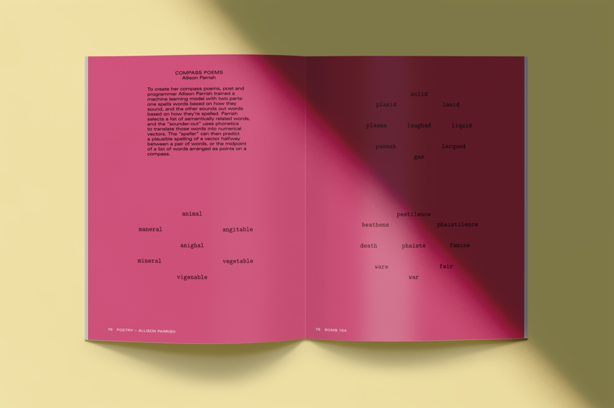
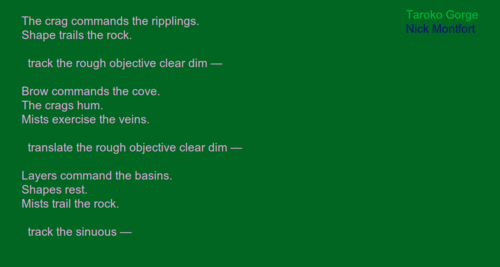
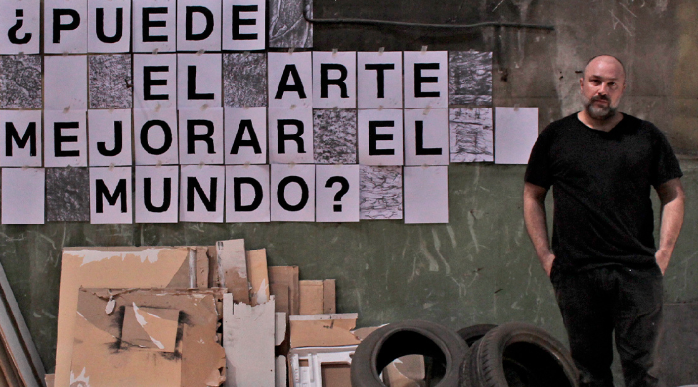
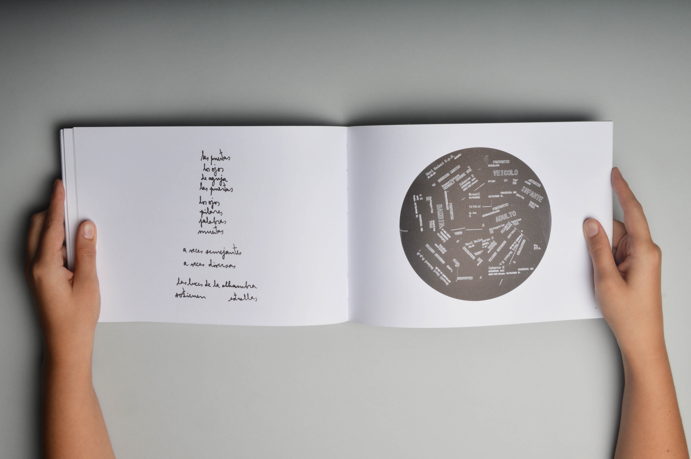

# sesion-04b

Viernes 29 de Agosto, 2025

Nota del día: Fue día de presentación de proyectos así que realmente no anote nada de clase en general ya que estaba algo nerviosa por mi presentación, pero si me gustaron mucho los proyectos de todos, especialmente el del grupo 06 (texto en espiral). 

## Encargo

Investigar la poesía y el trabajo de las poetas Allison Parrish, Nick Montfort y Martín Gubbins. 

### Allison Parrish (EEUU)


- Trabajo general

Allison Parrish es poeta, programadora y artista digital estadounidense. Su obra se centra en la poesía generativa, es decir, poemas creados mediante algoritmos, programación y procesos computacionales. Ha sido profesora en el NYU ITP (Interactive Telecommunications Program), donde ha impulsado el cruce entre lingüística, literatura y programación.

- Relevancia

Es considerada una de las voces más influyentes en la poesía digital contemporánea por abrir caminos en el uso de la inteligencia artificial y la programación creativa como herramientas poéticas. Su propuesta cuestiona qué significa “escribir” y “crear” en la era digital.

- Poemas y obras destacadas

1. **Compasses** (2015) – libro de poesía generada algorítmicamente que reorganiza las palabras del famoso poema “North South East West” de David Antin. La idea es que el algoritmo reordena direcciones y frases, creando poemas que evocan orientación, movimiento y geografía. El resultado es un texto que se siente a la vez humano y maquínico, explorando cómo las palabras pueden construir sentido a través de la repetición y el azar controlado.
2. **Articulations** (2018) – colección de poesía generada con código que explora la fonética y la sonoridad.
3. Proyectos en línea como **Poetry Bots** en Twitter, que publicaban poemas generados automáticamente.

fragmento "compasses": 

```cpp
west west north  
east west north north  
south west east
```



> "*Allison was named "Best Maker of Poetry Bots" by the Village Voice in 2016, and her zine of computer-generated poems called "Compasses" received an honorary mention in the 2021 Prix Ars Electronica. Allison is the co-creator of the board game Rewordable (Clarkson Potter, 2017) and author of several books, including @Everyword: The Book (Instar, 2015) and Articulations (Counterpath, 2018). Her poetry has recently appeared in BOMB Magazine and Strange Horizons.*" - <https://tisch.nyu.edu/about/directory/itp/853082171.html>

- Dónde buscar su trabajo:
  
ig: @allison.parrish <https://www.instagram.com/allison.parrish/?hl=es>

github: <https://github.com/aparrish>

<https://portfolio.decontextualize.com/>

### Nick Montfort (EEUU)

_(cropped).jpg)

- Trabajo general

Nick Montfort es poeta, programador y profesor en el MIT, especializado en literatura electrónica, poesía generativa y narrativa interactiva. Es uno de los referentes mundiales de la literatura digital y la escritura con código. Ha publicado tanto libros de poesía como ensayos críticos sobre literatura computacional.

- Relevancia

Es una figura central en la exploración de la poesía generada por computadora. Su influencia no solo está en sus poemas, sino también en su labor académica y crítica, que legitima la literatura electrónica como campo de estudio.

- Poemas y obras destacadas

1. **Riddle & Bind** (2010).
2. **The Truelist** (2017) - libro de poesía generada que lista cosas de manera poética, explorando el concepto de verdad y enumeración.
3. **#!** (Shebang) (2014).
4. **Taroko Gorge** (2009) – Es uno de los poemas generativos más famosos de la literatura digital, se compone de un programa en JavaScript que, al ejecutarse en un navegador, produce infinitas variaciones de versos relacionados con un paisaje natural (la garganta de Taroko en Taiwán). Cada ejecución es distinta, pero mantiene un estilo lírico y contemplativo. Lo interesante es que otros autores han tomado el mismo código y lo han modificado (remixes), creando toda una comunidad de versiones de este poema.

fragmento Taroko Gorge:

```cpp
stones flow  
monks rest  
boulders frame  
stream rushes
```



> "*A frequent collaborator at the intersection of digital media and literature, Montfort often creates and works within generative constraints and computational forms. Computer-based poetry generators are “usually very elaborate and large systems,” Montfort stated in a 2010 interview with Stephen McLaughlin for Jacket2, describing his own efforts as “trying to resist that and create something very small, [which] I find interesting because it brings me up against the question of what it is about a poem that makes it recognizable as a poem to someone. What makes it play in an interesting way with traditions of poetry, with concepts, with expression?”*" - <https://www.poetryfoundation.org/poets/nick-montfort>

- Dónde buscar su trabajo:
  
<https://nickm.com/me.html>

<https://cmsw.mit.edu/profile/nick-montfort/>

### Martín Gubbins (Chile)



- Trabajo general

Martín Gubbins es un poeta experimental chileno que trabaja con poesía visual, sonora y concreta. Su obra no se limita a la página: abarca performances, instalaciones y experimentación multimedia. Ha publicado libros, participado en festivales internacionales y desarrollado un estilo que une el lenguaje con lo visual y lo acústico.

- Relevancia

Es una de las voces más importantes de la poesía experimental en Chile y América Latina. Su aporte consiste en ampliar los límites de lo que entendemos como “poesía”, explorando la materialidad del lenguaje y el cruce con las artes visuales y sonoras.

- Poemas y obras destacadas

1. **Poemas encontrados y otros pre-textos** (2009) - Es una colección donde Gubbins toma fragmentos de textos, signos gráficos y juegos tipográficos, para transformarlos en poemas visuales. Su propuesta cuestiona qué es un poema: ¿es solo el significado de las palabras o también su forma, su disposición en la página, su sonido?; Ejemplo: uno de sus poemas visuales se compone de repeticiones de palabras que forman figuras en la página. 
2. **Notas al margen** (2014) - Combina texto y anotaciones gráficas, creando una lectura fragmentada y experimental.
3. Performances de poesía sonora en festivales internacionales (España, Alemania, Chile).

fragmento "poemas encontrados y otros pre-textos"

```cpp
eco eco eco  
eco eco eco  
eco eco eco  
```



> "*Es una figura destacada de la escena literaria de vanguardia en Latinoamérica. En diversos países ha publicado libros de poesía y poesía visual y ha grabado poesía sonora solo y con otros artistas. Su obra aparece en decenas de antologías y ha participado en exposiciones individuales y colectivas, instalaciones, lecturas, conciertos, performances y festivales en varias partes del mundo. Practica la poesía como una exploración multifacética, deteniéndose frecuentemente en intersticios donde lo significante emerge de lo no-significante.*" (sobre Martin por <https://afagaleria.cl/artistas/martin-gubbins/?v=5bc574a47246>)

- Dónde buscar su trabajo:

ig: @martin_gubbins <https://www.instagram.com/martin_gubbins/?hl=es>

<https://martingubbins.cl/>

### Bibliografía

AFA Galería. (s. f.). Martín Gubbins. Afagaleria.cl. Recuperado de <https://afagaleria.cl/artistas/martin-gubbins/>

Allison Parrish. (s. f.). NYU Tisch School of the Arts – Directory. Tisch.nyu.edu. Recuperado de <https://tisch.nyu.edu/about/directory/itp/853082171.html>

Allison Parrish. (s. f.). Portfolio. Decontextualize.com. Recuperado de <https://portfolio.decontextualize.com/>

Gubbins, M. (s. f.). Sitio oficial de Martín Gubbins. Martingubbins.cl. Recuperado de <https://martingubbins.cl/>

Montfort, N. (s. f.). Nick Montfort personal site. Nickm.com. Recuperado de <https://nickm.com/me.html>

Montfort, N. (s. f.). Nick Montfort – MIT Comparative Media Studies/Writing. MIT. Recuperado de <https://cmsw.mit.edu/profile/nick-montfort/>

Parrish, A. (s.f.). About. Allison Parrish Website. Recuperado de <https://www.decontextualize.com/>

Poetas.cl. (s.f.). Martín Gubbins. Recuperado de <http://www.poetas.cl/martin-gubbins/>

Poetry Foundation. (s. f.). Nick Montfort. Poetryfoundation.org. Recuperado de <https://www.poetryfoundation.org/poets/nick-montfort>
