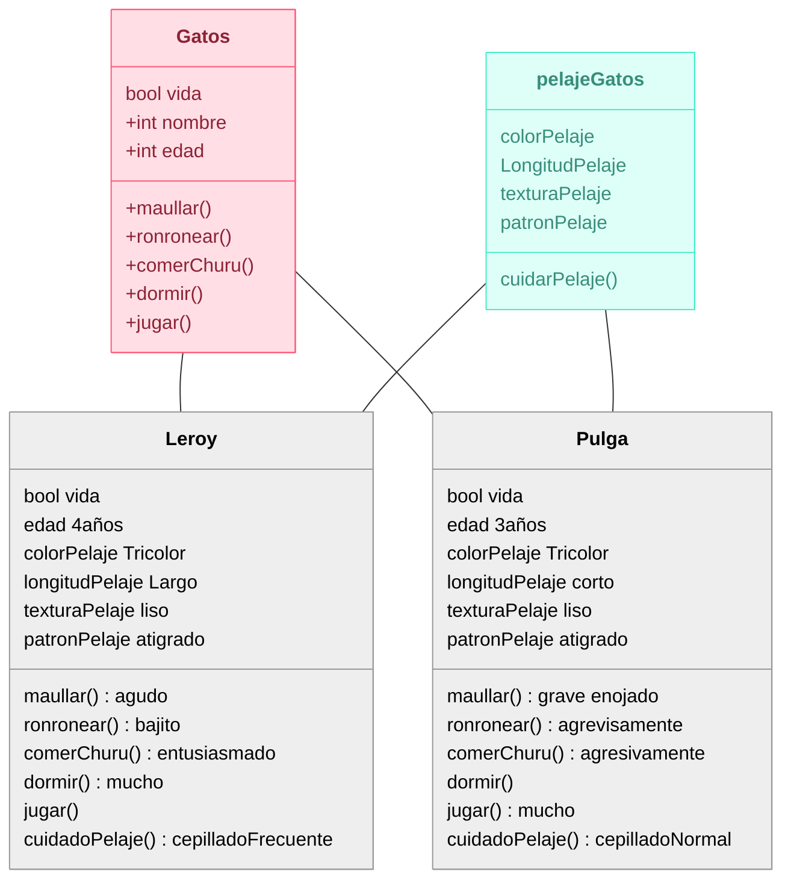
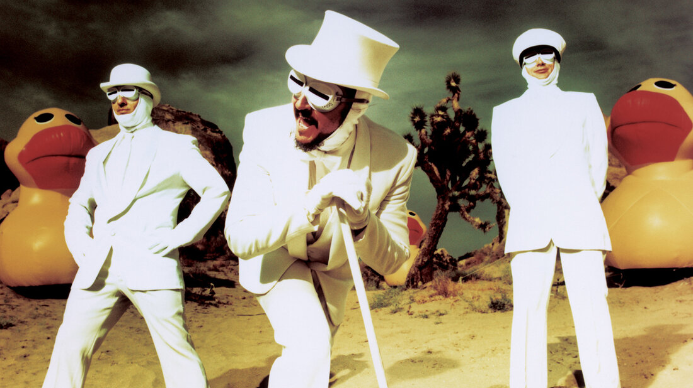
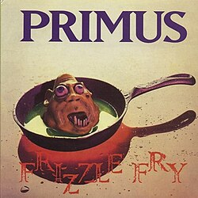

# sesion-05b

Viernes 05 de Septiembre, 2025.

Nota del día: fin de semana solemne (yeeih).

## Referentes (y otras cosas)

- **Nicanor Parra** (es su cumple) (poeta, profesor, físico e intelectual chileno, ​ cuya obra ha tenido una profunda influencia en la literatura hispanoamericana.​)
- **w3schools** (página WEB que sirve para aprender sobre programación, tiene ejemplos de código y distintas herramientas - <https://www.w3schools.com/>)
- **Arm** (arquitectura de procesadores que contiene un conjunto de instrucciones reducidos diseñadas para la eficiencia energética y alto rendimiento. Generalmente la usan los teléfonos, arduinos, etc.)

## Qué aprendí hoy 

Parte central del código es: Comentar antes de hacer el código, para saber que es lo que hace el código en si (y cada una de sus partes).

+ Repaso clase anterior: 

### sobre #include

Poner lo que se va incluir entre <> para referirse a que se puede encontrar desde donde sea que se encuentre (aunque suene redundante) y así se va incluir desde donde sea que este (en el dispositivo, por ejemplo en los archivos en general o en la biblioteca de la aplicación, poniendo <> se adjunta el archivo sin necesidad de buscarlo, solo esta en algún lugar del sistema, por eso se incluye desde donde sea que este).

se pone el nombre del archivo entre comillas "" cuando son subcarpetas o agrupaciones dentro del archivo general INO.

entonces: 

En los #include se le pide al código que llame al archivo nombrado.
 
```cpp
#include <>
// Incluye archivos que ya están en el sistema/computador (en alguna parte).
#include ""
// Incluye archivos que están en la misma carpeta del proyecto (o archivo principal).
```
 
### Sobre clases

- Clase = estructura que organiza código grande.

Las clases se usan cuando queremos crear estructuras de código, especialmente cuando el código es demasiado grande para hacerlo sólo en un archivo INO. 

#### Dentro de una clase: 

- atributos = variables - Las características o datos que tendrá el objeto. 
- métodos = funciones - Las acciones o funciones que el objeto puede realizar.

En las clases poner siempre el constructor y el destructor (la virgulilla "~" va pegada al texto). 

El constructor y el destructor según gemini son métodos especiales en las clases que se ejecutan automáticamente para inicializar y limpiar objetos, respectivamente. El constructor se llama al crear un objeto para inicializar sus propiedades, mientras que el destructor se llama cuando el objeto se destruye para liberar recursos. 

Ejemplos:

```cpp
class Gatos

// constructor
 Gatos ();

// destructor
 ~Gatos ();
```

### Archivo .h y archivo .cpp

Archivo H = "prometo" - Archivo CPP = "me hago cargo (de lo que prometí)"

- Van de la mano - siempre deberían existir juntos aunque el lenguaje no lo exiga.
- cpp tiene un archivo .h correspondiente que declara cualquier elemento que se pueda usar desde otros archivos.
- archivo .ino = flujo principal de Arduino (setup, loop, uso de clases).
- archivo .h = definición de la clase, variables y funciones.
- archivo .cpp = implementación de lo declarado en .h

Ejemplo: Gatos. 

**Gato.h:** declara la clase, sus atributos (variables) y métodos (funciones) + constantes. Define la estructura y las interfaces.
 
Este archivo define la estructura del gato, la ficha técnica del gato, donde estan las habilidades que tiene, pero no cómo las hace. Aquí esta qué cosas puede hacer el gato robótico. 

Dentro del .h:

- Existe una clase llamada Gato.

esa clase tiene funciones como: maullar, mover cola, detectar caricia, saludar. 

```cpp
#ifndef GATO_H
#define GATO_H

class Gato {

public:

  // constructor
  Gato();

  // destructor
  ~Gato();

void maullar();
void moverCola();
bool detectarCaricia();
void saludar();
};

#endif
```

**Gato.cpp:** implementa la lógica de los métodos declarados, detalla las funciones declaradas en .h, Ejecuta la lógica interna del programa.

El .cpp sería el cuerpo del gato, es donde se explica cómo hace cada acción, el guión del día a día del gato, es donde va su comportamiento general - cómo el gato logra hacer esas cosas que prometí en el .h.

Dentro del .cpp:

- Cómo funciona *maullar()*: se enciende el altavoz unos milisegundos con una frecuencia determinada para sonar como un maullido.
- Cómo funciona *moverCola()*: se mueve un servo motor cierto ángulo hacia un lado y luego vuelve.
- Cómo funciona *detectarCaricia()*: lee un valor del sensor táctil y devuelve “verdadero” si alguien lo toca.
- Cómo funciona *saludar()*: utiliza una secuencia donde primero mueve la cola y luego maúlla.

```cpp
#include "Gato.h"

//  constructor
Gato::Gato() {
}
//  destructor
~Gato::~Gato() {
}

// maullar()
void Gato::maullar() {
}

// moverCola()
void Gato::moverCola() {
}
```

**Gato.ino:** instancia objetos de la clase, llamada a funciones y los usa en seetup() y loop(). Coordina el programa principal.

Dentro del .ino:

En setup():

- Configurar el pin del motor de la cola, del altavoz para maullar, y del sensor de caricias.
- Crear una instancia (una “versión”) de la clase Gato.
- Hacer que el gato salude al encenderse (por ejemplo, mover la cola una vez y maullar).

En loop():

- Preguntar constantemente al sensor si el gato está siendo acariciado.
- Si detecta caricia - hacer que maúlle y mueva la cola (utilizar if).
- Si no, quedarse tranquilo o hacer pequeños movimientos aleatorios de cola.

### Herencias 

Permite a una clase (derivada) heredar propiedades y métodos de otra clase (base). Esto facilita la reutilización de código, la creación de jerarquías de clases y la especialización del comportamiento - Mecanismo que permite que una clase adquiera las propiedades y el comportamiento (atributos y métodos) de otra clase.

- **Clase Base (o Superclase, Clase Padre)**: Es la clase cuyas características son heredadas. Es la clase más general.
- **Clase Derivada (o Subclase, Clase Hija)**: Es la clase que hereda las características de la clase base. Es una versión más especializada de la superclase.
  
Entonces, cuando la clase derivada hereda de la clase base, automáticamente obtiene todos sus atributos y métodos (generalmente, los que no son privados), sin necesidad de reescribir el código. (no tengo que escribir la clase desde 0 ya que hereda las partes principales de la clase base)

Utilizar herencias evita tener que escribir el mismo código (atributos y métodos comunes) en varias clases, ademas si cambias algo en la clase base, el cambio se refleja automáticamente en todas las clases derivadas.

Las herencias permite establecer relaciones jerárquicas lógicas del tipo "es un" (ejemplo: un Gato es un animal doméstico).

Es fácil extender la funcionalidad del software creando nuevas subclases que se basan en clases existentes.

Ejemplo:

- Clase Base: **animalDomestico** (Atributos: *tienePatas*, Método: *comer()*). 
- Clase Derivada: **Perro** y **Gato**.

La clase Perro y la clase Gato heredan automáticamente la propiedad *tienePatas* y el método *comer()* de Animal. Además, cada subclase puede agregar sus propias características únicas:

- **Perro** puede tener un Método: *ladrar()* 
- **Gato** puede tener un Método: *maullar()*

### Public 

engloba - agrupa - tipo general

- Public es accesible dentro de la clase y en cualquier clase derivada que herede de ella.	Se usa en el contexto de la Herencia para pasar miembros a clases derivadas.
- class seria parte de la agrupación que engloba public o un tipo especifico de public que es como el maximo, lo que lo engloba. 

```cpp
class Nombre_archivo : public Nombre {}

```

ejemplo: 

```cpp
class Completo_italiano : public Completos {}
```

Entonces los completos italianos son un tipo de completos. 

```cpp
class Pudu_guaton : public Pudus {}
```

Entonces los pudu guatones son un tipo de pudu. 

## Qué hice hoy 

Ejercicio: dibujar y escribir clases y subclases.

### Ejemplo Aarón 

```cpp
#include "Integrante.h"

class Banda {

Integrante [] intgrantes;
agregarIntegrante (Integrante agregado);
quitarIntegrante (Integrante quitado);

};
```

```cpp
#include "Instrumento.h"

class Integrante {

Integrante (String nombre);
String nombre = " ";

Instrumento [] Iinstrumentos;

agregarInstrumento(Instrumento agregado);
};
```

```cpp
class Instrumento {
String nombre;
};
```

```cpp
class Cuerda:public Instrumento {
int numeroCuerdas;
};
```

```cpp
class Guitarra:public Cuerda {
numeroCuerdas = 6;
};
```

### Ejemplo 01

Ejemplo en base a mis gatos Leroy y Pulga. 
El archivo .INO se encuentra adjunto en la carpeta. 

La capeta version 01 es la que hice en un inicio pero no funcionó porque tenía muchos problemas como erroresde uso de ; o falta de ; (o también la reemplace sin querer por :) confusión entre minúsuculas y mayúsculas, ademas de que todo lo que hice la verdad no tenía mucho sentido, aunque no le puse acciones directas no compilaba porque puse acciones que no eran acciones o cosas asi. el código estaba pesimo.

la versión 02 la hice con ayuda de una amiga que estudia ingeniería en ciencia de datos en la universidad católica (gracias fran) que también intento explicarme todos los errores que había cometido pero la verdad no estoy muy segura de haber entendido realmente. Esta versión si funciona pero no la realice yo, todos los créditos para Francisca Morales. 



### Ejemplo 02

Diagrama de one piece que muestra clase base "tripulación sombre de paja" + 2 clases derivadas "Consumidor fruta del diablo" y "No consumidor fruta del diablo". Se especifica despues por cada integrante de la tripulación. (solo diagrama) 

```mermaid
---
title: onePiece
layout: dagre
---
classDiagram
direction LR
    class tripulacionSombreroDePaja {
	    bool vida
	    getNombre
	    getEdad
	    getGenero
	    getRol
	    +TrabajoEnEquipo()
    }
    class consumidorFrutaDelDiablo {
	    +fruta
	    +tipoFruta
	    +Poder
	    +usarPoder()
	    +ataque()
	    +debilidadMar("no puede nadar")
    }
    class nicoRobin {
	    bool vida
	    getEdad 30años
	    getGenero femenino
	    getRol arqueóloga
	    fruta hanaHana
	    tipodeFruta Paramecia
	    Poder "Generar partes de su cuerpo en cualquier superficie visible"
	    TrabajoEnEquipo()
	    usarPoder()
	    ataque cincoFleur("Crea cinco manos o brazos gigantes para ataques específicos")
	    debilidadMar("no puede nadar")
    }
    class luffy {
	    bool vida
	    getEdad 19años
	    getGenero masculino
	    getRol capitán
	    fruta gomuGomu
	    tipodeFruta Paramecia
	    Poder "propiedades elásticas de la goma, permitiéndole estirar y deformar su cuerpo"
	    TrabajoEnEquipo()
	    usarPoder()
	    ataque gomuGomuNoPistol("disparo de goma")
	    debilidadMar("no puede nadar")
    }
    class chopper {
	    bool vida
	    getEdad 17años
	    getGenero masculino
	    getRol doctor
	    fruta hitoHito
	    tipodeFruta zoan
	    Poder " transformarse en una variedad de formas humanas e híbridas"
	    TrabajoEnEquipo()
	    usarPoder()
	    ataque armPoint("")
	    debilidadMar("no puede nadar")
    }
    class brook {
	    bool vida
	    getEdad 90años
	    getGenero masculino
	    getRol músico
	    fruta yomiYomi
	    tipodeFruta Paramecia
	    Poder "mejora el alma del consumidor hasta el punto de que puede volver a la vida luego de morir una vez"
	    TrabajoEnEquipo()
	    usarPoder()
	    ataque ekakiUtaHitoyogiri("cortar a su enemigo sin que este se dé cuenta.")
	    debilidadMar("no puede nadar")
    }
    class noConsumidorFrutaDelDiablo {
	    +Habilidad
	    +arma
	    +ataque()
	    +debilidad()
    }
    class zoro {
	    bool vida
	    getEdad 21años
	    getGenero masculino
	    getRol espadachín
	    habilidad "es capaz de empuñar tres espadas al mismo tiempo"
	    arma catanas
	    TrabajoEnEquipo()
	    usarPoder()
	    ataque tatsuMaki("técnica giratoria que crea un "remolino" o "tornado" cortante con sus espadas, afectando a los enemigos a su alrededor")
	    debilidad sinSentidoOrientación()
    }
    class nami {
	    bool vida
	    getEdad 20años
	    getGenero femenino
	    getRol navegante
	    habilidad robar
	    arma climaTack
	    TrabajoEnEquipo()
	    usarPoder()
	    ataque truenoTempo("Lanza un rayo eléctrico desde una nube de tormenta formada previamente")
	    debilidad()
    }
    class usopp {
	    bool vida
	    getEdad 21ños
	    getGenero masculino
	    getRol francotirador
	    habilidad ataqueDistancia mentiroso
	    arma arsenalBochi
	    TrabajoEnEquipo()
	    usarPoder()
	    ataque kaenBoshi(" Lanza un proyectil de fuego que puede quemar al objetivo")
	    debilidad cobardía() miedo()
    }
    class sanji {
	    bool vida
	    getEdad 21ños
	    getGenero masculino
	    getRol cocinero
	    habilidad "estilo de combate basado en las piernas"
	    arma piernas
	    TrabajoEnEquipo()
	    usarPoder()
	    ataque diableJambe("Eleva la temperatura de su pierna hasta el punto de que brilla de color rojo brillante para aumentar el poder de la patada")
	    debilidad mujeres()
    }
    class franky {
	    bool vida
	    getEdad 36años
	    getGenero masculino
	    getRol carpintero
	    habilidad "fuerza sobrehumana, cuerpo robot"
	    arma suCuerpo "modificado"
	    TrabajoEnEquipo()
	    usarPoder()
	    ataque rayoRadical("Un ataque láser que usa desde su mano")
	    debilidad dependienteCola("bebida cola")
    }
    class jimbe {
	    bool vida
	    getEdad 46años
	    getGenero masculino
	    getRol timonel
	    habilidad karateGyojin
	    arma suCuerpo "Gyojin"
	    TrabajoEnEquipo()
	    usarPoder()
	    ataque gosenmaigawaraSeiken("Un puñetazo tan potente que puede romper cinco mil tejas")
	    debilidad luchasFueraAgua()
    }

	note for consumidorFrutaDelDiablo "subclase"
	note for tripulacionSombreroDePaja "clase"
	note for noConsumidorFrutaDelDiablo "subclase"

    tripulacionSombreroDePaja <|-- consumidorFrutaDelDiablo
    tripulacionSombreroDePaja <|-- noConsumidorFrutaDelDiablo
    consumidorFrutaDelDiablo -- luffy
    noConsumidorFrutaDelDiablo -- zoro
    noConsumidorFrutaDelDiablo -- nami
    noConsumidorFrutaDelDiablo -- usopp
    noConsumidorFrutaDelDiablo -- sanji
    noConsumidorFrutaDelDiablo -- franky
    noConsumidorFrutaDelDiablo -- jimbe
    consumidorFrutaDelDiablo -- chopper
    consumidorFrutaDelDiablo -- nicoRobin
    consumidorFrutaDelDiablo -- brook

	class tripulacionSombreroDePaja:::Ash
	class consumidorFrutaDelDiablo:::Ash
	class nicoRobin:::Rose
	class luffy:::Rose
	class chopper:::Rose
	class brook:::Rose
	class noConsumidorFrutaDelDiablo:::Ash
	class zoro:::Aqua
	class nami:::Aqua
	class usopp:::Aqua
	class sanji:::Aqua
	class franky:::Aqua
	class jimbe:::Aqua

	classDef Peach :,stroke-width:1px, stroke-dasharray:none, stroke:#FBB35A, fill:#FFEFDB, color:#8F632D
	classDef Ash :,stroke-width:1px, stroke-dasharray:none, stroke:#999999, fill:#EEEEEE, color:#000000
	classDef Rose :,stroke-width:1px, stroke-dasharray:none, stroke:#FF5978, fill:#FFDFE5, color:#8E2236
	classDef Aqua :,stroke-width:1px, stroke-dasharray:none, stroke:#46EDC8, fill:#DEFFF8, color:#378E7A
```



## Encargo 

Escuchar y comentar uno de los tres primeros discos de la banda Primus + investigar sobre la obra de Mitchel Resnick, leer uno de sus escritos o ver una de sus charlas, y comentarla críticamente. 

### Primus

 

La banda Primus, originaria de San Francisco (EE. UU.) y formada en 1984, se caracteriza por un estilo único que combina elementos del funk metal, rock alternativo y experimental. Su líder, Les Claypool, destaca por su virtuosismo en el bajo y su particular sentido del humor, lo que otorga al grupo una identidad distintiva dentro del panorama musical de los años noventa. Las letras de Primus suelen retratar personajes extraños o marginales, mezclando crítica social con ironía y absurdo.

- **Frizzle Fry (1990)**
  


El primer álbum de estudio de la banda, Frizzle Fry, publicado en 1990, consolidó el sonido característico de Primus: bajo protagonista, estructuras rítmicas complejas y un tono sarcástico y caricaturesco. Canciones como “John the Fisherman” o “Too Many Puppies” muestran la capacidad del grupo para combinar técnica e irreverencia. Desde una mirada en base a la crítica, el disco puede entenderse como una declaración de independencia artística: Primus se desmarca de las convenciones del rock comercial, explorando una estética experimental y antiheroica. Su crudeza, humor y virtuosismo lo convirtieron en una referencia para la música alternativa posterior, influyendo en artistas como Tool o Mr. Bungle.

Ya en una mirada más personal, debo admitir que ya había escuchado a Primus antes, solo que no sabía que era Primus lo que estaba oyendo. Tengo un amigo muy querido que es gran fan de Tool, y muchas veces pasábamos horas escuchando su música mientras él practicaba guitarra o bajo. Recuerdo que en esas sesiones también sonaban canciones de Primus, pero como en ese momento no conocía a la banda, pensaba que todo lo que escuchábamos era de Tool. Ahora que los distingo y entiendo mejor lo que caracteriza a cada grupo, me sorprende no haber notado antes las diferencias: Primus y Tool no suenan igual, ni en estilo ni en atmósfera (sobre todo en atmosfera). Tool tiene una sonoridad mucho más oscura, introspectiva y psicodélica, mientras que Primus se inclina hacia lo lúdico, sarcástico y rítmicamente juguetón.

La primera canción que escuché completa del álbum Frizzle Fry fue “Harold of the Rocks”, y debo decir que fue la que más me gustó junto con "Groundhog´s day", especialmente por su parte final y parte inicial respectivamente (me paso mucho que algunas canciones me gustaba demasiado el principio como por ejemplo "Frizzle Fry"), asimismo la canción que mas me gustó específicamente en la parte cantada (aunque relamente no tengo ni idea de la traducción) fue "hello skinny/constantinople". En cambio, “Spaghetti Western” fue la que menos disfruté, quizás porque la sentí más repetitiva o menos envolvente, no sé.

Me llamó mucho la atención que varias canciones tuvieran toques divertidos o casi cómicos. En ciertos momentos, los juegos entre la guitarra y el bajo generan sonidos que parecen caricaturescos o irónicos. En “John the Fisherman”, por ejemplo, los sonidos iniciales de la guitarra me recordaron a un auto, y aunque no sé explicar exactamente por qué, me resultó muy entretenido.

A diferencia de Tool, que tiende a sumergirte en una atmósfera más densa y reflexiva, Primus transmite energía y humor. Escucharlo mientras estudiaba me resultó sorprendentemente agradable: algunas canciones me motivaban o simplemente me mantenían atenta por lo impredecibles que son. En definitiva, descubrir a Primus de manera consciente me permitió entender mejor las distintas formas en que la creatividad se expresa en la música. 

### Mitchel Resnick 


Mitchel Resnick, profesor del MIT Media Lab, ha desarrollado una influyente teoría sobre el aprendizaje creativo, entendiendo que las personas aprenden mejor cuando crean, exploran y comparten proyectos significativos. Lideró el grupo Lifelong Kindergarten, responsable de herramientas educativas como Scratch, que permite a niños y niñas aprender a programar mediante bloques visuales y narrativas interactivas.

- **“Let’s teach kids to code” (2012)**
  


En su charla TED “Let’s teach kids to code” (2012), Resnick argumenta que enseñar programación no debe tener como objetivo formar programadores, sino fomentar la creatividad, la expresión personal y la capacidad de pensar sistemáticamente. Para él, programar es una nueva forma de alfabetización: así como escribimos para comunicar ideas, programamos para construir con ideas. La propuesta de Resnick es profundamente transformadora. Al desplazar el foco de la tecnología hacia la creatividad, redefine lo que significa aprender en la era digital. Su planteamiento, sin embargo, enfrenta desafíos: su implementación requiere sistemas educativos flexibles, docentes capacitados y equidad en el acceso tecnológico, condiciones que no siempre están garantizadas. Aun así, su visión ha influido en pedagogías contemporáneas que promueven la experimentación y el aprendizaje colaborativo.

Después de ver la charla de Mitchel Resnick, “Let’s teach kids to code”, me pasó algo parecido a lo que sentí cuando entendí realmente quién era Primus. Es decir, me di cuenta de que ya había visto o vivido cosas relacionadas con lo que él plantea, pero sin saber que tenían un nombre o una teoría detrás. En este caso, Resnick habla del aprendizaje a través de la creación, del juego y la experimentación, y me hizo pensar en todas las veces que aprendí algo solo por curiosidad o porque quería probar cómo funcionaban las cosas, no porque alguien me lo mandara.

Lo que más me gustó fue su idea de que programar no es solo para hacer tecnología, sino para pensar y expresarse. Me pareció muy liberador ver la programación como una forma de creatividad, casi como hacer arte o música. Me recordó a cuando escucho a Primus: hay una sensación de libertad y exploración, de probar cosas raras solo para ver qué pasa. Así como Claypool no sigue las reglas del rock, Resnick propone que los niños tampoco sigan reglas rígidas al aprender, sino que experimenten, se equivoquen y creen cosas únicas.

También me pareció muy real lo que menciona sobre la importancia de aprender jugando. Creo que muchas veces el sistema educativo te hace sentir que si te estás divirtiendo, no estás aprendiendo, cuando en realidad es al revés. Personalmente, me motiva más cuando puedo crear algo tangible, con sentido para mí, que cuando solo memorizo información.

Sin embargo, también pensé que lo que propone Resnick no es tan fácil de aplicar. No todos los colegios tienen acceso a la tecnología o a profesores que se animen a enseñar de esa forma. Pero igual, su mensaje me pareció optimista e inspirador, porque apunta a cambiar la forma en que entendemos el aprendizaje: no como algo lineal y estructurado, sino como un proceso creativo lleno de descubrimientos.

En resumen, ver la charla me dejó la misma sensación que escuchar a Primus por primera vez “conscientemente”: entender que aprender —igual que crear— no debería tener una fórmula fija, y que lo importante es atreverse a explorar, equivocarse y disfrutar el proceso.

### Bibliografía

- Claypool, L., LaLonde, L., & Alexander, T. (1990). Frizzle Fry [Álbum]. Caroline Records.
- Erlewine, S. T. (s. f.). Primus Biography. AllMusic. Recuperado de <https://www.allmusic.com/artist/primus-mn0000354484/biography>
- Resnick, M. (2012, mayo). Let’s teach kids to code [Charla TED]. TED Conferences. <https://www.ted.com/talks/mitchel_resnick_let_s_teach_kids_to_code>
- Resnick, M. (2017). Lifelong Kindergarten: Cultivating Creativity through Projects, Passion, Peers, and Play. MIT Press.
- MIT Media Lab. (s. f.). Lifelong Kindergarten Group. Massachusetts Institute of Technology. <https://llk.media.mit.edu>
