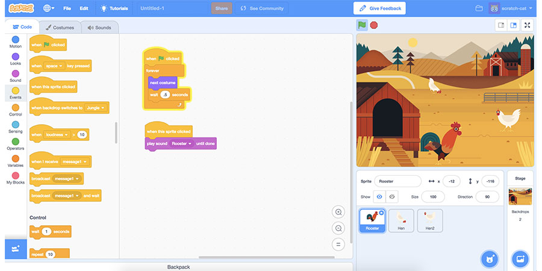
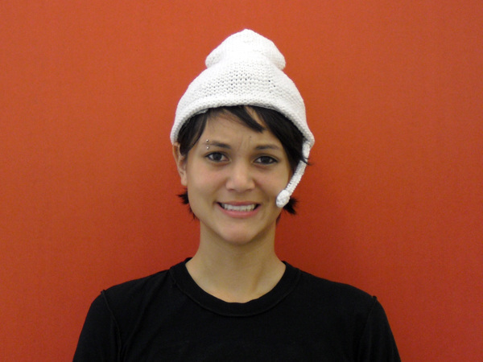
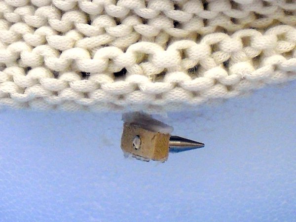
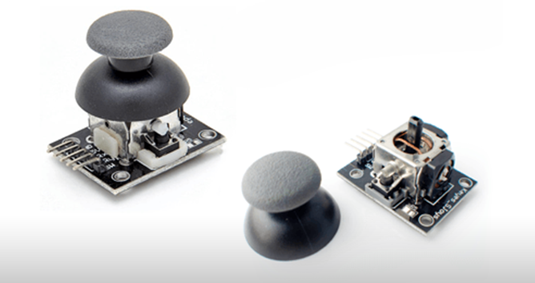
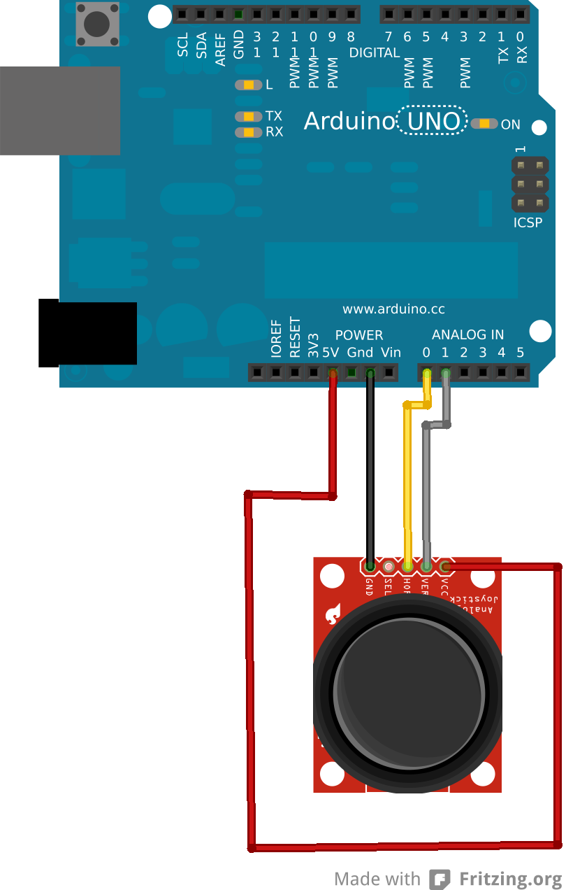
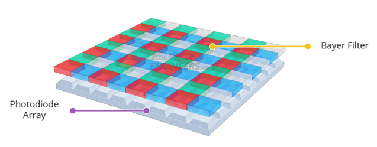
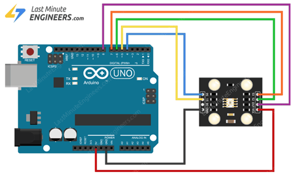
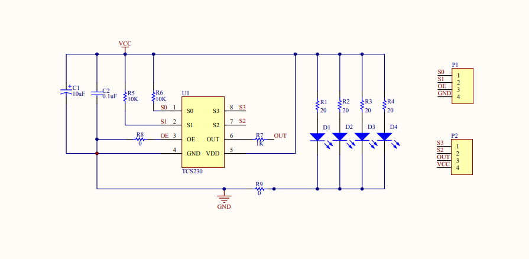

# sesion-06a

Martes 09 de Septiembre, 2025

Nota del día: 17 de octubre entrega proyecto 02, se trabaja desde la semana anterior. 

## Referentes (y otras cosas)

- **YAML** (según Gemini YAML es un lenguaje de serialización de datos legible por humanos que se utiliza comúnmente para archivos de configuración. Se caracteriza por su sintaxis sencilla, similar a la de Python, y se usa para estructurar datos que pueden ser fácilmente entendidos por personas e interpretados por máquinas)
- **Golan levin** (artista, compositor, intérprete e ingeniero estadounidense de nuevos medios interesado en desarrollar artefactos y eventos que exploren nuevos modos flexibles de expresión reactiva)
- **Frank-Ratchye studio** (laboratorio de investigación atípica, antidisciplinaria e interinstitucional en las intersecciones de las artes, la ciencia, la tecnología y la cultura - *"para la Investigación Creativa es un laboratorio flexible para nuevas formas de investigación, producción y presentación artística. Ofrecemos oportunidades de aprendizaje, diálogo e investigación que conducen a avances innovadores, nuevas políticas y la redefinición del rol de los artistas en un mundo en constante cambio".* <https://www.cmu.edu/cfa/studio/index.html> ig: @studioforcreativeinquiry)
- **Unix** (familia de sistemas operativos multitarea y multiusuario, desarrollado en los Laboratorios Bell de AT&T en 1969 por Ken Thompson y Dennis Ritchie. Es conocido por su portabilidad, eficiencia y modularidad, y ha servido como base para muchos sistemas operativos modernos como macOS, Linux, BSD y Android. Su filosofía se basa en crear pequeñas herramientas que se comunican entre sí a través de "pipelines" para ejecutar tareas complejas)
- **Donald Knuth** (reconocido experto en ciencias de la computación estadounidense y matemático, famoso por su fructífera investigación dentro del análisis de algoritmos y compiladores.​Es Profesor Emérito de la Universidad de Stanford)
- **The Art of Computer Programming** (en castellano, «El arte de programar ordenadores», es una extensa monografía escrita por Donald Knuth que trata acerca de análisis de algoritmos de programación).
- **LaTeX** (*programar texto bello* - sistema de composición de textos orientado a la creación de documentos escritos que presenten una alta calidad tipográfica. Por sus características y posibilidades, se usa de forma especialmente intensa en la generación de artículos y libros científicos que incluyen, entre otros elementos, expresiones matemáticas. <https://es.wikipedia.org/wiki/LaTeX>)
- **Overleaf** (software que ejecuta un editor colaborativo de LaTeX basado en la nube, utilizado para escribir, editar y publicar documentos científicos - code editor (el profe Aarón tiene hecho su currucillum desde esta pagina en código como si fuera una clase de el mismo) se puede escribir distintas cosas como un libro, una tesis, un curriculum, asi mismo existen plantillas para editar como pdf, presentaciones, entre otros.)
- **Lab tecnosocial** (*"Somos un laboratorio ciudadano de innovación abierta, compuesto por cientistas sociales e ingenieros informáticos que desarrollamos innovaciones tecnosociales para el bien común"* <https://labtecnosocial.org/>)
- **"Llamk'ana"** (lenguaje de programación en kechua - <https://labtecnosocial.org/llamkana/> <https://labtecnosocial.org/llamkana-un-lenguaje-de-programacion-en-quechua/>)
- **Weaving the code, coding to weave** - (como el tejido te puede enseñar a programar y programar te puede ayudar a tejer - *"El objetivo de este taller es desmitificar el tejido y la codificación, mostrando sus similitudes en cómo funcionan y que a menudo no se exponen. A través de la historia del oficio y su práctica, el taller entrelaza la relación entre ambos, mostrando cómo condujo a la invención de las primeras computadoras y la lógica de programación. Se anima a los asistentes a aprender programación creativa mediante JavaScript y a tejer piezas digitalmente."* <https://weavingxcoding.studio/>)
- **Pembroider** - (programar maquinas de tejido <https://github.com/CreativeInquiry/PEmbroider>)
- **Sewing machine controlled by a gameboy** (Las máquinas de coser Singer IZEK 1500 y Jaguar New Yell se controlaban con una Nintendo Game Boy Color mediante un cable de conexión especial y un cartucho para seleccionar puntadas y diseños. Se vendieron a principios de la década del 2000 como una alternativa económica a las costosas máquinas de coser computarizadas y permitían programar patrones, letras y diseños personalizados a través de la consola portátil.)
- **Hacia una filosofía de la fotografía** (de Vilém Flusser, *"Este ensayo toma como objeto de reflexión la fotografía, en tanto que es el medio que inaugura la época que separará para siempre, la expresión quirogràfica —textos e imágenes manuales— de la imaginería técnica. A la fotografia sucederá la cinematografía, la videografía, la infografía y la holografía, ya que son los principales referentes de una cultura que podríamos llamar tecnográfica."*)
- **Lauren Lee McCarthy** (artista y programadora estadounidense.​ McCarthy crea obras de arte mediante varias técnicas y medios, incluyendo en espectáculo, inteligencia artificial e interacción programada por computadora. <https://get-lauren.net/>)
- **Miller Puckette** (matemático, programador y profesor de música estadounidense, director asociado del CRSA, así como miembro del claustro de la facultad de la UC University of California en San Diego donde trabaja desde 1994. Cycling 74 esta empresa vende un software llamado Max map.)

## Qué aprendí hoy

### Software de programación visual: 

(cajitas) proporciona una interfaz gráfica para crear programas mediante la integración de elementos visuales. Estas herramientas reducen la necesidad de codificación y permiten a los usuarios centrarse en la funcionalidad y la lógica mediante funciones de diseño intuitivas - permite crear programas manipulando elementos gráficos en lugar de escribir código de texto. 

Ejemplos de softwares: 

- **Scratch** (plataforma educativa muy conocida creada por el MIT que enseña los conceptos de programación a niños a través de bloques gráficos para crear animaciones y juegos. <https://scratch.mit.edu/> - *"Con Scratch puedes programar tus propias historias interactivas, juegos y animaciones — y compartir tus creaciones con otros en la comunidad online. Scratch ayuda a los jóvenes a aprender a pensar de forma creativa, a razonar sistemáticamente, y a trabajar de forma colaborativa — habilidades esenciales para la vida en el siglo 21."* <https://sitios.mineduc.cl/lenguajesdigitales/scratch.html> (mención especial a Mitchel Resnick del encargo de la clase anterior))
- **Max/msp** ( lenguaje de programación visual creado por Cycling '74 para desarrollar aplicaciones de audio, video y multimedia en tiempo real. Es un entorno de desarrollo gráfico donde los usuarios construyen programas (llamados "patchers") conectando objetos (cajas) con cables para crear instrumentos musicales, efectos, visuales y otras herramientas interactivas, sin necesidad de escribir código tradicional.)
- **Touchdesigner** (plataforma de programación visual basada en nodos, que permite a artistas, programadores y diseñadores crear aplicaciones interactivas 2D y 3D en tiempo real. Utiliza la potencia de la tarjeta gráfica y funciona de manera procedimental, lo que significa que puedes modificar tu proyecto mientras se está ejecutando. <https://derivative.ca/>) (lo utilice en el taller data, semestre pasado)
- **vvvv entorno visual de programación** (según Gemini esta diseñado para crear proyectos multimedia interactivos en tiempo real como instalaciones artísticas, gráficos y experiencias audiovisuales. Utiliza nodos y conexiones en lugar de código textual, lo que permite a artistas, diseñadores y tecnólogos crear de manera intuitiva y flexible, integrándose con el ecosistema .NET y siendo ideal para prototipado rápido y proyectos a gran escala. <https://vvvv.org/>)
- **Isadora programación visual** (Isadora es un software creado a mediados de los 80 por Mark Coniglio para la creación de espectáculos con su compañía de danza interactiva Troika Ranch. Se trata de una herramienta informática diseñada para realizar obras de arte electrónico, new media art, video instalaciones, instalaciones interactivas, o cualquier otra aplicación con propósitos artísticos, educativos, de ocio o terapéuticos. <https://hybridart.net/isadora-el-software-para-la-creacion-audiovisual-interactiva/>)
- **Lego mindstorms** (fue una línea de robótica para niños fabricada por la empresa LEGO que utilizaba elementos básicos de las teorías robóticas, como la unión de piezas y la programación de acciones en forma interactiva. Este robot fue comercializado por primera vez en septiembre de 1998, y descontinuado a fines de 2022. <https://www.lego.com/es-es/themes/mindstorms/about>)

Muchas herramientas de programación visual están diseñadas con el concepto de "bajo código" (low-code), donde el desarrollador esquematiza el flujo de la aplicación y la herramienta genera el código subyacente. 

- **Programación visual vs. programación textual:** La programación visual utiliza elementos gráficos (como bloques o diagramas de flujo) para construir programas, mientras que la programación textual tradicional implica escribir código línea por línea. 

La programación visual puede ser más accesible para principiantes, ya que permite ilustrar los procesos de forma más intuitiva. 




### Lint - linting

Proceso de análisis automático del código fuente para detectar errores de programación, bugs y problemas de estilo, utilizando herramientas llamadas linters. Estas herramientas de análisis estático de código revisan el código sin ejecutarlo, identificando problemas como typos, errores de sintaxis, inconsistencias en el estilo de codificación y malas prácticas que pueden afectar la legibilidad, el mantenimiento y la calidad del código. (gemini)

- Proceso automatizado, limpiar o revisar estilos de markdown que yo quiero.
- **"quitar pelusas"**, se quitan "cosas" que molestan aunque no interfieren con el resultado si hará que se vea lindo/ordenado/"menos ordinario" ya que seguiría siempre un estilo específico.

Propósitos principales: 

- **Detección de errores**: Identifica errores sutiles de programación, errores de sintaxis o variables no declaradas que podrían causar fallos en la aplicación. 
- **Mejora del estilo y la consistencia**: Asegura que todo el código siga un estilo uniforme y los estándares acordados por el equipo, haciendo que sea más fácil de leer y mantener. 
- **Prevención de problemas**: Ayuda a prevenir bugs y vulnerabilidades de seguridad antes de que el código llegue a la fase de ejecución. 
- **Reducción de la deuda técnica**: Al abordar problemas de calidad en el código, se reduce la deuda técnica y se facilita la evolución del proyecto.

Cómo funciona:

- Un linter (herramienta de linting) analiza el código fuente aplicando un conjunto de reglas configurables. 
- Estas reglas pueden ser sobre la consistencia en el uso de comillas, la obligatoriedad de puntos y comas, el estilo de la indentación, entre otros. 
- Las herramientas resaltan los problemas encontrados, permitiendo a los desarrolladores corregirlos rápidamente. 

## Sensores 

Sensor - "solucionador de la flojera humana"

Como el origen de la *webcam* donde en 1991 en la Universidad de Cambridge, donde investigadores instalaron una cámara en la sala de informática para monitorear una cafetera y saber cuándo estaba lista o vacía, evitando así viajes innecesarios. Esta primera cámara, llamada CoffeeCam, se conectó a la red para que el equipo pudiera ver la imagen en sus ordenadores, y en 1993, Daniel Gordon la conectó a Internet, convirtiéndola en la primera webcam disponible para el público general. 

Un sensor es un dispositivo que detecta y responde a estímulos del entorno físico o químico, como temperatura, presión, luz o humedad, y los convierte en una señal eléctrica o de datos que puede ser interpretada por sistemas automáticos o humanos. Son componentes esenciales en la tecnología moderna, permitiendo que objetos cotidianos y sistemas industriales "perciban" su entorno y reaccionen de manera preprogramada. 

(sensor/entrada - actuador/salida)

Cómo funcionan:

- **Detección**: El sensor capta una magnitud física, química o biológica del ambiente, como la temperatura de una habitación o la presencia de un gas. 
- **Conversión**: Luego, el sensor transforma esta información en una señal eléctrica (analógica o digital), sonora o de otro tipo. 
- **Procesamiento**: Esta señal es procesada por circuitos o un ordenador para poder ser leída, analizada y, eventualmente, generar una acción automática.

Características:

- **Rango**: Es el valor mínimo y máximo de la variable física que el sensor puede percibir o medir.
Amplitud. Es la diferencia entre los valores máximos y mínimos de entrada.
- **Exactitud**: El error en la medición se especifica en términos de precisión. Se define como la diferencia entre el valor medido y el valor real. Se define en términos de % de la escala completa o % de la lectura.
- **Precisión**: Se define como la cercanía entre un conjunto de valores y es diferente de la exactitud.
- **Sensibilidad**: Es la relación entre el valor de la salida y el valor de la entrada.
- **La alineación**: Es la máxima desviación entre los valores medidos de un sensor de la curva ideal.
- **Histéresis**: Es la diferencia en la salida cuando la entrada varía de dos maneras, aumentando y disminuyendo.
- **Resolución**: Es el cambio mínimo en la entrada que puede ser detectado por el sensor.
- **Reproducibilidad**: Se define como la capacidad del sensor de producir la misma salida cuando se aplica la misma entrada.
- **Repetibilidad**: Capacidad del sensor de producir la misma salida cada vez que se aplica la misma entrada y todas las condiciones físicas y de medición se mantienen iguales, incluyendo el operador, el instrumento, las condiciones ambientales, etc.
- **Tiempo de respuesta**: Se expresa generalmente como el tiempo en que la salida alcanza un cierto porcentaje de su valor final, en respuesta a un cambio de paso de la entrada.

Ejemplos de tipos de sensores y sus funciones:

- **Sensor de temperatura**: Detectan el calor o la temperatura de un área. Recogen información sobre la temperatura de una fuente y la cambian a una forma que pueda ser comprendida por otro dispositivo. Se trata de una categoría de sensores de uso común que detectan la temperatura o el calor y también mide la temperatura de un medio.
- **Sensor de presión**: Miden la fuerza ejercida sobre una superficie. Su objetivo es transformar una magnitud física en una eléctrica, en este caso transforman una fuerza por unidad de superficie en un voltaje equivalente a esa presión ejercida. 
- **Sensor ópticos**: Detectan la luz, como las cámaras o los sensores de proximidad. 
- **Sensor de humedad**: Miden el nivel de humedad en el ambiente. 
- **Sensor de movimiento**: Detectan la presencia o el movimiento de objetos o personas.
- **Sensor proximidad**: Son transductores que detectan objetos o señales que se encuentran cerca del elemento sensor. 
- **Sensores químicos**: Detectan la presencia y concentración de gases u otras sustancias químicas.
- **Sensor ultrasónico**: Trabajan libres de roces mecánicos y detectan objetos a distancias de hasta 8 m y emiten impulsos ultrasónicos. Estos se reflejan en un objeto, el sensor recibe el eco producido y lo convierte en señales eléctricas, las cuales son elaboradas en el aparato de valoración.
- **Sensor Capacitivo**: Detectan objetos metálicos, o no metálicos, midiendo el cambio en la capacitancia, la cual depende de la constante dieléctrica del material a detectar, su masa, tamaño, y distancia hasta la superficie sensible del detector.
- **Sensor Magnético**: Detectan los objetos magnéticos (imanes generalmente permanentes) que se utilizan para accionar el proceso de la conmutación.
- **Sensor Inductivo**: trabajan generando un campo magnético y detectando las pérdidas de corriente de dicho campo generadas al introducirse en él los objetos de detección férricos.
- **Sensor de área**: Se emplean en numerosas soluciones como el registro de objetos, personas, vehículos, y el control de presencia y sobredimensionamiento de objetos.
- **Sensor fotoeléctricos**: Responden al cambio en la intensidad de la luz, requieren de un componente emisor que genera la luz, y un componente receptor que percibe la luz generada por el emisor. Están diseñados especialmente para la detección, clasificación y posicionamiento de objetos; la detección de formas, colores y diferencias de superficie, incluso bajo condiciones ambientales extremas.
- **Sensor de flujo**: Permiten medir y monitorear el flujo de los medios de proceso, como lubricante o agua de enfriamiento, en una amplia gama de aplicaciones. Cuando reciben una alerta de que el flujo se ha ralentizado o detenido, pueden responder rápidamente y evitar un tiempo de paro imprevisto de la máquina o incluso la detención del sistema en su totalidad.
- **Sensor de corriente**: Detectan la corriente de forma rápida y exacta para controlar con precisión sistemas electrónicos de potencia tales como convertidores de frecuencia, convertidores de tracción, sistemas de alimentación eléctrica ininterrumpida o sistemas de soldadura.

(información sacada de Gemini y <https://sdindustrial.com.mx/blog/sensores/> <https://dewesoft.com/es/blog/que-es-un-sensor>)

- Ver tipos de sensores en afel (tienda), estan sub divididos en categorias depediendo a que tipo de reacción va tener/identificar o sentir. (<https://afel.cl/>)
- Sensor logger - Aplicación para medir tipos de sensores desde el celular, muestra en un grafico los resultados obtenidos (cuantifica los resultados). 

ejemplo: registrar el recorrido hecho en gps, o ver los altos y los bajos del habla (sonido). 

## Proyecto 02

Especificaciones del proyecto 02: (primer vistazo)

- *"La maquina saludadora, la maquina que saluda."*

Se realiza en base a sensores - que haya una respuesta cuando la persona esta presente (ya sea que la detecte con un sensor de aproximidad o que la persona realice alguna acción para que se active). 

Ejemplo: sensor de sonido que detecta aplausos, se prenden luces o hace un sonido especifico cuando recibe estos aplausos. 

Se puede sacar referentes de código de sensores (en base a como estos funcionan) pero hay que ponerle empeño en la factura - como que tenga colores lindos, este hecho en una clase "maquina saludadora", hacerle una carcasa (por ejemplo un monito con cara feliz o ponerle manitas que apluaden, etc), debe estar bien planteado en el github. Se evaluara que el código sea limpio y ojalá este distribuido en clases (archivo .h, .cpp y .ino). 

Puede ser "intuitivo" o puede tener un manual explicativo respecto a su funcionamiento. 

Ejemplos extremos: Herramientas para mejorar la interacción social de Lauren Lee McCarthy.

*"Serie de dispositivos portátiles que utilizan sensores para condicionar el comportamiento del usuario y adaptarlo mejor a las conductas sociales esperadas. Exploramos el potencial de la tecnología para moldear cómo pensamos, sentimos y actuamos, y cuestionamos nuestras expectativas sociales, buscando comprender mejor su función y valor. ¿Existen alternativas de interacción que permitan mayor libertad para la expresión, el pensamiento y la conexión individual?"* 

(<https://get-lauren.net/Tools-for-Improved-Social-Interacting>)

- El **Sombrero de la Felicidad** entrena al usuario a sonreír más. Un sensor de curvatura integrado se adhiere a la mejilla y mide el tamaño de la sonrisa; un servomotor mueve una punta metálica en la cabeza de forma inversamente proporcional al grado de la sonrisa. Los datos del tamaño de la sonrisa se registran en una tarjeta de memoria microSD para su descarga al final de cada período de uso.
- La **Bufanda Anti-Ensoñación** contiene un sensor de radiación térmica que detecta si el usuario está conversando con otra persona. Mientras lo hace, la bufanda vibra periódicamente para recordarle al usuario que preste atención y deje de ensoñarse.
- El **Traje de Entrenamiento de Contacto Corporal** requiere que el usuario mantenga contacto corporal frecuente con otra persona para escuchar con normalidad. Si el usuario deja de tocar a alguien durante demasiado tiempo, comienza a reproducirse ruido estático a través de los auriculares cosidos a la capucha. Un circuito sensor de capacitancia mide el contacto corporal piel con piel mediante una pulsera metálica cosida a la manga.





## Encargo

Investigar sensores vistos en clases, cotizarlos, encontrar referentes que los usen, y describir 3 pequeñas ideas que podamos aplicar a su proyecto-02 de máquinas de saludar. 

### Joystick Palanca de Mando



- Módulo de Joystick Analógico de 3 Ejes (X, Y, Z)
  
Permite controlar objetos en un espacio bidimensional y registrar una acción adicional mediante un pulsador integrado. Es ideal para una amplia gama de aplicaciones, desde robótica hasta la creación de interfaces de control personalizadas.

#### Funcionamiento Principal:

El joystick proporciona dos salidas analógicas que corresponden a la posición en los ejes X e Y. Esto se logra mediante dos potenciómetros de 10 kΩ, cuya resistencia varía según la inclinación de la palanca. Además, cuenta con una salida digital que se activa al presionar la palanca hacia abajo (eje Z), funcionando como un botón o pulsador. Un indicador LED de energía integrado muestra el estado de funcionamiento del módulo.

#### Características:

- **Control de Tres Ejes:** Ofrece dos ejes analógicos (X, Y) para control direccional y un pulsador digital (Z).
- **Interfaz Sencilla:** Se conecta fácilmente a microcontroladores como Arduino, ESP32 o Raspberry Pi a través de pines estándar.
- **Posicionamiento Preciso:** El identificador de coordenadas es claro y permite un control exacto y sencillo.

#### Especificaciones Técnicas:

- Voltaje de Operación: 5V DC (con una lectura de 2.5V en reposo).
- Tipo de Salida: 2 señales analógicas (VRx, VRy) y 1 señal digital (SW).
- Resistencia de Potenciómetros: 10 kΩ por eje.
- Interfaz de Conexión: 5 pines con espaciado estándar de 2.54 mm.
- GND: Tierra.
- +5V: Alimentación.
- VRx: Salida analógica del eje X.
- VRy: Salida analógica del eje Y.
- SW: Salida digital del pulsador.
- Dimensiones: 37 mm x 25 mm x 32 mm.
- Peso: 15 gramos.

#### Cotización: 

- **Afel:** $2.000 (<https://afel.cl/products/joystick-palanca-de-mando>)
- **MCI electronics:** $4.192 (<https://mcielectronics.cl/shop/product/modulo-joystick-para-arduino/>)
- **ProdeLab**: $2.500 (<https://prodelab.cl/productos/robotica-y-programacion/accesorios-robotica-y-programacion/modulo-joystick-xy-para-arduino-rasperry-pi-ky-023/>)
- **Mercado Libre:** $2.500 (<https://articulo.mercadolibre.com.ar/MLA-1605176830-modulo-joystick-analogico-con-pulsador-arduino-robotica-_JM>)

#### Esquema conexión: 




#### Uso en arduino - código de inicio simple (MCI electronics): 

```cpp
//Definimos  los pines en los que tenemos conectadas las salidas del joystick
const int ejeH = 0;
const int ejeV = 1;
void setup() {
    // Inicializamos la comunicación serial
    Serial.begin(9600);
    }
    void loop(){
    //Mostramos las lecturas por la consola
    Serial.print(«EjeX: «)
    Serial.print(analogRead(ejeH));
    Serial.print («EjeY: «);
    Serial.print(analogRead(ejeV));
}
```

### Sensor de Color

Si bien este no estaba físico en la clase, fue el que más me interesó. 

- Sensor Reconocimiento de Color Tcs230 - Tcs3200

Este módulo es un completo convertidor de luz a frecuencia, diseñado para detectar el color de un objeto. Filtra la luz en sus componentes primarios Rojo, Verde y Azul (RGB) y convierte la intensidad de cada color en una señal de frecuencia. Su salida digital puede ser leída directamente por cualquier microcontrolador (como Arduino, PIC, ESP32), lo que lo hace ideal para proyectos de robótica, automatización y domótica.

#### Funcionamiento Principal: 

En su núcleo, el sensor utiliza una matriz de 8x8 fotodiodos. Estos están distribuidos de la siguiente manera:

- 16 fotodiodos con filtro para luz roja.
- 16 fotodiodos con filtro para luz verde.
- 16 fotodiodos con filtro para luz azul.
- 16 fotodiodos sin filtro (claros), para medir la intensidad total de la luz.



Mediante pines de control, se puede seleccionar qué grupo de fotodiodos está activo. La salida del sensor es una onda cuadrada (50% de ciclo de trabajo) cuya frecuencia es directamente proporcional a la intensidad de la luz del color seleccionado. Para determinar el color de un objeto, el microcontrolador mide la frecuencia para cada filtro (rojo, verde y azul) de forma secuencial. El módulo incluye LEDs de luz blanca para iluminar el objeto y asegurar una lectura consistente y precisa.

#### Control de Pines y Selección:

El módulo se controla principalmente a través de cuatro pines de selección (S0, S1, S2, S3).

- Selección del Filtro de Color (Pines S2, S3): Estos pines eligen qué color se va a medir.

S2	|S3	 | Filtro Seleccionado

Bajo | Bajo	| Rojo (R)

Bajo | Alto	| Azul (B)

Alto | Bajo	| Claro (Sin filtro)

Alto | Alto	| Verde (G)

- Escala de Frecuencia de Salida (Pines S0, S1): Estos pines ajustan la frecuencia de salida para adaptarla a la capacidad del microcontrolador.

S0  |	S1 | Escala de Frecuencia

Bajo | 	Bajo | Apagado (Power Down)

Bajo |  Alto | 	2%

Alto |	Bajo | 20%

Alto |	Alto | 100%

Video explicativo: <https://youtube.com/shorts/rzvxGpP-t7g?feature=shared>
Paginas referentes de información para más adelante: <https://projecthub.arduino.cc/SurtrTech/color-detection-using-tcs3200230-a1e463> <https://cursos.mcielectronics.cl/2022/12/26/interfaz-del-sensor-de-color-tcs230-tcs3200-con-arduino/>

#### Características:

- **Conversión de Alta Resolución:** Convierte la intensidad de la luz a frecuencia con gran precisión.
- **Control Flexible**: Permite seleccionar tanto el filtro de color (RGB) como la escala de la frecuencia de salida.
- **Iluminación Integrada**: Incluye LEDs de alta intensidad para iluminar el objeto a medir, mejorando la fiabilidad de la lectura.
- **Compatibilidad Directa:** Se comunica fácilmente con cualquier microcontrolador o circuito lógico digital.
- **Bajo Consumo:** Dispone de un modo de apagado (Power Down) para ahorrar energía.
- **Alta Precisión:** Presenta un error no lineal muy bajo (0.2% a 50 kHz).

#### Especificaciones tecnicas:

- Voltaje de Operación: 2.7V a 5.5V.
- Mejor Distancia de Detección: Aproximadamente 10 mm.
- Interfaz: Entradas y Salida Digitales.
- Dimensiones del Módulo: 31 mm x 23 mm x 19 mm.
- Peso: 0,2 kg

#### Cotización: 

- **Afel**: $5.000 (<https://afel.cl/products/sensor-reconocimiento-de-color-tcs230-tcs3200>)
- **Rasperry Pi**: $4.890 (<https://raspberrypi.cl/producto/sensor-reconocimiento-de-color-tcs230-tcs3200/>)
- **Altronics**: $7.110 (<https://altronics.cl/sensor-color-tcs230-tcs3200>)
- **Mercado Libre**: $5.000 (<https://articulo.mercadolibre.cl/MLC-958423315-sensor-reconocimiento-de-color-tcs230-tcs3200-arduino-_JM>)
  
#### Esquema conexión:





#### Referentes de código y uso: 

- Arduino desde cero en Español - Capítulo 61 - TCS3200 Sensor de color RGB automatización (video explicativo uso + paso a paso de proceso de configuración/calibración del código) <https://www.youtube.com/watch?v=GjEEzKfXfik>
- Proyecto ruleta de colores <https://www.youtube.com/shorts/uY_bueAuekI>
- Maquina clasificadora <https://www.youtube.com/watch?v=7S2C_xptemw>
- Maquina clasificadora <https://www.youtube.com/watch?v=n18FmtGQdJ8>

### Ideas para el proyecto 02

#### idea 01

Sensor de color para demostrar emociones + respuesta divertida. 

- Funciona con una ruleta o tarjetas de colores, cada color esta asignado a una emoción (psicología del color o como en intensamente).

Ejemplo distribución colores: rojo - enojado, azul - triste, amarillo - feliz, verde - desagrado, etc. 

- la interacción parte preguntandole a la persona cómo se siente, en base a su respuesta debe rotar la ruleta o mostrar la tarjeta que corresponda a su emoción correspondiente. El sensor de color va identificar el color y le dara una respuesta divertida en base a este (es decir cada color tendrá su propia respuesta)

#### idea 02

Sensor de color + dispensador de dulces (chubbi)

- Funciona con un dispensador de dulces de colores variados (como chubbis), cada color tiene un signficado asociado (reacción).
- la interacción parte haciendo que la persona dispense el dulce (manual) y al momento de que este caiga el color será identificado con el sensor y dará paso a una respuesta divertida (hablada), cada color tendría su propia respuesta. 

#### idea 03

Generar patrón con el Joystick y desbloquear una respuesta específica. 

basado en el episodio de Hora de Aventura, "Los Guardianes del Sol": Donde Finn y Jake entran a un videojuego y Finn debe realizar un "Movimiento Combo" para vencer al enemigo Flojo Sam. (ver desde el segundo 40 <https://www.youtube.com/watch?v=-Wico7X18uw>)

- Con el joystick generar patrones o movimientos al azar (tipo: izquierda, izquierda, arriba, abajo, abajo, etc pero siempre en eje x,y) y al momento de apretar el botón (eje z) este termina de grabarse (como el código que se desarrolla con la interacción) y se desbloquea una respuesta como un mensaje hablado o en una pantalla.
- Ya que las posibilidades pueden ser infinitas se puede hacer que el maximo de movimientos sean 5 antes de apretar el botón y se dejan establecidas las respuestas en base a que movimiento se va realizando por cada etapa. 


