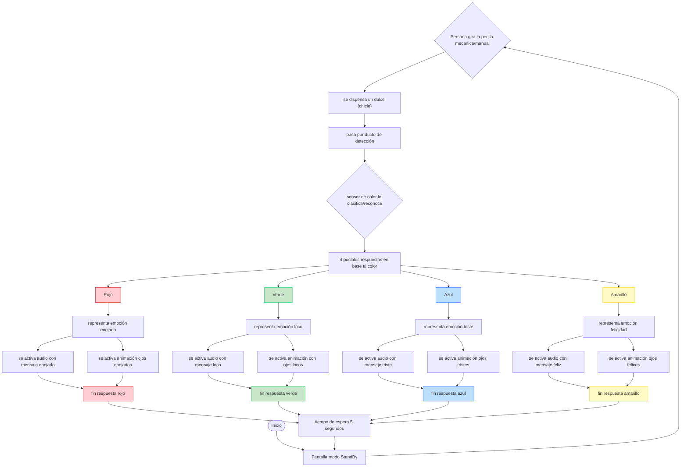

# sesion-07b

Martes 26 de Septiembre, 2025 

Nota del día: como grupo no sabíamos que el funcionamiento del sensor era complejo de administrar (dirigir/controlar - por su proceso de calibración y problemas con la medición dependiente de muchos factores de ambiente) - janise y mateo nos avisaron muy tarde): 

## Referentes (y otras cosas)

- **Dart** (lenguaje de programación de código abierto, desarrollado por Google - para programar con diseño. material.io, se puede prototipar con figma, se pueden usar como bibliotecas, entre otros) 
- **control + b** (produce generar 4 asteriscos (para enegrecer palabras))

## Qué hice hoy 

### Proyecto 02 -  Dispensador de dulces 

El proyecto consiste en un dispensador interactivo de dulces de colores (dulces a definir en base a su tamaño) que interpreta una especie de "suerte del día" a través del color (al azar) que se detecte, el mensaje se da en base a el sonido y la animación. Cada dulce representa una suerte distinta, y al ser dispensado, activa una reacción audiovisual que refleja eso.

#### Iteración 

La experiencia comienza cuando la persona se acerca a la  máquina dispensadora y gira una perilla mecánica. Al hacerlo, un dulce de color cae y pasa frente a un sensor de color. Este sensor identifica el color exacto del dulce y envía la información al sistema, que activa dos respuestas simultáneas:

- **Respuesta de audio:** Un parlante reproduce un mensaje pregrabado con tono humorístico, que comienza con el saludo base “Hola, terrícola” y continúa con una frase específica según el color detectado.
- **Respuesta visual:** Una pantalla circular OLED, que representa el ojo del monstruo/alien, cambia de animación para reflejar la emoción asociada al color. El ojo puede parpadear, moverse o mostrar expresiones de alegría, tristeza, enojo o locura.

Tras reproducirse el audio y la animación, la máquina espera unos segundos y vuelve automáticamente a su modo de reposo, mostrando una expresión neutral o de espera (durmiendo). 

#### Diseño carcasa (personaje)

El dispensador tiene forma de alien/monstruo, lo que le otorga una apariencia divertida y expresiva.

En su estructura incorpora:
- perilla mecánica para dispensar el dulce (sin necesidad de motor).
- Un sensor de color, que identifica el color del dulce al momento de caer.
- Una pantalla, donde se proyectan animaciones que cambian según el color detectado.
- Un parlante, que reproduce una frase o reacción vinculada al color del dulce.

La carcasa será impresa en 3D, permitiendo ocultar todos los componentes internos (Arduino, cables, sensor, parlante, etc.) y conservar una estética limpia y lúdica. 

#### Significado de los colores e ideas/ejemplos de los audios a utitlizar

| Color | Emoción | Audio representativo |
|:------|:---------|:---------------------|
| ${\color{green}Verde}$ | **Locura** | “Si el dulce sale envenenado no es mi culpa.” |
| ${\color{yellow}Amarillo}$ | **Felicidad** | “Ten tu dulce, que tengas bonito día.”  |
| ${\color{red}Rojo}$ | **Enojo** | “Toma tu dulce y ándate.”  |
| ${\color{blue}Azul}$ | **Tristeza** | “No te lleves mi dulcesito, por favor.” |

### Trabajo en clase

Para empezar hacer el proyecto, necesitamos hacer un pseudocódigo de las cosas que queremos hacer para tener la base del proyecto - debe describir las acciones principales que queremos implementar, esto servirá como base de desarrollo y guía para la estructura del código.

- separar el código bruto (por así decirlo) es para intentar que la pestaña principal (el que tiene el nombre del proyecto .ino) tenga un código chico/pequeño y se pueda ver completo en la primera pantalla - todas las especificaciones de cada parte del código estarían en las otras pestañas. Tener OJO con que archivos se deben incluir en que carpeta (y cosas de ese estilo). 

Se crean (ejemplo que dio el profe):

- **creditos.ino** (información del proyecto y autores.)
- **cableado.ino** (conexiones de pines y diagramas)
- **sensorUltrasonico.ino** (lectura y manejo del sensor de color.) 
- **sensoresActuadores.ino** (control general de sensores y actuadores.)

anotación: si bien el profe dio ejemplos con archivos .ino (más que nada como primer acercamiento a la separación del código general) la idea es utilizar archivos .h y archivos .cpp para el desarrollo del poryecto. 

anotación 2: recordar SIEMPRE poner comentarios de todo dentro de los códigos, explicando que se esta realizando e incluso comentarios generales que expliquen que se realiza en cada pestaña del pseudocódigo. 

#### Pseudocódigo (primer acercamiento) 

- archivo codigo.ino

```cpp
void setup() {
  configurarSensorColor();
  configurarTerminal();
}

void loop() {
 leerSensor();
 tomarDecisiones();
 actuar();
}
```

- archivo sensorcolor.ino

```cpp
// Sensor Reconocimiento de Color Tcs230 - Tcs3200

// censar los colores y ver cuales reconoce y cuales no (dependiendo de los dulces a utilizar)
// definir el rango de valores para que detecte los colores --> r:0 g:0 b:0
// hacer 4 clases con distintos parámetros (para cada color a utilizar) 
  
void configurarSensorColor() {
  //definir patita de entrada solo si es necesario
 
}

int valorActualSensorColor = 0

void leerSensorColor() {
  analogread()

}
```

- archivo sensoractuadores.ino

```cpp
void configurarSensoresActuadores() {

  configurarSensorColor();
  configurarModuloMp3();
  configurarPantalla();

  // configurar mas sensores
  // configurar actuadores
}

void leerSensores() {
  
  leerSensorColor();

}

void tomarDecisiones() {}

void actuar() {}
```

- terminal.ino

```cpp
bool terminalPrendida = false;

void configurarTerminal(){
  Serial.begin(9600);
  terminalPrendida = true
}
```

- archivo cableado.ino

```cpp
// Definir pines del sensor de color
// tiene 8 pines
// VCC a 5V
// GND a GND 
// OE a 2 

#define S0 4
#define S1 3
#define S2 6
#define S3 5
#define sensorOut 7

// https://afel.cl/products/sensor-reconocimiento-de-color-tcs230-tcs3200

//Definir pines de la pantalla TFT Circular 1.24 Pulgadas RGB 240x240
// tiene - pines
#define 
#define 

// https://afel.cl/products/pantalla-tft-circular-1-24-pulgadas-rgb-240x240?srsltid=AfmBOorbwmonIKo84cXqmhd1d9d_9t5dd25rnj_MESenQER5pHdJk0C9

//Definir pines del modulo reprodctor mp3
#define
#define 

// https://afel.cl/products/modulo-reproductor-mp3-dfplayer-mini
```

- archivo pantalla.ino

```cpp
// pantalla TFT Circular 1.24 Pulgadas RGB 240x240

#define SCREEN_WIDTH 240
#define SCREEN_HEIGHT 240 
```

- archivo fotogramas.ino

```cpp
// fotogramas animaciones por color
// va código de cada imagen sacado por image2cpp
```

- archivo modulomp3.ino

```cpp
// Modulo Reproductor MP3 DFPlayer Mini

configurarSD();
//definir funciones para manejar contenido
//ligar contenido a clases correspondientes 

configurarParlante();
//recibir el audio de la tarjeta SD
//ligar archivos de audio al parlante
//definir repetición y volumen
//de nuevo por medio de las clases
//reproducir un audio específico

}
```

## Encargo

Cada persona del grupo debe implementar en diagrama de flujo dibujado o con la herramienta Mermaid.js con sus propias palabras y subirlo a su README + cada persona del grupo debe subir a su README: documentar funcionamiento de sus sensores, incluyendo instrucciones de conexión y de configuración, subir el proyecto entero de arduino como carpeta, tiene que poder compilar sin problema y mostrar en consola los datos de los sensores. 

### Diagrama de flujo



- hecho en mermaid.js (<https://mermaid.js.org/>)

### Proyecto 02 - documentación 

#### Funcionamiento sensor color: 

- Explicación - cómo funciona.

El sensor utiliza una matriz de 8x8 fotodiodos. Estos están distribuidos de la siguiente manera:

- 16 fotodiodos con filtro para luz roja.
- 16 fotodiodos con filtro para luz verde.
- 16 fotodiodos con filtro para luz azul.
- 16 fotodiodos sin filtro (claros), para medir la intensidad total de la luz.

Mediante pines de control, se puede seleccionar qué grupo de fotodiodos está activo. La salida del sensor es una onda cuadrada (50% de ciclo de trabajo) cuya frecuencia es directamente proporcional a la intensidad de la luz del color seleccionado. Para determinar el color de un objeto, el microcontrolador mide la frecuencia para cada filtro (rojo, verde y azul) de forma secuencial. El módulo incluye LEDs de luz blanca para iluminar el objeto y asegurar una lectura consistente y precisa.

El módulo se controla principalmente a través de cuatro pines de selección (S0, S1, S2, S3).

- Selección del Filtro de Color (Pines S2, S3): Estos pines eligen qué color se va a medir.

| S2 |S3 | Filtro Seleccionado |
| ------|--------|--------------|
|Bajo | Bajo | Rojo (R)|
|Bajo | Alto | Azul (B)|
|Alto | Bajo | Claro (Sin filtro)|
|Alto | Alto | Verde (G)|

- Escala de Frecuencia de Salida (Pines S0, S1): Estos pines ajustan la frecuencia de salida para adaptarla a la capacidad del microcontrolador.
  
| S0 | S1 | Escala de Frecuencia |
| ------|--------|--------------|
|Bajo | Bajo | Apagado (Power Down) |
| Bajo | Alto | 2% |
|Alto | Bajo | 20% |
|Alto | Alto | 100%| 

Video explicativo: <https://youtube.com/shorts/rzvxGpP-t7g?feature=shared>

- conexión:

| Sensor TCS3200 | Arduino | Significado            |
| ---------------|---------|------------------------|
| VCC            | 5V      | Alimentación           |
| GND            | GND     | Tierra                 |
| S0             | D4      | Escalado de frecuencia | 
| S1             | D5      | Escalado de frecuencia | 
| S2             | D6      | Selección de filtro    |
| S3             | D7      | Selección de filtro    |     
| OUT            | D8      | Salida de frecuencia a medir | 
| OE             | D9      | Output LOW = activo |

- configuración:

Se utilizo el código base/explicativo de MCI educación: 

<https://cursos.mcielectronics.cl/2022/12/26/interfaz-del-sensor-de-color-tcs230-tcs3200-con-arduino/>

Que se divide en dos partes/procesos:

La primera parte se usa solo para calibrar el sensor: Lo que hace es medir los ancho de pulso (PW) que el sensor entrega para cada color (rojo, verde y azul).
Cada color se mide por separado activando los filtros internos del sensor (con los pines S2 y S3). El resultado se muestra en el monitor serie como tres números, que representan cuánta luz roja, verde y azul refleja el objeto. Estos datos sirven para determinar los valores mínimos (negro) y máximos (blanco) de cada color. Luego esos valores se usarán en el siguiente sketch para que el sensor interprete bien los colores reales.

La segunda parte usa los valores de calibración obtenidos antes - El sensor vuelve a medir los anchos de pulso, pero esta vez esos valores se mapean (con la función map()) al rango 0–255, para obtener directamente los valores RGB del color detectado. Así, el Arduino traduce las lecturas crudas del sensor en un formato entendible (por ejemplo: rojo=200, verde=40, azul=60). Esos valores se imprimen en el monitor serie y permiten reconocer el color exacto del objeto.

- partes 1:

```cpp 
// Define color sensor pins
#define S0 4
#define S1 5
#define S2 6
#define S3 7
#define sensorOut 8

// Variables for Color Pulse Width Measurements
int redPW = 0;
int greenPW = 0;
int bluePW = 0;

void setup() {
	// Set S0 - S3 as outputs
	pinMode(S0, OUTPUT);
	pinMode(S1, OUTPUT);
	pinMode(S2, OUTPUT);
	pinMode(S3, OUTPUT);

	// Set Pulse Width scaling to 20%
	digitalWrite(S0,HIGH);
	digitalWrite(S1,LOW);

	// Set Sensor output as input
	pinMode(sensorOut, INPUT);

	// Setup Serial Monitor
	Serial.begin(9600);
}

void loop() {
	// Read Red Pulse Width
	redPW = getRedPW();
	// Delay to stabilize sensor
	delay(200);

	// Read Green Pulse Width
	greenPW = getGreenPW();
	// Delay to stabilize sensor
	delay(200);

	// Read Blue Pulse Width
	bluePW = getBluePW();
	// Delay to stabilize sensor
	delay(200);

	// Print output to Serial Monitor
	Serial.print("Red PW = ");
	Serial.print(redPW);
	Serial.print(" - Green PW = ");
	Serial.print(greenPW);
	Serial.print(" - Blue PW = ");
	Serial.println(bluePW);
}


// Function to read Red Pulse Widths
int getRedPW() {
	// Set sensor to read Red only
	digitalWrite(S2,LOW);
	digitalWrite(S3,LOW);
	// Define integer to represent Pulse Width
	int PW;
	// Read the output Pulse Width
	PW = pulseIn(sensorOut, LOW);
	// Return the value
	return PW;
}

// Function to read Green Pulse Widths
int getGreenPW() {
	// Set sensor to read Green only
	digitalWrite(S2,HIGH);
	digitalWrite(S3,HIGH);
	// Define integer to represent Pulse Width
	int PW;
	// Read the output Pulse Width
	PW = pulseIn(sensorOut, LOW);
	// Return the value
	return PW;
}

// Function to read Blue Pulse Widths
int getBluePW() {
	// Set sensor to read Blue only
	digitalWrite(S2,LOW);
	digitalWrite(S3,HIGH);
	// Define integer to represent Pulse Width
	int PW;
	// Read the output Pulse Width
	PW = pulseIn(sensorOut, LOW);
	// Return the value
	return PW;
}
```
- partes 2:

```cpp
// Define color sensor pins
#define S0 4
#define S1 5
#define S2 6
#define S3 7
#define sensorOut 8

// Calibration Values
// *Get these from Calibration Sketch
int redMin = 0; // Red minimum value
int redMax = 0; // Red maximum value
int greenMin = 0; // Green minimum value
int greenMax = 0; // Green maximum value
int blueMin = 0; // Blue minimum value
int blueMax = 0; // Blue maximum value

// Variables for Color Pulse Width Measurements
int redPW = 0;
int greenPW = 0;
int bluePW = 0;

// Variables for final Color values
int redValue;
int greenValue;
int blueValue;

void setup() {
	// Set S0 - S3 as outputs
	pinMode(S0, OUTPUT);
	pinMode(S1, OUTPUT);
	pinMode(S2, OUTPUT);
	pinMode(S3, OUTPUT);

	// Set Sensor output as input
	pinMode(sensorOut, INPUT);

	// Set Frequency scaling to 20%
	digitalWrite(S0,HIGH);
	digitalWrite(S1,LOW);

	// Setup Serial Monitor
	Serial.begin(9600);
}

void loop() {
	// Read Red value
	redPW = getRedPW();
	// Map to value from 0-255
	redValue = map(redPW, redMin,redMax,255,0);
	// Delay to stabilize sensor
	delay(200);

	// Read Green value
	greenPW = getGreenPW();
	// Map to value from 0-255
	greenValue = map(greenPW, greenMin,greenMax,255,0);
	// Delay to stabilize sensor
	delay(200);

	// Read Blue value
	bluePW = getBluePW();
	// Map to value from 0-255
	blueValue = map(bluePW, blueMin,blueMax,255,0);
	// Delay to stabilize sensor
	delay(200);

	// Print output to Serial Monitor
	Serial.print("Red = ");
	Serial.print(redValue);
	Serial.print(" - Green = ");
	Serial.print(greenValue);
	Serial.print(" - Blue = ");
	Serial.println(blueValue);
}


// Function to read Red Pulse Widths
int getRedPW() {
	// Set sensor to read Red only
	digitalWrite(S2,LOW);
	digitalWrite(S3,LOW);
	// Define integer to represent Pulse Width
	int PW;
	// Read the output Pulse Width
	PW = pulseIn(sensorOut, LOW);
	// Return the value
	return PW;
}

// Function to read Green Pulse Widths
int getGreenPW() {
	// Set sensor to read Green only
	digitalWrite(S2,HIGH);
	digitalWrite(S3,HIGH);
	// Define integer to represent Pulse Width
	int PW;
	// Read the output Pulse Width
	PW = pulseIn(sensorOut, LOW);
	// Return the value
	return PW;
}

// Function to read Blue Pulse Widths
int getBluePW() {
	// Set sensor to read Blue only
	digitalWrite(S2,LOW);
	digitalWrite(S3,HIGH);
	// Define integer to represent Pulse Width
	int PW;
	// Read the output Pulse Width
	PW = pulseIn(sensorOut, LOW);
	// Return the value
	return PW;
}
```

#### Proyecto en carpeta 

- el archivo subido es el que se trabajo en clase, es algo muy general de momento - no compila porque no tiene datos bien definidos, creo que mas que nada sirvió para entender la separación de cada componente a utilizar por eso es más que nada comentarios de momento. 
