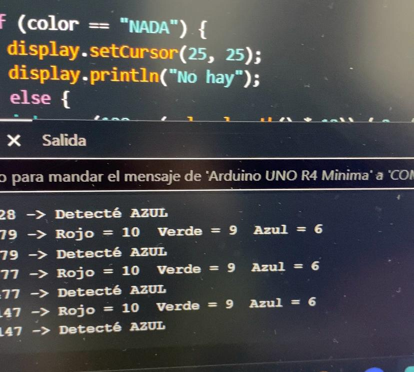
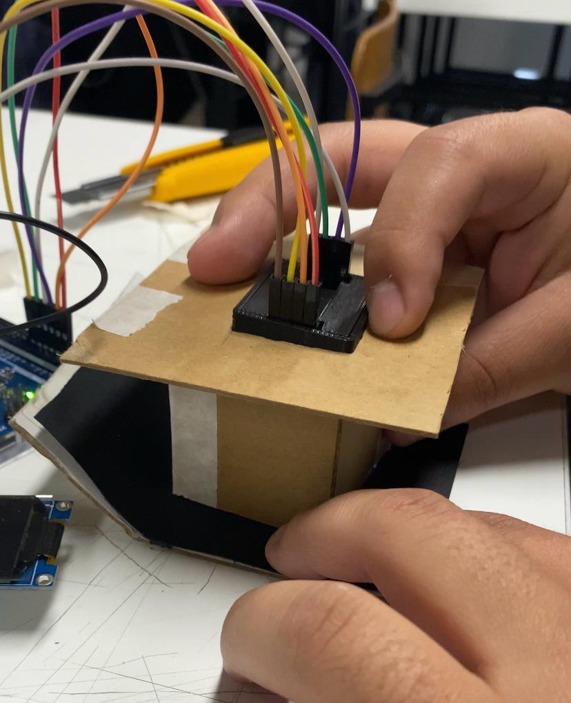
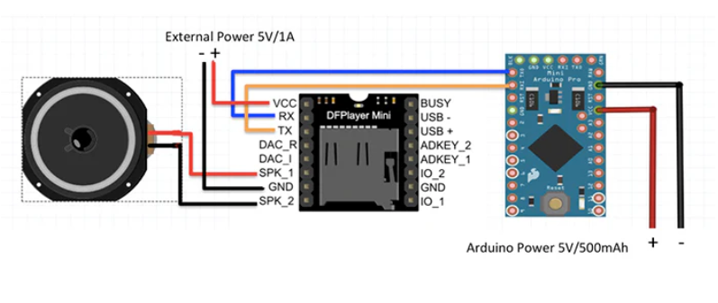
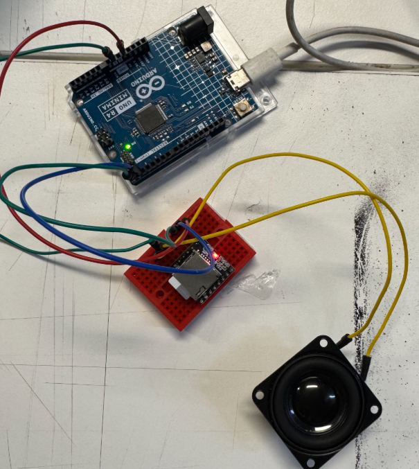
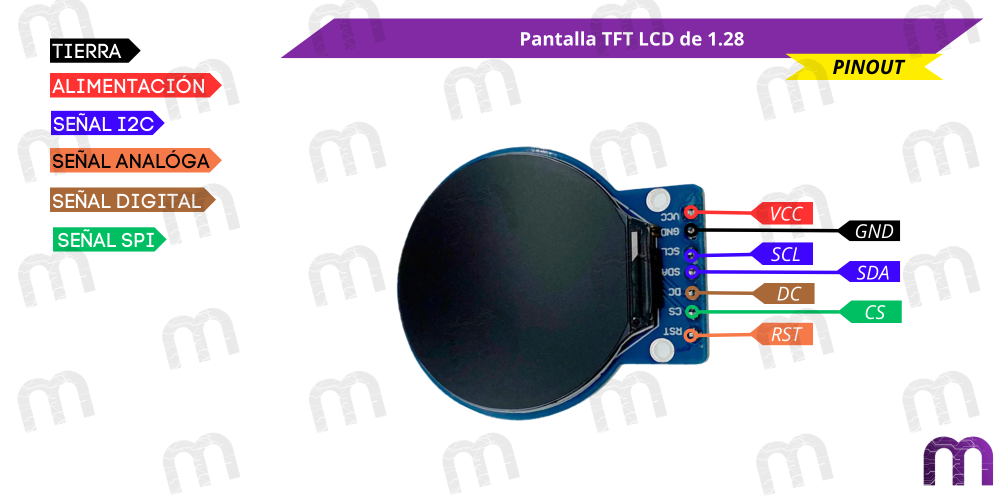
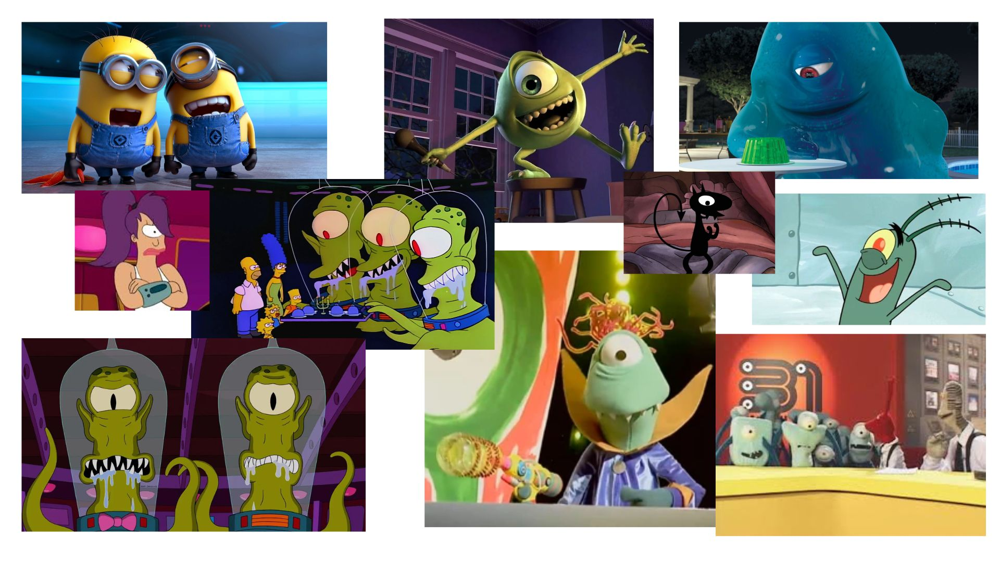
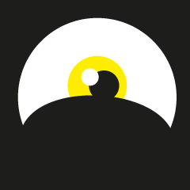
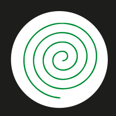

# sesion-08a

Martes 30 de Septiembre, 2025

Nota del día: no hay nota del día.

## Qué hice hoy 

- Avance en el proyecto 02: "Máquina dispensadora de dulces".

### Sensor

El fin de semana el nico (15-Nicolas-Miranda1312) se llevo el sensor ya que quería experimentar con el, por lo que al inicio de la clase lo primero que hizo fue comentarme que el sensor tiene un problema: los valores de frecuencia entregados por el sensor son muy altos y variaban según la luz ambiental, lo que hacía que el sistema fuera demasiado sensible e inestable.

Para solucionar ese problema el nico imprimió en 3D un modelo (<https://cults3d.com/es/modelo-3d/artilugios/color-sensor-for-smars>) que cubre el sensor y evita la entrada de luz externa y además comenzo a realizar pruebas en espacios oscuros, lo que permitió obtener lecturas más estables y precisas. Pero lo más importante es que del código base que estabamos utilizando de MCI educación (<https://cursos.mcielectronics.cl/2022/12/26/interfaz-del-sensor-de-color-tcs230-tcs3200-con-arduino/> - el código se menciona y se explica en clases anteriores de mi repositorio) se modifico/añadió una sección para limitar el valor máximo que daba el sensor mediante una función que nos ayudó a implementar un amigo del nico (los creditos correspodientes se encuentran el github del nico).

```cpp
// Función de normalización
// Convierte el valor leído en un rango de 0 a 10
int normalizar(int valor, int maximoEntrada) {
  if (valor > maximoEntrada) valor = maximoEntrada;   // limitar al máximo
  return (valor *10) / maximoEntrada;               // escalar proporcionalmente
```

nota: el valor (en el caso del ejemplo "0 a 10") va cambiar dependiendo el contexto de uso, por lo que puede ser modificado para poder detectar mejor los colores. Esto debido a que con ciertos ambientes los parámetros mas grandes no hacen una diferenciación de color: por ejemplo, amarillo-verde o azul-morado, por su parecido en los rangos. Al disminuir esa cantidad (el rango máximo) o ir jugando con este dato, los parámetros pueden quedar más exactos y asi detectar mejor cada color. 

y para la identificación de color se utiliza este código: 

```cpp
// DETECCIÓN DE COLORES
  if (cercaDe(rojoPW, 3) && cercaDe(verdePW, 1) && cercaDe(azulPW, 2)) {
    Serial.println("Detecté VERDE");
  }
  else if (cercaDe(rojoPW, 2) && cercaDe(verdePW, 1) && cercaDe(azulPW, 1)) {
    Serial.println("Detecté AMARILLO");
  }
  else if (cercaDe(rojoPW, 4) && cercaDe(verdePW, 3) && cercaDe(azulPW, 2)) {
    Serial.println("Detecté ROJO");
  }
  else if (cercaDe(rojoPW, 2) && cercaDe(verdePW, 3) && cercaDe(azulPW, 1)) {
    Serial.println("Detecté AZUL");
  }
  else {
    Serial.println("No detecto nada");
  }
```

Esta parte del código funciona mediante la utilización de una serie de condiciones if que comparan los valores de frecuencia (ancho de pulso) obtenidos por cada canal: rojo, verde y azul (en base a la base del código de calibración visto la clase pasada). Cada color tiene una combinación característica de frecuencias, y al aproximarse a esos valores, el sistema identifica de qué color se trata.

- **rojoPW, verdePW, azulPW**  - Son los valores de frecuencia medidos por el sensor de color en cada canal (Red, Green, Blue - RGB).
- **cercaDe(valor, referencia)** - Es una función auxiliar que compara si el valor leído está dentro de un rango aceptable respecto a una referencia.
- Cada bloque if representa una combinación aproximada de frecuencias que corresponde a un color detectado.
- Si ninguna condición se cumple, el programa imprime "No detecto nada", indicando que no se reconoció ningún color válido.

Al igual que la otra parte los datos númericos deberán ir siendo modificado en base a los parametros RGB que se detecten en el funcionamiento del momento ya que son variables que cambian según al ambiente específico donde se este utilizando el sensor. 

Todo esto dio el código del sensor de color completo que se va utilizar (más partes del código referente antes mencionado): 

```cpp
// Pines del sensor
#define S0 2
#define S1 3
#define S2 4
#define S3 5
#define salidaSensorOut 6
#define OE 7   // Pin para activar/desactivar el sensor

// Variables para medir el ancho de pulso (valores de colores)
int rojoPW = 0;
int verdePW = 0;
int azulPW = 0;

// Función de normalización
// Convierte el valor leído en un rango de 0 a 10
int normalizar(int valor, int maximoEntrada) {
  if (valor > maximoEntrada) valor = maximoEntrada;   // limitar al máximo
  return (valor * 10) / maximoEntrada;               // escalar proporcionalmente
}

void setup() {
  pinMode(S0, OUTPUT);
  pinMode(S1, OUTPUT);
  pinMode(S2, OUTPUT);
  pinMode(S3, OUTPUT);
  pinMode(OE, OUTPUT);

  // Escala de frecuencia al 20%
  digitalWrite(S0, HIGH);
  digitalWrite(S1, LOW);

  // Activar el sensor
  digitalWrite(OE, LOW);

  pinMode(salidaSensorOut, INPUT);

  Serial.begin(9600);
}

void loop() {
  // Leer valores de cada color (normalizados)
  rojoPW = leerRojo();
  delay(100);

  verdePW = leerVerde();
  delay(100);

  azulPW = leerAzul();
  delay(100);

  // Mostrar lecturas
  Serial.print("Rojo = ");
  Serial.print(rojoPW);
  Serial.print("  Verde = ");
  Serial.print(verdePW);
  Serial.print("  Azul = ");
  Serial.println(azulPW);

  // DETECCIÓN DE COLORES
  if (cercaDe(rojoPW, 3) && cercaDe(verdePW, 1) && cercaDe(azulPW, 2)) {
    Serial.println("Detecté VERDE");
  }
  else if (cercaDe(rojoPW, 2) && cercaDe(verdePW, 1) && cercaDe(azulPW, 1)) {
    Serial.println("Detecté AMARILLO");
  }
  else if (cercaDe(rojoPW, 4) && cercaDe(verdePW, 3) && cercaDe(azulPW, 2)) {
    Serial.println("Detecté ROJO");
  }
  else if (cercaDe(rojoPW, 2) && cercaDe(verdePW, 3) && cercaDe(azulPW, 1)) {
    Serial.println("Detecté AZUL");
  }
  else {
    Serial.println("No detecto nada");
  }

  delay(200);
}

// Funciones de lectura con normalización
int leerRojo() {
  digitalWrite(S2, LOW);
  digitalWrite(S3, LOW);
  int valor = pulseIn(salidaSensorOut, LOW);
  return normalizar(valor, 2000);  // Ajusta 2000 al máximo real de tu sensor
}

int leerVerde() {
  digitalWrite(S2, HIGH);
  digitalWrite(S3, HIGH);
  int valor = pulseIn(salidaSensorOut, LOW);
  return normalizar(valor, 2000);
}

int leerAzul() {
  digitalWrite(S2, LOW);
  digitalWrite(S3, HIGH);
  int valor = pulseIn(salidaSensorOut, LOW);
  return normalizar(valor, 2000);
}

// Función auxiliar para comparación aproximada
bool cercaDe(int valor, int objetivo) {
  return abs(valor - objetivo) <= 1;
}
```

Funcionamiento: 

(el sensor esta así para darle oscuridad a lo que se este censando)





### Reproductor mp3: 

- el reproductor a utilizar es un Módulo reproductor Mp3 deplayer mini <https://afel.cl/products/modulo-reproductor-mp3-dfplayer-mini> que además necesita de un Mini Parlante Altavoz de 3w <https://afel.cl/products/mini-parlante-altavoz-de-3w>

El reproductor reproduce archivos de audio almacenados en una tarjeta microSD (la camila "09-notcaamila" se ofreció a traer una). Ofrece dos modos de control: uno autónomo mediante pulsadores y otro a través de comunicación serie (UART), lo que lo hace totalmente compatible con microcontroladores como Arduino. Además, su amplificador de audio incorporado permite conectar directamente un altavoz, simplificando el diseño del circuito para añadir voces, música o efectos de sonido a cualquier creación.

Características:

- **Voltaje de Operación:** 3.2V a 5.0V DC.
- **Modos de Control:** Interfaz serial (UART) para control con microcontroladores y modo de control I/O para uso con pulsadores.
- **Amplificador Integrado:** Salida de audio mono para conectar directamente un altavoz de hasta 3W (4Ω).
- **Almacenamiento:** Soporta tarjetas microSD de hasta 32GB con formato de archivo FAT16 o FAT32.
- **Calidad de Sonido:** Salida DAC de 24 bits con rango dinámico de 90dB y soporte para tasas de muestreo de 8kHz a 48kHz.
- **Organización de Archivos:** Admite hasta 100 carpetas, con un máximo de 255 pistas de audio por carpeta.

Para la conexión: 
  


Anotaciones: 

Para que los sonidos del proyecto se reproduzcan correctamente junto con las animaciones y colores, es necesario numerar los archivos de audio dentro de la tarjeta SD. Aunque parezca obvio, el orden físico de los archivos en la memoria sí importa: si se copian al azar, aunque tengan nombre o número correcto, el reproductor no los reconocerá bien.

Entendiendo un poco el funcionamiento y lo que queremos lograr definimos que hay cuatro escenarios posibles, uno por cada color de dulce, y cada uno tiene su propio audio o saludo asociado. Asi que usando estructuras if y else if, se determina qué color fue detectado y se llama al archivo de audio correspondiente.

El miguel ("29-MiguelVera23" - fue el más emocionado de investigar y ver como utilizar el reproductor así que él pidió llevarselo para ver el funcionamiento del mp3) y encontró este link de referencia como código base para poder comenzar a utilizar el parlante: <https://projecthub.arduino.cc/munir03125344286/play-audio-in-arduino-d64363>

El referente sirvió para comprender cómo funciona la numeración y orden de reproducción de archivos, la lógica de control del reproductor y cómo pasar de un audio al siguiente y la posibilidad de añadir una comunicación por monitor serial para mostrar errores o estados, aunque en nuestro caso se va utilizar una versión más simplificada.



### Pseudocódigo 

En paralelo a todo esto decidimos entre todos ir ordenado bien el pseudocódigo como una versión extendida para entender realmente cada proceso y que debemos realizar para que el proyecto llegue a lo que queremos realizar. 

Si bien el archivo quedo extensamente largo (muchas pestañas) creemos que es conveniente de momento para poder ver la vista general de todo y a medida que se vaya realizando cada parte del código (y con ayuda de los profes) poder ir "achicando" la cantida de pestañas hasta que solo quede lo escencial para el trabajo (y su "entendimiento"). 

- el archivo se puede ver adjunto en la carpeta que se llama "SensorColor", de momento no salen funciones funcionales (no compila) pero si se mencionan las funciones que se ejemplificaron en clases anterior como primera visión; la subdivisión de pestañas es más que nada la explicación en comentarios de que deberia ir en cada una de estas. 

## Encargo

Cada persona del grupo debe subir a su README: qué llevan hasta el final de esta sesión, qué sí funciona, qué funciona casi, qué no funciona. después subir nueva versión del código y de la documentación, del trabajo que hagan entre 8a y 9a. 

### Sesión 

Entonces, arriba en la sección "qué hice hoy" escribí los hallazgos y distintas cosas que se realizaron durante la clase (ya sea en conjunto o ya más personalmente) por lo tanto de momento las conclusiones son: 

- **Qué funciona:** sensor de color (se sabe que los datos son modificables en relación al ambiente donde se este uitilizando).
- **Qué casi funciona:** reproductor mp3 (esto entendiendo al reproductor mp3 como un conjunto entre el reproductor, el parlante y la tarjeta sd - se tiene una base de código y ahora solo falta poner las especificaciones en base al proyecto). 
- **Qué falta por ver:** pantalla (como funciona, conexiones, códigos), animaciones (fotogramas de ojos a utilizar), audios (4 - uno como respuesta a cada color), unión de todo en un solo archivo (y que funcione). 

+ de momento diría que no podemos decir que algo "no está funcionando".

vamos avanzando paso a pasito (suave, suavecito)

### Documentación entre clases 8a - 9a 

Mi trabajo entre estas clases no fue mucho ya que no tuve mucho tiempo para poder avanzar en el trabajo, de todas formas como tal lo que realice fue la investigación de la pantalla y comenzar a ver referentes e ideas para la expresión de los ojos. 

#### Pantalla TFT Circular 1.24 Pulgadas RGB 240x240

- No hay necesidad de comprarla ya que en el trabajo anterior entregaron una de estas pantallas por grupo. 

Las pantallas TFT LCD funcionan mediante el control de píxeles individuales para crear imágenes detalladas y de alta calidad. Utilizan un controlador como el GC9A01 para gestionar la información que se muestra en la pantalla. La interfaz SPI permite una comunicación rápida y eficiente con microcontroladores, lo que facilita la integración en proyectos.

<https://afel.cl/products/pantalla-tft-circular-1-24-pulgadas-rgb-240x240>

Características:

- **Tamaño:** 1,28 pulgadas.
- **Resolución:** 240x240
- **Controlador:** GC9A01
- **Interfaz:** SPI de 4 cables.
- **PCB:** 240x240
- **Dot pitch:** 0.135x0.135
- **Diámetro activo:** 32.5 mm.
- **Tamaño del módulo:** 45.5x46x11.5
- **Arreglo de color:** RGB Vertical Stripe.
- **Luminancia:** 400 (cd/m2)
- **Dirección de visualización:** todas las vistas.
- **Retroiluminación:** 2 LED blancos en paralelo.
- **Temperatura de operación:** -20 a 70 ºC
- **Pines:** VCC, GND, SCL, SDA, DC, CS, RST
- **RGB Vertical Stripe** - La alta resolución de la pantalla TFT LCD proporciona una reproducción precisa de gráficos y detalles, asegurando una calidad de imagen nítida y atractiva.

Conexión: 



- VCC: Al pin de 3.3V de tu microcontrolador.
- GND: A un pin de Tierra (GND).
- SCL (o SCK): Al pin SCK (Serial Clock) de tu microcontrolador. (D13)
- SDA (o MOSI): Al pin MOSI (Master Out Slave In) de tu microcontrolador. (D11)
- RES (o RST): Al pin de Reset, conéctalo a cualquier pin digital. (D08)
- DC (o A0): Al pin Data/Command, conéctalo a cualquier pin digital. (D09)
- CS (o SS): Al pin Chip Select, conéctalo a cualquier pin digital. (D10)

Códigos base para ver funcionamiento: 

<https://soporte.lab1.tech/knowledgebase.php?article=7>

```cpp
#include <Arduino_GFX_Library.h>
#include <Adafruit_GFX.>
#define TFT_RST -1 // o 4
#define TFT_CS D8 // o 15
#define TFT_DC D2 // o 4

Arduino_DataBus *bus = new Arduino_HWSPI(TFT_DC, TFT_CS);
Arduino_GC9A01 *gfx = new Arduino_GC9A01(bus, TFT_RST, 0 /* rotation */, true /* IPS */);


void setup() {
 gfx->begin();  

  gfx->setTextSize(3);   
  gfx->fillScreen(BLACK); 
  gfx->setTextColor(RED); 
  gfx->setCursor(30, 60);
  gfx->print("GC9A01");   
  gfx->setTextSize(2);
  gfx->setCursor(30, 100);
  gfx->setTextColor(WHITE);
  gfx->print("Hello World !");
  gfx->setCursor(30, 140);
  gfx->setTextColor(YELLOW);
  gfx->print("LAB1 Tech");
  gfx->setCursor(20, 160);
  gfx->setTextColor(BLUE);
  gfx->print("www.lab1.tech");}

void loop() {

}
```

```cpp
#include <Adafruit_GFX.h>
#include <Adafruit_GC9A01A.h>

#define TFT_CS 10
#define TFT_DC 9
#define TFT_RST 8

Adafruit_GC9A01A tft(TFT_CS, TFT_DC, TFT_RST);

void setup() {
  tft.begin();
  tft.fillScreen(GC9A01A_BLACK);
  tft.setCursor(40, 100);
  tft.setTextColor(GC9A01A_WHITE);
  tft.setTextSize(2);
  tft.println("¡Hola Mundo!");
}

void loop() {}
```

#### Referentes e ideas ojos 

El alien (que hasta el momento sigue sin tener nombre) esta basado en distintos personajes ya existentes como los Sirulios de 31 minutos, Kang y Kodos de Los Simpson, los minions, entre otros. 

la idea es que el personaje solo tenga un ojo (la pantalla circular es el ojo) para eso tenemos también de referentes a personajes como Mike Wazowski de Monster inc, Plankton de Bob esponja, B.O.B de Monstruos v/s aliens y algunos minions, Leela de Futurama . Con estos personajes podemos ver bien como expresar ciertas emociones sin la necesidad de que tenga cejas y teniendo un solo ojo con espacio limitado para desarrollar la expresión que se quiera dar. 



Los colores son estos: 

- Verde - Ojo loco.
- Amarillo - Ojo Feliz.
- Rojo - Ojo enojado.
- Azul - Ojo triste.

Algunos bosquejos/ideas/avances: 







