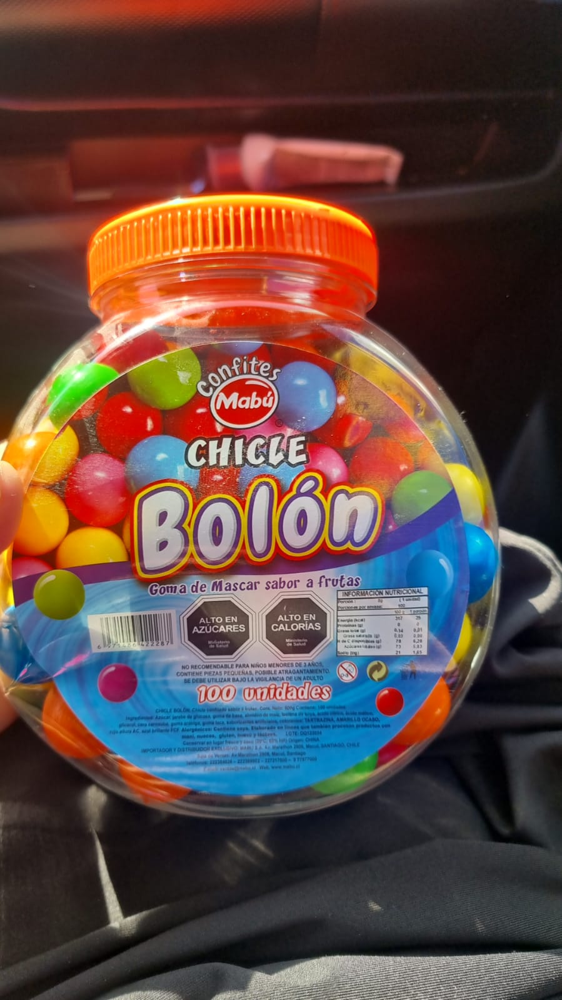
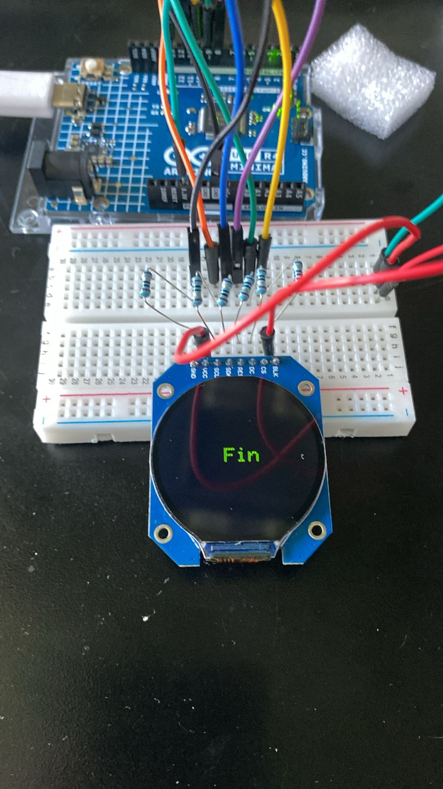
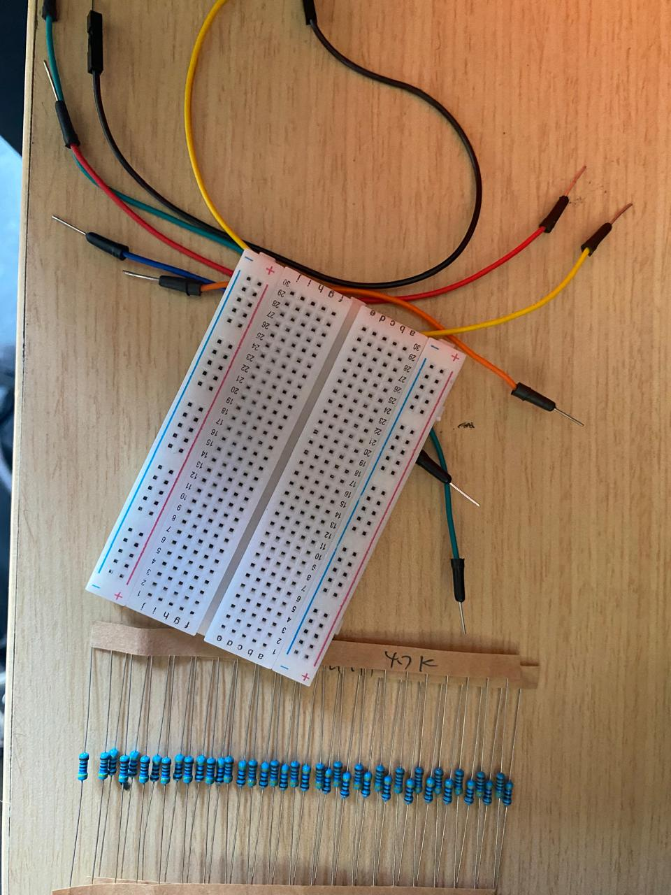
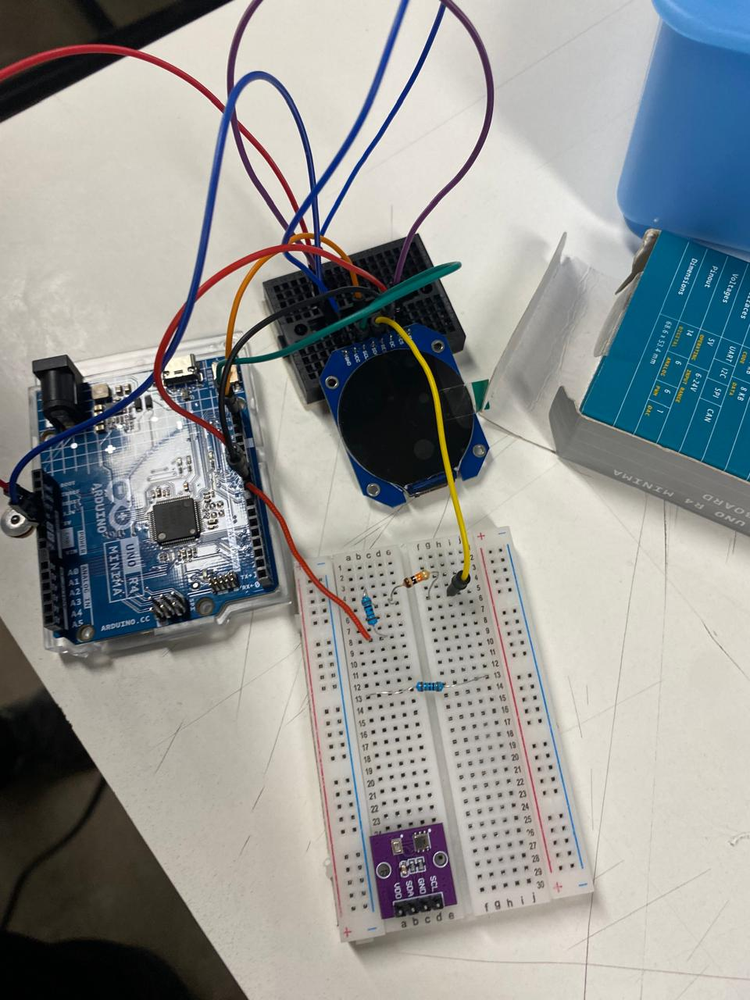

# sesion-09a

Martes 07 de octubre, 2025.

Nota del día: tenemos los dulces (yeeih).

## Qué hice hoy

- Avance en el proyecto 02: "Máquina dispensadora de dulces".

### Qué ha pasado desde la última clase 

- **Definimos el dulce a utilizar:** 

Era importante decidir que dulce utilizaríamos en base a su tamaño, ya que este factor influye directamente en el diseño y funcionamiento del dispensador. Los dulces como los Chubbis, M&M o similares presentan un tamaño muy pequeño, lo que genera una dificultad al momento de diseñar el mecanismo de dispensado. En la mayoría de los prototipos de dispensadores disponibles en línea (que tomaremos solo como base de referencia para luego modificarlos según el poryecto en sí), el sistema permite que salgan dos o más dulces por cada activación. Esto ocurre porque el tamaño de los orificios o del dosificador no está pensado para piezas tan pequeñas.

Además, reducir aún más las dimensiones del dispensador no es una buena solución, ya que aumenta el riesgo de que los dulces se atasquen o queden atrapados en la salida, al chocar entre sí y bloquear el paso.

En nuestro caso, es fundamental que se dispense solo un dulce por vez, dado que el sensor de color debe identificar un único color en cada tirada. Si se liberan varios dulces simultáneamente, el sensor no podría realizar una lectura precisa del color, afectando directamente la función principal del proyecto.

Por este motivo, y considerando que un dulce de mayor tamaño facilitará la lectura del color, se optó por utilizar los **chicles “mata muelas”** (los clásicos chicles duros cuyo sabor dura apenas unos segundos). Estos fueron adquiridos en Fruna a un valor aproximado de $7.000, y presentan una amplia variedad de colores (seis en total), lo que los hace ideales para el desarrollo y calibración del sistema.



- **El reproductor mp3 ya funciona.**

El miguel (29-MiguelVera23) se llevo durante estos días el reproductor para poder configurarlo y lo logró (solo tiene que modificar unas pequeñas cositas que spoiler! logró solucionarlo con la ayuda de janis y uno de los profes pero no sé quién) así que ahora solo faltan los audios específicos que vamos a estar utilizando.  

- **Primer acercamiento a la figura física**

La camila (09-notcaamila) trajo una impresión 3d de base para ver el funcionamiento del dispensador, este fue modificado en base al tamaño exacto de los chicles pero quedo muy justo así que ella que se va encargar del modelo 3D y de seguir editandolo para conseguir una versión que funcione al 100%. 

### Qué se desarrollo durante la clase 

- **Sensor de color + dulces**

Ya que ya tenemos los dulces en formato físico el nico pudo usar el sensor de color con estos y ver como funcionaban. Lamentablemente los colores que teníamos pensado usar en el principio no pasaron al 100% la prueba de identificación, más que nada el problema es el color amarillo que comparte valores RGB muy parecidos al verde y muchas veces lo detecta como ese color. En base a esto decidimos cambiar el color amarillo por el color naranja que no presentó ningún tipo de problema. 

De todas formas, hace falta ver la carcasa en donde va ir específicamente el sensor de color ya que hay que recordar que el sensor funciona en base a su ambiente y puede cambiar mucho los valores en base a este, por lo tanto puede ser que cuando este en la carcasa si detecte bien amarillo pero no el naranja. 

El color verde, azul y rojo no presentaron problemas. 

- **Pantalla**

Por mi parte estuve full viendo el funcionamiento de la pantalla y de ahí se desarrollaron una serie de problemas. 
(los problemas se presentan aislados pero fueron pasando al mismo tiempo)

#### Problema 01

Al ser mi primera vez en contacto con esta pantalla me guíe en base al diagrama de conexión que mencione en la clase anterior. El problema es que faltaba un pin por conectar que no sale en el diagram. 

Busque en todos los locales comerciales en base al mismo nombre (el de la pantalla) y todos contenían 7 pines y el ejemplar que yo poseía tenía 8. 
En base a esto tuve que darme miles de vuelta intentando encontrar alguno que tuviera 8 pines o algún diagrama que explicará como funcionaba, qué es lo que funciona distinto. 

No fue hasta casi al final de la clase que el seba (27-SebastianSaez1003) escuchó parte de los problemas que tenía e intentaba solucionar y se ofreció a ayudarme ya que una persona de su grupo ya había hecho funcionar en una oportunidad esa pantalla (con 8 pines), él me dio estos dos referentes que me ayudaron UN MONTÓN y practicamente fueron los que me hicieron comprender mejor como funciona la pantalla y qué es lo que debería hacer a continuación. 

Los referentes son: 

- "GC9A01 with Arduino | Round display" de eazytronic <https://eazytronic.com/gc9a01-with-arduino/> (este fue el que mas utilice)
- "Using GC9A01 Round LCD Modules" de DroneBot Workshop <https://dronebotworkshop.com/gc9a01/>

#### Problema 02

- **La pantalla nunca reaccionó**. 

Si bien se veía que estaba prendida (en los bordes se ve que está iluminada) solo se veía negro en la pantalla y no pasaba absolutamente nada (nada de nada).

Como la pantalla redonda no funciona igual que la pantalla rectangular utilizada anteriormente pensé que el problema era el código, así que procedí a intentar con miles de códigos que encontré en la web. 

Algunas fueron: 

- Display 1.28' GC9A01 - Documentacion y Ejemplos (<https://soporte.lab1.tech/knowledgebase.php>)
- GC9A01A Arduino Library (<https://github.com/adafruit/Adafruit_GC9A01A>)
- Pantalla redonda GC9A01 240x24 y medidores (video youtube <https://www.youtube.com/watch?v=y_H7HM0oyoo>, el código esta en <https://github.com/VolosR/BoatGauges>)
- Tutorial de configuración de TFT_eSPI (video youtube <https://www.youtube.com/watch?v=6lLlKY5U77w>, el código esta en <https://github.com/thelastoutpostworkshop/tft_eSPI_configuration>)
- GC9A01 Pantalla TFT LCD Circular 1.28 Pulgadas (<https://uelectronics.com/producto/gc9a01-pantalla-tft-lcd-circular-1-28-pulgadas/>)
- entre otras. 

Mateo me ayudó cuando realmente ya no sabía como seguir, pero cuando él tampoco logró generar una reacción procedimos a pedirle ayuda a la inteligencia artificial para ver si con eso podríamos llegar a alguna solución tanto del código como del pin que faltaba por conectar. 

No llegamos a nada pero si nos sirvió para describirle el problema a la ia y en base a eso pudimos saber que el pin faltante era el que controlaba la de retroiluminación (Backlight) y al igual que el pin vcc se conecta a la placa de arduino en el pin 3.3V. Y descubrimos la parte más importante: la pantalla no tiene chip regulador (AMS1117 u otro), así que funciona solo con 3.3 V lógicos y el UNO R4 Minima trabaja a 5V lógicos por lo tanto nunca debí conectarlo en primer lugar al arduino directo. 

Buscando más información, encontré lo siguiente: 

"La pantalla opera a 3.3V. ¿Puedo conectarla directamente a un Arduino UNO que usa lógica de 5V?

Esta es una pregunta de seguridad muy importante. No, no debes conectarla directamente. El controlador GC9A01 y la pantalla están diseñados para una lógica de 3.3V. Conectar los pines de datos (como SCK, SDA, CS, DC) directamente a los 5V de un Arduino UNO puede dañar la pantalla permanentemente. La solución correcta y segura es usar un conversor de nivel lógico bidireccional (logic level shifter) entre el Arduino y la pantalla. Este componente «traduce» de forma segura las señales de 5V a 3.3V y viceversa. Para placas que ya operan a 3.3V, como el ESP32 o la Raspberry Pi Pico, puedes conectarla directamente sin problemas."

Al no tener acceso a un conversor nivel lógico bidireccional el seba (que me ayudó con los referentes) me dijo que podía intentar usar resistencias para ver si se lograba el mismo resultado que el conversor. Jamas en mi vida había usado resistencias (y la verdad tampoco tenía mucha idea de qué eran o como funcionaban) pero el seba me explicó la parte base de cómo conectarlos en la photoboard y con ayuda de chatgpt identificamos que tipo de resistencia debería intentar usar y que partes de la conexión de la pantalla al arduino deberían ir con cual.

Además me dijo que las resistencias funcionaban con las barritas de colores que tiene (es como que esas barritas dan que tipo de kΩ son) y podía buscar en la web cualquier página que sirviera para "calcular código de colores de resistencias" para darle los colores de la resistencia que tuviera y asi me daría el numero de kΩ que fuera correspondiente. (estoy muy agradecida con el seba) 
 
#### Problema 03

Los códigos no funcionaban porque la mayoría tampoco compilaban. 

Así que aparte de que la pantalla en sí no funcionara porque todo este tiempo estuvo conectada a 5V lógicos a pesar de que necesitaba 3.3V existía un problema de que mi arduino no reconocia los códigos de la web a pesar de que estos estuvieran comprobados (es decir tenían el respaldo de que funcionaban), después de investigar descubrí que esto se debía a que la placa de arduino UNO r4 minima no contaba con la capidadad para que adjuntara (por así decirlo) la librería principal que se utiliza en la mayoria de los ejemplos de la pantalla, la librería: **Adafruit_GC9A01**.

Explicación de por qué no funcionaba: 

- El Arduino UNO R4 Minima no usa el clásico ATmega328P como el UNO R3 o Nano, sino un microcontrolador Renesas RA4M1 (arquitectura ARM Cortex-M4 a 48 MHz). Esto significa que: El núcleo (core) de Arduino es completamente distinto y no incluye algunos archivos y funciones propias de los AVR clásicos que sí usa la librería Adafruit_GC9A01.

algunasd de las funciones:

```cpp
wiring_private.h
pinModeFast()
digitalPinToPort()
portOutputRegister()
```

Esto es lo que provoca que al momento de compilar el código estando conectado al arduino UNO r4 minima apareciera el error:

```cpp
fatal error: wiring_private.h: No such file or directory.
```

Al final, es porque ese archivo (de esa librería/biblioteca) existe solo en las placas basadas en AVR (UNO R3, Nano, Mega), pero no en las basadas en Renesas (UNO R4 Minima o WiFi). Además, lamentablemente Adafruit aún no ha actualizado esa librería - hasta la fecha no se ha publicado soporte oficial para el chip Renesas RA4M1 en Adafruit_GC9A01 ni Adafruit_GFX (en su rama principal, aunque el GFX sí funcionó en la pantalla reactangular utilizada con anterioridad).

Algunas librerías que si corren bien con el arduino UNO r4 minima: (pero sus aplicaciones son más limitadas o en algunos cosas no funcionan tan bien como la de adafruit)

```cpp
Arduino_GFX_Library
TFT_eSPI
LovyanGFX
```

## Qué hice en la semana (antes de la clase 09-b)

### Probar resistencias 

Después de haber comprendido un poco las problematicas que presentaba la pantalla decidí partir arreglando lo principal: la conexión. 

Como comente antes para hacer uso de esta necesitaba un conversor lógico pero no teníamos uno a la mano así que ese mismo día después de clases fuí a buscar algunas resistencias al lab haber sí así lograba que funcionará algo. 

Despues de conectarlo todo siguiendo la misma lógica de conexión pero con las resistencia (recibí ayuda de algunas compañeras para ver y entender mejor como conectar las resistencias) y adjuntando un código que no utlizara la librería de adafruit lamentablemente tampoco logré que funcionara al 100% pero si logre una minima respuesta: que en la pantalla saliera en verde "fin"

Fue muy raro porque la parte del código que dice "hola mundo" se veía solo si uno estaba practicamente pegado a la pantalla, le faltaba mucha nitidez y se veía cortado, pero de ahí a cuando pasaba al "fin" y se quedaba estático en eso se veía bien iluminado y se etendía bien el texto, no salía cortado.

En base a eso pensé que algo había conectado mal pero seguí revisando más fuentes y todo salía "bien".

el código utilizado: 

```cpp
#include <Arduino_GFX_Library.h>

#define TFT_CS   10
#define TFT_DC    9
#define TFT_RST   8

Arduino_DataBus *bus = new Arduino_HWSPI(TFT_DC, TFT_CS);
Arduino_GFX *gfx = new Arduino_GC9A01(bus, TFT_RST, 0, true);

unsigned long startTime;

void setup() {
  gfx->begin();
  delay(1000); // Espera 1 segundo para que el backlight se estabilice
  gfx->fillScreen(BLACK);
  gfx->setTextColor(WHITE);
  gfx->setTextSize(3);
  startTime = millis();
}

void loop() {
  if (millis() - startTime < 10000) {  // 10 segundos
    gfx->setCursor(60, 110);
    gfx->print("Hola mundo   "); // texto más estable
    delay(500);
  } else {
    gfx->fillScreen(BLACK);
    gfx->setTextColor(GREEN);
    gfx->setCursor(100, 110);
    gfx->print("Fin");
    while (true); // detener
  }
}
```

Intenté otros códigos pero no se veía nada, desconecte todo y lo volví a conectar desde cero pensando que en algo me había equivocado pero todo seguía igual así que al final me rendí. 







### Comprar 

Al día siguiente fui al lab a trabajar en otras cosas y, estando ahí (después de que elle profe Aarón me ayudara a ordenar el código), decidí impulsivamente ir a comprar el conversor lógico que aparecía en el ejemplo del referente que me dio el Seba.

En la próxima clase lo voy a probar.

