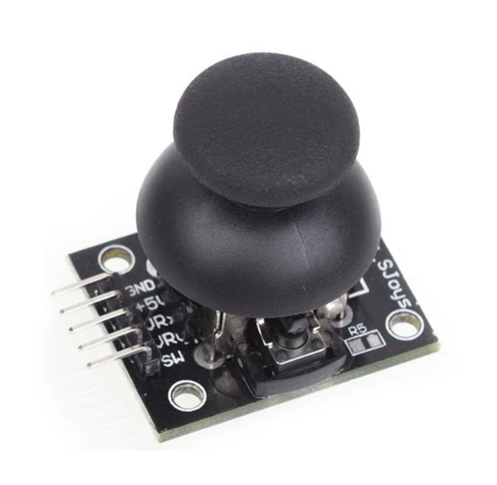
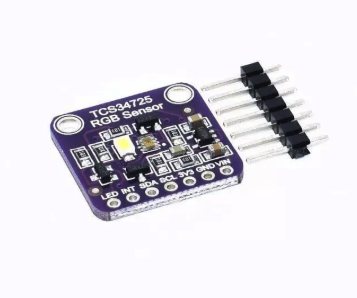

# sesion-06a

Martes 9 de septiembre de 2025

## Apuntes de clases

- Scratch: programación para niños, mediante metáforas para que aprendan a progamar.
- Pure Data: programa para audio
- Miller Pucket: arte y programación, orientada al audio.
- Max: gráficas para hacer audio.
- OOP: programación orientada a objetos. Objetos que interactuan mediante programación.
- vvvv: sofware de programación.
- Lint: proceso de automatización para corregir errores. En github, sería un "archivo para sacar las peslusas".
- YAML: estilo de lenguaje que sirve para ordenar la información.
- Donald Knuth: creó LaTeX
- LaTeX: usando el programa *Overleaf* permite progamar texto, es decir documentos. Por ejemplo, currículums, papers, presentaciones, etc. También hay templates para rellenar según la información necesaria.
- Llamk'ana: lenguaje de programación en quechua. Traduce las variables al lenguaje quechua.
- Weaving to Code, Coding to Wave: mezcla proyectos de tejido con programación.
- PEmbroider: se sube un código que se programa y eso después hace un tejido como producto final. (<https://www.youtube.com/watch?v=BDE2Tx6HHLc>)
- **La caja negra**: no sabemos como funciona pero tiene una **entrada** y una **salida**.

### Github y Lint

- Sirve para corregir errores de markdown y "quitar pelusas"
- Este archivo está en mi repositorio y se utilizará todas las veces que haga commit.
- Github reclama si dos títulos, subtítulos son iguales.
- 3 puntos menos si no está activo.
- 3 puntos menos si el markdown tiene errores.
- No dejar líneas en blanco.
- Reclama por todo. Comunicación efectiva.
- Las *actions* son acumulativas, se pueden borrar.
- Hay que ir corrigiendo, la de más arriba es la más nueva.
- Próximos encargos se va automatizar cosas para simplificar procesos.

## La máquina saludadora

21 de octubre proyecto 2

**La máquina saludadora**, te saluda desde lejos, si te acercas ocurre algo y si te vas, también. Se puede usar un sensor de movimiento, y se puede usar luces. También se puede usar con una cámara pero es un poco más complejo pero no abordable. Puede tener audio o micrófono. **(INPUTS/OUTPUTS)**

- Ir buscando arduino sensores y para qué funcionan.
- Creación de clases.
- La factura es MUY importante. Si es necesario impresión de carcasas 3D, plástico, pintar, etc. *Que se vea bonito*.
- Proyectos más complejos. Grupos de 4 a 5 personas.
- Bitácoras ordenadas.
- Más imágenes.
- Más orden.
- Computadores más complejos.
- Debe estar justificado el proyecto. Proyecto antifuna.
- Se puede usar un manual para explicar como funciona el computador, por si no es intuitivo. Pero debe estar justificado.

## SENSORES Y ACTUADORES

- Sensores son entradas, son los sentidos del arduino. Sensor de temperatura y humedad (DHT 11), de movimiento, de distancia, barómetro, potenciómetro, ultrasónico, encoder rotatorio (gira sin fin), de sonido, entre muchos más.
- Foto diodo: si a un led le aplico luz, genera voltaje.

- Actuador: son salidas, como luz, movimiento, sonido. Pantalla, movimiento, motor.

**AFEL** (<https://afel.cl/>): tienda de insumos de electrónica. Sensor de color, sensor de temperatura, sensor de reconocimiento, acelerómetro para detectar la rotación.

**Sensor Logger**, es una aplicación que muestra explícitamente los sensores del teléfono.

creando elementos para la realidad que queremos vivir

**Data Logger**: se  utilizan sensores para detectar ciertos comportamientos y se dejan en algún lugar y el sensor va recolectando cierta información.
Shield Data Logger, es un DLC, una coraza que permite saber hora exacta del mundo, una tarjeta SD y se puede programar para que cada 10 segundos mida algo. Ejemplo, cada 10 segundos mide el gas. Cada 10 minutos mide tal cosa.
Entrega una tabla de excel con los datos. Estos datos de pueden analizar, hacer una visualización de datos, etc. Para descubrir cosas interesantes.

### Sensores (encargo)

Joystick Palanca de Mando

Características
- Dispone de dos entradas analógicas, ejes X e Y.
- Posee tres ejes X, Y y Z (botón).
- Es preciso. Permite un control sobre objetos en marcha en un espacio bidimensional.

Sensor Color RGB TCS34725

Características
- Sensor que realiza un tratamiento digital de la medición del color.
- Ideal para obtener los valores RGB y Clear (medición total sin filtrar).
- La comunicación con el sensor se realiza por I2C.
- Tiene un filtro de infrarrojo que mejora su precisión ante el ruido del entorno.
- El tiempo de medición y la ganancia es ajustable por software.
- Incorpora un LED de 4150k de luz blanca, lo que permite apreciar el color de forma más fácil.

## Ideas para el proyecto 2

- Usar un sensor de color para identificar un color de algo, y según el color asignarle una cualidad, acción, etc.
- Usar el sensor de joystick para escribir una palabra mediante un código que indique: arriba, abajo, izquierda, dercha, presionar; tratando de descifrar un código con una leyenda que tiene al lado.
