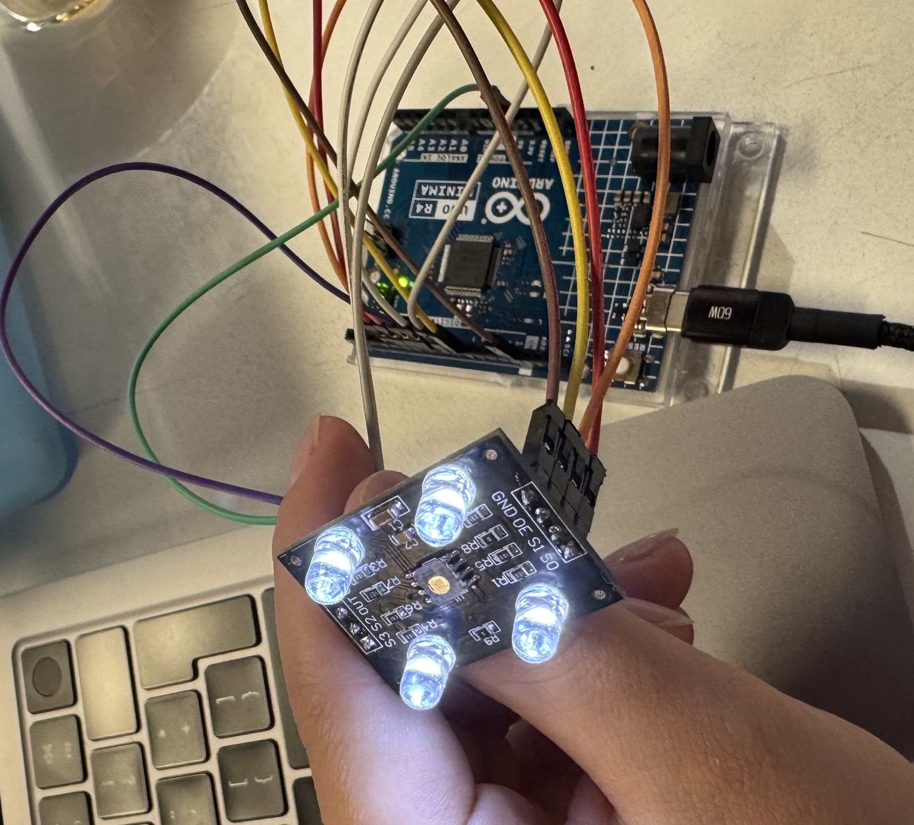
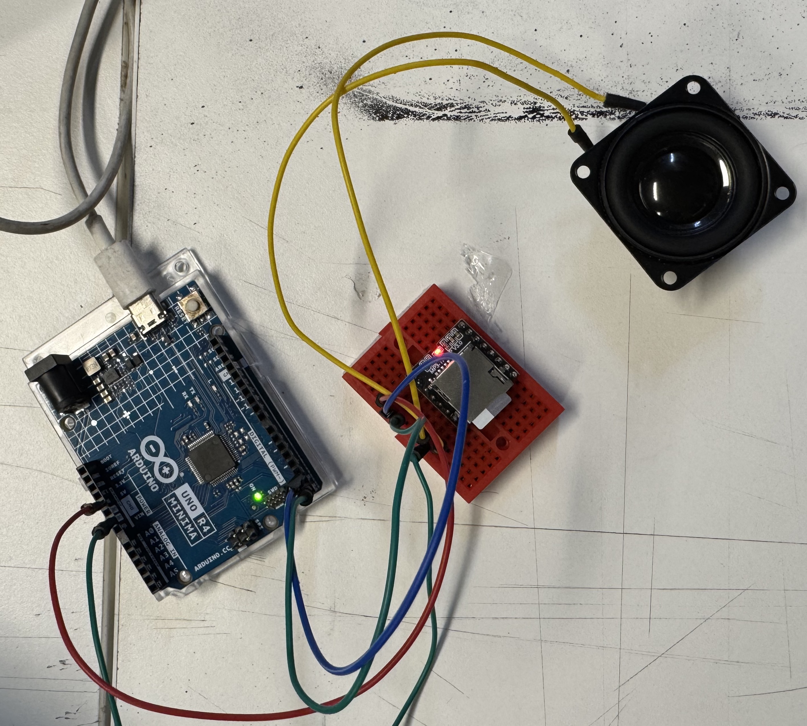

# 🌷 sesion-08a
Martes 30 de Septiembre de 2025

## ♟️ Trabajo en clases 
Avance en el proyecto N°2 **"Máquina dispensadora de dulces"**.

### 🎨 Sensor de reconociemiento de color


### 🛠️ Código de Arduino para que funcione el **sensor de reconocimiento de color TCS3200**, este código se encuentra en la página de arduino (https://projecthub.arduino.cc/hariprasad_lokesh/colour-identifier-using-tcs3200-b21990).

```cpp
/* This code works with GY-31 TCS3200 TCS230 color sensor module
 *   It select a photodiode set and read its value (Red Set/Blue set/Green set) and reproduce   the color on the RGB LED
 * Refer to www.surtrtech.com for more details
 */
   
#define s0 8        //Module pins wiring
#define s1 9
#define s2 10
#define   s3 11
#define out 12

#define LED_R 3   //LED pins, don't forget "pwm"
#define   LED_G 5
#define LED_B 6

int Red=0, Blue=0, Green=0;

void setup()   
{
   pinMode(LED_R,OUTPUT);     //pin modes
   pinMode(LED_G,OUTPUT);
    pinMode(LED_B,OUTPUT);
   
   pinMode(s0,OUTPUT);    
   pinMode(s1,OUTPUT);
    pinMode(s2,OUTPUT);
   pinMode(s3,OUTPUT);
   pinMode(out,INPUT);

    Serial.begin(9600);   //intialize the serial monitor baud rate
   
   digitalWrite(s0,HIGH);   //Putting S0/S1 on HIGH/HIGH levels means the output frequency scalling is at 100%   (recommended)
   digitalWrite(s1,HIGH); //LOW/LOW is off HIGH/LOW is 20% and   LOW/HIGH is  2%
   
}

void loop()
{
  GetColors();                                    //Execute   the GetColors function
  
  analogWrite(LED_R,map(Red,15,60,255,0));      //analogWrite   generates a PWM signal with 0-255 value (0 is 0V and 255 is 5V), LED_R is the pin   where we are generating the signal, 15/60 are the min/max of the "Red" value,   try measuring your own ones
                                               //e.g:   if the "Red" value given by the sensor is 15 -> it will generate a pwm signal   with 255 value on the LED_R pin same for 60->0, because the lower the value given   by the sensor the higher is that color
  analogWrite(LED_G,map(Green,30,55,255,0));     
  analogWrite(LED_B,map(Blue,13,45,255,0));

}

void GetColors()   
{    
  digitalWrite(s2, LOW);                                           //S2/S3   levels define which set of photodiodes we are using LOW/LOW is for RED LOW/HIGH   is for Blue and HIGH/HIGH is for green 
  digitalWrite(s3, LOW);                                           
   Red = pulseIn(out, digitalRead(out) == HIGH ? LOW : HIGH);       //here we wait   until "out" go LOW, we start measuring the duration and stops when "out" is   HIGH again, if you have trouble with this expression check the bottom of the code
   delay(20);  
  digitalWrite(s3, HIGH);                                         //Here   we select the other color (set of photodiodes) and measure the other colors value   using the same techinque
  Blue = pulseIn(out, digitalRead(out) == HIGH ? LOW   : HIGH);
  delay(20);  
  digitalWrite(s2, HIGH);  
  Green = pulseIn(out,   digitalRead(out) == HIGH ? LOW : HIGH);
  delay(20);  
}
```
Luego, como este código solo lee los colores rojo, verde y azul, le pregunté a ChatGPT en base a ese código, cómo podía reconocer el color amarillo, lo que me dió como resultado la lectura de los colores en sus respectivas frecuencias (kHz). Con ese código, se puede detectar el color amarillo, rojo, verde y azul que son los colores que necesitamos para que funcione nuestra máquina dispensadora de dulces y obviamente con su respectiva respuesta visual y sonora.

🟢🟡🔴🔵 Código con los cólores:

```cpp
 // codigo base por https://projecthub.arduino.cc/hariprasad_lokesh/colour-identifier-using-tcs3200-b21990  
  // editado con chatgpt
  // codigo para sensor de reconocimiento de color TCS3200 / TCS230 
  // lee las frecuencias de colores RED, GREEN, BLUE, YELLOW.
  // serial print para ver los colores 


#include <Arduino.h>

// pines para su funcionamiento
#define TCS_S0   4
#define TCS_S1   5 // para el escalado de frecuencia 
#define TCS_S2   6 
#define TCS_S3   7 // selecciona el filtro (R, G, B o CLEAR)
#define TCS_OUT  8 // salida
#define TCS_OE   9 // habilita/ deshabilita el sensor (LOW = Activo)

// configuracion
const uint8_t  SAMPLE_COUNT     = 5;
const uint16_t READ_DELAY_MS    = 10;
const unsigned long PULSE_TIMEOUT_US = 25000UL;

// nombre de los canales 
const uint8_t CH_RED   = 0;
const uint8_t CH_GREEN = 1;
const uint8_t CH_BLUE  = 2;
const uint8_t CH_CLEAR = 3;

// calinbracion
bool  haveCal = false;
float calR = 0, calG = 0, calB = 0;


float measurePeriodUS();
void  selectFilter(uint8_t ch);
float readChannelKHz(uint8_t ch);
String classifyColor(float r, float g, float b);
void  printHelp();

// medicion de frecuencia
float measurePeriodUS() {
  unsigned long tHigh = pulseIn(TCS_OUT, HIGH, PULSE_TIMEOUT_US);
  unsigned long tLow  = pulseIn(TCS_OUT, LOW,  PULSE_TIMEOUT_US);
  if (tHigh == 0 || tLow == 0) return -1.0f;
  return float(tHigh + tLow); // us
}

// S2 S3: 00=Red, 01=Blue, 10=Clear, 11=Green (seleccion de color de filtros)
void selectFilter(uint8_t ch) {
  switch (ch) {
    case CH_RED:   digitalWrite(TCS_S2, LOW);  digitalWrite(TCS_S3, LOW);  break;
    case CH_BLUE:  digitalWrite(TCS_S2, LOW);  digitalWrite(TCS_S3, HIGH); break;
    case CH_CLEAR: digitalWrite(TCS_S2, HIGH); digitalWrite(TCS_S3, LOW);  break;
    case CH_GREEN: digitalWrite(TCS_S2, HIGH); digitalWrite(TCS_S3, HIGH); break;
    default:       digitalWrite(TCS_S2, LOW);  digitalWrite(TCS_S3, LOW);  break;
  }
  delay(READ_DELAY_MS);
}

// se hace lectura de canales para darlas en kHz de cada color
float readChannelKHz(uint8_t ch) {
  selectFilter(ch);
  float sum = 0.0f;
  uint8_t good = 0;
  for (uint8_t i = 0; i < SAMPLE_COUNT; ++i) {
    float period = measurePeriodUS();
    if (period > 0) {
      float freq_khz = 1000.0f / period; // microsegundos
      sum += freq_khz;
      good++;
    }
  }
  if (good == 0) return -1.0f;
  return sum / good;
}

// clasificacion de color

String classifyColor(float r, float g, float b) {
  if (r <= 0 || g <= 0 || b <= 0) return "UNKNOWN";

  float sum = r + g + b;
  float rn = r / sum, gn = g / sum, bn = b / sum; // se normalizan las intensidades rn, gn, bn

  if (haveCal) {
    float csum = calR + calG + calB;
    if (csum > 0) {
      rn *= (calR / (calR + 1e-6));
      gn *= (calG / (calG + 1e-6));
      bn *= (calB / (calB + 1e-6));
      float s2 = rn + gn + bn;
      rn /= s2; gn /= s2; bn /= s2;
    }
  }

  const float DOM = 0.42;
  const float SEC = 0.30;
  const float YELLOW_MIN_RG = 0.35; // se comparan con umbrales 
// segun el canal que domina se le asigna el color
  if (rn >= YELLOW_MIN_RG && gn >= YELLOW_MIN_RG && bn < 0.30) return "YELLOW";
  if (bn >= DOM && bn > rn && bn > gn) return "BLUE";
  if (gn >= DOM && gn > rn && gn > bn) return "GREEN";
  if (rn >= DOM && rn > gn && rn > bn) return "RED";
  if (bn >= SEC && bn > rn && bn > gn) return "BLUE";
  if (gn >= SEC && gn > rn && gn > bn) return "GREEN";
  if (rn >= SEC && rn > gn && rn > bn) return "RED"; 
  return "UNKNOWN";
}

void printHelp() {
  Serial.println(F("\n=== TCS3200 Color Reader ==="));
  Serial.println(F("c: calibrate on white"));
  Serial.println(F("e: enable sensor (OE=LOW)"));
  Serial.println(F("d: disable sensor (OE=HIGH)"));
  Serial.println(F("h: help"));
}

void setup() {
  Serial.begin(115200);

  pinMode(TCS_S0, OUTPUT);
  pinMode(TCS_S1, OUTPUT);
  pinMode(TCS_S2, OUTPUT);
  pinMode(TCS_S3, OUTPUT);
  pinMode(TCS_OUT, INPUT);
  pinMode(TCS_OE, OUTPUT);

  // frecuencia S0=HIGH, S1=LOW
  digitalWrite(TCS_S0, HIGH);
  digitalWrite(TCS_S1, LOW);

  // sensor
  digitalWrite(TCS_OE, LOW);

  printHelp();
}

unsigned long lastPrint = 0;

void loop() {

  // Serial
  if (Serial.available()) {
    char cmd = (char)Serial.read();
    if (cmd == 'c') {
      float r = readChannelKHz(CH_RED);
      float g = readChannelKHz(CH_GREEN);
      float b = readChannelKHz(CH_BLUE);
      if (r > 0 && g > 0 && b > 0) {
        calR = r; calG = g; calB = b;
        haveCal = true;
        Serial.println(F("[CAL] White calibration set."));
      } else {
        Serial.println(F("[CAL] Failed. Improve lighting and try again."));
      }
    } else if (cmd == 'e') {
      digitalWrite(TCS_OE, LOW);
      Serial.println(F("[OE] Sensor ENABLED."));
    } else if (cmd == 'd') {
      digitalWrite(TCS_OE, HIGH);
      Serial.println(F("[OE] Sensor DISABLED."));
    } else if (cmd == 'h') {
      printHelp();
    }
  }

  // lee los canales RGB
  float r = readChannelKHz(CH_RED);
  float g = readChannelKHz(CH_GREEN);
  float b = readChannelKHz(CH_BLUE);
  String color = classifyColor(r, g, b);

  // salida 
  unsigned long now = millis();
  if (now - lastPrint >= 100) {
    lastPrint = now;
    Serial.print(F("RkHz:")); Serial.print(r, 3);
    Serial.print(F(", GkHz:")); Serial.print(g, 3);
    Serial.print(F(", BkHz:")); Serial.print(b, 3);
    Serial.print(F(", Color:")); Serial.println(color);
  }
}
```

Este fue uno de los código que utilizamos para que reconociera los colores que necesitábamos para nuestro proyecto.

### 🔊 Uso de reproductor mp4 y audio
Para poder emitir los sonidos que necesitamos para nuestro dispensador de dulces, descubrimos que para que se pueda reproducir los sonidos corresponidentes a la animación y al color, además de ponerle sus nombres correspondientes y los if correspondientes, es necesarios numerarlos dentro de la tarjeta de memoria. Puede paracer lógico, pero si se insertan todos los archivos al azar aunque tengan su numero correspondiente, no va a funcionar.




