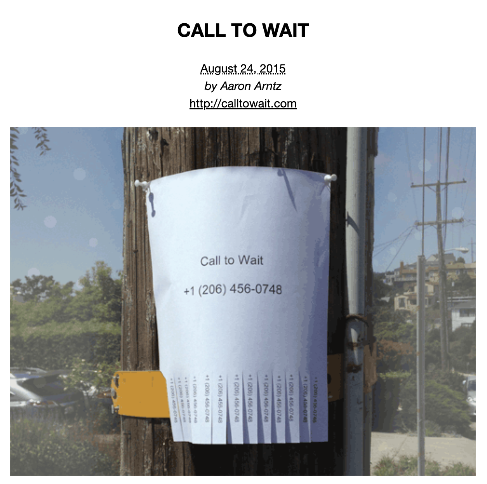
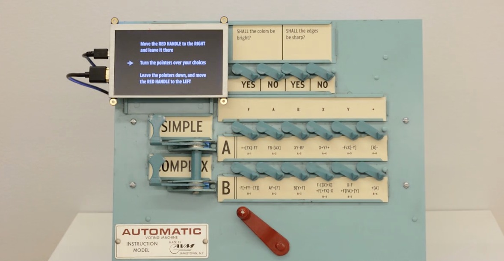
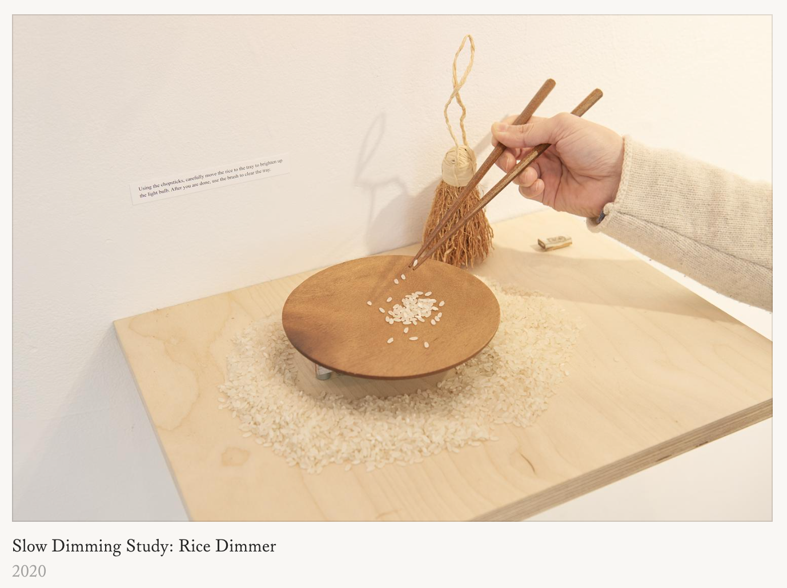
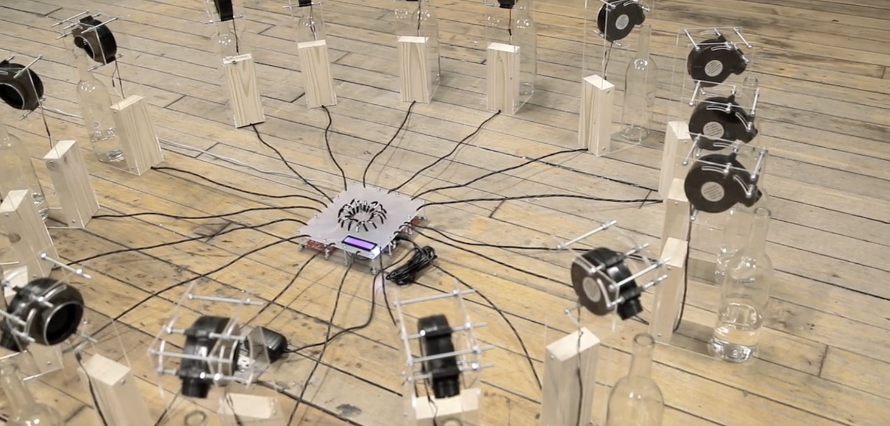

# 🌷 sesion-11a

21 de Octubre de 2025 

## 🪩 Apuntes de clases

- **Un dispositivo de interfaz humana (HID)** es un tipo de dispositivo informático generalmente utilizado por humanos que recibe información de ellos o les proporciona información de salida.
- Es muy fácil trackear el iris, ya que como es de color oscuro, es más fácil seguirlo.
- Solucionar probelmas de forma distinta.
- Programación orientada a objetos.

Pensar en qué proyectos se podrían hacer para el examen, para eso se preguntó por discord qué teníamos en mente:
Buscar objetos que ya existen y alterarlos electrónicamente.

### 💫 Lluvia de ideas
- Vestibles/ wearables.
- Mascotas virtuales.
- Asistente experimental.
- Objeto contemplativo.
- Music player.

## ⚡️ Referentes vistos en la clase 

- (http://uselesspress.org/things/call-to-wait/) / **Call to Wait** 
  
  
- (https://www.lukedubois.com/projects-3/learningmachines) / **Learning Machines, mechanical voting machines, video, sound, 2016**
  
  
- (https://yeseul.com/) Escuela de la Computación Poética / **Rice Dimmer**
  
  
- (https://vimeo.com/114414122) / **and the wind was like the regret for what is no more**
  

### 👉🏻 Más referentes de páginas

- The Claw of Shame
- (https://chino.kim/rube-telephone) Chino Kim - Aaron Montoya codigo morse, máquina de destruir el mensaje
- (https://alt-ai.net/)
- (https://www.media.mit.edu/groups/future-sketches/projects/) **Mit Media Labs**
- (https://fffff.at/)

Para el viernes, se bajará más el encargo para ver qué vamos a hacer. 

### 🎛️ Idea general del proyecto
- Máquinas graciosas, a libre intrpretación.
- Volver a los proyectos poéticos como el primer proyecto.
- Máquinas metafóricas.
