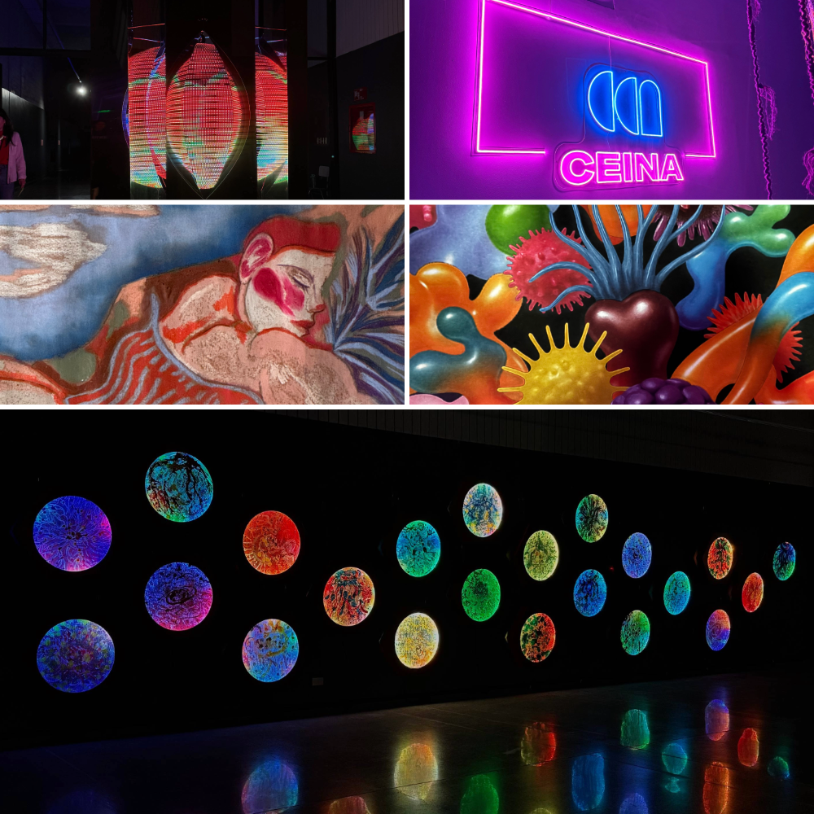

# 🌷 sesion-11b

24 de octubre de 2025

## 🪩 Apuntes de la clase
- Hacer ambos encargos que están subidos a Github, y documentar toda la salida a terreno de hoy.
- Los encargos van en esta sesión.
- El próximo proyecto va a estar más enfocado en el contenido y en el sentido que tenga. Que tenga una base. Aspecto de pensamiento del trabajo. **(conceptual, discursivo, metafórico)**.
- Cómo diseñar de buena manera, con una buena experiencia de usuario.

## ⚙️ Proyecto 03 Ideas
- Máquinas de lenguaje.
- Máquinas de felicidad.
- Máquinas tra(ns)ductoras ➜ convertir energía en otro.
- **Máquinas sentimentales**. Máquinas que sean capaces de crear un sentimiento o que se perciban así.

## 🔮 Diseño Orientado a Objetos (DOO)
- Diseñar con sentido. Diseñar en base a una metáfora. 
- Diseñar en base a un objeto no a un usuario.
- Pensando en las cualidades de un objeto.

### 💭 Graham Harman
Filósofo estadounidense. Asociado al movimiento del **realismo especulativo**, surgido a fines de los años 90 y principios de los 2000 como una **reacción contra el pensamiento posmoderno y el “correlacionismo”**, es decir, la idea de que solo podemos conocer la relación entre pensamiento y mundo, **no el mundo en sí mismo**.

### 🧩 Ontología Orientada a Obejtos (OOO)
- **Todo lo que existen son objetos:** No solo los objetos físicos (una silla, una piedra, una persona), sino **también ideas, relaciones, ficciones, números, software o sonidos**.
- **Los objetos existen independientemente de nosotros:** No dependen de que alguien los perciba, piense o use. Tienen una realidad propia, más allá de sus apariencias.
- **Los objetos nunca se agotan en sus relaciones:** Lo que vemos, tocamos o usamos de un objeto es solo una parte de lo que es. Siempre hay algo del objeto que se retira, que no puede ser completamente conocido ni reducido a sus efectos o usos. (Por ejemplo, una mesa no se agota en su utilidad para comer ni en las moléculas que la componen.)

### 🪵 Ejercicio ¿Qué es una mesa?
- Superficie.
- Interfaz de altura.
- 4 patas.
- Fierros.
- Maderas.
- Melamina.
- Lisa.
- Al suelo.

✦ Estos conceptos se pueden clasificar en 2 grupos: **materiales** y **relaciones**. Pero todas estas cualidades son intrínsecas, por que 4 patas no define una mesa, ya que un perro también tiene 4 patas. Entonces no es suficiente hablar de materialidad para describir los atributos de una mesa. 

✦ Existe una capa material y una capa cultural, lo humanista y lo científico. Cuando diseñamos, usamos el pensamiento y la materialidad. **Por eso un buen diseño pasa desapercibido.**

✦ El **problema que quiere evitar Harman es que la filosofía antigua y moderna no toma en serio a los obejtos: los filósofos tienden a "disolverlos" o "reducirlos"** a otra cosa. Para explicar esto, introduce dos formas de "minar" (referencia a Minecraft jaja) la realidad de los objetos.

---
También desarrolla dos conceptos:

### ✏︎ Undermining: reducir el objeto a sus partes o a una sustancia más básica.

### ✏︎ Overmining: rreducir el objeto a sus efectos, apariencias o relaciones.
---

- **Asíntota**: es una línea que se aproxima a ella pero que nunca se juntan.
- **Fenomenología**: descubrir cómo las cosas aparecen en la conciencia.

¿Qué es la filosofía?

El amor al conocimiento. Propone las cosas como son.

💭 Harman postula que **las metáforas son la conexión de dos cualidades no escenciales de un objeto**.

Handschuh: guantes en alemán ➜ zapato de mano.

Ortega y Gasset

## 🎨 Salida a terreno... 
Para la segunda mitad de la clase, fuimos a la Galería Gabriela Mistral y al Centro Cultural CEINA a la 17 Bienal de Artes Mediales. 

### 🏞️ Decantaciones y Resonaciones ¿Dónde nace y termina el rumor del río?

En la Galería Gabriela Mistral fuimos a ver la exposición de la artista **Claudia González Godoy**, _**Decantaciones y Resonaciones ¿Dónde nace y termina el rumor del río?**_ Esta instalación invita a pensar en las transformaciones del río Biobío y su memoria a través de una experiencia sonora. La obra transforma el espacio expositivo en un **paisaje que representa una zona embalsada del río Biobío** y lo que más me llamó la atención que muestra las huellas sumergidas bajo las aguas del embalse, el suelo de cómo sería si no estuviera cubierto de agua. Y puede sonar obvio, es tierra seca sin agua, pero la textura de las grietas, hace que sea impresionante. 

_Cabe mencionar que para vivir esta experiencia completa, tuvimos que quitarnos los zapatos para poder sentir la humedad del suelo y la textura de la tierra, era como andar en el verano cuando vas al río._

### 🫟 17 Bienal de Artes Mediales, Centro Cultural CEINA
Instalaciones inmersivas, performances y realidades virtuales eran predominantes, conectándo el arte y la ciencia para crear vínculos entre ecologías naturales, cuir, sociales, digitales y simbólicas. Retoma el concepto de hiperrealidad formulado por el filósofo Jean Baudrillard, quien advirtió cómo el simulacro sustituye lo real hasta hacerlos indistinguibles. 

Habían obras increíbles, que combinaban la música con lo visual y lo tangible, era toda una atmósfera inmersiva que era increíble. Las exposiciones que más me llamaron la atención fue _~~~ desde la raíz ~~~ Aproximación al bosque esclerófilo_ de Yto Aranda, entrelaza arte, ciencia y tecnología en una experiencia transmedial que desestabiliza la mirada antropocéntrica, revelando el mundo vegetal como un sistema complejo, sensible e interconectado, del cual depende la vida de otras especies, incluida la humana.

## 🔍 Encargos
1. Cada persona debe subir una investigación detallada de la obra artística de Claudia González Godoy, incluyendo información sobre premios, exposiciones, colaboradores, estudios y referencias en su obra."
2. Cada persona debe subir taxonomía detallada de sensores, actuadores, software y hardware utilizado en 1 obra exhibida en la Bienal de Artes Mediales 2025, citando correctamente a las fuentes.

## 📌 Desarrollo de encargos

### ¿Quién es Claudia González Godoy?
- Nacida en Santiago en 1983.
- Título de Porfesora de Arte en la Escuela de Arte y Cultura Visual de la Universidad Arc Is (cerrada actualmente).
- Licenciada en Bellas Artes con mención Gráfica.
- Magíster en Artes Mediales por la Universidad de Chile.
- Diplomada en Lutería Eletrónica por la Pontificia Universidad Católica de Chile.
- Desde 2006, desarrolla su propuesta artística independiente centrada en arte, tecnología, naturaleza y sonido.
- Además ejerce como docente en el Magíster de Artes Mediales de la Universidad de Chile.

### Línea de trabajo, temas y metodología
➺ Su obra se centra en la "noción de materialidad de soportes tecnológivos tanto analógicos como digitales, así como el comportamiento de los materiales en el tiempo y su manifestación en la dimensión del sonido.

➺ Trabaja en relación con el arte, ciencia, naturaleza y tecnología.

➺ Procedimientos que combina: electrónica, sistemas de sonido, grabaciones de campo, tejidos en telar, materias orgánicas como cobre, madera, agua, hilos, entre otros.

➺ Aborda importantes temas de investigación: los ríos como cuerpos ecosistémicos, territoriales y culturales, grabaciones de campo o instalaciones sonoras que reaccionan al medio.

➺ Su metodología es investigativa/ territorial, no solo de taller, ella sale al campo, recopila datos, sonidos y colabora con las comunidades.

### Principales proyectos y exposiciones

1. **Hidroscopía / Mapocho** (2016, Sala Anilla - Museo de Arte Contemporáneo MAC, Santiago). Proyecto de investigación sobre el río Mapocho y su fragmentación.
2. **Concertina: Máquinas de Papel** (2014, Festival de la Imagen de Manizales. Manizales, Colombia). Es un proyecto de investigación material en el cual se exploran las posibilidades de la electrónica y el formato del libro de artista, mediante un instrumento musical electrónico.
3. **Hidroscopía / Loa** (2018, Museo de la Solidaridad Salvador Allende MSSA). Análisis microscópico del agua del río más largo de Chile, diálogo con comunidades locales.
4. **Arreglos de Campo. Del cielo al agua y lo que está en el centro**. (Museo de Arte Contemporáneo de la Universidad de Chile, Diciembre 2022 - Enero 2023). Instalación sonora/textil que usa pigmentos minerales del Desierto de Atacama, hebra de hilo de cobre, piedras y hojas.
5. **Decantaciones y Resonaciones ¿Dónde nace y termina el rumor del río?** (Galería Gabriela Mistra, 2025). Instalación de topografía simulada del embalse del río Biobío, grabaciones de campo e invitación a la calma y contemplación.

### Exposiciones y participación
- ZKM Karlsruhe, Alemania.
- ifa Gallery, Alemania.
- 17 Bienal de Artes Mediales de Santiago.
- Galería Gabriela Mistral.
- Museo de Arte Contemporáneo.
- Festival de la Imagen de Manizales. Manizales, Colombia.
- Museo de la Solidaridad Salvador Allende,
- Institución MINCAP.
- LIWOLI, Austria.
- EEII, Croacia.

### Colaboradores y residencias 
- Fue directora del proyecto Laboratorio de Arte y Tecnología Chimbalab (2008 - 2012).
- Proyecto/ residencia "Un riel por el Río" que plantea cruces disciplinarios entre electrónica, arte sonoro y edición.
- En Hidroscopía Biobío, menciona colaboración con la Fundación Manzana Verde para entrevistas y salidas a terreno.
- Residencias: Un Riel Por el Río, Las aguas son libres, Taller de Campo Magnético en Montegrande, Agua y Territorio/ Spree.

### Premios, reconocimientos y publicaciones
En su ficha de la colección del arte del Ministerio de Cultura de Chile, aparece como una artista incluida en la colección: **"Ha participado en numerosas muestras, tanto individuales como colectivas, en Chile y en el extranjero".** Hasta ahora no aparece en registro público de "premios mayores" que se le hayan otorgado, pero el hecho de estar incluida en una colección estatal es un reconocieminto institucional relevante.

### Referencias en su obra: influencias, soporte, discurso.
➺ Dentro de los términos recurrentes en sus discursos se mencionan: **agua, ríos, embalse, materialidad, sonido, topografía, tecnología, paisaje intervenido**. Un ejemplo de esto fue su discurso en la exposición "Decantaciones y Resonaciones ¿Dónde nace y termina el rumor del río?" : _«Esta exposición concluye un proceso de investigación en el Río Biobío que ha durado alrededor de dos años»_.

➺ En sus hidroscopías, indaga no solo la forma visible del río, sino la condición invisible (subterránea, memoria, agua retenida) y sus transformaciones socioambientales.

➺ Al analizar su obra "Decantaciones y Resonaciones ¿Dónde nace y termina el rumor del río?" dialoga con temas como la intervencipon humana en los ecosistemas fluviales, la calma contemplativa vs la fuerza del río y el sonido como huella material del agua.
