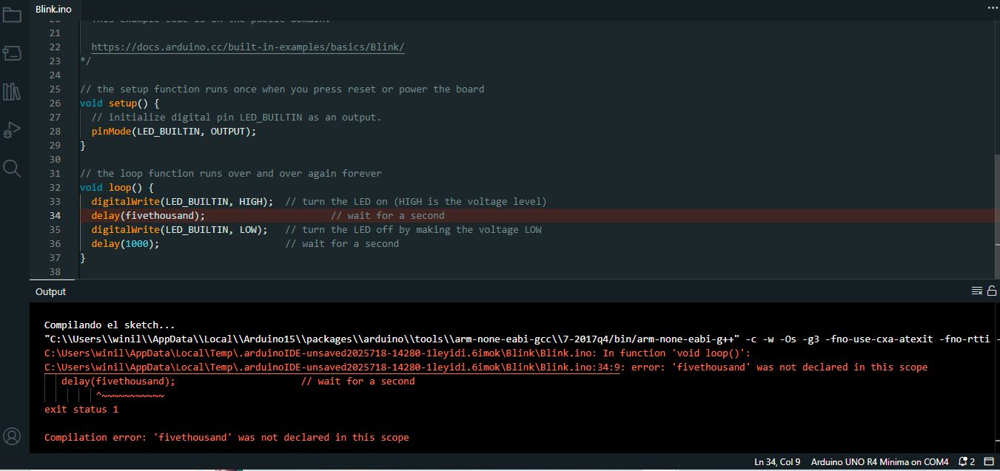

# sesion-01b

## taller clase viernes 8 de agosto

llegué medianamente tarde

- cuando llegué estaban hablando sobre los mails y el cómo enviarlos
- mail: cc
- bcc: significa que es el mail oculto, en ningún lado dice a quien se lo mandaste, entonces puedes mandar de forma anónima mails
- si mando mail a 100 pero con bcc, hace que la persona que lo recibió no pueda responderle a todas las personas
- se pueden hacer grupos para mandarles a todos el mismo correo
- el cómo le llamamos a ese grupo, el computador reconoce eso y lo reemplaza
- activamos el reply all, teníamos que ir a configuración, default reply behavior y luego poner la opción reply all
- ejemplos de interfaces de ascensores
**ARDUINO**
  - cómo instalamos arduino? nos metemos a arduino.cc
  - hay familias de arduinos
  - modalidades de software, hardware
  - a nosotros nos interesa arduino IDE
  - IDE: ambiente de desarrollo integrado
  - debe ser arduino ide 2.3.6
  - mi número en la lista ahora es el 10, el semestre pasado era el 5
  - dentro de la aplicación de arduino existe un lguar que muestra los puertos del computador, puertos usb
  - en estos puertos debería aprecer "arduino r4 minima"
  - en windows aparecerá "com"
  - escribir r4 ---> arduino r4 boards ---> instalar
**ARDUINO Y CONCEPTOS**
- vamos a archivo ---> ejemplos ---> ejemplos para arduino r4 minima
- luego vamos a blink, en esta opción aparecen las personas que lo crearon y nos describen las acciones que suceden con tales comandos
- `()`
- `{` murciélago
- `[` corchete
- las mayúsculas son cosas importantes
- upload: manda lo que está en el código a la placa de arduino
- primero apretamos verificar para corroborar que todo esté bien y después upload para mandar al arduino
- el botón de reseteo que tiene la placa de arduino reestablece desde 0 el arduino
- errores de usb: a veces los cables C se ven iguales pero no lo son
- hay cables en que ambos extremos son de carga y esto no lo puedes usar en el arduino
- **setup: ocurre una vez**
- **loop: ocurre a continuación para siempre**
- setup es como "despertar", el origen del arduino
- ¿qué hace el arduino cuando parte? ---> PinMode(LED-BULTIN,OUTPUT)
- en este caso LED define cuál pin es y output define entre entrada o salida
- digitalWrite: delay (1000)
- lo que hace digitalWrite es decir, arduino congelado por equis cantidad de tiempo
- si cambiamos el valor dentro de los paréntesis puede hacer que arduino se congele por más o menos segundos
- si le damos por ejemplo, 100 y 100 en ambas opciones de delay, 10 veces por segundo se va a prender y apagar la luz de nuestro arduino
- otro ejemplo es que si ponemos delay (1000/10) el computador hace este cálculo y lo lleva a cabo en el arduino
- otro ejemplo
- apagado
- // tiempo prendido
- digitalWrite
- delay(tiempo prendido)
- //apaga
- digitalWrite
- delay (tiempo apagado)

BREAK

- // ---> son comentarios
- funciones: palabras que vienen acompañadas de paréntesis
- palabras que llaman a otros códigos escritos en otra parte
- diferencia entre loop, digitalWrite y delay, las 3 son funciones pero tienen diferencias
- nombre de la función>paréntesis>adentro de paréntesis
- para que algo ocurra, tiene que haber sido creado antes
- void__ avisar que todo ok(){
- de esta forma declaro
- esto no tiene nada dentro
- {cuando yo digo setup, hace todo lo que esté dentro de los murciélagos}
- estructura void - murciélago - murciélago cierra
- primero aprender todas las declaraciones de funciones
- después de que se declararon todas las funciones, se cierra el código y arduino se encarga del resto
- char: cabe una letra, letrita = a
- letrita = ´ ´ --> cabe 1 espacio
- **mayúsculas y minúsculas son completamente distintas para el computador**
- comillas simples: cabe una letra
- string: vengan todos los caracteres que quieran, aquí usamos las 2 commillas
- contenidos: contenedor
- bolsillo: tipo de contenedor
- chicle: lo que hay dentro
- letritaBacan --> anotación camello, la mayúscula simula la joroba de un camello jeje
- Serial.begin ---> es una función, como es función debe tener paréntesis, después un ; esto declara el fin de la línea
- Serial.begin(9600);
- para tener una variable o una función primero debemos **DECLARARLA**
- ej: con un nombre de fantasía
- después de declararlo puedo usarlo cuantas veces quiera
- las funciones se usan así: // función();

### encargo, documentar 3 errores en código en arduino

- **primer error**: quería entender qué pasaba si duplicaba las funciones de void loop sin escribir exactamente lo mismo que sale en la versión original de void loop y hacerlo de forma incompleta

- **segundo error**: probé a ver qué ocurría si los valores de delay eran escritos en letras y en inglés en vez de números, para ver si también aceptaba o no valores escritos de forma no numérica

