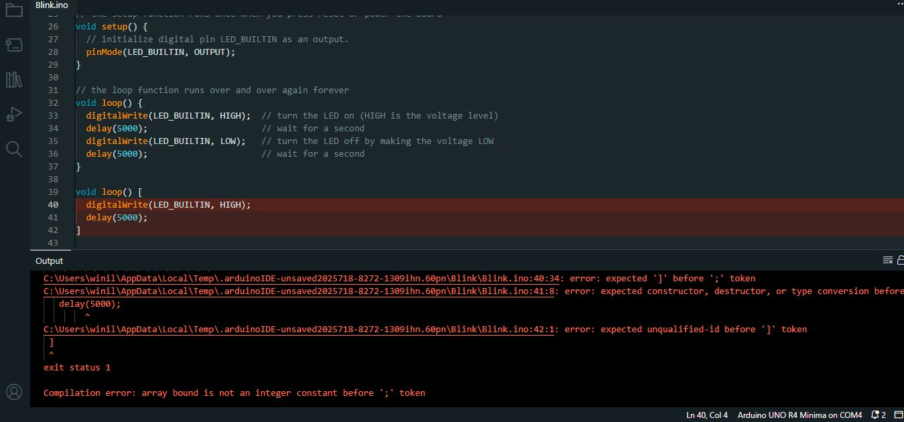

# sesion-01b
## taller clase viernes 8 de agosto

### encargo, documentar 3 errores en código en arduino

- primer error: quería entender qué pasaba si duplicaba las funciones de void loop sin escribir exactamente lo mismo que sale en la versión original de void loop y hacerlo de forma incompleta

- segundo error: probé a ver qué ocurría si los valores de delay eran escritos en letras y en inglés en vez de números, para ver si también aceptaba o no valores escritos de forma no numérica

