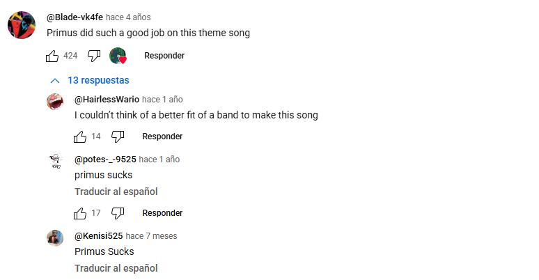
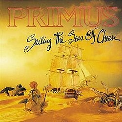

# sesion-05b

## taller clase 5b, viernes 9 de septiembre

llegué tarde pero vivo y feliz, importante

- la importancia del proceso por sobre la nota
- no somos de segunda categoría

### parte 1 arduino grabación

- tiende a pasar que el archivo h es cortito, archivo cpp grandes
- en el h prometo, en el cpp me hago cargo
- **no hay nada de lo que hagamos que sea de segunda categoría, la dignidad de lo que uno hace, no existe la versión fruna**, esto que dijo Aarón lo encontré muy bello
- Adafruit_GFX, eran gráficas
- GFX es una biblioteca grande para hacer gráficas que creó Adafruit
- class adafruit_SSD1306 : public Adafruit_GFX, significa que adafruit ssd1306 es también un Adafruit_GFX
- class completo_italiano : public Completo {}, significa que el completo italiano es un TIPO de completo
- w3schools,  hay tutoriales de todo tipo para código
- atributos son variables y métodos son funciones, dentro de una clase
- las clases se usan cuando queremos crear estructuras de datos que no nos caben en los bloques fundamentales que viven en un lenguaje de programación
- los diseñadores no sólo saben hacer publicaciones en Instagram, no puedo estar más de acuerdo
- ¿cómo podríamos haber utilizado una class en el proyecto 1?
- si hay archivos .h hay archivos .cpp
- las clases están hechas no solamente para que estén en el mismo nivel sino que tengan también distintas jerarquías
- tengo textos, dentro de textos tengo poemas y dentro de poemas tengo poemas de parra
- si en texto crudo tomo decisiones, estas cosas se propagan en todo lo demás, se expanden, se repeta la jerarquía
- todos los poemas tendrán las mismas características internas, por ejemplo le determino cierta tipografía, cierto tipo de tinta
- los poemas comparten estas características que yo designo dentro de texto.h
- puedo cambiar independientemente en cada categoría los "aspectos"
- por ejemplo en poema.h puedo designar una tipografía, pero esto pasaría a llevar a poemaparra porque también está dentro de poema, para cambiar esto y que no afecte a poemaparra debo ir directamente a poemaparra a cambiar esta variable
- en texto designo float, esto dice que tendrá nota, poema heredó que tenga nota pero tiene una distinta
- esto lo hago gracias a public class, aún no entiendo bien cómo funciona esto

  después del break hay gente que se va al lab a hacer class, definir class , no importa los puntos y coma, es más un proceso de planificación

VUELTA BREAK

### clases

- ahora debemos hacer clases, generarlas
- yo lo entiendo como una categoría principal, que tiene una subcategoría y dentro de esta subcategoría existe una cosa que también pertenece a las 2 categorías anteriores
- como las mamushka
- en este bloque Aarón dispuso información sobre las clases en la pizarra, creo que esto me ayudó a entenderlo mejor en vez de verlo directamente en computador
- no cree código en este segmento porque la idea era entenderlo más desde afuera, con códigos que quizá no funcionan pero había que entender el macro
- algunas de las que hice en clases fueron: videojuego (es la clase base) --> tipo de videojuego (puede ser de rol, rpg, moba, shooter,) --> videojuego específico (counterstrike1.6)
- otro ejemplo de los que desarrollé: tipos de sándwiches (clase base) --> churrasco (es un tipo de sándwich) --> chacarero ( es un tipo de churrasco y también un tipo de sándwich)
- dentro de este ejemplo surgió mi duda: ¿qué pasa si le quito el poroto verde al chacarero? ¿sigue siendo un chacarero o pasa a ser otro tipo de sándwich, o es un chacarero sin poroto verde?, no supe responder a estas preguntas que tuve
- otro ejemplo: gato (clase base, animal) --> razas de gato (puede ser siamés, ragdoll, calico, carey, naranjo) --> gato peluo (es una raza de gato, angora)
- un array es una lista de cosas, ejemplo: en el poem sampler del proyecto 1 teníamos un array que era la lista de poemas que dispusimos
- [] lo que hay dentro de esos corchetes es un array
- Aarón dio un ejemplo con banda e integrantes de la banda, dentro del conjunto banda están los integrantes, dentro de este conjunto integrantes está integrante 1, integrante 2, integrante 3, integrante 4
- estos integrantes del 1 al 4 en vez de numerarlos uno por uno podemos meterlos dentro de un [] creando un array
- me surgió la siguiente pregunta: ¿puedo definir que un integrante de la banda se va y después vuelve? Aarón respondió mi pregunta y me dijo que sí, puedo hacer una lista de integrantes que se van, pero quiero que algunos vuelvan y otros no
- para esto debería hacer una lista que me diga de los que se fueron, quien sí puede volver y los que no pueden volver
- integrante (stringnombre) --> dentro de stringnombre va el nombre del integrante
- para agregar, crear un integrante, primero debo darle un nombre, definir quién es
- instrumento [] instrumentos, dentro de los corchetes va un conjunto de instrumentos
- ´ # include "integrante.h"
- integrante [] integrantes, el [] es un array
- agregar integrante (integrante agregade)
- quitar integrante (integrante quitade)
- el encargo es ver alguna charla de Mitch Resnick y escuchar uno de los 3 primeros álbumes de Primus

### encargo: Charla Mitch Resnick y Primus

### Charla Mitch Resnick

vi esta charla de Mitch Resnick [charlateachkidscode](https://www.youtube.com/watch?v=Ok6LbV6bqaE)

como introducción a la charla Mitch comienza hablando sobre el concepto que se tiene acerca del código y de la programación, muchos la ven como algo lejano o que es algo para determinado grupo de personas. Yo estoy de acuerdo con esto, antes de estar en este ramo pensaba esto mismo y aún me ha costado sacarme esa idea de la cabeza cuando algo es difícil dentro de este ámbito. Mitch muestra el código como algo que se ve muy denso desde afuera, letras y números, pantallas saturadas de información, colores, etc, por esto mismo cree que no es agradable visualmente. Entra en el concepto de los niños y la tecnología, el concepto de "fluir en la tecnología" para él esto no se desarrolla jugando videojuegos o estando en el celular todo el día, sino que el código puede ayudar a desarrollar esto, por esto creó Scratch. En Scratch se maneja una forma mucho más amable de interactuar con el código de una forma visual más atractiva e interactiva para los niños.

yo tengo recuerdos no me acuerdo bien en cuál curso fue, creo que en quinto o sexto básico, que un profe nos mostró Scratch y en ese momento no le presté nada de atención, en verdad no entendí mucho y no se me hizo atractivo, es muy distinto verlo muchos años después y ya sumergido un poco en el mundo de la programación, como que todas las cosas cobran sentido ahora. En la charla Mitch dice la siguiente oración "Developing on new ways to explore herself" esto lo dice cuando está hablando de que su madre creó una tarjeta de cumpleaños para él en Scratch, que en realidad es con lo que parte esta charla, Mitch quería hacerle una tarjeta del día de las madres. Me parece muy interesante el concepto de explorar nuevas formas para expresarse y lo que muestra Mitch en la charla, me asombra y me hace sentir completamente ignorante que el código sea algo tan inmenso y con infinitas posibilidades, en verdad así me he sentido en clases cada vez que vemos las formas en las que se puede explorar el código. Otra frase que dice Mitch es " this skills can be used in different activities" en esta parte está hablando que no necesariamente alguien que aprende código se volverá un experto programador, pero que sí sumará una especie de habilidad que puede ser desarrollada en otros ámbitos, yo lo entiendo como en la forma de pensar o afrontarse a las cosas.

siento que el código y los lenguajes son una forma de pensar, de manejarse en el mundo de otra manera. A mí en lo personal me sucede que veo todo este ámbito como algo muy difícil, lo que sí he sentido es que como es tan difícil para mí, siento que se me han vuelto más fáciles otras cosas/asignaturas de la universidad o desafíos en mi vida diaria. Esto no es por que las demás cosas sean más fáciles quizá o puede que sí lo sean, a veces pienso "si estoy viendo código o haciendo esto, esta otra cosa no puede ganarme" pero creo que va más allá de eso y no sé bien cómo explicarlo, la sensación de cuando me enfrento a algo totalmente desconocido sin saber lo enorme que es, puede ser bastante interesante.

### segunda parte del encargo: escuchar primus

en este encargo Aarón nos pidió que escucháramos a la banda Primus, en clases puso un extracto de una canción pero la verdad es que no alcancé a escuchar absolutamente nada. No me sonaba de ningún lado el nombre de la banda en verdad por lo cuál era completamente desconocido.

Primus es una banda estadounidense de funk metal creada en San Francisco, California, en 1984, y actualmente compuesta por el bajista/vocalista Les Claypool y el guitarrista Larry Ler LaLonde. En cuanto a su discografía, esta se compone 8 álbumes de estudio, 4 EP, 21 sencillos, un álbum en vivo un álbum recopilatorio. Primus originalmente se formó con Les Claypool y un guitarrista llamado Todd Huth, luego se unió Jay Lane, pero Huth y Lane abandonaron la banda en 1988.

un dato curioso es que Primus fue encargado de grabar la canción original de la serie "South Park", me metí a youtube para ver si la canción sonaba como lo que escuché de Primus porque en verdad no lo recordaba, nunca ví mucho southpark en mtv porque igual era chico en esos años. Al meterme a buscar encontré un comentario que decía lo siguiente:

me llamó la atención el Primus sucks, ya que era algo que Aarón había mencionado que les decían pero no recuerdo por qué

el álbum en particular que escuché yo fue Sailing The Seas Of Cheese 

este álbum fue el segundo que lanzó la banda, fue grabado en enero de 1991 y publicado el 14 de mayo del mismo año bajo la discográfica Interscope, tiene una duración de 45 minutos y 27 segundos y se compone de 13 canciones las cuáles son:
 

