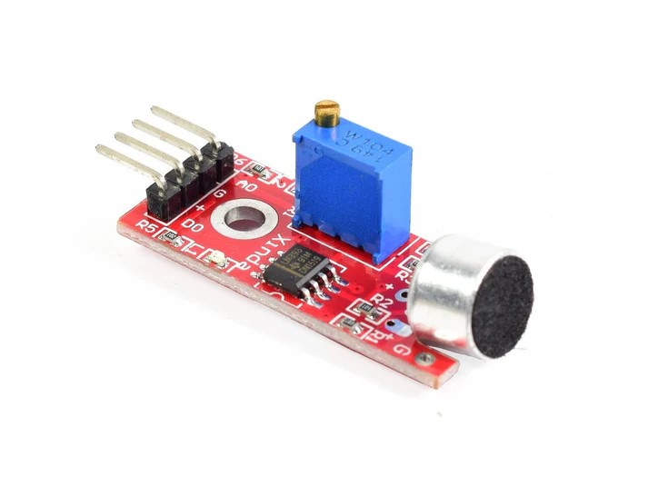
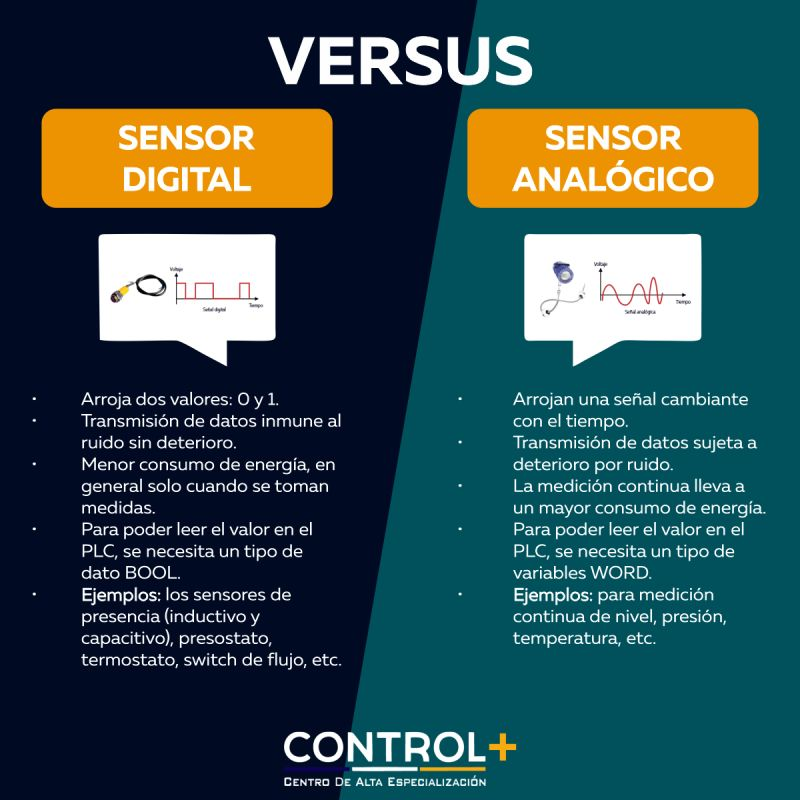

# sesion-06a
## taller clase 6a, 9 de septiembre
 no pude traer el computador en esta clase así que escribí todo a mano en la croquera, llegué a las 8:40 aprox

 ### primera parte de la clase

 - partimos viendo Scratch, un lenguaje de programación en el que un "gatito hace cosas"
 - Scratch utiliza la metáfora de los bloques de lego, en vez de estar escribiendo código, unes bloques entre sí
 - tengo un recuerdo en de cuando estaba en básica, creo que alguna vez un profe nos mostró Scratch porque cuando lo mostraron ahora en clases me vino un flashback de hace muchos años de la interfaz
 - hubo gente que utilizó la "mecánica" de scratch para programar en otros software
 - Miller Puckette, Center for Research in Computer and Arts
 - Max msp (Max: es un software, gráficas que tienen que ver con audio)
 - Puredata, es la nueva  versión de max y es gratuita
 - en Puredata las cosas que están arriba son entradas, las cosas que están abajo son salidas
 - Puredata está programado en c++, son objetos, clases
 - en esta parte Aarón y Misaa utilizaron puredata, dispusieron ciertos elementos que no recuerdo bien, unos más arriba otros más abajo, como entradas y salidas
 - de esta forma se "reproducía" primero lo que estaba arriba y después las salidas
 - crearon una nueva ventana dentro de pd, llamada pd cello, en esta ventana podían esconder toda la complejidad detrás de lo que habían hecho antes
 - entonces al poner pdcello, esto contenía todo lo que habíamos creado sin necesidad de mostrarlo en pantalla

### más y más softwares

- Touch designer, se programa con cajitas
- estas cajitas también son obra de Miller Puckette
- vvvv, otro entorno visual de programación de cajitas que se conectan a cajitas
- Isadora, es malaya, a Aarón no le gusta
- factorio, es un juego, como la granja de minecraft pero sólo la granja

### Github

- github sigue una guía de jerarquías con los títulos, subtítulos y subsubtítulos
- si no respetamos estas jerarquías nos tirará errores de Markdown
- ahora entendí el error de "corregir MD036" que siempre me aparecía en las bitácoras
- es cuando las jerarquías que están establecidas de los títulos subtítulos y subsubtítulos se rompen, a github no le gusta eso
- llegan correos de github notificando estos errores, debemos leerlos y entender los errores que estamos cometiendo
- ahora activaremos actions, primero debemos hacer sync
- si vamos a action desde nuestro fork, veremos que no hay workflows
- ¿qué son los workflows? son flujos de trabajo
- debemos poner el botón verde "i understand my workflows"
- carpeta: github/workflows
- más adentro sólo hay una carpeta que es workflows
- lint: proceso automatizado de limpieza, depuración, de ordenar
- lint es la lavandería, quita pelusas
- Yaml es un tipo de lenguaje para configurar cosas
- en Yaml a diferencia de C++, cuando queremos englobar que algo esté dentro de algo, escribimos y lo corremos un poco más hacia la derecha con on:
- es como que el texto de arriba no tiene sangría y el de abajo sí, al tener esta sangría significa que está dentro (metáfora de cosas que hemos visto en indesign en diseño gráfico)
- en C++ esto lo expresamos con murciélago y murciélago de cierre, así entendemos que algo está dentro de otra cosa
- dentro de los workflows aparece que un workflow contiene un job, que se llama markdown lint, que corre en una máquina ubuntu "runs on: ubuntu latest"
- esto significa que nosotros podemos correr un código en un computador potente si es que lo necesitamos, como a modo remoto por así decirlo
- 3 puntos menos en el siguiente proyecto si es que no activamos actions, importante
- 3 puntos menos si tenemos errores en markdown
- podemos activar y desactivar las reglas que queramos
- el próximo proyecto será más estricto en cuanto a todos estos aspectos

### más cosas que no son github

- the art of computer programming, libro de Donald Knuth de 4 volúmenes
- latex, un lenguaje basado en tex, que es aún más antiguo
- overleaf --> online latex editor
- puedes escribir tu tesis en overleaf
- delft, universidad
- Llamk'ana, lenguaje de programación en Quechua
- weaving to code, el código es lo mismo que tejer
- golan levin, el código como medio creativo, está en el lab
- the frank ratchye studio
- pembroder tutorial: una máquina de coser que se programa, podemos pedirle dibujar cosas que ya estén programadas
- gameboy sewing machine

BREAK

### proyecto 2

- de vuelta del break hablamos del proyecto 2
- se entregará el 17 de octube y será una máquina saludadora
- quizá a esto se le puede meter audio, le pregunte a Aarón y me dijo que sí
- referentes de lo que es bello: maywa denki toys, greeting machine arduino
- dejo aquí una charla de maywa denki que encontré, no la he visto aún pero la dejo para que quede aquí por si alguien la ve: [maywadenki](https://www.youtube.com/watch?v=jKPBD3HHU4g)
- la metáfora de la caja negra
- ahora haremos máquinas que reciben un estímulo y responden a eso
- podemos enfocarnos en aprender motor, parlante/sonidos o explorar formas más raras de interactuar con pantallas
- AFEL, sensores, hay muchos sensores, debemos explorar un área de interés
- ahora una lista de algunos sensores que vimos en clases
- sensor ultrasónico: es un poco impreciso, funciona con sonido, útiles para medir distancia
- sensor de temperatura y humedad: sirve para medir cuál es la temperatura, cuál es la humedad
- sensor de gas
- sensor de humedad: puedo utilizarlo en plantas
- sensor parecido un potenciómetro pero que puede girar infinitamente
- sensor de gotas, tiene raindrops module, es un sensor pasivo que no requiere energía externa
- sensor de sonido con micrófono: es un sensor de audio, por ejemplo puedo hacer que cada 4 aplausos mi robot salude

### encargo

- investigar a fondo sobre alguno de los sensores que vimos en clases y elegir cuál nos interesa para el proyecto
- traer ideas de cómo queremos que sea nuestro proyecto, ideas de qué hacer, la idea es sacar las ideas malas y dejar las buenas

#### investigación de sensor:

- en clases el día martes no sabía bien cuál sensor elegir porque no sabía bien cómo disponerlos para el proyecto 2, ni una mínima idea en verdad, al principio había agarrado uno de humedad y otro de temperatura pero luego los cambié por uno de luz. Cuando iba en el metro ese día estaba pensando en que quizá me gustaría hacer algo relacionado más al ámbito del sonido que otra cosa, no me traje ningún sensor de sonido en particular pero de los que recuerdo está el sensor de sonido analógico digital así que investigué sobre ese.

####  sensor de sonido analógico digital KY-038

fuente, afel

- este sensor lo encontré en la página de afel, no recuerdo bien si estaba en clases dentro de los sensores de sonido que vimos porque solamente recuerdo el que funcionaba para medir distancia y otro que era analógico
- me llamó la atención que este sensor dice "sonido analógico digital" y que también existen los de "sonido analógico", quería saber si había alguna diferencia entre estos nombres y encontré esto

- otra definición más textual según la IA de google dice esto: La diferencia entre un sensor de sonido análogo y uno digital radica en la naturaleza de la señal que producen. Un sensor analógico genera una señal eléctrica continua que varía de forma gradual y suave con el sonido, permitiendo valores intermedios, mientras que un sensor digital genera una señal discreta y binaria (ceros y unos) a través de un proceso de muestreo que solo registra puntos específicos de la señal sonora.
- no logro entender bien si al ser analógico digital y no sólo uno de ambas, entiendo que tiene una mezcla de las dos pero no logro entenderlo en verdad
- la descripción de afel sobre el producto nos dice **lo siguiente:**
-  este módulo puede detectar la intensidad de sonido que se presenta en el medio ambiente, cuenta con un potenciómetro el cual permite ajustar su sensibilidad, así­, de esta manera solo se detectarí­an ciertos niveles de frecuencia (sonidos). La pequeña board tiene un agujero cerca al conector, este es apropiado para ajustar en cualquier tipo de superficie mediante un tornillo y tuerca adecuados, dependiendo de la aplicación que desempeña el usuario.
- en otra página llamada murkyrobot que encontré debido a que leí los apuntes de vania paredes y referenciaba esta página la cuál me adentré para ver si tenían información del sensor que buscaba y así fue
- [guiamurkyrobot](https://www.murkyrobot.com/guias/sensores/ky-038)
- dentro de este **link dice lo siguiente**:
- Existen placas como la KY-038 que incorporan un micrófono junto con un comparador LM393, que permite obtener la lectura tanto como un valor analógico como de forma digital.
- el uso habitual de este tipo de sensores no amplificados es emplear la salida digital para detectar el sonido cuando este supera un cierto umbral, regulado a través de un potenciómetro ubicado en la placa.
- la salida analógica permite obtener una estimación del volumen registrado. Sin embargo, como hemos comentado, este tipo de módulos con micrófono no resultan adecuados para medir el sonido de forma analógica ya que carecen de amplificación.
- solo queremos detectar el sonido, y no medirlo, este tipo de sensores son más apropiados ya que únicamente requieren la lectura de una señal digital, sin necesitar realizar más cálculos.
-este tipo de sensores pueden ser útiles, por ejemplo, para encender un dispositivo cuando se detecte sonido, encender una lámpara con una palmada, o incluso orientar un robot o una torre con servos mediante sonido.
- la mecánica de regular un umbral mediante un potenciómetro me recuerda a lo que hice para el proyecto de examen del taller de máquinas electrónicas
- en ese caso también tenía un chip comparador (lm324) y que regulaba el umbral de luz mediante un potenciómetro, igual que en este caso pero acá es el umbral de sonido
- en murkyrobot también nos muestran cómo debemos montar el sensor en el arduino

 
