# sesion-07a
## taller clase martes 23 de septiembre, 7a

llegué a las 8:50, no sé si pasaron lista lol

### primera parte

- cuando llegué estaban hablando sobre el concepto de tecnodiversidad
- esto lo estaba hablando misaaaa respecto a su viaje a méxico y su experiencia, no entendí tan bien porque llegué cuando ya había explicado un poco
- el concepto de tecnodiversidad, del chino favorito de misaaa, Yuk Hui
- liquenlab
- museo del hongo y la bienal de artes mediales
- ¿qué hice en el 18?
- me comí 5 empanadas y 5 anticuchos, 2 terremotos y asado, también me di cuenta que me gusta el 18 sólo por la comida y no por la celebración
- fuimos a una fonda y me di cuenta que realmente no me gustan las fondas, el ruido, el polvo, la gente que te empuja y se pone jugosa por estar curada, los gritos y la música fuerte
- junta muchas cosas que no me gustan en un solo lugar, por eso no me gusta. El 2023 había ido a una fonda hasta incluso bailé, pero creo que fue por la presión social de ser catalogado como "el fome" que no baila y no le gustan esos ambientes, creo que ahora lo puedo confirmar 100%, soy ese

### primera parte .1 

explicación proyecto 2

- el proyecto 2 es el 17 de octubre, es una semana antes de la semana de solemnes
- agradezco la verdad que sea antes porque así te chantas toda la semana previa preparando taller y después ya solo te preocupas de las solemnes en su respectiva semana, gracias
- ahora serán grupos de 4 a 5 personas para que se pueda dividir mejor el trabajo y todos puedan contribuir
- en la semana del 7 y 10 de octubre trabajaremos a full en el proyecto en clases, para tener más tiempo para hacerlo y que no sea algo de una clase a otra
- trabajo colaborativo
- conformar grupos en base a intereses en común, hacer match wuajajajajjajajaja

sensores y actuadores

- nfc near field communication
- nfc bip hack, nos contaron que hubo un día en que podías crear plata y meterla a la bip, fue un bug que duró más o menos unas 12 horas y después lo arreglaron
- libro: beginning nfc, de la editorial o´ reilly, esta editorial tiene muchos libros de "beginning" son antiguos dijo Aarón pero son muy buenos y completos
- ¿what is physical computing?
- nicolás briceño aravena
- [nic.cl](https://nic.cl/) puedes ver a quién pertenecen los dominios

módulos y otras cosas

- módulo rtc, sabe qué hora exacta es, significa real time clock
- los computadores saben qué hora exacta es gracias a módulos como estos
- cwandt--> gente que se forró por hacer las cosas bien y bonitas
- hackaday.io, es una tarea infinita
- si sales en esta página para tu proyecto de título es porque eres pro
- hay muchísimos ejemplos de proyectos, hay uno que era un reloj que te daba la hora mal siempre, se llama clock that is wrong
- nixie tubes, una hermosura los nixie tubes, son muy escasos y difíciles de ocupar, ocupan mucha energía

módulos y otras cosas parte 2

- módulo reproductor mp3 dfplayer
- en este módulo puedes meter una tarjeta sd con audio y puedes guardar datos
- estos datos puedes reproducirlos cuando tu quieres y específicamente el que quieres
- un módulo de grabación de reproducción
- arduino audio recorder module
- las llamadas que nunca hice, una obra de un artista que estuvo en el gam, recuperó un teléfono antiguo de esos que le metías monedas y descubrió cómo hackearlo
- de esta forma podía registrar audio y hacer que personas grabaran cosas para que otras personas las escucharan
- alguna vez vi uno de estos teléfonos, era azul con verde, creo que eran de movistar, habían en un unimarc en maipú
- patti smith, nora fernández fue citada por patti smith
- el libro "éramos unos niños" de patti smith, habla de cómo su pareja se dió cuenta que era homosexual estando con ella y el proceso que esto conllevó, terminaron siendo mejores amigos
- robert mappletorphe

actuadores

- un motor dc es rápido y no sabe donde está
- mini motor paso a paso, el arduino le dice cómo gira, va girando de a poco, paso a paso
- hay motores que pueden mover determinada cantidad de peso, algunos se tienen mucha fé
- servomotores, estos motores pueden girar en ángulos, grados
- hay un servomotor de 2 lucas en afel, este servo puede rotar en 90 grados
- 90,180,270,360, cuando el servo está en 360 no sabe donde está
- solenoide, mueven algo en línea recta
- sokio necesitaba solenoides
- motor síncrono, puede girar siempre a la misma velocidad, es constante y se adapta a los cambios ---> es esta una metáfora de Aarón?
- los motores que vibran también son de tipo dc, para hacer un motor vibrador debes poner algo pesado que desestabilice el torque, algo así entendí el semestre pasado
- dly rotating led display, era una especie de led que al girar un disco prende una luz que muestra una imagen

### parte 2 post break

- ahora nos reunimos en grupos para hablar sobre el proyecto 2 y las ideas de cada uno
- mi grupo está compuesto por: José Morales, Bernardita Lobo, Camila Parada, Francisco Stephens y yo Braulio Figueroa
- en un principio las ideas estaban muy revueltas porque cada uno tenía ideas distintas de proyecto
- por parte de Fran y Jota morales tenían pensado algo con una mano que al momento de saludarla te dijera oooso y te hiciera una burla
- Bernardita tenía una idea de un sensor que al acercarte te contaba secretos
- Camila tenía una idea de una especie de amuleto para casos de emergencia/crisis de salud mental, que funcionara con pantalla
- yo tenía una idea de un objeto que al detectarte a cierta distancia y le digas aló, te respondía y comenzaba una mini conversación contigo

#### formulación del proyecto

- nos dimos cuenta que teníamos ideas que utilizaban distintos sensores por lo cual debíamos enraizar el proyecto y tirarnos más por un lado e ir desglosando ideas, de esta forma fuimos viendo los sensores que teníamos en común los cuáles fueron: proximidad, sonido, movimiento
- comenzamos a mezclar las ideas entre sí, la primera idea que salió fue algo que debía compartir lo absurdo de la broma "oooso" y que fuera chistoso en sí, pensamos en algo que te pudiera seguir con la mirada y en algo que te hablara. Al principio habíamos pensado en un loro que te siguiera con la mirada y que al estar a cierta distancia te dijera algo aleatorio, como lo suelen hacer los loros
- en esta parte del proyecto la idea estaba más o menos clara, hacer que algo te siga y que te diga algo a cierta distancia
- en este punto se descartó la idea del loro y se fue más hacia lo absurdo, vimos un video de unos ojos que seguían y lo tomamos de inspiración
- definimos que los ojos seguirían y detectarían a un usuario y que una oreja te diría cosas, tomando de inspiración el proyecto de bernardita en el cuál algo te contaba secretos, en este caso es lo irónico de que una oreja te diga algo porque las orejas son asimiladas a la acción de escuchar
- en esta parte les docentes querían que comenzáramos a cotizar los sensores y para esto debíamos definir entradas y salidas de nuestro proyecto además del sensor que se utilizaría respectivamente en cada una de ellas por lo cuál se hizo el ejercicio en discord

- el proyecto se definiría de la siguiente manera:
- entrada:
- sensores de distancia triangulan posición de usuario.
- detecta cuando el usuario está a muy corta proximidad
- salida:
- actúa un servomotor y sigue al usuario con la mirada.
- un parlante emite sonido pre-grabado aleatorio

para esto necesitamos los siguientes sensores:

- https://afel.cl/products/sensor-de-ultrasonico-hc-sr04
- https://afel.cl/products/modulo-reproductor-mp3-dfplayer-mini?_
- https://afel.cl/products/micro-servomotor-sg90?_
- https://www.mechatronicstore.cl/altavoz-8-ohm-1w/

- en el sensor ultrasónico hc sr04 misaaa no lo recomienda mucho porque es un poco impreciso en cuanto a la detección de objetos, si algo se mueve un poco o no está en el grado/ángulo que necesitamos puede fallar
- nos recomendó otro tipo de sensor [sensor de distancia por tof](https://afel.cl/products/sensor-de-distancia-por-tof-vl53l0x)
- este sensor es más preciso para este tipo de proyectos pero misaaaa quiere que nos enfremos a las complejidades del ultrasónico hc por lo cuál de momento utilizaremos ese y aprenderemos sus mañas

#### encargo 12 leer las bitacoras de colegas, encontrar similitudes, diferencias, preguntas y aciertos de sus máquinas saludadoras propuestas. Citar correctamente las fuentes

 grupo waos (mosswhosmoss, sebastiansaez1003, coff4, aileendespessaillesdesign)

- el grupo waos propone " Una máquina que, al tener o no tener frío, te saluda agitando un dispositivo que tendrá. Esta máquina te dará un feedback a través de un display para explicar si es que no te va a saludar por el frío o si te va a saludar por el frío. Esta funcionará a partir de un sensor de temperatura, donde el rango de funcionamiento estaría especificado como menos de 20 °C."

- el paso a paso de la máquina sería el siguiente:

- 1. Máquina inicia en estado neutro
  2. Si no detecta a nadie se mantiene en este estado, en donde ambas manos estarán en suspensión y en la pantalla no se mostrará nada
  3. Si detecta a una persona, se esperan 3 segundos para actuar según la temperatura medida en el ambiente
  4. Si la temperatura es menor o igual a (15) grados celsius, el servomotor no actuará y mostrará en display un mensaje del porqué no quiere saludar, además de una expresión facial importada a través del Arduino que se puede observar en el display
  5. Si la temperatura es mayor a (15) grados celsius, el servomotor actuará para dar el saludo (donde su "brazo" se moverá de lado a lado entre los grados 135 y 45 para simular un saludo de mano como lo realizaría un humano) y se mostrará en display un mensaje de texto para saludar, junto a una expresión facial.
  6. El ciclo del saludo se repetirá 3 veces y el mensaje durará 15 segundos en la pantalla
  7. La persona al retirarse hará que la máquina vuelva a su estado neutro.
 
- para ello utilizarán: servomotor sg90, LDR x 5 unidades, sensor ultrasónico HC-SR04, pantalla led, sensor de temperatura y humedad DHT11

  similitudes con nuestro proyecto
  
- ambos proyectos a modo de entrada deben detectar a una persona
- ambos proyectos utilizan un sensor ultrasónico HC-SR04 para detectar si hay una persona o no cerca del objeto
- ambos proyectos utilizan servomotores y algo que se "mueve"
- puede que ambos proyectos tengan dificultades con la precisión del sensor ultrasónico HC-SR04, podrían enfrentar desafíos parecidos en cuanto a esto

 diferencias con nuestro proyecto

- no utilizan ningún módulo de sonido o algo que emita sonido y/o actúe según este medio
- utilizan una pantalla
- utilizan sensores de temperatura
- de momento nuestro proyecto no contempla alguna especie de "ciclo" o "duración" para las acciones, falta determinar eso
- no tenemos un modo neutro como tal

 preguntas y aciertos

- me surge la duda de cómo la persona sabe que la máquina la detectó cuando esté cerca, durante esos 3 segundos de espera para que actúe, ¿hay algo que me diga que la máquina está evaluando si actuar o no? algo como un modo espera o signo de "cargando"
- no me queda muy claro el "ciclo del saludo" ¿se refiere a que el saludo dura 15 segundos, viene una mini interrupción y te saluda otra vez? ¿cómo sé cuándo se termina un ciclo de saludo y comienza otro, o estoy 45 segundos viendo el mismo saludo?
- me parece muy interesante la jugada de hacer una máquina que funcione en base a temperatura y también que la máquina inicie y termine en modo neutro, creo que agregaría algo que te diga que está en modo neutro y no en apagado, quizá eso puede generar alguna confusión
- me parece bacán que la máquina muestre una expresión facial cuando te saluda, lo hace sentir más cercano porque uno siempre que saluda hace alguna expresión facial
- me gusta que la máquina te salude en base a una condición que se debe cumplir, igual pesada la máquina friolenta, viva el frío, abajo el verano

- toda la info sobre el proyecto fue sacada de la bitácora 7a de [aileendespessaillesdesign](https://github.com/brauliofigueroa2001/dis8645-2025-02-procesos/tree/main/08-aileendespessailles-design/sesion-07a)

 grupo chispop (antokiaraa, javieramoraga-rgb, ppia97, hiinalia, Joquape)

- definen su proyecto como una máquina que te saluda en distintos idiomas
- la entrada del proyecto es: primero quiero seleccionar un idioma en un menú y después detectar un sonido
- la salida del proyecto es: queremos que se despliegue un menú en una pantallita para elegir un idioma y que salude en el idioma seleccionado a través de sonido y mensaje en pantalla
- para esto utilizarán los siguientes sensores: sensor de sonido, sensor de sonido digital, sensor sonido micrófono análogo digital ky-037, encoder pulsador, pantalla OLED, módulo reproductor mp3

 similitudes con nuestro proyecto 

- ambos proyectos utilizan sonido grabado en módulos mp3
- ambos proyectos utilizan el sonido como uno de sus ejes centrales

 diferencias con nuestro proyecto

- no poseen algo que tenga movimiento, es todo ligado a pantalla y audio
- no utilizamos ningún idioma fuera del español
- este proyecto no va por el lado del "humor" o lo "absurdo" es algo más serio

 preguntas y aciertos

- me parece muy bacán que funcione en distintos idiomas, si se desarrollara en el futuro podría ser una gran herramienta de traducción utilizada en ámbitos turísticos
- ¿en cuántos idiomas va a saludar?
- ¿la traducción de los idiomas estará en español dentro de la pantalla? ejemplo: que diga alemán y no deutsch, para que podamos entenderlo
- ¿cómo selecciono el idioma que quiero?
- ¿la voz que salude en cualquiera de los idiomas será la misma para todos los idiomas? o cambiarán los "personajes" que interpretan la voz por así decirlo
- cuando selecciono el idioma y me saluda, ¿hay algún modo de reestablecer la pantalla para retroceder al menú de idiomas?

- la información fue sacada de la bitácora 7a de [Joquape](https://github.com/brauliofigueroa2001/dis8645-2025-02-procesos/tree/main/24-joquape/sesion-07a)

 grupo 03 (terroiblea,valechavezalb,notcaamila,Nicolas-Miranda1312,MiguelVera23)

- el proyecto se define como: una máquina que dispensa dulces y de acuerdo al color del dulce te da un mensaje (sensor de color). Esta máquina, contiene una carcasa en forma de un personaje a definir (monstruo), con un ojo que se mueve con respecto a que si tiene interacción o no. Puede parpadear y te saluda animosamente con un audio que te dice; "Hola Terrícola".

- La máquina saludadora, es un dispensador de chicles que contiene diversos colores, cada color contiene un mensaje que al momento de reconocerlo un parlante dice "hola terrícola y la frase que corresponde al color". Este dispensador tiene forma de monstruo, tiene una pantalla circular que muestra su ojo, este puede estar abierto, cerrado, parpadeando, mirando, etc.

- sensores a utilizar: sensor de color Tcs230-Tcs3200, pantalla TFT circular 1,24 pulgadas RGB 240x240, Porotobard, Cables de conexión, Arduino, Módulo grabación/reproducción de Audio ISD1820 con micrófono integrado, Módulos Reproductos MP3 DFPLayer Mini, Mini parlanta Altavoz de 3w, Chicles de bolitas de colores

 similitudes con nuestro proyecto

- ambos poseen un módulo de sonido/audio que contiene un mensaje en su interior
- ambos proyectos tienen ojos como tal

 diferencias con nuestro proyecto

- el ojo acá va en una pantalla, en nuestro proyecto el ojo es un objeto físico y se mueve con servomotor
- la forma en cómo se emplea el saludo es muy distinta
- la forma del proyecto, este es un objeto completo, el nuestro tiene módulos que van por separado

 preguntas y aciertos

- me gusta mucho que sea un monstruo que no es de este mundo, ojalá hubiera existido un dispensador de chicles/juguetes así cuando era chico
- me da un aura de toystory, es algo que pudo haber estado en pizzaplanet (toystory 1)
- ¿el dispensador de chicles es aleatorio o tiene algún orden definido en cuánto a los colores?
- ¿cuántos colores de chicles tendrá?
- ¿la frase asociada al color tendrá algo que ver con ese color? ejemplo: si me sale rojo, uno lo atribuye a enojo entonces quizá el monstruo te dice algo enojado
- ¿el ojo tendrá "vida propia" por así decirlo? o depende de alguna acción del usuario, o simplemente existe, parpadea, se mueve, aleatoriamente
- no puedo esperar a ver cuando esté listo, me da mucho hype

- toda la info fue sacada de la bitácora 7a de [valechavezalb](https://github.com/brauliofigueroa2001/dis8645-2025-02-procesos/tree/main/07-valechavezalb/sesion-07a)

 grupo Hijos de la tierra (AntFuentealba,SantiagoClifford,sofia-perezm,felix-rg416)

- buscamos crear un robot "creepy", que genere sensación de incomodidad y de "sentirse observado" en los usuarios.
- debido a la dificultad que significa la detección de personas, queremos detectar a la gente a través de sonidos. Para esto, serán colocados entre 3-5 micrófonos en puntos estratégicos de la sala. Dependiendo de cuáles micrófonos detecten sonidos, y en qué intensidad, los ojos apuntarán en una dirección determinada.
- por ahora, los ojos puede cambiar su dirección en el eje X, no en el eje Y. Los ojos estarán sobre una plataforma, la cual gira en 270° gracias a un motor.
-los párpados funcionan gracias a un eje de rotación, cuya posición está en el centro de la esfera(visto desde el lateral)
- entrada: queremos detectar presencia y posición mediante el sonido que emita una persona
- salida: un motor hacer rotar unos ojos para que apunten hacia donde detectan los sonidos con mayor identidad
- para esto utilizarán los siguientes sensores: servomotor futaba s30003, servomotor MG996R, sensor de sonido analógico digital, sensor sonido micrófono análogo digital

similitudes con nuestro proyecto

- ambos proyectos utilizan ojos y servomotores como uno de los ejes centrales del proyecto
- los ojos buscan generar incomodidad
- la entrada es mediante la detección de una persona
- hay distintos "módulos" de micrófonos puestos en la sala, en nuestro caso también podría haber "módulos" colocados en uno o más puntos
- los ojos se moverían en eje x (momentáneamente)

diferencias con nuestro proyecto

- la detección del usuario es distinta ya que en este proyecto se usará sonido, en nuestro caso se utilizará un sensor ultrasónico
- en este proyecto no se emite ningún sonido de parte de la máquina

preguntas y aciertos

- ¿la velocidad con la que se mueven los ojos puede ser regulada?
- ¿los dos ojos se moverán en la misma dirección? o puede uno moverse independiente al otro
- ¿los ojos tendrán párpados? o será solo la parte interior del ojo
- me gusta que exploren la sensación de incomodidad, creo que esto se puede profundizar harto

- la info fue sacada de la bitácora 7a de [SantiagoClifford](https://github.com/brauliofigueroa2001/dis8645-2025-02-procesos/tree/main/12-santiagoClifford/sesion-07a)
- también fue extraída de un mensaje de discord enviado por felix-rg416 el día martes 23 de septiembre

grupo (Yamna-bit,sofiacartes,mmillar95,vaniaparedes,vxlentinaa)

- Máquina cuenta secretos

Entrada: La máquina mediante el sensor ultrasónico detecta tu presencia y tu distancia.

Salida: Depende tu distancia este reacciona, si estas lejos comienza a tiritar (de la emoción/ansioso) para poder contarte un secreto, al mismo tiempo te llama gritando para que te acerques más. Cuando estés lo suficiente cerca te susurra el secreto. definir: ¿Qué tipo de secreto? ¿Cómo te dice que te acerques?

para esto necesitan: motor dc, sensor ultrasónico, módulo reproductor mp3, altavoz

similitudes con nuestro proyecto

- ambos proyectos reaccionan dependiendo de la distancia a la que está el usuario, como forma de entrada
- la máquina reacciona dependiendo de qué tan cerca o lejos estés
- en un comienzo nuestra idea también tenía que ver con secretos pero al final lo cambiamos, el concepto era parecido
- ambas utilizan módulos mp3

diferencias con nuestro proyecto

- a diferencia de frases coherentes, nuestra máquina dice palabras sin coherencia alguna, evocando al humor/absurdo
- el objeto que dirá las frases es un sin sentido ya que es una oreja, veo este proyecto mucho más "coherente" que el nuestro, por así decirlo
- nuestra máquina no tiene reacciones diferentes dependiendo de la distancia, es una lista de palabras que se va reproduciendo en cuánto estemos a la distancia indicada

preguntas y aciertos

- ¿cómo hacen para que comience a tiritar? utilizarán alguna especie de motor vibrador?
- me gusta mucho la idea de que en base a la distancia la máquina actúe de formas diferentes
- creo que me gustaría ver una diferencia entre un temblar de emoción o temblar de ansioso, quizá estas 2 se pueden confundir, no siento que sean lo mismo
- ¿las frases que diga la máquina serán pregrabadas con voces de ustedes? o será una voz "computacional"

- toda la info fue sacada de la bitácora 7a de [vaniaparedes](https://github.com/brauliofigueroa2001/dis8645-2025-02-procesos/tree/main/21-vaniaparedes/sesion-07a)

#### encargo 13, búsqueda de 2 referentes de cada ámbito (código,lenguaje,documentación,materialidad)

- **referentes de código**

- **referentes de lenguaje**

- **primer referente de lenguaje: NTS-3 kaoss pad**

 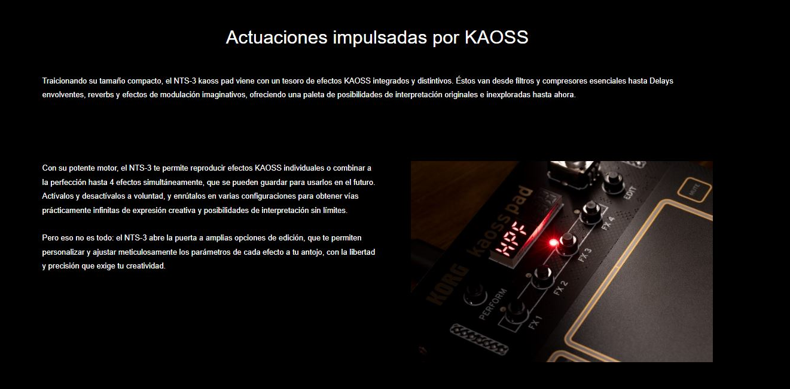
 
 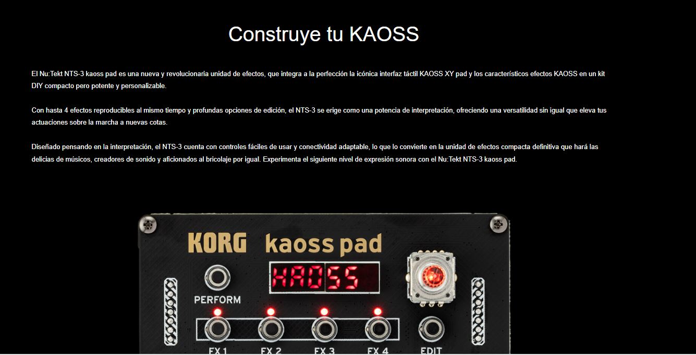

 - lo que rescato de este referente es el profesionalismo del lenguaje con el que se refiere al producto que nos está ofreciendo, por ejemplo en la figura 2 dice "es una nueva y revolucionaria unidad de efectos" "la unidad de efectos compacta definitiva" me encanta esta idea de "la máquina perfecta", siento que lo hace muy sólido en su presentación. Me gusta que tenga esa exageración de lo bueno que es o que tenga una especie de aires de grandeza al hablar de su producto, sé que el producto es muy bueno de por sí pero la descripción también lo acompaña mucho y lo hace más "poderoso" por así decirlo. Creo que el describir lo que uno hace como lo mejor que hay y creerse el cuento de esta forma, ayuda muchísimo al momento de desarrollar un proyecto, considero que al crear algo debemos ser los primeros en enaltecerlo, no se trata de ser soberbios, se trata de valorar el trabajo que hacemos, es por ello que elijo este referente de lenguaje.

- fuente: [korg](https://www.korg.com/cl/products/dj/nts_3/index.php)

- **segundo referente de lenguaje: oskitone**

- ejemplo del lenguaje que utiliza con una traducción directa del blog: [blogtommy](https://blog.tommy.sh/posts/scout/)

 - El Scout es:

 -Amigable para principiantes: todos los componentes son de orificio pasante (no de montaje superficial), lo que facilita el soldado. El ensamblaje completo toma unos 45 minutos. Es autónomo, funciona con batería, y no necesita una computadora ni parlantes externos para funcionar. ¡Divertido!

 -Imprimible en 3D: aparte de la electrónica y tornillos, todas las partes se imprimen en 3D. Con un ancho total de ~160 mm (unos 6,3"), el Scout cabe en camas de impresión “Mini” comunes de 18×18×18 cm.

- Hackeable: compatible con Arduino y totalmente de código abierto. Puedes conectar un cable FTDI Serial TTL-232 (se vende por separado) y actualizar su código usando el IDE de Arduino.

- Con características mínimas: 1,5 octavas de teclas, una perilla de volumen, interruptor de encendido/apagado, parlante y salida para audífonos. Onda cuadrada monofónica con glide fijo y control de octava.

- Además de ser el primer instrumento controlado por microcontrolador de Oskitone, el Scout también puede servir como un buen instrumento de introducción para aficionados de la electrónica (aunque se recomienda tener algo de experiencia con soldadura y un conocimiento básico de electricidad).

- lo que destaco del tipo de lenguaje que emplea Oskitone para describir y/o documentar el proceso de ensamblaje del producto poly555 es la forma técnica en la que explica las cosas pero sin llegar a parecer extremedamente complejo. Creo que maneja muy bien el concepto de DIY (do it yourself) en el ámbito del lenguaje porque explica cosas difíciles pero las hace parecer fáciles por el lenguaje amigable que usa para describirlas. Pienso que es importante hacer cosas complejas pero es necesario tener la capacidad de poder explicarlas a personas que no conocen mucho del tema de una forma en la que lo puedan entender
 
 - **referentes de documentación**

- **primer referente documentación: oskitone**

- nueavmente vuelvo a elegir a oskitone como un referente pero esta vez de documentación 

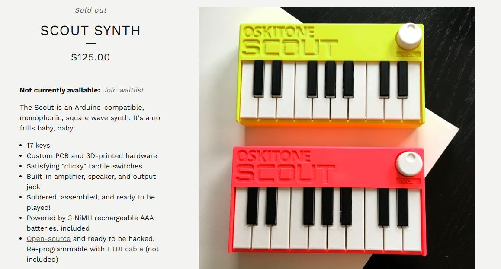

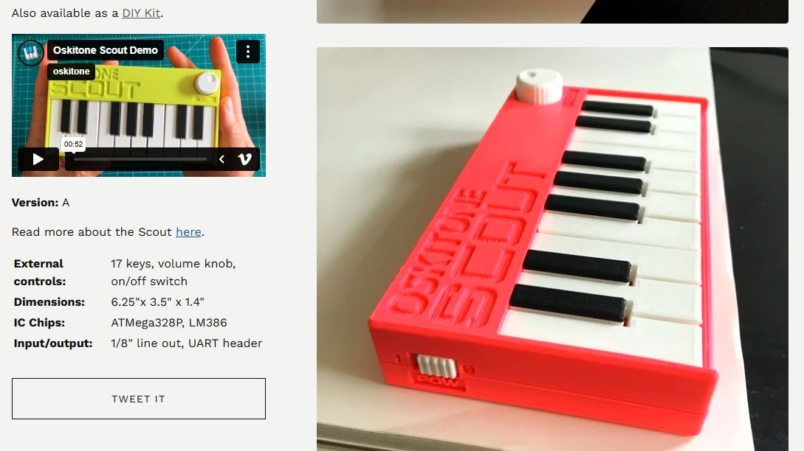

- elegí este referente porque siento que tiene una interfaz amable en el modo de mostrar las cosas, está todo muy bien estructurado y dividido lo cuál hace fácil de entender el producto que nos está mostrando. Además de incluir imágenes y videos en detalle del funcionamiento del instrumento. Me gusta esta parte de la documentación ya que es la sección en la que te vende el producto, por lo cual, tiene lo justo y necesario para llamar la atención del cliente/usuario interesado. También tiene un blog en el que explica explícitamente como está desarrollado el producto con todo su proceso.
 
 [oskitone](https://blog.tommy.sh/posts/scout/)

 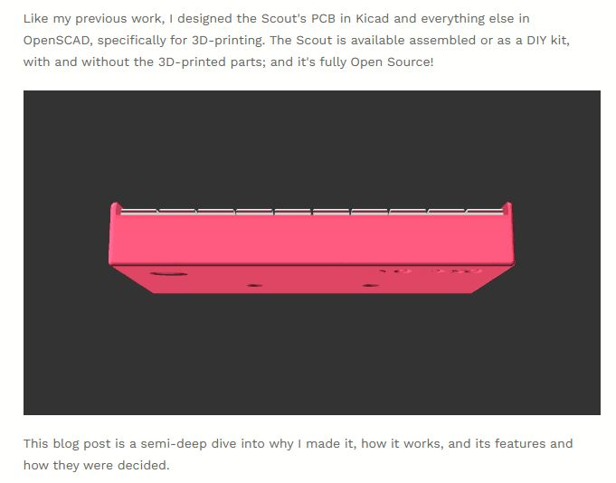

 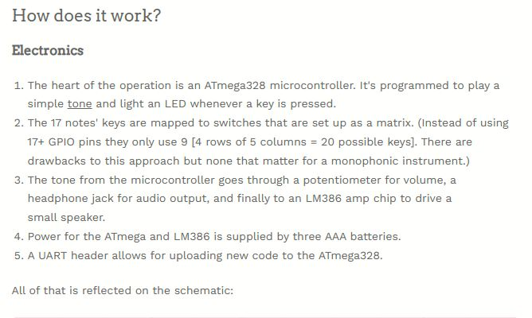

 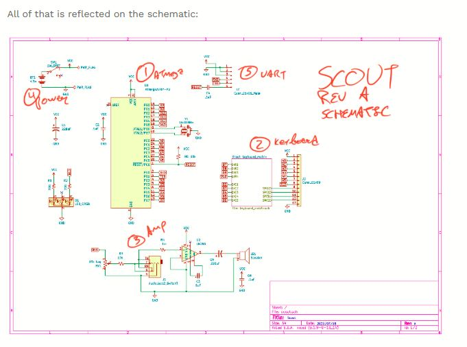

 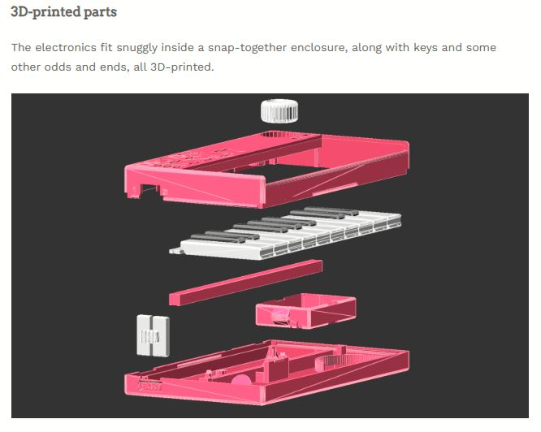

 

 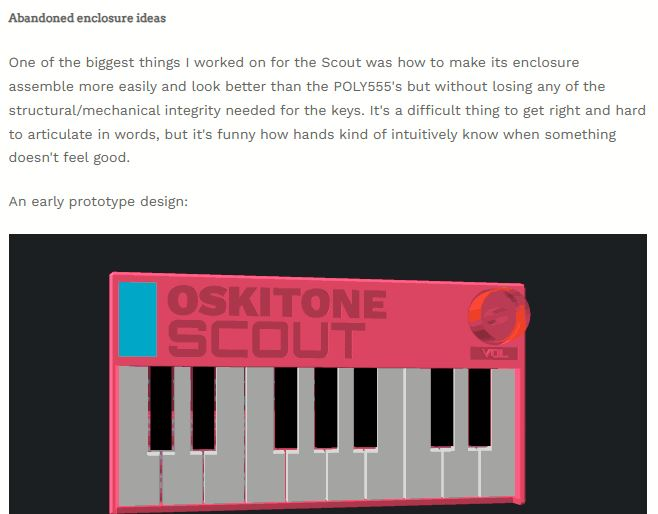

- estas son algunas de las partes de documentación que se nos muestra en el blog, es mucho mas extenso de lo que muestro aquí. Me parece muy bueno que sea tan detallado en la explicación de la realización del producto, me gusta bastante porque muestra los diversos ámbitos en los que se trabaja este producto como lo son la parte electrónica, el concepto, la carcasa/trabajo 3d e interacción con el usuario hasta las ideas fallidas o ideas que se quisieron integrar en un principio. Es una documentación absolutamente completa y siento que cada proyecto debería ser así de detallado porque así nada queda al aire o no explicado, entonces el usuario puede comprender a fondo el producto en el que está interesado, incluso puede aprender y/o inspirarse del trabajo de uno, siendo utilizado como un referente de estudio también

- un aspecto negativo de este referente es que en el blog no hay ninguna especie de "búsqueda rápida" o navegación por tópico para hacer click y que nos transporte inmediatamente a esa área, sino que la única forma de interacción que tiene la página es un scroll hacia abajo, me gustaría que fuera más completa la navegación de la página

- **segundo referente de documentación: Mizuna Ai companion, Hackster**

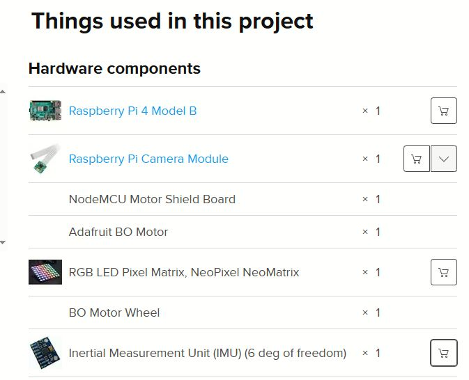

- elegí este referente principalmente por la organización que tiene para mostrar el contenido. Considero que el tener una ventana que te muestre una especie de índice con todos los ámbitos/categorías que son parte del proyecto y puedas indagar libremente en la que necesites. Otro punto que destaco y que considero importante para un proyecto es que incluye una "story" o un motivo, idea, de la cuál sale la creación del objeto como el punto de partida por el cuál se creó. También destaco que incluya una lista de todos los materiales necesarios para llevar a cabo el proyecto incluyendo el sitio web donde puedes comprarlo (en este caso amazon). Algo malo sobre este úlitmo punto es que quizá hay opciones más baratas que amazon para comprar estos componentes por lo cuál en nuestro caso colocaría diversas opciones de compra como parte de la documentación para ayudar a la persona que esté viendo el proyecto

- **referentes de materialidad**

- **primer referente de materialidad: Maywa Denki, Mr Knocky**

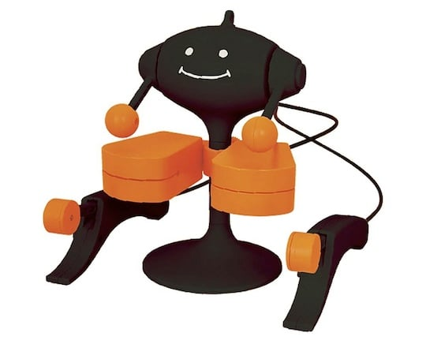

- El Sr. Knocky es un personaje de batería con dos mini tambores (cada uno suena diferente) y controladores “pachi” (clic). No se requieren baterías, pero sí necesitas algo de habilidad para tocar al Sr. Knocky correctamente. Agita los dos controladores y harán que el Sr. Knocky golpee los tambores. La forma en que agitas los controladores afecta el estilo y el sonido de la percusión, por lo que necesitas tener un control ágil y cuidadoso de tus manos y muñecas para tocar bien.Puedes colocar una correa o cordón al Sr. Knocky

fuente info: [japantrendshop](https://www.japantrendshop.com/ES-mr-knocky-musical-toy-by-maywa-denki-p-2555.html)

- elegí este referente por el concepto de "instrumento juguete" que emplea Maywa Denki en sus productos. Me gusta la idea de algo "poco serio" o más "amigable" a la vista, creo que puede ir muy de la mano con nuestro proyecto ya que estamos empleando el concepto de humor o absurdo para nuestra máquina y no se trata de algo serio. Rescato las formas que poseen estos juguetes, curvas suaves y la creación de un personaje como tal, en este caso Mr Knocky. Desconozco el material específico con el que fue hecho, no aparece como tal, pregunté a la IA (chatgpt) y el armazón externo está hecho de acrilonitrilo butadieno estireno que es un tipo de termoplástico, además posee un mecanismo de cables de alambre que mueven los brazos para que mr knocky golpee los tambores. Más allá del material hecho (que siento es un proceso que escapa a lo que podemos hacer) rescato la forma y concepto de personaje del referente, por eso lo elegí

- **segundo referente de materialidad: Oskitone**

- vuelvo a repetir a Oskitone pero esta vez en el ámbito de la materialidad

- Oskitone Poly555

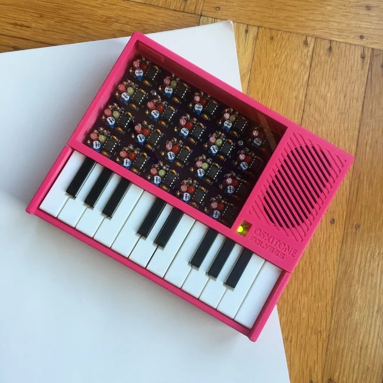

- Oskitone Scout

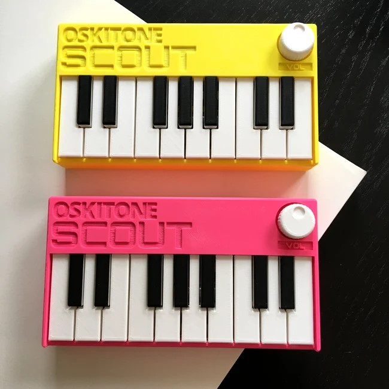

- Oskitone APC

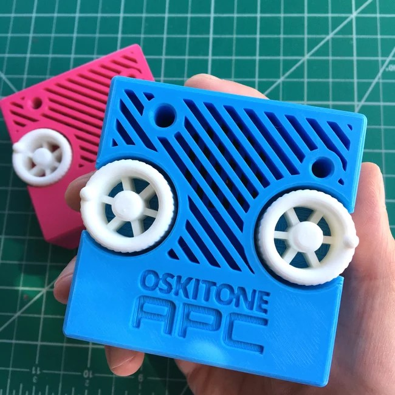

- en este caso seleccioné 3 objetos de Oskitone, 2 de ellos son sintetizadores (Poly555 y Scout) y el otro es una Atari Punk Console. Para estos 3 objetos utiliza impresión 3d incluso para sus tuercas y tornillos, dentro de estas carcasas se encuentran las placas de una forma perfectamente encajada. Elegí este referente porque utiliza muy bien los materiales y el acabado, es bastante minimalista y aprovecha muy bien los espacios, nada se ve sobrepuesto o sobrante. Rescato muchísimo que en el Poly555 posea una lámina que permite ver el funcionamiento de la placa (se prenden leds cuando apretamos los botones), siento que esto hace mucho más cercano al usuario con la manera en la que funciona el objeto, ya que, no solo apretas botones si no que ves el cómo están compuestos los circuitos y te da una idea de cómo funciona por dentro. Es interesante la idea de mostrar el objeto por dentro pero sin perder la calidad de la factura o o que se vea "desordenado" por así decirlo

